# 七、高级事件处理

你会去一个网站执行多少次动作？它可能是网上银行，或者从亚马逊购买东西；在这两种情况下，站点都会检测到正在发生的操作，并做出相应的响应。

使用 jQuery 的一部分是知道如何以及何时响应不同类型的事件。在大多数情况下，人们可能会使用`.on()`或`.off()`事件处理程序来处理它们。虽然这工作得很好，但它只是触及了事件处理的表面。在本章中，我们将了解一些在事件处理方面可以用来扩展技能的提示和技巧。我们将讨论以下主题：

*   委派活动
*   使用`$.proxy`功能
*   创建和分离自定义事件类型
*   命名空间事件

感兴趣的那我们继续吧！

# 引入事件处理

一个问题——你多久上网执行一次任务？我敢打赌，这是公平的一周几次；它可以是任何东西，从网上银行到点击亚马逊获取最新的 DVD（我想知道 DVD 是谁下载的？）

除此之外，我们无法避免点击链接或按钮来推进流程。在大多数情况下，事件背后的代码可能是无处不在的点击处理程序，甚至可能是`.change()`或`.hover()`。所有这些都是`.on()`（甚至`.off()`）事件处理程序的简写形式，当然其功能等同于以下内容：

```js
$('a').on('click', function(){
  $(this).css('background-color','#f00');
});
```

这将使选定的元素变成漂亮的红色。然而，事件处理不仅仅是在已知元素上定义操作。在接下来的几页中，我们将（引用一个航海术语）推出这艘船，并看看我们可以使用的一些技巧和窍门，以帮助进一步发展我们的技能。我们先来看看事件委托。

# 授权活动

有人曾经说过成为一名优秀管理者的艺术在于知道何时授权。我希望这不是他们把一份糟糕的工作推给下属的借口，尽管愤世嫉俗者可能会说不是这样！

撇开风险不谈，委托遵循 jQuery 中相同的原则。如果我们需要创建一个应用程序，它需要将某种形式的事件处理程序绑定到同一类型的许多元素，那么我们可以考虑编写事件处理程序来覆盖每个元素。

这在一定程度上是可行的，但非常浪费资源。如果列表很大，则事件将绑定到其中的所有元素，这将使用比所需更多的内存。我们可以通过使用**事件委托**来解决这个问题，我们可以将一个事件处理程序绑定到为多个后代服务的单个祖先元素，或者为新创建的元素启用事件处理。

我们可以使用一些技巧来帮助我们更好地使用委派管理事件。在我们了解它们之前，让我们快速回顾一下事件委派工作原理的基础知识。

## 重温活动委派的基础知识

一个问题——在 jQuery 中编写事件处理程序时，您使用`.on()`甚至`.off()`的频率有多高？我敢打赌答案可能是无数次。如果您以前没有使用过事件委派，那么您已经在不知不觉中使用了一半！

事件委派依赖于**事件传播**的使用，或者有时已知的事件冒泡。这是理解授权如何工作的关键。让我们来看一个简单的例子。

假设我们使用以下 HTML 代码作为列表的基础：

```js
<div id="container">
  <ul id="list">
    <li><a href="http://domain1.com">Item #1</a></li>
    <li><a href="/local/path/1">Item #2</a></li>
    <li><a href="/local/path/2">Item #3</a></li>
    <li><a href="http://domain4.com">Item #4</a></li>
  </ul>
</div>
```

这里没有什么不像话的——这只是一个简单的例子。每当我们的一个锚定标记被单击时，就会为该锚定触发一个单击事件。事件分为三个阶段之一进行调度：**捕获**、**目标**和**冒泡**。

它将被捕获到文档根目录下，向下移动直到到达目标目录（标记为`li`），然后返回到文档根目录下，如下所示：

*   文档根
*   `<html>`
*   `<body>`
*   `<div #container>`
*   `<ul #list>`
*   `<li>`
*   `<a>`

哎呀！这意味着每次我们点击一个链接时，我们实际上是在点击整个文档！不太好！这在资源上非常昂贵，即使我们使用以下代码添加其他列表项：

```js
$("#list").append("<li><a href='http://newdomain.com'>Item #5</a></li>");
```

我们会发现前面提到的点击处理程序无法处理这些项目。

### 提示

这里使用的冒泡示例有些简化，并没有显示所有不同的阶段。要进行有用的讨论，请转到[上堆栈溢出上的评论 http://stackoverflow.com/questions/4616694/what-is-event-bubbling-and-capturing](http://stackoverflow.com/questions/4616694/what-is-event-bubbling-and-capturing) 。

### 修改我们的代码

我们不需要添加直接绑定的处理程序，而是可以利用事件传播，重新编写处理程序以侦听**后代**锚，而不是只绑定到现有的锚标记。这可以在以下代码中看到：

```js
$("#list").on("click", "a", function(event) {
  event.preventDefault();
  console.log($(this).text());
});
```

代码中唯一的区别是我们已经将`a`选择器移动到`.on()`方法的第二个参数位置。这将针对`#list`创建一个事件处理程序，事件从`a`上升到`#list`一级。事件委托消除了创建多个事件处理程序的需要，这是一种浪费-该代码将与`#list`中的现有锚定标记以及将来添加的任何锚定标记同等有效。

### 提示

如果您想了解更多关于事件委派的信息，那么值得查看 jQueryAPI 文档，位于[http://learn.jquery.com/events/event-delegation/](http://learn.jquery.com/events/event-delegation/) 。jQuery 文档中还有一个有用的章节，介绍如何在[的委托事件中使用`.on()`http://api.jquery.com/on/](http://api.jquery.com/on/) 。

### 支持较旧的浏览器

一个小问题——如果您需要重新编写旧代码，那么您可能会将`.bind()`、`.live()`或`.delegate()`视为事件处理程序。在 jQuery1.7 之前，它们都被用来委派事件，但现在应该被`.on()`所取代。事实上，第一个`.bind`是一个调用`.on`（及其合作伙伴`.off()`）的单行函数：

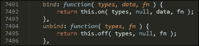

同样适用于`.delegate()`及其伙伴事件处理程序`.undelegate()`：

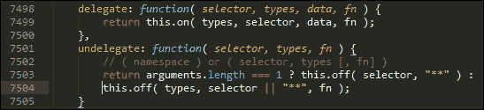

需要注意的是，`.on()`模仿了使用`.bind()`或`.delegate()`时发现的行为。前者非常需要资源，因为它连接到它能匹配的每一个元素；后者仍然需要确定要调用哪个事件处理程序。然而，与使用`.bind()`方法相比，该方法的适用范围应更小。

现在，我们已经深入研究了`.on()`的内部工作原理，让我们将其付诸实践，并创建一个简单的演示来提醒我们在 jQuery 中委托是如何工作的。

## 探索一个简单的演示

现在是采取一些行动的时候了，所以让我们从开始，在使用 jQuery 时快速提醒一下事件委派是如何工作的：

1.  让我们从本书附带的代码下载中提取所需的文件开始。对于这个演示，我们需要`simpledelegation.html`、`simpledelegation.css`和`jquery-ui.min.css`文件。
2.  将 CSS 文件保存在我们项目区域的`css`子文件夹中。HTML 标记需要存储在项目文件夹的根区域中。
3.  在新文件中，添加以下代码将文件另存为`simpledelegation.js`，并将其存储在我们项目区域的`js`子文件夹中：

    ```js
    $(document).ready(function(event){
      var removeParent = function(event) {
        $('#list').parent('li').remove();
      }

      var removelistItem = function(event) {
        $(event.target).parent().remove();
      }

      $('li.ui-widget-content').children().on("click", removeParent);

      $('ul').on("click", "li", removelistItem);
    });
    ```

4.  If all is well, we should see the following list of items, when previewing the results in a browser:

    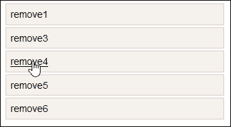

5.  尝试单击多个链接–如果您单击任何删除链接，则列表项将被删除；单击其中一个列表项目将从列表中删除所有项目。

本演示的关键在于以下一行：

```js
$('ul').on("click", "li", removelistItem);
```

虽然列表中有多个项目，但我们创建了一个委托事件处理程序。它冒泡到我们单击的`<li>`项的父项，然后将其删除。在本例中，我们已经分离出触发事件时调用的函数；这可以很容易地合并到处理程序中。

现在，我们已经重新讨论了事件委托的基本知识，让我们来看看为什么事件委托可以导致性能提高，当与许多相似的元素一起工作时。

## 探索使用事件委托的含义

实现委托事件而不是直接等价物的关键好处是，如果代码中存在多个事件处理程序，则可以减少内存使用并避免内存泄漏。通常，我们需要为每个需要发生事件的实例实现一个事件处理程序。

### 注

使用事件委派的真正影响是节省内存使用量，这是从内部数据结构中存储事件处理程序定义的位置获得的。

相反，减少事件处理程序的数量意味着我们可以减少内存泄漏并提高性能（通过减少必须解析的代码量）。只要我们对绑定事件处理程序的位置保持谨慎，就有可能显著降低对 DOM 的影响以及由此产生的内存使用，特别是在大型应用程序中。好处是，如果已经实现了事件委派，它将同样应用于已定义的现有元素以及尚未创建的元素。直接应用的事件处理程序将无法工作；它们只能应用于在代码中调用事件处理程序之前已经存在的元素。

处理现有事件和尚未发生的事件的能力听起来是件好事。毕竟，如果一个事件处理程序可以处理多个事件，为什么要重复我们自己呢？绝对是——只要我们小心管理！如果我们在一个特定的元素上触发一个事件，例如一个锚标记，那么这将被允许首先处理该事件。事件将冒泡，直到达到文档级别，或者较低的事件处理程序决定停止事件传播。最后一部分是关键——如果没有控制，我们可能会得到意想不到的结果，事件处理程序已经响应，或者没有触发，这与预期相反。

### 提示

要了解可能发生的情况的详细解释，请查看[http://css-tricks.com/capturing-all-events/](http://css-tricks.com/capturing-all-events/) 。它包含指向 CodePen 上的示例的链接，这些示例很好地说明了这个问题。

为了帮助减少事件冒泡导致事件处理程序意外触发的影响，我们使用了`event.stopPropagation()`等方法。这不是我们可以使用的唯一诀窍，所以让我们花些时间来探索一些使用事件委托时可用的选项。

## 控制委托

利用事件冒泡增加了减少我们需要在代码中实现的事件处理程序数量的范围；缺点是意外行为的实例，事件处理程序可能无法在所需的点触发。

为了控制哪些元素可能触发委托事件处理程序，我们可以使用以下两种技巧之一：`event.stopPropagation()`，或者捕获事件目标并确定它是否匹配给定的一组条件（例如特定类或`data-`名称）。

让我们先来看看这个第二个选项——一个示例代码块看起来如下：

```js
$("ul.my-list").click(function(event) {
  if ( $( event.target).hasClass("my-item") ) {
    handleListItemAction(event.target);
  }
else if ( $( event.target).hasClass("my-button") ) {
    handleButtonClickedAction(evt.target);
  }
});
```

这是一种笨拙的做事方式！相反，我们可以使用委托事件处理程序的变体，简单地对类名进行检查，如下所示：

```js
$("ul.my-list").on("click",".my-item", function(evt) {
  //do stuff
});
```

这是一个非常简单的技巧，我们可以使用-它是如此简单，它可能不算作一个技巧，因此！要了解进行更改有多容易，现在让我们运行一个快速演示：

1.  从代码下载中，我们需要提取`propagation-css.html`和`propagation.html`文件。这些包含了一些简单的标记和基本列表的样式。将 CSS 文件保存在项目区域的`css`子文件夹中，并将 HTML 标记保存在同一区域的根目录下。
2.  接下来，我们需要创建在条件匹配时触发的事件处理程序。继续并将以下内容添加到新文件中，并将其保存为我们项目区域的`js`子文件夹中的`propagation-css.js`：

    ```js
        $(document).ready(function() {
          $('#list').on('click', '.yes', function eventHandler(e) {
            console.log(e.target);
          });
        });
    ```

此时，如果我们在浏览器中预览结果，我们将得到一个简单的列表，如果我们将鼠标悬停在特定的项目上，列表项将变暗。这并没有什么特别之处——它只是借用了 jQueryUI 的一些样式。

但是，如果我们启动一个 DOM 检查器，例如 Firebug，然后将鼠标悬停在每个项目上，我们可以看到，每当我们将鼠标悬停在一个类为`.yes`的项目上时，都会添加控制台输出：

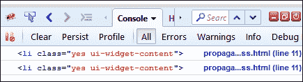

因此，我们没有像*探索一个简单的演示*时那样提供选择器，而是使用了一个类名；事件处理程序函数只有在与指定的类名匹配时才会激发。

### 提示

我们甚至可以使用`data-`标签作为我们的支票：

```js
$(document).on('keypress', '[data-validation="email"]', function(e) {
  console.log('Keypress detected inside the element');
})
```

### 使用 stopPropagation（）方法作为替代方法

作为替代方案，我们可以使用`stopPropagation()`形式的全 jQuery 解决方案。这可以防止事件在 DOM 树中冒泡，并阻止任何父处理程序收到事件通知。

这一行程序很容易实现，尽管使用它的关键是确保在代码中的正确位置添加它。如果您以前没有使用过它，那么它需要进入事件处理程序中，紧跟在处理程序中的最后一个命令之后（如以下代码段中突出显示的）：

```js
document.ready(function ($) {
  $('div'). on("click", function (event) {
    console.log('You clicked the outer div');
  });
  $('span').on("click", function (event) {
    console.log('You clicked a span inside of a div element');
    event.stopPropagation();
  });
})
```

作为快速检查，请尝试从本书附带的代码下载中提取和文件。将它们保存在项目区域内的相关文件夹中。如果我们在浏览器中预览它们，我们将看到一个简单的**跨度**包含在**div**中。请参阅下图：

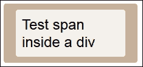

此演示的关键在于 DOM 检查器。尝试单击灰棕色外圈或其内的跨距，我们将在控制台日志中看到所选内容的结果，如下所示：

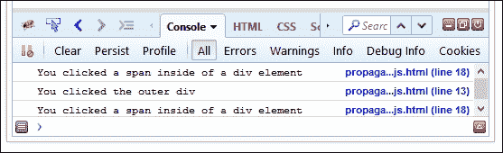

如果您注释掉代码中的`event.stopPropagation()`行，也将调用附于`div`的 click 事件。

### 提示

除非必要，否则不应停止事件传播。[上有一篇有用的文章 https://css-tricks.com/dangers-stopping-event-propagation/](https://css-tricks.com/dangers-stopping-event-propagation/) 讨论了传播停止时可能遇到的问题。

好的，让我们改变焦点并切换到事件处理中的另一个关键概念。现在是时候来看看如何使用`$.proxy`函数了，如果事件委派不能充分满足我们的需要，那么为什么需要这样做。

# 使用$.proxy 函数

到目前为止，我们已经介绍了如何利用事件冒泡来帮助我们减少对大量事件处理程序的需求；如果我们小心地管理冒泡，那么在使用 jQuery 开发时，委托可以证明是非常有用的工具。

另一方面，在某些情况下，我们可能需要帮助 jQuery；当它没有足够高的传播链上！起初，这可能没有意义，所以让我解释一下我的意思。

为了便于讨论，让我们假设我们有一个事件处理程序，它被创建为一个对象，并且我们希望在单击链接时调用它：

```js
var evntHandlers = {
  myName : 'Homer Simpson',

  clickHandler : function(){
    console.log('Hello, ' + this.myName);
  }
};

$("a").on('click',evntHandlers.clickHandler);
```

如果我们在浏览器中运行，您希望在控制台日志区域中看到什么？

### 提示

要找到答案，请尝试从本书附带的代码下载中提取`proxy-before.html`文件。确保已安装 DOM 检查器！

如果你希望看到**你好，荷马·辛普森**，那么我将不得不让你失望；答案不是您所期望的，而是**你好，未定义**，如下图所示：

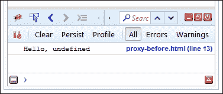

好吧，那又有什么好处呢？

原因是所使用的上下文在`clickHandler`事件中，而不是`evntHandler`对象中；我们在`clickHandler`事件中没有`myName`属性。

谢天谢地，有一个简单的修复方法。我们可以使用`$.proxy`强制改变上下文，如下所示：

```js
var evntHandlers = {
  myName : 'Homer Simpson',
  clickHandler : function(){
    console.log('Hello, ' + this.myName);
  }
};

$("a").on('click',$.proxy(evntHandlers.clickHandler,evntHandlers));
```

要查看此操作，请从本书附带的代码下载中提取`proxy-before.html`和`proxy-after.html`文件。如果在浏览器中运行它们，将看到与以下屏幕截图所示相同的结果：

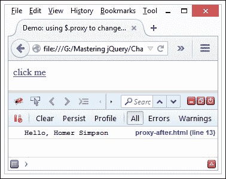

这是一个简单的改变，但它打开了各种各样的可能性。这是一种为闭包设置上下文的速记方法。我们当然可以使用普通的 JavaScript`.bind()`方法。相反，使用`$.proxy`可以确保传入的函数实际上是一个函数，并向该函数传递唯一的 ID。如果我们将名称空间添加到事件中，我们可以确保取消绑定正确的事件。`$.proxy`函数在 jQuery 中被视为一个函数，即使它用于绑定不同的事件。使用名称空间而不是特定的代理函数将避免在代码中解除绑定错误的处理程序。

### 注

如果您想了解更多关于使用`$.proxy`的信息，那么值得阅读 jQuery 主站点上的文档，该站点位于[http://api.jquery.com/jquery.proxy/](http://api.jquery.com/jquery.proxy/) 。

为了给我们一个可能的真正的味道，考虑一下这一点：你到底有多少次将函数嵌套到三到四个深层？考虑下面的代码：

```js
MyClass = function () {
  this.setupEvents = function () {
    $('a').click(function (event) {
      console.log($(event.target));
    });
  }
}
```

我们可以通过使用`$.proxy`对上述代码进行重构以增加可读性，而不是使用，如下所示：

```js
MyClass = function () {
  this.setupEvents = function () {
    $('a').click( $.proxy(this, 'clickFunction'));
  }

  this.clickFunction = function (event) {
    console.log($(event.target));
  }
}
```

我想你会同意这更容易阅读，对吧？

好吧，让我们继续。我相信我们都熟悉在 jQuery 中创建事件处理程序。但是，您可能正在使用标准事件处理程序。这些都会很好地发挥作用，但我们所能做的仍然有限。

好吧，让我们改变一下。使用 jQuery，我们可以创建自定义事件，打破我们所熟悉的可能模式，并允许我们创建各种事件处理程序。让我们来看看我们如何在行动中做到这一点。

# 创建和分离自定义事件类型

如果您花了时间开发 jQuery，那么我相信您对我们可以使用的标准事件类型非常熟悉，比如`.click()`、`.hover(),`或`.change()`。

这些都是有用的，但都有一个共同点——我们对它们的使用能力有点有限！我们的代码将由这些处理程序的功能范围决定。如果我们可以打破这个限制，创建任何类型的自定义事件处理程序，会怎么样？

当然，我们总是可以将多个事件组合在一起，由相同的功能提供服务：

```js
$('input[type="text"]').on('focus blur', function() {
  console.log( 'The user focused or blurred the input' );
});
```

但这仍然局限于那些现成的事件处理程序。我们需要的是打破模式，在设计我们自己的处理器时发挥创意。

没问题——我们可以使用 jQuery 的特殊事件功能来构建几乎任何类型的事件，以满足我们的需要。这打开了一个现实世界的可能性，这可能需要一本书本身的权利。在接下来的几页中，我们将介绍一些概念，以帮助您开始创建事件的正确途径。

### 提示

要更深入地了解如何创建自定义事件，请访问[学习 jQuery 网站上的一篇有用的文章 http://learn.jquery.com/events/introduction-to-custom-events/](http://learn.jquery.com/events/introduction-to-custom-events/) 。

事件的好处在于，它们的行为就像它们的标准表亲，包括冒泡 DOM：

```js
$('p').bind('turnGreen', function() { 
  $(this).css('color', '#00ff00');
});

$('p:first').trigger('turnGreen');
```

那么，一个特别活动的组成是什么呢？特殊事件通常以插件的形式出现；格式可能类似，但我们经常会看到几个**fixHooks**中的任何一个，我们使用它们来控制 jQuery 中的事件处理行为。

### 注

jQuery 特殊事件挂钩是一组每个事件名称的函数和属性，允许代码控制 jQuery 中事件处理的行为。

让我们花一点时间看看一个特殊事件插件的典型组成，然后再跳进这样一个插件的例子。

## 创建自定义事件

fixHooks 接口提供了一个用于规范化或扩展事件对象的路径，该对象将覆盖本机浏览器事件。我们通常会在事件插件中看到以下格式：

```js
jQuery.event.special.myevent = {
  noBubble: false;
  bindType: "otherEventType",
  delegateType: "otherEventType",
  handle: function ($event, data { 
    // code
  },
  setup: function( data, namespaces, eventHandle ) {
    // code
  },
  teardown: function( namespaces ) {
    // code
  },
  add: function( handleObj ) {
    // code
  },
  remove: function( handleObj ) {
    // code
  },
  _default: function( event ) {
    // code
  }
};
```

值得注意的是，在创建特殊事件类型时，我们将经常使用两种方法-`.on()`用于绑定事件，以及`.trigger()`用于在需要时手动触发特定事件。此外，一个特殊的事件插件将公开一些有用的关键方法。让我们探讨一下：

<colgroup><col> <col></colgroup> 
| 

方法/属性的名称

 | 

意图

 |
| --- | --- |
| `noBubble: false` | 默认情况下，布尔值设置为`false`。指示如果发生以下情况，是否应对此事件类型应用冒泡。`trigger()`方法被调用。 |
| `bindType` | 定义时，这些字符串属性指定在传递事件之前，应像处理其他事件类型一样处理特殊事件。直接附加的事件使用`bindType`，已委派的事件使用`delegateType`。在这两种情况下，这些都应该是标准的 DOM 类型，例如`.click()`。 |
| `handle: function(event: jQuery.Event, data: Object)` | 当事件发生时调用句柄钩子，jQuery 通常会调用`.on()`或其他事件绑定方法指定的用户事件处理程序。 |
| `setup: function(data: Object, namespaces, eventHandle: function)` | 第一次将特定类型的事件附加到元素时调用。这为钩子提供了一个执行处理的机会，该处理将应用于此元素上的所有此类事件。 |
| `teardown: function()` | 从元素中删除特定类型的最终事件时调用。 |
| `add: function(handleObj)``remove: function(handleObj)` | 当事件处理程序通过 API（如`.on()`）添加到元素时调用，或在使用`.off()`时删除时调用。 |
| `_default: function(event: jQuery.Event, data: Object)` | 当使用`.trigger()`或`.triggerHandler()`方法从代码中触发特殊类型的事件时调用，而不是从浏览器中发起的事件。 |

了解这些方法是值得的，特别是如果您在开发中使用 jQuery Mobile。移动设备依赖于特殊事件，产生诸如`tap`、`scrollstart`、`scrollstop`、`swipe`或`orientationchange`等事件。

### 提示

有关每种方法的更多详细信息，请参阅 Ben Alman 的《要点》，可在[上找到 https://gist.github.com/cowboy/4674426](https://gist.github.com/cowboy/4674426) 。

特殊事件需要更深层次的知识，如果您使用它们来覆盖事件的标准行为，如单击或鼠标悬停。为了了解更多的内部工作，值得阅读 jQuery 学习网站上的文章[http://learn.jquery.com/events/event-extensions/](http://learn.jquery.com/events/event-extensions/) 。不过请注意，这将变得相当复杂！

现在，我们已经看到了一个特殊事件插件的一些内部工作，现在是时候深入了解并了解一些实际情况了。为此，我们将使用 James Greene 制作的 jQuery Multiclick 插件来展示捕获一个动作（如三次单击）并使用它执行一个动作是多么容易。

## 使用 Multiclick 事件插件

创建自定义事件可以是简单的，也可以是复杂的。对于这个演示，我们将使用 James Greene 的 jQuery Multiclick 事件插件。插件可从[获得 http://jamesmgreene.github.io/jquery.multiclick/](http://jamesmgreene.github.io/jquery.multiclick/) 。我们将使用它在屏幕上发布一些消息，每点击三次消息就会发生变化。请参阅下图：

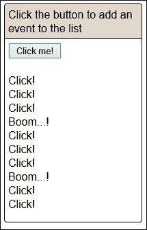

让我们来看看所涉及的内容：

1.  让我们先从本书附带的代码下载中提取以下文件。对于这个演示，我们需要`jquery.multiclick.js`、`jquery.min.js`、`multiclick.css`和`multiclick.html`文件。将每个文件存储在项目区域内的相关子文件夹中。
2.  在新文件中，添加以下代码，保存为`multiclick.js`：

    ```js
    $(document).ready(function() {
      var addText = "Click!<br>";
      var addBoom = "Boom...!<br>";

      $("button").on("click", function($event) {
        $("p").append(addText);
      });

      $("button").on("multiclick", { clicks: 3 }, function($event) {
        $("p").append(addBoom);
      });
    });
    ```

3.  这是配置 multiclick 插件以及在单击鼠标时触发相应响应所必需的。
4.  尝试在浏览器中运行演示。如果一切顺利，单击**单击我之后，我们应该会看到类似于练习开始时显示的屏幕截图！**按钮几次。

虽然可能不得不说，这并不完全代表真实世界的示例，但所涉及的技术是相同的。该插件绑定到标准的点击处理程序，如果达到的点击次数是该插件的配置选项中所述值的倍数，则将触发该插件。

# 名称空间事件

到目前为止，我们已经了解了如何委托事件并创建可以接受自定义触发器的处理程序。如果我们有一个单击事件处理程序，这些方法是完美的，但是如果我们需要多个单击处理程序，例如，会发生什么呢？

幸运的是，有一个简单的解决方案：向事件添加名称空间！与其谈论它是如何工作的，让我们来看看下面的例子：

```js
$("#element")
  .on("click", doSomething)
  .on("click", doSomethingElse);
```

这段代码是完全可以接受的——这一点都没有错。当然，它可能不像某些人希望的那样可读，但我们并不担心这一点——至少现在不担心！

这里的关键点是，如果我们要求：

```js
$("#element").off("click");
```

然后，我们不仅会丢失第一个单击处理程序，还会丢失第二个。这并不理想。我们可以通过向命令添加名称空间或标识符来解决此问题，如下所示：

```js
$("#element")
  .on("click.firsthandler", doSomething)
  .on("click.secondhandler", doSomethingElse);
```

如果我们现在运行相同的`.off`命令，那么显然两个事件处理程序都不会被删除。但是–假设我们做了以下更改：

```js
$("#element").off("click.firsthandler");
```

现在我们可以安全地删除第一个事件处理程序，而无需删除第二个。

### 注

如果我们编写了`$("#element").off(".firsthandler")`，那么它将删除所有分配了此命名空间的事件处理程序。这在开发插件时非常有用。

了解其工作原理的最佳方法是将其付诸实施。现在我们来看看下面的简单例子：

```js
<!DOCTYPE html>
<html>
<head>
  <meta charset="utf-8">
  <title>Demo: Adding namespaces to jQuery events</title>
  <script src="js/jquery.min.js"></script>
</head>
<body>
  <button>display event.namespace</button>
  <p></p>
  <script>
    $("p").on("test.something", function (event) {
      $("p").append("The event namespace used was: <b>" +
event.namespace + "</b>");
    });
    $("button").click(function(event) {
      $("p").trigger("test.something");
    });
  </script>
</body>
</html>
```

### 注

本演示的代码可以在本书附带的代码下载中找到，作为`namespacing.html`文件。为了运行演示，您需要提取它和 jQuery 的副本。

在这里，我们分配了两个调整大小的函数。然后，我们使用名称空间删除第二个名称空间，这将使第一个名称空间完全保持不变，如下图所示：

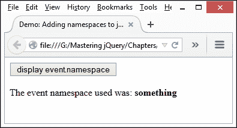

如果我们使用 DOM 检查器检查代码，我们可以清楚地看到所分配的名称空间；为此，在第 12 行设置断点，然后展开右侧的列表，如下图所示：

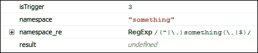

起初，这似乎是一个非常简单的改变，但我非常相信“吻——你懂的！”！

### 提示

使用的名称空间的深度或数量没有限制；例如，`resize.layout.headerFooterContent`。命名空间同样可以与标准事件或自定义事件处理程序一起使用。

添加名称空间标识符是一个非常简单快捷的修复方法，可以应用于任何事件处理程序。它为我们提供了对任何事件处理程序的完美控制，特别是在代码中将函数分配给同一事件类型的多个实例时。

### 注

如果您经常创建复杂的事件处理程序，那么不妨看看 Mark Dalgleish 的 Eventralize 库，该库可从[获得 http://markdalgleish.com/projects/eventralize/](http://markdalgleish.com/projects/eventralize/) 。不过请注意，它已经 2-3 年没有任何更新了，但可能值得测试一下，看看它是否有助于整合和简化您的活动。

# 总结

事件处理是任何网站或在线应用程序成功的关键。如果我们做对了，它可以为用户带来迷人的体验；出错可能会导致一些意想不到的结果！在过去的几页中，我们了解了一些有助于发展事件处理技能的概念；让我们花一点时间复习一下我们学过的东西。

我们首先简要介绍了事件处理，然后快速探讨了事件委派作为一种工具，我们可以从代码中使用它中获益。我们首先研究了事件委派的基础知识，然后研究了使用它的含义，并学习了如何在代码中控制它。

接下来我们来看看`$.proxy`，在这里我们看到 jQuery 有时需要一个助手来确保事件在正确的上下文中被触发，如果我们的代码意味着它没有在链的上游传播足够高的位置。

然后，我们将注意力转向创建自定义事件类型和处理程序，然后再探讨如何构造此类事件处理程序。然后，我们使用 jQuery Multiclick 插件作为示例，说明如何创建这些自定义事件处理程序，然后在本章最后介绍如何使用名称空间来确保我们可以在代码中绑定或解除绑定正确的事件处理程序。

在下一章中，我们将看到一些增强网站的视觉方式——我们将看到应用效果和管理结果效果队列如何帮助网站成功或失败。