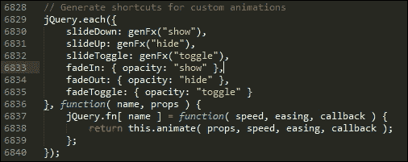
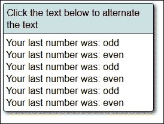
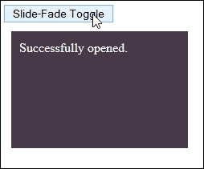
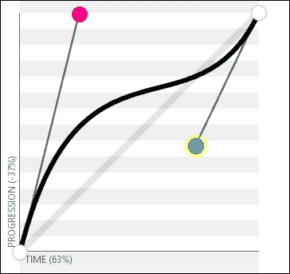
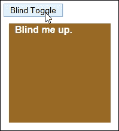
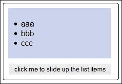

# 八、使用 jQuery 效果

必须向任何网站添加事件处理程序；毕竟，我们需要某种方式来响应代码中的合法事件。

另一方面是增加效果——做得好，效果会非常好，尽管有些新奇感会逐渐消失，特别是如果你已经使用了所有的核心效果，效果会非常好！使用新的自定义效果重新激活您的站点–我们将在本章中了解如何做到这一点，以及如何管理生成的队列。在接下来的几页中，我们将介绍以下主题：

*   重温基本效应
*   添加回调
*   构建自定义效果
*   创建和管理效果队列

感兴趣的让我们开始吧…

# 重访效应

一个问题——你访问过一个网站多少次，看到内容平稳地向上滑动，或者逐渐消失？

我相信您当然会认识到这些是代码中提供的效果；这些可以是任何内容，从一个简单的幻灯片，到内容从一个图像或元素到另一个图像或元素的淡入淡出。

创建效果是任何网站的关键考虑因素。在本书前面的[第 6 章](06.html#aid-1LCVG1 "Chapter 6. Animating in jQuery")*中，我们已经提到了一些方法，使用 jQuery*制作动画。我相信我们都熟悉淡入淡出或切换元素的基本代码。毫无疑问，在开发网站时，您会无数次地使用诸如`$("blockquote").fadeToggle(400);`或`$("div.hidden").show(1250);`之类的代码。

看起来眼熟吗？在接下来的几页中，我们将讨论一些额外的技巧，在添加效果时，我们可以使用这些技巧来帮助完成任务，并考虑使用 jQuery 提供这些效果的一些含义。在我们这样做之前，我们需要澄清一个重要的考虑因素，那就是探索简单动画和向元素添加效果之间的关键区别。

## 探索动画与效果的差异

当我们在[第 6 章](06.html#aid-1LCVG1 "Chapter 6. Animating in jQuery")、*用 jQuery 制作动画*中提到时，你们中的一些人可能会认为已经涵盖了效果的提供。确实存在一些交叉；快速查看 jQuery 效果的 API 列表将显示`.animate()`是一种有效的效果方法。

然而，有一个重要的区别——我们已经介绍的内容是关于*移动*元素；提供效果的重点是控制内容的*可见性*。但最重要的是，我们可以将两者联系在一起。`.animate()`可用于实现代码内的移动和效果。

现在这个小区别已经澄清了，让我们开始行动吧。我们将从为效果添加自定义缓和功能开始。

# 创建自定义效果

如果您花了任何时间将效果应用于动画元素，那么您很可能使用了`.animate()`或快捷方式之一，如`.fadeIn()`、`.show(),`或`.slideUp()`。所有这些都遵循类似的格式，其中我们需要提供至少一个持续时间、放松类型，以及一个回调函数，以便在动画完成时执行任务，或者为此将某些内容记录到控制台。

但是，我们经常会决定坚持使用标准值，例如`slow`、`fast`，或者可能是数值，例如`500`：

```js
$("button").click(function() {
  $("p").slideToggle("slow");
});
```

使用这种方法绝对没有什么错，只是非常无聊，而且只使用了可能的一小部分。

在接下来的几页中，我们将探索一些在应用效果时可以拓宽知识面的技巧，并认识到我们不必总是坚持使用经过验证的方法。在我们探索这些技巧之前，有必要了解一下核心 jQuery 库中如何处理这些效果。

## 探索 animate（）方法作为效果的基础

如果要求您使用预先配置的效果，例如`hide()`或`slideToggle()`，那么您可能希望在 jQuery 中使用命名函数。

### 注

需要注意的是，本节中给出的行号适用于 jQuery 2.1.3 的未压缩版本，该版本可从[获得 http://code.jquery.com/jquery-2.1.3.js](http://code.jquery.com/jquery-2.1.3.js) 。

好吧，这是事实，但只是部分原因：jQuery 中预配置的函数都是指向`animate()`的速记指针，如第**6829**到**6840**行中或其周围所示。它们经历了两个阶段的过程：

*   第一阶段是将三个值中的一个传递给`genFX()`方法，即`show`、`hide`或`toggle`
*   然后将其传递到`animate()`以产生最终效果，在**6708**到**6725**行

代码中的快速查看显示了 jQuery 中可用的每个值，以及如何将它们传递给.animate（）：



我们在[第 6 章](06.html#aid-1LCVG1 "Chapter 6. Animating in jQuery")中详细介绍了`animate()`的使用，*使用 jQuery*制作动画。关于在我们的代码中使用`animate()`的几个关键点值得一提：

*   仅支持采用数值的属性，但也有一些例外。某些值，如`backgroundColor`，如果没有插件（jQuery 颜色–[）就无法设置动画 https://github.com/jquery/jquery-color](https://github.com/jquery/jquery-color) 或 jQuery UI–[http://www.jqueryui.com](http://www.jqueryui.com) ），以及可以接受多个值的值，如`background-position`。
*   在适用的情况下，您可以使用任何标准 CSS 单元设置 CSS 属性的动画–可以在[查看完整列表 http://www.w3schools.com/cssref/css_units.asp](http://www.w3schools.com/cssref/css_units.asp) 。
*   可以使用相对值移动元素，相对值在属性值前面加上前缀`+=`或`-=`。如果设置了持续时间`0`，动画将立即将元素设置为其结束状态。
*   作为一个快捷方式，如果传递了`toggle`的值，动画将简单地从它所在的位置反转并设置动画以达到该目的。
*   通过单个`animate()`方法设置的所有 CSS 属性将同时设置动画。

现在我们已经了解了库中如何处理自定义效果，让我们来探索创建一些新效果，它们将库中已有的效果结合起来。

## 将定制效果付诸行动

如果我们花时间开发仅限于使用 jQuery 中可用的默认效果的代码，我们将很快超越它所能完成的限制。

为了防止这种情况发生，值得花时间研究我们真正想要使用的效果，看看我们是否能够在 jQuery 中构建一些东西来复制它们。为了证明这一点，我们将深入研究一些例子；我们的第一个是基于单击所选元素来产生切换效果。

### 创建点击切换处理程序

我们三个例子中的第一个的灵感不是来自在线评论，而是来自 jQuery 本身。核心库有一个可用的切换功能（如[所示）http://api.jquery.com/toggle-event/](http://api.jquery.com/toggle-event/) ），在 1.8 版中被弃用，并在 1.9 版中删除。

我们将探索如何使用迷你插件添加类似的功能，其理念是根据插件中的值集状态，运行两个功能中的一个：



让我们看一看，看看需要什么：

1.  我们将从本书的代码下载中提取相关文件开始。对于这个演示，我们需要`clicktoggle.css`、`jquery.min.js`和`clicktoggle.html`文件。将 CSS 文件放在`css`子文件夹中，将 jQuery 库放在`js`子文件夹中，将标记文件放在项目区域的根目录下。
2.  In a new file, we need to create our `clicktoggle()` event handler, so go ahead and add the following code, saving it as `clicktoggle.js`:

    ```js
    $.fn.clicktoggle = function(a, b) {
      return this.each(function() {
        var clicked = false;
        $(this).on("click", function() {
          if (clicked) {
            clicked = false;
            return b.apply(this, arguments);
          }
          clicked = true;
          return a.apply(this, arguments);
        });
      });
    };
    ```

    ### 注

    `apply()`函数用于调用函数的上下文–有关更多详细信息，请参阅[http://api.jquery.com/Types/#Context.2C_Call_and_Apply](http://api.jquery.com/Types/#Context.2C_Call_and_Apply) 。

3.  在`clicktoggle`事件处理程序的正下方，添加以下函数：

    ```js
    function odd() {
      $("#mydiv").append("Your last number was: odd<br>");
    }

    function even() {
      $("#mydiv").append("Your last number was: even<br>");
    }

    $(document).ready(function() {
      $("#mydiv").clicktoggle(even, odd);
    });  
    The first two look after adding the appropriate response on screen, with the third firing off the event handler when text has been clicked.
    ```

4.  If all is well, we should see something similar to the screenshot shown at the start of the exercise, where we can see that the text has been clicked a few times.

    ### 注

    许多人已经制作了类似版本的代码-参见[https://gist.github.com/gerbenvandijk/7542958 以](https://gist.github.com/gerbenvandijk/7542958)为例；此版本使用`data-`标记，并将处理功能组合到一个调用中。

好的，让我们继续并看另一个例子：在这个例子中，我们将创建一个滑动淡入切换效果。这将使用与前一个示例类似的原则，在前一个示例中，我们检查元素的状态。这一次，我们将使用`:visible`伪选择器确认应该在屏幕上呈现哪个回调消息。

### 注

作为一个想法，为什么不尝试将这个插件与[上提供的切换插件结合使用呢 http://simontabor.com/labs/toggles/](http://simontabor.com/labs/toggles/) ？这可以用来制作一些漂亮的开/关按钮。然后我们可以触发由本例中创建的`clickToggle`插件处理的事件。

### 使用滑动淡入切换滑动内容

在我们之前的示例中，我们的效果在屏幕上非常突然出现——要么是一种陈述，要么是另一种陈述，但两者之间什么都没有！

从视觉效果来看，这并不总是理想的；如果我们能使过渡更平滑，它会给人一种更柔和的印象。进入幻灯片淡入淡出切换插件。让我们看看如何创建它：

1.  我们将一如既往地从本书附带的代码下载中提取所需的相关文件开始。对于这个演示，我们需要通常的`jquery.min.js`，以及`slidefade.css`和`slidefade.html`。JavaScript 文件需要放到`js`子文件夹中，样式表放到`css`子文件夹中，HTML 标记文件放在项目区域的根目录中。
2.  在一个新文件中，让我们继续创建`slideFadeToggle`效果。添加以下行，保存为`js`子文件夹中的`slidefade.js`：

    ```js
    jQuery.fn.slideFadeToggle = function(speed, easing, callback) {
      return this.animate({opacity: 'toggle', height: 'toggle'}, speed, easing, callback);
    };

    $(document).ready(function() {
      $("#sfbutton").on("click", function() {
        $(this).next().slideFadeToggle('slow', function() {
          var $this = $(this);
          if ($this.is(':visible')) {
            $this.text('Successfully opened.');
          } else {
            $this.text('Successfully closed.');
          }
        });
      });
    });
    ```

3.  If all is well, then when we preview the results in a browser, we should see the dark grey square fade as it slides up, once we click on the button. This is shown in the following images:

    

该代码创建了一个很好的警报效果——当它滑入视图时，它可以用来向站点内的访问者显示合适的消息。我们的插件基于两种状态之间的切换。如果您只想单独使用`fadeIn()`或`fadeout()`状态的等价物，那么我们可以根据需要轻松使用以下任一功能：

```js
$.fn.slideFadeIn  = function(speed, easing, callback) {
  return this.animate({opacity: 'show', height: 'show'}, speed, easing, callback);
};

$.fn.slideFadeOut  = function(speed, easing, callback) {
  return this.animate({opacity: 'hide', height: 'hide'}, speed, easing, callback);
};
```

好的，让我们继续。我们已经创建了一些自定义效果，但仍然感觉缺少了一些东西。啊，是的——我知道：从一个州放松到另一个州怎么样？（是的，双关语绝对是有意的！）

我们不需要简单地设置慢、快、正常，甚至是数字值来控制效果的持续时间，我们还可以添加一个缓和功能，为效果提供一些急需的动作。让我们深入研究一下，看看涉及到什么。

# 将自定义缓和功能应用于效果

如果有人向你提到“放松”这个词，我打赌会发生两件事中的一件：

*   您很可能会认为需要使用 jQueryUI，它有可能向页面添加相当多的代码块
*   一想到要算出一些可怕的数学题，你就会逃跑！

然而，具有讽刺意味的是，对这两个问题的答案可能是肯定的，也可能是否定的（至少对第二条评论的第一部分）。等等，怎么会这样？

这样做的原因是，您肯定不需要 jqueryui 来提供特殊的缓解功能。当然，如果您已经在使用它，那么使用其中包含的效果是有意义的。虽然你可能需要做一些数学计算，但只有当你真的想陷入复杂的公式中时，这才是必要的，而复杂的公式并不总是必要的。感兴趣的让我再解释一下。

向代码中添加一个函数只需使用五个不同值中的任意一个即可，如下表所示：

<colgroup><col> <col></colgroup> 
| 

价值

 | 

意图

 |
| --- | --- |
| `x` | `null`请注意，尽管始终包含`x`，但它几乎总是设置为空值 |
| `t` | 时间过去了。 |
| `b` | 初始值 |
| `c` | 零钱 |
| `d` | 期间 |

在正确的组合中，它们可以用来产生缓和效果，例如 jQuery UI 中提供的`easeOutCirc`效果：

```js
$.easing.easeOutCirc= function (x, t, b, c, d) {
  return c * Math.sqrt(1 - (t=t/d-1)*t) + b;
}
```

更进一步说，我们总是可以制定出我们自己的自定义缓解功能。[中概述了一个很好的例子 http://tumblr.ximi.io/post/9587655506/custom-easing-function-in-jquery](http://tumblr.ximi.io/post/9587655506/custom-easing-function-in-jquery) ，以及说明在 jQuery 中工作需要做什么的注释。作为替代方案，您也可以尝试[http://gizma.com/easing/](http://gizma.com/easing/) ，其中列出了许多类似效果的示例。

我认为是时候让我们变得务实了。让我们深入并利用这些值创建我们自己的缓解功能。我们将首先在前面的一个示例中添加一个预定义的缓和，然后将其剥离出来并替换为自定义创建。

## 为我们的效果添加自定义宽松

我们当然可以使用提供的类似于[下载的 Easing 插件 http://gsgd.co.uk/sandbox/jquery/easing/](http://gsgd.co.uk/sandbox/jquery/easing/) 甚至 jQuery UI 本身。不过没有必要。添加基本的缓和效果只需要几行代码。

虽然所涉及的数学可能并不容易，但添加一个特定的缓和值是轻而易举的。让我们来看看几个例子：

1.  对于本演示，我们将首先从本书附带的代码下载中提取相关文件。我们需要`slidefade.html`、`slidefade.js`、`jquery.min.js,`和`slidefade.css`文件。这些需要保存到项目区域内的相关文件夹中。
2.  在`slidefade.js`的副本中，我们需要添加我们的宽松。在`slideFadeToggle()`功能之前，立即在文件开头添加以下代码：

    ```js
    $.easing.easeOutCirc= function (x, t, b, c, d) {
      return c * Math.sqrt(1 - (t=t/d-1)*t) + b;
    }
    ```

3.  虽然我们已经添加了缓和效果，但仍然需要告诉事件处理程序使用它。为此，我们需要修改代码，如下所示：

    ```js
    $(document).ready(function() {
      $("#sfbutton").on("click", function() {
        $(this).next().slideFadeToggle(1000, 'easeOutCirc');
      });
    });
    ```

4.  将文件保存为`slidefadeeasing.html`、`slidefadeeasing.css`和`slidefadeeasing.js`，然后在浏览器中预览结果。如果一切顺利，我们应该注意到`<div>`元素崩溃和消失的方式有所不同。

在这个阶段，我们有一个完美的基础来创建我们自己的自定义缓解功能。要对此进行测试，请尝试以下操作：

1.  浏览到位于[的自定义缓解功能浏览器站点 http://www.madeinflex.com/img/entries/2007/05/customeasingexplorer.html](http://www.madeinflex.com/img/entries/2007/05/customeasingexplorer.html) ，然后使用滑块设置以下值：
    *   `Offset: 420`
    *   `P1: 900`
    *   `P2: -144`
    *   `P3: 660`
    *   `P4: 686`
    *   `P5: 868`
2.  这将产生以下等式函数：

    ```js
    function(t:Number, b:Number, c:Number, d:Number):Number {
      var ts:Number=(t/=d)*t;
      var tc:Number=ts*t;
      return b+c*(21.33482142857142*tc*ts +  - 66.94196428571428*ts*ts + 75.26785714285714*tc +  - 34.01785714285714*ts + 5.357142857142857*t);
    }
    ```

3.  目前，我们的方程在代码中使用时将不起作用；我们需要编辑它。删除：`Number`的所有实例，然后在参数中的`t`前面添加一个`x`。编辑代码时，代码将如下所示–我为其指定了一个名称：

    ```js
    $.easing.alexCustom = function(x, t, b, c, d) {
      var ts=(t/=d)*t;
      var tc=ts*t;
      return b+c*(21.33482142857142*tc*ts +  - 66.94196428571428*ts*ts + 75.26785714285714*tc +  - 34.01785714285714*ts + 5.357142857142857*t);
    }
    ```

4.  将其放入`slidefade.js`，然后修改`document.ready()`块中使用的名称，并运行代码。如果一切顺利，我们的新自定义缓和将在设置`<div>`元素动画时使用。

这打开了许多可能性。编写我们刚刚手动生成的函数是可行的，但这需要很多努力。最好的结果是使用 easing 函数生成器为我们生成结果。

现在，我们可以继续使用我们在这里研究的两个函数，但这似乎是一个棘手的问题，每次我们想在设置元素动画时提供一些变化时都必须解决！我们可能同样懒惰，只需从 jQueryUI 导入效果，但这也会带来很多冗余负担；jQuery 应该提供一种轻触式的方法！

相反，我们可以使用一个简单得多的选项。虽然许多人一开始可能害怕使用贝塞尔曲线，但一些善良的灵魂已经为我们完成了大部分繁重的工作，这使得在创造效果时使用变得轻而易举。

## 在特效中使用贝塞尔曲线

一个问题——举手如果你能找出雷诺和雪铁龙除了作为两个竞争对手的护理制造商之外，还有什么共同点？答案是我们下一个主题——贝塞尔曲线！

是的，这可能很难相信，但是贝塞尔曲线早在 1962 年就被用于雷诺的车身设计，尽管雪铁龙早在 1959 年就开始使用贝塞尔曲线。

然而，我离题了——我们来看看如何在 jQuery 中使用贝塞尔曲线，例如下一个示例：



### 提示

您可以在[查看此示例 http://cubic-bezier.com/#.25，.99，.73，.44](http://cubic-bezier.com/#.25,.99,.73,.44)。

默认情况下不支持这些选项；有人试图为他们提供支持，但没有成功。相反，包含它们的最简单方法是使用 Bez 插件，该插件可从[获得 https://github.com/rdallasgray/bez](https://github.com/rdallasgray/bez) 。要看看它是多么容易使用，让我们看看它在行动。

### 增加贝塞尔曲线支撑

有许多在线网站展示了放松功能的例子；我个人最喜欢的是[http://easings.net/](http://easings.net/) 和[http://www.cubic-bezier.com](http://www.cubic-bezier.com) 。

前者由 Andrey Sitnik 创作，是我们在[第 6 章](06.html#aid-1LCVG1 "Chapter 6. Animating in jQuery")*为 jQuery*制作动画时访问过的。这提供了 jQuery 可用的所有度量的工作示例。如果单击其中一个，我们可以看到在 jQuery 中创建或使用它们的各种方式。

提供支持的最简单方法是使用前面提到的 Bez 插件。我想现在是时候做一个简短的演示了：

1.  对于本演示，我们将首先从本书附带的代码下载副本中提取相关文件。我们需要`blindtoggle.html`、`jquery.min.css`、`blindtoggle.css,`和`jquery.bez.min.js`文件。这些需要存储在项目区域的相关子文件夹中。
2.  在一个新文件中，让我们继续创建 jQuery 效果。在本例中，将以下内容添加到一个新文件中，并将其保存为我们项目区域的`js`子文件夹中的`blindtoggle.js`：

    ```js
    jQuery.fn.blindToggle = function(speed, easing, callback) {
      var h = this.height() + parseInt(this.css('paddingTop')) +
        parseInt(this.css('paddingBottom'));
      return this.animate({
        marginTop: parseInt(this.css('marginTop')) <0 ? 0 : -h}, 
        speed, easing, callback
      );
    };

    $(document).ready(function() {
      var $box = $('#box').wrap('<div id="box-outer"></div>');
      $('#blind').click(function() {
        $box.blindToggle('slow', $.bez([.25,.99,.73,.44]));
      });
    });
    ```

3.  If we preview the results in a browser, we can see the text first scroll up, followed quickly by the brown background, as seen in the next image:

    

这似乎是一段相当多的代码，但本演示的真正关键在于以下几行：

```js
$box.blindToggle('slow', $.bez([.25,.99,.73,.44]));
```

我们正在使用`$.bez`插件根据立方贝塞尔值创建缓和函数。这样做的主要原因是为了避免同时提供基于 CSS3 和 jQuery 的立方贝塞尔函数；这两者并不相互兼容。该插件通过允许我们提供三次贝塞尔值等缓和函数来解决这个问题，以匹配那些可以在样式表中使用的函数。

在我们的代码中添加立方贝塞尔支持打开了一个可能性的世界。为了让您开始，以下是一些灵感链接：

*   要替换标准 jQuery 效果，如`easeOutCubic`吗？没问题–[http://rapiddg.com/blog/css3-transiton-extras-jquery-easing-custom-bezier-curves](http://rapiddg.com/blog/css3-transiton-extras-jquery-easing-custom-bezier-curves) 有一个立方贝塞尔值列表，将使用 CSS 提供等效功能。
*   如果您碰巧使用 CSS 预处理器，比如 Less，那么 Kirk Strobeck 有一个 Less 的放松功能列表，可以在[上找到 https://github.com/kirkstrobeck/bootstrap/blob/master/less/easing.less](https://github.com/kirkstrobeck/bootstrap/blob/master/less/easing.less) 。
*   我们简要介绍了[上提供的工具 http://www.cubic-bezier.com](http://www.cubic-bezier.com) ，用于计算坐标值。你可以从[上的创造者利阿维鲁那里了解到这个令人敬畏的工具背后的灵感 http://lea.verou.me/2011/09/a-better-tool-for-cubic-bezier-easing/](http://lea.verou.me/2011/09/a-better-tool-for-cubic-bezier-easing/) 。另一种工具也可在[上找到 http://matthewlein.com/ceaser/](http://matthewlein.com/ceaser/) ，虽然这不是很容易使用，而且更倾向于 CSS 值。

花点时间熟悉使用三次贝塞尔值是值得的。这是一个很容易提供他们，所以它是你创造一些真正酷的效果！

## 使用纯 CSS 作为替代方案

在使用 jQuery 开发时，很容易陷入这样一个陷阱：认为效果必须由 jQuery 提供。犯这样的错误完全可以理解。

成为更全面的开发人员的关键是理解使用 jQuery 提供这种效果的影响。

在较旧的浏览器上，我们可能没有选择。然而，在较新的浏览器上，我们会这样做。而不是简单地使用一种效果，如 AutoT0.To，考虑是否可以使用 CSS 实现相同（或非常相似）的效果。例如，作为`slideDown()`的替代方案，尝试以下方法如何：

```js
.slider {transition: height 2s linear; height: 100px;
background: red;( )}
.slider.down { height: 500px; }
```

然后，我们可以将重点转移到更改指定的 CSS 类，从而：

```js
$('.toggler').click(function(){ 
  $('.slider').toggleClass('down');
});
```

啊，但是——这是一本关于掌握 jQuery 的书，对吗？为什么我们要避免使用 jQuery 代码？好吧，引用莎士比亚的《哈姆雷特》中的普罗尼尔斯的话——“……虽然这是疯狂的，但其中有方法。”。或者，换句话说，遵循这一原则有一个非常合理的理由。

jQuery 本身就是一个沉重的库，对于版本 2.1.3 的默认缩小副本来说，它的重量为 82 KB。诚然，我们正在努力删除冗余功能，是的，我们总是可以删除不需要的元素。

但是，jQuery 需要大量的资源；这会给您的站点带来不必要的负担。相反，更明智的做法是使用`toggleClass()`等功能来切换类，就像我们在这里看到的那样。然后，我们可以与存储在样式表中的 CSS 类保持分离。

这一切都取决于你的要求。例如，如果您只需要产生几个效果，那么将 jQuery 用于此工作就没有什么意义了。相反，我们可以使用 CSS 来创建这些效果，并将 jQuery 留给它在提供站点本身的繁重工作时最有价值的地方。

### 注

为了证明这一点，请看一下本书附带的代码下载中的`replacejquery.html`演示。您还需要提取`replacejquery.css`文件，以使其正常工作。这段代码创建了一个非常基本但功能强大的滑块效果。仔细看，您不应该看到任何 jQuery…！

现在，别误会我。在某些情况下，jQuery 可能是必须的（例如，如果支持较旧的浏览器），或者环境要求更整洁的选项需要使用库（使用纯 CSS 时，我们无法链接）。在这种情况下，我们不得不承担额外的负担。

为了证明这应该是例外而不是规则，以下是一些吸引你的例子：

*   请看丹·伊登（Dan Eden）著名的图书馆`animate.css`（可在[找到）http://daneden.github.io/animate.css/](http://daneden.github.io/animate.css/) ）。这包含了大量可以导入到代码中的纯 CSS 动画。如果您确实需要使用 jQuery，那么 Animo jQuery 插件位于[http://labs.bigroomstudios.com/libraries/animo-js](http://labs.bigroomstudios.com/libraries/animo-js) 值得一看——它使用`animate.css`库。
*   看一看[http://rapiddg.com/blog/css3-transiton-extras-jquery-easing-custom-bezier-curves](http://rapiddg.com/blog/css3-transiton-extras-jquery-easing-custom-bezier-curves) 。在下半部分的表格中，是一个贝塞尔曲线等价物列表，用于大多数（如果不是全部）使用 jQuery 时可用的缓和效果。这里的诀窍是不要使用我们在前面的示例中创建的额外函数，而是简单地使用`animate()`和 Bez 插件。后者将被缓存，有助于减少服务器上的负载！
*   使用 CSS3 提供简单图像淡入的一个简单但有效的示例可在[中找到 http://cssnerd.com/2012/04/03/jquery-like-pure-css3-image-fade-in/](http://cssnerd.com/2012/04/03/jquery-like-pure-css3-image-fade-in/) 。淡入过渡可以使用稍长的时间，但效果很好。

这里的关键信息是，并不总是需要使用 jQuery——成为一名更好的开发人员的一部分是确定我们应该和不应该在什么时候使用大锤来解决这个问题！

好了，该开始了（对不起，是双关语）。让我们快速查看添加回调，以及如何改变心态，我们可以用一个改进的替代来替换它，这在 jQuery 中更容易使用。

# 为我们的效果添加回调

好的，我们已经创建了我们的效果，并将其设置为运行。如果我们希望在它完成时被提醒，或者即使它失败了怎么办？容易的我们可以提供回调，只要我们传递一个函数（带或不带参数）。然后，我们可以要求 jQuery 在效果完成后执行一个操作，如下例所示：

```js
  $(document).ready(function() {
    $("#myButton").on("click", function () {
      $('#section').hide(2000, 'swing', function() {
 $(this).html("Animation Completed");
 });
    });
  });
```

这是一种完全可行的通知方式，实施起来轻而易举。但它并非没有缺点。其中两个主要的功能是保持对何时以及如何执行回调的控制，并且只能运行一个回调。

谢天谢地，我们没有义务使用标准回调，因为 jQuery 的延迟起到了解救作用。我们在[第 5 章](05.html#aid-1CQAE1 "Chapter 5. Integrating AJAX")中提到了如何使用它，*集成了 AJAX*。延迟和承诺的美妙之处在于，它们可以应用于任何 jQuery 功能；活动特别适合于这一目的。让我们来看看我们如何利用这个功能，在效果的范围内。

# 用 jQuery 的承诺控制内容

承诺，承诺——我想知道，这个短语我听了多少次了？

与现实生活中的情况不同，当做出的承诺经常被打破时，我们总是可以保证在 jQuery 中做出的承诺在某个时候会得到满足。诚然，答案可能并不总是肯定的，但是的，至少会有对承诺的回应。

不过，我听到你问了一个问题——如果大多数事件已经内置了回调选项，为什么我们需要使用 jQuery 的`.promises()`？

简单的答案是，我们在构建和阅读承诺方面拥有更多的控制权。例如，我们可以设置一个可应用于多个承诺的回调；如果需要，我们甚至可以承诺只开火一次！不过，使用 Promises 的好处在于，可以更轻松地阅读代码，并将多个方法链接在一起：

```js
var myEvent = function(){
  return $(selector).fadeIn('fast').promise();
};
$.when( myEvent()).done( function(){
  console.log( 'Task completed.' );
});
```

我们甚至可以将主效果分割成一个单独的函数，然后将该函数链接到 Promise，以确定在代码中应该如何处理它。

要想将两者结合起来是多么容易的事，让我们花一点时间来考虑下面的简单示例，它使用 jQuery 中的“胡”??}效应：



1.  我们将首先提取`promises.html`、`promises.css,`和`jquery.min.js`文件。继续并将其存储在项目区域内的相关文件夹中。
2.  在一个新文件中，添加以下代码-这包含标记文件中按钮的点击处理程序，它将首先向上滑动`<li>`项，然后在完成后在屏幕上显示通知。

    ```js
    $(document).ready(function() {
      $('#btn').on("click", function() {
        $.when($('li').slideUp(500)).then(function() {
          $("p").text("Finished!");
        });
      });
    });
    ```

3.  尝试在浏览器中运行演示。如果一切正常，当点击屏幕上的按钮时，我们会看到三个列表项向上滚动，如本节开头的屏幕截图所示。

这个简单的演示完美地说明了如何使用使代码更具可读性。如果你期望更多，很抱歉让你失望！这里的关键不一定是提供回调的*技术能力*，而是通过使用承诺获得的*灵活性*和*可读性*。

### 注

值得注意的是，在本例中，我们使用 jQuery 对象的`promise()`方法——理想情况下，我们应该使用不同的对象作为承诺的基础。

要真正了解如何使用承诺，请查看[http://jsfiddle.net/6sKRC/](http://jsfiddle.net/6sKRC/) ，它显示了 JSFIDLE 中的一个工作示例。这扩展了`slideUp()`方法，以便在动画完成后将元素整体移除。

应该注意的是，虽然这显示了一种扩展此效果的好方法，但代码本身可以从一些调整中获益，以使其更具可读性。例如，`this. slideUp(duration).promise()`可以很容易地分离成一个变量，这将使该行更短，更易于阅读！

### 注

如果您想了解更多关于使用 jQuery 的承诺和延期的信息，那么网上有很多关于这两个主题的文章。可以在[找到可能感兴趣的两个 http://code.tutsplus.com/tutorials/wrangle-async-tasks-with-jquery-promises--net-24135](http://code.tutsplus.com/tutorials/wrangle-async-tasks-with-jquery-promises--net-24135) 和[http://tutorials.jenkov.com/jquery/deferred-objects.html](http://tutorials.jenkov.com/jquery/deferred-objects.html) 。如果你以前没有使用过`promises()`，那么花点时间思考这个问题绝对值得！

本章即将结束，但在我们结束之前，还有一个更重要的话题要讨论。我们考虑了以某种形式使用 CSS 的好处，而不仅仅是依赖 jQuery。如果情况下必须使用后者，那么我们至少应该考虑管理队列，以获得最大的效益从使用效果。让我们花些时间来更详细地探讨这一点。

# 创建和管理效果队列

排队，排队——我想知道谁喜欢排队？

虽然不是所有人都喜欢排队等事情，比如吃午饭或去银行，但排队对动画的成功至关重要。如果我们使用`.slideUp()`、`.animate()`甚至`.hide()`，这一点都不重要——如果我们链接了太多的动画，我们将达到动画无法运行的程度。

要发布动画，我们需要显式调用`.dequeue()`，因为方法成对出现。从下面的例子中考虑下面的例子，从 http://cdmckay.org/blog/2010/06/22/how-to-use-custom-jquery-animation-queues/ ：

假设你正在制作一个游戏，你想让一个对象从`top:100px`开始，然后向上浮动 2000 毫秒。此外，您希望所述对象在 1000 毫秒内保持完全不透明，然后在剩余的 1000 毫秒内慢慢变为完全透明：

<colgroup><col> <col> <col></colgroup> 
| 

时间（毫秒）

 | 

顶部

 | 

不透明度

 |
| --- | --- | --- |
| 0 | 100px | 1 |
| 500 | 90px | 1 |
| 1000 | 80px | 1 |
| 1500 | 70 像素 | 0.5 |
| 2000 | 60 像素 | 0 |

乍一看，`animate`命令似乎可以解决这个问题，如以下代码所示：

```js
$("#object").animate({opacity: 0, top: "-=40"}, {duration: 2000});
```

不幸的是，此代码将在 2000 毫秒内淡出对象，而不是等待 1000 毫秒，然后在剩余的 1000 毫秒内淡出。延迟也无济于事，因为它也会延迟向上浮动。在这一点上，我们既可以处理超时，也可以使用队列。

考虑到这一点，下面是代码的样子，改为使用`.queue()`和`.dequeue()`：

```js
$("#object")
  .delay(1000, "fader")
  .queue("fader", function(next) {
    $(this).animate({opacity: 0},
      {duration: 1000, queue: false});
      next();
  })
 .dequeue("fader")
 .animate({top: "-=40"}, {duration: 2000})
```

在本例中，我们有两个队列：`fx`队列和`fader`队列。首先，我们设置`fader`队列。由于我们希望在衰落之前等待`1000`ms，因此我们使用了带有`1000`ms 的延迟命令。

接下来，我们将在`1000`毫秒内将对象淡出的动画排队。请密切注意我们在 animate 命令中设置的`queue: false`选项。这是为了确保动画不使用默认的`fx`队列。最后，我们使用`dequeue`释放队列，并立即使用常规`fx`跟随队列，使用`animate`调用将对象顶部向上移动`40`像素。

我们甚至可以将`.queue()`和`.dequeue()`的使用变成一个插件。考虑到两者都需要使用，将其转换为更易于在代码中读取的内容是有意义的。考虑下一个例子：

```js
$.fn.pause = function( delay ) {
  return this.queue(function() {
    var elem = this;
    setTimeout(function() {
      return $( elem ).dequeue();
    }, delay );
  });
};
$(".box").animate({height: 20}, "slow" ).pause( 1000 ).slideUp();
```

在上一个示例中，我们首先将高度更改设置为`.box`，然后暂停，然后向上滑动`.box`元素。

需要注意的关键点是，`queue()`和`dequeue()`基于 jQuery 中的`fx`对象。由于这是默认设置的，所以不需要在我们的插件中指定它。

### 提示

如果你不确定`queue()`和`dequeue()`的用法，那么值得一看[http://learn.jquery.com/effects/uses-of-queue-and-dequeue/](http://learn.jquery.com/effects/uses-of-queue-and-dequeue/) ，概述了一些有用的案例示例。

使用`.queue()`及其对应物`.dequeue()`提供了控制动画的优雅方式。它的使用可以说更适合于多个复杂的动画，特别是在需要实现动画时间线的情况下。如果我们只使用少量的简单动画，那么额外插件的重量可能就没有必要了。相反，我们可以简单地添加`.stop()`来提供类似的效果。请参阅以下内容：

```js
$(selector).stop(true,true).animate({...}, function(){...});
```

它可能没有那么优雅，但使用`.stop()`确实可以改善动画的外观！

# 总结

哇，在过去的几页里我们已经讨论了很多。这当然是激烈的！让我们休息一下，复习一下我们学过的东西。

在探索标准动画和效果之间的关键区别之前，我们首先回顾了基本效果，以此提醒我们可以在 jQuery 中使用什么。在代码中创建两个自定义效果示例之前，我们接着创建自定义效果，并查看所有效果的基础。

然后，我们将重点转向添加自定义度量，并探索如何将我们在本书前面看到的度量同样应用于 jQuery 效果。在探索如何仅使用 CSS 实现类似效果之前，我们以添加基于贝塞尔曲线的缓和支持的形式通过一个示例进行了研究。然后，我们简要介绍了如何将回调添加到效果中，然后探讨了如何通过使用 jQuery 的延迟/承诺选项作为标准回调的替代方案来更好地控制回调。

然后，我们以管理效果队列的方式总结了这一章。这是一个很好的机会来探索仔细队列管理的好处，这样我们就可以避免在 jQuery 中使用 effects 时出现任何混乱或意外的结果。

快速前进，是时候享受真正的乐趣了！在接下来的几章中，我们将探讨两个您可能不会立即与 jQuery 关联的主题；我们将从探索页面可见性 API 开始，您将看到编写大量复杂代码并不一定是件好事。