# 九、使用 Web 性能 API

您使用多个选项卡运行了多少次浏览器会话？作为一名开发人员，我希望这几乎成为常态，对吗？

现在，如果在切换选项卡时，内容仍在原始选项卡上播放，该怎么办？真的很烦人，对吧？当然，我们可以阻止它，但是，嘿，我们是忙碌的人，有更重要的事情要做…！

谢天谢地，这不再是一个问题——在移动时代，节约资源变得越来越重要，我们可以利用一些技巧来帮助限制我们的使用。本章将向您介绍如何使用页面可见性 API，并向您展示如何通过一些简单的更改，显著减少站点使用的资源。在接下来的几页中，我们将介绍以下主题：

*   介绍页面可见性和 requestAnimationFrame API
*   使用 jQuery 检测并添加支持
*   使用 API 控制活动
*   将支持纳入实际用途

准备好开始了吗？好的我们走吧。。。

# 页面可见性 API 介绍

如果你愿意的话，考虑一下这个场景。

您正在 iPad 上查看内容密集型网站，该网站设置为预渲染内容。这开始影响设备上的资源，导致电池电量迅速耗尽。你能做些什么吗？嗯，在那个网站上，可能不是——但如果它是你自己的网站，那么是的。欢迎来到**页面可见性 API**。

页面可见性 API 是一个漂亮的小 API，用于检测浏览器选项卡中的内容何时可见（即正在查看）或何时隐藏。为什么会引起人们的兴趣？简单–如果浏览器选项卡被隐藏，那么在站点上播放媒体或对服务进行频繁轮询就没有意义了，对吗？

使用此 API 的净影响旨在减少资源使用并（因此）节约能源。毕竟，如果你的访问者因为访问一个媒体密集的网站而耗尽了他们的电池，他们不会感谢你的！

在接下来的几页中，我们将详细访问这个库，看看如何将它与 jQuery 结合使用。让我们先看看浏览器对 API 的支持。

# 支持 API

与其他 API 不同，该库在所有主流浏览器中都得到了很好的支持。与许多 API 一样，页面可见性在 2013 年 10 月底进入推荐阶段之前，经历了要求供应商前缀的常规过程。目前，最新的浏览器（后 IE8）都不需要厂商前缀才能运行。

使用普通 JavaScript 时，使用页面可见性 API 的典型代码提取类似于以下代码片段：

```js
var hidden, state, visibilityChange;
if (typeof document.hidden !== "undefined") {
  hidden = "hidden", 
  visibilityChange = "visibilitychange",
  state = "visibilityState";
}
```

我们将在本章后面介绍如何使用 jQuery。

在代码中实现它很简单，所以没有理由不这样做。为了证明这一点，让我们来看看演示中的动作。

# 实现页面可见性 API

到目前为止，我们已经介绍了页面可见性 API，并介绍了在内容不可见时使用它暂停内容的好处。值得花一点时间看看我们如何在代码中实现它，以及这样一个简单的更改如何获得巨大的好处。

我们将首先介绍普通 JavaScript，然后在本章后面介绍如何使用 jQuery：

1.  让我们从本书附带的代码下载中提取所需的标记文件开始。对于这个演示，我们需要`basicuse.html`和`basicuse.css`。将文件分别保存到我们项目区域的根文件夹和`css`子文件夹中。
2.  接下来，在新文件中添加以下代码：

    ```js
    function log(msg){
      var output = document.getElementById("output");
      output.innerHTML += "<li>" + msg + "</li>";
    }

    window.onload = function() {
      var hidden, visibilityState, visibilityChange;
      if (typeof document.hidden !== "undefined") {
        visibilityChange = "visibilitychange";
      }
      document.addEventListener(visibilityChange, function() {
        log(document.visibilityState]);
      });
    };
    ```

3.  这是我们演示的关键，使用页面可见性 API 来确定选项卡是可见还是隐藏。将其保存在我们项目区域的`js`子文件夹中，作为`basicuse.js`。
4.  If all is well, then when we preview the results in a browser, we should see something akin to the following screenshot – this shows the results after switching to a new tab and back again:

    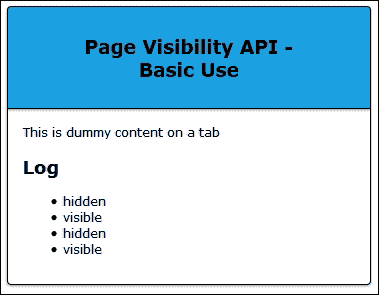

## 分解 API

快速浏览上一个演示中的代码应该会发现两个值得注意的属性——它们是`document.visibilityState`和`document.hidden`。

这些构成了页面可见性 API。如果我们首先更详细地查看`document.visibilityState`，它可以返回以下四个不同值中的任意一个：

*   `hidden`：页面在任何屏幕上都不可见
*   `prerender`：页面已加载到屏幕外，可供访问者查看
*   `visible`：页面可见
*   `unloaded`：页面即将卸载（用户正在离开当前页面）

我们还利用了`document.hidden`属性——这是一个简单的布尔属性，如果页面可见，则设置为`false`，如果页面隐藏，则设置为`true`。

与`visibilitychange`事件一起，当页面的可见性条件发生变化时，我们可以很容易地收到通知。我们将使用类似于以下代码的代码：

```js
document.addEventListener('visibilitychange', function(event) {
  if (!document.hidden) {
    // The page is visible.
  } else {
   // The page is hidden.
  }
});
```

这将适用于大多数浏览器，但不是所有浏览器。即使它是少数，我们仍然必须允许它。要了解我的意思，请尝试在 IE8 或更低版本中运行演示，它不会显示任何内容。什么都不显示不是一种选择；相反，我们可以提供一条优雅降级的路径。那么，让我们来看看如何避免代码崩溃成堆。

# 检测对页面可见性 API 的支持

虽然 API 在大多数现代浏览器中都能很好地工作，但在有限数量的浏览器中会失败；IE8 就是一个很好的例子。为了解决这个问题，我们需要提供一个根来正常降级，或者使用一个回退；这个过程的第一步是首先确定我们的浏览器是否支持 API。

有不同的方法可以做到这一点。我们可以使用 Modernizer（来自[的`Modernizr.addTest`选项 http://www.modernizr.com](http://www.modernizr.com) ）。相反，我们将使用 Matthias Bynens 的插件，其中包含对旧浏览器支持的检查。原始版本可从[获得 https://github.com/mathiasbynens/jquery-visibility](https://github.com/mathiasbynens/jquery-visibility) 。代码下载中包含的版本是一个精简版本，它取消了对旧浏览器的支持。

### 注

本书附带的代码下载中提供了使用 Modernizer 的演示版本。提取并运行`usemodernizr.html`文件，查看其工作原理。

现在我们已经了解了如何将页面可见性合并到代码中，我们将切换到使用 jQuery 进行此演示。

让我们开始：

1.  我们需要从下载本书附带的代码下载中下载标记和样式文件开始。继续并提取以下内容的副本：`usingjquery.html`、`usingjquery.css`、`jquery.min.js,`和`jquery-visibility.js`。将 CSS 文件保存到`css`子文件夹，将 JS 文件保存到`js`子文件夹，将 HTML 文件保存到项目文件夹的根区域。
2.  在新文件中，添加以下代码–其中包含检查可见性所需的代码，并确认浏览器支持 API:

    ```js
    $(document).ready(function() {
      var $pre = $('pre');
      var $p = $('p')
      var supported = 'The Page Visibility API is natively 
      supported in this browser.'
      var notsupported = 'The Page Visibility API is not 
      natively supported in this browser.'
      $('p').first().html(
        $.support.pageVisibility ? log($p, supported) : log($p, 
        notsupported)
      );
      function log(obj, text) { obj.append(text + '<br>'); }
      $(document).on({
        'show.visibility': function() {
        log($pre, 'The page gained visibility; the 
        <code>show</code> event was triggered.');
      },
      'hide.visibility': function() {
        log($pre, 'The page lost visibility; the 
        <code>hide</code> event was triggered.');
      }
      });
    });
    ```

3.  Save the file as `usingjquery.js` in the `js` subfolder of our project area. If we run the demo in IE9 or above, we will see it render the changes as we switch between tabs. Refer to the following image:

    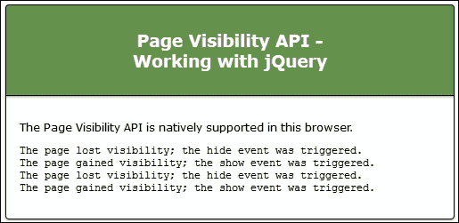

4.  尝试将浏览器更改为 IE8–使用 IE 开发者工具栏或切换到浏览器的本机副本。我们还需要更改使用的 jQuery 版本，因为我们的演示是针对较新的浏览器的。将 jQuery 的链接更改为：

    ```js
    <script src="http://code.jquery.com/jquery-1.11.2.min.js"> </script>
    ```

5.  Now try refreshing the browser window. It will show that it doesn't support Page Visibility API, but equally does not crash out with unexpected errors. Refer to the next image:

    

有了备用选项，我们现在有两个选项：

*   当浏览器不受支持时，我们可以提供一条路径，使其正常降级。这是完全可以接受的，但应首先予以考虑。
*   否则，我们可以提供回退支持，以允许旧浏览器继续使用。

让我们假设我们使用后一种方法。我们可以使用许多插件中的任何一个来实现这一点；为此，我们将使用 Andrey Sitnik 创建的`visibility.js`插件。

## 提供后备保障

为任何应用程序提供回退支持是任何开发人员生命中的祸根。我记不清有多少次我想开发出新的东西，但却不能。我必须为那些无法破解新技术的老浏览器提供支持！

谢天谢地，对于页面可见性 API 来说，这不是一个问题——浏览器覆盖率非常好，尽管少数浏览器版本仍然需要一些后备支持。有许多插件可用于此目的——也许最著名的是 Mathias Bynens，可在[上获得 https://github.com/mathiasbynens/jquery-visibility](https://github.com/mathiasbynens/jquery-visibility) 。我们在前面的演示中看到了如何使用定制版本。

对于本演示，我们将使用 Andrey Sitnik 的类似插件，该插件可从[获得 https://github.com/ai/visibilityjs](https://github.com/ai/visibilityjs) 。这包含额外的功能，包括一个计时器，以显示您的页面的可视时间；我们将在下面的演示中使用它。

## 安装 visibility.js

在开始演示之前，值得注意的是，`visibility.js`插件可以通过几种方式引用：

*   我们可以从[的 GitHub 链接下载原件 https://github.com/ai/visibilityjs](https://github.com/ai/visibilityjs)
*   可通过 Bower 购买。为此，需要安装节点和 Bower。完成后，运行以下命令下载并安装插件：

    ```js
     bower install --save visibilityjs

    ```

*   甚至可以通过 CDN 链接进行引用，目前为[http://cdnjs.cloudflare.com/ajax/libs/visibility.js/1.2.1/visibility.min.js](http://cdnjs.cloudflare.com/ajax/libs/visibility.js/1.2.1/visibility.min.js) 。

在本演示中，我假设您使用的是 CDN 版本（包含额外的计时器功能），但保存为本地副本。

### 注

注意–如果不使用此方法，则需要在[下载所有四个 Visibility JavaScript 文件 https://github.com/ai/visibilityjstree/master/lib](https://github.com/ai/visibilityjstree/master/lib) ，因为它们提供了备份和计时器功能，而压缩 CDN 版本中提供了这些功能。

## 构建演示

好的，现在我们有了插件，下面是我们将演示的屏幕截图：

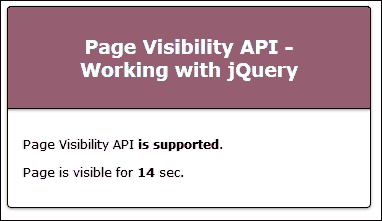

让我们开始吧：

1.  从本书附带的代码下载中提取相关标记文件。对于本练习，我们需要[fallback.html](http://fallback.html)和[fallback.css](http://fallback.css)文件。将这些存储在我们项目区域的根文件夹和`css`文件夹中。
2.  我们还需要`visibility.min.js`插件文件——它们都在代码下载文件中。提取并保存到我们项目区域的`js`子文件夹中。
3.  接下来，将以下内容添加到一个新文件中，并将其保存为我们项目区域的`js`子文件夹中的`fallback.js`：

    ```js
    $(document).ready(function() {
      if ( Visibility.isSupported() ) {
        $("#APIsupported").html('is supported');
      } else {
        $("#APIsupport").html('isn't supported');
      }

      document.title = Visibility.state();
      Visibility.change(function (e, state) {
        document.title = state;
      });

      var sec = 0;
      Visibility.every(1000, function () {
        $("#APIcounter").html(sec++);
      });
    });
    ```

4.  此代码包含演示所需的魔法。
5.  Save the files. If we preview the results in a browser, we can expect to see something akin to the screenshot at the start of the exercise. If we switch to a different tab, as shown in the next screenshot, then the timer count is stopped temporarily, and the original tab's title is updated accordingly:

    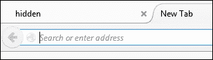

那么，发生了什么？这是一个非常简单的演示，但我们首先检查了浏览器是否支持 API。在大多数情况下，这不是一个问题，IE8 或以下版本除外。

然后，我们在标题区域显示窗口的初始状态；每次我们从演示切换到不同的选项卡并返回时，都会更新此选项卡。作为奖励，我们使用了主插件附带的`visibility.timer.js`插件，来显示窗口的可见时间。当然，每次我们切换到不同的浏览器窗口并再次返回时，都会停止此操作！

不过最棒的是，与之前的演示不同，即使我们使用的是 IE8 或更低版本，该插件仍然可以工作；我们可能需要修改演示中的代码，以确保其样式正确，但这是一个次要考虑事项。

让我们继续。现在我们已经了解了使用页面可见性 API 的基本知识，我相信您会问这样一个问题：我们如何在实际环境中使用它？没问题。让我们看看一些可能的用例。

# 在实际环境中使用 API

API 可以在各种不同的上下文中使用。经典通常用于帮助控制视频或音频的播放，尽管它可以与其他 API（如电池 API）一起使用，以防止在功率水平过低时显示内容。

让我们花一点时间来研究一些实际的例子，这样我们就可以看到如何实现 API 了。

## 暂停视频或音频

API 最常见的用途之一是控制音频或媒体（如视频）的播放。在第一个示例中，我们将使用 API 在选项卡之间切换时播放或暂停视频。让我们深入研究一下。

对于本演示，我们将使用两个附加项–动态 Favicons 库这可从[获得 http://softwareas.com/dynamic-favicons/](http://softwareas.com/dynamic-favicons/) 。虽然已经有几年的历史了，但它在当前版本的 jQuery 中仍然可以正常工作。这些视频来自[上的大雄鹿兔项目网站 https://peach.blender.org](https://peach.blender.org) 。

### 注

这个演示的视频来自 Brand 基金会，并且是（C）版权 2008，Po.??\. Brand 基金会/OutT1。www. BigBukBunn.Org

正当让我们开始吧：

1.  和往常一样，我们需要从某个地方开始。对于本演示，请继续从本书附带的代码下载中提取`pausevideo`演示文件夹。
2.  打开`pausevideo.js`文件。这包含使用`jquery-visibility`插件播放或暂停视频的代码。参考以下代码：

    ```js
    var $video = $('#videoElement');

    $(document).on('show.visibility', function() {
      console.log('Page visible');
      favicon.change("img/playing.png");
      $video[0].play();
    });

    $(document).on('hide.visibility', function() {
      console.log('Page hidden');
      favicon.change("img/paused.png");
      $video[0].pause();
    });
    ```

3.  The plugin is very simple. It exposes two methods, namely `show.visibility` and `hide.visibility`. Try running the demo now. If all is well, we should see the Big Buck Bunny video play; it will pause when we switch tabs. Following is the screenshot of the video:

    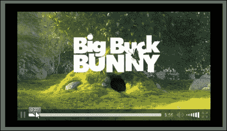

4.  In addition, the window's title is updated using the `favicon.js` library. It shows a pause symbol when we switch tabs, as seen in the next image:

    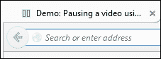

那很容易，嗯？这就是 API 的美妙之处。它非常简单，但可以使用各种不同的工具。让我们通过将对 API 的支持纳入**内容管理系统**（**CMS**）来证明这一点，例如 WordPress。

## 向 CMS 添加支持

到目前为止，我们已经看到了在静态页面站点中加入对标准的支持是多么容易——但我听说你会问，CMS 系统，比如 WordPress，又如何呢？

这个 API 在这里也很容易使用。与其谈论它，让我们看看如何添加它。对于这个演示，我将使用 WordPress，尽管这些原则同样适用于其他 CMS 系统，如 Joomla。我将使用的插件是我自己创建的。

应该注意的是，您应该有一个可用的 WordPress 安装，无论是在线安装还是自托管版本，并且您对安装插件有一定的了解。

### 注

请注意，`jquery-pva.php`插件*仅用于开发目的*；它需要进一步的工作才能在生产环境中使用。

好的，让我们开始：

1.  我们需要对主题中的`functions.php`文件进行更改。为此，我假设您使用的是 214 主题。打开`functions.php`，然后添加以下代码：

    ```js
    function pausevideos() {
      wp_register_script('pausevideo', plugins_url( '/jquery- pva/pausevideo.js'), array('jquery'),'1.1', true);
      wp_enqueue_script('pausevideo');
    }

    add_action( 'wp_enqueue_scripts', 'pausevideos' );
    ```

2.  从本书附带的代码下载中，找到并解压缩`jquery-pva`文件夹，然后将其复制到 WordPress 安装中；它需要进入`plugins`文件夹。返回到 WordPress 安装，然后以常规方式激活插件。
3.  Next, log into your WordPress Admin area, then click on **Settings** | **PVA Options**, and enter the version number of jQuery that you would like to use. I will assume 2.1.3 has been chosen. Click on **Save Changes** for it to take effect. Refer to the following image:

    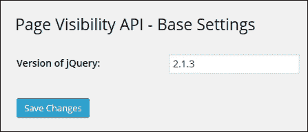

此时，我们可以开始使用该库。如果我们上传一段视频并将其添加到帖子中，它将显示我们开始播放它时经过的时间；切换选项卡时，此操作将暂停：

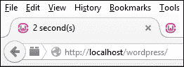

为了确认它正在工作，值得使用 DOM 检查器查看源代码。如果一切顺利，我们应该看到以下链接。第一个链接将确认引用了页面可见性库，如下所示：

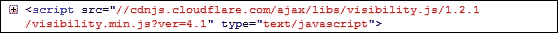

第二个链接将确认正在调用我们的脚本，如下图所示：

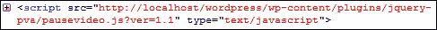

正如我们所看到的，API 当然有它的用途！在本章中，我一直试图使代码相对简单，以便轻松地学习。现在轮到你们去试验和进一步研究了——也许我能给你们一些灵感的想法？

## 为实例探索思路

页面可见性 API 的基本原理很容易实现，因此我们讨论的复杂程度仅限于想象。在我的研究过程中，我遇到了一些灵感——希望下面的内容能让你对可能发生的事情有所了解：

*   动画！有时，如果选项卡未处于活动状态，我们可能会遇到同步动画的问题。[http://greensock.com/forums/topic/9059-cross-browser-to-detect-tab-or-window-is-active-so-animations-stay-in-sync-using-html5-visibility-api/](http://greensock.com/forums/topic/9059-cross-browser-to-detect-tab-or-window-is-active-so-animations-stay-in-sync-using-html5-visibility-api/) 探讨了一些可以帮助解决这些问题的技巧。
*   下一个可能会让你抓狂，或者只是让人恼火——看看[http://blog.frankmtaylor.com/2014/03/07/page-visibility-and-speech-synthesis-how-to-make-web-pages-sound-needy/](http://blog.frankmtaylor.com/2014/03/07/page-visibility-and-speech-synthesis-how-to-make-web-pages-sound-needy/) ，作者混合了页面可见性和语音合成 API。警告——他建议不要将两者混为一谈；让我们只说，这很可能是一个关闭更多！（此处仅出于技术原因，而不是因为我们应该这样做。）
*   一种更有用的技术是使用页面可见性 API 来减少检查新电子邮件或新闻提要的次数。API 将检查选项卡是否隐藏，并降低请求更新的频率，直到选项卡再次激活。开发人员 Raymond Camden 已经探索了实现这一点所需的基础知识，因此请访问他的网站[了解更多信息 http://www.raymondcamden.com/2013/05/28/Using-the-Page-Visibility-API](http://www.raymondcamden.com/2013/05/28/Using-the-Page-Visibility-API) 。
*   为了真正把事情搞混，我们可以同时使用页面可见性、Web 通知和振动 API 来激发一些有用的通知。看一看[http://www.binpress.com/tutorial/building-useful-notifications-with-html5-apis/163](http://www.binpress.com/tutorial/building-useful-notifications-with-html5-apis/163) 了解如何在站点或应用程序中将三者混合在一起。

好吧，我想是时候改变了。让我们继续看另一个 API，它与页面可见性 API 几乎同时创建，并且使用类似的原理来帮助减少对资源的需求。

我当然指的是 requestAnimationFrame API。让我们深入研究，找出它是什么，是什么让它成功，以及为什么这样一个简单的 API 对我们开发人员来说是一个真正的福音。

# 引入 requestAnimationFrame API

在过去几年中，向在线工作的转变导致对高性能浏览器的需求大幅增加，同时降低了资源消耗和电池电量。

考虑到这一点，浏览器供应商和微软合作创建了三个新的 API。我们已经探索了一个，以页面可见性 API 的形式；我们要看的另一个是**requestAnimationFrame**。所有三个（第三个是**和**）都是为了更好的性能和更高的功率效率而设计的。

## 探索概念

那么，什么是 requestAnimationFrame？很简单——如果你花时间使用 jQuery 创建动画，毫无疑问你会使用`setInterval`方法（甚至`clearInterval`，对吗？requestAnimationFrame（和 clearAnimationFrame）分别设计为插入式替换。

我们为什么要使用它？我们将在下一节中探讨使用 requestAnimationFrame 的好处，但首先让我们了解它的本质。

绘制动画时，大多数动画使用的基于 JavaScript 的计时器小于 16.7ms，即使监视器只能以 16.7ms（或 60Hz 频率）显示，如下图所示：

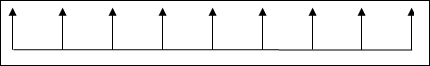

为什么这很重要？关键是典型的`setInterval`或`setTimeout`频率通常在 10ms 左右。这意味着监视器的每三次绘图都不会被观看者看到，因为在显示器刷新之前会发生另一次绘图。请参阅下一个图表：

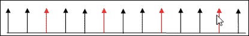

这会导致画面出现起伏，因为画面将被丢弃。电池寿命可能受到多达 25%的影响，这是一个重大损失！

浏览器供应商意识到了这一点，因此提出了 requestAnimationFrame API。这会告诉应用程序浏览器何时需要更新屏幕，以及浏览器何时需要刷新。这会减少资源的使用，减少丢弃的帧，因为与代码相比，帧速率更一致。

### 注

开发者保罗·爱尔兰（Paul Irish）在他的博客[上发表了以下评论，完美地总结了这一点 http://www.paulirish.com/2011/requestanimationframe-for-smart-animating/](http://www.paulirish.com/2011/requestanimationframe-for-smart-animating/) ，当他注意到这允许浏览器将并发动画一起优化为一个回流和重新绘制循环，从而获得更高的逼真度动画

## 查看正在运行的 API

几乎总是这样，最好是看到一些事情在起作用，而不是去读它。它是关于一个移动的演示，帮助 ram 的概念回家，至少对我来说！

为了帮助实现这一点，本书附带的代码下载中提供了两个演示：`requestAnimAtionframe.html`和`cancelAnimationFrame.html`文件。它们包含两个 API 的简单示例。在本章末尾，我们将探讨 API 的更多实际用途。

## 使用 requestAnimationFrame API

虽然从我们在上一节末尾提到的简单演示中可能无法立即看出，但使用 requestAnimationFrame 有一些明显的好处，下面列出了这些好处，值得注意：

*   requestAnimationFrame 与浏览器一起工作，在重画转换期间将动画组合到一个单独的重绘中，使用屏幕刷新率指示何时应该进行这些操作。
*   如果浏览器选项卡处于非活动或隐藏状态，动画将暂停，从而减少刷新屏幕的请求，从而降低移动设备上的内存消耗和电池使用。
*   动画由浏览器优化，而不是代码优化–较低的帧刷新率会导致更平滑、更一致的外观，因为删除的帧会更少。
*   该 API 甚至在大多数移动设备上也受支持。目前唯一不支持它的平台是 Opera Mini 8.0 版。CanIUse 站点（[http://www.caniuse.com](http://www.caniuse.com) 显示，全球使用率非常低，仅为 3%，因此不太可能出现太多问题。

值得注意的是，cancelAnimationFrame（作为 requestAnimationFrame 的姊妹 API）可用于暂停动画。如果电池电量太低，我们可以将其与电池 API 之类的东西一起使用，以阻止动画（或视频等媒体）进入。

### 提示

要查看 requestAnimationFrame 与 setTimeout 之间的差异，请查看[http://jsfiddle.net/calpo/H7EEE/](http://jsfiddle.net/calpo/H7EEE/) 。您可以清楚地看到两者之间的区别，尽管演示的本质很简单！

但需要注意的一个关键点是，在某些情况下，requestAnimationFrame 并不总是比使用 jQuery 有所改进。在[上有一篇 David Bushell 的有用文章 http://dbushell.com/2013/01/15/re-jquery-animation-vs-css/](http://dbushell.com/2013/01/15/re-jquery-animation-vs-css/) ，概述了这个问题，并指出 requestAnimationFrame 最适合用于基于`<canvas>`的动画。

基于 requestAnimationFrame（和 cancelAnimationFrame）创建动画非常简单。开发者 Matt West 已经在 CodePen 上创建了一个 JavaScript/jQuery 示例，该示例可在[上找到 http://codepen.io/matt-west/full/bGdEC](http://codepen.io/matt-west/full/bGdEC) 。他已经编写了一个教程，与此演示一起使用，并在 TeamTreehouse 的博客[上提供了 http://blog.teamtreehouse.com/efficient-animations-with-requestanimationframe](http://blog.teamtreehouse.com/efficient-animations-with-requestanimationframe) 。

这使我们很好地进入了下一个主题。现在我们已经看到了如何使用 JavaScript 操作 API，让我们来看看使用 jQuery 使用类似的技术。

## 修改 jQuery 的更改

到目前为止，我们已经介绍了使用 requestAnimationFrame 及其姊妹 API cancelAnimationFrame 的基础知识；我们已经看到了如何使用普通 JavaScript 实现它。

值得注意的是，jQuery 并没有包含本机支持。曾尝试将其添加到版本 1.8 之前的 jQuery 中，但由于主要浏览器供应商的支持问题而被删除。

谢天谢地，供应商支持现在比以前好多了；还有计划将 requestAnimationFrame 支持添加到 jQuery2.2 或 1.12 中。您可以看到需要进行的更改，以及历史记录，如下所示：

*   提交：[https://gitcandy.com/Repository/Commit/jQuery/72119e0023dcc0d9807caf6d988598b74abdc937](https://gitcandy.com/Repository/Commit/jQuery/72119e0023dcc0d9807caf6d988598b74abdc937)
*   对`effect.js`的变更，可参照[https://github.com/jquery/jquery/blob/master/src/effects.js](https://github.com/jquery/jquery/blob/master/src/effects.js)
*   jQuery 核心中包含 requestAnimationFrame 的一些历史记录：[https://github.com/jquery/jquery/pull/1578](https://github.com/jquery/jquery/pull/1578) ；[http://bugs.jquery.com/ticket/15147](http://bugs.jquery.com/ticket/15147)

作为临时措施（如果您仍然需要支持早期版本的 jQuery），您可以尝试在[处使用 Corey Frang 的插入式垫片 https://github.com/gnarf/jquery-requestAnimationFrame](https://github.com/gnarf/jquery-requestAnimationFrame) ，增加了对 jQuery post 1.8 版本的支持。

然而，如果您感到更具冒险精神，那么将 requestAnimationFrame 支持直接改装到使用它的库中就足够容易了。让我们花一点时间看看转换的过程。

### 更新现有代码

做出改变相对简单。它的关键是使更改模块化，以便在 jQuery 获得对 requestAnimationFrame 的支持后，可以轻松地将更改交换回原处。

如果您正在使用的库具有对`setInterval`或`clearInterval`的代码引用，则可以进行更改。例如，考虑是否有以下代码摘录：

```js
var interval = setInterval(doSomething, 10)
var progress = 0
function doSomething() {
  if (progress != 100){
  // do something here
  }
  else {
  clearInterval(interval)
  }
}
```

将更新为以下代码摘录，将对`setInterval`的引用替换为`requestAnimationFrame`（并添加对`clearInterval`的等效替换）：

```js
var requestAnimationFrame = window.requestAnimationFrame;
var cancelAnimationFrame = window.cancelAnimationFrame;

// your code here

var progress = 0;

function doSomething() {
  if (progress != 100) {
    // do something here
 var myAnimation = requestAnimationFrame(doSomething);
  } else {
    cancelAnimationFrame(myAnimation);
  }
}
```

在前面的代码示例中，以粗体突出显示的代码表示更新代码所需的更改类型。我们将在本章后面部分使用此技术来改进对现有库的支持。这将是我们将探索的两个演示之一，它们使用 requestAnimationFrame。

# 使用 requestAnimationFrame 的一些示例

到目前为止，我们已经了解了使用 requestAnimationFrame 背后的理论，并涵盖了可能必须对现有代码进行的典型更改。

这是一个很好的起点，但并不总是很容易理解这个概念；在行动中更容易看到！考虑到这一点，我们将看两个使用 API 的演示。第一个将改装支架，而第二个已在规范中包含支架的情况下建造。

## 创建可滚动效果

在我们的第一个演示中，我们将看一看如何更新一个经典的可滚动 UI 元素的示例，该元素可以在全球数百个站点上找到。我们将使用拇指姑娘插件，可从[获得 https://github.com/StarPlugins/thumbelina](https://github.com/StarPlugins/thumbelina) 。尽管它已经有几年的历史了，但它仍然可以很好地工作，即使使用最新版本的 jQuery！

在这个演示中，我们将把插件中的`setInterval`调用替换为`requestAnimationFrame`。让我们开始：

1.  Let's begin by extracting a copy of the `thumbelina` demo folder that is in the code download that accompanies this book. If we run the `scrollable.html` file, we should see a scrollable appear with images of orchids, as in the following image:

    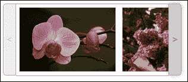

2.  拇指姑娘插件目前使用`setInterval`来管理动画之间的时间段。我们将对其进行修改，以使用新的`requestAnimationFrame`。
3.  打开 thumbelina.js，然后在第 16 行的`$.fn.Thumbelina = function(settings) {`下方添加以下代码：

    ```js
      var start = new Date().getTime(),
      handle = new Object();
      function loop() {
        var current = new Date().getTime(),
        delta = current - start;
        if(delta >= delay) {
          fn.call();
          start = new Date().getTime();
        }
        handle.value = 
        window.requestAnimationFrame(loop);
      };
      handle.value = window.requestAnimationFrame(loop);
      return handle;
    }
    ```

4.  向下滚动至下一行，该行将位于第 121 行或其周围：

    ```js
    setInterval(function(){
    ```

5.  如下图所示对其进行修改，使其使用我们刚刚添加的新的`requestInterval()`函数：

    ```js
    requestInterval(function() {
      animate();
      },1000/60);
    };
    ```

6.  保存文件。如果我们运行演示，我们应该看不到任何视觉差异；真正的区别在于背景中发生了什么。

### 提示

尝试在 Google Chrome 中运行演示，然后在时间线内查看结果。如果你在之前和之后做了一个测试，你应该会看到显著的不同！如果您不确定如何配置演示，请转到[https://developer.chrome.com/devtools/docs/timeline](https://developer.chrome.com/devtools/docs/timeline) 了解详细信息。

## 设置谷歌地图标记的动画

我们在一章中的最后一个演示使用了著名的谷歌地图服务，以动画方式移动指示地图上特定位置的标记：

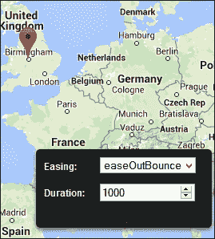

在本例中，将使用 Robert Gerlach 创建的演示，该演示可从[获得 http://robsite.net/google-maps-animated-marker-move/](http://robsite.net/google-maps-animated-marker-move/) 。我已经调整了他的`markerAnimate.js`插件文件中的代码，删除了供应商前缀，因为不再需要这些前缀。

他制作了一个简洁的效果，给那些看起来非常简单的内容赋予了一些生命。尽管如此，它仍然需要相当数量的代码！空间限制意味着我们无法在印刷品中探索所有内容，但我们可以探索一些更重要的概念：

1.  让我们首先从本书附带的代码下载中提取`googlemap`演示文件夹。这包含了我们演示的样式、JavaScript 库和标记。
2.  在浏览器中运行`googlemap.html`。如果一切顺利，我们应该看到英国伯明翰的指针，Packt Publishing 的英国办事处就设在那里。

尝试单击地图上的其他位置–注意它是如何移动的吗？它利用了 jQuery 轻松插件中提供的一些轻松效果，我们在[第 6 章](06.html#aid-1LCVG1 "Chapter 6. Animating in jQuery")中使用了该插件，在 jQuery 中使用了*动画。*

只需更改右下角下拉框中显示的值，即可选择使用哪种缓和效果。这甚至可以包括我们制作的自定义动画，使用 jQuery 中的[第 6 章](06.html#aid-1LCVG1 "Chapter 6. Animating in jQuery")中给出的示例*动画作为基础。只要自定义动画函数包含在我们的代码中，并且在下拉列表中添加了适当的名称，我们就可以使用它。*

真正需要注意的是在`markeranimate.js`文件中。如果我们打开它并向下滚动到第**64**-**71**行，我们可以看到`requestAnimationFrame`是如何使用的。如果浏览器支持 API，我们使用它，否则使用`setTimeout`，如下图所示：

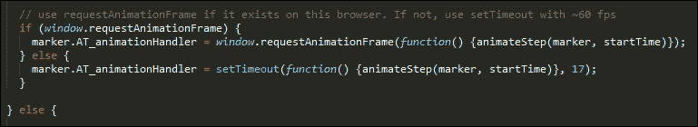

使用放松和呼叫`requestAnimationFrame`的组合带来了一种很酷的效果，这也减少了对资源的需求——如果你的网站上有很多动画，那就太棒了！

### 提示

为了便于合并`setInterval`、`clearInterval`（和`setTimeout`/`clearTimeout`的替换，请使用 Joe Lambert 提供的替换功能，这些功能可在[上找到 https://gist.github.com/joelambert/1002116](https://gist.github.com/joelambert/1002116) 。

## 探索灵感来源

在过去的几页中，我们已经讨论了很多内容——完全理解 requestAnimationFrame（及其姐妹 clearAnimationFrame）是如何工作的可能需要一些时间，但是随着 jQuery 即将发生的变化，花时间熟悉 API 以及它们给我们的开发带来的好处是值得的。

在总结本章之前，下面列出了一些您可能会发现有用的灵感来源：

*   requestAnimationFrame 绝不限于播放视频或音乐等。它甚至可以用于开发在线游戏！请看[http://www.somethinghitme.com/2013/01/09/creating-a-canvas-platformer-tutorial-part-one/](http://www.somethinghitme.com/2013/01/09/creating-a-canvas-platformer-tutorial-part-one/) -希望你能认出一些经典作品！
*   更严重的是，对于那些使用视差滚动的站点，在实现上可能有改进的空间。Krister Kari 写了一篇详细的博客文章，介绍了一个典型的例子，并概述了一些可以用来解决问题的技术。您可以在[上阅读 http://kristerkari.github.io/adventures-in-webkit-land/blog/2013/08/30/fixing-a-parallax-scrolling-website-to-run-in-60-fps/](http://kristerkari.github.io/adventures-in-webkit-land/blog/2013/08/30/fixing-a-parallax-scrolling-website-to-run-in-60-fps/) 。

有更多的资源可供选择——让你看看你的想象力带你去哪里！

# 总结

钻研新的 API 总是很有趣的。尽管它们在本质上可能过于简单（例如，查看振动 API），但它们可以被证明是任何人工具箱中真正有用的补充。在本章中，我们详细探讨了两个问题。让我们花些时间回顾一下我们所涵盖的内容。

我们首先介绍了页面可见性 API。在实现一个基本示例之前，我们研究了浏览器对 API 的支持。我们讨论了如何检测和提供回退支持，然后看了一些实际示例。

接下来我们来看看 requestAnimationFrame API，在这里我们了解了与页面可见性 API 的一些相似之处。在研究一些实际用途以及如何为 jQuery 本身添加支持之前，我们先探讨了它的基本工作原理。然后我们通过两个例子来总结这一章；一个是基于转换到使用 API，而另一个是从一开始就内置的。

接下来，在下一章中，我们将探讨网站的另一个关键元素，即图像。我们将探索如何使用 jQuery 操作图像以产生一些真正有趣的效果。