# 十、图像处理

人们常说，图像描绘千言万语——网站也不例外。

我们使用图像来说明一个过程，帮助强化一条信息，或者将一些视觉标识应用于其他可能被视为非常简单的内容。图像是任何网站的关键部分；图像的质量将决定网站的成败。

使用 jQuery 操作图像的一小部分是我们如何应用过滤器，或操作图像中的颜色。在本章中，我们将探讨如何使用 jQuery 操作图像，然后再探讨两个捕获图像的真实示例，作为进一步操作的基础。在本章中，我们将介绍以下主题：

*   使用 CSS 和 jQuery 应用过滤器
*   使用插件编辑图像
*   使用 jQuery 和 canvas 创建简单的签名板
*   捕获和操作网络摄像头图像

让我们开始…！

# 操纵图像中的颜色

一个问题——你有多少次认为处理图像的唯一方法是使用 Photoshop，甚至 GIMP？我敢打赌不止一次——如果我说像这些知名应用程序这样的重量级应用程序（在某些情况下）是冗余的，而您所需要的只是一个文本编辑器和一个小 jQuery 呢？

此时，您可能想知道我们可以如何使用 jQuery 操作图像。不要害怕！我们有一些妙计。在接下来的几页中，我们将逐一查看，并发现虽然我们可以使用开发人员可以使用的最流行的 JavaScript 库之一，但它并不总是正确的方法。

为了理解我的意思，让我们快速回顾一下我们可以使用的方法，它们是：

*   使用 CSS3 过滤器，并使用 jQuery 将它们切换到内部或外部
*   使用 HTML5`<canvas>`元素、jQuery 和`getImageData`方法处理程序的组合来操作每个图像的颜色元素，然后将其重新绘制回画布

在本章中，我们将依次查看每一个，并探索为什么虽然我们可以使用 jQuery 创建复杂的过滤器，但它并不总是正确的答案。希望通过一些技巧，它将使我们成为更好的开发人员。让我们先看看如何使用简单的 CSS3 过滤器，以及如何轻松地将它们的使用合并到 jQuery 代码中。

# 使用 CSS3 增加过滤器

过滤器支持已经有一段时间了，至少在主要的桌面浏览器中是如此，尽管我们仍然需要使用`-webkit-`供应商前缀支持，因为我们还没有完全无前缀：

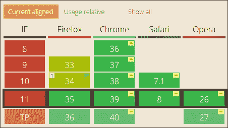

### 注

关于上述图像的信息取自 CanIUse 网站[http://caniuse.com/#feat=css-过滤器](http://caniuse.com/#feat=css-filters)。

使用这些方法的美妙之处在于它们的应用非常简单；如果客户决定改变主意，我们不会被迫花费数小时修改图像！我们可以使用 jQuery 轻松地应用和删除样式，这有助于将样式与标记分开。

操纵图像可能会变得非常复杂——事实上，为了涵盖所涉及的数学问题，我们可能会自己写一本书！相反，在开始创建更复杂的过滤器之前，我们将从使用 CSS3 过滤器的简单回顾开始，并以两个有助于从两个不太可能的来源捕获图像的演示结束。

感兴趣的在本章的末尾，一切都将变得清晰，但我们将首先从一个简单的练习开始，重新熟悉 CSS3 过滤器的应用。

## 准备好了吗

在我们陷入练习之前，我强烈建议在这些演示中使用 Firefox 或 IE；如果您使用 Chrome，那么如果在本地运行，一些演示将显示交叉源错误。

一个很好的例子是跨平台应用程序 XAMPP（可从[获得）http://www.apachefriends.org](http://www.apachefriends.org) ），或者您可以尝试 WAMPServer（对于 PC，从[开始）http://www.wampserver.com/en](http://www.wampserver.com/en) 或 MAMP（对于 Mac，从[开始）http://www.mamp.info](http://www.mamp.info) 。我将假设您正在 web 服务器中运行演示。

## 创建我们的主页

在本章的第一个演示中，我们将从使用`addClass`方法对页面上的图像应用特定过滤器的简单回顾开始。我们将使用宝丽来效果，由加拿大开发商 Nick La 开发，可从[获得 http://webdesignerwall.com/demo/decorative-gallery-2/](http://webdesignerwall.com/demo/decorative-gallery-2/) 。`.addClass()`方法几乎肯定是你以前无数次使用过的方法；我们在这里使用它作为本章后面更复杂效果的介绍。开始吧：

1.  让我们首先从本书附带的代码下载中下载并提取以下文件：
    *   `cssfilters.html`
    *   `cssfilters.css`
    *   `jquery.min.js`
    *   `cssfilters.js`
2.  将 HTML 标记文件放到项目区域的根目录中，将 JavaScript 和 CSS 文件放到项目区域的相关子文件夹中。
3.  在一个新文件中，继续添加以下简单的代码块–这是按钮的事件处理程序，我们将使用它来更改过滤器状态：

    ```js
    $(document).ready(function(){
      $("input").on("click", function(){
        $("img").toggleClass("change-filter");
      })
    });
    ```

4.  At this stage, try previewing the results in a browser. If all is well, we should see a picture of blue flowers, set in a Polaroid effect background. Refer to the following image:

    

5.  Take a closer look in `cssfilters.css` – near the bottom of the screen. We should see the following:

    ```js
    .change-filter {
      filter: blur(5px);
      -webkit-filter: blur(5px); 
    }
    ```

    紧接着就是这个模块：

    ```js
    img { -webkit-transition: all 0.7s ease-in-out; transition: all 0.7s ease-in-out; }
    ```

6.  Now click on the **Change filter using CSS** button. If all is well, our image should gradually become blurred, as shown in the next image:

    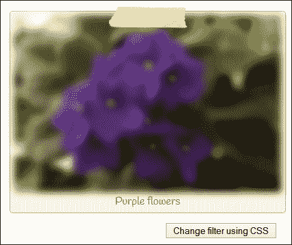

这是一个很好的简单演示——考虑到本书到目前为止所涉及的一些更复杂的主题，在这个阶段没有什么太麻烦的事情！

### 提示

提示–如果您发现某些版本的 Firefox 中没有显示过滤器，请检查**中关于：config**的**layout.css.filters.enabled**属性。在版本 34 或更早版本中，默认情况下不启用该功能；这与第 35 版有所不同：

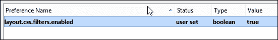

这个演示的关键当然是`.addClass()`方法处理程序的使用。单击按钮时，我们只是将一个新的预设类应用于图像。然而，这里的美妙之处在于，我们可以使用许多快速简便的过滤器，这些过滤器可以减少（甚至消除）PhotoShop 或 GIMP 的使用。要了解切换到底有多容易，让我们现在进行更改，然后切换到使用亮度过滤器。

## 改变亮度等级

下一个演示是对我们刚刚编写的`cssfilters.css`文件的快速而简单的更改。以下是我们将制作的屏幕截图：

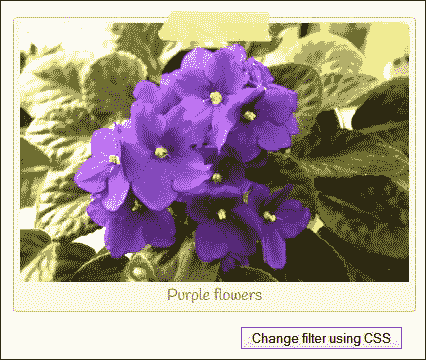

在继续执行下面列出的步骤之前，请确保此文件可用：

1.  在`cssfilters.css`中，查找并修改`.change-filter`规则，如图所示：

    ```js
    .change-filter { filter: brightness(170%); -webkit-filter: brightness(170%); }
    ```

2.  现在点击**使用 CSS**更改过滤器。如果一切顺利，我们应该会发现图像变得更亮了。

再说一次——这里没有什么累赘；希望这是一个喘息的好机会，在我们在本书中介绍了一些内容之后！我们可以使用很多 CSS3 过滤器；空间限制意味着我们不能在这里全部覆盖它们，但我们至少可以再看一个过滤器。在下一个练习之后，将立即概述可供使用的其他过滤器。

## 在我们的图像中添加一个乌贼墨过滤器

和之前一样，我们需要恢复到更改`cssfilters.css`，所以请确保您准备好了供使用。让我们来看看我们需要做什么：

1.  返回到`cssfilters.css`，然后更改此行，如图所示：

    ```js
    .change-filter { filter: sepia(100%); -webkit-filter: sepia(100%); }
    ```

2.  Click on **Change filter using CSS** now. If all is well, we should find that the image now has a sepia filter applied, as shown in this screenshot:

    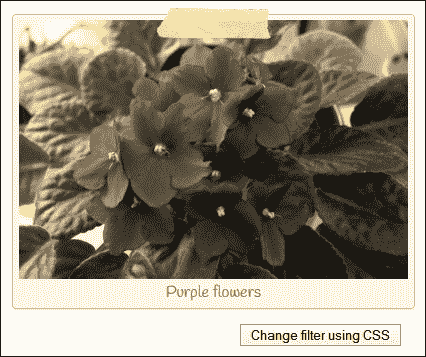

这就是我喜欢使用 CSS3 过滤器的原因——尽管一些纯粹主义者可能会这么说，但并非总是需要重新使用图形包；只需在 CSS 中简单地更改一个值即可。

如果需要，我们可以手动更改该值，但现在我们也可以灵活地以编程方式更改它，对性能几乎没有影响。最后一点很重要——我们将在本章后面看到。使用 jQuery 创建复杂的过滤器来操作图像是一个需要大量资源的过程，因此不需要太频繁地进行。

## 探索其他过滤器

在我们继续看一看不同的图像处理方法之前，下表为您提供了不同的可用过滤器；所有的都可以使用 jQuery 进行设置，如我们前面的练习中所述：

<colgroup><col> <col></colgroup> 
| 

过滤器名称

 | 

如何使用它的示例

 |
| --- | --- |
| `contrast()` | 

```js
.change-filter { filter: contrast(170%); -webkit-filter: contrast(170%); }
```

 |
| `hue-rotate()` | 

```js
.change-filter { filter: hue-rotate(50deg); -webkit-filter: hue-rotate(50deg); }
```

 |
| `grayscale()` | 

```js
.change-filter { filter: grayscale(100%); -webkit-filter: grayscale(100%); }
```

 |
| `invert()` | 

```js
.change-filter { filter: invert(100%); -webkit-filter: invert(100%); }
```

 |
| `Saturate()` | 

```js
.change-filter { filter: saturate(50%); -webkit-filter: saturate(50%);}
```

 |

要查看这些的实际例子，值得在网上看一看——有很多可用的例子。首先，请看一看约翰·辛普森在[发表的文章 http://www.inserthtml.com/2012/06/css-filters/](http://www.inserthtml.com/2012/06/css-filters/) ；虽然它已经有几年的历史了，并且一些设置从那时起已经被调整过了，但它仍然提供了一种有用的风格，说明了 CSS3 过滤器可能实现的功能。

让我们改变一下轨迹——虽然我们可以使用简单的 CSS3 过滤器来处理对比度和亮度等方面，但我们可以使用另一种方法：背景混合。

# 使用 CSS3 混合图像

在某些情况下，我们不希望直接操纵图像，而是改变背景图像。类似的效果很容易在 PhotoShop 中的静态图像中实现，但在互联网上不太常见。

谢天谢地，我们可以在 CSS 中使用`background-blend`模式实现相同的效果–这允许我们将两个图像合并在一起。使用`background-blend`模式（在桌面浏览器中浏览器支持良好）无需手动编辑每张照片，因此，如果有任何照片被更改，同样的效果也可以轻松应用于替换照片。

与我们已经研究过的过滤器一样，我们将在 CSS 中应用过滤器。然后，我们可以随意使用 jQuery 打开或关闭它们。我不会重温需要的 jQuery 代码，因为我们在本章前面已经看到了它；我们可以使用如下示例应用`background-blend`模式：

```js
  <style>
    .blend { width: 389px; height: 259px; background:#de6e3d url("img/flowers.jpg") no-repeat center center; }
    .blend.overlay { background-blend-mode: overlay; }
  </style>
</head>
```

在本例中，我们使用了`overlay`过滤器。此复合过滤器根据背景颜色值将颜色相乘。它的净效果是使较浅的颜色变浅，较深的颜色变深，如下一个屏幕截图所示：

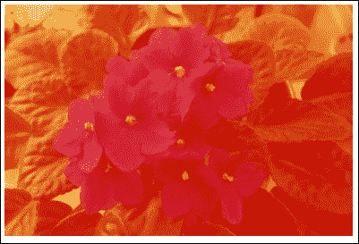

### 提示

本书附带的代码下载中有两个混合模式的示例–查找`overlay.html`和`multiply.html`文件。

有很多可用的滤镜选项，例如倍增、增亮、减淡和色彩燃烧–这些选项旨在产生与 PhotoShop 中使用的效果相似的效果，但不需要昂贵的应用程序。所有过滤器都遵循类似的格式。值得在谷歌上搜索过滤器如何出现的例子，比如[上的例子 http://www.webdesignerdepot.com/2014/07/15-css-blend-modes-that-will-supercharge-your-images/](http://www.webdesignerdepot.com/2014/07/15-css-blend-modes-that-will-supercharge-your-images/) 。

### 注

如果您想了解更多信息，请访问 Mozilla 的开发者网站[https://developer.mozilla.org/en-US/docs/Web/CSS/back 地面混合模式](https://developer.mozilla.org/en-US/docs/Web/CSS/back%20ground-blend-mode)。有关此过滤器的一个非常有用的示例（以及将其与 jQuery 结合的灵感来源），请查看[上的 2016 年美国总统候选人演示 http://codepen.io/bennettfeely/pen/rxoAc](http://codepen.io/bennettfeely/pen/rxoAc) 。

好吧，我想，是时候真正投入到 jQuery 中去了！让我们切换到使用插件，看看我们可以用可用的插件实现的一些效果。我们将从使用 CamanJS 作为示例开始，接下来将更深入地探索手动创建过滤器，并了解为什么这并不总是达到预期效果的最佳方法！

# 使用 CamanJS 应用过滤器

到目前为止，我们已经使用 CSS3 应用了过滤器。这非常适合轻量级解决方案，但在某些情况下，我们可能需要做更多的工作，而 CSS3 是不够的。

进入 jQuery！在接下来的几页中，我们将简要介绍如何使用 CamanJS 作为示例 jQuery 插件应用过滤器。然后我们将继续，看看手动创建相同的效果是多么容易（或复杂），而不需要依赖第三方插件。

## 引入 CamanJS 作为插件

CamanJS 是 jQuery 可用的几个插件之一，它允许我们应用任意数量的过滤器；我们可以从库附带的预设选项中进行选择，也可以创建自己的组合。

插件可从[获得 http://camanjs.com/](http://camanjs.com/) ，可从 GitHub 下载，网址为[https://github.com/meltingice/CamanJS](https://github.com/meltingice/CamanJS) 。否则，我们可以使用 NodeJS 或 Bower 来安装库。该插件也可通过[上的 CDN 获得 http://www.cdnjs.com](http://www.cdnjs.com) -搜索 CamanJS 以获取项目中使用的最新 URL。

值得注意的是，可以使用以下两种方法之一应用过滤器–第一种是作为 HTML 数据属性：

```js

```

第二种方法是使用 jQuery，我们将在下一个演示中看到；我们将在整个示例中使用此方法。考虑到这一点，让我们开始破解，看看如何使用 CamanJS 应用过滤器，如我们的下一个演示所示。

## 构建一个简单的演示

在本演示中，我们将使用 CamanJS 库将三个过滤器中的任何一个应用于我们在本章中一直使用的 flowers 图像。

### 注

请记住，如果您使用 Chrome，请在本地 Web 服务器中运行此演示，如*准备*部分所建议。

开始吧：

1.  从本书附带的代码下载中提取以下文件开始。对于这个演示，我们需要以下文件：`caman.html`、`flowers.jpg`、`usecaman.js`、`jquery.min.js,`和`usecaman.css`。将 JavaScript 文件存储在`js`子文件夹中，`css`子文件夹中的 CSS 文件，`img`子文件夹中的图像，以及项目文件夹根区域中的 HTML 标记。
2.  Run the `caman.html` demo file. If all is well, we should see the following image appear:

    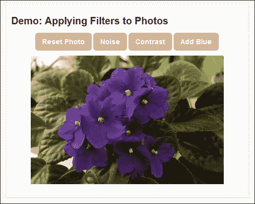

3.  让我们探索一下操作演示所需的 jQuery。如果我们窥视`usecaman.js`内部，我们将看到以下代码。这用于在标记中获取`<canvas>`元素的句柄，然后在其上绘制`flowers.jpg`图像。

    ```js
      var canvas = $('#canvas');
      var ctx = canvas[0].getContext("2d");
      var img = new Image();
      img.src = "img/flowers.jpg";
      ctx.drawImage(img, 0, 0);
    ```

4.  再深入一点，我们应该看到以下方法–这将处理`<canvas>`元素重置回其原始状态；注意如何使用`drawImage()`方法，这是使用不同过滤器处理图像的关键：

    ```js
      $reset.on('click', function(e){
        e.preventDefault();
        var img = new Image();
        img.src = "img/flowers.jpg";
        ctx.save();
        ctx.setTransform(1, 0, 0, 1, 0, 0);
        ctx.clearRect(0, 0, canvas[0].width, canvas[0].height);
        ctx.restore();
        ctx.drawImage(img, 0, 0);
        Caman('#maincanvas', 'img/flowers.jpg', function(){
          this.revert(false).render();
        });
      });
    ```

5.  然后，我们用三个不同的事件处理程序来结束它——它们应用相关的 CamanJS 过滤器：

    ```js
    $noise.on('click', function(e) {
      e.preventDefault();
      Caman('#maincanvas', 'img/flowers.jpg', function() {
        this.noise(10).render();
      });
    });
    ```

我们的简单演示只触及了 CamanJS 可能实现的表面。非常值得更详细地查看该站点，以了解使用该库可以实现的功能。作为灵感来源，请看 Carter Rabasa 的文章，该文章利用该库创建了一个基于著名 Instagram 网站的 Phonestagram 应用程序；可在[处购买 https://www.twilio.com/blog/2014/11/phonestagram-fun-with-photo-filters-using-node-hapi-and-camanjs.html](https://www.twilio.com/blog/2014/11/phonestagram-fun-with-photo-filters-using-node-hapi-and-camanjs.html) 。

### 注

值得注意的是，CamanJS 能够轻松处理 HiDPI 图像——我们所需要做的就是在代码中设置`data-caman-hidpi`属性。如果检测到设备支持高分辨率图像，Caman 将自动切换到使用高分辨率版本。但是请注意，由于使用了额外的像素，渲染需要更长的时间。

## 变得非常有创意

回想本章的开头，我提到 CSS3 过滤器提供了一种方便、轻量级的图像处理方法。它们的使用意味着我们可以减少编辑图像时所需的工作量，如果图像的大小或内容发生变化，那么更新它们就容易多了。

然而，使用 CSS3 过滤器只能做到这一点——这就是 jQuery 接管的地方。要了解原因，让我们通过另一个演示来了解。这一次，我们将使用 CamanJS 附带的一个更高级的预设过滤器，如果单独使用 CSS3 过滤器，这将很难实现。

请记住，如果您使用 Chrome，请按照*准备*部分的建议，在本地 web 服务器中运行此演示。让我们开始：

1.  对于本演示，我们需要本书附带的代码下载中的一些文件。它们是：`caman-advanced.css`、`caman-advanced.html`、`caman.full.js`、`jquery.min.js`和`flowers.jpg`。将每个文件放在相关子文件夹中，将 HTML 标记文件放在项目区域的根目录中。
2.  在一个新文件中，添加以下代码，以配置 CamanJS 对象使用随库提供的针孔过滤器；将此保存为`js`子文件夹

    ```js
    $(document).ready(function() {
      $("input").on("click", function() {
        Caman("#caman-image", function () {
          this.pinhole().render();
        });
      })
    });
    ```

    中的`caman-advanced.js`
3.  If we preview the demo, we can see that the image now shows a pinhole camera effect when the **Change filter** button is clicked. Refer to the following image:

    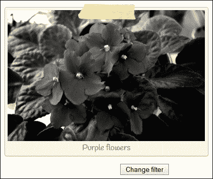

在 CamanJS 网站上有很多不寻常过滤器的例子。前往[http://camanjs.com/examples/](http://camanjs.com/examples/) 查看可以使用库的内容。

尽管我们已经将重点放在使用 CamanJS 作为示例上（部分原因是库的功能范围很广），但也有其他库提供类似的过滤功能，但并非所有库都与 CamanJS 具有相同的级别。以下是一些需要探索的例子，以便开始学习：

*   **年份酒**：[https://github.com/rendro/vintageJS](https://github.com/rendro/vintageJS)
*   **霍维兹**：[https://github.com/iliasiovis/Hoverizr](https://github.com/iliasiovis/Hoverizr)
*   **画笔 JS**：[http://mezzoblue.github.com/PaintbrushJS](http://mezzoblue.github.com/PaintbrushJS)
*   **显色剂**：[http://colorimazer.tacyniak.fr/](http://colorimazer.tacyniak.fr/)

对于中那些不喜欢使用开源的人来说，您可能想探索的一个例子是 JSManipulation 库，该库可在[的 CodeCanyon 网站上出售 http://codecanyon.net/item/jsmanipulate-jquery-image-manipulation-plugin/428234](http://codecanyon.net/item/jsmanipulate-jquery-image-manipulation-plugin/428234) 。

好吧，让我们继续前进，真正陷入困境。到目前为止，我们使用的插件将为我们的大多数目的服务。但在某些情况下，我们可能会发现需要手动创建自己的过滤器，因为现有的过滤器无法满足我们的需要。让我们看一对夫妇的行动，看看有什么涉及。

### 提示

要了解使用 Caman 时可能出现的情况，请查看 Martin Angelov 在[上的这篇文章 http://tutorialzine.com/2013/02/instagram-filter-app/](http://tutorialzine.com/2013/02/instagram-filter-app/) 。它引导我们使用 jQuery、CamanJS 和 jQuery 鼠标滚轮构建 Instagram 过滤器应用程序。

# 手动创建简单过滤器

创建我们自己的过滤器（就像许多预构建插件一样）的关键是使用`<canvas>`元素并熟悉 `getImageData`方法。我们可以使用后者来操纵每个图像中的颜色通道，以产生所需的效果。

我们可以花时间详细讨论如何使用这种方法，但我认为最好是将其付诸实施。因此，让我们深入研究并使用它手动创建两个过滤器，首先是对图像进行灰度缩放。

## 对图像进行灰度缩放

对于三的第一个演示，我们将对`flowers.jpg`图像副本中的颜色进行去饱和处理，我们在本章中一直使用该图像。这将给它一个灰度级的外观。

### 注

如果在本地运行此演示，可能会出现跨域错误。我建议在本地 web 服务器中运行它，正如*准备*部分所建议的那样。

让我们看看我们必须做什么：

1.  让我们先从本书附带的代码下载中提取一份`flowers.jpg`、`jquery.min.js`、`manual-grayscale.html,`和`manual-grayscale.css`的副本。在`img`子文件夹中存储图像，`js`子文件夹中存储 JavaScript 文件，`css`子文件夹中存储样式表；HTML 标记需要存储在项目文件夹的根目录中。
2.  在一个新文件中，继续并添加以下代码，将其保存为`manual-grayscale.js`——在调用`grayscale`函数执行魔术之前，它会查找具有 picture 类名的每个图像集：

    ```js
    $(window).load(function(){
      $('.picture').each(function(){
        this.src = grayscale(this.src);
      });
    });
    ```

3.  在`$(window).load`方法的正下方添加以下函数–这将使用灰度等效值重写图像：

    ```js
    function grayscale(src){
      var i, avg;
      var canvas = document.createElement('canvas');
      var ctx = canvas.getContext('2d');
      var imgObj = new Image();
      imgObj.src = src;
      canvas.width = imgObj.width;
      canvas.height = imgObj.height;
      ctx.drawImage(imgObj, 0, 0);
      var imgPixels = ctx.getImageData(0, 0, canvas.width, canvas.height);
      for(var y = 0; y < imgPixels.height; y++){
        for(var x = 0; x < imgPixels.width; x++){
          i = (y * 4) * imgPixels.width + x * 4;
          avg = (imgPixels.data[i] + imgPixels.data[i + 1] + imgPixels.data[i + 2]) / 3;
          imgPixels.data[i] = avg;
          imgPixels.data[i + 1] = avg;
          imgPixels.data[i + 2] = avg;
        }
      }
      ctx.putImageData(imgPixels, 0, 0, 0, 0, imgPixels.width, imgPixels.height);
      return canvas.toDataURL();
    }
    ```

4.  If we run the demo at this point, we should see a copy of the image with the Polaroid effect border as before, but this time, it has been converted to a grayscale equivalent image, followed by the screenshot itself:

    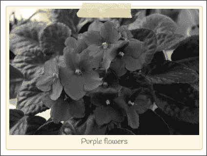

在我们继续下一个演示之前，有几个关键点需要注意，与我们刚才使用的代码有关。因此，让我们抽出一点时间来更详细地讨论这些问题：

*   我们所做的大部分工作都使用了`<canvas>`元素——这使我们能够以比使用普通 JPG 或 PNG 格式图像更精细的细节来处理图像。
*   在本例中，我们使用纯 JavaScript 和语句`document.createElement('canvas').`创建了 canvas 元素。有些人可能会认为，将普通 JavaScript 与 jQuery 混合使用是不好的做法。在这个例子中，我个人觉得它提供了一个更干净的解决方案，因为上下文不会自动添加到使用 jQuery 动态创建的`<canvas>`元素中。
*   `getImageData()`作为一种方法，它是使用此路径处理任何图像的关键。然后，我们可以使用每个颜色通道，即红色、绿色和蓝色，以产生所需的效果。

我们可以使用这个过程来生产任意数量的不同过滤器——比如说，乌贼墨过滤器怎么样？让我们来看看如何手动创建这样的过滤器。在本例中，我们将进一步将其转换为一个小型插件，以便在以后重用。

## 添加深褐色色调

我们已经看到，从头开始制作一个彩色滤光片是多么的简单，那么如何创建不同类型的滤光片呢？我们可以对其他过滤器使用类似的技术，因此让我们继续创建一个基于 sepia 的过滤器，以补充我们在本章前面使用的 CSS3 版本。

### 注

请记住，如果您使用 Chrome，请按照*准备*部分的建议，在本地 web 服务器中运行此演示。

让我们开始吧：

1.  我们将一如既往地从本书附带的代码下载中提取相关文件开始。对于这一个，我们需要以下内容：`jquery.min.js`、`flowers.jpg`、`manual-sepia.css,`和`manual-sepia.html`。将它们存储在项目文件夹的相关子文件夹中。
2.  在一个新文件中，我们需要创建我们的 sepia 插件，因此继续添加以下代码，首先设置调用以查找类名为`.sepia`

    ```js
    jQuery.fn.sepia = function () {
      $(window).load(function () {
        $('.sepia').each(function () {
          var curImg = $(this).wrap('<span />');
          curImg.attr("src", grayImage(this));
        });
      });
    ```

    的所有图像
3.  接下来是最重要的功能，`grayImage`功能获取图像，将其绘制到画布上，然后操纵图像中的每个颜色通道，然后再将其渲染回屏幕：

    ```js
      function grayImage(image) {
        var canvas = document.createElement("canvas");
        var ctx = canvas.getContext("2d");
        canvas.width = image.width;
        canvas.height = image.height;
        ctx.drawImage(image, 0, 0);
        var imgData = ctx.getImageData(0, 0, canvas.width, canvas.height);

        for (var y = 0; y < imgData.height; y++) {
          for (var x = 0; x < imgData.width; x++) {
            var pos = (y * 4) * imgData.width + (x * 4);
            var mono = imgData.data[pos] * 0.32 + imgData.data[pos + 1] * 0.5 + imgData.data[pos + 2] * 0.18;
            imgData.data[pos] = mono + 50;
            imgData.data[pos + 1] = mono;
            imgData.data[pos + 2] = mono - 50;
          }
        }
        ctx.putImageData(imgData, 0, 0, 0, 0, imgData.width, imgData.height);
        return canvas.toDataURL();
      }
    };
    $.fn.sepia();
    ```

4.  Let's preview the results in a browser. If all is well, we should see our image with a nice sepia tone, as seen in the following image:

    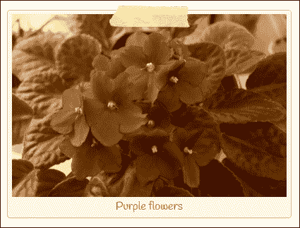

就我们使用的代码而言，这个版本的过滤器可能看起来略有不同，但这主要是由于将其重新配置为插件，以及变量名称的一些更改。如果我们仔细观察，我们会发现在这两个例子中使用了相同的原则，但产生了相同图像的两个不同版本。

### 提示

如果您想了解更多有关使用和`getImageData()`方法的信息，请参阅 W3School 的教程，该教程可在[上获得 http://www.w3schools.com/tags/canvas_getimagedata.asp](http://www.w3schools.com/tags/canvas_getimagedata.asp) 。

## 混合图像

在我们的第三个也是最后一个演示中，为了证明`getImageData()`的多功能性，我们将在本章中使用的同一个花卉图像中添加一个色调。

这个演示相对简单易实现。我们已经有了一个插件形式的框架；我们所需要做的就是交换嵌套的`for…`块，并用我们的新版本替换它。让我们开始：

1.  在`manual-sepia.js`的副本中，在**17**行或其周围查找以下行：

    ```js
    for (var y = 0; y < imgData.height; y++) {
    ```

2.  高亮显示并移除直至第**25 行。**替换为以下代码：

    ```js
        var r_weight = 0.44;
        var g_weight = 0.5;
        var b_weight = 0.16;
        var r_intensity = 255;
        var g_intensity = 1;
        var b_intensity = 1;

        var data = imgData.data;
        for(var i = 0; i < data.length; i += 4) {
          var brightness = r_weight * data[i] + g_weight * data[i + 1] + b_weight * data[i + 2];
          data[i] = r_intensity * brightness; // red
          data[i + 1] = g_intensity * brightness; // green
          data[i + 2] = b_intensity * brightness; // blue
        }
        ctx.putImageData(imgData, 0, 0);
    ```

3.  For now, save the file as `manual-sepia.js`, then preview `manual-sepia.html` in a browser. If all is well, we should see the image appear, but this time with a red tint, as in the following image:

    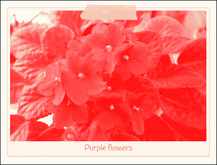

本演示中使用的数学看起来很简单，但可能需要一些解释。这是一个两阶段的过程，我们首先使用`_weight`变量计算亮度级别，然后使用`_intensity`变量计算相关的强度级别，然后再将其应用于适当的颜色通道。

掌握使用此方法构建过滤器所需的数学知识可能需要时间（这超出了本书的范围），但一旦您理解了数学知识，它就打开了一些真正的可能性！

### 注

为了方便起见，我在这个演示中重复使用了相同的文件，以证明我们可以应用特定的色调。实际上，我们需要重新命名插件名称，以更好地反映所使用的颜色（在本例中，颜色不是深褐色！）。

我们当然可以更进一步。要做到这一点，可能需要一些核心的数学知识，所以不适合胆小的人！如果你喜欢这个挑战，那么一个很好的起点就是学习如何使用**卷积掩模**，它将看起来像下面这样（这一个用于模糊图像）：

```js
    [.1, .1, .1],
    [.1, .2, .1],
    [.1, .1, .1],
```

这将允许我们制作一些非常复杂的过滤器，例如 Sobel 过滤器（[http://en.wikipedia.org/wiki/Sobel_operator](http://en.wikipedia.org/wiki/Sobel_operator) ），甚至是拉普拉斯过滤器（[http://en.wikipedia.org/wiki/Discrete_Laplace_operator#Implementation_in_Image_Processing](http://en.wikipedia.org/wiki/Discrete_Laplace_operator#Implementation_in_Image_Processing) –请注意：数学真的很核心！为了让事情变得简单一点，可以看看谷歌。以下是一些有用的起点：

*   [http://halfpapstudios.com/blog/2013/01/canvas-convolutions/](http://halfpapstudios.com/blog/2013/01/canvas-convolutions/)
*   [https://thiscouldbebetter.wordpress.com/2013/08/14/filtering-images-with-convolution-masks-in-javascript/](https://thiscouldbebetter.wordpress.com/2013/08/14/filtering-images-with-convolution-masks-in-javascript/)
*   [http://beej.us/blog/data/convolution-image-processing/convolution.js](http://beej.us/blog/data/convolution-image-processing/convolution.js)

让我们改变轨道！我们已经用不同的方法对图像应用了很多过滤器，但是有人注意到效果有多突然吗？一个更令人愉快的方法是设置过渡过程的动画。让我们来看看我们如何能够做到这一点，使用 Tyt ??。

# 使用过滤器设置图像动画

好的，我们已经介绍了许多不同的方法来应用过滤器来处理图像的外观。在我们继续看一些实际例子之前，让我们暂停一下。

有没有人注意到在使用 jQuery 时，我们如何失去从一种状态逐渐过渡到另一种状态的能力？过渡只是一种为任何状态变化提供良好触感的方式——毕竟，眼睛逐渐改变状态要比看到突然的切换容易得多！

我们可以花时间使用 jQuery 从头开始构建解决方案。然而，更谨慎的解决方案是为此使用插件。

## 介绍 cssAnimate

输入 cssAnimate！Clemens Damke 制作的这个小小的 gem 生成了必要的 CSS3 样式来设置状态更改的动画，但如果不支持，就转而使用 jQuery 的`animate()`方法处理程序。该插件可从[下载 http://cortys.de/cssAnimate/](http://cortys.de/cssAnimate/) 。尽管该站点指出了 jQuery 1.4.3 或更高版本的最低要求，但与 jQuery 2.1 一起使用时，它不会出现明显的问题。

让我们看一看我们将要生产的截图：

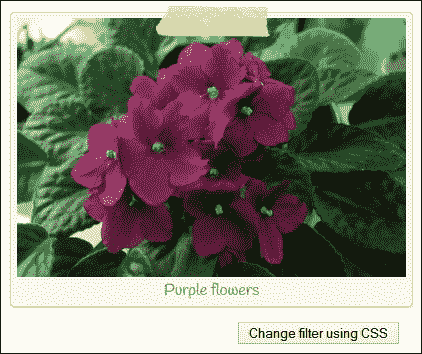

让我们开始：

1.  我们将从本书附带的代码下载中提取以下文件：`cssanimate.html`、`cssanimate.css`、`flowers.jpg`、`jquery.min.js`和`jquery.cssanimate.min.js`。
2.  将 JavaScript 文件保存到`js`子文件夹，将图像保存到`img`文件夹，将 CSS 文件保存到`css`子文件夹，将 HTML 标记保存到项目区域的根文件夹。
3.  在一个单独的文件中，添加以下代码，以动画方式更改`hue-rotate`过滤器：

    ```js
    $(document).ready(function(){
      $("input[name='css']").on("click", function(){
        $("img").cssAnimate({filter: hue-rotate(50deg), -webkit- filter: hue-rotate(50deg)}, 500, "cubic-bezier(1,.55,0,.74)");
      })
    });
    ```

4.  如果一切顺利，我们应该看到当使用 CSS 按钮点击**更改过滤器时，花朵会变成深粉色，如我们练习开始时所示。**

在第一次出现时，我们将看到的唯一变化是在图像中过渡到较深的粉红色。但是，如果我们使用 DOM 检查器（如 Firebug）检查代码，真正的变化将显示出来：

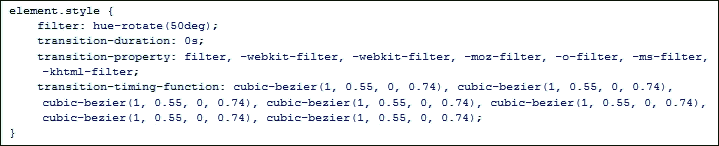

这个库的美妙之处在于，尽管它已经有几年的历史了，但它似乎仍然可以很好地与 jQuery 的现代版本配合使用。它开辟了一些真正的途径，我们可以探索，在过渡动画方面，我们可以使用。

### 注

除了 Opera Mini 之外，所有主要浏览器都几乎 100%支持转换。要获得最新的图片，请查看位于[的站点 http://caniuse.com/#feat=css-转变](http://caniuse.com/#feat=css-transitions)。

尽管 cssAnimate 中的内置动画数量有限，但它至少支持立方贝塞尔值。马修·莱恩（Matthew Lein）制作了一个包含许多立方贝塞尔等价物的文件，用于著名的缓和效果；这可从[获得 https://github.com/matthewlein/Ceaser/blob/master/developer/ceaser-easings.js](https://github.com/matthewlein/Ceaser/blob/master/developer/ceaser-easings.js) 。我们可以使用它来提供可以放入动画中以产生所需效果的值。或者，我们可以使用[等网站设计我们自己的立方贝塞尔缓和效果 http://cubic-bezier.com](http://cubic-bezier.com) -这提供了类似的值，可以以相同的方式在我们的动画中使用。

### 注

顺便说一句，我在研究这本书时遇到了这个简洁的小演示：[http://codepen.io/dudleystorey/pen/pKoqa](http://codepen.io/dudleystorey/pen/pKoqa) 。我想知道我们是否可以使用 cssAnimate 来产生类似的效果？

好了，现在过滤器已经够多了！让我们换个话题，深入到更实际的话题上来。你们中有多少人必须使用电子签名在网上签名？如果情况需要，合并会产生很大的效果。我们将了解如何保存图像，但要进一步扩展它，以便保存图像供以后使用。

# 创建签名板并导出图像

现在，我们已经了解了如何操纵图像，让我们把注意力转向更基本的东西；捕获在画布元素上绘制的图像。

随着我们越来越多地进入数字世界，有时会要求我们使用计算机以电子方式“签署”文件。它确实意味着我们不应该考虑在一个沉重的夜晚之后的早晨签署任何东西，但是更糟的事情可能发生……在这一点上，让我们来看看我们如何能够捕捉到的图像，一旦文件已经签署。

在这个演示中，我们将使用 Thomas Bradley 为 jQuery 设计的签名板插件。该插件可从[获得 http://thomasjbradley.ca/lab/signature-pad](http://thomasjbradley.ca/lab/signature-pad) 。我们将更进一步–我们将提供一个选项，使用`canvas.toDataURL()`方法将输出保存为 PNG 文件，而不仅仅是签名。

### 注

请记住，如果您使用 Chrome，请按照*准备*部分的建议，在本地 web 服务器中运行此演示。

让我们开始：

1.  我们将首先从本书附带的代码下载中下载此演示所需的 CSS 和 HTML 标记文件。继续提取签名板文件夹并将其保存到项目区域。
2.  Next, add the following code to a new file – save it as `signaturepad.js`, within the `js` subfolder of our demo folder:

    ```js
    $(document).ready(function() {
      $('.sigPad').signaturePad();
      var canvas = $('#canvas')[0], ctx = canvas.getContext('2d');

      $('#download').on('click', function() {
        saveImage();
        downloadCanvas(this, 'canvas', 'signature.png');
      });

      function saveImage() {
        var api = $('.sigPad').signaturePad();
        var apitext = api.getSignatureImage();
        var imageObj = new Image();
        imageObj.src = apitext;
        imageObj.onload = function() {
          ctx.drawImage(imageObj, 0, 0);
        };
      }

      function downloadCanvas(link, canvasId, filename) {
        link.href = $(canvasId)[0].toDataURL();
        link.download = filename;
      }
    });
    ```

    ### 注

    代码下载中已经有此文件的版本；提取`signaturepad-completed.js`并将其重命名为`signaturepad.js`，然后存储在本演示中概述的相同`js`文件夹中。

3.  If we preview the results in a browser, we should see a signature pad displayed, as shown in the following screenshot:

    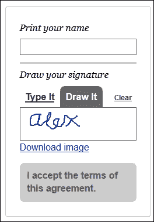

在这个截图中，我已经添加了我的名字。试着点击**画**然后画出你的名字——小心，这需要一只稳定的手！接下来，单击链接。如果一切正常，系统将提示我们打开或保存名为`signature.png`的文件。在合适的图形包中打开它可以确认签名已正确保存。请参阅下图：


虽然这是一个相对简单的演示，但它开启了一些真正的可能性。除了我们使用的签名插件之外，这个演示的关键有两个方面：使用`<canvas>`元素捕获绘制的签名，以及使用`.toDataURL()`方法将画布元素的内容转换为数据 URI，其中包含 PNG 格式的图像表示（默认情况下）。

我们首先获取画布元素的句柄，然后将图像绘制到画布元素上。一旦启动下载事件处理程序，它就会将图像转换为数据 URI 表示，然后将其呈现为我们可以保存以供以后使用的格式。

### 注

如果您想了解更多关于和`toDataURL()`方法的信息，那么 Mozilla 的开发者实验室有一篇很好的文章，可以在[上找到 https://developer.mozilla.org/en-US/docs/Web/API/HTMLCanvasElement.toDataURL](https://developer.mozilla.org/en-US/docs/Web/API/HTMLCanvasElement.toDataURL) 。

让我们好好利用这项技术，并将其与本章开头介绍的网络摄像头和图像处理技术结合起来。这让我们变得非常疯狂；想不想通过捕获和更改网络摄像头图像来获得乐趣？

# 捕获和操作网络摄像头图像

在本章的第二个也是最后一个演示中，我们将通过网络摄像头获得一些乐趣–我们获取和处理图像的方法之一是从笔记本电脑或独立网络摄像头获取图像。

本演示的关键在于使用`getUserMedia`，它允许我们控制音频或视频馈送。这是一个相对年轻的 API，需要使用供应商前缀来确保完全支持。与其他 API 一样，对它们的需求将随着时间的推移而消失，因此值得检查[http://caniuse.com/#search=getusermedia](http://caniuse.com/#search=getusermedia) 定期查看支持是否已更新，是否需要删除前缀。

本演示将汇集我们所探讨的一些概念，例如应用过滤器、将画布图像保存到文件以及控制网络摄像头。要正确操作此演示，我们需要从 HTTP 协议地址而不是`file://.`运行它。为此，您需要一些可用的 web 空间，或者使用本地 web 服务器，如 WAMP（用于 PC–[）http://www.wampserver.com/en](http://www.wampserver.com/en) ）或 MAMP（适用于 Mac，现在是 PC，来自 [http://www.mamp.info/en/](http://www.mamp.info/en/) ）。

好的，假设这是在的地方，让我们开始：

1.  我们将从本书附带的代码下载中提取`webcam demo`文件夹开始。它包含本演示所需的 jQuery 库的样式、标记和副本。
2.  提取后，将整个文件夹上载到您的 web 空间。我假设您使用的是 WAMPServer，因此这将是`/www`文件夹；如果您使用的是不同的东西，请相应地修改。
3.  我们需要添加 jQuery 的魔力，使这个演示能够正常工作。在新文件中，继续并添加以下代码；我们将分几节讨论它，从分配变量和过滤器数组开始：

    ```js
    $(document).ready(function() {
      var idx = 0;
      var filters = ['grayscale', 'sepia', 'blur', 'saturate', ''];

      var canvas = $("canvas")[0], context = canvas.getContext("2d"),
      video = $("video")[0], localStream, videoObj = { "video": true }, errBack = function(error) {
          console.log("Video capture error: ", error.code);
        };
    ```

4.  第一个函数处理过滤器的分页。我们遍历存储在过滤器数组中的过滤器名称。如果样式表中有相应的样式规则，则将以下内容应用于画布图像：

    ```js
      function changeFilter(e) {
        var el = e.target;
        el.className = '';
        var effect = filters[idx++ % filters.length];
        if (effect) {
          el.classList.add(effect);
        }
      }
    ```

5.  接下来，我们需要得到一个`getUserMedia`的实例，我们用它来控制网络摄像头。由于这仍然是一个相对年轻的 API，我们不得不使用供应商前缀：

    ```js
      navigator.getUserMedia = (navigator.getUserMedia || navigator.webkitGetUserMedia || navigator.mozGetUserMedia || navigator.msGetUserMedia);
    ```

6.  作为几个事件处理程序中的第一个，`#startplay`按钮是最重要的。在这里，我们捕获网络摄像头源，然后将其分配给视频对象，并生成引用我们内容的 URL。分配后，我们开始播放视频提要，这允许我们查看屏幕上的内容：

    ```js
      $("#startplay").on("click", function(e) {
        if (navigator.getUserMedia) {
          navigator.getUserMedia(videoObj, function(stream) {
            video.src = window.URL.createObjectURL(stream);
            localStream = stream;
            video.play();
          }, errBack);
        }
      });
    ```

7.  然后我们需要分配一些事件处理程序。按照顺序，以下句柄请求拍摄快照图像、停止视频、更改过滤器并下载快照图像的副本：

    ```js
      $("#snap").on("click", function() {
        context.drawImage(video, 0, 0, 320, 240);
      });

      $("#stopplay").on("click", function(e, stream) {
        localStream.stop();
      });

      $('#canvas').on('click', changeFilter);

      $("#download").on('click', function (e) {
        var dataURL = canvas.toDataURL('image/png');
        $("#download").prop("href", dataURL);
      });
    });
    ```

8.  将文件另存为本演示前面上载的`webcam demo`文件夹的`js`子文件夹中的`webcam.js`。
9.  At this point, we can try running the demo within a browser. If all is well, we will first get a request to allow the browser access to the webcam (for security reasons), as shown in the following image:

    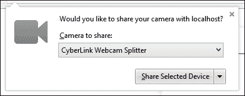

10.  This is then followed by an initialization of the camera. It starts with a placeholder image, as shown next; this will then display the live feed within a few moments:

    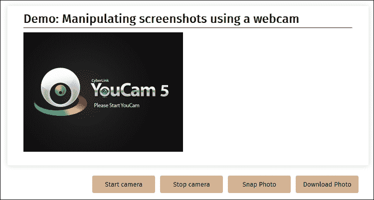

就这一点而言，我们可以享受各种各样的乐趣。试着点击**快照**来拍摄自己的快照；这将显示在实时提要的右侧。如果单击此图像，它将循环通过我们在样式表中设置的几个过滤器，并使用`webcam.js`中的以下行进行引用：

```js
  var filters = ['grayscale', 'sepia', 'blur', 'saturate', ''];
```

等等–有没有人注意到我们在点击**下载照片**按钮时看到的图片？你们当中目光敏锐的人很快就会发现，在应用过滤器之前，这是原始图像的副本。

这是因为过滤器是在 CSS 中设置的–当然，它们只有在浏览器窗口中显示时才有任何效果！要解决这个问题，我们需要修改下载事件处理程序。我们可以使用前面探讨过的 CamanJS 库来应用一些基本的过滤器，例如库中附带的日出效果。

为此，更改`#download`事件处理程序以显示以下代码：

```js
  $("#download").on('click', function (e) {
    e.preventDefault();
    Caman('#canvas', function(){
      this.sunrise();
      this.render(function() { this.save("webcam-photo.png"); });
    });
  });
```

现在尝试保存屏幕截图的副本。虽然它不会强制下载到您的桌面，但它仍会在浏览器中显示一个图像，显示应用于它的日出过滤器。

我们只触及了使用`getUserMedia`时可能出现的问题的表面——很值得在线探索以了解更多信息。Mozilla 开发者网络上的文章是一个很好的起点，该文章可在[上找到 https://developer.mozilla.org/en-US/docs/NavigatorUserMedia.getUserMedia](https://developer.mozilla.org/en-US/docs/NavigatorUserMedia.getUserMedia) 。注–`getUserMedia`在下面的 IE11 或中不受支持，因此您需要使用一个 polyfill 库，如 Addy Osmani 的`getUserMedia.js`，可在[下载 https://github.com/addyosmani/getUserMedia.js](https://github.com/addyosmani/getUserMedia.js) 。

### 注

作为旁白，我曾考虑在本书中加入一些关于使用 reveal.js 库控制简单的图像库的内容，如[所示 http://www.chromeexperiments.com/detail/gesture-based-revealjs/](http://www.chromeexperiments.com/detail/gesture-based-revealjs/) 。不幸的是，代码不是坚如磐石，而且已经有一段时间没有更新了。我很想听听你的想法。这是一个很好的展示内容的方式，但是需要更多的工作！

# 结束

在我们讨论这一章之前，我们需要暂停一下，来考虑我们在本章中所涉及的一些技术的含义。

纯粹主义者可能会质疑使用 jQuery 应用过滤器的必要性，特别是如果我们只需要使用`.addClass()`或`.toggleClass()`等方法来应用或删除特定过滤器。另一方面，这本书当然是关于 jQuery 的，这是我们应该集中精力使用的，即使在显示我们使用过的一些过滤效果时出现了明显的延迟。

这个问题的简短答案取决于您——任何人都可以或多或少地编写 jQuery 代码，但普通开发人员和优秀开发人员之间的区别不仅仅在于编写代码。

真正的区别部分在于做出正确的选择。jQuery 通常被认为是一个简单的选项，特别是因为它提供了最广泛的支持。我们可以创建任何类型的过滤器来满足我们的需要，但这总是以牺牲处理能力为代价的——我们无法摆脱这样一个事实：操纵画布元素需要大量资源，因此完成起来很慢。如果使用高清晰度图像（正如我们在*应用带有 CamanJS*的过滤器一节中指出的那样），效果也不会更好——事实上，如果需要处理更多像素，效果会更慢！

其结果是，我们需要仔细考虑我们需要应用哪些过滤器，以及是否可以简单地使用 CSS3 过滤器来满足我们的需要。诚然，这些可能无法为我们的所有需求提供解决方案，但支持正在发生变化。我们确实应该考虑使用 jQuery 过滤器，其中延迟不是问题，并且应用程序不会在移动平台上使用（因为处理每个像素所需的资源）。

# 总结

处理图像是 jQuery 中的一个悖论——我们可以使用 CSS3 过滤器来产生简洁的效果，但只限于 CSS3 过滤器所能提供的效果；或者，我们可以生产我们想要的任何过滤器，但代价是在像素级操作图像所需的处理资源！在这一章里，我们介绍了很多信息，所以让我们花些时间复习一下我们所学的知识。

我们首先介绍了如何使用 CSS3 添加过滤器，并了解了将这些过滤器应用于图像是多么容易。然后，我们开始研究使用 CSS3 混合图像的另一种技术，然后再研究 jQuery 图像插件。

我们花了一点时间研究了一些应用过滤器的基本选项，然后创建了我们自己的基于 jQuery 的过滤器。然后，我们转而研究如何使用过滤器来设置过渡动画，以帮助提供更平滑的过渡，最后，我们研究了使用签名板和网络摄像头创建基本演示，作为使用 jQuery 捕获图像的一种手段。

然后，我们在这一章中总结了一些关于何时应该使用 CSS3 过滤器或 jQuery 的最终想法，以强调任何人都可以编写代码，但优秀的开发人员知道在他们的开发过程中的正确时间使用哪个工具。

在下一章中，我们将扩展插件的使用，并将我们的插件开发技能提升到一个新的水平。