# 十一、创建高级插件

在本书中，一个共同的主题是使用插件——现在是创建插件的时候了！

实际上有数千个插件可供使用，从可能只有几行的插件到运行数百行的插件。我非常相信“有志者事竟成”这句话——可以说插件满足了这一意愿，并为用户提供了解决需求或问题的方法。

在接下来的几页中，我们将从头到尾介绍如何开发一个高级插件。我们不会只关注构建（就其本身而言），我们将看看一些技巧和技巧，这些技巧和技巧可以帮助我们在使用插件时进一步提高开发技能。我们将介绍最佳实践，并介绍一些可以提高当前编码技能的领域。在接下来的几页中，我们将介绍一些主题，包括：

*   最佳做法和原则
*   检测开发不良插件的迹象
*   为 jQuery 插件创建设计模式
*   设计高级插件并使其可用

准备好开始了吗？

# 检测到未开发插件的迹象

想象一下这个场景，如果你愿意的话——你花了数周的时间开发了一个复杂的插件，除了厨房水槽，它什么都可以做，让所有人都敬畏不已。

听起来像是完美的涅盘，对吧？你可以在 GitHub 上发布它，创建一个很棒的网站，然后等待用户登录并下载你的最新作品。你等了…等了…但是总共没有顾客。好吧…那你有什么好处？

正如我常说的，任何人都可以编写代码。成为一名更好的 jQuery 插件开发人员的关键是理解什么是一个好插件，并知道如何将其付诸实践。为了帮助这一点，让我们花些时间看看一些插件，当插件可能失败时，我们可以使用这些指针。

*   你不是在做插件！公认的做法是使用少数几个插件模式之一。如果您没有使用这些模式中的一种（如下面所示），那么插件的使用率很可能很低。

    ```js
    (function($, window, undefined) {
      $.fn.myPlugin = function(opts) {
        var defaults = {
        // setting your default values for options
      }
      // extend the options from defaults with user's options
      var options = $.extend(defaults, opts || {});
      return this.each(function(){ // jQuery chainability
        // do plugin stuff
      });
    })(jQuery, window);
    ```

*   虽然我们在参数中定义了`undefined`，但在自调用函数中只使用`$`和`window`。它保护插件不被恶意值传递到`undefined`，因为它将在插件中保持为`undefined`。
*   您花时间编写代码，但却错过了一个关键要素——准备文档！我一次又一次地看到插件的文档很少或根本不存在。这使得人们很难理解插件的构成，也很难找到如何充分利用它的潜力的方法。文档编制没有硬性规定，但一般认为越多越好，这应该是内联的和外部的（以自述或 wiki 的形式）。
*   继续以缺乏合适的文档为主题，开发人员将被具有硬编码样式或过于死板的插件关闭。我们应该考虑所有可能的需求，但要确定我们是否能为特定的需求提供解决方案。应用于插件的任何样式都应该通过插件选项提供，或者作为样式表中的特定类或选择器 ID 提供–将其放在行中被认为是不好的做法。
*   如果你的插件需要太多的配置，那么这很可能会让人厌烦。虽然一个更大、更复杂的插件显然应该为最终用户提供更多的选项，但应该提供的是有限的。相反，每个插件至少应该有一个无参数默认行为集；用户不会喜欢仅仅为了让插件工作而设置多个值！
*   对于终端用户来说，一个大的障碍是没有提供某种形式示例的插件。至少应该提供一个基本的“hello world”类型示例，并定义一个最小的配置。那些提供更多相关示例的插件，甚至是与其他插件一起使用的示例，可能会吸引更多的人。
*   一些插件失败的基本原因。这些包括：不提供变更日志或使用版本控制，不跨多个浏览器工作，使用过时的 jQuery 版本，或在不需要时包括它（依赖项太低），或者不提供插件的精简版本。有了咕噜，就没有借口了！我们可以自动化开发人员期望的大部分基本管理任务，例如测试、缩小插件或维护版本控制。
*   最后，插件失败的原因有两个：要么它们太聪明，试图实现太多（使它们难以调试），要么太简单，对 jQuery 作为库的依赖性不足以保证包含它。

显然有很多事情要考虑！虽然我们无法预测插件是否会成功或占用率是否低，但我们至少可以尝试通过将这些技巧中的一些（或全部）融入我们的代码和开发工作流程来最小化失败的风险。

但在更实际的层面上，我们可以选择遵循许多设计模式中的任何一种，以帮助我们的插件提供结构和一致性。我们在[第 3 章](03.html#aid-TI1E1 "Chapter 3. Organizing Your Code")*组织代码*中提到了这一点。美妙的是，我们也可以自由地使用 jQuery 插件的类似原理！让我们花一点时间考虑一些可能的例子，然后再使用一个开发简单的插件。

# 介绍设计模式

如果你花过任何时间在 jQuery 中开发代码，那么很可能你已经创建了一个或多个插件；从技术上讲，这些可以从几行到一些更为实质性的内容。

随着时间的推移，修改插件中的代码可能会导致内容变得笨拙和难以调试。处理这个问题的一种方法是使用设计模式。我们在[第 3 章](03.html#aid-TI1E1 "Chapter 3. Organizing Your Code")*组织您的代码*中对此进行了介绍。许多相同的原则同样适用于插件，尽管模式本身当然会有所不同。让我们考虑几个例子。

最基本的模式是**A****Lightweight Start**，这将适合那些以前开发过插件的人，但对于遵循特定模式的概念来说是全新的。此特定模式基于常见的最佳实践，例如在调用函数之前使用分号；它将传入标准参数，如`window`、`document`和`undefined`。它包含一个我们可以扩展的基本默认对象，并在构造函数周围添加一个包装器，以防止多个安装出现问题。

在另一端，我们可以尝试使用**完整的小部件工厂。**虽然它是 jQuery UI 的基础，但也可以用来创建标准的 jQuery 插件。这种模式非常适合创建复杂的、基于状态的插件。它包含所有使用方法的注释，以帮助确保逻辑适合插件。

我们还介绍了名称空间的概念，或添加特定名称以避免与全局名称空间中的其他对象或变量发生冲突。虽然我们可以在代码中使用名称空间，但我们同样可以将其应用于插件。这个特殊模式的好处在于我们如何检查它的现有实例；如果名称不存在，那么我们可以自由添加它，否则我们可以使用相同的名称空间扩展现有插件。

这是三种可用的插件模式；不过，我肯定会出现一个问题，那就是使用哪一个？就像很多事情一样，没有对错的答案；这将取决于具体情况。

### 注

最常见的插件设计模式列表可在[上找到 https://github.com/jquery-boilerplate/jquery-patterns](https://github.com/jquery-boilerplate/jquery-patterns) 。

## 创建或使用模式

如果你对使用插件设计模式还不熟悉，那么轻量级的开始是最好的开始。使用任何插件模式或设计自己的插件模式有三个关键方面：

*   **架构**：这个定义了组件应该如何交互的规则。
*   **可维护性**：任何编写的代码都应该易于扩展和改进。它不应该从一开始就被锁定。
*   **可重用性**：您多久可以重用一次现有代码？重复使用的次数越多，节省的时间就越多，维护也就越容易。

使用模式的重要一点是没有一个正确的答案。这一切归结为哪种模式最适合您的需要。衡量哪种模式最适合的最好方法是尝试它们。随着时间的推移，经验将为您提供一个清晰的指示，表明哪种模式最适合给定的场景。

### 提示

为了更好地讨论使用特定插件模式的利弊，请浏览[上的《粉碎》杂志的文章 http://www.smashingmagazine.com/2011/10/11/essential-jquery-plugin-patterns/](http://www.smashingmagazine.com/2011/10/11/essential-jquery-plugin-patterns/) 。它可能有几年的历史了，但许多积分仍然有价值。

不管怎样，让我们回到现在！没有比现在更好的时间来获取经验，所以让我们来看看 jQuery 轻量级的样板模式。这实现了单例/模块设计模式。它帮助开发人员编写可避免污染全局命名空间的封装代码。

在接下来的几页中，我们将开发一个工具提示插件。我们将从一个不使用任何模式的典型构建开始，然后将其修改为使用轻量级样板样式。然后，我们将深入研究一些技巧和技巧，这将帮助我们考虑更大的前景，并希望使我们成为更好的开发人员。

# 设计高级插件

没错，闲聊够了！让我们开始写代码吧！在接下来的几页中，我们将花一些时间开发一个插件，在页面上显示一些简单的工具提示。

好吧，在你们抱怨说“不是另一个工具提示插件…”之前，选择这个功能有一个很好的理由。一旦我们开发出插件的第一个版本，一切都将变得清晰。让我们开始吧-我们将从创建插件的简要介绍开始：

1.  对于本演示，我们需要本书附带的代码下载中本章的完整代码文件夹。继续提取，保存到我们的项目区域。
2.  In the folder, run the `tooltipv1.html` file, which contains a grid of six images, along with some dummy text. Hover over the images in turn. If all is well, it will show a tooltip:

    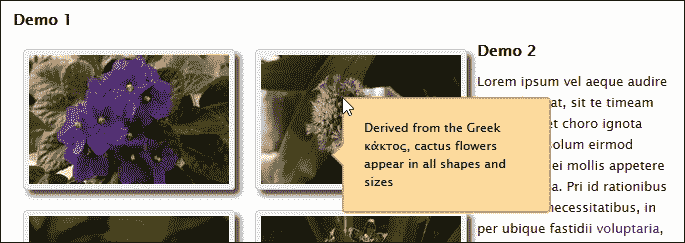

在这一点上，您可能想知道所有代码是如何连接在一起的。这是一个合理的问题……但我们要打破传统，而不是去研究它。相反，我想集中精力重新设计代码，以使用样板格式，这将有助于将来更容易阅读、调试和扩展。让我们考虑一下这对我们的插件意味着什么。

## 使用样板文件重建我们的插件

如果你没听说过样板戏，请举手？您可能会或者可能没有遇到过 Bootstrap（[这样的例子 http://www.getbootstrap.com](http://www.getbootstrap.com) ），甚至 HTML5 样板文件（[https://html5boilerplate.com/](https://html5boilerplate.com/) 。为了帮助您熟悉这个术语，它基于一个简单的想法，即使用模板帮助构建代码。这并不意味着它会为我们编写代码（羞耻——我们什么都不做就可以赚几百万，咯咯笑！），但它通过重用框架快速开发代码（例如完整的网站，甚至 jQuery 插件）来帮助节省时间。

在下一个演示中，我们将使用[提供的 jQuery 样板模板重新设计插件 https://github.com/jquery-boilerplate/jquery-patterns](https://github.com/jquery-boilerplate/jquery-patterns) 。就像互联网上经常出现的情况一样，一些善良的灵魂已经创造了一个使用这种技术的工具提示的好例子，所以我们将根据我们的需要来调整它。

### 提示

如果您有兴趣了解更多关于 jQuery 样板插件模式的信息，您可能想看看由 Jonathan Fielding 编写的*插件即时 jQuery 样板*，可从 Packt Publishing 获得。

我们将使用的插件示例是法国 web 开发人员 Julien G。原件可通过 JSFIDLE 在[上获取 http://jsfiddle.net/molokoloco/DzYdE/](http://jsfiddle.net/molokoloco/DzYdE/) 。

1.  让我们（一如既往地）从本书的代码下载中提取本章代码文件夹的副本。如果您已经从上一个练习中获得了它，那么我们可以使用它。
2.  导航到`version 2`文件夹，然后在浏览器中预览`tooltipv2.html`。如果一切正常，我们将看到与上一个示例中相同的图像集，并为工具提示应用相同的样式。

从表面上看，似乎什么都没有改变——这本身就是成功的一个很好的指标！但真正的变化在`tooltipv2.js`中，在`version 2`文件夹下的`js`子文件夹中。让我们从声明变量开始，一步一步地完成这个过程：

1.  我们首先声明 jQuery、`document`、`window`和`undefined`的属性。您可能会问我们为什么要传入`undefined`——这是一个很好的问题：这个属性是可变的（意味着它可以更改）。尽管它在 ECMAScript 5 中被设置为不可写，但在我们的代码中不使用它意味着它可以保持未定义状态并防止恶意代码尝试。通过传递其余三个属性可以更快地在代码中引用：

    ```js
    (function($, window, document, undefined) {
      var pluginName = 'tooltip', debug = false;
    ```

2.  接下来是内部方法。我们在`internal`对象中创建作为方法；第一个负责在屏幕上定位工具提示，而`show`和`hide`控制工具提示的可见性：

    ```js
    var internal = {
      reposition: function(event) {
        var mousex = event.pageX, mousey = event.pageY;

        $(this)
        .data(pluginName)['tooltip']
        .css({top: mousey + 'px', left: mousex + 'px'});
      },

      show: function(event) {
        if (debug) console.log(pluginName + '.show()');
        var $this  = $(this), data = $this.data(pluginName);

        data['tooltip'].stop(true, true).fadeIn(600);
        $this.on('mousemove.' + pluginName, internal.reposition);
      },

      hide: function(event) {
        if (debug) console.log(pluginName + '.hide()');
        var $this = $(this), data  = $this.data(pluginName);
        $this.off('mousemove.' + pluginName, internal.reposition);
        data['tooltip'].stop(true, true).fadeOut(400);
      }
    };
    ```

3.  我们继续讨论外部方法。首先从`external`对象中启动`init`函数，初始化我们的插件并将其呈现在屏幕上。然后，当将移动到具有`.tooltip`类

    ```js
    var external = {
      init: function(options) {
        if (debug) console.log(pluginName + '.init()');

        options = $.extend(
          true, {},
          $.fn[pluginName].defaults,
          typeof options == 'object' &&  options
        );

        return this.each(function() {
          var $this = $(this), data = $this.data(pluginName);
          if (data) return;

          var title = $this.attr('title');
          if (!title) return;
          var $tooltip = $('<div />', {
            class: options.class,
            text:  title
          }).appendTo('body').hide();

          var data = {
            tooltip:   $tooltip,
            options:   options,
            title:     title
          };

          $this.data(pluginName, data)
            .attr('title', '')
            .on('mouseenter.' + pluginName, internal.show)
            .on('mouseleave.' + pluginName, internal.hide);
          });
        },
    ```

    实例的元素上时，我们调用`internal.show`和`internal.hide`内部方法
4.  第二个外部方法使用`.data()`方法

    ```js
        update: function(content) {
          if (debug) console.log(pluginName + '.update(content)', content);
          return this.each(function() {
            var $this = $(this), data  = $this.data(pluginName);
            if (!data) return;
            data['tooltip'].html(content);
          });
        },
    ```

    处理工具提示文本的更新
5.  我们用一个`destroy()`处理程序汇总了插件中可用的方法。这将停止显示选定的工具提示，并从代码中删除元素：

    ```js
        destroy: function() {
          if (debug) console.log(pluginName + '.destroy()');

          return this.each(function() {
            var $this = $(this), data  = $this.data(pluginName);
            if (!data) return;

            $this.attr('title', data['title']).off('.' + pluginName)
              .removeData(pluginName);
              data['tooltip'].remove();
          });
        }
      };
    ```

6.  最后，但决不是最不重要的是我们的插件发起人。此函数只是将方法名称映射到插件中的有效函数，如果它们不存在，则会优雅地降级：

    ```js
    $.fn[pluginName] = function(method) {
      if (external[method]) return external[method]
      apply(this, Array.prototype.slice.call(arguments, 1));
      else if ($.type(method) === 'object' || !method) 
      return external.init.apply(this, arguments);
      else $.error('Method ' + method + ' does not exist on
      jQuery.' + pluginName + '.js');
    };
      $.fn[pluginName].defaults = {
      class: pluginName + 'Element'
      };
    })(window.jQuery);
    ```

尽管从这个演示中获得的关键不是我们可以使用的特定功能，而是用于生成插件的格式。

任何人都可以编写代码，但使用我们在这里使用的样板模式将有助于提高可读性，使调试更容易，并在以后扩展或升级功能时增加机会。记住，如果你写了一个插件并且在一段时间内（比如 6 个月）没有重新访问它；然后，acid 测试是您可以从结构良好的代码中计算出多少，而不需要大量文档。如果你不能做到这一点，那么你需要重新审视你的编码！

让我们继续。还记得我提到选择使用工具提示插件作为示例的基础时有一个很好的理由吗？是时候揭示为什么…

# 将动画自动转换为使用 CSS3

我们已经构建了一个工具提示插件，当鼠标悬停在标有`.tooltip`类的元素上时，它会使用一点动画来淡入淡出。这没什么错——代码运行得非常好，是一种可以接受的显示内容的方式……对吗？错误的你现在应该知道，我们绝对可以做得更好。下面是我选择工具提示作为示例的原因。

还记得我在《第 6 章》中提到的，在 jQuery 中，我们应该考虑使用 CSS3 样式来控制我们的动画吗？好的，这里有一个完美的例子：我们可以很容易地更改代码，迫使 jQuery 在可能的情况下使用 CSS3，或者在较旧的浏览器上使用该库。

其背后的诀窍在于一句话：

```js
<script src="js/jquery.animate-enhanced.min.js"></script>
```

要了解这有多容易，请执行以下步骤：

1.  在`tooltipv2.html`的副本中，添加该行，如图所示：

    ```js
      <script src="js/jquery.min.js"></script>
     <script src="js/jquery.animate-enhanced.min.js"></script>
      <script src="http://code.jquery.com/ui/1.11.3/jquery-ui.min.js"></script>
      <script src="js/jquery.quicktipv2.js"></script>
      <script src="js/tooltipv2.js"></script>
    ```

2.  Preview the results in a browser. If all is well, we should see some slight changes in how the tooltip reacts. However, the real change is evident when viewing the code for the tooltip itself, from within a DOM Inspector such as Firebug:

    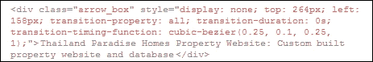

如果我们查看 Firebug 的 computed styles 一半，我们可以看到分配给 tooltip 元素的样式：

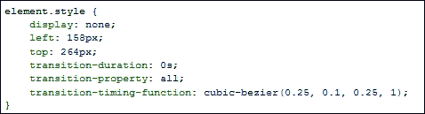

这是一个简单的改变，但希望我们能看到它在性能上有显著的改进。在本例中，我们使用一个插件强制 jQuery 使用 CSS3 样式来代替基于 jQuery 的标准动画。

然而，这里的关键信息是，作为开发人员，我们不应该感到我们被限制使用 jQuery 来提供动画。虽然这可能是管理复杂运动的必要之恶，但我们仍然应该考虑使用它来减少那些复杂的情况。

## 使用基于 CSS 的动画

嗯–在这一点上，我想到了一个问题：当然，如果我们使用的是现代浏览器，为什么我们需要依赖基于 jQuery 的动画呢？

答案很简单——简言之，这取决于具体情况。不过，很长的答案是，对于现代浏览器，我们不需要依赖 jQuery 来提供动画。只有当我们被迫提供对旧浏览器版本（如 IE6）的支持时，我们才需要使用 jQuery。

但可能性应该很低。如果我们需要的话，那么我们真的应该扪心自问，我们是否采取了正确的行动，或者是否应该使用类似“现代化”的手段逐步降低支持率。

总而言之，让我们通过以下步骤来了解使用 CSS3 代替基于 jQuery 的动画需要做什么：

1.  在`tooltipv2.css`的副本中，在文件底部添加以下 CSS 样式–这将是工具提示的过渡效果：

    ```js
    div.arrow_box { transition-property: all; transition- duration: 2s; transition-timing-function: cubic-bezier(0.23, 1, 0.32, 1); }
    ```

2.  Open a copy of `jquery.quicktipv2.js`, then first comment out the line:

    ```js
    data['tooltip'].stop(true, true).fadeIn(600);
    ```

    在其位置添加以下行：

    ```js
    data['tooltip'].css('display', 'block');
    ```

3.  Repeat the same process, but this time for the line:

    ```js
    data['tooltip'].stop(true, true).fadeOut(400);
    ```

    添加下一行作为其替换：

    ```js
    data['tooltip'].css('display', 'none');
    ```

4.  保存文件。如果在浏览器中预览更改的结果，应该会看到工具提示滑入并悬停在选定的图像上。

效果看起来很平滑。虽然它不会淡入淡出，但它仍然提供了一个有趣的转折点，说明工具提示通常在页面中的显示方式。这确实提出了一个有趣的问题——我们应该使用什么效果？让我们花一点时间考虑一下这种变化带来的影响。

## 考虑变更的影响

在我们的示例中使用 CSS3 样式提出了一个重要的问题——哪种效果效果最好？我们可以选择经典的线性或摇摆效果，但这些效果已经被使用到了极点。我们可以很容易地用一些更原始的东西来代替它。在我们的示例中，我们使用了`cubic-bezier(0.23, 1, 0.32, 1)`，它是`easeOutQuint`函数的 CSS3 等价物。

计算这些影响可能很耗时。相反，我们可以使用 Lea Verou 创建的伟大工具，该工具可在[上获得 http://www.cubic-bezier.com](http://www.cubic-bezier.com) 。

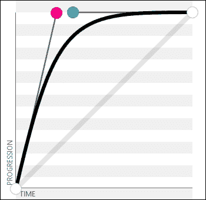

要查看我们选择的效果在实际操作中的效果，请转到[http://cubic-bezier.com/#.23,1,32,1](http://cubic-bezier.com/#.23,1,.32,1)。该网站有一个例子，我们可以运行，看看效果将如何工作。该站点的好处在于，我们可以使用该图来微调效果，效果会自动转换为相关值，然后转换到代码中。

这打开了进一步的可能性–我们谈到了使用[中的 Bez 插件 http://github.com/rdallasgray/bez](http://github.com/rdallasgray/bez) ；这可以很容易地用来代替标准的`.css()`方法，以提供我们的动画。

### 提示

众所周知的放松功能（如`easeInQuint`等）的 CSS 等价物均列在[处 https://gist.github.com/tzachyrm/cf83adf77246ec938d1b](https://gist.github.com/tzachyrm/cf83adf77246ec938d1b) ；我们可以在[看到他们的行动 http://www.easings.net](http://www.easings.net) 。

但重要的是，在 DOM 检查器中查看 CSS 时，我们可以看到的变化：

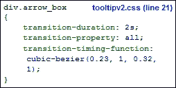

我们不必内联应用它（如*将动画转换为自动使用 CSS3*部分所示），而是可以通过在样式表中保留 CSS 样式，并留下 HTML 来组织我们的网页内容来保持关注点分离原则。

## 回到 jQuery 动画

到目前为止，我们已经使用 CSS 样式来创建动画效果。它提出了一个问题：我们是否应该在所有的动画需求中使用这种技术，或者是否应该使用 jQuery 效果。

这一切归结为两个关键点——动画有多复杂，以及是否需要支持较旧的浏览器？如果其中一个（或两个）的答案都是肯定的，那么 jQuery 很可能获胜。但是，如果您只有一个简单的动画，或者不需要支持传统浏览器，那么应该认真考虑使用 CSS。

到目前为止，我们使用的动画最棒的一点是，我们可以使用这两种方法提供相同的效果，即 CSS 和 jQuery。jQuery 中缓和函数的一个好来源是[https://github.com/gdsmith/jquery.easing](https://github.com/gdsmith/jquery.easing) -这列出了 jQueryUI 等库中可用的所有标准的已知代码。为了证明我们可以达到同样的效果，让我们继续对代码进行快速更改，以使用与已经使用的动画相当的 jQuery。请执行以下步骤：

1.  我们首先编辑一份`quickTip`插件文件。继续挖掘出一个`jquery.quicktipv2.js`的副本，然后在变量声明之后立即添加以下代码块：

    ```js
    $.extend($.easing, {
      easeInQuint: function (x, t, b, c, d) {
        return c*(t/=d)*t*t*t*t + b;
      },

      easeOutQuint: function (x, t, b, c, d) {
        return c*((t=t/d-1)*t*t*t*t + 1) + b;
      }
    });
    ```

2.  我们现在需要调整我们的动画以利用放松功能，所以继续修改`fadeIn`方法，如以下代码行所示：

    ```js
    data['tooltip'].stop(true, true).fadeIn(600, 
      'easeInQuint');
      $this.on('mousemove.' + pluginName, internal.reposition);
    },
    ```

3.  没有它的姐妹`fadeOut()`我们就不能有`fadeIn`，所以我们也需要更改此调用，如下所示：

    ```js
    $this.off('mousemove.' + pluginName, internal.reposition);
      data['tooltip'].stop(true, true).fadeOut(400, 
      'easeInQuint');
    }
    ```

4.  将文件另存为`jquery.quicktipv2.easing.js.`别忘了修改`tooltipv2.html`中的原始插件引用！我们还需要删除`tooltipv2.css`文件中`div.arrow_box`的转换样式，所以继续注释这段代码。

现在，我们已经有了一个使用 jQuery 的工作解决方案。如果我们在浏览器中预览结果，工具提示将按应有的方式显示。但缺点是，我们无法看到所使用的样式，如果浏览器中禁用了 JavaScript（但愿如此），动画将无法播放。

还有一点很重要，jQuery 动画已经越来越需要资源，我们在[第 6 章](06.html#aid-1LCVG1 "Chapter 6. Animating in jQuery")、*jQuery*中的动画制作中已经提到了这一点。那么，当 CSS 可以工作时，我们为什么要在这些实例中使用 jQuery 呢？同样，这也是成为更好的开发人员的一部分——使用 jQuery 太容易了；首先考虑所有的选择是正确的！

### 提示

如果您设计了一个自定义的动画，并且希望使用 CSS 等效工具，请将链接添加到我们前面使用的 jQuery 动画增强插件。这提供了使用贝塞尔曲线值的 CSS 等价物。然后我们可以使用之前的 Bez 插件，甚至可以使用[中的 bezier easinghttps://github.com/gre/bezier-easing](https://github.com/gre/bezier-easing) 将其作为基于贝塞尔曲线的动画添加回。

现在让我们改变焦点，继续前进。到目前为止，我们在插件中提供了一组有限的选项；如果我们想扩展它呢？我们可以尝试深入研究代码并对其进行调整；虽然在某些情况下，这对我们的需求来说可能是过分的。更好的选择可能是将其封装为新插件的实例。让我们窥视一下，看看发生了什么。

# 扩展我们的插件

使用插件时的一个常见问题是找到一个完全满足我们需求的插件；发生这种情况的可能性可能比中彩票要小！

为了解决这个问题，我们可以扩展插件，在不影响现有方法的情况下加入额外的功能。这样做的好处是，我们可以覆盖现有方法，或者合并其他功能，帮助塑造插件，使其更适合我们的需求。为了了解这在实际中是如何工作的，我们将向现有插件添加一个方法和额外的变量。有很多方法可以做到这一点，但我使用的方法也很有效。让我们完成以下步骤：

1.  我们将首先编辑`#getValue`点击处理程序下方的`tooltipv2.js.`副本，继续添加以下代码：

    ```js
      (function($) {
        var extensionMethods = {
          fadeInValue: 600,
          showDebug: function(event) {
            console.log("This is a test");
          }
        }
        $.extend($.fn.quicktip, extensionMethods);
      })(jQuery);
    ```

2.  Save the file. If we preview `tooltipsv2.html` in a browser, then dig into the rendered code via a DOM Inspector, we should see something akin to the following screenshot:

    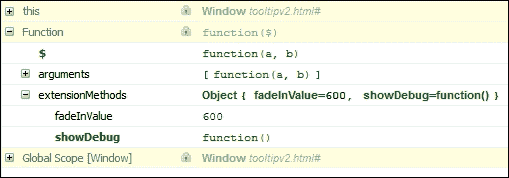

在本例中，我们添加了一个方法，该方法实际上执行的不多；这里的关键不是它做什么，而是我们如何将它添加到中。在这里，我们将其作为现有对象的附加方法提供。在`tooltipsv2.js`的底部添加以下内容：

```js
  $('#img-list li a.tooltips').on("mouseover", function() {
    $('#img-list li a.tooltips').quicktip.showDebug();
  })
```

如果我们现在刷新浏览器会话，我们可以在浏览器的**控制台**区域中看到它的运行，如下一个屏幕截图所示：

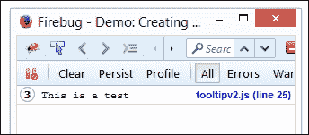

我们可以做的事情还有很多，值得花时间在网上研究。扩展的关键是确保您理解`$.fn.extend`和`$.extend`之间的区别。他们可能看起来一模一样，但相信我——他们的行为不同！

# 使用 Bower 包装我们的插件

好的–在这一点上，我们现在有了一个工作插件，可以使用了。

在这一点上，我们可以按原样发布它，但明智的选择是将其打包以供鲍尔或 NPM 等管理者使用。这样做的好处是可以下载和安装所有必需的软件包，而无需浏览各个站点并手动下载每个版本。

### 提示

我们甚至可以使用构建工具（如 Gulp 和 Grunt）自动化我们的开发工作流程——例如，请参阅[https://www.codementor.io/bower/tutorial/beginner-tutorial-getting-started-bower-package-manager](https://www.codementor.io/bower/tutorial/beginner-tutorial-getting-started-bower-package-manager) 。

现在，让我们快速浏览一下自动创建 Bower 包的步骤：

1.  对于这个演示，我们需要安装 NodeJS。因此，将转到[http://nodejs.org/](http://nodejs.org/) ，下载相应的二进制文件或软件包并安装，接受所有默认设置。
2.  接下来，我们需要安装 Bower。启动将要安装的 NodeJS 命令提示符，并在命令行中输入以下内容：

    ```js
    npm install –g bower

    ```

3.  Bower will prompt us for information about the plugin through a series of questions, before displaying the `bower.json` file that it will create for us. In this instance, I've used the tooltip plugin as a basis for our example. The same questions will apply for any plugin you create and want to distribute using Bower, as shown in this screenshot:

    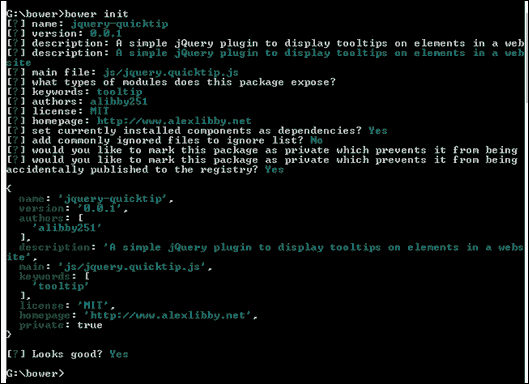

4.  最后一步，在确认我们对所创建的`bower.json`文件没有问题后，是在 Bower 中注册插件。在命令提示下，运行以下命令：

    ```js
    bower register <name of plugin>

    ```

5.  Bower 将经历多个阶段，最后确认插件可通过 Bower 使用。

在这一点上，我们将有一个插件可供任何人下载。由于它必须与一个有效的 GitHub 帐户链接，我们现在可以将插件上传到这样一个帐户，并让任何人都可以通过 Bower 下载。作为奖励，我们现在可以利用 NodeJS 和 Grunt 帮助自动化整个过程。看看咕噜声（[怎么样 https://github.com/vojtajina/grunt-bump](https://github.com/vojtajina/grunt-bump) ），作为起点？

### 提示

鲍尔有太多我们在这里无法涵盖的东西。为了获得灵感，值得阅读[上的文档 http://bower.io/](http://bower.io/) 。

# 自动提供文件

开发插件技能的最后阶段是提供文档。任何编码人员都可以生成文档，但一个更好的开发人员的标志是生成高质量的文档，而无需花费大量时间。

输入 JSDoc！可从[获取 https://github.com/jsdoc3/jsdoc](https://github.com/jsdoc3/jsdoc) 。如果您还不熟悉它，那么这是一种创建文档的好方法，它不仅看起来不错，而且可以使用 Node 轻松地实现自动化。让我们花一点时间安装它，看看它在起作用。为此，需要执行以下步骤：

1.  这次我们将通过 NodeJS 安装 JSDoc。为此，我们需要启动 NodeJS 命令提示符；在您的**程序**菜单中，或在使用 Windows 8 的情况下，在**开始**页面中，都会有一个图标。
2.  在命令提示下，将位置更改为项目文件夹，然后输入以下命令：

    ```js
    npm install –g jsdoc

    ```

3.  节点将运行整个安装过程，然后确认已完成该过程。

要生成文档，只需在代码中输入注释，因此：

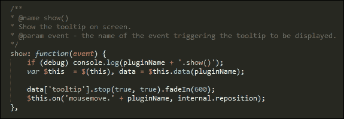

添加后，可以通过在插件文件夹中运行以下命令来编译文档：

```js
jsdoc <name of plugin>

```

我们将看到一个名为 out 的文件夹出现；这包含我们可以逐步建立的文档。如果我们对内联注释进行更改，我们需要再次运行编译过程。这可以使用节点的`grunt-contrib-watch`插件自动完成。如果我们查看 out 文件夹，就会看到文档出现。它将类似于以下截图摘录：

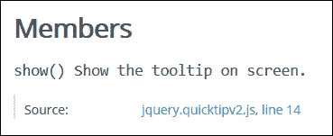

我们可以涵盖更多内容，以了解可用于指示文档如何显示的一些参数，值得阅读[上的大量文档 http://usejsdoc.org/about-getting-started.html](http://usejsdoc.org/about-getting-started.html) 。有很多可能！

# 从我们的插件返回值

创建插件的一个关键部分是–我们可以从插件中获得什么信息？有时我们无法获取信息，但这可能只是我们试图用插件实现的一个限制。在我们的情况下，我们应该能够将内容发布出来。让我们来看看如何用 QuiTip 插件实现这一点。

在深入研究代码之前，我们先看看我们正在创建什么：

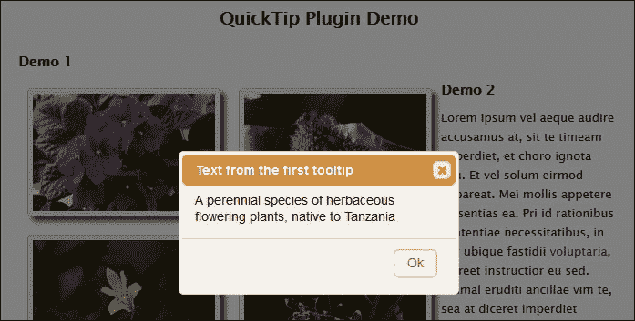

1.  我们需要从某个地方开始，因此没有比标记更好的地方了。在`tooltipv2.html`的副本中，继续并在关闭`<div>`标签之前添加以下突出显示的代码：

    ```js
     <input type="submit" id="getValue" value="Get text from first tooltip" />
     <div id="dialog" title="Basic dialog">
      </div>
    ```

2.  在`tooltipv2.js`的副本中，我们需要公开我们在标记中实现的`data-`标记。继续并添加`tiptag`的配置选项，如下所示：

    ```js
    $(document).ready(function() {
      $('#img-list li a.tooltips').quicktip({
        class: 'arrow_box', tiptag: "title"
      });
    });
    ```

3.  本部分的最后一步是修改我们的标记。代替使用标准的`title=""`标签，我们将用`data-`标签代替它们，这允许更大的灵活性。在`tooltipv2.html`的副本中，搜索`title`的所有实例，然后将其替换为`data-title`。
4.  接下来，我们需要添加到 jQueryUICSS 样式表的链接。这纯粹是为了创建一个对话框来显示我们从其中一个工具提示获取文本的结果：

    ```js
    <link rel="stylesheet" type="text/css" 
    href="http://code.jquery.com/ui/1.10.4/themes/humanity/jquery-ui.css">
    <link rel="stylesheet" type="text/css" href="css/tooltipv2.css">
    ```

5.  为了使 jQueryUI CSS 工作，我们需要向 jQuery UI 库添加一个引用。因此，请继续添加一个。为方便起见，我们将使用 CDN 链接，但希望生产一个定制的小型版本供生产使用：

    ```js
    <script src="http://code.jquery.com/ui/1.11.3/jquery-ui.js"> </script>
    <script src="js/jquery.quicktipv2.data.js"></script>
    ```

6.  在`tooltip.js`的副本中，删除其中的所有代码，并将其替换为以下内容：

    ```js
    $(document).ready(function() {
      $('#img-list li a.tooltips').quicktip({ 
        class: 'arrow_box', 
        tiptag: "title"
      });

      $('#getValue').on("click", function(event){
        var tipText = $('a.tooltips').eq(0).data().title;
        $("#dialog").text(tipText);
        $("#dialog").dialog({
          title: "Text from the first tooltip",
          modal: true,
          buttons: {
            Ok: function() { $(this).dialog("close"); }
          }
        });
      });
    });
    ```

7.  Save all the files. If we switch to a DOM Inspector such as Firebug, we can see the text returned by entering the highlighted line of code in step 6:

    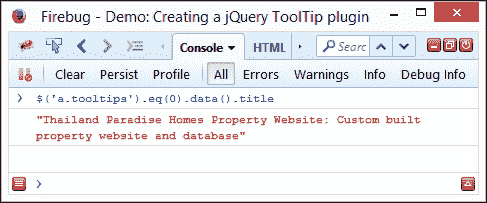

8.  在相同的浏览器会话中，单击**从第一个工具提示获取文本**按钮。如果一切正常，我们应该看到一个柔和的叠加效果出现，然后是一个显示文本的对话框，如本练习开始时所示。

诚然，我们的示例有点做作，我们不应该依赖于从第一个工具提示中获取文本来硬编码，而是从我们想要的工具提示中选择文本。但关键是，我们可以同样定制文本所用的标记，也可以使用`.data()`方法轻松检索内容。

# 探索最佳实践和原则

在过去的几页中，我们介绍了一些概念和技巧，可以用来帮助我们进一步发展插件技能。还有一些额外的因素值得考虑，我们还没有涉及到。值得花点时间来探索这些因素：

*   **质量和代码风格**：您是否考虑过通过 JSHint（[来删除插件代码 http://www.jshint.com](http://www.jshint.com) 或 JSLint（[http://www.jslint.com](http://www.jslint.com) ？编写 jQuery 时坚持最佳实践是帮助确保成功的一种方法，例如遵循一致的代码风格或[发布的准则 http://contribute.jquery.org/style-guide/js/](http://contribute.jquery.org/style-guide/js/) ？如果没有，代码的可读性如何？
*   **兼容性**：您的插件与哪个版本的 jQuery 兼容？多年来，图书馆发生了重大变化。您是打算为较旧的浏览器提供支持（需要 jQuery 的 1.x 分支），还是继续使用较现代的浏览器（使用库的 2.x 版本）？
*   可靠性 T1：你应该考虑提供一套单元测试。这些有助于证明该插件是有效的，并且易于制作。有关如何使用 QUnit 进行此操作的指南，您可以查看由 Dmitry Sheiko 编写的*使用 QUnit*进行即时测试，可从 Packt Publishing 获得。
*   **性能**：运行缓慢的插件会让潜在用户望而却步。考虑使用 TytT2。http://www.jsperf.com ）测试段作为评估插件工作情况的基准，以及是否有任何部分需要进一步优化。
*   **文档**：文档您的插件是必须的。文档的级别通常会决定插件的成败。该插件是否包含开发人员需要注意的怪癖？它支持哪些方法和选项？如果代码有内联注释，它也会有所帮助，尽管它有助于为生产使用提供缩小版本。如果开发人员能够很好地导航您的代码库以使用它或改进它，那么您已经做得很好了。
*   **维护**：如果我们把东西释放到野外，那么必须考虑支持机制。我们需要多少时间来提供维护和支持？首先明确回答问题、解决问题和继续改进代码的期望是至关重要的。

唷，有很多事情要考虑！创建一个插件可以是一次有益的体验。希望这些技巧能帮助你提高技能，使你成为一个更全面的开发人员。记住，正如我常说的，任何人都可以编写代码。成为一名更好的开发人员的关键是理解什么是一个好的插件，并知道如何将其付诸实践。

### 注

学习 jQuery 网站有一些额外的技巧，值得在[探索 http://learn.jquery.com/plugins/advanced-plugin-concepts/](http://learn.jquery.com/plugins/advanced-plugin-concepts/) 。

# 总结

如果有人问你学习 jQuery 的一个关键主题的名称——很可能插件会在这个答案中起到非常重要的作用！为了帮助编写它们，我们在本章中介绍了一些技巧和窍门。让我们用五分钟的时间回顾一下我们所学的内容。

我们的出发点是讨论如何检测开发不良插件的迹象，以此作为了解如何通过使用插件模式改进开发的前提。然后，我们继续设计和构建一个高级插件，首先创建基本版本，然后再重新排序以使用样板模板。

接下来详细介绍了如何切换到使用 CSS3 动画，以发展我们在本书前面讨论的一些论点，考虑使用 CSS3 比使用 jQuery 更好地管理动画。

然后，我们继续研究如何扩展插件中的功能，然后学习如何使用 Bower 将其打包，以便通过 GitHub 使用。然后，我们讨论了文档的自动提供，以及如何从插件返回值，然后总结了一些我们可以在开发中使用的最佳实践和原则。

好的，我们继续前进！在下一章中，我们将混合 jQuery（包括一些插件）、HTML5 标记和 CSS，并生成一个站点。好吧，没什么不像话的——这很正常。然而，这里出现了一个转折点：整个网站的运行情况如何，*离线*？是的，你听到我说的没错…离线…不，也看不到 USB 盘或 DVD…