# 十二、在 Node WebKit 项目中使用 jQuery

在这个现代时代，响应式设计是最新的流行语，使用 jQuery 构建的网站可以在任何设备或平台上正常工作。然而，这需要互联网连接，如果我们可以开发同一应用程序的离线版本呢？

输入 Node WebKit（或者现在所知的 NW.js）。在本章中，我们将从探索 jQuery 中休息一下，转而探索一种鲜为人知的使用该库的方法。您将看到如何使用 jQuery、HTML5 和桌面的强大功能，将它们混合在一起，生成在任何桌面或笔记本电脑环境下脱机工作的站点副本。我们将使用它来开发一个使用 jQuery 的简单文件大小查看器，它可以很容易地开发成更复杂的东西，可以根据需要在线或离线运行。

在本章中，我们将介绍以下主题：

*   介绍 Node-WebKit
*   建立一个简单的网站
*   打包和部署应用程序
*   进一步

准备好探索 Node WebKit 的世界了吗？让我们开始吧…

### 注

您可能会看到对 NW.js online 的引用，这是自 2015 年 1 月起节点 WebKit 的新名称；您可能会在本章中看到这两个名称的使用。

# 布景

想象一个场景，如果你愿意的话，一个客户端要求你制作一个基于 web 的应用程序；他们概述了一组具体的要求，如下所示：

*   它必须有一个简单的 GUI
*   不应该有任何重复，必须是一个在所有平台上都能工作的版本
*   解决方案必须易于安装和运行
*   它必须是便携式的，以便在我们更换电脑时可以传输

如果你认为一个网站就足够了，请举手？现在，如果您没有正确阅读要求，请举手…！

在这种情况下，一个网站是不够的；桌面应用程序将处理复制需求，但它可能不容易使用，而且肯定不会跨平台。那么，我们将从这里走向何方？

# 介绍节点 WebKit

节点 WebKit（或现在所知的 NW.js）最初由 Intel 创建，但于 2011 年开源，并在[上提供 http://nwjs.io/](http://nwjs.io/) ；该项目试图将 SPA 开发的优点与离线环境结合起来（在离线环境中，托管 web 服务器是不现实的）。

Node WebKit 基于 Chromium，Chromium 是一种基于 WebKit 的浏览器，经过扩展后，您可以控制 web 开发人员通常禁止使用的用户界面元素。安全模型已经放松（基于我们正在运行的代码是可信的），并且它集成了 NodeJ；这打开了一系列可能性，超出了 HTML5API 通常可能实现的范围。

一开始，这似乎是一个复杂的组合。然而，恐惧并不像大多数已完成的解决方案那样只构建在简单的 HTML、CSS 和 JavaScript 中，并附带少量图像来完成。

我们将在本章中看到，基本原则是生成一个普通站点，然后将 HTML、CSS 和所有相关资源文件压缩到一个 ZIP 文件中。我们只需将其重命名为具有`.nw`扩展名，然后运行主`nw.exe`应用程序。如果我们已经设置了一个必需的`package.json`文件，它将自动拾取我们的应用程序并显示在屏幕上，如下所示：

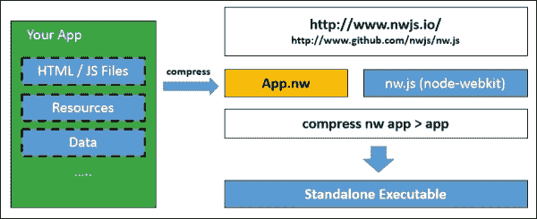

坚持住；这本书是关于 jQuery 的，对吗？是的，绝对是；这里是最好的部分：NodeWebKit 允许您运行标准 JavaScript 和 jQuery 以及任何节点第三方模块！这带来了各种各样的机会；我们可以使用主库或其他基于 jQuery 的库中的任何一个，如 Three.js、AngularJS 或 Ember。

### 注

我们真正需要记住的唯一关键部分是，使用 NW.js 有一些怪癖，例如使用文件夹对话框浏览和选择本地文件夹；我们将在本章后面更详细地介绍这一点。

在这一点上，我相信您会问自己一个问题：为什么我要使用 nw.js（或 Node-WebKit）？这是一个完全正确的问题；我们将一个基于 web 的网站作为桌面应用程序运行似乎不合逻辑！在这种明显的疯狂中，有一些有效的理由来做这件事，所以现在让我们来看看它们，看看为什么运行一个站点作为桌面应用程序是有意义的。

## 在桌面上操作 HTML 应用程序

作为开发人员，我们面临的最大难题之一是确保用户在访问我们的网站时在所有浏览器上都有相同的体验。现在，我应该明确指出：就相同的体验而言，可能有这样的情况根本不可能，因此我们必须至少为那些不支持特定功能的浏览器提供一个优雅的退出路径。

谢天谢地，这一担忧正在慢慢但肯定地变得不那么重要。Node-WebKit 的优点在于我们只需要支持 Chrome（因为 Node-WebKit 就是基于 Chrome 的）。

在大多数情况下，我们可以简单地重用为 Chrome 创建的代码；这使我们能够使用前端框架（包括 jQuery！）和我们已经知道或使用的节点模块轻松推出跨平台应用程序。除此之外，使用 Node WebKit 帮助生成跨平台应用程序还有以下几个原因：

*   通过 Google Chrome 背后的渲染引擎 Blink，可以访问最新的 web 技术。
*   NW.js 支持*构建一次，随时随地运行*概念。这可能不适合所有应用程序，但许多应用程序将受益于桌面、web 和移动环境之间的代码共享。
*   如果你想让你的应用程序以一定的大小运行，或者用弹出窗口做一些更高级的事情，你可以在桌面上获得这个控件。大多数解决方案还提供了一种访问文件系统的方法，并允许使用常规 web 应用程序无法获得的其他更高级的控件。

在不想显得消极的情况下，你需要注意以下几点：；主要关注的是可执行文件的大小。

使用本机 UI 库（如 jQuery）创建的站点或应用程序的大小可能只有几千字节。使用 Node WebKit 构建的等效版本将大得多，因为它包括 Node 和 Chromium 的精简版本。正是出于这个原因，您需要注意文件大小。您可以使用[第 2 章](02.html#aid-K0RQ1 "Chapter 2. Customizing jQuery")、*定制 jQuery*中的一些技巧和技巧来减小 jQuery 的大小。你还需要注意一些其他问题；这些措施包括：

*   与本机应用程序相比，桌面 web 应用程序通常需要更大数量的 RAM 和 CPU 来运行和渲染。
*   就外观而言，如果您想让您的应用程序在计划部署到的平台上看起来很好，那么您需要使用 CSS 重新创建常见的 UI 元素，或者创建一个全新的 UI，包括为每个操作系统提供的 UI 元素（如标题栏、菜单栏和上下文菜单）创建一个新的设计。
*   尽管 Node WebKit 缓解了在使用浏览器应用程序（如同源策略）时发现的一些安全问题，但您仍然只能访问 Node WebKit 上下文；在某些情况下，在创建“选择目录”对话框时，必须使用 WebKit 特定的标记，如`nwdirectory`。如果您想创建一个同时支持 web 和桌面环境的文件，净效果意味着代码的增加。您可以减轻对该问题的影响：[http://videlais.com/2014/08/23/lessons-learned-from-detecting-node-webkit/](http://videlais.com/2014/08/23/lessons-learned-from-detecting-node-webkit/) 提供了一个有用的技巧来确定您所处的环境，并允许您参考该环境所需的适当文件。

### 注

有关某些安全注意事项的更多信息，请查看 NW.js Wiki 上的安全页面，可在[上找到 https://github.com/nwjs/nw.js/wiki/Security](https://github.com/nwjs/nw.js/wiki/Security) 。

既然已经介绍过了，那么在开始构建基于 jQuery 的应用程序之前，让我们深入研究并开始安装节点。应该注意的是，本章的重点将主要基于 Windows，因为这是作者使用的平台；需要对使用 Linux 或 Mac 平台的用户进行更改。

# 为我们的发展环境做准备

在接下来的几页中，我们将构建一个简单的应用程序，该应用程序显示放入主窗口或通过文件对话框选择的任何文件的文件大小。实际上，我们不会单独使用该应用程序，而是作为上传图像进行处理的基础，或者作为压缩应用程序的脱机版本。我们有很多方法可以进一步发展它，我们将在本章后面的*进一步*一节中讨论一些想法。

同时，让我们开始安装 NW.js。在此之前，我们需要利用以下工具：

*   需要一个压缩程序；在 Windows 平台上，您可以使用内置功能或类似 7-Zip（[的东西 http://www.7-zip.org](http://www.7-zip.org) （如果首选）。
*   我们需要一个文本编辑器；在本章的整个过程中，我们将使用 Sublime 2 或 3，但是如果您已经有了个人偏好，那么任何好的文本编辑器都应该足够了。崇高文本可从[下载 http://www.sublimetext.com](http://www.sublimetext.com) ，Mac、Linux 和 Windows 平台的版本可用。
*   我们将使用 Node 和 Grunt 安装其他软件包。节点在[处可用 http://www.nodejs.org](http://www.nodejs.org) ，请继续安装适合您平台的版本。安装后，从 NodeJS 命令提示符运行此命令以安装 Grunt:

    ```js
    npm install -g grunt-cli

    ```

*   Last, but by no means least, we need the Node-WebKit library (of course), so head over to [http://nwjs.io/](http://nwjs.io/) and download the version appropriate for your platform. If you expand the folder, you should see something similar to what is shown in this screenshot:

    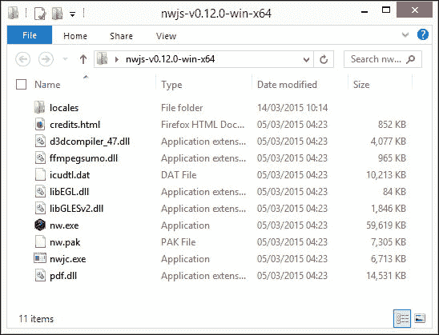

另外，节点 WebKit 可以轻松集成到现有的 Grunt 文件中，这意味着我们可以利用`cssmin`之类的包来缩小我们为应用程序创建的 CSS 样式表。随着您对 Node WebKit 越来越熟悉，这绝对值得探索。

闲聊够了；是我们开始发展的时候了！和所有其他事情一样，我们需要从某个地方开始。在了解如何使用 jQuery 之前，让我们先来尝试创建一个简单的“Hello World”示例。

# 安装并构建我们的第一个应用程序

我想知道：你有多少次读过关于编程语言的书或在线文章，这些书或文章提供了他们自己对无处不在的“Hello World”示例的理解？我敢打赌，这几年里肯定有好几次……是的，在你问之前，我们也不会打破这个传统！跟随任何提供“Hello World”示例的人的脚步，下面是我们自己的例子。

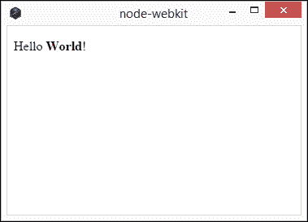

为了建立这个，我们需要做以下工作：

1.  浏览至[http://nwjs.io/](http://nwjs.io/) 下载适合您平台的软件包；我们现在假设使用 Windows，但 Mac 和 Linux 平台也可以使用软件包。
2.  提取`node-webkit-vX.XX.XX-win-x64`文件夹（其中`XX`为版本号），将其重命名为`nodewebkit`，并将其复制到您的主 PC 驱动器 Linux 或 Mac 用户可以将此文件夹复制到其用户区域。完成后，在`nodewebkit`文件夹中创建一个名为`development`的新文件夹。
3.  接下来，我们需要安装 NodeJS。要执行此操作，请将转到[http://nodejs.org/download/](http://nodejs.org/download/) 为了下载并安装适合您平台的版本，接受所有默认设置。

节点 WebKit 可以使用任何可用的标准节点包。例如，我们将安装`markdown`包，该包将适当标记的纯文本转换为有效的 HTML。让我们通过安装并了解其工作原理来继续练习：

1.  In the NodeJS command prompt, change to the `helloworld` folder and then enter the following code and press *Enter*:

    ```js
    npm install markdown

    ```

    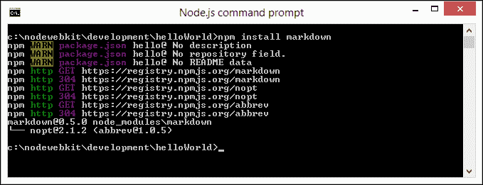

2.  关上窗户，因为你不需要它。接下来，从本书附带的代码下载中的`helloWorld`文件夹中提取`index.html`和`package.json`文件的副本；将这些保存在项目区域的`helloWorld`文件夹中。
3.  创建一个名为`helloWorld.zip`的新 ZIP 文件夹，然后将这两个文件添加到其中；将`helloWorld.zip`重命名为`helloWorld.nw`。

我们现在可以运行我们的应用程序；使用 Node WebKit 有三种方法：

*   在 NodeJS 命令提示符下，切换到`nodewebkit`文件夹，然后运行以下命令：

    ```js
    nw C:\nodewebkit\development\helloWorld.nw

    ```

*   双击`nw.exe`应用程序；这将拾取`package.json`文件并自动运行`helloworld.nw`文件
*   将`helloworld.nw`文件拖放到`nw.exe`上运行应用程序

无论您喜欢使用哪条路线，运行它都会显示本练习开始时显示的**Hello World**窗口。这是一个使用 NodeWebKit 的简单、毫无虚饰的示例，虽然它不会赢得任何奖项，但它展示了从现有 HTML 页面创建功能性应用程序是多么简单。

## 解析 package.json 文件

我们应用程序的核心是`package.json`文件。此清单文件告诉节点 WebKit 如何打开应用程序并控制浏览器的行为：

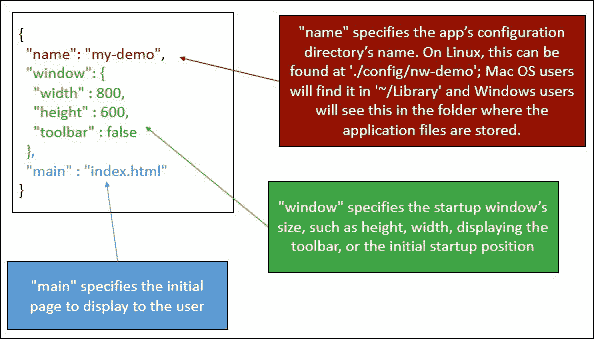

值得详细了解这份文件；它保存项目的所有元数据，并遵循所有基于节点的包的标准格式。如果您不熟悉清单文件，您可以在[中看到一个详细示例 http://browsenpm.org/package.json](http://browsenpm.org/package.json) 每一章节都有互动讲解；Node WebKit 的版本以类似的方式工作。

### 注

有关节点 WebKit 清单文件及其组成部分的更多详细信息，请参阅 NW.js 主站点（[上的文档 https://github.com/nwjs/nw.js/wiki/manifest-format](https://github.com/nwjs/nw.js/wiki/manifest-format) 。

是的，是时候开始构建我们的示例应用程序了！

# 构建我们的简单应用程序

在接下来的几页中，我们将构建一个简单的应用程序，允许我们将文件拖放到拖放区，以呈现文件大小。它基于 Martin Angelov 的教程，可在[上找到 http://tutorialzine.com/2013/05/mini-ajax-file-upload-form/](http://tutorialzine.com/2013/05/mini-ajax-file-upload-form/) ；为了演示的目的，我们将专注于前端 UI 界面，而不必担心后端上传功能：

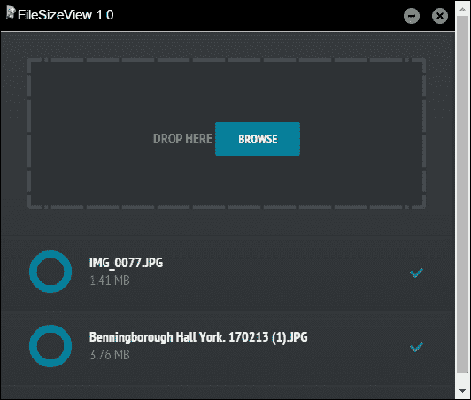

即使只是在前端用户界面上工作，仍然会涉及大量代码；我们的重点将主要放在 jQuery 代码上，所以让我们先看看演示中的演示文稿，然后更详细地进行探索。为此，请执行以下步骤：

1.  我们在演示中使用了少量的 PHP 代码，因此我们需要首先设置 web 服务器空间，例如 WAMP（对于 PC-[）http://www.wampserver.de/en](http://www.wampserver.de/en) 或 XAMPP（或 MAMP 表示 Mac-[http://www.mamp.info/en](http://www.mamp.info/en) ）。Linux 用户将从他们的发行版中获得一些可用的东西。我们将在本演示中使用 WAMP，如果您的位置不同，请相应调整位置；安装时使用默认设置。如果您更喜欢跨浏览器解决方案，那么 XAMPP 是一个不错的选择，它在[上提供 https://www.apachefriends.org/index.html](https://www.apachefriends.org/index.html) 。
2.  接下来，我们需要从本书附带的代码下载中提取`FileSizeView`文件夹的副本。它包含应用程序工作所需的标记。将文件夹保存在`C:\wamp\www`中。
3.  We need a copy of Node-WebKit to run our application, so go ahead and copy the contents of the `nwjs` folder that is in the code download into the `FileSizeView` folder. If all is well, you should have the files shown as follows:

    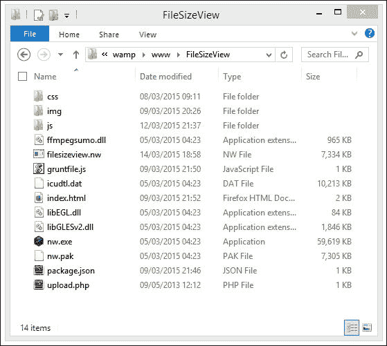

4.  在这个阶段，如果我们双击`nw.exe`，我们应该看到我们的应用程序正在运行。此外，您将看到在本练习开始时显示的窗口。

好的，它显示了窗口；“这一切是如何运作的，”我听到你问？好的，在这个练习中有几个关键点需要注意，所以让我们花一些时间来更详细地讨论一下。

## 进一步探索我们的演示

如果您更详细地查看文件夹，您应该会看到大部分内容都以`index.html`和`upload.php`文件为中心，以及使演示正常工作所需的相关 CSS、图像和 JavaScript 文件。此外，我们在 Node WebKit 文件夹中有许多文件，这些文件提供了 Node 和 Chromium 的精简版本，用于托管我们的文件：

*   `nw.exe`和`nw.pak`：这是主节点 WebKit 可执行文件和 JavaScript 库文件，分别运行我们的代码。
*   `package.json`：这是我们在本章前面的*安装和构建我们的第一个应用程序*部分中看到的清单文件；这为 Node WebKit 提供了如何显示应用程序的说明。
*   `ffmpegsumo.dll`：用于提供视频和音频支持；对于我们的演示来说，这不是必需的，但可以包括在内以供将来使用。
*   `filesizeview.nw`：这是我们的压缩应用程序；这是 Node WebKit 在选中`package.json`以验证其显示方式后运行的文件。
*   `gruntfile.js`：这是`grunt-node-webkit-builder`的 Grunt 文件，稍后我们将在*自动化*过程中使用该文件将我们的文件编译成一个应用程序。
*   `icudtl.dll`：节点 WebKit 需要的网络库。
*   `libEGL.dll`和`libGLESv2.dll`：这些文件用于**Web 图形库****WebGL**和 GPU 的加速。

在一些在线可用的节点 WebKit 应用程序中，您可能也会看到`D3DCompiler_43.dll`和`d3dx9_43.dll`的存在。这些文件来自 DirectX 可再发行文件，用于提供增强的 WebGL 支持。

## 剖析我们的内容文件

好的，我们有我们的主节点 WebKit 文件；我们还在用什么呢？好的，除了标准的 HTML 标记、图像和样式之外，我们还使用许多基于 jQuery 的插件和一些自定义 jQuery 代码来结合在一起。

使用的主要插件文件有 jQuery、jQuery UI、jQuery 旋钮和 BlueImp 文件上传插件。我们还使用了一些自定义代码来将它们绑定在一起，它们位于`window.js`和`script.js`中。让我们更详细地看一下这些，从 Po.T2T 开始。

### 浏览 window.js

在`window.js`中，我们首先对`nw.gui`进行调用，这是使用`require()`的节点 WebKit 的本机 UI 库；这是调用任何模块的标准格式，例如内部模块，甚至外部第三方模块。然后，我们将其分配给`gui`变量，然后再使用它获取应用程序窗口的句柄：

```js
var gui = require('nw.gui'), win = gui.Window.get();
```

注意，由于我们只能访问节点 WebKit 上下文，因此必须使用专用库；我们无法使用标准 JavaScript 调用访问该窗口。

### 提示

有关访问模块的更多信息，请参阅[提供的文档 https://github.com/nwjs/nw.js/wiki/Using-Node-modules](https://github.com/nwjs/nw.js/wiki/Using-Node-modules) 。

接下来，我们设置了两个委托文档处理程序，一个用于处理窗口的最小化，另一个用于完全关闭窗口：

```js
$(document).on('click', '#minimize', function () {
  win.minimize();
});

$(document).on('click', '#close', function () {
  win.close();
});
```

这触及了我们能做什么的表面；还有很多。前往[https://github.com/nwjs/nw.js/wiki/Window](https://github.com/nwjs/nw.js/wiki/Window) 为了了解可能实现的目标。

### 剖析 BlueImp 插件配置

我们网站的主要功能位于`script.js`。它包含 BlueImp 文件上载插件的主要配置对象以及一些附加帮助程序。让我们更详细地看一下。

在将对`#upload li`列表项的引用分配为变量之前，我们从正常的 document ready 调用开始，如下所示：

```js
$(function(){
  var ul = $('#upload ul');

  $('#drop a').click(function(){
    // Simulate a click on the file input button
    // to show the file browser dialog
    $(this).parent().find('input').click();
  });
```

接下来，我们配置文件上传插件。首先，我们将初始下降区设置为`#drop`选择器：

```js
  // Initialize the jQuery File Upload plugin
  $('#upload').fileupload({

    // This element will accept file drag/drop uploading
    dropZone: $('#drop'),
```

然后我们设置了`add`回调函数。这涉及通过拖放或浏览文件来显示已添加到列表中的每个列表项。我们首先创建一个模板，然后将其缓存在`tpl`变量中：

```js
  add: function (e, data) {
    var tpl = $('<li class="working"><input type="text" value="0" data-width="48" data-height="48"'+ ' data-fgColor="#0788a5" data-readOnly="1" data- bgColor="#3e4043"/><p></p><span></span></li>');
```

然后，在计算出`filesize`函数并将其附加到列表之前，我们找到刚才添加的文件名：

```js
    tpl.find('p').text(data.files[0].name).append('<i>' + formatFileSize(data.files[0].size) + '</i>');

    // Add the HTML to the UL element
    data.context = tpl.appendTo(ul);
```

接下来，我们初始化 jQuery 旋钮插件。虽然它目前不可操作，但它将生成一个良好的循环状态表，显示将任何文件上载到远程位置的进度：

```js
    // Initialize the knob plugin
    tpl.find('input').knob();
```

目前，我们没有使用取消图标。这将是我们需要使用的事件处理程序，以确定是否在任何项目进行中取消上载：

```js
    tpl.find('span').click(function(){

      if(tpl.hasClass('working')){
        jqXHR.abort();
      }

      tpl.fadeOut(function(){
        tpl.remove();
      });
    });

    // Automatically upload the file once it is added to the queue
    var jqXHR = data.submit();
  },
```

这是`fileupload`对象中的关键方法处理程序。这将在触发更新 jQuery 旋钮插件的更改之前计算上传文件的进度百分比，如下所示：

```js
  progress: function(e, data){
    var progress = parseInt(data.loaded / data.total * 100, 10);
    data.context.find('input').val(progress).change();
    if(progress == 100){
      data.context.removeClass('working');
    }
  },
```

如果文件上传失败，则我们设置了一个`.error`类，该类在随附的样式表中样式设置适当：

```js
  fail:function(e, data){
    // Something has gone wrong!
    data.context.addClass('error');
  }
});
```

除了主要的`fileupload`配置对象外，我们还设置了几个辅助函数。如果在文档对象上拖动任何内容，第一个助手函数将阻止正常操作，这将是试图在浏览器窗口中显示该对象：

```js
$(document).on('drop dragover', function (e) {
  e.preventDefault();
});
```

第二个 helper 函数处理文件大小从字节值到其 KB、MB 或 GB 等效值的转换，然后返回用于在屏幕上渲染的值：

```js
function formatFileSize(bytes) {
  if (typeof bytes !== 'number') {
    return '';
  }

  if (bytes >= 1000000000) {
    return (bytes / 1000000000).toFixed(2) + ' GB';
  }

  if (bytes >= 1000000) {
    return (bytes / 1000000).toFixed(2) + ' MB';
  }

  return (bytes / 1000).toFixed(2) + ' KB';
  }
});
```

目前，我们的项目肯定还有改进的余地：它可以在普通浏览器窗口中正常工作，但需要修改，以使其在节点 WebKit 上下文中 100%正常运行。我们将讨论一些关于如何在以后的代码中改进代码的地方，在 To.??.中，我们还需要进一步研究一下我们的应用程序。

### 自动创建我们的项目

我在这本书中一直试图坚持的一个关键主题是，我们如何才能更聪明地做事；任何人都可以编写代码，但更聪明的开发人员知道何时应该自动化一些更普通的任务，并将他们的时间用于将带来更多价值的任务。

我们可以改进创建和构建项目的一种方法是自动化框架项目的生成。谢天谢地，我们可以使用 Yeoman generator for node webkit 应用程序（可在[上找到）来实现这一点 https://github.com/Dica-Developer/generator-node-webkit](https://github.com/Dica-Developer/generator-node-webkit) ），我们可以使用以下命令安装：

```js
npm install -yeoman

```

前面的命令后面跟着以下命令：

```js
npm install –g generator-node-webkit

```

这将显示以下屏幕截图，其中显示为测试项目输入的详细信息：

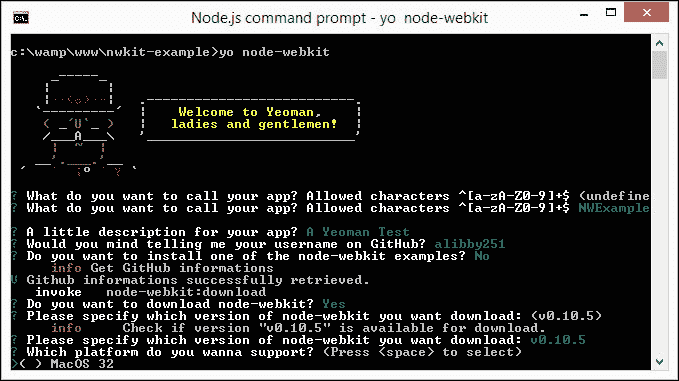

如果一切顺利，您应该可以看到预定义的文件夹结构已就位，可以使用，如以下屏幕截图所示：

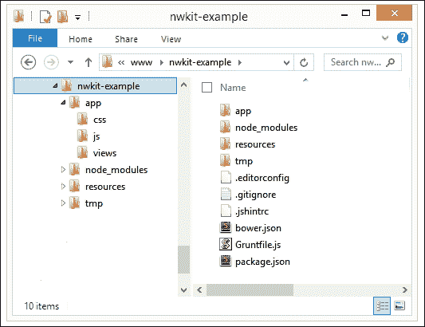

这使得创建所需的文件夹结构和在项目中保持一致性变得更加容易。

## 调试您的应用程序

此时，您应该有一个可以部署的工作应用程序。虽然不得不说，我们在准备发布之前需要做更多的工作，但无论应用程序如何，部署背后的原则仍然是一样的！在我们研究部署之前，有一件小事我想先说明一下。

还记得我在本章中提到的崇高文本吗？这有一个很好的理由：它非常适合构建应用程序，使我们能够运行它并调试应用程序。要做到这一点，我们需要为 Sublime 文本创建一个新的构建系统文件（例如下面为 Windows 概述的文件）：

```js
{
  "cmd": ["nw.exe", "--enable-logging", "${project_path:${file_path}}"],
  "working_dir": "${project_path:${file_path}}",
  "path": "C:/Tools/nwjs/",
  "shell": true
}
```

为 Sublime 添加新构建文件的过程很快，可以了解全部细节，请将转到[https://github.com/nwjs/nw.js/wiki/Debugging-with-Sublime-Text-2-and-3](https://github.com/nwjs/nw.js/wiki/Debugging-with-Sublime-Text-2-and-3) 。这是在开发应用程序时使用的一个有用技巧，因为手动构建过程可能会在一段时间后变得非常乏味！

# 打包和部署您的应用程序

好的，我们有一个工作应用程序，可以打包和部署；我们如何把它变成可以下载的东西？

打包一个节点 WebKit 应用程序非常简单。有几个注意事项，但主要的过程是将所有节点 WebKit 可分发文件连同内容一起放入文件夹，并将其作为重命名的压缩文件发送。

根据所使用的平台，有几种不同的方式来打包我们的文件。让我们看看 Windows 平台上的两个选项，从手动编译开始。

### 注

对于那些在苹果 Mac 或 Linux 上工作的人，有关如何打包应用程序的详细信息，请访问[https://github.com/rogerwang/node-webkit/wiki/How-to-package-and-distribute-your-apps](https://github.com/rogerwang/node-webkit/wiki/How-to-package-and-distribute-your-apps) 。

## 手工创建包

假设我们已经准备好部署我们的应用程序，以下是手动创建包时要遵循的基本步骤。对于本例，我们将使用前面创建的文件，在*构建我们的简单应用程序*部分：

1.  创建一个新的空白 ZIP 文件，并添加`package.json`、`ffmpegsumo.dll`、`icudtl.dat`、`libEGL.dll`、`libGLESv2.dll`和`nw.pak`文件，这些文件是在 Chromium 和 Node 的精简版本中托管站点所需的。
2.  将`css`、`img`和`js`文件夹与`index.html`一起添加到 ZIP 文件中。
3.  将 ZIP 重命名为`.nw`文件，然后运行`nw.exe`-这将使用`package.json`文件来确定应该运行什么。

### 注

请注意，节点 WebKit 包不会保护、混淆、数字签名或使包安全；这意味着，使您的软件包开源是一个更好的选择，即使只是为了避免任何许可问题！

## 流程自动化

等等，创建一个包是一个手动过程，如果我们添加了很多更改，过一段时间就会变得单调乏味，对吗？

当然，明智的方法是使过程自动化；然后我们可以将其与咕噜包组合，例如`grunt-contrib-watch`（来自[）https://github.com/gruntjs/grunt-contrib-watch](https://github.com/gruntjs/grunt-contrib-watch) ），负责在做出任何更改后尽快构建我们的包。有几种方法可以实现自动化，我个人最喜欢的是使用`grunt-node-webkit-builder`，从[开始 https://github.com/mllrsohn/grunt-node-webkit-builder](https://github.com/mllrsohn/grunt-node-webkit-builder) 。

### 注

node-webkit-builder 插件由与 grunt-node-webkit-builder 后面的开发人员相同的开发人员创建；唯一的区别是后者对 Grunt 有额外的支持。如果您想切换到使用 Grunt，您可以安装一个补充软件包`grunt-node-webkit-builder-for-nw-updater`，该软件包在[上提供 https://www.npmjs.com/package/grunt-node-webkit-builder-for-nw-updater](https://www.npmjs.com/package/grunt-node-webkit-builder-for-nw-updater) 。

让我们来看看这个插件的作用。这个练习假设你已经安装了 NoDEJs，然后继续演示：

1.  在项目文件夹内的新文件中，添加以下代码并将其保存为`gruntfile.js`：

    ```js
    module.exports = function(grunt) {

      grunt.initConfig({
        nodewebkit: {
          options: {
            platforms: ['win'],
            buildDir: './builds',
            winIco: './img/filesize.ico'
          },
          src: ['./css/*.css', './img/*.*', './js/*.js', '*.html', '*.php', '*.json', '*.ico']
        }
      })

      grunt.loadNpmTasks('grunt-node-webkit-builder');
      grunt.registerTask('default', ['nodewebkit']);
    };
    ```

2.  接下来，我们需要安装 grunt node webkit builder；因此，继续并启动 NodeJS 命令提示符的实例，然后导航到项目文件夹，我们在前面的*构建简单应用程序*部分中使用了该文件夹。
3.  输入此命令，然后按*键*键，等待完成：

    ```js
    Npm install grunt-node-webkit-builder --save-dev

    ```

4.  In the `package.json` file, you will see that the following lines have been added, as indicated:

    ```js
      "icon": "img/filesize.png"
      },
     "devDependencies": {
     "grunt": "~0.4.5",
     "grunt-node-webkit-builder": "~1.0.2"
     }
    }
    ```

    ### 提示

    如果您需要查看`package.json`的外观，请前往[https://github.com/3dd13/sample-nw](https://github.com/3dd13/sample-nw) 。[有一个样本文件 https://github.com/3dd13/sample-nw/blob/master/package.json](https://github.com/3dd13/sample-nw/blob/master/package.json) ，它显示了我们刚刚输入到我们自己版本的文件中的代码内容。

5.  At this stage, we're now ready to build our package. At the prompt, type `grunt` and then wait for it to complete; you should see it build the package, as shown in the following screenshot:

    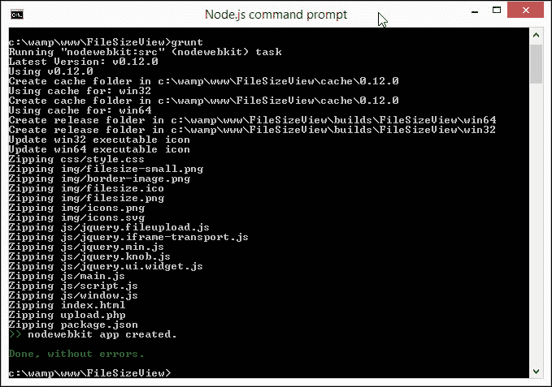

6.  If you revert to the folder where our files are stored, you should now see that a `builds` folder has appeared; navigating through it will show you something similar to this screenshot, where you have the contents of the `win64` build folder displayed:

    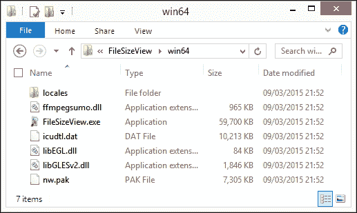

    在这个阶段，我们可以双击`FileSizeView.exe`应用程序来启动程序。这将显示我们的应用程序的所有荣耀，随时可用。完美的我们现在可以部署文件了，对吗？

## 部署您的应用程序

嗯……别着急；你现在应该知道，我们总能做得更好！

绝对地在本例中，更好的方法是创建一个安装程序，这样我们只需要分发一个文件。这更容易使用！它还有进一步压缩文件的额外好处；在我们的示例中，通过使用开源 Inno 安装包，结果从大约 80MB 下降到大约 30MB。让我们来看看为 Windows 平台生成安装文件所需的内容：

1.  我们首先需要下载并安装 Inno 安装程序。前往[http://www.jrsoftware.org/isinfo.php](http://www.jrsoftware.org/isinfo.php) 点击**下载 Inno 设置**；`setup.exe`文件可以从页面中间的表格中下载。
2.  双击`setup.exe`文件并运行整个流程，接受所有默认值。
3.  在我们的项目文件夹中，我们需要创建一个名为`setup`的新文件夹。这将存储 Inno 安装和最终版本的源脚本。
4.  从代码下载中，继续提取`filesizeview-1.0.iss`并将其存储在`setup`文件夹中。
5.  Double-click on the file to launch it and then click on the highlighted icon, shown in the following screenshot, to compile the build file:

    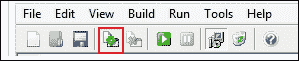

6.  When completed, Inno Setup will automatically start the newly created installer, as shown here:

    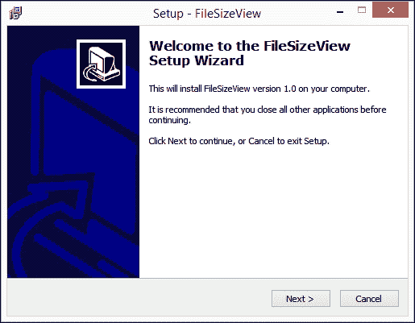

在愤怒地使用应用程序之前，我们现在可以完成整个安装过程。Inno 安装程序还负责卸载过程，包括一个`unins000.exe`文件，如果我们需要从系统中删除应用程序，可以使用该文件。

对于使用 Mac 的用户，将提供类似的软件包。请尝试[中列出的说明 http://www.codepool.biz/tech-frontier/mac/make-pkg-installer-on-mac-os-x.html](http://www.codepool.biz/tech-frontier/mac/make-pkg-installer-on-mac-os-x.html) 作为起点。您也可以尝试在 Linux 上使用 Inno 设置，使用 Wine，说明列在[中 http://derekstavis.github.io/posts/creating-a-installer-using-inno-setup-on-linux-and-mac-os-x/](http://derekstavis.github.io/posts/creating-a-installer-using-inno-setup-on-linux-and-mac-os-x/) ，虽然它们不是为初学者准备的！

# 更进一步

呸！在过去的几页中，我们当然已经涵盖了很多内容！

然而，在人生的宏伟蓝图中，我们只触及了表面。我们可以在应用程序中做更多的工作，甚至可以对其进行探索，以帮助提高在 jQuery 中使用 NodeWebKit 时的技能。为了让您开始，以下是一些想法：

*   该应用程序是调整图像大小甚至压缩图像的完美基础；我们可以在网上做这件事，但也有影响，主要是关于机密性和图像大小。
*   上载功能仅部分工作。我们使用 BlueImp 文件上传插件，但实际上它什么都没做。让它在我们的应用程序中工作怎么样？
*   如果我们正在上传图像，那么为文件类型显示一个图标或者甚至一个小缩略图怎么样？
*   没有办法在不重新启动应用程序的情况下清除列表。修复此问题应该很容易…
*   我们故意不包括任何错误检查以保持简单；现在加一些怎么样？
*   我认为这个接口在一个方面有点限制：如果我们上传一个文件名很长，那么它就会被截断；截断有点乱！
*   我们没有添加任何菜单控件。虽然 Node WebKit 非常适合于速度不是问题的应用程序，但一旦我们添加了更多功能，能够四处导航仍然很好。有关如何添加此类菜单的示例，请参见[http://www.4elements.com/blog/2013/12](http://www.4elements.com/blog/2013/12) 。

希望在这里你能找到一些想法来激励你进一步发展。一旦掌握了基本知识并允许我们使用特定于节点的标记，天空就是极限！有相当一部分人已经开发出了各种复杂度的应用程序，并在网上发布了它们。这绝对值得在网上做一些研究，看看有什么可用。以下是一些想法：

*   爱尔兰开发人员 Shane Gavin 创建了一个关于使用 Node WebKit 的有用的基于视频的教程。本文探讨了创建节点 WebKit 应用程序时可以使用的一些技术，我们在示例中使用了其中的一些技术。教程可在[上获得 http://nodehead.co](http://www.nodehead.co) 。
*   我相信我们都听说过或玩过类似于*乒乓*或*突破*这样的游戏。我们可以在[使用 Phaser 游戏库 http://phaser.io](http://phaser.io) 制作一些经典游戏（以及其他）。请看[中所示的示例 https://github.com/kandran/pong 使用节点 WebKit 创建*Pong*的](https://github.com/kandran/pong)。
*   大卫·诺依曼（David Neumann）写了一篇博文，讲述了免费教育游戏*卡特彼勒计数*是如何重新打包以在 Node WebKit 中工作的；撇开游戏的本质不谈，这篇文章重点介绍了一些关于转移过程的有用技巧和技巧（[http://blog.leapmotion.com/building-applications-for-simultaneous-deployment-on-web-and-native-platforms-or-how-i-learned-to-stop-worrying-and-love-node-webkit/](http://blog.leapmotion.com/building-applications-for-simultaneous-deployment-on-web-and-native-platforms-or-how-i-learned-to-stop-worrying-and-love-node-webkit/) ）。
*   有兴趣尝试使用 HTML5 和 Node WebKit 制作网络摄像头吗？前往[http://webcamtoy.com/](http://webcamtoy.com/) -由于支持`getUserMedia`，因此，从节点 WebKit 改编标准代码应该相对容易。
*   如果我们使用视频或网络摄像头，我们可以随时查看截图。有一个包可供 Node WebKit 使用以帮助完成此操作（[https://www.npmjs.com/package/node-webkit-screenshot](https://www.npmjs.com/package/node-webkit-screenshot) ；它可以很容易地形成一个有用的小应用程序的基础。
*   我们在前面讨论过使用其他 JavaScript 库，如 Ember 或 Angular，这两个库可以很容易地与 Node WebKit 和 jQuery 一起使用。对于两个示例，请参阅[http://www.sitepoint.com/building-chat-app-node-webkit-firebase-angularjs/](http://www.sitepoint.com/building-chat-app-node-webkit-firebase-angularjs/) 和 [http://sammctaggart.com/build-a-markdown-editor-with-node-webkit-and-ember/](http://sammctaggart.com/build-a-markdown-editor-with-node-webkit-and-ember/) 。

在线可用的内容越来越多。该库最近有一些名称更改（如前所述），因此，如果您想了解有关使用 Node WebKit 的更多信息，那么值得同时搜索 Node WebKit 和 NW.js，以确保全面覆盖。

# 总结

近年来，在线和离线应用程序之间的界限已经模糊，许多人使用移动设备来访问互联网，而不是普通的桌面浏览器。随着 Node WebKit 的出现，这为合并这些边界提供了很多机会，让我们回顾一下我们在过去几页中学到的内容。

我们以一个典型的简单请求开始，大多数开发人员会自动考虑设计一个站点。然而，随着 Node WebKit 的引入，我们可以探索创建应用程序或站点的脱机版本。我们探讨了该库的工作原理，并讨论了从桌面运行此类应用程序的优缺点。

然后，我们继续准备开发环境，然后简要介绍如何安装 NodeWebKit 并使用它创建第一个应用程序。在继续构建文件大小查看器应用程序之前，我们深入研究了`package.json`文件，它是运行应用程序的关键。接下来，我们将更深入地了解应用程序背后使用的代码；我们还介绍了如何使用 Yeoman 节点 WebKit 生成器创建应用程序的基本框架。

接下来是调试 Node WebKit 应用程序的快速技巧，然后继续研究如何手动或使用 Grunt 自动打包和部署应用程序。旅程的最后一个阶段是应用程序的部署。我们研究了使用 Inno 安装程序生成一个可以部署使用的`setup.exe`文件。然后，我们在这一章中总结了使用 Node WebKit 开发时如何进一步发展的一些想法。

呸！我们当然谈了很多，但正如他们常说的，恶人无休止。在下一章中，我们将了解使用 jQuery 最重要的部分之一：优化和增强项目的性能。