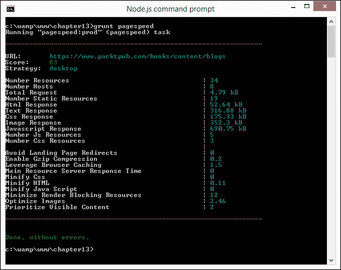
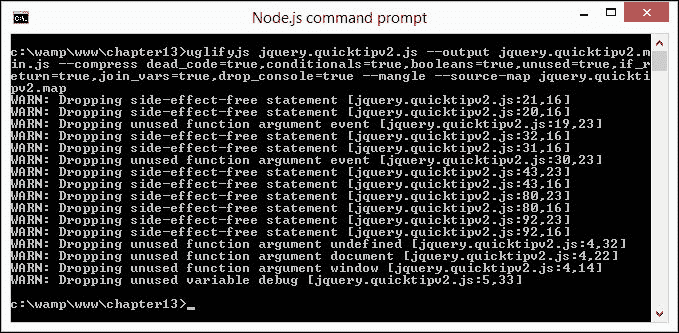

# 十三、提高 jQuery 的性能

到目前为止，在本书中，我们已经讨论了一系列不同的主题：从定制 jQuery 到动画的使用，甚至还有一点关于在 NodeWebKit 中使用 jQuery 的内容。

然而，有一个关键主题我们还没有涉及。虽然使用 jQuery 可能非常令人满意，但我们必须注意在实际情况下优化代码，以确保获得积极的用户体验。许多开发人员可能只是盯着代码看，但这很耗时。在本章中，我们将研究优化 jQuery 代码的方法，介绍可以补充现有工作流的工具的使用，并帮助您对更改提供真正的反馈。我们将在本章中介绍一些主题，包括：

*   理解为什么绩效很重要
*   添加元素时监视性能
*   监视 jQuery 的速度
*   自动化性能监控
*   使用 Node 自动删除代码
*   实施最佳做法以提高绩效
*   考虑到使用 jQuery 的情况

准备好开始了吗？

### 注

在本章中，我们将集中讨论 jQuery 的使用——您将发现，所给出的许多技巧也可以应用于纯 JavaScript，在代码中使用它的次数更多（我们将在本章后面讨论）。

# 了解绩效至关重要的原因

想象一下场景如果你愿意的话——你的团队使用最新技术创建了一个杀手级的基于 web 的应用程序，它可以在阳光下做任何事情，你可以坐下来享受成功的桂冠。除了一件很小但很关键的事情…

没有人买。您的应用程序没有一个副本被出售–原因是什么？简单–速度非常慢，并且没有得到适当的优化。在这个移动设备的时代，速度慢的应用程序会让用户感到厌烦，这一事实无论销售多少都无法改变。

我们应该关注应用程序的性能吗？绝对地有充分的理由批评我们的应用程序的性能；让我们来看看几个：

*   移动设备的出现以及冲浪的相关成本意味着我们的内容必须进行优化，以确保在连接超时之前，网站能够快速显示
*   专注于开发而不是解决跨浏览器问题太容易了——每个怪癖本身可能并不多，但累积效应很快就会累积起来
*   一旦开始编写经过深思熟虑的代码，它很快就会成为第二天性

当然，必须指出的是，存在**过早优化**的风险，我们花费大量时间优化代码，但收获甚微，如果我们删除随后需要的代码，甚至可能会在以后给自己带来问题！

好的–假设有优化代码的空间，我们应该怎么做？嗯，我们可以使用一些技巧；虽然我们可能希望优化我们的代码，但这并不总是值得努力的。更聪明的方法是始终考虑更大的图片，以确保优化脚本的好处不会丢失，例如写得不好的样式表或大图片，例如！

让我们花一点时间考虑一下我们可以选择的一些方案，它们包括：

*   构建 jQuery 的自定义版本
*   缩小我们的脚本
*   微调选择器的使用
*   谨慎处理突发事件
*   持续使用适当的工具来删除代码
*   最小化 DOM 的操作

这些是我们可用的一些选项。不过，我们的第一站是对代码进行基准测试，在进行任何更改之前查看代码的性能。第一步是对脚本运行性能检查。让我们花一点时间看看什么是牵涉进来的，以及它是如何运作的。

# 使用 Firebug 监控 jQuery 的速度

我们可以抒情地谈论性能有多重要，但没有什么能比看到它的实际运行并研究如何改进代码以获得额外优势更重要。手动确定在何处进行更改既耗时又低效。相反，我们可以利用许多工具来帮助更清楚地指出代码中存在的问题。

有几十种工具可以帮助我们对页面的性能进行基准测试，其中包括与 jQuery 或基于 jQuery 的脚本和插件的交互。在接下来的几页中，我们将介绍一些不同的方法。让我们从一个简单的视觉检查开始，使用[中的 Firebughttp://www.getfirebug.com](http://www.getfirebug.com) 。安装完成后，单击**Net****JavaScript**，然后加载页面以获取页面上加载的每个插件或脚本的统计信息。

在下图中，我们可以看到 Packt 发布网站的结果：


相比之下，以下是显示[的结果的图像 http://www.jquery.com](http://www.jquery.com) ：


### 提示

加载页面之前，请清除缓存以避免结果倾斜。

查看 Firebug 返回的统计数据给了我们一个良好的开端，但是为了更好地指示瓶颈在哪里，我们需要分析代码。谢天谢地，这是一个小游戏机。让我们来看看我们如何使用控制台优化代码，使用一个在 Type T1 第 11 章中创建的 AutoT0A.Demo 的副本。对于这个小演示，我们将从本地 web 服务器运行它，例如 WAMP：

1.  从代码下载中，提取工具提示演示文件夹的副本，并将其存储在 WAMP 的`www`文件夹中。
2.  在`tooltipv2.js`中，更改前几行，如下图所示–这将在调用中添加配置代码：

    ```js
    $(document).ready(function() {
      console.profile();
      $('#img-list li a.tooltips').quicktip({
    ```

3.  我们需要告诉浏览器何时停止评测，所以继续修改代码，如下所示：

    ```js
      })
      console.profileEnd();
    });
    ```

4.  In the browser, load `tooltipv2.html`, and then open Firebug. If all is well, we should see something akin to the following screenshot, where we see the first few lines of the profile report:

    

使用诸如 Firebug 之类的工具对我们的站点进行评测可能非常有启发性。让我们来体验一下，想象一下如果我们增加了更多的选择器；当时显示的一些数字会高得多。

### 提示

如果您只想关注所花费的时间，那么使用`console .profile()`的另一种方法是使用`console.time()`和`console.timeEnd()`。

还有更多的工具可用于分析我们的站点。并非所有这些都是 jQuery 特有的，但它们仍然可以用于深入了解脚本的执行情况。除了经典网站如[JSPerf.com](http://JSPerf.com)（[之外，以下是一些您可以尝试的例子 http://www.jsperf.com](http://www.jsperf.com) ：

*   JSLitmus，来自[http://code.google.com/p/jslitmus/](http://code.google.com/p/jslitmus/)
*   BenchmarkJS，可在[处获取 http://benchmarkjs.com/](http://benchmarkjs.com/) 或来自[的 NPM 站点 https://www.npmjs.com/package/benchmark](https://www.npmjs.com/package/benchmark) -如何使用它的示例可在[上找到 https://gist.github.com/brianjlandau/245674](https://gist.github.com/brianjlandau/245674)
*   在线服务，如速度曲线（[http://www.speedcurve.com](http://www.speedcurve.com) 或 Calibreapp（[https://calibreapp.com/](https://calibreapp.com/)
*   FireQuery 已重新加载，来自[https://github.com/firebug/firequery/wiki](https://github.com/firebug/firequery/wiki) 来了；请注意，在撰写本文时，它仍处于测试阶段
*   设备计时，从[开始 https://github.com/etsy/DeviceTiming](https://github.com/etsy/DeviceTiming)

绝对有很多选择——并非所有都能满足每个人的需求；但关键是要理解您正在测试的内容，并学习如何解释它。

jQuery 核心团队的一员 Dave Methin 写了一篇精彩的文章，概述了盲目尝试优化代码而没有正确解释使用 JSPerf 等工具的结果的危险。开发人员 Fionn Kelleher 说得很好，他说你的代码应该是一件艺术品——没有必要为了这样做而优化一切；更重要的是，代码应该可读且工作良好。

好了，是时候继续前进了。我们已经介绍了监控的基础知识，但需要手动操作。一个更好的选择是实现自动化。我们可以使用许多工具与我们的老朋友 Grunt 一起实现这一点，因此让我们深入了解一下自动化监控涉及到哪些方面。

# 自动性能监控

举手–作为一名开发人员，你们中有多少人使用过 YSlow？好的——相当多；你有没有想过让这些检查自动化？

这是正确的！我们可以随时进行手动检查，以了解性能瓶颈在哪里出现；然而，更聪明的方法是使用我们的好朋友 Grunt 自动化这些检查。开发人员 Andy Shora 创建的模块可用于此目的；我们可以从[获取它的源代码 https://github.com/andyshora/grunt-yslow](https://github.com/andyshora/grunt-yslow) 。让我们花些时间让它运行起来，看看它是如何工作的：

1.  让我们首先为文件创建一个项目文件夹。出于本练习的目的，我将假设它被称为`chapter13`（是的，我知道——非常原创）；如果您的名称不同，请更改名称。
2.  对于本练习，我们需要使用 NodeJS。我假设您已经从以前的练习中安装了它；如果没有，则前往[http://www.nodejs.org](http://www.nodejs.org) 下载并安装适合您平台的版本。
3.  接下来，将以下内容添加到一个空白文件中，并将其保存为我们项目文件夹中的`gruntfile.js`——您会注意到我们的测试将针对 jQuery 的网站（如突出显示的）：

    ```js
    'use strict';

    module.exports = function (grunt) {
      grunt.initConfig({
        yslow: {
          pages: {
            files: [{
              src: 'http://www.jquery.com',
            }],
            options: {
              thresholds: {
                weight: 500,
                speed: 5000,
                score: 90,
                requests: 15
              }
            }
          }
        }
      });

      grunt.loadNpmTasks('grunt-yslow');
      grunt.registerTask('default', ['yslow']);
    };
    ```

4.  在 NodeJS 命令提示符窗口中，输入以下命令以安装`grunt-yslow`包：

    ```js
    npm install –g grunt-yslow

    ```

5.  节点将在整个安装过程中运行。完成后，在命令提示下输入以下命令执行测试：

    ```js
    grunt yslow

    ```

6.  If all is well, Node will display something akin to the following screenshot, where it shows a fail:

    

命令提示窗口中显示的结果有点基本。为了更好地了解问题所在，我们可以安装 YSlow 插件。让我们现在就这样做：

### 提示

在撰写本文时，在 Firefox 中运行 YSlow 仍存在一些问题；请改用 Chrome 查看结果。如果您是 Mac 用户，那么您可以从[尝试 YSlow 插件 http://yslow.org/safari/](http://yslow.org/safari/) 。

1.  Browse to [http://www.yslow.org](http://www.yslow.org), then click **Chrome** under **Availability**, and then **Add** to add the plugin to Chrome:

    

2.  Once installed, we can run the report within YSlow. If we do it for the main jQuery site, then we will end up with results similar to those seen in the following screenshot:

    

    如果我们看一看所给的各种等级，我们可以清楚地看到有改进的余地。关注脚本，检查将显示至少有五个脚本应移到页面底部，因为浏览器无法启动任何其他下载，直到这些下载完成。

3.  To see what impact this would have, take a look at the same page within Firebug. Click **Net** | **JavaScript**, then refresh the page to view all the scripts being called from the page. Hover over the jQuery link – this is proof that the bigger the file, the longer it takes to load:

    

在前面的屏幕截图中，我们可以清楚地看到许多脚本，它们都显示了很长的时间。在这种情况下，缩小那些尚未压缩的脚本将提高这些时间。

我们总是可以花时间尝试优化 jQuery，但这应该放在更大的背景下考虑；如果我们仍然在代码的其他地方加载大型脚本，我们显然会失去优化 jQuery 的任何好处。

### 注

值得注意的是，在`gruntfile.js.`这个移动设备时代，`gruntfile.js.`内的阈值设置高于正常值，重要的是要确保页面内容能够快速下载；在这两个例子中，我们将看到肯定有改进的余地！

让我们看一看第二个例子，看看这是如何比较的。在这种情况下，我们将使用 Packt 发布网站[http://www.packtpub.com](http://www.packtpub.com) ：

1.  让我们回到本节开头创建的`gruntfile.js`文件。我们需要修改以下行：

    ```js
    files: [{
      src: 'http://www.packtpub.com',
    }],
    options: {
    ```

2.  保存文件，然后切换到 NodeJS 命令提示符，输入以下命令：

    ```js
    grunt yslow

    ```

3.  If all is well, Node will display the results of our assessment of `http://www.packtpub.com`, where we see another failure, as shown in the following screenshot:

    

如果我们像以前一样使用 YSlow 进行查看，那么我们可以看到提出了许多建议，这些建议将提高性能。对我们来说，关键的一点是将六个脚本压缩成数量较少的文件（并缩小它们）。请参阅以下屏幕截图：


在前面的屏幕截图中，我们看到了 YSlow 注意到的类似问题，尽管数字没有 jQuery 网站上的那么高。当我们检查主页调用的脚本的加载时间时，真正的问题就会出现：


虽然我们提出的请求减少了，这很好，但只有一个脚本被缩小了。这将抵消最小化的好处。我们可以通过缩小代码来纠正这个问题。我们将在本章后面的*使用 NodeJS*缩小代码中，了解如何实现自动化。

## 使用谷歌 PageSpeed 获取洞察力

到目前为止，我们已经了解了如何监控页面，但这是一个非常技术性的层面。我们的检查集中在从页面调用脚本的大小和返回时间上。

更好的选择是使用[提供的 Grunt 包运行测试，如 Google PageSpeedhttps://github.com/jrcryer/grunt-pagespeed](https://github.com/jrcryer/grunt-pagespeed) ；我们可以在这个屏幕截图中看到结果：



它不查看页面上的特定的 To.T0 脚本或元素，但给出了我认为是对页面执行得更好的更真实的视图。

### 注

此演示需要使用 Node 和 Grunt，因此请确保在继续之前都安装了它们。

现在，让我们看看它在行动，对 Packt 出版网站：

1.  我们将首先启动 NodeJS 命令提示符，然后切换到项目文件夹区域。
2.  输入以下内容以安装`grunt-pagespeed`包：

    ```js
    npm install grunt-pagespeed --save-dev

    ```

3.  在新文件中，添加以下内容，并将其保存为`gruntfile.js`在同一文件夹中–代码下载中有此文件的副本；提取并重命名`gruntfile-pagespeed.js`为`gruntfile.js`：

    ```js
    Gruntfile.js:
    'use strict';

    module.exports = function (grunt) {
      grunt.initConfig({
        pagespeed: {
          options: {
            nokey: true,
            url: "https://www.packtpub.com"
          },
          prod: {
            options: {
              url: "https://www.packtpub.com/books/content/blogs",
              locale: "en_GB",
              strategy: "desktop",
              threshold: 80
            }
          }
        }
      });

      grunt.loadNpmTasks('grunt-pagespeed');
      grunt.registerTask('default', 'pagespeed');
    };
    ```

4.  在 NodeJS 命令提示下，输入以下命令生成报告：

    ```js
    grunt-pagespeed

    ```

5.  如果一切顺利，我们应该看到一个报告出现，类似于我们练习开始时显示的报告。

`grunt-pagespeed`插件只是可以使用 Grunt 运行的几个插件中的一个例子。我们还可以集成其他基准测试任务，以持续监控我们的站点。这些措施包括：

*   `grunt-topcoat-telemetry`：作为 CI 的一部分，从遥测中获取平滑度、加载时间和其他统计数据。这可以帮助您建立一个性能基准测试仪表板，类似于 Topcoat（[使用的仪表板 http://bench.topcoat.io](http://bench.topcoat.io) ）。
*   `grunt-wpt`：用于测量 WebGetest 分数的 grunt 插件。
*   `grunt-phantomas`：请求响应时间、响应时间、第一次`image`/`CSS`/`JS`、`DOM Ready`等的响应时间。

### 注

如果您更喜欢使用 Gulp，那么之前的 Grunt 插件可以使用`gulp-grunt`运行，可从[获得 https://npmjs.org/package/gulp-grunt](https://npmjs.org/package/gulp-grunt) 。

现在我们知道了我们的基线，是时候探索如何优化代码了；大多数开发人员要么手动查看代码，要么可能使用[www.jshint.com](http://www.jshint.com)（甚至[jslint.com](http://jslint.com)等网站）。这种方法没有错。然而，这并不是最好的方法，因为这是对时间的低效利用，有可能错过改进代码的机会。

lint 代码的更聪明的方法是自动化这个过程——虽然它可能不会提醒您需要进行任何惊天动地的更改，但它至少会确保我们的代码不会因为错误而无法优化。当然，它也将为我们提供一个坚实的基础，我们可以在此基础上进行进一步的优化。我们将在本章后面介绍更多内容。

我想是时候做个演示了！让我们花一点时间通过使用 NoDEJS 建立自动检查。

# 林廷 jQuery 代码自动生成

Linting 代码，或者检查代码是否有错误，是 jQuery 开发的一个重要部分。它不仅有助于消除错误，还有助于识别脚本中未使用的代码。

别忘了——优化不仅仅是调整选择器，甚至用 CSS 等价物替换 jQuery 代码（正如我们在[第 6 章](06.html#aid-1LCVG1 "Chapter 6. Animating in jQuery")、*中看到的，用 jQuery*制作动画）。我们需要首先确保我们有一个坚实的基础来工作——我们总是可以手动完成这项工作，但更明智的选择是使用任务运行程序（如 Grunt）自动化流程。

让我们花一点时间看看这是如何运作的-注意，假设你仍然有 Nojjs 安装从以前的练习。这一次，我们将使用它来安装`grunt-contrib-jshint`包，可从[获得 https://github.com/gruntjs/grunt-contrib-jshint](https://github.com/gruntjs/grunt-contrib-jshint) ：

1.  设置自动检查非常简单。首先，我们需要下载并安装`grunt-contrib-jshint`。打开 NodeJS 命令提示符，在项目文件夹区域内输入以下内容：

    ```js
    npm install grunt-contrib-watch

    ```

2.  安装完成后，继续将以下内容添加到新文件中，并将其保存为项目文件夹中的`gruntfile.js`：

    ```js
    'use strict';

    module.exports = function (grunt) {
      // load jshint plugin
      grunt.loadNpmTasks('grunt-contrib-jshint');

      grunt.initConfig({
        jshint: {
          options: { jshintrc: '.jshintrc' },
          all: [ 'js/script.js' ]
        }
      });

      grunt.loadNpmTasks('grunt-contrib-jshint');
      grunt.registerTask('default', ['jshint']);
    };
    ```

3.  从代码下载中，我们需要提取目标 JavaScript 文件。继续并在我们项目区域的`js`子文件夹中保存`script.js`的副本。
4.  返回 NodeJS 命令提示符，然后输入以下命令以对代码运行`jshint`检查：

    ```js
    grunt jshint

    ```

5.  If all is well, we should see it pop up three errors that need fixing, as shown in the next screenshot:

    

### 注

您的观察者可能会发现，这是我们在[第 11 章](11.html#aid-2TEN41 "Chapter 11. Authoring Advanced Plugins")、*创作高级插件*中创建的 quicktip 插件的代码。

我们可以更进一步！我们可以让 Grunt 为我们自动执行检查，而不是在代码更新后手动运行检查。为了实现这一点，我们需要安装`grunt-contrib-watch`包，并相应地修改 Grunt 文件。让我们现在就这样做：

1.  打开`gruntfile.js`的副本，然后在`grunt.initConfig`对象的`});`关闭前添加以下代码：

    ```js
        },
        watch: {
          scripts: {
            files: ['js/script.js'],
            tasks: ['jshint'],
            options: { spawn: false }
          }
        }
    ```

2.  在文件末尾，添加以下行，以注册附加任务：

    ```js
    grunt.loadNpmTasks('grunt-contrib-jshint');
    ```

3.  我们需要改变`registerTask`呼叫，让格伦特知道我们的新任务。如图所示继续修改：

    ```js
    grunt.registerTask('default', ['watch', 'hint']);
    ```

4.  切换回命令提示符窗口，然后在命令行输入以下内容：

    ```js
    grunt watch

    ```

5.  Switch back to `script.js`, and make a change somewhere in the code. If all is well, Node will kick in and recheck our code.

    

运行代码清楚地表明，我们有一些问题需要解决。在这个阶段，我们将花时间修复它们。一旦进行了更改，节点将启动并显示更新的错误列表（或通过！）。

假设我们的代码适合这个目的，我们可以从优化它开始。一个简单的胜利是缩小代码，以帮助保持低文件大小。我们当然可以手动压缩它，但那太老套了；是时候再次挖掘节点了！

# 使用 NodeJS 缩小代码

任何开发者工作流程的关键部分都应该是缩小站点中使用的脚本的过程。这样做的好处是将下载内容的大小减小到一个页面。

我们当然可以手动完成，但这是一个耗时的过程，几乎没有什么好处；一个更聪明的方法是让 NodeJS 为我们处理这个问题。这样做的好处是，我们可以将节点配置为使用一个包运行，例如`grunt-contrib-watch`；我们所做的任何更改都将自动缩小。甚至有时我们决定不制作缩小的文件；如果我们不确定我们正在编写的代码是否能正常工作。在这种情况下，如果我们使用包，比如 Sublime text，我们可以从文本编辑器中发出咕噜声。

### 提示

如果您想在 Sublime 文本中实现该级别的控制，请查看`sublime-grunt`，可从[获得 https://github.com/tvooo/sublime-grunt](https://github.com/tvooo/sublime-grunt) 。

好的，让我们从设置缩小过程开始。为此，我们将使用著名的包 UglifyJS（来自[）https://github.com/mishoo/UglifyJS2](https://github.com/mishoo/UglifyJS2) ），并让节点自动为我们检查：

1.  我们将在本演示中使用 NodeJS，因此如果您还没有这样做，请继续从[下载适合您平台的版本 http://www.nodejs.org](http://www.nodejs.org) ，接受所有默认设置。
2.  对于这个演示，我们需要安装两个软件包。UglifyJS 提供了对源地图的支持，所以我们需要先安装它。在 NodeJS 命令提示符下，切换到项目文件夹，输入以下命令，然后按*输入*：

    ```js
    npm install source-map

    ```

3.  接下来，输入以下命令，并按*回车*：

    ```js
    npm install uglify-js

    ```

4.  安装完成后，我们可以运行 UglifyJS。在命令提示下，仔细输入以下命令：

    ```js
    uglifyjs js/jquery.quicktipv2.js --output js/jquery.quicktipv2.min.js --compress dead_code=true,conditionals=true,booleans=true,unused=true,if_return=true,join_vars=true,drop_console=true --mangle --source-map js/jquery.quicktipv2.map

    ```

5.  If all is well, Node will run through the process, similar to this next screenshot:

    

6.  At the end, we should have three files in our project area, as shown in the following screenshot:

    

我们现在可以在生产环境中自由地使用我们代码的简化版本。虽然在本例中，我们没有节省太多，但如果我们将这些数字放大以覆盖更大的脚本，您可以想象结果！

## 探索一些注意事项

压缩脚本的过程应该成为任何开发人员工作流程中事实上的一部分。NodeJS 使添加变得容易，尽管有一些技巧可以帮助压缩文件变得更容易和更高效：

*   UglifyJS 的默认配置将只生成显示很少压缩的文件。要获得更好的结果，需要仔细阅读所有可用选项，以了解哪一个选项可能适合您的需要，并且可能产生最佳结果。
*   We've included the source map option within our compression process. We can use this to relate issues appearing to the original source code. Enabling source map support will differ between browsers (for those that support it); in Firefox for example, press *F12* to show the Developer Toolbar, then click on the cog and select **Show Original Sources**:

    

*   值得检查以查看您的项目中使用的文件的缩小版本是否已经可用。例如，您的项目是否使用已提供缩小版本的插件？如果是这样，那么我们所需要做的就是将它们连接到一个文件中；再次缩小它们可能会导致问题，并破坏文件中的功能。

缩小文件不是一门黑色艺术，但同样也不是一门精确的科学。在压缩文件之前，很难知道在文件大小方面会有什么改进。你可能会得到一些意想不到的结果。现在值得探讨一个这样的例子。

## 通过一个真实的例子

在研究这本书的材料时，我尝试缩小 Packt 出版网站上使用的一个 Drupal 文件作为测试。原稿的重量为 590 KB；使用与演示中相同的配置选项的压缩版本生成了一个 492kb 的文件。

这告诉我们什么？嗯，有几件事需要注意：

*   重要的是要保持现实的期望感。压缩文件是我们使用的一个有用的技巧，但它并不总是产生我们需要的结果。
*   我们使用了 UglifyJS（版本 2）。这确实很容易使用，但在原始压缩能力方面有一个折衷。在某些情况下，它不符合我们的要求，但这不应被视为失败。有几十台压缩机可用；我们只需要选择一个不同的选择！
*   为了真正显著减小文件大小，可能需要使用`gzip`压缩文件，并配置服务器进行动态解压缩。这将增加处理页面的开销，这需要考虑到我们的优化工作中。

相反，它可能是一个更好的选择，可以通过每个脚本来确定使用了什么和没有使用什么。我们当然可以手动完成这项工作，但是，嘿，你现在已经知道我了：既然你可以推迟到其他事情上为你做（严重错误地引用一个短语），为什么还要自己做呢？进入节点！让我们看一看 ADOT0T，我们可以使用它来指示我们的脚本包含了多少额外的代码。

### 提示

我们将重点放在缩小一个文件上，但通过使用通配符条目来更改配置以自动缩小任何文件是轻而易举的。

# 制定未使用的 JavaScript

到目前为止，我们已经看到了我们如何不用任何努力就可以轻松地缩小代码——但是如果缩小还不够，我们需要删除冗余代码呢？

嗯，我们可以手动查看代码——这没什么错。这是一个完全可以接受的解决我们可以删除什么的方法。但关键是这是一个手动过程，需要花费大量的时间和精力——更不用说频繁地尝试寻找我们可以删除而不破坏其他东西的代码了！

更明智的做法是设置节点，以便为我们确定正在使用什么，以及可以安全丢弃什么。web 性能专家 Gaël Métais 创建了未使用的 JS 来帮助实现这一点。与节点协同工作，在[节点可用 https://www.npmjs.com/package/unusedjs](https://www.npmjs.com/package/unusedjs) 。这是一项正在进行的工作，但只要它被用作指导方针，它就可以为我们提供一个有用的基础，以确定我们可以在哪里进行更改。

让我们花一点时间来看看它是如何工作的。对于这个演示，我们将使用我们在[第 12 章](12.html#aid-36VSO1 "Chapter 12. Using jQuery with the Node-WebKit Project")中创建的工具提示插件演示，*将 jQuery 与节点 WebKit 项目*结合使用。


使用此功能时，我们需要记住以下几点：

*   在撰写本文时，这个插件的状态仍然是 alpha——使用 alpha 软件的常见风险适用！它并不完美；本指南仅供参考，风险自负。它不能很好地处理很长的脚本（比如 jqueryui 库），但可以管理大约 2500-3000 行。
*   您需要清除浏览历史记录，因此不要在维护历史记录很重要的浏览器中使用它。
*   该插件使用节点。如果您还没有安装，请前往节点站点[http://www.nodejs.org](http://www.nodejs.org) 下载并安装适合您平台的版本。
*   我们还需要使用本地 web 服务器，如 WAMP（用于 PC—[http://www.wampserver.com/de](http://www.wampserver.com/de) 或[http://www.wampserver.com/en/](http://www.wampserver.com/en/) ）或 MAMP（适用于 Mac–[http://www.mamp.info](http://www.mamp.info) 用于演示。确保你有一些设置和配置使用。

假设我们已经安装并配置了节点和本地 web 服务器以供使用，让我们从设置`unusedjs`脚本开始。我们将使用 Firefox 来运行演示，因此如果您喜欢使用其他浏览器，请进行相应调整。开始吧：

1.  我们需要从某个地方开始。第一步是安装`unusedjs.`在 NodeJS 提示符下运行以下命令：

    ```js
    npm install unusedjs -g

    ```

2.  通过在控制台中写入以下命令来启动服务器：

    ```js
    unused-js-proxy

    ```

3.  Click on the three bar icon and then **Options**, to show the options dialog. Make sure the following entries are set as shown in this next image:

    

4.  确保**无代理**字段为空。然后点击**确定**确认设置。
5.  接下来，我们需要清除浏览器会话中的缓存。这是至关重要的，因为如果不清除缓存，我们可能会得到扭曲的结果。
6.  在此阶段，打开本书附带的代码下载中的`tooltipv2.html`副本，等待页面完全加载。
7.  按*F12*显示 Firefox 控制台，并在提示下输入以下内容：

    ```js
    _unusedjs.report()

    ```

8.  If all is well, we should see something akin to the following screenshot, when viewing the console results:

    

尝试在控制台中输入`_unusedjs.file(2)`。此函数显示代码的副本，未使用的部分以红色突出显示，如此屏幕截图所示：


现在，我们可以将注意力集中在突出显示的部分，以从我们自己的脚本中删除冗余代码。当然，这在多大程度上取决于我们自己的需求，以及冗余代码是否会在以后的工作变更中使用。

### 提示

不用说，我们不能简单地从 jQuery 这样的库中提取代码。我们需要构建 jQuery 的定制版本–我们在[第 1 章](01.html#aid-DB7S1 "Chapter 1. Installing jQuery")*安装 jQuery*中详细介绍了这一点。

现在我们已经建立了基线，并确定了是否有任何脚本包含未使用的代码，是时候对其进行优化了。让我们来看看我们可以在代码中使用的一些技巧和窍门；作为将最佳实践嵌入我们正常开发工作流程的基础。

# 实施最佳实践

想象一下这个场景——我们已经编写了代码并进行了检查，以确保尽可能减少所有文件，并且没有包含大量冗余代码。在这一点上，有些人可能认为我们已经准备好发布代码，并将我们的努力用于公众消费，对吗？

错误的在这个阶段发布代码，而不检查我们的代码的速度和效率，这将是疏忽。谷歌联合创始人兼首席执行官拉里·佩奇（Larry Page）说得很好，他说：

|   | *“作为一名产品经理，你应该知道速度是产品的首要特征。”* |   |
|   | --*谷歌*联合创始人兼首席执行官拉里·佩奇 |

速度绝对是王者！我们已经在某种程度上满足了拉里的评论，但我们可以做得更多。到目前为止，我们已经研究了缩小代码并生成 jQuery 的自定义版本。我们可以通过评估我们所编写的代码来进一步了解这一点，以确保它能够高效地执行。每个人的需求自然会有所不同，因此我们需要使用各种技巧来确保高效执行。让我们来看看几个：

1.  不用说，但是我们应该只在绝对必要时对 DOM 执行任务。DOM 上的每一次点击都可能会导致资源的昂贵，从而使应用程序速度变慢。例如，考虑下面的代码：
2.  On an empty `<body>` tag, the time taken to load the jQuery library and make it available for use, is relatively less; as soon as we add elements to our page, that value will increase. To see the difference, I ran a small demo using this code. In the following image, the results of loading jQuery on empty `<body>` tags is on the left, while the results of using `tooltipv2.html` from an earlier demo, on the right:

    

3.  If version 1.11 of jQuery is used, then the effect is even more acute, as a result of the code incorporated to support older browsers. To see the effects for yourself, try running `test loading jquery.html`, and then switch to **Console** within the Developer Toolbar of your browser to see the results of the test. Change the version of jQuery to `1.11` to really see the difference!

    为了保持性能，应该将 DOM 元素缓存在变量中，然后仅在对其进行操作后追加它：

    ```js
    // append() is called 100 times
    for (var i = 0; i < 100; i++) {
      $("#list").append(i + ", ");
    };

    // append() is called once
    var html = "";
    for (var i = 0; i < 100; i++) {
      html += i + ", ";
    }
    $("#list").append(html);
    ```

    ### 提示

    您可以通过在 JSPerf 上的[运行测试来查看实际的结果 http://jsperf.com/append-on-loop/2](http://jsperf.com/append-on-loop/2) 。

4.  另一方面，如果我们需要修改与单个元素相关的多个属性，则会出现这种情况。在某些方面，创建一个对象会使它更容易操作，但同时也会使我们的所有努力付诸东流！
5.  It is imperative that you check your selectors. jQuery reads them from right to left. Where possible, use IDs as they are faster to access than standard class selectors. Also, make sure that you are not using rules such as `.myClass1 #container`, where an ID follows a class selector. This is inefficient – we lose the benefit of specifying what can only be a single value, by having to constantly iterate through code to ensure we've covered all instances of the class that we have used in our code.

    不用说，任何使用的选择器都应该被缓存。当引用深入到多个层次的选择器时，最佳实践表明，我们应该在左侧（即`.data`）尽可能具体，在右侧不太具体：

    ```js
    // Unoptimized:
    $( ".data .gonzalez" );

    // Optimized:
    $( "div.data td.gonzalez" );
    ```

6.  最重要的是，避免以`*`或类型的形式使用通用选择器，例如`:radio`，而不尽可能明确地使用选择器引用–这两种方式都非常慢！
7.  尽管这本书是关于 jQuery 的，但在某些情况下，如果 jQuery 的性能达不到要求，我们可能需要使用经典的 JavaScript 方法。例如，`for`循环将比 jQuery`.each()`方法更有效，并且使用`querySelector`API 比使用 jQuery 选择器更好。
8.  如果您正在加载多个脚本，请考虑在页面的末尾加载它们，一旦所有内容已经加载到折叠（或者在滚动页面之前显示的内容）。jQuery 应始终用于逐步增强页面，而不是在禁用 jQuery 时运行会破坏页面的代码。感知可以起到很大的作用——你的页面可能做的不多，但仍然被认为很慢。对脚本（和内容）重新排序有助于改变这种看法。
9.  Some developers may still use jQuery's AJAX object to handle asynchronous HTTP requests. Although it works, it is not the cleanest way to manage such requests:

    ```js
    $.ajax({
      url: "/firstAction",
      success: function() {
        //whatever
        secondAction();
        return false;
      },
      error: error()
    });

    var secondAction = function() {
      $.ajax({
        url: "/secondAction",
        success: function() {
          // whatever
        },
        error: error()
      });
    };
    ```

    一个更智能的选项是使用 jQuery`promises()`，在这里我们可以将代码延迟到更易于阅读和调试的函数中。代码存储在哪里一点都不重要；`promises()`将允许我们在代码中的适当位置调用它：

    ```js
    $.when($.ajax( { url: "/firstAction" } ))

    // do second thing
    .then(
      // success callback
      function( data, textStatus, jqXHR ) {},
      // fail callback
      function(jqXHR, textStatus, errorThrown) {}
    )

    // do last thing
    .then(function() {});
    ```

10.  If we're calling whole scripts, then it makes sense to explore the use of conditional loaders such as RequireJS (using plain JavaScript), or `grunt-requirejs` (if our preference is to use Node).

    ### 提示

    不用说，延迟加载代码的相同原则也适用于页面上的元素，例如图像；`jquery-lazy`是节点模块的完美示例，这将有助于。可在[处购买 https://www.npmjs.com/package/jquery-lazy](https://www.npmjs.com/package/jquery-lazy) 。

11.  前面的提示提到了`promises()`的使用，这是一个完美的例子，说明了我们仍然可以在哪些方面进行改进。一些开发人员赞扬链接代码的优点，这似乎可以缩短代码。然而，它使它更难阅读，因此调试；由此产生的代码将导致错误和时间浪费，最终需要部分或完整的代码重构。上一篇技巧文章中的示例还强调了确保使用良好命名约定的必要性，因为在链接命令时，我们无法指定回调函数名。
12.  下一个技巧可能看起来有点矛盾，因为我们在本书中一直在讨论 jQuery，但使用较少的 JavaScript–任何可以卸载到 HTML 或 CSS 上的东西都会对我们的性能产生积极影响。尽管使用 jQuery 很有趣，但它是基于 JavaScript 的，JavaScript 是 web 堆栈中最脆弱的一层，会影响性能。一个典型的例子是创建动画。请看[https://css-tricks.com/myth-busting-css-animations-vs-javascript/](https://css-tricks.com/myth-busting-css-animations-vs-javascript/) 理解为什么除非必要，否则使用 jQuery（或 JavaScript）来驱动动画是愚蠢的。
13.  考虑切芥末，或删除功能较低的浏览器。当在功能较差的浏览器或移动浏览器上使用基于 jQuery 的站点时，这将带来更好的体验。在一些运行大量多填充以支持 CSS3 样式等功能的站点上，删除这些多填充的影响可能很大！
14.  要了解加载和解析 jQuery 的时间差异，请查看开发人员 Tim Kadlec 在[上执行的测试 http://timkadlec.com/2014/09/js-parse-and-execution-time/](http://timkadlec.com/2014/09/js-parse-and-execution-time/) 。

我们可以在代码中使用更多的提示和技巧。有关更多灵感来源，请查看以下链接作为起点：

*   [http://www.slideshare.net/MatthewLancaster/automated-perf-optimization-jquery-conference](http://www.slideshare.net/MatthewLancaster/automated-perf-optimization-jquery-conference) ：开发者 Matthew Lancaster 在 2014 年的 jQuery 会议上介绍了一些有用的技巧；他特别强调，我们可以不费吹灰之力就取得一些重大成果，尽管我们应该始终警惕过度优化代码！
*   [http://crowdfavorite.com/blog/2014/07/javascript-profiling-and-optimization/](http://crowdfavorite.com/blog/2014/07/javascript-profiling-and-optimization/) ：本文介绍了作者用来帮助优化性能的过程；这使我们对所涉及的内容有所了解。
*   [http://chrisbailey.blogs.ilrt.org/2013/08/30/improving-jquery-performance-on-element-heavy-pages/](http://chrisbailey.blogs.ilrt.org/2013/08/30/improving-jquery-performance-on-element-heavy-pages/) ：这篇文章有点老了，但仍然包含一些有用的指针来优化我们的代码。
*   [http://joeydehnert.com/2014/04/06/9-development-practices-that-helped-me-write-more-manageable-and-efficient-javascript-and-jquery/](http://joeydehnert.com/2014/04/06/9-development-practices-that-helped-me-write-more-manageable-and-efficient-javascript-and-jquery/) ：这包含了一些关于优化 jQuery 的非常有用的技巧，其中一些技巧与我们在本章中介绍的类似。

通过所有这一切的关键点是，性能优化不应被视为一次性的练习；我们必须把它看作是代码生活中的一个正在进行的过程。为了帮助实现这一点，我们可以设计一种策略来保持优化的领先地位。让我们用这些技巧作为我们需要考虑的基础。

## 设计绩效战略

到目前为止，我们主要关注可以用来提高性能的技巧和窍门。采取反应式方法是可行的，但需要花费额外的时间，因为我们可以在创建代码时构建这些技巧和技巧。

考虑到这一点，制定有助于鼓励这种心态的战略将有所帮助。让我们来看看几个关键点，可以形成这样一个战略的基础：

*   始终使用最新版本的 jQuery–您可以从代码、速度和已知问题的 bug 修复方面的改进中获益。
*   尽可能合并和缩小脚本，以减少带宽使用。
*   使用本机函数而不是 jQuery 等价物–一个完美的例子是使用`for()`而不是`.each()`。
*   使用 ID 而不是类–ID 只能分配一次，而 jQuery 将多次命中 DOM 查找每个类，即使只存在一个实例。
*   Give selectors a context. Refer to the following code simply specifying a single class:

    ```js
    $('.class').css ('color' '#123456');
    ```

    相反，更聪明的方法是以`$(expression, context)`的形式使用上下文化选择器，从而产生：

    ```js
    $('.class', '#class-container').css ('color', '#123456');
    ```

    第二个选项运行得更快，因为它只需要遍历#class 容器元素，而不需要遍历整个 DOM。

*   尽可能缓存值，避免直接操作 DOM。
*   使用`join()`代替`concat()`连接更长的字符串。
*   始终添加 return false，或在链接上使用`#`作为源链接的点击事件上使用`e.preventDefault()`——不添加它会将您跳转到页面顶部，这在长页面上令人恼火。
*   根据页面重量、请求和呈现时间为自己设定预算–请参见[http://timkadlec.com/2014/11/performance-budget-metrics/](http://timkadlec.com/2014/11/performance-budget-metrics/) 。它旨在优化，并鼓励长期的绩效监控精神。
*   使用性能监视服务（如 SpeedCurve）帮助监视您的站点，并在出现任何问题时向您发出警报。
*   在办公室里展示你的表现——这有助于鼓励团队精神。如果团队中有人提出了对绩效有积极影响的改变，那么就表扬他们，让团队的其他成员意识到这一点；这将有助于在团队中鼓励健康的竞争意识。
*   然而，如果一个变化破坏了表现，那么不要惩罚罪犯；这将使他们不愿意参加。相反，试着培养一种拥有问题的文化，然后学习如何防止问题再次发生。运行 PhantomJS 之类的测试来帮助检查并最小化出现问题的风险，怎么样？
*   自动化一切。有一些服务可以压缩图像或压缩脚本，但也有一些值得一提的地方，那就是投资时间在内部开发类似的流程，这将节省您的时间和金钱。这里的关键是，手动执行任务（如优化图像或缩小脚本）毫无意义；由你来决定什么最适合你的需要。
*   一个关键的考虑因素是，如果您决定使用 Grunt 或 Gulp，您将提供有用的附加功能，或者它们只是一种开销，可以通过谨慎使用 NPM 来减少或消除？开发者基思·西克尔（Keith Cirkel）提出了一个在[使用 NPM 的有效论点 http://blog.keithcirkel.co.uk/why-we-should-stop-using-grunt/](http://blog.keithcirkel.co.uk/why-we-should-stop-using-grunt/) ；这是一本发人深省的书！
*   花时间影响你的同事和那些更高层的人——通常他们可能没有意识到你在某个问题上可能会经历的痛苦，但实际上他们可能会在你的斗争中帮助你！
*   花时间学习。我们经常在客户工作上花费太多时间，没有为自我发展留出足够的时间；留出一些时间来纠正这一点。如果这意味着必须改变价格以弥补由于没有花在客户工作上的时间而造成的收入损失，那么这是需要考虑的事情。这一切都是为了建立工作/娱乐/学习的平衡，这将在长期内得到回报。

有很多值得思考的地方——并非所有的技巧都适用。在某些情况下，一种或多种混合会产生您需要的结果。不过，在这方面花费时间是值得的，因为从长远来看，这将带来丰厚的回报，并有望融入到团队现有的工作文化中。

让我们继续。本章即将结束，但在我们结束并查看 jQuery 测试之前，我想问一个简单的问题：我们真的需要使用 jQuery 吗？如果需要，为什么要使用 jQuery？

# 继续使用 jQuery

在这一点上，如果你认为我已经完全失去了情节，特别是当我们刚刚研究优化它的方法时，只是建议我们从代码中完全删除它的使用，那是可以原谅的。为什么，我听到你问，我会考虑放弃 jQuery 吗？

嗯，这有几个很好的理由。任何人都可以编写 jQuery 代码，但是智能开发人员应该总是考虑是否应该使用 jQuery 来解决问题：

*   jQuery 是一个抽象库。它需要 JavaScript，并且是在为当今的浏览器开发可能是一个真正的挑战的时候构建的。对浏览器不一致性进行抽象处理的需求越来越少。重要的是要记住，我们应该使用 jQuery 逐步增强普通 JavaScript；jQuery 最初也是最重要的设计目的是使编写 JavaScript 更容易，而不是一种语言本身。
*   在提供功能方面，浏览器比以往任何时候都更接近用户。由于 Firefox 已经抛弃了大多数厂商的前缀，所以几乎不需要库来消除不一致性。如果 IE10 或最新版本的 Firefox 中的某些功能可以正常工作，那么谷歌 Chrome 或 Opera 也很可能同样适用。当然，会有一些不同，但这实际上只是针对一些更深奥的 CSS3 风格，这些风格还没有进入主流使用。那么-如果浏览器如此接近，为什么要使用 jQuery 呢？
*   无论我们如何尝试，使用普通的 JavaScript 总是比 jQuery 更快——它还有一个额外的好处，即 JavaScript 代码生成的文件比同等的 JavaScript 代码（不包括库本身）要小。如果我们只使用少量 JavaScript 代码，那么为什么要引用整个库呢？当然，我们总是可以尝试构建 jQuery 的自定义版本，正如我们在[第 1 章](01.html#aid-DB7S1 "Chapter 1. Installing jQuery")中看到的，*安装 jQuery*——但无论我们如何努力从库中删除不必要的代码，我们仍然会得到超出我们需要的更多！当然，我们可以使用`gzip`进一步压缩 jQuery 代码，但它仍然不仅仅是简单的 JavaScript。
*   jQuery 编写起来太容易了——它有一个庞大的社区，而且学习曲线很低。这为编写大量低质量代码创造了完美的条件，我们只使用 jQuery 中可用特性的一小部分。从长远来看，更好的做法是学习如何有效地使用普通 JavaScript，然后使用 jQuery 提供蛋糕上的隐喻锦上添花。

这里的关键点是我们不应该完全放弃 jQuery——真正考虑我们是否需要使用 jQuery 的时候到了。

诚然，如果我们正在使用大量的功能，否则这些功能在最好的情况下会很尴尬，或者在普通 JavaScript 中会非常糟糕，那么就有必要使用 jQuery。然而，我会给你一个挑战，用拍照作为类比。像平常一样构图。然后停下来，闭上眼睛十秒钟，做几次深呼吸。现在问问你自己，你是否准备好继续拍同样的照片。你很可能会改变主意。同样的事情也适用于使用 jQuery。如果你停下来认真考虑你的代码，我想知道还有多少人会决定继续使用它？

就个人而言，我认为 jQuery 仍将发挥作用，但我们现在不应该只是盲目地或出于习惯地使用它，而应该有意识地决定何时何地使用它来代替普通 JavaScript。

为了了解如何从 jQuery 切换到 JavaScript 以满足简单的需求，请看一看 Todd 在[上的文章 http://toddmotto.com/is-it-time-to-drop-jquery-essentials-to-learning-javascript-from-a-jquery-background/](http://toddmotto.com/is-it-time-to-drop-jquery-essentials-to-learning-javascript-from-a-jquery-background/) 。

# 总结

维护性能站点是开发的关键部分。这不仅仅是优化代码，所以让我们花一点时间来回顾一下我们在本章中所学的内容。

我们首先了解了为什么性能至关重要的原因，然后讨论了各种监控性能的方法，从 Firebug 中的简单统计到使用 Grunt 自动化检查。

然后，我们进一步了解了如何在缩小代码以供生产使用之前，将其作为优化代码的多种方法之一，自动 lint 代码。然后，我们深入研究如何计算代码中是否包含任何未使用的代码，这些代码可以作为简化代码的一部分安全删除。

然后，我们总结了本章，并介绍了如何实施最佳实践。这里的重点不是提供具体的例子，而是分享一些可以应用于任何网站的技巧。然后，我们将此作为设计策略的基础，以帮助维护性能良好的站点。

我们几乎已经完成了掌握 jQuery 的旅程，但在结束之前，我们需要快速了解一下代码的测试。开发人员可能会使用 QUnit，因为它是同一个 jQuery 项目系列的一部分；在下一章中，我们将看一看如何更进一步。