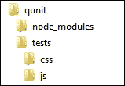
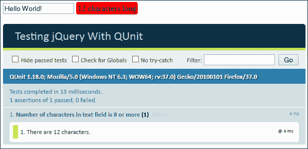
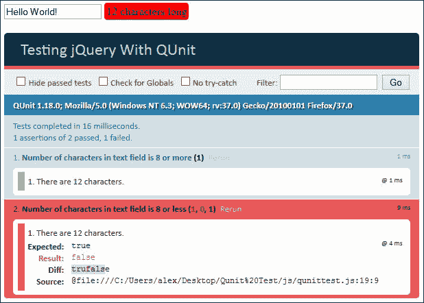
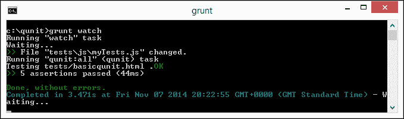
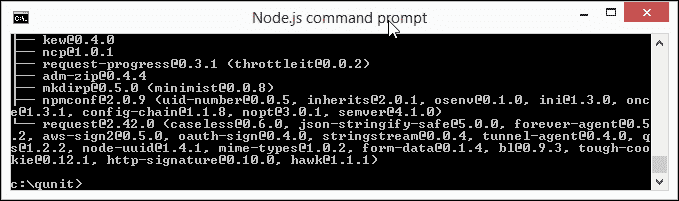
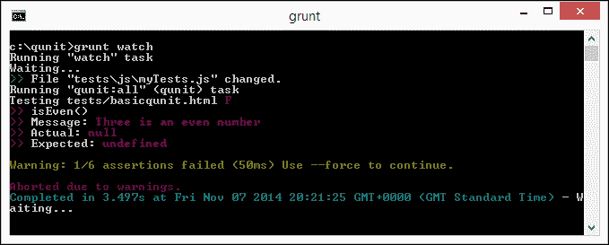

# 十四、测试 jQuery

测试还是不测试，这是个问题…

用那个世界著名侦探的话来说，这个问题的答案应该是基本的！

如果您花过任何时间使用 jQuery，您无疑会了解它的单元：测试代码的需要，并且最流行的方法是使用它的测试库 QUnit。在本章中，我们将回顾如何使用它，然后介绍一些我们应该使用的最佳实践，并探索如何通过自动化对代码执行的测试来真正减少工作流工作。

在本章中，我们将介绍以下主题：

*   重访昆特
*   使用 NodeJS 和 RequireJS 的自动测试
*   使用 QUnit 时的最佳实践

你准备好陷入困境了吗？让我们开始吧…

# 重访昆特

测试任何代码对于成功构建任何在线应用程序或网站至关重要；毕竟，不用说，我们不希望最终结果中出现 bug，对吗？

测试可以手动执行，但人为因素的风险增加，我们不能始终确保测试的执行完全相同。为了减少（甚至消除）这种风险，我们可以使用 jQuery 的单元测试套件 QUnit 自动化测试。当然，我们可以手动运行 QUnit 测试，但 QUnit 的美妙之处在于它可以完全自动化，我们将在本章后面看到。

现在，让我们花些时间回顾一下如何安装 QUnit 并运行一些基本测试的基础知识。

## 安装 QUnit

安装 QUnit 有三种方法。我们可以简单地在代码中包含指向它的两个链接，使用 JavaScript 和 CSS 文件可在[上找到 https://qunitjs.com](https://qunitjs.com) 。它们可以直接引用，因为它们托管在由 MaxCDN 提供的 QUnit 的 CDN 链接上。

另一种选择是使用节点。为此，我们可以浏览到 NodeJS 站点[http://www.nodejs.org](http://www.nodejs.org) ，下载适合我们平台的版本，然后在 NodeJS 命令提示符下运行此命令：

```js
npm install --save-dev qunitjs

```

我们甚至可以使用 Bower 安装 QUnit；为此，我们需要首先安装 NodeJS，然后运行以下命令来安装 Bower：

```js
npm install -g bower

```

安装 Bower 后，可以使用以下命令安装 QUnit：

```js
bower install --save-dev qunit

```

在这个阶段，我们已经准备好开始使用 QUnit 创建自动化测试。

### 注

如果你真的想把船推出去，你可以测试 QUnit 的最新承诺版本，链接可以在[上找到 http://code.jquery.com/qunit/](http://code.jquery.com/qunit/) ；需要注意的是，这不是用于生产的！

## 创建一个简单的演示

现在我们已经安装了 QUnit，我们准备运行一个简单的测试。为了证明它是有效的，我们将修改一个简单的演示，以测试文本框中的字母数，并指出它是否高于或低于给定的限制，如下所示：

1.  We'll start by extracting copies of the code required for our demo from the code download that accompanies this book; go ahead and extract the `qunit.html` file along with the `css` and `js` folders and store these in your project area:

    

    ### 提示

    不要担心`node_modules`文件夹的存在；我们将在本章后面的节点安装时创建此功能。

2.  我们现在需要修改我们的测试标记，所以继续打开`qunit.html`然后修改它，如图所示：

    ```js
    <!DOCTYPE html>
    <html>
      <head>
        <title>Testing jQuery With QUnit</title>
        <meta charset="utf-8">
        <link rel="stylesheet" href="css/qunit.css" />
     <link rel="stylesheet" href="css/qunittest.css" />
     <script src="js/jquery.min.js"></script>
     <script src="js/qunit.js"></script>
     <script src="js/qunittest.js"></script>
      </head>
      <body>
        <form id="form1">
          <input type="text" id="textLength">
          <span id="results"></span>
     <div id="qunit"></div>
     <div id="qunit-fixture"></div>
        </form>
      </body>
    </html>
    ```

3.  接下来，打开您选择的文本编辑器并添加以下代码，将其保存为`js`文件夹中的`qunittest.js`。第一块检查文本字段的长度并显示计数；如果超过规定的八个字符长度，则会将该计数的背景变为红色：

    ```js
    $(document).ready(function() {
      var txt = $("input[id$=textLength]");
      var span = $("#results");
      $(txt).keyup(function() {
        var length = $(txt).val().length;
        $(span).text(length + " characters long");
        $(span).css("background-color", length >= 8 ? "#FF0000" : "#00FF00");
      });
    ```

4.  将这些代码行添加到上一个块的正下方；这将调用 QUnit 测试文本字段的长度，并在字母计数下方显示结果：

    ```js
      $(txt).val("Hello World!");
      QUnit.test("Number of characters in text field is 8 or more", function(assert) {
        $(txt).trigger("keyup");
        assert.ok($(txt).val().length >= 8, "There are " + $(txt).val().length + " characters.");
      });
    });
    ```

5.  With the files in place, we're ready to run the tests; go ahead and run `qunit.html` in a browser. If all went well, we should see the results of our test, which in this instance will show a pass:

    

6.  并非我们在现实生活中进行的每一次测试都会成功；如果我们没有提供正确的值，或者没有执行给出意外结果的计算，那么我们的测试就会失败。要查看在 QUnit 中的效果，请继续并将这些行添加到`qunittest.js`文件中，如下所示：

    ```js
      assert.ok($(txt).val().length >= 8, "There are " + $(txt).val().length + " characters.");
    });

     $(txt).val("Hello World!");
     QUnit.test("Number of characters in text field is 8 or less", function(assert) {
     $(txt).trigger("keyup");
     assert.ok($(txt).val().length <= 8, "There are " + $(txt).val().length + " characters.");
      });
    ```

7.  Now, refresh your browser window; this time around, you should see the tests completed but with one failure, as shown in the following screenshot:

    

### 注

在`completed version`文件夹中的代码下载中有这个示例的完整版本，用于探索测试结果。

尽管这是设计为一个简单的演示，但它强调了创建简单测试并给出适当响应是多么容易；让我们停下来考虑一下我们在这个练习中所涵盖的内容。

每个测试的关键在于使用`assert.ok()`函数，该函数执行简单的布尔检查。在我们的示例中，我们检查文本长度是否为 8 个字符或更少或 8 个字符或更多，并根据结果显示通过或失败。此外，我们可以要求 QUnit 显示标准文本，也可以使用个性化消息覆盖它。这种方法应该足以开始对代码进行单元测试；随着时间的推移，如果需要，我们总是可以进一步开发测试。

这个库的美妙之处在于，我们可以将它与 jQuery 或 JavaScript 一起使用；本章中的示例自然是基于使用前者，但是如果我们决定将来不再使用 jQuery，QUnit 可以灵活地使用后者。QUnit 是 jQuery 系列产品的一部分；与其他简单的测试库有相似之处，例如 JUnit（可在[上找到）http://junit.org/](http://junit.org/) 。

当我们利用昆特的力量时，我们可以做大量的事情。我们在这里看到的只是触及可能实现的表面。

### 注

如果您想了解更多关于 QUnit 的基础知识，那么我建议您参考*使用 QUnit*的即时测试，*Dmitry Sheiko*，可从 Packt Publishing 获得。网上也有很多教程；你可以试试这个，作为起点：[http://code.tutsplus.com/tutorials/how-to-test-your-javascript-code-with-QUnit--net-9077](http://code.tutsplus.com/tutorials/how-to-test-your-javascript-code-with-QUnit--net-9077) 。

作为一名可能的体验者，我们将关注一个特定的特性，它将帮助您进一步提高 jQuery 开发技能：与其每次都手动运行测试，不如将测试完全自动化，使其自动运行？

# 使用 QUnit 自动化测试

等等，无论如何，QUnit 会自动为我们运行这些测试吗？

答案是肯定和否定的。QUnit 自动化了测试，但只是在一定程度上；我们每次都必须手动运行测试集。这一切都很好，但你知道吗？我感觉很懒，没有时间或倾向于继续手工运行测试，因为我相信你也不会。我们可以做得更好；可以使用 NodeJS/Grunt 和 PhantomJS 自动化测试。

诚然，设置需要一些努力，但一旦任何已识别的内容被更改，测试就会自动运行，节省的时间是值得的。



让我们来看看自动化测试中涉及到的是什么：

1.  我们将从安装节点开始。要执行此操作，请浏览至[http://nodejs.org/](http://nodejs.org/) 下载适合您系统的二进制文件；它适用于 Windows、Mac OS 和 Linux。
2.  安装完成后，继续打开 NodeJS 命令提示符，然后切换到我们在本章开头创建的*创建简单演示*中的`qunit`文件夹。
3.  At command prompt, enter the following command:

    ```js
    npm install –g grunt-cli

    ```

    NodeJS 需要创建两个文件才能正确运行；它们是`package.json`和`gruntfile.js`。让我们现在就开始创建它们。

4.  切换到您选择的普通文本编辑器，然后在新文件中添加以下代码，并将其保存为`package.json`：

    ```js
    {
      "name": "projectName",
      "version": "1.0.0",
      "devDependencies": {
        "grunt": "~0.4.1",
        "grunt-contrib-QUnit": ">=0.2.1",
        "grunt-contrib-watch": ">=0.3.1"
      }
    }
    ```

5.  返回到 NodeJS 命令提示符，然后输入以下内容：

    ```js
    npm install

    ```

6.  在单独的文件中，添加以下代码并将其保存为`gruntfile.js`：

    ```js
    module.exports = function(grunt) {
      grunt.initConfig({
        pkg: grunt.file.readJSON('package.json'),

        QUnit: {
          all: ['tests/*.html']
        },
        watch: {
          files: ['tests/js/*.js', 'tests/*.html'],
          tasks: ['QUnit']
        }
      });

      grunt.loadNpmTasks('grunt-contrib-watch');
      grunt.loadNpmTasks('grunt-contrib-QUnit');
      grunt.registerTask('default', ['QUnit, watch']);
    };
    ```

7.  再次返回 NodeJS 命令提示符并输入以下内容：

    ```js
    npm install –g phantomjs

    ```

8.  If all went well, we should see something akin to the following screenshot appear:

    

9.  现在让我们开始 Grunt，并将其设置为监视代码中的任何更改；为此，请在 NodeJS 命令提示符下运行此命令：

    ```js
    grunt watch

    ```

10.  打开我们在本章前面创建的`qunittest.js`副本，然后保存该文件——我知道这听起来可能很疯狂，但在 Grunt 中触发该过程是必需的。
11.  If all went well, we should see this result appear in the NodeJS window:

    

12.  返回到`qunittest.js`后，如图所示更改此行：

    ```js
    assert.ok($(txt).val().length <= 8, "There are " + $(txt).val().length + " characters.");
    ```

13.  Save your file and then watch the Grunt window, which should now indicate a failed test:

    

让我们改变策略，继续做其他事情；尽管我们还没有深入介绍 QUnit 的使用，但在使用 QUnit 时，尽可能尝试并遵循最佳实践是很重要的。让我们花些时间考虑一下这些最佳实践，看看它们是如何提高我们的编码技能的。

# 探索使用 QUnit 时的最佳实践

任何开发者的目标都应该尽可能遵循最佳实践；这样做并不总是切实可行的，因此，重要的是要学会在情况需要时在何处妥协。假设这种情况不会经常发生，作为最佳实践，在使用 QUnit 时，我们可以尝试遵循以下几点：

*   **使每个测试相互独立**：我们运行的每个测试只测试一个特定的行为；如果我们在多个测试中测试相同的行为，那么如果行为需要更改，我们将不得不更改所有测试。
*   **不要做出不必要的断言**：问自己这个问题，“我们要测试什么行为？”。单元测试是关于某个行为应该如何工作的设计示意图，而不是详细说明代码所做的一切。在可能的情况下，尽量在每个测试中保留一个断言；如果在代码的其他地方已经测试了断言，那么运行测试就没有意义了。
*   **Test only one code unit at a time**: The architecture design of your code must support testing units (that is, classes or very small groups of classes) independently and not chained together. If not, you risk creating a lot of overlap, which will cascade and cause failures elsewhere in your code. If the design of your application or site doesn't allow this, then the quality of your code will suffer; it may be necessary to use **Inversion of Control** (**IoC**) to test your work instead.

    ### 注

    通常的做法是将自定义代码调用到通用的、可重用的库中（如 QUnit）；IoC 翻转该过程，因此在本例中，测试由 QUnit 调用我们的自定义代码来执行。

*   **模拟所有外部服务和状态数据**：单元测试的一个关键部分是减少外部服务对代码的影响，在可能的情况下，这些服务的行为可能与测试重叠并影响结果。
*   **避免模拟过多的对象或状态数据**：如果您有任何控制应用程序或站点状态的数据，请尝试将任何模拟数据保持在 5%以下；任何更高的测试都可能会降低测试的可信度。在运行连续测试之前，将这些值重置为已知值也是明智的，因为不同的测试可能会影响其他测试的这些值。如果您发现必须按特定顺序运行测试，或者您对活动数据库或网络连接有依赖关系，那么您的设计或代码不正确，您应该重新访问这两者，以了解删除依赖关系的原因和方式。
*   **避免不必要的先决条件**：避免在大量不相关测试开始时运行公共设置代码。这将混淆您的测试，因为不清楚您的测试依赖于哪些假设，并表明您不是只测试单个单元。创造适当的条件是关键，尽管这可能很困难，但诀窍是尽可能地保持简单。
*   **不进行单元测试配置设置**：运行单元测试时检查配置设置没有任何好处；这可能会导致代码重复，这是不必要的。
*   **Don't specify your implementation – specify the result instead**: Unit testing is designed to focus on the results, not the implementation—does your function produce what you expect it to do? Take an example of the following code snippet:

    ```js
    test("adds user in memory", function()  {
      var userMgr — makeUserMgr();
      userMgr.addUser("user", 'pass");
      equal (userMgr. —internalUsersCØ) . name , "user")
      equal (userMgr. —internalUsersCØ) . pass , "pass")
    });
    ```

    这似乎完全合理，对吗？如果不是因为它关注于*代码是如何实现的，而不是结果，那么它是完全有效的。*

    测试代码的更好方法是使用以下方法：

    ```js
    test( "adds user in memory", function() var userMgr = makeUserMgr(); userMgr.addUser("user", "pass"); ok(userMgr. loginUser("user" , "pass"));
    });
    ```

    在这个例子中，我们不是关注获得结果的途径，而是关注最终结果本身；它产生了我们需要看到的东西吗？

*   **清晰一致地命名您的单元测试**：成功的单元测试将清楚地表明其目的；命名测试的一个有用方法是使用我所称的**SSR**原则，或者**主题、场景和结果**。这意味着我们可以确定正在测试什么，何时应该运行测试，以及预期结果是什么。如果我们只是简单地以主题命名，那么如果我们不知道我们要维护什么，那么它将变得很难维护！

这些提示仅仅触及了作为良好实践应该遵循的内容的表面；为了进行更深入的讨论，有必要阅读 Adam Kolawa 关于应用单元测试的文章，该文章可在[上获得 http://www.parasoft.com/wp-content/uploads/pdf/unittestting.pdf](http://www.parasoft.com/wp-content/uploads/pdf/unittestting.pdf) 。但是要记住的关键点是保持它的简单性、逻辑性，不要试图使你的测试过于复杂，否则它们将变得毫无意义！

# 总结

我们现在已经到了本章的结尾；尽管篇幅很短，但它涵盖了一些关于单元测试实践的有用观点，以及我们如何通过自动化测试来节省时间和精力。让我们快速回顾一下所学内容。

我们首先快速回顾了 QUnit 的原理以及如何安装它；我们简要介绍了最流行的方法，但也研究了如何使用 CDN 和 Bower 使库在代码中可用。

接下来来看一些基本的测试示例；虽然这些都很简单，但它们强调了我们应该在单元测试中使用的原则。通过讨论使用 QUnit 进行单元测试时应遵循的最佳实践，进一步探讨了这些问题。

我们现在已经到了书的结尾。我希望您喜欢我们通过*掌握 jQuery*的过程，并且已经看到这不仅仅是关于编写代码，而是关于一些更软的主题，这将有助于提高您作为 jQuery 开发人员的技能。