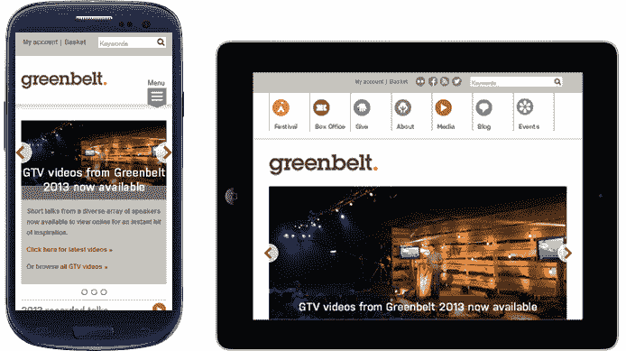
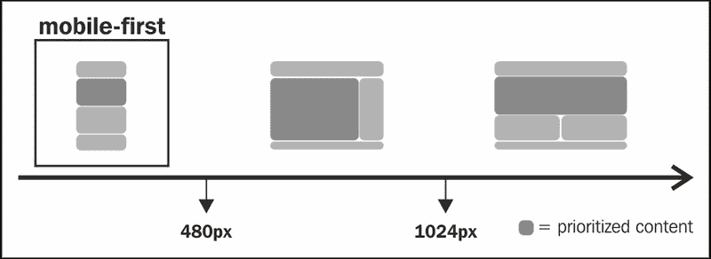
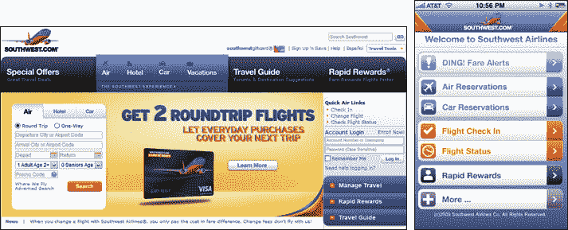
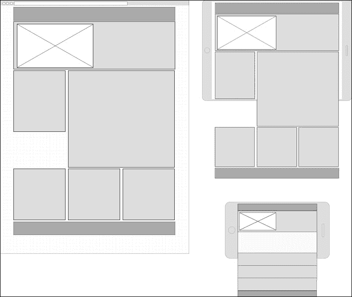

# 一、探索响应式网页设计

如今，在网站开发环境中，我们经常听到“响应”这个词，不是吗？不用担心，我们将一起看到它的真正意义及其对我们网站发展的影响。

在开始开发过程时，影响决策的一个因素（但有时被忽略）是我们预览网站布局响应性所需的设备数量和不同的屏幕大小。不久前，我们曾经处理过一些网站维度的定义，例如 1024 像素。这是因为我们认为访问内容的唯一方法是在桌面上。但是，正如你所知，技术正在为我们带来越来越多的设备（可以显示网站），改善我们与网站的互动方式，如大型桌面显示器、平板电脑、智能手机、智能电视、户外显示器和其他好东西。

移动技术的这些进步以及网站导航和浏览技术的快速发展促使每个人都重新审视网站有限维度的概念，开始思考能够自我调整的结构，并为每种情况提供正确的内容。

在本章中，我们将学习：

*   理解响应式网页设计的概念
*   比较响应性、流动性和适应性 web
*   通过媒体查询调整屏幕
*   移动优先的概念和技巧
*   使用线框工具
*   在线框中实践移动优先开发

# 理解响应式网页设计的概念

我不能不引用*Ethan Marcotte*，他在 2011 年发布了《响应式网页设计》，这本书已经成为前端社区其他许多书籍和文章的参考。

根据我对 Marcotte 的书的理解，响应式网页设计的意义在于根据可用的屏幕区域为用户提供不同的体验，让他们看到相同的网站。从技术上讲，它涉及到以下三种主要的技术的使用：

*   基于网格的柔性布局
*   灵活的图像和视频
*   智能使用 CSS 拆分网站行为（媒体查询）

关于每种技术的更多细节将在后面展示，但为了直观地阐明这一概念，请看下面的示例，该示例表示网站显示在左侧的小型设备（智能手机），中间的中型设备（平板电脑）和右侧的大屏幕（桌面）上：



### 注

除了创建流体维度和应用一些媒体查询，还有更多的挑战。

我们将在整本书中讨论许多次要和主要的挑战。其中包括：

*   用触摸事件替换鼠标覆盖事件
*   便于在表单字段中填充数据
*   确定内容的优先级
*   现场装载优化

# 比较响应性、流动性和适应性 web

响应性网页设计与流体设计略有不同。Fluid design 是关于自动调整网站的结构和尺寸（通过使用宽度的相对单位，如 em 或百分比），但不向用户提供查看内容布局的不同方法。

此外，可以公平地说，响应式 web 设计并不是解决所有移动设备难题的唯一解决方案。正如我们之前所看到的，响应式 web 设计是一种理念，正确实现后可以给用户带来更好的体验，但它可能不适用于所有人或所有设备。这就是我们应该提高新技术知识的原因。

有一句话我很喜欢，作者是*自适应网页设计*一书的作者*亚伦·古斯塔夫森*：

> *“自适应网页设计是关于创建适应用户能力的界面（在形式和功能方面）。”*

### 注

Adaptive web design 仅为较新的设备实现新的 HTML5 功能，例如提供增强的体验。它忽略了旧设备上的这些功能，从而确保基本设置仍能在这些设备上运行。

有很多方法可以实现自适应特性。以下是实现这些目标的最常见做法：

*   使用 jQuery 插件实现移动设备中的触摸事件交互（详见[第 6 章](06.html "Chapter 6. Building Responsive Image Sliders")、*构建响应式图像滑块*）
*   将普通表结构转换为响应表（详见[第 7 章](07.html "Chapter 7. Designing Responsive Tables")、*设计响应表*）
*   仅针对桌面可视化定制表单元素（详见[第 8 章](08.html "Chapter 8. Implementing Responsive Forms")、*实现响应式表单*）
*   使用地理定位功能为用户带来更多相关内容
*   更改设置了正确内容优先级的信息层次结构

*Diego Eis*是一位以传播一些最佳实践而闻名的巴西人，[Tableless.com.br](http://Tableless.com.br)网站的创建者，他在一篇文章中对响应式网页设计和非响应式网页设计进行了出色的比较。想象一下，如果我们计划去两个或两个以上的目的地旅行，你肯定会组织很多服装组合，比如夹克、裤子、短裤和衬衫，这将导致一个沉重的大袋子。这是因为你永远不知道每个地方的气候会是什么样子。同样，为所有活动做好准备，有时会稍微降低网站的性能。。

# 通过媒体查询调整屏幕

*Luke Wroblewski*是流行的网页设计书籍的作者，也是许多文章的良好参考，他发布了科技公司最近公布的设备尺寸分类如下：

*   4“-5”智能手机
*   5“-6”手机/平板电脑混合动力
*   7-8 英寸片剂
*   9-10 英寸片剂
*   11“-17”笔记本电脑和敞篷车（平板电脑/笔记本电脑）
*   20“-30”台式机

智能手机等标签只是友好的标签，只要我们知道响应性的网页设计使结构响应设备的屏幕分辨率，而不是设备类型。但是，我们必须分析为特定宽度提供不同方法是否更好。这是本模块的改进功能，其中 CSS2.1 侧重于媒体类型，如打印、屏幕和手持设备；在 CSS3 中，重点是媒体特性。

媒体查询主要使用，大多数浏览器采用本机方式（Firefox 3.6 及以上、Safari 4 及以上、Chrome 4 及以上、Opera 9.5 及以上、iOS Safari 3.2 及以上、Opera Mobile 10 及以上、Android 2.1 及以上、Internet Explorer 9 及以上）。现在，问题来了：IE6-IE8 呢？对于这些浏览器，有一个已知的轻量级解决方案称为**响应**，当需要支持旧浏览器时，该解决方案会有很大帮助（更多信息请参见[第 10 章](10.html "Chapter 10. Ensuring Browser Support")*，确保浏览器支持*。

为了使本主题简洁明了，以下是我们在指定媒体查询时最常用的功能：

*   宽度：`min-width`/`max-width`
*   高度：`min-height`/`max-height`
*   方向：检查设备的方向是纵向还是横向
*   分辨率：例如，`min-resolution: 300dpi`

查看以下 CSS 代码以更好地了解媒体查询的使用及其语法：

```js
/* Standard desktop screens */
@media only screen and (min-width:1025px) {
 CSS GOES HERE
}
/* Tablets */
@media only screen and (min-width:481px) and (max-width:1024px) {
 CSS GOES HERE
}
/* Smartphones */
@media only screen and (max-width:480px) {
 CSS GOES HERE
}
```

为了澄清此代码，下图是此代码的直观解释，其中显示布局可以根据设备的屏幕以不同的方式显示：



### 提示

**下载示例代码**

您可以下载您在[账户购买的所有 Packt 书籍的示例代码文件 http://www.packtpub.com](http://www.packtpub.com) 。如果您在其他地方购买了本书，您可以访问[http://www.packtpub.com/support](http://www.packtpub.com/support) 并注册，将文件直接通过电子邮件发送给您。

# 移动优先

让我们从分析本项目的用例开始部分：



这一结果是当项目首先从桌面开始时常见的，而网页设计的创作只是用横幅或图片、较少相关的链接、动画等来填补空白。我们可能忘记了用户遵循的显而易见的基本流程。我们知道，有时这些其他项目对项目来说很重要，但很明显，此项目设计需要进行信息体系结构审查。

在前面的示例中，我们可以注意到（在右侧）与用户的通信是多么简单，并且在视觉混乱较少的情况下可能会更有效。这就是趋势：简单化。*Bill DeRouchey*的下一段引文对其进行了总结：

> “设计移动应用程序首先迫使我们精简到基本要素。”

### 注

换言之，移动优先对商业有好处，因为客观性带来金钱。您添加到网站的内容对最终用户来说是有价值和重要的。这些新功能的实现将使访问者在移动中更快、更直观地访问内容，从而获得更好的用户体验。

在这种情况下，当应用移动第一概念时，只能在内部页面上找到特定链接。然而，主页的目标是引导用户根据网站流量信息进入正确的页面。对于不相关的链接，这种情况是可以接受的。

请看下面的屏幕截图，注意信息组织的许多差异，并关注桌面版本中的重要链接：


# 使用线框工具

Wireframe 是一个帮助你设计网站结构的视觉指南，它的主要焦点在于功能、行为和内容的优先级。它应该是任何项目的第一步，因为它使分析信息架构和视觉元素的安排更容易。

Wireframe.cc[http://wireframe.cc/](http://wireframe.cc/) 是启动我们项目的简单方法。此工具非常适合快速但保真度较低的操作。对于详细的作品，有更好的工具，如 Balsamiq 模型或铅笔。

Wireframe.cc 的用法非常简单。进入刀具现场后，执行以下操作：

1.  在左上角选择设备。
2.  然后单击设置重新定义容器宽度（如有必要）。
3.  现在单击并拖动以绘制。
4.  在此之后，选择适当的模具。
5.  如果选择了错误的模具，只需双击它即可进行编辑。

### 提示

使用完线框后，不要忘记点击**保存**按钮，该按钮将生成一个 URL 供进一步访问。

# 练习 1–在线框中实践移动优先开发

访问[http://mediaqueri.es/](http://mediaqueri.es/) 慢慢来获得灵感。让我们开始我们的网站项目，通过应用移动优先的概念，为这些维度创建三个网站线框：智能手机、平板电脑和桌面。

以下三个线框将用作*练习 1*的参考：



# 总结

在本章中，我们回顾了响应式网页设计的概念。我们还了解了什么是移动第一。我们了解了媒体查询以及它们如何在我们的站点实现中有所不同。我们还为我们的网站创建了一个线框。这将把我们连接到下一章，这一章将编码这个线框。

现在，让我们通过学习如何使用三种不同的响应网格系统继续我们的项目：流体基线网格、1140 网格和我最喜欢的 Foundation4 网格。此外，我们还将研究如何通过使用 JavaScript 来调整网站的行为。所有这些主题将在下一章中解释。