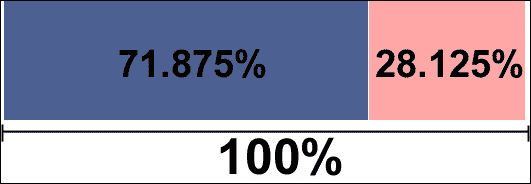

# 二、设计响应性布局/网格

> “积极思考网络就是按比例思考，而不是按像素。”

*特伦特·沃尔顿*前面的引文总结了本章中的想法，因为当我们使用响应式设计时，我们必须考虑流动性、适应性，而不是像素完美。这就是为什么逐像素检查的习惯正在迅速下降的原因。

但是，有两种方法可以解决此问题并保持我们的网站响应速度：

*   使用一点数学来执行站点转换，以确保获得良好的结果
*   使用响应网格系统，选择一组列，并使用相对维度将代码保存在此列中

移动技术的这些进步和网站技术的快速发展促使每个人都重新审视网站有限维度的概念，并开始考虑一种能够自我调整并提供各种情况所需内容的结构。

在本章中，我们将学习以下内容：

*   使用 JavaScript 调整站点
*   以百分比格式查看对象如何为结构提供灵活性
*   如何吸收响应网格系统的特性
*   如何对三种不同的响应网格进行编码
*   如何使用 Photoshop 网格模板
*   启动前如何设置`viewport`的`meta`标签
*   如何使用 Foundation4 网格实现线框

# 使用 JavaScript 调整网站

正如我们在上一章中所看到的，我们可以使用媒体查询来识别当前可用区域并呈现特定的设计定制。此属性非常有用，但不适用于较旧的浏览器，如 Internet Explorer 8 及更旧的浏览器。有两种主要的解决方案可以很好地处理媒体查询：**Adapt.js**和**Respond.js**。

让我们进一步分析每个解决方案的特征，看看除了动态捕获设备维度（很像`@media`查询）之外，它还提供了什么，作为需要支持旧浏览器的项目的替代方案。

## Adapt.js

下面是 Adapt.js 的特性：

*   捕获浏览器的维度后，Adapt.js 只在需要时提供所需的 CSS
*   它有一个非常轻量级的文件

在采用前应考虑以下几点：

*   对浏览器窗口大小的分析是根据需要进行的，为了呈现正确的 CSS，可能会出现短暂的延迟
*   脚本必须插入代码的开头（在`head`标记中），页面的初始加载可能需要更长的时间。

Adapt.js 附带了一些默认 CSS 文件和媒体查询作为建议，可以在我们的网站上使用。以下是[提供的文件 http://adapt.960.gs/](http://adapt.960.gs/) 默认情况下：


### 怎么做

在下载并将文件放入项目后，在`<head>`标记中添加以下代码。在下面的代码中，我们可以根据范围更改 CSS 文件的默认路径、动态自适应频率（每次或每次窗口更改一次）和 CSS 文件：

```js
<noscript>
  <link rel="stylesheet" href="assets/css/mobile.min.css" />
</noscript>
<script>
  var ADAPT_CONFIG = {
    path: 'assets/css/',
    dynamic: true,
       range: [
    '0px    to 760px  = mobile.min.css',
    '760px  to 980px  = 720.min.css',
    '980px  to 1280px = 960.min.css',
    '1280px to 1600px = 1200.min.css',
    '1600px to 1940px = 1560.min.css',
    '1940px to 2540px = 1920.min.css',
    '2540px = 2520.min.css'
    ]
  };
</script>
<script src="assets/js/adapt.min.js" />
```

## Respond.js

Respond.js 文件可从[下载 https://github.com/scottjehl/Respond](https://github.com/scottjehl/Respond) 。Respond.js 的特点如下：

*   此解决方案似乎比 Adaptive.js 更简单
*   它有一个轻量级文件
*   您需要首先检查浏览器是否真的需要此脚本，仅在需要时执行它
*   有两个有用的 API 帮助我们进行调试

缺点如下：

*   它在正确的时间执行正确的 CSS 选择时也有一定的延迟

### 怎么做

在您下载并将文件放入我们的项目后，只需在`head`标签中添加以下代码即可执行解决方案：

```js
<script src="js/respond.min.js">
```

### 提示

Respond.js 使用我们应该在代码中使用的`@media`查询，并动态应用样式。没有额外的工作！

# 百分比如何赋予结构灵活性

一些老网站，甚至是最近的网站，不关心灵活的结构，仍然使用像素作为度量单位。Pixel 为我们提供了对其结构和准确性的更好控制。但是，如今，我们已经无法控制网站的显示位置（正如我们在[第 1 章](01.html "Chapter 1. Exploring Responsive Web Design")、*探索响应性网页设计*中所看到的），这就产生了构建灵活结构的需求，在这种结构中，元素可能会拉伸并适应尺寸。

百分比始终有效，因为它与其父元素中声明的值相关。因此，如果`div`标签的大小为 50%，且其父元素的大小为 600 px，`div`标签的大小为 300 px，如下图所示：


这同样适用于其父元素为对象实际大小 50%的百分比，大小为 50%的`div`标记看起来像是 25%，保持比例。让我们看下图：


但是，问题是：如果我们不设置父元素的宽度怎么办？*毛里西奥·萨米·席尔瓦*在他的博客[中对此进行了很好的解释 http://www.maujor.com/blog/2013/03/08/por-que-height-100-nao-funciona/](http://www.maujor.com/blog/2013/03/08/por-que-height-100-nao-funciona/) 。在本例中，父元素采用当前视口的默认宽度。换句话说，每次调整浏览器窗口的大小时，宽度都会自动改变，而这个事件正是赋予我们灵活结构的力量。

回到上一个示例，其中`div`被设置为 50%，它在视觉上看起来是可用区域大小的一半，如下图所示：


现在您已经了解了结构流动性的重要性，另一个重要任务是转换填充和边距以及百分比。例如，当我们需要在大屏幕上显示一个大的水平填充时，它会产生影响，因为如果在智能手机上看到同一个网站，并且填充是以像素为单位定义的，那么它将占用屏幕上的大量空间。

我们可以对手机的规则破例，减少这一空白。但是，试着想象一下我们必须为所有元素做的艰苦工作！最好的选择是将此间距从像素转换为百分比。

## 将像素转换为百分比

将像素转换为百分比的主题很重要，因为这是魔术开始展现的地方；换句话说，我们将通过一个例子来了解如何放弃以像素为单位的绝对大小，并将其转换为百分比。应使用将像素转换为百分比的过程，尤其是如果我们项目的目的是在控制元素方面具有更大的灵活性。

让我们练习将以下基于像素的示例结构转换为百分比：


下面的代码是 CSS 代码的一个示例，表示上一个屏幕截图中的细节：

```js
#wrap {
 width:960px;
}
#content {
 width:690px;
 float:left;
}
#right-sidebar {
 width:270px;
 float:left;
}
```

### 注

让我们看看神奇的公式：*目标/上下文=结果*。

在前面的公式中，*目标*是原始元素的像素宽度，在下面的代码中为`690`，*上下文*是其容器的宽度，为`960`，*结果*为弹性值：

```js
#wrap {
 width:100%; /* container 960 */
}
#content {
 width:71.875%; /* 690 ÷ 960 */
 float:left;
}
#right-sidebar {
 width:28.125%; /* 270 ÷ 960 */
 float:left;
}
```

### 提示

分享一下我的经验，我建议将原始值置于结果之前。当我们想要再次转换大小而忘记原始像素值时，这会产生不同。

另外，我想强调的是，不要把数学成绩凑整。这对于元素灵活性的准确性非常重要，可防止意外中断。

下图是转换为柔性结构的结果：



为了帮助简化这种转换，可以在[找到一个名为**灵活数学**的工具 http://responsv.com/flexible-math/](http://responsv.com/flexible-math/) 。这个网站做的正是像素转换所需的数学运算，只要它基于父元素大小（正如我们在上一节中看到的）。

还有另一种转换，即从 em 到 px 的字体大小和线条高度的转换，但我们将在[第 4 章](04.html "Chapter 4. Designing Responsive Text")*设计响应文本*中详细了解。虽然我们正在谈论 EM，但使用的魔法公式将是相同的，需要注意其他确定的要点。

我们将在[第 5 章](05.html "Chapter 5. Preparing Images and Videos")*准备图像和视频*中看到，不指定``标签的大小只是缩放图像的第一步。稍后，我们将详细了解如何使图像流畅，以及以最适合各种情况的方式显示图像和视频的一些方法。

如果我们在数学转换方面做了很多工作，并且花费了很多时间，那么我们应该考虑另一种方法。有一种更方便、更快的解决方案来获得这种灵活的结构，其名称是响应网格系统，我们将在下一节中看到。

# 什么是响应网格系统？

网格系统本身可能被标记为开发工具包或 CSS 文件的小集合，这将帮助我们快速开发网站。其中一些具有固定的列宽度（可能因使用的工具而异）。柱是网格系统的最小度量单位。大多数网格系统包含 12-16 列。檐槽是用于在柱之间创建空间的边距。

此外，如果设计基于网格，网格系统可以节省开发时间。有时，布局创建可能会受到列使用的限制，但这并不常见。网格系统的优势在于，它们帮助我们实现更好的可读性，并平衡视觉权重、灵活性和整个页面的内聚性。

为了更好地理解网格系统是如何工作的，请看下面的屏幕截图，注意页眉区域的宽度可以测量为 12 列（全宽），而**侧栏**区域只能测量为 3 列：


我们什么时候不应该使用网格？如果站点的布局使用不规则的柱尺寸和不规则的排水沟，那么实现网格可能是不可能的。

问题来了：响应网格系统和非响应网格系统之间的主要区别是什么？

以下是响应电网系统的显著特征：

*   它必须有不同的特点，在不同的大小
*   它在断点之间必须是流动的
*   它必须有足够的控制来决定哪些列将在哪一点进行转换
*   理想情况下，类在所有断点处都应该是有意义的

## 响应式电网系统

现在，我们将看到三种不同的系统可以应用，但为了我们逐步理解，我想先描述较不复杂的系统，然后是那些具有更多选项和资源的系统。

### 提示

在选择与项目最匹配的网格系统之前，请阅读所有这些网格系统。此外，还有其他类型的响应网格，我还没有尝试在实际项目中实现。

### 流体基线网格系统

此开发工具包的目标是为响应性网站的开发提供方便和敏捷性。流体基线网格代码（[http://fluidbaselinegrid.com/](http://fluidbaselinegrid.com/) 简单、轻量级、非侵入性，可根据项目需要定制。

该网格系统基于三列折叠布局：一列用于移动设备，两列用于平板电脑，三列用于台式机及其他设备。让我们看看它的用法。

要以这种方式设置代码，当我们希望内容只填充结构的一列时，只需要使用类`g1`；然后，`g2`表示两列，`g3`表示三列。请看以下代码示例：

```js
<div id="content">
    <div class="g2">
        ...
    </div>
    <div class="g3">
        ...
    </div>
    <div class="g1">
        ...
    </div>
</div>
```

下图是此代码的预览：


现在，让我们先看一个网站示例，然后尝试使用类编写一个结构：


HTML 结果应为以下内容：

```js
<div id="content">
    <div class="g3">
        ...
    </div>
    <div class="g1">
        ...
    </div>
    <div class="g1">
        ...
    </div>
    <div class="g1">
        ...
    </div>
</div>
```

你注意到指南针图像隐藏在手机屏幕上了吗？在这种情况下，解决方案是在移动 CSS 上隐藏旋转木马，并在平板电脑 CSS（以及桌面）上显示它。

使用流体基线网格的主要优势如下：

*   液柱
*   基线网格与美丽的排版标准
*   响应性设计行为
*   使用 Normalize.css 修复常见的浏览器不一致
*   简单的文件结构，只包含要启动的最小文件数
*   Polyfills 支持 IE6/7/8:Respond.js（媒体查询）和 html5shim（HTML5 元素）

**流体柱**默认为至少三柱折叠网格，柱宽约 31%，柱间排水沟宽 2%。如果网站设计需要更多的栏目，这不是问题，因为它可能会在 CSS 代码中更改。

**基线网格**为排版带来了跨浏览器解决方案，提高了可读性，并在文本中创造了更好的和谐。使用的主要字体为 Georgia 和 Futura，可以轻松更改以满足项目需要。

**Fluid Baseline Grid**是为 mobile first 设计的，为我们实现响应式设计提供了公共断点。CSS 代码准备从小屏幕开始定制，并根据设备中的可用区域建议内容显示的差异。只要是基于列，Fluid Baseline 网格就分为：一列用于移动设备，两列用于平板电脑，三列用于台式机和其他设备。

### 1140 格

1140 网格（[http://cssgrid.net/](http://cssgrid.net/) 结构简单。其目标是在定义每个主要元素的宽度时，为代码开发提供更大的灵活性。它被分为 12 列，根据您的偏好，将合并或不合并以方便您。但是，在设计该项目时，宽度尺寸限制为最大 1280 像素。如果项目不需要在大型设备上显示，那么 1140 网格对于所有其他较小尺寸的设备都非常适用。

为了澄清，下面的代码显示了您实际上可以如何做到这一点：

```js
<div class="container">
   <div class="row">
       <div class="onecol">
           ...
       </div>
       <div class="twocol">
           ...
       </div>
       <div class="threecol">
           ...
       </div>
       <div class="threecol last">
           ...
       </div>
   </div>
</div>
```

下图显示了结果：


作为我们知识同化过程的一部分，让我们回到使用 1140 网格的 Pixelab 样本和代码：

```js
<div id="container">
   <div class="row">
        ...
   </div>
   <div class="row">
        <div class="fourcol">
          ...
        </div>
        <div class="fourcol">
          ...
        </div>
        <div class="fourcol last">
          ...
        </div>
   </div>
</div>
```

行类将内部列居中，并将`1140px`定义为`max-width`。

每列可使用`.onecol`、`.twocol`、`.threecol`、`.fourcol`、`.fivecol`、`.sixcol`、`.sevencol`、`.eightcol`、`.ninecol`、`.tencol`、`.elevencol`、、`.twelvecol`等类别。此外，它们将在一行中的任意组合中使用，该行的总和不超过 12 列。在最后一个元素中，记住也要添加一个类`last`；这将消除额外的利润。

与流体基线网格相比，其中一个差异是 1140 网格已经实现了更多的列（为开发人员提供了更多的选项），但是流体基线网格开发人员可以在需要时自由地在那里实现它。

除了简单的结构外，网格 1140 还突出了以下特点：

*   用于缩放图像的 CSS 代码
*   基于百分比的排水沟
*   浏览器支持（IE6 除外）
*   最小文件结构
*   可下载的 PS 模板

### 基础 4

基金会 4，[http://foundation.zurb.com](http://foundation.zurb.com) 是一个完整的框架，里面有很多组件。它们是预先定义的，并经过专业化设计，将作为我们项目的基础。只关注 Foundation4 的网格组件再次让我们感到惊讶，因为它提供了许多选项。

该框架因其下载区域不同而有所不同，在下载区域中，它显示了以下屏幕截图所示的屏幕，因为它让开发人员可以自由地以最适合他们的方式启动他们的项目（如果他们已经对网格有了一定的了解）：


但是，不必担心；如果您仍在了解它，默认情况下，它带有最常用的值，例如 12 个列和最大屏幕大小的 62.5 em（1000 px）。

基金会 4 中还有其他良好的特征，如下所示：

*   预定义的 HTML 类。
*   小网格和大网格。
*   嵌套我们的网格。
*   补偿。
*   居中的列。
*   来源排序。
*   手机优先。
*   规范化和现代化支持浏览器的脚本。
*   不支持 Internet Explorer 7 及更早版本的浏览器。此外，InternetExplorer8 对网格和一些 UI 组件（如输入切换器）的支持有限。
*   为了使用 Internet Explorer 8，Foundation4 促使开发人员使用其先前版本的补充解决方案，该解决方案可在[中找到 http://foundation.zurb.com/docs/support.html](http://foundation.zurb.com/docs/support.html) 。

这个框架值得更多的关注，因为它有更多的选择和优势。这就是我们详细了解其特征的原因。在接下来的示例中，我们将使用该工具建议的 12 列作为参考。

Foundation4 有一系列预定义的 HTML 类，它们对我们的开发有很大帮助，因为所有代码都已经创建好了，我们只需要使用类名来调用它。在下面的示例中，我们看到一个小类和元素将占用的列数：

```js
<div class="row">
 <div class="small-3 columns">...</div>
 <div class="small-6 columns">...</div>
 <div class="small-3 columns">...</div>
</div>
```

下图显示了结果：


请注意，3、6 和 3 的总和等于 12。此外，还可以选择将类从`small`更改为`large`。如果我们交换这些类，当我们将浏览器宽度降低到 768 px 时，每个`<div>`标记占据最大宽度。有可能将这两个类放在一起，对于尺寸小于 768 px 的小屏幕显示内容，对于大尺寸，宽度如前一示例所示。

在这种情况下，代码如下所示：

```js
<div class="row">
 <div class="small-6 large-5 columns">...</div>
 <div class="small-6 large-7 columns">...</div>
</div>
```

Foundation4 网格允许我们尽可能地嵌套。此技术通常用于执行相当复杂的设计实现或更好地定位表单元素。以下代码是其用法示例：

```js
<div class="row">
 <div class="small-8 columns">8
   <div class="row">
     <div class="small-3 columns">3 Nested</div>
     <div class="small-9 columns">9 Nested</div>
   </div>
 </div>
 <div class="small-4 columns">4</div>
</div>
```

下图显示了结果：


我们可以使用`offset`在一行中的列之间创建额外的空间。通过操纵此参数，可以根据需要对齐列。请记住，所有偏移都位于元素的左侧。同样，数字之和应该等于 12。让我们在下面的示例中看到这一点，第一个`div`标记填充两列，然后有两列偏移，然后另一个`div`标记填充八列：

```js
<div class="row">
 <div class="large-2 columns">2</div>
 <div class="large-8 large-offset-2 columns">8, offset 2</div>
</div>
```

结果如下：


创建`centered column`类是为了将特定列（而不是其中的内容）定位到行的中心。Foundation4 提供两个类：`large-centered`和`small-centered`。正如我们之前所看到的，小版本会显示出来，因为它不会被大版本覆盖。例如，如果我们想显示一个填充六列且居中的`div`标记（对于小型和大型版本），我们应该先使用以下代码：

```js
<div class="row">
 <div class="small-6 small-centered columns">6 centered</div>
</div>
```

结果如下：


也许下面的功能有点让人困惑，但当我们想要将源代码放在相关内容的顶部时，它非常有用。为此，我们只需要使用类`push`和`pull`。以下功能也将分别影响每个版本（在功能之前使用`small`或`large`，即`large-push-8`），或同时影响两个版本：

```js
<div class="row">
 <div class="small-4 push-8 columns">4</div>
 <div class="small-8 pull-4 columns">8, last</div>
</div>
```

结果如下：


# Photoshop 网格模板

为了在创建我们的设计时方便列的可视化，有一个名为 Guideguide 的 Photoshop 插件。

指南插件（[http://guideguide.me/ Photoshop 的一些版本支持](http://guideguide.me/)：CS5、CS6 和 CC。然而，如果你有 PhotoshopCS4，这个插件的 2.03 版可以工作，但是它将不再用新功能更新。这是一个指导我们为 Photoshop 文档创建自定义指南的工具。

安装 Guideguide 插件并创建一个空白文件后，当我们在 Photoshop 中访问它时，将打开如下截图所示的窗口；如果您不太熟悉网格，我建议使用所示的初始值填充它：


然后，点击**GG**按钮，它将在我们的文档中创建指南，这将在布局创建中非常有用。

# 启动前设置 viewport 的 meta 标签

`viewport`的`meta`标签仅显示整个可视区域的一部分。当我们制作响应性网站时，这种配置非常重要，因为没有它，移动设备浏览器将向用户返回网站的缩小版本。其用法没有标准语法，但所有常见的移动浏览器都支持以下标记：

```js
<meta name="viewport" content="width=device-width">
```

其他功能如`initial-scale`可用于定义`viewport`的`meta`标签，这可能会阻止用户以放大模式打开网站，`maximum-scale`将限制用户放大内容。以下代码是`viewport`限制用户体验的示例，不允许使用缩放功能：

```js
<meta content="width=device-width, initial-scale=1, maximum-scale=1" name="viewport">
```

# 练习 2a–创建线框布局设计

现在我们已经有了线框以及如何操作网格列的知识，我们需要调整线框以适应列中的主要元素，如以下屏幕截图所示：


在那之后，是时候给它上色了，想象一下为用户提供所有设备的最佳体验。

基于[第一章](01.html "Chapter 1. Exploring Responsive Web Design")*探索响应式网页设计*中*练习 1*的线框，以下截图显示了布局设计的建议：


当我们定制主要元素时，请记住将其保留在指南中，这将使下一步更容易。否则，我们将花费比预期更多的时间来编写代码。

以下屏幕截图显示了主要元素在列中的匹配方式：


# 练习 2b–使用 Foundation4 网格构建我们的网站

在看到一些响应网格系统的使用后（从一个更简单的解决方案开始，寻求一个更完整的解决方案），让我们使用 Foundation4 网格构建代码，快速创建响应，而无需编写一行 CSS 代码。此外，请记住在`<head>`标记中配置视口。

使用 Foundation4 网格，执行以下建议的步骤：

1.  开始编写 HTML 脚本。
2.  识别结构中的行，并将`row`类添加到现有元素或新的`div`标记中。
3.  测量每个主元素将填充多少列，并在类中设置此值。

让我们看看在以下 HTML 中是如何实现的：

```js
<!DOCTYPE html>
<html lang="en">
<head>
 <meta charset="utf-8" />
 <meta name="viewport" content="width=device-width" />
 <title>Responsive Web Design using jQuery & CSS3</title>
 <link rel="stylesheet" href="css/foundation.css" />
</head>
<body>
 <header class="row">
   <a class="large-3 columns" href="#">LOGO</a>
   <nav class="large-9 columns">
     <ul>
       <li><a href="#">About</a></li>
       <li><a href="#">Training Options</a></li>
       <li><a href="#">Schedules</a></li>
       <li><a href="#">Rates</a></li>
       <li><a href="#">Contacts</a></li>
     </ul>
   </nav>
 </header>
 <div class="row">
   <section class="small-12 columns">
     
   </section>
 </div>

 <div class="row">
   <section id="content" class="large-8 push-4 small-12 columns">
     <article>
         <h2>Page title</h2>
         <p>FPO text: Lorem ipsum dolor sit amet...</p>
         <p><a href="#" class="button learn-more">Learn more</a></p>
     </article>
     <article class="subcontent">
         <h2>Page subtitle</h2>
         <p>FPO text: Lorem ipsum dolor...</p>
     </article>
   </section>
   <aside class="large-4 pull-8 columns">
     <h2>Sidebar title</h2>

     <div class="row">
       <div class="small-4 large-12 columns">

     <span>FPO text: Lorem ipsum dolor...</span> <a href="#">See more</a></div>
       <div class="small-4 large-12 columns">

<span>FPO text: Lorem ipsum dolor...</span> <a href="#">See more</a></div>
       <div class="small-4 large-12 columns">

     <span>FPO text: Lorem ipsum dolor...</span> <a href="#">See more</a></div>
     </div>
   </aside>
 </div>

 <section id="banners" class="row">
   <div class="small-4 columns">Banner1</div>
   <div class="small-4 columns">Banner2</div>
   <div class="small-4 columns">Banner3</div>
 </section>

 <footer class="row">
   <p class="large-2 small-9 large-offset-8 columns">All rights reserved. 2013</p>
   <p class="large-2 small-3 columns">icons</p>
 </footer>
</body>
</html>
```

在这段代码中，我额外打断了一行，这样可以很容易地看到每一行，并突出显示了网格使用的类。让我们观察每行的列的总和：

1.  `small`=12 列
2.  `small`=12 列（4+4+4）和`large`=12 列（每行一列）
3.  `small`=12 列（4+4+4）
4.  `small`=12 列，`large`=12 列（2+8+2）

以下屏幕截图显示了在宽度大于 768 px 的设备中，不写入任何 CSS 代码的结果：


以下屏幕截图显示了宽度小于 768 px 的设备中的同一站点：


保持冷静；网站看起来仍然很糟糕，因为这只是项目的第一步。我们需要做一些视觉调整来完成我们的任务。

### 提示

我建议你在你的网站上搜索一些漂亮的图片，改善它的外观和感觉。否则，您可以进入[http://placehold.it/](http://placehold.it/) 创建预留图像空间的占位符。

这是一个很好的方法，可以避免改变解决方案附带的 CSS。在本例中，我们将创建一个新的 CSS 文件，并将其包含在我们的网站上。在 Tyr0t0.1 节中，在 ZURB 基金会 CSS 文件之后，包含您自己的 CSS 代码：

```js
<link rel="stylesheet" href="css/mystyle.css" />
```

在这个 CSS 中，我们将定制分为三个部分，应用级联样式，并避免重复部分代码：

*   两种版本
*   小型版本（低于 768 像素）
*   大版本（大于 768 像素）

以下代码用于从我们的站点开始定制。可以随意使用它，只要它只是一个与布局相匹配的建议。

```js
#banners div {
  text-align: center;
  height: 100px;
  line-height: 100px;
  background: #f65050;
}
#banners div:first-child {
  background: #7ddda3;
}
#banners div:last-child {
  background: #506ff6;
}
@media only screen and (max-width: 48em) {
  .subcontent,
  aside span {
    display: none;
  }
  aside .img-aside {
    display: block;
    margin: 0 auto;
  }
  aside div {
    text-align: center;
  }
}
@media only screen and (min-width: 48em) {
 aside .img-aside {
    float: left;
  }
}
```

# 总结

在本章中，我们学习了使用 JavaScript 解决方案呈现特定 CSS 代码的三种不同方法：Adapt.js、Respond.js 和 Breakpoints.js。我们现在还了解了如何通过数学运算和发现结果将像素转换为百分比。我们还了解了什么是响应网格系统，以及如何使用每种类型的响应网格系统。

最后，我们已经开始使用网格（基于[第 1 章](01.html "Chapter 1. Exploring Responsive Web Design")、*探索响应性网页设计*中的线框）对我们的网站进行编码，这将连接到下一章，在下一章中，我们将介绍实现响应性菜单导航的不同方式，如切换菜单、非画布菜单（如 Facebook），等等。