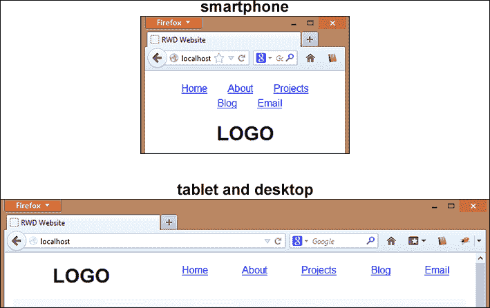
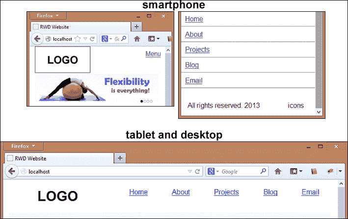
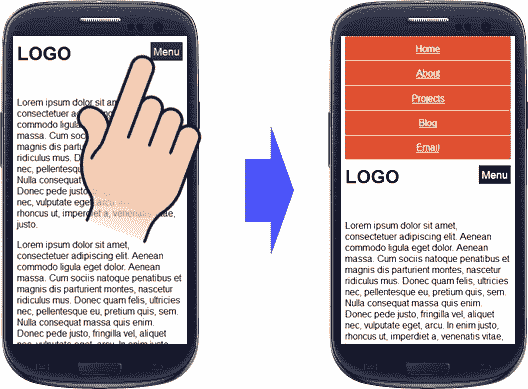
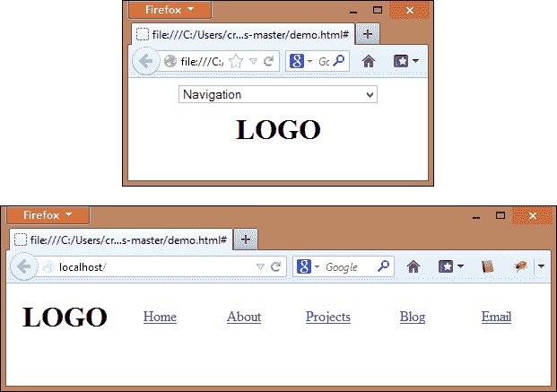
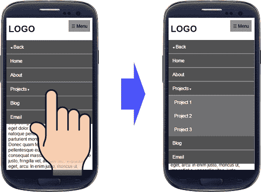
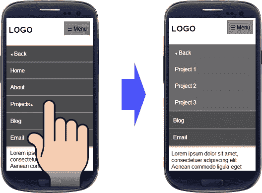
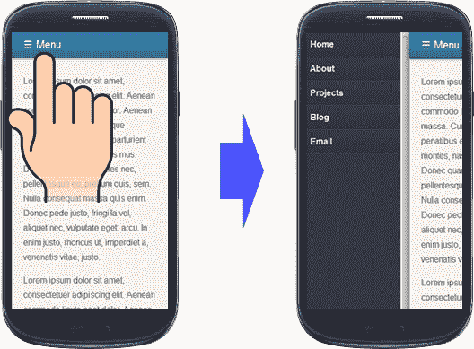

# 三、构建响应导航菜单

`header`部分是网站建设的重要部分。此区域中有一些常见元素，例如徽标、登录、导航选项、注册选项和搜索字段。但是规划这个区域并不容易，因为如果我们把所有的元素放在一起，我们会给我们的用户一个混乱的导航。另一个选择是为标题保留大量空间，但它可能会在智能手机的折叠上方隐藏更多内容。预期的结果是为标题占用少量空间，并有效地处理该空间以显示这些元素。

在本章中，我们将分析一些类型的导航菜单，在正确的情况下，以清晰直观的方式使用每种菜单，并避免让用户感到沮丧。这就是为什么精心设计我们的导航菜单，让用户能够轻松、清晰地看到其中的主项和子项对我们很重要。

在本章中，我们将：

*   设计菜单以提高其可用性
*   请参阅最常用的响应导航模式以及如何对每种类型进行编码
*   通过做练习来应用我们最近学到的知识

# 通过提高菜单的可用性来设计菜单

在响应性网站上，尤其是那些使用移动优先概念的网站，内容是用户访问我们网站的主要原因，因此我们必须在折叠前提供合理的空间来显示内容。

为了提供这个空间，我们需要更好地处理显示菜单的方式，以便能够根据设备提供菜单的另一个视图。

不管怎么说，目标是一样的：让用户更容易找到他们想要的东西，而不会严重影响有用的区域。当菜单组织好后，我们给用户自由选择他们想通过我们的网站导航到的地方。

事实上，这两个界面之间的较量是没有答案的：顶部和左侧导航菜单。有时导航在一个上下文中运行良好；然而，在另一种情况下，它可能不起作用。为了找出哪个导航最适合我们的网站，了解顶部和左侧导航菜单最适合的不同上下文是很重要的。让我们分五轮分析这场战斗：

*   **扫描**：左侧导航菜单获胜，因为它占用更少的空间来显示所有项目，并且便于垂直扫描（对用户来说更自然）。
*   **页面空间**：在这种情况下，顶部导航获胜，因为它使用了最小的垂直空间，只为内容保留了内容区域。
*   **项目优先级**：这一轮的导航菜单在左上方有一个平局。顶部导航在项目中的权重不同，因为最左侧的项目将在其他项目之前按照读取顺序进行读取。但是，这取决于内容的类型。
*   **可见性**：本轮在左上方导航菜单之间有一个平局。顶部导航菜单更容易看到，因为它通常靠近徽标。在左侧导航中，某些项目可能隐藏在折叠下方。
*   **话题与兴趣**：本轮在左上方导航菜单之间有一个平局。如果我们的网站为广泛的受众提供了各种各样的内容（例如，电子商务网站），那么左侧的导航菜单对这些用户来说会更好，因为他们有各种各样的兴趣，并且会选择他们想看的项目。但是，对于特定主题，顶部导航菜单更适合，因为快速查找高优先级项目更为重要。

# 最常用的响应式导航模式

规划移动导航并非易事，因为我们需要根据网站的目标，以响应的方式提供对特定内容的低调快速访问。经过长期研究，*Brad Frost*在他对流行菜单技术的研究中，总结了菜单类型概念的一些趋势和建立的模式。

根据他的文章（[http://bradfrostweb.com/blog/web/responsive-nav-patterns/](http://bradfrostweb.com/blog/web/responsive-nav-patterns/) ），导航模式为：

*   顶部导航
*   脚锚
*   切换菜单
*   选择菜单
*   仅页脚
*   多开关
*   切换和滑动
*   非画布

让我们检查每种方法，看看它们的外观，并了解哪种方法更适合您的项目。

## 顶部导航

顶部导航模式是互联网上观看次数最多的模式，因为它需要一些额外的调整工作。要实现此解决方案，我们只需将菜单保持在顶部，如下面的屏幕截图所示：



### 怎么做。。。

在这种情况下，如前一个屏幕截图所示，它在智能手机徽标上方显示菜单。因此，让我们编写此 HTML 脚本以了解更改：

```js
<nav id="site-nav">
  <ul>
    <li><a href="#">Home</a></li>
    <li><a href="#">About</a></li>
    <li><a href="#">Projects</a></li>
    <li><a href="#">Blog</a></li>
    <li><a href="#">Email</a></li>
  </ul>
</nav>
<h1 id="logo">LOGO</h1>
```

如果您希望重新排列这些元素（在顶部显示徽标，然后显示菜单），则需要颠倒元素的顺序，将代码中的`<h1>`标记移到`<nav>`标记之前。

不幸的是，Internet Explorer 8 及更低版本不支持`<nav>`标记。然而，这个标记有很好的语义，我建议使用它。我们将在[第 10 章](10.html "Chapter 10. Ensuring Browser Support")中看到*确保浏览器支持*，如何使用`Html5shiv with Modernizr`处理。通过采用移动优先的概念，并使用 CSS 中的第一块代码，我们可以通过用微小的水平边距填充水平区域并将菜单对齐中心来定制要显示的菜单：

```js
/* mobile-first */
#site-nav ul {
  list-style: none;
  text-align: center;
  padding: 0;
}
#site-nav li {
  display: inline-block;
  margin: 0 5%;
  line-height: 1.5;
}
#logo {
  text-align: center;
  clear: both;
}
```

对于大于 768 像素的屏幕，菜单宽度减小到 70%，并向右浮动。此外，徽标现在向左浮动，宽度为 30%，如以下代码所示：

### 提示

这些百分比只是示例的一部分。

```js
/* desktop */
@media only screen and (min-width: 768px) {
 #site-nav ul {
   width: 70%;
   float: right;
 }
 #logo {
   float: left;
   width: 30%;
   clear: none;
 }
}
```

### 提示

它的实现非常简单，但是当您有三行以上的菜单项时要小心，因为它会占用很多重要的区域。

## 脚锚

Footer anchor 是一个智能解决方案，其主要目标是为内容保留更多有用的空间，而不会惩罚在小范围内看到我们网站的移动用户。要做到这一点，需要将主菜单重新分配到页脚，只需在页眉中保留一个锚链接，当用户点击菜单时，锚链接就会聚焦在菜单上。

以下屏幕截图表示此导航模式仅适用于可用空间较短的智能手机：



### 怎么做

让我们开始使用与第一个导航模式相同的 HTML 代码。但是现在我们将把菜单移到 DOM 的底部，就在`</body>`标记之前，并在`<body>`标记之后的代码开头插入以下链接，因为当用户点击它时，网站将关注导航菜单：

```js
<a id="link-to-menu" href="#site-nav">☰ Menu</a>
```

### 注

十进制代码`☰`是一个表示菜单的符号，因为它显示一个有三行的符号。

在智能手机的 CSS 代码中，我们需要：

*   从菜单中为菜单项创建样式。一些开发人员更喜欢列出这些项目，每行显示一个（便于触摸），但这取决于您。
*   从标题为按钮创建样式（这将驱动用户进入菜单）。

CSS 代码如下所示：

```js
/* mobile-first */
#site-nav ul {
  list-style: none;
  text-align: center;
  padding: 0;
}
#site-nav li a {
  display: block;
  border-top: 1px solid #CCC;
  padding: 3%;
}
#site-nav li:last-child a {
  border-bottom: 1px solid #CCC;
}
#link-to-menu {
  position: absolute;
  top: 10px;
  right: 10px;
}
```

对于平板电脑和台式机（屏幕宽度大于 768 像素的设备），最好的方法是隐藏此标题按钮。现在，我们需要在页眉上显示菜单，而不更改 HTML 上的任何内容（我们刚刚将其移动到页脚区域）。

让我们通过在顶部设置菜单位置并隐藏标题按钮来实现以下代码：

```js
/* tablet and desktop */
@media only screen and (min-width: 768px) {
 #site-nav {
   position: absolute;
   top: 0;
   left: 30%;
   width: 70%;
 }
 #link-to-menu {
   display: none;
 }
 #site-nav li {
   display: inline-block;
   margin: 0 5%;
   padding: 0;
   width: 18%;
   border: none;
   line-height: 1.5;
 }
 #site-nav li a {
   display: inline;
   border: none;
   padding: 0;
 }
 #site-nav li a,
 #site-nav li:last-child a {
   border: none;
 }
}
```

## 切换菜单

切换导航模式与之前的模式相比具有几乎相同的行为。当用户点击标题中的链接时，真正的区别就显现出来了，而不是驱动用户进入锚定菜单，菜单在标题之后向下滑动，从而为用户提供了令人印象深刻的效果和快速访问主链接的机会。正如我们不久将看到的那样，它的实现相对容易。

### 提示

为了提高动画的性能，尝试使用`max-height`属性

### 响应导航插件

响应导航插件[http://responsive-nav.com/](http://responsive-nav.com/) 是为小屏幕创建切换导航的轻量级解决方案。我们喜欢三个主要特征，它们是：

*   使用触摸事件（我们稍后会更好地理解）和 CSS3 转换
*   构建这个插件时要考虑到可访问性，还要使用禁用的 JavaScript。该插件不需要任何外部库
*   适用于所有主要的桌面和移动浏览器，包括 IE 6 及更高版本

### 怎么做

下载此解决方案的文件后，让我们在 HTML 的`<head>`标记中插入此代码：

```js
<link rel="stylesheet" href="css/responsive-nav.css">
<script src="js/responsive-nav.js"></script>
```

我们还将使用与第一个示例相同的 HTML 代码，但就在 DOM 的`</body>`结束标记之前，我们需要插入执行脚本的函数：

```js
<script>
var navigation = responsiveNav("#site-nav");
</script>
```

现在，让我们从页脚定位模式插入相同的菜单样式：

```js
nav ul {
  list-style: none;
  text-align: center;
  padding: 0;
}
.menu-item a {
  display: block;
  border-top: 1px solid #CCC;
  padding: 3%;
}
.menu-item:last-child a {
  border-bottom: 1px solid #CCC;
}
```

就这样。我们完了。有一些可定制的选项将增强我们的功能实现。您可以随意测试其他选项，但默认情况下，它已设置为 CSS3 动画，400 毫秒后自动创建的切换按钮将显示，或者您可以通过以下方式定义您的动画：

```js
<script>
var navigation = responsiveNav("#site-nav", {
  customToggle: "#mybutton"
});
</script>
```

在下面的屏幕截图中，我们将看到**响应导航**窗口正在运行，改变智能手机上的菜单样式，并以一种不显眼的方式显示菜单：



### 提示

默认情况下，不会显示“切换”按钮的自定义和菜单中的橙色。这只是创建者插件在其演示中提出的建议。

## 选择菜单

大幅减少菜单占用空间的一种方法是使用这种模式，所有菜单项都被包装成一个`<select>`标记。它避免了一些对齐问题，并确保了跨浏览器解决方案的。

然而，这种方法存在一些影响可用性、可访问性和 SEO 的问题。乍一看，主导航的“选择”菜单看起来不正确，因为它没有融入设计。用户可能会认为它很笨拙，或者可能会与`select`表单元素混淆。

### TinyNav.js jQuery 插件

TinyNav.js jQuery 插件[http://tinynav.viljamis.com/](http://tinynav.viljamis.com/) 对于将`<ul>`或`<ol>`导航转换为小屏幕的选择下拉菜单非常有用，当用户选择一个选项时，它将导航到正确的页面，无需额外努力。也可以选择当前页面，并自动为该项目添加`selected="selected"`。

### 怎么做

让我们开始使用与第一个导航模式相同的 HTML 代码。下载 TinyNav 插件后，我们将在`<head>`标签中包含以下代码：

```js
<script src="http://code.jquery.com/jquery-1.9.1.min.js"></script>
<script src="js/tinynav.min.js"></script>
```

并在`</body>`结束标记前包含以下代码：

```js
<script>
$(function () {
  $("#site-nav ul").tinyNav()
});
</script>
```

在 CSS 文件中添加以下代码，该文件隐藏此导航模式，并在平板电脑和台式机中设置常用菜单样式。此外，它还专门展示了宽度小于 767 像素的设备（智能手机）的解决方案：

```js
/* styles for desktop */
.tinynav {
  display: none;
}
#site-nav {
  float: right;
  width: 80%;
  padding: 0;
}
#site-nav li {
  display: inline-block;
  margin: 0 2%;
  padding: 0;
  width: 15%;
  text-align: center;
  line-height: 1.5;
}
/* styles for mobile */
@media screen and (max-width: 767px) {
  .tinynav {
    display: block;
  }
  #site-nav {
    display: none;
  }
}
```

TinyNav 还提供了一些选项，例如在`<select>`元素之前插入标签，将当前页面中的菜单选项设置为`active,`，如前所述，如果之前未选择其他选项，则从`<select>`定义起始值。这里我们可以看到如何使用这三个选项：

```js
$('#site-nav ul').tinyNav({
  active: 'selected',
  label: 'Menu',
  header: 'Navigation'
});
```

这种导航模式可以在无需额外工作的情况下为所有设备实现。在以下屏幕截图所示的示例中，查看仅影响小型设备的插件：



## 仅页脚

除`header`部分中的`link`锚外，仅页脚导航类似于页脚锚进近。

在使用此导航模式时要小心，因为用户可能无法在页脚上找到菜单，并且他们可能需要在任何时候滚动到末尾才能访问其他菜单选项。这种导航模式很适合于内容较少的站点和那些需要较少用户努力滚动的站点。

### 怎么做

只需将菜单移动到 DOM 的底部。

### 提示

请记住，如果我们像这样更改代码，它将直接影响所有设备菜单的视觉定位。请确保您的网站在应用此技术之前不会太久，因为大多数用户希望它位于网站顶部。

## 多拨动

多重切换模式与切换菜单几乎相同，因为它也会在标题之后向下滑动，但它是为复杂的菜单而设计的，其中至少有一个嵌套的子菜单。当用户点击标题按钮，内容上弹出一个菜单时，它就会工作。如果用户单击父类别，子菜单将向下滑动，显示其子项。

### 怎么做

这是本例中将使用的 HTML 代码。我们将使用`<input type="checkbox">`元素作为菜单（打开或关闭）的状态控制器，用户将看不到它。稍后我将更详细地解释此技术。

```js
<h1 id="logo">LOGO</h1>
<label class="link-to-menu" for="toggle" onclick>☰ Menu</label>
<input id="toggle" type="checkbox" />
<nav>
 <ul id="site-nav">
   <li><a href="" id="back" class="before"> Back</a></li>
   <li><a href="#">Home</a></li>
   <li><a href="#">About</a></li>
   <li class="current">
     <a href="#" class="contains-sub after">Projects</a>
   <ul class="submenu">
     <li><a href="#">Project 1</a></li>
     <li><a href="#">Project 2</a></li>
     <li><a href="#">Project 3</a></li>
   </ul></li>
   <li><a href="#">Blog</a></li>
   <li><a href="#">Email</a></li>
 </ul>
</nav>
```

下一步是自定义菜单样式。由于它需要大量代码，我强烈建议下载本书提供的整个 CSS 源代码，作为此模式的建议。

让我解释两段可能会让你困惑的代码。在 CSS 文件的开头，有值为“`\0025Bc`”（向下箭头）和“`\0025C0`”（箭头之前）的属性，这些属性可以呈现为箭头字符而不是此代码。此外，`#toggle`复选框应保留在页面中（我们不能将其设置为 display:none），但不能保留在可见区域：

```js
.after:after {
  content: " \0025Bc";
  font-size: 0.5em;
}
.before:before {
  content: " \0025C0";
  font-size: 0.5em;
}
.link-to-menu {
  display: block;
  position: absolute;
  right: 0;
  top: 0;
  z-index: 100;
}
#toggle {
  left: -9999px;
  position: absolute;
  top: -9999px;
}
#site-nav ul {
  left: 0;
  list-style: none;
  position: absolute;
  right: 0;
  top: 4em;
  z-index: 10;
}
#site-nav a {
  display: block;
  height: 0;
  line-height: 0;
  overflow: hidden;
  text-decoration: none;
  transition: all 0.5s ease 0s;
}
```

只是 CSS 代码中的一点中断，因为我想进一步解释一下子菜单的`#toggle`复选框的功能。

点击标签`link-to-menu`时，`<a>`标签将其高度设置为`3em`。另外，我们需要准备样式来增加链接的高度，因为 jQuery 将在`<li>`元素中输入`open`类，其中包含`submenu`：

```js
#toggle:checked ~ nav #site-nav a {
  line-height: 3em; height: 3em; border-bottom: 1px solid #999;
  position: relative; z-index: 1; }
  #toggle:checked ~ nav #site-nav .submenu li,
#toggle:checked ~ nav #site-nav .submenu a {
  height: 0; line-height: 0; transition: 0.5s; }
  #toggle:checked ~ nav #site-nav .submenu a {
  padding-left: 7%; background: #555; }
#toggle:checked ~ nav #site-nav .submenu.open li,
#toggle:checked ~ nav #site-nav .submenu.open a {
  height: 3em; line-height: 3em; }
```

另外，不要忘记在`<head>`标记中包含`jquery`库：

```js
<script src="http://code.jquery.com/jquery-1.9.1.min.js"></script>
```

几乎在 DOM 的末尾（就在`</body>`结束标记之前），我们将执行以下脚本来管理`open`类的插入，仅用于控制显示哪个子菜单的子菜单：

```js
<script>
$(document).ready(function() {
  $('a.contains-sub').click(function() {
    if($(this).siblings('ul').hasClass('open')){
      $(this).siblings('ul').removeClass('open');
    } else {
      $(this).siblings('ul').addClass('open');
    }
  return false;
  });
});
</script>
```

预期的视觉效果如下图所示：



## 拨动和滑动

此模式类似于多切换模式，但单击顶级链接时，子菜单将从左向右滑动，而不仅仅是切换子菜单。有一个`back`链接，方便用户导航。我真的很欣赏这种互动效果，它肯定会给用户留下深刻印象。

### 怎么做

让我们在本例中使用与 multi-toggle 模式完全相同的 HTML 代码（包括从`<head>`标记调用 jQuery 脚本）。

关于 CSS 代码，我们将使用来自多切换模式的相同代码，但在文件末尾插入以下代码。切换和滑动以及多切换模式之间的主要区别在于子菜单的新箭头字符（右箭头）；将显示子菜单，但不显示在可见区域：

```js
.after:after {
  content: " \0025B6";
  font-size: 0.5em;
}
.submenu {
  position: absolute;
  left: -100%;
  top: 0;
  height: 100%;
  overflow: hidden;
  width: 100%;
  transition: all 0.75s ease 0s;
  z-index: 10;
}
.submenu.open {
  left: 0;
}
```

使用相同的建议，以下截图显示了点击**项目**链接前后的确切时刻（在本例中，仅在智能手机上实现）：



几乎在 DOM 的端（就在`</body>`结束标记之前），我们将执行几乎与我们之前看到的相同的脚本，但现在又添加了一个功能。

下面的代码与我们在上一个示例中使用的代码相同，它是为菜单显示控件添加的

```js
<script>
$(document).ready(function() {
  $('a.contains-sub').click(function() {
    if($(this).siblings('ul').hasClass('open')){
      $(this).siblings('ul').removeClass('open');
    } else {
      $(this).siblings('ul').addClass('open');
    }
    return false;
  });
```

下面的部分代码处理为子菜单添加/删除`open`类的函数。每当通过单击父元素在元素中设置此类时，子菜单可能会在屏幕上水平滑动。

```js
  $('ul.submenu a.contains-sub').click(function() {
    if($(this).offsetParent('ul').hasClass('open')){
      $(this).offsetParent('ul').removeClass('open');
    } else {
      $(this).offsetParent('ul').addClass('open');
    }
    return false;
  });
});
</script>
```

## 非画布菜单

如果您在 iPhone 应用程序中使用过 Facebook，或者其他任何现在遵循非画布菜单约定的应用程序，则您会在本机应用程序上看到非画布面板。如果点击菜单按钮，面板将滑动并占据部分有用的设备区域。

### jPanelMenu jQuery 插件

jPanelMenu 插件，[http://jpanelmenu.com/](http://jpanelmenu.com/) 是一个轻量级 JavaScript 解决方案，它隐藏您指定的菜单，并在我们单击触发操作的标题按钮时显示它。jPanelMenu 有一些有趣的附加选项，例如带有持续时间和效果的动画、键盘快捷键和选择方向。我们将很快看到一个具有这些特性的示例。

因此，下面的屏幕截图是对仅为智能手机实现的非画布菜单样式的建议。与往常一样，我们保留了平板电脑和台式机的原始顶部菜单：



### 怎么做

让我们开始在标记中包含以下 CSS：

```js
<link rel="stylesheet" href="css/style.css">
```

然后，我们将使用与页脚导航模式几乎相同的 HTML 代码，我们将菜单移动到 HTML 结构的最后部分（页脚区域），并在页面的页眉中插入以下链接，因为当用户单击它时，网站将关注导航菜单：

```js
<header class="main">
  <a id="link-to-menu" href="#menu">☰ Menu</a>
  <nav id="site-nav">
    <ul>
      <li><a href="#">Home</a></li>
      <li><a href="#">About</a></li>
      <li><a href="#">Projects</a></li>
      <li><a href="#">Blog</a></li>
      <li><a href="#">Email</a></li>
    </ul>
  </nav>
</header>
```

下载完 jPanelMenu 后，让我们在`<head>`标记中包含以下代码：

```js
<script src="http://code.jquery.com/jquery-1.9.1.min.js"></script>
<script src="js/jquery.jpanelmenu.min.js"></script>
```

在`</body>`结束标记之前也包括以下代码。此外，该插件还提供了一些很酷的选项，例如定义将使用的效果、菜单出现时使用的方向和持续时间、键盘快捷键和一些回调：

```js
<script>
$(document).ready(function() {
  var jPM = $.jPanelMenu({
    menu: '#site-nav',
    openPosition: '33%',
    duration: '300',
    direction: 'left',
    openEasing: 'easy-in',
    trigger: '#link-to-menu'
  });
  jPM.on();
});
</script>
```

这个模式不需要特定的 CSS 代码，但它仍然需要创建 CSS 样式，才能使菜单漂亮地显示出来。

# 练习 3–使用切换菜单解决方案自定义菜单

在看了八种响应菜单以及如何实现它们之后，让我们选择切换菜单在我们的站点中实现。

如果您正在构建自己的站点，请考虑每个菜单导航模式的所有功能，自由分析最佳选项。

# 总结

在本章中，我们了解了顶部和左侧导航如何根据不同情况更好地工作。我们还通过使用 CSS3 或 JavaScript 插件学习了八种不同的导航模式。

在下一章中，我们将介绍一种处理文本响应字体大小的方法。此外，我们还将使用 CSS3 和三个优秀的 JavaScript 插件定制字体系列，为标题标题提供更多创意。