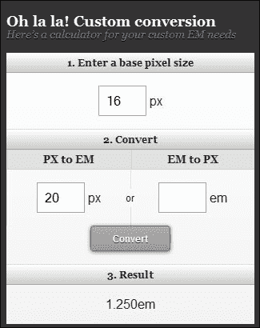
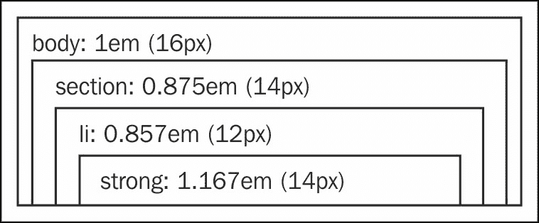
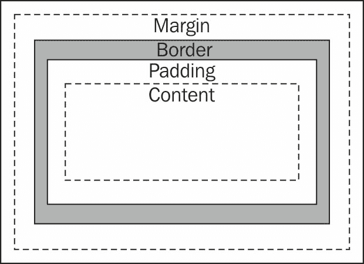
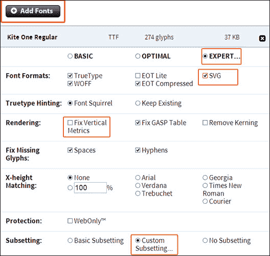
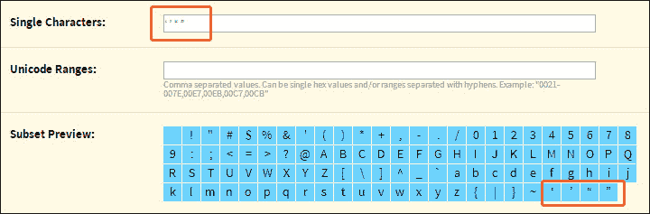
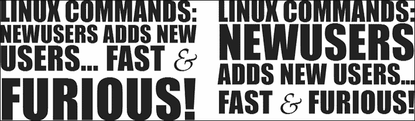
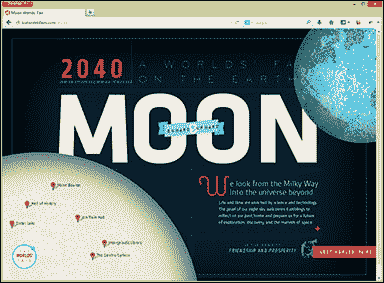
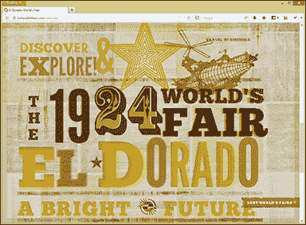
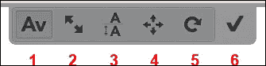

# 四、设计响应性文本

当谈论响应性标题时，我们谈论的是灵活性。因此，在字体大小中使用固定的度量也应该是动态的。过去几年和现在的实现方式不同之处在于，早些时候我们只想到了两种方式来显示我们的内容：打印和屏幕。尽管时代在变，但对文本改编的担忧依然存在。

我们认为排版是我们设计的基础和 CSS 的支柱，因为我们网站的主要目标是通过回答用户的问题来通知用户。避免创建十种不同的字幕样式是一种很好的做法，为了做到这一点，我们必须根据我们的网站主题规划几个不同的标题。

在本章中，我们将学习：

*   理解并将文本转换为相对单位
*   框大小和段落间距
*   自定义字体系列以获得漂亮的响应性标题
*   自动管理字体大小

# 理解并将文本转换为相关单位

使用相对单位的主要优点之一是，当用户修改基本元素（从浏览器）的字体大小时，会产生级联效应，并且所有字体大小都会按比例增加/减少。

现在，几乎每个浏览器都有这个基本元素`<html>`的默认设置，16 像素。但是，如果用户希望增加浏览器字体大小以便于阅读，则可以在用户端修改此值。

在谈到最常用的测量单位之前，我们要强调两个单位，因为它们的受欢迎程度已经显著提高，它们是：**vw**（**视区宽度**）和**vh**（**视区高度**）。

这些视口单元对于大多数使用的浏览器来说仍然没有太多的接受度，但我建议您检查[中的任何一个 http://www.w3.org/TR/css3-values/](http://www.w3.org/TR/css3-values/) 或[http://caniuse.com/viewport-units](http://caniuse.com/viewport-units) 继续关注因为这些单位使字体大小的比例更容易，这取决于浏览器的大小。

因此，最近使用最多的相对单位在下一节中给出。

## 相对单位-百分比

百分比是相对于容器元素的，它更多地用于创建结构，正如我们在[第 2 章](02.html "Chapter 2. Designing Responsive Layouts/Grids")、*设计响应性布局/网格*中所了解的那样。但是，使用它设置字体大小没有问题。示例代码如下所示：

```js
body {
  font-size: 100%;  /* base 16px /*
}
p {
  font-size: 87.5%; /* 14px ÷ 16 */
}
```

一些开发人员更喜欢将正文的字体大小固定为 62.5%（10 像素），以便于计算。在这种情况下，我们可以将子元素定义为 150%表示 15px，190%表示 19px，依此类推。尽管此方法使相应值的识别更容易，但它可能仅在字体大小调整的第一级级联中有所帮助。

## 相对单位–em

em 单位相对于其父级的计算字体大小。在下面的示例中，我们希望将子元素的字体大小转换为`20px`：

```js
body {
  font-size: 1em; /* base 16px /*
}
p {
  font-size: 1.25em; /* 20px ÷ 16 */
}
```

有一个非常好的网站帮助我们进行计算，[http://pxtoem.com](http://pxtoem.com) 。让我们在下面的屏幕截图中了解如何在组件上使用此工具；在左列中，我们定义了基本字体，结果显示在中间的列中。此外，对于从 6 px 到 24 px 的不同大小，我们可以使用右列对其进行转换。



因此，请记住，始终在最终值之前包含 px 值（当我们转换时）（正如我们在[第 2 章](02.html "Chapter 2. Designing Responsive Layouts/Grids")、*设计响应性布局/网格*中建议的那样）。我们之所以强调这一技巧，是因为在处理字体大小时，有很多级联样式。例如，考虑下图：



## 相对单位——雷姆

**rem**来自，CSS3 代表**根 em**，与根（或 HTML）元素相关。换句话说，在`<html>`元素和所有 rem 单元上重新定义字体大小可能会缩放此基本元素的一部分，而不是其父元素。这是与 em 相比的唯一区别。

让我们看看如何将上图中的这些尺寸转换为 rem：

```js
body {
  font-size: 1em; /* base 16px /*
}
section,
section li strong {
  font-size: 14px; /*  fallback for IE8 or earlier  */
  font-size: 0.875rem; /* 14px ÷ 16 */
}
section li {
  font-size: 12px; /* fallback for IE8 or earlier  */
  font-size: 0.750rem; /* 12px ÷ 16 */
}
```

以下做法可能会节省大量时间，并有助于分析页面是否需要更多的空白，具体取决于内容的密度。

尝试在所有主要结构开发完成之前，通过对文本排版进行编码来开始项目。我们通过生成一个模板文档来实现这一点，该文档包含所有主要的 HTML 元素，并且具有基于网站设计的正确样式表。

# 使用“框大小”属性改进元素尺寸标注

被称为**盒子模型**的模型，如下图所示，需要计算出元素的总宽度，包括边框和填充，已经过时：



以下示例显示了长方体模型的概念，该模型将有用区域划分为两个 div，这些容器每侧的填充为 5%，边界为 2 px，这将使宽度计算更加困难：

```js
div.splitted {
  padding: 0 5%;
  border: 2px solid black;
  float: left;
  width: ?; /* real value= 50% - 10% - 4px */
}
```

对于 CSS3，我们有接收值`border-box`的`box-sizing`属性，这意味着这个宽度值已经考虑了填充和边框尺寸。尽管它在 8 版和更高版本的 Internet Explorer 浏览器中运行良好，但该属性并不完全适用于 IE6 和 IE7。如果您需要为这些浏览器提供支持，可以在[找到一个 polyfill 来完成这项补充任务 https://github.com/Schepp/box-sizing-polyfill](https://github.com/Schepp/box-sizing-polyfill) 。

让我们看看它如何帮助整个计算在这个示例上进行：

```js
div.splitted {
  padding: 0 5%;
  width: 50%;
  border: 2px solid black;
  float: left;
}
```

我们可以在下面的代码中看到，在执行计算和分析屏幕上的空白或空白时，我们可能没有那么困难。此外，许多人将`padding`间距与基于 em 的字体大小联系起来，因为在某些情况下，它可能避免计算比例。

```js
div.splitted {
  padding: 0 0.5em;
  width: 50%;
  border: 2px solid black;
  float: left;
  -webkit-box-sizing: border-box;
  -moz-box-sizing: border-box;
  box-sizing: border-box;
}
```

目前，一些浏览器需要上面的前缀，但通过这种方式使用它们，我们将覆盖它们。此外，对于垂直间距也可以进行相同的填充；例如，考虑下面的代码：

```js
div.splitted {
  padding-top: 1em;
}
```

# 定制字体系列，打造漂亮的响应性标题

字体允许你为你的用户创建一个更吸引人的网站，并持续保持主题风格，而不必产生大量标题图像，每个标题一个。

### 提示

仔细选择字体很重要，因为它可能会影响用户对内容的吸收，也可能不会有助于显示超过一两页的作品。

`@font-face`是一项 CSS 规则，允许设计师使用用户机器上未安装的非标准 web 字体，并有助于更快地更改所有标题。`@font-face`方法的最大好处在于，它不会用图像取代常规字体，同时也为响应性网页设计提供了所需的灵活性。

### 提示

`@font-face`如果我们使用 EOT 字体，则仅支持 IE8 或更早版本。此外，SafariiOS4.1 及更低版本仅支持 SVG 字体。我们将在下一个主题中了解如何轻松提供此支持。

我们真的推荐这个网站[http://www.google.com/fonts](http://www.google.com/fonts) 检查各种字体，尤其是字体的作者。使用前请阅读每种字体上的许可证，以确保其可用于商业用途。

属性`@font-face`的基本用法是定义这个规则样式，`font-family`是以后用来调用字体的标签，`src`是可以找到字体的地方，`font-weight`（普通字体不需要，其他字体都需要，比如粗体和细体）。例如，考虑下面的代码：

```js
@font-face {
  font-family: "Kite One";
  src: url(/fonts/KiteOne-Regular.ttf);
}
```

然后将其用作任何其他样式规则中的任何其他字体：

```js
p {
  font-family: "Kite One", Helvetica, Arial, sans-serif;
}
```

然而，还有其他更好的方法。我们将清楚地了解如何使用字体 Squirrel、Fit Text、Slabtext、字母和响应度量。

## 使用字体松鼠工具生成

FontSquirrel 有一个很棒的工具，它允许我们获取桌面字体文件并生成它的 web 副本。此外，为特定字体生成正确代码和文件的服务是 100%免费的*。

*只有服务是免费的。请记住，每个字体系列都有自己的许可证。强烈建议用户在使用字体许可证之前阅读字体许可证。

在网站[上 http://www.fontsquirrel.com/tools/webfont-generator](http://www.fontsquirrel.com/tools/webfont-generator) ，我们可以进一步了解其主要特征的信息，包括：

*   字体松鼠不需要很多 CSS 技能
*   它提供了一个额外的区域来提高加载性能（**专家**模式）
*   生成的代码/文件支持使用旧浏览器的用户
*   资源包是绝对免费的

### 怎么做

首先访问字体松鼠网站，点击**添加字体**选择您的个人字体或您已经拥有正确许可证的字体。然后，选择**基本**选项（目前）并下载您的工具包。

解压缩下载的文件后，我们应该在 CSS 文件的开头添加以下代码。以下代码将允许 CSS 文件访问字体文件，并根据情况提供正确的字体文件：

```js
@font-face{
  font-family: 'kite_oneregular';
  src: url('kiteone-regular-webfont.eot');
  src: url('kiteone-regular-webfont.eot?#iefix') format('embedded-opentype'),
  url('kiteone-regular-webfont.woff') format('woff'),
  url('kiteone-regular-webfont.ttf') format('truetype'),
  url('kiteone-regular-webfont.svg#kite_oneregular) format('svg');
  font-weight: normal;
  font-style: normal;
}
```

当我们想要使用新的字体时，我们只需要像调用`@font-face`规则一样调用它，如下代码所示：

```js
p {
  font-family: 'kite_oneregular', Helvetica, Arial, sans-serif;
}
```

如果我们回到下载页面，Font Squirrel 还将允许您获取字体的子集，通过选择**最佳**和**导出**模式，显著减小文件大小。为了显示它的重要性，我们添加了相同的字体，并尝试了所有三种设置。总结结果，字节大小与字体文件中的字形（字符）散列以及要追加的资源数量直接相关。

**基本**设置使字符保持不变。**最佳**设置将字符数减少到 256 个左右。在 Kite One 字体的字符数少于此数字的特定情况下，不会进行优化。

我们可以通过选择**专家**模式，只包括**基本拉丁语**设置，然后手动添加我们需要的字符，看到最大的节省。

我们试着按照**专家**字体松鼠设置的步骤一起做：

1.  单击**添加字体**并选择要使用的字体文件。
2.  在**呈现**下，取消选中**固定垂直度量**。
3.  Under **Font Formats**, check **SVG** as shown in the following screenshot:

    

4.  在**子集**下，勾选**自定义子集。。。**。
5.  Under **Unicode Tables**, check only **Basic Latin**.

    ### 提示

    这假设字体将只使用英文字符；对于其他语言，只添加所需的字符。

    在一些站点中，诸如**、**、**、**等符号也很重要，因此将它们复制并粘贴到**单个字符**字段中，如下图所示：********

    ********

*****   验证**子集预览**生成的图像，并根据需要进行调整。*   在您确认您正在上传合法的网页嵌入字体后，只需点击**下载您的工具包**。****

 ****## FitText 插件

FitText 是一个 jQuery 插件，它使字体大小变得灵活，并且它是一个越来越流行的实用程序，使灵活的显示类型更容易访问。它通过缩放标题文本来填充父元素的宽度。如果你想看到这个插件的一个快速演示来分析它的灵活性是多么令人印象深刻，你可以在插件的网站[上看到它正在使用 http://fittextjs.com/](http://fittextjs.com/) 。

### 怎么做

在插件的 Github 网站[上下载此解决方案的文件后 https://github.com/davatron5000/FitText.js](https://github.com/davatron5000/FitText.js) ，让我们在 HTML 中插入以下代码：

```js
<h1 id="responsive_headline">My title using FitText</h1>
```

在 HTML 的底部（在`</body>`结束标记之前），我们需要添加 jQuery 和 Fittext 库。然后，您必须执行插件，将其应用于您的标题：

```js
<script src="http://code.jquery.com/jquery-1.9.1.min.js"></script>
<script src="jquery.fittext.js"></script>
<script>
  $("#responsive_headline").fitText();
</script>
```

默认情况下，插件会将字体大小设置为元素宽度的 1/10。有两种方法可以修改此标准字体大小控件：配置压缩器，以及定义最小和最大大小。

通过使用压缩器，您需要指定压缩值，例如，`1.2`逐渐调整文本的大小，或者`0.8`逐渐调整其大小，如下代码所示：

```js
<script>
$("#responsive_headline").fitText(1.2);
</script>
```

我们还可以通过定义最小和最大字体大小来修改此标准字体大小控件，以便对希望保留层次结构的情况提供更多控制，如以下代码所示：

```js
<script>
$("#responsive_headline").fitText(1,{ minFontSize: '20px', maxFontSize: '40px' });
</script>
```

## SlabText 插件

SlabText 是一个插件，它可以让你构建大的、漂亮的、完全响应的标题，让任何人都更容易制作大的、粗体的、响应性强的标题。脚本将标题拆分为行，然后调整每行的大小以填充可用的水平空间。通过将可用宽度除以像素字体大小，自动计算每行上要设置的理想字符数。

其特点如下：

*   SlabText 插件是完全响应的，专为具有完全响应特性的手机而构建
*   **颜色控制**选择节的背景色、文本和文本阴影颜色
*   **额外选项**设置一些填充，并确定文本阴影的长度，**图像覆盖**上传图像，并使用 CSS3 背景剪辑将其叠加到文本上
*   **字体控制**选择您自己的字体，并对字体进行最终控制
*   **可克隆**根据需要多次克隆节，并创建一系列克隆
*   SlabText 插件允许您手动断线
*   它的缩小版仅重 4KB
*   它有大量水平空间的标题，以便更好地跨浏览器填充显示
*   确保在下载完所有`@font-face`字体后调用脚本

那么，让我们从[下载这个插件 https://github.com/freqDec/slabText/](https://github.com/freqDec/slabText/) 和实验。

### 怎么做

首先，我们需要在 JavaScript 中选择的`header`标记中添加一个 ID，然后在 HTML 代码中的结束`</body>`标记之前插入`<script>`标记。考虑下面的例子：

```js
<header>
  <h1 class="page-title">Linux commands: New users adds new users... fast & furious!</h1>
</header>
```

以下是提出解决方案的脚本：

```js
<script>
$(".page-title").slabText();
</script>
```

然而，与其让它自动运行，不如让我们将线路分成不同的部分，修改用户感知和我们网站之间的沟通：

```js
<header>
  <h1 id="specific-title"></h1>
</header>
```

脚本如下：

```js
<script src="http://code.jquery.com/jquery-1.9.1.min.js"></script>
<script src="js/jquery.slabtext.min.js"></script>
<script>
var stS = "<span class='slabtext'>",
    stE = "</span>",
    txt = [
      "Linux commands:",
      "Newusers",
      "adds new users...",
      "fast & furious!"];
$("#specific-title").html(stS + txt.join(stE + stS) + stE).slabText();
</script>
```

下面的屏幕截图显示了两种状态，在运行强制手动线断开的代码之前（左侧）和之后（右侧）：



更多选项请查看[的创建者页面 http://freqdec.github.io/slabText/](http://freqdec.github.io/slabText/) 。

## 刻字

Lettering 通过包装每个字符、单词或行，并添加一个类（创建一个可管理的代码）以快速访问 CSS 文件中的字符，提供了一个完整的字母控件。它是一个基于 jQuery 的插件，可以更轻松地调整字符之间的间距，创建编辑设计，等等。

有两个相当令人印象深刻的网站，通过使用定制的信件展示了良好的设计和大量的创造力。请看以下示例，由[提供 http://lostworldsfairs.com/moon/](http://lostworldsfairs.com/moon/) 和[http://lostworldsfairs.com/eldorado/](http://lostworldsfairs.com/eldorado/) ：





### 怎么做

从[下载 zip 文件后 https://github.com/davatron5000/Lettering.js](https://github.com/davatron5000/Lettering.js) ，让我们通过在类中插入以下简单的 HTML 代码来练习这个用法，稍后将使用这些代码：

```js
<h1 class="fancy-title">Page Title</h1>
```

然后，记住在`<head>`标记中包含 jQuery 库，如下代码所示：

```js
<script src="http://code.jquery.com/jquery-1.9.1.min.js"></script>
<script src="js/jquery.lettering.js"></script>
```

在 HTML 的底部（在`</body>`结束标记之前），我们需要调用此脚本来指定此插件将影响的类：

```js
<script>
  $(document).ready(function() {
    $(".fancy-title").lettering();
  });
</script>
```

前面的代码将给出以下输出。查看跨距，想象一下您正在构建没有此插件的跨距：

```js
<h1 class="fancy-title">
  <span class="char1">P</span>
  <span class="char2">a</span>
  <span class="char3">g</span>
  <span class="char4">e</span>
  <span class="char5"></span>
  <span class="char6">T</span>
  <span class="char7">i</span>
  <span class="char8">t</span>
  <span class="char9">l</span>
  <span class="char10">e</span>
</h1>
```

现在，结构已准备好接收如下样式：

```js
<style type="text/css">
  h1 { font-family: 'Impact'; font-size:50px;
    text-transform:uppercase; text-shadow: 1px 1px 2px #666; }
  .char1, .word1, .line1 { color: purple; }
  .char2, .word2, .line2 { color: orange; }
  .char3, .word3, .line3 { color: yellow; }
  .char4, .line4 { color: blue; }
  .char5 { color: green; }
  .char6 { color: indigo; }
  .char7 { color: violet; }
  .char8 { color: gold; }
  .char9 { color: cyan; }
  .char10 { color: lime; }
</style>
```

此外，如果标题对每个单词（而不是字符）都有不同的样式，则此插件可以通过定义参数`"words"`来处理它，如下代码所示：

```js
<script>
  $(document).ready(function() {
    $(".fancy-title").lettering("words");
  });
</script>
```

考虑不同的样式的情况，每一行使用 HORE T0TE 被分割如下：

```js
<h1 class="fancy-title">Page Title <br /> with long text</h1>
```

对于前面的场景，脚本中唯一的区别是参数`"lines"`：

```js
<script>
  $(document).ready(function() {
    $(".fancy-title").lettering("lines");
  });
</script>
```

因此，现在我们认为您想知道创建样式、测量距离以及知道为每个元素增加字体所需的工作量。我们强烈建议使用在线工具 Kern.js。

### Kern.js 工具

Kern.js 是一个在线工具，与 letting.js 完美匹配，因为在点击和拖动、调整字母紧排、行高和字母位置之间提供了一个很好的界面。完成此任务后，只需复制生成的 CSS 并在样式表中使用它。

### 如何使用

进入工具网站后，[http://www.kernjs.com/](http://www.kernjs.com/) ，页面底部有一个链接：**拖动到书签栏安装**。将其拖动到书签将使我们网站上的 Kern.js 工具更容易激活。

其使用要求包括特定 1.7.2 版本中的 jQuery 和我们网站`<head>`标签中的 Kern.js 库。Kern.js 脚本可在[中找到 https://github.com/bstro/kern.js](https://github.com/bstro/kern.js) 下载。

```js
<script src="http://code.jquery.com/jquery-1.7.2.min.js"></script>
<script src="js/kern.min.js"></script>
```

点击书签栏上的**Kernjs.com**链接打开网站时，页面顶部可能会显示五个选项：

*   调整字距（水平间距）
*   字体大小的增加或减少
*   调整线高度（垂直间距）
*   全字母位置调整
*   旋转角度的调整

以下屏幕截图显示了这些选项：



完成调整后，只需单击“检查”按钮即可将此视觉更改转换为代码，以便在站点上复制和执行。

当有多个自定义元素时要小心，因为此代码可能会覆盖上一个。但是，有一种简单的方法可以避免进一步的问题：为元素规范定义一个类。下面的代码就是一个例子：

```js
<h1 class="fancy-title">Page Title</h1>
```

## 响应措施

响应度量是一个简单的脚本，允许您传入一个选择器（理想情况下是您的主要内容所在的容器），该选择器生成为您的文本生成理想度量所需的理想字体大小。听起来像魔术吗？我们将在下一节中了解如何自定义此解决方案及其用法。

### 怎么做

从[下载此解决方案的文件后 https://github.com/jbrewer/Responsive-Measure](https://github.com/jbrewer/Responsive-Measure) ，我们在 DOM 开头的`<head>`标记中插入以下代码：

```js
<script src="http://code.jquery.com/jquery-1.9.1.min.js"></script>
<script src="js/jquery.rm.js"></script>
```

在 HTML 的底部（在`</body>`结束标记之前），我们需要调用响应度量脚本来执行操作。但是，在执行脚本之前，我们将阐明以下两种控制文本大小的方法：

*   **idealLineLength**: Its default value is `66`, but we may define our specific value to represent how many characters and spaces will fit in the line. Also, the minimum font size was set to `16px` and the maximum set to `300px`. The parameter `sampleText` may help calculate the number of characters that have average character width.

    ### 提示

    请记住，每行 45-75 个字符的范围通常被认为是安全的，便于阅读。

    下面是前面提到的代码：

    ```js
    <script>
    $('section').responsiveMeasure({
      idealLineLength: 45,
      minimumFontSize: 16,
      maximumFontSize: 300,
      sampleText: "n"
    });
    </script>
    ```

*   **minimumFontSize and maximumFontSize**: This is where the handling of the font size is improved by defining 13 to minimum and 30 to maximum, for example. Also, the default value of `idealLineLength` may influence sometimes a little on the result. If it happens, define your own value and fix it, as we have just seen in the previous code.

    下面是代码：

    ```js
    <script>
    $('section').responsiveMeasure({
      minimumFontSize: 13,
      maximumFontSize: 30,
      sampleText: "n"
    });
    </script>
    ```

# 练习 4–自定义主页标题

让我们分三步做这个练习。第二步和第三步只是第一步的补充：

1.  使用字体松鼠生成器创建字体面工具包。然后，在站点的`<h1>`标签上实现它。如果您不知道使用哪种字体，我建议您从 Google 字体网站下载 Kite One 字体。
2.  使用文字插件可以更好地控制标题中的每个字母、单词或行。之后，增加第一个字母的颜色，从 CSS 文件中更改`.char1`类的`color`属性。
3.  通过单击书签栏中的链接来使用 Kern.js 工具。之后，单击工具栏上的第二个按钮，选择第一个字母以增大其字体大小。然后，单击最后一个按钮生成代码并将其包含在 CSS 文件中

# 总结

在本章中，我们看到了文本的响应字体大小。此外，我们还学习了使用诸如字体松鼠、FitText、SlabText、字母和响应度量等解决方案定制字体系列的不同方法。这些解决方案创建了对图像的支持和独立性，这在构建我们的响应式网站时是必需的。

在下一章中，我们将讨论图像和视频，并学习如何将它们转换为适用于不同设备的响应和自适应媒体。此外，我们还将了解如何在考虑不同播放器技术和设备的情况下很好地处理视频。****