# 五、准备图像和视频

用于响应站点的图像准备是最近讨论最多的问题之一，因为目前还没有 W3C 批准的技术。与此同时，社区创造了一些技术，每种技术都有其优势，试图解决这个问题。

我们将从基本的图像大小调整开始本章。这项技术可以毫不费力地融入到代码中，但移动用户正在等待更好的体验。

但是，对于智能手机和平板电脑等较小的设备，仅调整图像大小并不是那么有效，因为在这些设备中加载高质量的图像可能需要很长时间。稍后，我们将看到映像断点的重要性及其好处。

此外，我们将把注意力集中在视频上，因为它们在 HTML5 之前就已经插入到我们的代码中，避免了从固定到响应的站点转换问题。

此外，我们将讨论一些可用的 jQuery 插件，以及如何通过节省开发时间和改进接口来使用它们。

在本章中，我们将学习：

*   仅使用 CSS 调整基本图像大小
*   为什么要使用图像断点
*   图片标签的工作原理
*   控制图像艺术方向
*   在 jQuery 插件中使用图像断点
*   使用 jQuery 插件创建响应性后台
*   处理高密度显示器
*   使视频元素具有响应性

# 仅使用 CSS 调整基本图像大小

以下代码可用于在调整其父容器的大小时赋予图像缩放自由。最大宽度设置为原始尺寸的 100，其高度可自动遵循相同的图像比例：

```js
img {
  max-width: 100%;
  height: auto;
}
```

尽管如此，为了有效地使用它，图像必须足够大，以便在尽可能大的显示器上放大到我们合理期望的任何大小。然而，对于移动互联网速度而言，为桌面网站优化的图像仍然相当沉重。

### 提示

如果您正在使用`max-width`或`height`标记调整 DOM 中 JPG 图像的大小，您可能只会在浏览器 IE7 或更早版本上看到像素化图像。但是，有一个简单的代码可以解决此问题：

```js
img {
  -ms-interpolation-mode: bicubic;
}
```

这个特定的问题在 IE8 中得到了修复，在 IE9 中变得过时。

# 使用图像断点

自适应图像不仅仅是缩放图像的问题。它涉及到处理其他问题，以及在提供最佳用户体验时要牢记的变量。变量如下：

*   屏幕分辨率
*   带宽
*   浏览器宽度窗口

试图确定要发送到浏览器的最佳图像的问题可能与每个变量无关。这就是问题所在。例如，只知道屏幕分辨率的值并不意味着用户有足够的带宽来接收高清图片。

因此，基于这些事实，我们将如何在 web 应用程序中制作一幅需要在大量设备上以高质量显示的图片，而不会造成带宽的巨大浪费？

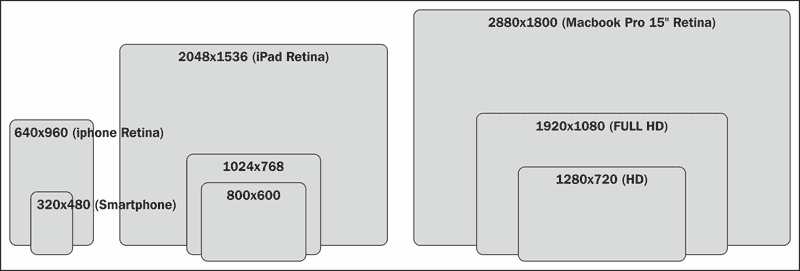

当我们处理位图图像（非矢量化图像，如 SVG）时，理想的解决方案似乎很简单：为每组分辨率提供不同大小的图像，其中每个图像都适用于特定类型的设备。

通常，我们考虑三种不同的屏幕尺寸来覆盖设备的多样性：

*   **480 px**：标准分辨率智能手机（手机优先）
*   **1024 像素**：iPhone 视网膜（图像密度高的智能手机）、平板电脑和分辨率正常的台式机
*   **1600 像素**：iPad 视网膜（高图像密度平板电脑）和高分辨率台式机

有许多技术已经在尝试解决这个问题，并提出解决方案，帮助我们为每个场合提供正确的形象。它们的工作方式都略有不同，根据您的需求，您将做出最符合项目需求的选择。我们很快就会看到其中一些。

# 图片标签的工作原理

W3C，面对向用户提供正确图像的需求，正在努力完成对它们的研究。该倡议有一个非官方草案，其中包括`<picture>`标签和其中的不同来源，在其标准中，以使图像的改编更容易。

### 注

如果没有这个标准，浏览器开发人员就无法准备好浏览器来很好地呈现它。今天，前端社区正在使用 CSS 和 JavaScript 尝试完成同样的任务。

这是 W3C 对`<picture>`标记的定义：

> 此规范为开发人员提供了一种为一个图像声明多个源的方法，并通过 CSS 媒体查询，使开发人员能够控制这些图像何时呈现给用户

他们还想到了较旧的浏览器，它将显示一个简单的图像作为备用内容。以下是如何使用标记的示例：

```js
<picture width="500" height="500">
  <source media="(min-width:45em)" srcset="large1.jpg 1x, large2.jpg 2x">
  <source media="(min-width:18em)" srcset="medium1.jpg 1x, medium2.jpg 2x">
  <source srcset="small1.jpg 1x, small2.jpg 2x">
  
  <p>Accessible text for all image versions</p>
</picture>
```

我建议您在[查看有关本规范的更新信息 http://picture.responsiveimages.org/](http://picture.responsiveimages.org/) 。

# 响应图像的艺术方向控制

这个话题最近讨论得很多。作者应该为不同大小的图像提供不同的来源，并根据他们的视觉判断，将图像的主要元素聚焦于特定的断点。这是艺术指导。

让我通过在这里展示这个案例来澄清这一点。当图像以较大的尺寸显示时，在背景中显示船上的情侣和河流是有意义的。背景有助于解释他们在哪里，但一般来说，它没有提供相关信息。现在，看看当我们缩小图像以适应更小的屏幕时会发生什么。这不是艺术指导。

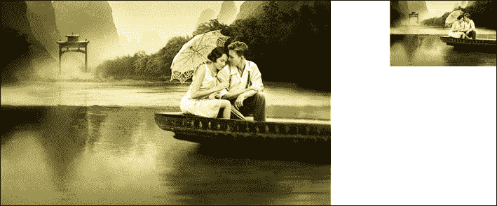

缩小到那个尺寸，你几乎认不出这对夫妇。与其简单地调整图像的大小，不如裁剪图像以去除一些背景并聚焦于它。最终的结果是图像在更小的尺寸下效果更好。让我们比较一下左边的图片（艺术方向）和右边的图片，如下所示：


## 焦点 CSS 框架

在缩小图像之前，焦点可以提高图像最重要部分的焦点。通过这种方式，用户可以在智能手机上以更大的尺寸看到图像的主要部分。所有这些都不需要使用 JavaScript 或 jQuery。

使用焦点，您可以定义一个区域，该区域表示由于分辨率较小而不希望遗漏的部分。焦点覆盖的零件保持可见，无论您将其缩放多远。

下面的类名允许您裁剪图像的常规区域并调整其大小。请注意，类名中的 X 表示一到六之间的数字：

*   **左-X**/**右-X**：这些定义图像水平聚焦的单位数
*   **up-X**/**down-X**：这些定义了图像垂直聚焦的单位数
*   **纵向**：默认设置为横向。但是如果图像的高度大于宽度，也可以添加类肖像

### 怎么做

从[下载 CSS 文件后 https://github.com/adamdbradley/focal-point](https://github.com/adamdbradley/focal-point) ，让我们在 DOM 的`<head>`标记中插入此代码：

```js
<link rel="stylesheet" href="/css/focal-point.min.css">
```

稍后，我们可以在如下所示的行动中看到这一点：

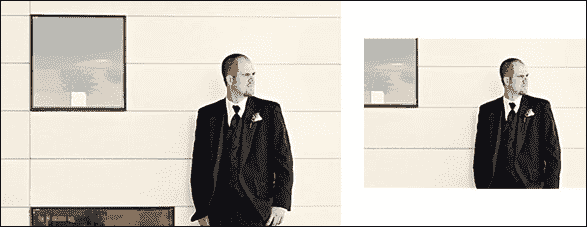

焦点的原理很简单：想象在图片上放置一个 12 x 12 单位的网格：

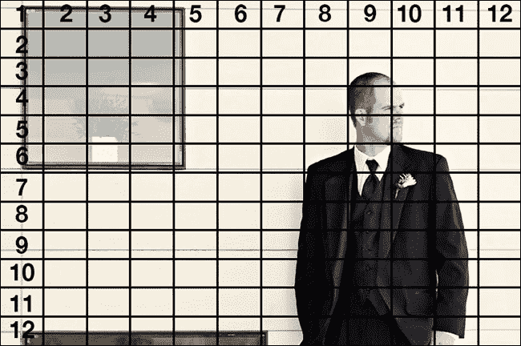

现在，我们假设这个人的头部是图片中最重要的部分，我们需要将其定义为焦点。即使这个人的脸在图片的右侧，当缩小到更小的分辨率时，它仍会保持在焦点上。

为了从技术上定义焦点，我们只需要设置两类图像。这些类可以在栅格内水平和垂直定位焦点。它将从网格的中心开始，如下图所示：

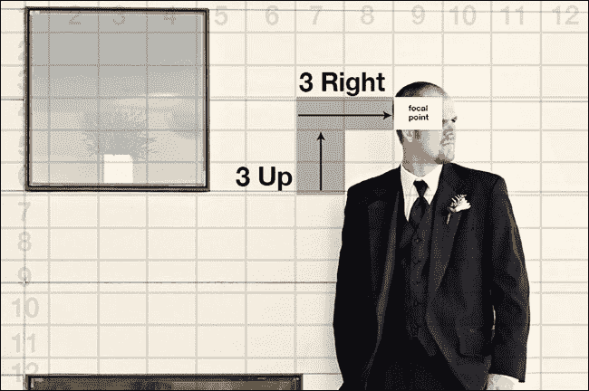

以下是关注此人面部的代码：

```js
<div class="focal-point right-3 up-3">
  <div></div>
</div>
```

在本例中，焦点定义为从中心向左聚焦三个网格单元，然后再向上聚焦两个网格单元。`focal-point`类与图像周围的 div 一样是必需的。

# 针对<图片>标签的替代方案

我们刚刚看到，W3C 正在努力制定一个标准，以便尽快为图片添加标签，这将使您能够提供更适合您用来查看我们网站的设备的视觉内容。

由于这一功能的巨大必要性，社区创建了两个 JavaScript 插件，从而获得了大多数浏览器都能接受的预期结果。他们很有远见，很有远见。

## 预见–根据屏幕大小选择要显示的正确图像

Foresight 为网页提供了在服务器请求图像之前通知用户设备是否能够查看高分辨率图像（如视网膜显示设备）的能力。

此外，Foresight 判断用户设备当前是否具有足够快的网络连接，以获得高分辨率图像。根据设备显示和网络连接，foresight.js 将为网页请求适当的图像。

通过自定义`img source`属性，使用 URI 模板等方法，或在 URI 中查找和替换值，可以形成请求，这些请求是为图像的分辨率变体构建的，具体使用新 CSS`image-set()`函数的混合实现。

基本格式是，`image-set ()`函数可能有一个或多个图像集变量，每个变量用逗号分隔。每个图像集变量最多可以有三个参数：

*   **URL**：与`background-image:url()`类似。
*   **比例因子**：比例因子参数用作图像尺寸的乘数，用于识别图像密度。一些移动设备的像素比为 1.5 或 2。
*   **带宽**：可定义为低带宽或高带宽。

Foresight 还执行快速网络速度测试，以确保用户设备能够处理高分辨率图像，而不会让连接速度慢的用户等待很长时间下载图像。

### 怎么做

让我们访问网站[https://github.com/adamdbradley/foresight.js](https://github.com/adamdbradley/foresight.js) 下载文件。然后，我们将在 DOM 的`<head>`标记中插入以下代码：

```js
<script src="js/foresight.js "></script>
```

让我们看看下面代码的一个真实示例，其中我们使用了移动优先的概念：

```js
.fs-img {
  width:100%;
  font-family: 'image-set( url(-small|-small-2x) 2x high-bandwidth )';
  display:none;
}
```

然后，对于窗口，宽度至少为 600 像素和 800 像素：

```js
@media (min-width:600px) {
  .fs-img {
    font-family: 'image-set( url(-small|-medium), url(-small|-medium-2x) 2x high-bandwidth )';
  }
}
@media (min-width:800px) {
  .fs-img {
    font-family: 'image-set( url(-small|-large), url(-small|-large-2x) 2x high-bandwidth )';
    max-width:100%;
  }
}
```

因此，我们强调了一些词语，以更好地解释其工作原理。代码将在``标记的源代码中找到一个名称片段，并将其替换为另一个。之后，网站将在其文件中搜索更改的名称，验证是否存在所需的代码：

```js

```

### 提示

该引擎用于更改文件名的后缀，使其具有良好的可伸缩性，它非常好，因为它避免了在创建新的响应图像时对代码的大量干预。

如果我们比较本例中的图像以 KB 为单位的差异，我们将得到 44 KB 的大图像、20 KB 的中图像和 12 KB 的小图像。对于一张图片来说，这并不是一个很大的区别。但是，通过将其应用于整个站点，可以大大减少不必要图像的加载。

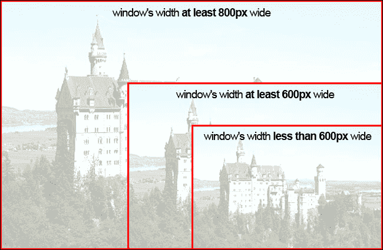

## Picturefill–与图片标签最为相似的解决方案

Picturefill 是一个用于响应图像的 JavaScript 插件，类似于现在准备使用的未来`picture`元素。为了自身的安全，这个非常轻量级的解决方案使用了`span`标签，而不是`picture`或`image`。

Picturefill 本机支持高清（视网膜）图像替换。Picturefill 还具有性能好的优点，可以根据屏幕大小选择正确的图像，而无需下载其他图像。

有关此插件的更多信息，您可以访问[https://github.com/scottjehl/picturefill](https://github.com/scottjehl/picturefill) 。

### 怎么做

在下载此解决方案的文件后，让我们在您的 DOM 的标记`<head>`中插入此代码：

```js
<script src="js/matchmedia.js"></script>
<script src="js/picturefill.js"></script>
```

这是要在 HTML 中使用的代码。请注意，它要求您指定每个图像的源及其变体。请参见以下示例：

```js
<span data-picture="" data-alt="Picture alternative text">
  <span data-src="imgs/small.jpg"></span>
  <span data-src="imgs/medium.jpg" data-media="(min-width: 400px)"></span>
  <span data-src="imgs/large.jpg" data-media="(min-width: 800px)"></span>
  <span data-src="imgs/extralarge.jpg" data-media="(min-width: 1000px)"></span>
  <!-- Fallback content for non-JS browsers -->
  <noscript>&lt;img src="imgs/small.jpg" alt="Picture alternative text"&gt;</noscript>
  
</span>
```

也许有些项目需要它作为一种解决方案（HTML 代码中的整个规范以及它们的图像变体），但是如果我们在站点上有很多图像以及站点维护问题，那么我们应该带来可伸缩性问题。

# 使用 jQuery 插件响应背景图像

定位背景图像对于响应站点来说并不总是一件容易的任务，因为其正确的可视化取决于其内容的行为。

为了澄清，让我向您展示这个问题的一个示例：

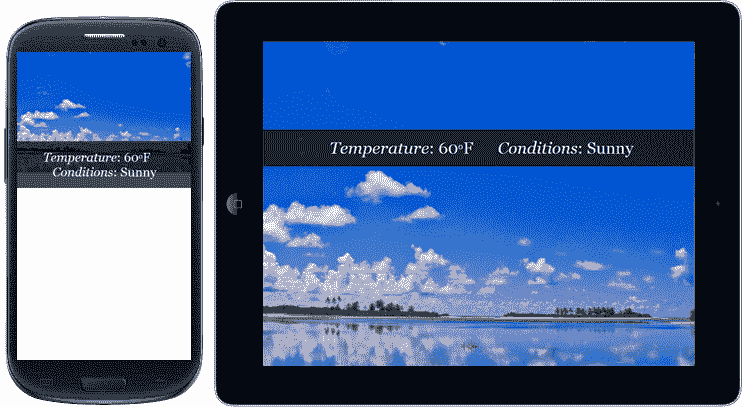

问题是，有时我们修改内容以保持背景正确，需要进行更改。有两个插件对定位这个背景非常有帮助：Anystretch 和 Backstretch。

## 任意拉伸–轻松拉伸背景

Anystretch 是一个 jQuery 插件，允许您向任何页面或块级元素添加动态调整大小的背景图像。最初，Anystretch 是从 Backstretch 分叉的。

图像将拉伸以适应页面/元素，并随着窗口大小的变化自动调整大小。有一些选项可以配置它，例如水平定位、垂直定位、速度、元素定位和数据名称。

这个插件的另一个优点是，如果我们想在加载任何拉伸后更改图像，我们只需要再次提出它，通知新路径。

### 提示

是的，我们可以将其与 Breakpoints.js 插件一起使用，正如我们在[第 2 章](02.html "Chapter 2. Designing Responsive Layouts/Grids")、*设计响应性布局/网格*中所看到的，这样就可以更改图像路径，并在必要时再次进行任何拉伸。

### 怎么做

从[下载文件后 https://github.com/danmillar/jquery-anystretch](https://github.com/danmillar/jquery-anystretch) 下面我们用下面的 HTML 代码来说明它是如何工作的：

```js
<div class="div-home stretchMe" data-stretch="img/bg-home.jpg">
  <p>main content</p>
</div>
<div class="div-footer stretchMe" data-stretch="img/bg-footer.jpg">
  <p>footer content</p>
</div>
```

对于此结构，有两个突出显示的单词：

*   `stretchMe`：用于标识插件将处理这些元素
*   `data-stretch`：这将告知插件什么图像可能成为背景

在 DOM 的底部（在`</body>`结束标记之前），我们需要包含 jQuery 代码和 Anystretch 脚本。然后，我们将为所有由类名`stretchMe`（只是一个建议的名称）设置的元素执行插件。

```js
<script src="http://code.jquery.com/jquery-1.9.1.min.js"></script>
<script src="js/jquery.anystretch.min.js"></script>
<script>
$(".stretchMe").anystretch();
</script>
```

这是应用于 div 元素的插件的可视化结果：

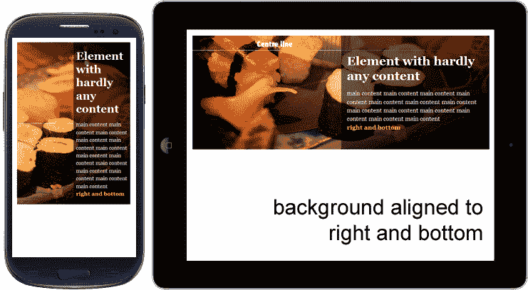

到目前为止还不错，但如果使用这种方法，将对所有响应背景应用相同的行为。换句话说，如果我们想要改变特性，我们需要单独调用函数。

### 提示

如果我们对同一个元素调用两次`anystretch`方法，它将替换现有图像并停止之前的处理。

如果我们看一下前面的 HTML 代码，就会发现有一个名为`div-home`的类，可以使用不同的选项执行，例如：

```js
<script>
$(".div-home").anystretch('',{speed:300, positionX:'right', positionY:'bottom'});
</script>
```

### 注

`speed`参数将配置下载后图像淡入淡出的时间。默认情况下，`positionX`和`positionY`在中间对齐，但插件允许我们更改它。

## 后退-创建响应性背景幻灯片

Backstretch 是一个 jQuery 插件，允许用户向任何页面或元素添加动态调整大小的背景图像，它是 Anystretch 插件的基础。

然而，Backstretch 发展了，现在还提供动态调整幻灯片元素背景图像的大小。所有这些背景图像都将拉伸以适应页面/元素，并将随着窗口/元素大小的更改而自动调整大小。

另一个很好的改进是在页面加载后获取将要使用的图像，这样用户就不必等待太长时间来完成图像下载。

您可以在[找到要下载的文件 https://github.com/srobbin/jquery-backstretch](https://github.com/srobbin/jquery-backstretch) 。

### 怎么做

在 DOM 的底部（在`</body>`结束标记之前），我们将包括 jQuery 和 Backstretch 库。然后，我们将执行将 Backstrech 附加到元素背景的插件：

```js
<script src="http://code.jquery.com/jquery-1.9.1.min.js"></script>
<script src="js/jquery.backstretch.min.js"></script>
<script>
$.backstretch("path/bgimage.jpg");
</script>
```

以下是视觉效果：

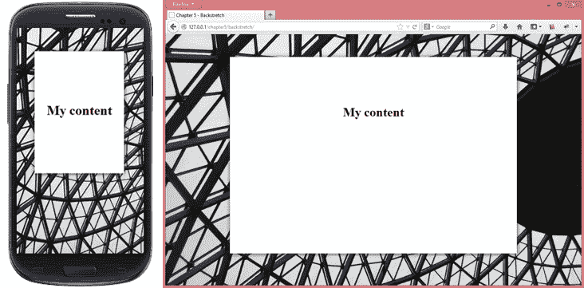

默认情况下，图像对齐（垂直和水平）设置为中心，因为这对于使用此解决方案的人来说更为常见，但如果需要，我们可以将其关闭。包含的另一个选项是`fade`参数，用于配置图像中淡入淡出的时间。`parameter`持续时间用于幻灯片放映，它与切换幻灯片前显示的时间量（毫秒）有关。

我们也可以将反拉伸连接到任何块级元素。默认情况下，`<body>`标签将接收此响应背景。要做到这一点，更好的方法是使用以下代码（而不是前一个代码）定义一个类来接收此操作：

```js
<script>
$(".div-home").backstretch("path/bgimage.jpg");
</script>
```

或者，要开始幻灯片放映，只需通知一组图像和幻灯片之间的时间：

```js
<script>
  $(".div-home").backstretch([
    "path/bgimage1.jpg",
    "path/bgimage2.jpg",
    "path/bgimage3.jpg"    
  ], {duration: 5000});
</script>
```

这个插件有很好的文档记录，并提供了一个幻灯片 API 以更好地处理。可在[找到 https://github.com/srobbin/jquery-backstretch#slideshow-api](https://github.com/srobbin/jquery-backstretch#slideshow-api)。

# 处理高密度显示器

屏幕密度是指物理表面上的设备像素数。通常以每英寸的**像素（**PPI**为单位）。苹果为其双密度显示器创造了营销术语**视网膜**。根据苹果官方网站：**

> “视网膜显示器的像素密度太高，你的眼睛无法分辨单个像素。”

换句话说，视网膜显示器具有足够高的像素密度，以防止人眼注意到像素化。但是，由于这些显示器正在被广泛实现和使用，因此创建支持这些显示器的网站和应用程序比以往任何时候都更加重要。

在下面的图中，我们比较了视网膜和标准清晰度显示器之间的像素。在视网膜显示器中，在与传统显示器相同的空间中，像素数增加了一倍：

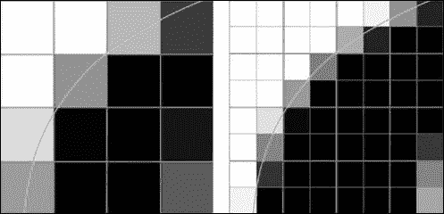

### 注

单词 double 并不是所有支持高密度图像的设备所使用的值。目前，市场上还有其他屏幕密度，其密度值分别为 1.5 和 2.25。

## 怎么做

视网膜图像的共同值是正常图像的两倍。因此，通过使用媒体查询，我们可以测试浏览器是否支持高密度图像。让我们在下面的示例中进行检查：

```js
/* normal sprite image has dimension of 100x100 pixels */
span.bigicon-success {
  background: url(sprite.png) no-repeat -50px 0;
}
@media only screen and (-webkit-min-device-pixel-ratio: 2), only screen and (min-device-pixel-ratio: 2) {
  span.bigicon-success {
    background-image: url(sprite@2x.png);
    /* retina sprite image has dimension of 200x200 pixels */
    background-size: 200px 200px;
  }
}
```

如果浏览器接受，我们会请求显示另一幅图像。但是，这种用法会产生两个图像请求：一个在检查之前，另一个在媒体查询内部。

现在，让我们看看如何使用预见性只提出一个请求。

## 如何用远见去做

此插件能够在向用户显示任何图像之前检测设备显示的屏幕密度。

让我们在下面的示例中看到它：

```js
.fs-img {
  font-family: 'image-set(url(-small | -small-2x) 2x high-bandwidth)';
}
```

在本例中，浏览器检查哪个图像元素具有`fs-img`类，在显示任何图像（默认的预见行为）之前，它检查是否支持视网膜图像；此外，它还可以检查用户是否处于高带宽。

请注意，例如，在请求`castle-small.jpg`文件之前，它会找到后缀`-small`并将其替换为`-small-2x`，然后请求文件`castle-small-2x.jpg`。

有一个在线工具可以帮助计算图像的大小，如果用视网膜观看的话。可在[获取 http://teehanlax.com.s3.amazonaws.com/files/teehanlax_density_converter.html](http://teehanlax.com.s3.amazonaws.com/files/teehanlax_density_converter.html) 。

# 制作响应性视频元素

在我们的网站开发中使用 HTML5 之前，视频的使用仅限于在设备上接受 Adobe Flash Player。然而，由于 HTML5 中`<video>`的开发付出了巨大的努力，并且苹果公司拒绝在其设备上安装 Adobe Flash Player 的定位，这一义务不再存在。

目前，该元素`<video>`在现有设备和现代浏览器（IE9 及更高版本）中得到了广泛接受，使得其处理，尤其是在响应性网站上的灵活性变得更加容易。为了澄清，`video`标记在 DOM 上的常见方式如下：

```js
<video id="highlight-video" poster="snapshot.jpg" controls>
  <source src="video.m4v" type="video/mp4" /> <!-- for Safari -->
  <source src="video.ogg" type="video/ogg" /> <!-- for Firefox -->
</video>
```

制作视频流的 CSS 代码非常简单：

```js
video, iframe {
   max-width: 100%;
   height: auto;
}
```

然而，新旧浏览器之间存在操作上的差异，以增加内容的可访问性。通常最好使用更安全的方法。这条路将继续使用嵌入式视频或`<iframe>`标签。我们将很快看到如何使这些视频更具响应性和灵活性。

现在，让我们关注当前的技术。好消息是，YouTube 或 Vimeo 等视频提供商已经支持`<video>`标记，但这仍然不是默认行为。根据设备的不同，这种不同使用的代码也可能成为一个问题，因为我们需要根据每种情况调整代码。

为了解决这个适应问题，他们创建了 FitVids 插件。

## FitVids–快速响应视频的双赢解决方案

FitVids 是一个轻量级 jQuery 插件，它通过在 iframe 周围创建一个包装器来保持比率，从而在我们的响应式 web 设计中自动化使视频宽度流畅的工作，否则 iframe 视频的比率将如下所示：


目前支持的播放器有 YouTube、Vimeo、Blip.tv、Viddler 和 Kickstarter。但是如果需要使用我们自己的播放器，可以选择指定这个自定义播放器。

### 怎么做

在 DOM 的底部（在`</body>`结束标记之前），我们需要包含 jQuery 代码和 FitVids 脚本。然后，我们只需要将其执行附加到元素的类或 ID 中，如下所示：

```js
<script src="http://code.jquery.com/jquery-1.9.1.min.js"></script>
<script src="jquery.fitvids.js"></script>
<script>
$(function () {
  $(".video-wrapper").fitVids();
});
</script>
```

之后，让我们将此 HTML 代码用作示例，以了解其工作原理：

```js
<div class="video-wrapper ">
  <iframe width="560" height="315" frameborder="0" allowfullscreen src="http://www.youtube.com/embed/UM0Cl3wWys0"></iframe>
</div>
```

以下屏幕截图显示了使用 FitVids 的 YouTube、Vimeo 和 Viddler 视频示例：

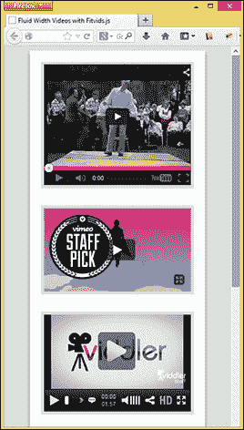

# 练习-为特色主页图像创建不同的图像版本

正如我们刚才看到的，为每个设备加载正确的图像对于我们的响应站点非常重要。因此，让我们在设计中实践这项技术，在以下断点中显示不同的图像：

*   最大宽度=480
*   最大宽度=1024
*   最小宽度=1025

下面的屏幕截图显示了该网站以及我所指的照片，正如我们在[第 2 章](02.html "Chapter 2. Designing Responsive Layouts/Grids")*设计响应性布局/网格*中看到的。对于本练习，我指的是框内高亮显示的图像：

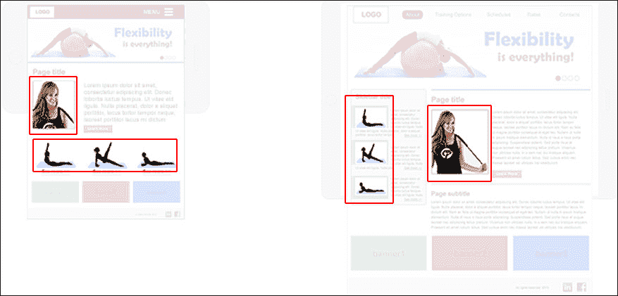

对于此活动，我建议使用 Foresight 插件，因为它可以更好地显示图像源和断点。

### 提示

不要忘记检查您使用的特定设备是否支持显示高密度图像。

# 总结

在本章中，我们学习了从固定图像到灵活图像的简单转换，只是理解这不足以使它们适应不同的设备。此外，我们还学习了使用 Foresight 和 Picturefill 插件为用户提供正确图像的其他方法。我们还控制了艺术方向，在使用焦点框架调整图像大小时，重点关注图片中的主要元素。此外，我们还学习了使用 FitVids 插件使视频尺寸流畅，无需任何压力。

在下一章中，我们将了解为响应站点准备的滑块插件，学习如何构建它们，更改一些选项和效果，并给用户留下良好印象。此外，我们将了解哪些手势在移动站点上常用和实现。