# 六、构建响应式图像滑块

图像滑块已被大量使用，并已成为非常流行的 web 元素。在一个网站上，通过漂亮的过渡和动画、标题和描述，以及自定义时间的使用，在线提供一个有吸引力的商业演示。此外，一个好的图像滑块可以显示产品展示，吸引用户的注意力，并提高其销售。

在本章中，我们将了解：

*   不同类型的响应图像滑块
*   在用户体验中引入触摸手势
*   使用 JavaScript 插件实现触摸事件

# 响应式图像滑块

现在，打开一个网站，在标题区域看到一个图像滑块是很常见的。图像滑块在有限的空间内显示突出显示的内容，这些内容非常有用。虽然通过移动设备查看站点时，可用空间会受到更多限制，但滑块元素仍然会吸引客户的注意力。

与桌面相比可以使用多少区域来显示突出显示的内容和可用于呈现内容的资源之间的差异确实很大，在桌面上，脚本性能通常没有问题，每个转换的交互都是通过使用箭头符号来切换图像来执行的。

当响应时代开始时，人们通常与图像滑块交互的方式被观察到，并根据渐进增强概念确定了变化，例如改变每张幻灯片的方式。解决方案是为移动设备的用户提供类似的体验：为接受它们的设备采用手势和触摸图像滑块元素，而不是显示回退。

随着浏览器和技术的不断发展，出现了许多具有响应特性的图像滑块插件。我个人最喜欢的插件是 Elastislide、FlexSlider2、ResponsiveSlides、Slicebox 和 Swiper。有很多可供选择的，要想找到一个你真正喜欢的，唯一的办法就是尝试一下！

让我们详细了解它们各自的工作原理。

## Elastislide 插件

Elastislide 是一个响应迅速的图像滑块，它可以调整其大小和行为，以便在基于 jQuery 的任何屏幕大小上工作。这个 jQuery 插件处理滑块的结构，包括内部基于百分比宽度的图像，以预定义的最小显示图像数水平或垂直显示。

Elastislide 根据麻省理工学院许可证获得许可，可从[下载 https://github.com/codrops/Elastislide](https://github.com/codrops/Elastislide) 。

当我们实现图像滑块时，简单地减小容器大小并显示水平滚动条并不能优雅地解决小型设备的问题。建议也调整内部项目的大小。Elastislide 很好地解决了这个调整大小的问题，并定义了我们想要显示的最小元素，而不是简单地使用 CSS 隐藏这些元素。

此外，Elastislide 还使用了一个名为 jQuery++的 jQuery 库的补充和定制版本。jQuery++是另一个非常有用的 JavaScript 库，用于处理 DOM 和特殊事件。在本例中，Elastislide 有一个自定义版本的 jQuery++，该版本允许插件在触摸设备上处理**刷卡事件**。

### 怎么做

由于我们将在同一转盘上看到该插件的四个不同应用程序，因此我们将使用相同的 HTML 转盘结构，并且在执行插件之前可能只修改 JavaScript，并指定参数：

```js
<ul id="carousel" class="elastislide-list">
  <li><a href="#"></a></li>
  <li><a href="#"></a></li>
  <li><a href="#"></a></li>
  <li><a href="#"></a></li>
  <li><a href="#"></a></li>
  <li><a href="#"></a></li>
  <li><a href="#"></a></li>
</ul>
```

在 DOM 的底部（在`</body>`结束标记之前），我们需要包括 jQuery 和 jQuery++库（此解决方案所需），然后是 ElastiSlide 脚本：

```js
<script src="http://code.jquery.com/jquery-1.9.1.min.js"></script>
<script src="js/jquerypp.custom.js"></script>
<script src="js/modernizr.custom.17475.js"></script>
<script src="js/jquery.elastislide.js"></script>
```

然后，在`<head>`标记中包含 CSS 样式表：

```js
<link rel="stylesheet" type="text/css" href="css/elastislide.css" />
```

好了，现在我们已经有了展示四个不同例子的基础。对于每个示例，在执行插件脚本时必须添加不同的参数，以便根据项目需要获得不同的渲染。

#### 示例 1–至少三个可见图像（默认）

在第一个示例中，我们将看到默认的视觉和行为，以及我们是否将在其后面放置以下代码，包括 ElastiSlide 插件：

```js
<script type="text/javascript">
$('#carousel').elastislide();
</script>
```

此解决方案附带的默认选项有：

*   至少显示三个项目
*   滚动效果的速度为 0.5 秒
*   水平定向
*   缓和效果定义为“缓进缓出”
*   转盘将开始显示列表上的第一个图像

下面的屏幕截图显示了此代码的实现。看看平板电脑和智能手机上显示的不同版本：

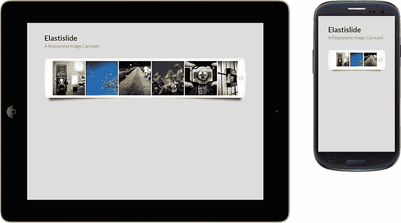

#### 示例 2–垂直，至少有三个可见图像

可以选择垂直渲染旋转木马，只需更改一个参数。此外，我们可能会加快滚动效果。请记住包括示例 1 中使用的相同文件，然后将以下代码插入 DOM：

```js
<script type="text/javascript">
$('#carousel').elastislide({
  orientation: 'vertical',
  speed: 250
});
</script>
```

默认情况下，至少显示三个图像。但这个最小值可以修改，我们将在下一个示例中看到：

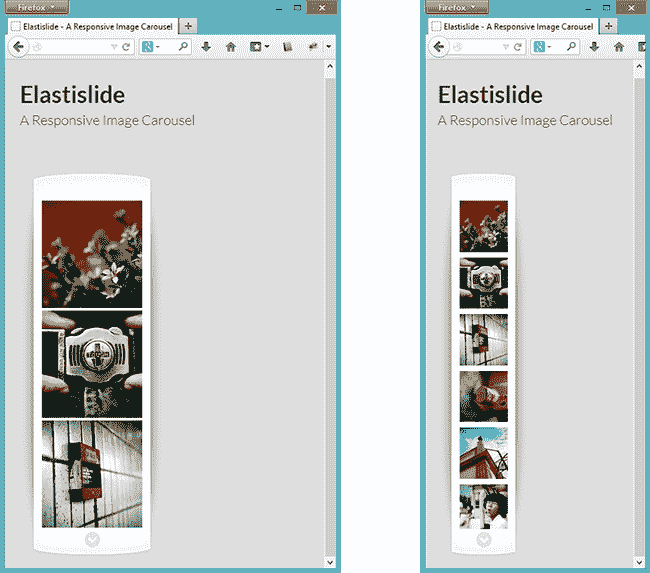

#### 示例 3–至少有两个可见图像的固定包装

在本例中，我们将定义转盘中的最小可见项目，当在小屏幕上查看转盘时，可能会注意到差异，并且图像不会减少太多。此外，我们可以从第三个开始定义要显示的图像。

请记住包含与示例 1 中使用的相同的文件，然后执行脚本，通知以下参数，并在包含 ElastiSlide 插件后对其进行定位：

```js
<script>
$('#carousel').elastislide({
  minItems: 2,
  start: 2
});
</script>
```

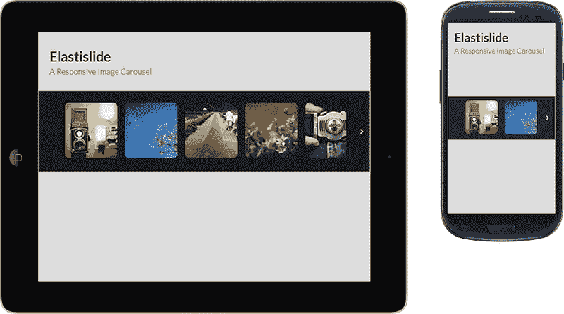

#### 示例 4–图像库中至少可见四幅图像

在第四个示例中，我们可以看到许多 JavaScript 实现。然而，这个例子的主要目的是展示这个插件提供给我们的可能性。通过使用插件回调函数和私有函数，我们可以跟踪单击和当前图像，然后通过创建图像库按需处理此图像更改：

```js
<script>
var current = 0;
var $preview = $('#preview');
var $carouselEl = $('#carousel');
var $carouselItems = $carouselEl.children();
var carousel = $carouselEl.elastislide({
  current: current,
  minItems: 4,
  onClick: function(el, pos, evt){
    changeImage(el, pos);
    evt.preventDefault();
  },
  onReady: function(){
    changeImage($carouselItems.eq(current), current);
  }
});
function changeImage(el, pos) {
  $preview.attr('src', el.data('preview'));
  $carouselItems.removeClass('current-img');
  el.addClass('current-img');
  carousel.setCurrent(pos);
}
</script>
```

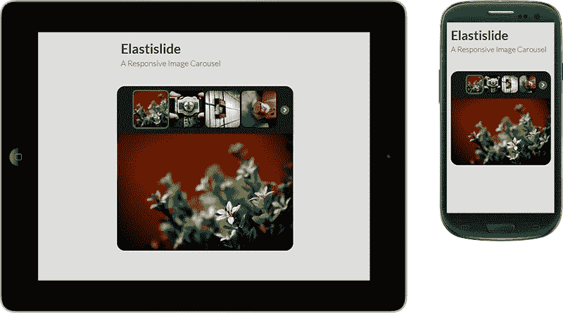

为此，与其他插件相比，ElastiSlide 可能没有太大优势，因为它取决于我们额外的开发来完成这个库。那么，让我们看看下一个插件提供了什么来解决这个问题。

## FlexSlider2–完全响应的滑块

FlexSlider2 是一个用于图像滑块的轻量级 jQuery 插件，包括淡入淡出和滑动动画、用于移动设备的触摸手势，以及一系列可定制的选项。

FlexSlider2 展示了对开发者社区的持续信心，一些已知的**CMS**（**内容管理系统**），如 Drupal 和 WordPress，自 2011 年发布该插件以来，已经导入该插件用于其系统。

稳定版本 2.0 还支持自 Safari 4、Chrome 4、Firefox 3.6、Opera 10 和 IE7 以来使用旧浏览器的用户。Android 和 iOS 设备也受支持。

### 怎么做

要查看此插件提供的各种选项，我们将看到以下三个最常用插件选项的应用程序示例。我们将首先显示滑块的默认布局。然后，我们将看到一个使用导航的滑块，以支持显示大量图像的情况，在最后一个示例中，我们将看到配置 FlexSlider2 提供的图像旋转木马的另一种方法。

您可以在[找到可下载的文件 https://github.com/woothemes/FlexSlider](https://github.com/woothemes/FlexSlider) ；对于其他插件选项，我们建议您阅读插件官方网站[上的完善文档 http://www.woothemes.com/flexslider/](http://www.woothemes.com/flexslider/) 。

#### 示例 1–基本滑块（默认）

让我们首先在`<head>`标记中包含 CSS 样式表：

```js
<link rel="stylesheet" href="css/flexslider.css" type="text/css">
```

在 DOM 的底部（在`</body>`结束标记之前），我们需要包含两个文件：jQuery 库和 FlexSlider2 脚本。

```js
<script src="http://code.jquery.com/jquery-1.9.1.min.js"></script>
<script src="js/jquery.flexslider.js"></script>
```

很好，到目前为止，第一个示例从这里开始，当我们使用一个简单的无序列表定义旋转木马结构时。它只有两个要求，即将`flexslider`类定义为包装`<div>`，将`slides`类定义为`<ul>`。

```js
<div class="flexslider">
  <ul class="slides">
    <li></li>
    <li></li>
    <li></li>
    <li></li>
  </ul>
</div>
```

在包含 FlexSlider2 库之后，让我们添加以下代码来执行脚本。我们将看到此插件的默认视觉和行为仅显示旋转木马中常见的图像元素幻灯片：

```js
$(document).ready(function() {
  $('.flexslider').flexslider({
    animation: "slide"
  });
});
```

该插件的风格在智能手机和桌面版本上看起来很漂亮：

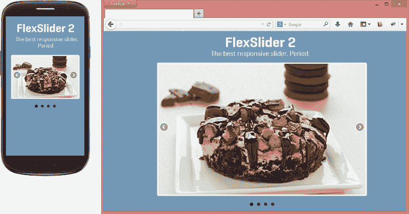

#### 示例 2–带转盘滑块的滑块作为导航控制

最初的 HTML 结构几乎相同，但现在我们必须复制 carousel 的幻灯片结构。通过执行 JavaScript 函数，这两个元素之间的关系被识别并连接到预期行为。

请记住包含与示例 1 中使用的相同的文件，然后将以下代码插入 HTML 代码中。

```js
<div id="slider" class="flexslider">
  <ul class="slides">
    <li></li>
    <li></li>
    <li></li>
    <li></li>
  </ul>
</div>
<div id="carousel" class="flexslider">
  <ul class="slides">
    <li></li>
    <li></li>
    <li></li>
    <li></li>
  </ul>
</div>
```

要创建这个图像库，我们必须使用 ID 识别插件将影响的元素，避免任何类型的行为冲突。将此示例与示例 1（FlexSlider2 仅实例化一次）进行比较，我们有两个对插件脚本的调用。

在下面代码的第一部分中，正在创建图片的幻灯片，此外，插件提供的一些其他选项，如`animation`、`itemWidth`、`itemMargin`和`asNavFor`正在被补充。

在该代码的第二部分中，将创建导航控件：

```js
$(document).ready(function() {
  $('#carousel').flexslider({
    animation: 'slide',
    controlNav: false,
    animationLoop: false,
    slideshow: false,
    itemWidth: 210,
    itemMargin: 5,
    asNavFor: '#slider'
  });
  $('#slider').flexslider({
    animation: "slide",
    controlNav: false,
    animationLoop: false,
    slideshow: false,
    sync: "#carousel"
  });
});
```

### 提示

`asNavFor`选项在`#carousel`的缩略图导航中转换`#slider`。而`sync`选项将创建`#slider`到`#carousel`上执行的操作的镜像。例如，如果用户在滑块中导航，则转盘项目将跟随显示相同活动滑块的操作，反之亦然。

非常简单，专业，有用！那么，让我们看看这个在小型设备和桌面上带有导航控制的响应式可视滑块：

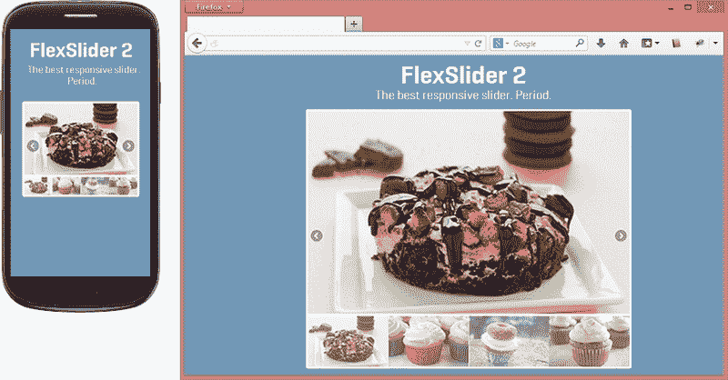

#### 示例 3–转盘设置最小和最大范围

请记住包含与示例 1 中使用的相同的文件，然后将以下代码插入 HTML 代码中。请注意，它使用与第一个示例相同的 HTML 结构：

```js
<div id="slider" class="flexslider">
  <ul class="slides">
    <li></li>
    <li></li>
    <li></li>
    <li></li>
  </ul>
</div>
```

然而，为了构建它，我们需要更改 JavaScript 代码，在这里我们通知不同的参数，如`itemWidth`、`itemMargin`、`minItems`和`maxItems`，我们将在下面的代码中看到：

```js
$(document).ready(function() {
  $('.flexslider').flexslider({
    animation: "slide",
    animationLoop: false,
    itemWidth: 210,
    itemMargin: 5,
    minItems: 2,
    maxItems: 4
  });
});
```

### 注

选项`itemWidth`和`itemMargin`应该以像素为单位进行测量和定义，但别担心，插件会很好地处理这个固定单元。

此外，`minItems`和`maxItems`用于根据设备宽度定义屏幕上显示的最小/最大元素值。在下面的屏幕截图中，我们将在手机和桌面两个版本中看到前面的代码：

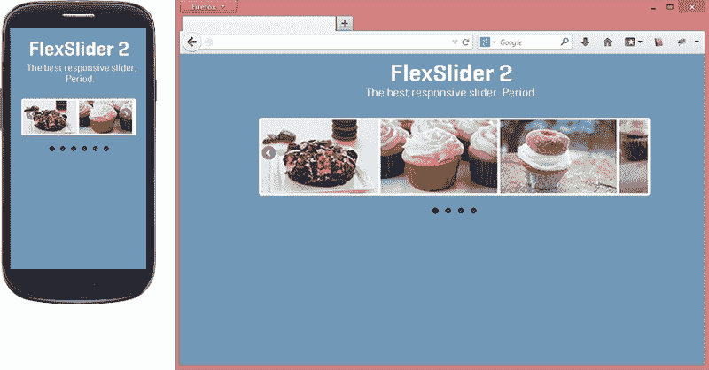

## 响应幻灯片–最好的基本幻灯片

ResponsiveSlides 是一个 jQuery 插件，它是一个非常轻量级的解决方案，基本上以两种不同的模式运行。此外，它只是自动淡入淡出图像，或作为一个响应图像容器，通过分页和/或导航在幻灯片之间淡入淡出。

ResponsiveSlides 可在多种浏览器上运行，包括 IE 的旧版本和 Android 2.3 及以上版本。它还添加了对 IE6 的 CSS`max-width`支持，以及其他本机不支持它的浏览器。此属性有助于保持它对小屏幕的响应。

这个插件有两个依赖项，即 jQuery 库和所有图像必须具有相同的维度。

您将在[找到可下载文件和更多关于插件选项的详细信息 https://github.com/viljamis/ResponsiveSlides.js](https://github.com/viljamis/ResponsiveSlides.js) 。

### 你怎么做

在下面的部分中，您将看到三个示例，其中我们可以看到该插件提供的主要功能。在第一个示例中，我们将看到哪些文件是解决此问题所必需的，以及 ResponsiveSlides 的默认选项是什么。

在第二个示例中，我们将添加各种参数，以检查如何定制此插件并满足我们项目的需要。

在第三个示例中，我们将通过图像实现附加导航，方便用户访问他们想要查看的特定幻灯片。

#### 例 1

因此，我们将从开始，在`<head>`标记中包含负责 ResponsiveSlides 主题的 CSS 文件：

```js
<link rel="stylesheet" href="responsiveslides.css">
```

之后，插件支持使用简单的 HTML 无序列表来制作幻灯片。但是，我们需要为这个`<ul>`定义一个类名，确保插件能够检测到哪个`<ul>`必须转换：

```js
<ul class="rslides">
  <li></li>
  <li></li>
  <li></li>
  <li></li>
</ul>
```

然后，在 DOM 的底部（在`</body>`结束标记之前），我们应该包括 jQuery 库和 ResponsiveSlides 脚本。

```js
<script src="http://code.jquery.com/jquery-1.9.1.min.js"></script>
<script src="js/responsiveslides.min.js"></script>
```

现在，只需在站点加载后，使用`rslides`类执行`<ul>`的 ResponsiveSlides 脚本即可。让我们将此代码放在包含响应幻灯片之后：

```js
<script>
$(function() {
  $(".rslides").responsiveSlides();
});
</script>
```

### 提示

在`demo.css`文件（插件文件附带）中，有一堆 CSS 样式表，可以帮助我们定制幻灯片。此文件不是必需的，但它在视觉上有很大的不同，可能对进一步参考有用。

这是插件的默认视觉效果：

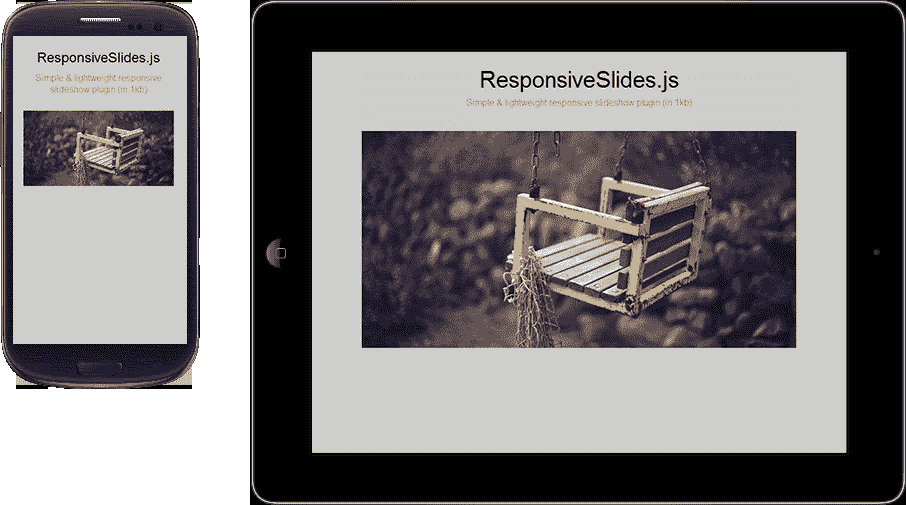

#### 例 2

因此，我们将以与上一个示例相同的方式开始，在`<head>`标记中包含 CSS 文件，然后在 DOM 代码的底部（在`</body>`结束标记之前），我们将包含 jQuery 库和 ResponsiveSlides 脚本。

对于这个例子，我们在幻灯片`slider_container`中添加了一个 div 包装，帮助我们定位每个幻灯片的箭头和标题文本。如果某些项目需要此标题文本来解释幻灯片，则 ResponsiveSlides 可以很好地处理此功能。

那么，让我们在下一个幻灯片上测试它：

```js
<div class="slider_container">
  <ul class="rslides" id="slider-example2">
    <li>
      <p class="caption">This is a caption</p>
    </li>
    <li>
      <p class="caption"><strong>Other</strong> caption here</p>
    </li>
    <li>
      <p class="caption">The <u>third</u> caption</p>
    </li>
    <li>
      <p class="caption">The fourth caption</p>
    </li>
  </ul>
</div>
```

然后，记住在站点加载后，使用`slider-example2`ID 为`<div>`执行响应幻灯片脚本，将此代码放在包含响应幻灯片之后：

```js
<script>
  $(function() {
    $('#slider-example2').responsiveSlides({
        auto: false,
        pager: false,
        nav: true,
        maxwidth: 540,
        speed: 500,
        namespace: "callbacks",
        before: function () {
          /* before event fired */
        },
        after: function () {
          /* after event fired */
        }
    });
  });
</script>
```

### 提示

通过为`pager`选项设置`false`，为`nav`选项设置`true`，也可以通知插件仅呈现下一个/上一个箭头，而不显示寻呼机导航。

在下面的屏幕截图中，我们将看到此示例以及插件附带的`demo.css`中的标题和导航箭头样式：

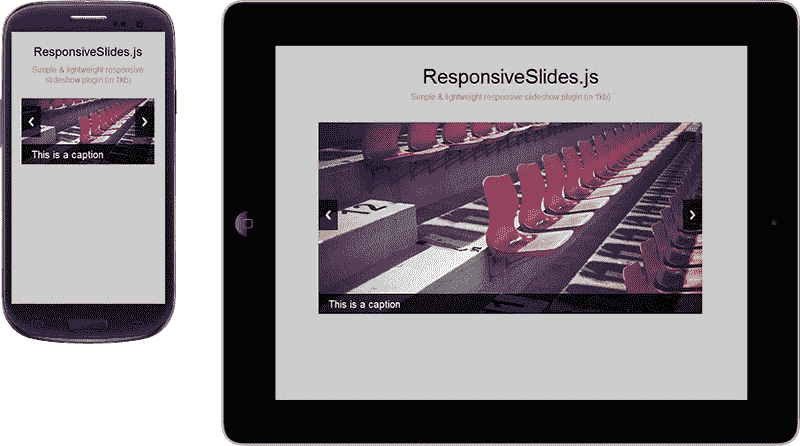

#### 例 3

本例的重点是基于缩略图和我们之前创建的图像创建自定义导航，为用户提供另一种显示幻灯片库的方式。为了构建它，我们将插入其他简单的无序列表，其中显示缩略图图像，并设置一个 ID，以便稍后通知插件：

```js
<ul class="rslides" id="slider-example3">
  <li></li>
  <li></li>
  <li></li>
  <li></li>
</ul>
<ul id="pager-example3">
  <li><a href="#"></a></li>
  <li><a href="#"></a></li>
  <li><a href="#"></a></li>
  <li><a href="#"></a></li>
</ul>
```

同样，我们必须确保 CSS 文件将包含在`<head>`标记中，然后在 HTML 代码底部包含 jQuery 库和 ResponsiveSlides 脚本。当我们为`#slider-example3`执行 ResponsiveSlides 时，我们将设置`manualControls`选项，并为该缩略图图像结构指定自定义寻呼机导航 ID，如下所示：

```js
<script>
$("#slider-example3").responsiveSlides({
  manualControls: '#pager-example3'
});
</script>
```

以下屏幕截图描述了此导航功能的视觉效果：


## Swiper–性能触摸图像滑块

Swiper 是一款轻量级移动触摸滑块，具有硬件加速转换（在支持的情况下）和惊人的本地行为。它旨在用于移动网站，但也适用于现代桌面浏览器。

我最喜欢这个插件有两个原因：它的性能非常好，特别是在智能手机上，而且它还允许桌面用户在浏览滑块内容时感受到几乎相同的触摸手势。

您可以从[下载此解决方案 https://github.com/nolimits4web/Swiper/](https://github.com/nolimits4web/Swiper/) 。有关插件选项的更多信息，请访问[http://www.idangero.us/sliders/swiper/api.php](http://www.idangero.us/sliders/swiper/api.php) 。

### 怎么做

因此，我们将在开始时，将 JS 和 CSS 文件包含在`<head>`标记中：

```js
<script src="http://code.jquery.com/jquery-1.9.1.min.js"></script>
<script src="js/idangerous.swiper-2.2.min.js"></script>
<link rel="stylesheet" href=" css/idangerous.swiper.css">
```

现在，我们将执行 Swiper 脚本，通知`container`和`pagination`类：

```js
<script>
$(function(){
  var mySwiper = $('.swiper-container').swiper({
    pagination: '.pager',
    paginationClickable: true
  });
});
</script>
```

请注意，此 CSS 文件仅自定义幻灯片动画。即便如此，我们仍需要添加以下代码来定制幻灯片结构，以补充 Swiper 附带的样式：

```js
<style>
.swiper-container {
  width: 70%;
  height: 300px;
}
.pager {
  position: absolute;
  z-index: 20;
  left: 10px;
  bottom: 10px;
}
.swiper-pagination-switch {
  display: inline-block;
  width: 1em;
  height: 1em;
  background: #222;
  margin-right: 5px;
}
</style>
```

之后，插件支持使用简单的 HTML 无序列表来制作幻灯片。此外，我们需要为此结构定义一些类名，以确保插件执行以下操作：

```js
<div class="swiper-container">
  <div class="swiper-wrapper">
    <div class="swiper-slide slide-1">
      <p>Slide 1</p>
    </div>
    <div class="swiper-slide slide-2">
      <p>Slide 2</p>
    </div>
    <div class="swiper-slide slide-3">
      
    </div>
    <div class="swiper-slide slide-4">
      
    </div>
  </div>
  <div class="pager"></div>
</div>
```

`swiper-container`和`swiper-wrapper`类由所有滑块结构包裹。此外，`swiper-slide`类将 div 定义为幻灯片项目，`pager`类指定将显示幻灯片分页的 div。

插件开发者提供的站点演示所采用的视觉效果很好；但是，这些样式不在`idangerous.swiper.css`内。这仍然取决于我们的整个幻灯片定制，我们将在以下屏幕截图中看到：

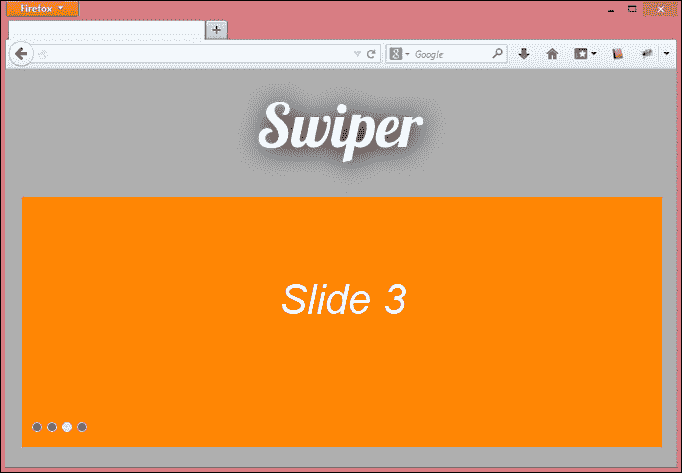

#### 特色选项

通过分析代码，这个插件看起来非常聪明，可以为浏览器提供快速渲染。另一个重要的考虑因素是社区不断更新，修正重大和次要错误。它目前与其他插件的区别是：

*   垂直/水平滑动
*   富 API
*   灵活配置
*   嵌套式刷子
*   三维流动

在插件版本 1.8.5 中，他们为 Swiper 引入了 3D 流补充。它只是提供了一个具有动态阴影的逼真 3D 画廊，与其他滑块插件相比具有很大优势。让我们看看如何实现它。

### 在 Swiper 上使用 3D flow 样式

因为它是 Swiper 的补充，所以我们需要包含前面示例中相同的文件，从`<head>`上的 CSS 开始。另外，将以下新的 JS 和 CSS 文件附加到 3D 流样式中：

```js
<script src="js/idangerous.swiper.3dflow-2.0.js"></script>
<link rel="stylesheet" href="css/idangerous.swiper.3dflow.css">
```

现在，让我们更改以前用于执行 Swiper 的代码。以下参数有很多，默认情况下随附，它将执行我们的 3D 流脚本：

```js
<script>
$(function(){
  var mySwiper = $('.swiper-container').swiper({
    slidesPerView: 3,
    loop: true,
       tdFlow: {
      rotate: 10,
      stretch: -50,
      depth: 400,
      modifier: 1,
      shadows: true
    }
  });
});
</script>
```

好的，看看这个补充可能给滑块视觉带来的巨大差异。通过使用 CSS3 转换，Swiper 插件可以为我们提供一种自动方式来显示不同的幻灯片效果：

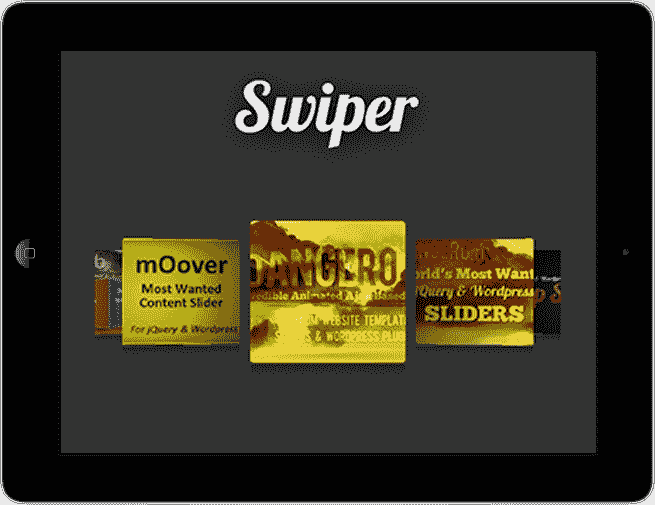

通过访问现场[http://www.idangero.us/sliders/swiper/plugins/3dflow.php](http://www.idangero.us/sliders/swiper/plugins/3dflow.php) 我们将找到更多 3D 流的示例和其他使用选项。

## 切片盒–使用幻灯片图像时的切片动画

Slicebox 是一个 jQuery 插件，用于响应 3D 图像滑块，具有优雅的回退功能（适用于不支持新 CSS 属性的旧浏览器）。

这个插件的视觉效果真的很酷。一旦幻灯片被更改，图像将被切成三到五张图像并旋转，显示出难以置信的效果。

### 怎么做

那么从[下载插件之后 https://github.com/codrops/Slicebox](https://github.com/codrops/Slicebox) ，我们将首先在`<head>`标记中包含 CSS 文件：

```js
<link rel="stylesheet" type="text/css" href="css/slicebox.css" />
<link rel="stylesheet" type="text/css" href="css/custom.css" />
```

但是，插件附带的 CSS 中缺少一个包装配置，应该由我们制作：

```js
<style>
.wrapper {
  position: relative;
  max-width: 840px;
  width: 100%;
  padding: 0 50px;
  margin: 0 auto;
}
</style>
```

之后，我们将使用一个简单的 HTML 无序列表来制作我们的幻灯片，并为这个结构定义一些必需的 ID，例如`sb-slider`、`shadow`、`nav-arrows`、`nav-dots`，以及插件读取的名称代码部分：

```js
<div class="wrapper">
  <ul id="sb-slider" class="sb-slider">
  <li>
    <a href="#"></a>
    <div class="sb-description"><h3>Creative Lifesaver</h3></div>
  </li>
  <li>
    <a href="#"></a>
    <div class="sb-description"><h3>Honest Entertainer</h3></div>
  </li>
  <li>
    <a href="#"></a>
    <div class="sb-description"><h3>Brave Astronaut</h3></div>
  </li>
  <li>
    <a href="#"></a>
    <div class="sb-description"><h3>Faithful Investor</h3></div>
  </li>
  </ul>
  <div id="shadow" class="shadow"></div>
  <div id="nav-arrows" class="nav-arrows">
    <a href="#">Next</a>
    <a href="#">Previous</a>
  </div>
  <div id="nav-dots" class="nav-dots">
    <span class="nav-dot-current"></span>
    <span></span>
    <span></span>
    <span></span>
  </div>
</div>
```

此外，还有一些实用程序类对代码进行了补充，如`wrapper`（用于滑块包装）和`sb-description`（用于将内容显示为滑块描述）。

在 DOM 的底部（在`</body>`结束标记之前），包括 jQuery 和 Slicebox 库：

```js
<script src="http://code.jquery.com/jquery-1.9.1.min.js"></script>
<script src="js/jquery.slicebox.js"></script>
```

之后，我们将通过插入下一个代码来执行 Slicebox 脚本。

### 提示

然而，在我看来，这是这个插件的主要问题，因为有很多行代码暴露给我们。

以下代码过于广泛，避免输入错误，您可以从[下载代码 http://www.packtpub.com/support](http://www.packtpub.com/support) 。

这是对移动设备和台式机影响的屏幕截图：

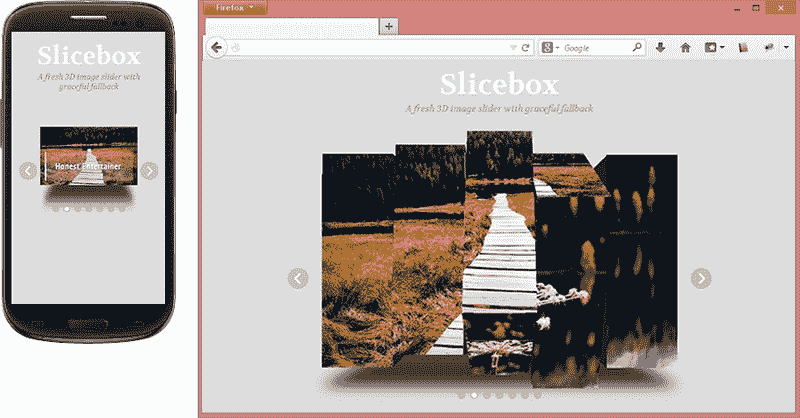

# 将触控手势引入用户体验

如今，触摸屏设备正在主导移动平台。大多数智能手机和平板电脑都有许多使用触摸手势的元素，现在它正进入我们的桌面开发阶段。在他的文章*中*卢克·沃布列夫斯基*提到了针对跨设备触摸的优化：*

> 那么，考虑触摸在所有屏幕上的大小意味着什么？有两件事：触摸目标大小和控制位置。

Luke Wroblewski To1 T1 强调响应式触觉设计中考虑的两个最重要的点：触摸目标大小和控制位置：

*   **触摸目标尺寸**：它们相对容易实现，任何需要使用触摸的导航系统都需要有菜单选项，以便手指不精确的人舒适地使用，以防止意外点击和错误。一些文章提到可接触面积的最小测量值应为 44 px。
*   **Placement of controls**: Controls need to be positioned in a way that aligns with how people hold and use touch-enabled devices. The bottom area of a smartphone screen is where we want to put an application's most common and important interactions so that they may be reached quickly and easily, as shown in the following website example:

    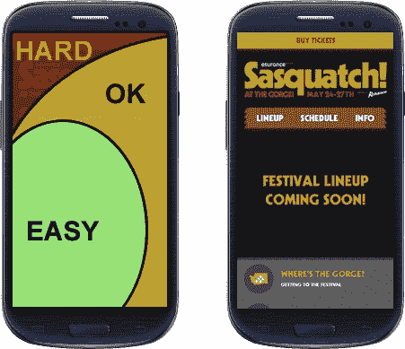

类似地，我们可以观察平板电脑的姿势，或者人们通常如何手持平板电脑。人们用双手握住它们，或者只是在膝盖上的屏幕上打字：

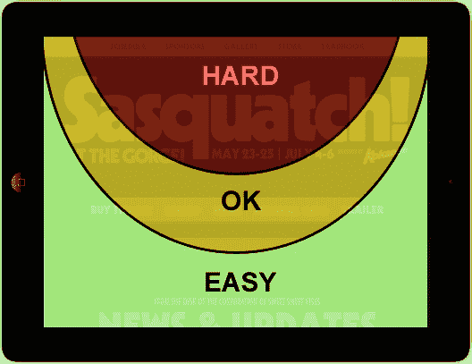

# 用 JavaScript 插件实现触摸事件

有一些重要的 JavaScript 扩展和插件允许我们将触摸手势集成到我们的响应式网站中，从而改善用户交互体验。一些例子是 QuoJS 和 Hammer。

## QuoJS–简单触摸交互库

它是一个微型、模块化、面向对象且简洁的 JavaScript 库，简化了 HTML 文档遍历、事件处理和用于快速移动 web 开发的 Ajax 交互。

注意，QuoJS 的工作不需要 jQuery；然而，它是一个简单而好的插件。

这个轻量级插件在 gzip 时大小为 5-6kb，允许我们拥有强大的编写能力、灵活性和适应的代码。您可以在[找到可下载的文件 https://github.com/soyjavi/QuoJS](https://github.com/soyjavi/QuoJS) 以及[中一些额外选项的详细信息 http://quojs.tapquo.com/](http://quojs.tapquo.com/) 。

Quoj 有这些手势来帮助我们：

*   单抽头
*   保持（650ms+）
*   双击

它的代码包中还包含了不同的类型的滑动、挤压和旋转。

### 怎么做

在 DOM 的底部（在`</body>`结束标记之前），包括 QuoJS 脚本；只有这样，我们才能通过创建事件侦听器来执行脚本。

在下面的示例中，如果用户将手指放在 ID 等于工具箱的元素上，我们将执行一个操作：

```js
<script src="js/quo.js"></script>
<script src="http://code.jquery.com/jquery-1.9.1.min.js"></script>
<script>
$(document).ready(function() {
  $('#toolbox').hold(function() {
    $(this).toggleClass('open-box');
  });
});
</script>
```

QuoJS 在语法中使用了`$$`符号，避免了与我们可能在网站上使用的`$`jQuery 符号冲突。

## Hammer–一个不错的多点触控库

Hammer 是一个 jQuery 轻量级库，用于多点触控手势，gzip 时仅需 3KB。

锤子支持这些手势：

*   水龙头
*   双击
*   刷卡
*   拖曳
*   拧
*   旋转

每个手势都会触发插件附带的有用事件和事件数据。

### 怎么做

首先，让我们从[下载库 https://github.com/EightMedia/hammer.js](https://github.com/EightMedia/hammer.js) 。在 DOM 的底部（在`</body>`结束标记之前），包含 Hammer 脚本，然后我们将能够通过创建事件侦听器执行脚本：

```js
<script src="http://code.jquery.com/jquery-1.9.1.min.js"></script>
<script src="js/jquery.hammer.min.js"></script>
```

### 提示

有时，不需要 jQuery 的版本看起来更快，但它可能无法在所有浏览器中工作。要切换版本，只需将`jquery.hammer.min.js`文件替换为`hammer.min.js`。

让我们看一个例子：

```js
<script>
$(document).ready(function() {
  var hammertime = $(".toucharea").hammer();   
  hammertime.on("touch", "#toolbox", function(ev) {
   $(this).toggleClass('open-box');
  });
});
  </script>
```

在本例中，它捕获触摸交互并对对象应用`open-box`类。但是，还有许多其他触摸事件需要处理，有关其使用的更多详细信息，请参见[https://github.com/EightMedia/hammer.js/wiki](https://github.com/EightMedia/hammer.js/wiki) 。

# 练习 6–使用 Swiper 插件创建图像滑块

只是提醒我们，这是我们初始设计的截图：

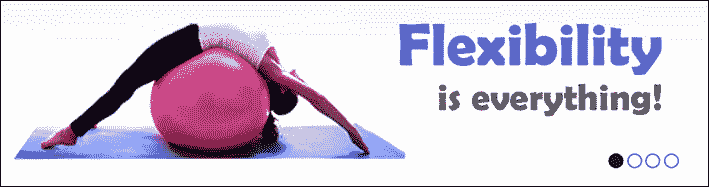

### 提示

这个图像只是一个建议。您可以找到任何图像来替换此图像。这里的重点是在响应标签内创建响应图像滑块。

现在，只需为每张幻灯片选择一张图像，并使用 Swiper 解决方案，在每张幻灯片上插入一条标语：

*   灵活性就是一切
*   一些精心设计的动作
*   肌肉控制使身体均匀地发育
*   身体健康是幸福的首要条件

正如我们在[第 4 章](04.html "Chapter 4. Designing Responsive Text")、*设计响应性文本*中看到的，强烈建议响应性网站使用`@font-face`。因此，作为对本练习的补充，使用谷歌字体的免费字体 Titan One 定制标语。

### 提示

如有必要，请记住使用 FontSquirrel 套件。

# 总结

在本章中，我们学习了为响应站点准备的滑块插件，如 Elastislide、FlexSlider、ResponsiveSlides、Swiper 和 Slicebox。我们还学习了如何构建它们、它们的优势和效果特征。尽管许多滑块插件已经实现了手势触摸，正如我们在本章中看到的，我们还向您展示了如何通过使用 QuoJS 和 Hammer 库来整合触摸功能。

在下一章中，我们将了解如何在小宽度设备中处理表。我们将看到如何实现经常使用的每种技术，例如水平滚动、减少可见列以及转换为堆栈表。