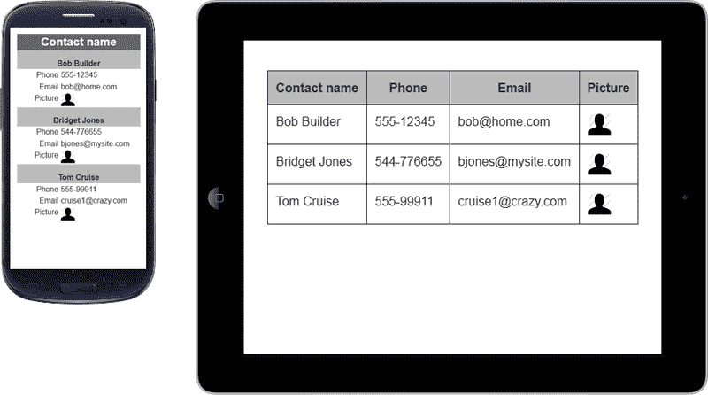

# 七、设计响应表

HTML 元素表可以非常宽，以便能够显示结构化内容。有时，为了在表中有意义，需要保留整行数据。默认情况下，表格可以调整，但如果表格太窄，单元格内容将开始换行；这通常不是很干净！

*Garrett Dimon*提到了一个有趣的话题，关于调整表格宽度以适应不同屏幕尺寸和确保表格内容的意义的难度：

> “数据表在响应性设计方面做得不太好。只需说'。”

在本章中，我们将学习创建响应表的四种不同方法：

*   可扩展响应表
*   叠桌
*   水平溢流
*   链接到完整表

# 响应表

下面的屏幕截图显示了在响应表中发现的最常见的问题，这些问题是：最小表宽超过屏幕大小，整个表的大小（包括文本大小）减小：


然而，让我们看看解决这个响应问题的不同方法。

# 可扩展响应表

通过 FooTable，我们可以将 HTML 表格转换为可扩展的响应表格，允许屏幕尺寸较小的设备保留相同的内容，唯一的变化是您必须对显示的内容进行优先级排序。它的功能是，当根据断点第一次查看时，将您认为不太重要的列隐藏起来。因此，仅当单击/触摸行时，隐藏数据才会出现。

如果我们更深入地研究这个 jQuery 插件，我们会注意到两大特性，它们有助于实现良好的代码和易于开发：**开箱即用定制**（通过 DOM 中的数据属性）和**断点设置**（设置的断点可能与网站上已使用的断点不同）。

让我们在下一个示例中了解如何在 DOM 上定义它。

## 怎么做

从[下载插件后 https://github.com/bradvin/FooTable/](https://github.com/bradvin/FooTable/) ，我们将在 `<head>`标记中包含 CSS 样式表：

```js
<link href="css/themes/footable.metro.css" rel="stylesheet" type="text/css" />
```

默认情况下，FooTable 只使用两个断点：`phone`设置为`480`px，`tablet`设置为`1024`px。这些断点值不必与您可能使用的相同，因为它取决于表需要多少空间。此外，我们稍后将看到如何在必要时进行更改。

让我们在 HTML 代码中插入以下代码作为示例，以练习插件资源：

```js
<table class="expandable-table">
  <thead>
    <tr>
      <th data-class="expand-icon">Contact name</th>
      <th data-hide="phone">Phone</th>
      <th data-hide="phone,tablet">Email</th>
      <th data-hide="phone" data-ignore="true">Picture</th>
    </tr>
  </thead>
  <tbody>
    <tr>
      <td>Bob Builder</td>
      <td>555-12345</td>
      <td>bob@home.com</td>
      <td></td>
    </tr>
    <tr>
      <td>Bridget Jones</td>
      <td>544-776655</td>
      <td>bjones@mysite.com</td>
      <td></td>
    </tr>
    <tr>
      <td>Tom Cruise</td>
      <td>555-99911</td>
      <td>cruise1@crazy.com</td>
      <td></td>
    </tr>
  </tbody>
</table>
```

数据属性有助于理解 FooTable 的功能，只需查看 DOM 即可知道哪些列将隐藏在手机或平板电脑中。

以下是 FooTable 使用的基础数据属性及其功能：

*   `data-class`：指定应用于列中所有单元格的 CSS 类。
*   `data-hide`：定义列中隐藏哪些断点。通过使用逗号分隔断点，可以指定多个断点。
*   `data-ignore`：此仅在看到详细信息时才隐藏内容。通常与`data-hide`类一起使用，该选项的可接受值可以是`true`或`false`。

有关所有数据属性列表的更多信息，请访问[http://fooplugins.com/footable/demos/data-attributes.htm](http://fooplugins.com/footable/demos/data-attributes.htm) 。

### 提示

如果我们使用这些数据属性，我们应该在`<th>`元素上应用它们，插件将在内部单元格中反映其变化。

在 DOM 的底部（在`</body>`结束标记之前），我们需要包含两个文件：jQuery 和 FooTable 库。之后，插入执行脚本的以下代码：

```js
<script src="http://code.jquery.com/jquery-1.9.1.min.js"></script>
<script src="js/footable.min.js"></script>
<script>
  $(function() {
    $(".expandable-table").footable();
  });
</script>
```

如果我们想更改 FooTable 的断点，我们只需要在执行上一个脚本时指定自己的值，如下代码所示：

```js
<script>
  $(function() {
    $(".expandable-table").footable({
 breakpoints: {
 tablet: 768,
 smartphone: 480,
 mini: 320
 }
    });
  });
</script>
```

在下面的屏幕截图中，我们将看到如果单击 Bob 的表行会发生什么。让我们比较一下智能手机和平板电脑上的响应表：


在本例中，每个设备上都有一些字段，只有当您单击以获取特定联系人的更多详细信息时，这些字段才可见。尽管这种方法避免了大量数据，但可能很难找到联系人，例如通过电子邮件，因为它需要单击所有联系人以显示信息。

有一些插件扩展可以解决这个问题。让我们检查一下。

## 扩展插件

将 FooTable 用作解决方案的另一个优点是它的可扩展性。插件是模块化的，它允许您通过使用附加组件包括额外的功能，如排序、过滤和分页。

排序加载项提供对表列中包含的数据进行排序的功能。为此，我们将包括以下脚本文件：

```js
<script src=" js/footable.sort.js"></script>
```

然后我们将为我们想要启用排序的项目设置`data-sort-initial="true"`，为排序没有意义的项目设置`data-sort-ignore="true"`，例如图像和电话：

```js
<th data-sort-initial="true">Contact name</th>
<th data-sort-ignore="true">Phone</th>
```

在下面的屏幕截图中，我们可以看到插入的箭头图标，插件使用这些图标来排列特定的表格标题：


过滤附加组件添加了一个搜索字段，允许用户定位他们正在查找的数据。搜索结果为我们带来了正确的数据，即使它对观众隐藏。为此，让我们在脚本文件中包括以下内容：

```js
<script src=" js/footable.filter.js"></script>
```

在页面中添加一个文本输入字段（在表格之前或之后），并使用`#filter`ID，然后在表格元素的`data-filter=#filter`数据属性中指定它。以下是此过滤器的代码：

```js
Filter by: <input id="filter" type="text">
```

在以下屏幕截图中，内容被过滤，仅显示一项，即使找到的值也被隐藏：


此外，分页加载项有助于显示全部内容的一部分，默认情况下创建 10 个项目的分页。为此，我们必须在脚本文件中包含以下代码：

```js
<script src="js/footable.paginate.js"></script>
```

因此，在上一个表示例中，在`</tbody>`之后，我们将添加以下代码，该代码将接收分页。以下章节中的`pagination`类是必需的，其他类如`pagination-centered`和`hide-if-no-paging`只是补充：

```js
<tfoot>
<tr>
  <td colspan="4">
    <div class="pagination-centered hide-if-no-paging pagination"></div>
  </td>
</tr>
</tfoot>
```

另外，在本例中，我们通过在`table`元素上添加`data-page-size="2"`来限制每页两项，以查看正在使用的分页。这就是它的样子：


有关这些附加组件和更多插件选项的更多信息，请参阅[中的完整文档 http://fooplugins.com/footable-demos/](http://fooplugins.com/footable-demos/) 。

虽然这个插件看起来非常完整，但在某些情况下，内容需要其他接口。让我们来看一下 StaskDabl 解决方案。

# 堆叠的表格

Stackedtable 是一个 jQuery 插件，它为我们的响应表提供了另一个选项，可从[下载 http://johnpolacek.github.io/stacktable.js/](http:// http://johnpolacek.github.io/stacktable.js/) 。

此解决方案创建表的副本，并将宽表转换为两列键/值格式，以便在小屏幕上更好地工作。

### 提示

建议将此解决方案用于行数较少的表，因为它会增加大量垂直内容。

通过使用简单的媒体查询，我们可以隐藏原始表并显示堆叠表。让我们看看我们怎样才能把它付诸行动。

## 如何使用上一个示例中的表执行此操作

我们将首先在`<head>`标记中包含 CSS 样式表：

```js
<link href="stacktable.css" rel="stylesheet" />
```

如果我们想更改断点，针对智能手机使用此解决方案，我们只需进入`stacktable.css`文件并更改`max-width`属性：

```js
@media (max-width: 480px) {
  .large-only { display: none; }
  .stacktable.small-only { display: table; }
}
```

之后，我们将添加上一个解决方案中看到的表的基础，只需添加一个 ID 和类：

```js
<table id="stack-table" class="large-only">
  <thead>
    <tr>
      <th>Contact name</th>
      <th>Phone</th>
      <th>Email</th>
      <th>Picture</th>
    </tr>
  </thead>
  <tbody>
    <tr>
      <td>Bob Builder</td>
      <td>555-12345</td>
      <td>bob@home.com</td>
      <td></td>
    </tr>
    <tr>
      <td>Bridget Jones</td>
      <td>544-776655</td>
      <td>bjones@mysite.com</td>
      <td></td>
    </tr>
    <tr>
      <td>Tom Cruise</td>
      <td>555-99911</td>
      <td>cruise1@crazy.com</td>
      <td></td>
    </tr>
  </tbody>
</table>
```

在 DOM 的底部（在`</body>`结束标记之前），我们需要包含两个文件：`jquery`和`stacktable`库。之后，插入执行脚本的以下代码，并通知表 ID 和一个类，以便根据需要限制智能手机的堆叠表：

```js
<script src="http://code.jquery.com/jquery-1.9.1.min.js"></script>
<script src="js/stacktable.js"></script>
<script>
$('#stack-table').stacktable({myClass:'stacktable small-only'});
</script> 
```

以下是小设备和桌面两个视图的截图：



# 水平溢流

此技术的工作原理是冻结第一列，允许您向下滚动其下的其他列。通过这种方式，我们可以看到每行的第一列内容，这允许向左滚动，以查看剩余内容，从而使数据比较更容易。

本表推荐用于列数较多且第一列内容较其他内容重要的表。让我们在下一个示例中通过实践来澄清它的外观。

## 怎么做

我们将从[下载解决方案开始 http://zurb.com/playground/responsive-tables](http://zurb.com/playground/responsive-tables) 。之后，让我们创建一个新的 HTML 文件，并在`<head>`标记中包含 CSS 样式表：

```js
<link rel="stylesheet" href="css/responsive-tables.css">
```

现在插入以下 HTML 表格代码，使用比上一个表格更多的列，并使用名为`responsive`的类：

```js
<table class="responsive">
<tr>
  <th>Header 1</th>
  <th>Header 2</th>
  <th>Header 3</th>
  <th>Header 4</th>
  <th>Header 5</th>
  <th>Header 6</th>
</tr>
<tr>
  <td>first column important data</td>
  <td>row 1, cell 2</td>
  <td>row 1, cell 3</td>
  <td>row 1, cell 4</td>
  <td>row 1, cell 5</td>
  <td>row 1, cell 6</td>
</tr>
<tr>
  <td>first column important data</td>
  <td>row 2, cell 2</td>
  <td>row 2, cell 3</td>
  <td>row 2, cell 4</td>
  <td>row 2, cell 5</td>
  <td>row 2, cell 6</td>
</tr>
</table>
```

在 DOM 的底部（在`</body>`结束标记之前），我们只需要包含 jQuery 和响应表库：

```js
<script src="http://code.jquery.com/jquery-1.9.1.min.js"></script>
<script src="js/responsive-tables.js"></script>
```

让我们看一下在智能手机和平板电脑上显示此表的屏幕截图：


### 提示

当可用屏幕宽度超过 767px 时，表上开始发生变化。如果我们想要修改这个默认值，我们需要打开`responsive-tables.js`文件，查找值 767，然后更改它。

这在技术上很容易做到。然而，我们不能低估它在响应式网站上的效率，因为它有助于理解表格信息，特别是在小型设备上。

## 收割台方向翻转

如果您发现我们表格的标题行比第一列更重要，并且在使用小型设备时需要继续显示标题行，*David Bushell*通过仅使用 CSS 代码创建了一个有趣的解决方案。

这个 CSS 解决方案与第一列交换位置，不需要任何 JavaScript 库，只需要 CSS3。

让我们首先在`<head>`标记中包含 CSS 样式表：

```js
<style>
@media only screen and (max-width: 767px) {

.responsive {
  display: block; position: relative; 
}
.responsive thead {
  display: block; float: left;
}
.responsive tbody { 
  display: block; width: auto; position: relative;
  overflow-x: auto; white-space: nowrap;
}
.responsive thead tr {
  display: block;
}
.responsive th {
  display: block; border: 0; border-top: 1px solid #AAA;   
  background: #CCC; border-right: 1px solid #ccc;
  padding: 8px 10px !important;
}
.responsive tbody tr {
  display: inline-block; vertical-align: top;
  border-right: 1px solid #ccc;
}
.responsive td {
  display: block; min-height: 1.25em; border: 0;
}
table.responsive th:first-child, table.responsive td:first-child,
table.responsive td:first-child, table.responsive.pinned td {  
  display: block;
}

}
</style>
```

使用更真实的内容，让我们在 HTML 代码上创建此表：

```js
<table class="responsive" cellspacing="0" border="1">
  <thead>
    <tr>
      <th>Doctor names</th>
      <th>Values</th>
      <th>Dates</th>
      <th>Cash Money</th>
      <th>Message</th>
      <th>City</th>
      <th>State</th>
    </tr>
  </thead>
  <tbody>
    <tr>
      <td>Dr. Jayhawk</td>
      <td>102</td>
      <td>03/30/1940</td>
      <td>$60.42</td>
      <td>PAID</td>
      <td>Atlanta</td>
      <td>Georgia</td>
    </tr>
    <tr>
      <td>Dr. John Smith</td>
      <td>137</td>
      <td>03/18/1953</td>
      <td>$69.68</td>
      <td>PAID</td>
      <td>Orlando</td>
      <td>Florida</td>
    </tr>
    <tr>
      <td>Dr. Wolverine</td>
      <td>154</td>
      <td>03/29/1976</td>
      <td>$86.68</td>
      <td>PAID</td>
      <td>New Orleans</td>
      <td>Louisiana</td>
    </tr>
    <tr>
      <td>Dr. Tarheel</td>
      <td>113</td>
      <td>03/30/1981</td>
      <td>$63.50</td>
      <td>PAID</td>
      <td>San Antonio</td>
      <td>Texas</td>
    </tr>
  </tbody>
</table>
```

让我们看看智能手机和平板电脑上的结果：


# 链接到完整表

链接到完整表是一种很少使用的技术，因为它不能完全解决这种情况。它的工作原理是用一个小的模拟表替换表，并只创建一个链接来查看完整的表。

问题仍然存在，但这一次，用户可以向左/向右滑动屏幕以查看所有内容。有一个媒体查询来处理这个机制，只在小屏幕上显示它。

## 怎么做

首先，让我们从开始下载`full-table.css`文件，该文件在本书附带的可下载代码文件中提供。然后将其插入 HTML 代码的`<head>`标记中。虽然我们正在处理 CSS 解决方案，但此代码过于广泛，增加了打字错误的机会。

让我们重复使用上一个示例中的表代码副本，但对表元素进行修改，如下所示：

```js
<table id="responsive" class="full-table">
```

在 DOM 的底部（在`</body>`结束标记之前），我们需要包含`jquery`库，并插入以下代码，该代码将仅基于类名显示/隐藏解决方案：

```js
<script src="http://code.jquery.com/jquery-1.9.1.min.js"></script>
<script>
$(function(){
  $("#responsive").click(function(){
    $("html").toggleClass($(this).attr("class"));
  });
});
</script>
```

在下面的屏幕截图中，我们将看到小屏幕的缩小表格，用户点击即可看到完整的表格可视化。当屏幕大小小于或等于 520 px（如果需要使用 CSS 文件，可以修改此值）时，会出现此效果。


### 注

插件点击后会生成一个水平滚动条，可以看到整个表格。

# 练习 6–使用 FooTable jQuery 插件创建响应价格表

让我们使用 FooTable jQuery 插件和以下屏幕截图中的表内容创建一个响应表。

### 注

这张表的内容不是真实的，我们将使用它只是为了练习。

在以下屏幕截图中，我们可以看到智能手机和平板电脑上显示的表格，每个设备使用不同的设计：


您可以先根据平板电脑的设计创建表格结构，然后实现可脚踏插件，自动为智能手机提供紧凑的视觉效果。

# 总结

在本章中，我们学习了四种不同的方法来处理小设备宽度的宽表。我们重点讨论了如何实现每种技术，因为它的使用取决于表内容的类型。我们刚才看到的技术有：可扩展响应表（可脚踏）、堆叠表、水平溢出和链接到完整表。

在下一章中，我们将介绍如何使用表单，并学习如何实现自动完成、日期选择器和工具提示等功能。