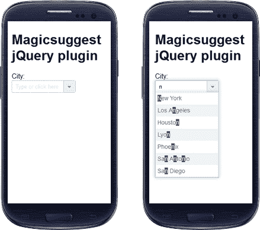
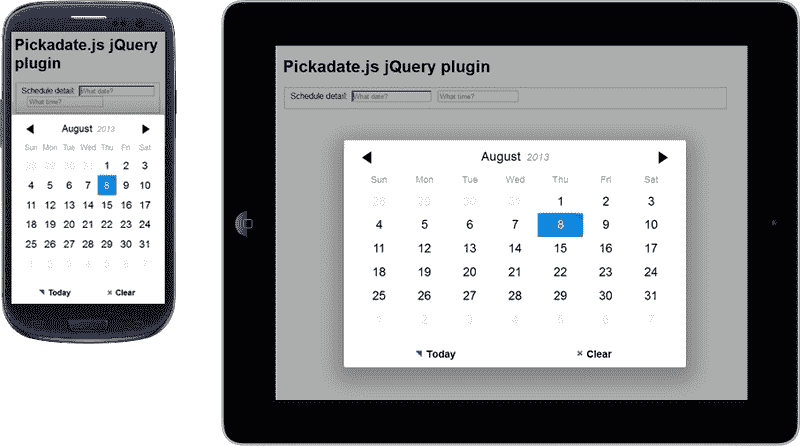
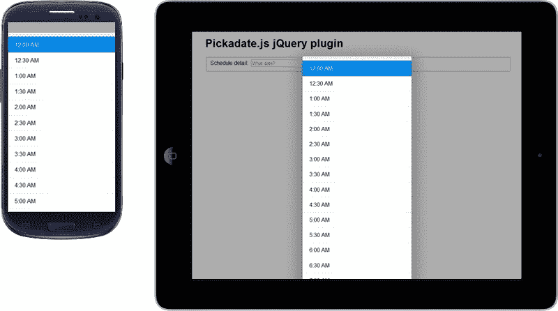
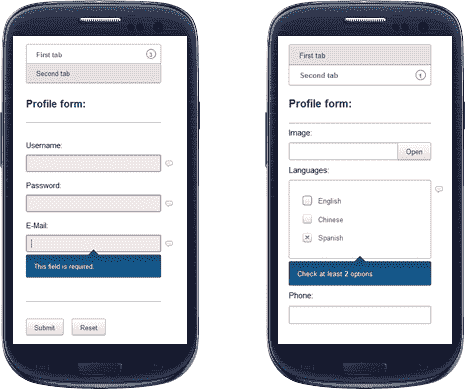
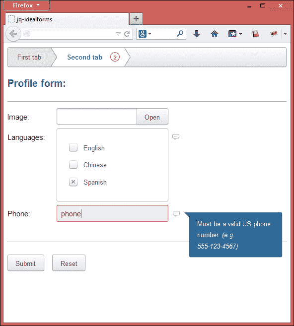
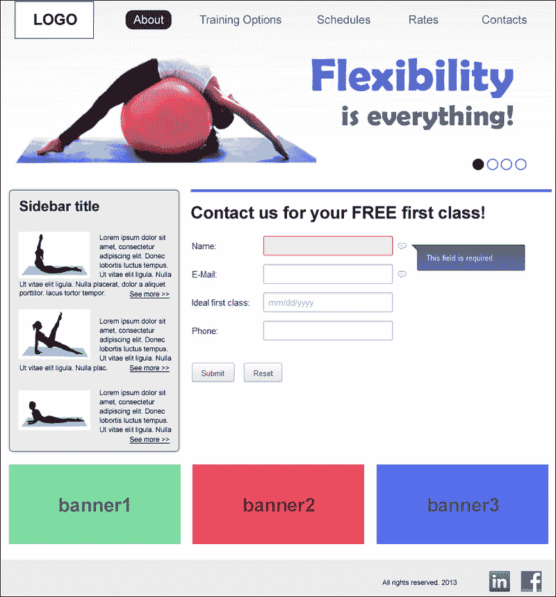

# 八、响应式表单的实现

HTML5 编码极大地改变了前端 web 开发的格局。通过使用适当的字段类型和本地验证，有更多的机会构建更好的表单，这是搜索引擎优化的最佳方案。所有这些功能正逐渐被所有现代网络浏览器所采用。

通过使用 jQuery，我们可以增强页面上的 HTML5 体验，并添加补充功能以改善用户体验。

在本章中，我们将了解：

*   表单输入的类型和属性
*   `autocomplete`特征
*   `datepicker`特征
*   `tooltips`特征
*   使用 IdealForms 的响应框架

# 表单输入的类型和属性

HTML5 输入类型的使用带来了开发的两大优势：缩短开发时间和改善用户体验。许多现代浏览器已经采用了这些新的输入类型和属性，整个 web 社区都从中受益，促进了其使用的普及。

最常用的 HTML5 输入类型是`email`、`date`、`tel`、`number`和`time`。此外，HTML5 最常见的属性是`placeholder`、`required`、`autocomplete`和`multiple`。我们将在[第 10 章](10.html "Chapter 10. Ensuring Browser Support")*确保浏览器支持*中看到，并非所有 web 浏览器都以相同的方式支持 HTML5 功能，并且需要 jQuery 干预来提供适当的支持。

然而，它仍然依赖于 jQuery 技术来显示诸如`autocomplete`和其他更复杂的验证等特性。通常情况下，jQuery 插件与新的 HTML5 输入类型配合得非常好，几乎是响应性网站的必备插件。在开始实现该特性之前，让我们创建一个基本表单；这是第一步，将在进一步的示例中使用。创建一个带有基本标记的空 HTML 站点结构，然后保留 jQuery，这将很快使用：

```js
<!DOCTYPE html>
<html lang="en">
<head>
<meta name="viewport" content="width=device-width, initial-scale=1" />
<title>Responsive form</title>
</head>
<body>
<script src="http://code.jquery.com/jquery-1.9.1.min.js"></script>
</body>
</html>
```

为了逐步学习，每个功能将独立呈现；只有前面的基本代码将被重用。

我们将看到的这些插件不是服务器端验证的替代品；它们只会改善用户体验，减少服务器请求，并提供更好的交互界面。

# Magicsuggest 的自动完成功能

Magicsuggest 是一个灵活的自动建议组合框，每当用户开始在字段中键入时，它都会给出建议。使用此功能将减少打字的必要性，主要是在移动设备上，因为在移动设备上输入每个字母都很麻烦。

默认情况下，Magicsuggest 具有一些良好的功能，例如按住*Ctrl*键选择多个项目，并允许用户在输入文本后使用*Enter*键添加新的输入。

JSON 数据源用于填充组合框。此处提供了一些选项：

*   **无数据源**：当保留为`null`时，组合框不会提示任何内容。如果允许的自由条目设置为`true`（默认），则仍然可以让用户输入多个条目。
*   **静态源**：使用 JSON 对象数组、字符串数组，甚至单个 CSV 字符串作为数据源。
*   **URL**：我们可以传递组件获取 JSON 数据的 URL。数据将使用`POST`AJAX 请求获取，该请求将包括输入的文本作为查询参数。
*   **函数**：我们可以设置一个函数返回一个 JSON 对象数组。函数成功只需要一个回调函数或返回值。

## 如何实现

我们先从[下载文件开始 http://nicolasbize.github.io/magicsuggest/](http://nicolasbize.github.io/magicsuggest/) 。下载后，我们将在已经创建的基本代码的 `<head>`标记中包含 JavaScript 和 CSS 文件：

```js
<script src="js/magicsuggest-1.3.1.js"></script>
<link rel="stylesheet" href="css/magicsuggest-1.3.1.css">
```

在此之后，插入以下代码片段以使用这些城市创建 JSON 数据，然后执行 Magicsuggest 脚本，并在必要时提供一些选项：

```js
<script type="text/javascript">
$(document).ready(function() {
  var jsonData = [];
  var cities = 'New York,Los Angeles,Chicago,Houston,Paris,
Marseille,Toulouse,Lyon,Bordeaux, Philadelphia,Phoenix,
San Antonio,San Diego,Dallas'.split(',');
  for(var i=0;i<cities.length;i++) jsonData.push({id:i,name:cities[i]});
  var city = $('#field-city').magicSuggest({
    data: jsonData,
    resultAsString: true,
    maxSelection: 1,
    maxSelectionRenderer: function(){}
  })
});
</script>
```

下一步是在`<body>`标记中添加`city`字段。

```js
<label for="field-city">City: </label>
<input id="field-city" type="text"/>
```

如下面的屏幕截图所示，单击“选择”字段时，我们将看到建议功能立即出现：



在前面的示例中，我们只实现了基本用法。但是，该插件还有其他有趣的实现，可能适合您未来的需要，例如：

*   右侧的标记选择
*   Gmail 风格组合
*   列过滤器组合
*   使用图像的自定义模板组合框

# 日期和时间选择器功能

移动用户已经有了一个他们非常熟悉的输入日期和时间的界面。但是，我们将了解 jQuery 插件，它可以通过在所有设备上向用户显示相同的功能来帮助保持网站的身份。

## Pickadate–响应日期/时间选择器

Pickadate 是一个响应性强的 jQuery 插件，它非常有趣，而且对移动设备友好、响应迅速、轻量级。无论浏览器或设备如何，都可以提供自定义界面。

这是一种在填写表单时方便插入正确日期的好方法，因为它可以避免键入错误，并为用户提供更好的指导，显示当月的完整日历。

### 怎么做

从[下载文件后 http://amsul.ca/pickadate.js/](http://amsul.ca/pickadate.js/) 首先，我们将在已经创建的基本代码的`<head>`标记中包含 JavaScript 和 CSS 文件：

```js
<script src="lib/picker.js"></script>
<script src="lib/picker.date.js"></script>
<script src="lib/picker.time.js"></script>
<link rel="stylesheet" href="lib/themes/default.css" id="theme_base">
<link rel="stylesheet" href="lib/themes/default.date.css" id="theme_date">
<link rel="stylesheet" href="lib/themes/default.time.css" id="theme_time">
```

### 提示

如果您需要支持旧浏览器，建议包含`legacy.js`文件。

之后，我们需要执行`datepicker`和`timepicker`的脚本。

```js
<script>
$('.js__datepicker').pickadate();
$('.js__timepicker').pickatime();
</script>  
```

下一步是在`<body>`标记中插入日期字段和时间字段。插件要求突出显示类名。

```js
<fieldset class="fieldset js__fieldset">
  <div class="fieldset__wrapper">
    <label>Schedule detail:</label>&nbsp;
    <input class="fieldset__input js__datepicker" type="text" placeholder="What date?">&nbsp;&nbsp;
    <input class="fieldset__input js__timepicker" type="text" placeholder="What time?">
  </div>
</fieldset>
```

以下是智能手机和平板电脑上激活的`datepicker`插件的屏幕截图：



以下是用户点击`time`字段时的屏幕截图：



`pickadate`插件非常完整，提供了扩展以增加对以下内容的支持：

*   翻译（包括从右到左的语言）
*   不同格式
*   日期/时间限制

有关这些扩展的更多信息，请访问[http://amsul.ca/pickadate.js/date.htm#options](http://amsul.ca/pickadate.js/date.htm#options) 。

# 工具提示功能

`tooltip`是一种有用的方式，用于在网页上显示有关元素的其他上下文敏感信息，通常位于标签和输入字段之间。它的工作是提供有关特定领域的更多信息。

随着工具提示作为用户与网页元素交互的一种手段越来越普遍，良好的工具提示设计和交互的必要性变得越来越重要。

通常，将鼠标指针放在元素上即可显示工具提示，并显示消息。由于大多数移动设备没有指针，这个问题必须通过在触摸屏上显示工具提示的插件来解决。

## 工具提示器–现代工具提示功能

Tooltipster 是一个功能强大且灵活的 jQuery 插件，可让您轻松创建语义和现代工具提示。

### 怎么做

我们将从[下载工具提示文件开始 http://calebjacob.com/tooltipster/](http://calebjacob.com/tooltipster/) 并将已创建的基本代码中的`<head>`标记中的 JavaScript 和 CSS 文件包括在内：

```js
<script src="js/jquery.tooltipster.min.js"></script>
<link rel="stylesheet" href="css/tooltipster.css" />
```

要激活插件，我们将添加`tooltipster`库，并将其配置为对具有`.tooltip`类的所有元素执行（在本例中，只有一个实例，但您可以在页面中使用多个实例）：

```js
<script>
$(function() {
  $('.tooltip').tooltipster();
});
</script>
```

之后，我们将添加一个问号图像，并在每个元素上定义`tooltip`类，在该元素上显示工具提示：

```js

```

以下是单击/触摸元素后插件的屏幕截图：


我们也可以通过编辑`tooltipster.css`文件来修改默认插件主题，或者通过在`script`调用中指定类来覆盖现有主题。

```js
<script>
$(function() {
  $('.tooltip').tooltipster({
    theme: '.my-custom-theme'
  });
});
</script>
```

# 使用 IdealForms 的响应形式

IdealForms，可在[上获得 https://github.com/elclanrs/jq-idealforms](https://github.com/elclanrs/jq-idealforms) 是一个用于构建和验证响应性 HTML5 表单的框架。此外，它还支持键盘、用户移动到下一个字段时的快速验证以及大多数浏览器的占位符支持。

IdealForms 框架还有一个分页选项，在填写大量表单时，它有助于改善用户体验。让我们通过一步一步的练习来了解它的用法。

## 如何实现

创建一个新的 HTML 文件，并复制我们在本章开头已经编写的基本代码。然后，我们将在`<head>`标记中包含 CSS 样式表。

```js
<link rel="stylesheet" href="css/jquery.idealforms.min.css"/>
```

让我们将以下示例代码插入 HTML 结构，该结构的界面使用`<section>`标记分为两个选项卡：

```js
<form id="form">
  <div><h2>Profile form:</h2></div>
```

在第一个选项卡中，我们将添加`username`、`password`和`email`字段：

```js
<section name="First tab">
  <div><label>Username:</label>
  <input id="username" name="username" type="text" /></div>
  <div><label>Password:</label>
  <input id="pass" name="password" type="password" /></div>
  <div><label>E-Mail:</label>
  <input id="email" name="email" data-ideal="required email" type="email" /></div>
</section>
```

在第二个选项卡中，我们将添加`file`、`languages`和`phone`字段。

```js
<section name="Second tab">

  <div><label>Image:</label>
  <input id="file" name="file" multiple type="file" /></div>
  <div id="languages">
  <label>Languages:</label>
  <label><input type="checkbox" name="langs[]" value="English"/>English</label>
  <label><input type="checkbox" name="langs[]" value="Chinese"/>Chinese</label>
  <label><input type="checkbox" name="langs[]" value="Spanish"/>Spanish</label>
  </div>
  <div><label>Phone:</label>
  <input type="tel" name="phone" data-ideal="phone" /></div>
</section>
```

最后，我们将添加一个`submit`按钮。

```js
  <div><hr/></div>
  <div><button type="submit">Submit</button>
</form>
```

在 DOM 的底部（在`</body>`结束标记之前），我们需要包含`jquery`和`idealforms`库。

```js
<script src="js/jquery.idealforms.js"></script>
```

在此之后，插入以下代码，该代码将执行脚本，该脚本开始创建一个函数，当用户填写错误值时，该函数会提醒用户。

```js
<script>
  var options = {
    onFail: function() {
      alert( $myform.getInvalid().length +' invalid fields.' )
    },
```

这里我们将设置哪个表单元素将通过验证进行检查。

```js
    inputs: {
      'password': {
        filters: 'required pass',
      },
      'username': {
        filters: 'required username',
        data: { //ajax: { url:'validate.php' } }
      },
      'file': {
        filters: 'extension',
        data: { extension: ['jpg'] }
      },      'langs[]': {
        filters: 'min max',
        data: { min: 2, max: 3 },
        errors: {
          min: 'Check at least <strong>2</strong> options.',
          max: 'No more than <strong>3</strong> options allowed.'
        }
      }
    }
  };
```

完成验证后，我们将执行`idealforms`JavaScript，加载之前设置的所有验证。

```js
  var $myform = $('#form').idealforms(options).data('idealforms');
</script>
```

就这样！客户端验证已经实现。

以下是在智能手机设备上查看时正在运行的框架的屏幕截图：



同一页面可以在桌面上查看，默认布局非常适合。



# 练习 8–使用 IdealForms 框架创建联系人表单

让我们根据前面看到的完整分步示例，并使用 IdealForms 框架作为此表单的基础，为项目创建一个响应式联系人表单。

因此，正如我们之前所做的，让我们开始包括 CSS 文件和以下字段：**名称**、**电子邮件**、**理想头等舱**（日期）和**电话**，如以下屏幕截图所示：



IdealForms 上没有提到日期字段，因为默认情况下，它是 jQueryUI 解决方案附带的。但是，我建议使用 Pickadate 插件，因为与 jQueryUI 相比，它更加轻量级，而且它还有助于加强我们之前学习的示例。

# 总结

在本章中，我们学习了如何使用 HTML5 表单元素，在必要时使用一些 jQuery 插件来补充代码，如用于`autocomplete`的 Magicsuggest、用于`datepicker`的 Pickadate 和用于`tooltips`的 Tooltipster。此外，我们还体验了如何通过构建联系人表单界面来使用响应表单框架 IdealForms。

在下一章中，我们将重点通过使用工具和脚本测试网站，以确保其在所有设备上的响应性。彻底理解下一章对于检查旧浏览器或移动设备的实现中可能出现的错误并进一步修复它们非常重要。此外，测试阶段对于避免客户报告的未来意外情况非常重要。