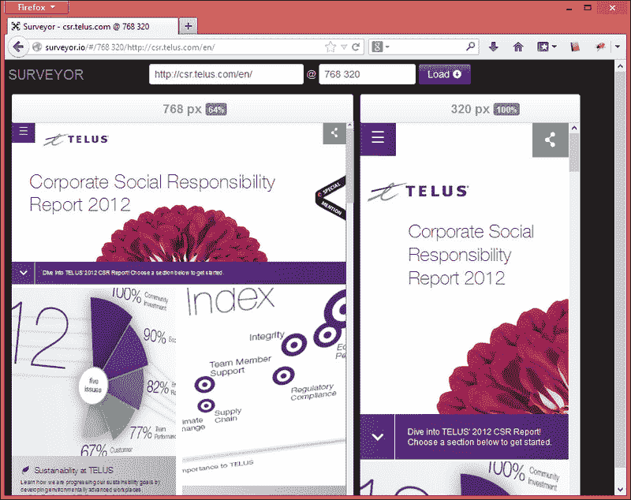

# 九、测试响应性

事实上，没有比在设备本身上检查您的设计更好的测试了，尽管它消耗的时间比我们在测试模拟器中预期的要多；浏览器工具是可以加快测试速度的解决方案，但无法再现与真实网站完全相同的网站。

虽然它们将非常接近，但我们可以将这种类型的测试定义为仅初始测试过程，然后在实际设备上进行测试，以确保所有功能正常工作。

在本章中，我们将了解：

*   使用浏览器工具模拟设备
*   在设备模拟器上测试
*   响应式网站上的单元测试提示

# 使用浏览器工具模拟设备

浏览器工具将无法模拟我们通常在设备上看到的方式，但它们有助于 CSS 断点测试，并根据屏幕大小测量显示您的响应网站在最流行的设备（如 iPad、iPhone 或任何 Android 手机）上的外观。

屏幕大小调整不会捕获浏览器与其渲染引擎之间的不一致。例如，使用 Chrome 调整浏览器大小不会告诉您仅在 Safari mobile 浏览器上出现的 CSS 问题。

让我们来看看几个网站，这将有助于你作为一个开发人员，以确定你的网站将在一个特定的设备上执行。

## 使用 Viewport Resizer 网站工具

视口大小调整器是一种网站工具，可在开发网站或发布网站后方便进行响应性网站测试。

在该工具网站上列出的优势中，我们想强调以下几点：

*   动态添加自定义屏幕大小
*   设备指标的可视化预览（onMouseOver）
*   视口信息（大小、纵横比、方向和用户代理）
*   打印支持：仅限 WebKit（Chrome 和 Safari）

不幸的是，此工具在任何版本的 Internet Explorer 浏览器中都不起作用，这将有助于在 Windows 手机上查找视觉问题。

无需下载或安装。您只需访问网站[http://lab.maltewassermann.com/viewport-resizer](http://lab.maltewassermann.com/viewport-resizer) 并将标有**的按钮的链接或书签**保存在您喜爱的链接列表中。

下面是一个示例，说明了如果使用此工具，我们的网站将如何在智能手机上呈现：

## 使用测量员网站工具

测量员是一个网站工具，它遵循之前的工具，并且可以在开发中的网站和已经发布的网站上测试响应性。

您可以通过访问[来测试网站 http://surveyor.io](http://surveyor.io) ，并通过指定您想要查看的 URL 和屏幕大小（不显示可供选择的预定义值）。

然后，您可以在所有断点并排测试您的响应设计，帮助您更好地了解正在使用的断点的设计，便于所有比较。

### 提示

有时，此浏览器工具显示的滚动条会显示一个实际上没有问题的问题，从而混淆我们的网站分析。在这种情况下，值得检查站点和下一个工具。

查看此网站，并将此网站的尺寸调整为平板电脑和智能手机版本进行比较：

## 使用 ScreenFly 网站工具

这个工具也遵循我们之前看到的调整网站大小的模式，开发者输入 URL（它也用于开发项目）并选择我们想要在网站上检查的分辨率。

该工具为开发者带来了一些模板，这些模板具有可选择的精确屏幕尺寸和市场上最常见的设备型号。事实上，它不需要记住所有的单词，这使它更容易。或者，如果您想定制自己的尺寸，只需点击**自定义屏幕尺寸**按钮即可。

访问网站[https://quirktools.com/screenfly](https://quirktools.com/screenfly) 您可以通知要测试的网站。默认情况下，它将在 Netbook 10 预览中显示您的网站，模拟设备宽度。只需单击标题按钮并选择特定型号，即可选择其他设备。

ScreenFly 工具还有另一个有趣的功能，它包括共享链接，以便使客户和开发人员之间的交流更容易（仅适用于已经发布的站点）。

这有助于改善客户和开发人员之间的沟通，显示某些功能或问题。为此，只需点击**共享**按钮并将链接发送给其他人即可。通过访问此链接，此人将看到类似于以下内容的屏幕：

# Opera 移动仿真器

根据网站[StatCounter.com](http://StatCounter.com)的数据，尽管手机 Opera 浏览器已不再处于巅峰状态，但它仍占移动设备访问量的 16.62%。这就是为什么在这个移动浏览器中至少检查我们网站的主要基本功能仍然很重要的原因。

Opera 软件公司通过提供一个内置移动 Opera 浏览器的模拟器，为开发者提供了良好的支持。它的浏览器也是仿真器的基础，你可以用它来测试各种不同的移动设备。您可以在[找到可供下载的应用程序 http://www.opera.com/developer/mobile-emulator](http://www.opera.com/developer/mobile-emulator) 。

安装完成后，只需选择所需设备，如下图所示，点击**启动**按钮：

# 响应式网站设计测试提示

有了这些反应灵敏的设计工具，我们准备为任何设备创建灵活的设计。

但当我们进行测试时，重要的是要注意以下提示：

*   不要在没有测试的情况下完成整个网站。最好的方法是在每个特性实现后立即进行测试，以便很容易找到问题所在。
*   Regression testing is very important to prevent cascading errors. After testing the implemented feature, check if what you did before does not introduce new issues on other parts of the website.

    ### 注

    回归测试在对网站的现有区域进行增强后，寻找这些区域中的软件缺陷。

*   检查图像和图标质量以及网站内容在结构上的流动性。
*   对响应迅速的网站进行性能分析，尤其是在移动设备上查看时（我们将在下一章中具体介绍）。

# 练习 9——让我们用不同的屏幕大小测试我们的网站

我们将从前面看到的工具中选择一个来测试我们的网站。

这是一张使用测量工具模拟智能手机和平板电脑断点的屏幕截图：

当你进行测试时，首先写下所有发现的视觉问题，并实现你的功能，然后立即开始修复它们。这个过程确保你不会失去注意力和浪费时间。

# 总结

在本章中，我们着重于使用工具和脚本测试网站，以确保其在所有设备上的响应能力。我们已经了解了使用网站工具（如 Viewport Resizer、Surveyor 和 ScreenFly）检查实现中可能出现的错误的重要性。此外，我们还测试了 Opera Mobile emulator，方法是在本机 Opera Mobile 浏览器中打开网站，模拟许多移动设备。

在下一章中，我们将确保跨浏览器解决方案提供回退。我们将学习如何处理较旧的浏览器，并通过显示优雅的外观来呈现正确的设计。