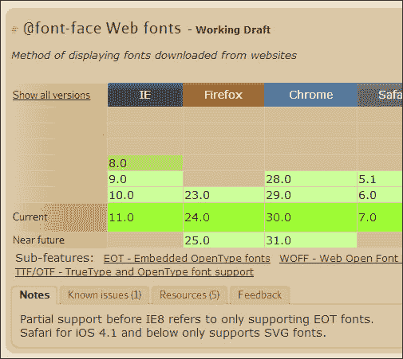
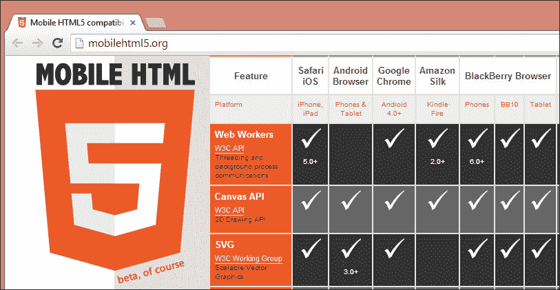
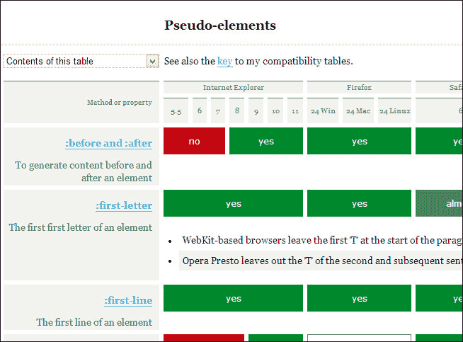
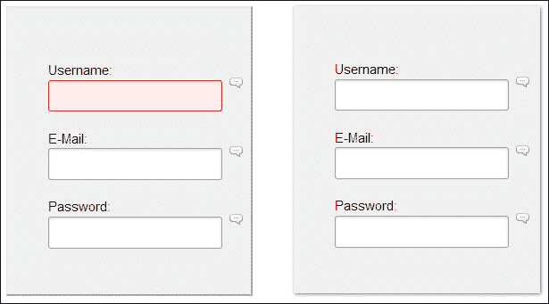
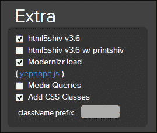

# 十、确保浏览器支持

不同的浏览器都有自己的专有功能和以自己的方式实现的标准功能的子集，这为我们带来了大量的工作，使这些功能适用于所有浏览器。

产生这些差异的原因是 W3C 规范不断更新，并且随着浏览器之间的不断竞争，他们总是试图将其产品推广为具有更好的功能。

但是，jQuery 具有良好的跨浏览器兼容性，并且能够灵活地跨越每个浏览器在功能实现方面的一些差距。这些桥被称为**多填料**。

Polyfills 是本章的主要主题，我们还将了解：

*   检查浏览器支持的功能
*   polyfill 的含义
*   了解特征检测工具
*   HTML5 和 CSS3 的 Polyfill 实现

# 检查浏览器支持的功能

在网站开发中，经验确实给程序员带来了很多灵活性。尽管这些知识很快就过时了，但一旦新功能、选择器和增强功能与浏览器兼容，我们就必须不断更新它们。

根据我们的浏览器和设备，检查技术和功能兼容性的三个主要网站是：[CanIUse.com](http://CanIUse.com)、[MobileHTML5.org](http://MobileHTML5.org)和[QuirksMode.org](http://QuirksMode.org)。

## CanIUse.com

[CanIUse.com](http://CanIUse.com)网站是这些参考网站中最知名的网站，我们可以在桌面和移动浏览器中查看支持 HTML5、CSS3、SVG 等的兼容性表。

如果您访问网站[http://caniuse.com](http://caniuse.com) 您将看到，其数据基于 StatCounter GlobalStats 收集的统计数据，并且不断更新。

阅读**注释**和**已知问题**选项卡也很重要（我们可以在下面的屏幕截图中看到），因为我们是社区的一部分，对整个开发站点的发展做出了巨大贡献。这些选项卡突出显示了应考虑的例外情况，或报告了他们在特定场景中必须使用的问题和技术。



## MobileHTML5.org

[MobileHTML5.org](http://MobileHTML5.org)网站重点关注移动和平板浏览器上 HTML5 功能与真实设备测试的兼容性。正如我们在前一章中所看到的那样，这会产生不同，因为从桌面浏览器模拟的视图与在移动设备上测试网站之间的视觉差异很小。

然而，当涉及设备的硬件和操作系统时，这种差异会显著增加，只有在真实设备上测试网站，我们才能发现潜在的问题。

列出的各种设备令人印象深刻。下面的屏幕截图展示了旧设备的部分功能，这些功能已不再占据很大的市场份额。它甚至还显示了最近推出的操作系统设备，如 FirefoxOS。

请尝试访问网站[http://mobilehtml5.org](http://mobilehtml5.org) ，并检查更新的列表。



## QuirksMode.org

在[QuirksMode.org](http:// QuirksMode.org)网站上，我们可以通过在使用之前检查指定的选择器或伪类是否被浏览器接受来防止在开发过程中出现不好的意外。否则，我们必须检查在开始时定义的每个浏览器。

[QuirksMode.org](http://QuirksMode.org)网站只关注存储和保存几乎所有 CSS 选择器和属性的浏览器支持的最新信息。正如我们在[上看到的 http://www.quirksmode.org/css/selectors](http://www.quirksmode.org/css/selectors) ，该信息分为以下几类：

*   选择符
*   属性选择器
*   伪元素
*   伪类

以下是[QuirksMode.org](http://QuirksMode.org)网站检查伪元素技术的一部分：



# 定义回退

回退是开发网站时支持过程的一部分。它的目标是为我们应用于网站的技术提供一种替代，但并非所有浏览器都支持这一特定功能。

该术语可分为多填料和网垫。

**polyfill**是一种特定代码，用于模拟不支持本机功能的浏览器的特定功能。Polyfills 始终尝试模仿原始浏览器功能，但在少数情况下，它可能会导致轻微的副作用，例如加载时间增加或性能下降。

polyfill 的一个例子是 html5shiv 脚本，我们只需将其放入代码中，它的行为就好像什么都没有改变一样。稍后我们将讨论 HTML5。

**垫片**提供备用，但通常有自己的 API，可能需要修改代码以允许垫片工作。这就是为什么我们有像`yepnope.js`这样的库来加载这些，如果需要的话。稍后我们将看到一个使用`yepnope.js`的示例。

让我们看看两个功能检测工具，当我们提供回退时，它们可能会很有用。

# 特征检测工具

特征检测是我们能够为网站用户提供渐进增强的第一步。

然后，我们必须测试给定的特性是否已经在浏览器中实现。如果是这样，我们不需要重新实现任何已经存在的功能，但是如果浏览器实际上缺少该功能，建议为此提供正确的支持。

有时我们必须支持尚未完全实现特定功能的浏览器。然而，当您的网站被浏览时，新功能会产生不同，并且网站的受欢迎程度通常会增加。

## CSS 浏览器选择器+

跨浏览器响应的设计助手比 Modernizer 更简单，因为它唯一的功能是在加载站点时检测特性，并使用`<html>`标记中的类在代码中对其进行标记。

它有一个简单的实现，因此它允许我们编写一个特定的 CSS 代码，并解决视觉问题，例如，限制在某些操作系统或浏览器上，这是 CSS 攻击的终结！

此 JavaScript 库标识的主要项目有：

*   浏览器和浏览器版本
*   渲染引擎
*   平台和操作系统
*   装置
*   `max-width`和`min-width`屏幕检测
*   浏览器方向检测
*   语言检测

通过访问网站[亲自尝试此工具 http://ridjohansen.github.io/css_browser_selector/](http://ridjohansen.github.io/css_browser_selector/) ，通过检查`<html>`元素检查等级。

这样，就可以修复特定浏览器的问题，甚至帮助创建类似这样的回退。考虑下面的例子：

```js
.orientation_landscape .div-example {
  border: 2px solid red;
}
```

### 提示

创建异常的自定义代码越少，实现未来的更新和更改就越好。如果可能的话，我们的想法是找出错误的根本原因，而不仅仅是修复浏览器之间的视觉差异。

### 怎么做

下载后，我们只需要在`<head>`标签内的代码中包含`css_browser_selector.js`文件：

```js
<script src="js/css_browser_selector.js"></script>
```

通过检测，可以加载脚本或不同的功能，但此解决方案中不包括这一点。为了解决这一问题并获得更多类型的特征检测，建议使用更完整的解决方案：Modernizer。

## 现代化

Modernizr 是一个 JavaScript 库，它可以检测用户浏览器中的 HTML5 和 CSS3 功能，无论浏览器是否支持某个功能，都可以轻松地为每种情况编写有条件的 JavaScript 和 CSS。

它的工作原理是将类添加到`html`元素中，以便我们将来在 CSS 上进行选择。此外，它还创建了一个 JavaScript 对象，其结果稍后用于支持数十个测试。从[下载 Modernizer 时 http://modernizr.com](http://modernizr.com) ，我们可以选择下载完整的开发版本或只包含我们打算使用的部分的定制版本。

### 提示

Modernizer 的网站建议下载具有适合项目功能的定制版本，而不是使用 CDN 的完整版本，因为大多数情况下定制版本会比完全开发的版本小。

之后，我们可能会在我们的代码的头部分中包含`the modernizr.custom.85330.js`文件，如下所示：

```js
<script src="js/modernizr.custom.85330.js"></script>
```

让我们观察一下`<html>`标记中的类是如何排列的，如果在 Firefox 上查看，所有检测到的功能都可以使用：

```js
<html lang="en" class=" js no-flexbox flexboxlegacy canvas canvastext webgl no-touch geolocation postmessage no-websqldatabase indexeddb hashchange history draganddrop websockets rgba hsla multiplebgs backgroundsize borderimage borderradius boxshadow textshadow opacity cssanimations csscolumns cssgradients no-cssreflections csstransforms csstransforms3d csstransitions fontface generatedcontent video audio localstorage sessionstorage webworkers applicationcache svg inlinesvg smil svgclippaths">Now, let's look at the features detected, but this time viewed on Internet Explorer 8:<HTML class="ie8 js no-flexbox no-flexboxlegacy no-canvas no-canvastext no-webgl no-touch no-geolocation postmessage no-websqldatabase no-indexeddb hashchange no-history draganddrop no-websockets no-rgba no-hsla no-multiplebgs no-backgroundsize no-borderimage no-borderradius no-boxshadow no-textshadow no-opacity no-cssanimations no-csscolumns no-cssgradients no-cssreflections no-csstransforms no-csstransforms3d no-csstransitions fontface generatedcontent no-video no-audio localstorage sessionstorage no-webworkers no-applicationcache no-svg no-inlinesvg no-smil no-svgclippaths" lang=en xmlns:html5shiv>
```

这样我们就可以编写这样的代码，我们保证如果您的浏览器不支持`boxshadow`属性，我们可以制作两个模拟阴影效果的边框：

```js
.box {
  border:1px solid #DDD;
  border-bottom: 1px solid #AAA;
  border-right: 1px solid #AAA;
}
.boxshadow div.box {
   border: none;
   -webkit-box-shadow: 1px 1px 3px #777;
      -moz-box-shadow: 1px 1px 3px #777;
           box-shadow: 1px 1px 3px #777;
}
```

这个简单的边界阴影代码示例将如以下屏幕截图所示：



现在，让我们看看当解决方案需要使用 YepNope.js 向需要的网站添加另一个库时，我们能做些什么。

### YepNope.js

js 是一个 JavaScript 库，用于异步条件加载外部 JavaScript 和 CSS 资源。

以下示例说明了 Modernizer 是如何用于测试 CSS 动画的，以及在浏览器不支持`CSSTransforms`的情况下，YepNope 被用作回退：

```js
<script>
  Modernizr.load({
    test: Modernizr.csstransforms,
    yep : 'css/cssTransform.css',
    nope: ['css/noTransform.css','js/jQuery.pseudoTransforms.js ']
  }); 
</script>
```

### HTML5

html5shiv 库支持旧版本 IE 浏览器中的 HTML5 元素，尤其是 6 到 8 版本，并为 IE9 提供一些基本支持。

此外，此解决方案还有另一个名为`html5shiv-printshiv.js`的文件，其中包含一个可打印版本。它还允许 HTML5 元素及其子元素进行样式化，同时使用 IE6 到 IE8 打印。

您只需选择 Modernizr 下载页面上显示的选项即可使用此选项，当项目中包含库时，如果浏览器不支持该 html5 元素，则将应用 polyfill：



# Polyfill 实现

已经开发了数百种 polyfills 和垫片。一旦新的特性、元素或增强功能被创建，这个列表就会增加。

我们现在将看到一些 polyfill 的实现，但重要的是您要查看网站[https://github.com/Modernizr/Modernizr/wiki/HTML5-Cross-Browser-Polyfills](https://github.com/Modernizr/Modernizr/wiki/HTML5-Cross-Browser-Polyfills) ，在开始创建新的多边形填充之前，检查是否已经开发了多边形填充。

## MediaElements.js

MediaElements 是一种 polyfill，使用模仿本机 HTML5 MediaElement API 的 Flash 技术，为在旧浏览器中查看的`<video>`和`<audio>`元素创建了一致的播放器设计。

在下面的示例中，我们将应用此库来提高浏览器在显示视频时的一致性。但是，要让每个浏览器播放您的音频/视频，仍然有很多工作要做，因为它们需要以不同的格式托管文件的多个版本，例如`.mp4`、`.webm`和`.ogg`。

### 怎么做

从[下载最新版本后 http://www.mediaelementjs.com](http://www.mediaelementjs.com) ，我们可以在`<head>`标签中包含 JavaScript 库和`stylesheet`文件：

```js
<script src="http://code.jquery.com/jquery-1.9.1.min.js"></script>
<script src="../build/mediaelement-and-player.min.js"></script>
<link rel="stylesheet" href="../build/mediaelementplayer.min.css" />
```

以下代码用于为不同浏览器提供更多的可访问性：

```js
<video width="640" height="360" id="player2" poster="../media/echo-hereweare.jpg" controls="controls" preload="none">
  <!-- MP4 source must come first for iOS and webkit browsers -->
  <source type="video/mp4" src="../media/echo-hereweare.mp4" />

  <!-- WebM for Firefox and Opera -->
  <source type="video/webm" src="../media/echo-hereweare.webm" />
  <source type="video/ogg" src="../media/echo-hereweare.ogv" />

  <!-- Fallback flash player -->
  <object width="640" height="360" type="application/x-shockwave-flash" data="../build/flashmediaelement.swf">    
    <param name="movie" value="../build/flashmediaelement.swf" /> 
    <param name="flashvars" value="controls=true&amp;file=../media/echo-hereweare.mp4" />     
    
  </object>   
</video>
```

然后，可以通过以下方式为文档中的任何`<video>`或`<audio>`元素初始化播放器：

```js
<script>
$('video').mediaelementplayer({
  success: function(player, node) {
    $('#' + node.id + '-mode').html('mode: ' + player.pluginType);
  }
});
</script>
```

在以下屏幕截图中，有其默认视频播放器 UI 的示例：


有很多选项的文档，我们可以在执行播放器时对其进行配置。这些选项可在[中找到 http://mediaelementjs.com/#options](http://mediaelementjs.com/#options) 。

## SVG

**可缩放矢量图形**（**SVG**是矢量图形的一种图像格式。它的使用有很多优点，例如压缩文件大小，可以在不丢失清晰度的情况下缩放到任何大小，在视网膜显示器上的良好外观，以及通过给设计师更多的控制来允许更多的交互。

然而，它还没有完全被浏览器接受，需要回退。有一项由*Alexey Ten*提出的技术，非常有趣，因为它解决了 Internet Explorer 8 和 Android 2.3 等浏览器的问题。

让我们了解一种更好的方式来介绍 SVG 实现。

### 怎么做

在站点上放置 SVG 文件有几种不同的方法。我们将使用以下方法来接近它们：背景图像，作为`svg`标记，作为`img`标记。

#### SVG 作为背景图像

Modernizer 有一个 SVG 测试。因此，您可以使用 Modernizer 已注入 HTML 元素的类名声明回退：

```js
.my-element {
  background-image: url(image.svg);
}
.no-svg .my-element {
  background-image: url(image.png);
}
```

#### SVG 作为<SVG>标签

这是一种新技术，旧浏览器不能很好地理解突出显示的术语，并显示`.png`文件而不是`.svg`文件：

```js
<svg width="96" height="96">
  <image xlink:href="svg.svg" src="svg.png" width="96" height="96" />
</svg>
```

#### SVG 作为一个简单的标记

通过使用 Modernizer，我们将在插入代码之前测试浏览器是否支持 SVG。否则，脚本会找到同名的`.png`文件，并显示`.png`文件而不是`.svg`文件。

```js


<script>
if (!Modernizr.svg) {
  $('img[src$=svg]').each(function(index, item) {
    imagePath = $(item).attr('src');
    $(item).attr('src',imagePath.slice(0,-3)+'png');
  });
}
</script>
```

但是，这些一致的 URL 和文件名模式是保持网站正常运行所必需的，否则脚本将无法找到正确的资源。

## Respond.js

Respond.js 是`min-width`/`max-width`的一种快速、轻量级的 polyfill，在将样式表加载到 Internet Explorer 6 至 8 浏览器可以理解的格式后，它可以在重新解释样式表时支持媒体查询。

我们所有的媒体查询都不需要任何额外的更改。我们只需要确保我们的`@media`声明写得正确。

### 提示

如果您有 CSS 文件，请确保在 CSS 文件之后包含`respond.min.js`。

如果我们的 CSS 使用`@import`或是内联编码，Respond.js 无法读取。相反，使用典型的`<link>`方法。例如：

```js
<link rel="stylesheet" href="css/style.css" media="screen and (max-width:480px)" />
```

### 怎么做

在 DOM 的底部（在`</body>`结束标记之前），我们需要包含 Respond.js 库，可以在[下载 https://github.com/scottjehl/Respond](https://github.com/scottjehl/Respond) 。如果您有以下内容，请确保在 CSS 文件后包含`respond.min.js`：

```js
<script src="js/respond.min.js"></script>
```

而且它是完成的。

# 总结

在本章中，我们确保了提供回退的查看器的可访问性。我们已经学习了如何使用 CSS 浏览器选择器和 Modernizer 检测浏览器特征和支持的特征。这些库通过提供支持来执行渐进增强，为我们提供了很大帮助。此外，我们还学习了 HTML5 有趣的多填充，如 html5shiv、MediaElements，以及用于`SVG`和`FileAPI`的技术。`Respond`本章中还包括了一个有用的 CSS 多填充。

在下一章中，我们将看到数千个插件，用于创建一个响应良好的网站，补充我们迄今为止阅读的所有章节。