# 十一、有用的响应插件

随着技术和趋势的不断发展，每天都会出现新的插件，帮助越来越多的响应性网站的开发。通过[等博客不断更新这些信息非常重要 http://www.smashingmagazine.com/](http://www.smashingmagazine.com/) 、[http://bradfrostweb.com/blog/](http://bradfrostweb.com/blog/) 和[http://www.lukew.com/ff/](http://www.lukew.com/ff/) 。

在本章中，我们将通过涵盖以下主题，重点展示不同的插件：

*   用于网站结构的插件，如列、均衡器和打包器
*   用于菜单导航的插件，如 Sidr、EasyResponsiveTabstoAccordion、FlexNav 和其他杂项插件

# 网站结构插件

在第 2 章中，我们设计了诸如流体基线网格系统、1140 网格和基础 4 这样的插件，它们形成了一个开发工具包，可以帮助我们快速开发网站。我们需要牢记创建一个有凝聚力的网站的目标，避免浪费时间重新创建已经完成的内容。

还有一些其他的插件，比如专栏、均衡器和 Packer，为了专注于我们的网站建设，前面没有提到过这些插件，但它们非常有用。

## 使用立柱创建简单响应结构

让我们从 Columns 插件开始，它的目标是像网格系统一样快速创建响应性布局。它的简单性使它变得轻巧，而且它的学习曲线非常快。Columns 拥有 MIT 许可证，在 IE9 和现代浏览器上运行良好。如果您想使用 IE8，它将需要对 HTML5 和媒体查询进行多填充。

这个插件是推荐给小网站，我们只需要一个简单和快速响应的结构实现。这并不意味着它将不适用于中型和大型网站，但在这种情况下，其他框架可能会提供这些网站可能需要的更多多样的选项和解决方案。

此外，还有一个选项可根据屏幕大小自动调整字体大小的最小值和最大值。

对于其实现，我们需要从[访问该网站 https://github.com/elclanrs/jquery.columns/](https://github.com/elclanrs/jquery.columns/) 下载此解决方案的文件。

然后，让我们在 DOM 的`<head>`标记中插入以下代码：

```js
<link rel="stylesheet" href="css/jquery.columns.css">
```

现在，让我们使用此 HTML 代码作为示例来说明插件的用法，但是可以在您当前的 HTML 结构上尝试此插件。请注意，`row-1`和`col`等类以及`content-1`和`content-2`等 ID 将根据断点定义结构的外观：

```js
<section id="slider" class="row-1">
  <div class='col'>
    
  </div>
</section>
<section id="content-1" class="row-2">
  <div class='col'>
    <h2>Maui waui</h2>
    <p>Lorem ipsum dolor sit amet...</p>
  </div>
  <div class='col'>
    <h2>Super duper</h2>
    <p>Lorem ipsum dolor sit amet...</p>
  </div>
</section>
<section id="content-2" class="row-4">
  <div class='col'>
    <h3>Something</h3>
    <p>Lorem ipsum dolor sit amet...</p>
  </div>
  <div class='col'>
    <h3>Nothing</h3>
    <p>Lorem ipsum dolor sit amet...</p>
  </div>
  <div class="col">
    <h3>Everything</h3>
    <p>Lorem ipsum dolor sit amet...</p>
  </div> 
  <div class="col">
    <h3>All of it</h3>
    <p>Lorem ipsum dolor sit amet...</p>
  </div> 
</section>
```

通过定义类，例如`row-2`或`row-4`，我们定义了该节中有多少列，ID 将提供更多控制，以便以后以不同方式显示这些列。

基本上，对于这个示例，我们将使用两个断点：480（插件的标准）和 1024。在 DOM 的底部（在`</body>`结束标记之前），我们需要包含 jQuery 代码和 Columns 脚本。然后调用`quickSetup`函数运行插件，配置列和断点。

```js
<script src="http://code.jquery.com/jquery-1.9.1.min.js"></script>
<script src="js/jquery.columns.js"></script>
<script>
$.columns.quickSetup({
  fontSize: [14, 16]
});
$.columns.setCols({
  'content-1': [ [1024, 1] ],
  'content-2': [ [1024, 2] ]
});
</script>
```

在此示例中，`content-2`部分在屏幕大小大于 1024 时以每行四列开始。然后，当屏幕大小小于 1024 像素时，每行设置 2 列，当屏幕大小小于 480 像素时，每行设置 1 列。

让我们看看应用于桌面和平板电脑屏幕上查看的父元素的插件的视觉效果：

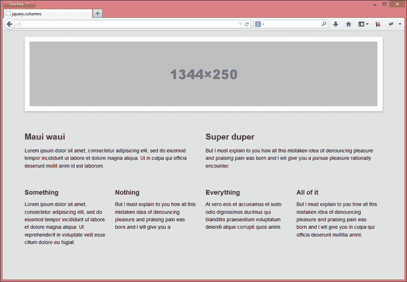

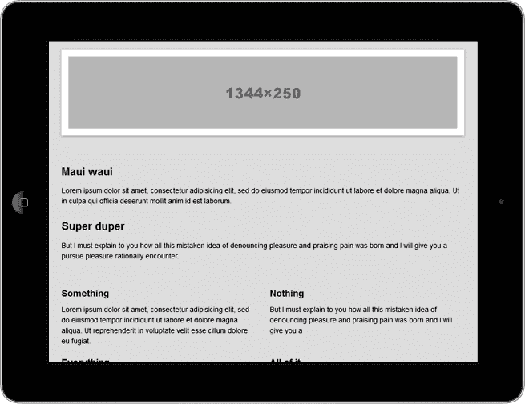

此外，该插件允许动态添加列。但是，为了反映这一变化，它需要在 DOM 上添加代码后调用代码`$.columns.refresh()`。

## 使用平衡块调整元件尺寸

将页面定制为卡片状时，加载尺寸可能不同的动态内容时会出现一个常见问题。我们想保持所有物品的外观相同。

如果我们浮动到列表项元素的左侧，则每个项的内容都会影响行的中断，而从左侧开始的第二行将开始缩进。因此，不希望出现的布局断卡问题如下所示：

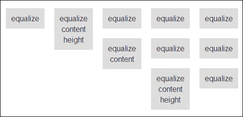

或者，如果我们为所有项目定义相同的维度，我们将丢失动态维度。类似的情况也发生在元素的宽度上。

均衡器是为均衡元素的高度或宽度而创建的。它是一个轻量级且非常有用的 jQuery 插件，只需要指定父 ID 或类即可执行。基本上，它通过计算较大元素的维度并将其定义为其他元素来工作，避免任何浮动问题。

此外，它还接受以下所有 jQuery 维度方法来调整元素的大小：`height`、`outerHeight`、`innerHeight`、`width`、`outerWidth`和`innerWidth`。最常用的是`height`，它被插件设置为默认值。

让我们尝试重现之前看到的相同示例，以查看此插件的实际运行情况。其目标是实现均衡器插件，将所有项目调整到较大元素的相同维度，并保持浮动工作响应性，没有不必要的中断。

从[下载后 https://github.com/tsvensen/equalize.js/](https://github.com/tsvensen/equalize.js/) 首先，我们将在源代码中添加以下 HTML 代码：

```js
<ul id="equalize-height">
  <li>equalize</li>
  <li>equalize content height</li>
  <li>equalize</li>
  <li>equalize</li>
  <li>equalize</li>
  <li>equalize content</li>
  <li>equalize</li>
  <li>equalize</li>
  <li>equalize content height </li>
  <li>equalize</li>
</ul>
```

然后，在 DOM 的底部（在`</body>`结束标记之前），我们需要包含 jQuery 和 Equalize 库。之后，我们将为`equalize-height`ID（`<li>`元素的父元素）执行脚本。

```js
<script src="http://code.jquery.com/jquery-1.9.1.min.js"></script>
<script src="js/equalize.min.js"></script>
<script>
$(function() {
  $('#equalize-height').equalize();
});
</script>
```

请参见下图中的预期结果：

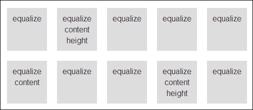

## 用 Pacery 实现卡片网站布局

Pacery 是一个 jQuery 插件，它使用一种算法来填补基于卡片的网站布局上的空白，并优雅地调整它们。基于卡片的布局趋势伴随着 Google+而来，正在吸引全世界的粉丝。

### 注

Packery plugin 拥有非商业、个人或开源的 GPLv3 许可证。如果你想在公共网站上使用它，它将花费 25 美元。

它的实现并不太困难，我们将在下面的使用示例中看到这一点。但要做到这一点，我们需要先从[下载 https://github.com/metafizzy/packery](https://github.com/metafizzy/packery) 。

让我们先创建一个空的 HTML 文件。打包的源文件包括使用 Packery 所需的所有内容。因此，在下载之后，让我们在`<head>`标记上包含建议的自定义 CSS，以便更好地处理卡片尺寸：

```js
<style>
img {max-width: 100%; height: auto;}
@media screen and (min-width: 1024px) and (max-width: 1280px) {
  /* DESKTOP - 4 columns */
  #container > div { width: 25%; }
  #container > div.w2 { width: 50%; }
  #container > div.w4 { width: 100%; }
}
@media screen and (min-width: 768px) and (max-width: 1023px) { 
  /* TABLET - 3 columns */
  #container > div { width: 33%; }
  #container > div.w2 { width: 66%; }
  #container > div.w4 { width: 100%; }
}
@media screen and (max-width: 767px) {
  /* SMARTPHONE - 1 column */
  #container > div { width: 100%; }
}
</style>
```

之后，让我们使用这个`HTML`代码，其中每个项目代表一张卡片：

```js
<div id="container" class="js-packery">
  <div class="w4"></div>
  <div class="w2"></div>
  <div></div>
  <div></div>
  <div></div>
  <div></div>
  <div class="w2"></div>
  <div></div>
  <div></div>
</div>
```

在 DOM 的底部（在`</body>`结束标记之前），我们需要包括 jQuery 和 packer 库。此外，我们将初始化 Packery 脚本，通知容器 ID、用于将被重新定位的子元素的类以及所需的列（或槽）之间的空间。

```js
<script src="http://code.jquery.com/jquery-1.9.1.min.js"></script>
<script src="js/packery.pkgd.min.js"></script>
<script>
var $container = $('#container');
$container.packery({
  itemSelector: '#container > div',
  gutter: 0
});
</script>
```

这是平板电脑和台式机的视觉效果：

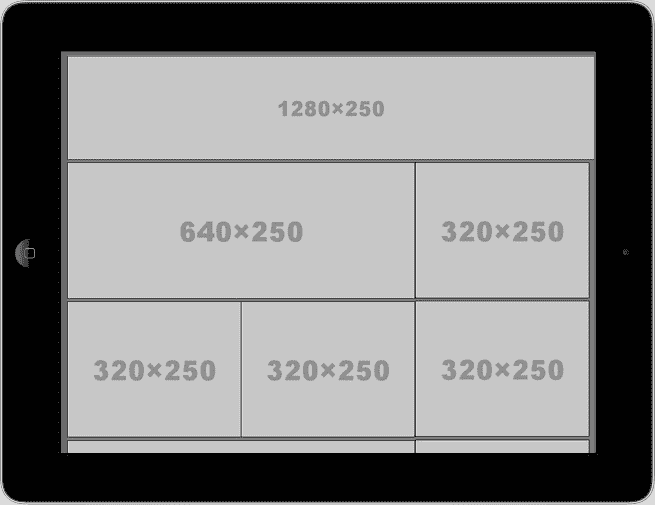

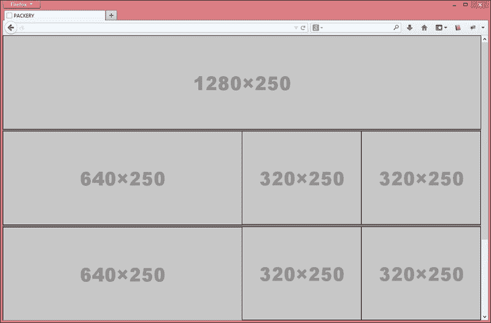

# 菜单导航插件

在[第三章](03.html "Chapter 3. Building Responsive Navigation Menu")*构建响应式导航菜单*中，我们看到了八种不同的流行菜单技术，每种技术都有自己的用途。不幸的是，没有一个“万事通”菜单在所有情况下都能很好地工作。

为了始终与进步的用户体验保持一致，我们必须研究如何将我们的网站作为一种产品进行改进，这通常是通过使用新的 JavaScript/jQuery 插件来实现的。

我们将看到三个互补的插件，如果与我们已经看到的插件相比，它们在方法上会带来微小的差异。它们是 Sidr、轻松响应手风琴和 FlexNav。

## 使用 Sidr 创建侧菜单

Sidr 是一个 jQuery 插件，用于创建侧菜单，这在响应性网站上非常常见。它还允许多个 Sidr 菜单（两侧），并可与外部内容一起使用。

让我们尝试通过创建一个标准 HTML 文件并添加插件中包含的 CSS 文件来实现以下示例，该文件可以从[下载 https://github.com/artberri/sidr](https://github.com/artberri/sidr) 。我们将找到两个选项以暗（`jquery.sid``r.dark.css`）和亮的方式（`jquery.sidr.light.css`显示菜单。我们可以使用或扩展它们来覆盖某些样式。

因此，在`<head>`标记上包含其中一个后，我们可以设置初始样式，在大于 767 像素的屏幕上隐藏菜单标题。

```js
<link rel="stylesheet" href="css/jquery.sidr.light.css">
<style>
  #mobile-header {
    display: none;
  }
  @media only screen and (max-width: 767px){
    #mobile-header {
      display: block;
    }
  }
</style>
```

现在，让我们使用此 HTML 代码作为示例来说明插件的用法：

```js
<div id="mobile-header">
  <a id="responsive-menu-button" href="#sidr-main">Menu</a>
</div>
<div id="navigation">
  <nav>
    <ul class="nav-bar"> 
      <li><a href="#">Menu item1</a></li>
      <li><a href="#">Menu item2</a></li>
      <li><a href="#">Menu item3</a></li>
      <li><a href="#">Menu item4</a></li>
      <li><a href="#">Menu item5</a></li>
      <li><a href="#">Menu item6</a></li>
    </ul>
  </nav>
</div>
```

在 DOM 的底部（在`</body>`结束标记之前），我们需要包含 jQuery 和 Sidr 库。之后，我们将使用负责打开侧菜单的菜单按钮绑定 Sidr 的执行。

```js
<script src="http://code.jquery.com/jquery-1.9.1.min.js"></script>
<script src="js/jquery.sidr.js"></script>
<script>
$('#responsive-menu-button').sidr({
  name:   'sidr-main',
  source: '#navigation'
});
</script>
```

我们定义的`#sidr-main`ID 将是侧边栏菜单`<div>`的 ID，`#navigation`是我们选择显示在此侧边栏内的菜单的 ID。

在下面的屏幕截图中，我们将看到此实现的结果。点击**菜单**链接后，灯光主题菜单将出现在小于 767 像素的屏幕上（该值由我们定制）：

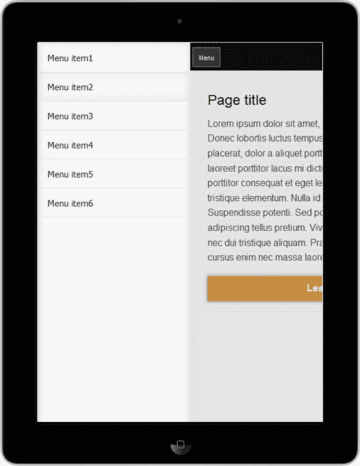

## 了解手风琴的简易响应功能

EasyResponsiveTabstoAccordion 是一个轻量级 jQuery 插件，它优化了 accordion 的普通、水平或垂直选项卡，尤其是在平板电脑和智能手机等小型设备上显示时。

这个插件的目标是根据屏幕大小调整元素。此外，它还通过先显示第一个选项卡的内容，然后再显示其他选项卡的内容来确定内容阅读的优先级。在这个插件上实现的效果完全是通过使用 jQuery 实现的，这有助于提供跨浏览器兼容性。

了解它如何工作的更好方法是通过实践。从[下载后 https://github.com/samsono/Easy-Responsive-Tabs-to-Accordion/](https://github.com/samsono/Easy-Responsive-Tabs-to-Accordion/) ，让我们创建一个标准 HTML 文档，并将 CSS 文件添加到`<head>`标记中：

```js
<link rel="stylesheet" href="css/responsive-tabs.css">
```

现在，我们将使用以下 HTML 代码作为选项卡内容的示例：

```js
<div id="mytab">          
  <ul class="resp-tabs-list">
    <li>Tab-1</li>
    <li>Tab-2</li>
    <li>Tab-3</li>
  </ul> 
  <div class="resp-tabs-container">                  
    <div>Lorem ipsum dolor sit amet…</div>
    <div>Integer laoreet placerat suscipit…</div>
    <div>Nam porta cursus lectus…</div>
  </div>
</div>
```

然后，在 DOM 的底部（在`</body>`结束标记之前），我们需要包括`jquery`和`easyResponsiveTabs`库。之后，我们将通过通知容器元素的 ID 来执行脚本：

```js
<script src="http://code.jquery.com/jquery-1.9.1.min.js"></script>
<script src="js/easyResponsiveTabs.js"></script>
<script>
$(document).ready(function () {
  $('#mytab').easyResponsiveTabs({
    type: 'default', //Types: default, vertical, accordion
    width: 'auto',
    fit: true,
    closed: 'accordion',
    activate: function(event) {
      // Callback function if tab is switched if need
    }
  });
});
</script>
```

这是插件在智能手机上观看时的视觉效果，屏幕尺寸超过 768 像素：

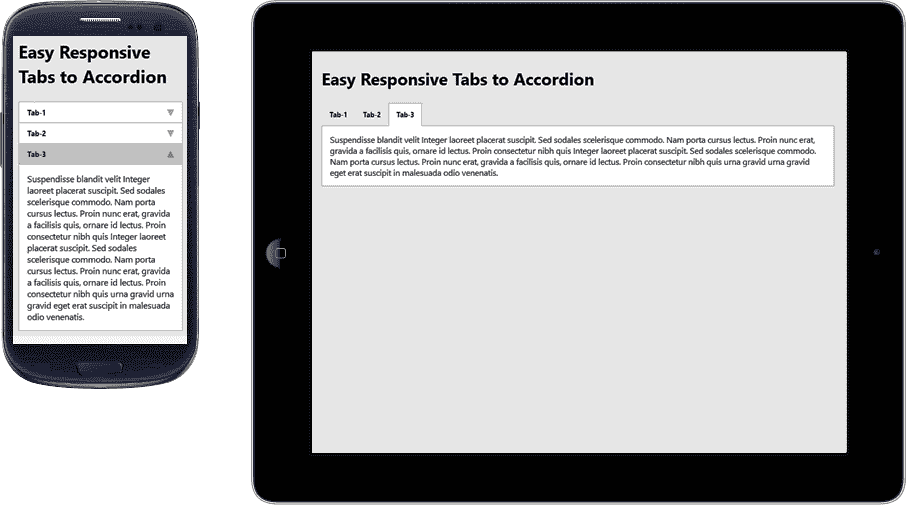

执行脚本时会通知一些可选参数，例如：

*   `type: 'default'`：可设置为`default`、`vertical`、`accordion`
*   `width: 'auto'`：可设置为`auto`或任意自定义宽度
*   `fit: true`：它有助于将整个东西装入一个容器中
*   `closed: false`：启动时关闭面板
*   `activate: function(){}`：它是一个回调函数，包含一些自定义代码，当选项卡更改时会触发这些代码

## 使用 FlexNav 为菜单增加灵活性

FlexNav 是一个 jQuery 插件，它可以方便地创建复杂且响应迅速的导航菜单，而无需编写多行代码。它采用了移动优先的方法，只需点击目标屏幕，即可显示触摸屏的子菜单。

除了以与设备无关的方式控制这些嵌套子项外，该插件还通过键盘选项卡改进了支持导航的可访问性，并为旧浏览器提供了一个后备功能。

对于它的实现，您可以从[找到可下载的文件 https://github.com/indyplanets/flexnav](https://github.com/indyplanets/flexnav) 。从标准 HTML 文档开始，有必要将此代码添加到代码的`<head>`标记中，包括 CSS 文件：

```js
<link href="css/flexnav.css" rel="stylesheet" type="text/css" />
```

现在，我们将在一个简单的无序列表中包含以下 HTML 代码，并添加类和数据属性：

```js
<ul class="flexnav" data-breakpoint="800">
  <li><a href="#">Item 1</a></li>
  <li><a href="#">Item 2</a>
    <ul>
      <li><a href="#">Sub 1 Item 1</a></li>
      <li><a href="#">Sub 1 Item 2</a></li>
    </ul>
  </li>
  <li><a href="#">Item 3</a>
    <ul>
      <li><a href="#">Sub 1 Item 1</a></li>
      <li><a href="#">Sub 1 Item 2</a></li>
      <li><a href="#">Sub 1 Item 3</a></li>
    </ul>
  </li>
</ul>
<div class="menu-button">Menu</div>
```

然后，在 DOM 的底部（在`</body>`结束标记之前），我们将包括 jQuery 和 FlexNav 库。之后，我们将通过通知要转换为响应的菜单元素的 ID 或类来执行脚本。

```js
<script src="http://code.jquery.com/jquery-1.9.1.min.js"></script>
<script src="js/jquery.flexnav.min.js"></script>
<script>
$(".flexnav").flexNav();
</script>
```

这是一个可视的示例，展示了如果在智能手机和平板电脑上观看，该插件可能提供的功能：

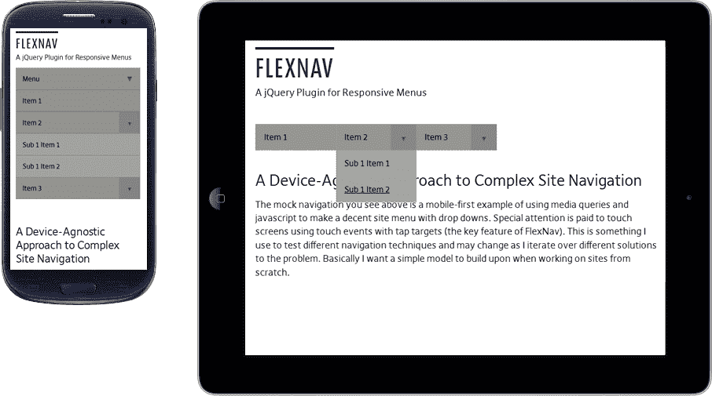

当我们执行脚本时，还可以通知插件一些选项，例如：

*   `'animationSpeed':'250'`：设置动画的速度，也可以接受快/慢
*   `'transitionOpacity': true`：指定默认不透明度动画
*   `'buttonSelector': '.menu-button'`：指定默认的菜单按钮类
*   `'hoverIntent': false`：仅用于 hoverIntent 插件
*   `'hoverIntentTimeout': 150`：仅用于 hoverIntent 插件

例如：

```js
<script>
$(".flexnav").flexNav({
  'buttonSelector': '.exclusive-button'
});
</script>
```

# 杂项

我们将看到，没有特定的类别来重新组合下面的插件。它们是 SVGeezy、无前缀、放大弹出窗口、Riloadr 和 Calendario。

## 斯维吉

SVGeezy 是一个 JavaScript 插件，用于处理 IE8 及更早版本和 Android 2.3 及更早版本等浏览器的 SVG 图像。它的工作非常简单，因为它只检测我们网站上的 SVG 图像，并自动搜索另一个图像（例如 PNG 格式）作为它的后备。

回退映像必须具有相同的文件名。更改仅涉及文件格式。此外，它不必是 PNG 文件。初始化脚本时可以指定此格式。

如果您需要对这些旧浏览器的支持，我们将了解如何做到这一点。首先，让我们从[访问并下载解决方案 https://github.com/benhowdle89/svgeezy](https://github.com/benhowdle89/svgeezy) 。

然后，创建一个新的标准 HTML 文档，并在``标记中添加 SVG 图像，如下所示：

```js

```

稍后，在 DOM 的底部（在`</body>`结束标记之前），我们将包括 jQuery 和 SVGeezy 库。然后，我们将通过通知两个参数来执行插件：

*   第一个定义了一个类名，如果我们没有 SVG 回退映像或者只是不想为特定映像提供回退，那么可以使用该类名。
*   第二种方式是，如果浏览器不支持 SVG 图像的显示，将提供图像的扩展。PNG 扩展是最常见的。

```js
<script src="js/svgeezy.js"></script>
<script>
svgeezy.init('nocheck', 'png');
</script>
```

### 注

我们还可以将`nocheck`更改为`false`，让插件检查所有图像。

## 无前缀

Prefix free 为我们提供了只使用未固定 CSS 属性的便利；该插件仅在必要时将当前浏览器的前缀添加到后台服务中的任何 CSS 代码中。为了让前缀独立编码，我们不需要再记住哪些属性需要前缀，也可以避免以后只为了删除或添加新前缀而重构代码。

### 注

这个插件不一定是响应性的，但因为它的目标是为现代浏览器提供更多的可访问性，防止使用旧的前缀，并且在需要时不要忘记使用它们。

开始使用它并不难。首先我们从[下载 https://github.com/LeaVerou/prefixfree](https://github.com/LeaVerou/prefixfree) 。

在本例中，让我们重复使用您已经拥有的一些 HTML，并在 DOM 的`<head>`标记中包含`prefixfree.js`（就在 CSS 文件之后）：

```js
<script src="js/prefixfree.js"></script>
```

### 提示

该插件建议在标题中包含这一点，以最小化发生的闪烁效应（也称为 FOUC 效应）。

这是前后的比较，我们可能会注意到我们保存了多少行代码。

这是我们通常编写代码的方式：

```js
#element {
  margin: 0;
  -webkit-box-shadow: 1px 2px 3px #999;
  box-shadow: 1px 2px 3px #999;
  border-radius: 10px;

  -webkit-transition: all 1s;
  -moz-transition: all 1s;
  -o-transition: all 1s;
  -ms-transition: all 1s;
  transition: all 1s;

  background: -webkit-linear-gradient(to top, orange 50%, #eee 70%);
  background: -moz-linear-gradient(to top, orange 50%, #eee 70%);
  background: -o-linear-gradient(to top, orange 50%, #eee 70%);
  background: -ms-linear-gradient(to top, orange 50%, #eee 70%);
  background: linear-gradient(to top, orange 50%, #eee 70%);
}
```

这一个展示了，当使用无前缀时，我们如何编写相同的跨浏览器代码：

```js
#element {
  margin: 0;
  box-shadow: 1px 2px 3px #999;
  border-radius: 10px;
  transition: all 1s;
  background: linear-gradient(to top, orange 50%, #eee 70%);
}
```

我们保存了许多行代码。难以置信，不是吗？在您的文档上试用它并检查其优点。

## 放大弹出窗口

放大弹出是一个 jQuery 插件，用于创建具有多种用途的响应弹出窗口，例如：

*   覆盖窗口中显示的单个图像/图像库
*   弹出视频或地图
*   模态弹出窗口
*   CSS 动画对话框

它注重性能，并为用户提供使用任何设备的最佳体验。关于 InternetExplorer 浏览器，放大弹出窗口与版本 8 和更早版本兼容。通过提供可从[下载的轻量级模块化解决方案实现 http://dimsemenov.com/plugins/magnific-popup/](http://dimsemenov.com/plugins/magnific-popup/) 点击**构建工具**链接。

使用 CSS3 转换代替 JavaScript 动画可以显著提高动画的性能。此外，该插件还具有一种可扩展的微模板引擎，当使用相同的弹出窗口模式（例如，图像库）时，该引擎可重新使用负责加速弹出窗口加载的现有元素。

让我们试着通过实践来做这个例子。我们将首先创建一个新的标准 HTML 文档。从[下载解决方案后 https://github.com/dimsemenov/Magnific-Popup](https://github.com/dimsemenov/Magnific-Popup) ，让我们在`<head>`标记中添加 CSS 文件。此文件的工作不需要此文件，但其内部有一些有用的样式，可以获得良好的效果：

```js
<link rel="stylesheet" href="css/magnific-popup.css">
```

现在，我们将在显示简单图像弹出窗口和另一个视频弹出窗口的代码上添加这两个链接。

```js
<p><a class="image-link" href="image-sample.jpg">Open popup</a></p>
<p><a class="popup-youtube" href="http://www.youtube.com/watch?v=0O2aH4XLbto">Open video</a></p>
```

然后，在 DOM 的底部（在`</body>`结束标记之前），我们需要包括`jquery`和`magnificPopup`库。之后，我们将执行两次脚本，并为每个目的通知类（我们之前指定了一个链接）：

```js
<script src="http://code.jquery.com/jquery-1.9.1.min.js"></script>
<script src="js/jquery.magnific-popup.min.js"></script>
<script>
$(document).ready(function() {
  $('.image-link').magnificPopup({type:'image'});
  $('.popup-youtube').magnificPopup({
    type: 'iframe',
    mainClass: 'mfp-fade'
  });
});
</script>
```

以下是在智能手机和平板电脑上查看的简单图像弹出实现的视觉效果：


有许多使用类型，可以在[的插件文档中详细查看 http://dimsemenov.com/plugins/magnific-popup/documentation.html](http://dimsemenov.com/plugins/magnific-popup/documentation.html) 。

## 装载机

Riloadr 是一个用于图像加载程序的响应插件。在本节中，我们将看到它是如何与 jQuery 一起工作的，虽然它不是必需的，因为它是独立于框架的。

此插件是一种替代解决方案，可在响应版面中提供上下文图像，这些版面使用不同分辨率的不同图像大小，以提高页面加载时间和用户体验。

Riloadr 使用图像标记元素中的`data-src`和`data-base`属性，而不是常用的`src`属性。因此，通过这种方式，我们能够处理图像元素，在浏览器呈现网站之前选择要显示的最佳图像。

有一些突出的功能使其区别于其他竞争对手，例如：

*   图像加载过程的绝对控制
*   可以使用 CSS 属性设置无限断点，例如，`minWidth`、`maxWidth`和`minDevicePixelRatio`
*   Riloadr 不会对同一图像发出多个请求
*   您可以创建不同的 Riloadr 对象（命名组），并根据需要配置每个对象
*   带宽测试，仅当设备的连接速度足以下载时，才提供高分辨率图像

从[下载后 https://github.com/tubalmartin/riloadr](https://github.com/tubalmartin/riloadr) ，插件的建议是让 CSS 和 JavaScript 文件在`<head>`标签中：

```js
<script src="http://code.jquery.com/jquery-1.9.1.min.js"></script>
<script src="js/riloadr.jquery.min.js"></script>
```

加载 Riloadr 后，我们可以设置其图像组：

```js
<script>
var group1 = new Riloadr({
  breakpoints: [
    {name: '320', maxWidth: 320},
    {name: '640', maxWidth: 320, minDevicePixelRatio: 2},
    {name: '640', minWidth: 321, maxWidth: 640},
    {name: '1024', minWidth: 641}
  ]
});
</script>
```

### 注

`minDevicePixelRatio`的配置与支持高 DPI 图像并加载用于 640 像素的图像（尺寸为正常尺寸的两倍）的设备相关。

现在，我们将使用`data-src`和`data-base`在 HTML 代码中添加这个``标记。

请注意，在`data-base`上，我们将使用`{breakpoint-name}`作为 Riloadr 捕获的动态值，并在前面已经定义的断点上进行标识。此名称可用于按尺寸存储图像，而不会造成混乱：

```js
<div>
  
  <noscript>
    
  </noscript>
</div>
```

在呈现前面的代码时，浏览器将检测屏幕大小并选择合适的断点。然后，它将被我们前面定义的变量名的内容替换，在本例中为 320。如果浏览器识别出变量名的内容是 640，则会发生同样的情况，这更适合。

### 注

如果浏览器不支持 JavaScript 或发生错误，`<noscript>`标记将显示我们定义的图像。

以下屏幕截图显示 Riloadr 正在运行，仅当浏览器需要时（取决于 320 和 640 像素的断点），才会显示加载的不同尺寸的图像：

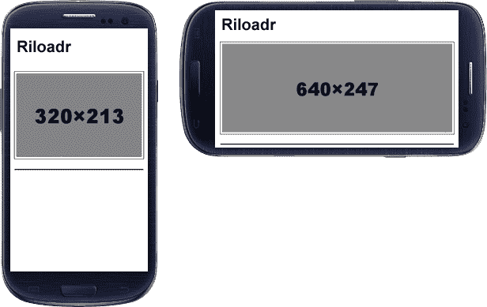

## 日历

Calendario 是一个 jQuery 响应插件，其构建目的是提供一个合适的布局，以改进用户与日历的交互，保持日历结构的流动性，以便轻松适应不同的屏幕。

在大屏幕上，它显示一个基于网格的布局，而在小屏幕上将其垂直转换为一个月中的天数堆栈，大大方便了它的可视化。

### 注

此解决方案还不能在所有浏览器上运行，因为其中一些浏览器不支持新的 CSS 属性，例如`calc()`。这些浏览器是 InternetExplorer8、OperaMini 和 Android 浏览器。

Calendario 在[上提供 https://github.com/codrops/Calendario](https://github.com/codrops/Calendario) 。

让我们从添加插件中包含的 CSS 文件开始：

```js
<link rel="stylesheet" type="text/css" href="css/calendar.css" />
<link rel="stylesheet" type="text/css" href="css/custom_1.css" />
```

现在，我们将包括这个结构化 HTML，添加类和 ID 以便以后处理 JavaScript：

```js
<div class="custom-calendar-wrap custom-calendar-full">
  <div class="custom-header clearfix">
    <h2>Calendario</h2>
    <div class="custom-month-year">
      <span id="custom-month" class="custom-month"></span>
      <span id="custom-year" class="custom-year"></span>
      <nav>
        <span id="custom-prev" class="custom-prev"></span>
        <span id="custom-next" class="custom-next"></span>
      </nav>
    </div>
  </div>
  <div id="calendar" class="fc-calendar-container"></div>
</div>
```

然后，在 DOM 的底部（在`</body>`结束标记之前），我们需要包括 jQuery 和 Calendario 库。然后，我们将通过设置容器 ID 来初始化脚本，并将创建两个有用的函数，用于在日历中进行月份导航：

```js
<script src="http://code.jquery.com/jquery-1.9.1.min.js"></script>
<script src="js/jquery.calendario.js"></script>
<script> 
$(function() {
  var cal = $('#calendar').calendario(),
    $month = $('#custom-month').html(cal.getMonthName()),
    $year = $('#custom-year').html(cal.getYear());

  $('#custom-next').on('click', function() {
    cal.gotoNextMonth( updateMonthYear );
  });
  $('#custom-prev').on('click', function() {
    cal.gotoPreviousMonth(updateMonthYear);
  } );

  function updateMonthYear() {        
    $month.html(cal.getMonthName());
    $year.html(cal.getYear());
  }
});
</script>
```

以下是在智能手机/平板电脑和台式机上查看的此日历的屏幕截图：

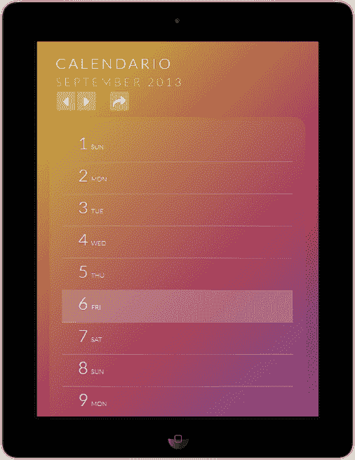

以及它在桌面上的显示方式：

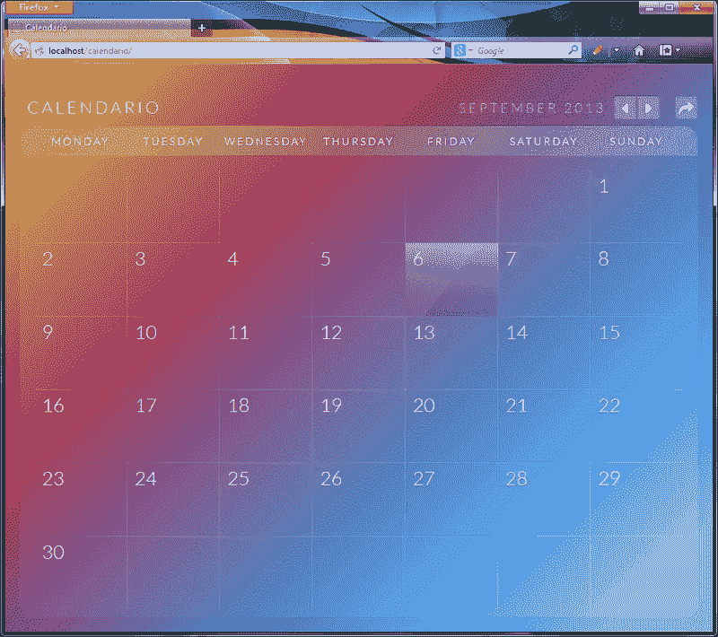

# 总结

在本章中，我们学习了由三个类别分开的补充插件，它们是对前面章节的补充。对于结构插件，我们已经学习了如何使用列来创建一个简单的响应结构，如何平衡页面上浮动元素的更好分布，以及如何使用 packer 来创建卡片布局网站。我们还学习了使用 Sidr、EasyResponsiveTabstoAccordion 和 FlexNav 显示菜单和选项卡的不同方法。在*杂项*部分，我们已经了解了如何使用 SVGeezy、无前缀、放大弹出插件、Riloadr 和 Calendario。

在最后一章中，我们将看到检测网站加载速度的不同技术。性能主题非常广泛，但由于有效地处理此指标非常重要，我们将看到一些技术来提高创建响应性网站时的性能。