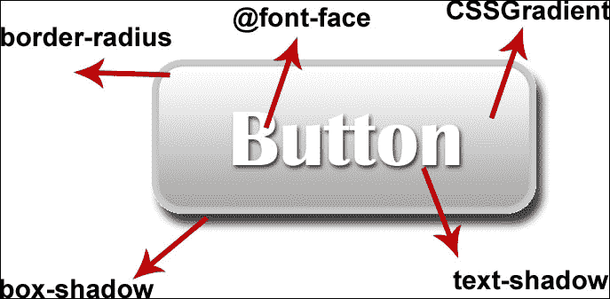
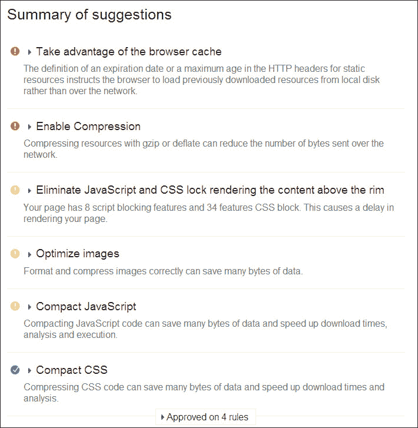
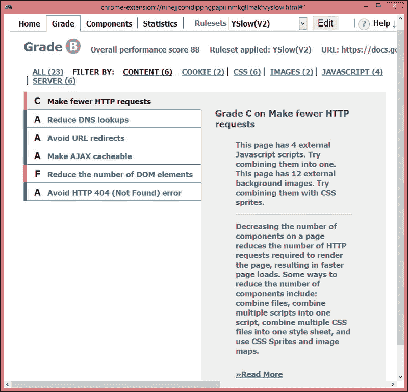
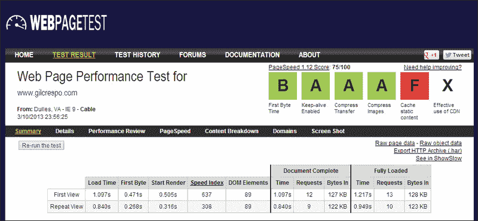
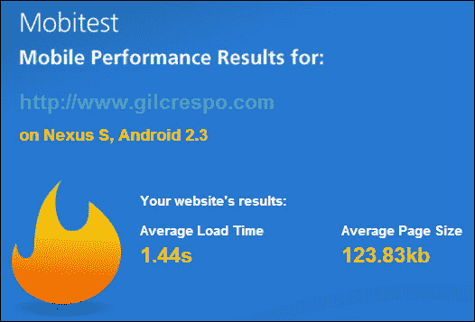
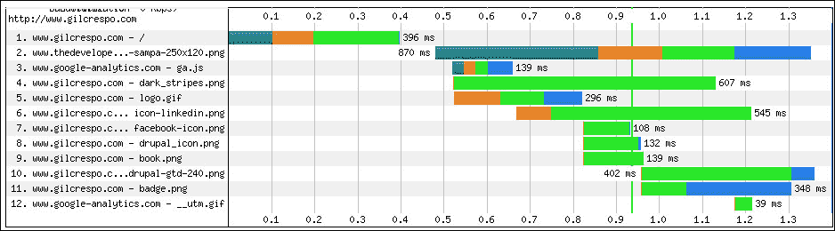

# 十二、提高网站性能

加载时间是导致页面放弃的主要因素。如果页面加载时间超过 3-4 秒，用户将转到其他地方。

对于移动设备上的用户来说，对快速加载页面的需求更为迫切，因为用户觉得加载页面的时间比在台式机上要长，而且当前大多数网站都会这样（根据 KISSmetrics 的文章*加载时间*中的数据，73%）。

大部分加载时间用于执行客户端处理和加载资源，如样式表、脚本文件和图像。

在本章中，我们将学习如何通过以下方式提高响应式网站的性能：

*   使用内容交付网络
*   减少 HTTP 请求
*   减小有效载荷的大小
*   优化客户端处理
*   使用工具检查网站性能

# 使用内容交付网络

**内容交付网络**（**CDN**）是分布在多个位置的 web 服务器的集合，从用户的角度来看，可以使页面加载更快。

选择向特定用户传送内容的服务器通常基于网络接近度，并且该内容传送在最快的响应时间内完成。此外，这会将内容缓存到浏览器中，以便下次不必再次检索内容，从而节省向服务器发出请求的时间。

使用 CDN 服务提供商有一种经济高效的方法，一些已知的服务提供商包括 Akamai Technologies、Mirror Image Internet 和 Limelight Networks。

# 减少 HTTP 请求

减少页面上包含的组件数量会减少加载网站所需的 HTTP 请求数量，并且这与每个文件的 KB 数量无关。还有一个问题是，在将文件发送回浏览器之前，处理每个请求的服务器占用每个 HTTP 连接的时间很短。

我们将看到一些技巧可以减少请求数量：

*   使用条件加载程序
*   将多个脚本组合成一个脚本
*   将多个 CSS 文件合并到一个样式表中
*   使用 CSS 精灵

## 使用条件加载程序

条件加载程序如我们在本书前面提到的 RequireJS 或 yepnope.js，将只加载所需的代码。

## 整合和缩小资源（JavaScript 和 CSS）

理想的结果是，在生产中，整个站点将有一个 CSS 文件和一个 JavaScript 文件。

解决方案是将**一堆 JavaScript 文件合并为一个文件，减少请求并加快页面首次加载速度，即使它可能无法在移动设备上高效缓存。**

**缩小**是消除多余空格、换行符、缩进和注释等不重要字符的最佳实践。根据我的个人测试，这一改进可能会将文件大小平均减少 20%。

### 提示

此值不准确，因为它取决于文件大小、空白量等。

这个组合可以很好地提高性能，主要是因为它通常在站点显示某些内容之前执行。

有几个在线工具可以执行此任务。我个人最喜欢的是 YUI 压缩机，您可以通过访问[来执行 http://refresh-sf.com/yui/](http://refresh-sf.com/yui/) 和谷歌从[缩小 https://code.google.com/p/minify/](https://code.google.com/p/minify/) 。

使用 YUI 压缩机的过程非常简单。您只需选择要合并、缩小的文件，然后单击**压缩**按钮。

## CSS 精灵

正如我们所知，使用 CSS 精灵是一种图像整合的实践，因为它涉及到将主题图像合并为一个主题图像。通过组合（背景）图像，我们可以减少图像文件的总体大小，从而减少向服务器发出的 HTTP 请求的数量。

### 提示

如果使用 Photoshop 创建图像精灵，创建这些精灵后，请保存 PSD 源文件以进行进一步更改。稍后，如果您想在这个图像精灵中包含新图标，请向下扩展和/或右键单击该图像的空白区域。

以下是一个谷歌图像精灵的示例：

有两个在线的 To.t0t 工具，我认为我最喜欢的是创建精灵图像：针法。http://draeton.github.io/stitches/ 和雪碧牛（[http://www.spritecow.com/](http://www.spritecow.com/) ）。

### 如何使用 SpriteCow 创建精灵

此工具生成初始 CSS 代码，您需要稍后将其放入 CSS 文件中。

首先，您需要创建包含所有按钮和图标的图像（如前一张图像所示）。然后，在[http://www.spritecow.com/](http://www.spritecow.com/) ，有一个名为**打开图像**的按钮，可以上传精灵。

然后点击**选择精灵**工具，点击要定制的图标，制作一个方形包装。如果您的选择不太接近图标，请不要担心，因为有一个自动调整可以改进此选择。试试你自己！

# 减少有效载荷的大小

删除额外的 HTTP 请求后，是时候尽可能减少剩余文件的大小了。这不仅使您的页面加载更快，而且有助于节省带宽消耗。

最小化动态和静态资源的有效负载大小可以显著减少网络延迟。

我们将介绍一些实现这一点的实践，如渐进式 JPEG、自适应图像、图像优化以及更好地使用 HTML5 和 CSS3。

## 渐进式 JPEG

渐进式 JPEG 并不新鲜。这被认为是最佳做法之一。然而，随着互联网速度的提高，这一特性在一段时间内变得不明显。但现在，由于移动设备的带宽有限，这种做法再次浮出水面。

以下屏幕截图显示了将普通 JPEG 图像保存为基线与使用渐进式选项之间的差异：

就大小而言，与普通 JPEG 图像相比，渐进式图像在中等图像中的大小增加了约 10%。加载时间几乎相同或多出几毫秒。

但是，与自适应图像相比，渐进式 JPEG 的预览效果使其在浏览者感知上的加载速度更快。

在移动设备上，加载不必要的高分辨率图像是对带宽、处理时间和缓存空间的巨大浪费。要加快页面呈现速度并减少带宽和内存消耗，请使用较小的版本替换图像。

但是，正如我们在[第 5 章](05.html "Chapter 5. Preparing Images and Videos")*准备图像和视频*中了解到的，强烈建议使用 Foresight 或 Picturefill 等解决方案，因为它们首先检查请求设备是什么，然后才允许浏览器下载任何图像。

## 图像优化

图像通常包含一定数量的无用数据，也可以在保持质量的同时安全地删除这些数据。图像优化有两种方法：无损压缩和有损压缩。

无损压缩可以删除额外的信息，例如嵌入的缩略图、数据中的注释、有关照片的元数据、相机型号、ISO 速度、闪光灯是开还是关、镜头类型和焦距，并且可以节省 5%到 20%的文件大小。

优化图像的过程非常简单，因为它只需要选择要更改的图像。

网上有很多工具可以实现这一点。就我个人而言，我更喜欢使用脱机工具来删除此信息，因为它为图像的合法权利提供了更多的安全性。

对于 PNG 图像，我推荐 PngGauntlet（[http://pnggauntlet.com](http://pnggauntlet.com) ；对于 Mac，Imageoptim（[http://imageoptim.com](http://imageoptim.com) ）。

Imageoptim 也适用于 JPEG，但对于 Windows，我们可以使用 RIOT（[http://luci.criosweb.ro/riot/](http://luci.criosweb.ro/riot/) 优化 JPEG 图像，几乎与 Imageoptim 一样好。但是，如果图像看起来太大，例如高分辨率图片，最好的选择是 JPEGmini 工具（[http://www.jpegmini.com/](http://www.jpegmini.com/) ）。

## 使用 HTML5 和 CSS3 简化页面

HTML5 规范包括新的结构元素，如`header`、`nav`、`article`和`footer`。使用这些语义元素比使用泛型嵌套的`div`和`span`标记生成更简单、更高效的解析页面。

当使用 CSS3 功能时，几乎会发生同样的情况，这些功能可以通过为视觉元素（如渐变、圆形边框、阴影、动画和过渡）提供动态艺术品支持来帮助创建轻量级页面。正如我们所知，在 CSS3 之前，上述每个效果都需要一个图形图像来表示，并且需要加载多个图像。考虑下面的例子：

# 测试网站性能

我们将看到两个浏览器工具 PageSpeed Insights 和 YSlow，它们专注于分析网页，并根据一套非常专业且不断发展的高性能网页规则，提出提高其性能的方法。

另外，有两个在线工具，我建议使用它们运行简单测试或执行高级测试，包括多步骤事务、视频捕获、内容阻止，以及更多的 WebGetTest 和 Mobitest。

### 提示

测试网站性能是保持网站快速运行的关键；虽然这不在本书的范围之内，但如果您想进一步探索，您可以参考*桑吉夫·贾斯瓦尔*的*即时页面速度优化*、*帕克特出版社*或*史蒂夫·桑德斯*的*甚至更快的网站*、*奥雷利传媒*，了解更多信息。

## 页面速度洞察

PageSpeed Insights 是谷歌为帮助开发者优化网站性能而开发的在线工具。它评估页面是否符合涵盖一般前端最佳实践的许多不同规则。

PageSpeed Insights 提供了一些提示和建议，描述了我们如何最好地实现这些规则，并将其纳入我们的开发过程。

您可以通过访问网站[尝试自己使用此工具 http://developers.google.com/speed/pagespeed/insights/](http://developers.google.com/speed/pagespeed/insights/) 。

您可以在以下屏幕截图中注意到，显示的每个通知都有一个摘要内容，可以展开以获取更多详细信息，并链接以获取更多信息：

## YSlow

YSlow 是雅虎开发的浏览器插件！并且还专注于分析网页，并提出改进其性能的方法。它的一些特点如下：

*   根据预定义的规则集或用户定义的规则集对 web 页面进行分级
*   建议如何提高页面性能，并详细解释原因
*   总结页面的组件，便于更快地搜索关键问题
*   显示页面的总体统计信息
*   提供用于性能分析的工具，包括 Smush.it™ （用于图像优化的在线工具）和 JSLint（一种在脚本中查找常见错误的代码检查器）

插件的网站，可从[访问 http://developer.yahoo.com/yslow/](http://developer.yahoo.com/yslow/) 显示一个表格，其中包含最佳实践的每个规则的默认权重，以便我们可以优先考虑关键问题（[http://yslow.org/faq/#faq_grading](http://yslow.org/faq/#faq_grading) ）。

让我们看看它的接口，以及如何为我们描述每个规则。通常，在开始修复之前，只有关于规则的小说明（如以下屏幕截图所示）足以让我们理解：

## 网页测试

WebGetest 是一个工具，最初由 AOL 开发，但现在由谷歌支持。我们可以通过访问[来使用它 http://www.webpagetest.org/](http://www.webpagetest.org/) 并运行简单测试或执行高级测试，包括多步骤事务、视频捕获和内容阻止。

丰富的诊断信息包括资源加载瀑布图、页面速度优化检查、，并给出了在我们输入网站 URL 后可能实现的改进建议。然后，我们将通知要测试的站点、要测试的区域设置以及要使用的浏览器。以下截图显示了 WebGetTest 的测试结果：

## 移动测试

Mobitest 是一个很棒的工具，它模拟真实的移动设备加载网站，捕获页面大小、总加载时间和其他与性能相关的统计数据。虽然它是一个很好的检查工具，但它不能替代你从有限带宽的手机连接中获得的真实统计数据。

访问[后，只有一个步骤可以运行性能测试 http://mobitest.akamai.com/](http://mobitest.akamai.com/) ，输入网站 URL，选择其中一个设备/位置选项，然后提交。

有时，完成报告需要很长时间，因此该工具取决于队列中我们前面的测试数量。

以下是生成报告的示例：

虽然这个网站是轻量级的，但它仍然有可以实现的改进。让我们看看生成的加载活动流程图（名为瀑布图）表明了什么：

Mobitest 提供的瀑布图（带水平条的图像）演示了一步一步地请求、服务器处理和返回的每个资源。

因此，在第二行中，加载另一个网站上托管的静态图像需要很长时间，可以通过添加`expires`头并使用 CDN 来改进。

# 总结

在本章中，我们学习了一些最佳实践，例如使用 CDN 改进内容交付和缓存静态图像，通过使用条件加载、文件整合、CSS 精灵减少 HTTP 请求，通过优化图像减少有效负载大小，将 JPEG 图像保存为渐进式，以及使用 HTML5 和 CSS3 简化页面结构。此外，我们还学习了如何使用 PageSpeed、YSlow、WebGetTest 和 Mobitest 等工具进行性能测试。