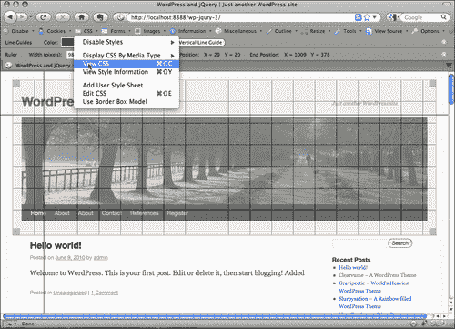
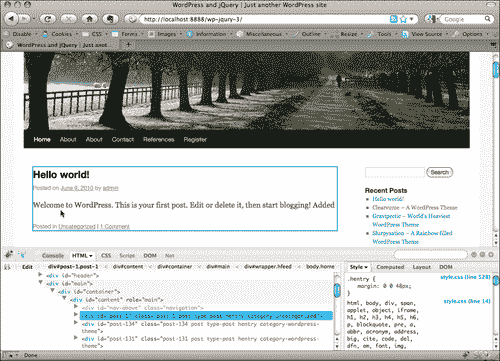
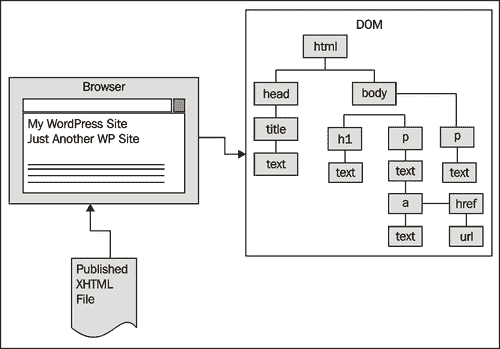
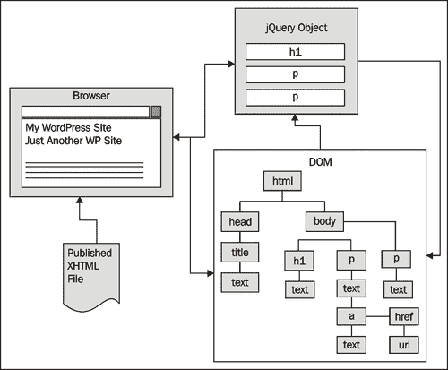
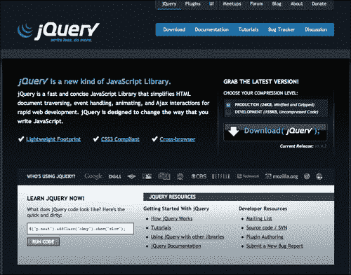
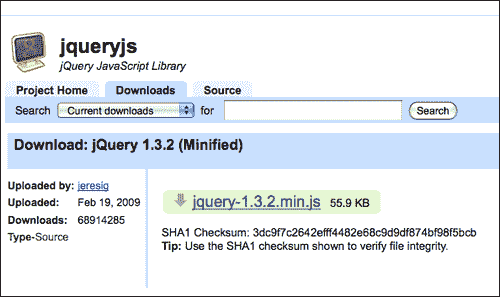
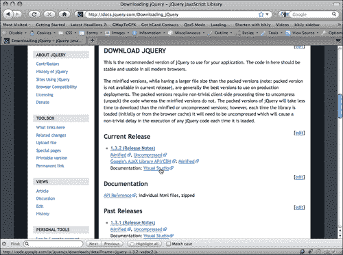
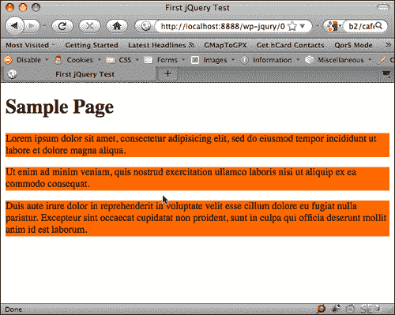
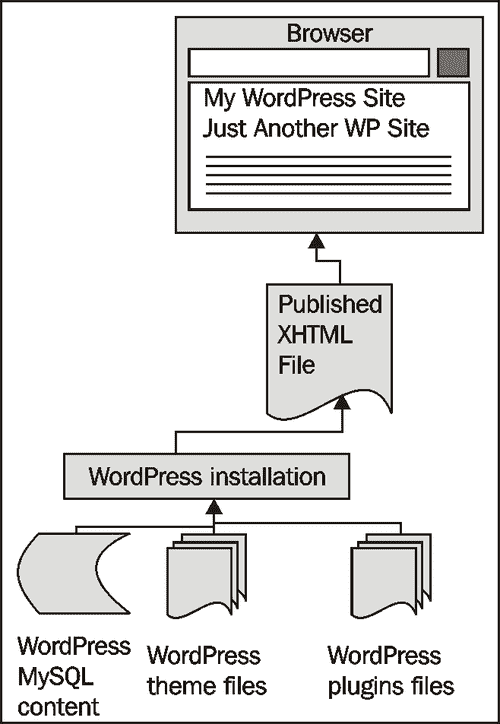
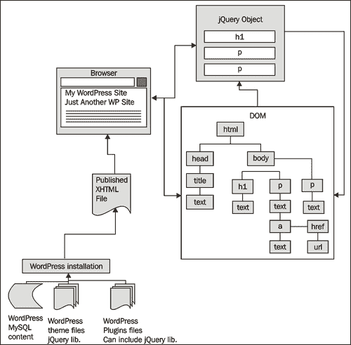

# 一、入门：WordPress 和 jQuery

欢迎来到 WordPress 和 jQuery。WordPress 基于 web 的发布平台和 jQuery 的 JavaScript 库是当今 web 上使用的两个最强大的工具。将这些工具结合在一起可以使网站的功能和灵活性加倍。这两种技术都简单易学，创造了网络魔术的秘诀。我希望您已经准备好学习 jQuery 如何改善 WordPress 开发体验，从而获得一些有趣的见解。

在本章中，我们将介绍以下主题：

*   这本书的方法，核心 JavaScript 语言和 WordPress 技能，你应该了解，以便从中获得最大的优势
*   启动和运行项目所需的基本软件工具
*   jQuery 和 WordPress 的基本概述

如果以下任何一节中的任何内容让您感到困惑，您可能需要更多的背景信息和理解，然后才能继续阅读本标题。不过不用担心，我会向您介绍一些优秀的资源，以获取更多信息。

# 这本书的方法

本标题向您介绍了将 jQuery 与 WordPress 结合使用的要点和最佳实践。它不是 JavaScript 和 PHP 编程的入门，也不是使用带有 HTML 标记的 CSS 的入门。我假设你是 WordPress 网站开发者和/或 WordPress 主题设计师。也许你只是一个花了足够多时间管理和修补 WordPress 网站的人，你可能符合上述条件之一或两者兼而有之。不管你如何给自己贴标签，你都会使用 WordPress。WordPress 帮助您或您的客户快速、简单地获取内容，您总是在寻找更多、更快、更轻松的方法。

jQuery 是一个库，它加快了编写自定义 Javascript 的时间并减少了复杂性。我相信你一定知道 Javascript 在很多方面对网站都很有用。他们还可以使用非常酷的功能来启用它。虽然我将尽可能深入地介绍 jQuery，但我们不会将 jQuery 视为大多数其他书籍所强调的“大事件”，即 JavaScript 库实体。相反，我们将考虑将 jQuery 作为一个伟大的工具，它可以帮助我们使用 WordPress 更轻松地完成更多的工作（是的，“使用更少的”代码）。

总而言之：那么，你是 WordPress 的用户、开发人员还是设计师？伟大的让我们看看这个名为 jQuery 的“工具”。这将使你的 WordPress 开发变得更容易，而且看起来可能会更好。准备好开始了吗？

# 你需要了解的核心基础知识

正如我提到的，本书面向 WordPress 用户、视觉主题设计师和希望通过使用 jQuery 学习 WordPress 做更多工作的开发人员。我试着写这个标题，这样就不需要客户端和服务器端脚本编写或编程经验。不过，您至少会看到，对给定主题的一般熟悉会有所帮助。

无论您的 web 开发技能集或水平如何，您都将获得清晰、逐步的指导。让我们回顾一下您需要熟悉的 web 开发技能和 WordPress 诀窍，以便从本书中获得最大收益。同样，如果您觉得需要更多的背景知识，我也会为您指出一些好的资源。

## WordPress

首先，您应该已经熟悉最新、最稳定的 WordPress 版本。您应该了解在 web 服务器或本地机器上安装和运行 WordPress 的基础知识（尤其是当您需要安装来修补本书中的示例时）。不用担心，我会为你指出一个正确的方向，在你的 Mac 或 PC 上安装 WordPress。另外，许多主机提供商提供简单的一键安装。你必须向你的主机提供商查询，看看他们是否提供 WordPress。我还将向您介绍 WordPress 安装的其他一些优秀资源。启动并运行 WordPress 通常是使用 WordPress 最简单的部分。

再深入一点，你最好了解一下 WordPress 管理面板。您需要熟悉向 WordPress 发布系统添加内容以及文章、类别、静态页面和子页面的工作方式。您还需要了解如何使用**媒体**上传工具向帖子和页面添加图像，以及如何创建图库。最后，了解安装和使用不同主题和插件的基础知识也会有所帮助，尽管我们将在本篇文章中有所介绍。

即使你将与一位技术性更强的 WordPress 管理员合作，你也应该对你正在开发的 WordPress 站点有一个大致的了解，以及该项目需要哪些（如果有的话）主题、附加插件或小部件。如果你的网站确实需要一个特定的主题或其他插件和小部件，你会希望这些安装方便和/或已经安装在你的 WordPress 开发安装中（或**sandbox**——一个可以测试和玩的地方，而不会弄乱现场）。

### 注

**这本书使用什么版本的 WordPress？**

本书重点介绍了版本 2.8、2.9 和 3.0RC 中引入的新特性（本书撰写时的候选版本）。本书涵盖的所有内容都在 WordPress 2.9.2 和 3.0 RC 中进行了测试和检查。虽然本书的案例研究是使用版本 2.9.2 和 3.0 RC 开发的，但任何较新版本的 WordPress 都应该具有相同的核心功能，使您能够使用这些技术通过 jQuery for it 增强主题和插件。每个新版本的 WordPress 的错误修复和新功能都记录在[中 http://WordPress.org](http://WordPress.org) 。

如果您对 WordPress 完全陌生，那么我建议您阅读由*April Hodge Silver*和*Hasin Hayder*编写的**WordPress 2.7 Complete**。

## 基础编程

了解任何客户端或服务器端语言的编程都会对您有所帮助，无论您使用什么语言 JavaScript、VBScript、.NET、ASP、PHP、Python、Java、Ruby。如果您熟悉这些语言中的任何一种，或者至少了解其中的任何一种，您都会做得很好。当然，以下特定语言确实会有所帮助。

### JavaScript 和 AJAX 技术

好的，你绝对不需要有任何 AJAX 方面的经验。但是，如果您对 JavaScript 稍有了解（这是“AJAX”中的“J”），您就有了一个很好的开始。特别是，您应该能够理解如何识别 JavaScript 语句的整体语法和结构。例如：JavaScript 中的变量是什么样子，以及如何使用“`{ }`”（花括号）设置**函数**或**条件**的**块**。您还需要知道如何正确地用“；”（分号）结束一行 JavaScript 代码。同样，您不需要直接的经验，但是您应该能够轻松地查看 JavaScript 代码块并理解它是如何设置的。

例如，让我们快速查看下面的代码示例，其中包含解释性注释：

```js
<script type="text/javascript"> /*this is an XHTML script tag with the type attribute set to define javascript*/
/*
This is a multi-line Comment.
You can use multi-line comments like this to add instructions or notes about your code.
*/
//This is a single line comment for quick notes
function writeHelloWorld(){ /*this line sets up a function and starts block of code*/
var text1 = "Hello"; //this is a variable called text1
document.write(text1); /*This writes "Hello" to the HTML body via the variable "text1"*/
document.write(" World!"); /*Writes the string " World!" to the HTML body. Note the ";" semi-colons ending each statement above, very important!*/
}// this bracket ends the function block
writeHelloWorld(); /*evokes the function as a statement again, ending with a ";" semi-colon.*/
//this closes the HTML script tag
</script>
```

如果您能够了解给定代码片段中发生的情况，并且确信可以在不破坏脚本的情况下更改变量，或者更改函数的名称及其调用位置，那么您在编写本标题时已经做得足够好了。

当然，您对使用不同类型的**信息**的了解越多，例如**字符串、整数**和**数组**以及**循环**和**if/else**语句，就越好。不过，现在只要理解一下一般语法，就一定能让您开始使用 jQuery 和这个标题。

AJAX 并不是一种真正的语言。正如我们将在[第 7 章](07.html "Chapter 7. AJAX with jQuery and WordPress")、*AJAX 与 jQuery 和 WordPress*中所了解的，它只是一组*技术*用于处理异步 JavaScript 和 XML，使用 JavaScript 和 HTTP 请求一起开发高度动态的页面。开发人员喜欢这种方法，因为它允许他们创建响应更像桌面程序的页面，而不是标准网页。如果您对将 AJAX 与 WordPress 结合使用感兴趣，在[第 7 章](07.html "Chapter 7. AJAX with jQuery and WordPress")、*AJAX 与 jQuery 以及 WordPress*中，我们将介绍 jQuery 如何帮助您使用各种 AJAX 技术。但是，这对于利用 WordPress 的 jQuery 绝对不是必要的。

### 注

如果你是 JavaScript 新手，想要一本快速、有趣的入门书，我强烈推荐 W3Schools 的网站。本网站是一个很好的资源，可以让您充分利用所有符合 W3C 标准的 web 技术。[http://w3schools.com/js/](http://w3schools.com/js/) 。您也可以了解 AJAX:[http://w3schools.com/ajax/](http://w3schools.com/ajax/) 。

### PHP

你当然不必是一个 PHP 程序员就能看完这本书，但是 PHP 是 WordPress 构建的基础，它的主题使用了大量的 PHP 来发挥它们的魔力！WordPress 插件几乎是纯 PHP。任何向 WordPress 主题或插件添加 jQuery 功能的希望都需要一些 PHP 语法。

与 JavaScript 一样，如果您至少了解基本 PHP 语法的结构，那么在主题的模板文件中重新键入或复制、粘贴 PHP 和 WordPress 模板标记的代码片段时，犯错误的可能性就会小得多。

好消息是 PHP 语法的结构与 JavaScript 语法类似。PHP 还以同样的方式使用花括号来表示函数、循环和其他条件的代码块。在 PHP 中，每个语句的结尾都用分号，就像在 JavaScript 中一样。主要区别在于 PHP 是通过将代码片段包装在`<?php ?>`标记中而产生的，而这些标记不是 XHTML 标记集的一部分，JavaScript 是通过将代码片段放置在 XHTML`<script>`标记中而产生的。此外，PHP 中的变量用“`$`”（美元）符号表示，永久性地在您创建的变量名称前面，而不是用`var`语句建立一次。

最大的区别在于 PHP 是服务器端脚本语言，JavaScript 是客户端脚本语言。这意味着 JavaScript 在用户的机器上的浏览器中下载和运行，而 PHP 代码在 web 服务器上进行预解释，只有最终生成的 XHTML（有时使用 PHP 可以大量使用 CSS 和 JavaScript！）被提供给用户的 web 浏览器。

让我们快速查看一些基本的 PHP 语法：

```js
<?php /*All PHP is evoked using greater-than brackets and a "?" question mark, followed by the letters "php"*/
//This is a single-line comment
/*
This is multi-line
comment block
*/
function newHelloWorld(){/*this sets up a function and code block*/
$text1 = "Hello"; //creates a variable called: $text1
echo $text1." World!"; /*tells the HTML page to print , aka: "echo" the variable $text1 with the string " World!" concatenated onto it.*/
}//this ends the code block
newHelloWorld(); //calls the function as a statement ending with a semi-colon.
//the question mark and closing less-than tag end the PHP code.
?>
```

我相信您马上就会认识到 PHP 和 JavaScript 之间的一些差异，但也有很多相似之处。同样，如果您确信可以在不破坏函数的情况下交换一个变量值，那么使用 WordPress 和这个标题也可以。和往常一样，您对 PHP 的了解越多越好。

### 提示

**我必须在我的**`<?`**起始块中添加“php”吗？**

您会注意到，我已经将 PHP 启动程序块设置为：“`<?php`”。有一些 PHP 知识或 WordPress 经验的人可能熟悉以`<?`开头、以`?>`结尾的 PHP 块。在启用了**速记支持**的服务器上，您可以用“`<?`”启动脚本块（以及使用其他一些很酷的 PHP 速记技巧）。

然而，虽然速记支持通常是启用的，但并不是每个 PHP 安装都会启用它。当我的客户或朋友似乎无法在 WordPress 安装中使用新的插件或主题时，这往往是罪魁祸首。主题或插件是使用速记编写的，客户端的 PHP 安装没有启用它，出于某种原因，他们的 it 人员或托管提供商不想启用它。为了尽可能保持兼容，我们将使用本书中的标准格式（`<?php`，而不是速记格式。

### 注

如果您想通过了解更多关于 PHP 的知识来更好地理解 WordPress，那么 W3School 网站也是一个很好的起点！（[http://w3schools.com/php/](http://w3schools.com/php/) ）。

读完这本书后，如果你发现 PHP 和 JavaScript、AJAX 和 jQuery 一样让你感兴趣，你可能会想继续阅读由*Audra Hendrix、Bogdan Brinzarea*和*Cristian Darie*撰写的**AJAX 和 PHP：构建现代 Web 应用第二版**。

更多的是一个视觉“见多识广”的学习者？`lynda.com`从世界顶尖的 CSS、XHTML/XML、PHP、JavaScript（是的，甚至是 jQuery）人士中选择了一门出色的课程。您可以在线订阅和学习课程，也可以购买 DVD ROM 进行离线观看。

一开始，这些课程或每月的订阅费可能看起来很贵，但如果你是一个视觉学习者，花时间和金钱在上面是值得的。您可以访问官方网站[http://lynda.com](http://lynda.com) 。

# 必备工具

技能是一回事，但你的工具越好，你对这些工具的控制力越强，你的技能就越能发挥作用（你可以向任何木匠、高尔夫球手或应用程序员询问“行业工具”的绝对重要性）。

## 代码/HTML 编辑器

首先，我们需要处理标记并编写大量的标记、CSS、PHP 和 jQuery 代码。因此，您需要一个好的代码或 HTML 编辑器。Dreamweaver 是一个不错的选择（[http://www.adobe.com/products/dreamweaver/](http://www.adobe.com/products/dreamweaver/) ），虽然我更喜欢用尾波来表示 Mac(http://www.panic.com/coda/). 在我发现使用 Coda 之前，我对免费编辑器 TextWrangler（[非常满意 http://www.barebones.com/products/textwrangler/](http://www.barebones.com/products/textwrangler/) ）。当我在电脑上工作时，我喜欢免费的文本/代码编辑器 HTML 工具包（[http://www.htmlkit.com/](http://www.htmlkit.com/) ）。

有成千上万的编辑，有些免费，有些昂贵，并且具有不同程度的功能。几乎每一个和我交谈过的开发人员和设计师，都会使用不同的东西，并且会有一个十分钟的“schpiel”来解释为什么他们的编辑器是最好的。最终，任何允许您启用以下功能的 HTML 或文本编辑器都将非常有效。我建议您启用/使用以下所有功能：

*   **查看行号：**这在验证和调试过程中非常方便。它可以帮助您找到 jQuery 脚本、主题或插件文件中的特定行，验证工具已经为这些行返回了修复程序。这对于作者给出的其他主题或插件说明也很有帮助，这些说明引用了在不同条件下可能需要自定义或编辑的特定代码行。
*   **查看语法颜色：**任何有价值的代码和 HTML 编辑器通常都会将此功能设置为默认值。好的编辑器可以让你选择自己的颜色。这将以各种颜色显示代码和其他标记，从而更容易区分各种类型的语法。许多编辑器还可以帮助您识别损坏的 XHTML 标记、CSS 规则或 PHP 代码。
*   **查看非打印字符：**您可能不希望一直打开此功能。它可以在标记和代码中看到硬回车、空格、制表符和其他您可能需要或不需要的特殊字符。
*   **文本换行：**这当然可以让您在窗口内换行文本，因此您不必水平滚动来编辑一长行代码。最好在编辑器中了解此功能的键命令快捷方式是什么，和/或为其设置键命令快捷方式。您会发现，滚动浏览未包装、缩进良好的标记和 PHP 代码更容易，从而快速获得总体概述或找到最后一个停止点；但是，您仍然需要快速打开包装，以便能够轻松地查看并将注意力集中在一行代码上。
*   **Load files with FTP or local directories:** An editor that allows you to connect through FTP or see your local working directory in a side panel, is extremely helpful. It saves you from having to manually find files locally in your OS explorer or finder, or from having to upload through an additional FTP client. Being able to connect to your files in a single application just speeds up your workflow.

    ### 提示

    **免费开源 HTML 编辑器：**

    我也用过 Nvu（[http://www.net2.com/nvu/](http://www.net2.com/nvu) 和 KompoZer（[http://kompozer.net/](http://kompozer.net/) ）。它们都是免费的、开源的，可用于 Mac、PC 和 Linux 平台。KompoZer 与 Nvu 来自同一个来源，显然修复了 Nvu 的一些问题。（我本人与 Nvu 之间没有遇到任何重大问题）。这两个编辑器对于我的常规使用来说都太有限了，但我确实喜欢能够快速格式化 HTML 文本并将表单对象拖放到页面上。两个编辑器都有**源**视图，但在**正常**和**源**视图选项卡之间切换时必须小心。Nvu 和 KompoZer 有点*太有用了*，如果您没有正确设置首选项，它们会尝试重写您的手工编码标记！

    Ubuntu 和 Debian 的 Linux 用户（以及使用 Fink 的 Mac 用户）也可能有兴趣查看 Bluefish 编辑器（[http://bluefish.openoffice.nl](http://bluefish.openoffice.nl) ）。我在 Ubuntu Linux 上工作时使用 Bluefish。我更喜欢在 Linux 上使用它，尽管它足够健壮，可能更像是一个 IDE（集成开发环境），类似于 Eclipse（[http://www.eclipse.org](http://www.eclipse.org) ），而不仅仅是一个基本代码或 HTML 编辑器。许多人可能会发现，对于 WordPress 的一般开发和维护需求来说，像 Bluefish 或 Eclipse 这样的工具太过苛刻了。另一方面，如果你对 WordPress 的开发很认真的话，它们可能有一些你觉得非常宝贵的功能，值得下载和查看。

## 火狐

最后，您需要一个 web 浏览器。我强烈建议您使用 Firefox 浏览器的最新稳定版本，网址为[http://mozilla.com/firefox/](http://mozilla.com/firefox/) 。

现在有人可能会问，为什么要使用 Firefox？虽然这个浏览器有它的缺点（和其他浏览器一样），但总的来说，我认为它是一个优秀的 web 开发工具。对我来说，它和我的 HTML 编辑器、FTP 程序和图形工具一样重要。Firefox 具有强大的功能，我们将利用这些功能来帮助我们优化 WordPress 和 jQuery 增强功能以及网站制作。除了 DOM Source Selection Viewer 等内置功能以及遵守 W3C 指定的 CSS2 和一些 CSS3 标准外，Firefox 还拥有大量非常有用的**扩展**，如**Web 开发者工具栏**和**Firebug**，我建议进一步增强您的工作流程。

如果您对 jQuery 有一些经验，您可能已经注意到 jQuery 网站上的优秀文档以及大多数 jQuery 书籍都倾向于关注 jQuery 的复杂性，使用非常简单和基本的 HTML 标记示例，并添加最少的 CSS 属性。在 WordPress 中，您会发现自己正在处理一个主题或插件，这些主题或插件很可能是由其他人创建的。您需要一种简单的方法来探索主题、插件和 WordPress 生成的**文档对象模型**（**DOM**）和 CSS，以便让 jQuery 对生成的标记执行您想要的操作。Firefox 浏览器及其扩展允许您比任何其他浏览器更轻松地执行此操作。

### Web 开发者工具栏

这是一个很好的扩展，可以在 Firefox 浏览器中添加工具栏。Seamonkey 套件和新的 Flock 浏览器也可以使用该扩展，这两款浏览器与 Firefox 一样，都由 Mozilla 的开源代码提供支持。从[处获取 http://chrispederick.com/work/web-developer/](http://chrispederick.com/work/web-developer/) 。

工具栏允许您直接链接到浏览器的 DOM 和错误控制台，以及 W3C 的 XHTML 和 CSS 验证工具。它还允许您以各种方式切换和查看 CSS 输出，并允许您动态查看和操作站点输出的大量信息。这个工具栏的使用是无穷无尽的。每次我开发一个设计或创建 jQuery 增强功能时，似乎都会发现一些以前从未使用过的功能，但发现它们非常有用。



### 萤火虫

一个更强大的工具是 Joe Hewitt 的 Firefox Firebug 扩展，位于[http://www.getfirebug.com/](http://www.getfirebug.com/) 。您会注意到，还有一个“Firebug Lite”版本可用于 Internet Explorer、Safari 和 Opera。但是 Firefox 的完整 Firebug 是你最好的选择。

当与 WebDeveloper 工具栏的功能结合时，此扩展是一个强大的工具。Firebug 会自己找到任何需要操作或调试的东西：HTML、CSS、JavaScript，随便你怎么说。它甚至可以帮助您在运行中发现发生在 DOM 上的一些“古怪”趣闻。有各种各样有趣的检查员，几乎所有的检查员都是无价之宝。

我最喜欢的 Firebug 特性是查看 HTML、CSS 和 DOM 的选项。Firebug 将向您展示您的盒子模型，并让您查看每个壁架的测量值。另外，最新版本的 Firebug 允许您在将不同的修复提交到实际源文件之前，动态地进行编辑，以轻松地试验不同的修复。（Web Developer 工具栏中也有一些功能可以让您动态编辑，但我发现 Firebug 界面更深入、更易于使用。）



## 不重要，但有帮助：图像编辑器

我想提到的最后一个工具是图像编辑器。虽然你可以用纯 CSS 做很多很酷的增强，但是你可能想通过添加一些漂亮的视觉元素，比如酷图标或自定义背景，来扩展你的 WordPress 设计和 jQuery 增强。最好使用图形编辑器（如 GIMP、Photoshop 或 Fireworks）来实现这些功能。

Adobe 同时拥有 Photoshop 和 Fireworks。它还提供了一个轻而便宜的 Photoshop 版本，名为 Photoshop Elements，允许您进行基本的图像编辑（[http://www.adobe.com/products/](http://www.adobe.com/products/) ）。

您喜欢的任何图形编辑器都可以。一个允许你使用图层的是最好的。

### 提示

**免费开源图像编辑器**

如果你有预算并且需要一个好的图像编辑器，我推荐 GIMP。它适用于 PC、Mac 和 Linux。您可以从[获取 http://gimp.org/](http://gimp.org/) 。

另一方面，如果你像我一样喜欢矢量艺术，那么试试 Inkscape，它也适用于 PC、Mac 和 Linux。位图图形编辑器非常棒，它们还可以让您增强和编辑照片，并进行一些绘图。但如果您只想创建整洁的按钮和图标或其他界面元素以及基于矢量的插图，Inkscape 为您提供了详细的绘图控制，值得尝试（[http://inkscape.org](http://inkscape.org) ）。您会发现，为本书创建的许多图形示例主要是使用 Inkscape 完成的。

我个人使用这两种工具，一种是位图图像编辑器，如 GIMP 或 Photoshop，另一种是固体矢量绘图程序，如 Inkscape。我发现经常需要同时使用这两种类型的图像编辑器来创建我的大多数网站设计和效果。

# jQuery 背景及要领

由**John Resig**创建的 jQuery 是一个免费的开源 JavaScript 库。它简化了创建高响应网页的任务，并且在所有现代浏览器中都能很好地工作。John 在开发 jQuery 时特别小心，以便它能够抽象出浏览器之间的所有差异。因此，您可以专注于项目的功能和设计，而不必忙于复杂的 JavaScript 编码来处理所有不同的浏览器，以及各个浏览器处理 DOM 和它们自己的浏览器事件模型的不同方式。

## jQuery 做什么（非常好）

jQuery 的核心是通过查找和选择（因此名称中有“query”一词）DOM 元素，并将其放入一个**jQuery 对象**，通常称为**包装器**，从而对 DOM 进行操作。这使您可以轻松获取和设置页面元素和内容，并使用所有现代浏览器事件模型，为站点添加复杂的功能。最后但并非最不重要的一点是，jQuery 有一组非常酷的效果和一个 UI 库。动画和界面小部件现在完全掌握在您的手中。

### 注

**等等！多姆？！**

不要惊慌。我知道，我们刚刚进入第一章，我已经多次提到这个神秘的缩写词**DOM**。我将更详细地提到这一点。学习**文档对象模型**可以真正提高您对 WordPress 主题设计和 jQuery 增强的 HTML 的理解。

它还将帮助您更好地理解如何有效地构造 CSS 规则，以及如何编写更清晰、准确的 jQuery 脚本。有关更多信息，您当然可以访问 W3Schools 网站：（[http://w3schools.com/htmldom/](http://w3schools.com/htmldom/) 。

除了那些很酷的 DOM 操作之外，jQuery 还有一个很好的学习曲线。您的 CSS 专家将特别喜欢使用 jQuery。同样，为了找到轻松选择元素的最佳方法，John 开发了 jQuery，以便利用 web 开发人员现有的 CSS 知识。您会发现 jQuery 选择器非常简单，尤其是当您可以像使用 CSS 样式一样轻松地抓取和选择元素集时！

## 我们是如何做到这一点的：从 JavaScript 到 jQuery

JavaScript 最初名为 LiveScript，是网景公司的开发人员在 90 年代初发明的。到 1996 年，Netscape 将 LiveScript 重命名为 JavaScript，以便通过将其链接到 Java（由 Sun Microsystems 单独开发）来提高其受欢迎程度。Java 本身已经存在了几年，它变得更加流行，因为人们开始在网站上使用一个称为“applet”的独立插件来运行它。Netscape 的开发人员在某些方面注意使 JavaScript 语法和功能与 Java 非常相似，但当然也存在差异。最大的区别在于 JavaScript 是一种客户端脚本语言，可以解释，这意味着它可以在浏览器中实时运行，而不是像 Java 那样进行预编译以执行和运行。

这有点复杂，超出了本书的解释范围，但当然，微软的浏览器 Internet Explorer 与 Netscape 竞争，采取了完全不同的路线，发布了 IE，能够运行微软自己的 VBScript。VBScript 的外观和工作方式与 VisualBasic 类似，但同样是一种解释语言，而不是像 VB 那样的编译语言。当 JavaScript 似乎比 VBScript 更受初露头角的 web 开发人员欢迎时，微软推出了 JScript。JScript 被精心设计成非常类似于 JavaScript，以吸引 JavaScript 开发人员，而不必为微软带来任何许可问题，但仍然有很多不同之处。但是，如果您非常小心并且没有太高的期望值，您可以编写一个脚本，在 Netscape 中作为 JavaScript 执行，在 IE 3.0 中作为 JScript 执行。

对多痛苦啊！直到今天，IE 仍然只执行 VBScript 和 JScript！不同之处在于，微软和 Mozilla（Netscape 的创建基金会）都向**ECMA International**提交了 JavaScript 和 JScript，该组织专注于创建和维护信息通信系统的标准。除了 JavaScript 之外，您还可以感谢 ECMA Int.提供的标准，从 CD-ROM 和 DVD 格式化规范到 MSOffice 和 OpenOffice 等办公套件中使用的较新的开放 XML 标准。

自 1997 年 JavaScript 首次提交以来，它已经花了十多年的时间。但截至 2010 年，JavaScript 和 JScript 标准非常相似，现在在技术上都被命名为 ECMAScript（但谁想一直这么说呢？）。

许多在 90 年代后期和 2000 年初成长起来的开发人员在没有意识到两者之间的区别的情况下，交替使用术语 JScript 和 JavaScript！然而，仍然存在分歧。IE 处理 ECMAScript 的方式与 Firefox 和其他浏览器不同。为了清晰明了，本标题将继续调用 ECMAScript JavaScript。

### 从前，有一个 JavaScript

回到“黑暗时代”，也就是在 jQuery 于 2006 年初出现之前，为了创建一个更动态的页面来响应事件或使用 JavaScript 操纵 DOM，您不得不花费大量时间使用`while`和`foreach`循环编写冗长且往往笨拙的 JavaScript，其中可能有几个或多个`if/else`语句被压缩在这些循环中。

如果您想立即调用 JavaScript，则必须将其放在标题标记中或带有`onload`事件处理程序的正文中。问题在于，这种方法等待加载整个*页面及其所有内容，包括 CSS 文件和图像等内容。如果您创建了一个循环来选择和操作一组元素，并且希望对该组元素执行额外的更改，那么您必须在额外的循环中再次选择它们，或者使用可能变得难以跟踪和维护的带有`if/else`语句的长循环。*

最后，您可能希望页面响应的许多事件通常必须单独调用。我记得有时不得不为 Firefox 创建一个事件脚本（或者，在 Netscape 上，很久以前），为 IE 创建一个单独的事件脚本。偶尔，我甚至会想出一些创造性的方法来检测不同的浏览器或“把戏”它们会对不同的事件做出响应，总的来说，这只是为了让页面在两个浏览器之间看起来和响应有点相似。

尽管我很喜欢编程，并为我的网站添加了引人入胜的交互性，但我对深入研究 JavaScript 的热情却往往有所下降。

### 为什么 jQuery 比 JavaScript 简单

所有这些都以 jQuery 结束。jQuery 并不是独立的，这意味着它不是浏览器支持的新语言。它本质上可以归结为创建更好的 JavaScript。如前所述，它是一个 JavaScript 库，为您提供了更简单、更容易构造的语法。浏览器的 JavaScript 引擎将 jQuery 语法解释为普通 JavaScript。jQuery 只是隐藏了许多“丑陋”和复杂的东西，这些东西过去是你自己用 JavaScript 做的，并且是为你做的。

我开始喜欢 jQuery 的第一件事（除了它优秀、清晰的文档）是它本质上是一个奇妙的“循环引擎”。现在，我把它称为“循环”，但那些有着更正式编程背景或以前使用 jQuery 经验的人可能听说过这个术语：**隐式迭代**。本质上，jQuery 进行迭代，也就是说，在不引入*显式*迭代器对象的情况下，通过其容器对象的选定元素重复（aka:loops），因此使用术语*隐式*。好吧，撇开复杂的定义不谈，它只是意味着你可以对一组元素做任何你需要的事情，而不必写一个`foreach`或`while`循环！与我聊天的大多数人都不知道 jQuery 到底在做什么。

与能够轻松循环选择元素相比，更酷的是能够首先使用标准 CSS 符号选择它们。然后，就好像这两个功能还不够出色一样，一旦您抓取了一组元素，如果您有多个操作要应用于所选的元素集，那就没问题了！您可以在一行代码中一次性执行*多个*操作，而不是反复调用选择中的单个函数和脚本。这称为**语句链接**。语句链接非常棒，我们将了解它的所有内容，并在整个标题中经常利用它。

最后，jQuery 非常灵活，最重要的是，它是可扩展的。在这四年中，已经有成千上万的第三方插件为它编写。正如我们将在本书中发现的那样，编写自己的 jQuery 插件也非常容易。然而，您可能会发现，对于大多数更实际的日常 WordPress 开发和维护需求，您不必这样做！正如 WordPress 为您节省大量时间和工作一样，您会发现 jQuery 也已经完成了大量工作。

无论您希望创建什么，您都可以通过 jQuery 插件和对 WordPress 主题的一两次调整来找到一种相当容易的方法。也许您只需要编写一个快速简单的 jQuery 脚本来增强您最喜欢的 WordPress 插件之一。在本书中，我们将介绍 jQuery 的基础知识以及将其应用于 WordPress 的最常见用法，您很快就会发现，这种可能性是无穷的。

### 提示

**了解 jQuery**

本书旨在帮助您为 WordPress 用户面临的场景和问题创建解决方案。我希望能帮你节省一点时间来浏览 WordPress 精彩但内容丰富的 codex 和 jQuery 的 API 文档。但这本书绝不会取代那些资源或 jQuery 和 WordPress 社区成员维护的巨大资源。

对于 jQuery，我强烈建议您查看 jQuery 的文档和学习 jQuery 网站：

[http://docs.jquery.com](http://docs.jquery.com)

[http://www.learningjquery.com](http://www.learningjquery.com)

## 理解 jQuery 包装器

当我们浏览这个标题时，您将听到并了解更多关于 jQuery 对象的信息，也称为“包装器”或“包装器集”，这可能是最有意义的，因为它是您选择使用的元素的“集”。但是，由于它对 jQuery 的工作方式至关重要，我们现在将做一个简短的介绍。

为了完全理解包装器，让我们在 jQuery 之外进行一些备份。最终，一切都从你的浏览器开始。您的浏览器有一个 JavaScript 引擎和一个 CSS 引擎。浏览器可以加载、读取和解释格式正确的 HTML、CSS 和 JavaScript（是的，还有许多 Java、Flash 和许多不同媒体播放器的插件，在本说明中我们不必担心这些插件）。

现在，这是一个非常粗糙的、高层次的概述。但我认为它将帮助您理解 jQuery 是如何工作的。浏览器获取加载到其中的 HTML 文档，并创建一个名为 DOM（文档对象模型）的文档映射。DOM 本质上是 HTML 文档对象的树。

您会将大多数对象识别为 HTML 文档中的标记标记，如`<body>, <h1>, <div>, <p>, <a>`，等等。DOM 树的布局显示了这些对象之间的父子关系，以及映射到每个对象的属性和内容的关系。例如，请查看以下示例 DOM 树插图：



现在来看看有趣的东西。如果 CSS 样式表被附加或嵌入到文档中，浏览器的 CSS 引擎将遍历 DOM 树，并按照样式规则的指定对每个元素进行样式设置。当然，如果文档中附加或嵌入了任何 JavaScript，浏览器的 JavaScript 引擎也能够遍历 DOM 树并执行脚本包含的指令。

jQuery 库作为 JavaScript 文件附加到 XHTML 文档中。然后，该库能够准备 JavaScript 引擎来创建一个对象，该对象将包含 jQuery 的所有功能，在被调用时即可使用（也称为 jQuery 对象）。当您创建 jQuery 代码时，您会自动调用该 jQuery 对象，并准备开始使用它。

最常见的情况是，您将指示 jQuery 对象通过 CSS 选择器遍历 DOM，并在其中放置特定元素。所选元素现在被“包装”在 jQuery 对象中，您现在可以开始对所选元素集执行额外的 jQuery 功能。然后，jQuery 可以循环遍历它所包装的每个元素，执行附加功能。当 jQuery 对象到达集合中的最后一个对象时，它停止循环，并执行了通过语句链接传递给它的所有指令。

下图显示了传递给 jQuery 对象的一些 DOM 对象。



## 开始使用 jQuery

开始使用 jQuery 非常容易。我们将在这里介绍最直接的基本方法，在下一章中，我们将探讨在 WordPress 中使用 jQuery 的一些其他方法。

### 从 jQuery 网站下载

如果您在[前往 jQuery 站点 http://jquery.com](http://jquery.com) ，您会发现主页提供了两个下载选项：1.4.2 版的生产和开发库，这是撰写本文时可用的最新稳定版本。



生产版本已被压缩并“缩小”为更小的文件大小，加载速度更快。它的重量为 24KB。开发版本没有经过压缩，只有 155KB。这要大一点，但是如果您遇到调试问题并且需要进行调试，那么打开并阅读它要容易得多。

理想的情况是，您应该在创建站点时使用 jQuery 的开发版本，当您实时发布它时，切换到生产版本，这将更快地加载。你们中的许多人可能永远都不想查看 jQuery 库，但无论如何下载这两个库都是一个好主意。如果调试过程不断显示 jQuery 库中的一行代码给您带来问题，您可以切换到开发版本，以更清楚地看到这行代码试图做什么。我可以告诉你，jQuery 库中的某些东西有 bug 的可能性很小！几乎总是您的 jQuery 脚本或插件有问题，但是能够查看完整的 jQuery 库可能会让您了解脚本代码的错误以及库无法使用它的原因。生产库和开发库之间没有区别，只是文件大小和人类可读性。



在 jQuery 的主页上，当您点击**下载**时，您将进入谷歌代码网站。然后，您可以返回并选择要下载的其他版本。请注意，库没有以任何方式压缩或打包。它下载实际的`.js`JavaScript 文件，准备放在您的开发环境中使用。如果您点击**下载**按钮并看到 jQuery 代码出现在您的浏览器中，只需点击后退按钮并*右键点击*或*控制点击*，然后点击**将目标另存为**即可下载。

### 提示

**使用 Visual Studio？**

如果您的代码/HTML 编辑器恰好是 Visual Studio，则可以下载一个附加文档文件，该文件将在 Visual Studio 中工作，并允许您访问嵌入到库中的注释。这允许 VisualStudio 编辑器在编写 jQuery 脚本时完成语句，有时称为 IntelliSense。

要下载定义文件，请单击主页顶部的蓝色**下载**选项卡。在**下载 jQuery**页面上，您可以找到最新版本中 Visual Studio 文档文件的链接。



您将把这个文件放在与下载的 jQuery 库（生产或开发）相同的位置，现在它可以与 VisualStudio 编辑器一起使用。

## 包括 jQuery 库

让我们直接开始并设置一个基本的 HTML 文档，其中包括我们刚刚下载的 jQuery 库文件。我继续下载了较小的生产版本。

在下面的标记中，我们将附加库并编写第一个 jQuery 脚本。此时，不要太担心 jQuery 代码本身。它就在那里，所以你可以看到它在工作。在下一章中，我们将真正了解 jQuery 功能。

```js
<!DOCTYPE html PUBLIC "-//W3C//DTD XHTML 1.0 Transitional//EN" "http://www.w3.org/TR/xhtml1/DTD/xhtml1-transitional.dtd">
<html  xml:lang="en">
<head>
<title>First jQuery Test</title>
<script type="text/javascript"
src="jquery-1.3.2.min.js"></script>
<script type="text/javascript">
jQuery("document").ready(function(){
jQuery("p").css("background-color", "#ff6600");
});
</script>
</head>
<body>
<h1>Sample Page</h1>
<p>Lorem ipsum dolor sit amet, consectetur adipisicing elit, sed do eiusmod tempor incididunt ut labore et dolore magna aliqua. </p>
<p>Ut enim ad minim veniam, quis nostrud exercitation ullamco laboris nisi ut aliquip ex ea commodo consequat.</p>
<p>Duis aute irure dolor in reprehenderit in voluptate velit esse cillum dolore eu fugiat nulla pariatur. Excepteur sint occaecat cupidatat non proident, sunt in culpa qui officia deserunt mollit anim id est laborum.</p>
</body>
</html>

```

就这样！在页面或标记中没有包含或嵌入任何 CSS，我们使用 jQuery 更改段落标记的 CSS`background`属性。现在，我们最终不希望 jQuery 以任何方式取代我们对 CSS 的常规使用！但是从这个快速的例子中，您可以看到 jQuery 如何被用来动态地改变站点页面的外观和布局，以及如何响应事件，从而使站点页面对用户的响应非常迅速；这是一个强大的功能。您现在应该能够将此文件加载到 Firefox 中，以查看第一个 jQuery 脚本的运行情况。



如果您曾经使用过 WordPress，根据前面的示例，您可能很容易看到如何在 WordPress 主题中包含 jQuery 库并开始使用它。以这种方式将 jQuery 包含到主题中会很好。但是，在下一章中，我们将讨论将 jQuery 库包含到 WordPress 安装中的更优化的方法。

# WordPress 背景及要领

现在您有了一点 JQuery 的背景，了解如何在 HTML 文档中运行和运行，让我们来看看 WordPress。同样，你们中的大多数人已经是 WordPress 的用户和开发者了。至少，你可能在某种程度上用过它。你甚至可以拥有或维护一个 WordPress 网站。

对于那些对 WordPress 没有太多经验的人，我们将快速介绍一些背景知识和入门要点。即使是更有经验的用户也可能想继续阅读，因为我将介绍如何设置“沙箱”或 WordPress 的开发安装。通过这种方式，您可以试验、学习和使用 WordPress 和 jQuery，而无需在实际站点上显示任何内容，直到您准备部署它为止。

## WordPress 概述

WordPress 是由*Matt Mullenweg*和*Mike Little*共同开发的，它是在原 b2/cafelog 软件的基础上开发的。它首次出现在 2003 年。最初是一个博客平台，经过多年的发展，它已经发展成为一个强大的发布平台，数百万人和组织以各种方式使用它来维护他们网站的内容。

与 jQuery 一样，WordPress 是灵活的和可扩展的。Matt 和他在 Automattic 的 WordPress 开发伙伴已经注意确保 WordPress 符合当前的 W3C web 标准。WordPress 站点的设计和附加的自定义功能可以使用平台的 API 轻松控制和更新，从而简化主题和插件开发。

作为一个希望用 jQuery 增强站点的人，您应该记住 WordPress 站点的动态性。WordPress 使用 MySQL 数据库和一组主题模板页面以及插件页面，更不用说数百个核心功能页面来生成站点。这意味着最终显示的 XHTML 页面的标记来自许多地方；来自主题的模板文件、MySQL 数据库中存储的帖子和页面内容，其中一些可能在安装所使用的插件或小部件的代码中定义。

您对 WordPress 安装及其文件组合的了解越多，就越容易使用 jQuery 增强站点。

下一个图表说明了 WordPress 如何向浏览器提供完整的 HTML 页面：



### 提示

**对 WordPress 来说是全新的吗？**

再次，我强烈推荐由*April Hodge Silver*和*Hasin Hayder*完成的一书**WordPress 2.7。这本书是极好的资源。它涵盖了您需要了解的关于 WordPress 的所有信息，也将帮助您开始使用 WordPress 主题和插件。**

**有兴趣深入了解 WordPress 吗？**

如果你对使用 WordPress 感到满意，但又想了解更多关于主题和插件开发的知识，那么你一定应该看看*Vladimir Prelovac*的**WordPress 插件开发**，如果你愿意为我自己的书**WordPress 2.8 主题设计**原谅这个无耻的插件。

## 运行 WordPress 的基本要素

如果你有一个版本的 WordPress 运行，你可以玩，很好。如果您不这样做，我强烈建议您在本地运行安装。随着 WAMP（Windows、Apache、MySQL 和 PHP）和 MAMP（Mac、Apache、MySQL 和 PHP）的发布，在本地机器或笔记本电脑上安装和运行小型 web 服务器变得非常容易。与主机提供商上安装的 WordPress 相比，本地服务器为您提供了一些便利。

我经常发现，当我旅行时，尽管越来越多的互联网 WiFi 泡泡冒了出来，但我经常在一个没有泡泡的地方，或者我在星巴克，我不想为了上网的“特权”而向 t-Mobile 支付现金。有了 WordPress 的本地安装，我就不用担心了。我可以开发和修补我的心的内容，而不管互联网连接，最重要的是，不必担心我会破坏我正在开发或设计的现场网站。

如果您对 WordPress 的本地沙盒安装感兴趣，我建议您下载适用于 Windows 的 WAMP 或适用于 Mac 的 MAMP。

### 使用 WAMP

WAMP 代表 Windows、Apache、MySQL 和 PHP，它使您只需点击几下就可以轻松地在计算机上运行本地 web 服务器。如果您使用的是 XP、Vista 或 Windows7 等 Windows 操作系统，您可以前往[http://www.wampserver.com](http://www.wampserver.com) 下载 WAMP 2。

请务必遵循 WAMP 安装向导中的说明！如果您已经安装了作为本地主机运行的 web 服务器和/或 WAMP 的早期版本，请仔细阅读有关禁用或卸载该服务器、备份数据和安装最新版本 WAMP 的向导说明。

您也可以同意让 WAMP 为您安装一个起始页。从本开始页以及任务栏中的 WAMP 图标，您可以轻松启动**phpMyAdmin**。phpMyAdmin 允许您轻松创建安装 WordPress 所需的数据库和数据库用户帐户。

## 使用 MAMP

与 WAMP 类似，MAMP 代表（你猜对了！）Mac、Apache、MySQL 和 PHP。Mac 用户将前往[http://mamp.info](http://mamp.info) 下载服务器的免费版本。

下载并解压压缩包并启动`.dmg`文件后，将 MAMP 文件夹复制到`Applications`文件夹并启动应用的过程非常简单。

同样，与 WAMP 一样，起始页的 MAMP 为您提供了一种启动**phpMyAdmin**的简单方法。phpMyAdmin 允许您轻松创建数据库和数据库用户帐户，这是安装 WordPress 所必需的。

### 提示

**使用 Ubuntu？**

如果你正在使用 Ubuntu 并且需要一个本地服务器，那么你很幸运。Linux 毕竟是大多数 web 服务器使用的操作系统（我想你知道 LAMP 在这一点上代表什么）。

我建议你通过谷歌做一些研究，找到安装本地 web 服务器的最佳方法。我发现以下资源对我来说是最有用的，也是我在 Ubuntu 10.04 安装中用来安装 LAMP 的资源：[http://www.unixmen.com/linux-tutorials/570-install-lamp-with-1-command-in-ubuntu-910](http://www.unixmen.com/linux-tutorials/570-install-lamp-with-1-command-in-ubuntu-910) 。

### 选择托管提供商

如果您使用的是学校或图书馆的计算机，并且无法（或者只是不想）在本地安装软件，那么您需要一个网络托管提供商的帐户。您选择的托管提供商必须运行 Apache、MySQL 和 PHP，以适应 WordPress。选择一个提供易于理解的帐户面板的托管提供商将使您受益匪浅，它允许您轻松访问 phpMyAdmin。

### 提示

**简单，一键安装简单，对。小心点！**

许多网络主机提供商提供超级简单的“一键式”安装，安装当今许多顶级 CMS 发布平台和其他有用的网络应用，包括 WordPress。请务必查看您的主机提供商的服务和选项，因为这将让您填写一个简单的表单，并将为您节省直接处理 phpMyAdmin 或 WordPress 安装向导的麻烦。

**小心一键安装！**虽然许多提供商只需在您的帐户上安装一个 WordPress 安装，这是完美的，但一些提供商可能已经运行了**WordPressMU**。这些提供商将创建一个 MU 帐户，该帐户将映射到您的域名，但不允许您访问任何安装文件。如果是这样，你将*无法*完全控制你的 WordPress 网站！

您将**必须**能够通过 FTP 进入您的托管帐户，并查看 WordPress 安装的文件，特别是`wp-content`目录，其中将包含您的主题和插件目录以及您需要编辑的文件，以便使用 jQuery 增强您的站点。在选择一键式安装之前，请确保与您的主机提供商进行双重检查。

WordPressMU 是多用户 WordPress。这就是**WordPress.com**账户的动力。虽然在`WordPress.com`上建立一个网站并让他们托管非常容易，但你不能上传或自定义你自己的主题和插件。这就是为什么这个标题甚至不试图涵盖`WordPress.com`帐户，因为你需要访问`wp-content`文件夹，以便用 jQuery 增强你的站点。

### 推出 WordPress

WordPress 本身很容易安装。一旦您使用该数据库的用户名和密码设置了 MySQL 数据库，您将解压缩最新的 WordPress 版本并将其放入本地的`httpdoc`或`www`根文件夹中，然后通过导航到`http://localhost-or-domainname-url/my-wp-files/wp-admin/install.php`来运行安装。

### 提示

**WordPress 在 5 分钟内（或更短时间内！）**

要获得安装 WordPress 的完整概述，请务必查看法典中的**WordPress 的 5 分钟安装指南**：[http://codex.wordpress.org/Installing_WordPressAgain](http://codex.wordpress.org/Installing_WordPressAgain) 。本书**WordPress 2.7 Complete**将逐步引导您完成 WordPress 的安装。

# jQuery 和 WordPress：把它们放在一起

您可能来自两个阵营中的一个：您可能知道 jQuery 并拥有使用 jQuery 的经验，您正在寻找 WordPress 来帮助维护您的站点。或者，更可能的情况是，您有 WordPress 方面的经验，希望看到 jQuery 能为您做些什么。

如果您对 jQuery 有一定的经验，但对 WordPress 还是相当陌生的，那么您可能熟悉各种 jQuery 示例，这些示例显示了干净、清晰、手工编码的 HTML 和 CSS，然后您可以根据需要精心编写 jQuery 脚本。只要打开一个 HTML 文件，就可以很容易地快速查看甚至直接操作所有 HTML 标记和 CSS`id`和`class`引用，从而使 jQuery 脚本尽可能简单。

使用 WordPress，正如我们在这里详细讨论的，所有 HTML 都是动态生成的。没有一个文件可以在编辑器中打开，以获得 jQuery 必须使用的概述。您必须了解 WordPress 发布系统，最重要的是，了解 WordPress 主题和您正在使用的任何插件，才能让 jQuery 脚本针对并影响您想要影响的元素。正如我已经提到的，在这里你可以发现 Firefox 的 Web 开发者工具栏和 Firebug 扩展，成为你最好的朋友。

另一方面，熟悉 jQuery 的 WordPress 专家最终也会遇到同样的问题，但你从一个稍微不同的角度来看待这个问题。你可能习惯于让 WordPress 为你生成所有东西，而不去考虑它。为了让 jQuery 影响你的 WordPress 内容，你必须更加熟悉 WordPress 和你的主题。

实现 jQuery 的优势在于您熟悉如何在 WordPress 系统和正在使用的任何 WordPress 插件中设置主题。您需要真正关注并理解 jQuery 选择器，以便能够导航 WordPress 生成的所有可能的 DOM 元素，并创建所需的增强功能。

下图显示了 WordPress 如何向浏览器提供一个完整的 HTML 页面，然后浏览器解释 DOM，以便可以应用 CSS 样式，而 jQuery 和其他 JavaScript 可以增强它：



# 总结

我们已经了解了有效使用 jQuery 和 WordPress 所需的基本背景知识和工具。

我们还研究了以下主题：

*   启动和运行项目所需的软件工具
*   jQuery 和 WordPress 的背景和基础知识

现在您已经了解了这些主题，在下一章中，我们将在 WordPress 安装中启用 jQuery，并深入了解 jQuery 的巨大潜力。准备好在我们的 WordPress 网站上玩一玩吧。让我们开始吧！