# 二、在 WordPress 中使用 jQuery

现在我们已经了解了 jQuery 和 WordPress 的基本知识，并且对它们如何相互作用有了一些背景知识，现在我们准备看看如何使用 jQuery 动态增强 WordPress 安装。我们将从让 jQuery 包含在 WordPress 中开始，并最终完成我们的第一个很酷的项目：扩展和折叠内容。这只是 WordPress 站点中 jQuery 可能性的开始！同样，我们将在本标题中使用 WordPress 3.0，并在 jQuery1.4.2 中使用新的默认二十个十主题，但请放心，如果您的站点或项目仍在使用 WordPress 2.9，这些 jQuery 技术将正常工作。

在本章中，我们将介绍以下主题：

*   在 WordPress 中注册 jQuery
*   使用 Google 的 CDN 包含 jQuery
*   查看 jQuery 的所有“秘密武器”
*   我们的第一个 jQuery 和 WordPress 增强功能

# 让 jQuery 进入 WordPress

jQuery 可以通过以下三种不同的方式包含到 WordPress 中：

*   您可以从`jQuery.com`下载它，并在主题的`header.php`文件中直接将它与`script`标记一起包含到您的 XHTML 头标记中（此方法有效，但由于各种原因并不推荐）
*   您可以在主题和插件中注册 WordPress 捆绑的 jQuery
*   您还可以利用 Google 的 CDN（代码分发网络）注册 jQuery 并将其包含到主题和插件中

我们在[第一章](01.html "Chapter 1. Getting Started: WordPress and jQuery")、*入门：WordPress 和 jQuery*中介绍了第一种方法的基础知识。WordPress 非常灵活，任何具有适当管理级别的用户都可以来更新、增强主题，或者安装其他插件，这些插件也可以使用 jQuery 版本或其他 JavaScript 库。因此，不建议使用硬编码脚本标记将 jQuery 或任何 Java 脚本直接包含到主题中，因为它可能会通过主题定制或添加到 WordPress 安装中的插件与 WordPress 站点中包含的其他脚本和库发生冲突。在这一章中，让我们看看使用剩下的两种方法，通过 WordPress 的“Tyt4 脚本”API 和谷歌的 CDN 登记 jQuery。

## jQuery 现在与 WordPress 捆绑在一起

从 WordPress 2.7 开始，jQuery 和其他几个 JavaScript 库和插件已经捆绑在一起，可以通过 WordPress 的脚本 API 通过一个名为`wp_enqueue_script`的便捷函数获得。事实上，WordPress 已经有一段时间将 jQuery 和许多其他 JavaScript 库（包括带有 Prototype 的`Script.aculo.us`和更多）捆绑到`wp-includes`目录中，但直到版本 2.7，这些库才很容易访问。

### 在 WP 主题中注册 jQuery

您可以通过两种不同的方式激活 WordPress 的捆绑 jQuery:

首先，您可以在`header.php`文件中关闭`</head>`标记之前放置以下代码：

```js
<?php wp_enqueue_script("jquery"); ?>
<?php wp_head(); ?>
<script type="text/javascript">
//add jQuery code here
jQuery(document).ready(function() {
jQuery("p").click(function() {
alert("Hello world!");
});
});
</script>

```

或者，您可以在主题的`functions.php`文件中注册`wp_enqueue_script`（以及您编写的任何自定义 jQuery 代码）。如果您的主题没有`functions.php`文件，只需创建一个新文件，将其命名为`functions.php`，并将其与其他模板文件一起放在主题的根目录中（`functions.php`是一个标准模板文件，包含在我们使用的默认主题中）。将以下代码放入您的`functions.php`文件中：

```js
<?php wp_enqueue_script('jquery');/*this registers jquery*/
function jq_test(){ /*This is your custom jQuery script*/
?>
<script type="text/javascript">
jQuery(document).ready(function() {
jQuery("p").click(function() {
alert("Hello world!");
});
});
</script>
<?php
}
add_filter('wp_head', 'jq_test');/*this adds your script to the wp_head() hook in the header.php file and ensures your custom jQuery script is run*/
?>

```

### 避免注册 jQuery 时出现问题

我第一次尝试使用`wp_enqueue_script`（在`functions.php`文件和`header.php`文件中）加载 jQuery 时，我就是无法让它工作。在做了一些梳理和几个小时的 WordPress 抄本之后，我终于意识到了以下事实：

*   如果直接加载到`header.php`模板文件中，请确保`wp_enqueue_script`函数高于`wp_head`函数。您的自定义 jQuery 代码必须位于`wp_head`函数下方。
*   If you're registering the `wp_enqueue_script` in the `functions.php` file, make sure that it comes before any custom functions that load through the `add_filter` function into the `wp_head`.

    ### 提示

    **阅读**`wp_enqueue_script`**功能！**

    这个函数是 WordPress 脚本 API 的一部分，它实际上不仅仅是加载 jQuery！正如我提到的，有很多，事实上超过 50 个，JavaScript 工具包、框架、用户界面库、插件和助手，您可以使用`wp_enqueue_script`函数安全地加载它们。在这里查看：[http://codex.wordpress.org/Function_Reference/wp_enqueue_script](http://codex.wordpress.org/Function_Reference/wp_enqueue_script) 。

## 使用谷歌 CDN

就我个人而言，我对注册和引用 WordPress 附带的副本感到有些纠结。我发现从**谷歌代码的代码分发网络**（**CDN**）加载库有时候是一种更好的方式。CDN 节省了带宽，允许您的站点在下载其他脚本和辅助资料的同时进行一些并行处理。另外，总是很容易获得最新版本的 jQuery。jQuery 的库从 Google 的 CDN 加载得非常快，另外，如果您的站点的用户以前访问过另一个使用 Google 代码的 CDN 提供 jQuery 的站点，那么该库将被缓存。

### 通过谷歌 CDN 注册 jQuery 并将其加入主题

为了从 Google 代码的 CDN 中包含 jQuery，我们将确保取消 jQuery 的注册，然后通过 Google 的 CDN 进行注册。这就是注册和使用`wp_enqueue_script`函数的美妙之处：如果任何其他插件或脚本需要 jQuery，并且与从 Google 加载的版本没有任何冲突，那么该脚本将使用已经加载的 Google CDN 库。如果脚本依赖于特定版本的 jQuery，比如 1.3.2 或 1.2.6，并且 CDN 正在加载版本 1.4.2，那么该脚本将继续加载所需的 jQuery 版本。因为（我们将了解到）通过脚本 API 加载的每个脚本都保持在`noConflict`模式，所以只要两个库版本已注册并且是必需的，就可以加载它们。

```js
...
wp_deregister_script( 'jquery' );
wp_register_script( 'jquery', 'http://ajax.googleapis.com/ajax/libs/jquery/1.4/jquery.min.js');
...

```

谷歌提供了一个很好的版本控制系统，可以让你精确到你想要的程度，或者只需获取最新的稳定版本。考虑前面的代码示例（注意前面代码示例中突出显示的数字，1.4）。

#### 了解谷歌的版本控制系统

之前的注册脚本引用了 jQuery 的 1.4.2 版（撰写本标题时的最新版本）。当 jQuery 的开发人员发布一个新版本（比如 1.4.3）时，该版本将自动被同一个 URL 调用，因为我没有指出该版本的细节。同样，我也可以选择呼叫`...jquery/1.3/jquery..`。这将为我提供`1.3.2`版本中最高的`1.3`版本。你猜对了，目标是一个简单的`...jquery/1/..`。将拉取 jQuery 的最新版本，直到版本 1.9.x，直到 jQuery 转换为版本 2.0！

通常，最好总是加载最新的库，但您永远不知道，您可能会使用 jQuery 插件，或者编写一些与较新版本不兼容的代码。然后，您可能希望针对与插件或自定义脚本一起使用的库的最后一个特定版本，直到您能够修复和更新它们为止。

## 使用 WordPress 捆绑的 jQuery 与包含您自己的 jQuery 下载或使用 Google 的 CDN 相比

正如我前面提到的，`wp_enqueue_script`函数允许安全地将 jQuery（和其他 include）加载到`noConflict`模式。只要您从 Google CDN 注销并注册 jQuery，该库将加载到 WordPress 中，并具有相同的`noConflict`模式保护。我真的很喜欢利用谷歌的 CDN，因为我提到了各种各样的性能原因，但是对于有很多编辑和管理员在如何管理 WordPress 站点和使用哪些 WordPress 插件上做出不同决定的大型项目，我会安全地将捆绑版本注册到主题中。另外，对于开发，如果我正在开发一个主题，但由于旅行（或需要提高生产力）而与 Web 断开连接，我发现 jQuery 已经在我的 MAMP 或 LAMP 服务器上本地运行是很好的。一旦网站是活的，我会考虑把它切换到谷歌 QDN 版本的 JQuery。

# 避免冲突！

因为 WordPress 和 jQuery 预计将加载其他库，这些库可能会使用短变量`$`。`wp_enqueue_script`确保 jQuery 以`noConflict`模式加载。因此，您还需要确保使用`noConflict`模式的**语法**编写自定义 jQuery 代码。最简单的方法是用完整的`jQuery`变量替换`$`变量（在许多 jQuery 脚本中很常见），正如我在[第 1 章](01.html "Chapter 1. Getting Started: WordPress and jQuery")*入门：WordPress 和 jQuery*中所讨论的，这在我之前的两个示例中已经完成。

## 设置您自己的 jQuery 变量

如果您觉得`jQuery`变量写起来很乏味，但又想保持`noConflict`模式，您可以将标准`$`变量替换为您想要的任何变量，如下所示：

```js
<script type="text/javascript">
var $jq = jQuery.noConflict();
$jq(document).ready(function() {
$jq("p").click(function() {
alert("Hello world!");
});
});
</script>

```

## 但我真的想使用$variable！

您**不应该**在 WordPress 中为 jQuery 使用`$`变量。好吧，我知道，你有很好的理由。例如，您正在从另一个非 WordPress 项目复制一个 jQuery 脚本，将所有的`$`变量转换为`jQuery`或其他自定义快捷方式变量是很麻烦的。好的（从来没有听说过“查找并替换”？）无论如何，下面是一个如何通过快捷方式 jQuery 来安全使用`$`变量的示例：

```js
jQuery(function ($) {
/* jQuery only code using $ can safely go here */
});

```

上述解决方案的唯一缺点是，我发现很容易开始使用`$`变量，然后忘记在上述 jQuery 函数中封装其他脚本。如果我所有的 jQuery 脚本都使用`jQuery`变量或自定义变量（如`$jq`，那么我更擅长保持`noConflict`模式。

### 提示

**在 WordPress 插件**中包含 jQuery

您可以使用前面提到的任何方法将 jQuery 包含在 WordPress 插件中。不过，您需要熟悉 WordPress 插件的使用。我们将在[第 3 章](03.html "Chapter 3. Digging Deeper: Understanding jQuery and WordPress Together")中学习更多关于 WordPress 插件的内容，详细介绍这个主题，*深入挖掘：一起理解 jQuery 和 WordPress。*

# 启动 jQuery 脚本

大多数情况下，您希望在加载 DOM 并准备就绪后立即启动脚本和/或使其可用。为此，您可以使用标准的“on document ready”技术，如下所示：

```js
jQuery(document).ready(function(){
// Your jQuery script go here
});

```

通过使用以下代码，您可以稍微减少前面的代码：

```js
jQuery(function(){
// Your jQuery script go here
});

```

如果调用了`jQuery`变量并立即传递了一个函数，jQuery 将假定隐含了`.ready`事件，并将在加载 DOM 后立即运行下一个选择和函数。

# 我们的第一个 WordPress 和 jQuery 设置

我听到了。说够了。让我们开始 jQuery。本书的大部分代码和示例使用 WordPress 3.0 RC，全新的默认主题是“二十个十”。这是一个伟大、干净、HTML5 有效的主题。即使您想增强旧版本的 WordPress，比如 2.8 或 2.9，您也会很高兴知道本书的每一个脚本（或其近似版本）在移植到 3.0 之前都是在 2.8.6 和 2.9.2 版本中编写和测试的。

在适用的情况下，我将向您展示 WordPress 2.9.2 默认主题的替代 jQuery 解决方案，并指出 jQuery 的 1.3.2 库（与版本 2.9.2 捆绑在一起）和 jQuery 的 1.4.2 库（与 WordPress 版本 3.0 捆绑在一起）之间的差异。

每一个例子的重点不仅仅是向你展示如何增强 WordPress 的默认主题，还包括任何主题，我希望你能从这些例子中获得创造性，并找到方法以独特的方式将它们应用到各种 WordPress 版本、主题和插件中！

## 在我们的设置中注册 jQuery

由于 WordPress 3.0 附带的 jQuery 捆绑版恰好也是目前可用的 jQuery 最新版本 1.4.2，我只需导航到`wp-content/themes/twentyten`并打开`header.php`文件，然后使用基本的`wp_enqueue_script`函数调用 jQuery，如图所示：

```js
//placed right above the wp_head function
wp_enqueue_script( 'jquery' );
wp_head();

```

## 注册您自己的自定义脚本文件

接下来，我们需要在主题中包含一个单独的脚本文件，该文件将包含我们的自定义 jQuery 脚本。我想在名为`js`的主题中创建一个目录，我将在其中保存我的所有 Java 脚本。在该目录中，我将创建一个文件并将其命名为`custom-jquery.js`。

这里有一个巧妙的地方：您可以使用`wp_enqueue_script`来包含您编写的任何脚本。您将这样做，以便您可以宣布脚本依赖于 jQuery，因此 WordPress 也将加载 jQuery，如果出于某种原因，jQuery 尚未加载！您需要将自定义脚本放在 jQuery 调用的下面，而不是`wp_head()`调用之前。

```js
...
wp_enqueue_script( 'jquery' );
wp_enqueue_script('custom-jquery', get_bloginfo('stylesheet_directory') . '/js/custom-jquery.js', array('jquery'), '20100510' );
wp_head();

```

在上面的函数`wp_enqueue_script`中，我首先为我的脚本注册了一个名称`custom-jquery`。然后在下一个参数中，我告诉 WordPress 在哪里可以找到我的脚本，使用`get_bloginfo`模板标记将 WordPress 指向`twentyten`主题的文件夹“`.../js/custom-jquery.js`。对于函数的第三个参数，我将脚本设置为依赖于`jquery`，在最后一个参数中，我只设置了一个版本号。我通常把这个数字设为当天的日期。如果我更新脚本，我会尝试在函数中更新此日期，因此，当主题“呈现”时，我的脚本加载如下：

```js
<script type='text/javascript' src='http://localhost/wp-content/themes/twentyten/js/custom-jquery.js?ver=20100510'></script>

```

这有助于浏览器加载脚本“fresh”，而不是在我更新脚本时从缓存加载脚本。

### 提示

**前面的自定义脚本 include 方法也适用于 jQuery 库本身！**

比如说在不久的将来 jQuery 将更新到 1.4.3 版（或 1.5 版等等），但是 WordPress 更新并包括该版本还需要一段时间。当然，您可以使用 Google CDN 来注册最新的脚本版本，但如果出于某种原因，您不想使用 Google CDN，您只需从 jQuery.com 网站下载最新版本的 jQuery，并将其放在主题的根文件夹中，然后使用我们刚刚使用的自定义注册方法进行注册`custom-jquery.js`文件。

别忘了先`deregister`绑定 jQuery！

另外：通过`wp_enqueue_script`调用脚本会同时“注册”脚本，因此如果使用`wp_enqueue_script`，则无需单独调用`register`函数。

## 设置自定义 jquery 文件

最后，让我们打开`custom-jquery.js`文件，使用前面学习的技术，为 jQuery 的文档就绪功能设置快捷方式，如下所示：

```js
jQuery(function(){ /*<- shortcut for document ready*/
/*any code we write will go here*/
});//end docReady

```

就这样！让我们开始发现 jQuery 的“秘密武器”并使用它们。现在，您可以将以下章节中描述的任何代码放在您的`custom-jquery.js`文件中并进行实验！

# jQuery 秘密武器#1：使用选择器和过滤器

是时候开始享受 jQuery 带来的乐趣了！我觉得 jQuery 可以分为三个核心优势，我认为是它的“秘密武器”：

*   了解选择器和过滤器
*   操纵 CSS 和内容
*   处理事件和效果

如果你掌握了这三大优势，你就很快成为 jQuery 摇滚明星了！

第一项，理解选择器和过滤器，是**必不可少的**。如果你想用 jQuery 做任何其他事情，你需要对选择器和过滤器有深刻的理解。您在使用选择器和过滤器方面做得越好，jQuery period 就越好。

选择器和过滤器使您能够（您猜对了！）将页面上的对象选择到 jQuery 包装器对象中，然后以您认为合适的任何方式处理和操作它们。选择器将允许您使用简单的 CSS 语法轻松获取元素数组。过滤器将进一步缩小并细化该数组的结果。

请记住，使用选择器和过滤器选择到 jQuery 包装器中的对象不再是真正的 DOM 元素。它们是 jQuery 对象包装器中的一组对象，具有一整套可用的函数和功能。如果需要，可以将 jQuery 在每个数组元素中添加的所有项和功能删除到实际的 DOM 元素中，但是为什么呢？jQuery 的全部目的是让您绕过这个问题，但知道它就在那里很好。

## 从文档中选择您想要的任何内容

在下面的例子中，我们将看到选择器和过滤器；但是为了说明 jQuery 的选择，我将使用一个名为`css()`的函数。我将在后面的章节中介绍该函数以及更多内容。现在，只需关注示例开头的选择器和过滤器。

jQuery 选择器的本质是基于 CSS 语法。这意味着您中的大多数人将发现，您可以非常轻松地使用 jQuery，就如何使用 CSS 来确定页面上特定元素的目标和样式而言。

选择在主 jQuery 函数的开头声明为：

```js
jQuery(function(){
jQuery("selector:filter").jqFunctionName();
});

```

您还可以根据 CSS 语法将以下元素选择到 jQuery 包装器中：

*   HTML**标记名**如`body, p, h1, h2, div`等
*   用于选择实例的**id 属性**，在 CSS 中由`#`（散列）表示，如`#header`或`#sidebar`中所示
*   以及**类属性**，在 CSS 中用`.body`或`.post`中的`.(dot)`表示

当然，您可以使用 jQuery 执行 CSS 中允许用于目标元素的任何组合。例如：

*   `Tag`（空格或无空格）`#id`或`.className`，如`div#sidebar li`-这将抓取一个 ID 名称为`sidebar`的`div`中的*所有*`li`实例
*   `Tag`（逗号）`.class`如`p, .post`-逗号确保这将抓住段落*或*中标记有`.post`类的所有*内容*

为了澄清，就像在 CSS 中一样，您也可以使用**语法**到*结构*选择器：

*   **逗号**表示选择此元素，（和）此元素。例如：`div, p`（选择所有`div`标签*和*所有`p`标签）。
*   **空格**表示选择该元素（其中包含）该元素。例如：`div p .className`（选择所有`div`标记，其中包含段落`p`标记*，并且*任何其他元素在标记`p`内分配给`.className`类*）。*
*   最后，**没有空格**将指示直接应用于元素的类，而不仅仅是元素内的类：`p.className`（选择分配了`.className`的所有段落`p`标记。此*不会*选择分配了相同`.className`类的`div`标记）。

除了标准的 CSS 逗号空间和附加的 id 和类名之外，在 jQuery 中，您还可以使用这些附加符号来澄清您的选择：

*   The greater than sign `>` will only find child elements of a parent that meets the selection.

    例如，`.post > p`将找到直接位于`.post`类内部的段落 p 标记。不同类别内的`p`标签，`.post`类别内的*将不被选择*。

让我们比较一下`".post (space) p"`和`".post> p"`，看看结果。

在第一个示例中，我们将按如下方式检查代码：

```js
jQuery(function(){
jQuery(".post p").css("background", "#f60");
});

```

请注意，此代码生成的输出类似于下一个屏幕截图，它显示了如何突出显示所有段落，即使它们嵌套在另一层深的名为`.entry-content:`的类中

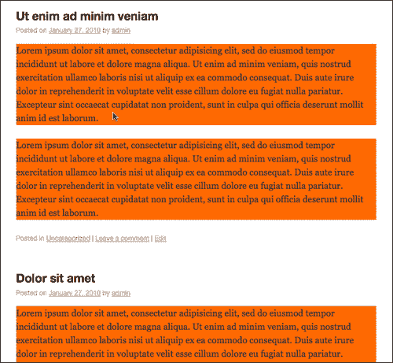

但是，让我们看看这个代码示例：

```js
jQuery(function(){
jQuery(".post > p").css("background", "#f60");
});

```

我们也来看看下面的截图。我们发现没有突出显示段落，因为它们位于另一个名为`.entry-content`的类的`div`标记中，因此，*不是*是`.post`的子类。

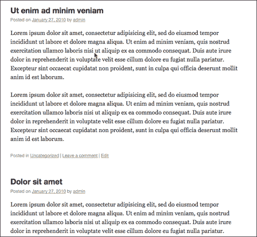

`+`选择器将找到匹配选择器下一个元素的所有*元素。例如：`li + li`将选择列表中的每个列表`li`项，*中除*外的第一项。仅显示第一个项目*旁边的项目*，如图所示：*

```js
...
jQuery("li + li").css("background", "#f60");
...

```

以下屏幕截图说明了这一点：

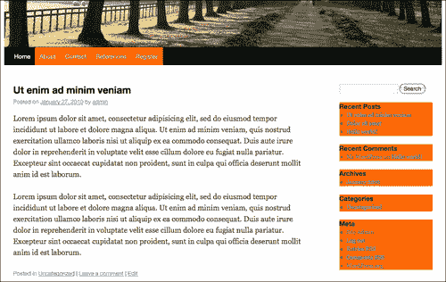

`~`选择器将找到选择器的所有同级。例如：`li ~ li`将再次选择列表中的每个列表项，除第一项外，仅选择第一项的兄弟项。代码示例如下：

```js
...
jQuery("li ~ li").css("background", "#f60");
...

```

由于兄弟姐妹通常位于所选项目的旁边，`+`和`~`选择器通常可以收到类似的结果。请注意以下屏幕截图与上一个屏幕截图的相似之处：


## 过滤这些选择

许多人可能只需要使用基本的 CSS 样式选择器就可以完成大部分需要的工作。但是等等，还有更多！过滤器是我发现非常有用的选择的一部分，特别是考虑到我们正在使用 WordPress。同样，对于 WordPress 主题，您的许多 HTML 元素、ID 和类名可能都是由您不是其作者的主题生成的，或者，出于各种原因，您不想编辑主题，或者您不允许编辑主题。（那是什么？当开发人员开始乱搞他们的标记时，设计师会有点“生气”？我不知道。）但这没关系。有了过滤器，你就不必这么做了。

问题是，从 jQuery 开始，人们很想进入并将 HTML 标记更改为更易于使用 jQuery 选择的内容。但有了 WordPress，这并不容易。更改标记意味着您将面临破坏主题或更糟的风险，必须提醒内容编辑器手动将特定标记添加到帖子和页面（在某些方面，这首先会破坏使用 WordPress 的目的）。了解过滤器将使您能够在每种情况下、每种情况下、每一次对您的选择进行精确控制。

优化过滤器非常容易，您只需要包含这些项目，这些项目将获取您选择的元素并将它们与特定条件相匹配，例如它们相对于其他元素的位置或索引。同样，为了符合 CSS 选择语法的精神，其中一些过滤器看起来类似于**CSS 伪类**，例如`:hover`和`:first-child`。这些实际上并不都是 CSS 伪类；它们不会在 CSS 样式表中工作，但会在 jQuery 中工作。

jQueryAPI 将这些过滤器分为以下几类（我发现它们对 WordPress 开发最有用），即基本过滤器、内容过滤器、子过滤器、表单过滤器、属性过滤器和可见性过滤器。

### 基本过滤器

当你使用 WordPress 时，我相信你会发现`:not()`过滤器和`:header`过滤器非常有用。`:header`过滤器允许您简单地选择选择中的*所有*标题，无论它们是什么级别的标题。不必选择`h1`和`h2`等等，将`:header`过滤器添加到您的选择中会将`h1`到`h6`中的所有标题抓取到包装器中。在你的`custom-jquery.js`文件中尝试一下，并添加以下代码（不要担心`.css(...)`；代码的一部分；我们稍后会讨论。我只是用它来帮助我们可视化 jQuery 可以做什么）：

```js
jQuery(function(){
jQuery(":header").css("background", "#f60");
});

```

在下一个屏幕截图中，您将看到所有标题都已选中，`h1, h2`，依此类推：

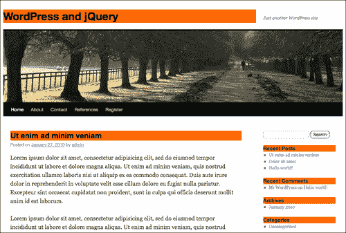

我最喜欢的过滤器是`:not`过滤器。有没有注意到在飞机上，你经常被提醒“最近的出口可能在你身后”？当您试图将正确的元素收集到 jQuery 包装器中时，同样的原则也适用。有时候，告诉 jQuery 你*不*想要包装中的东西更容易！我曾经处理过一个主题，在`.post`类中有一些非常漂亮的电子邮件和 PDF 图标元素。主题没有`.entry`类。这是令人恼火的，因为我想对加载到 WordPress 帖子中的图像应用一般的转换，但这些图标受到了影响！主题作者将它们包装在一个名为`.postIcons`的类中。使用`:not()`过滤器，我能够转换`.post`类中的所有`img`标记，但*不是`.postIcons`类中的*。含糖的

请看一下，当您将`:not`过滤器与我们之前的`:header`选择一起添加时会发生什么

```js
...
jQuery(":header:not(li :header)").css("background", "#f60");
...

```

以下过滤器现在向我们显示所有选定的标题，列表项中的标题除外：

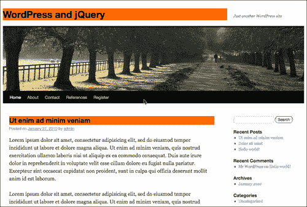

您可能已经从前面的示例中注意到，您可以非常巧妙地使用过滤器，在一个选择中多次使用它们。

你说那是什么？是的，你是对的：`(":headers:not(li h2)")`实现了与上一个示例完全相同的*结果，是的，最好选择最直接的路线。我只是想说明如何使用这两个过滤器。最终，您将遇到更复杂的情况，它们将非常有用。在使用过滤器之前，先使用普通选择器。*

让我们看看每一个基本过滤器，它的语法看起来是什么，以及它所做的细节。因为大多数 WordPress 主题作者都使用`.post`类，而且大多数情况下，您将针对 post 元素，以使语法最有意义。在我的示例中，我会经常使用`.post`类名称，但请记住，您的主选择器可以是 CSS 选择器语法中使用的任何`tag, id`名称或`class`名称！

<colgroup><col style="text-align: left"> <col style="text-align: left"> <col style="text-align: left"></colgroup> 
| 

实例

 | 

语法

 | 

描述

 |
| --- | --- | --- |
| ：非（选择器） | `jQuery(".post img:not(.pIcon)").jqFn()`； | 筛选出与给定选择器匹配的所有元素。 |
| ：标题 | `jQuery(".post:header").jqFn()`； | 向下过滤到作为标头的所有元素，如 h1、h2、h3 等。 |
| ：首先 | `jQuery(".post:first") .jqFn()`； | 仅向下过滤到第一个选定元素。 |
| ：最后 | `jQuery(".post:last") .jqFn()`； | 仅向下过滤到最后选定的元素。 |
| ：偶数 | `jQuery(".post:even") .jqFn()`； | 只过滤到偶数元素。注意：数组是零索引的！零被认为是偶数，因此您的第一个项目将被选中！ |
| ：奇数 | `jQuery(".post:odd") .jqFn()`； | 只过滤到奇数元素。注意：数组是零索引的！零被视为偶数，因此您的第二项将被选中！ |
| ：eq（数字） | `jQuery(".post:eq(0)") .jqFn()`； | 通过索引向下过滤到单个元素，该索引也是零索引的。 |
| ：gt（编号） | `jQuery(".post:gt(0)") .jqFn()`； | 向下过滤到索引**高于给定索引**的所有元素，这也是零索引。 |
| ：lt（数字） | `jQuery(".post:lt(2)") .jqFn()`； | 筛选索引低于给定索引的所有元素。 |
| ：动画 | `jQuery(".post:animated").jqFn()`； | 过滤到当前正在设置动画的所有元素（我们将在本章后面讨论动画）。 |

### 儿童过滤器

jQuery 包装器中的任何内容都是一个数组，这些子过滤器很方便，但您可能会发现，在 WordPress 中使用`li`标记或定义列表元素时，这些过滤器最方便。默认情况下，WordPress 将相当数量的链接内容拆分为`li`标记元素和图库，这些标记元素和图库是通过将图像和描述包装在定义列表（`dt dd`元素）中创建的。

<colgroup><col style="text-align: left"> <col style="text-align: left"> <col style="text-align: left"></colgroup> 
| 

实例

 | 

语法

 | 

描述

 |
| --- | --- | --- |
| ：第 n 个子项（数字/偶数/奇数） | `jQuery(".linkcat li:nth-child(1)").css("background", "#f60")`； | 向下过滤到作为其选择器的“n”子级的元素。请注意，这是**而不是**零索引！`1`和奇数选择**第一个**元素。 |
| ：第一个孩子 | `jQuery(".linkcat li:first-child").css("background", "#f60")`； | 向下过滤到作为其父级的第一个子级的元素。 |
| ：最后一个孩子 | `jQuery(".linkcat li:last-child").css("background", "#f60")`； | 向下筛选到作为其父级的最后一个子级的元素。 |
| ：独生子女 | `jQuery(".pagenav li:only-child").css("background", "#f60")`； | 向下筛选到仅为其父元素的子元素。如果父对象有多个子对象，则不会选择任何元素。 |

在这里您可以看到`:only-child`过滤器正在工作：

```js
...
jQuery("li:only-child").css("background", "#f60");
...

```

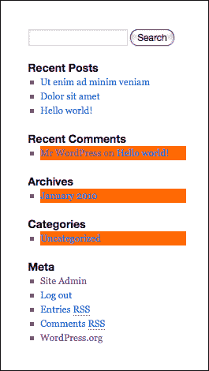

以下是元列表中起作用的`:nth-child`过滤器：

```js
...
jQuery(".widget_meta li:nth-child(odd)").css("background", "#f60");
...

```

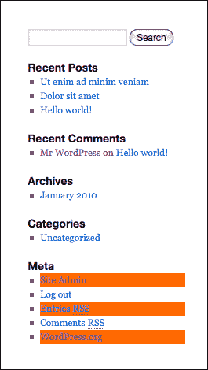

### 内容过滤器

在基本过滤器和子过滤器之后，您将遇到的下一个最有用的过滤器是内容过滤器。内容过滤器允许您根据**匹配**各种类型的元素和内容进行选择。我在 WordPress 中经常使用的最有用的内容过滤器是`:has()`过滤器。我经常需要选择在里面有*东西的元素，比如锚`a`标记里面有`img`图像标记，或者段落`p`标记里面有列表`li`标记，或者其他元素里面有特定的类名。瞄准一个特定的对象很容易，但是如果你发现你需要瞄准一个更大的父对象，根据它里面的元素类型，`:has()`过滤器将成为你最好的朋友。*

第二个最有用的项目是`:contains()`元素，乍一看，它可能看起来与`:has()!`非常相似，但这个过滤器非常不同（而且非常酷），因为它允许您在元素中针对特定的*文本*。

小心这两个过滤器，并尽可能多地进行“预选”。您需要确保 jQuery 为您尝试选择的元素和文本指向正确的方向。只是指定了`...(p:contains('my text'))..`。对于一个大页面的内容来说可能过于笼统；您将导致 jQuery 延迟，或者更糟的是，挂起并超时，因为它必须在页面上的每个小的`p, div`或`a`元素中搜索您的文本或元素。指定`...(#divIdName .className a:contains('my text'))...`的 jQuery 要好得多，因为 jQuery 只需搜索一个特定 ID 容器指定类中每个`a`元素的文本，而不是整个*页面的内容。*

让我们更详细地看看下面的内容过滤器：

<colgroup><col style="text-align: left"> <col style="text-align: left"> <col style="text-align: left"></colgroup> 
| 

实例

 | 

语法

 | 

描述

 |
| --- | --- | --- |
| ：has（选择器） | `jQuery(".post:has(.entry)") .css("background", "#f60")`； | 向下筛选到至少包含一个匹配元素的元素。 |
| ：包含（文本） | `jQuery(".post:contains('Hello world')").css("background", "#f60")`； | 向下筛选到包含特定文本的元素。注意：这是**区分大小写的！** |
| ：空的 | `jQuery(":empty')") .css("background", "#f60")`； | 向下筛选到没有子元素的元素。这包括文本节点。 |
| ：家长 | `jQuery(":parent')") .css("background", "#f60")`； | 向下筛选为另一个元素的父元素。这包括文本节点。 |

对于一个深入的例子，让我们看看默认主题的侧栏。侧边栏中有一些项目没有用特殊的`id`名称或`class`表示。如果我想将仅位于元标题下的`ul`列表作为目标，我可以使用`:has()`和`:contains()`将其作为目标。注意我是如何通过预选或首先指向`.widget-area li`标记来“引导”jQuery 的，这样 jQuery 在我告诉您查找子元素和包含文本之前会忽略页面*的其余部分。*

您可以在下一个屏幕截图中看到以下代码的结果：

```js
...
jQuery(".widget-area li:has(h3:contains('Meta')) ul")
.css("background", "#f60");
...

```

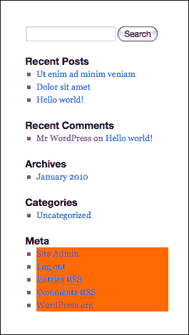

### 表单过滤器

就像以前所有的选择器和过滤器都不够酷一样，您还可以显式地过滤到几种类型的表单元素以及这些元素的事件类型。使用这些过滤器，您将能够控制 WordPress 生成的评论表单以及自定义和 WordPress 插件表单，并使它们更加直观和易于使用。在本书的后面，我们将看到 jQuery 如何使表单使用和验证变得非常简单。

<colgroup><col style="text-align: left"> <col style="text-align: left"> <col style="text-align: left"></colgroup> 
| 

实例

 | 

语法

 | 

描述

 |
| --- | --- | --- |
| ：输入 | `jQuery("form:input").css("background", "#f60")`； | 筛选到所有输入、文本区域、选择和按钮元素 |
| ：文本 | `jQuery("form:text").css("background", "#f60")`； | 筛选所有文本类型的输入元素 |
| ：密码 | `jQuery("form:password").css("background", "#f60")`； | 筛选所有密码类型的输入元素 |
| ：收音机 | `jQuery("form:radio").css("background", "#f60")`； | 适用于所有 radio 类型输入元素的过滤器 |
| ：复选框 | `jQuery("form:checkbox").css("background", "#f60")`； | 筛选到所有类型为复选框的输入元素 |
| ：提交 | `jQuery("form:submit").css("background", "#f60")`； | 筛选所有提交类型的输入元素 |
| ：图像 | `jQuery("form:image").css("background", "#f60")`； | 所有图像元素的过滤器（分类为表单过滤器，但对常规图像有用） |
| ：重置 | `jQuery("form:reset").css("background", "#f60")`； | 筛选所有重置类型的输入元素 |
| ：按钮 | `jQuery("form:button") .css("background", "#f60")`； | 筛选所有按钮类型的输入元素 |
| ：文件 | `jQuery("form:file").css("background", "#f60")`； | 筛选到文件类型的所有输入元素 |

使用以下代码，我只突出显示了`text`输入和`submit`按钮，如下一个屏幕截图所示：

```js
...
jQuery(":text, :submit").css("background", "#f60");
...

```

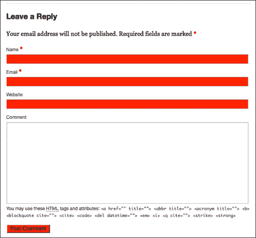

### 属性过滤器

属性是 HTML 标记中的附加属性，允许标记自我优化。您可能最熟悉`id`和`class`属性以及`img`和`script`标记的`src`属性，当然还有`a`标记的`href`属性。

属性是定义和细化 HTML 元素的强大属性，因此您可以想象使用它们进行过滤的功能有多强大。是的，但是请记住，将项目选择到 jQuery 包装器中的最简单和最直接的方法通常是最好的。我的示例将显示不同的类选择，因为它们创建了很好的视觉示例，但实际上，您最好使用常规选择器以类项目为目标，并保存属性过滤器，以便进行更精细、更复杂的工作。

您将注意到这些过滤器与其他过滤器不同。这些过滤器使用`[]`（方括号）代替`:`（冒号标记）。这意味着，如果要筛选属性，可以很容易地在选择器语法中看到。您还将注意到，对于 HTML 的 DOM 中的每个属性，您都可以对其进行筛选。没有标准的“属性过滤器名称”；您只需使用方括号指示要筛选的任何属性。您甚至可以通过以下几种方式构造属性过滤器：

<colgroup><col style="text-align: left"> <col style="text-align: left"> <col style="text-align: left"></colgroup> 
| 

实例

 | 

语法

 | 

描述

 |
| --- | --- | --- |
| [属性] | `jQuery("div [href]") .css("background", "#f60")`； | 过滤属性，而不考虑其值 |
| [属性=值] | `jQuery("div [class='entry']") .css("background", "#f60")`； | 筛选属性和*精确的*指定值 |
| [属性！=值] | `jQuery("div [class!='entry']") .css("background", "#f60")`； | 没有指定值的属性的筛选器 |
| [属性^=值] | `jQuery("div [href^='http://']") .css("background", "#f60")`； | 筛选具有以特定字符串开始的值*的属性* |
| [属性$=值] | `jQuery("div [href$='/']") .css("background", "#f60")`； | 筛选具有以特定字符串*结尾*的值的属性 |
| [属性*=值] | `jQuery("div [href*='page_id']").css("background", "#f60")`； | 筛选包含字符串的属性 |

在这里，我们可以使用以下 jQuery 代码查看侧栏中的本地链接：

```js
...
jQuery(".widget-area [href^='http://localhost']").css("background", "#f60");
...

```

以下屏幕截图显示了结果，仅突出显示引用 WordPress 安装的`localhost`链接：

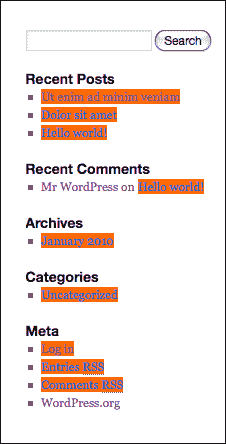

### 能见度

我把这两个过滤器留到最后，主要是因为我在大多数 WordPress 项目中不太使用它们，但它们是选择器/过滤器 API 的一部分，所以我将继续在这里介绍它们。

大多数情况下，使用 jQuery 所需的所有目标在默认情况下都是可见的。但有时，您可能会有一个以前通过 jQuery 转换隐藏的项，或者一个隐藏的表单字段，并且您希望对其运行转换。为此，您可以使用`:hidden`过滤器。这有点棘手，因为您已将项目选择到包装器中，但不一定会看到任何转换（除非转换是为了使其可见）。如果你发现自己有很多隐藏的元素，你总是可以过滤可见的东西，如果这更容易的话。

<colgroup><col style="text-align: left"> <col style="text-align: left"> <col style="text-align: left"></colgroup> 
| 

实例

 | 

语法

 | 

描述

 |
| --- | --- | --- |
| ：隐藏 | `jQuery("form:input:hidden") .css("background", "#f60")`； | 用于显示值为 none 或类型值为 hidden 或显式宽度和高度为`0`的元素的过滤器 |
| ：可见 | `jQuery("div .post:visible") .css("background", "#f60")`； | 可见元素的过滤器 |

### 注

我已经介绍了作为一名 WordPress 开发人员，我最能利用的主要选择器和过滤器。请务必在 jQuery 文档中查找按字母顺序列出的所有可用选择器和筛选器：[http://api.jquery.com/category/selectors/](http://api.jquery.com/category/selectors/) 。

# jQuery 秘密武器 2：在 DOM 中操纵 CSS 和元素

现在，我们可以可靠地选择 WordPress 站点在页面上显示的任何*对象*，让我们开始操作和增强我们的选择吧！我们可以操纵显示对象的 CSS 样式，似乎这还不够酷，我们还可以操纵 DOM 中的 HTML 对象本身。让我们开始操作 CSS。

## 操纵 CSS

到目前为止，我们所看到的关于选择器和过滤器的一切对于确定您想要影响的元素是至关重要的。现在，您可以在包装器中选择任何您想要的内容，让我们开始让事情发生吧！感谢我前面的所有示例，您已经熟悉了`css()`函数。通常，您将使用此函数指定标准 CSS 属性值，如：`background, border, padding, margins`等。如果您可以在 CSS 样式表中指定属性，那么可以使用`css()`函数指定它。您还可以使用此函数检索和获取 CSS 属性。

在 jQuery 的 Attributes API 中，您会发现更多 CSS 操作特性，如`.addClass, .removeClass`和`.toggleClass`。仅这三个功能就足以让你的 WordPress 网站充满活力。不要被我不断谈论的属性弄糊涂了！我们不再处理选择器和过滤器了。我们正在处理允许您操作这些选择的函数。让我们来详细研究一下 jQuery 的 CSS 和类属性操作函数：

<colgroup><col style="text-align: left"> <col style="text-align: left"> <col style="text-align: left"></colgroup> 
| 

实例

 | 

语法

 | 

描述

 |
| --- | --- | --- |
| .css（'属性'，'值'） | `jQuery(".post") .css("background", "#f60");` | 添加或更改选定元素的 CSS 属性。 |
| .addClass（'className'） | `jQuery(".post") .addClass("sticky");` | 将列出的类添加到每个选定元素。 |
| .removeClass（'className'） | `jQuery(".post") .removeClass("sticky");` | 从每个选定元素中删除列出的类。 |
| .toggleClass（'className'，开关可选） | `jQuery(".post") .toggleClass("sticky");` | 根据每个选定元素的当前状态切换列出的类。如果该类存在，则将其删除，如果不存在，则将其添加。 |
| .hasClass（'className'）） | `jQuery(".post") .hasClass("sticky");` | 如果存在来自每个选定元素的列出类，则返回 true 或 false。 |

让我们通过向所有帖子添加默认主题`sticky`类来检查`addClass()`函数。

### 注

在进行选择时，您需要从`id`名称到`tag`名称中表示`class`名称，但在这些 jQuery 类属性函数中，您只需要输入类的名称。你不需要用句号“.”来表示它。函数只需要一个类名，因此不需要。正如您所料，您显然无法使用`addClass`函数将`id`名称添加到选择中（不，对不起，没有`addId`函数！）

```js
...
jQuery(".post").addClass("sticky");
...

```

您现在可以在下一个屏幕截图中看到`.sticky`类已通过 jQuery 而不是 WordPress 添加到所有`.post`类中！

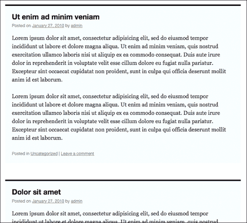

### 操纵属性

您还可以影响特定对象的属性（这对于切换图像路径非常方便，并且提供了另一种使用`class`名称甚至`object`ID 名称的方法）

<colgroup><col style="text-align: left"> <col style="text-align: left"> <col style="text-align: left"></colgroup> 
| 

实例

 | 

语法

 | 

描述

 |
| --- | --- | --- |
| 艾特先生 | `jQuery(".post") .attr();` | 检索选定元素中第一个元素的属性值 |
| .removeAttr | `jQuery(".post a") .removeAttr("href");` | 从每个选定元素中删除属性 |

### 提示

**比 CSS 更强大：**

如果您需要以一种友好的、跨浏览器友好的方式处理 HTML 对象，那么可以很容易地检索并在任何选择器上设置大量属性、高度和宽度变量。偶尔，这些功能也会派上用场，但您会发现使用上表中列出的函数所做的工作首当其冲。尽管如此，您还是想看看 jQuery 的 cssapi:[下的定位、高度和宽度函数 http://docs.jquery.com/CSS](http://docs.jquery.com/CSS) 。

## 操纵要素和内容

jQuery 的 API 的操作部分同样非常广泛，但我发现一些函数对于帮助我实现 WordPress 和 jQuery 的增强非常有用。例如，如果您使某个内容可扩展或可伸缩，则用户需要一个元素来处理该事件，而不必进入每篇文章并添加控制按钮（或者提醒您的客户端或站点编辑器向每篇文章添加控制链接或按钮是的，他们会这样做）。您可以使用 jQuery 动态添加和删除内容和 HTML 元素。

最有用的函数是`prepend()`和`append()`函数，允许您在选择之前或之后包含文本。这些功能允许您关注内容，或选择内容中的特定选择器，以最容易找到的为准。

接下来最有用的函数是`before()`和`after()`以及`instertBefore()`和`instertAfter()`函数。如果您发现需要在类名或 HTML 元素中封装元素以添加额外的样式，`wrap()`函数没有问题。您甚至可以删除和克隆元素！让我们更详细地看一下这些操作函数。

<colgroup><col style="text-align: left"> <col style="text-align: left"> <col style="text-align: left"></colgroup> 
| 

实例

 | 

语法

 | 

描述

 |
| --- | --- | --- |
| .append（html 和文本） | `jQuery(".post") .append("<b>post ends here</b>");` | 将参数中的内容插入到每个选定元素的末尾。 |
| .appendTo（选择器） | `jQuery("<b>post ends here</b>").appendTo(".post");` | 执行与 append 相同的操作，只是反转元素选择和内容参数。 |
| .prepend（html 和文本） | `jQuery(".post") .prepend("<b>post starts here</b>");` | 将参数中的内容插入到每个选定元素的开头。 |
| .prependTo（选择器） | `jQuery("<b>post starts here</b>").prependTo(".post");` | 执行与 prepend 相同的操作，只是反转元素选择和内容参数。 |
| .之后（字符串） | `jQuery(".post") .after("<b>This goes after</b>");` | 在参数中、每个选定元素的后面和外部插入内容。 |
| .insertAfter（选择器） | `jQuery("<b>This goes after</b>").insertAfter(".post");` | 执行与之后相同的操作，只是反转元素选择和内容参数。 |
| .before（HTML 和文本） | `jQuery(".post") .before("<b>This goes before</b>");` | 在每个选定元素之前和之外的参数中插入内容。 |
| .insertBefore（选择器） | `jQuery("<b>This goes before</b>") .insertBefore("class");` | 执行与前面相同的操作，只是反转元素选择和内容参数。 |
| .wrap（html 或 functionName） | `jQuery(".post").wrap("<div class=".fun" />");` | 围绕每个选定元素包装一个 HTML 结构。您还可以构造一个函数，将每个元素包装成 HTML。 |
| .wrapAll（HTML） | `jQuery(".post").wrapAll("<div />");` | 与 wrap 类似，但将 HTML 结构放在所有元素的周围，而不是每个单独的元素。 |
| .wrapInner（选择器） | `jQuery(".post") .wrapInner("<div class=".fun" />");` | 与 wrap 类似，但它将 HTML 结构放置在每个选定元素内，并围绕每个选定元素的任何文本或子元素。 |
| .html（html 和文本） | `jQuery(".post") .html("<h2>Replacement Text</h2>");` | 用参数中的内容替换选定项的任何内容和子元素。 |
| .text（将转义仅限文本的 HTML 字符） | `jQuery(".post") .text("Replacement Text");` | 类似于 HTML，但仅限于文本。任何 HTML 字符都将作为 ASCII 码转义。 |
| .empty（选择器） | `jQuery(".post").empty(".entry");` | 删除选定元素的任何内容和子元素。离开元素。 |
| .拆下（选择器） | `jQuery(".post").remove()`； | 类似于 empty，但删除整个元素。 |
| .clone（选择器） | `jQuery(".post").clone()`； | 复制选定的图元。 |

在这里，我们可以看到使用这些类型的函数是多么容易：

```js
...
jQuery(".post").append("<div style='text-align:right;
border-bottom: 1px solid #333'>End of Post</div>");
...

```

上述 jQuery 脚本将**文章结尾**添加到每篇文章的结尾，如以下屏幕截图所示：

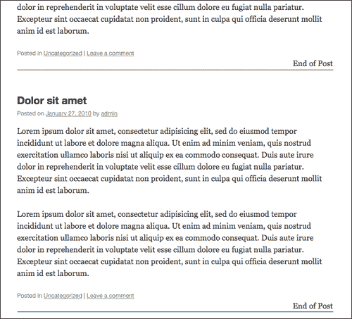

## 与 DOM 合作

使用 jQuery，您实际上可以遍历和处理 DOM 本身，而不仅仅是处理 jQuery 包装器集中的元素（请记住，这些元素不再是数组中的纯 DOM 元素）。为了直接使用 DOM，可以使用一些 jQuery 函数和属性。jQuery 的文档站点本身有一个非常详尽的列表，其中包含 20 或 30 个函数，您可以使用这些函数来帮助您遍历 DOM，尽管再次使用 WordPress，您很可能不需要直接使用它。我使用最多的是 jQuery 核心的一部分，在遍历 API 中找不到，但我使用它们来帮助我优化和导航 DOM 对象。

<colgroup><col style="text-align: left"> <col style="text-align: left"> <col style="text-align: left"></colgroup> 
| 

实例

 | 

语法

 | 

描述

 |
| --- | --- | --- |
| .长度或尺寸（） | `jQuery(".post") .length;` | 返回所选集合中的元素数。 |
| .get（数字可选） | `jQuery(".post") .get(3);` | 这将返回本机 DOM 元素的数组。如果您不想直接处理 DOM，而不想处理 jQuery 包装的元素，那么它就很有用了。 |
| .查找（选择器） | `jQuery(".post") .find(".entry b");` | 返回第一个选择器中与 find 函数的选择器匹配的 jQuery 元素数组。 |
| .each（函数名） | `jQuery(".post") .each(function(){//code});` | 这将在与 jQuery 选择器匹配的每个元素上运行一个函数。 |

当这些函数返回数字和数组时，您会发现它们对于故障排除非常有用。为了方便地引用其中一个函数，我只需使用 jQuery 语句设置`alert()`函数，如下所示：

```js
...
alert("How many posts does this blog have? "+jQuery(".post").length);
jQuery(".post").each(function(){
alert("one alert for each .post")
});
...

```

您可以在以下屏幕截图中看到生成的警报：

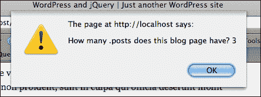

### 提示

**请务必查看完整的遍历功能。**

同样，jQuery 的目的是让您远离 DOM 的细节，但是随着您对 jQuery 的使用越来越复杂，您不想忘记这些函数在[中是可用的 http://docs.jquery.com/Traversing](http://docs.jquery.com/Traversing) 。

您还可以在[上仔细查看 jQuery 核心 http://docs.jquery.com/Core](http://docs.jquery.com/Core) 。

# jQuery 秘密武器#3：事件与效果（又名：蛋糕上的糖霜）

好的，你是*选择*大师；你可以从任何人的 CSS 和 WordPress 主题中获取你想要的任何东西，你可以*操纵*这些选择的 CSS 属性和属性，直到奶牛回家。仅从这些第一个示例中，您可能已经成功地提出了自己令人印象深刻的 jQuery 增强功能。但是等等，还有更多！让我们把它与事件和效果结合起来。

## 处理事件

有很多事件可以用 jQuery 处理。您可以手动**绑定**和**解除绑定**事件到元素，您可以引用**统一事件对象**，您可以使用事件助手。在本书稍后的部分，我们将不再讨论 jQuery 的统一事件对象，现在，我们来看看开始使用事件的最直接的方法。

### 帮手真是帮了大忙！

帮助器功能（通常也称为“快捷方式”）允许您轻松地在单击或悬停时设置事件。您还可以轻松切换事件。我们看到`toggleClass()`函数在 CSS 操作部分是多么有用；想象一下能够切换*更多*功能。

大多数情况下，`hover()`会满足您的需求，但如果您希望您的活动是一次点击，那么`toggle()`功能可能会工作得最好。`toggle()`函数比`hover`更具灵活性，因为您可以添加其他函数，而不必局限于一个或两个函数。

<colgroup><col style="text-align: left"> <col style="text-align: left"> <col style="text-align: left"></colgroup> 
| 

实例

 | 

语法

 | 

描述

 |
| --- | --- | --- |
| 。单击（函数名称） | `jQuery(".post") .click(function(){//code});` | 将函数绑定到`click`事件类型，单击即可执行。 |
| .dbclick（函数名） | `jQuery(".post") .dbclick(function(){//code});` | 将函数绑定到双击执行的`click`事件类型。 |
| .悬停（functionName1、functionName2） | `jQuery(".post") .hover(function(){//code});` | 与`mouseenter/mouseleave`事件类型一起工作，只将两个函数绑定到所选元素，在`mouseenter`和`mouseleave`上执行。 |
| .切换（functionName1、functionName2、functionName3 等） | `jQuery(".post") .toggle(function(){//code});` | 使用`click`事件类型，并将两个或多个函数绑定到所选元素，在交替单击时执行。 |
| .mouseenter（函数名） | `jQuery(".post") .mouseenter(function(){//code});` | 绑定鼠标输入选定元素时要执行的函数。 |
| .mouseleave（函数名） | `jQuery(".post") .mouseleave(function(){//code});` | 绑定鼠标离开选定元素时要执行的函数。 |
| .keydown（函数名） | `jQuery(".post") .keydown(function(){//code});` | 将函数绑定到`keydown`事件类型，仅当所选元素具有*焦点*且按键按下时执行。 |
| .keyup（函数名） | `jQuery(".post") .keyup(function(){//code});` | 将函数绑定到`keyup`事件类型，仅当所选元素具有*焦点*且按键按下后释放时执行。 |

随着事件的到来，页面变得更加生动和动态。让我们在侧边栏导航项上设置一个非常简单的悬停：

```js
...
jQuery(".widget-area li ul li").hover(function(){
jQuery(this).css("background", "#f60");
},
function(){
jQuery(this).css("background", "none");
});
...

```

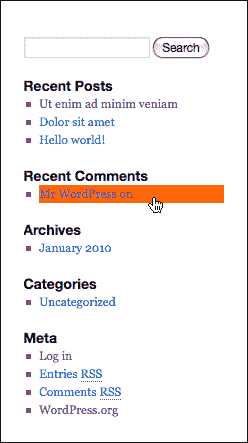

### 使用绑定、解除绑定和事件对象

我们将对这些函数做一个快速概述；使用这种方法有点过分，但对于特定的用途，它可能会派上用场，如果没有其他方法的话，也会让您欣赏 jQuery 提供的所有助手快捷方式功能。

有时，您可能需要真正完善事件的控制，使用`bind()`和`unbind()`函数，您可以自己很好地处理这个问题。可以传递事件类型的参数，如`click`或`mouseenter`；您可以传递一些数据和事件处理程序（也可以调用另一个函数）。数据是一个可选参数，它稍微超出了本章的范围，但是对于那些真正对使用 jQuery 进行开发感兴趣的人来说，如果需要的话，您可以传递数据是很好的（即使在本章中，我们也会尽自己的一份力）！

让我们仔细看看并分解这些函数的部分：

<colgroup><col style="text-align: left"> <col style="text-align: left"> <col style="text-align: left"></colgroup> 
| 

实例

 | 

语法

 | 

描述

 |
| --- | --- | --- |
| .bind（事件类型、数据、函数名） | `jQuery(".post").bind("mouseenter", function(){//code})`； | 将要在事件类型上触发的函数附加到选定元素。 |
| .unbind（事件类型、函数名称） | `jQuery(".post").bind("mouseenter", function(){//code})`； | 从选定元素中删除事件类型。 |

我们可以通过使用`bind`和`unbind`重新创建我们在 hover 类中实现的功能。它有点麻烦，而且最终不是实现简单悬停效果的最优雅的方式。bind 的优点是可以传递数据。以下示例演示如何将数据（即背景颜色）传递给事件的函数：

```js
...
jQuery(".widget-area li ul li").bind("mouseenter", {color: "#f60"}, function(event){
jQuery(this).css("background", event.data.color);
jQuery(this).unbind("mouseleave");
});
jQuery(".widget-area li ul li").bind("mouseleave", function(){
jQuery(this).css("background", "none");
jQuery(this).unbind("mouseenter");
});
...

```

在前面的代码示例中，我们使用 jQuery 的事件对象来传递数据。使用数据时，统一事件对象返回可以帮助您创建精确的 jQuery 转换，我经常使用对象的信息来帮助将事件信息传递给函数以获得更清晰的代码，并帮助我进行故障排除。

<colgroup><col style="text-align: left"> <col style="text-align: left"></colgroup> 
| 

实例

 | 

描述

 |
| --- | --- |
| `event.type` | 返回事件的类型，例如单击或`mouseenter`或`keyup`。 |
| `event.target` | 返回从中触发事件的选定元素。 |
| `event.data` | 返回并包含通过 bind 函数传递的可选数据。 |
| `event.pageX, .pageY` | 确定鼠标相对于文档左边缘（pageX）或顶部（pageY）的位置。 |
| `event.result` | 返回此事件触发的事件处理程序返回的最后一个值。非常有用的故障排除。 |
| `event.timeStamp` | 返回事件触发时的 Unix 时间戳。 |

以下代码将在单击时跟踪事件对象属性：

```js
...
jQuery(".post").click(function(event){
jQuery(this).html("event type: "+event.type+"<br/>event timestamp: "+event.timeStamp+"<br/>event x: "+event.pageX+"<br/>event y: "+event.pageY);
});
...

```

这里有一个事件对象函数，您可能会发现它在`preventDefault()function`中很有用。它可以停止元素的默认操作。最常见的例子是使`link`标记不执行其`href`。如果您需要知道某个元素的默认事件是否调用了 this，可以使用`isPreventDefault()`函数对其进行测试。

<colgroup><col style="text-align: left"> <col style="text-align: left"> <col style="text-align: left"></colgroup> 
| 

实例

 | 

语法

 | 

描述

 |
| --- | --- | --- |
| .preventDefault（） | `jQuery(.post a).preventDefault()`； | 将阻止选定图元执行其浏览器设置默认操作。 |
| .isPreventDefault（） | `jQuery(.post a).isPreventDefault()`； | 如果对一组选定元素调用了`ispreventDefault`，则返回 true 或 false。 |

## 添加效果

现在，我们准备好了本章的有趣部分，添加光滑效果。jQuery 库为我们提供了一些非常基本的动画和效果函数。这些都是视觉效果，比如显示和隐藏、淡入淡出、上下滑动，或者更精确地使用`animate`功能在屏幕上移动元素。大多数人都会对标准的快捷方式动画功能感到非常满意，但我们也会看看`animate`功能。

这些函数中的大多数还允许使用回调函数，这样可以很容易地触发您希望在元素动画完成时完成的其他动画或功能。让我们从特效和动画开始。

### 显示和隐藏

关于显示和隐藏，首先要注意的是目标元素的大小和淡入度会受到影响。如果只想淡入淡出或影响大小，则需要查看其他动画功能。你也可以很容易地使用我们之前讨论过的`toggle`事件来帮助你提高效果。

<colgroup><col style="text-align: left"> <col style="text-align: left"> <col style="text-align: left"></colgroup> 
| 

实例

 | 

语法

 | 

描述

 |
| --- | --- | --- |
| .show（速度可选，函数名） | `jQuery(".post") .css("background", "#f60").show("slow")`； | 显示匹配的元素；如果设置了速度，对象将从左向右增长，alpha 淡入 0 到 1。函数可以在完成时调用。速度可以是“慢”或“快”或毫秒。 |
| .hide（速度可选，函数名） | `jQuery(".post") .css("background", "#f60").show(200)`； | 类似于 show，但隐藏。如果设置了速度，元素将从右向左收缩，alpha 淡入 1 到 0。函数可以在完成时调用。速度可以是“慢”或“快”或毫秒。 |

### 滑入滑出

您会注意到，显示和隐藏对象是从右向左“增长”的。滑动是一种优雅的方式来处理打开和关闭元素更直接的向上和向下运动。

<colgroup><col style="text-align: left"> <col style="text-align: left"> <col style="text-align: left"></colgroup> 
| 

实例

 | 

语法

 | 

描述

 |
| --- | --- | --- |
| .slideUp（速度、函数名） | `jQuery(".post") .slideUp('slow', function() {``// code``})`； | 将选定图元从下到上滑动，直至其隐藏。速度可以是“快”或“慢”或毫秒。动画完成后可以调用函数。 |
| .向下滑动（速度、功能名称） | `jQuery(".post") .slideDown('slow', function() {``// code``})`； | 从上到下滑动隐藏的选定图元，直到定义其大小。速度可以是“快”或“慢”或毫秒。动画完成后可以调用函数。 |
| .slideToggle（） | `jQuery(".post") .slideToggle('slow', function() {``// code``})`； | 使用幻灯片动画切换选定元素的可见性。速度可以是“快”或“慢”或毫秒。动画完成后可以调用函数。 |

### 淡入淡出

一个好的淡入淡出也是不错的。我想指出，`fadeIn()`和`fadeOut()`仅在从`0`或`1`的α开始时起作用。例如：`fadeOut`仅在元素的 alpha 设置为`1`时有效，而`fadeIn`仅在元素的 alpha 设置为`0`时有效。

我还想指出，如果您以前使用过`fadeTo()`函数淡入特定的阿尔法数，然后一路尝试`fadeOut()`或`fadeIn()`，那么它是不起作用的。只需继续使用`fadeTo()`功能来平滑上下转换。此外，当使用`fadeOut()`时，一旦元素的 alpha 位于`0`，它就会完全消失。它占用的任何空间都会以某种不和谐的效果坍塌。在决定使用`fadeOut().`时要考虑到这一点

<colgroup><col style="text-align: left"> <col style="text-align: left"> <col style="text-align: left"></colgroup> 
| 

实例

 | 

语法

 | 

描述

 |
| --- | --- | --- |
| .衰减（速度、功能名称） | `jQuery(".post") .fadeOut("slow"`， | 淡出可见的选定元素，或淡出阿尔法为`1`至`0` |
| .fadeIn（速度、功能名称） | `jQuery(".post") .fadeIn("slow"`， | 淡出隐藏可见性或 alpha 设置为`0`至`1`的选定元素 |
| .fadeTo（速度、alpha、函数名） | `jQuery(".post") .fadeTo("slow"`， | 将所选元素淡入从`0`到`1`的特定α |

### 使用动画功能

上表中的三个动画功能将完成您所需的大部分功能。然而，你可能会发现自己处于一种需要更多控制的情况。在这种罕见的情况下，您可以使用`animate`函数。

<colgroup><col style="text-align: left"> <col style="text-align: left"> <col style="text-align: left"></colgroup> 
| 

实例

 | 

语法

 | 

描述

 |
| --- | --- | --- |
| .animate（css 属性、持续时间、缓和、函数名） | `jQuery(".post") .animate({width:` | 在选定元素上创建 CSS 属性的自定义转换 |
| .停止 | `jQuery(".post").stop()`； | 停止选定元素上的动画 |

下面是一个使用`animate()`功能在帖子中自定义`img`动画的示例：

```js
...
jQuery(".post img").animate({
opacity: 0.25,
left: '+=50',
height: 'toggle'}, 1000, function() {
//alert("animate function finished");
});
...

```

很难在书中捕捉动画，所以我没有尝试其他例子，但在这里，你可以看到这篇文章的图像已经动画了一半（图像高度接近，alpha 值接近 0）：

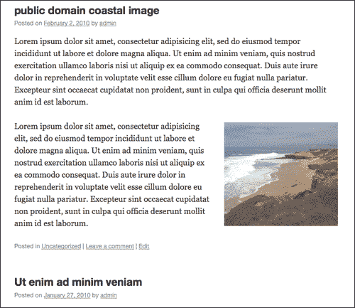

# 通过语句链接让一切变得简单

正如我所提到的，jQuery 的许多强大功能之一是语句链接，也就是说，将多个函数串在一起，这些函数将按照它们添加到所选集合上的链（从左到右）的顺序执行，所有这些都在一个漂亮的代码串中完成。例如，我们可以更改 CSS 属性，隐藏选定的元素，并使用一行代码平滑地淡入淡出它们：

```js
...
jQuery(".post").css("background", "#f60").hide().fadeIn("slow");
...

```

关于更深入的语句链接示例，让我们来看看 WordPress 中的第一个 jQuery 项目。

# 我们的第一个项目：扩展/折叠 WordPress 帖子

好的，这是一个快速的项目，但它要求我们使用一点我们刚刚介绍的内容。我一直很喜欢 WordPress 有`<!--more->`功能，可以让帖子在主帖子查看页面上“可谴责”，但对于某些类型的帖子，这并不总是适合我的目的。让我们假设我的博客将有相对较短的帖子，但我真的希望读者能够看到尽可能多的标题，而不必滚动或扫描任何内容（我们将暂停现实，并假装我的帖子标题是令人难以置信的有趣和引人注目）。

我希望用户可以选择扩展他感兴趣的帖子，同时将他与所有其他帖子标题联系起来。您可能在许多网站上看到过类似的增强功能。这是一个非常流行的 jQuery 增强功能，用于常见问题解答和新闻发布。

让我们来看看我们是怎么做到的。在你的主题中建立一个干净的`custom-jquery.js`文件，让我们开始吧。

首先，我们必须隐藏帖子内容：

```js
jQuery(".post .entry-content").hide();

```

下一步，我们需要一些控制，让人们点击，这也给了他们一些直观的指示。当然，让一个编辑器在每篇文章中添加一个控件元素是非常低效的，所以我们不会这样做（但遗憾的是，我在一些项目中看到过这样做）。我们可以将它添加到主题的`post.php`页面，但是，即使用户禁用了 JavaScript，控件也会出现。我们想让它优雅地退化，毕竟它是一个*增强*。

如果有人在不支持 JavaScript 的移动浏览器或纯文本浏览器或文本到语音浏览器中看到这些内容，我们希望他们能够正常查看这些内容，而不会受到任何非功能性元素的干扰。我们将使用 jQuery 添加我们的控件元素。如果禁用 JavaScript，它就不会出现。

```js
jQuery(".post").after("<div class='openIt' style='border-top: 1px solid #666; color: #036; text-align:right; cursor:pointer;'>Expand</div>");

```

我们现在只需要一种显示和隐藏帖子内容的好方法：

```js
jQuery(".openIt").click(function() {
jQuery(this).prev(".post").find(".entry").slideToggle("slow");
});

```

最后，让我们确认`.openIt`div 更新中的说明：

```js
jQuery(".openIt").toggle(function(){
jQuery(this).html("Close")},
function(){
jQuery(this).html("Expand")
});
...

```

就这样！您的第一个对 WordPress 有用的 jQuery 增强。下面是它的屏幕截图：

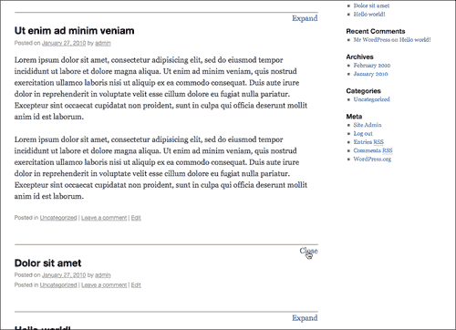

## 保持 jQuery 的可读性

在现实世界中，这种增强可以被清理和改进很多。例如，最好为`.openIt`使用现有的 CSS 样式，而不是将样式应用于`div`。

另外，我强烈建议编写单独的命名函数。例如，它更容易阅读：

```js
...
jQuery(".openIt").toggle(closePost, expandPost);

```

然后，在下面看到：

```js
function expandPost(evt){
//jQuery(evt.target)...
}
function closePost(evt){
//jQuery(evt.target)...
}
...

```

如果你发现自己在和其他开发人员一起工作，考虑把你的函数分解成这样，而不是像我的第一个例子那样直接把它们打包到 jQuery 函数中。它使代码更易于维护，您可以将您的函数与其他 jQuery 函数和脚本一起重用。

# 总结

总而言之，我们通过注册 WordPress 的捆绑版本和使用 Google 的 CDN，将 jQuery 纳入 WordPress。我们还看了 jQuery 的三大“秘密武器”：

*   选择器和过滤器
*   操纵和更改内容
*   事件和影响

在 WordPress 中探索了 jQuery 的基础知识并了解了它们的工作原理之后，您可能会觉得自己很好！在很多方面你都是，但我们将继续探索 WordPress 和 jQuery，更详细地了解 WordPress 中生成内容的部分，我们可以用 jQuery 来增强这些内容：我们将更深入地研究 WordPress 主题和插件，以及另一种插件，jQuery 插件。主题和插件可以使我们的 WordPress 开发在多个站点和项目中高效灵活地工作。