# 三、深入挖掘：共同理解 jQuery 和 WordPress

现在，我们已经了解了 WordPress 中 jQuery 的基础知识，我们准备通过了解以下内容进行更深入的挖掘：

*   WordPress 主题、WordPress 插件和 jQuery 插件是什么
*   创建自己的 WordPress 主题、插件和 jQuery 插件的基础知识
*   如何以及何时将 jQuery 作为脚本或 jQuery 插件直接应用于主题或 WordPress 插件的最佳实践

通过仔细观察 WordPress 的这两个主要组件，主题和插件，以及如何封装 jQuery 代码，以便在 jQuery 插件内的项目之间更容易地使用，我们已经很好地掌握了动态 WordPress 开发。

# 将 jQuery“插入”到 WordPress 站点的两种方法

你知道 WordPress 是一个令人印象深刻的出版平台。其核心优势在于内容、显示和功能近乎完美的分离。同样，jQuery 是一个令人印象深刻的 JavaScript 库，它花了大量精力使其跨平台工作，非常灵活、可扩展，而且还具有优雅的可降解性（如果用户出于某种原因没有启用 JavaScript）。

你知道 WordPress 主题控制着你的网站的外观，WordPress 插件可以帮助你的网站做更多的事情，但是我们要看看这两个组件在 WordPress 系统中是如何工作的，以及如何使用主题或 WordPress 插件的 jQuery。这样，在开发 jQuery 增强功能时，您将能够更好地利用它们。

说到 jQuery 的增强功能，jQuery 脚本可以转换成自己的插件类型，不要与 WordPress 插件混淆。这使得您在 jQuery 中所做的工作可以轻松地移植到不同的项目和用途中。

在这三个组件（主题、WordPress 插件和 jQuery 插件）之间，您会发现几乎所有您梦想创建的东西都在您的指尖上。更好的是，你会意识到大部分工作已经完成了。所有这三种组件类型都有大量已经开发的第三方产品库。大多数是免费的！如果它们不是免费的，你将准备好决定它们是否物有所值。

通过了解编辑主题和创建自己的 WordPress 和 jQuery 插件的基础知识，您将准备好浏览第三方创作的世界，并为您的项目找到最佳解决方案。您还可以确定使用其他开发人员的主题、插件或 jQuery 插件与从头开始创建自己的主题、插件相比是更好还是更快。

## WordPress 主题概述

根据 WordPress codex，WordPress 主题是*一组文件，这些文件一起工作，为 weblog*生成一个具有底层统一设计的图形界面。主题包括一组模板文件和 web 辅助资料，如图像、CSS 样式表和 JavaScript。主题可以让你修改 WordPress 网站的外观，而不必知道 WordPress 是如何工作的，更不用说改变它的工作方式了。有很多网站提供免费主题和/或出售高级 WordPress 主题。在谷歌上快速搜索“wordpress 主题”会让你了解可用选项的数量。然而，当第一次寻找或研究主题时，一个好的开始总是 WordPress 的免费主题库，在这里你可以轻松地回顾和演示不同的主题和风格：[http://wordpress.org/extend/themes/](http://wordpress.org/extend/themes/) 。下一个屏幕截图显示 WordPress 主题目录的主页：

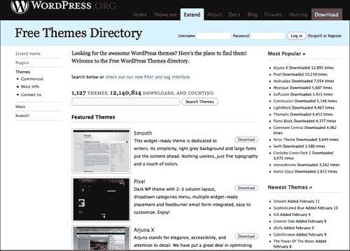

选择要使用或使用的主题后，您将通过导航到 WordPress 安装的管理面板左侧面板中的**管理【外观】主题**来激活该主题。下一个屏幕截图显示**管理主题**面板：

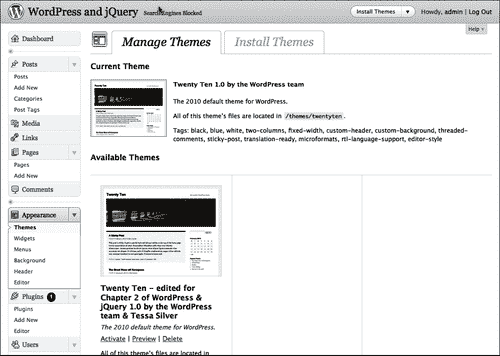

这是作为 WordPress 用户，您至少需要了解的主题。在我们深入了解更多细节之前，让我们先对 WordPress 插件和 jQuery 插件进行概述。

## WordPress 插件概述

因此，主题可以在不影响 WordPress 功能的情况下改变其外观。但是，如果您想更改或添加功能，该怎么办？WordPress 插件允许对 WordPress 站点进行简单的修改、定制和增强。你可以通过安装和激活 WordPress 插件来增加功能，而不必深入到主文件并更改 WordPress 的核心编程。

WordPress 开发团队非常小心地使用 WordPress 的**插件 API**（应用接口）提供的访问点和方法创建插件。搜索插件的最佳位置是：[http://wordpress.org/extend/plugins/](http://wordpress.org/extend/plugins/) 。以下是 WordPress 插件目录主页的截图：

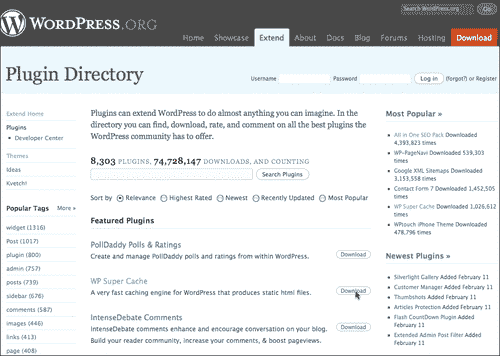

一旦你有了一个插件，只需解压缩文件（通常只是解压缩）并阅读附带的`readme.txt`文件以获取安装和激活说明。对于大多数 WordPress 插件来说，这只是将文件或目录上传到 WordPress 安装的`wp-content/plugins`目录，然后导航到**管理【插件】安装的**面板激活它。下一个屏幕截图显示了**插件**管理面板，带有默认**Askimet、Hello Dolly**和新的**WordPress 导入器**插件的激活屏幕：

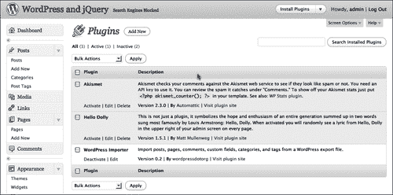

那么 WordPress 插件与 jQuery 插件有何不同呢？在理论和意图上，没有那么多，但在实践中，有相当多的差异。让我们来看看 jQuery 插件。

## jQuery 插件概述

jQuery 能够让您获取已创建的脚本，并将它们封装到 jQuery 函数对象中。这允许 jQuery 代码执行两项关键操作。首先，它变得更容易移植到不同的情况和用途。其次，您的插件可以作为一个函数，作为 jQuery 语句链的一部分集成到更大的脚本中。

浏览 jQuery 插件的最佳位置是 jQuery 插件页面（[http://plugins.jquery.com/](http://plugins.jquery.com/) ），如下图所示：

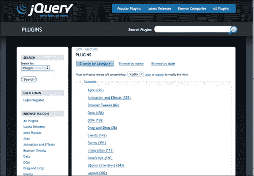

除了已经绑定了 jQuery，WordPress 还绑定了很多 jQuery 插件。WordPress 附带了**颜色、Thickbox**以及**表单**和大多数**jQuery UI**插件。这些插件中的每一个都可以通过主题的`header.php`文件或`function.php`文件中的`wp_enqueue_script`来启用，正如我们在[第 2 章](02.html "Chapter 2. Working with jQuery in WordPress")中了解到的，*在 WordPress*中使用 jQuery。在本章中，我们将很快了解如何在 WordPress 插件中直接启用 jQuery 插件。

当然，您也可以下载 jQuery 插件并手动将它们包含到 WordPress 主题或插件中。您可以为未与 WordPress 捆绑的插件执行此操作，或者如果您需要在中修改插件。

是的，您已经注意到 WordPress 中没有简单的 jQuery 插件激活面板。这就是理解你所选择的主题和 WordPress 插件的地方！您很快就会发现，在利用 jQuery 时，有很多选项可供选择。现在我们已经大致了解了 WordPress 主题、插件和 jQuery 插件，让我们学习如何更好地利用它们。

# WordPress 主题的基础知识

到目前为止，您已经了解到 WordPress 主题基本上包含 HTML 和 CSS，它们可以包装和设置 WordPress 内容的样式。因此，在将 jQuery 合并到站点中时，通常首先从它开始。大多数情况下，这是一个很好的方法。更多地了解主题的工作原理只能使 jQuery 开发更加顺利。让我们来看看主题是如何结构化的以及如何编辑它们的最佳实践。

### 提示

**想了解更多关于 WordPress 主题设计的信息吗？**

本标题主要介绍在 WordPress 中使用 jQuery 最需要知道的内容。如果你对 WordPress 主题开发感兴趣，我强烈推荐*April Hodge Silver*和*Hasin Hayer 的***WordPress 2.7 完整版**。除了涵盖管理 WordPress 网站的完整核心能力外，[第 6 章](06.html "Chapter 6. WordPress and jQuery's UI")、*WordPress 和 jQuery 的 UI*还概述了如何编辑和创建 WordPress 的标准主题。

如果你真的想深入研究主题设计，我的标题**WordPress 2.8 主题设计**将引导你创建一个工作 HTML 和 CSS 设计模型，并从头开始编写代码。

## 了解模板的层次结构

我们已经讨论过 WordPress 主题包含许多文件类型，包括模板页面。模板页面有一个结构或层次结构。这意味着，如果一种模板类型不存在，WordPress 系统将调用下一级模板类型。这允许开发人员创建非常详细的主题，充分利用层次结构中所有可用的模板页面类型，使设置变得难以置信的简单。有可能有一个功能齐全的 WordPress 主题，它只包含一个`index.php`文件！

要真正利用主题来增强 jQuery（更不用说帮助您解决 WordPress 的一般故障），最好先了解主题的层次结构。

除了这些模板文件，主题当然还包括图像文件、样式表、甚至自定义模板页面和 PHP 代码文件。基本上，您可以在 WordPress 主题中使用 14 种不同的默认页面模板，不包括您的`style.css`工作表或`header.php, sidebar.php`和`searchform.php`等内容。如果您利用 WordPress 对单个自定义页面、类别和标记模板的功能，您可以拥有更多的模板页面。

如果打开我们一直使用的默认主题目录，您将看到大多数模板文件以及图像目录`style.css`和`js`目录以及我们在[第 2 章](02.html "Chapter 2. Working with jQuery in WordPress")中开始使用的`custom-jquery.js`文件*在 WordPress*中使用 jQuery。下面的屏幕截图显示了 WordPress 3.0 新的默认主题**210:**中的主要文件

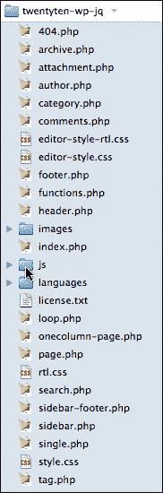

下一个列表包含常规模板层次结构规则。你能拥有的最简单的主题必须包含一个`index.php`页面。如果没有其他特定的模板页面，则默认为`index.php`。

然后，您可以通过添加以下页面开始扩展主题：

*   当类别、标签、日期或作者页面被查看时，`archive.php`胜过`index.php`。
*   `home.php`在浏览主页时胜过`index.php`。
*   `single.php`查看单个帖子时胜过`index.php`。
*   `search.php`在查看搜索结果时胜过`index.php`。
*   当 URI 地址找不到现有内容时，`404.php`胜过`index.php`。
*   `page.php`在查看静态页面时胜过`index.php`。
    *   自定义的**模板**页面，例如：`page_about.php`，当通过页面的**管理**面板选择时，会胜过`page.php`，当查看特定页面时，会胜过`index.php`。
*   `category.php`胜过`archive.php`，然后在查看类别时胜过`index.php`。
    *   自定义**类别 ID**页面，如：`category-12.php`胜过`category.php`。这就胜过了`archive.php`，后者胜过了`index.php`。
*   `tag.php`王牌`archive.php`。这反过来会在查看标签页时胜过`index.php`。
    *   自定义的**标记名**页面，例如：`tag-reviews.php`胜过`tag.php`。这个胜过`archive.php`，哪个胜过`index.php`。
*   `author.php`王牌`archive.php`。当查看作者页面时，这反过来胜过`index.php`。
*   `date.php` trumps `archive.php`. This trumps `index.php` when a date page is viewed.

    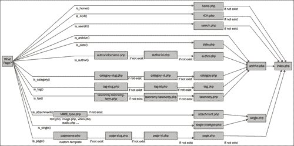

    ### 注

    您可以在此处了解有关 WordPress 主题模板层次结构的更多信息：

    [http://codex.wordpress.org/Template_Hierarchy](http://codex.wordpress.org/Template_Hierarchy) 。

### 全新主题

如果您想要创建一个新的主题，或者像本书一样，如果您要大量修改一个主题，那么您需要创建一个具有类似于前面解释的层次结构的文件结构的目录。同样，由于它是分层的，您不必创建每个建议的页面，除非您另有决定，否则更高的页面将承担此角色。正如我所提到的，一个工作主题可能只有一个`index.php`文件。

我将修改默认主题，但希望原始默认主题可供参考。我将复制默认主题的目录，并将其重命名为：`twentyten-wp-jq`。WordPress 依赖于主题目录命名空间。也就是说，每个主题都需要一个唯一命名的文件夹！否则，您将复制另一个主题。下一个屏幕截图显示了此目录的创建：

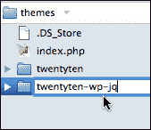

然后打开`style.css`文件，修改 CSS 文件开头的信息：

```js
/*
Theme Name: Twenty Ten - edited for Chapter 3 of WordPress & jQuery
WordPress themenew theme, creatingTheme URI: http://wordpress.org/
Description: The 2010 default theme for WordPress.
Author: the WordPress team & Tessa Silver
Version: 1.0
Tags: black, blue, white, two-columns, fixed-width, custom-header, custom-background, threaded-comments, sticky-post, translation-ready, microformats, rtl-language-support, editor-style
*/
...

```

我的“新”主题将出现在管理面板的**管理主题**页面中。您可以使用新的屏幕截图来更新新的或修改过的主题。如果没有屏幕截图，框架将显示一个灰色框。由于主题的外观将发生一些变化，我现在已经从目录中删除了`screenshot.png`文件，如您在下一个屏幕截图中所看到的：


## 环路

在[第一章](01.html "Chapter 1. Getting Started: WordPress and jQuery")、*入门：WordPress 和 jQuery*和[第二章](02.html "Chapter 2. Working with jQuery in WordPress")、*在 WordPress*中使用 jQuery，我们了解到 jQuery 通过包装器中选定的元素“循环”对您是多么有用。WordPress 自己做一些循环；事实上，它非常重要，可以命名为“循环”。**循环**是 WordPress 主题的重要组成部分。它按时间顺序显示文章，并允许您使用 HTML 标记包装的各种 WordPress 模板标记定义自定义显示属性。

WordPress 中的循环是一个**while 循环**，因此以 PHP 代码`while (have_posts()):`开头，后跟模板标记`the_post()`。然后，所有标记和其他模板标记将应用于每个循环显示的帖子。然后循环以 PHP`endwhile`语句结束。

每个模板页面视图都可以有自己的循环，以便您可以修改和更改每种类型的 post 排序的外观和布局。每一个模板页面本质上都是以不同的方式对你的帖子进行排序。例如，不同的类别或标记模板页面会对您的帖子进行排序和细化，以满足特定的标准。这些排序后的帖子可能会与主页上的帖子或归档列表中的帖子不同，等等。下一个例子是取自 WordPress 2.9.2 默认 Kubrick 主题的一个非常简单的循环：

```js
...
<?php while (have_posts()) : the_post(); ?>
<div <?php post_class() ?> id="post-<?php the_ID(); ?>">
<h2>
<a href="<?php the_permalink() ?>"
rel="bookmark" title="Permanent Link to
<?php the_title_attribute(); ?>">
<?php the_title(); ?>
</a>
</h2>
<small><?php the_time('F jS, Y') ?>
<!-- by <?php the_author() ?> -->
</small>
<div class="entry">
<?php the_content('Read the rest of this entry &raquo;'); ?>
</div>
<p class="postmetadata">
<?php the_tags('Tags: ', ', ', '<br />'); ?>
Posted in <?php the_category(', ') ?> |
<?php edit_post_link('Edit', '', ' | '); ?>
<?php comments_popup_link('No Comments »',
'1 Comment »', '% Comments »'); ?>
</p>
</div>
<?php endwhile; ?>
...

```

循环被塞进一个大的`if/else`语句中，最重要的是检查是否有要排序的帖子。如果没有匹配的帖子可显示，则会显示“对不起”消息，`searchform.php`文件包含在`get_search_form()`包含标签中。

新的 WordPress 3.0 Twenty-Ten 主题将其循环分离为自己的模板页面`loop.php`，并且其中还有许多`if/else`语句，因此相同的循环代码可以处理许多不同的情况，而不是为不同的模板页面编写单独的循环。总的来说，新主题中使用的基本模板标记以及条件和包含标记与以前在默认主题中使用的相同。现在只有一些新的模板和标签可以帮助您简化主题。

让我们仔细看看这些模板标签，包括和条件标签，以及 API 挂钩，我们可以在 WordPress 主题。

## 标签和挂钩

在循环中，您可能注意到一些用 PHP 标记包装的有趣代码。代码不是纯粹的 PHP，大多数都是 WordPress 特定的标记和函数，例如**模板标记**，它们只在 WordPress 系统中工作。循环中最明显最重要的模板标记是`the_title()`和`the_content()`。您会注意到，大多数标记和函数都可以通过它们传递各种参数。您会注意到，在前面的代码片段中，`the_content`标记传递了一个参数`'Read the rest of this entry &raquo;'`。如果将`<!--more-->`标记放入帖子中，则会出现带有直角引号的文本字符串。

并不是所有的 WordPress 标签和函数都在循环中。如果你在[第一章](01.html "Chapter 1. Getting Started: WordPress and jQuery")、*入门：WordPress 和 jQuery*和[第二章](02.html "Chapter 2. Working with jQuery in WordPress")、*在 WordPress*中使用 jQuery，你可能会注意到`blog_info()`和`body_class()`之类的东西，当然还有`wp_enqueue_script()`我们用来在安装中注册 jQuery 的。

当必须使用主题模板文件进行开发和增强时，我发现以下模板标记和函数对于识别和了解非常有用：

*   `bloginfo()`-此标签可以通过参数来检索有关您博客的各种信息。在`header.php`文件中，您会注意到它最常用于查找样式表目录`bloginfo('stylesheet_directory')`和样式表 URL`bloginfo('stylesheet_url')`。它还可以显示您的 RSS URL、您的站点正在运行的 WordPress 版本以及许多其他详细信息。有关更多详细信息，请参阅：[http://codex.wordpress.org/Template_Tags/bloginfo](http://codex.wordpress.org/Template_Tags/bloginfo) 。
*   `wp_title()`-这个标签可以在循环之外，它显示一页或一篇文章的标题（不是几个文章的排序列表）。您可以向其传递一些选项，例如在标题中使用什么文本分隔符，以及分隔符文本应显示在左侧还是右侧。您还可以向该标记传递布尔值 true 或 false 以显示标题。`wp_title("--",true,"right")`。有关更多详细信息，请参阅[http://codex.wordpress.org/Template_Tags/wp_title](http://codex.wordpress.org/Template_Tags/wp_title) 。
*   `the_title()`-该标签进入循环内部。它显示当前文章的标题，您可以向其传递任何您希望将标题包装在其中的文本字符：`the_title("<h2>", "</h2>")`。有关更多详细信息，请参阅[http://codex.wordpress.org/Template_Tags/the_title](http://codex.wordpress.org/Template_Tags/the_title) 。
*   `the_content()`-该标签进入循环，显示帖子内容。如果您没有传递任何`params`，如果帖子中使用了`<!--more-->`标签，它将显示一个通用的**阅读更多**链接。否则，您可以按照“阅读更多”说明的内容进行传递（我甚至发现传递现有标签在这里是有效的。`the_content("Continue Reading".the_title())`。有关更多详细信息，请参阅[http://codex.wordpress.org/Template_Tags/the_content](http://codex.wordpress.org/Template_Tags/the_content)
*   `the_category()`-这个标签也必须进入循环，它显示一个或多个链接，指向分配给帖子的类别。如果有多个类别，可以将您选择的文本分隔符传递给它。`the_category(", ")`。有关更多详细信息，请参阅[http://codex.wordpress.org/Template_Tags/the_category](http://codex.wordpress.org/Template_Tags/the_category) 。
*   `the_author_meta()`—this tag also has to go into the loop. It has a wealth of parameters that can be passed to it. You'll be most familiar with `the_author_meta("nickname")`, or `the_author_meta("first_name")`, or `the_author_meta("last_name")`. You can also get the author's bio, `the_author_meta("description")`, as well as e-mail and website URLs. Your best bet is to review the codex for all that you can do with this tag: [http://codex.wordpress.org/Template_Tags/the_author_meta](http://codex.wordpress.org/Template_Tags/the_author_meta).

    ### 注

    WordPress 模板标签库非常广泛，在主题中使用标签的创造性方式可以无限延伸。我已经包括了使模板变得有用和伟大的标签，但无论如何，请查看法典：

    [http://codex.wordpress.org/Template_Tags](http://codex.wordpress.org/Template_Tags) 。

### 条件标签

根据页面匹配的条件，可以在模板文件中使用条件标记来更改显示的内容以及该内容在特定页面上的显示方式。例如，您可能希望在一系列文章的上方显示一段文本，但仅显示在博客的主页上。有了`is_home()`条件标记，这项任务就变得简单了。

几乎所有东西都有条件标签；其中，我发现我在主题开发中最需要的是以下几个：

*   `is_page()`
*   `is_home()`或`is_front_page()`
*   `is_single()`
*   `is_sticky()`

所有这些函数都可以采用以下参数：post ID 或 page ID 编号、post 或 page title、post 或 page slug。尽管主题很棒，但我相信你已经遇到了一个难题，那就是你或你的客户不希望在每一页或每一篇文章上都有完全相同的侧边栏。

我使用这些条件标记来确保特定页面可以打开或关闭特定样式或内容分区，并显示或不显示特定内容。这些标签确实有助于给项目站点一种真实的、定制的网站感觉。

### 注

有条件的标签乐趣还不止于此。在帮助主题的定制方面，您可能会发现还有很多非常宝贵的东西：

[http://codex.wordpress.org/Conditional_Tags](http://codex.wordpress.org/Conditional_Tags) 。

### 模板包括标签

在`index.php`模板页面和`single.php`或`page.php`等其他模板页面中，您可能注意到这些包含标签。它们允许您将标准页面包含到其他模板页面中：

*   `get_header()`
*   `get_footer()`
*   `get_sidebar()`
*   `comments_template()`
*   定制包括：`include(TEMPLATEPATH."/file-name.php")`

#### 创建自定义页眉、页脚、侧边栏包括

不久前，WordPress 2.7 引入了为主题创建*自定义*页眉、页脚和侧边栏模板的功能。您只需创建自定义页眉、页脚或侧边栏，并使用标准的 include-template 标记调用它。请务必添加一个文件*前缀*或`sidebar-`，以及您自己的文件名。然后，您可以按如下方式调用自定义模板文件：

*   `get_header('customHeader')`将包括`header-customHeader.php`
*   `get_footer('customFooter')`将包括`footer-customFooter.php`
*   `get_sidebar('customSidebar')`将包括`sidebar-customSidebar.php`

### 插件挂钩

一般来说，除非你是一名插件开发人员，否则你可能不需要对插件 API 倾注太多精力。然而，有一些钩子应该放在主题中，以便插件能够有效地处理主题。如果您正在编辑主题，请确保不要删除这些钩子标记，或者如果您正在创建自定义主题，请确保包含它们：

*   `wp_head:`放置在`header.php`模板

    ```js
    <?php wp_head(); ?>

    ```

    的`<head>`标签内
*   `wp_footer:`在`footer.php`模板中的位置：

    ```js
    <?php wp_footer(); ?>

    ```

*   `wp_meta:`您很可能会将此挂钩放置在`sidebar.php`模板中。但是，最好在您希望插件和小部件出现的地方添加这个钩子：

    ```js
    <?php wp_meta(); ?>

    ```

*   `comment_form:`进入`comments.php`和`comments-popup.php`，在`</form>`结束标签

    ```js
    <?php do_action('comment_form'); ?>

    ```

    之前

### 项目：在默认主题中编辑主循环和侧栏

好吧关于主题，这似乎需要了解很多！如果有人想用 jQuery 增强 WordPress 站点，你可能会问：“真的有必要了解所有这些吗？”即使你对创建自定义主题没有兴趣，但在使用 jQuery 时，你会发现了解 WordPress 主题的工作原理、主题输出的 HTML 标记非常有用，以及大多数不同的标记和函数的作用。

诚然，在[第 2 章](02.html "Chapter 2. Working with jQuery in WordPress")中*在 WordPress*中使用 jQuery 时，我强烈建议您学习如何从内到外处理 jQuery 的选择器，特别是，这样您就可以增强任何 WordPress 网站，而无需编辑其主题。虽然您应该像手背一样了解 jQuery 选择器和过滤器，但它并不总是最快或最简单的方法。有时候，虽然您可以在页面上选择和编辑您想要的任何内容，但 jQuery 选择过程和语句链过于臃肿；如果某个元素只有一个特定的 HTML 标记、`class`或`id`属性，则可以对其进行清理和裁剪。在很多情况下，直接编辑主题可以让您更快、更少的代码创建 jQuery 增强功能。更不用说，许多主题都很棒，但通常可以通过最简单的主题调整来做得更好，更适合你的网站。让我们现在就这样做，把我们刚刚学到的关于主题的知识运用到实践中去。

现在，我们使用的新的 210 默认主题很好，但是如果日期在帖子中更突出一点，如果侧边栏被清理成更像“官方”链接，而不仅仅是项目符号列表，那就更好了。

#### 改变循环

因为我们正在修改主题，所以我想更改循环显示的内容。我们将假设这是一个客户的网站，我知道客户最终会*希望关注帖子的作者（这个“假设”网站上有很多作者），虽然日期很重要，但不应该与作者的名字在同一行。我相信你已经看到一些博客在帖子旁边有一个小日历或图标。我认为这是一种视觉上很吸引人的方式来显示这样的信息，而不是让日期占据很多空间。*

使用免费的开源矢量编辑器 Inkscape（[http://inkscape.org](http://inkscape.org) ），我制作了一个日历背景图标，上面是红色的日期，下面是三个字母的月份。图标约为 32 像素正方形。你可以使用任何你喜欢的图形程序，GIMP，Photoshop，Illustrator 等等，来创建一个类似的图标，或者你也可以在网上找到一个免版税的图像。

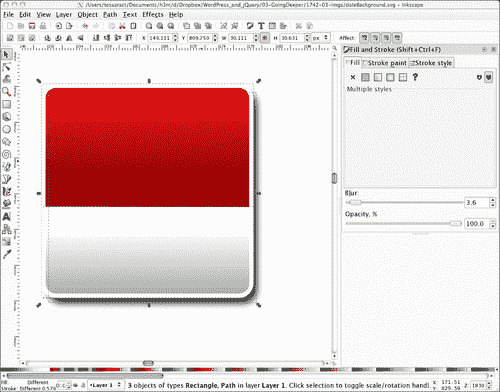

为了将日历背景设置在日期后面并正确格式化，让我们深入了解循环。默认主题的循环位于名为`loop.php`的模板文件中。如果这是您第一次使用“210”默认主题，那么这是一个比您可能习惯的循环长得多的循环。最终，我们对显示在网站“主页”或默认博客页面上的“正常”或“其他一切”视图感兴趣。您可以在第**127**行`<div class="entry-meta">`开头找到此代码。

首先，注释掉定制 PHP 函数`twentyten_posted_on`（它引用了主题的`function.php`文件中的一个定制函数，这有点超出了本标题的范围），然后添加以下粗体的 HTML 标记和 PHP 模板标记：

```js
...
<div class="entry-meta">
<?php //twentyten_posted_on();//comment this out ?>
<small class="date">
<?php the_time('d') ?><br/>
<span><?php the_time('M') ?></span>
</small>
</div><!-- .entry-meta -->
...

```

我们关注的是日期显示。日期显示有一个名为`the_time`的模板标签，该标签的参数设置为显示整月、日期“如前所述”和年份；例如 2010 年 2 月 4 日。

我只想在下面显示日期编号和月份的三个字母缩写。`the_time`标记的参数不允许我添加 HTML 中断标记，因此我将把日期分为两个独立的`the_time`标记调用，以便更好地控制 HTML。我还想确保我的风格只适用于这个循环，而不适用于包装在其他模板页面循环中的`<small>`日期和内容，因此我一定要在`<small>`标记中添加一个自定义`date`类。我还将把年份日期显示包装在一些`<span>`标记中，这样我就可以对其进行一些额外的样式控制。我的日期显示和课程结果如下：

```js
...
<small class="date">
<?php the_time('d') ?><br/>
<span><?php the_time('M') ?></span>
<!-- by <?php the_author() ?>-->
</small>
...

```

然后，我们将打开 CSS`style.css`样式表，为添加到日期显示中的特殊类名添加规则，并修改标题显示。我只是将修改添加到`style.css`样式表的最底部。如果偶然发现我的任何样式名与样式表中已定义的任何样式名相同，我的规则将继承以前的规则并对其进行修改（要么如此，要么明确表示我需要一个更独特的样式名）

首先，我会将`.post`类中的`h2`标题移动超过 40 像素，以便为我的约会腾出空间。接下来，我将把我在`.post`类中的日期向上移动大约 25 像素，使其位于标题旁边。在这个规则中，我还指定了我在 Inkscape 中创建的`dateBackground.png`，并稍微调整了日期号的大小、颜色和一些其他属性。最后，我在 span 标签中设置了我的月份显示大小和颜色，如下所示：

```js
...
/*----------twentyten chapter 3 customizations------------*/
.home .post .entry-title{
padding-left: 40px;
}
.post small.date{
display:block;
background: url(images/dateBackground.png) no-repeat;
margin-top: -25px;
padding-top: 4px;
width: 32px;
height: 32px;
font-size: 20px;
line-height: 12px;
text-align: center;
color: #eee;
}
.post small.date span{
font-size: 10px;
color: #666;
}
...

```

接下来的屏幕截图显示了我们帖子的标题和日期：

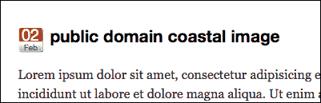

不错！现在，让我们来处理侧边栏。

#### 更改侧边栏

侧边栏将很容易。Twenty-Ten 默认主题中的全部内容都是 widgetized，因此我们想要进行的任何重新排序都可以通过管理面板完成。然而，我们确实想稍微调整一下侧边栏项目列表的 CSS。当修改一个不是自己从头开始创建的主题时，最好向标记和样式表中添加新类，而不是更改或编辑作者输入的任何原始样式。由于各种原因，这只会使恢复更容易。正如您之前所注意到的，我总是将新的自定义样式添加到`style.css`样式表的底部。

让我们首先在编辑器中打开`sidebar.php`，然后添加一个新的类名，我们可以使用它来设置加载到任何小部件区域的任何小部件的样式。无论我在哪里找到一个`<ul class="xoxo">`标记，我都会在.xoxo 类之后添加一个名为`.currentsidebar`的额外类。这在`sidebar.php`文件中大约在**12**行附近出现两次，再次大约在**51**行附近出现。

```js
...
<ul class="xoxo currentsidebar">
...
<ul class="xoxo currentsidebar">
...

```

接下来，我们只需打开`style.css`样式表，在其底部，让我们编写新的`.currentsidebar`CSS 规则来影响列表项：

```js
...
.currentsidebar li{
padding: 0;
margin: 15px 0 20px 0;
}
.currentsidebar li ul li{
list-style: none;
padding: 5px 0; margin: 0 0 0 -15px; border-bottom: 1px solid #ddd;
font-size: 105%;
}
...

```

塔达！正如您在下一个屏幕截图中所看到的，我们的页面和侧栏导航现在如下所示：

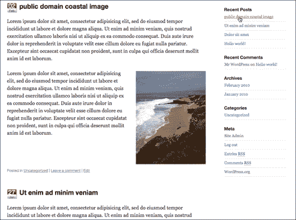

正如你所看到的，修改 WordPress 主题很容易。您不仅可以自定义主题，使其外观和工作方式符合您的要求，还可以想象调整主题的 HTML 标记是多么容易，以便更容易添加 jQuery 增强功能。接下来，让我们转到 WordPress 插件。

# WordPress 插件的基础知识

老实说，编写 WordPress 插件的细节远远超出了本文的范围；我的目标是向您展示一个简单 WordPress 插件的结构以及如何构建插件的基础知识。了解了这一点，你就可以开始编写自己的基本插件，并且在评估别人为你的 WordPress 站点提供的功能时，如果你需要调整 jQuery 增强功能的话，可以更加自信地查看他们的插件。即使我们将要做的是简单而基本的工作，你也会看到 WordPress 插件是多么强大。

### 提示

**想成为 WordPress 插件 rockstar 吗？**

您可以再次从**WordPress 2.7 开始，由*April Hodge Silver*和*Hasin Hayder*完成**。有一章是关于插件的，它引导你创建非常有用的简单插件，还有一个更复杂的插件写入 WordPress 数据库。除此之外，您还需要查看*弗拉基米尔·普雷洛瓦克*撰写的**WordPress 插件开发：初学者指南**。别让标题蒙蔽了你，Vladimir 会让你使用 WordPress 的编码标准生成功能丰富、动态的 WordPress 插件，所有这些都用清晰、分步的代码解释。

使用插件确实需要一些 PHP 经验。对于非 PHP 开发人员，我将保持这个解释相当简单，有 PHP 经验的人应该能够看到如何在 WordPress 中扩展这个示例以获得优势。总的来说，如果到目前为止您一直在学习本书中的 jQuery 和 WordPress PHP 示例，您应该会很好。

就像主题一样，WordPress 插件需要一点结构来开始使用它们。插件文件没有定义的层次结构，但您至少需要一个顶部带有特殊注释的 PHP 文件，以便 WordPress 可以在插件管理页面中显示它。虽然有一些单文件插件，比如 WordPress 安装附带的 Hello Dolly 插件，但你永远不知道你是什么时候开始开发的，插件可能会以什么方式增长。为了安全起见，我喜欢将插件组织到一个唯一命名的文件夹中。同样，与主题一样，WordPress 依赖于插件目录的名称空间，因此唯一性非常重要！

在`wp-content/plugins`目录中，您可以放置一个唯一的文件夹，并在其中创建一个`.php`文件，在文件的开头，在`<?php ?>`标记中，包含以下标题信息。绝对只需要粗体信息。其余信息是可选的，并填充管理面板中的**管理插件**页面。

```js
<?php
WordPress pluginabout/*
Plugin Name: your WordPress Plugin Name goes here
Plugin URI: http://yoururl.com/plugin-info
Description: Explanation of what it does
Author: Your Name
Version: 1.0
Author URI: http://yoururl.com
*/
//plugin code will go here
?>

```

### 提示

确保在您的`<?php`标签之前或`?>`标签之后没有任何**空格***。如果您这样做，WordPress 将显示一些错误，因为系统将收到一些关于已发送的页眉的错误。*

一旦你在自己的目录中设置了`.php`文件，在你的插件目录中，你可以添加一个基本的 PHP 函数。然后，您可以使用**动作挂钩**或**过滤器挂钩**决定如何调用该函数。例如：

```js
<?php
filter hookusing/*
Plugin Name: your WordPress Plugin Name goes here
Plugin URI: http://yoururl.com/plugin-info
Description: Explanation of what it does
Author: Your Name
Version: 1.0
Author URI: http://yoururl.com
*/
function myPluginFunction(){
//function code will go here
}
add_filter('the_title', 'myPluginFunction');
//or you could:
/*add_action('wp_head', 'myPluginFunction');*/
?>

```

请记住，在前面的主题部分中，我介绍了插件挂钩以及在主题中使用插件挂钩的重要性？这就是为什么。如果你的主题中没有`wp_head`或`wp_footer`，那么很多插件就无法正常工作，你只能编写插件。在我的插件中，我主要使用`wp_header`和`init`动作挂钩。

幸运的是，大多数过滤器挂钩都能在插件中工作，因为 WordPress 会在循环中运行它们。在大多数情况下，您将使用`the_title`和`the_content`过滤器挂钩在插件中完成最多的工作。当 WordPress 循环遍历循环中的模板标记时，这些过滤器的每个钩子都将执行您的函数。

### 提示

**想知道有哪些过滤器和动作挂钩可用？**

清单是详尽无遗的。事实上，它是如此巨大，以至于 WordPress 抄本似乎没有将它们全部记录下来！要获得所有操作和过滤器挂钩的最完整列表，包括 2.9.x 版中的更新挂钩，您需要查看 Adam Brown 的**WordPress 挂钩数据库：**[http://adambrown.info/p/wp_hooks](http://adambrown.info/p/wp_hooks)

被数据库淹没了？当然，查看 Vladimir 的**WordPress 插件开发：初学者指南**会让您开始使用动作库和过滤器挂钩。

您现在了解了 WordPress 插件的基本知识！让我们用它做点什么。

## 项目：编写 WordPress 插件显示作者 bios

正如我们所讨论的，插件可以帮助扩展 WordPress 并赋予它新的功能。然而，我们已经看到，在大多数情况下，将 jQuery 脚本直接添加到主题中并编辑其模板页面是可行的。但是让我们想象一个更复杂的场景，使用我们修改过的默认主题和本章前面项目中提到的假设客户机。

虽然我们调整了默认主题，但我认为这位客户可能希望她的网站更注重新闻报道，因此，她希望提前关注每篇文章的作者。我是对的，她是对的。然而，有一个陷阱。她不只是想显示他们的 WordPress 昵称；她更喜欢显示他们的全名和姓氏，因为这样更专业。她还希望他们的快速传记中显示一个链接到他们自己的 URL，但是，没有这些信息“妨碍”文章本身，或者在文章的底部丢失。这里是真正有趣的部分；她希望这一变化不仅影响到这个网站，而且影响到她特定类型的新闻网站网络，最后统计超过 20 个（该死，我忘了她有这么多网站！幸好她只是个假设）。

对于这个特定的 WordPress 站点，很容易进入并注释掉我们之前处理过的自定义函数：添加`the_author`标记并显示两次，向每个标记传递一些参数以显示名字和姓氏。我还可以添加一个标签，从用户面板和 URL（如果他们已经填写了该信息）显示作者的传记片段。另外，添加一个小 jQuery 脚本，使 bio`div`在作者姓名的滚动中显示出来，当然是很容易的。然而，必须完成所有这些工作，然后将其重新复制到 20 个不同的站点中，其中许多站点没有使用默认主题，而且大多数站点的主题中没有包含 jQuery，这听起来确实是不必要的工作量（为了启动，客户提到她正在为一些网站决定一些新主题，但她不知道哪些网站将获得哪些新主题）。

这是不必要的工作量。我们不会修改这个主题，然后浏览、粘贴、测试和调整其他 20 个主题，而是花时间创建一个 WordPress 插件。这样就可以很容易地在所有客户端站点上部署它，而且每个站点使用的主题也不重要。让我们开始吧！

### 对插件进行编码

首先，通过客户端的网站网络，没有多少显示作者的昵称或姓名。只有少数人会这样做，其中的名字被列在了不显眼的地方。让一个插件显示作者的名字，然后注释掉或删除几个主题中的`the_author`标记，这会容易得多。

这里有一个简单的细节需要注意：模板标签在插件中做得不太好。这是因为模板标记是一个函数，它被设置为显示文本，而在另一个函数中，我们并不真正需要文本。我们要做的是获取信息并将其传递给我们的钩子，钩子将在插件函数运行时显示它。大多数模板标签都有类似的 WordPress 功能，它只会获取信息，而不会立即写入或显示信息。对于编写插件，我不想查看 WordPress Codex 的**模板标签**功能列表，而是喜欢查看**功能参考**。几乎任何以`get_`开头的东西在插件中都能很好地工作。欲了解更多详情，请参阅[http://codex.wordpress.org/Function_Reference](http://codex.wordpress.org/Function_Reference) 。

Codex 函数参考中有`get_the_author()`，这将满足我在本项目中的一些需求，但我更喜欢使用 WordPress 版本 2.8 中出现的更新函数，称为`get_the_author_meta()`。与`get_the_author`不同，您可以通过 25 个参数传递此函数，以了解您对 WordPress 用户关心的任何内容。

接下来是我的插件的基础`addAuthor`函数，后面是我的`add_filter`钩子，它将在每个帖子的内容上运行我的函数。您可以阅读加粗的评论以了解更多详细信息：

```js
...
//add author function
function addAuthor($text) {
/*the $text var picks up content from hook filter*/
//check if author has a url, a first name and last name.
//if not, no "Find out more" link will be displayed
//and just the required nickname will be used.
if (get_the_author_meta('user_url')){
$bioUrl = "<a href='".get_the_author_meta('user_url')."'>
Find Out More</a>";
}
if (get_the_author_meta('first_name')
&& get_the_author_meta('last_name')){
$bioName = get_the_author_meta('first_name').
" ".get_the_author_meta('last_name');
}else{
$bioName = get_the_author_meta('nickname');
}
//check if author has a description, if not
//then, no author bio is displayed.
if (get_the_author_meta('description')){
$bio = "<div class='authorName'>by <strong>".$bioName."</strong>
<div class='authorBio'>"
.get_the_author_meta('description')." ".$bioUrl."
</div>
</div>";
}else{
$bio = "<div class='authorName'>
by <strong>".$bioName."</strong>
</div>";
}
//returns the post content
//and prepends the bio to the top of the content
return $bio.$text;
}//addAuthor
//calls the post content and runs the function on it.
add_filter('the_content', 'addAuthor');
...

```

您会注意到，在前面的代码片段中，我特别注意检查 WordPress 用户的个人资料中是否填写了 URL，以及他们是否添加了自己的名字和姓氏以及个人简介。如果没有，我的插件将只显示用户的昵称（昵称是必填字段），它通常与用户的登录名相同。

如果任何一位作者没有他们的名字和姓氏，或者没有填写传记，我会让我们的客户强制他们更新他们的个人资料。同时，插件不会显示任何空白、空或损坏的内容，因此不会造成任何伤害。

现在我只想把作者的名字和个人简历输入 WordPress，现在应该生成名字和个人简历了，我只想确保传记的风格很好，这样它就可以与文章内容分开，但不会引起太多的注意。

为此，我将向我的插件目录中添加一个名为`authover.css`的样式表，并向其中添加以下样式：

```js
.authorBio {
border-top: 2px solid #666;
border-bottom: 2px solid #999;
background-color: #ccc;
padding: 10px;
font-size: 10px;
}

```

现在，我之所以将 CSS 放在它自己的样式表中，而不是作为另一个函数作为字符串编写到插件中，主要是为了说明使用脚本 API 中的`wp_register_style`和`wp_enqueue_style`函数的最佳实践。正如使用`wp_enqueue_scripts`函数帮助我们避免与其他 JavaScript 和 jQuery 库冲突一样，这些函数注册并加载新样式表，确保不会与其他同名样式表发生任何冲突。

对于一个样式表，我很确定它对我的插件来说是独一无二的，而且更重要的是，仅仅对于一个规则来说，这可能是过分的，但是你应该注意这个方法，特别是因为你可能会在浏览更健壮的流行插件时遇到它。此外，这使得插件在将来更容易扩展。您不需要通过 PHP 字符串来编辑或修改 CSS。事实上，如果您要编写一个具有足够长的样式表的插件，您可以在专注于 PHP 功能的同时将样式表交给 CSS 设计师。更不用说，这使得你的插件对其他用户有用。没有 PHP 经验的 WordPress 用户可以下载并安装此插件，并轻松编辑其 CSS 样式表，使其与网站设计相匹配。

这是我的`addCSS`函数。此外，之后，我希望样式表在 WordPress 加载后立即注册并加载，而不是从过滤器挂钩激活样式表，甚至在`wp_head`挂钩之前！因此，您将看到我使用了`init`动作钩。

除了我的粗体注释外，您还将注意到`WP_PLUGIN_URL`变量的使用。这类似于我在主题部分向您展示的创建自定义包含的`TEMPLATEPATH`变量，当然，这在插件中起作用，帮助 WordPress 动态查找插件文件，而无需硬编码。

请阅读下一个代码块中的粗体注释，以了解每个代码语句的作用：

```js
...
// Some CSS to position for the paragraph
function authorCSS() {
//These variables set the url and directory paths:
$authorStyleUrl =
WP_PLUGIN_URL . '/add_author_bio-tbs/authover.css';
$authorStyleFile =
WP_PLUGIN_DIR . '/add_author_bio-tbs/authover.css';
//if statement checks that file does exist
if ( file_exists($authorStyleFile) ) {
//registers and evokes the stylesheet
wp_register_style('authorStyleSheet', $authorStyleUrl);
wp_enqueue_style( 'authorStyleSheet');
}
}
//evoke the authorCSS function on WordPress initialization
add_action('init', 'authorCSS');

```

好啊应该这样做。我们现在需要激活插件并在 WordPress 中查看它。

### 在 WordPress 中激活我们的插件

我们的插件已经在 WordPress`wp-content/plugins`目录中。这意味着我们所要做的就是导航到**管理插件**页面并激活它。

代码注释标题中`Plugin Name:`空间中名为**jQuery Add Author Profile**的插件出现在插件表中，如下一个屏幕截图所示：

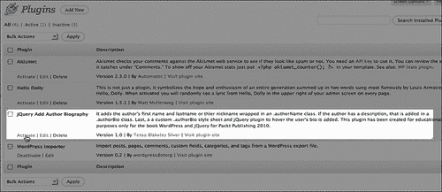

插件激活后，我们可以导航到该站点以查看其运行情况：

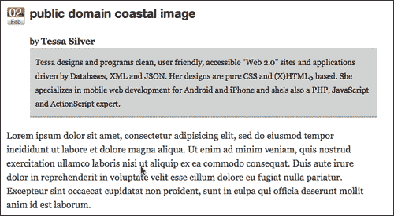

它起作用了！主题中没有`the_author_meta`标签，现在在下面显示作者的全名和生物描述。传记描述是使用我们插件类中的 CSS 规则设计的。

现在，您已经手工编辑了一个主题，并通过从头创建 WordPress 插件进一步扩展了站点。干得好！但你说的是什么？你想多做一点 jQuery？你说得对。让我们通过创建 jQuery 插件来进一步增强这个站点。

# jQuery 插件的基础知识

我们将发现，与 WordPress 主题和插件相比，jQuery 插件实际上并没有那么复杂。

要设置 jQuery 插件，您需要遵循 jQuery 的**插件构造**。基本构造包括为插件设置 jQuery 函数，如下所示。注意添加到 jQuery 对象的粗体`.fn`。这就是使您的函数成为 jQuery 函数的原因。

```js
jQuery.fn.yourFunctionName = function() {
//code
};

```

在这里面，最好的做法是添加一个返回`this.each(function(){...})`；这样，您的函数将在 jQuery 选择器中的每个项中运行。

```js
jQuery.fn.yourFunctionName = function() {
return this.each(function(){
//code
});
};

```

与 WordPress 不同，它需要在主题 CSS 样式表和插件标题中使用特定格式的注释，jQuery 不需要注释掉的标题，但最好在顶部添加一个。

```js
/*
You can name the plugin
Give some information about it
Share some details about yourself
Maybe offer contact info for support questions
*/
jQuery.fn.yourFunctionName = function() {
return this.each(function(){
//code
});
};

```

请注意，封装插件并在插件*中使用的每个函数和方法必须*以“；”分号结尾。否则您的代码可能会崩溃，如果您压缩它，它肯定会崩溃。

这就是 jQuery 插件所需要的一切。现在，让我们用 jQuery 插件来增强 WordPress 插件的输出。

## 项目：jQuery 淡入子 div 插件

通过前面讨论的所需 jQuery 函数，我将编写一个基本函数，它不仅可以传递给主 jQuery 包装选择，还可以传递一个额外的选择器参数，以便很容易地将目标指向选择的子`div`，或者传递参数的 jQuery 选择的特定参数。

再次注意我的`authorHover`函数中的粗体注释：

```js
...
//sets up the new plugin function: authorHover
jQuery.fn.authorHover = function(applyTo) {
//makes sure each item in the wrapper is run
return this.each(function(){
//if/else to determine if parameter has been passed
//no param, just looks for the child div
if(applyTo){
obj = applyTo
}else{
jQuery pluginchild div pluginobj = "div";
}
//hides the child div or passed selector
jQuery(this).find(obj).hide();
//sets the main wrapper selection with a hover
jQuery(this).css("cursor", "pointer").hover(function(){
//restyles the child div or passed selector
// and fades it in
jQuery(this).find(obj).css("position","absolute")
.css("margin-top","-10px").css("margin-left","-10px")
.css("width","400px")
.css("border", "1px solid #666").fadeIn("slow");
}, function(){
//fades out the child selector
jQuery(this).find(obj).fadeOut("slow");
});
});
};

```

就这些。现在我们已经创建了 jQuery 插件脚本，让我们首先在主题中快速测试它。我们所要做的就是将名为`jquery.authover.js`的新 jQuery 插件嵌入主题*中*下的`wp_enque_script`调用*下的*钩子，并用一个简单的脚本调用它：

```js
...
<script type="text/javascript">
jQuery(function(){
jQuery(".authorName").authorHover();
});
</script>
...

```

我们可以在我们的网站上查看结果。我抓取了两个屏幕截图，以便您可以看到淡入效果。在下面的屏幕截图中，您可以看到新的`div`开始淡入：

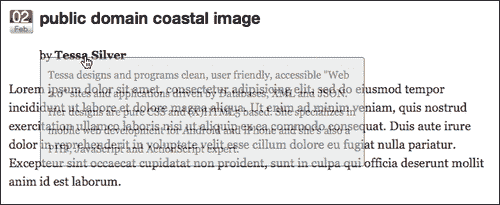

在下一个屏幕截图中，您可以看到已完成的淡入淡出动画：

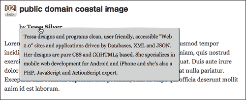

### 额外积分：将新的 jQuery 插件添加到 WordPress 插件中

现在你可以自由地去安装你的 WordPress 插件，并根据需要在尽可能多的网站上安装 jQuery 插件！但是，如果您想知道，是的，我们可以进一步改进安装过程，将这个 jQuery 插件合并到我们的 WordPress 插件中。

第一步是将我们的`jquery.authover.js`脚本放到插件目录中，然后使用`wp_enqueue_script`调用它。您需要特别注意`wp_enqueue_script`函数的这种用法，因为如果 jQuery 1.4.2 还没有在主题或插件中注册，那么它也将包括 jQuery 1.4.2！这意味着客户机的站点（尚未包含 jQuery）不需要担心！只要安装这个插件就会自动包含它！

```js
...
function addjQuery() {
wp_enqueue_script('authover',
WP_PLUGIN_URL . '/add_author_bio-tbs/jquery.authover.js',
array('jquery'), '1.4.2' );
}
...

```

然后，我们将向 WordPress 插件添加一个函数，该函数写入使用插件的`authorHover`函数的 jQuery 脚本。通常情况下，这会更好，建议通过`wp_enque_script`功能加载所有脚本，但对于非常小的定制脚本，您肯定不会发生冲突，而且您知道 jQuery 已经正确加载（正如我们使用插件一样），如果您愿意，您可以硬编码脚本标记，如下所示：

```js
...
function addAuthorHover(){
echo '<script type="text/javascript">
jQuery(function(){
jQuery(".authorName").authorHover();
});
</script>';
}
...

```

最后，我们添加了将调用这些函数的操作过滤器：

```js
...
add_action('init', 'addjQuery');
add_action('wp_head', 'addAuthorHover');
?>

```

现在，如果您从主题中删除 jQuery 插件并确保插件已激活，您应该会看到与之前完全相同的结果！在下一个屏幕截图中，您会注意到我已经在我的个人资料中添加了一个 URL，现在，**查找更多**功能集可以在没有 URL 的情况下自动降级。精彩的

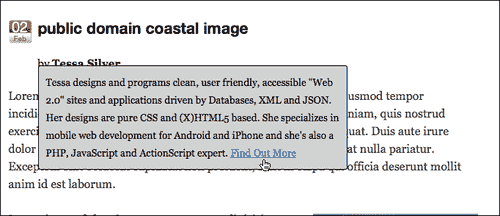

# 把它们放在一起：编辑主题还是创建自定义插件？

在本章中，我们了解了编辑主题、创建 WordPress 插件和 jQuery 插件是多么容易。对于大多数 WordPress 开发工作，在主题中添加 jQuery 增强功能就可以了。如果您觉得 jQuery 脚本有点麻烦，并且允许您编辑主题（当然，假设您没有破坏布局或显著改变外观），您可能会发现，能够将 WordPress 内容包装在带有特殊`class`或`id`属性的自定义 HTML 标记中是一个巨大的帮助和时间节约。

本章的项目示例的“假设客户端请求”还表明，如果有任何机会，您的工作可以或将被重用或部署跨越多个单独的 WordPress 安装，您应该考虑将工作封装在 jQuery 插件、WordPress 插件中，或者正如我们所发现的那样。

除了考虑您的工作是否需要重用或部署外，您还可以考虑 JQuery 增强和 WordPress 主题的使用寿命。很容易认为 jQuery 增强实际上更像是主题的一部分，因为它在视觉上影响主题，但它真的是吗？我发现，我的 WordPress 和 jQuery 开发的很大一部分似乎都集中在将 jQuery 开发封装到 WordPress 插件中，或者使用 jQuery 使 WordPress 插件更有效。

由于只有两种方式可以将 jQuery 包含到 WordPress 站点中，即通过主题或插件，如果您对编辑和创建插件感到满意，您可能会开始发现这是更好的方式（当然，总会有例外）。使用 jQuery 增强 WordPress 插件，甚至将 jQuery 插件封装在 WordPress 插件中，这将允许您轻松地独立扩展主题设计和任何 jQuery 功能/增强。

如果你确实喜欢重新设计或更新你的主题，或者你有一个客户有点“主题交换快乐”，这种方法非常有用。如果您想保持 jQuery 增强的表单、图像和图库轻拳击以及其他各种功能，甚至只是为站点创建的“漂亮的眼罩”，而不必反复手动更新新主题，那么创建插件就是一条捷径，无论是 jQuery、WordPress 还是两者兼而有之。

最终，这取决于您和您的舒适度，以及什么对项目最有利，但我发现，除了少数例外（我们将在后面的章节中介绍这些例外），试图阻止大多数 jQuery 增强嵌入 WordPress 主题对我有好处。

# 总结

您现在应该了解以下内容：

*   WordPress 主题、WordPress 插件和 jQuery 插件是什么。
*   如何编辑主题并创建自己的基本 WordPress 和 jQuery 插件。
*   了解何时编辑和自定义主题，或制作 WordPress 插件、jQuery 插件或所有三种插件的最佳实践！

有了这些信息，我们将进入下一章，在那里我们将看看如何使用 jQuery 插件和即插即用 WordPress 插件。我们还将讨论使用 jQuery 增强和扩展 WordPress 插件的功能。准备好使用 lightbox 模式窗口和使用易于使用的表单的 wow 用户。