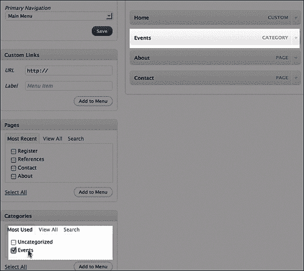

# 四、少花钱多办事：使用 jQuery 和 WordPress 的插件

在这一点上，您对 jQuery 和 WordPress 的基础知识以及将它们集成在一起的不同方式有了足够的了解，从而可以开始真正地在解决方案中发挥创造性。在本章和接下来的三章中，我们将卷起袖子，为一些经常需要的项目制定解决方案，并开始让 jQuery 在我们的 WordPress 站点中做一些有用的、非常酷的工作。

我们将把 WordPress 和 jQuery 的所有可用组件放在一起。在本章中，我们将：

*   使用非常健壮和流行的 jQuery 插件 ColorBox，由*Jack Moore*的 Color Powered 开发。
*   我们还将使用 Deliciousdays 的*Oliver Seidel*开发的强大而流行的 WordPress 插件 cforms II。
*   然后，我们将自定义默认主题，使其与 cforms II 和 ColorBox 无缝配合，为我们的站点提供无缝的事件注册体验。
*   我们还没完！然后，我们将使用 jQuery 增强 cform II 已经很好的验证，以获得流畅的用户体验。

准备好让你的 WordPress 网站开始工作吧！

# 项目概况：无缝事件登记

虽然我们将继续使用默认主题，但我们将为本章的 jQuery 增强设想一个不同的假设客户机和场景。

在这种情况下，“客户”是一个非营利/意识团体。他们在 WordPress 网站上创建了一个**事件**类别，每当计划一个新的事件时，每个事件的协调人都会将即将发生的事件的信息发布到事件类别中。

他们的大多数活动都是免费的，但非常混乱，因为由每个协调员决定如何通过电子邮件或电话接受活动注册。人们会感到困惑，并通过电子邮件向网站上的错误人员发送电子邮件，然后就无法确定谁将参加哪些活动，因此组织的领导可以从繁忙的活动协调员那里收集统计数据，以便跟踪活动对他们的事业有多大的影响。

好消息是，我们仍然可以帮助他们解决这一切。

## 客户想要什么

在坐下来讨论所有选项之后，他们最终想要一个简单的登记表，可以将活动名称传递给它，然后通过电子邮件发送给活动管理员，由其在各种活动组织者之间分发 RSVP。

他们还收到了注册者的反馈，他们抱怨活动的发布日期让他们感到困惑：他们不注册活动，因为除非协调员将日期加粗或放在标题中，否则看起来活动是在那天发生的，或者是在过去发生的。因此，客户希望他们的事件帖子模板重新设计并清理一点，以便更容易将其识别为事件，而不是站点上的其他帖子。

最后，也是最重要的一点，他们最近在多个网站上看到的反馈和其他形式给他们留下了深刻的印象和影响，并且非常希望他们的注册表格在模式框中打开，这样人们可以在**事件**页面上注册事件。当他们注册完一个事件后，他们可以继续浏览**事件**类别，并轻松注册更多。

# 第一部分：做好一切准备

幸运的是，我们掌握了一些 WordPress 和 jQuery 知识，这项任务并不像听起来那么复杂。在最后一章中，我赞扬了将设计和功能分开并将 jQuery 增强功能包装在 WordPress 插件中的优点。我还提到了一个事实，即总是有例外。好的，这里有一个场景，我们倾向于将我们的增强直接应用于主题，原因有两个：

*   我们已经在调整主题，为事件创建自定义类别页面
*   此外，我们还需要为表单创建一个自定义页面模板，该模板可以加载到模式框中，而无需重新加载站点的其余页眉和页脚

因为这些请求要求客户理解，如果他们想要更新或交换主题，他们需要小心，我们不妨充分利用 WordPress 主题 API 为我们提供的增强功能。

## 我们需要什么

让我们从增强的主要部分开始：我们需要一个具有电子邮件功能的表单和一个模式框来加载它。剩下的部分，我们将使用一些自定义 jQuery 脚本和对 WordPress 主题的自定义。

### 色盒

对于模式框，有几个好的 jQuery 插件。您可能听说过 ThickBox，它非常好，但出于几个用途和美学原因，我自己更喜欢 ColorBox。

您可以从这里下载 jQuery ColorBox 插件：[http://www.colorpowered.com/colorbox/](http://www.colorpowered.com/colorbox/) 。

### 注

**为什么是彩盒而不是厚盒？**

ThickBox 插件与 Wordpress 捆绑在一起，我是 ThickBox 的忠实粉丝，但我也更喜欢 jQuery LightBox 的简单性（jQuery LightBox 仅适用于图像）。当我遇到 ColorBox 时，我印象深刻，原因如下：

*   ThickBox 和 ColorBox 插件都提供了模式窗口，不仅仅是图像。
*   您可以调用内联元素、外部文件和 iFrame 以及基本 AJAX 调用。没问题。

然而，与 ThickBox 相比，ColorBox 有一些优势。对于 ColorBox，*Jack Moore*确实花了一些时间和精力为模式窗口设计了五种非常流畅的样式，并为更高级的开发人员提供了一组很好的回调和扩展函数。其次，模态窗口组件的所有图像加载（透明背景、关闭、**下一步**和**后退**按钮）都完全在样式表中处理，因此设计师很容易定制模态窗口的样式。有几次，我不得不手工编辑`thickbox js`文件，以便在图像与`plugins js`文件的关系不是 ThickBox 所希望的那样或者需要添加新图像的情况下，正确加载图像。

最后，ThickBox 依赖于您手动将`.thickbox`类属性添加到要从中启动模态窗口的元素。虽然这种方法对于那些拥有手工编码一切的奢侈的 web 开发人员来说非常有效，但对于技术含量较低的用户来说，在 WordPress 这样的发布平台中实现这种方法是一件痛苦的事情。必须通过将管理面板编辑器设置为**HTML**并在标记中自定义添加`class`属性来指导（和哄骗）客户是非常痛苦的。这些都不是 ColorBox 所必需的。它很容易用 jQuery 选择器控制，因此主题或插件开发人员可以根据 WordPress 的 HTML 输出进行选择，从而允许内容编辑器只关注其内容，而不需要任何 HTML 理解。

### Cforms II

为了创建注册表单，我们有很多 WordPress 插件可供选择，但我发现最好的插件是**cforms II**。Cforms II 预先声明：“不可否认，Cforms 不是最简单的表单 mailer 插件，但它可能是最灵活的。”他们是对的。在使用它一次之后，你会发现它比你想象的要容易得多。

您可以从这里下载 WordPress cformsII 插件：[http://www.deliciousdays.com/cforms-plugin/](http://www.deliciousdays.com/cforms-plugin/) 。

### 安装 WordPress 插件

下载 cforms II 插件后，应按照开发人员提供的安装和激活说明进行操作。

本质上，这需要解压包，将`cforms`目录放在 WordPress 安装的`wp-content/plugins`目录中，然后导航到管理员的**管理插件**页面。然后为插件选择**激活**。


一旦你安装并激活了插件，让我们开始使用它。

### 使用 cforms II 设置登记表

cforms II 插件为技术性不强的 WordPress 管理员提供了许多强大的表单构建功能。作为一个技术性更强的 WordPress 开发人员，它可以为您节省大量时间。cforms 管理界面确实需要一段时间才能习惯，但它是我在 WordPress 中使用过的最强大、最灵活的表单插件。

CformsII 是一个复杂的插件，需要大量的管理不动产和几个屏幕页面。因此，一旦激活插件，您将在左侧的管理区域中找到一个全新的面板。


cformsII 允许使用 AJAX，因为它将提交和更新表单，而无需重新加载页面。它还允许非常容易地创建所有基本类型的表单元素：`input, select, check`和`radio`框以及`textarea`框。您可以使用`legend`文本标记在自定义`fieldset`标记中包装表单元素，以便于相关表单元素的分组。

内置了强大的服务器端验证功能。分配必填字段和检查有效电子邮件地址非常容易。除此之外，您还可以轻松地为自定义验证分配自己的自定义正则表达式。cforms**救命！**面板甚至为您提供了可以使用的正则表达式的有用示例。


### 提示

**安全设置 cforms II**

您需要阅读 cforms 文档，如果可能的话，还可以与网站管理员或主机提供商的技术支持人员聊天。您需要仔细检查**全局设置**面板，确保您安装的 cforms II 尽可能安全，以满足您对表单的需求。

如果可能的话，尝试使用 Captcha 字段来减少垃圾邮件，如果不需要的话，关闭文件上传功能。

#### 平衡：表单应该简短、简单，并且能够检索有用的信息

表单的目标是在从用户那里获得尽可能多的信息，而不让他们觉得你要求的个人信息太多，或者，如果没有其他要求的话，填写太多字段会让他们感到厌烦，这两者之间取得平衡。

我把这份登记表写得很简短，切中要害。首先，我填写表单名称并将其设置为启用了 Ajax 的。这将帮助我们解决问题，因为页面将加载到模式框中，所以刷新后不会弹出到模式窗口之外的新页面中。


接下来，使用已经提供的默认表单集，让我们设置一个带有`legend`文本的`fieldset`，以及事件协调员在计划事件时需要知道的五种表单输入。

首先是事件，也就是说，事件的名称将通过 post 传递，而不是由用户填写，但我想显示它，它需要在表单元素中以电子邮件形式发送给管理员。

在事件字段之后，我们需要询问用户名。由于没有钱被交换，而且这个表单更需要一个“人头数”，所以我把它留给了一个单独的字段。这是一个必填字段，但我允许用户随意或正式。

接下来，我们将询问电子邮件地址。这是必需的，我使用右边的复选框选择了服务器端验证。如果用户建议他们可以为活动带来一些东西，活动协调员可能希望回复他们并与他们重新联系。此外，可能需要向注册者广播有关活动的最新信息，因此有效的电子邮件至关重要。

现在，让我们设置一个选择框，询问注册人可能会带来多少客人参加活动。


最后，消息区是一个文本区，其中有一些文本建议注册人提供带东西，如果他们可以，说明他们可以在消息区带什么。

好啊这是我们的表格。为了查看它，现在需要将它放在 WordPress 页面或帖子中。我们将把它放在它自己的页面上，这意味着我们应该在 WordPress 中创建该页面。

### 使用 WordPress 3.0 的自定义菜单选项创建注册页面

如果您查看管理面板左侧的 Pages 列，您现在将看到 pageMash 插件是选项的一部分。

我们只需从**页面**下左侧菜单的选项中选择**添加新**，并创建一个名为**寄存器**的页面。我们将内容区域留空，但您会注意到，在**编辑**视图中，页面/帖子的编辑面板中有一个**cforms**按钮。


单击该按钮将允许您选择要放置在页面上的表单（您可以在 cforms II 中创建多个表单，甚至可以在一篇文章或页面中放置多个表单，但这对于我们来说太过分了）。选择表单后，应该会看到它的占位符。


您现在应该可以在站点的**注册**页面中看到您的表单，如以下截图所示：


## 使用 WordPress 3.0 的自定义菜单选项

然而，我们不希望**注册**页面出现在我们的页面导航中，我们需要它位于自己的模板页面中，这样它就能更好地加载到我们的模式框中，而不需要主题的页眉和页脚图形和样式。我们需要修改模板，但首先，让我们在 WordPress 3.0 中创建一个自定义菜单，该菜单将覆盖**页面**菜单，然后我们可以轻松指定应该显示哪些页面，以便注册页面不会出现在我们的网站导航中。

首先，您需要导航到管理面板中的**外观**菜单。到达后，您可以单击+（加号）选项卡创建一个新菜单，然后从右侧选择“选项”添加到该菜单中。然后，您可以在右上面板中将菜单设置为“主导航”，这将覆盖默认主题标题中的标准页面导航。以下屏幕截图说明了设置新主导航并将其指定为站点主导航的三个主要步骤：


您还可以将**事件**类别包括在菜单中，如以下屏幕截图所示（我们稍后需要访问此页面）：



好啊我们现在有一个“隐藏”页面，里面有我们的注册表格。让我们从主题定制开始。

## 定制主题

同样，我们需要以两种方式自定义主题：首先，我们需要一个自定义页面模板来保存我们的注册表单，该表单将加载到模式框中；其次，我们需要创建一个自定义类别模板并对其进行修改，以便只显示分配给**事件**的帖子分类并启动模式框，其中包含注册表格。

### 创建自定义页面模板

首先，我们需要创建一个新的页面模板，我们可以将注册页面分配给它。我们将首先创建一个**page.php**模板的副本，并将其重命名为**registration-page.php**。


此表单的全部要点是加载到 ColorBox 模式窗口中，因此使用主题的页眉和页脚样式会有点分散注意力。我们将从这个模板页面中删除`get_header()`和`get_footer()`WordPress 模板标记命令。

接下来，虽然我们不需要页眉和页脚样式，但我们确实需要页面是一个在 jQuery 中加载的格式正确的 HTML 页面。我们将手动添加一个 doctype，并从`header.php`文件借用一些 WordPress 头代码，仅从`body`标记到该模板循环的开头，如下所示：

```js
<!DOCTYPE html PUBLIC "-//W3C//DTD XHTML 1.0 Transitional//EN" "http://www.w3.org/TR/xhtml1/DTD/xhtml1-transitional.dtd">
<html  <?php language_attributes(); ?>>
<head profile="http://gmpg.org/xfn/11">
<meta http-equiv="Content-Type" content="<?php bloginfo('html_type'); ?>; charset=<?php bloginfo('charset'); ?>" />
<title><?php wp_title('&laquo;', true, 'right'); ?> <?php bloginfo('name'); ?></title>
<link rel="stylesheet" href="<?php bloginfo('stylesheet_url'); ?>" type="text/css" media="screen" />
<link rel="pingback" href="<?php bloginfo('pingback_url'); ?>" />
<?php wp_enqueue_script("jquery"); ?>
<?php wp_head(); ?>
<style type="text/css">
<!--
.cform fieldset{
border:1px solid #036;
}
.success{
font-size: 140%;
font-weight: bold;
}
-->
</style>
</head>
<body>
...

```

您会注意到，与`header.php`文件的`head`标记代码相比，我们简化了很多。我们不需要担心这个页面上的评论或边栏，所以这些 PHP WordPress 代码已经被删除。我们确实需要 jQuery 来加载，而且我还添加了一些手动样式，cforms 使用这些样式来稍微修饰我们的表单。

然后我们将添加这个新的页脚标记；仅模板页面循环下方的结束正文和 HTML 标记：

```js
...
<?php wp_footer(); ?>
</body>
</html>

```

### 提示

**定制模板页面时不要忘记插件挂钩**

注意，我确保了`wp_head()`和`wp_footer()`被手动放置在我们的注册模板页面中。许多插件需要这些挂钩在主题中才能工作。如果您要创建自定义页面，请确保它们包含在页眉或页脚中，或者如果主题的`header.php`和`footer.php`文件不包含，请手动将它们放入，就像此模板页面那样。

最后，为了将这个新页面识别为 WordPress 的特殊模板，我们必须在注释掉的 PHP 文档顶部添加一个**模板头**，如下所示：

```js
<?php
/*
Template Name: Register Form
*/
?>
...

```

### 注

与我们在[第 3 章](03.html "Chapter 3. Digging Deeper: Understanding jQuery and WordPress Together")中的插件一样，*深入挖掘：一起理解 WordPress 和 jQuery*，确保在`<?php`标记前没有空格或硬返回。否则，您可能会收到关于已发送的头的错误。

现在，如果我们回到管理面板右侧的**注册**页面，我们将看到我们的新页面模板可分配给该页面。


现在我们可以看到，如果我们使用浏览器的地址栏导航到我们的**注册**页面的 URL，它将加载而不使用任何其他 WordPress 样式，并准备加载到我们的 ColorBox 模式窗口中。


这是我们解决方案的前半部分。现在让我们完成它。

### 创建自定义类别模板

我们现在需要为**事件**类别创建一个特殊的类别模板。同样，我们希望每个事件都有一个注册链接。该链接将把活动的标题传递到注册表中。


首先，如果您回想一下[第 3 章](03.html "Chapter 3. Digging Deeper: Understanding jQuery and WordPress Together")中的模板层次，*深入挖掘：一起理解 WordPress 和 jQuery*，那么`category.php`模板页面胜过`archive.php`模板页面。事实证明，我们使用的默认模板没有`category.php`页面。我们将通过复制`archive.php`页面并将其命名为`category.php`来创建一个。

但是等待；我们不希望这个页面只显示*任何*类别。我们只想显示事件类别。您还可以从[第 3 章](03.html "Chapter 3. Digging Deeper: Understanding jQuery and WordPress Together")*中回忆起，更深入的挖掘：一起理解 WordPress 和 jQuery*，您可以通过一个特定的`category-ID.php`模板页面，如**category-3.php**进一步胜过`category.php`模板。

碰巧在我的本地 WordPress 设置中，事件类别的 ID 是 3，因此我们将命名该文件。


### 注

**查找您的类别 ID**

如果您在自己的 WordPress 安装中工作，则在创建类别时会分配类别 ID 号。首先，您需要确定您的**事件**类别的 ID 号。您可以通过导航到管理面板中的**帖子**页面并选择**事件**类别下的**编辑**来完成此操作。然后，您可以在该类别的**编辑**页面中查看 URL。在 URL 的最后，您将看到类别的 ID 号。


我们现在准备为**事件**页面定制`category-3.php`模板。

首先，正如我们在上一章中看到的，这个页面从`loop.php`模板页面调用`get_template_part( 'loop', 'category' )`函数。实际上，我们只需要为**事件**类别*事件*定制一个非常简单的设置。虽然我们当然可以用一个额外的自定义循环来更新`loop.php`的`if...else`语句（这超出了本书的范围，请继续关注 Packt 即将推出的**WordPress 3.0 主题设计**书！），对于这个定制客户端项目，我们只需注释掉对该循环的调用，并添加我们自己的非常简单的循环，由于模板层次结构，该循环将只在我们的**事件**类别页面上工作。

```js
<?php
//start the loop:
while (have_posts()) : the_post(); ?>
<div <?php post_class() ?>>
<h2 id="post-<?php the_ID(); ?>" class="entry-title">
<a href="<?php the_permalink() ?>" rel="bookmark"
title="Permanent Link to
<?php the_title_attribute(); ?>">
<?php the_title(); //adds the title ?></a></h2>
<div class="entry">
<?php
//add the content
the_content() ?>
</div>
<?php //add the registration button ?>
<p><a class="register"
href="/wp-jqury/register/?evnt=<?php the_title(); ?>">
Register</a>
</p>
<div class="register-separate"></div>
</div>
<?php endwhile; ?>

```

### 注

如果您还没有这样做，您可能希望停用我们在上一章中构建的**添加作者简介**插件。这对于这个项目来说是不必要的，尽管激活它并没有什么坏处（它只是放在活动的帖子里）。

注意，在底部的循环中，我们制作了一个引用 register 表单的`link`标记。我已经向该链接添加了一个名为`evnt`的**变量字符串**，并使用`get_title()`模板标记添加了事件的标题，如图所示：

```js
...
<p><a class="register"
href="/wp-jqury/register/?evnt=<?php the_title(); ?>">
Register</a>
</p>
<div class="register-separate"></div>
...

```

现在我们将返回模板页面的顶部，并确保标题有意义。顶部有一堆`if...else`语句，检查返回的内容是否来自存档、类别或标记（请记住，此页面是从默认模板的`archive.php`页面复制的）。由于这个模板页面现在只会加载事件帖子，所以我们并不真正需要所有的 PHP，但这并没有什么坏处。通常，我们希望添加一个带有以下标记和代码的主标题：

```js
...
<h1 class="pagetitle"> Upcoming Events <?php single_cat_title(); ?></h1>
...

```

这将在页面上为我们提供一个名为**即将到来的事件**的标题（或者您自己实际命名的**事件**类别，即节目、派对等，您可以命名它。`single_cat_title()`模板标签将为您拉入）。

在主题的`style.css`页面的最底部，我们将添加以下规则来设置注册链接的样式，并将其向右浮动：

```js
...
.register {
display:block;
background-color: #ccc;
border: 1px solid #069;
width: 100px;
padding: 10px;
text-align: center;
}
p a.register{
float: right;
}
.register-separate{
clear:both;
padding-top: 10px;
border-bottom:1px solid #999;
}

```

当我们现在查看事件帖子时，我们将看到我们的事件帖子，在底部有一个指向**寄存器的动态链接：**


## 让 jQuery 参与游戏计划

好吧我不知道你的情况，但我觉得那是相当多的准备工作。现在，当我们加载 ColorBox 插件并编写一些最终定制的 jQuery 脚本时，所有这些都将汇集在一起。

### 包括彩盒插件

在我们的主题中，让我们创建一个`js`目录，并在该目录中创建一个名为**colorbox**的附加目录。这将允许我们为 ColorBox 插件放入 CSS 表和图像辅助资料中，并保持一切整洁，并以它在**ColorBox.CSS**表中喜欢的方式工作。


我们将解压我们的 ColorBox 插件，并将缩小的版本移到我们的`js/colorbox`目录中。然后我们将从`example1`文件夹中取出样式表和辅助资料（我最喜欢它，条纹、透明的背景和圆角非常好），并将它们放入**colorbox**目录中。然后，我们将转到主题的`header.php`文件，并在主题的主样式表下方包含**colorbox.css**样式表，如图所示：

```js
...
<link rel="stylesheet" type="text/css" media="all"
href="<?php bloginfo( 'stylesheet_url' ); ?>" />
<link rel="stylesheet" href="<?php bloginfo('stylesheet_directory'); ?>/js/colorbox/colorbox.css" type="text/css" media="screen" />
...

```

然后，在`wp_head`函数上方，我们将使用我们在前面章节中学习的方法，利用脚本 API，添加我们的主 jQuery include 以及 ColorBox 插件，如图所示：

```js
...
wp_enqueue_script( 'jquery' );
wp_enqueue_script('colorbox', get_bloginfo('stylesheet_directory') . '/js/colorbox/jquery.colorbox-min.js', array('jquery'), '20100516' );
...

```

### 编写自定义 jQuery 脚本

现在，在我们`js`目录的根目录中，我们创建一个新的`custom-jquery.js`文件，并确保将其包含在我们的`header.php`文件中，下的*我们的颜色框包括如下内容：*

```js
...
wp_enqueue_script('custom-jquery', get_bloginfo('stylesheet_directory') . '/js/custom-jquery.js', array('jquery'), '20100510' );
...

```

现在就开始享受 jQuery 的乐趣吧。既然我们已经经历了手工将 ColorBox 插件添加到 WordPress 主题中的麻烦，那么我们不妨确保它除了可以加载我们的注册表单外，还可以加载图像。

为了确保 ColorBox 只加载图像，而不是页面上的每个链接，我们将考虑一些例子，回到[第 2 章](02.html "Chapter 2. Working with jQuery in WordPress")，*在 WordPress*中使用 jQuery，并进行一些创造性的选择。我们将此规则添加到我们的`custom-jquery.js`文件中：

```js
jQuery(function(){
jQuery(".entry-content a:has(img)").colorbox({height:"98%"});
});//end docReady

```

此选项仅适用于`.entry`类中*具有*缩略图`img`标记的帖子中的标记链接。没有其他链接将激活 ColorBox。


现在，为了让注册页面启动 ColorBox，我们将更聪明一些。虽然我添加了一个`.registration`类，但我不想依靠它来启动 ColorBox。唯一应该触发模式窗口的链接是指向注册表的链接，所以我一定会选择它。在我的`cb-registration.js`文件中，在我的 document ready 函数中，在我的 image select`colorbox`函数之后，我将添加以下脚本：

```js
...
jQuery("a[href*='register']")
.colorbox({iframe:true, width:"500px", height: "600px"});
...

```

这个特定的 jQuery 选择器将再次确保，在 ColorBox 的 iframe 模式下，只有在`href`属性中包含`register`一词的链接（星号`*`就是用来表示这个词的）才会触发 ColorBox 模式窗口。

您会注意到，我还使用 ColorBox 的可用参数为注册表的模式框设置受约束的高度和宽度。

现在，只有我们的注册链接和带有缩略图的图像链接启动 ColorBox：


## 将其整合在一起：需要一个小小的 cforms II 黑客

您会记得，我们设置了注册链接，通过**GET call**（有时称为**变量字符串**）将 URL 中的事件名称传递给注册表单。

目前，cforms 管理面板无法获取该变量，但有一种快速且非常常用的“黑客”方法可用于 cforms，以确保您可以将自己的自定义变量传递给表单。

cforms II 为它可以获取的变量创建小括号内的模板名称，比如添加变量模板：`{Title}`将显示表单所在的帖子或页面标题。我们希望从另一个页面向它传递一个帖子标题（而不是手动将此表单添加到每个事件帖子），因此我们将向 cformsII 插件添加我们自己的变量模板。

### 提示

**定制插件？保持大量的笔记！**

WordPress 和 jQuery 开发人员通常会不断更新和完善他们的插件。您最好的选择是尝试找到一个不需要您编辑实际插件源文件的解决方案。但是，与本例一样，如果您发现确实编辑了插件源文件，请将您自己的`customization-readMe.txt`文件添加到目录中，并详细记录您在插件中修改或编辑的内容。当开发者发布和升级他们的插件时，尤其是 WordPress 插件，有时需要更新以跟上当前 WordPress 核心版本，当你更新插件时，你将丢失你的修改和黑客攻击。你的笔记将使它们很容易重新整合。

在 cforms II 插件目录中，找到`lib_aux.php`文件。在第 421 行附近，在代码后面，看起来像`...$m = str_replace( '{BLOGNAME}',..`。增加该行代码：

```js
...
$m = str_replace( '{Event}', esc_attr($_GET['evnt']), $m );
...

```

然后，在我的注册表单的 cforms 管理面板中，我们现在可以将**{Event}**变量添加到我添加到插件中的`lib_aux.php`页面的`Event`字段中。我们还要确保字段设置为“只读”。


为了清楚起见，我希望事件名称也显示在表单的标题中。标题不是 cforms 的一部分，而是页面模板的一部分。在我的主题目录中，我将打开`registration-page.php`，在第 41 行标题的`the_title()`模板标记旁边，我将添加以下代码：

```js
...
<h2><?php the_title(); ?> for: <?php $evnt = esc_attr($_GET['evnt']); echo $evnt;?></h2>
...

```

当表单启动时，您现在将在标题和事件字段中看到事件的名称，该字段设置为只读，用户不可编辑。现在，当表单提交并通过电子邮件发送给管理员时，就可以清楚地知道注册的目的是什么。


我们现在有了一个事件页面，它显示了用户即将发生的事件，并允许用户无缝地注册那些按计划在模式窗口中加载的事件。干得好！让我们看看如何让这种体验变得更好。

# 第 2 部分：表单验证确保提交的内容正确无误

好消息是，cformsII 提供了漂亮、令人敬畏的 CSS 样式，服务器端验证已经内置并准备就绪。您可以看到，如果我在表格上单击**提交**而没有填写所需的详细信息，或者电子邮件地址格式不正确，则表格会重新加载，显示不正确的字段。


但是为什么要等到用户点击**提交**按钮？虽然**服务器端验证**是必要的，也是正确验证数据的唯一方法，但通过添加一点**客户端**验证，使用 jQuery，我们可以在用户处理表单时提醒他们缺少详细信息或数据格式不正确，从而轻松增强和加快用户的处理过程。

### 注

**为什么服务器端验证很重要？**

数据验证或防止格式不正确的信息被提交和发送到服务器时，决不能依赖使用 JavaScript 和 jQuery 的客户端验证。用户可以在浏览器中禁用 JavaScript，然后提交他们想要的任何值（有时使用格式不正确的值通过表单侵入服务器）。因此，客户端验证只应用于*增强*用户体验，而不是实际保护服务器或数据完整性。

## 客户端验证的诀窍：不要只告诉他们错误！

每个人都对积极的反馈做出回应。通过使用 jQuery 和一些样式，您可以让用户知道他们正确填写了字段，并准备继续前进，而不是等待用户弄乱或忘记字段。

使用 Inkscape，我制作了一组简单的“检查”和“x”图标，它们可以作为背景图像应用于 jQuery 添加的范围。使用 CSS sprite 图像技术调整背景位置以显示“check”或“x”图标，用户可以直观地快速查看表单字段是否正确填写，是否可以继续。


### 空白输入验证

为了建立这个基本的验证，我们将编写一个 jQuery 脚本，为输入项进行选择，并在`blur`上设置一个函数。让我们将脚本放在循环代码正下方的`registration-page.php`中，`wp-footer()`钩子上方，如图所示（请注意代码中的粗体注释以及每个 jQuery 语句的作用）：

```js
...
jQuery(".cform :input").blur(function(){
/*this "if" makes sure we don't target the submit button or email field*/
if (jQuery(this).val() != "Submit") {
/*this "if" targets only empty fields*/
if (jQuery(this).val().length == 0) {
jQuery(this).after('<span class="wrong"> ! </span>');
}else{
/*"else" otherwise field is fine*/
jQuery(this).after('<span class="correct"> thanks. </span>');
}//end if no length
}//end ifelse !submit
});//end blur function
...

```

前面的代码为无效的空字段或快速的`thanks`追加了一个感叹号（`!`）。对于一个有效的，填写的。然而，当用户聚焦并模糊输入字段时，跨度会不断增加`after`功能。为了补偿这一点，我们将添加一个在`focus`上工作的自定义脚本，就在`blur`脚本的下面。它将删除`after`附加的跨距，如图所示：

```js
...
jQuery(".cform :input").focus(function(){
jQuery(this).next("span").remove();
});//end focus function
...

```

这为我们提供了一些非常好的基本验证，用于检查空白输入。您会注意到，我们的`span`标记对它们进行了类修改。我已经将“check”和“x”图像添加到主题的图像目录中，现在，在主题的`style.css`样式表的最底部，我将添加以下类规则：

```js
...
/*for registration form*/
.wrong{
display:block;
float:right;
margin-right: 120px;
height: 20px;
width: 20px;
background: url(images/form-icons.png) no-repeat 0 -20px;
text-indent: -3000px;
}
.correct{
display:block;
float:right;
margin-right: 120px;
height: 20px;
width: 20px;
background: url(images/form-icons.png) no-repeat 0 0;
text-indent: -3000px;
}

```

最终的结果是，当您用鼠标或制表符在字段中移动时，会出现一个非常漂亮、明显的视觉显示，但在单击**提交**按钮之前，将两个必填字段留空。


### 格式正确的电子邮件验证

让我们再向前迈出一小步。将电子邮件地址留空是一回事，但如果格式不正确，我们不妨指出。Steve Reynolds 在他的网站上发布了一篇关于使用 jQuery 验证电子邮件地址的精彩文章。你可以在这里读到：[http://www.reynoldsftw.com/2009/03/live-email-validation-with-jquery/](http://www.reynoldsftw.com/2009/03/live-email-validation-with-jquery/) 。

Steve 的代码演示特别有趣，值得一看，因为他使用 jQuery 的`keyup`函数实时检查电子邮件表达式的验证。

出于我们的目的，我们将借用 Steve 的正则表达式函数，并将其应用到我们已经开始的验证检查中，该检查对`blur`函数有效。

首先，在我们现有的脚本下面，我们将添加 Steve 的`isValidEmailAddress`函数，如下所示：

```js
...
function isValidEmailAddress(emailAddress) {
form validatione-mail address, validatingvar pattern = new RegExp(/^(("[\w-\s]+")|([\w-]+(?:\.[\w-]+)*)|("[\w-\s]+")([\w-]+(?:\.[\w-]+)*))(@((?:[\w-]+\.)*\w[\w-]{0,66})\.([a-z]{2,6}(?:\.[a-z]{2})?)$)|(@\[?((25[0-5]\.|2[0-4][0-9]\.|1[0-9]{2}\.|[0-9]{1,2}\.))((25[0-5]|2[0-4][0-9]|1[0-9]{2}|[0-9]{1,2})\.){2}(25[0-5]|2[0-4][0-9]|1[0-9]{2}|[0-9]{1,2})\]?$)/i);
return pattern.test(emailAddress);
}//is valid e-mail
...

```

接下来，我们将仔细查看现有脚本。我们要做的是，在检查值为 nothing（`val().length == 0`后，我们将再次检查输入字段是否不是电子邮件字段。

使用 Firefox 和 Firebug，我探索了 DOM，发现电子邮件字段表单有一个名为`.fldemail`的独特类。

我们将把新语句作为当前 if 语句的扩展，在常规的`else`语句之前加上一个`else if`语句。

我们更新的`blur`脚本现在如下所示（请注意新的电子邮件验证，`if...else`声明以粗体显示）：

```js
...
jQuery(".cform :input").blur(function(){
/*this if makes sure we don't target the submit button or email field*/
if (jQuery(this).val() != "Submit") {
/*this "if" targets empty fields*/
if (jQuery(this).val().length == 0) {
jQuery(this).after('<span class="wrong"> ! </span>');
/*This "else if" targets if the field is the email field*/
}else if(jQuery(this).hasClass("fldemail") == true){
var email = jQuery(this).val();
/*Run's Steve's function and return true or false*/
if(isValidEmailAddress(email)){
//This shows the user the form is valid
jQuery(this).after(
'<span class="correct"> thanks. </span>');
}else{
//This shows the user the form is invalid
jQuery(this).after('<span class="wrong"> ! </span>');
}//if...else
//end email check
}else{
/*otherwise field is fine*/
jQuery(this).after('<span class="correct"> thanks. </span>');
}//end if no length
}//end if...else !submit
});//end blur function
...

```

我们现在不仅可以检查空字段，还可以检查字段输入的`blur`上的有效电子邮件地址：


### 提示

**验证提示：不要过火！**

cforms II 插件服务器端验证已经足够了。同样，我们只是尝试通过一点客户端验证来加快速度，而不是让用户失望，因为我们已经为数据创建了一系列严格的格式规则。有些人的电话号码或邮政编码的格式可能与您预期的稍有不同，对于大多数意图和目的来说，这是可以的。最好的方法是使用 jQuery 验证来提示提示和内联帮助并指导用户，而不是强制他们遵守确切的数据格式。

# 最后的想法和项目总结：都是关于优雅的堕落

与使用 jQuery 所做的一切一样，您需要记住，您正在创建非常有用的增强功能，但是如果出于某种原因，用户没有启用或可用 JavaScript，则该过程或站点不会中断。

我们的客户对我们的无缝注册解决方案非常满意。在禁用 JavaScript 的情况下完成注册过程，使用标准的浏览器返回键，注册过程可以正常工作。我发现的唯一缺点是注册表加载到 WordPress 主题的之外，这是我们必须做的，这样它会很好地加载到 ColorBox 模式窗口中。

总的来说，我不认为这是一个大问题。通过查看我的各种网站统计数据，我很难找到一个没有启用 JavaScript 的访问者。两到三个不使用文本浏览器的用户可能是纯文本浏览器，因此可能根本不会注意到 WordPress 主题的缺乏（事实上，对于使用文本到语音浏览器的残疾用户来说，这可能是一件好事，因为他们不必费力地浏览标题信息才能进入表单）。

因为我们总是在这个标题中考虑假设，如果有机会，客户端决定在禁用 JavaScript 的情况下，希望表单在 WordPress 模板中的 ColorBox 之外工作，我提出了以下解决方案：

首先，您需要将表单加载到*两个*WordPress 页面中。一个名为`register`，正如我们使用特殊模板所做的那样，另一个名为`register-b`（这只是 permalink slug，标题在两个页面上仍然可以说**Register**。对于`register-b`页面，您不会分配特殊模板；您会将**页面模板**保留为**默认模板**。您可以将 cform 放置在任意多的页面和帖子上，因此将此表单放在两个位置肯定不会有问题。

接下来，您将进入`category-3.php`事件模板页面，并更改链接以调用替代的默认主题页面，如下所示（注意粗体`-b`是与原始链接的唯一区别）：

```js
...
<p><a class="register" href="/wp-jqury/register-b/?evnt=<?php the_title(); ?>">Register</a></p>
...

```

最后，在您的`custom-jquery.js`文件中，您只需创建一个 jQuery 脚本，通过删除`-b`来重写指向模式页面表单的`href`链接。确保将此脚本*放在*您的 colorBox 函数脚本之前，只是为了确保在设置 colorBox 函数之前进行`href`转换。

```js
...
jQuery("a[href*='register']").each(function(){
this.src = this.src.replace(/register\-b/, "/register/");
});
...

```

如果启用了 JavaScript，jQuery 将更改所有注册`href`实例，整个过程将使用 ColorBox 插件按计划进行。如果没有，用户将使用标准的 WordPress 主题表单进行注册，而不是更聪明。

正如您在以下屏幕截图中所看到的，如果禁用 JavaScript，表单将作为站点的一部分加载：


# 总结

我们现在已经学会了如何：

*   真正利用主题来帮助 jQuery 增强
*   使用 jQuery ColorBox 插件和一些自定义脚本增强非常健壮的 cforms II WordPress 插件

这只是实现这个特殊解决方案的众多方法之一！由于本书的目的是在 WordPress 中使用 jQuery，因此我选择了一条更关注 jQuery 和可访问 WordPress 特性的路线。但是可以肯定的是，我们可以将 ColorBox 插件插件化；我们本来可以把整件事都搞定的！或者制作了一个扩展了 cforms 插件的插件。解决方案策略的列表几乎是无穷无尽的。

同样，您需要查看每个项目并进行相应的评估。在下一章中，准备好用一些基于 HTML 和 CSS 的图表动画、图像库幻灯片和旋转器，以及其他一些巧妙的方法来吸引用户的注意力。