# 五、WordPress 中的 jQuery 动画

我们将继续学习 jQuery 和 WordPress 的知识，同时深入研究使用 jQuery 制作动画。动画是 jQuery 的强大套件之一，虽然您可能会将动画视为轻浮或廉价的把戏，只是为了“吸引眼球”，但如果正确实现，它会非常有用。

CSS 属性、颜色和界面元素的 jQuery 动画可以确保用户清楚地看到警告、错误和确认消息。动画还可以使界面对象淡入淡出视图，以获得更好的用户体验。最后但并非最不重要的一点，一点“赏心悦目”肯定不会损害网站的兴趣和受用户欢迎程度。

在本章中，我们将使用动画来：

*   抓住用户的注意力并将其引导至警报
*   节省空间，并通过一系列旋转的粘帖设置动画
*   创建一些光滑的动画鼠标悬停效果和简单的动画图表

让我们开始将有用的高端动画应用到我们的 WordPress 站点。

# jQuery 动画基础

首先，我们已经对 jQuery 动画有了一些经验。让我们刷新一下：在[第 2 章](02.html "Chapter 2. Working with jQuery in WordPress")中*在 WordPress*中使用 jQuery，在*事件和效果*部分，我们了解了以下功能：`show(), hide(), fadeIn(), fadeOut(), fadeTo(), slideUp(), slideDown()`和`slideToggle()`。我还提到了`animate()`和`stop()`功能。

我们已经在[第 2 章](02.html "Chapter 2. Working with jQuery in WordPress")中的先前项目中使用了其中的几个功能，*在 WordPress*中使用 jQuery；[第三章](03.html "Chapter 3. Digging Deeper: Understanding jQuery and WordPress Together")*深入挖掘：共同理解 jQuery 和 WordPress*；以及[第四章](04.html "Chapter 4. Doing a Lot More with Less: Making Use of Plugins for Both jQuery and WordPress")*用更少的资源做更多的事情：使用 jQuery 和 WordPress*的插件，特别是`show()`和`hide()`以及`fadeTo()`和`slideToggle()`的插件。正如我们所看到的，这些快捷功能很容易满足大部分动画需求，但同时也受到它们的限制。现在让我们仔细看看`animate()`函数，并对 jQuery 动画进行一些精细的控制。

## CSS 属性变魔术

`.animate()`函数允许您设置任何*数值*CSS 属性的动画。像素`px`是大多数数字属性值的公认标准，但您可以指定`em`和`%`（百分比）单位。您可以在方便的`.css()`函数中放置的几乎任何东西都可以在`.animate()`函数中使用。

此外，您可以向任何属性添加快捷方式字符串`"show", "hide"`和`"toggle"`，而不是数值。它们将从 0 到 100 取值，反之亦然，或者从 0 或 100 切换到相反的数字。

让我们来看看这个聪明的函数的例子。记住，您需要将编写的任何 jQuery 脚本放在 document ready 函数中：`jQuery(function(){//code here})`；也在`<script>`标记中，以便在 DOM 完成加载后启动 jQuery：

```js
...
jQuery('.post p').animate({ fontSize: '140%',
border: '1px solid #ff6600',}, 3000);
...

```

此片段将为页面上的所有`.post p`段落标记设置动画，增加字体大小并添加边框。

您会注意到，我添加了一个没有单个数值的`border`属性。您还将注意到，当您在站点上测试此代码时，边界不会以动画形式显示；相反，它只是在动画完成时出现在最后。添加非基本数值的 CSS 属性（如边框或背景色、十六进制值）不会产生动画效果，但您可以使用`.animate()`函数添加所有 CSS 属性，一旦*完成*运行，该函数将与`.css()`函数类似。这可能不是添加常规 CSS 属性的最佳方式，但如果您正在为某些内容设置动画，只需知道您可以添加其他非数字 CSS 属性，它们就不会设置动画。

### 提示

**你的房子坏了？**

您可能早在[第 2 章](02.html "Chapter 2. Working with jQuery in WordPress")中就注意到了`.css()`函数，*已经在 WordPress*中使用了 jQuery，但以防万一您没有注意到：属性名必须是**驼峰大小写**才能被`.animate()`和`.css()`函数使用。这有点让人困惑，因为您可能只是将它们视为在实际 CSS 样式表中使用的属性，但您需要指定`paddingBottom`而不是`padding-bottom`和`marginRight`而不是`margin-right`。

### 让它多姿多彩

您可能同意，尽管`.animate()`函数很酷，但如果没有颜色，它就不会给人留下深刻的印象（而且在动画结束时，颜色会突然发生一些变化）。你渴望穿越褪色的灿烂色彩。谁不呢？不幸的是，核心动画功能不够强大，无法计算单个十六进制 web 颜色中的所有数字方差，更不用说两个十六进制颜色之间的差异了（我们只需说，涉及到一些严肃的数学问题）。这比将值从 0 移动到 100 或再次向下移动要复杂得多。

好消息是，动画功能可以通过颜色插件*扩展*。还有更好的消息吗？是的，这个插件与 WordPress 捆绑在一起！

让我们将这个插件添加到我们的主题`wp_enqueue_script`中，如下所示：

```js
...
<?php wp_enqueue_script("jquery-color"); ?>
<?php wp_head(); ?>
...

```

### 提示

**注册并包含只需在特定页面上加载的脚本？**

在[第 2 章](02.html "Chapter 2. Working with jQuery in WordPress")*中，您可以在 WordPress*中使用 jQuery，将您的`wp_enqueue_script()`函数封装在`if`语句中，这些语句使用 WordPress 的条件标记来检查站点所在的页面：`is_home()`或`is_front_page()`或`is_admin()`等等。一定要利用这些优势来帮助您的网站尽可能优化运行，并且不会因为加载不需要的脚本而不必要地降低运行速度。要了解更多关于条件标记的信息，请查看它们在[第 2 章](02.html "Chapter 2. Working with jQuery in WordPress")中的脚本 API、*在 WordPress*中使用 jQuery，以及[第 9 章](09.html "Appendix A. Appendix: jQuery and WordPress Reference Guide")、*jQuery 和 WordPress reference*中的条件标记快速参考。您也可以在[查看 WordPress 的抄本 http://codex.wordpress.org/Conditional_Tags](http://codex.wordpress.org/Conditional_Tags) 。

同样，这个插件*扩展了*现有的`.animate()`函数，因此没有新的属性需要学习！一旦你将颜色插件加入到你的项目中，你就可以根据你的内心内容以背景颜色制作动画。

```js
...
jQuery('.post p').animate({'backgroundColor':'#99ccff'}, 2000);
...

```

您现在应该可以看到`.post`段落优雅地淡入淡蓝，如下一个屏幕截图所示：

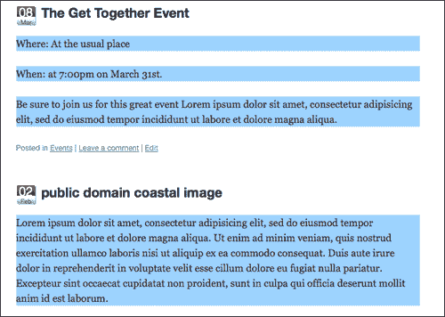

## 放松控制，轻松应对

如果您熟悉使用各种视频编辑工具或 Adobe Flash 制作动画，您可能听说过轻松制作。**放松**是动画中的加速和减速控制。它最常见的用途是给动画一种更自然的感觉，模仿现实世界中的各种物理特性，而不是计算和僵硬的运动。

easing 几乎与设置十六进制颜色值的动画一样复杂，它使用各种算法将虚拟物理属性应用于正在设置动画的对象，以控制动画开始和结束时的速度。严肃的数学。jQuery 附带了一种内置的易用性，因此我们不必真正考虑任何一种。

jQuery 的默认宽松选项称为“swing”。从技术上讲，有两种选择——“线性”和“摆动”。**线性放松**只是沿着对象的值从点 A 到点 B 设置动画，就像一个好的编程脚本应该做的那样。没有加速或减速，所以是的，它有点“僵硬”。

**挥杆放松**开始更慢，获得全速，然后在动画完成时再次减速。jQuery 选择 swing 作为默认的放松选项，因为它在大多数情况下看起来都是最好的。这可能是因为这是我们现实世界中大多数物体的反应方式；在获得速度的同时稍微减速，然后在静止时减速并减速（前提是物体在最高速度时没有撞到任何东西）。

由于 Swing Opple 是默认的 Ty1 T1，让我们看看我们以前的脚本，动画在我们的文章的段落蓝色背景颜色，看看我们是否能发现差异：

```js
...
jQuery('.post p').animate({'backgroundColor':'#99ccff'
}, 2000, 'linear');
...

```

这很微妙，但肯定有区别。线性宽松要严格得多。

### 提示

**高级放松：有一个插件！**

正如你可能猜到的，很多“mathy”的人已经在 easing 算法中找到了各种各样的变化，以模拟各种不同的物理环境，是的，有一个 jQuery 插件。虽然这个插件没有和 WordPress 捆绑在一起，但这不应该阻止你下载和试用它。您可以在此处下载并测试所有可用的缓解选项：[http://gsgd.co.uk/sandbox/jquery/easing/](http://gsgd.co.uk/sandbox/jquery/easing/) 。

该插件与颜色插件一样，*扩展了*的`.animate()`功能，为您提供了超过 25 个缓和选项，其中包括一些非常酷的选项，如 jswing bounce 和 elastic，以及大量向量缓和路径，如圆形和正弦波。

对于我参与过的大多数项目来说，这些选项中的大多数都有点过头了，但我确实喜欢弹性和弹性放松选项。顺便说一句，如果你是我刚才提到的那些“马太”人中的一员，你会喜欢在这里查看放松算法背后的魔力：[http://www.robertpenner.com/easing/](http://www.robertpenner.com/easing/) 。

## 计时就是一切：排序、延迟和控制动画

同样，如果您熟悉动画，无论是传统动画、视频还是 Flash 多媒体作品，您可能已经学会了-*时间就是一切*。对动画计时和播放的控制越多越好。例如，放松取决于给对象设置动画和移动的时间。无论你想让一个物体移动得多么“平滑”，如果你只给它一秒钟或更短的时间让它穿过屏幕，它看起来都会相当不平稳。让我们来看看三个主要的方法来处理你的时间和回放。

### 让你的鸭子排成一排：把它们拴起来

我们在前面的章节中已经讨论了链接函数，您很可能知道，在 jQuery 语句中链接在一起的任何事件都是按照它们被*附加到*的顺序开始的。据我所知，根据专家们的说法，你可以无限地（或直到浏览器崩溃）将你想要的功能链接到你的心上。

总的来说，我发现将 jQuery 函数放在单独的行中，使用它们自己的选择器集，可能会占用一些空间，但会使您的 jQuery 脚本更有组织性和可管理性。请记住，您总是使用包装器集的初始选择器来启动 jQuery 语句，但是基于可以在 DOM 中移动并使用自己的选择器的附加链接函数，您会发现您可以在一条语句中移动并影响整个 DOM！在这个过程中，可能会生成一些非常出色的“意大利面代码”，很难理解，并且会让任何必须与您合作的开发人员都恨您。

但是，对于需要在单个初始选择器集上运行的函数，特别是动画函数，我非常喜欢 jQuery 链，因为它们有助于将动画序列保持在我希望它们启动的顺序上，而且很清楚什么包装器集将受到该链的影响。

下面是一个例子：

```js
...
jQuery('.post:first').hide().slideDown(5000, 'linear').fadeTo('slow', .5);
...

```

现在，即使最初简洁的动画链也会变得有点复杂。没关系；与某些脚本语言不同，JavaScript 和 jQuery 依赖分号“；”作为清晰的结束语句，而不是实际的行尾。因此，您可以将链组织成单独的行，以便更容易遵循和编辑，如下所示：

```js
...
jQuery('.post:first')
.hide()
.slideDown(5000, 'linear')
.fadeTo('slow', .5);
...

```

### 推迟订单！

因为计时就是一切，我经常发现我想要一个函数的动画完成，然而，根据放松选项，特别是那些*弹性*或*反弹*的，我不一定希望下一个函数启动得这么快！从 jQuery1.4 开始，使用`.delay()`功能可以轻松**暂停**链。让我们在链中暂停三秒钟，如下所示：

```js
...
jQuery('.post:first')
.hide()
.slideDown(5000, 'linear')
.delay(3000)
.fadeTo('slow', .5);
...

```

### 提示

**检查您的 jQuery 版本！**`delay()`**需要 1.4+**

一旦这个函数可用，我就把它用在我的 jQuery 动画中，以各种无价的方式使用。但是，如果您发现延迟函数不适合您，那么您可能正在使用 jQuery 的 1.3.2 或更高版本。延迟功能仅适用于版本 1.4+。您可能想回到[第 2 章](02.html "Chapter 2. Working with jQuery in WordPress")*在 WordPress*中使用 jQuery，并了解如何从 Google CDN 注册 jQuery 或将其直接包含在您的主题中。

### 插队

排队等候那些令人恼火的队伍，以确保每个人或其中的每件事都得到公平处理，并按照他们到达的顺序进行。jQuery 的动画队列的工作原理类似，只处理每个对象的动画请求，按照它分配给对象的顺序。有时，特殊的需求和要求会出现，不应该被迫在队列中浪费时间。

到目前为止，我们已经看到了`.animate()`函数，除了 CSS 属性外，还可以传递各种可选参数，指定*持续时间*（慢、快或数字毫秒）和*放松*（摆动、线性或插件扩展放松）的类型。

`que`参数是一个**true 或 false**布尔值，如果您不希望动画函数必须等待轮到它，则可以设置该参数。对于希望一个对象有多个动画并行运行的实例，如同时滑动*和淡入*，禁用动画功能中的`queue`即可。

为了在代码中设置`queue`选项，您必须*将*所有其他选项包装成更高级的语法，清楚地标记每个可选参数，而不是使用我们之前使用的语法，如下所示：

```js
...
jQuery animationqueue, jumpingjQuery('.post:first')
.hide()
.fadeTo(0, .1)
.css("height","5px")
.animate({
height: '+=500px',
},
{
duration: 4000,
easing: 'swing',
queue: false
}
)
.fadeTo(4000, 1);
...

```

下面的屏幕截图显示该帖子在*淡出的同时*的高度也在变化：

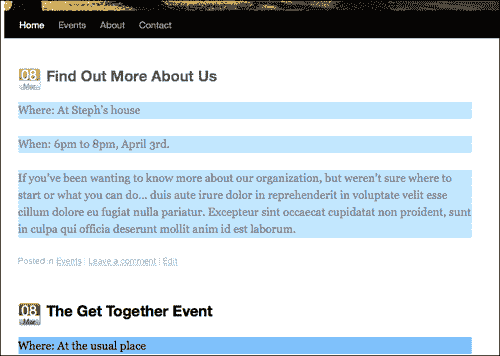

你可以从前面的截图中看到，我们刚刚编写的代码在*中的第一个`.post`div 消失，而*正在向下滑动。如果您将`false`更改为`true`，然后重新加载页面，您会发现第一个`.post`div 会一直向下滑动到`500`像素高*，然后*逐渐消失。

### 逐步完成

可以传递到`.animate()`函数的最终选项是`step`和`complete`。`step`参数允许您设置一个附加函数，该函数可以在动画的每个步骤完成后调用（如果您有多个正在制作动画的 CSS 属性，有时会很有用）。`complete`参数允许您在整个动画功能完成时指定回调函数。请记住，可以将多个动画函数链接在一起，并且具有完整参数的步骤对于它们所属的动画函数的每个实例都是唯一的。

如果您的动画在当前动画功能完成之前绝对不应该启动，`.delay()`功能可能不是最好的方式。您可以使用`step`和`complete`参数按照您希望的顺序启动其他功能和动画。

```js
...
jQuery('.post:first')
.hide()
.fadeTo(0, .1)
.css("height","5px")
.animate({
height: '+=500px',
},
{
duration: 4000,
easing: 'swing',
queue: false,
step: function() {alert('step done!');},
complete: function() {alert('completely done!');}
}
)
.fadeTo(4000, 1);
...

```

前面的代码片段将在`.animate()`函数完成步骤后生成 JavaScript 警报。

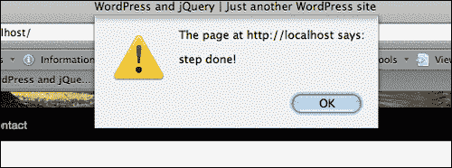

我个人从来都不需要为 WordPress 项目钩住`step`参数，但我可以看到它对于钩住并创建一系列级联类型效果非常有用。我发现完整的`parameter`对我的许多动画非常有用。

# 抓住用户的注意力

好了，撇开示例代码片段不谈，是时候开始工作了！回到“假想之地”，我们以前的客户已经热情地向一些同事兜售了我们的 jQuery 解决方案，现在我们收到了很多关于 WordPress 网站的帮助请求。让我们浏览一些新的假设客户情况，看看我们是否能够解决他们的问题。

首先：许多网站使用“粘性”帖子的一种常见方式，以及如何通过一点 jQuery 动画来增强这些帖子。

## 项目：制作预警贴动画

这里有一个简单快捷的方法。你有一个客户，他有一个好朋友，他经营着一个非营利教育组织的网站，他们需要帮助（意思是，请“免费”做这个）。

该组织的课余照护按公立学校的时间表进行（因为许多孩子都是从不同的学校乘公共汽车过来的）。如果公立学校系统需要下雪或其他紧急情况，课后计划也会关闭。该组织尽最大努力通过 WordPress 网站通知人们。

尽管向家长明确表示，他们有责任检查网站，或者打电话了解中心的日程安排，但还是有一些人与他们产生了误解，他们声称他们检查了网站，但*没有看到关闭警报*。显然，尽管他们一直在使帖子“粘”起来，所以它们保持在顶部，但这些帖子看起来与网站的其他内容非常相似。

你很乐意提供帮助（特别是当他们被一位收入丰厚的客户介绍给你时）。这是一个非常容易解决的问题，这很有帮助。首先，你可以简单地将一些`.sticky`样式添加到主题的`style.css`文件中，这使得粘性帖子在网站上更加突出。

他们已经明确表示，他们只对日托中心和其他影响该组织中心大楼向公众开放的中心警报使用“粘性”功能，因此您决定在谷歌上快速搜索“creative”`commons, public domain, alert icon svg"`，并从[下载一个非常好的 SVG 文件 http://commons.wikimedia.org/wiki/File:Nuvola_apps_important.svg](http://commons.wikimedia.org/wiki/File:Nuvola_apps_important.svg) 。

让我们将 SVG 文件打开到 Inkscape 中，并将其大小缩小到 48 像素宽，以保存一个透明的`.png`（我冒昧地给阴影添加了一点模糊，但您可能不想）。命名 PNG`sticky-alert.png`。

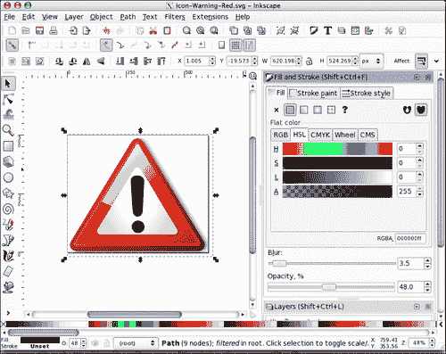

然后，您将新的`sticky-alert.png`图像添加到主题的图像目录中，并更新位于*最底部或*现有`.sticky`类下方的样式表（如果存在的话），以及`.sticky`调用的一些类规则，如：

```js
...
/*change the .sticky background */
.home .sticky { background-color: #ffff9c;}
/*add the icon to the entry-content div inside the sticky post*/
.home .sticky .entry-content{
background: url(images/sticky-alert.png) no-repeat 0 20px; }
/*nudge the paragraph and lists out of the way of the icon*/
.home .sticky .entry-content p,
.sticky .entry-content ul{margin-left: 60px;}
...

```

以下屏幕截图显示了新重新设计的粘性帖子：

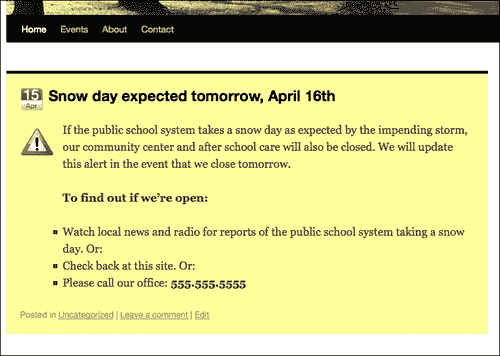

这已经足够好了。现在，无论 JavaScript 是否可用，任何访问该站点的人都肯定会注意到这一点。但是，嘿，既然你一直在探索主题，而且你已经决定注册 jQuery，WordPress 捆绑包中的 jQuery 颜色插件，并在他们的`header.php`文件中包含一个`custom-jquery.js`页面，那么你最好添加这几行漂亮而简单的代码。

```js
jQuery(function(){
jQuery('.home .sticky')
.animate({'backgroundColor':'#ff6600'}, 'slow')
.animate({'backgroundColor':'#ffff99'}, 'slow')
.animate({'backgroundColor':'#ff6600'}, 'slow')
.animate({'backgroundColor':'#ffff99'}, 'slow');
});

```

前面的代码将使我们的粘性帖子从浅黄色变为深橙色，然后*再次重复*以强调重点。下图显示了已褪色为深橙色的帖子：

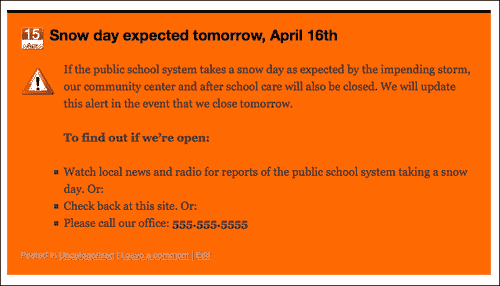

同样，在书中看到动画有点困难，但我们只是确保警报`.sticky`帖子在加载时会逐渐变为橙色（`#ff9900`），然后变为黄色（`#ffffcc`），然后再重复一次，以获得“橙色警报”效果。

现在，警戒站非常引人注目，组织对你的感谢之情溢于言表！这对你几分钟的工作来说已经足够了。

## 创建简单的动画图形

非营利组织对您的 alert sticky post 解决方案印象深刻，他们一起分配了一些资金，并收到了另一个请求。他们注意到你是如何使用 Inkscape 设置警报图标的，他们还问你，为他们发布的另一篇帖子生成月度图表会有多麻烦。这篇文章是他们绿色回收计划的前五大统计数据。

虽然项目符号列表对于站点管理员来说非常容易实现，但人们并没有真正注意到或记住这些信息，因此他们考虑将图表发布到站点，但需要有人以某种方式绘制或生成它们。

浏览他们的网站，你会发现编辑总是对发布的信息进行一致的格式化。所有帖子标题中都有**“……每月统计数据”**，所有信息都以项目符号表示，百分比数字总是在一个冒号**：**之后*。这是伟大的，管理一直如此一致。这将使我们很容易找到一个解决方案，让编辑继续做他们一直在做的事情。当前的帖子如下所示：*


您可以让管理员知道，只要他/她继续以这种方式一致地格式化帖子，您就可以编写 jQuery 脚本，为他们绘制图表。他们几乎不相信你，并且很高兴你继续。

为了开始，我们需要首先确保我们只针对**月度统计**的正确帖子。我们将通过如下方式设置 jQuery 选择器来实现这一点：

```js
...
jQuery('
.post h2:contains(Monthly Stats)')
.siblings('.entry-content')
.children('ul:first')
.css({background: '#ccffee'});
...

```

我们可以看到，这个小的“测试”选择捕获了`.posts`中所有只包含文本“Monthly`Stats"`的`h2`标记。然后我们沿着 DOM 移动，目标是`.entry-content`div，然后是**第一个**`ul`在这里面。我们可以看到前面的代码通过更改背景颜色来正确定位我们在这些帖子中想要的内容，如下一个屏幕截图所示：

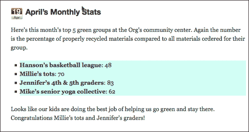

现在，我们可以针对我们想要的特定帖子，而无需更改主题的输出或让我们的客户做任何工作，让我们开始处理图的其余部分！

首先，因为我们将加载一个背景图像，而这些图像只是从主题的样式表中加载得更好（更容易定位图像），所以让我们再次使用 Inkscape 来帮助我们创建一个大约 450 像素宽的基本背景，显示从“刚开始”到“是”的过程，如下所示：

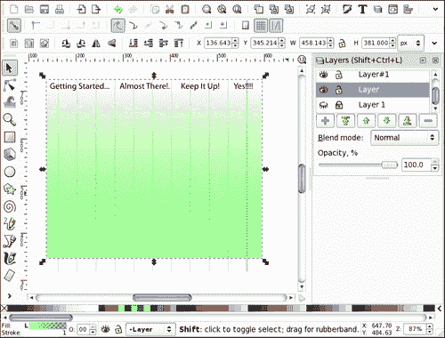

让我们导出该图形的 PNG，并将其添加到客户主题的图像目录中。然后，使用 jQuery，让我们向所有目标`ul:`动态添加一个类

```js
...
jQuery('.post h2:contains(Monthly Stats)')
.siblings('.entry-content').children('ul').addClass('greenStats');
...

```

现在我们可以进入客户机的主题样式表，就像我们对 sticky alert 帖子所做的那样，为我们的新类创建自定义 CSS 规则。打开主题的`style.css`样式表，并在末尾添加以下规则：

```js
...
.entry-content .greenStats{
margin: 0;
background:url(images/greenBackground.png) no-repeat;
border: 1px solid #006633;
padding: 40px 20px 5px 20px;
}
.entry-content .greenStats li:before{content:none;}
.entry-content .greenStats li{padding-left: 10px; margin: 0}
...

```

第一条规则添加了新的`greenBackground.png`图表图像，并设置了一些基本属性，以便列表项可以开始适应即将添加的 jQuery。接下来的两条规则将解决客户主题（在本例中为默认主题）放置在`.entry-content`div 中的每个`li`元素上的特定`.entry-content li`问题。我们不希望在图表项之前有“小正方形”，我们希望每个`li`上的填充位置移近`10px`左右。同样，如果 jQuery 添加了我们的`.greenStats`类，那么我们只想影响`.entry-content`li 项，因此我们一定要将该类名添加到 CSS 规则中。

现在，我们已经准备好使用一些严肃的 jQuery 魔术了。我希望到目前为止，您在使用选择器和遍历 DOM 方面已经非常自如了。为了完成接下来的几项任务，我们将不得不投入大量的知识。

我们想在目标`li`上放置一个`.each()`功能项，并开始操作其中的内容。

我们将首先设置以下 jQuery 语句：

```js
...
jQuery('.post h2:contains(Monthly Stats)')
.siblings('.entry-content').children('ul').children('li')
.each(function(){
//code here
});//end jQ li
...

```

接下来，*在*我们的`.each()`函数中，我们将在每个`li`对象中放置开始操作 HTML 和文本的代码。我们要寻找冒号“：”并用它作为一个点，在后面的数字周围加上一个`div`。在那之后，我们将寻找结束的`</li>`标记，并以此作为结束我们开始的`div`的点。我们将使用如下的`.text()`和`.replace()`函数来实现这一点：

```js
...
var string1 =
jQuery(this).text().replace(': ',':<div class="nVal">');
var string2 = string1.replace('</li>','</div></li>');
//place back into the li element as html markup and text:
jQuery(this).html(string2);
...

```

前面的代码片段现在为我们提供了自定义的`div`类`.nVal`，我们可以开始使用它。`.nVal`分区最终将成为我们绿色统计图中的“条形图”！在前面的代码下面，我们将继续用下面的代码充实我们的`.each()`函数，再次在函数中充实*：*

```js
...
//set the default css values of each nVal div:
jQuery(this).children('.nVal').css({width: '0',
padding: '10px 0 10px 20px', fontSize: '130%',
color: '#ffffff', marginBottom: '5px'});
//retrieve the number text from inside the nVal div:
var nVar = jQuery(this).children('.nVal').text();
//animate the nVal divs with the nVar values:
jQuery(this).children('.nVal').delay(600)
.animate({backgroundColor: '#006600', width: nVar*(3.8)}, 2000);
...

```

在前面的代码片段中，请注意我使用了`.delay()`函数。如果您没有使用 jQuery 1.4.2 或更高版本的库，则该函数是可选的。我只是想暂停半秒钟左右，以确保用户注意到动画是有帮助的。

我们再次使用`.text()`函数从`.nVal`div 内部提取文本，并将其用于数学方程中，以`.animate()`函数计算 div 的`width`。我们将`nVar`乘以`3.8`，因为在我们的图表设计中，大约 380 像素宽的 div 宽度相当于 100%。如果您的图表有不同的维度，您应该相应地更改这些维度，以使图表栏正确地向外延伸。

结果看起来很棒！这是我们开始时的图表动画：

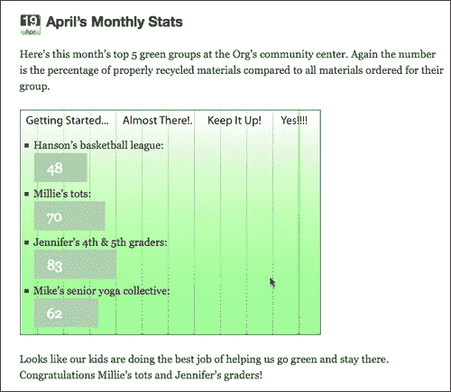

在这里，它是在它的完成，一个有趣的视觉清晰显示该组织的闪亮的绿色：

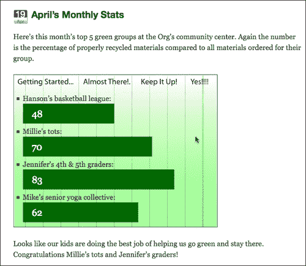

# 深入研究动画

多亏了你的绿色统计图表，你已经准备好接受一些稍微复杂的请求：客户*坚持*开发 Flash。作为 90 年代通过 Flash 进入 web 开发的人，对 Flash 开发的要求是没有问题的。你必须承认，你想抱怨什么就抱怨什么，Flash 肯定能搞活你。

然而，Flash 确实需要一个插件，尽管它是最流行的桌面浏览器插件，但它并不总是一种显示核心内容以确保每个人都能看到的好方法，更不用说网站导航等基本元素了。另外，尽管 Flash 是*台式机/笔记本电脑浏览器*最流行的插件，但对于 iPhone 的 Safari Mobile 和大多数智能手机的其他基于 WebKit 的浏览器来说，Flash 是一个“禁区”。

随着浏览器（尤其是移动浏览器）中 CSS 和 JavaScript 支持的不断进步，我对 Flash 请求的第一个问题总是：“当然。首先，告诉我你到底想做什么，我们拭目以待”。果然，我们的客户希望他们的主导航面板动画。

Flash 当然可以做到这一点，但 jQuery 也可以做到这一点，当 JavaScript 不是一个选项时，它将优雅地降级为样式良好的 CSS 元素，在最坏的情况下，如果没有 CSS，页面将把 WordPress 主题的干净、语义 XHTML 加载到纯文本浏览器中。

虽然有很多方法可以提供 Flash 内容和应用，因此它们可以优雅地降级为兼容的 HTML 替代品（在使用 Flash player 时，您应该*始终*提供这些替代品），但如果不必要，为什么还要添加额外的开发层和复杂性呢？客户不需要提供流媒体视频，也不需要定制卡通人物动画，更不需要一个深入的、多媒体拼接的**富界面应用**（**RIA**）。所以，让我们把 Flash 留给 Flash 做得最好的部分，并使用 jQuery 来增强我们客户的 WordPress 站点已经做得最好的部分。

幸运的是，在我们使用 Flash 之前，客户端是合理的，并且愿意看到 jQuery 可以做些什么。让我们给他们展示一下他们的 WordPress 站点是由什么组成的，并给他们一些 jQuery 的灵感。

## 项目：打造时尚导航

我们的 Flash 客户有一项业务，回收和改装 NASA 和其他航天机构废弃和出售的材料。他们希望他们的导航面板能够向用户展示这种未来感（同时也是复古感），并提供一个页面导航，根据客户的说法：“具有平滑的动画和我们的徽标/图标火箭作为指针”。

让我们继续准备主题，这样我们就可以开始了。我们将继续使用默认主题和我们在[第 2 章](02.html "Chapter 2. Working with jQuery in WordPress")中所做的页面导航 CSS 更改，*使用 WordPress*中的 jQuery。我们将通过一个平滑的缩进和释放动画来增强导航，该动画会在菜单项上下悬停时触发。我们将用一个很酷的浮点选择器（它也恰好是该站点的太空船图标）来结束它。

首先，我们需要将客户徽标中使用的太空船图标追踪到基本轮廓形式，以便我们可以使用它创建一个浮动指针。同样，使用 Inkscape 很容易做到这一点：

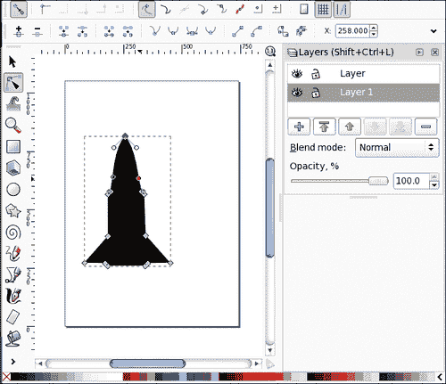

我们将在这里进行一个额外的步骤，旋转飞船，因为它将是一个透明的 PNG 文件，添加一个漂亮的阴影和余辉光泽，使其具有一定的深度：

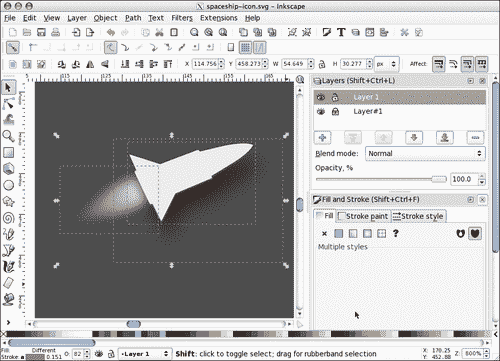

我们将此图像导出为 37 像素宽的透明`.png`。接下来，我们需要准备主题的样式表来接受这个背景图像。我们将在 jQuery 中创建一个名为`#shipSlide`的`div`来保存图像，因此我们的样式表需要容纳`id`名称：

```js
...
#shipSlide{
position: absolute; margin-top: 12px; margin-left: -7px;
width: 37px; height: 20px;
background: url(images/spaceship-icon.png) no-repeat;
}
...

```

### 注

同样，正如本书中的许多示例一样，为了保持流程简洁易懂，我们将尽可能直接地进行操作，但不一定尽可能优化。在现实世界的项目中，您可能希望为任何类似的项目创建一个单独的样式表，或者使用[第 3 章](03.html "Chapter 3. Digging Deeper: Understanding jQuery and WordPress Together")、*中介绍的技术将您的 jQuery 工作包装到插件中，甚至包装到 WordPress 插件中，*深入挖掘：一起理解 jQuery 和 WordPress。这一切都取决于您希望 jQuery 增强之后的灵活性和可移植性。

现在，我们将开始使用 jQuery。像往常一样，对于每个项目，您都要确保 jQuery 包含在主题中，并且您有一个`custom-jquery.js`文件，并将其设置为在其中工作。此外，对于这个导航，我们将使用颜色和颜色插件。您可以注册捆绑的颜色插件，但您需要下载并手动将自定义的颜色插件包含到主题中。从：[获取 http://gsgd.co.uk/sandbox/jquery/easing/](http://gsgd.co.uk/sandbox/jquery/easing/) 。

在我们特定的默认主题中，我们将从一些 jQuery 开始，以使 nav 的功能更加清晰。

jQuery 的第一部分如下所示：

```js
...
//this adds our #shipSlide div
//under the twenty ten theme's menu header div
jQuery('.menu-header').prepend('<div id="shipSlide"> </div>');
//this fades the ship div to 40%
jQuery('#shipSlide').fadeTo('slow', 0.4);
...

```

在我使用 jQuery 的`.fadeTo()`函数淡入`#shipSlide`div 之前，我将其加载到浏览器中，以检查并确保背景图像是从 CSS 加载的。下面的屏幕截图显示了正在萌芽的 jQuery 脚本加载并褪色的船舶图像：


好的，接下来，让我们设置一个基本的动画，将导航`li.page_item`对象从左侧推入，35 像素，相对于它们所在的位置。然后，我们还将针对标记并更改其背景色。我们将使用`.hover`函数确保在`li.page_item`对象的滚动和滚动时发生这种情况：

```js
...
jQuery('li.menu-item')
.hover(function() {
//animates each menu item to the right (from the left)
jQuery(this).animate({paddingLeft: '+=25px'}, 400, 'swing');
//this over rides the style sheet's background on hover
jQuery(this).find('a').css('background','none');
//ship move code will go here
}, function(){
//returns the menu item to it's location
jQuery(this).animate({paddingLeft: '-=25px'}, 400, 'swing');
});//end hover
...

```

最后，*在*第一个悬停函数中，就在 a 对象的彩色动画下方*处，我们将添加以下代码片段，将`#shipSlide`对象移动到`li.item_page`的位置（仅注意粗体代码）：*

```js
...
//this custom moves the ship image
var p = jQuery(this);
var position = p.position();
jQuery("#shipSlide").fadeTo('slow', 1)
.animate({marginLeft: position.left-175},
{duration: 600, easing: 'easeOutBack', queue: false});
...

```

在这里，我们设置了一个名为`position`的变量，还使用了一个名为`.position()`的函数来从`li.page_item`对象中提取一组信息。

`#shipSlide`对象的动画功能将飞船的`marginLeft`向左移动到`page_item`的`position.left`，减去 175 像素。

您还会注意到，在前面代码片段的`animate`函数中，我们将`queue`设置为`false`，并且我们使用的`easeOutBack`放松方法仅对我们可用，因为我们包含了放松插件。

我们需要的最后一段代码，下面的*代码`li.page_item .hover()`是另一个 jQuery 选择和`.hover()`函数，它将在`#mainNav`对象悬停时淡入淡出`#shipSlide`对象。同样，只需将此 jQuery 放在所有其他导航代码下面：*

```js
...
//this fades and moves the ship back to it's starting point
jQuery('.menu-header').hover(function(){
jQuery("#shipSlide").fadeIn(1000);
}, function(){
jQuery("#shipSlide").fadeTo('slow', .4)
.animate({marginLeft: '-5px'},
{duration: 600, easing: 'easeOutBack', queue: false});
});//end hover
...

```

最终结果看起来很棒，飞船和菜单项动画流畅，客户对新的时髦导航非常满意。


## 项目：创建旋转粘帖

早些时候，我们发现使用 WordPress 粘性帖子非常简单！很高兴知道这一点，因为我们的“我想要 Flash”客户现在要求提供额外的增强解决方案。他们使用 WordPress 的贴子让网站浏览者了解他们正在展示的产品。使帖子具有粘性非常有效，可以让他们的产品在最上面（通常一次两到四次），而他们的常规新闻帖子和更新在产品功能下面。

然而，当他们有两个以上的产品要展示时（特别是当他们有三个或三个以上的产品要展示时），他们当前的帖子会被推下，有时会被推到最底层。他们担心，如果人们不花时间向下滚动查看当前的帖子，只是偶尔浏览一下网站，可能会觉得网站过时了。

他们已经看到了很多网站的例子，这些网站有非常酷的图像旋转器，在特色项目的顶部有幻灯片或交叉淡入淡出效果，他们希望在他们的网站中使用类似的东西。他们原本以为可以在 Flash 中实现这一点，但由于 jQuery 导航面板的效果非常好，他们希望创建一个解决方案：

*   节省空间，因此其他帖子不会被推到“折叠下方”
*   看起来真的很不错，吸引了人们对粘性特性帖子的注意
*   这意味着他们的营销管理员仍然可以轻松地实施新的特色项目（就像创建帖子并将其标记为“粘性”一样简单！）

这个客户端的主题已经使 sticky post 的 CSS 发生了轻微的变化，因为有一个简单的背景，使得 post 具有暗渐变以及一些字体颜色的变化。您可以在主题的`style.css`样式表底部找到这些 CSS 规则：

```js
...
.sticky { background: #000 url(images/sticky-background.png)
repeat-x; color: #ccc;}
.sticky small.date{display:none;}
.sticky h2 a{color: #0099ff;}
...

```

结果是这样的，您可以看到，仅仅三篇粘性帖子就没有空间查看下面的当前帖子，并且给用户留下了相当多的滚动操作：

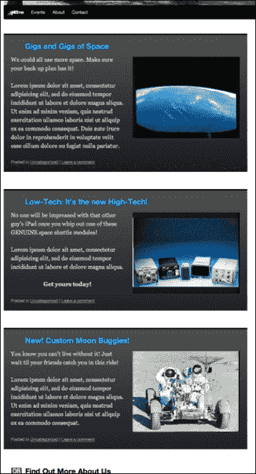

从本质上说，我们希望将这些胶粘物折叠起来，如果可能的话，可能会使它们变短一点，隐藏除*第一个*粘性贴子之外的所有胶粘物，然后继续在第一个上面的剩余贴子*中褪色。*

首先，这看起来很明显，但再次确保您已经注册并将 jQuery 与前面讨论的颜色和易用插件一起包含到主题中。您可以按照自己的意愿加入 jQuery，但我将使用 WordPress 3.0 包中的 1.4.2，如[第 2 章](02.html "Chapter 2. Working with jQuery in WordPress")所述，*在 WordPress*中使用 jQuery。通常，您还需要确保在主题中包含一个`custom.js`文件，这样您就可以将 jQuery 代码排除在 WordPress`header.php`模板之外（这也包括在[第 2 章](02.html "Chapter 2. Working with jQuery in WordPress")、*在 WordPress*中使用 jQuery）。

一旦 jQuery 和您的插件包含在主题中，我们将开始使用 jQuery。因为网站的功能是这样的，客户也同意将其作为一种替代视图，所以我们将不讨论主题和`style.css`，而是确保*所有的*增强都是通过 jQuery 完成的。

### 注

同样，下面的代码可能不是实现客户机目标的最优雅的方式，但它的编写是为了确保所发生的每一步都是清晰的。

让我们从更改粘性帖子的 CSS 属性开始，这样它们就可以相互叠加。最简单的方法是什么？制作`.sticky`类`position: absolute`。让我们继续，使宽度和高度正确，并且任何溢出都是隐藏的，如下所示：

```js
jQuery(function(){
jQuery(".sticky")
.css({
position: 'absolute',
top: '0',
margin: '0',
width: '650px',
height: '320px',
overflow: 'hidden'
});
...

```

下一步，我们将把`h2`标题向上移动一点，最重要的是，由于我们的实际帖子是在绝对定位的`.sticky`帖子下的*，我们将把它们向下移动，以便它们显示在我们即将设置动画的粘性帖子下。我们还将调整图像的右侧边距一点，以便放置。*

```js
...
//move the header back over if it's affected by the css
//you could also do this in the CSS directly
jQuery('.sticky h2').css({margin: '0', padding: '0'});
//move the margin over a bit
//you could also do this in the CSS directly
jQuery('.sticky img').css('marginRight','30px');
//this pushes the other posts down out of the way
jQuery('.post:not(.sticky):first').css('margin-top','360px');
...

```

请特别注意前面代码片段中的粗体 jQuery 选择器。如果您需要更新您的知识，您可以参考[第 3 章](03.html "Chapter 3. Digging Deeper: Understanding jQuery and WordPress Together")、*深入挖掘：一起理解 jQuery 和 WordPress*了解有关使用选择器的更多信息。本质上，我们的目标是*第一个*`.post`div*没有*分配`.sticky`类。美好的

结果如下：

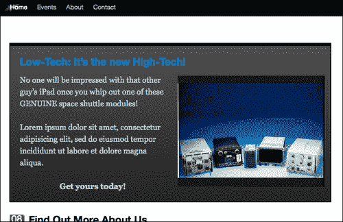

好啊 jQuery 有一个非常好的函数，我们前面已经讨论过，这个函数名为`.each`，它将在包装器集中的每个对象上运行额外的函数。如果我们只想对每个项目运行一次，我们可以使用以下代码：

```js
...
jQuery('.sticky')
.hide()/*hide each post*/
.each( function (i){
/*i = numeric value that will increase with each loop*/
jQuery(this)
/*make sure each div is on it's own z-index*/
.css('z-index','i+10')
//using the animate function to fade in each div
//3 seconds apart*/
.animate({'backgroundColor': '#000000'}, i*3000, function(){
/*actual div fade in*/
jQuery(this).fadeIn('slow');
}
);//end animate
});//end each
...

```

这看起来不错！然而，一旦最后一个`div`消失，它就会停止，不再继续。

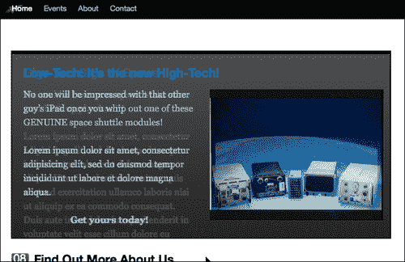

不，没有超级灵活的 jQuery 方法来保持`.each()`函数运行。然而，一个`.each`函数很容易设置，即使对于“无限循环”，也很遗憾没有利用它们。

现在，这里有一个简单的解释：如果你敢的话，你可以在谷歌上搜索`"infinite animation loops jquery"`，看到一万多条搜索结果，JavaScript 开发人员似乎有很多方法喜欢设置重复或无限循环，每个开发人员似乎都觉得（当然！）他们的方法是最好的方法。我倾向于使用常规 JavaScript，并使用一个`setInterval`函数和一些自定义变量，这些变量的设置方式使得利用我现有的 jQuery`.each()`语句和函数变得非常容易。

为了开始创建循环，我们将使用现有的 jQuery 语句并将其*放入*自身的函数中。您需要确保此函数在主`jQuery(function(){...`文档就绪函数之外**。否则，`setInterval`功能将无法正常启动。**

让我们调用新函数`loopStickies`。除了第一句话之外，你会发现它很熟悉：

```js
...
function loopStickies(duration){
/*note the variable "duration" being passed*/
///we'll need to make sure everything fades out
//except the first sticky post*/
jQuery('.sticky:not(:first)').fadeOut();
/*this should look almost the same*/
jQuery('.sticky')
.each( function (i){
/*i = numeric value that will increase with each loop*/
jQuery(this)
/*make sure each div is on it's own z-index*/
.css('z-index','i+10')
/*using the animate function & "duration" var for timing*/
.animate({'backgroundColor': '#000000'}, i*duration,
function(){
jQuery(this).fadeIn('slow');
}
);//end animate
}); //end each
}//end loopStickies

```

好的，这只是开始，现在我们有了我们的`loopStickies`函数，位于 jQuery 文档就绪函数之外的*，让我们把剩下的代码放回**在**文档就绪函数里面。请按照粗体的注释进行操作：*

```js
...
/*set the stickies in a wrapper set to overflow hidden*/
jQuery('.sticky').wrapAll('<div id="stickyRotate"
style="position: absolute; padding: 0; margin-top: 5px;
width: 650px; height: 320px; border: 2px solid #000;
overflow:hidden;"></div>');
//make sure the first .sticky post fades in:
jQuery('.sticky:first').fadeIn();
//set the "duration" length to 6 seconds for each slide:
//(this is the var our function uses)
var duration = 6000;
/*create the interval duration length, based on the duration:*/
var intervalDuration = duration * jQuery('.sticky').length;
/*the function needs to run once before the setInterval kicks in*/
loopStickies(duration);
//the setInterval will kick off loopStickies in
//18 seconds: (6secs x number of sticky posts) */
setInterval( 'loopStickies("'+duration+'")', intervalDuration
);
...

```

其工作方式是，通过调用`loopStickies`函数，我们原始的 jQuery 语句和`.each()`函数在 jQuery 选择中的每个粘性帖子中运行。在*的同时*启动了`setInterval`功能，但是因为我们设置了`intervalDuration`变量来计算我们的`duration`变量乘以粘帖的数量，所以在 18 秒内不会启动。正好赶上我们原来的功能完成！`setInterval`函数将从此处开始，将我们的粘性帖子循环到无穷远。

好吧，让我们看一看；我们现在有一组非常好的粘帖，保持 6 秒钟，然后交叉衰减到下一个帖子！

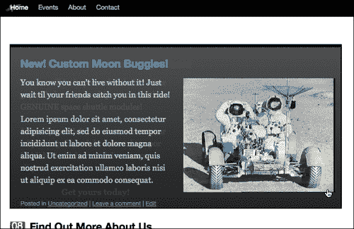

### 投入一点额外的努力：添加一个循环指示器

旋转胶粘棒棒棒极了！然而，尽管客户端在任何给定的时间只有三个或四个胶粘物在旋转，但如果用户决定查看所有的旋转，至少让用户知道他们在视图中的时间长度是一个很好的做法。大多数旋转幻灯片都有一个指示器，让用户知道将要显示多少个面板，并允许用户在面板周围导航。

让我们看看如何将此功能添加到我们的轮换帖子中。首先，我们需要创建一个小接口。在前面代码中创建的`#stickyRotate`包装器中，在最后一个 sticky post 对象之后，我将添加一个具有内联样式的`div`。同样，对于一个正在工作的项目来说，这并不一定是理想的，但我想把每一步都说清楚。实际上，您可能会创建自定义样式表或修改正在处理的主题。无论如何，这是我们的互动持有者。我已将此代码放在 jQuery document ready 函数中先前代码的底部：

```js
...
jQuery('.sticky:last')
.after('<div id="stickyNav"
style="position: absolute; padding: 10px 0 0 0; margin-top: 280px;
height: 25px; width: 650px; color: #eee; background: #000;
text-align: center"></div>');
...

```

在代码下面，我们将添加更多 jQuery，它将把每个粘性帖子的编号插入到我们刚刚创建的`#stickyNav`div 中：

```js
...
rotating sticky postsloop indicator, addingjQuery('.sticky')
.each( function (i){
jQuery('#stickyNav').fadeTo(0, 0.8)
.append("<div class='sN'
style='display:inline; margin: 0 5px;
border: 1px solid #999;
padding: 2px 5px;'>"+(i+1)+"</div> ");
});
...

```

这段代码使用了另一个`each`函数，但我们只需要并且希望它运行一次，并将数字 1 到 3（或者不管我们有多少粘性帖子）附加到`#stickyNav`div。

最后，要真正完成这个效果，我们需要回到`loopStickies`函数中。在`.animate`函数的回调函数中，我们将添加以下粗体代码：

```js
...
jQuery('.sticky')
.each( function (i){
/*i = numeric value that will increase with each loop*/
jQuery(this)
/*make sure each div is on it's own z-index*/
.css('z-index','i+10')
/*using the animate function for timing*/
.animate({'backgroundColor': '#000000'}, i*duration, function(){
jQuery(this).fadeIn('slow');
//interactivity
jQuery("#stickyNav .sN").css('color','#666666');
jQuery('#stickyNav .sN:eq('+i+')').css('color','#ffffff');
}
);//end animate
}); //end each
...

```

使用前面代码中的`:eq()`选择器，我们能够在界面显示中定位相应的数字，并使其与其他数字相比更加突出。这允许用户查看有多少张幻灯片，以及他们在哪张幻灯片上。

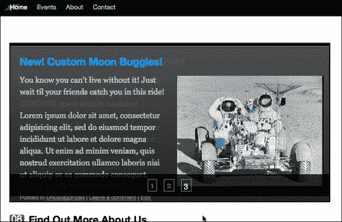

# 总结

您现在是使用 jQuery 处理动画的专家！从这些例子中，您可能会认识到将进一步增强功能整合到 WordPress 站点的几种方法。您现在应该知道如何：

*   使用动画将用户的注意力引导到关键点信息
*   生成动画条形图
*   创建一些非常流畅的动画页面导航
*   开发旋转粘性桩

接下来，让我们来看看 jQuery UI 插件以及它可以从 WordPress 站点获益的许多方法。