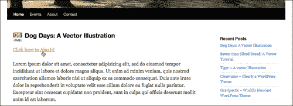
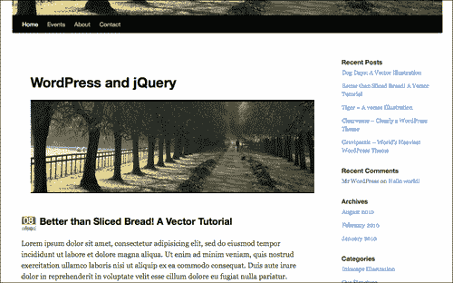
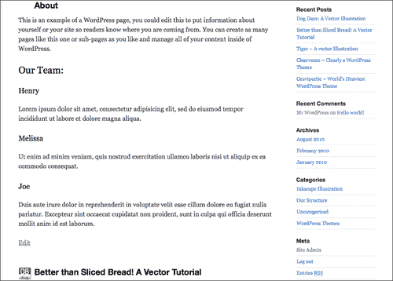
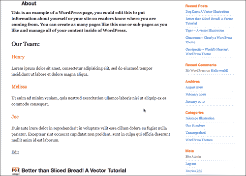
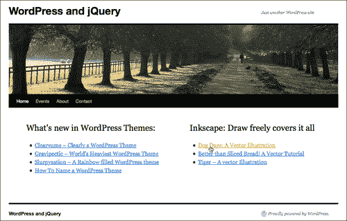
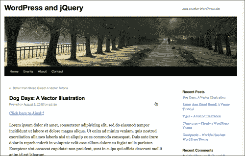
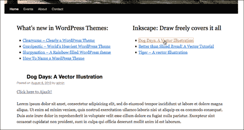
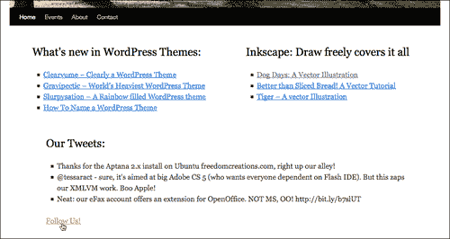
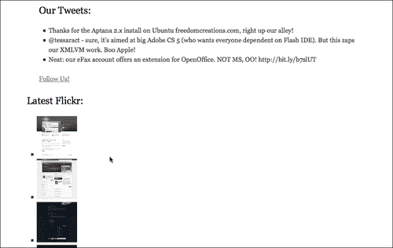
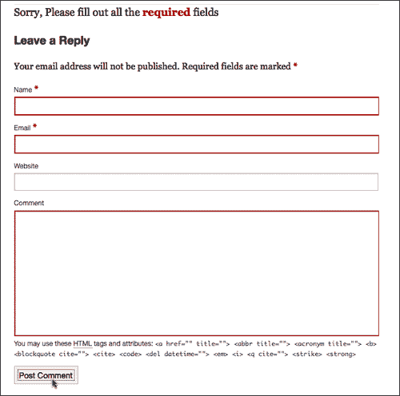

# 七、使用 jQuery 和 WordPress 的 AJAX

AJAX 是用户体验专家 Jesse James Garrett 的首字母缩写，他于 2005 年创建了[www.AdaptivePath.com](http://www.AdaptivePath.com)。它很快就演变成了一个时髦词，我们将看到，它的描述性（和冗长性）远远超出了它实际的首字母缩略词定义。我们将快速了解 AJAX 到底是什么，它的实现有多容易，更不用说为我们的“假想”客户机编写一些更酷的解决方案了。

在本章中，我们将了解：

*   使用 jQuery 的 AJAX`.load()`函数和更健壮的`.ajax()`函数的基础知识
*   使用 JSON 并连接到其他站点的 API
*   创建自定义 AJAX 增强主页和评论表单
*   使用动画和事件优化该功能

让我们先看看 jQuery 对 AJAX 的作用。

# AJAX 是什么和不是什么：快速入门

首先，如果您是 AJAX 新手，我只想指出，**AJAX**实际上不是一种技术或语言！首字母缩略词代表**异步 JavaScript 和 XML**。这是一种使用 JavaScript 和 XML 在 web 浏览器和 web 服务器之间发送和接收数据的技术。这种技术最明显（也是最酷）的用途是，您可以通过调用服务器动态更新网页上的内容，而无需强制重新加载整个网页。

这项技术的实施使许多 web 开发人员清楚地认识到，他们可以开始创建高级 web 应用（有时称为**富界面应用（RIA）【T1）】，这些应用的工作方式和感觉更像桌面软件应用，而不是网页。**

如上所述，AJAX 一词开始有了自己的含义（你也会注意到它在本书和其他书中，以及在整个网络中作为一个专有名词“AJAX”，而不是一个全大写的首字母缩略词）。例如，主要使用 Microsoft 技术的 web 开发人员可能会使用名为 VBScript（而非 JavaScript）的浏览器脚本语言开发他们的站点，以排序和显示转换为名为 JSON（而非 XML）的轻量级数据格式的内容。您猜到了，开发人员的站点仍然会被视为 AJAX 站点，而不是“AVAJ”站点（让我们面对现实，AJAX 听起来更酷）。

事实上，正如我们在[第 5 章](05.html "Chapter 5. jQuery Animation within WordPress")、*中所提到的，WordPress*中的 jQuery 动画已经发展到这样一个地步：网站上的任何东西（不在 Flash 中）在不呈现新浏览器窗口的情况下滑动、移动、淡出或弹出，都被视为“Ajaxy”网站。事实上，这些站点中的大多数并不真正符合使用 AJAX 的条件，如果您在 WordPress 站点中仅使用本书中的几个 jQuery 示例，则可能会将其视为 Ajaxy，尽管没有异步调用服务器。但在这一章之后，它会。

# AJAX：使用 jQuery 更好

过去，在撰写 AJAX 简介或与我的客户讨论在他们的项目中使用 AJAX 的优缺点时，我常常对使用 AJAX 技术给出冗长、深入的免责声明和警告：重温最坏情况的故事和浏览器功能丧失的恐怖故事，更不用说对有特殊需求的用户来说，可访问性被破坏了。尽管这些担忧中的一些仍然有效，但大部分“实现恐惧”已经在 jQuery 中结束。

正如我们到目前为止所学到的 jQuery 的所有内容一样，重点是创建伟大的*增强*，将其优雅地降级为基本的、可工作的 HTML 功能。您会发现 AJAX 技术也是如此，只要它们是用 jQuery 深思熟虑地实现的。如果可以在浏览器中不启用 JavaScript 的情况下访问和检索站点的核心内容或功能，那么您会发现所有用户，无论其浏览器或可访问性要求如何，都应该能够享受您的内容并有效地使用您的站点。您的大多数用户将使用您的站点，这些站点具有流畅、视觉吸引力的增强功能，使站点更易于使用，甚至有助于理解内容。

## 评估 AJAX 是否适合您的站点—简短的免责声明

当然，除了可访问性和法规遵从性之外，还需要为站点用户考虑一些因素。最值得注意的是，当您开始意识到 AJAX 技术可以为您的站点带来的强大功能时，您将需要努力保持标准 web 实践的*约定*。从本质上讲，大多数 web 用户都希望 web 页面，甚至是真正酷的 web 页面，能够像 web 页面一样工作！

这并不意味着你不能打破标准惯例，尤其是如果你的网站更像是 RIA 而不是纯内容网站。只要确保你告诉你的用户你的期望。例如，如果导航面板不在站点或侧边栏的顶部，那么您需要找到某种方法来告诉前面的人它在哪里，以及为什么您认为它位于您放置它的位置更方便。如果对可单击的对象使用下划线和按钮框以外的其他指示器，请告诉人们要查找什么，以便他们知道哪些是可单击的，哪些不是。

有了这一点，让我们看看我们最新的假想客户必须向我们要求什么，然后开始工作。

# 开始使用 jQuery 的 AJAX 功能

jQuery AJAX 功能的核心是`.ajax()`功能。这个小家伙可以让你做一些繁重的工作，并且拥有你需要的所有东西来满足你的**XML HTTP 请求**（**XHR**需求。

对于那些有一点 AJAX 经验的人来说，您会很高兴地发现，在真正的 jQuery 表单中，此函数不需要设置传统的`if/else`语句来测试对`XMLHTTPRequest`对象的支持，如果没有，则不需要设置`ActiveXObject`（对于 IE 浏览器）。

## 使用.ajax（）函数

让我们快速查看一下在 Type T0 调用中可用的一些功能：

```js
jQuery.ajax({
type: //"GET" or "POST",
url: //"url/to/file.php",
dataType: //"script", "xml", "json", or "html"
data: //a query string "name=FileName&type=PDF"
beforeSend://a callback function
function(){
alert("Starting Request");
}
success: //a callback function
function(){
alert("Request successful");
}
complete: //a callback function
function(){
alert("Request complete");
}
error: //a callback function
function(){
alert("Request returned and error!");
}
});
...

```

例如，在 WordPress 中实现的`.ajax()`调用可能类似于：

```js
...
jQuery(".ajaxIt").click(function(){
//.ajaxIt is a class assigned to link in the first post
jQuery.ajax({
//url to the about page:
url: "/wp-jquery/about/",
data: "html",
success: function(data){
//limit the overflow and height on the first post
jQuery('.post:first')
.css({overflow: "hidden", height: "310px"})
//add in the data
.html(data);
//alert just shows the function kicked off
alert('loaded up content');
}
});
});
...

```

在给定的代码中，当用户点击`.ajaxIt`对象 jQuery 选择器时，如下图所示，`.ajax`函数将*整个***关于**的页面加载到第一篇帖子的`.post`div 中：



通过更改 div 上的 CSS 属性来隐藏溢出并设置高度，我们可以防止它看起来太乱：



给你！您第一次在 WordPress 中使用 AJAX！然而，你可能会想：“对于我在现实生活中从未真正想做的事情来说，这是一项相当大的工作。（将整个网站重新加载到一个 div*中，包括*标题？Yuk！）”

你说得对。让我们看看快捷方式在一些更方便和有用的功能。

### 走捷径

您可以看到`.ajax()`函数非常健壮和灵活。尽管这很酷，但你可能已经希望找到一条捷径了。不要害怕，与我们已经使用过的`.animate()`函数类似，jQuery 已经很好地将一些更“常规”的任务分解为易于使用和利用的小规模函数。以下是 WordPress 用户最重要的注意事项：

*   `.load`-您可以通过 POST 调用并使用此功能获取特定的、jQuery 选择的内容，并更轻松地将其塞入其他 jQuery 选择的区域。
*   `.get`-与`.load`类似，但仅获取请求。
*   `.post`-与`.load`类似，但主要关注 post 请求。
*   `.getJSON`-允许您提取 JSON 数据（如果您正在跨站点编写脚本，这是一种很好的方法，即从另一个 URL（例如`twitter.com`）提取数据）。
*   `.getScript`-允许您启动隐藏在未附加到 WordPress 主题的脚本中的操作。（如果您希望添加不希望其他人能够轻松找到和浏览的功能，那么这非常有用，您还可以从其他域中引入 JavaScripts 来使用。）

在大多数 WordPress 项目中，您会发现根本不需要使用`.ajax()`函数。您将使用`.load, .post`或`.get`，有时使用`.getJSON`或`.getScript`。但是，像`.animate()`函数一样，您偶尔会想到`.ajax`函数的灵活性和细粒度控制非常方便的场景。

所有这些快捷方式函数中最有用的，也是我们最关注的是`.load`函数。

### 指定在何处加载（）它

我们可以实现完全相同的效果，我们从完整的`.ajax()`函数中得到了这里的帕里向下的代码：

```js
...
jQuery('.post:first').css({overflow: "hidden",
height: "310px"}).load('about-2/');
...

```

同样，有点酷，因为代码片段要简单得多。它是 AJAX；页面本身并没有重新加载，但您*为什么希望*这样做？（同样，为了避免示例过于混乱，我使用了`.css`函数来更改 CSS 属性，隐藏溢出并锁定`.post`div 的高度。）

对于一个项目来说，这似乎很少见（如果有用的话，`iframe`也能达到同样的效果）。我们真正想做的是能够将另一个页面的关键内容加载到当前页面中。好消息是，我们可以轻松实现：

```js
...
jQuery('.post:first').load('about-2/ #post-104');
...

```

通过扩展`.load`函数的`url`参数，给定的代码片段将用**About**页面上`#post-104`div 的内容替换我们的第一个`.post`div。结果是：



您还将注意到，我之所以能够删除`.css`函数，是因为只加载了有用的内容，而且非常干净。

### 转换加载内容

假设我们需要转换加载的一些内容。没问题。有一个基本的“success”回调函数可用。我们可以这样利用它：

```js
...
jQuery('.post:first').load('about-2/ #post-104', function(){
jQuery('h3').css("color","#ff6600");
jQuery('#post-104 p:first').css("font-weight","bold");
});
...

```



正如您所看到的，内容现在是页面的“一部分”，并且作为 ajaxed 内容中的 H3 的一组 DOM 对象随着页面上的其他选定匹配项一起更改。现在这似乎更有用了。我敢打赌，你一定能想到这样的功能有很多用途！猜猜我们的“客户”能做什么。

# 项目：Ajaxing 岗位

假设你有一个客户（放松，这是*最后一个*假设客户！），他是一个“开源媒体设计师”，希望有一个非常干净、稀疏的主页。如此稀少，他们只希望出现两个特定类别中最热门、最新帖子的标题列表。（在一个理想的世界里，这样的决定将确保他们的网站的出色设计能够在内容轰炸用户之前吸引用户。）

他们当然希望它是光滑的。当你点击一篇文章的标题时，它会通过 AJAX 加载进来，非常流畅。不需要重新加载到单个内容页。

为了开始这个请求，我们必须参考我们对模板层次结构和自定义循环的理解。我们将创建一个`home.php`模板页面，该页面将成为默认主页，其中仅显示“WordPress 设计”和“Inkscape 插图”类别的五篇最新文章。听起来很简单，让我们开始吧。

首先创建一个名为`home.php`的新自定义模板页面，并插入您的`#content`div 标记以及主题的页眉和页脚（以及您需要的任何其他内容）。

```js
<?php get_header(); ?>
<div id="content" role="main">
</div><!--//content-->
<?php get_footer(); ?>

```

接下来，在`#content`div 中，我们将在自定义循环中放置“WordPress 主题”和“Inkscape 插图”类别。我们知道类别 ID 是`5`和`6`，因此我们定制的“迷你循环”如下所示：

```js
...
<div style="float:left; width: 380px;">
<h2>What's new in WordPress Themes:</h2>
<ul>
<?php global $post;
$wpposts = get_posts('numberposts=5&category=6');
foreach($wpposts as $post):
setup_postdata($post);?>
<li><a href="<?php the_permalink() ?>">
<?php the_title(); ?></a></li>
<?php endforeach; ?>
</ul>
</div>
<div style="float:right; width: 380px;">
<h2>Inkscape: Draw freely covers it all</h2>
<ul>
<?php global $post;
$inkposts = get_posts('numberposts=5&category=7');
foreach($inkposts as $post):
setup_postdata($post);?>
<li><a href="<?php the_permalink() ?>">
<?php the_title(); ?></a></li>
<?php endforeach; ?>
</ul>
</div>
<div style="clear:both;">&nbsp;</div>
...

```

自定义循环将生成如下页面：



因为我们设置了循环，在的`href`链接中显示标题*到单页布局，如果我们检查 WordPress 中到目前为止的内容，我们将看到文章标题，如果我们点击它们，我们将进入完整的文章页面，如下一个屏幕截图所示：*



这就是我们想要的。如果用户出于任何原因没有启用 JavaScript，该站点仍然可以工作，并提供他们想要的信息。在使用 jQuery 时，这始终是我们想要开始的一点：基本、工作 HTML 和 CSS。我们的目标始终是*增强*，而不是排除出于各种原因而不使用最新浏览器的人，或者使用支持 JavaScript 的智能手机的人。

在这一点上，我们将利用我们在[第 6 章](06.html "Chapter 6. WordPress and jQuery's UI")中体验到的一种技术，使用 PDF 下载增强功能。我们将“劫持”到 post 的链接（这种技术通常被称为“hijax”），并在 jQuery`.load`命令中利用 URL。

首先，我们需要一些东西来加载内容，所以在我们的`custom-jquery.js`文件中，我们将`.append`一个新的`div`放到`#content`分区的底部。

```js
...
jQuery('.home #content').append('<div class="displayPost"></div>');
...

```

现在，正如我们在前面的示例中所看到的，我们当然不希望*从开始的 body 标签到结束的所有内容*都加载进来！我们真的只想要`.post div`。因此，让我们设置我们的`.load`函数，并缩小加载范围，如下所示：

```js
...
jQuery('#content li a').click(function(event){
//This keeps the href from reloading the page
event.preventDefault();
//grab the page link
var page = jQuery(this).attr('href');
jQuery('.displayPost')
//use the grabbed link in the load function
.load(page+' .post')
.fadeOut()//fade out the previous content
.slideDown(2000);//slide in the new content
});
...

```

你能相信这有多简单吗？点击的任何链接将*淡出*加载的内容，并*在新内容中滑动*！现在，我们的主页上有了一个超级流畅的效果，它超级简单地使用 AJAX。



# .getJSON：最小的鸟儿得到最多的回复

Twitter 最近非常流行，因此，已经有很多 jQuery 插件可以连接到 Twitter 上了。我个人最喜欢的是：*达米恩·杜托伊特的***推特 jQuery 插件：**[http://coda.co.za/blog/2008/10/26/jquery-plugin-for-twitter](http://coda.co.za/blog/2008/10/26/jquery-plugin-for-twitter) 。如果你真的想很好地控制你的 twitter 显示，你可以使用这个插件。

然而，JSON 的 Twitter 搜索和用户时间线 API 方法非常简单；因此，它为如何使用 jQuery 的`.getJSON`函数提供了一个很好的“快速教程”。

另外，你猜到了，我们假设的客户认为最初的主页布局可能“太稀疏”，询问我们是否可以从他们的用户名中添加三条最新推文。

## JSON 和 jQuery 基础

在深入研究 Twitter 和其他服务之前，让我们先了解一下 JSON 的基础知识，以及如何将其与 jQuery 结合使用。

JSON（发音通常与 Jason 相似）是**JavaScript 对象表示法**的首字母缩写。从本质上讲，它是一种简单的机器可读数据交换格式，这使得在 JavaScript 中构建和使用 API 应用非常简单（并且可以与其他编程语言一起使用）。如果你想了解它的历史，你可以看看[http://json.org](http://json.org) 了解更多。

### JSON 看起来像什么

您会惊喜地发现，JSON 标记语法与迄今为止在 jQuery 或 CSS 中使用的大多数参数/值语法看起来是一样的。它基于大多数 C 语言对象符号，如 Java 和 JavaScript，因此在处理 JavaScript 和 jQuery 时，它非常方便。

例如，jQuery 的`.css()`函数可以在`{}`括号内传递多个值，如下所示：

```js
.css({background: '#ff6600', color: '#333333', height: '300px'});

```

同样，JSON 数据可以设置为：

```js
{"results":[{"text":"text string here",
"to_user_id":0001,"user_name":"ThunderCat"}]}

```

非常相似！让我们来看看在 jQuery 中使用它。

### 在 jQuery 中使用 JSON

让我们仔细看看这个函数。

```js
jQuery.getJSON(
url, //the location of the data
data, //if you need to send anything to the service POST
function(){
//callbackfunction
}
);
...

```

此函数的第一个参数与`.load`函数类似；您将把它放在您计划阅读的 URL 中。如果需要将数据发布到 URL（可以在查询字符串或数组对象中执行此操作），则使用`data`参数。回调函数不是必需的，除非您是从自己的服务器以外的服务器调用 URL。

现在让我们来看看如何在我们的 WordPress 网站中使用`.getJSON`。

### 在 Twitter 上使用.getJSON

首先，在处理其他服务 API 时，没有理由不阅读和使用它们的文档。服务经常更新它们的 API 以使其更好更快，但是用于连接和使用它们的方法会不时发生变化。有时需要相当多的努力才能使您的代码与 API 保持最新。Twitter 的 API 文档可以在这里找到：[http://apiwiki.twitter.com/Twitter-API-Documentation](http://apiwiki.twitter.com/Twitter-API-Documentation) 。

此外，许多 API 服务要求您注册为开发人员，并使用 OAuth 来使用其部分或全部服务（或使用其自己的身份验证系统来保护您的用户登录和数据）。

### 注

**OAuth 是什么？**

OAuth 是一个开放标准，允许用户通过给定的服务提供商向其托管数据分发令牌，而不是用户名和密码。许多 API 服务提供商都使用它，您可以从他们的网站上找到更多信息：[http://oauth.net/about/](http://oauth.net/about/) 。

在本节中，我将介绍在 twitter API 中连接到用户时间线方法的基础知识。只要用户有一个可公开查看的 twitter 流，这种方法就不需要 OAuth，因此您不需要注册 OAuth 应用（但注册当然没有坏处）。

### 使用 Twitter 的用户时间线方法

我们的`.getJSON`函数中的 URL 参数将包含以下 API，格式化 URL:

```js
http://api.twitter.com/1/statuses/user_timeline/username.format

```

您可以从以下格式中进行选择（但猜猜我们将使用哪种格式！）：

*   原子
*   **json**
*   rss
*   xml

首先，我们需要将推文放在主页上。

这里有两个选项，我们可以进入`home.php`模板文件并创建一个“实际的”`div`和`ul`列表，或者我们可以完全使用 jQuery 创建它。

老实说，这样的电话由你决定。在本书的这一点上，您应该能够轻松地编辑和调整主题文件，或者使用 jQuery 生成有用的 DOM 对象。

由于 tweets 完全依赖于启用的 JavaScript，并且我们没有试图使用模板标记自定义显示任何 WordPress 内容，因此我很乐意在 jQuery 中完成所有工作。

我们将从我们的`custom-jquery.js`文件开始，在 document ready 语句中，为 tweet 创建空间，如下所示：

```js
...
//we'll want to make sure we add our div to the home page only,
//referencing the WordPress body class .home (make sure your theme is
//using the template tag body_class() in the body HTML tag!)
jQuery('.home #content')
//this .append string is a div, h2 heading, and three list items
//in a ul with a Follow Us link:
.append('<div class="tweets"><h2>Our Tweets:</h2>
<ul><li></li><li></li><li></li></ul>
<p>
<a href="http://twitter.com/ozoopa">Follow Us!</a>
</p></div>');
...

```

接下来，我们将 twitterapiurl 设置为带有“clients”Twitter 用户名的变量（我们将使用我的一个：ozoopa）。

```js
...
var tweetURL = 'http://api.twitter.com/1/statuses/user_timeline/ozoopa.json?callback=?';
...

```

我们现在可以打电话了。请按照以下粗体注释进行操作：

```js
jQuery.getJSON(tweetURL, function(twitter){
//'twitter' is the callback function that returns the tweets
//for each li in the twees class we'll drop in the text
jQuery('.tweets li').each(function(i){
//we only want the tweet text, nothing else
jQuery(this).html(twitter[i].text);
});
});
...

```

正如你在下一个屏幕截图中看到的，我们的推文显示得非常好！



#### 推特发回了什么？

你会注意到，我们关注的是如何找回“tweet”文本本身。以下是 twitter 在该 URL 中通过 JSON 实际发送回的内容（粗体部分是我们实际使用的内容）：

```js
[{"coordinates":null,"in_reply_to_screen_name":null,"geo":null,"favorited":false,"truncated":false,"in_reply_to_status_id":null,"source":"web","in_reply_to_user_id":null,"contributors":null,"user":{"profile_background_image_url":"http://s.twimg.com/a/12748999img/themes/theme1/bg.png","profile_link_color":"0000ff","url":"http://ozoopa.com","description":"","followers_count":14,"profile_background_tile":false,"profile_sidebar_fill_color":"e0ff92","location":"","notifications":null,"friends_count":3,"profile_image_url":"http://s.twimg.com/a/12748999img/default_profile_3_normal.png","statuses_count":10,"profile_sidebar_border_color":"87bc44","lang":"en","favourites_count":0,"screen_name":"ozoopa","contributors_enabled":false,"geo_enabled":false,"profile_background_color":"9ae4e8","protected":false,"following":null,"time_zone":"Central Time (US & Canada)","created_at":"Tue Sep 15 21:54:45 +0000 2009","name":"ozoopa open source","verified":false,"profile_text_color":"000000","id":74567461,"utc_offset":-21600},"created_at":"Tue May 11 19:34:09 +0000 2010","id":13805349673,"place":null,"text":"Thanks for the Aptana 2.x install on Ubuntu freedomcreations.com, right up our alley!"}, ...//more tweets follow...]

```

正如您所看到的，您返回了大量数据以供处理！再次强调，深入研究 API 并查看可利用的内容是值得的；您还可以尝试显示 JSON 提要中的所有可用项，享受数小时的乐趣。

### 在 Flickr 中使用 getJSON

客户喜欢！当然，他们现在认为主页现在“文本太多”。在侧边栏中添加 Flickr images 中标记为`"wordpress theme"`的六张最新图片怎么样？这应该可以平衡它。

幸运的是，这也不是问题。

同样，您的第一站应该是 Flickr API 文档：[http://www.flickr.com/services/api/](http://www.flickr.com/services/api/) 。

但我们将继续并再次开始，在主页的侧边栏中为图像创建一个小空间：

```js
...
jQuery('.home).append('<div class="flickr">
<h2>Latest Flickr:</h2></div>');
...

```

以下是他们的公共照片流方法 URL：

```js
...
var flickrURL = 'http://api.flickr.com/services/feeds/photos_public.gne?tags=wordpress,themes&tagmode=all&format=json&jsoncallback=?';
...

```

现在我们可以设置我们的`getJSON`呼叫：

```js
...
jQuery.getJSON(flickrURL, function(flickrImgs){
jQuery('.flickr li').each(function(i){
jQuery(this)
.html('');
});
});
...

```

Flickr JSON 字符串返回一个名为`items`的数组，该数组提供各种数据。您会注意到，与 twitter API 相比，针对我们想要的信息时，它有点不同。通过将`media.m`url 拉到缩略图，我们可以创建一个快速的图像列表。

在**我们的推文**下看起来是这样的



## 提供 JSON 格式 API 的其他流行服务

乐趣不必止于此！现在您已经熟悉了使用`.getJSON`，您的世界已经开放，可以在 WordPress 站点中实现各种定制的跨站点 mashup 和解决方案。理解 JSON 和`.getJSON`函数还可以让你更善于“按摩”一个好的 WordPress 或 jQuery 插件，更好地处理你的定制需求。

以下流行服务提供支持 JSON 的 API：

*   YouTube:[http://code.google.com/apis/youtube/2.0/developers_guide_json.html](http://code.google.com/apis/youtube/2.0/developers_guide_json.html)
*   网飞：[http://developer.netflix.com/](http://developer.netflix.com/)
*   美味：[http://delicious.com/help/api](http://delicious.com/help/api)
*   比特：[http://code.google.com/p/bitly-api/wiki/ApiDocumentation](http://code.google.com/p/bitly-api/wiki/ApiDocumentation)
*   古德雷兹：[http://www.goodreads.com/api](http://www.goodreads.com/api)
*   图书馆用品：[http://www.librarything.com/api](http://www.librarything.com/api)

看看周围！如果您使用一个提供任何类型的“社交”功能的优秀服务，他们可能会提供一个以 JSON 格式提供数据的 API。为了验证您的请求（通常使用 OAuth），您可能需要注册为该服务的开发人员，但是如果您得到的最终结果是 JSON 字符串，那么您最好使用 jQuery 和 WordPress 项目！

# 项目：内置评论表单

从我们迄今为止对`.load`和`.getJSON`所做的工作示例中，您可能会想到许多非常酷的方法来在 WordPress 站点中实现 AJAX。最有用的应用是注释表单。

首先，我们甚至不需要修改任何模板页面 HTML 或 WordPress 模板标记、PHP 代码。这同样很好，我们总是希望我们的站点在没有 jQuery 增强的情况下工作。

将 WordPress 评论形式转换为 Ajaxing 似乎很简单。对于“高级”主题开发人员来说，这是吸引人们下载主题的好方法：“内置 AJAX 评论！”。这是我们想要完全控制的东西，所以我们将使用`.ajax()`函数而不是`.load`（看，我告诉过你`.ajax`有时会派上用场）。

首先，在试用注释表单时，我们希望更改它的 CSS 属性以提醒用户错误。我发现最好是将表单的 CSS 设置为一致的，这样我们就可以在 jQuery 中轻松地进行更改，以用于其他用途。将以下代码添加到您的`custom-jquery.js`文件中，以更改默认主题注释表单样式的 CSS 属性。

```js
...
jQuery('#commentform input')
.css({border: '1px solid #ccc', padding: '5px'});
jQuery('#commentform textarea')
.css({border: '1px solid #ccc', padding: '5px'});
...

```

我们现在准备好“控制”表单。提交时，我们希望 jQuery 进行对话，而不是表单的“action”属性。我们将使用一个名为`.submit()`的简便函数，如下所示：

```js
jQuery('#commentform').submit(function(){
//turns all the form info into an object
var formData = jQuery("#commentform").serialize();
//so we can display the comment back to the user
var comment = jQuery('textarea#comment').val();
});
...

```

请注意，我们使用了另一个鲜为人知的便捷 jQuery 函数`.serialize()`。这将获取我们`#commentform`表单中的所有数据，并在提交时将其转换为一个方便的对象，我们现在可以在`.ajax`函数中传递它。

在`.submit`函数中，注释变量下的*，让我们添加`.ajax`调用。我们将使用这个函数，因为我们需要一些额外的控制，并将利用它的`success:`和`error:`回调函数。通读代码中粗体的注释，以了解以下内容：*

```js
...
jQuery.ajax({
type: "POST",
//this is the script that the comment form submits to:
url: "/wp-jqury/wp-comments-post.php",
//formData is our serialized content object
data: formData,
success: function(){
//on success load content and fade in:
},
error: function(){
//on error, inform user of what to do:
}
});
//this makes sure the page doesn't reload!
return false;
...

```

这就是要点。我们现在已经准备好通过设置`success:`和`error:`函数开始工作。让我们从`success:`函数开始。

我们首先要创建一个包含消息的`div`。然后，我们将把消息和前面设置的`comment`变量（在`formData`序列化对象下）一起添加到该 div 中，以将表单中输入的注释拉入代码中。

我们还将确保添加一点 jQuery“shine”，并利用 WordPress 中[第 5 章](05.html "Chapter 5. jQuery Animation within WordPress")、*jQuery 动画中的一些动画技巧，以确保`success`响应加载良好且平滑。*在*支架`success: function()`内插入以下代码：*

```js
...
//on success load content and fade in:
//create the div that the message goes in
jQuery('#respond').prepend('<div class="message"></div>');
jQuery('#respond .message')
.html("<div style='border: 1px solid #ccc; padding: 5px 10px'>
<b>Thank you.</b><br/>
<span style='font-size: 90%;'>
<i>Your comment may be pending moderation.</i>
</span><br/> "+comment+"</div>")
.hide() //then hide it!
.fadeIn(2000); //then fade it in nicely
...

```

正确填写表格后，最终结果是此消息逐渐消失：


我们现在准备处理那些没有正确填写表格的人。如果未填写所需字段，`wp-comments-post.php`文件会返回错误。我们可以通过使用`error:`函数检查错误来利用这一点。



很好，我们刚刚使用 AJAX 为 WordPress 站点创建了一些流畅的评论功能！

### 提示

**这些例子不应该是 WordPress 插件吗？**

如[第 3 章](03.html "Chapter 3. Digging Deeper: Understanding jQuery and WordPress Together")所述，*深入挖掘：共同理解 jQuery 和 WordPress*，如果您创建的 jQuery 增强功能不需要对 WordPress 主题进行任何调整或编辑，并且可以与大多数发布供公众使用的主题协同工作，你可能想考虑把你的脚本打包成一个单独的 WordPress 插件。

如果您很忙，不想在每次交换主题时用所有自定义 jQuery 脚本修改新主题，或者您是一个有很多人的大型项目的一部分，或者您只是想与技术性较差的 WordPress 用户共享 jQuery 工作，那么这是一个方便的做法。按照[第 3 章](03.html "Chapter 3. Digging Deeper: Understanding jQuery and WordPress Together")中的步骤，将您的 jQuery 脚本和插件包装成简单的 WordPress 插件，以便技术水平较低的管理员可以轻松地在项目中添加和删除它们。

还请记住，[第 3 章](03.html "Chapter 3. Digging Deeper: Understanding jQuery and WordPress Together")也指导您创建 jQuery 插件。通过将代码放入 jQuery 插件中，然后封装到 WordPress 插件中，您可能能够压缩和清理代码。这也会使脚本的更新和增强更易于管理。然后，您将拥有更好的组织代码，可以记录并与两个世界共享：jQuery 开发人员和 WordPress 爱好者。

考虑一下：如果 jQuery 增强功能*依赖于*任何定制的、特殊的标记，您已经编辑了一个主题来生成该标记（例如本章开头的帖子列表示例），那么最好将 jQuery 脚本作为主题的一部分，因为它不会在主题之外工作。这对于超级定制或高级主题来说是件好事。通过将你的增强功能作为主题的一部分，你可以吸引人们下载它，因为它提供了他们不需要的功能，然后他们就可以出去寻找单独的 WordPress 插件。

# 总结

谁知道阿贾克斯现在这么容易？正如您所见，利用 WordPress 主题和 jQuery 的 AJAX 事件和请求的优势，创建一些强大的动态站点非常容易。在本章中，我们了解了：

*   创建自定义加载内容和劫持（hijaxing）链接，以便按照我们的意愿使用
*   使用`.getJSON`和其他站点的 API
*   创建我们自己的自定义 AJAX 加载评论表单（可能是 WordPress 网站所有者追求的最流行的增强主题功能和插件之一）
*   通过简单的 jQuery 动画特性进一步增强我们的 AJAX 工作

现在，您已经了解了如何将 jQuery 应用于 WordPress 站点的特定增强和功能。我们从基础知识开始，真正学习如何利用选择器，使您的 WordPress 编辑器的工作流程不必中断，并将其应用于一些非常令人兴奋的增强功能，包括流畅的动画、UI 插件和 AJAX。我们还介绍了如何将这些解决方案融入 WordPress 站点的主题、WordPress 插件以及 jQuery 插件。对于 WordPress 和 jQuery 的大部分开发需求，您已经准备好了！

在下一章也是最后一章中，我们将了解一些使用 jQuery 和 WordPress plus 的技巧和技巧；本书的最后一个附录是一份浓缩的“备忘单”，其中包含了关键 jQuery 函数以及重要的 WordPress 函数、模板标记和类的参考信息，所有这些都是为了帮助您开发 jQuery 和 WordPress。