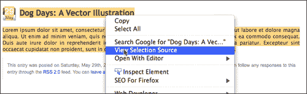
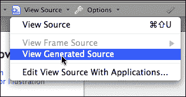
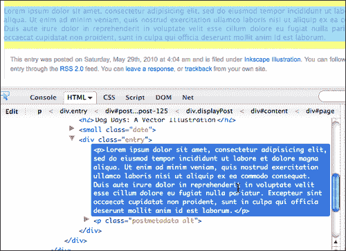
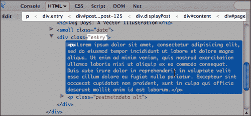
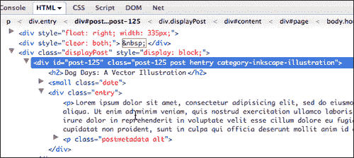

# 八、使用 jQuery 和 WordPress 的提示和技巧

现在，您已经准备好将 jQuery 知识带到 WordPress 世界。但是首先，让我们来看看本章将要讨论的内容：

*   正确加载 jQuery 脚本并确保它们与其他脚本、库和插件兼容的提示和技巧
*   使用 Firefox 和 Firebug 加速和帮助 jQuery 开发的一些技巧和技巧
*   有效 WordPress 标记的优点，以及如何在网站的内容编辑器中轻松使用

以下是使用 jQuery 和 WordPress 所需的提示和技巧。

# 保存密码库

一个“代码片段集合”或者我称之为“代码库”将对您大有帮助，不仅仅是 jQuery 和 WordPress 代码，还有您创建的通用 HTML 标记甚至 CSS 解决方案，更不用说您使用的任何其他代码语言了。

我很难记住代码、标记和 CSS 的语法。我经常知道我需要什么，但永远也记不起它应该是怎样打字的。我过去常常花几个小时浏览以前项目中的各种样式表、标记和代码，以便复制到我当前的项目中，并用谷歌搜索（和“重新搜索”）包含我所需语法示例的网页。

如果您经常发现自己处于类似的情况，那么使用好的 HTML/代码编辑器中通常提供的**片段**或**片段**功能将使您从这项平凡（而且非常耗时）的任务中解脱出来。您只需将 WordPress 模板标记、函数、PHP 代码、关键 CSS 规则和 jQuery 函数（以及您认为最需要使用的任何其他代码语法）键入或粘贴到编辑器中可用的**片段**或**剪辑**面板中，应用就会将其保存下来供您将来使用。

当你在不同的项目上工作时，你会想出你将来可能想再次使用的解决方案，比如说，一组无序列表的 CSS 规则，形成一个漂亮的库视图，或者两个 jQuery 函数一起非常巧妙的使用。每次你创建一些你认为有用的东西时（很多东西又会有用），一定要及时保存，以备将来参考。

好的编辑器，如 Dreamweaver、HTML 工具包和 Coda，通常能够组织代码片段，并将它们按逻辑分组，以便易于访问。有些编辑器甚至允许您指定自定义“快捷键”和/或将剪辑拖放到工作文件中。这有多容易？

## 释放你的武器库

一旦您发现这是多么方便，您可能希望您的软件库可用于您使用的其他程序，尤其是在多个编辑器和创作环境之间切换时。我建议您投资一个多粘贴/剪贴板应用，它可以让您保存和组织代码片段。当我在个人电脑上的时候，我使用了一个叫做 Yankee Clipper 3（Yankee Clipper 3）的很棒的小应用（它是免费的，可以在[上找到）http://www.intelexual.com/products/YC3/](http://www.intelexual.com/products/YC3/) ），现在在 Mac 上，我使用 iPaste（价格适中；转到[http://www.iggsoftware.com/ipaste/](http://www.iggsoftware.com/ipaste/) ）。当你在做一个项目时，除了在任何应用中都能使用你的武器库外，能够回顾你复制到剪辑板上的最后 10 个左右的项目也是一个实时节约。

## 你的兵工厂在运转

最后，我发现我喜欢带着我的大部分武器。如果你使用手持设备，或者手机上有一个笔记应用，可以让你分类和搜索笔记（特别是可以让你从桌面或 web 服务同步的笔记），你可能会发现将你的部分或全部武库保存在其中很有用，这样你就可以随时轻松地从武库中查找语法。我偶尔在需要我使用他们的电脑而不是笔记本电脑的地方做自由职业者，因此在我的设备上访问我的武器库是非常有用的。

Palm 的原生 note 应用多年来一直非常适合我的这种能力；我现在把我的大部分存储在谷歌文档中，并使用一个名为 NoteSync 的小型桌面应用，它可以让你快速编写和查看谷歌文档笔记（他们很快就会推出一个 Android 应用，但与此同时，我在安卓设备上使用 Gdocs 查看我的笔记）。我有很多朋友对 EverNote 的系统发誓（不过，他们的移动应用只在 iPhone 上离线运行，到目前为止还不能在 Android 上运行）。

一旦你所有经常使用的和有创意的一次性解决方案都放在一个方便的地方（希望分类和关键字搜索），你会惊讶于你的开发速度加快了多少，放松了多少。

# 使用 WordPress 的 jQuery 提示和技巧

在关注 WordPress 之前，让我们先从一些我最喜欢的 jQuery 技巧开始。书中已经详细介绍了其中的大部分内容，这是为了提醒你它们很重要（在某种程度上，这是第一个“提示”，不要吝啬于要点）。这里还有一些尚未涉及的问题，这将帮助您加快 jQuery 开发。

## 尝试使用 jQuery 的最新版本

这是使用捆绑 WordPress 版本的缺点之一：在下一个版本的 WordPress 发布之前，它可能会稍微落后于当前版本的 jQuery。我完全支持保持当前版本的领先地位，因为 jQuery 版本发布的首要目标不仅仅是提供新功能，而是不断优化和提高现有功能的性能和速度。如果 CDN 上提供的最新版本的 jQuery 大于捆绑的版本，请务必先使用`deregister`jQuery，或者使用[第 3 章](03.html "Chapter 3. Digging Deeper: Understanding jQuery and WordPress Together")中学习的`if else`语句限制您的新版本，*深入挖掘：一起理解 jQuery 和 WordPress*，因此，它只在需要的页面上加载到站点前端。否则，使用捆绑版 WordPress 的插件可能会产生问题。

### 与谷歌 CDN 保持同步

保持最新状态的最好方法就是简单地使用谷歌的 CDN。我在[第 2 章](02.html "Chapter 2. Working with jQuery in WordPress")、*在 WordPress*中使用 jQuery，以及[附录 A](09.html "Appendix A. Appendix: jQuery and WordPress Reference Guide")、*jQuery 和 WordPress 参考指南*中介绍了这一点，也有参考。从 Google 的 CDN 加载而不是为项目的托管服务器加载，还有其他优势。不必从服务器上逐个加载 JavaScript、库和资产，您的站点可以同时从 Google CDN 加载主库以及其他本地 jQuery 脚本和辅助工具。额外的好处是，jQuery 将缓存给访问过其他网站的用户，这些网站是从谷歌的 CDN 加载的。请务必查看[附录 A](09.html "Appendix A. Appendix: jQuery and WordPress Reference Guide")，以获取`wp_enque_script`的完整参考。

## 保持无冲突模式

WordPress 最棒的一点是，一个网站可以有这么多人以多种不同的方式为其做出贡献：撰写内容、处理主题以及添加 WordPress 插件。WordPress 最糟糕的一点是，很多人都可以很容易地为网站贡献什么，这取决于他们的管理员状态、其他合作者可以向他们添加什么，或者他们可以安装什么插件。

WordPress 必须保持**无冲突**模式。这与使用`wp_enque_script`在 WordPress 中加载相结合，将确保如果有人加载任何其他使用 MooTools 或 Scriptaculous 的插件，甚至只是一个较旧版本的 jQuery，jQuery 不会被“推出”。

保持`noConflict`模式很容易。最简单的是我们在整本书中所做的！只需使用`jQuery`而不是脚本前面的快捷美元符号（`$`。

```js
jQuery('.selector').function();

```

## 确保主题或插件中的其他脚本使用脚本 API

如果您使用的是第三方的主题或插件，请查看主题的`header.php`文件或插件的 PHP 页面，并再次检查是否已使用`register`和`wp_enqueu_script`方法加载了所有脚本。我曾经遇到过一些令人沮丧的例子，当我们试图弄清楚为什么我的 jQuery 脚本不起作用，或者想知道我是如何“破坏”它们并将它们移植到实时站点时，这些例子引起了一些争议。事实证明，live 站点安装了一个插件，而我的沙盒站点没有安装，你猜到了，该插件包括一个较旧版本的 jQuery 和一个使用硬编码的`script`标记而不是`wp_enqueue_script`方法的自定义脚本文件。一旦解决了这个问题，并把一切都设置为`noConflict`模式，一切又恢复正常了！

## 检查 jQuery 语法

这个总是让我着迷。您编写了一个漂亮的 jQuery 小链，对其进行了一些调整，然后该死的东西就停止工作了。你知道这是对的！嗯，至少，你认为这是对的。正当这就是一个优秀的代码编辑器派上用场的地方。您需要一些很好的**find**功能，这些功能可以让您逐步浏览并查看每个返回的**find**，还可以让您不仅在整个文档上运行 find，而且在单个选择上运行 find。我喜欢选择“冒犯链”，然后运行下面的**查找**功能，看看会出现什么。

### 冒号和分号

为`:`（冒号）执行**查找**；您可能会发现一些意外设置为`；（分号）在函数的各种对象参数中，或者您可能键入了分号所在的冒号。`

 `### 右括号

我还将对右括号`)`运行**查找**，并确保出现的每一个都是连续链的一部分或标有 a 的链的末端；。

### 双引号和单引号不匹配

最后，快速检查匹配的单引号和双引号有时会告诉我哪里出了问题。恐慌的尾声让你把“外卡”放在**查找**中，所以搜索`"*'`或`'*"`通常会出现一个令人讨厌的问题。

大多数好的代码编辑器都有颜色编码的语法，这确实有助于识别语法不正确的地方，例如根本没有右引号或括号。但是，上面的问题很棘手，因为它们仍然经常显示为正确的颜色编码语法，因此在运行脚本之前，您不知道有什么问题。

## 使用 Firefox 和 Firebug 帮助调试

Firebug 有一个称为“控制台日志记录”的功能。在我看来，这是 Firebug 的许多重要特性之一。多年来，我经常求助于使用 JavaScript 的“alert”语句来尝试向我展示“在”我的工作中发生了什么，但 Firebug 控制台处理的远远不止这些。这是非常有用的，因为有时您必须调试“实时”站点，设置 JavaScript 警报有点风险，因为您可能会混淆站点的访问者。使用 Firebug 的控制台日志记录可以消除这种情况。

首先，有`console.log`和`console.info`语句，您可以将它们添加到 jQuery 脚本中，向它们传递信息，并返回大量关于脚本的有用（有时不是很有用，但很有趣）信息。

`console.profile`和`console.time`非常适合测量浏览器处理脚本的速度。

要全面了解 Firebug 控制台的所有功能，请查看：[http://www.getfirebug.com/logging](http://www.getfirebug.com/logging) 。

## 知道 jQuery 对 DOM 做了什么

喜欢 Firefox 的另一个原因，就像我喜欢 Opera 和 Chrome 一样，当我无法在页面上选择文本和对象并右键单击**查看所选源代码**时，我不知所措，感觉失明。

如果您的 jQuery 脚本已经动态创建了新的 DOM 对象或正在操作对象，右键单击**查看页面源代码**将只显示服务器提供了什么，而不是 jQuery 和 JavaScript 在您的浏览器中提供了什么。

这是查看 jQuery 是否添加了该类或是否将这些选定元素包装到新的 div 中的一种非常好、快速且简单的方法。选择 jQuery 生成的内容或受 jQuery 脚本影响的内容，然后右键单击**查看选定源代码**以查看 DOM 中的实际内容。



#### Web 开发者工具包：视图生成源

如果您发现必须进行选择限制，并且希望查看整个“生成的”源代码是什么，那么可以使用 Web 开发人员工具包查看受 jQuery 影响的页面。



#### 看到萤火虫看到的东西

在 DOM 中生成的 HTML 对象最健壮的外观来自于使用 Firebug 的**HTML**视图。通过选择**HTML**选项卡以及**单击页面中的某个元素以检查**选项卡，您基本上可以在任何元素上运行鼠标，并在 HTML 视图中的嵌套下拉对象中即时查看该元素的外观。

起初，我发现这个视图有点麻烦，因为我通常只是想确认是否存在新对象或被操纵的属性，但我很快就习惯了它在帮助我调试 jQuery 脚本方面的强大功能，我们将在下一篇技巧中看到，我们甚至会编写选择器。



## 编写优秀选择器的技巧

如果您有机会浏览或跳过了第 2 章、*在 WordPress 中使用 jQuery（或者还没有阅读过）*，那么您需要返回并详细回顾一下。您还会发现，下一个附录中有顶部的“备忘单”选择器过滤器突出显示，一旦您了解了选择器的基本原理，这将非常有用。

在选择器上有一个句柄意味着你可以用 jQuery 做任何你想做的事情。字面上我还没有想出一个问题，我不得不把它推回到 WordPress 内容编辑器上。但有时在启动 jQuery 脚本时，针对我需要的选择器可能会有点挑战性，尤其是在处理不熟悉的自定义主题时。

再一次，萤火虫来营救。还记得我们之前使用 HTML 视图的技巧吗？您可以使用该视图来选择希望 jQuery 影响的内容，并轻松了解如何为其构造选择器。

例如，查看以下屏幕截图的突出显示区域：



如果我们想选择段落`<p>`标记，很明显，我们只需为以下内容编写 jQuery 选择器：

```js
jQuery('.entry p')...

```

我们还可以看到，如果我们只想影响特定帖子中的`<p>`标签，我们可以更具体地针对 id`#post-125`。通过在显示 ID 和类名层次结构的顶部栏区域中单击特定类或 ID，它将使用该类或 ID 展开对象，以便我们可以完全看到我们的选项。例如，我们也可以针对`category-inkscape-illustration`中的段落。



### 别忘了你的选择过滤器！

记住：有时候，使用`:not`过滤器告诉 jQuery 您不想选择什么，或者告诉 jQuery 您特别想选择什么，例如`:first`或`:has()`过滤器，会更容易。[附录 A](09.html "Appendix A. Appendix: jQuery and WordPress Reference Guide")、*jQuery 和 WordPress 参考指南*中的参考资料对 WordPress 中要使用的最佳选择过滤器有很好的概述，当然，[第 2 章](02.html "Chapter 2. Working with jQuery in WordPress")、*在 WordPress*中使用 jQuery 有一个全面的列表和示例集。

给你。jQuery 选择器变得简单！您在 jQuery 选择方面的经验越丰富，就越容易生成自己的 HTML 和对象来帮助 jQuery 增强。这是很有用的，因为我们的下一个技巧是让网站的编辑变得简单。

## 保持 WordPress 编辑的工作流程“流畅”

几年前，当我第一次开始使用其他著名的 JavaScript 库时，我发现它们对我自己的手工编码项目或前端接口项目非常有用，但在诸如 WordPress 之类的 CMS 网站上实现它们及其插件常常令人失望。大多数脚本依赖于向 HTML 添加特殊标记或属性。这意味着，如果网站编辑想要这个功能，他们中的大多数人就是做不到，他们就必须知道如何将这个标记添加到他们的文章和页面中，这就给我留下了沮丧的客户，他们不得不向我或其他 web 管理员求助，仅仅是为了实现内容。

此外，它还让我付出了更多的工作，占用了我本可以用来为网站编写其他功能的时间（将内容输入网站的 CMS，这不是我最喜欢的 web 开发部分）。jQuery 改变了这一切，并使编写增强功能变得非常容易，可以轻松地处理页面上已经存在的任何 HTML！

尽管现在几乎所有的东西都在“云中”在线，但大多数人都没有 HTML 的诀窍。事实上，随着我们从 Web2.0 全面过渡到 Web3.0，越来越少的人会知道 HTML，或者需要知道 HTML，因为基于 Web 的伟大应用，如 WordPress 和所有各种社交网络平台，这些应用可以获取用户的原始信息，并对其进行组织、风格和向世界展示。

如果您的增强需要用户切换到**HTML**视图并手动添加特殊标记或属性，那么这不是一个有效的 jQuery 增强！别这样！

用户应该能够添加内容，并使用内置的**视觉**所见即所得编辑器对其进行格式化。您，伟大的 jQuery 和 WordPress 开发人员，将开发一个与可用 HTML 一起工作的解决方案，而不是对其强加要求，您的客户和编辑将为此而惊叹并永远爱您。

### 但我的 jQ 脚本或插件需要有特定的元素！

正如我们在本书的几章中所看到的，确实，jQuery 插件可能需要 DOM 中存在某些元素，才能将内容转换为小部件或交互。

需要记住的是：*如果可以构造 HTML 元素以使增强工作，那么可以使用 jQuery*在 DOM 中动态创建这些 HTML 元素。您不必强制客户机在编辑器中创建它们！

看看我们在[第 6 章](06.html "Chapter 6. WordPress and jQuery's UI")、*WordPress 和 jQuery 的 UI*中的工作，我们在 UI 插件中获取了简单、基本的`h3`标题和段落，并将它们动态地包装在 jQueryUI 选项卡小部件的适当标记中。或者见鬼，甚至在[第 5 章](05.html "Chapter 5. jQuery Animation within WordPress")之前，*用 WordPress 制作的 jQuery 动画*，我们获取了一个客户独特的帖子文本（与 HTML 无关！），并能够用它构建一个可爱的动画图表。

jQuery 完全是关于选择器的，有时候，要开始使用 jQuery，您首先需要一些明确且独特的选项！提出增强功能时，请与网站的编辑合作。对于大多数内容编辑来说，只需对某些帖子应用一个独特的类别或标签，就可以更轻松地实现增强效果，甚至可以手动将关键字添加到帖子标题或以特定方式格式化内容（如[第 5 章](05.html "Chapter 5. jQuery Animation within WordPress")、*中的图表示例）在 WordPress*中安装 jQuery。首先，使用站点编辑器查看所有这些选项，以确保对每个人来说，增强功能都是真正的增强功能。

# 优化 jQuery 增强的 WordPress 提示和技巧

仅仅因为您熟悉 jQuery，并不意味着您可以忽略 WordPress 安装中服务器端发生的事情。让我们来看看在处理 WordPress AutoT0T 时要记住的一些关键事项。

## 始终使用 wp_enqueue_ 脚本加载自定义脚本插件的 jQuery 和 wp_register_ 脚本。

我们在[第 3 章](03.html "Chapter 3. Digging Deeper: Understanding jQuery and WordPress Together")*中详细介绍了这一点，深入挖掘：一起理解 jQuery 和 WordPress*，但同样，您需要确保使用`wp_enqueue_script`满足所有 jQuery 加载需求。`wp_enqueue_script`和`wp_register_script`是 WordPress 的解决方案，用于防止不必要地加载或取消其他版本的脚本。

您可以使用`wp_enqueue_script`轻松加载 jQuery 和与 WordPress 捆绑甚至来自 Google CDN 的插件。如果您有自己的自定义脚本，您可以使用`wp_register_script`向 WordPress 注册自定义脚本，然后使用`wp_enqueue_script`加载脚本，使其依赖于 jQuery 或其他 jQuery 插件或 JavaScript 库。

[附录 A](09.html "Appendix A. Appendix: jQuery and WordPress Reference Guide")、*jQuery 和 WordPress 参考指南*向您展示了如何在所有顶级 jQuery 和 WordPress 实现中使用`wp_enqueue_script`的快捷方法。

## 始终从一个基本的、有效的“纯 HTML”WordPress 网站开始

到现在为止，我已经说过几百次了（或者看起来是这样），但是这个游戏的名字是增强。如果 JavaScript 被禁用或以某种方式不可用，请不要编写任何会中断的内容。大多数 WordPress 主题都是这样工作的，显示内容和链接，使用简单的`http`调用链接到其他内容页或锚定名称。如果您正在从头开始开发一个主题，jQuery 将对其进行增强，那么在添加 jQuery 增强功能之前，请尽可能完整地开发它，使其能够与基本的`http`功能一起工作。这将确保无论使用何种浏览器或设备访问您的内容，都能看到您的内容。

内置 jQuery 和其他 JavaScript 增强功能带来了越来越多的高级主题。您需要关闭浏览器中的 JavaScript，并查看在不访问增强功能的情况下如何处理该内容。如果站点完全显示为“中断”，并且在没有 JavaScript 的情况下无法正确显示内容，这取决于您计划部署到的设备类型，您可能不想使用该主题！

## 验证，验证，验证！

如果 HTML 格式不正确或不完整，jQuery 很难做出这些选择。修复方法通常来自修复损坏的 HTML 标记。

最简单的验证方法是转到[http://validator.w3.org/](http://validator.w3.org/) 如果您的文件位于服务器上，您只需输入其 URL 地址即可。如果您在本地工作，您需要从浏览器中选择**将页面另存为**，保存项目 WordPress 输出的 HTML 文件，并使用提供的上载字段将完整的 HTML 文件输出上载到验证器。

此外，Firebug 的主控制台视图会自动验证加载到页面上的标记。Firebug 的优点是，您可以选择错误并直接进入有问题的代码行。我还发现 Firebug 对其错误的解释比 W3C 的一些站点更容易理解，但是，Firebug 也发现了 W3C 没有的各种“小东西”，而且据我所知，它们不会影响我的 jQuery 开发，所以使用 W3C 验证程序通常会简单一些。

## 检查您的 PHP 语法

就像 jQuery 语法一样，小而简单的 PHP 语法错误和拼写错误总是让我感到困惑，即使在经历了这么多年的经验之后。

如果您遇到一个 PHP 错误，大多数情况下 PHP 都不会呈现整个页面，并且会显示一条错误消息，其中包含对脚本页面的注释和代码中的数字行，这是令人反感的。这使得查找和修复 PHP 问题变得非常容易。

仍然有可能出现不会引发错误的 PHP 语法问题。如果您已经检查了所有其他内容，请快速浏览一下 PHP 中出现的以下常见问题。

### PHP 速记

再次检查您是否没有使用任何 PHP 速记。确保您有开启和关闭`<?php ?>`支架，并确保在第一个支架后有`php`。有些系统没有启用速记功能，在沙盒托管服务器或本地服务器上运行的功能可能无法在实时服务器上运行。通过避免 PHP 速记语法来避免这种情况。

### 检查分号是否正确

与 jQuery 一样，由于语法非常简单，您最好在代码编辑器中使用**find**功能，并仔细检查语句结尾分号是否以冒号`:`或逗号`的形式编写，或者是否完全缺失。`

 `### 串联

从 JavaScript 和 jQuery 到 PHP 时，这会变得很棘手；语法非常相似！然而，PHP 中的连接是用（句号）而不是`+`（加号）处理的。使用 JavaScript 和 jQuery 一段时间，然后尝试使用 WordPress 主题并继续使用 JavaScript 语法是很容易的。

# 总结

给你。我希望这份针对 jQuery 和 WordPress 的提示和技巧列表能够帮助您。我们看了一下：

*   将 jQuery 与 WordPress 集成的最佳方法，可最大限度地兼容其他脚本、库和插件
*   Firfox 和 Firebug 以各种不同的方式成为您的开发朋友
*   确保 WordPress 用户工作轻松、WordPress HTML 有效且易于使用的提示和技巧

接下来是我们的最后一章！如果你想称之为“章节”[附录 a](09.html "Appendix A. Appendix: jQuery and WordPress Reference Guide")、*jQuery 和 WordPress 参考指南*，它提供了一大堆 jQuery 和 WordPress 顶级技术和语法的快速、简单的参考查找，这些都是你大部分 jQuery 增强工作所需要的。``