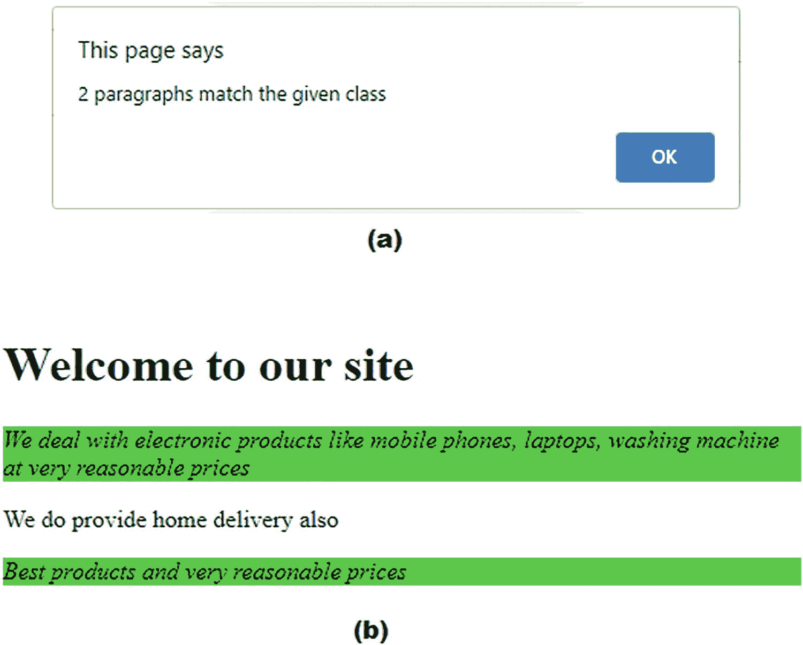

# 一、JQuery 基础知识

在这一章中，我们将讨论 jQuery 的基础知识，比如选择元素、应用样式等等。我们将在本章中介绍以下食谱:

*   在网页上包含 jQuery 库

*   在处理之前准备好文档

*   将样式应用于包装集

*   将样式应用于特定段落

*   对特定类别的段落进行计数并对其应用样式

*   返回到先前的选择

*   移除 DOM(文档对象模型)并预先计划和追加元素

*   应用链接以便对选定的列表元素应用样式

*   使用一个`for`循环来显示一个无序列表的柠檬

*   替换 DOM 元素

*   替换文本和 HTML

*   克隆 DOM

*   显示兄弟姐妹

*   设置和获取属性

*   计算 DOM 中节点的数量并显示它们的文本

*   获取元素的 HTML

*   将相同的类名分配给不同的 HTML

在开始之前，让我们快速回顾一些 JQuery 基础知识。

## 1.1 什么是 jQuery？

jQuery 是一个轻量级的跨平台 JavaScript 库。由于其易于使用的语法，jQuery 使得在任何网站上包含 JavaScript 变得非常容易。它不仅简化了复杂的编码，而且减少了代码的大小。

以下是 jQuery 的一些特性:

*   jQuery 是一个开放源码项目，根据 MIT 许可证授权，允许在任何网站上免费使用，如果需要，可以根据 GNU 公共许可证重新授权，以包含在其他 GNU 授权的开放源码项目中。

*   它有一个庞大的用户和贡献者社区，每天都在使它变得更好。它的社区发布了大量关于 bug 修复和增强的帖子。

*   它有大量的插件，使你能够添加功能到你的网页，并开发与不同平台兼容的应用。

*   它的 API 是完全文档化的，使得它易于使用和访问它的全部特性。

*   它支持大多数 CSS3 选择器。此外，jQuery 具有强大的 DOM 交互和操作方法。也就是说，jQuery 提供了几个方法，使得选择所需的 DOM 以及迭代和遍历 DOM 变得非常容易。

*   它的学习曲线很浅。因为它使用了 CSS 和 HTML，所以学习它的概念非常容易。

*   它针对大多数现代浏览器进行了优化，包括 Chrome、Internet Explorer、Opera、Firefox 和 Safari。

*   jQuery 中的编码大大减少了，因为它支持链式方法调用。链式方法调用意味着一个接一个地调用方法，一个方法的结果作为输入提供给另一个方法，因此减少了大量语句。

要使用 jQuery，不需要安装。直接从官网下载 jQuery， [`http://jquery.com/`](http://jquery.com/) ，里面有几个版本的 jQuery。可以下载最稳定的版本。

将 jQuery 下载到本地文件系统后，只需使用 HTML `<script>`元素引用文件的位置。此外，jQuery 可以通过内容交付网络(cdn)免费获得。许多公司，如 Google 和 Microsoft，在分布在世界各地的强大、低延迟的服务器上提供 jQuery 文件，以便快速访问。由于服务器分布和缓存，CDN 托管的 jQuery 副本访问起来相当快，但是如果您无法访问互联网，您可以随时下载 jQuery 副本并从本地磁盘访问它。

在本书中，我们将非常频繁地使用两个术语， *DOM* 和*选择器*。所以，在我们开始第一个食谱之前，让我们先了解它们。

## 1.2 了解 DOM

DOM 将 HTML 元素表示为一个对象网络，就像页面上的元素树。以下示例将帮助您理解元素树在网页上的存在方式:

```js
<html>
      <head>
           <title>web page title</title>
      </head>
      <body>
           <ul>
                 <li>First list item</li>
                <li>Second list item</li>
                <li>Third list item</li>
         </ul>
      </body>
</html>

```

这里，`<html>`是网页上所有元素的祖先或父元素。即所有元素都是`<html>`的后代或子代。`<head>`和`<body>`元素是`<html>`的后代或子代。`<li>`元素是`<ul>`的子元素或子元素。`<ul>`元素是所有`<li>`元素的父元素，所有`<li>`元素是彼此的兄弟元素。

## 1.3 选择器

顾名思义，jQuery 选择器有助于根据 id、名称、类型、属性、类等在 HTML 文档中找到 DOM 元素。jQuery 选择器返回元素或元素列表。

### 选择器的类型

可以使用不同的元素属性(如类型、类、id、属性或索引位置)来选择网页上的元素，如下所示:

*   **类型:**下面的 jQuery 选择器将选择所有的`<p>`元素:

`$("p")`

`$("*")`将选择所有元素。

*   **Class:** 下面的 jQuery 选择器将选择名为`info`的类的所有元素。

`$(".info")`

`$(".info,.features")`将选择类别为`info`或`features`的所有元素。

*   **ID:** 下面的 jQuery 选择器将选择 ID 为`ElectronicsProducts`的元素:

`$("#ElectronicsProducts")`

*   **属性:**下面的 jQuery 选择器将选择定义了`href`属性的所有元素:

`$("[href]")`

*   **索引位置:**下面的 jQuery 选择器将选择第二个`<p>`元素。像所有编程语言一样，索引是从 0 开始的，所以第一个元素被认为是在索引 0 处，第二个元素是在索引 1 处，依此类推。

`$("p:eq(1)")`

## 1.4 1-1.在网页中包含 jQuery 库

### 问题

您希望在 web 页面中使用 jQuery JavaScript 库。

### 解决办法

考虑下面的 HTML 文件，您希望在其中使用 jQuery 库:

`selectprg.html`

```js
<!DOCTYPE html PUBLIC "-//W3C//DTD XHTML 1.0 Transitional//EN"
        "http://www.w3.org/TR/xhtml1/DTD/xhtml1-transitional.dtd">

<html xmlns:="http://www.w3.org/1999/xhtml" xml:lang="en" lang="en">
   <head>
    <meta http-equiv="Content-Type" content="text/html; charset=utf-8"/>
    <title>First jQuery Example</title>
<link rel="stylesheet" href="selectprgstyle.css" type="text/css" media="screen" />
<script src="https://ajax.googleapis.com/ajax/libs/jquery/3.5.1/jquery.min.js"></script>
    <script src="selectprgjq.js" type="text/javascript"></script>
   </head>
   <body>
.....
   </body>
</html>

```

要包含 jQuery JavaScript 库，您需要使用 HTML `<script>`元素，并在 jQuery 文件的`src`属性中提供 URL 或目录路径。

在网页中嵌入 jQuery 库有两种方式:

*   使用任何托管内容交付网络将 jQuery 包含在网页中。

*   从`jQuery.com`下载 jQuery，并在文件系统的网页中使用它。

为了使用 Google 托管的 CDN，请在 HTML 页面中使用以下语句:

```js
<script src="https://ajax.googleapis.com/ajax/libs/jquery/3.5.1/jquery.min.js"></script>

```

在上面的 HTML 文件中，`selectprgstyle.css`被假定为级联样式表文件，`selectprgjq.js`被假定为包含要在网页上应用的 jQuery 代码的文件。

### 它是如何工作的

HTML `<script>`元素将通过其在当前网页中的`src=""`属性链接在指定 URL 上提供的 jQuery 库。使用 Google 托管版本的 jQuery 的好处是，您可以获得一个稳定、可靠、无错误、全球可用的 jQuery 副本。

如果您无法访问互联网并且不想使用 Google 托管的 jQuery 代码副本，您可以随时从`jQuery.com`下载 jQuery 并将其托管在您的本地文件系统中，并用 jQuery 文件位置的目录路径替换`src`属性值。以下脚本标记包括本地文件系统中的 jQuery 库:

```js
    <script src="jquery-3.5.1.js" type="text/javascript"></script>

```

## 1.5 1-2.在处理之前准备好文档

### 问题

在遍历或操作 DOM 之前，必须确保 DOM 在被操作之前被加载。不仅仅是 DOM 您希望确保在应用 jQuery 代码之前加载图像和其他文件。

### 解决办法

当 JavaScript 代码出现在浏览器中并且正在处理标题时，它会立即运行。因此，您需要延迟代码的执行，直到 DOM 可以应用处理。换句话说，您需要延迟 jQuery 函数的执行，直到 DOM“准备好”被处理。使用`$(document).ready()`方法，jQuery 会推迟函数调用，直到 DOM 加载完毕

一旦 DOM 准备就绪，jQuery 将执行回调函数，该函数执行以下任务:

*   使用所需的选择器访问元素。选择器返回匹配的元素。

*   操作选定的元素或对其应用所需的任务。

下面是 jQuery 代码，它演示了在对文档执行任何 jQuery 代码之前，如何等待文档准备就绪:

```js
$(document).ready(function() {
..................
..................
})

```

### 它是如何工作的

更准确地说，`ready()`方法指定了当 DOM 完全加载时要执行的函数。`function`关键字不带函数名，函数体包含要应用于 DOM 的代码。函数体也作为参数传递给`ready`方法，因为您希望函数立即执行，但只执行一次。

## 1.6 1-3.将样式应用于包装集

### 问题

您需要获得 jQuery 包装器集并应用样式。当您从 HTML 页面中选择某些 DOM 元素时，它们被包装了 jQuery 功能。对于这个包装器集，您希望应用不同的 jQuery 函数和属性。我们来看看是怎么做的。

### 解决办法

这是一个 HTML 文件，包含几个段落元素和一个标题 1 元素。使用标题级别 1 显示文本**欢迎来到我们的网站**。三个`<p>`元素用于显示特定文本。

`Wrapperpage.html`

```js
<!DOCTYPE html PUBLIC "-//W3C//DTD XHTML 1.0 Transitional//EN"
        "http://www.w3.org/TR/xhtml1/DTD/xhtml1-transitional.dtd">

<html xmlns:="http://www.w3.org/1999/xhtml" xml:lang="en" lang="en">
  <head>
    <meta http-equiv="Content-Type" content="text/html; charset=utf-8"/>
    <title>jQuery Wrapper Set</title>
<link rel="stylesheet" href="wrapperstyle.css" type="text/css" media="screen" />
    <script src="jquery-3.5.1.js" type="text/javascript"></script>
    <script src="wrapperjq.js" type="text/javascript"></script>
  </head>
  <body>
    <H1>Welcome to our site </H1>
<p> We deal with electronic products like mobile phones, laptops, washing machine at very reasonable prices </p>
<p> We do provide home delivery also </p>
<p> Best products and very reasonable prices </p>
  </body>
</html>

```

您希望对 HTML 文件的所有段落元素应用某种样式。创建了`wrapperstyle.css`文件，并在其中创建了一个样式，如图所示。

`Wrapperstyle.css`

```js
.highlight{
       font-style: italic;
       background-color: #0f0;
}

```

在上面的 CSS 样式表文件中，创建了一个名为`highlight`的 CSS 样式类，将字体样式改为斜体，背景颜色改为绿色。

为了将 CSS 文件中定义的名为`highlight`的样式应用于 HTML 页面的段落元素，在`wrapperjq.js`文件中编写了以下 jQuery 代码:

`Wrapperjq.js`

```js
$(document).ready(function() {
           $('p').addClass('highlight');
})

```

### 它是如何工作的

为了选择想要的 DOM，您需要使用 jQuery 中的选择器 API。要使用选择器 API，只需编写一个名为`$`(美元符号)的对象。美元符号也可以用字符串`"jQuery"`代替。事实上，`$`变量包含了整个 jQuery 框架，并且是开始 jQuery 编码所必需的。`$`变量有几个成员属性和方法，可以调用它们来选择所需的 DOM。简而言之，`$`变量是 jQuery 函数和名称空间的别名。`$()`函数通常将一个字符串作为参数，这个参数可以是一个 CSS 选择器，它返回一个新的 jQuery 对象实例，这个实例可能包含零个或多个 DOM 元素，可以对这些元素应用所需的处理。

jQuery 将扫描整个 HTML 页面，并将所有的`<p>`元素放在包装器集中，这样 jQuery 方法就可以应用于它们。隐式迭代是自动应用的，因此观察包装器集中的每个 DOM 元素，并将指定的高亮类应用于包装器集中的每个段落元素。`addClass`方法应用于页面上的每个`<p>`元素，没有使用任何循环，这意味着隐式迭代应用于包装器集合中的所有元素。

运行 HTML 文件时，您会看到 H1 标题级别显示了最高标题级别的文本。同样，在应用名为`highlight`的 CSS 类时，三个段落的文本将以斜体显示，背景颜色为绿色，如图 1-1 所示。


图 1-1

将样式应用到

元素

## 1.7 1-4.将样式应用于特定段落

### 问题

您有一个 HTML 文件，您想根据段落的位置来选择段落，并对其应用样式。

### 解决办法

考虑下面的 HTML 文件，它包含一个标题级别 1 元素和三个段落:

`selectprg.html`

```js
<!DOCTYPE html PUBLIC "-//W3C//DTD XHTML 1.0 Transitional//EN"
        "http://www.w3.org/TR/xhtml1/DTD/xhtml1-transitional.dtd">

<html xmlns:="http://www.w3.org/1999/xhtml" xml:lang="en" lang="en">
   <head>
    <meta http-equiv="Content-Type" content="text/html; charset=utf-8"/>
    <title>JQuery Examples</title>
    <link rel="stylesheet" href="selectprgstyle.css" type="text/css" media="screen" />
    <script src="jquery-3.5.1.js" type="text/javascript"></script>
    <script src="selectprgjq.js" type="text/javascript"></script>
   </head>
   <body>
          <H1>Welcome to our site </H1>
             <p> We deal with electronic products like mobile phones, laptops, washing machine at very reasonable prices </p>
             <p> We do provide home delivery also </p>
            <p> Best products and very reasonable prices </p>
   </body>
</html>

```

在这个 HTML 文件中，文本**Welcome to we site**显示在标题级别 1 中，三个段落元素用于显示某些文本。

`selectprgstyle.css`

```js
.highlight1{
        font-style: italic;
        background-color: #0f0;
}
.highlight2{
        font-style: bold;
        background-color: #f00;
}

```

这个样式表文件中出现了两个 CSS 样式，`highlight1`和`highlight2`。`highlight1`样式包含使文本以斜体显示并将背景改为绿色的代码。`highlight2`样式包含使文本以粗体显示并将背景颜色改为红色的代码。

`selectprgjq.js`

```js
$(document).ready(function() {
      $('p:even').addClass('highlight1');
          $('p:eq(1)').addClass('highlight2');
})

```

上面的 jQuery 代码中，使用了`addClass()`方法，我们来看看这个方法。

#### addClass()方法

`.addClass()`方法将一个 CSS 类应用到选中的 DOM 元素。

**语法**

```js
$(selector).addClass(class_name)

```

其中`class_name`参数表示要添加的类。

您可以使用`.removeClass()`方法从选定的 DOM 中移除指定的 CSS 类。

### 它是如何工作的

`p:even`选择器选择偶数索引位置的段落元素(即第 0、第 2、第 4 索引位置，依此类推)。请记住，几乎所有编程语言都使用基于 0 的索引，因此第 0 个索引位置的段落元素表示第一个段落，第 2 个索引位置的段落元素表示第三个段落，样式`highlight1`将应用于它们。

`eq(1)`选择器选择第一个索引位置的`<p>`元素，因此样式`highlight2`将应用于第二个段落元素。

在这段代码中，您可以找到文档中位于偶数索引位置的所有`<p>`元素(即位于第 0 个索引位置、第 2 个索引位置、第 4 个索引位置的`<p>`元素，依此类推)。类别`highlight1`适用于所有这些`<p>`元素。

注意将类添加到所有偶数索引的`<p>`元素不需要迭代，因为 jQuery 在其中使用了隐式迭代。

在运行 HTML 文件时，您将看到 CSS 样式`highlight1`应用于索引位置为 0 和 2 的段落元素，使文本以斜体模式和绿色背景色显示。此外，CSS 样式`highlight2`应用于索引位置为 1 的段落元素，使其文本以粗体显示，背景颜色为红色，如图 1-2 所示。


图 1-2

不同的样式应用于偶数索引位置的

元素和第一个索引位置的

元素

## 1.8 1-5.对特定类别的段落进行计数并对其应用样式

### 问题

网页中有一些段落，您想对分配了特定类的段落进行计数，并想对它们应用 CSS 样式类。

### 解决办法

考虑下面的 HTML 文件，它有一个标题级别 1 元素和几个段落，这些段落被分配了特定的类来区分它们:

`countprg.html`

```js
<!DOCTYPE html PUBLIC "-//W3C//DTD XHTML 1.0 Transitional//EN"
        "http://www.w3.org/TR/xhtml1/DTD/xhtml1-transitional.dtd">

<html xmlns:="http://www.w3.org/1999/xhtml" xml:lang="en" lang="en">
   <head>
    <meta http-equiv="Content-Type" content="text/html; charset=utf-8"/>
    <title>JQuery Examples</title>
    <link rel="stylesheet" href="countprgstyle.css" type="text/css" media="screen" />
    <script src="jquery-3.5.1.js" type="text/javascript"></script>
    <script src="countprgjq.js" type="text/javascript"></script>
   </head>
   <body>

        <H1>Welcome to our site </H1>
        <p class="info"> We deal with electronic products like mobile phones, laptops, washing machine at very reasonable prices </p>
        <p> We do provide home delivery also </p>
        <p class="info"> Best products and very reasonable prices </p>
   </body>
</html>

```

您可以在上面的代码中看到，标题级别 1 中显示了一条文本消息，**欢迎来到我们的网站**。三个段落元素用于显示某些文本。第一个和第三个段落元素被分配了类别`info`。

以下是包含要应用于所选段落的样式规则的 CSS 文件:

`countprgstyle.css`

```js
.highlight1{
       font-style: italic;
       background-color: #0f0;
}

```

CSS 文件包含名为`highlight1`的样式，该样式包含使文本以斜体显示并将其背景颜色设置为绿色的代码。

`countprgjq.js`

```js
$(document).ready(function() {
        alert($('p').filter('.info').length+" paragraphs match the given class");
        $('p').filter('.info').addClass('highlight1');
})

```

### 它是如何工作的

方法显示一个带有指定消息的对话框。该对话框有一个“确定”按钮，在用户单击“确定”按钮之前，显示消息的对话框会一直保持在那里。换句话说，警告对话框将焦点从当前窗口移开，并迫使查看者阅读消息。`alert`方法显示一个对话框，显示具有类`info.`的段落元素的数量

`.filter()`方法遍历匹配的元素集(即遍历所有的`<p>`元素),并将筛选出具有`info`类的元素。也就是说，选择并返回所有具有类`info`的`<p>`元素，以便样式`highlight1`可以应用于它们。不具有类别`info`的所有`<p>`元素被过滤掉(即，从匹配集中移除)。

将出现警告对话框，显示与`info`类匹配的段落数(见图 1-3 (a))。计数 2 将通过警告对话框显示，`highlight1`的 CSS 样式将应用于具有`info`类的段落(即，第一和第三段的文本将变为斜体模式，其背景颜色将变为绿色)。参见图 1-3(b) 。



图 1-3

(a)显示具有特定样式的

元素计数的警告对话框(b)应用于 info 类的

元素的样式

## 1.9 1-6.返回到先前的选择

### 问题

您已经使用选择器选择了某个 DOM，现在您想返回到上一个 DOM 来执行某个任务。

### 解决办法

下面是一个 HTML 文件，它包含一个标题级别 1 元素和几个段落:

`Returnpriorpage.html`

```js
<!DOCTYPE html PUBLIC "-//W3C//DTD XHTML 1.0 Transitional//EN"
        "http://www.w3.org/TR/xhtml1/DTD/xhtml1-transitional.dtd">

<html xmlns:="http://www.w3.org/1999/xhtml" xml:lang="en" lang="en">
   <head>
    <meta http-equiv="Content-Type" content="text/html; charset=utf-8"/>
    <title>JQuery Examples</title>
    <link rel="stylesheet" href="returnpriorstyle.css" type="text/css" media="screen" />
    <script src="jquery-3.5.1.js" type="text/javascript"></script>
    <script src="returnpriorjq.js" type="text/javascript"></script>
   </head>
   <body>
         <H1>Welcome to our site </H1>
         <p class="info"> We deal with electronic products like mobile phones, laptops, washing machine at very reasonable prices </p>
        <p> We do provide home delivery also </p>
        <p class="info"> Best products and very reasonable prices. <a href="bmharwani.com">Click for details </a> </p>
   </body>
</html>

```

您可以在上面的代码中看到，标题级别 1 元素用于显示文本**欢迎来到我们的网站**。某些文本通过三个段落元素显示。为了在 jQuery 代码中明确地访问它们，第一段和第三段被分配了类`info`。

以下是包含要应用于所选段落的样式的 CSS 文件:

`Returnpriorstyle.css`

```js
.highlight1{
      font-style: italic;
      background-color: #0f0;
}

```

`highlight1`样式包含使文本以斜体显示并将其背景颜色设置为绿色的代码。

以下是 jQuery 代码，用于区分需要应用 CSS 样式的段落:

`Returnpriorjq.js`

```js
$(document).ready(function() {
        $('p').filter('.info').addClass('highlight1');
})

```

### 它是如何工作的

类别为`info`的段落元素被过滤掉(即选中并应用`highlight1`的 CSS 样式，使其文本以斜体和绿色背景色显示，如图 1-4 。


图 1-4

highlight1 的 CSS 样式应用于带有类信息的

元素

如果添加了`end()`方法，控件将返回到之前的 DOM(即所有三个段落元素):

```js
$(document).ready(function() {
      $('p').filter('.info').end().addClass('highlight1');
})

```

因此，`highlight1`的 CSS 样式将应用于所有三个段落元素，如图 1-5 所示。


图 1-5

应用于所有三个

元素的 CSS 样式

您可以在 jQuery 代码上应用`filter()`和`find()`方法来更精确地选择段落:

```js
$(document).ready(function() {
      $('p').filter('.info').find('a').addClass('highlight1');
})

```

类别为`info`的段落元素被过滤掉(选中)，其中的`<a>`元素(超链接)被搜索，CSS 样式`highlight1`被应用到找到的超链接。最终，只有超链接文本以斜体和绿色背景显示(见图 1-6 )。


图 1-6

应用于超链接的 CSS 样式

Note

您可以应用一个以上的`end()`方法来进入更多先前选择的 DOM。

## 1.10 1-7.移除 DOM 并预先计划和追加元素

### 问题

在这个菜谱中，您将学习如何删除不需要的 DOM，以及如何在 web 页面上的所需位置预先计划和添加所需的元素。

### 解决办法

以下是包含标题级别 1 元素和三个段落的 HTML 文件:

`removingdom.html`

```js
<!DOCTYPE html PUBLIC "-//W3C//DTD XHTML 1.0 Transitional//EN"
        "http://www.w3.org/TR/xhtml1/DTD/xhtml1-transitional.dtd">

<html xmlns:="http://www.w3.org/1999/xhtml" xml:lang="en" lang="en">
   <head>
     <meta http-equiv="Content-Type" content="text/html; charset=utf-8"/>
     <title>JQuery Examples</title>
     <script src="jquery-3.5.1.js" type="text/javascript"></script>
     <script src="removingdomjq.js" type="text/javascript"></script>
   </head>
   <body>
         <H1>Welcome to our site </H1>
         <p> We deal with electronic products like mobile phones, laptops, washing machine at very reasonable prices </p>
         <p> We do provide home delivery also </p>
         <p> Best products and very reasonable prices </p>
   </body>
</html>

```

您可以看到，在上面的代码中，文本**Welcome to we site**出现在标题级别 1。三个段落元素用于显示某些文本。

`removingdomjq.js`

```js
$(document).ready(function() {
       $('H1').remove();
       $('p:eq(0)').prepend('</a><br/>');
       $('p:eq(2)').remove();
       $('p:eq(1)').append('<p>Festivals Offers starts</p>');
})

```

在上面的 jQuery 代码中，使用了一些方法:`remove()`、`prepend()`和`append`。我们来看看这三种方法。

#### 移除( )

`remove()`方法从 DOM 中删除匹配的元素。它不仅会删除指定的元素，还会删除其中的所有元素。换句话说，匹配元素的所有子元素也被删除。

**语法**

```js
$(selector).remove(selector)

```

其中参数`selector`表示要移除的一个或多个元素。如果要删除多个元素，需要用逗号(，)分隔这些元素。

#### 前置( )

`prepend()`方法用于在所选元素的开头插入指定的内容。

**语法:**

```js
$(selector).prepend(content_to_be_inserted)

```

其中,`selector`用于选择需要插入内容的元素，而`content_to_be_inserted`参数是将在通过选择器选择的 DOM 之前添加的内容。

#### 追加( )

`append()`方法将指定的内容插入到所选元素的末尾。

**语法:**

```js
$(selector).append(content_to_append)

```

其中`selector`帮助选择要添加内容的 DOM，而`content_to_append`是必须添加到所选 DOM 末尾的内容。

### 它是如何工作的

标题 1 元素将从网页中删除。在索引位置 0 处的段落元素之前(即，在第一个段落之前)，添加名为`a1.jpg`的图像。此后，插入换行符，并且从网页中移除索引位置 2 处的段落元素(即，第三段)。此外，在索引位置 1 处的段落元素之后(即，在第二段之后)，添加具有文本 **Festivals Offers starts** 的段落元素。运行程序后，您会得到如图 1-7 所示的输出。


图 1-7

删除 H1、添加图像、删除索引位置 2 处的

元素并添加文本后的输出

## 1.11 1-8.应用链接以对选定的列表元素应用样式

### 问题

您有一个包含几个列表项的无序列表，并且您想使用链接对所需的列表项应用某种样式。

### 解决办法

jQuery 中的链接使您能够用一条语句在同一个元素上运行多个 jQuery 方法。链接中使用的多个 jQuery 方法将在所选元素上一个接一个地执行。对于链接，只需在前一个动作的基础上添加另一个 jQuery 动作。

以下是显示无序列表的 HTML 文件:

`chaining.html`

```js
<!DOCTYPE html PUBLIC "-//W3C//DTD XHTML 1.0 Transitional//EN"
        "http://www.w3.org/TR/xhtml1/DTD/xhtml1-transitional.dtd">

<html xmlns:="http://www.w3.org/1999/xhtml" xml:lang="en" lang="en">
  <head>
    <meta http-equiv="Content-Type" content="text/html; charset=utf-8"/>
    <title>JQuery Examples</title>
    <link rel="stylesheet" href="chainingstyle.css" type="text/css" media="screen" />
    <script src="jquery-3.5.1.js" type="text/javascript"></script>
    <script src="chainingjq.js" type="text/javascript"></script>
  </head>
  <body>
<ul id="ElectronicsProducts">
                    <li>Cameras</li>
                    <li>Cell Phones</li>
                    <li>Laptops</li>
             </ul>
  </body>
</html>

```

您可以在上面的代码中看到，一个无序列表是用 id`ElectronicsProducts`创建的，由三个列表项组成:`Cameras`、`Cell Phones`和`Laptops`。

若要将样式应用于选定的列表项，请将以下样式规则写入 CSS 文件:

`chainingstyle.css`

```js
.highlight1{
       font-style: italic;
       background-color: #0f0;
}
.highlight2{
      font-style: bold;
      background-color: #f00;
}

```

样式表包含两个名为`highlight1`和`highlight2`的样式。`highlight1`样式包含了将文本转换成斜体并将其背景颜色改为绿色的代码。类似地，`highlight2`类包含将文本转换为粗体并将背景颜色改为红色的代码。

为了利用链接方法对无序列表的不同列表项应用不同的样式，编写了以下 jQuery 代码:

`chainingjq.js`

```js
$(document).ready(function() {
      $('li:contains(Cell Phones)').parent().find('li:eq(0)')
      .addClass('highlight1').end().find('li:eq(2)')
      .addClass('highlight2');
});

```

在上面的 jQuery 代码中，使用了`find()`方法，所以我们来看看这个方法。

#### 查找( )

`find()`方法用于查找所选元素的所有后代元素。该方法扫描所有元素，直到 DOM 中选定元素的最后一片叶子。以下是使用`find()`方法的两种方式:

**语法:**

```js
$(selector).find()

```

其中`selector`是必须找到其所有后代元素的元素。该函数返回所有找到的派生元素。

**语法:**

```js
selector.find( selector )

```

其中`find`方法左边的`selector`帮助选择其后代必须被扫描的元素，并且作为参数发送到 find 方法的`selector`用于从找到的后代中选择元素。

### 它是如何工作的

搜索所有列表项，查看是否有任何列表项包含字符串 **Cell Phones** 。如果找到该列表项，则选择其父项。在第二个列表项中找到了`Cell Phones`文本，并且`<li>`元素的父元素是`<ul>`元素，因此选择了一个无序列表元素，并且从其后代中选择了第 0 个索引位置处的列表项(即第一个列表项)元素(即，选择了具有文本`Cameras`的列表项，并且对其应用了样式`highlight1`)。当调用`end()`方法时，控制返回到父元素(即，无序列表元素)。同样，从无序列表的后代中，选择第二个索引位置处的列表项元素(即，第三个列表项)(具有文本`Laptops`)并对该列表项应用样式`highlight2`(如图 1-8 所示)。


图 1-8

highlight1 样式应用于索引位置 0 的列表项，highlight2 样式应用于第二个索引位置的列表项

## 1.12 1-9.使用 for 循环显示无序列表的元素

### 问题

您有一个某些列表项的无序列表。您希望使用一个`for`循环来显示无序列表的所有列表项。

### 解决办法

下面的 HTML 程序包含一个无序列表，其中包含几个列表项。

`fordisplay.html`

```js
<!DOCTYPE html PUBLIC "-//W3C//DTD XHTML 1.0 Transitional//EN"
        "http://www.w3.org/TR/xhtml1/DTD/xhtml1-transitional.dtd">
<html xmlns:="http://www.w3.org/1999/xhtml" xml:lang="en" lang="en">
  <head>
    <meta http-equiv="Content-Type" content="text/html; charset=utf-8"/>
    <title> </title>
    <script src="jquery-3.5.1.js" type="text/javascript"></script>
    <script src="fordisplayjq.js" type="text/javascript"></script>
  </head>
  <body>
<ul id="ElectronicsProducts">
                    <li>Cameras</li>
                    <li>Cell Phones</li>
                    <li>Laptops</li>
             </ul>
  </body>
</html>

```

您可以在上面的代码中看到，一个无序列表是用 id`ElectronicsProducts`创建的，由三个列表项组成:`Cameras`、`Cell Phones`和`Laptops`。id 被分配给无序列表，以便可以在 jQuery 代码中精确地访问它。

下面是访问无序列表的列表项并显示它们的 jQuery 代码:

`fordisplayjq.js`

```js
$(document).ready(function() {
       var $nodes = $('#ElectronicsProducts').children();
       alert('Number of nodes is '+$nodes.length);
       var txt="";
       for (var i = 0; i < $nodes.length; i++){
                     txt+=$('#ElectronicsProducts').find('li:eq('+i+')').text()+" ";
       }
       alert("Items in the unordered lists are "+txt);
});

```

上面的 jQuery 代码中使用了`children()`方法，我们先来看看。

#### 儿童( )

`children()`方法找到所选元素的所有子元素并返回它们。该方法遍历所有子元素，直到所选元素的叶元素，并返回所有子元素。

**语法:**

```js
$(selector).children()

```

其中`selector`是必须返回其子元素的元素。

### 它是如何工作的

id 为`ElectronicsProducts`的元素的所有子节点都将被访问并返回给`nodes`变量。无序列表的 id 为`ElectronicsProducts`，因此它的三个列表项将被赋给变量`nodes`。因为有多个列表项，所以节点将成为包含三个列表项的数组。

将显示一个警告对话框，显示子项目的数量(即列表项目的数量)，因此对话框中将显示 3(参见图 1-9(a) )。

一个字符串变量被初始化，一个`for`循环被设置为从索引值 0 开始执行，直到比节点数组的长度小 1。也就是说，`for`循环将在变量`i`的值从 0 到 2 的范围内运行。使用从第 0 个值到第 2 个值的`for`循环，访问索引位置 0 到 2 的列表项，并将它们的文本连接到字符串变量`txt`。前三个列表项(即`Cameras`、`Cell Phones`和`Laptops`)的文本被分配给`txt`变量。最后，三个列表项的文本通过警告对话框显示(见图 1-9(b) )。


图 1-9

(a)显示节点计数的警告对话框(b)显示所有列表项文本的警告对话框

## 1.13 1-10.替换 DOM 元素

### 问题

您在 HTML 文件中有一个段落元素，您想用一个无序列表替换它。

### 解决办法

下面的 HTML 程序包含三个带有特定文本的段落元素。为了区分段落，给它们分配了独特的类别。

`replacedom.html`

```js
<!DOCTYPE html PUBLIC "-//W3C//DTD XHTML 1.0 Transitional//EN"
        "http://www.w3.org/TR/xhtml1/DTD/xhtml1-transitional.dtd">

<html xmlns:="http://www.w3.org/1999/xhtml" xml:lang="en" lang="en">
   <head>
    <meta http-equiv="Content-Type" content="text/html; charset=utf-8"/>
    <title>JQuery Examples</title>
    <script src="jquery-3.5.1.js" type="text/javascript"></script>
    <script src="replacedomjq.js" type="text/javascript"></script>
   </head>
   <body>
        <p class="features"> We deal with electronic products like mobile phones, laptops, washing machine at very reasonable prices </p>
       <p class="info"> We do provide home delivery also </p>
       <p class="features"> Best products and very reasonable prices </p>
   </body>
</html>

```

在上面的 HTML 代码中，您可以看到某些文本是通过三个段落元素显示的。第一个和第三个段落元素被分配类别`features`，第二个段落元素被分配类别`info`。

下面是用无序列表替换段落元素的 jQuery 代码:

`replacedomjq.js`

```js
$(document).ready(function() {
       $( "p.info" ).replaceWith( "<ul>We provide: <li>Free Home Delivery</li><li>Fast Delivery with Charges </li></ul>" );
});

```

在上面的 jQuery 代码中，使用了一个叫做`replaceWith()`的方法，我们来看看这个方法。

#### replaceWith(新内容)

此方法用所需的新内容替换选定元素集中的每个元素。参数`new_content`可以是 HTML 字符串、DOM 元素、数组或 jQuery 对象。记住，所选元素的内容将被删除，而`new_content`将被粘贴到它的位置。

### 它是如何工作的

第二个段落(即具有类别`info`的段落)由一个无序列表替换，该列表由文本`We provide`和两个列表项`Free Home Delivery`和`Fast Delivery with Charges`组成。因此，在第一段和第三段之间会出现一个无序列表，如图 1-10 所示。


图 1-10

被无序列表替换的

元素

## 1.14 1-11.替换文本和 HTML

### 问题

您有一个标题元素和一个段落元素，您想要替换标题元素的文本，并将 HTML 代码分配给段落元素。

### 解决办法

以下 HTML 文件有一个标题元素和一个段落元素:

`Replacehtmltextpage.html`

```js
<!DOCTYPE html PUBLIC "-//W3C//DTD XHTML 1.0 Transitional//EN"
        "http://www.w3.org/TR/xhtml1/DTD/xhtml1-transitional.dtd">

<html xmlns:="http://www.w3.org/1999/xhtml" xml:lang="en" lang="en">
   <head>
    <meta http-equiv="Content-Type" content="text/html; charset=utf-8"/>
    <title>JQuery Examples</title>
    <script src="jquery-3.5.1.js" type="text/javascript"></script>
    <script src="replacehtmltextjq.js" type="text/javascript"></script>
   </head>
   <body>
       <H1>Welcome to our site </H1>
       <p> We deal with electronic products like mobile phones, laptops, washing machine at very reasonable prices </p>
   </body>
</html>

```

在上面的代码中，您可以看到一条文本消息，**Welcome to we site**，通过标题级别 1 显示。标题下面是显示一些文本的段落元素。

替换标题级别 1 元素的文本并为段落元素设置 HTML 的 jQuery 代码如下:

`Replacehtmltextjq.js`

```js
$(document).ready(function() {
$("h1").text("Welcome to latest Innovations");
$("p").html("<b>Latest Laptops, Cameras, Mobile Phones at attractive prices available</b>");
})

```

### 它是如何工作的

标题级别 1 的文本替换为文本**欢迎使用最新创新**。段落元素的文本替换为 HTML **< b >最新款笔记本电脑、相机、手机价格优惠< /b >** 。该文本将以粗体显示，并将取代原始段落文本，如图 1-11 所示。


图 1-11

H1 的文本和

元素被替换

## 1.15 1-12.克隆 DOM

### 问题

你有 HTML 元素，你想复制它。更准确地说，您希望复制一个段落元素，并将其粘贴到所需的位置。

### 解决办法

下面是一个 HTML 程序，它包含显示某些文本的某些段落元素:

`cloningdom.html`

```js
<!DOCTYPE html PUBLIC "-//W3C//DTD XHTML 1.0 Transitional//EN"
        "http://www.w3.org/TR/xhtml1/DTD/xhtml1-transitional.dtd">

<html xmlns:="http://www.w3.org/1999/xhtml" xml:lang="en" lang="en">
   <head>
    <meta http-equiv="Content-Type" content="text/html; charset=utf-8"/>
    <title> </title>
    <script src="jquery-3.5.1.js" type="text/javascript"></script>
    <script src="cloningdomjq.js" type="text/javascript"></script>
   </head>
   <body>
      <p> We deal with electronic products like mobile phones, laptops, washing machine at very reasonable prices </p>
      <p class="info"> We do provide home delivery also </p>
      <p class="features"> Best products and very reasonable prices </p>
   </body>
</html>

```

您可以在上面的代码中看到，某些文本是通过三个段落元素显示的。为了通过 jQuery 代码访问它们，第二段和第三段分别被赋予了类`info`和`features`。

用于复制段落元素并将其粘贴到另一个段落之后的 jQuery 代码如下:

`cloningdomjq.js`

```js
$(document).ready(function() {
$( "p.info" ).clone().appendTo("p.features");
});

```

### 它是如何工作的

`clone()`方法复制选定的元素，包括其子元素。顾名思义，这个方法制作了元素的精确副本，包括文本和属性。

选择类别为`info`的段落元素，制作其克隆体(即其副本)，并将该克隆体添加到类别为`features`的段落元素的末尾，如图 1-12 所示。


图 1-12

制作类信息的

元素的克隆，并附加到类特征的

元素

Note

当使用`.clone()`方法时，您可以在插入之前修改克隆的元素或它的外观。

让我们将样式应用到被克隆的段落元素。为此，请用以下 jQuery 脚本文件替换脚本行:

```js
    <script src="cloningdombjq.js" type="text/javascript"></script>

```

其中`cloningdombjq.js`包含以下 jQuery 代码:

```js
$(document).ready(function() {
       $( "p.info" ).clone().appendTo("p.features").addClass('highlight1');
});

```

您可以看到，选择了具有类`info`的段落元素，并制作了它的克隆。然后用类`features`将克隆添加到段落元素的末尾。对克隆的段落元素应用 CSS 类`highlight1`。

要将样式应用于克隆的段落，请在 HTML 文件的`<head>`元素中添加以下语句来访问 CSS 文件:

```js
<link rel="stylesheet" href="cloningdomstyle.css" type="text/css" media="screen" />

```

其中`cloningdomstyle.css`包含以下 CSS 样式:

```js
.highlight1{
      font-style: italic;
      background-color: #0f0;
}
.highlight2{
      font-style: bold;
      background-color: #f00;
}

```

CSS 文件包含两个 CSS 类，`highlight1`和`highlight2`。您将在 jQuery 代码中使用`highlight1`风格。CSS 样式`highlight1`包含将文本转换为斜体模式并将其背景颜色改为绿色的代码。在运行程序时，你可以看到克隆的段落(即在它被添加到末尾之前的第二个图形)首先应用了 CSS 样式`highlight1`，如图 1-13 所示。


图 1-13

在对其应用样式后，制作并附加了一个

元素的克隆

## 1.16 1-13.显示兄弟姐妹

### 问题

某些 HTML 元素相互嵌套，您希望显示或找出某个特定 HTML 元素的兄弟元素。

### 解决办法

下面的 HTML 程序包含一个`<div>`元素和嵌套在其中的其他几个 HTML 元素:

`Siblingpage.html`

```js
<!DOCTYPE html PUBLIC "-//W3C//DTD XHTML 1.0 Transitional//EN"
        "http://www.w3.org/TR/xhtml1/DTD/xhtml1-transitional.dtd">

<html xmlns:="http://www.w3.org/1999/xhtml" xml:lang="en" lang="en">
  <head>
    <meta http-equiv="Content-Type" content="text/html; charset=utf-8"/>
    <title>JQuery Examples</title>
    <link rel="stylesheet" href="siblingstyle.css" type="text/css" media="screen" />
    <script src="jquery-3.5.1.js" type="text/javascript"></script>
    <script src="siblingjq.js" type="text/javascript"></script>
  </head>
  <body>
        <div>
                <p> Electronic Products </p>
                <ul>
                        <li>Cameras</li>
                        <li>Cell Phones</li>
                        <li>Laptops</li>
                </ul>
                <H1> Snacks </H1>
                <ul>
                        <li>Pizza</li>
                        <li>Burger</li>
                </ul>
        </div>
  </body>
</html>

```

在上面的 HTML 程序中可以看到，制作了一个`<div>`元素。在`<div>`元素中有一个`<p>`元素，一个`<ul>`元素，一个`<H1>`元素，还有一个`<ul>`元素。两个`<ul>`元素有各自的`<li>`元素。

要将样式应用于所需 HTML 元素的兄弟元素，请在 CSS 文件中定义某些样式规则，如下所示:

`Siblingstyle.css`

```js
.highlight{
      font-style: italic;
      background-color: #0f0;
}

```

您可以看到 CSS 文件包含一个名为`highlight`的样式，它将文本转换为斜体模式，并将其背景颜色更改为绿色。

以下是显示`<div>`元素的兄弟元素的 jQuery 代码:

`Siblingjq.js`

```js
$(document).ready(function() {
      $('div').siblings();
})

```

### 它是如何工作的

如图 1-14 所示，显示`<div>`元素的兄弟元素(即，段落元素，由三个列表项组成的无序列表，标题级别 1 元素，以及带有两个列表项的无序列表)。


图 1-14

显示

元素的两个兄弟元素

要将`highlight`样式仅应用于`<div>`元素的特定兄弟元素(即，仅应用于无序列表)，请修改 jQuery 代码，如下所示:

```js
$(document).ready(function() {
 $('p').siblings('ul').addClass('highlight');
})

```

在`<div>`元素的所有兄弟元素中(即在`<p>, <ul>, <h1>,`和`<ul>`元素中)，选择`<ul>`元素，并将`highlight`样式应用于两个无序列表项，将列表项的文本转换为斜体模式，并将它们的背景色更改为绿色(参见图 1-15 )。


图 1-15

突出显示样式应用于同级的无序列表元素

## 1.17 1-14.设置和获取属性

### 问题

您希望动态地设置和获取 HTML 元素的属性。在这个菜谱中，您将学习如何访问超链接的属性值，以及如何设置或更改其属性值。

### 解决办法

下面的 HTML 文件有两个用特定文本定义的段落元素。第二段被分配类别`info`，此后超链接被定义如下:

`Getsetattribpage.html`

```js
<!DOCTYPE html PUBLIC "-//W3C//DTD XHTML 1.0 Transitional//EN"
        "http://www.w3.org/TR/xhtml1/DTD/xhtml1-transitional.dtd">

<html xmlns:="http://www.w3.org/1999/xhtml" xml:lang="en" lang="en">
   <head>
    <meta http-equiv="Content-Type" content="text/html; charset=utf-8"/>
    <title>jQuery Examples</title>
    <script src="jquery-3.5.1.js" type="text/javascript"></script>
    <script src="getsetattribjq.js" type="text/javascript"></script>
   </head>
   <body>

       <p> We do provide home delivery also </p>
       <p class="info"> Best products and very reasonable prices. </p>
       <a href="http://bmharwani.com">Click for details </a>
   </body>
</html>

```

您将用来获取和设置 HTML 元素属性值的方法是`attr()`，所以现在让我们来看看`attr()`方法。

#### 属性( )

`attr()`方法用于获取和设置 HTML 元素的属性值。当单个参数被传递给`.attr()`函数时，它返回所选元素上被传递属性的值。

**语法:**

```js
$([selector]).attr([attribute name]);

```

为了给某个元素赋值，需要在属性名后面提供属性值。

**语法:**

```js
attr(attributeName, attributeValue)

```

示例:

```js
$('a').attr('title', 'Click for  details');

```

标题`attribute`有助于将文本分配给当鼠标悬停在 HTML 元素上时出现的元素。

为了设置和获取超链接属性值，您需要编写以下 jQuery 代码:

`Getsetattribjq.js`

```js
$(document).ready(function() {
       alert($('a').attr('href'));
       $('a').attr('title', 'Click for bmharwani.com');
       $('a').attr('href','http://jquery.com');
       alert($('a').attr('href'));
})

```

### 它是如何工作的

超链接的属性值将通过警告对话框显示。因为超链接最初是指向 [`http://bmharwani.com`](http://bmharwani.com) 的，所以这个 URL 会显示在提醒对话框中(见图 1-16 (a))。超链接的标题设置为“点击查看 bmharwani.com ”,因此，当指向超链接时，将显示标题(参见图 1-16(c) )。超链接设置为指向 [`http://query.com`](http://query.com) 。超链接的`href`属性通过警告对话框显示(即，超链接指向的 URL 使用警告对话框显示)。参见图 1-16 (b)。


图 1-16

(a)显示超链接指向的 URL 的警告对话框;( b)显示超链接的 href 属性的警告对话框;( c)在指向超链接时显示的超链接的标题

## 1.18 1-15.计算 DOM 中节点的数量并显示它们的文本

### 问题

您希望通过 jQuery 访问 DOM 及其节点。

### 解决办法

在 DOM 中，网页以树结构的形式表示，具有根节点(父节点)和几个分支(子节点)，其中每个 HTML 元素以节点的形式表示。在 jQuery 的帮助下，可以根据需要访问和操作这些节点。

让我们看看下面的 HTML 页面:

`countnodes.html`

```js
<!DOCTYPE html PUBLIC "-//W3C//DTD XHTML 1.0 Transitional//EN"
"http://www.w3.org/TR/xhtml1/DTD/xhtml1-transitional.dtd">
<html xmlns:="http://www.w3.org/1999/xhtml" xml:lang="en" lang="en">
   <head>
    <meta http-equiv="Content-Type" content="text/html; charset=utf-8"/>
    <title>JQuery Examples</title>
    <script src="jquery-3.5.1.js" type="text/javascript"></script>
    <script src="countnodesjq.js" type="text/javascript"></script>
   </head>
   <body>
      <div id="root">
      <div>Darjeeling</div>
      <div>Assam</div>
      <div>Kerala</div>
      </div>
   </body>
</html>

```

您可以看到前面的 HTML 文件包括用于加载 jQuery 库的`<script>`标记，以及用于包含包含 jQuery 代码的 JavaScript 文件的标记(`countnodesjq.js`)。您还可以看到 HTML 文件包含一个带有`id="root"`的`div`元素。这个`div`元素中的所有元素都是子元素(即带有`id="root"`的`div`是其内部描述的所有`div`元素的父元素)。要计算 DOM 节点数并显示它们的文本，请编写以下 jQuery 代码:

`countnodesjq.js`

```js
$(document).ready(function() {
        var $nodes = $('#root').children();
        alert('Number of nodes is '+$nodes.length);
        var txt="";
        $('#root').children().each( function() {
        txt+=$(this).text();
     });
     alert(txt);
});

```

### 它是如何工作的

`id="root"`的 div 的所有子元素都被访问并赋给变量`$nodes`。您使用第一个警告语句显示子节点集合的长度(参见图 1-17(a) )。此后，在`each()`方法的帮助下，您可以一次一个地访问`$nodes`中存储的所有元素。使用`text()`方法，访问并连接字符串变量`$txt`中元素的文本。最后，通过另一种`alert()`方法显示所有子节点的文本，如图 1-17(b) 所示。


图 1-17

(a)通过警告对话框显示的节点计数,( b)显示的 HTML 元素的文本内容

让我们逐一看看前面的 jQuery 代码中使用的方法。

#### 每个( )

`each()`是一种方法，用于迭代包装集合中的每个元素(所选元素)。它包含一个迭代器函数，您可以在其中编写应用于集合中每个单独元素的代码。

#### 文本( )

`text()`是 jQuery 对象的一个方法，用于访问所选元素的文本内容。所选元素的文本内容以字符串的形式组合并返回。要查看段落元素的文本内容，可以编写以下 jQuery 代码:

```js
alert($('p').text());

```

假设段落元素如下例所示:

`<p>Styles make the formatting job much easier and more efficient. To give an attractive look to web sites, styles are heavily used.`

`<span>jQuery is a powerful JavaScript library that allows us to add dynamic elements to our web sites. </span>Not only is it easy to learn, but it's easy to implement too.<br>`

`<a href="a1.htm"> jQuery Selectors</a> are used for selecting the area of the document where we want to apply styles </p>`

前面的 jQuery 代码将显示如图 1-18 所示的输出。


图 1-18

HTML 文件的段落元素的文本内容

您可以使用以下语句查看段落元素的子元素的文本内容:

```js
$(document).ready(function() {
       alert($('p').children().text());
});

```

#### 父级( )

`parent()`方法是一种树遍历方法，它搜索每个所选元素的直接父元素，并返回一个新的 jQuery 对象。这个方法在 DOM 树中只向上移动一层。要获取 span 元素的父元素的文本内容，可以使用以下 jQuery 代码:

```js
alert($('span').parent().text());

```

## 1.19 1-16.获取元素的 HTML

### 问题

您想要查看所选元素的 HTML 代码。

### 解决办法

首先，假设 HTML 文件包含以下段落元素:

`obtainhtml.html`

```js
<!DOCTYPE html PUBLIC "-//W3C//DTD XHTML 1.0 Transitional//EN"
"http://www.w3.org/TR/xhtml1/DTD/xhtml1-transitional.dtd">
<html xmlns:="http://www.w3.org/1999/xhtml" xml:lang="en" lang="en">
  <head>
    <meta http-equiv="Content-Type" content="text/html; charset=utf-8"/>
    <title>JQuery Examples</title>
    <script src="jquery-3.5.1.js" type="text/javascript"></script>
    <script src="obtainhtmljq.js" type="text/javascript"></script>
  </head>
  <body>

```

`<p>Styles make the formatting job much easier and more efficient. To give an attractive look to web sites, styles are heavily used.`

`<span>jQuery is a powerful JavaScript library that allows us to add dynamic elements to our web sites. </span>Not only is it easy to learn, but it's easy to implement too.<br>`

`<a href="a1.htm"> jQuery Selectors</a> are used for selecting the area of the document where we want to apply styles </p>`

```js
  </body>

</html>

```

显示段落元素的 HTML 代码的 jQuery 代码如下所示:

`obtainhtmljq.js`

```js
$(document).ready(function() {
        alert($('p').html());
});

```

#### 它是如何工作的

段落元素的内容被访问，并在`html()`方法及其 HTML 代码的帮助下显示出来。`html()`方法获取所选元素的第一个元素的 HTML 内容。它以字符串的形式返回 HTML 内容。`html()`和`text()`的区别在于`text()`方法可以在 XML 和 HTML 文档中使用，而`html()`只能在 HTML 文档中使用。另一个区别是`html()`方法显示标签和文本。

您将得到的输出如图 1-19 所示。您可以看到输出包括标签和文本。


图 1-19

HTML 文件的段落元素的 HTML 内容

要获取 span 元素的 HTML 内容，可以使用以下语句:

```js
alert($('span').html());

```

要获取 span 元素的父元素的 HTML 内容，可以使用以下 jQuery 代码:

```js
alert($('span').parent().html());

```

## 1.20 1-17.为不同的 HTML 元素分配相同的类名并对它们应用样式

### 问题

您希望为两个 HTML 元素分配相同的类名，并对它们应用样式。这两个元素可以是段落和 h1 元素。

### 解决办法

让我们检查下面的 HTML 文件，其中名为`features`的类被分配给一个段落和 h1 元素:

`assignsameclass.html`

```js
<!DOCTYPE html PUBLIC "-//W3C//DTD XHTML 1.0 Transitional//EN"
"http://www.w3.org/TR/xhtml1/DTD/xhtml1-transitional.dtd">
<html xmlns:="http://www.w3.org/1999/xhtml" xml:lang="en" lang="en">
   <head>
    <meta http-equiv="Content-Type" content="text/html; charset=utf-8"/>
    <title>JQuery Examples</title>
    <link rel="stylesheet" href="style.css" type="text/css" media="screen" />
    <script src="jquery-3.5.1.js" type="text/javascript"></script>
    <script src="sameclassjq.js" type="text/javascript"></script>
   </head>
   <body>
       <p class="features">Styles make the formatting job much easier and more efficient.</p>
      To give an attractive look to web sites, styles are heavily used.
        <h1 class="features">Using jQuery</h1>
   </body>
</html>

```

要将样式应用于前面 HTML 文件中的类`features`的元素，可以使用以下内容创建外部样式表(`style.css`):

```js
.features{color:green;font-style:italic}

```

如果希望通过 jQuery 代码将样式规则应用于 HTML 元素(而不是自动应用)，需要在样式表中为样式规则指定其他名称。

```js
.highlight{color:green;font-style:italic}

```

然后，您需要编写以下 jQuery 代码:

`sameclassjq.js`

```js
$(document).ready(function() {
     $('.features').addClass('highlight');
});

```

#### 它是如何工作的

在 HTML 文件中，段落和 h1 元素都属于类`features`。在最终的样式表中，样式规则有一个选择器`.highlight`，这意味着在这个规则中定义的属性将应用于所有属于类`highlight`的 HTML 元素。样式规则中定义了两个属性，`color`和`font-style`，这些属性应用绿色和斜体样式。

前面的 jQuery 代码将在所有具有类名`features`的 HTML 元素上设置 CSS 类`highlight`。输出如图 1-20 所示。


图 1-20

同样的类也适用于

和

# 标签

## 1.21 1-18.总结

本章不仅重点解释了 jQuery 的基本特性，还解释了 DOM 的概念和不同的选择器类型。您了解了如何在网页中包含 jQuery 将样式应用于包装集；指定段落；统计特定类别的内容；和应用样式。您还了解了如何返回到上一个 DOM，如何移除特定的 DOM，以及如何预先计划和追加元素。您还学习了应用链接的过程，使用`for`循环显示无序列表元素，替换 DOM 元素，替换文本和 HTML，克隆 DOM，显示兄弟元素，以及设置和获取 HTML 元素的属性。

下一章将解释如何使用数组和不同的迭代技术。你将学习排序数组，分割数组，搜索和显示一个数值数组和一个字符串数组，以及连接两个数组的过程。您还将学习如何创建对象数组以及如何使用关联数组。