# 二、数组和迭代

在这一章中，你将学习如何使用数组和不同的迭代技术在数组中搜索想要的信息。我们将在本章中介绍以下食谱:

*   对数组排序

*   将数组一分为二

*   从数值数组中搜索并显示所需的值

*   连接两个数组

*   在字符串数组中搜索所需信息

*   操作数组元素

*   将数值数组转换为字符串并查找它的子字符串

*   创建对象数组并显示内容

*   使用关联数组

*   对对象数组进行排序

## 2.1 对数组排序

### 问题

你有一个元素数组，你想按照你想要的顺序对它们进行排序。

### 解决办法

下面是一个包含一个`<div>`元素和一个无序列表的 HTML 文件:

`Sortarray.html`

```js
<!DOCTYPE html PUBLIC "-//W3C//DTD XHTML 1.0 Transitional//EN"
        "http://www.w3.org/TR/xhtml1/DTD/xhtml1-transitional.dtd">
<html xmlns:="http://www.w3.org/1999/xhtml" xml:lang="en" lang="en">
  <head>
    <meta http-equiv="Content-Type" content="text/html; charset=utf-8"/>
    <title></title>
    <script src="jquery-3.5.1.js" type="text/javascript"></script>
    <script src="sortarrayjq.js" type="text/javascript"></script>
  </head>
  <body>
<div></div>
<ul class="sorted"></ul>
  </body>
</html>

```

您可以在上面的代码中看到，定义了一个`<div>`元素，定义了一个无序列表，并为其分配了类`sorted`。文本将通过`<div>`元素显示，排序后的电子产品将通过一个无序列表显示。

将数组元素按升序排序并显示在屏幕上的 jQuery 代码如下:

`Sortarrayjq.js`

```js
$(document).ready(function() {
     var items=["Television", "Referigerator", "Cameras", "Cell Phones", "Laptops" ]
     items.sort();
     $('div').text("Following are the " +  items.length + " electronic items for sale");
     for (var i = 0; i < items.length; i++){
          $('ul.sorted').append($("<li>" + items[i] + "</li>"));
     }

});

```

在上面的 jQuery 代码中，使用了一些方法，如`sort()`、`append()`和`length`属性，所以我们先来看看它们。

#### 排序( )

顾名思义，`sort()`方法就地对数组元素进行排序。默认情况下，元素将按升序排序。原始数组本身按以下方法排序:

**语法:**

```js
array.sort(compare_function)

```

其中`compare_function`是可选的，定义了排序顺序。

示例:

```js
array.sort(function(a,b){
return a-b;
});

```

比较函数可能返回值<0, =0, or > 0。

*   当< 0 时，表示第二个值大于第一个值，因此在数组中被下推。

*   当> 0 时，第一个值较大，因此在数组中被下推。

*   当=0 时，不会发生任何变化，因为两个值相等。

#### 追加( )

`append()`方法在每个选中元素的末尾插入指定的信息。

**语法:**

*   `info`参数代表必须插入的数据。这些数据可以是简单的 HTML 元素或 jQuery 对象。

*   `function(index,html)`其中`function`参数返回要插入的数据，index 参数指向元素的位置，`html`返回所选元素的 HTML 内容。

```js
$(selector).append(info,function(index,html))

```

#### 长度属性

`length`属性计算所提到的 jQuery 对象中元素的数量并返回它。

**语法:**

```js
$(selector).length

```

其中`selector`是需要确定计数的 jQuery 对象。

### 它是如何工作的

字符串数组由名称`items`定义，并被赋予特定的电子项目。调用`sort`方法，数组`items`按字母顺序排列。使用`text()`方法，通过`<div>`元素显示文本消息，指示待售电子商品的数量。使用一个`for`循环来逐个访问数组的每个元素，并以无序列表的列表项形式显示，如图 2-1 所示。

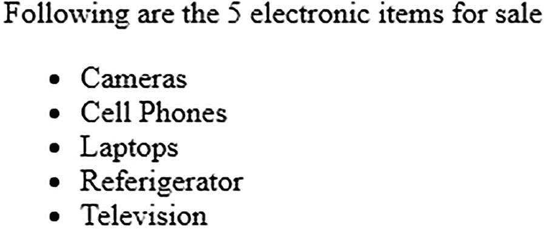

图 2-1

项目计数及其排序顺序

为了反转排序(即，以相反的字母顺序排列项目)，在`items.sort()`方法之后，添加以下语句:

```js
items.reverse();

```

下面简单介绍一下`reverse()`方法。

#### 反向( )

方法颠倒了数组中元素的顺序。数组本身被修改。

**语法:**

```js
array.reverse()

```

添加`reverse()`方法后，您将得到如图 2-2 所示的输出。

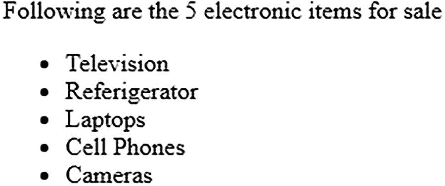

图 2-2

显示项目的数量，并以相反的顺序显示项目

Note

对于数字数组，`items.sort()`不会给出正确的结果，因为 125 会被认为小于 45，因为以 1 开头的数字会被认为小于以 4 开头的数字。要对数值数组进行排序，需要用下面的语句替换`items.sort`语句:

```js
items.sort(function(a,b){
      return a-b;
});

```

以下是完整的 jQuery 代码:

```js
$(document).ready(function() {
     var items=[67,51,125,39,84, 44]
     items.sort(function(a,b){
        return a-b;
    });
    $('div').text("Following are the " +  items.length + " numericals in ascending order");
    for (var i = 0; i < items.length; i++){
        $('ul.sorted').append($("<li>" + items[i] + "</li>"));
    }
});

```

在运行程序时，你会得到一个按升序排序的数字数组，如图 2-3 所示。

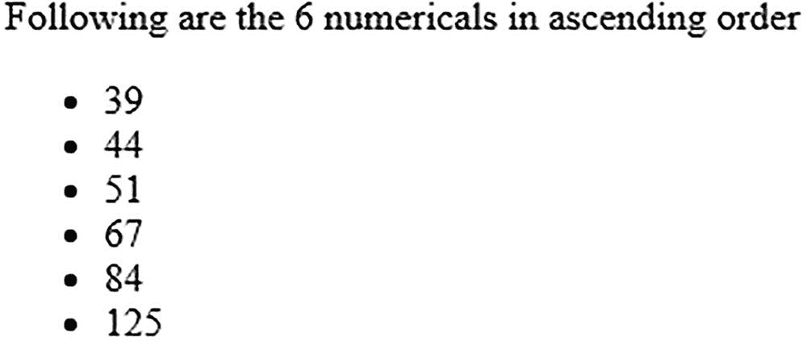

图 2-3

显示数组的长度，其元素按升序显示

## 2.2 将数组一分为二

### 问题

你有一个数组，你想把它分成两部分。

### 解决办法

下面是包含两对`<div>`和`<p>`元素的 HTML 文件:

`Splitarray.html`

```js
<!DOCTYPE html PUBLIC "-//W3C//DTD XHTML 1.0 Transitional//EN"
        "http://www.w3.org/TR/xhtml1/DTD/xhtml1-transitional.dtd">
<html xmlns:="http://www.w3.org/1999/xhtml" xml:lang="en" lang="en">
  <head>
    <meta http-equiv="Content-Type" content="text/html; charset=utf-8"/>
    <title></title>
    <script src="jquery-3.5.1.js" type="text/javascript"></script>
    <script src="splitarrayjq.js" type="text/javascript"></script>
  </head>
  <body>
<div id="electronics"></div>
<p class="electronics"></ul>
<div id="garments"></div>
<p class="garments"></ul>
  </body>

</html>

```

您可以在上面的代码中看到有两对`<div>`和`<p>`元素，因为您想要分别显示电子产品和服装。每个`<div>`元素将显示各自的标题(即，其下方显示的项目是电子产品还是服装)。类似地，每个`<p>`元素将用于显示各自的项目。为了区分两个`<div>`元素，它们分别被赋予 id`electronics`和`garments`。类似地，两个`<p>`元素分别被分配了类`electronics`和`garments`。

初始化数组、拆分数组以及分别显示其内容的 jQuery 代码如下:

`Splitarrayjq.js`

```js
$(document).ready(function() {
    var items=["Television", "Refrigerator", "Cameras", "Cell Phones", "Laptops", "Jeans", "Shirts", "Blazers" ]
    electronics=items.splice(0,5);
    $('div#electronics').text("Following are the " +  electronics.length + " electronic items for sale");
    $('p.electronics').html(electronics.join());
    $('div#garments').text("Following are the " +  items.length + " garments for sale");
    $('p.garments').html(items.join());
});

```

在上面的 jQuery 代码中，使用了`splice()`和`join()`方法，所以我们先快速看一下这两个方法。

#### 拼接( )

`splice()`方法执行向数组添加新元素和从数组中移除现有元素的任务。方法返回修改后的数组。

**语法:**

*   `location`参数表示添加或删除元素的下标或索引位置。如果该值为负，则意味着该位置位于数组的末尾。

*   `number`参数指定要从上述位置移除的元素数量。

*   `items_to_insert`参数是一个由逗号分隔的项目列表，您想要在指定位置插入这些项目。该参数是可选的。

```js
array.splice(location, number, items_to_insert )

```

方法修改数组并返回移除的元素列表。如果没有移除任何元素，则返回一个空数组。

### 加入( )

`join()`方法连接数组的元素，并以字符串的形式返回它们。

**语法:**

```js
array.join(separator)

```

其中`separator`参数是分隔数组中每个元素的分隔符。默认分隔符是逗号。

方法返回一个字符串，该字符串包含由提供的分隔符分隔的所有连接元素。

### 它是如何工作的

`items`数组被初始化，一些电子产品和服装被分配给它。

因为数组`items`中的前五个元素是电子产品，所以使用`splice()`方法从`items`数组中提取前五个元素，并将它们分配给另一个名为`electronics`的数组。在应用了`splice()`方法后，第六个元素及以后的元素(直到结束)将只保留在`items`数组中(即服装将保留在`items`数组中)。电子产品的数量通过 id 为`electronics`的`<div>`元件显示。接下来，电子阵列中的所有电子项目通过类别为`electronics`的`<p>`元素显示。类似地，服装商品的数量通过 id 为`garments`的`<div>`元素显示。`items`数组中的服装名称通过分配了`garments`类的`<p>`元素显示(见图 2-4 )。

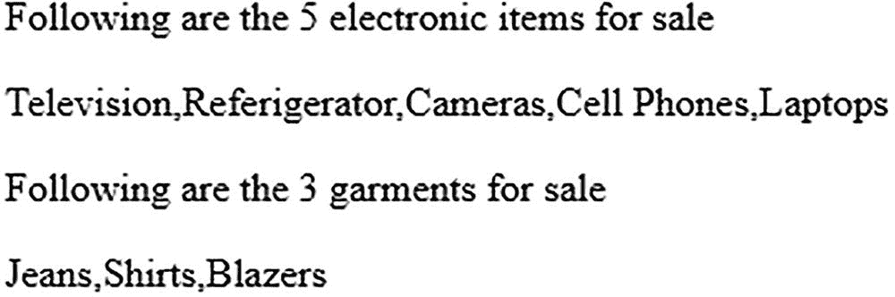

图 2-4

划分阵列，一个显示电子产品，另一个显示服装

如果您希望元素一个接一个地出现，您可以将`<br/>`作为参数传递给`join()`方法。

Note

在这个菜谱中，您将学习根据数组的索引来拆分数组。根据内容分割数组将在本章后面介绍。

## 2.3 从数字数组中搜索并显示所需的值

### 问题

在一个数值数组中有一些值，你想显示数组中的前五个值以及小于 5 的值。

### 解决办法

为了显示 array 的所有元素、前五个元素以及值小于 5 的元素，在一个 HTML 文件中定义了三对`<div>`和`<p>`元素，如下所示:

`Searchnumarr.html`

```js
<!DOCTYPE html PUBLIC "-//W3C//DTD XHTML 1.0 Transitional//EN"
        "http://www.w3.org/TR/xhtml1/DTD/xhtml1-transitional.dtd">
<html xmlns:="http://www.w3.org/1999/xhtml" xml:lang="en" lang="en">
  <head>
    <meta http-equiv="Content-Type" content="text/html; charset=utf-8"/>
    <title></title>
    <script src="jquery-3.5.1.js" type="text/javascript"></script>
    <script src="searchnumarrjq.js" type="text/javascript"></script>
  </head>
  <body>
<div id="allnums"></div>
<p class="allnums"></ul>
<div id="first5"></div>
<p class="first5"></ul>
<div id="lessthan5"></div>
<p class="lessthan5"></ul>
  </body>
</html>

```

因为您想要显示三类值(所有值、前五个值和小于 5 的值)，所以创建了三个`<div>`和`<p>`元素对。三个`<div>`元素被分配了 id`allnums`、`first5,`和`lessthan5`。类似地，为了区分三个`<p>`元素，它们分别被分配了类别`allnums`、`first5`和`lessthan5`。

为了显示数组中的所有项目，显示前五个元素以及少于五个的元素，jQuery 代码如下所示:

`Searchnumarrjq.js`

```js
$(document).ready(function() {
     var nums=[5,0,4,2,7,1,9,3,6,8]
     $('div#allnums').text("Complete list");
     $('p.allnums').html(nums.join(", "));
     first5 =$.grep(nums, function( n, i ) {
           return ( i<=4 );
     });
     $('div#first5').text("First 5 values");
     $( "p.first5" ).text(first5.join( ", " ) );
     lessthan5 =$.grep(nums, function( n, i ) {
           return ( n<5 );
     });
     $('div#lessthan5').text("Values less than 5");
     $( "p.lessthan5" ).text(lessthan5.join( ", " ) );
});

```

在上面的 jQuery 代码中，使用了`grep()`方法，所以我们来了解一下它是如何工作的。

#### grep()

`grep()`方法用于搜索满足过滤函数的数组元素。

**语法:**

*   `array`参数表示必须进行搜索的数组。

*   `function(value, location)`参数表示采用两个参数的过滤函数:
    *   `value`指向数组的当前元素。

    *   `location`指向当前元素的下标。

*   如果忽略`invert`参数，则返回一个数组，其中包含函数返回 true 的所有元素。但是如果这个参数作为 true 传递，那么就会发生相反的情况。你得到一个数组，它包含了函数返回 false 的所有元素。

```js
jQuery.grep(array, function(value, location) [, invert])

```

`grep()`方法返回满足过滤函数的元素，不影响原始数组。

### 它是如何工作的

一个整数数组由名字`nums`定义，并用几个整数值初始化。ID 为`allnums`的`div`元素被赋予文本**完整列表**以显示**。**

数组`nums`中的所有整数值都通过被分配了类`allnums`的`<p>`元素显示。正在显示的元素由逗号分隔，并将显示在同一行上。要在单独的行上显示数组元素，请用`<br/>`元素替换`join()`方法中的逗号。

`grep()`方法与过滤器`function()`一起使用，其中`filter()`函数被设置为条件 i < =4，因此它将从`nums`数组中提取索引值小于或等于 4 的元素，并将其分配给数组`first5`。数组`first5`中的元素将通过分配了类别`first5`的段落显示(见图 2-5 )。

同样，`grep()`方法与过滤器`function()`一起使用，其中`filter()`函数被设置为条件 n < 5，因此`filter`函数将从`nums`数组中提取值小于 5 的元素，并将其分配给数组`lessthan5`。`lessthan5`数组中的元素将通过被分配了类别`lessthan5`的段落显示，如图 2-5 所示。

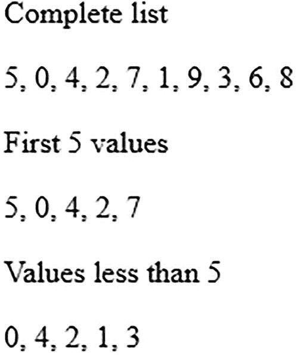

图 2-5

显示完整的数组、前五个值以及小于 5 的值

## 2.4 连接两个数组

### 问题

你有一个包含一些值的数字数组。您希望用它创建两个数组，一个数组包含所有能被 3 整除的数字，另一个数组包含能被 5 整除的数值。然后，您希望将这两个数组连接成一个包含可被 3 或 5 整除的数字的数组。

### 解决办法

为了显示原始数组、包含可被 3 整除的元素的数组、包含可被 5 整除的元素的数组以及两个数组的串联，在 HTML 文件中定义了四对`<div>`和`<p>`元素:

`Arrconcatenate.html`

```js
<!DOCTYPE html PUBLIC "-//W3C//DTD XHTML 1.0 Transitional//EN"
        "http://www.w3.org/TR/xhtml1/DTD/xhtml1-transitional.dtd">
<html xmlns:="http://www.w3.org/1999/xhtml" xml:lang="en" lang="en">
  <head>
    <meta http-equiv="Content-Type" content="text/html; charset=utf-8"/>
    <title></title>
    <script src="jquery-3.5.1.js" type="text/javascript"></script>
    <script src="arrconcatenatejq.js" type="text/javascript"></script>
  </head>
  <body>
  <div id="allnums"></div>
       <p class="allnums"></ul>
       <div id="divisibleby5"></div>
       <p class="divisibleby5"></ul>
       <div id="divisibleby3"></div>
      <p class="divisibleby3"></ul>
      <div id="divisibleby3or5"></div>
      <p class="divisibleby3or5"></ul>
  </body>
</html>

```

您可以在上面的代码中看到，定义了四对`<div>`和`<p>`元素，其中`<p>`元素将用于显示内容，`<div>`元素将用于显示标题(即，通过`<p>`元素通知正在显示的内容)。为了在它们之间进行区分，这些元素被分配了 id`allnums`、`divisibleby5`、`divisibleby3`和`divisibleby3or5`。

jQuery 首先从主数组创建两个数组，一个包含可被 3 整除的元素，另一个包含可被 5 整除的元素，最后将这两个数组连接起来，形成一个包含可被 3 或 5 整除的元素的数组。完成上述任务的完整 jQuery 代码如下:

`Arrconcatenatejq.js`

```js
$(document).ready(function() {
     var nums=[5,0,4,2,7,1,9,3,6,8]
     $('div#allnums').text("Complete list");
     $('p.allnums').html(nums.join(", "));
     divby5 =$.grep(nums, function( n, i ) {
         return ( (n!=0) && (n%5==0 ));
    });
    $('div#divisibleby5').text("Values divisible by 5");
    $( "p.divisibleby5" ).text(divby5.join( ", " ) );
     divby3 =$.grep(nums, function( n, i ) {
         return ( (n!=0) && (n%3==0) );
    });
    $('div#divisibleby3').text("Values divisible by 3");
    $( "p.divisibleby3" ).text(divby3.join( ", " ) );
    $.merge( divby3,divby5 )
    //divby3or5=divby3.concat(divby5);
    $('div#divisibleby3or5').text("Values divisible by 3 or 5");
    $( "p.divisibleby3or5" ).text(divby3.join( ", " ) );
    //$( "p.divisibleby3or5" ).text(divby3or5.join( ", " ) );
});

```

在上面的 jQuery 代码中，使用了两个方法，`merge()`和`concat()`，我们先来快速浏览一下。

#### 合并( )

`merge()`方法将两个数组的内容合并成第一个数组。

**语法:**

```js
$.merge( first_array, second_array )

```

其中`first_array`是将`second_array`的元素合并到的数组。`second_array`的内容不受影响。

#### concat()

方法可以用来连接两个字符串和数组。被连接的两个数组将保持不受影响，并返回连接的版本。

**语法:**

```js
concatenated_array = array1.concat(array2, ...)

```

其中`array1`、`array2`等。是要连接的数组，并且连接的数组(即合并的元素)被返回并且可以被分配给新的数组。

### 它是如何工作的

定义了一个名为`nums` array 的整数数组，包含几个值。为了首先显示数字，标题**完整列表**通过 id `allnums`的`<div>`元素显示。在`<div>`元素下面，使用`allnums`类的`<p>`元素，显示`nums`数组中的所有数值。

为了从`nums`数组中得到能被 5 整除的数字，使用了`grep()`方法和`filter`函数，并且在`filter`函数中使用了`%5`表达式来寻找能被 5 整除的数字。因此，所有能被 5 整除的数字都从`nums`数组中提取出来，并分配给名为`divby5`的数组。通过类`divisibleby5`的`<p>`元素显示`divby5`数组中的元素。这些元素的标题是 ID 为`divisibleby5`的文本`Values divisible by 5`到`<div>`元素。使用相同的过程，可被 3 整除的元素从`nums`数组中提取出来，并分配给名为`divby3`的数组。

此后，调用`merge()`方法，将两个数组`divby3`和`divby5`传递给该方法，并将`divby5`数组的内容添加到`divby3`数组中。

合并的元素(即在`divby3`数组中可被 3 或 5 整除的元素)然后通过类`divisibleby3or5`的`<p>`元素显示。图 2-6 显示了程序的输出。

Note

还有一种方法可以显示能被 3 或 5 整除的数组元素。也可以用`concat`方法替换`merge()`方法。也就是说，`divby3`和`divby5`数组的内容被连接起来，组合的元素被分配给`divby3or5`数组。上面代码中的第一个注释掉的语句也是这样:

`//divby3or5=divby3.concat(divby5);`

此后，`divby3or5`数组中连接的元素可以使用`divisibleby3or5`类的`<p>`元素显示在屏幕上。第二个被注释掉的语句执行此任务:

`//$( "p.divisibleby3or5" ).text(divby3or5.join( ", " ) );`

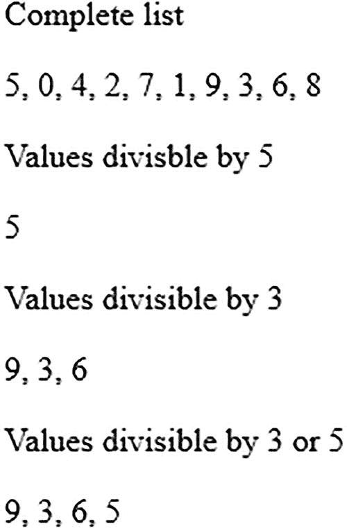

图 2-6

显示所有数组元素和可被 5 整除的元素、可被 3 整除的元素以及可被 3 或 5 整除的元素

## 2.5 在字符串数组中搜索所需信息

### 问题

你有一个字符串数组，在这个数组之外，你想显示特定长度的字符串，以特定字符结尾的字符串，以及有特定子串的字符串。

### 解决办法

为了显示在字符串数组上执行的不同查询的结果，在下面的 HTML 程序中定义了四对`<div>`和`<p>`元素:

`Desiredstr.html`

```js
<!DOCTYPE html PUBLIC "-//W3C//DTD XHTML 1.0 Transitional//EN"
        "http://www.w3.org/TR/xhtml1/DTD/xhtml1-transitional.dtd">
<html xmlns:="http://www.w3.org/1999/xhtml" xml:lang="en" lang="en">
   <head>
    <meta http-equiv="Content-Type" content="text/html; charset=utf-8"/>
    <title></title>
    <script src="jquery-3.5.1.js" type="text/javascript"></script>
    <script src="desiredstrjq.js" type="text/javascript"></script>
   </head>
   <body>
     <div id="allitems"></div>
     <p class="allitems"></ul>
     <div id="length8"></div>
     <p class="length8"></ul>

     <div id="endingwiths"></div>
     <p class="endingwiths"></ul>
     <div id="juices"></div>
     <p class="juices"></ul>
   </body>
</html>

```

您可以在上面的代码中看到，有四对`<div>`和`<p>`元素将用于显示所有项目，长度正好为 8 个字符的项目，以字符 s 结尾的项目，以及列表中的所有果汁。`<div>`元素将用于显示正在显示的项目类别的标题，这就是为什么它们分别被分配了 id`allitems`、`length8`、`endingwiths`和`juices`。`<p>`元素用于显示落入类别的项目，因此分别被分配了类别`allitems`、`length8`、`endingwiths`和`juices`。

显示字符串数组中所需字符串的 jQuery 代码如下所示(即，搜索满足特定条件的字符串):

`Desiredstrjq.js`

```js
$(document).ready(function() {
    var items=["Aloe vera juice", "Apple juice", "Biscuits", "Juice of oranges", "Cakes", "Brownies", "Doughnut", "Juice of pomegranate" ]
    $('div#allitems').text("Complete list");
    $('p.allitems').html(items.join(", "));

    $('div#length8').text("Items of length 8 characters");
    length8items =$.grep(items, function( n, i ) {
          return ( n.length ==8 );
    });
    $( "p.length8" ).text(length8items.join( ", " ) );

    $('div#endingwiths').text("Items ending with 's'");
    endingwithsitems =$.grep(items, function( n, i ) {
         return n.match(/[s]$/)

    });
    $( "p.endingwiths" ).text(endingwithsitems.join( ", " ) );
    $('div#juices').text("List of juices");
     juiceitems =$.grep(items, function( n, i ) {
         return ( n.toLowerCase().indexOf("juice") >= 0 );
    });
    $( "p.juices" ).text(juiceitems.join( ", " ) );
});

```

上面的 jQuery 代码中使用了`indexOf()`方法，我们先来看看这个方法。

#### 索引（）

`indexOf()`方法在主字符串中搜索指定的字符串，并返回指定字符串第一次出现的位置。返回的位置是从 0 开始的，如果在主字符串中找不到要搜索的字符串，则该方法返回-1。

**语法:**

*   `string_to_search`参数表示要搜索的字符串。它区分大小写。

*   `location_to_start`参数指定开始搜索的位置。该参数是可选的，其默认值为 0。

```js
string.indexOf(string_to_search, location_to_start)

```

为了在特定的选择器中搜索子串，使用了`index()`方法。我们也来看看这个方法。

#### 索引( )

`index()`方法在选择器中搜索指定的元素，并返回一个表示元素索引位置的整数。

**语法:**

```js
$(selector).index(element_to_search)

```

其中`element_to_search`参数表示要搜索的元素。如果没有使用参数，该方法将返回选择器的第一个元素相对于其同级元素的索引位置。

### 它是如何工作的

访问 ID 为`allitems`的`<div>`元素，将其文本设置为**完整列表**。通过将项目数组中的所有元素分配给类`allitems.`的`<p>`元素，它们被显示在屏幕上

类似地，ID 为`length8`的`<div>`元素被赋予长度为 8 个字符的文本**项。一个`grep`方法与一个过滤函数一起使用，该函数从`items`数组中提取长度等于 8 个字符的所有项目，并将它们分配给数组`length8items`。此后，通过类`length8`的`<p>`元素显示数组`length8items`中的所有元素。**

类似地，ID 为`endingwiths`的`<div>`元素被赋予以 s 结尾的文本**条目。一个`grep`方法与一个过滤函数一起使用，该函数使用一个正则表达式从最后一个字符为 s 的`items`数组中提取元素，然后将这些元素分配给名为`endingwithsitems`的数组。最后，数组`endingwithsitems`中的元素通过类`endingwiths`的`<p>`元素显示。**

ID 为`juices`的最后一个`<div>`元素被设置为显示文本**果汁列表**。`grep()`方法与过滤函数一起使用，过滤函数在`items`数组的元素中搜索单词**果汁**，这些元素被分配给数组`juiceitems`。此后，通过类`juices`的`<p>`元素显示数组`juiceitems`中的所有元素，如图 2-7 所示。

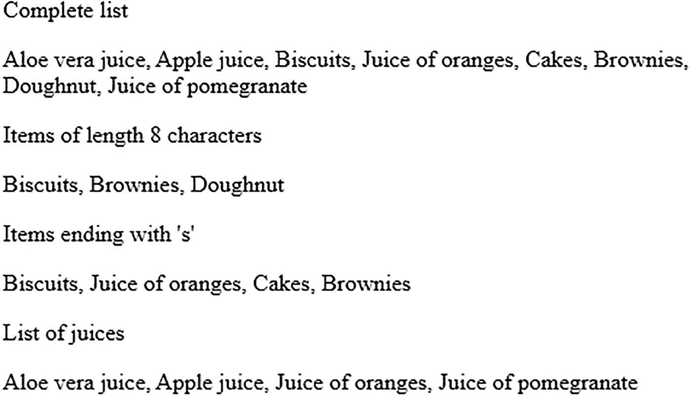

图 2-7

显示整个字符串数组和长度为 8 个字符的元素、以 s 结尾的元素以及带有 juice 子字符串的所有元素

## 2.6 操纵数组元素

### 问题

您希望操作数组元素来完成一些任务，比如对它们应用序列号、将它们转换成大写字母以及其他任务。

### 解决办法

让我们假设一个 HTML 文件，它有一个显示消息`Members of my Group`的 heading 元素和一个空的 paragraph 元素，如下所示:

`manipulatearray.html`

```js
<!DOCTYPE html PUBLIC "-//W3C//DTD XHTML 1.0 Transitional//EN"
        "http://www.w3.org/TR/xhtml1/DTD/xhtml1-transitional.dtd">
<html xmlns:="http://www.w3.org/1999/xhtml" xml:lang="en" lang="en">
  <head>
    <meta http-equiv="Content-Type" content="text/html; charset=utf-8"/>
    <title></title>
    <script src="jquery-3.5.1.js" type="text/javascript"></script>
    <script src="manipulatearrayjq.js" type="text/javascript"></script>
  </head>
  <body>
         <h3> Members of my Group are </h3>
         <p></p>
  </body>
</html>

```

这个空白段落元素将显示取自数组的名称，并应用序列号。

显示数组元素和序列号的 jQuery 代码如下所示:

`manipulatearrayjq.js`

```js
$(document).ready(function() {
     var members = [ "John", "Steve", "Ben", "Damon", "Ian" ];
     members = $.map(members, function(n,i){ return(i+1+"."+n); });
     $('p').html(members.join("<br />"));
});

```

#### 将名称转换为大写

让我们看看如何在回调方法中使用其他有用的方法来操作数组成员。第一个解决方案展示了如何用`toUpperCase()`方法将所有的名字转换成大写。

`convnamestoupperjq.js`

```js
$(document).ready(function() {
     var members = [ "John", "Steve", "Ben", "Damon", "Ian" ];
     members=$.map(members, function(n,i){ return(i+1+"."+n.toUpperCase());});
     $('p').html(members.join("<br/>"));
});

```

#### 使用有序列表

用大写字母和序列号显示数组元素的另一种方法是利用有序列表元素。下面是一个 HTML 文件，显示了一个标题元素和一个空的有序列表元素。

`orderedlist.html`

```js
<!DOCTYPE html PUBLIC "-//W3C//DTD XHTML 1.0 Transitional//EN"
        "http://www.w3.org/TR/xhtml1/DTD/xhtml1-transitional.dtd">
<html xmlns:="http://www.w3.org/1999/xhtml" xml:lang="en" lang="en">
  <head>
    <meta http-equiv="Content-Type" content="text/html; charset=utf-8"/>
    <title></title>
    <script src="jquery-3.5.1.js" type="text/javascript"></script>
    <script src="orderedlistupperjq.js" type="text/javascript"></script>
  </head>
  <body>
      <h3> Members of my Group are </h3>
      <ol id="list">
       </ol>
</body>

</html>

```

以大写形式显示数组元素的 jQuery 代码如下:

`orderedlistupperjq.js`

```js
$(document).ready(function() {
    var memlist = $( "#list" );
    var members = [ "John", "Steve", "Ben", "Damon", "Ian" ];
    members=$.map(members, function(n){ return(n.toUpperCase());});
    $.each(members,function( index, value ){
        memlist.append($( "<li>" + value + "</li>" ));
    });
});

```

在上面的 jQuery 代码中，使用了`each()`方法，所以让我们快速看一下这个方法。

#### 每个( )

`each()`方法用于定义一个函数，该函数在每个选定的元素上执行。也就是说，循环遍历所有选定的 DOM，并执行函数中定义的代码。

**语法**

*   `function(index,element)`参数包含需要在每个所选元素上执行的语句。

*   `index`代表选择器的位置。

*   `element`代表当前元素。

```js
$(selector).each(function(index,element))

```

### 它是如何工作的

要理解这个食谱，你需要了解一下`map()`法。该方法遍历数组的每个元素，并在每个数组元素上调用回调函数。如果您愿意，可以将返回的元素分配给另一个数组或同一个数组。`map()`方法也可以遍历具有长度属性的类似数组的对象。下面是`map()`的语法:

```js
map(array, callback);

```

这里的回调函数包含对数组元素执行处理任务的语句。在第一个解决方案中，您希望显示存储在数组中的名称以及序列号。您可以看到数组`members`已经定义，并且包含了您想要显示的名称。接下来将这个数组传递给`map()`方法。`map()`方法中的回调函数包含两个参数，n 和 I，其中 n 是指传递给`map()`方法的数组元素(名称)，I 是单个数组元素的索引(索引从 0 开始)。要使序列号从 1 而不是 0 开始，可以在每次迭代中给 I 加 1。回调函数返回的值如下所示:

```js
return(i+1+"."+n)

```

该语句从 1 开始逐个返回数组的所有元素。输出如图 2-8 所示。

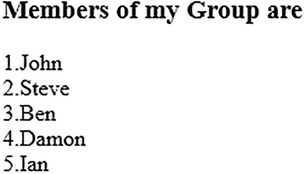

图 2-8

使用数组映射为数组元素分配序列号

接下来，使用回调函数中的`toUpperCase()`方法将数组中存储的所有名称转换成大写:

```js
members=$.map(members, function(n,i){ return(i+1+"."+n.toUpperCase()); });

```

回想一下，回调函数中的参数 n 和 I 分别引用数组元素和索引号。可以看到`toUpperCase()`对 n 的应用(即以数组元素的形式存储在数组中的名字)将名字转换成大写，并返回显示在段落元素中。输出将是转换成大写的名字，以及序列号，如图 2-9 所示。

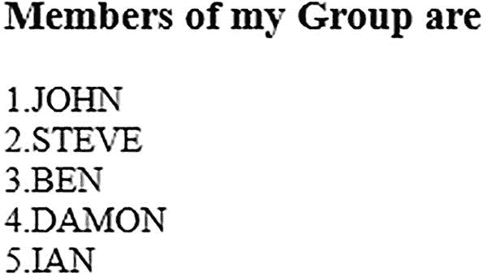

图 2-9

使用数组映射将数组元素转换为大写

有序列表解决方案将自动编号应用于其列表元素。向 members 数组分配`map()`方法的结果，这将把每个数组元素转换成大写。然后将`members`数组的每个成员一个接一个地追加到有序列表中(这个列表有一个 id`list`，通过 jQuery 代码来标识它)。您将得到如图 2-10 所示的输出。

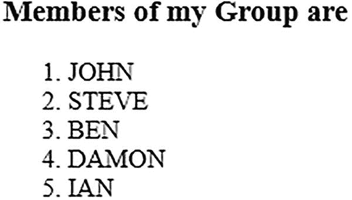

图 2-10

通过列表项以大写形式显示数组元素

## 2.7 将数值数组转换为字符串并查找其子字符串

### 问题

你有一个数字数组，你想把它转换成一个字符串，这样你就可以应用`substr()`方法取出字符串的一部分。

### 解决办法

下面是一个 HTML 文件，它包含三个标题元素，分别显示您正在处理的原始数字数组的标题、转换为字符串形式的数组以及字符串的子字符串。此外，在每个标题元素下面是一个段落元素。这三个段落元素被分配了类名`origarr`、`arrstring`和`partstring`。类`origarr`的段落将用于显示数值数组的元素。`arrstring`类的段落将用于显示字符串(转换成字符串形式后的数组)，而`partstring`类的段落将用于显示字符串中你想要取出的部分。HTML 文件如下所示:

`convnumarrayintostring.html`

```js
<!DOCTYPE html PUBLIC "-//W3C//DTD XHTML 1.0 Transitional//EN"
        "http://www.w3.org/TR/xhtml1/DTD/xhtml1-transitional.dtd">
<html xmlns:="http://www.w3.org/1999/xhtml" xml:lang="en" lang="en">
  <head>
    <meta http-equiv="Content-Type" content="text/html; charset=utf-8"/>
    <title></title>
    <script src="jquery-3.5.1.js" type="text/javascript"></script>
    <script src="convnumtostringjq.js" type="text/javascript"></script>
  </head>
  <body>
       <h3>Original array is </h3>
       <p class="origarr"></p>
       <h3> Array in form of string </h3>
        <p class="arrstring"></p>
       <h3> Substring is </h3>
       <p class="partstring"></p>
  </body>
</html>

```

将数值数组转换成字符串，然后取出其中一部分的 jQuery 代码如下:

`convnumtostringjq.js`

```js
$(document).ready(function() {
      var members = [67,51,125,39,84];
      $('p.origarr').html(members.join("<br/>"));
      var str = members.join("");
      $('p.arrstring').text(str);
      var substr = str.substr(0,3);
      $('p.partstring').text(substr);
});

```

### 它是如何工作的

您定义了一个包含五个元素的名为`members`的数字数组，并显示了类`origarray`的段落元素中的内容，用换行符`(<br/>)`分隔每个数组元素，以便数组元素一个接一个地显示。

接下来，通过将数字数组`members`的每个元素连接到字符串变量`str`中，中间没有任何空格，将数字数组`members`转换为字符串。也就是说，字符串`str`将包含一个接一个连接起来的数值数组的所有数值，中间没有任何空格。`str`变量显示在`arrstring`类的段落元素中。

最后，从索引位置 0 开始，从`str`变量中取出字符串的一部分。从那里，三个字符被提取并存储在字符串变量`substr`中。变量`substr`的内容将显示在类`partstring`的段落元素中。输出如图 2-11 所示。

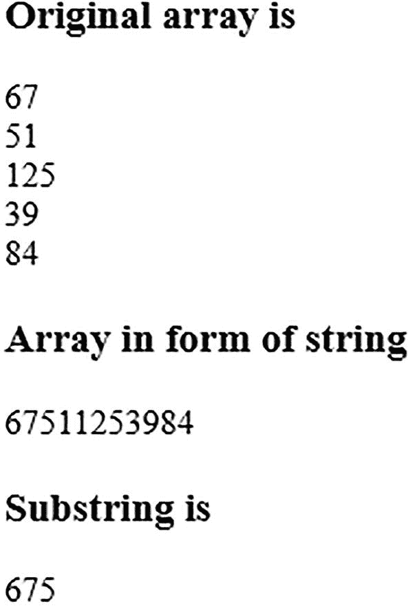

图 2-11

转换为字符串的数值数组

## 2.8 创建对象数组并显示内容

### 问题

您希望创建一个对象数组，其中每个对象都包含一个由国家名称和首都组成的对。

### 解决办法

为了显示对象数组中的内容(即显示国家名称和相应的首都)，创建了一个`<div>`元素和一个`<p>`元素，如下所示:

`Countrycap.html`

```js
<!DOCTYPE html PUBLIC "-//W3C//DTD XHTML 1.0 Transitional//EN"
        "http://www.w3.org/TR/xhtml1/DTD/xhtml1-transitional.dtd">
<html xmlns:="http://www.w3.org/1999/xhtml" xml:lang="en" lang="en">
  <head>
    <meta http-equiv="Content-Type" content="text/html; charset=utf-8"/>
    <title></title>
    <script src="jquery-3.5.1.js" type="text/javascript"></script>
    <script src="countrycapjq.js" type="text/javascript"></script>
  </head>
  <body>
<div id="allcountries"></div>
<p class="allcountries">
  </body>

</html>

```

你可以在上面的代码中看到，为了给出一个惟一的标识，`<div> e`元素被赋予了一个 ID`allcountries`，而`<p>`元素被赋予了类`allcountries`。

下面的 jQuery 代码创建了一个对象数组，并显示了存储在 I:

`Countrycapjq.js`

```js
$(document).ready(function() {
    var countries=[
    {
        "country": "India",
        "capital": "New Delhi"
    },
    {
        "country": "United States",
        "capital": "Washington D.C."
    },
    {
        "country": "England",
        "capital": "London"
    },
    {
        "country": "Australia",
        "capital": "Canberra"
    }
    ];
    $('div#allcountries').text("List of countries and their capitals");
    for(var i=0;i<countries.length;i++){
        $('p.allcountries').append("<tr><td>"+countries[i].country+ " </td><td>"+countries[i].capital+"</td><tr/>");
    }

});

```

### 它是如何工作的

创建一个名为`countries`的对象数组，其中每个对象包含两个属性，`country`和`capital`。创建了一些带有一些国家名称及其各自首都的对象。

ID 为`allcountries`的`<div>`元素被赋予文本`List of countries and their capitals`。使用一个`for`循环从数组中访问每个对象并显示国家和首都属性中的值，通过 ID 为`allcountries`的`<p>`元素显示，如图 2-12 所示。

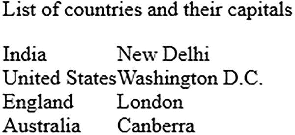

图 2-12

显示对象数组的所有元素，其中每个对象由一个国家和首都对组成

为了根据国家名称的升序对对象数组进行排序，在通过`a <div>`元素显示数组之前，添加以下完整代码:

```js
countries=countries.sort(function(a,b){
    if(a.country < b.country){return -1};
    if(a.country > b.country){return 1};
     return 0;

});

```

将 jQuery 中的上述代码添加到以下语句的上方:

```js
$('div#allcountries').text("List of countries and their capitals");

```

第一个配方中解释了`sort()`方法。该数组将以国家名称的升序排列对象，如图 2-13 所示。

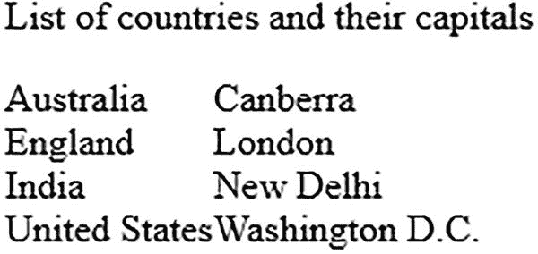

图 2-13

按国家名称排序后显示对象数组

## 2.9 使用关联数组

关联数组是索引本质上不是数字而是字符串的数组。这些字符串索引也称为键(即，关联数组只不过是一系列键/值对)。

### 问题

您希望以关联数组的形式显示某些国家及其首都。

### 解决办法

要显示标题和国家及其各自的首都，创建以下包含`<div>`和`<p>`元素的 HTML 文件:

`Associativearr.html`

```js
<!DOCTYPE html PUBLIC "-//W3C//DTD XHTML 1.0 Transitional//EN"
        "http://www.w3.org/TR/xhtml1/DTD/xhtml1-transitional.dtd">
<html xmlns:="http://www.w3.org/1999/xhtml" xml:lang="en" lang="en">
  <head>
    <meta http-equiv="Content-Type" content="text/html; charset=utf-8"/>
    <title></title>
    <script src="jquery-3.5.1.js" type="text/javascript"></script>
    <script src="associativearrjq.js" type="text/javascript"></script>
  </head>
  <body>
<div id="allcountries"></div>
<p class="allcountries">
  </body>
</html>

```

你可以在上面的代码中看到，ID 为`allcountries`的`<div>`元素和类为`allcountries`的`<p>`元素被定义，其中`<div>`元素将用于显示标题，`<p>`元素将用于显示内容

您需要编写 jQuery 代码来定义一个关联数组，以键和值的形式分配国家和首都，然后显示它们。

`Associativearrjq.js`

```js
$(document).ready(function() {
    var countries={
        "India" : "New Delhi",
        "United States" : "Washington D.C.",
        "England" : "London",
        "Australia" : "Canberra"
    };
    $('div#allcountries').text("List of countries and their capitals");
    $.each(countries, function(key, value) {
         $('p.allcountries').append("<tr><td>"+key+ " </td><td>"+value+"</td><tr/>");
    });

});

```

### 它是如何工作的

一个关联数组由`countries`的名称创建，包括一个键/值对，其中键是国家名称，值是其首都。四个国家及其各自的首都用于初始化关联数组。

使用 ID 为`allcountries`的`<div>`元素显示文本`List of countries and their capitals`。使用一个`each()`循环，在关联数组的所有元素上执行指定的函数。该函数通过`allcountries`类的`<p>`元素访问键及其关联值并显示，如图 2-14 所示。


图 2-14

显示关联数组的内容

## 2.10 对对象数组进行排序

### 问题

学生信息以对象数组的形式存储。假设每个学生对象由三个属性组成:`roll`、`name`和`emailId`。您希望根据属性`roll`对数组进行排序。

### 解决办法

让我们创建一个 HTML 文件，它显示一个标题和一个类`listofstud`的空表格元素。table 元素将用于显示一个排序的对象数组。HTML 文件可能如下所示:

`sortarrobject.html`

```js
<!DOCTYPE html PUBLIC "-//W3C//DTD XHTML 1.0 Transitional//EN"
        "http://www.w3.org/TR/xhtml1/DTD/xhtml1-transitional.dtd">
<html xmlns:="http://www.w3.org/1999/xhtml" xml:lang="en" lang="en">
  <head>
    <meta http-equiv="Content-Type" content="text/html; charset=utf-8"/>
    <title></title>
    <script src="jquery-3.5.1.js" type="text/javascript"></script>
    <script src="sortarrobjectjq.js" type="text/javascript"></script>
  </head>
  <body>
      <h3>List of students is </h3>
      <table class="listofstud"></table>
  </body>

</html>

```

现在编写 jQuery 代码来创建一个对象数组，存储三个学生的信息，属性分别为`roll`、`name`和`emailId`。此外，您需要包含对`student`对象的`roll`属性执行排序的代码。这里显示了 jQuery 代码，在下一节中，您将看到它是如何工作的。

`sortarrobjectjq.js`

```js
$(document).ready(function() {
     var students=[
    {
        "roll": 101,
        "name": "Ben",
        "emailId":"ben@gmail.com"
    },
    {
         "roll": 102,
        "name": "Ian",
        "emailId":"ian@gmail.com"
    },
    {
        "roll": 103,
        "name": "Caroline",
        "emailId":"carol@gmail.com"
    }

    ];
    students = students.sort(function(a,b){
       return b.roll-a.roll;
    });
    $.each(students,function( index, value ){
        $('table.listofstud').append("<tr><td>"+value.roll+"</td><td>"+value.name+"</td><td>"+
value.emailId+"</td></tr>");
    });
});

```

如果您想按照数组的`name`属性的字母顺序对数组进行排序，您需要将前面的`sort()`函数替换为如下函数:

```js
students = students.sort(function(a,b){
     if(a.name<b.name){ return -1 };
     if(a.name>b.name){ return 1 };
     return 0;
});

```

### 它是如何工作的

在`sort()`方法中，您需要添加比较函数，该函数重复地从数组中获取一对值，并在比较的基础上返回值< 0、=0 和> 0。您可以看到，在比较函数中，您正在比较`students`对象的`roll`属性。该函数返回以下内容:

```js
return b.roll-a.roll;

```

这意味着该函数将按照属性`roll`的降序对数组进行排序。此后，使用`each()`解析每个数组元素，并通过回调函数处理它们。在回调函数中，数组元素的每个属性，即`roll`、`name`和`emailId`，通过将它们放在`<td>`和`</td>`标签中来显示。这意味着每个数组元素都存储在单独一行的表数据元素中，数组元素的每个属性都以列的形式显示。结果是现在对象的数组以表格格式出现，如图 2-15 所示。

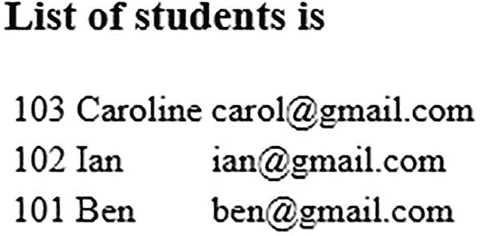

图 2-15

student 对象的数组，按 roll 属性的降序排序

当您对`name`属性进行排序时，您可以看到这次您正在比较`students`对象的`name`属性。如果第一个元素的`name`属性小于第二个元素的`name`属性(以 ASCII 值表示)，则该函数返回-1，反之则返回 1。结果将是基于`name`属性排序的`student`对象的数组。您将看到如图 2-16 所示的输出。

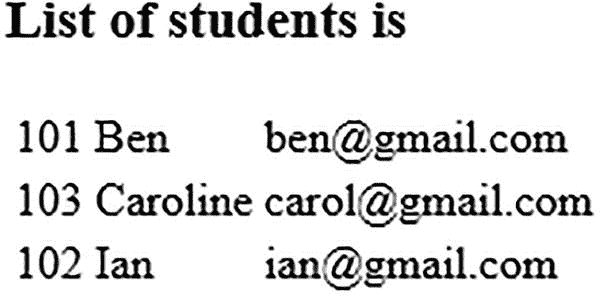

图 2-16

student 对象的数组，按 name 属性的字母顺序排序

## 2.11 摘要

在本章中，你学习了如何使用数字数组、字符串数组、关联数组和对象数组。您还学习了对数组进行排序、将数组分成几部分、在数组中搜索所需的元素，以及如何连接数组。此外，您还学习了如何定义对象数组以及关联数组的工作原理。

下一章着重于理解事件处理方法。你将学习当鼠标按钮被点击时，或者当输入框获得焦点时，或者当鼠标悬停在任何按钮上时，如何采取行动。您还将学习在鼠标上升和下降事件以及按下或释放某个键时执行任务。此外，您将学习放大和缩小图像，并在发生某些事件时对图像应用淡入淡出效果和动画。