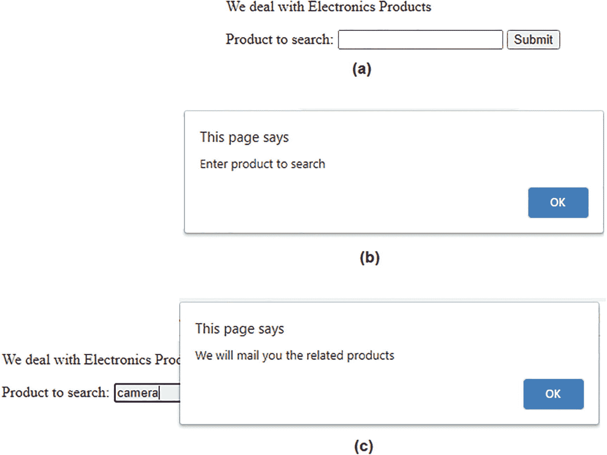
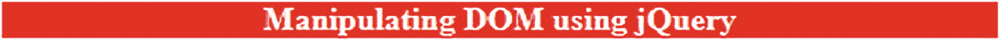

# 三、理解事件模型

在本章中，你将学习不同的事件处理方法。我们将在本章中介绍以下食谱:

*   获得焦点和模糊时显示消息

*   找出哪个鼠标按钮被按下

*   更改鼠标进入和离开 HTML 元素时的样式

*   使用鼠标悬停事件更改按钮的样式

*   使用鼠标上下移动事件来显示和隐藏图像

*   制作两个按钮，一个用于隐藏，一个用于显示图像

*   使用`toggleClass`放大和缩小图像

*   避免事件冒泡

*   知道哪个键被按下、按下或释放

*   对图像应用淡入淡出效果

*   在图像上应用动画

*   自动触发事件

*   单击一次后禁用按钮

*   寻找鼠标按键的屏幕坐标

*   动态突出显示文本

*   通过鼠标移动使图像变亮或变模糊

*   创建基于图像的翻转

*   添加和移除文本以响应事件

*   显示单词气球

*   创建“返回页首”链接

*   用动画显示文本

*   用滑动效果替换文本

顾名思义，事件模型处理点击事件、按键、鼠标抬起、鼠标悬停等事件。你将学习当某个事件发生时，一个动作是如何执行的。

## 3.1 获得焦点和模糊时显示消息

### 问题

当一个输入框获得用户的焦点时，以及当用户离开该输入框时，您希望显示一条消息。

### 解决办法

下面是一个 HTML 文件，其中包含一个段落元素、一个表单以及表单中的一个输入框和一个按钮:

**Inputfocus.html**

```js
<!DOCTYPE html PUBLIC "-//W3C//DTD XHTML 1.0 Transitional//EN"
        "http://www.w3.org/TR/xhtml1/DTD/xhtml1-transitional.dtd">

<html xmlns:="http://www.w3.org/1999/xhtml" xml:lang="en" lang="en">
  <head>
    <meta http-equiv="Content-Type" content="text/html; charset=utf-8"/>
    <title></title>
    <script src="jquery-3.5.1.js" type="text/javascript"></script>
    <script src="inputfocusjq.js" type="text/javascript"></script>
  </head>
  <body>
<p>We deal with Electronics Products</p>
<form action="destinationfile" method="get">
 <label>Product to search: </label>
 <input type="text" name="product" >
 <input type="submit" id="submit" value="Submit">
</form>
  </body>
</html>

```

您可以在上面的代码中看到，段落元素用于显示文本**我们处理电子产品**。表单由一个标签、一个输入框和一个按钮组成。当在表单中按下按钮时，用户将被导航到名为 destinationfile 的网页。标签设置为显示文本**产品以搜索**，输入框的名称设置为**产品**。

要在输入框获得焦点以及用户单击输入框外的任意位置时显示消息，请使用以下 jQuery 代码:

**输入焦点 jq.js**

```js
$(document).ready(function() {
     $("input").on("focus", function() {
          alert("Enter product to search");
    }).on("blur", function() {
        alert("We will mail you the related products");
       //$("#submit").trigger( "click" );
    });
});

```

在上面的 jQuery 代码中，您使用了方法`on(), focus(), blur() ,`和`trigger()`。我们先来看看这些方法。

#### 在( )

`on()`方法用于将一个或多个事件处理程序关联或连接到所选元素及其子元素。

**语法:**

*   `event`参数代表一个或多个与所选元素相关联的事件。如果有更多的事件，它们需要用空格隔开。

*   `child_selector`参数是可选的，但是如果使用的话，这意味着事件处理程序必须只附加到指定的子元素，而不是主选择器。

*   `passed_data`参数表示要传递给函数的数据。它是可选的。

*   `function`参数代表事件发生时必须执行的功能。

*   `map`参数以格式(`event:function, event:function, ...)`指定事件函数对，其中相应的函数将在事件发生时执行。

```js
$(selector).on(event, child_selector,passed_data,function,map)

```

为了从选中的元素中删除一个事件处理程序，使用了`off()`方法。

#### 焦点( )

当输入元素获得焦点时，`focus`事件发生。输入元素上的焦点可以通过按 Tab 键或通过鼠标点击来实现。在获得焦点时(即，当焦点事件发生在输入事件上时)，执行附属函数中的代码。

**语法:**

```js
$(selector).focus(function)

```

其中`function`参数包括在输入元素上获得焦点时必须执行的代码。它是可选的。

`focus`方法通常与`blur`方法一起使用

第 [1 章](01.html)中讨论了`alert()`方法。作为参考，回想一下它用于显示一个带有消息和 OK 按钮的对话框。除非用户单击“确定”按钮并关闭警告框，否则用户无法访问页面的任何其他部分。

#### 模糊( )

当一个元素失去焦点时，`blur`事件发生。`blur()`方法可用于做以下两件事:

*   触发模糊事件

*   附加一个在模糊事件发生时运行代码的函数

**语法:**

以下语法在指定的选择器上激发模糊事件:

```js
$(selector).blur()

```

以下语法将一个函数附加到 blur 事件。该函数包括发生模糊事件时要执行的代码。

**$(选择器)。模糊(功能)**

`blur`方法通常与`focus()`方法一起使用。

#### 触发器( )

`trigger()`方法用于在所选元素上触发指定的事件处理程序。也就是说，可以使用`trigger()`方法为所选元素调用事件的默认行为。

**语法:**

```js
$(selector).trigger(event,parameter1,parameter2,...)

```

其中,`event`参数表示您想要在所选元素上触发的事件。`parameter1`和`parameter2`是要传递给事件处理程序的参数。这些参数是可选的。

### 它是如何工作的

当焦点在任何输入元素上时，将显示一个警告对话框(即，当用户点击输入框时，焦点事件将被触发，警告对话框将显示消息**输入产品以搜索**)。在输入框中输入产品信息后，当用户按下 Tab 按钮或点击输入框外的任意位置时，将触发`blur()`事件，进而显示一个警告对话框，消息为**我们将把相关产品**邮寄给你。

如果您希望表单被自动提交并导航到目标文件，应该使用`destinationfile`。然后您可以从`trigger()`方法中移除注释。`trigger()`方法将调用提交按钮上的点击事件；因此，表单将被提交，您将导航到`action`属性中提到的目标文件`destinationfile`。由于目前没有`destinationfile`，导航上会出现*页面未找到*的错误。

运行 HTML 文件后，您会看到如图 [3-1(a)](#Fig1) 所示的屏幕。点击输入框时(即输入框获得焦点的瞬间)，会出现一个提示对话框，显示消息**输入产品进行搜索**(见图 [3-1(b)](#Fig1) )。单击“确定”关闭警告对话框后，当用户单击输入框外的任意位置或按 Tab 键时，输入框失去焦点，并显示一个警告对话框，消息为**我们将向您邮寄相关产品**(见图 [3-1(c)](#Fig1) )。



图 3-1

(a)要求搜索产品的屏幕;( b)当输入元素获得焦点时，警告对话框显示消息“输入要搜索的产品”;( c)当焦点从输入框移开时，警告对话框显示消息“我们将向您邮寄相关产品”

## 3.2 查找按下的鼠标按钮

### 问题

网页上有某些 HTML 元素，您想知道在这些 HTML 元素上按下了哪个鼠标按钮，是左键、右键还是中键。

### 解决办法

制作一个包含无序列表的 HTML 文件，如下所示:

**Mousebutton.html**

```js
<!DOCTYPE html PUBLIC "-//W3C//DTD XHTML 1.0 Transitional//EN"
        "http://www.w3.org/TR/xhtml1/DTD/xhtml1-transitional.dtd">

<html xmlns:="http://www.w3.org/1999/xhtml" xml:lang="en" lang="en">
  <head>
    <meta http-equiv="Content-Type" content="text/html; charset=utf-8"/>
    <title></title>
    <script src="jquery-3.5.1.js" type="text/javascript"></script>
    <script src="mousebuttonjq.js" type="text/javascript"></script>
  </head>
  <body>
        <ul id="ElectronicsProducts">
          <li class="product">Cameras</li>
          <li class="product">Cell Phones</li>
          <li class="product">Laptops</li>
        </ul>
  </body>
</html>

```

在这个 HTML 文件中，您可以看到创建了一个 ID 为`ElectronicsProducts`的无序列表，它由文本为`Cameras`、`Cell Phones`和`Laptops`的三个列表项组成。这三个列表项被分配了一个类名`product`。

为了显示在哪个元素上按下了哪个鼠标按钮，编写了以下 jQuery 代码:

**鼠标按钮 jq.js**

```js
$(document).ready(function() {
$(".product").on("mousedown", function(event) {
      if(event.which==1){
          alert("Left mouse button is pressed on "+$(this).text());
     }
     else
     {
          alert("Right mouse button is pressed on "+$(this).text());
     }
});
});

```

让我们看看在前面的 jQuery 代码中使用的方法和属性:`mousedown()`方法和`event.which`属性。

#### 鼠标按下( )

顾名思义，当鼠标指针在某个元素上并且鼠标按钮在该元素上按下时，发生 mousedown 事件。`mousedown()`方法执行以下两项任务:

*   它触发 mousedown 事件。

*   它将一个函数与 mousedown 事件连接起来。该函数包含发生 mousedown 事件时需要运行的代码。

**语法:**

以下语法在选定的元素上触发 mousedown 事件:

```js
$(selector).mousedown()

```

以下语法将函数与 mousedown 事件相关联:

```js
$(selector).mousedown(function)

```

其中参数`function`包含当鼠标事件发生在所选元素上时要执行的代码。

#### 哪个事件

`event.which`属性指示在事件期间按下了哪个键盘按键或鼠标按钮。属性表示左按钮的值为 1，中按钮的值为 2，右按钮的值为 3。

**语法:**

```js
event.which

```

其中`event`是在**事件绑定**函数中使用的参数。

### 它是如何工作的

当鼠标点击任何一个类为`product`的元素时，就会触发`mousedown()`事件。所有三个列表项都被赋予了`product`类，所以如果鼠标左键点击列表项中的任何一个，就会检查`event.which`属性来知道哪个鼠标按钮被按下了。相应地，显示一个警告对话框，指示鼠标左键、中键或右键是否被按下，以及鼠标按钮被按下的列表项目。

在`Cameras`列表项上按下鼠标左键，会出现警告对话框，告知相机上的鼠标左键被按下，如图 [3-1(a)](#Fig1) 所示。在`Laptops`列表项上单击鼠标右键，警告对话框会显示如图 [3-2(b)](#Fig2) 所示的信息。


图 3-2

(a)警告对话框，通知在相机上按下了鼠标左键;( b)警告对话框，通知在笔记本电脑上单击了鼠标右键

## 3.3 改变鼠标进入和离开 HTML 元素的样式

### 问题

您有一个已经应用了 CSS 样式的按钮。您希望在鼠标指针进入按钮时更改样式，并在鼠标指针离开按钮时重新应用原始 CSS 样式。

### 解决办法

制作一个包含无序列表的 HTML 文件，如下所示:

`Mousehover.html`

```js
<!DOCTYPE html PUBLIC "-//W3C//DTD XHTML 1.0 Transitional//EN"
        "http://www.w3.org/TR/xhtml1/DTD/xhtml1-transitional.dtd">

<html xmlns:="http://www.w3.org/1999/xhtml" xml:lang="en" lang="en">
  <head>
    <meta http-equiv="Content-Type" content="text/html; charset=utf-8"/>
    <title></title>
<link rel="stylesheet" href="mousehoverstyle.css" type="text/css" media="screen" />
    <script src="jquery-3.5.1.js" type="text/javascript"></script>
    <script src="mousehoverjq.js" type="text/javascript"></script>
  </head>
  <body>
<p>We deal with Electronics Products</p>
<br/>
<button class="btn" id="hide">Hide Image</button>
<button class="btn" id="show">Show Image</button>
  </body>
</html>

```

段落元素用于显示文本**我们处理电子产品。**显示一幅图像，宽 200 像素，高 100 像素。图像下方显示两个按钮，文本为**隐藏图像**和**显示图像**。类别`btn`被分配给两个按钮。为了访问 jQuery 代码，这两个按钮分别被分配了 id`hide`和`show`。

要将 CSS 类应用于按钮，并定义当鼠标指针悬停在按钮上时需要应用的 CSS 类，请在样式表中编写不同的 CSS 类，如下所示:

**mouehnotstyle . CSS**

```js
.btn{
      font-style: italic;
      background-color: #0f0;
}
.highlight{
       font-style: bold;
       background-color: #f00;
}

```

为了在鼠标指针悬停在鼠标按钮上时应用 CSS 类，并在鼠标指针离开按钮时删除 CSS 类，请编写以下 jQuery 代码:

mouehverjq . js

```js
$(document).ready(function() {
     $("button#hide").on("mouseenter", function() {
          // alert("hovered over");
          $("button#hide").addClass("highlight");
     }).on("mouseleave", function() {
           $("button#hide").removeClass("highlight");
          // alert("hovered out");
    });
});

```

在这个 jQuery 代码中，使用了方法`mouseenter(), mouseleave(), mouseover()`和`mouseout()`。我们先来快速浏览一下这些方法。

#### 滑鼠 enter()

当鼠标指针位于选定的元素上时，发生 mouseenter 事件。`mouseenter()`方法执行以下两项任务:

*   它触发了 mouseenter 事件。

*   它关联一个函数，该函数包含发生 mouseenter 事件时需要运行的代码。

**语法:**

以下语法在选定的元素上激发 mouseenter 事件:

```js
$(selector).mouseenter()

```

以下语法将函数与 mouseenter 事件相关联:

```js
$(selector).mouseenter(function)

```

其中，`function`参数包含触发 mouseenter 事件时必须运行的代码。

mouseover 和 mouseenter 事件之间的区别在于，mouseenter 事件仅在鼠标指针进入所选元素时触发，而 mouseover 事件即使在鼠标指针也进入其任何子元素时也会触发。

`mouseenter`方法通常与 mouseleave 事件一起使用。

#### mouseleave()

当鼠标指针离开选定的元素时，发生 mouseleave 事件。`mouseleave()`方法执行以下两项任务:

*   它触发 mouseleave 事件。

*   它附加了一个在 mouseleave 事件发生时运行的函数。

**语法:**

以下语法触发选定元素的 mouseleave 事件:

```js
$(selector).mouseleave()

```

以下语法将函数与 mouseleave 事件相关联:

```js
$(selector).mouseleave(function)

```

其中参数`function`包含当鼠标离开事件发生时要执行的代码。

mouseout 和 mouseleave 事件之间的区别在于，mouseleave 事件仅在鼠标指针离开所选元素时触发，而 mouseout 事件即使在鼠标指针也离开其任何子元素时也会触发。

`mouseleave()`方法通常与`mouseenter()`事件一起使用。

#### 鼠标悬停( )

当鼠标指针位于所选元素上时，发生 mouseover 事件。`mouseover()`方法执行以下任务:

*   它触发鼠标悬停事件。

*   它将一个函数与 mouseover 事件相关联，该事件包含发生 mouseover 事件时要运行的代码。

**语法:**

以下语法在选定的元素上激发 mouseover 事件:

```js
$(selector).mouseover()

```

以下语法将函数与 mouseover 事件相关联:

```js
$(selector).mouseover(function)

```

其中`function`参数包含发生鼠标悬停事件时需要运行的代码。

mouseenter 和 mouseover 事件之间的区别在于，如果鼠标指针进入所选元素或其任何子元素，将触发 mouseover 事件，而 mouseenter 事件仅在鼠标指针进入所选元素时触发。

`mouseover`方法通常与 mouseout 事件一起使用。

#### mouseout()

当鼠标指针离开选定的元素时，发生 mouseout 事件。`mouseout()`方法执行以下两项任务:

*   它触发 mouseout 事件。

*   它将一个函数与 mouseout 事件相关联，该函数包含发生 mouseout 事件时要执行的代码。

**语法**

以下语法触发选定元素的 mouseout 事件:

```js
$(selector).mouseout()

```

以下语法将函数与 mouseout 事件相关联:

```js
$(selector).mouseout(function)

```

其中，参数`function`包含发生 mouseout 事件时要执行的代码。

mouseleave 和 mouseout 事件之间的区别在于，如果鼠标指针离开所选元素或其任何子元素，将触发 mouseout 事件，而 mouseleave 事件仅在鼠标指针离开所选元素时触发。

`mouseout()`方法通常与 mouseover 事件一起使用。

### 它是如何工作的

CSS 样式`btn`自动应用于两个按钮，**隐藏图像**和**显示图像**，因为这两个按钮都被分配了类`btn`。按钮标题以斜体和绿色显示。当鼠标悬停在**隐藏图像**按钮上时，CSS 样式`highlight`被应用到该按钮上。

当鼠标在标题为**隐藏图像**的按钮上时，样式类`highlight`被应用于按钮，使其标题加粗，颜色为红色。当鼠标离开**隐藏图像**按钮时，`highlight`样式类从按钮中移除，使其与之前相同。

Note

如果从两条语句中删除注释，当鼠标在**隐藏图像**按钮上时，将显示消息**悬停在**上的警告对话框，当鼠标离开**隐藏图像**按钮时，警告对话框将显示消息**悬停在**上。

最初，一个图像会出现两个按钮，**隐藏图像**和**显示图像**。两个按钮将以绿色显示，其标题以斜体显示(见图 [3-3(a)](#Fig3) )。

将鼠标悬停在**隐藏图像**按钮上，标题会变成粗体，按钮的颜色会变成红色(参见图 [3-3(b)](#Fig3) )。


图 3-3

(a)“隐藏图像”和“显示图像”这两个按钮以绿色显示。( b)“隐藏图像”按钮的颜色变为红色

## 3.4 使用鼠标悬停事件来改变按钮的样式

### 问题

网页上有一个按钮，您希望当用户悬停在该按钮上时，该按钮的 CSS 样式会发生变化。

### 解决办法

制作一个包含段落元素、图像和两个按钮的 HTML 文件，如下所示:

**Mousehover2.html**

```js
<!DOCTYPE html PUBLIC "-//W3C//DTD XHTML 1.0 Transitional//EN"
        "http://www.w3.org/TR/xhtml1/DTD/xhtml1-transitional.dtd">
<html xmlns:="http://www.w3.org/1999/xhtml" xml:lang="en" lang="en">
  <head>
    <meta http-equiv="Content-Type" content="text/html; charset=utf-8"/>
    <title></title>
    <link rel="stylesheet" href="mousehoverstyle.css" type="text/css" media="screen" />
    <script src="jquery-3.5.1.js" type="text/javascript"></script>
    <script src="mousehover2jq.js" type="text/javascript"></script>
  </head>
  <body>
    <p>We deal with Electronics Products</p>
    <br/>
    <button class="btn" id="hide">Hide Image</button>
    <button class="btn" id="show">Show Image</button>
  </body>
</html>

```

设置一个段落来显示文本**我们处理电子产品**。一个宽 200 像素、高 100 像素的图像显示在段落下方。图像下方显示两个带标题**隐藏图像**和**显示图像**的按钮。类别`btn`被分配，id`hide`和`show`被分别分配给两个按钮。

为了定义按钮的原始 CSS 类，也为了定义当鼠标指针停留在按钮上时需要应用的 CSS 类，您将使用您在前面的配方中创建的 CSS 样式文件`mousehoverstyle.css`。

当鼠标指针悬停在按钮上时，在按钮上应用 CSS 样式类的 jQuery 代码如下:

**mouehver 2 jq . js**

```js
$(document).ready(function() {
     $("button.btn").hover( function() {
          $(this).addClass("highlight");
     }, function() {
          $(this).removeClass("highlight");
    });
});

```

在这段 jQuery 代码中，使用了`hover()`方法，所以我们先来看看这个方法。

#### 悬停( )

顾名思义，`hover()`方法表示包含当鼠标指针悬停在某个元素上时(即鼠标指针进入和离开指定的元素)要执行的代码的函数。这也意味着 hover 方法触发 mouseenter 和 mouseleave 事件。`hover()`方法指定了两个要运行的函数，如下所示:

**语法:**

*   `enterFunction`是一个函数，包含发生 mouseenter 事件时要执行的代码。

*   `leaveFunction`是一个函数，包含发生 mouseleave 事件时要执行的代码。该功能是可选的。如果不使用该函数，则对 mouseenter 和 mouseleave 事件执行相同的函数。

```js
$(selector).hover(enterFunction,leaveFunction)

```

### 它是如何工作的

因为这两个按钮被分配了类`btn`，CSS 类`btn`将自动应用于这两个按钮，使它们的标题以斜体显示，背景色为绿色。

当鼠标指针悬停在任何一个按钮上时，CSS 类`highlight`将应用于其上，使其标题加粗并将其背景色改为红色。

最初，在运行网页时，您得到如图 [3-4(a)](#Fig4) 所示的输出，这是两个带有标题**隐藏图像**和**显示图像**的按钮，其中两个标题都是斜体模式，两个按钮的背景颜色是绿色。当鼠标悬停在任一按钮上时，按钮的标题将变为粗体，按钮的背景颜色将变为红色(如图 [3-4(b)](#Fig4) )。


图 3-4

(a)标题为隐藏图像和显示图像的两个按钮有绿色背景。(b)当鼠标悬停在按钮上时，按钮标题变为粗体，背景色变为红色

## 3.5 使用鼠标向上和向下事件来显示和隐藏图像

### 问题

在这个菜谱中，您将制作一个按钮，当用户按下它时会显示一个图像。从图像上释放鼠标按钮后，图像将再次变得不可见。

### 解决办法

下面是一个显示文本、按钮和图像的 HTML 文件。该图像最初将通过应用 CSS 样式隐藏。

**Mouseupdown.html**

```js
<!DOCTYPE html PUBLIC "-//W3C//DTD XHTML 1.0 Transitional//EN"
        "http://www.w3.org/TR/xhtml1/DTD/xhtml1-transitional.dtd">

<html xmlns:="http://www.w3.org/1999/xhtml" xml:lang="en" lang="en">
  <head>
    <meta http-equiv="Content-Type" content="text/html; charset=utf-8"/>
    <title></title>
<link rel="stylesheet" href="mouseupdownstyle.css" type="text/css" media="screen" />
    <script src="jquery-3.5.1.js" type="text/javascript"></script>
    <script src="mouseupdownjq.js" type="text/javascript"></script>
  </head>
  <body>
<p>We deal with Electronics Products</p>
<button id="show">Show Image</button>
<br/>
  </body>
</html>

```

在这段代码中，您可以看到段落元素被设置为显示文本**我们处理电子产品**。显示标题为**显示图像**的按钮，按钮的 id 设置为`show`。按钮下方是一个宽 200 像素、高 100 像素的图像。

为了在启动 HTML 文件时将样式应用于图像，可以如下创建外部样式表:

**Mouseupdownstyle.css**

```js
img{
      display: none;
}

```

`img`样式中的`display: none`样式规则将使图像在程序启动时不可见。

按下按钮时显示图像的 jQuery 代码如下:

**Mouseupdownjq.js】的缩写**

```js
$(document).ready(function() {
     $("button#show").on("mousedown", function() {
           $("img").fadeIn();
     });
      $("button#show").on("mouseup", function() {
           $("img").fadeOut();
     });
});

```

这个 jQuery 代码使用了`mouseup(), fadeOut()`和`fadeIn()`方法，所以让我们先来看看这些方法。

#### 鼠标松开( )

当在所选元素上释放鼠标左键时，将触发 mouseup 事件。`mouseup()`方法执行以下两项任务:

*   它触发 mouseup 事件。

*   它关联一个函数，该函数包含发生 mouseup 事件时需要运行的代码。

**语法:**

以下语法在选定的元素上激发 mouseup 事件:

```js
$(selector).mouseup()

```

以下语法将包含在发生 mouseup 事件时必须执行的代码的函数关联起来:

```js
$(selector).mouseup(function)

```

其中参数`function`是发生 mouseup 事件时调用的函数。

Note

`mouseup()`方法通常与`mousedown()`方法一起使用。

#### 淡出( )

此方法淡化所选元素，使其透明(即逐渐改变所选元素的不透明度，使其完全不可见)。

**语法:**

```js
$(selector).fadeOut(speed,easing,function)

```

*   参数`speed`定义淡出的速度。有效选项包括
    *   `slow`:选中的元素慢慢淡出。

    *   `fast`:选中的元素很快淡出。

    *   `milliseconds`:所选元素在指定的毫秒内淡出。如果不使用`speed`参数，默认值为 400ms。

*   `easing`参数代表不同点淡出的速度。该参数的有效值为`swing`或`linear`。`swing`选项使淡出过程在开始或结束时较慢，在中间时较快。`linear`选项继续以恒定的速度淡出。默认缓动值为`swing`。

*   `function`参数表示淡出完成后要执行的功能。

Note

`fadeOut`方法通常与`fadeIn()`方法一起使用。

#### fadein()

`fadeIn()`方法使隐藏的元素可见(即改变元素的不透明度使其可见)。

**语法:**

*   `speed`参数定义所选元素可见的速度。有效选项包括
    *   `slow`:隐藏的元素会慢慢变得可见。

    *   隐藏的元素将很快变得可见。

    *   `milliseconds`:隐藏元素将在指定的毫秒内可见。

    *   `speed`参数是可选的。如果不使用，默认值为 400 毫秒。

*   `easing`参数定义隐藏元素可见时不同点的速度。有效值包括
    *   `swing`:在开始或结束时慢慢取消隐藏元素，在中间时快速取消隐藏元素。

    *   `linear`:以恒定速度取消隐藏元素。

    *   缓动参数的默认值为`swing`。

*   `function`参数是可选的，用于编写在`fadeIn()`方法完成后要执行的代码。

```js
$(selector).fadeIn(speed,easing,function)

```

`fadeIn()`方法通常与`fadeOut()`方法一起使用。

### 它是如何工作的

当在按钮上按下鼠标按钮时，图像将逐渐淡入(即，它将慢慢变得可见)，当释放鼠标按钮时，图像将淡出(即，图像将逐渐变得不可见)。

`img`样式类将自动应用于图像，使其不可见。

运行 HTML 文件后，您会看到如图 [3-5(a)](#Fig5) 所示的屏幕，上面有文本**我们处理电子产品**和下面一个名为**的按钮显示图像**。按下按钮，出现一个图像，如图 [3-5(b)](#Fig5) 所示。松开鼠标按钮的那一刻，图像又消失了。


图 3-5

(a)显示文本和名为“显示图像”的按钮。(b)按下显示图像按钮时，会出现一个图像

## 3.6 制作两个按钮，一个用于隐藏，一个用于显示图像

### 问题

您希望为单个任务创建两个按钮。单击一个按钮会使图像不可见，单击另一个按钮会使图像重新出现。

### 解决办法

以下是包含段落元素、图像和两个按钮的 HTML 文件，这两个按钮将被分配隐藏和显示图像的任务:

**Showhideimagehtml㎡t1㎡**

```js
<!DOCTYPE html PUBLIC "-//W3C//DTD XHTML 1.0 Transitional//EN"
        "http://www.w3.org/TR/xhtml1/DTD/xhtml1-transitional.dtd">
<html xmlns:="http://www.w3.org/1999/xhtml" xml:lang="en" lang="en">
  <head>
    <meta http-equiv="Content-Type" content="text/html; charset=utf-8"/>
    <title></title>
    <script src="jquery-3.5.1.js" type="text/javascript"></script>
    <script src="showhidejq.js" type="text/javascript"></script>
  </head>
  <body>
<p>We deal with Electronics Products</p>
<br/>
<button id="hide">Hide Image</button>
<button id="show">Show Image</button>
  </body>
</html>

```

你可以在代码中看到一个段落元素用来显示文本**我们处理电子产品**。此后，图像以 200 像素宽和 100 像素高显示。图像下方是两个带标题的按钮**隐藏图像**和**显示图像**。

允许按钮隐藏图像并使其再次出现的 jQuery 代码如下:

 **```js
$(document).ready(function() {
     $("button#hide").on("click", function() {
          $("img").fadeOut();
     });
     $("button#show").on("click", function() {
          $("img").fadeIn();
     });
});

```

在这个 jQuery 代码中，您使用了方法`fadeOut(), fadeIn(). slideDown(), off(),`和`hide()`。在这些方法中，`fadeOut()`和`fadeIn()`方法已在之前的配方中解释过。让我们快速浏览一下其余的方法。

#### 向下滑动( )

`slideDown()`方法使隐藏的元素向下滑动(即，使其逐渐可见)。

**语法:**

*   `speed`参数决定元素可见的速度。以下是有效选项:
    *   `slow`:隐藏的元素会逐渐变得可见。

    *   隐藏的元素将很快变得可见。

    *   `milliseconds`:隐藏元素将在指定的毫秒内变得可见。

    *   `speed`参数是可选的。如果未指定，默认值为 400 毫秒。

*   `easing`参数定义了取消隐藏元素时不同点的速度。有效选项包括
    *   `swing`:使隐藏元素在开始或结束时缓慢可见，在中间时快速可见。

    *   `linear`:以恒定速度取消隐藏隐藏元素。

    *   `easing`参数的默认值为`swing`。

*   `function`参数是可选的，用于编写隐藏元素完全可见后要执行的代码。

```js
$(selector).slideDown(speed,easing,function)

```

只有使用 jQuery 方法和 CSS 中的`display:hone`属性隐藏的元素才通过`slideDown()`方法变得可见。

#### 关闭( )

`off()`方法与`on()`方法相反。因此，它使用`on()`方法移除附加到任何元素的事件处理程序。

**语法:**

*   `event`参数表示需要从所选元素中移除的事件。如果有多个事件，它们需要用空格隔开。

*   `selector`参数表示必须从中移除事件的元素。这些是在`on()`方法中使用的元素。

*   `function(event_object)`参数包含当 off 事件发生时运行的代码。该参数是可选的。

*   `map`参数以`(event:function, event:function, ...)`的格式表示事件和相关函数对，表示事件发生时执行的相应函数。

```js
$(selector).off(event,selector,function(event_object),map)

```

如果事件只需要执行一次，通常使用`one()`方法将事件与元素关联起来。事件在执行后会自动移除。

#### 隐藏( )

顾名思义，`hide()`方法隐藏了选中的元素。

**语法:**

*   `speed`参数决定隐藏元素的速度。有效选项包括
    *   `slow`:逐渐隐藏选中的元素。

    *   `fast`:快速隐藏选中的元素。

    *   `milliseconds`:在指定的毫秒内隐藏选中的元素。默认值为 400 毫秒。

*   `easing`参数决定了在不同点隐藏元素的速度。有效选项包括
    *   `swing`:在开头或结尾缓慢隐藏元素，在中间快速隐藏元素。

    *   `linear`:匀速隐藏元素。

    *   `easing`参数是可选的。如果不使用，其默认值为 swing。

*   `function`参数是一个包含元素完全隐藏后要执行的代码的函数。它是可选的。

```js
$(selector).hide(speed,easing, function)

```

为了显示隐藏的元素，通常使用`show()`方法。

### 它是如何工作的

当点击 id 为`hide`的按钮时(即点击标题为**隐藏图像**的按钮时)，将对图像元素调用`fadeOut()`方法，使图像逐渐不可见。类似地，当点击 id 为`show`的按钮时(即，当点击标题为**显示图像**的按钮时)，在图像元素上调用`fadeIn()`方法，使图像缓慢可见。如果用`hide()`方法替换`fadeOut()`方法，也会发生类似的动作。此外，`fadeIn()`方法可以由`slideDown()`方法代替，这使得图像慢慢可见。您还可以修改 jQuery 代码，如下所示:

 **```js
$(document).ready(function() {
     $("button#hide").on("click", function() {
          $("img").hide();
          $("button#hide").off("click");
     });
     $("button#show").on("click", function() {
          $("img").slideDown();
          $("button#show").off("click");
     });
});

```

`hide()`方法隐藏选定的元素(即，单击隐藏图像按钮时图像将被隐藏)。使用`off()`方法的效果是在点击事件发生一次后，点击事件将从这些按钮中移除。因此**显示图像**和**隐藏图像**按钮将只工作一次。

运行 HTML 文件后，您会看到如图 [3-6(a)](#Fig6) 所示的屏幕。段落元素显示文本**我们处理电子产品**。文本下方是一个图像，后面是两个按钮，标题分别为**隐藏图像**和**显示图像**。点击**隐藏图像**按钮，图像会逐渐消失，如图 [3-6(b)](#Fig6) 所示。点击**显示图像**按钮，图像会重新出现，如图 [3-6(a)](#Fig6) 所示。


图 3-6

(A)显示段落元素 image 和两个按钮 Hide Image 和 Show Image。(b)单击隐藏图像按钮时，图像消失

## 3.7 使用 toggleClass 放大和缩小图像

### 问题

您在网页上有一个图像，您想在按下按钮时放大该图像，并在再次单击按钮时缩小该图像。

### 解决办法

以下是包含图像和按钮的 HTML 文件，该按钮将被分配放大和缩小图像的任务:

**zoom inotiming . html**

```js
<!DOCTYPE html PUBLIC "-//W3C//DTD XHTML 1.0 Transitional//EN"
        "http://www.w3.org/TR/xhtml1/DTD/xhtml1-transitional.dtd">

<html xmlns:="http://www.w3.org/1999/xhtml" xml:lang="en" lang="en">
  <head>
    <meta http-equiv="Content-Type" content="text/html; charset=utf-8"/>
    <title></title>
<link rel="stylesheet" href="zoominoutstyle.css" type="text/css" media="screen" />
    <script src="jquery-3.5.1.js" type="text/javascript"></script>
    <script src="zoominoutjq.js" type="text/javascript"></script>
  </head>
  <body>
<p>We deal with Electronics Products</p>
<button id="zoom">Zoom In / Out Image</button><br/>

  </body>
</html>

```

在这个程序中，你可以看到文本**我们处理电子产品**是通过一个段落元素显示的。此后，显示标题为**放大/缩小图像**的按钮。一个 id`zoom`被分配给这个按钮，使它可以在 jQuery 代码中被访问。按钮后，图像以 200 像素宽和 100 像素高显示。

创建了一个名为`enlarge`的 CSS 样式，当应用于一个元素时，它的宽度和高度将分别为 300 像素和 300 像素。以下是 CSS 文件:

**放大样式.css**

```js
.enlarge{
  width: 300px;
  height: 300px;
}

```

第一次单击按钮时应用 CSS 样式并在另一次单击时删除 CSS 样式的 jQuery 代码如下:

**放大 tjq.js**

```js
$(document).ready(function() {
     $("button#zoom").on("click", function() {
          $("img").toggleClass('enlarge');
     });
});

```

上面的 jQuery 代码中使用了方法`toggleClass()`，我们来理解一下。

#### toggleclass()

顾名思义，如果该类尚未应用，该方法会将该类应用于所选元素。此外，如果该类已经应用，则该方法会从选定的元素中移除该类。

**语法:**

*   `class`表示要添加或删除的类别。如果使用了多个类，它们需要用空格隔开。

*   `function(location,class)`是一个函数，返回一个或多个要添加或删除的类名。它是可选的。

*   `location`返回元素的下标或位置。

*   `class`返回所选元素的类名。

*   `switch`参数是一个布尔值，如果设置为真，表示需要添加该类，如果设置为假，表示需要删除该类。它是可选的。

```js
$(selector).toggleClass(class,function(location,class),switch)

```

### 它是如何工作的

当使用`toggleClass()`方法点击 id 为`zoom`的按钮时(即，当点击**放大/缩小图像**按钮时)，CSS 样式`enlarge`被应用到图像，将其大小增强到 300 像素宽和 300 像素高。当用户再次点击**放大/缩小图像**按钮时，`toggleClass()`方法将从图像中移除 CSS 样式`enlarge`，将其缩小到 200 像素宽、100 像素高的原始大小。

运行 HTML 文件后，将显示文本消息**我们处理电子产品**。一个标题为**放大/缩小图像**的按钮将显示在文本下方，后面是一个 200 像素宽、100 像素高的图像(见图 [3-7(a)](#Fig7) )。点击**放大/缩小图像**按钮，图像将被放大到 300 像素宽和 300 像素高(见图 [3-7(b)](#Fig7) )。再次单击放大/缩小图像按钮时，图像将缩小到原始大小。


图 3-7

(A)显示文本消息、放大/缩小图像按钮和图像。(b)当点击放大/缩小图像按钮时，图像被放大

## 3.8 避免事件冒泡

### 问题

当嵌套在其他元素中的元素上触发事件时，所发生的是事件在该元素以及包含它的所有元素上被触发(即，事件将在 DOM 中的所有元素上被触发)。当事件发生在任何嵌套元素上时，您希望避免事件冒泡。

### 解决办法

下面是一个 HTML 文件，它包含一些元素，一个在另一个里面:

**event bubling . html**

```js
<!DOCTYPE html PUBLIC "-//W3C//DTD XHTML 1.0 Transitional//EN"
        "http://www.w3.org/TR/xhtml1/DTD/xhtml1-transitional.dtd">
<html xmlns:="http://www.w3.org/1999/xhtml" xml:lang="en" lang="en">
  <head>
    <meta http-equiv="Content-Type" content="text/html; charset=utf-8"/>
    <title></title>
    <script src="jquery-3.5.1.js" type="text/javascript"></script>
    <script src="eventbubblingjq.js" type="text/javascript"></script>
  </head>
  <body>
    <div>Welcome to our site
        <ul>
          <li>Cameras</li>
          <li>Cell Phones</li>
          <li>Laptops</li>
        </ul>
<p> We deal with electronic products like <strong>mobile phones, laptops, washing machine </strong at very reasonable prices </p>
    </div>
  </body>
</html>

```

您可以在这段代码中看到，设置了一个`<div>`元素来显示文本**欢迎来到我们的站点**。在`<div>`元素中，一个无序列表元素由三个列表项定义:`Cameras`、`Cell Phones`和`Laptops`。在无序列表的下面，`<div>`元素中是一个`<p>`元素，而`<p>`元素中是一个`<strong>`元素。每个元素都被设置为显示特定的文本。

以下 jQuery 代码将导致事件冒泡:

**Eventbubblingjq.js**

```js
$(document).ready(function() {
     $('div').click(function(event){
          alert('<div> element is clicked');
     });
     $('ul').click(function(event){
           alert('<ul> element is clicked');
     });
      $('p').click(function(event){
          alert('<p> element is clicked');
     });
     $('strong').click(function(event){
          alert('<strong> element is clicked');
     });
});

```

### 它是如何工作的

当用户点击`<div>`元素时，会出现一个警告对话框，显示消息 **< div >元素被点击**。因为`<div>`元素是所有元素的父元素，所以不会发生事件传播。

当用户点击`<ul>`元素时，会出现一个警告对话框，显示消息 **< ul >元素被点击**。现在，因为`<ul>`元素嵌套在`<div>`元素中，所以点击事件将传播到父元素(即`<div>`元素)；因此，将出现另一个警告框，显示消息 **< div >元素被单击**。

当用户点击`<p>`元素时，会出现一个警告对话框，显示消息**T8 p>元素被点击**。同样，`<p>`元素嵌套在`<div>`元素中，所以点击事件也将传播到`<div>`元素；因此，将出现另一个警告框，显示消息 **< div >元素被单击。**

当用户点击`<strong>`元素时，会出现一个警告对话框，显示消息 **< strong >元素被点击**(见图 [3-8(a)](#Fig8) )。因为`<strong>`元素嵌套在`<p>`元素中，而后者又嵌套在`<div>`元素中，所以点击事件也将传播到`<p>`和`<div>`元素。因此，将出现另外两个警告框，分别显示消息 **< p >元素被点击**和 **< div >元素被点击**(参见图 [3-8(b)](#Fig8) )。


图 3-8

(a)通知点击了**元素的警告对话框。(b)由于事件传播，两个警告对话框相继出现，显示消息“**

**元素被点击”和“**

**元素被点击”**

要停止事件冒泡，您需要调用`stopPropagation()`方法。因此，修改 jQuery 代码，如下所示。您可以看到添加了`event.stopPropagation()`语句(用粗体标记)。

```js
$(document).ready(function() {
     $('div').click(function(event){
          alert('<div> element is clicked');
     });
     $('ul').click(function(event){
         event.stopPropagation();
         alert('<ul> element is clicked');
     });
     $('p').click(function(event){
         event.stopPropagation();
         alert('<p> element is clicked');
     });
     $('strong').click(function(event){
          event.stopPropagation();
          alert('<strong> element is clicked');
     });
});

```

在这段 jQuery 代码中，使用了`stopPropagation()`方法，所以我们先快速浏览一下。

#### 停止传播( )

顾名思义，`stopPropagation()`方法阻止事件冒泡到父元素(也就是说，事件只发生在选中的元素上，而不会发生在嵌套选中元素的元素上)。

**语法:**

```js
event.stopPropagation()

```

在这个 jQuery 代码中，当用户单击任何元素时，执行分配给该事件的任务，但是通过使用事件处理程序中的`event.stopPropagation()`方法，事件将只发生在所选元素上，并且事件不会被导航到父元素。

## 3.9 知道哪个键被按下、按下或释放

### 问题

你有一个输入框，你想知道哪个键被按下，哪个键被按下，哪个键被释放。

### 解决办法

显示输入框和定义段落元素以显示哪个键被按下、按下或释放的 HTML 文件如下:

**Keypressdown.html**

```js
<!DOCTYPE html PUBLIC "-//W3C//DTD XHTML 1.0 Transitional//EN"
        "http://www.w3.org/TR/xhtml1/DTD/xhtml1-transitional.dtd">

<html xmlns:="http://www.w3.org/1999/xhtml" xml:lang="en" lang="en">
  <head>
    <meta http-equiv="Content-Type" content="text/html; charset=utf-8"/>
    <title></title>
    <script src="jquery-3.5.1.js" type="text/javascript"></script>
    <script src="keypressdownjq.js" type="text/javascript"></script>
  </head>
  <body>
<p>We deal with Electronics Products</p>
 <label>Product to search: </label>
 <input type="text" name="product" >
 <p id="kdown"></p>
 <p id="kpress"></p>
 <p id="kup"></p>
  </body>
</html>

```

您可以在这段代码中看到，段落元素用于显示文本**我们处理电子产品**。要求用户通过输入框输入要搜索的产品。输入框下面定义了三个段落元素，id 分别为`kdown`、`kpress`和`kup`。通过这些段落元素，您将在输入框中显示哪个键被按下、按下或释放。

以下是 jQuery 代码，它处理 keydown、keypress 和 keyup 事件，并通过相应的段落元素显示相应事件的代码:

**Keypressdownjq.js**

```js
$(document).ready(function() {
     $("input").on("keydown", function(event) {
          $('p#kdown').text('Key down is '+ event.keyCode);
          //$('p#kdown').text('Key down is '+String.fromCharCode(event.keyCode));
     });
     $("input").on("keypress", function(event) {
           $('p#kpress').text('Key pressed is '+event.keyCode);
     });
     $("input").on("keyup", function(event) {
          $('p#kup').text('Key up is '+ event.keyCode);
     });
});

```

Note

上述代码中被注释掉的语句是为了进行类型转换(即，将整数格式的关键代码转换为字符串格式)。

上面的 jQuery 代码使用了方法`keydown(), keypress(),`和`keyup()`，我们先来看看这些方法。

#### 击键( )

按下一个键时，`keydown()`事件发生。

**语法:**

```js
$(selector).keydown()

```

keydown 事件将在选定的元素上触发。

```js
$(selector).keydown(function)

```

该函数在 keydown 事件发生时执行。

#### keypress()

方法指示键被按下。

**语法:**

```js
$(selector).keypress()

```

以上语法触发所选元素的 keypress 事件。

```js
$(selector).keypress(function)

```

其中当按键事件发生时执行该功能。

尽管 keypress 事件看起来与 keydown 事件相似，但 keypress 事件并不是对所有键都触发的。对于 Alt、Ctrl、Shift、Esc 等键，它不会被触发。

#### 向上键( )

该方法指示该键已被释放。

**语法:**

```js
$(selector).keyup()

```

keyup 事件将由上述语法在所选元素上触发。

```js
$(selector).keyup(function)

```

当 keyup 事件发生时执行函数的位置。

### 它是如何工作的

当在输入框上发生 keydown 事件时，被按下的键的 Unicode 值被分配给`keyCode`或`charCode`属性。

`charCode`是一个代表被按下按键的 ASCII 字符的数字。A 和 A 的 ASCII 字符是不同的，而`keyCode`是大写和小写都相同的键盘代码。

被按下的键的 Unicode 值通过 ID 为`kdown`的`<p>`元素显示。被按下的键的 ASCII 字符通过 ID 为`kpress`的`<p>`元素显示。当按下的键被释放时，被释放的键的 Unicode 通过分配了 ID `kup`的`<p>`元素显示。

按下一个键，比如输入框中的 *a* ，通过`keydown()`事件显示 *a* 的键码，通过`keypress()`事件显示其 ASCII 值，释放 *a* 时，通过`keyup()`事件显示其键码，如图 [3-9(a)](#Fig9) 所示。

按下 Shift 键时，`keypress()`事件不会触发，Shift 键的`keyCode`将通过`keydown()`事件显示，并通过 Shift 键释放时的`keyup()`事件显示(见图 [3-9(b)](#Fig9) )。


图 3-9

(a)显示字符 a 的键码和 ASCII 值。(b)显示换档键的键码

## 3.10 对图像应用淡入淡出效果

### 问题

您有一个图像，并希望发生以下情况:当鼠标指针悬停在按钮上时，图像逐渐消失，并被其放大尺寸(在其原始位置)所取代；当鼠标指针离开按钮时，放大尺寸逐渐消失，并被其原始尺寸的图像所取代。

### 解决办法

考虑以下包含图像和按钮的 HTML 文件:

**fadingeffect.html**

```js
<!DOCTYPE html PUBLIC "-//W3C//DTD XHTML 1.0 Transitional//EN"
        "http://www.w3.org/TR/xhtml1/DTD/xhtml1-transitional.dtd">

<html xmlns:="http://www.w3.org/1999/xhtml" xml:lang="en" lang="en">
  <head>
    <meta http-equiv="Content-Type" content="text/html; charset=utf-8"/>
    <title></title>
<link rel="stylesheet" href="fadingeffectstyle.css" type="text/css" media="screen" />
    <script src="jquery-3.5.1.js" type="text/javascript"></script>
    <script src="fadingeffectjq.js" type="text/javascript"></script>
  </head>
  <body>
<p>We deal with Electronics Products</p>
<button id="fade">Fade In / Out Image</button><br/>

  </body>
</html>

```

您可以在该文件中看到，通过一个段落元素显示了一条关于**我们处理电子产品**的消息。显示标题为**淡入/淡出图像**的按钮。为了通过 jQuery 代码访问它，按钮被分配了 ID `fade`。按钮下方是一幅宽 200 像素、高 100 像素的图像。图像被指定为`id`图片 1。

名为`enlarge`的 CSS 样式将元素的宽度设置为 300px，高度设置为 300px。CSS 样式表文件如下所示:

**faingeffect style . CSS**

```js
.enlarge{
  width: 300px;
  height: 300px;
}

```

将鼠标悬停在按钮上时应用淡入淡出图像，并用其放大尺寸替换图像，并在鼠标离开按钮时再次淡入淡出放大尺寸并恢复原始尺寸的 jQuery 代码如下:

```js
Fadingeffectjq.js
$(document).ready(function() {
     $("button#fade").hover( function() {
          $("img#pic1").fadeTo('slow',0,"linear");
          $("img#pic1").addClass("enlarge").fadeTo('fast',1, "swing");
     }, function() {
          $("img#pic1").removeClass("enlarge").fadeTo('slow',0, "linear");
          $("img#pic1").fadeTo('slow',1);
     });
});

```

在这个 jQuery 代码中，使用了`fadeTo()`方法，所以让我们先快速地看一下这个方法。

#### 事实( )

`fadeTo()`方法将所选元素的不透明度逐渐更改为指定的淡入淡出效果。

**语法:**

*   `speed`参数决定淡入淡出效果的速度。它的值可以慢也可以快。

*   `opacity`参数指定淡入淡出的不透明度。它是一个介于 0.00 和 1.00 之间的数字，其中 0.00 将使元素完全淡出，1.00 将使元素淡入(即完全可见)。

*   `easing`参数指定元素在动画不同点的速度。其值可以是`swing`或`linear`。`swing`值在开始或结束时移动较慢，在中间时移动较快。`linear`值以恒定速度移动。默认值为`swing`。

*   `function`参数包含在`fadeTo()`方法完成后执行的代码。它是可选的。

```js
$(selector).fadeTo(speed,opacity,easing,function)

```

### 它是如何工作的

当用户悬停在按钮上时，原始图像将逐渐淡出(即，它将变得不可见)。在使图像不可见后，立即使其可见，并对其应用 CSS 样式`enlarge`，将图像的大小增加到 300 像素宽和 300 像素高。

当鼠标离开按钮时，CSS 样式类`enlarge`从图像中移除，恢复到原始大小，并逐渐使其不可见。在使其不可见后，图像立即又变得可见。

最初，图像将以其原始尺寸出现，如图 [3-10(a)](#Fig10) 所示。当用户将鼠标悬停在按钮上时，原始图像将逐渐淡出，然后其尺寸将被放大并慢慢变得可见(参见图 [3-10(b)](#Fig10) )。


图 3-10

(a)图像以其原始尺寸出现。(b)将鼠标悬停在按钮上时，放大的图像会缓慢出现

## 3.11 在图像上应用动画

### 问题

您有一个想要在单击按钮时动画化的图像。也就是说，您希望图像在单击按钮时向右移动。此外，在移动时，图像应该逐渐变大。

### 解决办法

考虑以下包含按钮和图像的 HTML 文件:

**Animation1.html**

```js
<!DOCTYPE html PUBLIC "-//W3C//DTD XHTML 1.0 Transitional//EN"
        "http://www.w3.org/TR/xhtml1/DTD/xhtml1-transitional.dtd">

<html xmlns:="http://www.w3.org/1999/xhtml" xml:lang="en" lang="en">
  <head>
    <meta http-equiv="Content-Type" content="text/html; charset=utf-8"/>
    <title></title>
    <script src="jquery-3.5.1.js" type="text/javascript"></script>
    <script src="animation1jq.js" type="text/javascript"></script>
  </head>
  <body>
<p>We deal with Electronics Products</p>
<button id="anim">Animate Image</button><br/>

  </body>
</html>

```

您可以在这段代码中看到，使用 paragraph 元素显示了一条消息,**我们经营电子产品**。在文本下方，显示一个标题为**动画图像**的按钮。为了访问 jQuery 代码中的按钮，将 id`anim`分配给按钮。在按钮下方，显示一个宽 200 像素、高 100 像素的图像。

用动画效果放大图像的 jQuery 代码如下所示:

动画 1jq.js

```js
$(document).ready(function() {
     $("button#anim").click( function() {
          $("img#pic1").animate({width: '400px',height: '500px'}, 'slow');
});
});

```

在这段 jQuery 代码中，使用了`animate()`方法，我们先来了解一下这个方法。

#### 动画( )

`animate()`方法用于创建自定义动画。

**语法:**

*   `style`参数定义了要被动画化的 CSS 属性。

*   `speed`参数指定动画的持续时间，其有效值为`slow`、`fast`或以毫秒为单位的值。它是可选的。

*   `easing`参数指定动画期间元素的速度。有效值为`swing`和`linear`。`swing`值使元素在开始和结束时移动较慢，在中间时移动较快。`linear`值使元素以恒定的速度移动。

*   `function`参数代表动画完成后要执行的功能。它是可选的。

```js
$(selector).animate({style},speed, easing, function);

```

### 它是如何工作的

单击该按钮时，图像将慢慢显示为 400 像素宽、500 像素高。运行 HTML 文件后，您会得到如图 [3-11(a)](#Fig11) 所示的输出。显示文本消息、按钮和图像。点击按钮后，图像会慢慢增大(见图 [3-11(b)](#Fig11) )。


图 3-11

(A)显示文本消息、按钮和图像。(b)单击该按钮时，图像大小将缓慢增加

要在 HTML 文件加载时自动对图像应用 CSS 样式，请使用以下代码创建一个名为`Animation1style.css`的文件:

**Animation1style.css**

```js
.pic{
   position: absolute;
   width: 150px;
   height: 100px;
}

```

图像的`position`属性被设置为`absolute`,这样图像将相对于其最近的定位祖先进行定位。因为图像没有祖先，所以图像将相对于网页边界定位。此外，图像的宽度和高度最初分别设置为 150 像素和 100 像素。

要在 HTML 文件中包含上述 CSS 样式表文件，请在`<head>`部分添加以下语句:

```js
<link rel="stylesheet" href="animation1style.css" type="text/css" media="screen" />

```

要使图像从当前位置向右移动，请更改 jQuery 代码，如下所示:

动画 1jq.js

```js
$(document).ready(function() {
     $("button#anim").click( function() {
          $("img#pic1").animate({ left: '350px'}, 'slow');
});
});

```

在这个 jQuery 代码中，当点击**动画图像**按钮时，图像会慢慢向右移动。图像将从其当前位置向右移动，当图像到达距左边缘 350 像素的距离时将停止移动。

最初，HTML 页面会出现如图 [3-12(a)](#Fig12) 所示。点击该按钮后，图像将缓慢向右移动，当距离网页左边缘 350 像素时停止移动(见图 [3-12(b)](#Fig12) )。


图 3-12

(A)显示文本消息、动画图像按钮和图像。(b)当点击动画图像按钮时，图像向右动画显示

## 3.12 自动触发事件

### 问题

你有一个网页，上面有两个按钮，分别是**粗体**和**斜体**，你希望点击事件在任一按钮上自动触发。

### 解决办法

在这个菜谱中，有两个按钮，您希望自动触发一个事件。让我们为您想要创建的按钮定义一个包含文本**粗体**和**斜体**的 HTML 文件:

**triggerautomatically.html**

```js
<!DOCTYPE html PUBLIC "-//W3C//DTD XHTML 1.0 Transitional//EN"
        "http://www.w3.org/TR/xhtml1/DTD/xhtml1-transitional.dtd">
<html xmlns:="http://www.w3.org/1999/xhtml" xml:lang="en" lang="en">
  <head>
    <meta http-equiv="Content-Type" content="text/html; charset=utf-8"/>
    <title></title>
    <link rel="stylesheet" href="stylebuttons.css" type="text/css" media="screen" />
    <script src="jquery-3.5.1.js" type="text/javascript"></script>
    <script src="triggerautojq.js" type="text/javascript"></script>
  </head>
  <body>
      <span class="bold buttons">Bold</span>
      <span class="italic buttons">Italic</span>
  </body>
</html>

```

在外部样式表`stylebuttons.css`中，编写 CSS 类`buttons`将按钮的形状赋予文本:

**stylebuttons.css**

```js
.buttons{
     width: 100px;
     float: left;
     text-align: center;
     margin: 5px;
     border: 2px solid;
     font-weight: bold;
}

```

让我们编写 jQuery 代码使事件自动发生(即由脚本而不是用户触发)。您可能需要某些事件自动发生，如按钮的自动单击或表单的自动提交。jQuery 提供的触发事件的方法是`trigger()`。

使点击事件在**斜体**按钮上自动触发。执行此操作的 jQuery 代码如下:

**触发器 autojq.js**

```js
$(document).ready(function() {
    $('.buttons').bind('click', function(){
        alert('You have clicked the ' +$(this).text()+' button');
     });
      $('.italic').trigger('click');
});

```

### 它是如何工作的

在 HTML 文件中，语句

```js
<span class="bold buttons">Bold</span>

```

在类`bold`和`buttons`的 span 元素中定义文本**粗体**。类`bold`用于将 jQuery 代码应用到`span`元素，而`class`按钮用于应用样式表中指定的 CSS 类`buttons`中定义的样式。

类似地，第二条语句定义了类`italic`和`buttons`的 span 元素的文本**斜体**。`italic`类用于应用 jQuery 代码，而`buttons`类用于应用 CSS 类。在 jQuery 代码中，使用方法`trigger()`来触发事件。下面简单介绍一下方法。

#### 触发器( )

此方法调用指定事件类型的事件处理程序(传递给此方法)。

**语法:**

```js
trigger(eventType)

```

其中`eventType`是指定事件类型的字符串(即，是点击、双击、聚焦等。).

该方法返回一个 jQuery 对象。当您触发事件时，将执行相应事件处理程序中的代码。所以在对任何元素使用`trigger()`方法之前，您需要确认它已经定义了一个事件处理程序。

在 jQuery 代码中，您可以看到 click 事件被附加到按钮`class`的元素上(也就是说，被附加到粗体**和斜体**的**按钮上)。此外，还为它们定义了事件处理程序形式的内联函数。之后，声明**

```js
$('.italic').trigger('click');

```

激发**斜体**按钮上的 click 事件，导致其事件处理程序被调用。事件处理程序显示一条警告消息，指示该按钮已被单击。不点击**斜体**按钮时会出现这种情况，点击时也会出现，如图 [3-13](#Fig13) 所示。


图 3-13

关于自动触发斜体按钮上的点击事件的警告消息

## 3.13 单击一次后禁用按钮

### 问题

有时，您希望一个事件只触发一次，或者希望在满足某些条件时禁用它。例如，您可能希望在单击一次提交按钮后禁用它。

### 解决办法

在这个配方中，有两个按钮，您希望在单击一次后禁用一个按钮。以下是一个 HTML 文件，其中包含您要创建的按钮的文本**粗体**和**斜体**:

**disablingbutton.html**

```js
<!DOCTYPE html PUBLIC "-//W3C//DTD XHTML 1.0 Transitional//EN"
        "http://www.w3.org/TR/xhtml1/DTD/xhtml1-transitional.dtd">
<html xmlns:="http://www.w3.org/1999/xhtml" xml:lang="en" lang="en">
  <head>
    <meta http-equiv="Content-Type" content="text/html; charset=utf-8"/>
    <title></title>
    <link rel="stylesheet" href="stylebuttons.css" type="text/css" media="screen" />
    <script src="jquery-3.5.1.js" type="text/javascript"></script>
    <script src="disablingbuttonjq.js" type="text/javascript"></script>
  </head>
  <body>
          <span class="bold buttons">Bold</span>
         <span class="italic buttons">Italic</span>
  </body>
</html>

```

在本配方中，您将使用在配方 3-12 中创建的相同外部样式表`stylebuttons.css`。样式表包含 CSS 类`buttons`来为文本提供按钮的形状。

让我们编写 jQuery 代码，在单击一次后禁用事件处理程序:

**解耦 buttonjq.js**

```js
$(document).ready(function() {
     $('.buttons').bind('click', function(){
          alert('You have clicked the ' +$(this).text()+' button');
          $('.buttons').unbind('click');
     });
});

```

### 它是如何工作的

jQuery 提供了`unbind()`方法来从指定的元素中删除事件类型。jQuery 还支持命名空间事件，这允许您触发或取消绑定特定的绑定处理程序组，而不必直接引用它们。

`unbind()`方法从指定元素中移除先前附加的事件处理程序:

**语法:**

*   `eventType`指不同的事件，如点击、双击等。所有附加到指定`eventType`的事件处理程序都将停止执行。

*   `handler`是要删除的事件处理程序；应该和传递给`bind()`的一样。

*   如果不传递任何参数，所有事件都将被移除。

```js
unbind(eventType, handler)
unbind(eventType)
unbind()

```

在 jQuery 代码中，您可以看到 click 事件被绑定到按钮。单击任一按钮都会显示一条警告消息，显示所选按钮的文本。因此，如果您选择**粗体**按钮，您将得到如图 [3-14](#Fig14) 所示的输出。


图 3-14

单击粗体按钮时的警告消息

但是之后，声明

```js
$('.buttons').unbind('click');

```

解除 click 事件的事件处理程序(内联函数)的绑定，因此单击任何按钮都不会显示任何消息。

## 3.14 寻找鼠标按键的屏幕坐标

### 问题

网页上有一个图像，您想显示图像上鼠标按钮按下位置的屏幕坐标。

### 解决办法

让我们制作一个显示图像和空段落元素的 HTML 文件，如下所示:

**mousecoordinate.html**

```js
<!DOCTYPE html PUBLIC "-//W3C//DTD XHTML 1.0 Transitional//EN"
        "http://www.w3.org/TR/xhtml1/DTD/xhtml1-transitional.dtd">
<html xmlns:="http://www.w3.org/1999/xhtml" xml:lang="en" lang="en">
  <head>
    <meta http-equiv="Content-Type" content="text/html; charset=utf-8"/>
    <title></title>
    <script src="jquery-3.5.1.js" type="text/javascript"></script>
    <script src="mousecoordinatejq.js" type="text/javascript"></script>
  </head>
  <body>
        
        <p></p>
  </body>
</html>

```

空白段落将用于显示屏幕坐标。现在编写 jQuery 代码，将 mousedown 事件附加到图像上，以检测鼠标按钮是否在图像的任何部分被按下。代码如下所示:

**慕斯梅氏症 jq.js**

```js
$(document).ready(function() {
     $('img').mousedown(function(event){
          $('p').text('Mouse is clicked at horizontal coordinate: '+event.screenX+
' and at vertical coordinate: '+event.screenY);
     });
});

```

### 它是如何工作的

在这个菜谱中，您将使用事件对象的属性。事件对象是在事件发生时由 JavaScript 自动发送给事件处理函数的对象。事件对象有几个属性或特性。您将在此解决方案中使用的两个属性如下:

*   `screenX`指定事件发生时相对于屏幕原点的水平坐标。

*   `screenY`指定事件发生相对于屏幕原点的垂直坐标。

在 mousedown 事件的事件处理函数中，编写代码以段落元素的文本形式显示事件对象的`screenX`和`screenY`属性的值。执行 jQuery 代码后，您会得到如图 [3-15](#Fig15) 所示的输出。


图 3-15

显示鼠标按钮在图像上单击位置的屏幕坐标位置

## 3.15 动态突出显示文本

### 问题

网页上有一些文本和一个按钮，当鼠标移动到按钮上时，您希望突出显示这些文本(通过更改其背景和前景色)。

### 解决办法

以下是 HTML 文件，其中文本**高亮显示**包含在类`buttons`的 span 元素和段落文本中:

**亮显文字 dyn.html**

```js
<!DOCTYPE html PUBLIC "-//W3C//DTD XHTML 1.0 Transitional//EN"
        "http://www.w3.org/TR/xhtml1/DTD/xhtml1-transitional.dtd">
<html xmlns:="http://www.w3.org/1999/xhtml" xml:lang="en" lang="en">
  <head>
    <meta http-equiv="Content-Type" content="text/html; charset=utf-8"/>
    <title></title>
    <link rel="stylesheet" href="stylebuttons.css" type="text/css" media="screen" />
    <script src="jquery-3.5.1.js" type="text/javascript"></script>
    <script src="highlighttextdynjq.js" type="text/javascript"></script>
  </head>
  <body>
        <span class="buttons">Highlight</span><br/><br/>
        <p>Styles make the formatting job much easier and more efficient. To give an attractive look to web sites, styles are heavily used. A person must have a good knowledge of HTML and CSS
        and a bit of JavaScript. </p>
  </body>
</html>

```

对于文本**高亮显示**，将应用样式表`stylebuttons.css`中定义的样式规则按钮，使其具有按钮的形状。使用在配方 3-12 中使用的相同样式表`stylebuttons.css`。

要将样式动态应用于文本(当鼠标移动到文本上时)，请编写以下 jQuery 代码:

**亮显文字 dynjq.js**

```js
$(document).ready(function() {
     $('.buttons').mouseover(function(){
          $('p').css({
               'background-color':'cyan',
               'font-weight':'bold',
               'color':'blue'
          });
     });
});

```

### 它是如何工作的

在这个方法中，您将使用一种技术来覆盖样式表中定义的样式属性，并将 CSS 属性直接应用于指定的元素。jQuery 提供了一个名为`css()`的方法，用于将 CSS 属性直接应用于 HTML。此方法直接将 CSS 属性设置为指定的元素，覆盖样式表中定义的样式(如果有)。它允许您更好地控制单个元素以及元素集合上的样式应用。

```js
.css(property, value)

```

这里的`property`是你要设置的 CSS 属性名，而`value`可以是你要分配给属性的属性值，也可以是一个返回要设置的属性值的函数。这里有一个例子:

```js
$('p').css('color':'blue');

```

它将段落文本的颜色设置为蓝色。下面的代码使用了一个函数，该函数在将`img`元素增加 30 后返回其高度；也就是说，它会将`img`元素的高度增加 30px:

```js
$('img').css('height',function(){ return $(this).height()+30;});

```

该解决方案的输出将显示按钮和段落文本，如图 [3-16](#Fig16) 所示。


图 3-16

按钮和段落文本

您可以在 jQuery 代码中看到,`css()`定义了几个属性，例如,`background-color`属性将青色作为段落文本的背景,`font-weight`属性使文本以粗体显示，而`color`属性将段落文本的前景色改为蓝色。当鼠标移动到按钮上时，`css()`方法中的属性将被应用到段落文本中，可能如图 [3-17](#Fig17) 所示(尽管这是黑白的，但你已经大致了解了)。


图 3-17

当鼠标移动到按钮上时，段落文本会高亮显示

## 3.16 通过鼠标移动使图像变亮或变模糊

### 问题

假设您的网页上显示了一个图像和一个按钮。图像最初是模糊的。你希望当鼠标移动到按钮上时，图像变亮，而当鼠标离开按钮时，图像又变模糊。此外，您希望在单击按钮时增加图像的高度和宽度。

### 解决办法

下面是一个显示按钮和图像的 HTML 文件:

**brighblurr . html**

```js
<!DOCTYPE html PUBLIC "-//W3C//DTD XHTML 1.0 Transitional//EN"
        "http://www.w3.org/TR/xhtml1/DTD/xhtml1-transitional.dtd">
<html xmlns:="http://www.w3.org/1999/xhtml" xml:lang="en" lang="en">
  <head>
    <meta http-equiv="Content-Type" content="text/html; charset=utf-8"/>
    <title></title>
    <link rel="stylesheet" href="stylebuttons.css" type="text/css" media="screen" />
    <script src="jquery-3.5.1.js" type="text/javascript"></script>
    <script src="brightblurrjq.js" type="text/javascript"></script>
  </head>
  <body>
        <span class="buttons" id="bright">Bright Image</span>
        
  </body>
</html>

```

文本**明亮的图像**被包含在类`buttons`的 span 元素中，这样在外部样式表`stylebuttons.css`中定义的样式规则`buttons`被应用到文本中，使其具有按钮的形状。在本配方中，使用配方 3-12 中的样式表文件。

将效果应用到图像的 jQuery 代码如下:

**brighblurjq . js**

```js
$(document).ready(function() {
     $('img').css('opacity',0.4);
     $("span#bright").on("mouseenter", function() {
          $('img').css('opacity',1.0);
     }).on("mouseleave", function() {
          $('img').css('opacity',0.4);
     });
     $("span#bright").on("mousedown", function(event) {
          $('img').css('width',function(){ return $(this).width()+50;});
          $('img').css('height',function(){ return $(this).height()+30;});
     });
});

```

### 它是如何工作的

在这个解决方案中，您将使用`opacity` CSS 属性。`opacity`属性的值范围从 0(透明)到 1(不透明)或从 0%到 100%。

让我们一行一行地检查代码:

```js
$('img').css('opacity',0.4);

```

这条线使图像在开始时和鼠标离开按钮时变得模糊。

```js
$('img').css('opacity',1.0);

```

当鼠标在**亮图像**按钮上时，这条线使图像变亮(不透明)。

```js
$('img').css('width',function(){ return $(this).width()+50;});

```

当鼠标按下**亮图像**按钮时，这条线将图像的宽度增加 50px。

```js
$('img').css('height',function(){ return $(this).height()+30;});

```

当鼠标按下**亮图像**按钮时，这条线将图像的高度增加 30px。

当鼠标离开**亮图像**按钮时，图像开始出现模糊，如图 [3-18](#Fig18) 所示。


图 3-18

当鼠标离开按钮时，按钮和模糊的图像出现

当鼠标指针移动到**亮图像**按钮上时，图像变亮(即不透明)，如图 [3-19](#Fig19) 所示。


图 3-19

当鼠标移动到明亮图像按钮上时，图像变亮(不透明)

在**亮图像**按钮上按下鼠标键，图像的宽度和高度分别增加 50 和 30 个像素，如图 [3-20](#Fig20) 所示。


图 3-20

单击明亮图像按钮时，图像的高度和宽度会增加

## 3.17 创建基于映像的翻转

### 问题

您想要创建基于图像的翻转。图像翻转是指当鼠标在图像上移动时改变形状，并指定某个网站的超链接。如果单击一次，图像也会发生变化，表明它已经被访问过。

### 解决办法

制作包含超链接元素的 HTML 文件:

**rollover.html**

```js
<!DOCTYPE html PUBLIC "-//W3C//DTD XHTML 1.0 Transitional//EN"
        "http://www.w3.org/TR/xhtml1/DTD/xhtml1-transitional.dtd">
<html xmlns:="http://www.w3.org/1999/xhtml" xml:lang="en" lang="en">
  <head>
    <meta http-equiv="Content-Type" content="text/html; charset=utf-8"/>
    <title></title>
    <link rel="stylesheet" href="stylesrollover.css" type="text/css" media="screen" />
    <script src="jquery-3.5.1.js" type="text/javascript"></script>
    <script src="rolloverjq.js" type="text/javascript"></script>
  </head>
  <body>
       <a href="abc.com"><span class="roll"></span></a>
  </body>
</html>

```

在样式表中，编写名为`link`、`hover`和`active`的样式规则。样式表还需要一个名为`img`的类型选择器，它的属性将自动应用于`img`元素，而无需使用 jQuery 代码。样式表文件可能如下所示:

**style roll . CSS**

```js
.link{
     display:block;
     width:170px;
     height:55px;
     background-image:url(btn1.png);
     background-repeat:no-repeat;
     background-position: top left;
}
.hover{

     display:block;
     width:220px;
     height:100px;
     background-image:url(btn2.png);
     background-repeat:no-repeat;
     background-position: top left;
}
.active{
     display:block;
     width:170px;
     height:55px;
     background-image:url(btn3.png);
     background-repeat:no-repeat;
     background-position: top left;
}
img{
     border:0;
}

```

将样式表中定义的样式规则应用于类`roll`的空 span 元素的 jQuery 代码如下所示:

**rolloverjq.js**

```js
$(document).ready(function() {
     $('.roll').addClass('link');
     $('.roll').hover(
          function(){
               $(this).addClass('hover');
          },
          function(){
               $(this).removeClass('hover');
          }

     );
     $('.roll').click(function(event){
          $(this).addClass('active');
          event.preventDefault();
     });
});

```

### 它是如何工作的

前面的 HTML 文件包含一个类`roll`的 span 元素，它将通过样式规则和 jQuery 代码填充图像。在这个解决方案中，您将使用三个图像:`btn1.png, btn2.png`和`btn3.png`，如图 [3-21](#Fig21) 到 [3-23](#Fig23) 所示。

在样式表中，样式规则`link`包含加载网页时将应用于图像的属性。它将图像的宽度和高度分别指定为 170 像素和 55 像素。

图像`btn1.png`也被加载到背景中，并且`background-repeat`属性的值被设置为`no-repeat`,以避免图像的重复，并使其仅出现一次。

由于您希望当鼠标指针在按钮上移动时按钮变大，`hover`样式规则包含第二个图像:`btn2.png`(如图 [3-21](#Fig21) 所示)。该样式规则中的其余属性与`link`样式规则中的属性相同。

第三个样式规则指定链接被访问一次时的图像，因此使用名为`btn3.png`的图像。两个图像`btn1.png`和`btn3.png`之间唯一的变化是按钮文本的颜色。`btn3.png`中按钮上的文字颜色设置为栗色，表示其链接已被访问。样式表还包含一个类型选择器`img`，它有一个属性 border，其值被设置为零，以从将要显示的三个图像中移除边框。

在 jQuery 代码中，语句

```js
$('.roll').addClass('link');

```

将对 span 元素应用`link`样式规则，使`btn1.bmp`中的图像出现在屏幕上。

这些声明

```js
$('.roll').hover(
    function(){
       $(this).addClass('hover');
    },
    function(){
        $(this).removeClass('hover');
    }
);

```

将`hover`事件添加到 span 元素，并附带两个内联函数。第一个函数将样式规则`hover`应用于 span 元素(当鼠标指针移动到图像上时)，使`btn2.png`(放大的图像)代替`btn1.png`出现。`btn1.png`图像将被`btn2.png`中的图像隐藏，因为图像的位置通过`background-position`属性设置为左上角。第二个内联函数(当鼠标指针离开图像时应用)从图像中删除样式规则`hover`，使它看起来像以前一样(也就是说，就像`btn1.png`)。

该声明

```js
$(this).addClass('active');

```

将在`active`样式规则中定义的属性应用于图像，将背景图像`btn3.png`设置为显示。此图像的按钮文本设置为栗色，使其看起来与初始图像不同，以表明它已经被访问过。

该声明

```js
event.preventDefault();

```

阻止浏览器导航到超链接网站。也就是说，它使超链接忽略其默认操作(即导航到链接的网站)。因此，即使在单击图像后，您仍会停留在同一网页上。最初，图像可能如图 [3-21](#Fig21) 所示。


图 3-21

默认状态下出现的按钮

当鼠标指针在图像上移动时，图像变大，如图 [3-22](#Fig22) 所示。


图 3-22

当鼠标移动到按钮上时，按钮处于放大状态

点击图像链接，图像会发生变化，如图 [3-23](#Fig23) 所示。


图 3-23

按钮文本的颜色在活动状态下会发生变化(当它被单击时)

## 3.18 添加和删除文本以响应事件

### 问题

网页上有两个按钮，分别带有文本**添加**和**删除**。您希望在用户选择**添加**按钮时将某些文本添加到网页中，并在用户选择**移除**按钮时移除添加的文本。

### 解决办法

首先创建一个包含文本 **Add** 和 **Remove** 的 HTML 文件，这些文本包含在类`buttons`的 span 元素中，这样样式表中定义的类选择器按钮就可以应用于它们:

**相加二十行文字. html**

```js
<!DOCTYPE html PUBLIC "-//W3C//DTD XHTML 1.0 Transitional//EN"
        "http://www.w3.org/TR/xhtml1/DTD/xhtml1-transitional.dtd">
<html xmlns:="http://www.w3.org/1999/xhtml" xml:lang="en" lang="en">
  <head>
    <meta http-equiv="Content-Type" content="text/html; charset=utf-8"/>
    <title></title>
    <link rel="stylesheet" href="stylebuttons.css" type="text/css" media="screen" />
    <script src="jquery-3.5.1.js" type="text/javascript"></script>
    <script src="addingremovingjq.js" type="text/javascript"></script>
  </head>
  <body>
     <span class="add buttons">Add</span>
     <span class="remove buttons">Remove</span><br><br>
     <div></div>
  </body>
</html>

```

使用配方 3-12 中的样式表`stylebuttons.css`。下面是将 click 事件添加到两个按钮的 jQuery 代码，以及添加和删除文本的内嵌函数:

**相加血液检验. js**

```js
$(document).ready(function() {
     $('.add').on("mousedown", function() {
          $('div').prepend('<p>Styles make the formatting job much easier and more efficient. To give an attractive look to web sites, styles are heavily used. A person must have a good knowledge of HTML and CSS and a bit of JavaScript. </p>');
     });
     $('.remove').on("mousedown", function() {
          $('p').remove();
     });
});

```

### 它是如何工作的

您会看到 HTML 文件有一个空的`div`元素。当点击**添加按钮**时，向这个`div`元素添加一个段落元素(其中有一些文本)。当点击**移除**按钮时，新添加的段落元素也将从`div`元素中移除。为了添加段落，您使用了`prepend()`方法。要删除段落元素，可以使用`remove()`方法。

`remove()`方法从 DOM 中删除一组选定的元素，并返回一个 jQuery 对象。它还移除所有事件处理程序和内部缓存的数据。这个方法不需要传递任何参数。

在 jQuery 代码中，语句

```js
$('div').prepend('<p>Styles...</p>');

```

当点击**添加**按钮时，在`div`元素的开头添加段落元素，而语句

```js
$('p').remove();

```

访问 HTML 文件中的段落元素并删除它们。由于 HTML 文件中只有一个段落元素(通过**添加**按钮添加)，当点击**移除**按钮时，它将被移除。

在执行 jQuery 代码时，最初会显示两个按钮，上面有文本 **Add** 和 **Remove** ，如图 [3-24](#Fig24) 所示。


图 3-24

用于添加和删除文本的两个按钮

选择**添加**按钮，出现带有文字的段落元素，如图 [3-25](#Fig25) 所示。


图 3-25

选择“添加”按钮时会出现该文本

选择**移除**按钮后，文本消失。

## 3.19 显示单词气球

### 问题

网页上有两个按钮，一个名为**粗体**，另一个名为**斜体**。您希望在任一按钮被单击时创建一个单词气球效果。如果点击**粗体**按钮，您希望文本**这是粗体菜单**出现在单词气球中(稍后如图 [3-28](#Fig28) 所示)，如果点击**斜体**按钮，您希望文本**这是斜体菜单**出现在单词气球中(稍后如图 [3-29](#Fig29) 所示)。

### 解决办法

使用下面的 HTML 文件显示两个按钮，**粗体**和**斜体**:

**wordballoons.html**

```js
<!DOCTYPE html PUBLIC "-//W3C//DTD XHTML 1.0 Transitional//EN"
        "http://www.w3.org/TR/xhtml1/DTD/xhtml1-transitional.dtd">
<html xmlns:="http://www.w3.org/1999/xhtml" xml:lang="en" lang="en">
  <head>
    <meta http-equiv="Content-Type" content="text/html; charset=utf-8"/>
    <title></title>
    <link rel="stylesheet" href="styleswordballoons.css" type="text/css" media="screen" />
    <script src="jquery-3.5.1.js" type="text/javascript"></script>
    <script src="wordballoonsjq.js" type="text/javascript"></script>
  </head>
  <body>
     <span class="bold buttons">Bold</span>
     <span class="italic buttons">Italic</span>
  </body>
</html>

```

创建一个包含类`selector buttons`的样式表，将属性应用于 span 元素，从而为它们提供按钮的形状。样式表还包含两个样式规则，`hover`和`showtip`，为按钮提供悬停效果，并在文字气球中显示文本。样式表文件如下所示:

**styleswordballoons.css**

```js
.buttons{
     width: 150px;
     float: left;
     text-align: center;
     color:#000;
     background-color:red;
     margin: 5px;
     font-weight: bold;
}
.hover{
     color:red;
     background:url(balloon.png);
     background-repeat:no-repeat;
     background-position:bottom;
}
.showtip{
     display:block;
     margin:25px;
}

```

将样式规则应用于按钮的 jQuery 代码如下所示:

 **```js
$(document).ready(function() {
     $('.buttons').hover(
          function(event){
               $(this).addClass('hover');
               var $txt=$(this).text();
               $('<span class="showtip"> This is '+$txt+' menu </span>').appendTo($(this));
          },
          function(){
               $(this).removeClass('hover');
               $('.showtip').remove();
          }
     );
});

```

### 它是如何工作的

前述样式表中使用的图像文件`balloon.jpg`包含如图 [3-26](#Fig26) 所示的图像。


图 3-26

balloon.png 文件中的气球图像

在样式表中，`hover`样式规则包含以下属性:

*   `color`将按钮文本的前景色设置为红色。

*   `background`显示文字气球图像作为背景。

*   `background-repeat`设置为`no-repeat`使单词气球图像只出现一次。

*   `background-position`使单词气球图像出现在底部。

在样式表文件中，`showtip`样式规则包含 display 属性，其值被设置为`block`,以将文本(将显示在单词气球中)视为开头和结尾都有空白的块元素。它还包含设置为 25px 的`margin`属性，以设置文本和气球边界之间的间距。

在 jQuery 代码中，`hover`事件被分配给类`buttons`(也就是说，分配给两个按钮)。因此，当鼠标指针进入任一按钮时，首先将应用样式规则`hover`中定义的属性，在屏幕上创建一个空白单词气球。第二，有问题的按钮的文本将被存储在变量`$txt`中。此外，span 元素将附加在按钮之前。

span 元素被分配了类`showtip`(这样在类选择器 showtip 中定义的属性可以自动应用到它的文本中)。span 元素的文本内容被设置为 **This is $txt menu** ，其中`$txt`包含鼠标指针悬停的按钮的文本，从而使所需的文本出现在单词气球内。`hover`事件的第二个内联函数删除了样式规则`hover`和`showtip`中定义的属性。

最初，按钮如图 [3-27](#Fig27) 所示。


图 3-27

未选中时的粗体和斜体按钮

当鼠标指针移动到**粗体**按钮上时，将应用样式来改变按钮的前景色和背景色，并显示文字气球和文字**这是粗体菜单**，如图 [3-28](#Fig28) 所示。


图 3-28

当鼠标悬停在粗体按钮上时，文本“这是粗体菜单”出现在单词气球中

同样，当鼠标指针移动到**斜体**按钮上时，其前景色和背景色都会改变，出现文字为**这是斜体菜单**的文字气球，如图 [3-29](#Fig29) 所示。


图 3-29

当鼠标悬停在斜体按钮上时，文本“这是斜体”菜单出现在单词气球中

## 3.20 创建“返回顶部”链接

### 问题

你有一个包含大量文本的网页。在每个文本块之后，您希望显示一个链接，上面写着 **Return to Top** ，这应该会将用户导航到网页的开头。

### 解决办法

让我们制作一个 HTML 文件，其中包含一些段落元素形式的文本块，如下所示:

**return toto . html**

```js
!DOCTYPE html PUBLIC "-//W3C//DTD XHTML 1.0 Transitional//EN"
        "http://www.w3.org/TR/xhtml1/DTD/xhtml1-transitional.dtd">
<html xmlns:="http://www.w3.org/1999/xhtml" xml:lang="en" lang="en">
  <head>
    <meta http-equiv="Content-Type" content="text/html; charset=utf-8"/>
    <title></title>
    <script src="jquery-3.5.1.js" type="text/javascript"></script>
    <script src="returntotopjq.js" type="text/javascript"></script>
  </head>
  <body>
     <p>Styles make the formatting job much easier and more efficient.
     To give an attractive look to web sites, styles are heavily used.
     jQuery is a powerful JavaScript library that allows us to add dynamic elements to our web sites. Not only it is easy to learn, but it's easy to implement too.</p>
     <p> A person must have a good knowledge of HTML and CSS and a bit of JavaScript. jQuery is an open source project that provides a wide range of features with cross-platform
     compatibility</p>
  </body>
</html>

```

jQuery 代码创建了一个超链接，在每个段落元素后文本**返回到顶部**，并使该文本导航到网页的开头，如下所示:

**返回的是 jq.js**

```js
$(document).ready(function() {
     $('<a href="#topofpage">Return to top</a>').insertAfter('p');
     $('<a id="topofpage" name="topofpage"></a>').prependTo('body');
});

```

### 它是如何工作的

该声明

```js
$('<a href="#topofpage">Return to top</a>').insertAfter('p');

```

在 HTML 文件的每个段落元素后添加一个带有文本**返回顶部**的超链接，当用户选择该链接时，他们将被导航到 id 为`topofpage`的元素。

该声明

```js
$('<a id="topofpage" name="topofpage"></a>').prependTo('body');

```

在 HTML 文件的主体前添加一个锚元素，其名称和 id 被指定为`topofpage`。换句话说，id 为`topofpage`的锚元素是在网页的开头创建的。前面的 jQuery 代码的输出如图 [3-30](#Fig30) 所示。


图 3-30

文本“返回页首”出现在每个段落之后

如果您点击任何一个**返回顶部**链接，您将被导航到网页的开头。

## 3.21 以动画效果显示文本

### 问题

你在网页上有三个按钮，分别是**书籍**、**电影**和**音乐**。您希望在单击这些按钮之一时显示适当的文本。您希望单击按钮时显示的文本具有动画效果。

### 解决办法

让我们制作一个 HTML 文件，它有三个按钮，**书籍**、**电影**和**音乐**，三个段落的类名分别为`books`、`movies`和`music`。这些段落包含单击每个按钮时显示的文本。最初，这些段落的文本将不可见。只有当它的按钮被点击时，它才会以动画效果显示。HTML 文件如下所示:

文字动画. html

```js
<!DOCTYPE html PUBLIC "-//W3C//DTD XHTML 1.0 Transitional//EN"
        "http://www.w3.org/TR/xhtml1/DTD/xhtml1-transitional.dtd">
<html xmlns:="http://www.w3.org/1999/xhtml" xml:lang="en" lang="en">
  <head>
    <meta http-equiv="Content-Type" content="text/html; charset=utf-8"/>
    <title></title>
    <link rel="stylesheet" href="stylebuttons.css" type="text/css" media="screen" />
    <script src="jquery-3.5.1.js" type="text/javascript"></script>
    <script src="textanimationjq.js" type="text/javascript"></script>
  </head>
  <body>
     <span class="buttons" id="booksbutton"> Books </span>
     <span class="buttons" id="moviesbutton"> Movies </span>
     <span class="buttons" id="musicbutton"> Music </span><br><br>
     <p class="books">Books on a range of different subjects available at reasonable prices.
Ranging from web development, programming languages, and text books, all are available at heavy discount. Shipping is free. Also available in stock are popular magazines, e-books, and tutorial DVDs at affordable prices.</p>
     <p class="movies">Find new movie reviews & the latest Hollywood movie news. Includes new movie trailers, latest Hollywood releases, movie showtimes, entertainment news, celebrity interviews etc. Also find Hollywood actresses, actors, videos, biographies, filmography,
photos, wallpaper, music, jokes, and live TV channels at your doorstep.</p>
     <p class="music">Find music videos, internet radio, music downloads and all the latest music news and information. We have a large collection of music and songs classified by type, language, and region. All downloads are streamed through RealAudio. You can also watch free music videos, tune in to AOL Radio, and search for your favorite music artists.</p>
  </body>
</html>

```

在本食谱中，您将使用与食谱 3-12 中相同的外部样式表文件 **stylebuttons.css、**。这里重复样式表的内容供您参考:

**stylebuttons.css**

```js
.buttons{
     width: 100px;
     float: left;
     text-align: center;
     margin: 5px;
     border: 2px solid;
     font-weight: bold;
}

```

以下是最初隐藏段落文本并在单击按钮时以动画效果显示段落内容的 jQuery 代码:

文字动画 jq.js

```js
$(document).ready(function() {
     $('.books').hide();
     $('.movies').hide();
     $('.music').hide();
     $('#booksbutton').on("mousedown", function() {
          $('.books').show('slow');
          $('.movies').hide();
          $('.music').hide();
     });
     $('#moviesbutton').on("mousedown", function() {
          $('.movies').show('slow');
          $('.books').hide();
          $('.music').hide();
     });
     $('#musicbutton').on("mousedown", function() {
          $('.music').show('slow');
          $('.books').hide();
          $('.movies').hide();
     });
});

```

### 它是如何工作的

在 HTML 文件中，您可以看到文本 **Books** 、 **Movies** 和 **Music** 包含在类`buttons`的 span 元素中，这样在样式表中定义的类选择器`buttons`中定义的属性可以自动应用于它。类选择器`buttons`包含了赋予这个文本按钮形状的属性。此外，按钮被分配了唯一的 id`booksbutton`、`moviesbutton`和`musicbutton`，以便您可以将点击事件(即鼠标按下事件)分别附加到它们，并编写代码来隐藏旧文本(来自较早的按钮点击的信息)和显示与被点击的按钮相关的信息。

在 jQuery 代码中，首先隐藏类`books`、`movies`和`music`的段落文本(也就是说，当网页被加载时，最初只有按钮是可见的)。然后将 mousedown 事件链接到 id 为`booksbutton`的 HTML 元素(即链接到 **Books** 按钮)。当点击**书籍**按钮时，`books`类的段落内容慢慢变得可见，给它一个动画效果(它包含与书籍相关的信息)，而`movies`和`music`类的段落内容变得不可见，因此只显示屏幕上被点击按钮的信息。

最初只显示三个按钮**书籍**、**电影**和**音乐**，如图 [3-31](#Fig31) 所示。


图 3-31

三个按钮:书籍、电影和音乐

点击**书籍**按钮，会显示与之相关的信息；即显示`books`类的段落，如图 [3-32](#Fig32) 所示。


图 3-32

单击“书籍”按钮时，将显示与书籍相关的信息

同样，如果点击**电影**按钮，将隐藏与书籍或音乐相关的信息，并将使与电影相关的信息(即`movies`类的段落)以动画效果缓慢出现在屏幕上，如图 [3-33](#Fig33) 所示。


图 3-33

单击电影按钮时，会显示与电影相关的信息

#### 添加鼠标悬停事件

除了将 click 事件应用于按钮，还可以将 mouseover 事件附加到按钮上。当鼠标指针进入按钮时，mouseover 事件将显示相应的信息(无需单击按钮)。用于附加 mouseover 事件的 jQuery 代码如下:

**文字动画 hover rjq . js**

```js
$(document).ready(function() {
     $('.books').hide();
     $('.movies').hide();
     $('.music').hide();
     $('#booksbutton').mouseover(function(){
          $('.books').show('slow');
          $('.movies').hide();
          $('.music').hide();
     });
     $('#moviesbutton').mouseover(function(){

          $('.movies').show('slow');
          $('.books').hide();
          $('.music').hide();
     });
     $('#musicbutton').mouseover(function(){
          $('.music').show('slow');
          $('.books').hide();
          $('.movies').hide();
     });
});

```

## 3.22 用滑动效果替换文本

### 问题

您希望一段文本被另一段替换；第一块慢慢变得不可见，而另一块逐渐出现。

### 解决办法

在这个解决方案中，您将使用`css()`将 CSS 样式直接应用到元素上，而不是从样式表中提取它们。让我们假设你有一个 HTML 文件，它有两个段落元素，通过给它们分配 id`message1`和`message2`来区分它们。

**replacingtext.html**

```js
<!DOCTYPE html PUBLIC "-//W3C//DTD XHTML 1.0 Transitional//EN"
        "http://www.w3.org/TR/xhtml1/DTD/xhtml1-transitional.dtd">
<html xmlns:="http://www.w3.org/1999/xhtml" xml:lang="en" lang="en">
  <head>
    <meta http-equiv="Content-Type" content="text/html; charset=utf-8"/>
    <title></title>
    <script src="jquery-3.5.1.js" type="text/javascript"></script>
    <script src="replacingtextjq.js" type="text/javascript"></script>
  </head>
  <body>
     <p id="message1">jQuery is an open source project</p>
     <p id="message2">Manipulating DOM using jQuery</p>
  </body>
</html>

```

下面是应用滑动效果的 jQuery 代码:

**replacingtextjq.js**

```js
$(document).ready(function() {
     $('p#message1').css({'border': '2px solid', 'text-align': 'center','fontweight':'bold'}).hide();
     $('p#message2').css({'backgroundColor': '#f00','color':'#fff','text-align': 'center','font-weight':'bold'}).on("mousedown", function() {
               $(this).slideUp('slow');
               $('p#message1').slideDown('slow');
          }
     );
});

```

### 它是如何工作的

对于 id 为`message1`的段落，您指定一个 2px 粗细的实心边框，将其文本在浏览器窗口的中心对齐，并将其设置为粗体。id 为`message2`的段落的背景色设置为红色，文本的前景色设置为白色，并与浏览器窗口的中心对齐。

在 jQuery 代码中，一些文本将使用`slideDown()`方法逐渐消失，并被使用`slideUp()`方法慢慢出现的其他文本所取代，所以让我们来看看这两种方法的工作原理。

`slideDown()`滑动显示所选元素。

```js
.slideDown(speed, callback)

```

`speed`决定动画的持续时间。它可以用字符串来指定，如`fast`、`normal`或`slow`，也可以用毫秒来指定。毫秒数越高，动画播放的时间就越长。

`callback`是动画完成时触发的函数。

相反，`slideUp()`通过滑动运动使所选元素不可见。

```js
.slideUp(speed, callback)

```

`speed`和 cal `l` back 的含义与它们对`slideUp()`的含义相同。

在 jQuery 代码中，可以看到 id 为`message1`的段落被隐藏，只有 id 为`message2`的段落被设置为可见。因此，你最初得到的输出如图 [3-34](#Fig34) 所示。此外，mousedown 事件被附加到可见段落。在 mousedown 事件的内联函数中，您编写了代码，通过向上滑动使可见段落(id 为`message2`的段落)慢慢变得不可见，通过向下滑动使 id 为`message1`的段落(最初不可见)慢慢变得可见。



图 3-34

应用向上滑动()和向下滑动()

点击可见段落时，它将慢慢变得不可见，最初不可见的段落将开始慢慢变得可见，如图 [3-35](#Fig35) 所示。


图 3-35

一个段落在向下滑动的过程中，另一个段落在向上滑动的过程中

该段被另一段完全替换，如图 [3-36](#Fig36) 所示。


图 3-36

一段完全删除，另一段现在可见

## 3.23 摘要

在这一章中，你学习了当一个元素获得焦点和模糊时显示一条消息；找到哪个鼠标按钮被按下；当鼠标进入或离开元素时改变元素的样式；并使用 mouseup 和 mousedown 事件来显示和隐藏图像。您还学习了在单击按钮时隐藏和显示图像；如何放大和缩小图像；如何避免事件冒泡；如何知道哪个键被按下、按下或释放；如何应用褪色；以及如何在图像上应用动画效果。

在下一章，你将学习不同的表单验证方式。您将学会确认基本字段没有留空；如何允许特定值；如何验证电话号码、用户 id、日期和电子邮件地址；查找复选框和单选按钮是否被选中；匹配密码并确认密码字段；和验证完整的表单。******