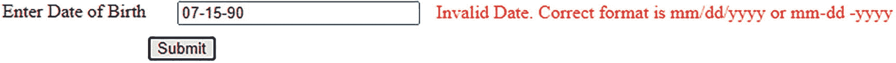
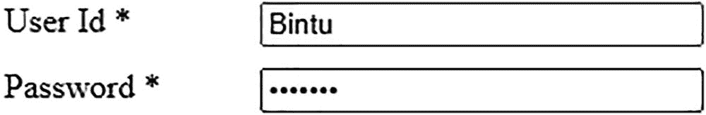

# 四、表单验证

在本章中，您将探索不同的表单验证方式。在本章中，你将学习以下食谱:

*   确认基本字段未留空

*   确认只允许数字

*   验证电话号码

*   验证用户 id

*   验证日期

*   验证电子邮件地址

*   检查复选框是否被选中

*   查找单选按钮是否被选中

*   查找选择元素中的任何选项是否被选中

*   将样式应用于选项和表单按钮

*   同时选中和取消选中所有复选框

*   验证两个字段

*   匹配密码并确认密码

*   禁用某些字段

*   验证完整的表单

## 4.1 确认必填字段未留空

### 问题

表单中有一个输入文本字段，您希望它不要留空。用户必须在其中输入所需的数据，如果留空，则会收到一条错误消息。

### 解决办法

制作一个 HTML 文件，显示包含标签、文本字段、错误消息和提交按钮的表单，如下所示:

**签名格式. html**

```js
<!DOCTYPE html PUBLIC "-//W3C//DTD XHTML 1.0 Transitional//EN"
        "http://www.w3.org/TR/xhtml1/DTD/xhtml1-transitional.dtd">

<html xmlns:="http://www.w3.org/1999/xhtml" xml:lang="en" lang="en">
  <head>
    <meta http-equiv="Content-Type" content="text/html; charset=utf-8"/>
    <title></title>
    <link rel="stylesheet" href="style.css" type="text/css" media="screen" />
    <script src="jquery-3.5.1.js" type="text/javascript"></script>
    <script src="signupformjq.js" type="text/javascript"></script>
  </head>
<body>
<form id="signup" method="post" action="">
<div><span class="label">User Id *</span><input type="text"  class="infobox" name="userid" /><span class="error"> This field cannot be blank</span></div>
<input class="submit" type="submit" value="Submit">
</form>
</body>
</html>

```

因为 HTML 表单的目的是验证输入文本字段，而不是将输入的数据发送到其他页面进行处理，所以表单的 action 属性为空。表单被赋予一个 id`signup`，方法被设置为`post`，尽管它对验证过程没有影响。

标签消息**用户 Id** 包含在类`label`的 span 元素中。输入文本字段被赋予类名`infobox`，错误消息(**该字段不能为空**)被存储为类`error`的 span 元素，提交按钮被赋予类`submit`。

将类分配给表单的所有四个项目的原因是应用类选择器`.label, .infobox, .error`和中定义的属性。`submit`(在`style.css`样式表中定义)自动将这四项添加到表单中。带有各自的类选择器的样式表如下:

**style.css**

```js
.label {float: left; width: 120px; }
.infobox {width: 200px; }
.error { color: red; padding-left: 10px; }
.submit { margin-left: 125px; margin-top: 10px;}

```

用于确认输入文本字段没有留空并在留空时显示错误消息的 jQuery 代码如下:

**签名格式 q.js**

```js
$(document).ready(function() {
  $('.error').hide();
  $('.submit').click(function(event){
    var data=$('.infobox').val();
    var len=data.length;
    if(len<1)
    {
      $('.error').show();
      event.preventDefault();
    }
    else
    {
      $('.error').hide();
    }
   });
});

```

### 它是如何工作的

类选择器`.label`的`float`属性被设置为`left`，这样下一项(输入文本字段)就可以出现在它的右边，它的`width`属性被设置为`120px`，为标签提供足够的显示空间。类选择器`.infobox`将其`width`属性设置为输入文本字段的大小`200px,`。类选择器`.error`将`color`属性设置为`red`以高亮显示它，左边的`padding`设置为`10px`以保持与输入文本字段的距离。类选择器`.submit`将其`margin-left`和`margin-top`属性分别设置为`125px`和`10px`，以设置从浏览器窗口左边界到输入文本字段的距离，因为您希望提交按钮出现在输入文本字段的下方。

在上面的 jQuery 代码中，您可以看到最初错误消息是隐藏的，并且一个 click 事件被附加到 Submit 按钮。在 click 事件的事件处理函数中，您提取用户在输入文本字段中输入的数据(分配了类名`infobox`)并将其存储在一个名为`data`的变量中。找出数据的长度，如果它小于 1(这意味着用户没有在文本字段中输入任何内容)，就在屏幕上显示错误消息。事件对象的方法`preventDefault()`用于防止提交按钮将用户输入的数据发送到服务器。

在执行 jQuery 代码时，您会看到一个带有标签、输入文本字段和提交按钮的表单。如果您选择了提交按钮，而没有在文本字段中输入任何内容，您会得到一条错误消息**该字段不能为空**在文本字段旁边显示为红色，如图 4-1 所示。


图 4-1

当输入文本字段留空时，会显示一条错误消息

如果您在文本字段中输入某个名称并选择提交按钮，您将不会得到任何错误消息，如图 4-2 所示。


图 4-2

如果在输入文本字段中输入数据，没有错误消息

## 4.2 验证数值字段

### 问题

您有一个用于输入人的年龄的文本字段，并且您想要确认在其中输入了一个数字值，并且没有输入字符或符号。

### 解决办法

显示包含标签、输入文本字段、错误消息和提交按钮的表单的 HTML 代码如下:

**validateenum . html**

```js
<!DOCTYPE html PUBLIC "-//W3C//DTD XHTML 1.0 Transitional//EN"
        "http://www.w3.org/TR/xhtml1/DTD/xhtml1-transitional.dtd">

<html xmlns:="http://www.w3.org/1999/xhtml" xml:lang="en" lang="en">
  <head>
    <meta http-equiv="Content-Type" content="text/html; charset=utf-8"/>
    <title></title>
    <link rel="stylesheet" href="style.css" type="text/css" media="screen" />
    <script src="jquery-3.5.1.js" type="text/javascript"></script>
    <script src="validatenumjq.js" type="text/javascript"></script>
  </head>
<body>
<form id="signup" method="post" action="">
 <div><span class="label">Enter Age </span><input type="text"  class="infobox" name="age" /><span class="error"> Only numericals allowed</span></div>
<input class="submit" type="submit" value="Submit">
</form>
</body>
</html>

```

因为这个 HTML 表单的目的是验证输入的文本字段，而不是将输入的数据发送到其他页面进行处理，所以表单的 action 属性为空。表单被赋予一个 id`signup`，方法被设置为`post`，尽管它对验证过程没有影响。

标签消息`User Id`包含在类`label`的 span 元素中。输入文本字段被赋予一个类名`infobox`，错误消息(**该字段不能为空**)被存储为类`error`的 span 元素，提交按钮被赋予类`submit`。

将类分配给表单的所有四个项目的原因是将类选择器`.label, .infobox, .error`和`.submit`(在样式表`style.css`中定义)中定义的属性自动应用到表单的四个项目。带有类选择器的样式表如下:

**style.css**

```js
.label {float: left; width: 120px; }
.infobox {width: 200px; }
.error { color: red; padding-left: 10px; }
.submit { margin-left: 125px; margin-top: 10px;}

```

#### 只允许数值

用于检查在文本字段中输入的年龄是否只包含数字值而不包含文本或符号的 jQuery 代码如下:

**validateenumjq . js**

```js
$(document).ready(function() {
  $('.error').hide();
  $('.submit').click(function(event){
    var data=$('.infobox').val();
    var len=data.length;
    var c;
    for(var i=0;i<len;i++)
    {
      c=data.charAt(i).charCodeAt(0);
      if(c <48 || c >57)
      {
        $('.error').show();
        event.preventDefault();
        break;
      }
      else
      {
        $('.error').hide();
      }
    }
  });
});

```

您可以在这段代码中看到，ASCII 值 0 和 9 用于确保用户输入的值在 0 和 9 之间。ASCII 值 0 是 48，9 是 57。如果输入的 ASCII 值小于 48 或大于 57，将显示错误。

#### 也允许负值

有时，在输入数值时，你也会遇到负值。在上面的 jQuery 代码中，不允许使用任何符号(即，不能使用–(连字符或减号))，因此不能在上面代码的文本字段中输入负值。让我们修改 jQuery 代码，使其也接受负值:

**allow negative ejq . js**

```js
$(document).ready(function() {
  $('.error').hide();
  $('.submit').click(function(event){
    var data=$('.infobox').val();
    var len=data.length;
    var c;
    for(var i=0;i<len;i++)
    {
      c=data.charAt(i).charCodeAt(0);
      if(c==45 && i==0)
      {
        continue;
      }
      if(c <48 || c >57)
      {
        $('.error').show();
        event.preventDefault();
        break;
      }
      else
      {
        $('.error').hide();
      }
    }
   });
 });

```

#### 允许值的范围

您希望输入人员的年龄，并希望其在 5 到 99 的范围内(即，如果输入的年龄低于或高于给定范围，您希望在屏幕上显示一条错误消息)。

用于输入范围在 5 到 99 之间的数值的 jQuery 代码如下:

**Allowrangejq.js**

```js
$(document).ready(function() {
  $('.error').hide();
  $('.submit').click(function(event){
    var data=$('.infobox').val();
    var len=data.length;
    var c=0;
    var age=0;
    var flag=0;
    for(var i=0;i<len;i++)
    {
      c=data.charAt(i).charCodeAt(0);
      if(c <48 || c >57)
      {
        $('.error').show();
        flag=1;
        event.preventDefault();
        break;
      }
      else
      {
        $('.error').hide();
      }
    }

    if(flag==0)
    {
      age=parseInt(data);
      if(age<5 || age>99)
      {
        $('.error').show();
        $('.error').text('Invalid Age. Please enter the age within the range 5 to 99');
        event.preventDefault();
      }
    }
  });
 });

```

### 它是如何工作的

您可以在上面的 HTML 文件中看到，标签被设置为显示文本**输入年龄**，错误消息被赋予文本**仅允许数字**。此外，四个项目(标签、输入文本字段、错误消息和提交按钮)被赋予不同的类名(`label, infobox, error`和`submit`)，以便将类选择器中定义的属性(在样式表`style.css`中定义)应用于它们。在这个配方中，您使用了来自配方 4-1 的相同的外部样式表`style.css`。

你可以在 jQuery 代码的*只允许数值*部分看到，错误消息最初被设置为`invisible`。click 事件附加到 Submit 按钮，以便在单击 Submit 按钮时执行其事件处理函数。在事件处理函数中，您会看到输入文本字段中的数据(该文本字段包含在类`infobox`的 span 元素中)被检索并存储在一个名为`data`的变量中。计算其长度，并对输入数据的长度执行一个`for`循环，以解析每个字符。

在`for`循环中，一次取一个字符(输入数据的)，在`charCodeAt()`的帮助下找到它的 ASCII 值。如果字符的 ASCII 值小于 48(表示 0)或大于 57(表示 9)，表示它不是一个数字值，则在屏幕上显示错误消息并退出循环。事件对象的`preventDefault()`方法用于防止用户输入的数据被发送到服务器或用户导航到目标表单。

程序执行时，如果在年龄后面输入一些字符，会得到错误信息**只允许输入数字**，如图 4-3 所示。


图 4-3

如果字符出现在年龄之后，将显示一条错误消息

即使数字之间出现字符，也会显示错误，如图 4-4 所示。


图 4-4

如果字符出现在数字之间，将显示一条错误消息

同样，如果你添加任何符号，比如减号或下划线，你会得到一个错误信息，如图 4-5 所示。


图 4-5

输入符号时会显示一条错误消息

您可以在 jQuery 代码的*也允许负值*部分看到，错误消息在开始时是隐藏的。附加到提交按钮的 click 事件的事件处理函数从输入文本字段中提取数据，并将其存储在变量`data`中。存储在`data`中的每个字符都在`for`循环的帮助下被解析。在循环中，您将`data`变量中的每个字符转换为其 ASCII 值，并检查第一个字符的 ASCII 值是否为 45(这是减号的 ASCII 值)，然后您继续检查其余的字符，而不显示任何错误消息。`for`循环中的第二个条件是您之前看到的(即，检查数据变量中的字符是否是数值，如果不是，则显示错误消息)。

在 jQuery 代码的*允许值的范围*部分中，您首先使错误消息不可见。然后将 click 事件附加到 Submit 按钮上。click 事件的事件处理函数完成了几项工作，比如提取输入文本字段中输入的数值(分配了类名`infobox`)并将其存储在变量`data`中。然后找出数据的长度，并执行循环来解析每个字符。如果`data`中的任何单个内容的 ASCII 值小于 48 (ASCII 值为 0)或大于 57 (ASCII 值为 9)，这意味着`data`变量包含除数值之外的某个值，因此您使错误消息可见。此外，将变量标志的值设置为 1，表示只允许数字，并从`for`循环中退出。如果 flag 的值设置为 1，这意味着检查数值范围没有意义，因为它是无效数据。

如果数据是数字，需要检查数值的范围(即是否在 5 到 99 之间)。所以，如果标志变量的值为 0(在执行了`for`循环之后，所以在检查了`data`变量的所有字符之后)，这意味着输入的数据是有效的，并且只由数字组成；然后应用条件语句，如果小于 5 或大于 99，显示错误消息，并将错误消息的文本设置为**无效年龄**。事件对象的`preventDefault()`方法用于防止输入的数据无效时提交。如果该值不在 5 到 99 的范围内，您会得到如图 4-6 所示的错误信息。


图 4-6

如果该值不在 5 到 99 的范围内，将显示错误消息

## 4.3 验证电话号码

### 问题

您希望使用电话号码字段，并且希望用户只能输入数字和+或-(加号或减号)符号，而不能输入其他任何内容。

### 解决办法

创建一个 HTML 文件，显示一个由标签、输入文本字段、错误消息和提交按钮组成的表单:

**Validatephone.html**

```js
<!DOCTYPE html PUBLIC "-//W3C//DTD XHTML 1.0 Transitional//EN"
        "http://www.w3.org/TR/xhtml1/DTD/xhtml1-transitional.dtd">

<html xmlns:="http://www.w3.org/1999/xhtml" xml:lang="en" lang="en">
  <head>
    <meta http-equiv="Content-Type" content="text/html; charset=utf-8"/>
    <title></title>
    <link rel="stylesheet" href="style.css" type="text/css" media="screen" />
    <script src="jquery-3.5.1.js" type="text/javascript"></script>
    <script src="validatephonejq.js" type="text/javascript"></script>
  </head>
<body>
     <form id="signup" method="post" action="">
          <div><span class="label">Enter Phone number </span><input type="text"  class="infobox" name="phone" /><span class="error"> Phone number can contain only numbers, + and -</span></div>
          <input class="submit" type="submit" value="Submit">
    </form>
</body>
</html>

```

这个 HTML 文件中的所有四个项目都被分配了各自的类名`label, infobox, error`和`submit`，这样在外部样式表`style.css`中指定的类选择器中定义的样式属性可以自动应用到这些项目。样式表文件中定义的类选择器如下:

**style.css**

```js
.label {float: left; width: 150px; }
.infobox {width: 200px; }
.error { color: red; padding-left: 10px; }
.submit { margin-left: 150px; margin-top: 10px;}

```

jQuery 代码确认输入文本字段只接受数字和–或+符号，不接受任何其他内容，如下所示:

**validateephonejq . js**

```js
$(document).ready(function() {
  $('.error').hide();
  $('.submit').click(function(event){
    var data=$('.infobox').val();
    if(validate_phoneno(data))
    {
      $('.error').hide();
    }
    else
    {
      $('.error').show();
      event.preventDefault();
    }
   });
 });

function validate_phoneno(ph)
{
  var pattern=new RegExp(/^[0-9-+]+$/);
  return pattern.test(ph);
}

```

### 它是如何工作的

类选择器`.label`将`float`属性设置为`left`，以便下一项(输入文本字段)可以出现在它的右侧，并且其`width`属性设置为`150px`，以便为标签消息**输入电话号码**提供足够的显示空间。类选择器`.infobox`将其`width`属性设置为`200px`，这最终成为输入文本字段的宽度。类选择器`.error`将其`color`属性设置为`red`以高亮显示它，左边的`padding`设置为`10px`以保持与输入文本字段的距离。类选择器`.submit`将其`margin-left`和`margin-top`属性分别设置为`150px`和`10px`，以设置从浏览器窗口左边界到输入文本字段的距离，因为您希望提交按钮出现在输入文本字段的正下方。

您可以在 jQuery 代码中看到，错误消息在开始时是不可见的。click 事件附加到提交按钮。在 click 事件的事件处理函数中，用户在文本字段中输入的电话号码(包含在类名`infobox`的 span 元素中)被检索并存储在`data`变量中。`data`变量被传递给`validate_phoneno()`方法进行验证。

这里，`data`变量的内容被赋给了`validate_phoneno()`方法的`ph`参数。在`validate_phoneno()`中，创建了一个`RegExp`类的实例。传递给`RegExp`构造函数的正则表达式是/^[0-9-+]+$/，这意味着输入文本字段中的数据可以用 0 到 9 之间的任何数值或–或+符号开始或结束(^表示开始，而$表示结束)。右括号(])后的+号表示该模式可以重复一次或多次(即，您可以在输入文本字段中输入的电话号码中输入数字或–或+任意次)。

`validate_phoneno()`用正则表达式测试`ph`参数的内容，如果`ph`变量的内容与提供的正则表达式匹配，则返回`true`；否则它返回`false`。根据`validate_phoneno()`返回的布尔值，显示或不显示错误信息。如果在输入电话号码时使用了+或–符号以外的符号，则会出现错误消息**电话号码只能包含数字、+和–**，如图 4-7 所示。


图 4-7

输入数字、+或–以外的数据时显示的错误消息

如果电话号码由数字和一个+或-符号组成，它将被认为是一个有效的电话号码并被接受而不显示任何错误信息，如图 4-8 所示。


图 4-8

如果电话号码由数字和+或-符号组成，则被视为有效

## 4.4 验证用户 Id

### 问题

您希望验证一个可能由字符、数字和下划线组成而没有其他符号的用户 id。

### 解决办法

创建一个 HTML 文件，显示一个包含标签、输入文本字段、错误消息和提交按钮的表单。标签的文本设置为**输入用户 id** ，消息设置为**用户 id 只能包含字母、数字或下划线**。这四个项目也被分别指定为类名`label, infobox, error`和`submit`。对于这些类名，各自的类选择器都写在外部样式表中。HTML 文件如下所示:

验证器. html

```js
<!DOCTYPE html PUBLIC "-//W3C//DTD XHTML 1.0 Transitional//EN"
        "http://www.w3.org/TR/xhtml1/DTD/xhtml1-transitional.dtd">

<html xmlns:="http://www.w3.org/1999/xhtml" xml:lang="en" lang="en">
  <head>
    <meta http-equiv="Content-Type" content="text/html; charset=utf-8"/>
    <title></title>
    <link rel="stylesheet" href="style.css" type="text/css" media="screen" />
    <script src="jquery-3.5.1.js" type="text/javascript"></script>
    <script src="validateuserjq.js" type="text/javascript"></script>
  </head>
  <body>
     <form id="signup" method="post" action="">
          <div><span class="label">Enter User id </span><input type="text"  class="infobox" name="userid" /><span class="error"> User id can contain only letters, numbers or underscore</span></div>
         <input class="submit" type="submit" value="Submit">
     </form>
  </body>
</html>

```

类选择器由自动应用于 HTML 元素的样式属性组成，并在样式表 **style.css** 中定义。您使用与配方 4-3 中相同的样式表文件(`style.css`)。

接受仅由数字、字符和下划线组成的用户 id 的 jQuery 代码如下:

**validator rjq . js**

```js
$(document).ready(function() {
  $('.error').hide();
  $('.submit').click(function(event){
    var data=$('.infobox').val();
    if(validate_userid(data))
    {
      $('.error').hide();
    }
    else
    {
      $('.error').show();
      event.preventDefault();
    }
  });
});

function validate_userid(uid)
{
  var pattern= new RegExp(/^[a-zA-Z0-9_]+$/);
  return pattern.test(uid);
}

```

### 它是如何工作的

您可以在这段 jQuery 代码中看到，错误消息在开始时是不可见的。click 事件附加到提交按钮。在 click 事件的事件处理函数中，用户在文本字段中输入的用户 id(包含在类名`infobox`的 span 元素中)被检索并存储在`data`变量中。`data`变量被传递给`validate_userid()`函数进行验证。`data`变量的内容被分配给`validate_userid()`方法的`uid`参数。

在`validate_userid()`中，创建了一个`RegExp`类的实例。传递给`RegExp`构造函数的正则表达式是/^[a-zA-Z0-9_]+$/，这意味着在输入文本字段中输入的用户 id 可以以从 a 到 z(大写或小写)的任何字符、从 0 到 9 的数值或 _ 符号开始或结束(^表示开始，而$表示结束)。右括号(])后的+号表示该模式可以重复一次或多次(即，您可以在输入文本字段中输入任意次数的字符、数字或 a _ 号)。

`validate_userid()`用正则表达式测试`uid`参数的内容，如果`uid`变量的内容与提供的正则表达式匹配，则返回`true`，否则返回`false`。基于`validate_userid()`功能返回的布尔值，错误信息变得可见或不可见。如果在输入用户 id 时使用了除符号以外的符号，则会出现错误消息**用户 id 只能包含字母、数字或下划线**，如图 4-9 所示。


图 4-9

如果在用户 id 字段中使用了除 _ 以外的任何符号，将显示错误消息

如果用户 id 由字符、数字或 _ 组成，则被认为是有效的用户 id 并被接受，不显示任何错误信息，如图 4-10 所示。


图 4-10

如果用户 id 由字符、数字和 _ 符号组成，则被视为有效

## 4.5 验证日期

### 问题

您希望验证格式为 mm/dd/yyyy 或 mm-dd-yyyy 的日期。如果输入的日期与任一格式都不匹配，您希望显示一条错误消息。

### 解决办法

创建一个 HTML 文件，显示一个包含标签、输入文本字段、错误消息和提交按钮的表单。标签文本设置为**输入出生日期**，错误信息设置为**无效日期**。这四个项目分别被赋予类名`label, infobox, error`和`submit`。对于类名，相应的类选择器写在外部样式表中。HTML 文件如下所示:

**validatedata . html**

```js
<!DOCTYPE html PUBLIC "-//W3C//DTD XHTML 1.0 Transitional//EN"
        "http://www.w3.org/TR/xhtml1/DTD/xhtml1-transitional.dtd">

<html xmlns:="http://www.w3.org/1999/xhtml" xml:lang="en" lang="en">
  <head>
    <meta http-equiv="Content-Type" content="text/html; charset=utf-8"/>
    <title></title>
    <link rel="stylesheet" href="style.css" type="text/css" media="screen" />
    <script src="jquery-3.5.1.js" type="text/javascript"></script>
    <script src="validatedatejq.js" type="text/javascript"></script>
  </head>
  <body>
     <form id="signup" method="post" action="">
         <div><span class="label">Enter Date of Birth </span><input type="text"  class="infobox" name="dob" /><span class="error"> Invalid Date. Correct format is mm/dd/yyyy or mm-dd -yyyy </span></div>
        <input class="submit" type="submit" value="Submit">
     </form>
  </body>
</html>

```

类选择器由自动应用于 HTML 元素的样式属性组成，并在样式表 **style.css** 中定义。使用制作方法 4-3 中的相同样式表文件(`style.css`)。

接受 mm/dd/yyyy 或 mm-dd -yyyy 格式的日期的 jQuery 代码如下:

**validatedata . js**

```js
$(document).ready(function() {
  $('.error').hide();
  $('.submit').click(function(event){
    var data=$('.infobox').val();
    if(validate_date(data))
    {
      $('.error').hide();
    }
    else
    {
      $('.error').show();
      event.preventDefault();
    }
  });
});

function validate_date(date)
{
  var pattern= new RegExp(/\b\d{1,2}[\/-]\d{1,2}[\/-]\d{4}\b/);
  return pattern.test(date);
}

```

### 它是如何工作的

错误消息在 jQuery 代码的开始是不可见的。然后，点击事件被附加到提交按钮。在 click 事件的事件处理函数中，用户在输入文本字段中输入的日期(包含在类名`infobox`的 span 元素中)被检索并存储在`data`变量中。`data`变量被传递给`validate_date()`函数进行验证。`data`变量的内容被分配给`validate_date()`函数的`date`参数。在`validate_date()`函数中，创建了一个`RegExp`类的实例。传递给`RegExp`构造函数的正则表达式是/\b\d{1，2}[\/-]\d{1，2}[\/-]\d{4}\b/。

正则表达式解释如下:

*   正则表达式开头和结尾的\b 表示单词边界(即模式必须完全匹配相同的模式)。

*   \d{1，2}表示可以有 1 到 2 个数字。

*   [\/-]表示可以有符号/或-。

*   \d{1，2}表示可以有 1 到 2 个数字。

*   [\/-]表示可以有符号/或-。

*   \d{4}表示必须正好有 4 位数字。

因此，在输入文本字段中输入的日期必须以 1 或 2 位数(月)开头，后跟/或–符号。同样，可以有 1 或 2 位数字(日)，后跟/或–符号，最后必须正好有 4 位数字(年)。`validate_date()`函数使用正则表达式测试`date`参数的内容，如果日期变量的内容与提供的正则表达式匹配，则返回`true`，否则返回`false`。基于由`validate_date()`函数返回的布尔值，错误信息变得可见或不可见。

假设你输入的日期不正确。您输入的年份不是 4 位数，而是 2 位数。您将得到如图 4-11 所示的`Invalid Date`错误信息。



图 4-11

如果日期输入不正确，将显示错误消息“无效日期”

如果正确输入了日期，并且在日、月和年之间使用了/或–分隔符，则该日期将被接受，不会出现任何错误消息，如图 4-12 所示。


图 4-12

如果该日期遵循指定的模式，它将被接受，不会出现任何错误消息

## 4.6 验证电子邮件地址

### 问题

您想要验证电子邮件地址(即，您想要确认电子邮件地址由字符和数字以及@和组成。符号)。

### 解决办法

创建一个 HTML 文件，显示一个包含标签、输入文本字段、错误消息和提交按钮的表单。标签的文本被设置为`Enter Email Id`，错误信息被设置为`Invalid Email Address`。这四个项目分别被赋予类名`label, infobox, error`和`submit`。对于这些类名，各自的类选择器都写在外部样式表中。HTML 文件如下所示:

**validatemail . html**

```js
<!DOCTYPE html PUBLIC "-//W3C//DTD XHTML 1.0 Transitional//EN"
        "http://www.w3.org/TR/xhtml1/DTD/xhtml1-transitional.dtd">

<html xmlns:="http://www.w3.org/1999/xhtml" xml:lang="en" lang="en">
  <head>
    <meta http-equiv="Content-Type" content="text/html; charset=utf-8"/>
    <title></title>
    <link rel="stylesheet" href="style.css" type="text/css" media="screen" />
    <script src="jquery-3.5.1.js" type="text/javascript"></script>
    <script src="validateemailjq.js" type="text/javascript"></script>
  </head>
  <body>
    <form id="signup" method="post" action="">
      <div><span class="label">Enter Email Id </span><input type="text"  class="infobox" name="email" /><span class="error"> Invalid Email Address. Correct email address is the one that essentially has @ sign and a . (period) after  @ sign. It should not have any other special symbol except hyphen or underscore and must be termnated by any letter only </span></div>
     <input class="submit" type="submit" value="Submit">
    </form>
  </body>
</html>

```

类别选择器由自动应用于 HTML 元素的样式属性组成，并在样式表`style.css,`中定义，与配方 4-3 中使用的样式表文件相同。

接受电子邮件地址并对其进行验证的 jQuery 代码如下:

**validatemailjq . js**

```js
$(document).ready(function() {
  $('.error').hide();
  $('.submit').click(function(event){
    var data=$('.infobox').val();
    if(valid_email(data))
    {
      $('.error').hide();
    }
    else
    {
      $('.error').show();
    event.preventDefault();
    }
  });
});

function valid_email(email)
{
  var pattern= new RegExp(/^[\w-]+(\.[\w-]+)*@([\w-]+\.)+[a-zA-Z]+$/);
  return pattern.test(email);
}

```

### 它是如何工作的

错误消息在 jQuery 代码的开始是不可见的。然后，点击事件被附加到提交按钮。在 click 事件的事件处理函数中，用户在输入文本字段中输入的电子邮件地址(包含在类名`infobox`的 span 元素中)被检索并存储在`data`变量中。`data`变量被传递给`validate_email()`函数进行验证。`data`变量的内容被分配给`validate_email()`函数的`email`参数。在`validate_email()`函数中，创建了一个`RegExp`类的实例。传递给`RegExp`构造函数的正则表达式是/^[\w-]+(\.[\w-]+)*@([\w-]+\。)+[a-zA-Z]+$/。

正则表达式解释如下:

*   * /^[\w-]+表示电子邮件地址的开头可以有字母、数字、下划线或连字符。^的意思是开始。\w 表示字母、数字和下划线。右括号(])后的+号表示一次或多次。

*   (\.[\w-]+)*表示由一个.(句点)后跟一个字母、数字、下划线和连字符组成的模式可以出现 0 次或更多次。图案末尾的符号*表示 0 次或更多次。

*   @表示符号@必须出现在上述模式之后。

*   ([\w-]+\。)+表示字母、数字、下划线和连字符可以出现一次或多次，后跟一个.(句点)。还有这个组合的东西(字符，数字，下划线，连字符，还有。)可以出现一次或多次。

*   [a-zA-Z]+$/表示在电子邮件地址的末尾，换句话说，电子邮件地址必须以可能出现一次或多次的任何大写或小写字母结尾。$表示结束。

因此，在输入文本字段中输入的电子邮件地址必须以字母、数字、下划线或连字符开头，后跟一个.(句点)，再后跟字母、数字、下划线或连字符一次或多次。之后，必须有符号@ (at ),后面是字母、数字、下划线或连字符，后面是一个.(句点)。电子邮件地址必须以任何大写或小写字母结尾。

`validate_email()`函数使用正则表达式测试`email`参数的内容，如果 email 参数的内容与提供的正则表达式匹配，则返回`true`，否则返回`false`。基于由`validate_email()`函数返回的布尔值，错误信息变得可见或不可见。

假设在电子邮件地址中你没有输入一个.(句号)。您将得到如图 4-13 所示的错误消息**无效的电子邮件地址**。


图 4-13

电子邮件地址无效时显示的错误消息

如果电子邮件地址输入正确，因为它包含@和。(句号)，它将被接受，没有任何错误信息，如图 4-14 所示。


图 4-14

如果电子邮件地址包含。和@符号

## 4.7 检查复选框是否被选中

### 问题

您有几个复选框，每个复选框指定一个快餐柜台出售的商品。您希望在选择提交按钮时确认至少选中了一个复选框。如果没有选中任何复选框，您希望显示一条错误消息。

### 解决办法

创建一个 HTML 文件，该文件显示四个复选框、一条错误消息和一个用于显示结果的空段落元素(所选食品的总账单)。HTML 文件如下所示:

**Checkcheckbox.html**

```js
<!DOCTYPE html PUBLIC "-//W3C//DTD XHTML 1.0 Transitional//EN"
        "http://www.w3.org/TR/xhtml1/DTD/xhtml1-transitional.dtd">

<html xmlns:="http://www.w3.org/1999/xhtml" xml:lang="en" lang="en">
  <head>
    <meta http-equiv="Content-Type" content="text/html; charset=utf-8"/>
    <title></title>
    <link rel="stylesheet" href="style1.css" type="text/css" media="screen" />
    <script src="jquery-3.5.1.js" type="text/javascript"></script>
    <script src="checkcheckboxjq.js" type="text/javascript"></script>
  </head>
  <body>
     <form>
        <input type="checkbox"  id="pizza" name="pizza" value=5  class="infobox">Pizza $5 <br>
       <input type="checkbox"  id="hotdog" name="hotdog" value=2  class="infobox">HotDog $2<br>
        <input type="checkbox"  id="coke" name="coke" value=1  class="infobox">Coke $1<br>
        <input type="checkbox"  id="fries" name="fries" value=3  class="infobox">French Fries $3<br>
        <p class="error">Select at least one checkbox </p>
        <p class="result"></p>
       <input class="submit" type="submit" value="Submit">
    </form>
  </body>
</html>

```

将样式属性自动应用到 HTML 元素的类选择器在外部样式表 **style1.css** 中定义，如下所示:

**Style1.css**

```js
.infobox { margin-top: 15px; }
.error { color: red; }

```

查看复选框是否被选中的 jQuery 代码如下:

**check box jq . js**

```js
$(document).ready(function() {
     $('.error').hide();
     $('.submit').click(function(event){
          var count=0;
          var amt=0;
          $('form').find(':checkbox').each(function(){
               if($(this).is(':checked'))
               {
                    count++;
                    amt=amt+parseInt($(this).val());
               }
          });
          if(count==0)
          {
               $('p.result').hide();
               $('.error').show();
           }
          else
          {
               $('.error').hide();
               $('p.result').show();
               $('p.result').text('Your bill is $ '+amt);
          }
          event.preventDefault();
     });
});

```

#### 用长度法检查

在下面的 jQuery 代码中，在使用循环分别检查每个复选框之前，确认是否选中了任何复选框:

**检查长度 jq.js**

```js
$(document).ready(function() {
     $('.error').hide();
     $('.submit').click(function(event){
          var amt=0;
          var count=$('input:checked').length;
          if(count==0)
          {
               $('p.result').hide();
               $('.error').show();
          }
          else
          {
               $('form').find(':checkbox').each(function(){
                    if($(this).is(':checked'))
                    {
                         amt=amt+parseInt($(this).val());
                    }
               });
               $('.error').hide();
               $('p.result').show();
               $('p.result').text('Your bill is $ '+amt);
          }
          event.preventDefault();
     });
});

```

### 它是如何工作的

在 HTML 文件中，您可以看到四个复选框被赋予了类名`infobox`,它们代表快餐店出售的四种商品:披萨、热狗、可乐和薯条，以及它们的价格。显示错误消息的段落元素被赋予类名`error`，其文本显示错误消息`Select at least one checkbox`。还有一个段落元素来显示通过复选框选择的食品清单，它被分配了类名`result`，当前为空。将通过 jQuery 代码为其分配显示账单的文本。

样式表定义了两个类选择器:`.infobox`应用于复选框，而`.error`应用于显示错误消息的段落元素。`.infobox`类选择器包含一个名为`margin-top`的属性，该属性被设置为`15px`，以便在显示的复选框之间创建足够的垂直间距。类选择器`.error`包含设置为`red`的样式属性`color`，因此错误消息以红色显示(从而突出显示)。

在第一个 jQuery 代码中，错误消息被设置为不可见。然后，将 click 事件附加到 Submit 按钮。在选择提交按钮时，它的事件处理函数被执行并完成几项任务。在事件处理函数中，首先初始化一个设置为 0 的计数器`count`(它将用于计算选中复选框的数量)和另一个设置为 0 的变量`amt`,该变量将用于计算所选食物的账单总数。使用`.each()`功能，你一个接一个地检查表单的所有复选框，如果发现任何复选框被选中，你将计数器变量`count`的值增加 1，并且该食品的数量也被添加到`amt`变量中。也就是说，在`count`变量中设置选中复选框的数量，在`amt`变量中设置选中复选框的总数。检查完所有复选框后，如果您发现`the count`变量的值为 0，这意味着没有选择任何复选框，您可以使显示错误消息的段落元素可见。要显示错误消息**，请在屏幕上至少选择一个复选框**。如果`count`变量的值不为 0(意味着至少有一个复选框被选中)，则使类`result`的段落元素可见(并隐藏类`error`的段落)，并为其分配文本 **Your bill is $+amt** ，其中`amt`是存储所选食品项目总金额的变量。

如果您没有选择任何复选框并按下提交按钮，屏幕上会出现一条错误信息**选择至少一个复选框**，如图 4-15 所示。


图 4-15

如果未选中复选框，将显示错误消息

如果您选择了一个复选框，错误信息将变得不可见，所选食品的账单将出现，如图 4-16 所示。


图 4-16

显示一个所选食品的账单

如果您选择了多个复选框，所选食品的总金额将以账单的形式显示，如图 4-17 所示。


图 4-17

显示三种食品的总账单金额

在 jQuery 代码中的*使用长度方法*部分，您使用了语句

```js
var count=$('input:checked').length;

```

查找选中复选框的总数。如果计数为零，则没有必要逐个检查所有复选框来计算所选项目的总数。当 count 变量的值不为零时，您可以使用`.each()`函数逐个检查每个复选框，以计算所选食品的总量。这个 jQuery 代码的输出将如图 4-15 到 4-17 所示。

## 4.8 检查是否选择了单选按钮

### 问题

您有几个单选按钮，每个按钮都指定访问者可以用来付款的信用卡。您希望确认用户在选择提交按钮时选择了其中一个单选按钮。如果没有选择单选按钮，您希望显示一条错误消息。

### 解决办法

下面的 HTML 文件显示了三个单选按钮。每个单选按钮都被分配了类名`infobox`，用于验证检查和应用样式。错误消息通过一个类名称为`error`的段落元素显示，提交按钮的类名称为`submit`。

**Checkradio.html**

```js
<!DOCTYPE html PUBLIC "-//W3C//DTD XHTML 1.0 Transitional//EN"
        "http://www.w3.org/TR/xhtml1/DTD/xhtml1-transitional.dtd">

<html xmlns:="http://www.w3.org/1999/xhtml" xml:lang="en" lang="en">
  <head>
    <meta http-equiv="Content-Type" content="text/html; charset=utf-8"/>
    <title></title>
    <link rel="stylesheet" href="style1.css" type="text/css" media="screen" />
    <script src="jquery-3.5.1.js" type="text/javascript"></script>
    <script src="checkradiojq.js" type="text/javascript"></script>
  </head>
  <body>
     <form>
          <input type="radio"  name="paymode" class="infobox" value="Master Card">Master Card <br>
         <input type="radio"  name="paymode" class="infobox" value="ANZ Grindlay Card">ANZ Grindlay Card<br>
         <input type="radio"  name="paymode" class="infobox" value="Visa Card">Visa Card<br>
         <p class="error">Select at least one Option </p>
         <p class="result"></p>
         <input class="submit" type="submit" value="Submit">
     </form>
  </body>
</html>

```

外部样式表包含以下类选择器:

**Style1.css**

```js
.infobox { margin-top: 15px; }
.error { color: red; }

```

确认至少选择了一个单选按钮的 jQuery 代码如下:

**Checkradiojq.js**

```js
1\.     $(document).ready(function() {
2\.           $('.error').hide();
3\.           $('.submit').click(function(event){
4\.                var amt=0;
5\.                var count=$('input:checked').length;
6\.                if(count==0)
7\.                {
8\.                     $('p.result').hide();
9\.                     $('.error').show();
10\.           }
11\.           else
12\.           {
13\.                $('.error').hide();
14\.                $('p.result').show();
15\.                $('p.result').text('You have selected '+$('input:checked').attr("value"));
16\.           }
17\.           event.preventDefault();
18\.      });
19\. });

```

### 它是如何工作的

在样式表文件中，类选择器`.infobox`包含设置为`15px`的`margin-top`属性，以保持单选按钮之间的间距，类选择器`.error`将红色分配给错误消息。

jQuery 代码语句的解释如下:

2.类`error`的段落元素中的错误消息被隐藏。

3.click 事件附加到提交按钮。

5.找出被选中的单选按钮的数量(如果有的话),并将其存储在`count`变量中。

8.如果没有选择单选按钮，隐藏类`result`的段落元素(意在显示所选信用卡的名称)。

9.如果没有选择单选按钮，则显示类别`error`的段落元素中的错误消息。

15.分配您选择的文本**n**，其中 n 是所选单选按钮的值。

在执行时，如果您选择了提交按钮而没有选择任何单选按钮，您会得到错误消息**选择至少一个选项**，如图 4-18 所示。


图 4-18

未选择单选按钮时显示的错误消息

如果您选择一个单选按钮并选择提交按钮，如图 4-19 所示，将显示确认所选信用卡名称的消息。


图 4-19

将显示所选单选按钮的文本

## 4.9 检查选择元素中的选项是否被选中

### 问题

您有一个下拉列表(select 元素)显示一些食品。您希望在按提交按钮之前确认用户从下拉列表中选择了一个选项，否则会显示一条错误消息。

### 解决办法

下面的 HTML 文件显示了一个包含一些食物的下拉列表框。帮助下拉列表显示的选择元素被赋予类名`infobox`，以便直接应用在类选择器`.infobox`(写在样式表文件`style.css`中)中定义的样式属性。标签消息**选择食物项目**通过带有类名`label`的 span 元素显示。错误消息通过具有类名`error`的段落元素显示，提交按钮被赋予类名`submit`。

**Checkselect.html**

```js
<!DOCTYPE html PUBLIC "-//W3C//DTD XHTML 1.0 Transitional//EN"
        "http://www.w3.org/TR/xhtml1/DTD/xhtml1-transitional.dtd">

<html xmlns:="http://www.w3.org/1999/xhtml" xml:lang="en" lang="en">
  <head>
    <meta http-equiv="Content-Type" content="text/html; charset=utf-8"/>
    <title></title>
    <link rel="stylesheet" href="style.css" type="text/css" media="screen" />
    <script src="jquery-3.5.1.js" type="text/javascript"></script>
    <script src="checkselectjq.js" type="text/javascript"></script>
  </head>
  <body>
   <form>
      <span class="label">Select the Food Item </span>
      <select id="food" class="infobox">
         <option value="0">Select a Food</option>
         <option value="Pizza $5">Pizza $5</option>
         <option value="HotDog $2">HotDog $2</option>
<option value="Coke $1">Coke $1</option>
<option value="French Fries $3">French Fries $3</option>
</select>
<p class="error">You have not selected any Option</p>
<p class="result"></p>
<input class="submit" type="submit" value="Submit">
</form>
  </body>
</html>

```

外部样式表包含以下类选择器，它们将自动应用于指定类的相应 HTML 元素:

**style.css**

```js
.label {float: left; width: 150px; }
.infobox {width: 150px; }
.error { color: red; padding-left: 10px; }
.submit { margin-left: 150px; margin-top: 10px;}

```

确认下拉列表中的选项被选中的 jQuery 代码如下:

**支票选择 q.js**

```js
$(document).ready(function() {
     $('.error').hide();
     $('.submit').click(function(event){
          var count=$('select option:selected').val();
          if(count==0)
          {
               $('p.result').hide();
               $('.error').show();
          }
          else
          {
               $('.error').hide();
               $('p.result').show();
               $('p.result').text('You have selected '+$('select option:selected').text());
          }
          event.preventDefault();
     });
});

```

### 它是如何工作的

在样式表文件中，类选择器`.label`包含设置为值`left`的`float`属性，以使标签出现在它的左侧(为下拉列表出现在它的右侧创造空间),并且`width`属性设置为`150px`,以定义标签可以消耗的宽度。类选择器`.infobox`包含设置为`150px`的`width`属性，以指定下拉列表的宽度，类选择器`.error`将红色分配给错误消息，并使错误消息出现在距离浏览器窗口左侧 10px 的位置。类选择器`submit`包含设置为值`150px`的`margin-left`属性，以使提交按钮出现在离浏览器窗口左侧 150px 的距离处(因此它出现在下拉列表的下方),并且`margin-top`属性被设置为`10px`,以与上面可能出现的元素(错误或结果消息)保持一定的间距。

在 jQuery 代码中，最初隐藏了用来显示错误消息的类`error`的段落元素。然后将一个点击事件附加到提交按钮上。该声明

```js
var count=$('select option:selected').val();

```

检索从 select 元素中选择的选项的值，并将其存储在变量`count`中。如果 count 的值为 0，意味着用户没有选择任何选项，您可以通过使类`.error`的段落元素可见来使错误消息出现在屏幕上，如果 count 变量的值不为零，您可以使用下面的语句使类`result`的段落元素显示结果:

**您选择了'+$('选择选项:已选择')。text())；**

它显示从 select 元素中选择的选项的文本。

在执行时，如果您没有从选择元素中选择任何选项就按提交按钮，您会得到错误消息**您没有选择任何选项**，如图 4-20 所示。


图 4-20

如果没有从选择元素中选择选项，将显示错误消息

如果您从列表中选择任何选项并按下提交按钮，您将得到显示所选选项的消息，如图 4-21 所示。


图 4-21

将显示选择元素的选定选项的文本

#### 多重选择

让我们修改上面的解决方案，允许访问者从 select 元素中选择多个选项。要从选择元素中选择一个以上的选项，请使用`MULTIPLE`属性和选择元素，如下所示:

**Multiselect.html**

```js
<!DOCTYPE html PUBLIC "-//W3C//DTD XHTML 1.0 Transitional//EN"
        "http://www.w3.org/TR/xhtml1/DTD/xhtml1-transitional.dtd">

<html xmlns:="http://www.w3.org/1999/xhtml" xml:lang="en" lang="en">
  <head>
    <meta http-equiv="Content-Type" content="text/html; charset=utf-8"/>
    <title></title>
    <link rel="stylesheet" href="style.css" type="text/css" media="screen" />
    <script src="jquery-3.5.1.js" type="text/javascript"></script>
    <script src="multiselectjq.js" type="text/javascript"></script>
  </head>
  <body>
    <form>
        <span class="label">Select the Food Item </span>
        <select id="food" class="infobox" MULTIPLE>
            <option value="0" selected="0">Select a Food</option>
            <option value="Pizza $5">Pizza $5</option>
            <option value="HotDog $2">HotDog $2</option>
            <option value="Coke $1">Coke $1</option>
            <option value="French Fries $3">French Fries $3</option>
        </select>
        <p class="error">You have not selected any Option </p>
        <p class="result"></p>
        <input class="submit" type="submit" value="Submit">
    </form>
  </body>
</html>

```

当附加到 select 元素时,`MULTIPLE`属性将允许您选择多个选项(利用 Ctrl 或 Shift 键)。使用相同的 jQuery 代码和样式表(`style.css` **)** ，您将得到显示用户从 select 元素中选择的所有选项的消息，如图 4-22 所示。


图 4-22

显示 select 元素的所有选定选项，中间没有空格

您可以看到所选的选项显示出来，中间没有任何空格。要用逗号(，)分隔选项，请修改 jQuery 代码，如下所示:

**multilectjq . js**

```js
$(document).ready(function() {
  $('.error').hide();
  $('.submit').click(function(event){
    var selectedopts="";
    var count=$('select option:selected').val();
    if(count==0)
    {
      $('p.result').hide();
      $('.error').show();
    }
    else
    {
      $('select option:selected').each(function(){
        selectedopts+=$(this).text()+",";
      });
      $('.error').hide();
      $('p.result').show();
      $('p.result').text('You have selected '+ selectedopts);
    }
    event.preventDefault();
  });
});

```

您已经在上面的 jQuery 代码中定义了一个名为`selectedopts`的字符串变量，从 select 元素中选择的所有选项都是通过使用`.each()`方法获得的，您用逗号(，)将它们连接到`selectedopts`变量。当所有选中选项的文本被添加到`selectedopts`变量中时，通过`result`类的段落元素显示其内容。见图 4-23 。


图 4-23

select 元素的所有选定选项都以逗号分隔显示

如果您没有从 select 元素中选择任何选项，但是按了 Submit 按钮，您会得到如图 4-24 所示的错误消息。


图 4-24

如果未选择任何选项，将显示错误消息

## 4.10 对选项和表单按钮应用样式

### 问题

您有一个显示食物项目的下拉列表(select 元素),您希望将样式应用到 select 元素的选项中。

### 解决办法

对于这个配方，使用与配方 4-9 相同的 HTML 文件。将 HTML 文件重命名为`multiselectstyle.html`。您还需要添加样式表的引用。在样式表中，您需要添加一个名为`option`的类型选择器，以将其样式属性自动应用于 select 元素的所有选项，还需要添加一个名为`.meal`的 CSS 类，以将样式应用于 select 元素的奇数编号选项。样式表如下所示:

**样式选项.css**

```js
.label {float: left; width: 150px; }
.infobox {width: 150px; }
.error { color: red; padding-left: 10px; }
.submit { margin-left: 150px; margin-top: 10px;}

option{
    background-color:red;
    color:white;
}

.meal{
    background-color:cyan;
    color:blue;
}

```

为了使选项看起来丰富多彩，您将对 select 元素的偶数编号和奇数编号的选项应用不同的样式。类型选择器`option`会将样式属性应用于 select 元素的所有偶数选项，将它们的背景色设置为红色，前景色设置为白色，而样式规则`.meal`将通过 jQuery 代码仅应用于 select 元素的奇数选项，将它们的背景色设置为青色，前景色设置为蓝色。

要将样式规则`meal`应用于 select 元素的奇数编号选项，请将以下语句添加到 jQuery 代码中:

```js
$('option:odd').addClass('meal');

```

整个 jQuery 代码如下(关于验证逻辑的详细信息，请参见菜谱 4-9)。在 HTML 文件中，修改对 jQuery 文件的引用。

**期权 jq.js**

```js
$(document).ready(function() {
  $('.error').hide();
  $('option:odd').addClass('meal');
  $('.submit').click(function(event){
    var selectedopts="";
    var count=$('select option:selected').val();
    if(count==0)
    {
      $('p.result').hide();
      $('.error').show();
    }
    else
    {
      $('select option:selected').each(function(){
        selectedopts+=$(this).text()+",";
      });
      $('.error').hide();
      $('p.result').show();
      $('p.result').text('You have selected '+ selectedopts);
    }
    event.preventDefault();
  });
});

```

### 它是如何工作的

在执行上述 jQuery 代码时，您会发现 select 元素的偶数编号和奇数编号选项以不同的前景色和背景色出现，如图 4-25 所示。


图 4-25

应用于选择元素选项的样式

#### 设计表单按钮的样式

让我们对图 4-24 所示的提交按钮应用样式，使其看起来更有吸引力。为此，您需要修改样式表`style.css`中定义的类选择器`.submit`的样式属性，如下所示:

**样式选项 2.css**

```js
.label {float: left; width: 150px; }
.infobox {width: 150px; }
.error { color: red; padding-left: 10px; }
.submit { margin-left: 150px; margin-top: 10px;font-size:1.5em;background-color:green;color:blue;}

option{
    background-color:red;
    color:white;
}

.meal{
    background-color:cyan;
    color:blue;
}

```

您可以看到类选择器`.submit`包含几个属性:

*   将`margin-left`属性设置为`150px`，使其出现在距离浏览器窗口左边界 150px 的位置(使其出现在 select 元素的下方)。

*   将`margin-top`属性设置为`10px`,以便在选择元素的顶部创建一些间距。

*   将`font-size`属性设置为`1.5em`，将字体大小增加到默认字体大小的 150%。

*   将`background-color`和`color`属性分别设置为值`green`和`blue`，以在绿色背景上设置蓝色。

提交按钮出现，如图 4-26 所示。


图 4-26

应用于提交按钮的样式

#### 创建图像提交按钮

现在让我们用一个图像替换提交按钮，它将作为一个提交按钮。首先你需要有一个图像文件:`submit.jpg`，如图 4-27 所示。您还需要在样式表文件中修改类选择器`.submit`，如下所示:


图 4-27

应用于提交按钮的图像

**样式选项 3.css**

```js
.label {float: left; width: 150px; }
.infobox {width: 150px; }
.error { color: red; padding-left: 10px; }
.submit { margin-left: 150px; margin-top: 10px;width:150px;height:40px;}

option{
     background-color:red;
     color:white;
}

.meal{
     background-color:cyan;
     color:blue;
}

```

类选择器`.submit`将(提交按钮的)图像距浏览器窗口左边界的距离定义为 150px，距顶部元素的距离定义为 10px，图像本身的宽度和高度分别为 150px 和 40px。

要应用`submit.jpg`中的图像代替提交按钮，修改 HTML 代码如下:

**多选样式 2.html**

```js
<!DOCTYPE html PUBLIC "-//W3C//DTD XHTML 1.0 Transitional//EN"
        "http://www.w3.org/TR/xhtml1/DTD/xhtml1-transitional.dtd">

<html xmlns:="http://www.w3.org/1999/xhtml" xml:lang="en" lang="en">
  <head>
    <meta http-equiv="Content-Type" content="text/html; charset=utf-8"/>
    <title></title>
    <link rel="stylesheet" href="styleoption3.css" type="text/css" media="screen" />
    <script src="jquery-3.5.1.js" type="text/javascript"></script>
    <script src="optionsjq.js" type="text/javascript"></script>
  </head>
  <body>
    <form>
       <span class="label">Select the Food Item </span>
       <select id="food" class="infobox" MULTIPLE>
           <option value="0">Select a Food</option>
           <option value="Pizza $5">Pizza $5</option>
           <option value="HotDog $2">HotDog $2</option>
          <option value="Coke $1">Coke $1</option>
          <option value="French Fries $3">French Fries $3</option>
       </select>
       <p class="error">You have not selected any Option </p>
       <p class="result"></p>
       <input class="submit" type="image" value="Submit" src="submit.jpg">
    </form>
</body>
</html>

```

在上面的代码中可以看到(用粗体标记的)，将`type`属性指定给`image`，并在`src`属性中指定图像文件名，使得提交按钮以图像的形式出现，如图 4-27 所示。

## 4.11 同时选中和取消选中所有复选框

### 问题

您有几个复选框，每个复选框指定一个快餐柜台出售的商品。你想要一个**选择所有**的复选框，如果选中的话，应该会选择所有其他的复选框。如果未选中此复选框，则必须取消选中所有其他复选框。

### 解决办法

制作一个显示五个复选框的 HTML 文件(四个用于食品项目，一个用于集体选中和取消选中它们)。HTML 文件如下所示:

all checkbox . html

```js
<!DOCTYPE html PUBLIC "-//W3C//DTD XHTML 1.0 Transitional//EN"
        "http://www.w3.org/TR/xhtml1/DTD/xhtml1-transitional.dtd">

<html xmlns:="http://www.w3.org/1999/xhtml" xml:lang="en" lang="en">
  <head>
    <meta http-equiv="Content-Type" content="text/html; charset=utf-8"/>
    <title></title>
    <link rel="stylesheet" href="style2.css" type="text/css" media="screen" />
    <script src="jquery-3.5.1.js" type="text/javascript"></script>
    <script src="allcheckboxjq.js" type="text/javascript"></script>
  </head>
  <body>
      <form>
          <div class="infobox"><input type="checkbox" id="checkall">Check/Uncheck all Checkboxes</div>
         <div class="infobox"><input type="checkbox"  id="pizza" name="pizza" value=5>Pizza $5</div>
          <div class="infobox"> <input type="checkbox"  id="hotdog" name="hotdog" value=2>HotDog $2</div>
         <div class="infobox"><input type="checkbox"  id="coke" name="coke" value=1>Coke $1</div>
         <div class="infobox"><input type="checkbox"  id="fries" name="fries" value=3>French Fries $3</div>
     </form>
  </body>
</html>

```

在样式表中，如下定义类选择器`.infobox`:

**Style2.css**

```js
.infobox{ padding: 5px; }

```

将`padding`属性设置为`5px`以在复选框之间创建间距。

在选择 **Check All** 复选框并显示所选食品的账单时，检查和取消检查所有复选框的 jQuery 代码如下:

**all checkbojq . js**

```js
$(document).ready(function() {
     $('#checkall').click(function(){
          $("input[type='checkbox']").attr('checked', $('#checkall').is(':checked'));
     });
     $('form').find(':checkbox').click(function(){
          var amt=0;
          $('div').filter(':gt(0)').find(':checkbox').each(function(){
               if($('div:gt(0)'))
               {
                    if($(this).is(':checked'))
                    {
                         amt=amt+parseInt($(this).val());
                    }
               }
          });
          $('p').remove();
          $('<p>').insertAfter('div:eq(4)');
          $('p').text('Your bill is $ '+amt);
     });
});

```

### 它是如何工作的

在 HTML 文件中，您可以看到五个复选框被分配了类名`infobox`，其中四个复选框代表快餐店出售的四种商品:披萨、热狗、可乐和薯条，以及它们的价格。

在 jQuery 代码中，您将一个 click 事件附加到 **Check All** 复选框(id 为`checkall`的元素)。声明是

```js
$("input[type='checkbox']").attr('checked', $('#checkall').is(':checked'));

```

为了理解这个语句，让我们简单介绍一下这个语句中使用的`.attr()`和`.is()`方法。

#### 。属性( )

`.attr()`方法用于设置所选元素的属性。

**语法:**

```js
.attr(attribute, value)

```

#### 。是( )

`.is()`方法用选择器检查选中的元素，如果任何选中的元素与选择器匹配，则返回`true`，否则返回`false`。

**语法:**

```js
.is(selector)

```

上面语句的一部分，`$('#checkall').is(':checked')`，检查`checkall`的复选框是否被选中。如果(id 为`checkall`的)复选框被选中，`.is()`方法将返回`true`。如果`.is()`方法返回`true`，那么`checkbox`的所有输入元素(即所有复选框)都将被设置为选中模式，显然，如果`.is()`方法返回`false`，那么它们都将被设置为未选中模式。由于用户也可以选中任何单独的复选框，所以您可以检查索引值大于 0 的每个复选框的状态(因为索引值为 0 的复选框是 **Check All** 复选框)。所有复选框的值被添加到`amt`变量中。要显示账单，您需要创建一个段落元素，并添加文本 **Your bill is amt** (其中 amt 是包含在`amt`变量中的数值)，并将该段落元素插入到索引值为 4 的`div`元素之后(即最后一个复选框之后)。

如果选择**勾选所有**复选框，则所有复选框都会被勾选，其值之和以账单的形式显示，如图 4-28 所示。


图 4-28

通过选择选中/取消选中所有复选框，可以选中所有复选框

如果**勾选所有**复选框未勾选，则所有复选框将被取消勾选，因此将显示 0 美元的账单，如图 4-29 所示。


图 4-29

通过取消选中选中/取消选中所有复选框复选框，可以取消选中所有复选框

用户也可以选择任何单独的复选框。所选复选框的总额将出现，如图 4-30 所示。


图 4-30

显示单个选择的食物项目的清单

## 4.12 验证两个字段

### 问题

您有两个字段，**用户 Id** 和**密码**，并且您想要确认没有一个字段为空。如果任何一项留空，您希望相应的错误消息出现在屏幕上。

### 解决办法

创建一个显示两个标签和两个文本字段的 HTML 文件:

**validate eto . html**

```js
<!DOCTYPE html PUBLIC "-//W3C//DTD XHTML 1.0 Transitional//EN"
        "http://www.w3.org/TR/xhtml1/DTD/xhtml1-transitional.dtd">

<html xmlns:="http://www.w3.org/1999/xhtml" xml:lang="en" lang="en">
  <head>
    <meta http-equiv="Content-Type" content="text/html; charset=utf-8"/>
    <title></title>
    <link rel="stylesheet" href="stylevalidate.css" type="text/css" media="screen" />
    <script src="jquery-3.5.1.js" type="text/javascript"></script>
    <script src="validatetwojq.js" type="text/javascript"></script>
  </head>
  <body>
     <div><span class="label">User Id *</span><input type="text"  class="infobox" name="userid" /><span class="error"> This field cannot be blank</span></div>
     <div><span class="label">Password *</span><input type="password" class="infobox" name="password" /><span class="error"> This field cannot be blank</span></div>
  </body>
</html>

```

带有各自的类选择器的样式表如下:

**stylevalidate.css**

```js
.label {float: left; width: 120px; }
.infobox {width: 200px; }
.error { color: red; padding-left: 10px; }
div{padding: 5px; }

```

测试没有字段留空的 jQuery 代码如下:

**validateetojq . js**

```js
$(document).ready(function() {
  $('.error').hide();
  $('.infobox').each(function(){
    $(this).blur(function(){
      var data=$(this).val();
      var len=data.length;
      if(len<1)
      {
        $(this).parent().find('.error').show();
      }
      else
      {
        $(this).parent().find('.error').hide();
      }
    });
  });
});

```

### 它是如何工作的

在 HTML 文件中，标签消息 **User Id *** 和 **Password *** 包含在被赋予类名`label`的 span 元素中。输入文本字段被赋予类名`infobox`，错误消息(**该字段不能为空**)被存储为类`error`的 span 元素。将类分配给所有三个项目(标签、输入文本字段和错误消息)的原因是为了自动应用在类选择器`.label, .infobox`和`.error`(在样式表`style.css`中定义)中定义的属性。

在样式表文件中，类选择器`.label`包含设置为`left`的`float`属性，以使标签显示在其左侧(为显示在其右侧的输入文本字段创建空间),以及设置为值`120px`的`width`属性，以定义标签可以消耗的宽度。类选择器`.infobox`包含设置为值`200px`的`width`属性，以指定下拉列表的宽度，类选择器`.error`用于为错误消息指定红色，并使错误消息出现在距离其左侧元素 10px 的位置。类型选择器`div`将`padding`属性设置为`5px`，用于在两个`div`元素之间创建一些空间，其中每个`div`元素包含标签、输入文本字段和错误消息的组合。

在 jQuery 代码中，首先隐藏所有错误消息(类`error`的 span 元素)，然后使用`.each()`方法，测试如果任何文本字段发生模糊事件(即用户失去对该字段的焦点)，输入文本字段中的值将被检索并存储到变量`data`中。如果`data`变量为空(即其长度小于 1)，您将显示与该字段相关的错误消息。

如果您将焦点从第一个文本字段(用户 Id)移开，并移动到下一个字段，您会在第一个字段得到如图 4-31 所示的错误消息。


图 4-31

如果第一个字段留空，将显示一条错误消息

如果第二个文本字段为空并且焦点不在其上，其错误信息如图 4-32 所示。


图 4-32

如果第二个字段留空，将显示一条错误消息

如图 4-33 所示，如果在两个输入文本字段中都提供了数据，则不会出现错误。



图 4-33

如果在两个输入文本字段中都提供了数据，则不会出现错误消息

#### 添加提交按钮

在上面的解决方案中，您没有添加提交按钮。让我们添加一个提交按钮，并在用户选择提交按钮时逐个验证输入的文本字段。向 HTML 文件添加一个提交按钮，如下所示:

**添加.html**

```js
<!DOCTYPE html PUBLIC "-//W3C//DTD XHTML 1.0 Transitional//EN"
        "http://www.w3.org/TR/xhtml1/DTD/xhtml1-transitional.dtd">

<html xmlns:="http://www.w3.org/1999/xhtml" xml:lang="en" lang="en">
  <head>
    <meta http-equiv="Content-Type" content="text/html; charset=utf-8"/>
    <title></title>
    <link rel="stylesheet" href="stylevalidate.css" type="text/css" media="screen" />
    <script src="jquery-3.5.1.js" type="text/javascript"></script>
    <script src="addsubmitjq.js" type="text/javascript"></script>
  </head>
  <body>
     <form>
        <div><span class="label">User Id *</span><input type="text"  class="infobox" name="userid" /><span class="error"> This field cannot be blank</span></div>
       <div><span class="label">Password *</span><input type="password" class="infobox" name="password" /><span class="error"> This field cannot be blank</span></div>
       <input class="submit" type="submit" value="Submit">
    </form>
  </body>
</html>

```

您需要在样式表文件(`style.css`)中添加一个类选择器`.submit`，将样式属性自动应用到 Submit 按钮，使它出现在输入文本字段的下方，与它上方的元素有一小段距离。

**stylevalidate.css**

```js
.label {float: left; width: 120px; }
.infobox {width: 200px; }
.error { color: red; padding-left: 10px; }
.submit { margin-left: 125px; margin-top: 10px;}
div{padding: 5px; }

```

jQuery 代码被修改为在提交按钮上发生单击事件时执行验证，如下所示:

**addsubsubmitq . js**的缩写

```js
$(document).ready(function() {
  $('.error').hide();
  $('.submit').click(function(event){
    $('.infobox').each(function(){
      var data=$(this).val();
      var len=data.length;
      if(len<1)
      {
      $(this).parent().find('.error').show();
      }
      else
      {
        $(this).parent().find('.error').hide();
      }
    });
    event.preventDefault();
  });
});

```

因为您感兴趣的是执行验证，而不是在选择提交按钮时将输入文本字段中输入的数据发送到服务器，所以您调用事件对象的`.preventDefault()`方法来停止将数据发送到服务器。JavaScript 会自动将事件对象发送给 click 事件的事件处理函数。

如果您将两个字段都留空并选择提交按钮，您将得到如图 4-34 所示的两条错误消息。


图 4-34

如果这两个字段留空，则会出现错误消息

如果其中一个字段留空，则在选择提交按钮时会显示相应的错误消息，如图 4-35 所示。


图 4-35

如果第一个输入文本字段留空，则会出现错误消息

## 4.13 匹配密码和确认密码字段

### 问题

您希望确保在“密码”和“确认密码”字段中输入的密码完全匹配。

### 解决办法

制作一个 HTML 文件，显示三个标签和三个文本字段，分别用于**用户 Id、**和**确认密码**:

**Matchingpasswords.html**

```js
<!DOCTYPE html PUBLIC "-//W3C//DTD XHTML 1.0 Transitional//EN"
        "http://www.w3.org/TR/xhtml1/DTD/xhtml1-transitional.dtd">

<html xmlns:="http://www.w3.org/1999/xhtml" xml:lang="en" lang="en">
  <head>
    <meta http-equiv="Content-Type" content="text/html; charset=utf-8"/>
    <title></title>
    <link rel="stylesheet" href="stylevalidate.css" type="text/css" media="screen" />
    <script src="jquery-3.5.1.js" type="text/javascript"></script>
    <script src="matchingpasswordsjq.js" type="text/javascript"></script>
  </head>
  <body>
      <form>
          <div ><span class="label">User Id </span><input type="text"  class="userid" name="userid" /></div>
         <div ><span class="label">Password </span><input type="password" class="password" name="password" /><span class="error"> Password cannot be blank</span></div>
        <div ><span class="label">Confirm Password </span><input type="password" class="confpass" name="confpass" /><span class="error"> Password and Confirm Password don't match</span></div>
         <input class="submit" type="submit" value="Submit">
     </form>
  </body>
</html>

```

带有各自的类选择器的样式表如下:

**stylevalidate.css**

```js
.label {float: left; width: 120px; }
.error { color: red; padding-left: 10px; }
.submit { margin-left: 125px; margin-top: 10px;}
div{padding: 5px; }

```

测试在**密码**和**确认密码**字段中输入的数据完全相同的 jQuery 代码如下:

**密码匹配 sq . js】??**

```js
$(document).ready(function() {
  $('.error').hide();
  $('.submit').click(function(event){
    data=$('.password').val();
    var len=data.length;
    if(len<1)
    {
      $('.password').next().show();
    }
    else
    {
      $('.password').next().hide();
    }
    if($('.password').val() !=$('.confpass').val())
    {
      $('.confpass').next().show();
    }
    else
    {
      $('.confpass').next().hide();
    }
    event.preventDefault();
  });
});

```

### 它是如何工作的

在 HTML 文件中，标签消息**用户 Id、密码**和**确认密码**包含在被分配了类`label`的 span 元素中。输入文本字段被分配了各自的类`userid, password`和`confpass`，用于通过 jQuery 检索输入其中的数据。最后，所有输入文本字段后面都是嵌套在类`error`的 span 元素中的错误消息。

为所有项目(标签、错误消息和提交按钮)分配类别的原因是为了自动应用类别选择器`.label, .error`中定义的属性，以及。`submit`(在`style.css`中定义)。此外，标签、输入文本字段和错误的组合嵌套在`div`元素中，这样您就可以对`div`元素应用样式属性，从而在标签、输入文本字段和错误消息的每个组合之间创建间距。

在样式表文件中，类选择器`.label`包含设置为`left`的 float 属性，以使标签出现在浏览器窗口的左侧(为显示在其右侧的输入文本字段创建空间)，并且`width`属性设置为`120px`以定义标签可以消耗的宽度。类选择器`.error`为错误消息分配红色，并使错误消息出现在距离其左侧元素 10px 的地方。类选择器`.submit`包含设置为`125px`的`margin-left`属性和设置为`10px`的`margin-top`属性，使其出现在距离浏览器窗口左边界 125px 的位置(出现在输入文本字段的下方),并与其上方的元素相距 10px。类型选择器`div`将`padding`属性设置为`5px`以在`div`元素之间创建一些空间，其中每个`div`元素包含一个标签、一个输入文本字段和一个错误消息的组合。

在理解 jQuery 代码之前，让我们先了解一下其中使用的`.next()`方法的用法。

#### 。下一个( )

此方法检索指定元素中的下一个同级元素。记住，这个方法返回每个元素的下一个兄弟——而不是像`nextAll()`方法那样返回所有的兄弟。

**语法:**

```js
.next(selector)

```

其中`selector`是可选参数，用于指定与指定元素匹配的选择器表达式。

在 jQuery 代码中，最初隐藏错误消息(嵌套在类`error`的 span 元素中的元素)。此后，您将一个 click 事件附加到 Submit 按钮。在 click 事件的事件处理函数中，检索**密码**字段(类`password`的输入文本字段)中的数据，并将其存储在变量`data`中。如果变量`data`中内容的长度小于 1(即，如果用户没有在密码字段中输入任何内容，您使密码字段旁边的元素(它是类`error`的 span 元素)出现在屏幕上)，您将在屏幕上显示错误消息**密码不能为空**。

如果用户没有将密码留空，则检查在**密码**字段和**确认密码**字段中输入的数据(类`.password`和`.confpass`元素中的数据)是否完全相同。如果两者不匹配，您将在屏幕上显示错误消息(这是**确认密码**字段旁边的元素)**密码和确认密码不匹配**。您还调用事件对象的`preventDefault()`方法来防止用户输入的数据发送到服务器，因为您主要感兴趣的只是确认在**密码**和**确认密码**字段中输入的数据是否匹配。

在执行 jQuery 代码时，如果您将**密码**字段留空并选择提交按钮，您会在屏幕上得到错误消息**密码不能为空**，如图 4-36 所示。


图 4-36

如果未输入密码，将出现错误消息

如果**密码**和**确认密码**字段的内容不匹配，会得到如图 4-37 所示的错误信息**密码和确认密码不匹配**。


图 4-37

如果密码和确认密码字段不匹配，则会出现错误消息

## 4.14 禁用某些字段

### 问题

您希望用户填写**用户 Id、密码**和**确认密码**字段，如果用户输入无效数据或者将任何字段留空，您不仅希望显示错误消息，还希望禁用其余字段，直到错误被纠正。

### 解决办法

使用与配方 4-13 中相同的 HTML 和样式表文件(`style.css`)。您将在 HTML 文件中进行的唯一更改是您将删除提交按钮，因为您将通过使用`blur()`事件而不是`click()`事件来验证本例中的字段。下面提供了 HTML 代码以供参考:

**Disablefields.html**

```js
<!DOCTYPE html PUBLIC "-//W3C//DTD XHTML 1.0 Transitional//EN"
        "http://www.w3.org/TR/xhtml1/DTD/xhtml1-transitional.dtd">

<html xmlns:="http://www.w3.org/1999/xhtml" xml:lang="en" lang="en">
  <head>
    <meta http-equiv="Content-Type" content="text/html; charset=utf-8"/>
    <title></title>
    <link rel="stylesheet" href="stylevalidate.css" type="text/css" media="screen" />
    <script src="jquery-3.5.1.js" type="text/javascript"></script>
    <script src="disablefieldsjq.js" type="text/javascript"></script>
  </head>
  <body>
     <form>
        <div ><span class="label">User Id </span><input type="text"  class="userid" name="userid" /><span class="error"> User id cannot be blank</span></div>
        <div ><span class="label">Password </span><input type="password" class="password" name="password" /><span class="error"> Password cannot be blank</span></div>
        <div ><span class="label">Confirm Password </span><input type="password" class="confpass" name="confpass" /><span class="error"> Password and Confirm Password don't match</span></div>
     </form>
  </body>
</html>

```

样式表文件 **stylevalidate.css** 将与配方 4-13 中使用的完全相同。

以下 jQuery 代码

*   验证用户输入的数据

*   显示错误消息

*   如果跳过数据或在任一字段中输入了无效数据，则禁用其余字段

**Disablefieldsjq.js**

```js
$(document).ready(function() {
  $('.error').hide();
  $('.userid').blur(function(){
    data=$('.userid').val();
    var len=data.length;
    if(len<1)
    {
      $('.userid').next().show();
      $('.password').attr('disabled',true);
      $('.confpass').attr('disabled',true);
    }
    else
    {
      $('.userid').next().hide();
      $('.password').removeAttr('disabled');
      $('.confpass').removeAttr('disabled');
    }
  });

  $('.password').blur(function(){
    data=$('.password').val();
    var len=data.length;
    if(len<1)
    {
      $('.password').next().show();
      $('.confpass').attr('disabled',true);
    }
    else
    {
      $('.password').next().hide();
      $('.confpass').removeAttr('disabled');
    }
  });

  $('.confpass').blur(function(){
    if($('.password').val() !=$('.confpass').val())
    {
      $('.confpass').next().show();
    }
    else
    {
      $('.confpass').next().hide();
    }
  });
});

```

### 它是如何工作的

最初，您隐藏了错误消息(嵌套在类`error`的 span 元素中的元素)。此后，您检查在类`userid`的输入文本字段上是否发生了`blur()`事件(即，焦点是否在**用户 Id** 字段上丢失)。如果是，则检索用户在该字段中输入的数据，并将其存储在变量`data`中。如果变量`data`中的内容长度小于 1(即，如果**用户 Id** 字段为空)，则让**用户 Id** 字段旁边的元素(是类`error`的 span 元素)出现在屏幕上(即，在屏幕上显示错误消息**用户 Id 不能为空**)。除此之外，你还可以使用这两种说法

```js
$('.password').attr('disabled',true);
$('.confpass').attr('disabled',true);

```

禁用**密码**和**确认密码**字段(类别为`password`和`confpass`的两个输入字段)，因此除非用户输入用户 id，否则这两个字段都将被禁用。如果用户在**用户 Id** 字段中输入一些数据，两个禁用字段将通过使用以下两个语句被启用:

```js
$('.password').removeAttr('disabled');
$('.confpass').removeAttr('disabled');

```

类似地，检查密码字段是否为空。如果是，将再次显示错误消息**密码不能为空**，并且**确认密码**字段将被禁用，直到用户在**密码**字段中输入一些数据。

最后，检查两个字段**密码**和**确认密码**(类`.password`和`.confpass`元素中的数据)中输入的数据是否完全相同。如果两者不匹配，您将在屏幕上显示错误消息(这是**确认密码**字段旁边的元素)**密码和确认密码不匹配**。

在执行 jQuery 代码时，如果您将**用户 Id** 字段留空并失去焦点，您会得到错误消息**用户 Id 不能为空**，如图 4-38 所示。此外，**密码**和**确认密码**两个字段都将被禁用(即，用户将无法在其中输入任何内容，直到用户在**用户 Id** 字段中输入内容)。


图 4-38

如果未提供用户 id 并且禁用了其他字段，则会出现错误消息

如果**密码**字段为空，并且您失去焦点，您会在屏幕上得到错误消息**密码不能为空**，并且**确认密码**字段被禁用，直到在**密码**字段中输入内容，如图 4-39 所示。


图 4-39

如果未输入密码且确认密码字段被禁用，则会出现错误消息

## 4.15 验证完整的表格

### 问题

您有一个表单，用户应该在其中提供大量信息，包括用户 id、密码和电子邮件地址。此外，用户应该选择他们想要购买的食品，并选择支付方式(指定信用卡)和他们属于哪个国家。每个字段都必须通过以下方式进行验证:

*   用户 id 应该只包含字符、数字和下划线(_)。

*   密码不能为空

*   电子邮件地址必须包含符号。还有@。

*   必须至少选择一个复选框(食品)。

*   用户必须选择一种支付方式。

*   必须选择用户所属的国家。

### 解决办法

让我们制作一个显示标签和字段的 HTML 文件，如图 4-40 所示。您可以看到有六个标签、三个输入文本字段、四个复选框、三个单选按钮和一个选择元素。HTML 代码如下所示:


图 4-40

如果没有填写任何字段，则会出现错误消息

**Validateform.html**

```js
<!DOCTYPE html PUBLIC "-//W3C//DTD XHTML 1.0 Transitional//EN"
        "http://www.w3.org/TR/xhtml1/DTD/xhtml1-transitional.dtd">

<html xmlns:="http://www.w3.org/1999/xhtml" xml:lang="en" lang="en">
  <head>
    <meta http-equiv="Content-Type" content="text/html; charset=utf-8"/>
    <title></title>
    <link rel="stylesheet" href="styleform.css" type="text/css" media="screen" />
    <script src="jquery-3.5.1.js" type="text/javascript"></script>
    <script src="validateformjq.js" type="text/javascript"></script>
  </head>
  <body>
    <form>
        <div>    <span class="label">User Id </span><input type="text"  class="userid" name="userid" /><span class="error">User id can contain only numerical, character or _(underscore)</span></div>
        <div><span class="label">Password </span><input type="password" class="password" name="password" /><span class="error"> Password cannot be blank</span></div>
        <div><span class="label">Email Address </span><input type="text" class="emailadd" name="emailid" /><span class="error"> Invalid email address</span></div>
        <div><span class="label">Select Food items</span><br><input type="checkbox"  id="pizza" name="pizza" value=5  class="chkb">Pizza $5 <br>
                 <input type="checkbox"  id="hotdog" name="hotdog" value=2  class="chkb">HotDog $2<br>
            <input type="checkbox"  id="coke" name="coke" value=1  class="chkb">Coke $1<br>
                <input type="checkbox"  id="fries" name="fries" value=3  class="chkb">French Fries $3<br>
                <span class="fooderror">You have not selected any food item</span></div>
       <div><span class="label">Mode of  Payment</span><br><input type="radio"  name="paymode" class="radiobtn" value="Master Card">Master Card <br>
           <input type="radio"  name="paymode" class="radiobtn" value="ANZ Grindlay Card">ANZ Grindlay Card<br>
           <input type="radio"  name="paymode" class="radiobtn" value="Visa Card">Visa Card<br>
           <span class="payerror">You have not selected any payment method</span></div>
       <div><span class="label">Country</span>
       <select id="country" class="infobox">
            <option value="0">Select a Country</option>
            <option value="USA">USA</option>
           <option value="United Kingdom">United Kingdom</option>
           <option value="India">India</option>
           <option value="China">China</option>
        </select>
        <span class="error"> Please select the country</span></div>
        <input class="submit" type="submit" value="Submit">
     </form>
  </body>
</html>

```

将样式属性应用于 HTML 元素的样式表文件如下:

**styleform.css**

```js
.label {float: left; width: 120px; }
.infobox {width: 120px; }
.error { color: red; padding-left: 10px; }
.submit { margin-left: 125px; margin-top: 10px;}
div{padding: 5px; }
.chkb { margin-left: 125px; margin-top: 10px;}
.radiobtn { margin-left: 125px; margin-top: 10px;}

```

验证所有字段的 jQuery 代码如下:

**Validateformjq.js**

```js
1\.     $(document).ready(function() {
2\.       $('.error').hide();
3\.       $('.fooderror').addClass('error');
4\.       $('.fooderror').hide();
5\.       $('.payerror').addClass('error');
6\.       $('.payerror').hide();

7\.       $('.submit').click(function(event){
8\.         var data=$('.userid').val();
9\.         if(validate_userid(data))
10\.         {
11\.           $('.userid').next().hide();
12\.         }
13\.         else
14\.         {
15\.           $('.userid').next().show();
16\.         }

17\.         data=$('.password').val();
18\.         var len=data.length;
19\.         if(len<1)
20\.         {
21\.           $('.password').next().show();
22\.         }
23\.         else
24\.         {
25\.           $('.password').next().hide();
26\.         }

27\.         data=$('.emailadd').val();
28\.         if(valid_email(data))
29\.         {
30\.           $('.emailadd').next().hide();
31\.         }
32\.         else
33\.         {
34\.           $('.emailadd').next().show();
35\.         }

36\.         var count=0;
37\.         $('div').find(':checkbox').each(function(){
38\.           if($(this).is(':checked'))
39\.           {
40\.             count++;
41\.           }
42\.         });
43\.         if(count==0)
44\.         {
45\.           $('.fooderror').css({'margin-left':250}).show();
46\.         }
47\.         else
48\.         {
49\.           $('.fooderror').hide();
50\.         }

51\.         count=0;
52\.         $('div').find(':radio').each(function(){
53\.           if($(this).is(':checked'))
54\.           {
55\.             count++;
56\.           }
57\.         });
58\.         if(count==0)
59\.         {
60\.           $('.payerror').css({'margin-left':250}).show();
61\.         }
62\.         else
63\.         {
64\.           $('.payerror').hide();
65\.         }

66\.         count=$('select option:selected').val();
67\.         if(count==0)
68\.         {
69\.           $('.infobox').next().show();
70\.         }
71\.         else
72\.         {
73\.           $('.infobox').next().hide();
74\.         }

75\.         event.preventDefault();
76\.       });
77\.     });

78\.     function valid_email(email)
79\.     {
80\.       var pattern= new RegExp(/^[\w-]+(\.[\w-]+)*@([\w-]+\.)+[a-zA-Z]+$/);
81\.       return pattern.test(email);
82\.     }

83\.     function validate_userid(uid)
84\.     {
85\.       var pattern= new RegExp(/^[a-z0-9_]+$/);
86\.       return pattern.test(uid);
87\.     }

```

### 它是如何工作的

jQuery 代码的含义如下:

2.隐藏所有与用户 id、密码、电子邮件地址和国家相关的错误。所有错误消息都嵌套在类`error.`的 span 元素中

3-4.将类选择器`.error`中包含的样式属性应用到与显示不同食品的复选框相关的错误消息中。类选择器`.error`中的样式属性将红色应用于错误消息。暂时隐藏错误消息。

5-6.将类选择器`.error`的样式属性应用于与显示不同支付模式的单选按钮相关的错误(将以红色显示)。错误消息在开始时是不可见的。

7.将点击事件附加到提交按钮。

8.检索在**用户 Id** 字段(类`userid`的输入文本字段)中输入的数据，并将其存储在变量`data.`中

9-16.通过将用户 id 传递给`validate_userid()`函数来验证`data`变量中的用户 id，并将其与正则表达式进行比较，以检查用户 id 是否仅由字符、数字或下划线组成。如果用户 id 与提供的正则表达式匹配，将不会显示错误消息；否则屏幕上将显示错误消息(输入文本字段旁边的元素)**用户 id 只能包含数字、字符或 _(下划线)**。

17-26.检索密码字段(类别`password`的输入文本字段)中输入的数据，并将其存储在变量`data`中。你在`data`变量中找出内容的长度。如果长度小于 1(即如果**密码**字段为空)，屏幕上将显示错误消息(是输入文本字段旁边的元素)**密码不能为空**；否则，错误消息将保持隐藏模式。

27-35.检索在**电子邮件地址**字段(类`emailadd`的输入文本字段)中输入的数据，并将其存储在变量`data`中。然后，通过将电子邮件地址传递给`validate_email()`函数来验证`data`变量中的电子邮件地址，并将其与正则表达式进行比较，该表达式测试电子邮件地址是否以字母数字开头，并且基本上包含。和@符号。如果电子邮件地址与提供的正则表达式匹配，将不会显示错误消息；否则屏幕上将显示错误信息(输入文本字段旁边的元素)`Invalid email address`。

36-42.将变量`count`初始化为 0。利用`.each()`函数检查`div`元素中的所有复选框是否都被选中。变量`count`的值在找到任何选中的复选框时增加 1。换句话说，您正在计算选中复选框的数量。

43-50.如果`count`变量中的值为 0，表示没有选择任何复选框，则显示由类`fooderror`的 span 元素定义的错误消息，并使用`.css()`方法将`margin-left`属性应用于该错误消息，值为`250px`，使其出现在距离浏览器窗口左边界 250px 的位置(在其他错误消息下方，如果有的话)。如果`count`变量中的值不为 0，错误信息保持隐藏模式。

51-57.将变量`count`初始化为 0。利用`.each()`函数找出`div`元素中所有被选中的单选按钮。在找到任何选中的单选按钮时，变量`count`的值增加 1。

58-65.如果`count`变量中的值为 0，表示没有选择单选按钮，则显示由类`payerror`的 span 元素定义的错误消息，并使用`.css()`方法对其应用`margin-left`属性，使其出现在距离浏览器窗口左边界 250px 的位置(在其他错误消息的下方，如果有的话)。如果`count`变量中的值不为 0，错误信息保持隐藏模式。

66-74.找出在 select 元素中选择的选项的数量。所选选项的计数存储在变量`count`中。如果`count`变量中的值为 0(即，如果没有从选择元素中选择选项)，则屏幕上将显示错误消息(该元素位于`infobox` ) **类的选择元素旁边，请选择国家**；否则，错误消息将保持隐藏模式。

75.调用事件对象的`preventDefault()`方法是为了防止用户输入或选择的数据被发送到服务器，因为您只对数据的验证感兴趣。

78-82.验证电子邮件地址的功能

83-87.用于验证用户 id 的函数

在执行 jQuery 代码时，如果您将所有字段留空并选择提交按钮，您会得到如图 4-40 所示的错误消息。

如果您输入一个无效的用户 id 或电子邮件地址，并且没有从 select 元素中选择任何复选框或选项，您会得到如图 4-41 所示的错误消息。


图 4-41

如果没有提供数据或数据无效，将显示错误消息

输入所有有效数据并选择所有必要选项后，数据将被接受，不显示任何错误信息，如图 4-42 所示。


图 4-42

接受有效数据

#### 突出显示输入字段并对常见的表单元素进行分组

现在让我们将表单的一些相关元素分组，并在输入字段获得焦点时突出显示它们。要将表单元素分组并应用标题，需要使用两个 HTML 元素，`fieldset`和`legend`:

*   标签用来将一些表单元素组合在一起。它在分组的元素周围绘制一个框。

*   `<legend>`标签用于定义由`fieldset`元素分组的表单元素的标题。

让我们应用 fieldset 元素将上面的表单分成三组，并应用`legend`元素将标题**输入您的信息**添加到表单中。修改后的 HTML 表单如下:

**Highlightgroup.html**

```js
<!DOCTYPE html PUBLIC "-//W3C//DTD XHTML 1.0 Transitional//EN"
        "http://www.w3.org/TR/xhtml1/DTD/xhtml1-transitional.dtd">

<html xmlns:="http://www.w3.org/1999/xhtml" xml:lang="en" lang="en">
  <head>
    <meta http-equiv="Content-Type" content="text/html; charset=utf-8"/>
    <title></title>
    <link rel="stylesheet" href="stylehighlight.css" type="text/css" media="screen" />
    <script src="jquery-3.5.1.js" type="text/javascript"></script>
    <script src="highlightgroupjq.js" type="text/javascript"></script>
  </head>
  <body>
     <form>
        <fieldset>
           <legend>Enter Your Information</legend>
           <div id="u">    <span class="label">User Id </span><input type="text"  class="userid" name="userid" /><span class="error">User id can contain only numerical, character or _(underscore)</span></div>
           <div  id="p"><span class="label">Password </span><input type="password" class="password" name="password" /><span class="error"> Password cannot be blank</span></div>
          <div><span class="label">Email Address </span><input type="text" class="emailadd" name="emailid" /><span class="error"> Invalid email address</span></div>
    </fieldset>
    <fieldset>
        <div><span class="label">Select Food items</span><br><input type="checkbox"  id="pizza" name="pizza" value=5  class="chkb">Pizza $5 <br>
            <input type="checkbox"  id="hotdog" name="hotdog" value=2  class="chkb">HotDog $2<br>
            <input type="checkbox"  id="coke" name="coke" value=1  class="chkb">Coke $1<br>
            <input type="checkbox"  id="fries" name="fries" value=3  class="chkb">French Fries $3<br>
            <span class="fooderror">You have not selected any food item</span></div>
        <div><span class="label">Mode of  Payment</span><br><input type="radio"  name="paymode" class="radiobtn" value="Master Card">Master Card <br>
             <input type="radio"  name="paymode" class="radiobtn" value="ANZ Grindlay Card">ANZ Grindlay Card<br>
             <input type="radio"  name="paymode" class="radiobtn" value="Visa Card">Visa Card<br>
             <span class="payerror">You have not selected any payment method</span></div>
     </fieldset>
     <fieldset>
         <div><span class="label">Country</span>
         <select id="country" class="infobox">
              <option value="0">Select a Country</option>
              <option value="USA">USA</option>
              <option value="United Kingdom">United Kingdom</option>
              <option value="India">India</option>
              <option value="China">China</option>
        </select>
      </fieldset>
      <span class="error"> Please select the country</span></div>
      <input class="submit" type="submit" value="Submit">
    </form>
  </body>
</html>

```

`<fieldset>`表示该组开始，`</fieldset>`表示该组结束。

要定义分组元素的边框，需要为类型选择器`fieldset`定义 style 属性，为标题应用边框、前景色和背景色，并使其显示为粗体，需要为类型选择器`legend`定义 style 属性。为了突出显示获得焦点的输入文本字段，您在样式表中定义了一个名为`.inputs`的样式规则。样式表如下所示:

**stylehighlight.css**

```js
.submit { margin-left: 125px; margin-top: 10px;}
.label {float: left; width: 120px; }
.infobox {width: 120px; }
.error { color: red; padding-left: 10px; }
div{padding: 5px; }
.chkb { margin-left: 125px; margin-top: 10px;}
.radiobtn { margin-left: 125px; margin-top: 10px;}
.inputs{background-color:cyan}

fieldset{
      border:1px solid #888;
}

legend{
     border:1px solid #888;
     background-color:cyan;
     color:blue;
     font-weight:bold;
     padding:.5em
}

```

要将样式规则输入中定义的样式属性应用于输入文本字段**用户 Id、密码**和**电子邮件地址**，您需要向上面的 jQuery 代码添加几条语句。这些语句在下面的 jQuery 代码中以粗体显示。其余的代码完全相同。

**亮部组 jq.js**

```js
$(document).ready(function() {
  $('.error').hide();
  $('.userid').focus(function(){
    $(this).addClass('inputs');
  });

  $('.password').focus(function(){
    $(this).addClass('inputs');
  });

  $('.emailadd').focus(function(){
    $(this).addClass('inputs');
  });

  $('.fooderror').addClass('error');
  $('.fooderror').hide();
  $('.payerror').addClass('error');
  $('.payerror').hide();

  $('.submit').click(function(event){
    var data=$('.userid').val();
    if(validate_userid(data))
    {
      $('.userid').next().hide();
    }
    else
    {
      $('.userid').next().show();
    }

    data=$('.password').val();
    var len=data.length;
    if(len<1)
    {
      $('.password').next().show();
    }
    else
    {
      $('.password').next().hide();
    }

    data=$('.emailadd').val();
    if(valid_email(data))
    {
      $('.emailadd').next().hide();
    }
    else
    {
      $('.emailadd').next().show();
    }

    var count=0;
    $('div').find(':checkbox').each(function(){
      if($(this).is(':checked'))
      {
        count++;
      }
    });
    if(count==0)
    {
      $('.fooderror').css({'margin-left':250}).show();
    }
    else
    {
    $('.fooderror').hide();
    }

    count=0;
    $('div').find(':radio').each(function(){
      if($(this).is(':checked'))
      {
        count++;
      }
    });
    if(count==0)
    {
      $('.payerror').css({'margin-left':250}).show();
    }
    else
    {
      $('.payerror').hide();
    }

    count=$('select option:selected').val();
    if(count==0)
    {
      $('.infobox').next().show();
    }
    else
    {
      $('.infobox').next().hide();
    }

    event.preventDefault();
  });
});

function valid_email(email)
{
  var pattern= new RegExp(/^[\w-]+(\.[\w-]+)*@([\w-]+\.)+[a-zA-Z]+$/);
  return pattern.test(email);
}

function validate_userid(uid)
{
  var pattern= new RegExp(/^[a-z0-9_]+$/);
  return pattern.test(uid);
}

```

在执行这个 jQuery 代码时，您会得到如图 4-43 所示的输出。


图 4-43

对表单的公共元素进行分组

## 4.16 摘要

在这一章中，你学习了简单的验证检查，比如一个字段不能为空，在给定的范围内输入一个数字，等等。您还学习了如何确认电话号码、日期、电子邮件地址等的有效性。您学习了了解复选框或单选框是否被选中的技术。最后，您学习了如何验证一个完整的表单。

在下一章，你将学习如何制作不同类型的导航菜单。您将学习以面包屑的形式表示链接，并制作一个带有悬停菜单项的菜单。您将创建一个上下文菜单、一个带有访问键的导航菜单、带有相应菜单项和子菜单项的菜单、一个折叠菜单和一个动态可视菜单。