# 五、页面导航

在这一章中，你将学习如何制作不同类型的导航到目标网站的菜单。你将在本章中学习的食谱是

*   以面包屑的形式表示链接

*   带有悬停菜单项的菜单

*   创建上下文菜单

*   使用访问键创建导航菜单

*   右键单击时创建上下文菜单

*   带有各自菜单项的两个菜单

*   带有各自菜单项和子菜单项的两个菜单

*   制作手风琴菜单

*   制作动态可视菜单

## 5.1 编写面包屑菜单

### 问题

您希望以面包屑的形式表示一个链接菜单。

### 解决办法

让我们用一个无序列表元素的形式来表示菜单**书籍**的几个菜单项**、Web 开发**、**编程**、 **RDBMS** 。HTML 文件如下所示:

**Breadcrumb.html**

```js
<!DOCTYPE html PUBLIC "-//W3C//DTD XHTML 1.0 Transitional//EN"
        "http://www.w3.org/TR/xhtml1/DTD/xhtml1-transitional.dtd">

<html xmlns:="http://www.w3.org/1999/xhtml" xml:lang="en" lang="en">
  <head>
    <meta http-equiv="Content-Type" content="text/html; charset=utf-8"/>
    <title></title>
    <link rel="stylesheet" href="style.css" type="text/css" media="screen" />
    <script src="jquery-3.5.1.js" type="text/javascript"></script>
    <script src="breadcrumbjq.js" type="text/javascript"></script>
  </head>
  <body>
    <ul id="menu">
        <li><a href="http://example.com">Books</a>
               <ul>
                      <li><a href="http://example.com">Web Development</a></li>
                      <li><a href="http://example.com">Programming</a></li>
                      <li><a href="http://example.com">RDBMS</a></li>
              </ul>
          </li>
     </ul>
  </body>
</html>

```

为了给列表项提供面包屑的形状，您定义了两个样式规则，`.liststyle`和`.ulistyle`，以及一些样式属性，如下面的样式表文件`style.css`所示:

**style.css**

```js
.liststyle {
    background-image:url(arrow.jpg);
    background-repeat:no-repeat;
    background-position:left;
    padding-left:30px;
    display: inline;
}

.uliststyle {
    list-style:none;
    margin:0;
    padding:0;
    display: inline;
}

```

将两个样式规则`.uliststyle`和`.liststyle`分别应用于无序列表及其元素的 jQuery 代码如下:

**面包卷 jq.js**

```js
$(document).ready(function() {
  $('ul').addClass('uliststyle');
  $('ul li ul li').addClass('liststyle');
});

```

### 它是如何工作的

在 HTML 文件中，您可以看到这个无序列表被分配了 id `menu`，它由一个列表项**书籍**组成，而这个列表本身又是一个包含三个元素的无序列表: **Web 开发**、**编程**和 **RDBMS** 。此外，所有菜单项都指向一个假想的网站`example.com`，这是用户单击面包屑中的任何链接时将被发送到的目标网站。

在样式表文件中，`.liststyle`规则包含设置为值`url(arrow.jpg)`的`background-image`属性，以显示箭头图像(参见图 5-1 )。将`background-repeat`属性设置为`no-repeat`,使图像只出现一次。`background-position`属性被设置为`left`以使图像出现在它所应用的元素的左侧。将`padding-left`属性设置为`30px`以在左侧创建 30px 的距离，并将`display`属性设置为值`inline`以移除块元素中的任何空格，使它们出现在一行中(没有空格)。

样式规则`uliststyle`包含设置为值`none`的`list-style`属性，以从无序列表中移除传统的项目符号。margin 和 padding 属性被设置为`0`以删除列表项中默认创建的传统空白，display 属性被设置为`inline`以使 block 元素出现在同一行上。

在 jQuery 代码中，样式规则`.ulistyle`应用于无序列表元素和。`liststyle`应用于无序列表的列表项，该列表项嵌套在无序列表的第一个列表项中。

在执行 jQuery 代码时，您会得到如图 5-1 所示的输出。


图 5-1

面包屑形式的锚元素

## 5.2 向菜单项添加悬停效果

### 问题

您希望显示一个包含几个菜单项的菜单。您还希望在菜单及其项目上有悬停效果。

### 解决办法

制作一个 HTML 文件来表示菜单标题及其菜单项。您可以借助两个无序列表来实现，一个嵌套在另一个中。

**Addinghover.html**

```js
<!DOCTYPE html PUBLIC "-//W3C//DTD XHTML 1.0 Transitional//EN"
        "http://www.w3.org/TR/xhtml1/DTD/xhtml1-transitional.dtd">

<html xmlns:="http://www.w3.org/1999/xhtml" xml:lang="en" lang="en">
  <head>
    <meta http-equiv="Content-Type" content="text/html; charset=utf-8"/>
    <title></title>
    <link rel="stylesheet" href="stylehover.css" type="text/css" media="screen" />
    <script src="jquery-3.5.1.js" type="text/javascript"></script>
    <script src="addinghoverjq.js" type="text/javascript"></script>
  </head>
  <body>

     <ul>
           <li><a href="http://example.com">Books</a>
                  <ul>
                          <li><a href="http://example.com">Web Development</a></li>
                           <li><a href="http://example.com">Programming</a></li>
                           <li><a href="http://example.com">RDBMS</a></li>
                    </ul>
          </li>
     </ul>
  </body>
</html>

```

在 HTML 文件中可以看到一个无序列表元素，列表项为 **Books** ，它本身是一个无序列表元素，由三个列表项来表示 **Web 开发**、**编程**和 **RDBMS** 的超链接。这些超链接指向一个名为 [`http://example.com`](http://example.com) 的假想网站，如果点击任何菜单项，用户都会被发送到该网站。

为了给无序列表元素一个菜单的外观，您需要对所有三个元素应用特定的样式:`<u>, <li>,`和`<a>`。您在样式表文件中编写它们的类型选择器，以便其中的属性可以自动应用于这三个元素。样式表文件可能如下所示:

style hover . CSS

```js
ul {
  width: 200px;
}

ul li ul {
  list-style-type:none;
  margin: 5;
  width: 200px;
}

a {
  display:block;
  border-bottom: 1px solid #fff;
  text-decoration: none;
  background: #00f;
  color: #fff;
  padding: 0.5em;
}

li {

   display:inline;
}

.hover {
  background: #000;
}

```

将悬停事件应用于锚元素的 jQuery 代码如下:

**Addinghoverjq.js**

```js
$(document).ready(function() {
  $('a').hover(
    function(event){
      $(this).addClass('hover');
    },
    function(){
      $(this).removeClass('hover');
    }
  );
});

```

### 它是如何工作的

类型选择器`ul`包含设置为`200px`的宽度属性，用于定义菜单标题**书籍**的宽度。类型选择器`ul li ul`将应用于菜单项。它包含设置为`none`值的`list-style-type`属性，以从无序列表元素中移除传统的项目符号。`margin`属性被设置为值`5`以使菜单项与菜单标题相比显得有点缩进。将`width`属性设置为`200px`来定义菜单项的宽度，以容纳所有内容。

类型选择器`a`包含设置为值`block`的`display`属性，以使锚元素显示为一个块，而不是单个元素。将`border-bottom`属性设置为`1px solid #fff`,使每一个锚元素下面出现一个 1px 厚的纯白边框(作为分隔符)。将`text-decoration`属性设置为`none`以移除通常出现在超链接下方的传统下划线。对于所有锚定元素，背景色设置为蓝色，前景色设置为白色。将`padding`属性设置为`.5em`(即默认字体大小的 50%)来定义锚文本与其边框之间的间距

类型选择器`li`被设置为值`inline`以移除列表项之间的任何空白。CSS 类`.hover`包含背景属性，当用户悬停在任何锚元素上时，将菜单项(锚元素)的背景颜色设置为黑色。

在 jQuery 代码中，您可以看到悬停事件被应用于锚元素。回想一下，悬停事件包含两个事件处理函数，一个在鼠标指针移动到任何锚元素上时调用，另一个在鼠标指针从锚元素移开时调用。在鼠标移动到锚元素上时调用的事件处理函数中，应用 CSS 类`hover`(在样式表文件中定义)，使锚元素的背景颜色变成黑色。在鼠标指针离开锚定元素时调用的事件处理函数中，从锚定元素中移除 CSS 类`hover`,使其看起来像最初一样。

在执行 jQuery 代码时，将出现如图 5-2 所示的菜单。

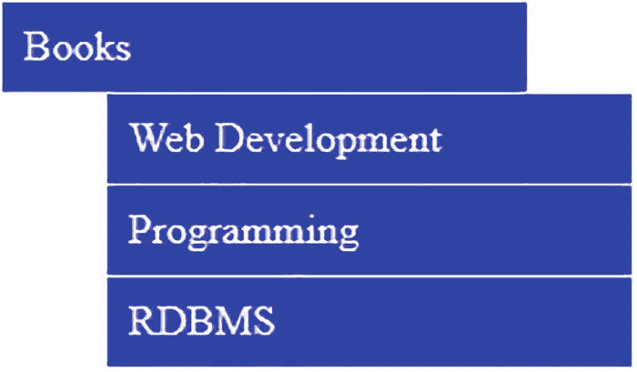

图 5-2

包含三个菜单项的“书籍”菜单

当你将鼠标悬停在任一菜单项上时，其背景颜色变为黑色，如图 5-3 所示。

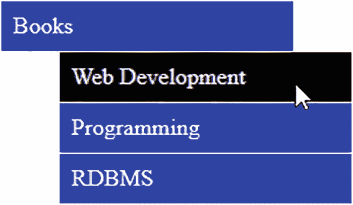

图 5-3

当鼠标悬停在菜单项上时，该菜单项会高亮显示

## 5.3 创建上下文菜单

### 问题

您希望显示一个包含几个菜单项的菜单。当鼠标悬停在某个菜单项上时(鼠标指针在其上移动)，您希望显示与其相关的信息，并且还希望突出显示该菜单项。当单击菜单项时，用户被发送到相关的网站。

### 解决办法

创建一个 HTML 文件来表示菜单标题 **Books** 以及三个菜单项。您在两个无序列表的帮助下创建菜单及其三个菜单项，一个列表嵌套在另一个列表中。列表项包含代表菜单项的锚元素，并引用目标网站 [`http://example.com`](http://example.com) ，用户在选择任何菜单项时被发送到该目标网站(这是一个假想的网站)。此外，你要把三个菜单项的信息写在三个段落中。HTML 文件如下所示:

**上下文相关. html**

```js
<!DOCTYPE html PUBLIC "-//W3C//DTD XHTML 1.0 Transitional//EN"
        "http://www.w3.org/TR/xhtml1/DTD/xhtml1-transitional.dtd">

<html xmlns:="http://www.w3.org/1999/xhtml" xml:lang="en" lang="en">
  <head>
    <meta http-equiv="Content-Type" content="text/html; charset=utf-8"/>
    <title></title>
    <link rel="stylesheet" href="stylehover.css" type="text/css" media="screen" />
    <script src="jquery-3.5.1.js" type="text/javascript"></script>
    <script src="contextualjq.js" type="text/javascript"></script>
  </head>
  <body>
     <table>
          <td>
               <ul>
                         <li><a href="http://example.com">Books</a>
                         <ul>
                                <li><a href="http://example.com" id="webd">Web Development</a></li>
                                <li><a href="http://example.com" id="pgmng">Programming</a></li>
                                <li><a href="http://example.com" id="datab">RDBMS</a></li>
                         </ul>

                    </li>
                  </ul>
          </td>
          <td valign="top">
               <p class="web" >The wide range of books that includes how Web development can be done with ASP.NET, PHP, JSP etc.</p>
               <p class="prog" >The wide range of books that includes developing Programming skills in C, C++, Java etc.</p>
               <p class="rdbms" >The wide range of books that includes how Data Base Management is done via Oracle, MySQL, SQL Server etc.</p>
          </td>
     </table>
</body>

```

要使菜单显示在左侧，内容显示在右侧，您需要制作一个表格，将菜单放在表格的第一列，将包含相关菜单项信息的段落放在表格的第二列。

为了给无序列表元素一个菜单的外观，您需要对所有三个元素应用特定的样式:`<u>, <li>`和`<a>`。您在样式表文件中编写它们的类型选择器，以便其中的属性可以自动应用于这三个元素。样式表文件如下所示:

style hover . CSS

```js
ul {
     width: 200px;
}

ul li ul {
     list-style-type:none;
     margin: 5;
     width: 200px;
}

a {

     display:block;
     border-bottom: 1px solid #fff;
     text-decoration: none;
     background: #00f;
     color: #fff;
     padding: 0.5em;
}

li {
     display:inline;
}

.hover {
     background: #000;
}

```

显示悬停菜单项信息的 jQuery 代码如下:

**语境 jq.js**

```js
$(document).ready(function() {
     $('.web').hide();
       $('.prog').hide();
       $('.rdbms').hide();

     $('#webd').hover(function(event){
          $('.web').show();
              $('.prog').hide();
              $('.rdbms').hide();
              $('#webd').addClass('hover');
     }, function(){
             $('#webd').removeClass('hover');
       });

       $('#pgmng').hover(function(event){
              $('.web').hide();
              $('.prog').show();
              $('.rdbms').hide();
              $('#pgmng').addClass('hover');
     }, function(){

          $('#pgmng').removeClass('hover');
       });

       $('#datab').hover(function(event){
              $('.web').hide();
              $('.prog').hide();
              $('.rdbms').show();
              $('#datab').addClass('hover');
     }, function(){
          $('#datab').removeClass('hover');
       });
});

```

### 它是如何工作的

在样式表文件中，类型选择器`ul`包含设置为`200px`的`width`属性，以定义菜单标题**书籍**的宽度。类型选择器`ul li ul`应用于菜单项。它包含设置为`none`的`list-style-type`属性，以从无序列表元素中移除传统的项目符号。`margin`属性被设置为`5`以使菜单项与菜单标题相比显得有点缩进。将`width`属性设置为`200px`来定义菜单项的宽度，以容纳所有内容。类型选择器`a`包含设置为`block`的显示属性，以使锚元素显示为一个块，而不是单个元素。将`border-bottom`属性设置为`1px solid #fff`以使 1px 的纯白边框出现在每个锚点元素的下方(作为分隔符)。将`text-decoration`属性设置为`none`以移除通常出现在超链接下方的传统下划线。所有锚定元素的背景色设置为蓝色，前景色设置为白色。将`padding`属性设置为`.5em`(即默认字体大小的 50%)来定义锚文本与其边框之间的间距。

类型选择器`li`被设置为`inline`以移除列表项之间的任何空白。

CSS 类`.hover`包含 background 属性，当用户点击菜单项(锚元素)时，将它的背景颜色设置为黑色。

#### jQuery 代码的含义

最初，您隐藏存储在(相应菜单项的)所有三个段落中的信息。也就是说，您隐藏了存储在类别`web`、`prog`和`rdbms`的三个段落中的信息，因为只有当相关菜单项被悬停时才会显示它们。

然后将一个悬停事件附加到第一个菜单项 **Web Development** (即 id 为`webd`的锚元素)。在悬停事件的第一个事件处理函数(当该菜单项被悬停时执行)中，您将类`web`的段落(包含关于 **Web 开发**的信息)设置为可视模式，向用户显示与 Web 开发书籍相关的信息。您隐藏了其余的段落元素。也就是说，类`prog`和`rdbms`的段落元素是隐藏的。此外，将样式规则`.hover`(在样式表中定义)中定义的属性应用于悬停的菜单项以高亮显示它，并删除悬停事件的第二个事件处理函数中的`hover`样式规则，当鼠标指针离开菜单项时执行该函数。

将一个悬停事件附加到第二个菜单项 **Programming** (即 id 为`pgmng`的锚元素)。在悬停事件的第一个事件处理函数(当该菜单项被悬停时执行)中，您将类`prog`的段落(包含关于**编程**主题的信息)设置为可视模式，向用户显示与编程书籍相关的信息。您隐藏了其余的段落元素。也就是说，类`web`和`rdbms`的段落元素是隐藏的。此外，将样式规则`.hover`(在样式表中定义)中定义的属性应用于悬停的菜单项以高亮显示它，并删除悬停事件的第二个事件处理函数中的`hover`样式规则，当鼠标指针离开菜单项时执行该函数。

最后，将一个悬停事件附加到第三个菜单项 **RDBMS** (即 id `datab`的锚元素)。在 hover 事件的第一个事件处理函数(当这个菜单项被悬停时执行)中，您将类`rdbms`的段落(包含关于 **RDBMS** 主题的信息)设置为可视模式，向用户显示与 RDBMS 上的书籍相关的信息。您隐藏了其余的段落元素。也就是说，类`web`和`prog`的段落元素是隐藏的。您还可以将样式规则`.hover`(在样式表中定义)中定义的属性应用于悬停的菜单项，以高亮显示它并移除。`hover`鼠标指针离开菜单项时执行的悬停事件的第二个事件处理函数中的样式规则。

在执行上面的 jQuery 代码时，您将得到一个菜单以及其中的三个菜单项。当您将鼠标悬停在任何菜单项上时，该菜单项将被高亮显示，并显示与之相关的信息，如图 5-4 所示。

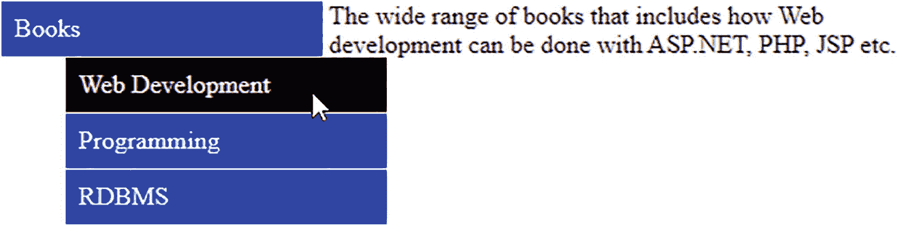

图 5-4

该菜单项在悬停时保持高亮显示，并显示相关信息

## 5.4 使用访问键创建导航菜单

### 问题

您希望显示一个包含几个菜单项的菜单。您希望显示菜单项的访问键。访问键代表菜单项的快捷键。此外，您希望当任何菜单项被悬停时，显示与之相关的信息。在两种情况下都必须显示信息，当菜单项被悬停时以及当任何菜单项的访问键被按下时。当用户点击一个菜单项时，它们应该被发送到相关的网站。

### 解决办法

创建一个 HTML 文件来表示菜单标题 **Books** 以及三个菜单项。您可以在一个无序列表的帮助下创建菜单及其三个菜单项。列表项包含表示菜单项的锚元素。另外，你要把三个菜单项的信息写在三段中。为了使菜单项的字符(您希望表示为访问键)显示为下划线，您将它嵌套在类`hot`的 span 元素中。HTML 文件可能如下所示:

**Navigationmenu.html**

```js
<!DOCTYPE html PUBLIC "-//W3C//DTD XHTML 1.0 Transitional//EN"
        "http://www.w3.org/TR/xhtml1/DTD/xhtml1-transitional.dtd">

<html xmlns:="http://www.w3.org/1999/xhtml" xml:lang="en" lang="en">
  <head>
    <meta http-equiv="Content-Type" content="text/html; charset=utf-8"/>
    <title></title>
    <link rel="stylesheet" href="stylehover.css" type="text/css" media="screen" />
    <script src="jquery-3.5.1.js" type="text/javascript"></script>
    <script src="navigationjq.js" type="text/javascript"></script>
  </head>
  <body>
     <table>
          <td>
               <ul>
                     <li><a href="http://example.com">Books</a>
                          <ul>
                                 <li><a href="http://example.com" id="webd"><span class="hot">W</span>eb
                                   Development</a></li>
                                <li><a href="http://example.com" id="pgmng"><span class="hot">P</span>
                                    rogramming</a></li>
                                <li><a href="http://example.com" id="datab" ><span class="hot">R</span>DBMS</a></li>
                       </ul>
                 </li>
             </ul>
          </td>
          <td valign=top>
               <p class='web' >The wide range of books that includes how Web development can be done with ASP.NET, PHP, JSP etc.</p>
               <p class='prog' >The wide range of books that includes developing Programming skills in C, C++, Java etc.</p>
               <p class='rdbms' >The wide range of books that includes how Data Base Managemenet is done via Oracle, MySQL, Sql Server etc.</p>
          </td>
     </table>
</body>
</html>

```

为了给无序列表元素一个菜单的外观，您需要对所有三个元素应用特定的样式:`<u>, <li>`和`<a>.`您在样式表文件中编写它们的类型选择器，以便其中的属性可以自动应用到这三个元素。样式表文件可能如下所示:

style hover . CSS

```js
ul {
       width: 200px;
}

ul li ul {
       list-style-type:none;
       margin: 5;
       width: 200px;
}

a {
     display:block;
       border-bottom: 1px solid #fff;
       text-decoration: none;
     background: #00f;
       color: #fff;
     padding: 0.5em;
}

li {
     display:inline;
}

.hover {
       background: #000;
}

.hot{
     text-decoration:underline;
}

```

下面的 jQuery 代码显示了按下访问键或悬停时菜单项的信息。此外，悬停的菜单项通过应用某些样式规则来突出显示。

导航 jq.js

```js
$(document).ready(function() {
     $('.web').hide();
     $('.prog').hide();
     $('.rdbms').hide();

     $('body').keypress(function(event){
     if(String.fromCharCode(event.keyCode)=="w" || String.fromCharCode(event.keyCode)=="W")
     {
          $('#webd').hover();
     }
     if(String.fromCharCode(event.keyCode)=="p" || String.fromCharCode(event.keyCode)=="P")
     {
              $('#pgmng').hover();
     }
     if(String.fromCharCode(event.keyCode)=="r" || String.fromCharCode(event.keyCode)=="R")
     {
              $('#datab').hover();
     }
});

     $('#webd').hover(function(event){
          $('.web').show();
              $('.prog').hide();
              $('.rdbms').hide();
             $('#webd').addClass('hover');
     }, function(){
          $('#webd').removeClass('hover');
     });

       $('#pgmng').hover(function(event){

          $('.web').hide();
              $('.prog').show();
              $('.rdbms').hide();
              $('#pgmng').addClass('hover');
          }, function(){
               $('#pgmng').removeClass('hover');
     });

     $('#datab').hover(function(event){
          $('.web').hide();
              $('.prog').hide();
              $('.rdbms').show();
              $('#datab').addClass('hover');
          }, function(){
               $('#datab').removeClass('hover');
     });
});

```

### 它是如何工作的

在 HTML 文件中，注意锚元素的第一个字符被突出显示，并作为访问键。因此，锚元素 **Web Development** 的访问键被设置为字符 W，这样只需按下字符 W(或 W)就可以直接访问该菜单项。为了让用户知道 w 是访问键，需要给它加下划线。为了给菜单项 **Web Development** 的 W 加下划线，您将它嵌套在 span 元素中，并将类名`hot`分配给 span 元素，以便在样式表文件中识别它。类似地，您希望表示为访问键的所有字符都嵌套在类`hot`的 span 元素中。

此外，要使菜单显示在左侧，内容显示在右侧，可以制作一个表格，将菜单放在表格的第一列，将包含相关菜单项信息的段落放在表格的第二列。

在样式表文件中，类型选择器`ul`包含设置为`200px`的`width`属性，以定义菜单标题**书籍**的宽度。类型选择器`ul li ul`应用于菜单项。它包含设置为值`none`的`list-style-type`属性，以从无序列表元素中移除传统的项目符号。`margin`属性被设置为`5`以使菜单项与菜单标题相比显得有点缩进。将`width`属性设置为`200px`来定义菜单项的宽度，以容纳所有内容。

类型选择器`a`包含设置为值`block`的显示属性，以使锚元素显示为一个块，而不是单个元素。将`border-bottom`属性设置为值`1px solid #fff`，使一个纯白的 1px 边框出现在每个锚元素的下面(作为分隔符)。将`text-decoration`属性设置为`none`，以移除通常出现在超链接下方的传统下划线。所有锚定元素的背景色设置为蓝色，前景色设置为白色。将`padding`属性设置为`.5em`(即默认字体大小的 50%)来定义锚文本与其边框之间的间距。

类型选择器`li`被设置为`inline`以移除列表项之间的任何空白。

CSS 类`.hover`包含背景属性，当用户点击菜单项(锚元素)时，将它的背景颜色设置为黑色。

CSS 类`.hot`包含设置为`underline`的`text-decorate`属性，以使每个菜单项的所有访问字符(嵌套在类`hot`的 span 元素中)显示为下划线。

在 jQuery 代码中，最初所有三个段落元素都是隐藏的，因为您希望仅在按下任何访问键或悬停在任何菜单项上时才显示相关信息。您还可以在 HTML 文件的主体上附加一个 keypress 事件，以检测是否按下了任何键。如果发生任何按键事件，您可以使用条件语句来检查按下的键是否是下列字符中的任何一个:W、W、P、P、r 或 r。如果按下了上述任何一个字符，您将调用相应锚元素上的悬停事件。因此，如果按下字符 W 或 W，就会调用锚元素**Web Development**(id 为`webd`的锚元素)上的悬停事件来显示相关信息。您还可以将悬停事件附加到所有三个菜单项。您知道悬停事件包括两个事件处理函数。在悬停事件的第一个事件处理函数(当该菜单项被悬停时执行)中，您将包含相关信息的段落设置为`visible`模式，显示所需的信息。您隐藏了其余的段落元素。此外，将样式规则`.hover`(在样式表中定义)中定义的属性应用于悬停的菜单项以高亮显示它，并删除悬停事件的第二个事件处理函数中的`hover`样式规则，当鼠标指针离开菜单项时执行该函数。

在执行时，三个菜单项中的每一个都会显示出它们各自的访问键(以下划线突出显示)，如图 5-5 所示。当按下访问键或悬停在菜单项上时，将显示与之相关的信息，如图 5-4 所示。

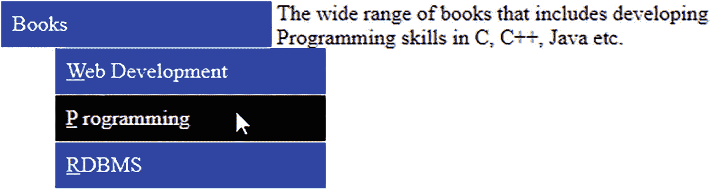

图 5-5

访问键显示为下划线的菜单项

## 5.5 右键单击时创建上下文菜单

### 问题

你想显示一段文字，当你右击它时，你想在屏幕上出现一个上下文菜单。此外，您希望上下文菜单的菜单项具有悬停效果(即，当鼠标指针移动到菜单项上时，菜单项会高亮显示)。按下 Esc 键时，您希望上下文菜单消失。

### 解决办法

制作一个 HTML 文件，包含一个段落元素和一个无序的菜单列表。无序列表的列表项表示菜单标题和菜单项。菜单项以嵌套在列表项中的锚元素的形式编写。锚元素指向一个名为 [`http://example.com`](http://example.com) 的假想网站，如果点击任何菜单项，用户都会被导航到这个网站。HTML 文件可能如下所示:

**Contextrightclick.html**

```js
<!DOCTYPE html PUBLIC "-//W3C//DTD XHTML 1.0 Transitional//EN"
        "http://www.w3.org/TR/xhtml1/DTD/xhtml1-transitional.dtd">

<html xmlns:="http://www.w3.org/1999/xhtml" xml:lang="en" lang="en">
  <head>
    <meta http-equiv="Content-Type" content="text/html; charset=utf-8"/>
    <title></title>
    <link rel="stylesheet" href="stylehover.css" type="text/css" media="screen" />
    <script src="jquery-3.5.1.js" type="text/javascript"></script>
    <script src="contextrightjq.js" type="text/javascript"></script>
  </head>
  <body oncontextmenu="return false">
     <p class="info">
          Books are the world of information. As said the books are the best friends. A wise man always has a library of several books</p>
     <ul id="contextmenu">
          <li><a href="http://example.com">Books</a>
               <ul>

                    <li><a href="http://example.com">Web Development</a></li>
            <li><a href="http://example.com">Programming</a></li>
            <li><a href="http://example.com">RDBMS</a></li>
               </ul>
          </li>
     </ul>
  </body>
</html>

```

您需要在样式表中定义一些样式规则，使无序列表具有菜单的形状，并且在鼠标指针悬停在菜单项上时突出显示菜单项。样式表中的样式规则可能如下所示:

style hover . CSS

```js
ul {
       width: 200px;
}

ul li ul {
       list-style-type:none;
       margin: 5;
       width: 200px;
}

a {
     display:block;
       border-bottom: 1px solid #fff;
       text-decoration: none;
     background: #00f;
       color: #fff;
     padding: 0.5em;
}

li {
     display:inline;
}

.hover {

       background: #000;
}

```

最初隐藏菜单并在用户在段落元素上单击鼠标右键时显示菜单的 jQuery 代码如下所示。当按下 Esc 键时，jQuery 代码还会使上下文菜单消失。

**context tjq . js**的缩写形式

```js
$(document).ready(function() {
     $('#contextmenu').hide();
     $('.info').mousedown(function(event){
          if(event.button==2){
               $('#contextmenu').show();
      $('#contextmenu').css({'position': 'absolute', 'left':event.screenX,
                    'top':event.screenY-70});
          }
     });
       $('a').hover(function(event){
          $(this).addClass('hover');
          },function(){
               $(this).removeClass('hover');
     });
     $('body').keypress(function(event){
          if(event.keyCode==27)
          {
            $('#contextmenu').hide();
          }
       });
});

```

### 它是如何工作的

显示上下文菜单时的常见问题是，当您右键单击段落元素以显示上下文菜单时，浏览器的上下文菜单也会与您的上下文菜单一起作为默认菜单出现。为了禁用默认的浏览器上下文菜单，在 body 元素中使用属性`oncontextmenu="return false"`。paragraph 元素被赋予一个类名`info`，以便在选择器的帮助下在 jQuery 中访问它。用于显示上下文菜单的无序列表被分配了 id `contextmenu`。您可以看到无序列表的第一个列表项表示文本 **Books** (它将作为菜单标题)。这个列表项本身将包含一个无序列表，它将代表菜单项。

在样式表文件中，类型选择器`ul`包含设置为`200px`的`width`属性，以定义菜单标题**书籍**的宽度。类型选择器`ul li ul`应用于菜单项。它包含设置为`none`的`list-style-type`属性，以从无序列表元素中移除传统的项目符号。`margin`属性被设置为`5`以使菜单项与菜单标题相比显得有点缩进。将`width`属性设置为`200px`来定义菜单项的宽度，以容纳所有内容。

类型选择器`a`包含设置为`block`的显示属性，以使锚元素显示为一个块，而不是一个单独的元素。将`border-bottom`属性设置为`1px solid #fff`以使 1px 的纯白边框出现在每个锚点元素的下方(作为分隔符)。将`text-decoration`属性设置为`none`，以移除通常出现在超链接下方的传统下划线。所有锚定元素的背景色设置为蓝色，前景色设置为白色。将`padding`属性设置为`.5em`(即默认字体大小的 50%)来定义锚文本与其边框之间的间距。

类型选择器`li`被设置为`inline`以移除列表项之间的任何空白。

CSS 类`.hover`包含背景属性，当用户点击菜单项(锚元素)时，将它的背景颜色设置为黑色。

在 jQuery 代码中，首先隐藏由 id `contextmenu`的无序列表表示的菜单。

然后检查鼠标按钮是否按在了类`info`的段落元素上。回想一下，您已经将类名`info`分配给了 HTML 文件中的段落元素。

如果已经按下，检查按下的鼠标按钮是否是鼠标右键。`event`对象的`button`属性包含按下鼠标左键时的值`1`和按下鼠标右键时的值`2`。

如果是鼠标右键，就可以在屏幕上看到由 id `contextmenu`的无序列表元素表示的菜单。

使用`css()`方法，让上下文菜单出现在由代表鼠标按钮被按下的位置的`event`对象的`screenX`和`screenY`属性指定的位置。您从存储在`screenY`属性中的坐标值中减去 70，使上下文菜单看起来更靠近段落(也就是说，您减少了菜单位置和段落之间的距离)。

此外，将`hover()`事件附加到锚元素(菜单和菜单项)。当鼠标指针移动到任何菜单项上时，将在样式表文件中定义的样式规则`.hover`中定义的样式属性应用于锚元素(使菜单项的背景颜色变成黑色)。样式规则`.hover`中的样式属性将从锚元素中移除，使其保持鼠标指针离开菜单项时的初始状态。

最后，将一个 keypress 事件附加到 body 元素，以检测是否按下了任何键。如果按下任何一个键，就检查是不是 Esc 键(Esc 键的键码是 27)。如果按下 Esc 键，将隐藏上下文菜单。

在段落文本上单击鼠标右键，屏幕上将出现上下文菜单。菜单中的菜单项会有悬停效果，如图 5-6 所示。

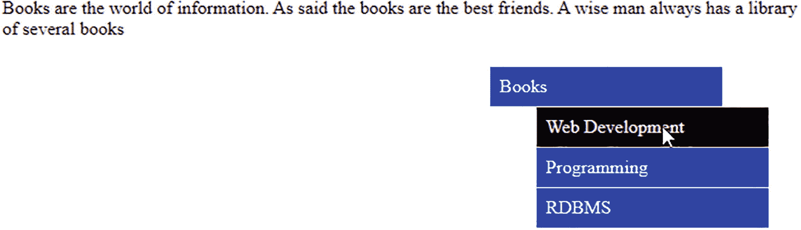

图 5-6

右键单击段落文本时会出现上下文菜单

## 5.6 创建两个带有独立菜单项的菜单

### 问题

您希望显示两个菜单，每个菜单都有各自的菜单项。您还希望在菜单及其项目上有悬停效果。

### 解决办法

创建一个 HTML 文件来表示两个菜单标题及其菜单项。您可以借助无序列表来做到这一点，一个列表嵌套在另一个列表中。

**创建.html**

```js
<!DOCTYPE html PUBLIC "-//W3C//DTD XHTML 1.0 Transitional//EN"
        "http://www.w3.org/TR/xhtml1/DTD/xhtml1-transitional.dtd">

<html xmlns:="http://www.w3.org/1999/xhtml" xml:lang="en" lang="en">
  <head>
    <meta http-equiv="Content-Type" content="text/html; charset=utf-8"/>
    <title></title>
    <link rel="stylesheet" href="styletwomenu.css" type="text/css" media="screen" />
    <script src="jquery-3.5.1.js" type="text/javascript"></script>
    <script src="twomenujq.js" type="text/javascript"></script>
  </head>
  <body>
     <ul id="dropdownmenu">
        <li class="mainmenu">
          <a href="example.com">Books</a>
           <ul>
                 <li><a href="example.com">Web Development</a></li>
                 <li><a href="example.com">Programming</a></li>
                 <li><a href="example.com">RDBMS</a></li>
           </ul>
        </li>
         <li class="mainmenu">
           <a href="example.com">Movies</a>
              <ul>
                 <li><a href="example.com">Latest Movie Trailers</a></li>
                 <li><a href="example.com">Movie Reviews</a></li>
                 <li><a href="example.com">Celebrity Interviews</a></li>
               </ul>
          </li>
    </ul>
</body>
</html>

```

您可以在这段代码中看到一个 id 为`dropdownmenu`的无序列表，其中有两个列表项被分配了类名`mainmenu`。这两个列表项代表菜单**书籍**和**电影**。这两个列表项依次由无序列表组成，每个列表包含三个元素。 **Books** 菜单有三个列表项: **Web 开发**、**编程**和 **RDBMS** 。类似地，列表项**电影**由三个元素的无序列表组成:**最新电影预告片**、**电影评论**和**名人访谈**。

要将样式应用于无序列表，使它们具有两个菜单和菜单项的外观，请参见下面的样式表文件:

style menu . CSS

```js
.mainmenu {float:left; width:220px; list-style-type:none; margin-right:5px;}
li.mainmenu ul {margin: 0;  }
a  {width: 200px;display:block; text-decoration: none; background: #00f;  color: #fff;padding: 0.5em;   border-bottom: 1px solid #fff; }
ul#dropdownmenu li a:hover {  background: #000;}
ul{ margin: 0; list-style: none; }

```

当鼠标指针移动到相应的菜单标题上时，显示两个菜单项中的一个菜单项的 jQuery 代码如下:

**你的菜单 q.js**

```js
$(document).ready(function(){
  $('li.mainmenu').hover(
    function() {
      $('ul', this).show();
    },
    function() {
      $('ul', this).hide();
    }
  );
});

```

### 它是如何工作的

在样式表文件中，类选择器`.mainmenu`包含自动应用于两个菜单标题 **Books** 和 **Movies** 的属性。它包含设置为`left`的`float`属性，以使第一个菜单标题在浏览器窗口中向左浮动(为第二个菜单标题在其右侧显示留出空间)。将`width`属性设置为`220px`，使菜单标题的宽度为 220 像素。`margin–right`属性被设置为`5px`以在两个菜单标题之间创建 5px 的间距。

类型选择器`li.mainmenu ul`包含自动应用于无序列表的样式属性，该列表嵌套在类`.mainmenu`的列表项中(即，作为带有文本**书籍**和**电影**的列表项的菜单项的无序列表)。它包含的属性是一个设置为 0 值的`margin`属性，用于制作无序列表的列表项(菜单项如 **Web 开发**、**编程**等)。在这两个菜单标题中，**书籍**和**书籍**一个接一个出现(左侧没有任何层次间隙)。

类型选择器`a`包含应用于所有锚元素的属性(即，应用于菜单以及所有菜单项)。将`width`属性设置为`200px`来指定每个菜单项的宽度。将`display`属性设置为`block`以使锚元素作为一个独立的块，`text-decoration`属性设置为`none`以从超链接中移除传统的下划线，`background`属性将菜单标题和菜单项的背景色设置为蓝色，`color`属性将菜单(菜单标题和菜单项)上的文本的前景色设置为白色。将`padding`属性设置为`.5em`以在菜单文本及其边框之间创建默认字体大小的 50%的间距。将`border-bottom`属性设置为`1px solid #fff`以在每个锚元素下创建一条 1px 的白色实线，作为菜单项之间的分隔符。

类型选择器`ul#dropdownmenu li a:hover`包含样式属性，当鼠标悬停在菜单标题和菜单项上时，该属性将自动应用于它们。它包含 background 属性，当鼠标指针移动到菜单标题和菜单项上时，该属性将它们的背景色更改为黑色。

您可以在 jQuery 代码中看到，当鼠标指针移动到类`mainmenu`的列表项上时(即，在任何菜单标题上)，将显示嵌套在该列表项中的无序列表(包含菜单项)。将鼠标指针从菜单标题上移开会使其菜单项不可见，因为该列表项的无序列表被设置为隐藏模式。

最初会出现两个菜单标题，如图 5-7 所示。


图 5-7

两个菜单标题，书籍和电影

将鼠标指针移动到菜单标题 **Books** 上，其菜单项(嵌套在带有文本 **Books** 的列表项内的无序列表)将显示如图 5-8 所示。

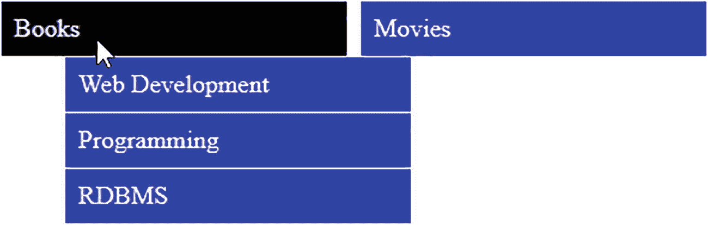

图 5-8

“书籍”菜单的菜单项以悬停效果显示

将鼠标指针移动到菜单标题**电影**上，其菜单项将被显示，菜单标题**书籍**的菜单项将不可见，如图 5-9 所示。

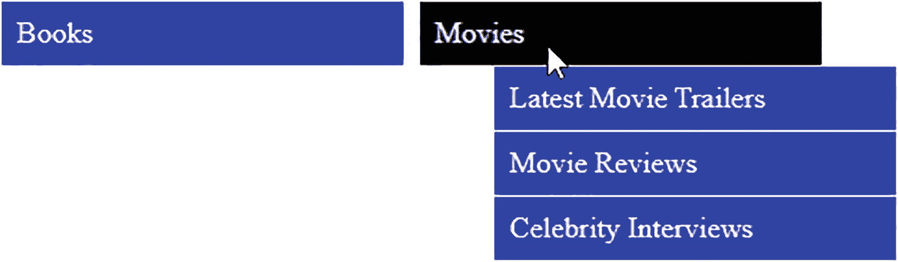

图 5-9

具有悬停效果的电影菜单的菜单项

## 5.7 创建两个带有子菜单项的菜单

### 问题

您希望显示两个菜单，每个菜单都有菜单项，并将子菜单项附加到几个菜单项。您还希望在菜单、菜单项和子菜单项上有悬停效果。

### 解决办法

创建一个 HTML 文件来表示两个菜单标题及其菜单项。您还将定义子菜单项。您可以借助无序列表来做到这一点，一个列表嵌套在另一个列表中。HTML 文件可能如下所示:

**Twomenuwithsub.html**

```js
<!DOCTYPE html PUBLIC "-//W3C//DTD XHTML 1.0 Transitional//EN"
        "http://www.w3.org/TR/xhtml1/DTD/xhtml1-transitional.dtd">

<html xmlns:="http://www.w3.org/1999/xhtml" xml:lang="en" lang="en">
  <head>

    <meta http-equiv="Content-Type" content="text/html; charset=utf-8"/>
    <title></title>
    <link rel="stylesheet" href="styletwomenusub.css" type="text/css" media="screen" />
    <script src="jquery-3.5.1.js" type="text/javascript"></script>
    <script src="twomenuwithsubjq.js" type="text/javascript"></script>
  </head>
<body>

     <ul class="dropdown">
          <li><a href="http://example.com">Books</a>
               <ul>
                    <li><a href="http://example.com">Programming</a></li>
                    <li><a href="http://example.com">Web Development</a>
                         <ul>
                              <li><a href="http://example.com">.Net</a></li>
                              <li><a href="http://example.com">JSP</a></li>
                         </ul>
                    </li>
                    <li><a href="http://example.com">RDBMS</a></li>
                    <li><a href="http://example.com">Web Services</a></li>
                    <li><a href="http://example.com">Open Source</a></li>
               </ul>
          </li>
          <li><a href="http://example.com">Movies</a>
               <ul>
                    <li><a href="http://example.com">Movie Reviews</a></li>
                    <li><a href="http://example.com">Celebrity Interviews</a></li>
                    <li><a href="http://example.com">Latest Hollywood Movies</a>
                         <ul>
                              <li><a href="http://example.com">Arnold Schwarzenegger</a></li>
                              <li><a href="http://example.com">Sylvester Stallone</a></li>
                              <li><a href="http://example.com">Bruce Willis</a></li>
                         </ul>
                    </li>
                    <li><a href="http://example.com">Action Movies</a>
                         <ul>
                              <li><a href="http://example.com">Casino Royale</a></li>
                              <li><a href="http://example.com">Rambo III</a></li>
                         </ul>
                    </li>
                    <li><a href="http://example.com">Comedy Movies</a></li>
               </ul>
          </li>
     </ul>
  </body>
</html>

```

要分配给无序列表以使其以菜单标题、菜单项和子菜单项的形式出现的样式属性如下:

**styletwmenusub . CSS**

```js
a{ text-decoration: none; color:#000;}
ul{margin:0; list-style: none; }
ul.dropdown li {float: left;  background: cyan; }
ul.dropdown a:hover {background: #0f0; color: #00f; }
ul.dropdown li a {display: block; padding: 4px; border-right: 1px solid #000; }
ul.dropdown ul {width:150px; visibility: hidden; position: absolute;  }
ul.dropdown ul li {background: yellow; border-bottom: 1px solid #000; width:100%; }
ul.dropdown ul li a { border-right: none; width:100%; }
ul.dropdown ul ul {left:100%; width:100%;top: 0; }
.hover {position: relative; }

```

用于使菜单项和子菜单出现在屏幕上的 jQuery 代码如下:

**Twomenuwithsubjq.js**

```js
$(document).ready(function(){
     $("ul.dropdown li").hover(function(){
       $(this).addClass("hover");
               $('ul:first',this).css('visibility', 'visible');
          }, function(){
                $(this).removeClass("hover");
               $('ul:first',this).css('visibility', 'hidden');
     });
      $("ul.dropdown li ul li:has(ul)").find("a:first").append("  >");
});

```

### 它是如何工作的

在 HTML 文件中，创建了一个无序列表，并为其分配了类名`dropdown`。它包含两个列表项，文本指定为**书籍**和**电影**。这两个列表项依次包含被赋予类名`submenu`的无序列表项。**书籍**列表项的无序列表包含五个列表项:**编程**、 **Web 开发、RDBMS、Web 服务、**和**开源**。在这些列表项中， **Web 开发**包含一个无序列表来表示名为**的子菜单项。Net** 和 **JSP** 。

类似地，包含在**电影**列表项中的无序列表包含四个列表项:**电影评论、名人访谈、最新好莱坞电影**和**动作片**。在这些列表项中，**最新好莱坞电影**包含一个无序列表来表示名为**阿诺德·施瓦辛格、**西尔维斯特·史泰龙和**布鲁斯·威利斯**的子菜单项。同样，列表项**动作电影**包含一个无序列表来表示子菜单项**皇家赌场、兰博 III** 和**喜剧电影**。

在样式表文件中，类型选择器`a`将属性`text-decoration`设置为值`none`，以从所有锚元素(即，从菜单标题、菜单项和子菜单项)中移除传统下划线，并将`color`属性设置为黑色，以使所有菜单上的文本以黑色显示。

类型选择器`ul`包含设置为`0`的`margin`属性，以移除列表项左侧的层次边距，并使菜单项一个接一个地出现。属性`list-style`被设置为值`none`,以从无序列表中移除传统的项目符号。

在类型选择器`ul.dropdown li`中定义的样式被自动应用到属于类别`dropdown`的无序列表的列表项目中(即，应用到菜单标题**书籍**和**电影**)。将`float`属性设置为`left`以使一个菜单标题出现在浏览器窗口的左侧，为下一个菜单标题出现在其右侧创造空间。背景颜色设置为青色。

属性选择器`ul.dropdown a:hover`包含 background 和 color 属性，用于设置悬停在上面的锚元素(所有菜单项)的背景色和前景色，分别为绿色和蓝色。

类型选择器`ul.dropdown li a`包含样式属性，这些属性将应用于代表菜单标题**书籍**和**电影**的锚元素。它包含设置为`block`的`display`属性，以使锚元素作为独立的块元素，设置为`4px`的`padding`属性，以在菜单文本及其边框之间创建一些间距，以及设置为`1px solid #000`的`border-right`属性，以在每个菜单标题的右侧创建 1px 的黑色边框(以单独显示它们)。

类型选择器`ul.dropdown ul`包含将应用于包含菜单项的无序列表的样式。设置为`150px`的`width`属性使每个菜单项的宽度为 150px，设置为`hidden`的`visibility`属性隐藏整个菜单项块，仅当菜单标题悬停时才可见。设置为`absolute`的`position`属性使菜单项块出现在它们各自的菜单标题下。

类型选择器`ul.dropdown ul li`包含将应用于所有代表菜单项的列表项的属性。`background`属性将所有菜单项和子菜单项的背景色设置为黄色，`border-bottom`属性设置为`1px solid #000`以使每个菜单项下面出现一个 1px 的黑色边框来分隔它们。

类型选择器`ul.dropdown ul li a`包含应用于代表菜单项和子菜单项的所有锚元素的属性。将`border-right`属性设置为`none`来移除菜单项右边的边框，因为您将在菜单项的右边显示子菜单项。将`width`属性设置为`100%`,使锚元素占据所有分配的 200 像素宽度。

类型选择器`ul.dropdown ul ul`应用于表示子菜单项的无序列表。将`left`属性设置为`100%`，以使子菜单项出现在距离左侧 100%的位置(即，在菜单项的宽度之后)，否则它将与菜单项重叠。将`top`属性设置为`0`,使子菜单项与正在显示的子菜单项的距离(从浏览器的上边框)相同

样式规则`.hover`；通过 jQuery 代码应用于列表项，使子菜单项出现在相对于它们的菜单项的位置。

在开始理解 jQuery 代码之前，让我们先了解一下`:first`是做什么的，因为它用在了上面的代码中。

#### :首先

自定义选择器返回指定元素的第一个实例。

示例:

```js
$('p:first)

```

将返回第一个段落元素。

在上面的 jQuery 代码中，当鼠标指针移动到任何一个菜单标题、**书籍**或**电影**(id 为`dropdown`的无序列表的列表项)上时，样式表文件中定义的 CSS 类`.hover`的属性将应用于它，并且第一个无序列表(相应菜单标题的菜单项)也将处于可见模式。类似地，当任何菜单项被悬停时(具有子菜单项形式的无序列表)，该无序列表也将被显示(即，子菜单项将被显示)。当鼠标指针离开菜单项或菜单标题时，菜单项或子菜单项分别被隐藏。此外，对于所有嵌套了无序列表的列表项，符号>被附加到它的锚元素上，以表示它附加了子菜单项。

最初，两个菜单标题**书籍**和**电影**，如图 5-10 所示。

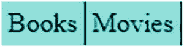

图 5-10

菜单标题:书籍和电影

将鼠标指针移动到菜单标题**书籍**上，其菜单项显示如图 5-11 所示。

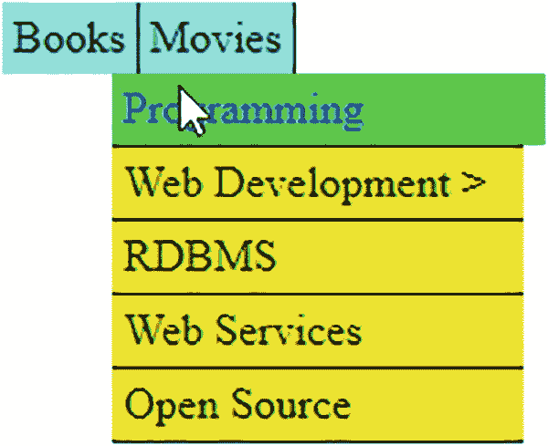

图 5-11

“书籍”菜单的菜单项(包含子菜单项的菜单项显示有一个>符号)

将鼠标指针移动到带有子菜单的菜单项上，将显示如图 5-12 所示的子菜单项。

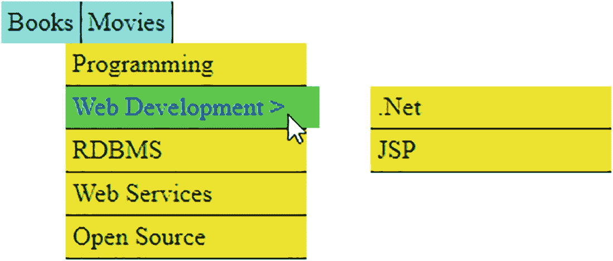

图 5-12

突出显示的“书籍”菜单的子菜单项

同样的事情也适用于第二个菜单标题，**电影**。当鼠标悬停在它上面时，它的菜单项将变得可见。同样，当鼠标悬停在该菜单项上时，会显示该菜单项的子菜单项，如图 5-13 所示。

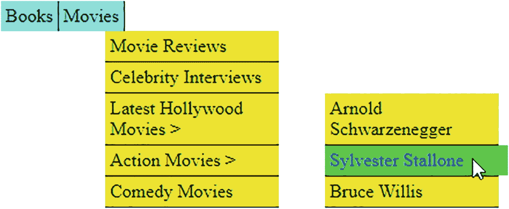

图 5-13

高亮显示的“电影”菜单的子菜单项

## 5.8 制作手风琴菜单

### 问题

您希望以折叠菜单的形式显示两个菜单(即，通过使用向上滑动或向下滑动技术，悬停在其上的菜单的菜单项将变得可见，而其他菜单标题的菜单项将变得不可见)。您还希望当鼠标指针离开两个菜单时，菜单项消失。

### 解决办法

让我们创建一个 HTML 文件来表示两个菜单标题及其菜单项。您可以借助一个无序列表来做到这一点，一个列表嵌套在另一个列表中。HTML 文件可能如下所示:

**make gation . html**

```js
<!DOCTYPE html PUBLIC "-//W3C//DTD XHTML 1.0 Transitional//EN"
        "http://www.w3.org/TR/xhtml1/DTD/xhtml1-transitional.dtd">

<html xmlns:="http://www.w3.org/1999/xhtml" xml:lang="en" lang="en">
  <head>
    <meta http-equiv="Content-Type" content="text/html; charset=utf-8"/>
    <title></title>
    <link rel="stylesheet" href="styleaccordion.css" type="text/css" media="screen" />
    <script src="jquery-3.5.1.js" type="text/javascript"></script>
    <script src="makingaccordionjq.js" type="text/javascript"></script>
  </head>
  <body>
       <p class="menus">Books</p>
         <div class="menuitems">
           <ul>
                 <li><a href="example.com">Web Development</a></li>
                 <li><a href="example.com">Programming</a></li>
                 <li><a href="example.com">RDBMS</a></li>
          </ul>
        </div>
       <p class="menus">Movies</p>
         <div class="menuitems">
           <ul>
                 <li><a href="example.com">Latest Movie Trailers</a></li>
                 <li><a href="example.com">Movie Reviews</a></li>
                 <li><a href="example.com">Celebrity Interviews</a></li>
           </ul>
         </div>
  </body>
</html>

```

要将这些样式应用到上面的无序列表中，使它们具有可折叠菜单的外观，请使用以下文件:

**style agreement . CSS**

```js
.menus{
     width: 200px;
     padding:5px;
     margin:1px;
     font-weight:bold;
     background-color: #0ff;
}

.menuitems{
     display:none;
}

a{
       display:block;
       border-bottom: 1px solid #fff;
       text-decoration: none;
     background: #00f;
       color: #fff;
       padding:10px;
       font-weight:bold;
     width: 190px;
}

.menuitems a:hover {
       background: #000;
}

li {
     display:inline;
}

ul{display:inline;}

```

jQuery 代码显示悬停菜单标题的菜单项，并以滑动效果隐藏另一个菜单标题(鼠标指针移开的位置)的菜单项，如下所示:

**make gacucionijq . js**

```js
$(document).ready(function() {
     $('p.menus').mouseout(function(){
          $("div.menuitems'").slideUp("slow");
          $('p').css({backgroundImage:""});
     });

       $('p.menus').mouseover(function(){
          $(this).css({'background-image':"url(down.png)", 'background-repeat':"no-repeat",
               'background-position':"right"}).next("div.menuitems").slideDown(500)
               .siblings("div.menuitems").slideUp("slow");
          $(this).siblings().css({backgroundImage:""});
     });
});

```

### 它是如何工作的

在 HTML 文件中，有两个类`menus`的段落元素，文本**书籍**和**电影**来表示两个菜单标题。每个段落元素后面跟着一个`menuitems`类的`div`元素，该元素包含一个无序列表，其中三个列表项分别代表每个菜单标题的菜单项。无序列表(text **Books** 的 paragraph 元素下面)有三个列表项: **Web 开发、**编程、 **RDBMS** 。类似地，名为**电影**的段落元素下面的无序列表有三个列表项:**最新电影预告片、电影评论**和**名人访谈**。

在样式表文件中，在类选择器`.menus`中定义的属性将自动应用于类`.menu`的段落元素，以赋予它们菜单标题的形状。将`width`属性设置为`200px`以将菜单标题定义为 200 像素宽，将`padding`属性设置为`5px`以在边框和菜单文本之间保留一些空间。`margin`属性被设置为`1px`以在两个菜单标题之间保持 1px 的间距。通过将代码`#0ff`应用于`background-color`属性，将`font-weight`属性设置为`bold`以使菜单标题以粗体显示，并将菜单标题的背景设置为青色。

类选择器`.menuitems`中的属性将自动应用于类`menuitems`的`div`元素。它包含设置为`none`的`display`属性，用于最初隐藏菜单项。

在类型选择器`a`中定义的属性将应用于所有锚元素(所有菜单项)。将`display`属性设置为`block`,使锚元素充当一个块。将`border bottom`属性设置为`1px solid #fff`,在每个锚元素下创建一条 1px 的白色实线来分隔所有菜单项。`text-decoration`属性被设置为`none`以从锚元素中移除传统的下划线。background 和 color 属性用于将菜单项的背景色和前景色分别设置为蓝色和白色。将`padding`属性设置为`10px`来定义菜单项文本和边框之间的间距。将`font-weight`属性设置为`bold`以使菜单项以粗体显示，将`width`属性设置为`190px`以使菜单项的宽度为 190px。

当鼠标指针悬停在菜单项上时，属性选择器`.menuitems a:hover`中定义的属性将自动应用于嵌套在类`menu element`的`div`元素中的锚元素。它包含使悬停菜单项的背景颜色变成黑色的背景属性。

类型选择器`li`包含设置为`inline`的 display 属性，用于移除列表项之间的任何间距。类似地，类型选择器`ul`将 display 属性设置为`inline`，以移除无序列表上下的空格

上述 jQuery 代码语句的含义如下:

您将 mouseout 事件附加到类`menus`的段落元素上(即，附加到菜单标题**书籍**和**电影**)。这样做的原因是，如果鼠标指针离开两个菜单，您希望隐藏菜单项。

然后将 mouseover 事件附加到类`menus`的段落元素上(即，附加到菜单标题**书籍**和**电影**)。

然后使用`.css()`方法显示一个指向悬停菜单标题的向下指针的图像(显示当前它处于展开模式)。将`background-repeat`属性设置为`no-repeat`以使其出现一次，将`background-position`属性设置为`right`以使向下指针出现在菜单标题的右端。

下一个元素(匹配选择器)的内容只不过是类`menuitems`的一个`div`元素(包含被悬停的段落元素的菜单项)，通过下滑效果变得可见，而其匹配选择器的兄弟元素(即另一个菜单标题的菜单项，如类`menuitems`的`div`元素)通过上滑效果变得不可见。

最后，从失去焦点的菜单项中移除背景图像。

在执行上述 jQuery 代码时，菜单标题将一个接一个地出现，如图 5-14 所示。

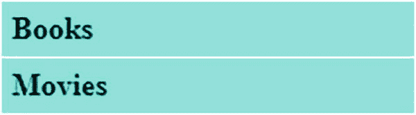

图 5-14

两个菜单标题，书籍和电影

将鼠标悬停在第一个菜单标题 **Books** 上，其菜单项将以下拉效果显示，如图 5-15 所示。您可以看到菜单标题上有一个向下的指针，表示它现在处于展开模式。此外，这些菜单项具有悬停效果(即，当鼠标指针移过它们时，它们会高亮显示)。

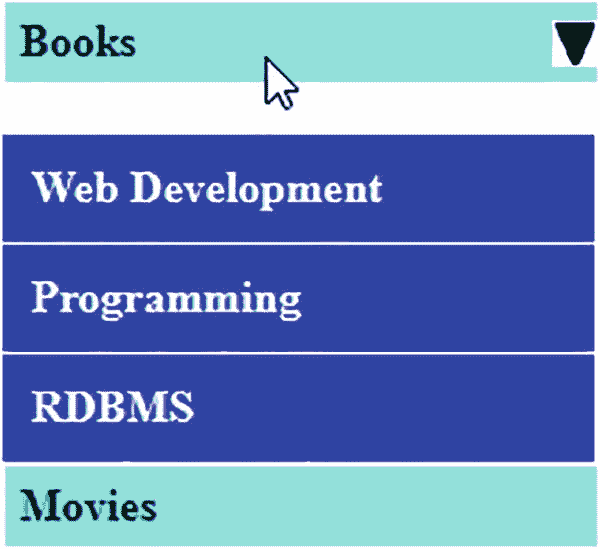

图 5-15

“书籍”菜单的菜单项以下拉效果出现

同样，将鼠标指针移动到另一个菜单标题上，如**电影**，你会看到它的菜单项出现，**书籍**菜单的菜单项消失，并带有上滑效果，如图 5-16 所示。

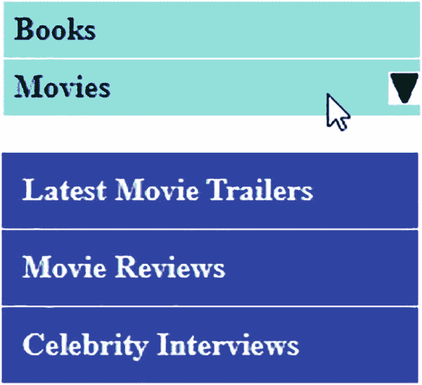

图 5-16

“电影”菜单的菜单项以下拉效果出现

## 5.9 制作动态可视化菜单

### 问题

你想制作一个弧形的标签导航菜单，它有三个菜单，分别叫做**书籍、电影**和**音乐**。您希望菜单选项卡具有悬停效果(当鼠标移动到它们上面时突出显示)。您还需要鼠标悬停时显示的菜单选项卡的相关信息。

### 解决办法

创建一个 HTML 文件来定义锚元素，文本**书籍、电影**和**音乐**嵌套在类`buttons`的 span 元素中。锚元素分别被赋予 id`booksbutton`、`moviesbutton`和`musicbutton`(通过 jQuery 代码访问)，并指向一个名为`example.com`的假想网站，如果菜单项被选中，用户将被发送到该网站。HTML 文件如下所示:

**dynamic display menu . html**

```js
<!DOCTYPE html PUBLIC "-//W3C//DTD XHTML 1.0 Transitional//EN"
        "http://www.w3.org/TR/xhtml1/DTD/xhtml1-transitional.dtd">

<html xmlns:="http://www.w3.org/1999/xhtml" xml:lang="en" lang="en">
  <head>
    <meta http-equiv="Content-Type" content="text/html; charset=utf-8"/>
    <title></title>
    <link rel="stylesheet" href="stylevisualmenu.css" type="text/css" media="screen" />
    <script src="jquery-3.5.1.js" type="text/javascript"></script>
    <script src="visualmenujq.js" type="text/javascript"></script>
  </head>
  <body>
       <span class="buttons"><a href="example.com" id="booksbutton"> Books </a></span>
       <span class="buttons"><a href="example.com" id="moviesbutton"> Movies </a> </span>
       <span class="buttons"><a href="example.com" id="musicbutton"> Music </a></span><br><br>
       <p class="books">Books of different subjects available at reasonable prices. Ranging from web development, programming languages and text books all are available at heavy discount. Shipping is free. Also available in stock the popular Magazines, E-books and Tutorial CDs at affordable prices.</p>
       <p class="movies">Find new movie reviews & latest hollywood movie news. Includes new movie trailers, latest hollywood releases, movie showtimes, entertainment news, celebrity interviews etc. Also find Hollywood actress, actor, videos biography, filmography, photos, wallpapers, music, jokes live tv channels at your doorsteps</p>
       <p class="music">Find music videos, internet radio, music downloads and all the latest music news and information. We have a large collection of music and songs classified by type, language and region. All downloads are streamed through RealAudio. You can also watch free music videos, tune in to AOL Radio, and search for your favorite music artists.</p>
  </body>
</html>

```

在 span 元素下面，您会发现三个段落元素，它们有三个不同的类名，分别被指定为`books`、`movies`和`music`。这些段落包含与三个菜单选项卡相关的信息。

对于这个解决方案，您需要两个选项卡图像。一个选项卡图像用于菜单选项卡的左侧，使其具有曲线斜率，如图 5-17 所示。

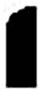

图 5-17

菜单选项卡左侧的图像

左侧图像以文件名`tabl.jpg`保存，菜单页签右侧图像以文件名`tabr.jpg`保存，如图 5-18 所示。

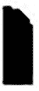

图 5-18

菜单选项卡右侧的图像

图 5-17 和 5-18 中的两幅图像为黑色。您还需要同样的两个绿色图像(将在悬停在菜单选项卡上时使用)。分别如图 5-17 和 5-18 的左右斜率为绿色的两幅图像保存在`tablselect.jpg`和`tabrselect.jpg`文件中。

样式表文件`style.css`包含几个样式规则，使 span 元素显示为选项卡导航菜单。style.css 文件如下所示:

**visual menu . CSS**

```js
.buttons{
       background-image:url(tabl.jpg);
       background-repeat:no-repeat;
       background-position: left;
       background-color:#000;
       width: 80px;
       float: left;
       text-align: center;
}

a{
       display:block;
       background-image:url(tabr.jpg);
       background-repeat:no-repeat;
       background-position: right;
       padding:3px;
       text-decoration:none;
       font-weight:bold;
       color:#fff;
}

.rightselectfig{
       display:block;
       background-image:url(tabrselect.jpg);
       background-repeat:no-repeat;
       background-position: right;
       padding:3px;
       text-decoration:none;
       font-weight:bold;
       color:#fff;
}

.leftselectfig{
       background-image:url(tablselect.jpg);
       background-repeat:no-repeat;
       background-position: left;
       background-color:#0f0;
       width: 80px;
       float: left;
       text-align: center;
}

```

将悬停效果应用于菜单选项卡并显示其相关信息的 jQuery 代码如下:

**视觉菜单.js**

```js
$(document).ready(function() {
  $('.books').hide();
  $('.movies').hide();
  $('.music').hide();

  $('a').hover(
    function(event){
      $(this).addClass('rightselectfig');
      $(this).parent().addClass('leftselectfig');
    },
    function(){
      $(this).removeClass('rightselectfig');
      $(this).parent().removeClass('leftselectfig');
    }
  );

  $('#booksbutton').click(function(event){
    event.preventDefault();
    $('.books').show('slow');
    $('.movies').hide();
    $('.music').hide();
  });

  $('#moviesbutton').click(function(event){

    event.preventDefault();
    $('.movies').show('slow');
    $('.books').hide();
    $('.music').hide();
  });

  $('#musicbutton').click(function(event){
    event.preventDefault();
    $('.music').show('slow');
    $('.books').hide();
    $('.movies').hide();
  });
});

```

### 它是如何工作的

类选择器`.buttons`包含将自动应用于类`buttons`的 span 元素的样式属性(即，应用于所有三个文本:**书籍、电影**和**音乐**)。将背景图像属性设置为`url(tabl.jpg)`使图 5-17 所示的图像与菜单文本一起出现，将`background repeat`属性设置为`no-repeat`使图像只出现一次，将`background-position`属性设置为`left`使图像出现在菜单文本的左侧，为其指定左侧的坡度。

菜单选项卡的`background`颜色设置为`black`，分配给菜单选项卡的`width`为`80px`。将`float`属性设置为`left`以使菜单选项卡出现在浏览器窗口的左侧，并在其右侧留出空间(以便其他菜单选项卡出现在右侧)。将`text-align`属性设置为`center`，使菜单文本出现在定义的 80px 宽度的中心。

类型选择器`a`中定义的属性将自动应用于锚元素。将`display`属性设置为`block`以使锚元素充当块元素，而不是单个元素。将`background-image`属性设置为`tabr.jpg`以应用菜单标签右侧图 5-18 所示的图像。将`background –repeat`属性设置为`no-repeat`以使图像仅出现一次。将`background-position`设置为`right`以使图像出现在右侧，并在其右侧分配一个斜坡形状。`padding`属性被设置为`3px`以使菜单文本与其边框之间的间距为 3px。将`text-decoration`属性设置为`none`以移除通常出现在锚元素下方的传统下划线。将`font-weight`属性设置为`bold`以使菜单文本以粗体显示，将`color`设置为`white`以使菜单文本以白色显示。

风格法则。`rightselectfig`包含当鼠标指针移动到锚元素上时将应用于它们的属性。它包含设置为`block`的`display`属性，以使锚元素充当块元素而不是单个元素。将`background-image`属性设置为`tabrselect.jpg`以将图 5-18 所示的图像应用于菜单标签右侧的绿色。将`background–repeat`属性设置为`no-repeat`以使图像仅出现一次。将`background-position`设置为`right`以使图像出现在右侧，并在其右侧分配一个斜坡形状。`padding`属性被设置为`3px`以使菜单文本与其边框之间的间距为 3px。将`text-decoration`属性设置为`none`以移除通常出现在锚元素下方的传统下划线。将`font-weight`属性设置为`bold`以使菜单文本以粗体显示，将`color`设置为`white`以使菜单文本以白色显示。

样式规则`.leftselectfig`包含当鼠标指针移动到菜单标签按钮上时将应用于它们的属性。背景图像属性设置为`url(tablselect.jpg)`使图 5-17 所示的绿色图像与菜单文本一起出现。将`background-repeat`属性设置为`no-repeat`以使图像仅出现一次，将`background-position`属性设置为`left`以使图像出现在菜单文本的左侧，并在左侧为其指定一个坡度。菜单标签的`background`颜色被设置为`green`来给它一个悬停的效果。分配给菜单选项卡的`width`是`80px`。将`float`属性设置为`left`以使菜单选项卡出现在浏览器窗口的左侧，并在其右侧留出空间(以便其他菜单选项卡出现在右侧)。将`text-align`属性设置为`center`，使菜单文本出现在定义的 80px 宽度的中心。

在 jQuery 代码中，类`books`、`movies`和`music`的所有段落元素都是不可见的，因为只有当您将鼠标悬停在相应的菜单选项卡上时才会显示它们。然后，将悬停事件附加到锚元素，并将样式规则`.rightselectfig`中定义的属性应用到菜单选项卡(正被悬停在其上),对其应用绿色，并在菜单选项卡的右侧添加图像(`tabrselect.jpg`)。你用同样的方法处理左侧。

当鼠标不再停留在选项卡上时，您删除样式规则`.rightselectfig`和`.leftselectfig`的样式属性，使菜单选项卡显示为鼠标离开菜单选项卡时的初始状态。

接下来是选项卡的点击事件。在这些情况下，您可以防止表单被提交到服务器，或者在单击菜单选项卡时被导航到目标网站。然后显示与被单击的选项卡相关联的信息，并隐藏与其他选项卡相关联的段落元素的内容。

当你将鼠标悬停在**书籍**菜单标签上时，你会发现它的背景颜色变为绿色，并且还会显示与书籍相关的信息，如图 5-19 所示。

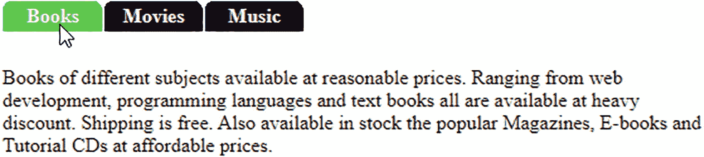

图 5-19

悬停在菜单选项卡上时，该选项卡会高亮显示，并显示相应的信息

为了给显示的文本提供动画效果，可以使用`slideDown()`和`slideUp()`方法，而不是简单的`show()`和`hide()`方法，如下面的 jQuery 代码所示:

menu slide jq . js

```js
$(document).ready(function() {
  $('.books').hide();
  $('.movies').hide();
  $('.music').hide();

  $('#booksbutton').mouseover(function(){
    $('.books').slideDown('slow');
    $('.movies').slideUp('slow');
    $('.music').slideUp('slow');
  });

  $('#moviesbutton').mouseover(function(){
    $('.movies').slideDown('slow');
    $('.books').slideUp('slow');
    $('.music').slideUp('slow');
  });

  $('#musicbutton').mouseover(function(){
    $('.music').slideDown('slow');
    $('.books').slideUp('slow');
    $('.movies').slideUp('slow');
  });
});

```

## 5.10 摘要

在本章中，您看到了如何创建不同类型的菜单，如面包屑菜单、上下文菜单、折叠菜单和动态可视菜单。您还了解了如何使用访问键访问菜单项，以及如何制作带有悬停菜单项的菜单。

在下一章，你将学习动画是如何应用于不同的 HTML 元素的。您将学习左右移动图像、操作 jQuery 队列、单击按钮时逐个显示图像、放大图像、单击“read more”链接时显示详细信息，以及使用动画展开和折叠列表。