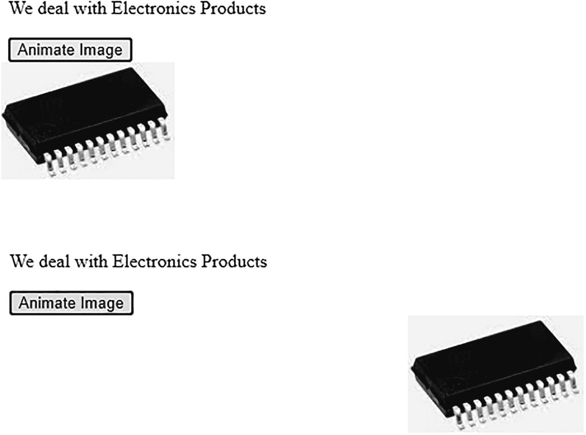
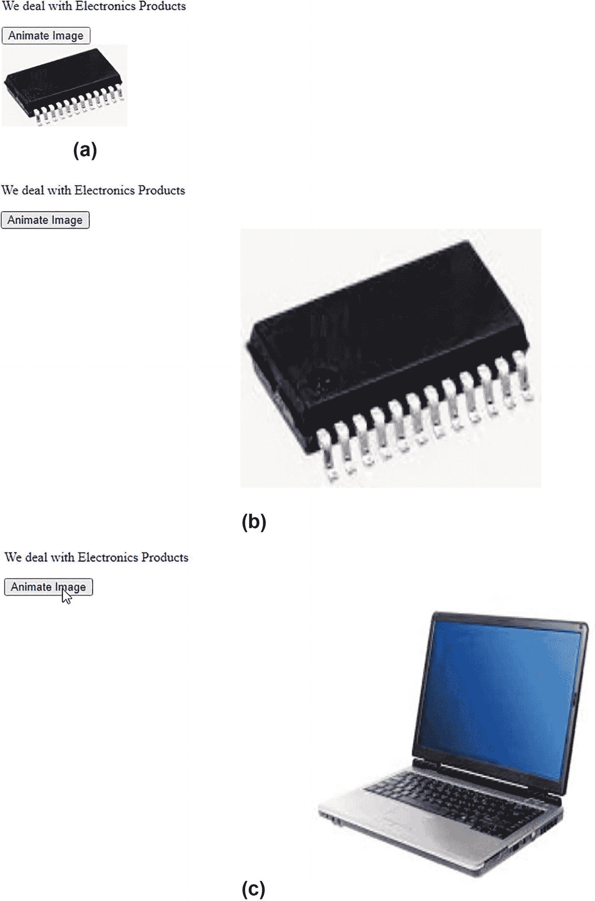
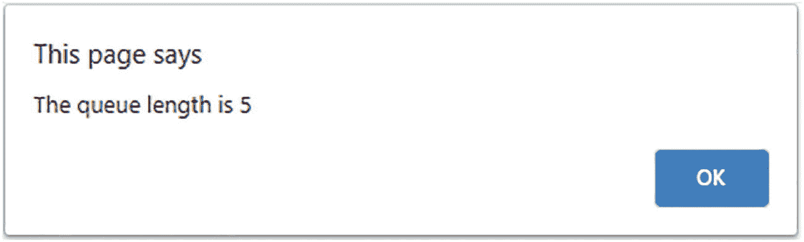
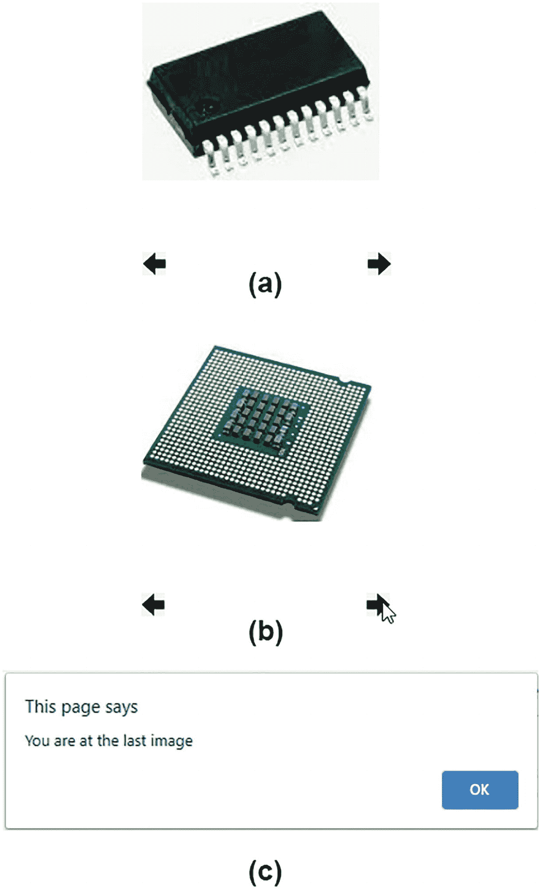
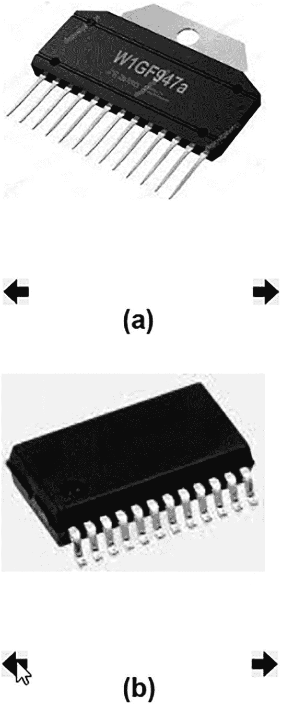
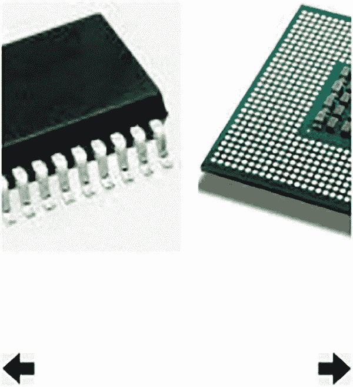
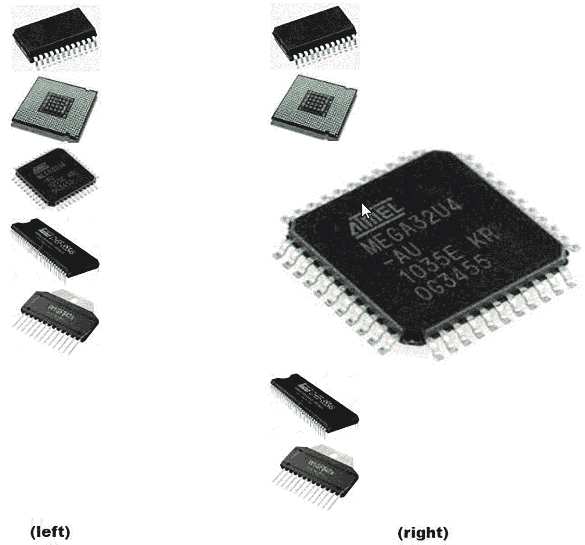
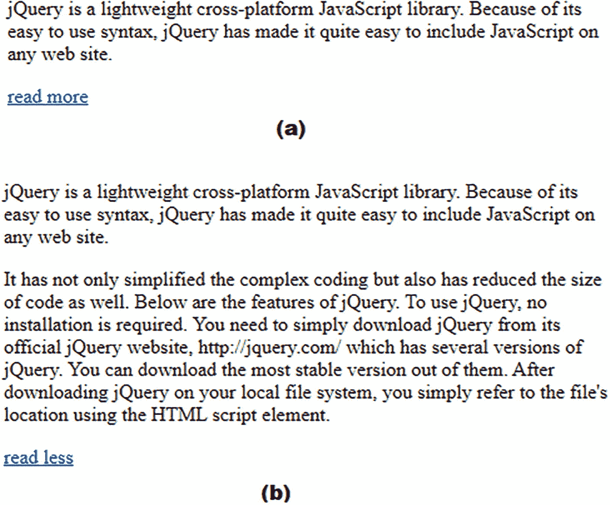
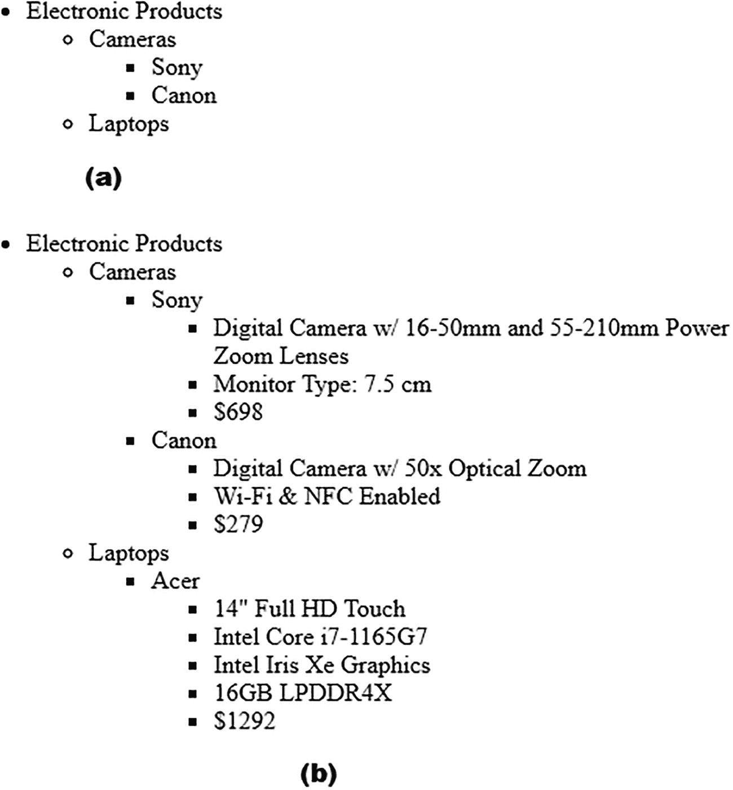

# 六、实现动画

在这一章中，你将学习如何将动画应用于不同的 HTML 元素。你将在本章中制作以下食谱:

*   将图像向右移动，然后向左移动

*   管理和操作 jQuery 队列

*   点击“下一个”和“上一个”按钮，逐个显示图像

*   当鼠标悬停在图像上时放大图像

*   点击**阅读更多信息**链接显示详细信息

*   使用动画展开和折叠列表

## 6.1 先将图像向右移动，然后向左移动

### 问题

你有一个图像，你想让它从左到右动画，然后回到原来的位置。

### 解决办法

以下是显示网页标题、按钮和图像的 HTML 程序:

**Animation1.html**

```js
<!DOCTYPE html PUBLIC "-//W3C//DTD XHTML 1.0 Transitional//EN"
        "http://www.w3.org/TR/xhtml1/DTD/xhtml1-transitional.dtd">

<html xmlns:="http://www.w3.org/1999/xhtml" xml:lang="en" lang="en">
  <head>
    <meta http-equiv="Content-Type" content="text/html; charset=utf-8"/>
    <title></title>
<link rel="stylesheet" href="animation1style.css" type="text/css" media="screen" />
    <script src="jquery-3.5.1.js" type="text/javascript"></script>
    <script src="animation1bjq.js" type="text/javascript"></script>
  </head>

  <body>
<p>We deal with Electronics Products</p>
<button id="anim">Animate Image</button><br/>

  </body>
</html>

```

您可以在上面的代码中看到，段落元素用于显示文本**我们处理电子产品**。文本下方是一个标签为**动画图像**的按钮。为了唯一地识别它，按钮被赋予一个 ID`anim`。在按钮下方，筹码图像以 200 像素宽和 100 像素高显示。

将图片从左到右动画化，然后返回到原始位置的 jQuery 代码如下:

动画 1jq.js

```js
$(document).ready(function() {
     $("button#anim").click( function() {
          $("img#pic1").animate({ left: '350px'}, 'slow',
          function(){
               $("img#pic1").animate({ left: '0px'}, 'slow');
          });
     });
});

```

这个 jQuery 代码使用了`left`属性，所以让我们快速看一下。

#### 左侧属性

它设置 HTML 元素相对于浏览器窗口左边界的位置。有效选项包括

*   `distance`:元素定位在 px、cm 等中提到的指定距离。

*   `%`:元素的距离设置为容器的指定百分比。

*   `auto`:浏览器从左边界确定元素的位置。这是默认选项。

*   `initial`:选择默认值作为该元素的值。

*   `inherit`:该属性的值继承自其父元素。

#### 位置属性

在使用`left`属性之前，必须设置`position`属性，因为除非元素被定位，否则 left 属性将不起作用。以下是`position`属性的有效选项:

*   `absolute/fixed`:元素的左边缘将被设置为指定值。

*   `relative`:元素的左边缘将根据其当前位置进行设置。

*   `sticky`:视其位置而定，是相对的还是固定的。此选项不会让元素离开屏幕。

*   `static`:左侧属性不起作用。

### 它是如何工作的

当点击 ID 为`anim`的按钮时，ID 为`pic1`的图像从其当前位置向右缓慢移动，并在浏览器屏幕左边界 350px 处停止(见图 6-1 )。在`animate`方法的回调函数中(即当图像从左边界到达它的右边目的地 350px 时)，回调函数将执行，它以缓慢的速度将图像向左移动，当图像到达离浏览器屏幕左边界 0px 的距离时将停止。



图 6-1

单击该按钮时，图像向右移动，然后再向左移动

在回调函数中，可以粘贴另一张图片。让我们修改上面的 jQuery 代码，使芯片图像向右移动，移动时其高度和宽度增加，最后芯片图像被替换为笔记本电脑图像。jQuery 文件`Animation1jq.js`显示了这样做的代码。

动画 1jq.js

```js
$(document).ready(function() {
     $("button#anim").click( function() {
          $("img#pic1").animate({ left: '350px', width: '400px', height: '350px'}, 'slow',
          function(){
               $("img#pic1").attr("src", "computer.jpg");
          });
     });
});

```

最初将出现如图 6-2(a) 所示的筹码图像和按钮。当点击 ID 为`anim`的按钮时，ID 为`pic1`的筹码图像从其当前位置向右移动。芯片图像将显示动画，直到它到达离浏览器屏幕左边界 350 像素的距离。当图像动画时，其宽度会慢慢增加到 400 像素，其高度也会慢慢增加到 350 像素(见图 6-2(b) )。在动画结束时(即当芯片图像变成 400 像素宽和 350 像素高时)，它将通过回调函数被替换为笔记本电脑图像(见图 6-2(c) )。



图 6-2

(a)出现芯片图像和按钮。(b)筹码图像向右移动，其宽度和高度随着移动而增加。(c)芯片映像被笔记本电脑映像取代

## 6.2 管理和操作 jQuery 队列

### 问题

对图像执行几种动画方法，这些方法存储在 jQuery 队列中。您可以根据自己的需求操作存储在队列中的方法。

### 解决办法

显示图像的 HTML 程序如下，您将在该图像上执行不同的动画方法:

**Animation2.html**

```js
<!DOCTYPE html PUBLIC "-//W3C//DTD XHTML 1.0 Transitional//EN"
        "http://www.w3.org/TR/xhtml1/DTD/xhtml1-transitional.dtd">

<html xmlns:="http://www.w3.org/1999/xhtml" xml:lang="en" lang="en">
  <head>
    <meta http-equiv="Content-Type" content="text/html; charset=utf-8"/>
    <title></title>
    <script src="jquery-3.5.1.js" type="text/javascript"></script>
    <script src="animation2jq.js" type="text/javascript"></script>
  </head>
  <body>

  </body>
</html>

```

您可以在上面的程序中看到，显示了一个 200 像素宽、100 像素高的图像。图像被分配类别`pic`和 ID `pic1`。

将某些动画任务应用于图像并显示 jQuery 队列长度的 jQuery 代码如下:

**动画 2jq.js**

```js
$(document).ready(function() {
 $("img#pic1")
 .animate({ "height" : 300 })
 .fadeOut()
 .fadeIn()
 .animate({ "width" : 400 })
    .slideToggle( 3000 )
  var n =$("img#pic1").queue( "fx" ).length;
alert("The queue length is "+n);
});

```

在这个 jQuery 代码中，使用了`slideToggle()`和`queue()`方法，所以让我们快速看一下这两个方法。

#### slideToggle()

顾名思义，`slideToggle()`方法在所选元素的`slideUp()`和`slideDown()`之间切换。如果元素是隐藏的，那么`slideDown()`方法将执行以使元素可见。类似地，如果元素是可见的，那么`slideUp()`方法将运行使其不可见。

**语法:**

*   `speed`定义滑动的速度。该参数是可选的，其默认值为 400 毫秒。有效选项为`slow`、`fast`和毫秒。

*   `easing`参数决定动画在不同阶段的速度。以下是有效选项:
    *   它使过渡在开始和结束时变慢，但在中间变快。这是默认选项。

    *   `linear`:它使过渡以恒定的速度发生。

```js
$(selector).slideToggle(speed,easing,callback)

```

#### 。队列( )

顾名思义，队列包含应该在所选元素上运行的函数。如果需要，可以操作这些功能。队列允许在一个元素上异步执行一系列函数。它基本上是一个按先进先出(FIFO)顺序处理的函数数组。

**语法:**

```js
$(selector).queue(queue_name)

```

其中参数`queue_name`表示队列的名称。默认的 jQuery 队列名是`fx.`

要检索对 jQuery 队列的引用，可以调用没有函数参数的`.queue()`方法。

以下方法用于操作队列:

*   `push`:用于在队列末尾增加一个功能

*   `pop`:用于从队列中删除最后一个功能

*   `unshift`:用于在队列的开头插入一个函数

*   `shift`:用于从队列的开始处删除一个功能

*   `dequeue()`:当被调用时，这个方法表明你想要移动到队列中的下一个项目(即，你想要从队列中移除顶部的函数并执行它)。

*   `clearQueue()`:该方法删除队列中所有尚未执行的函数。当前正在执行的功能将不起作用。

### 它是如何工作的

ID 为`pic1`的图像是动态的(即，其高度将从当前高度缓慢增加，直到达到 300 像素高)。然后图像会慢慢变得不可见，又会慢慢重新出现。此后，图像将显示动画，宽度逐渐增加到 400 像素。然后`slideToggle()`的方法会让图像慢慢不可见。因为在选中的元素上(即图像上)有五个动作在排队，所以通过警告对话框你得到队列长度为 5，如图 6-3 所示。



图 6-3

“报警”对话框显示队列长度(即在图像上排队的操作数)

### 从队列中弹出最后一个函数

您可以利用`pop()`函数从 jQuery 队列中移除最后一个函数。jQuery 文件`Animation2jq.js`可以修改如下:

**动画 2jq.js**

```js
$(document).ready(function() {
 $("img#pic1")
 .animate({ "height" : 300 })
 .fadeOut()
 .fadeIn()
 .animate({ "width" : 400 })
    .slideToggle( 3000 )
var queue = $("img#pic1").queue();
var popped_func = queue.pop();
});

```

从``元素中检索对 jQuery 队列的引用，并将其赋给变量`queue`。最后一个方法`slideToggle(3000)`将从队列中删除，并赋给变量`popped_func`，因为最后一个方法不再在队列中，所以它不会执行。因此，芯片图像将不会变得不可见(在其高度和宽度增加之后),而是将保持在那里。

您甚至可以删除队列中的最后一个函数，并通过使用如下的`unshift()`方法将其插入到开始处:

```js
var queue = $("img#pic1").queue();
var popped_func = queue.pop();
queue.unshift(popped_func);

```

第一个增加图像高度的`animate`方法在运行应用时执行。然后通过使用`pop()`方法将最后一个方法`slideToggle(3000)`从队列的末尾移除，并将其赋给`popped_func`变量。然后将`popped_func`变量中的最后一个方法添加到队列的开头。增加图像高度后，执行`slideToggle(3000)`方法，使图像不可见。

您可以通过在 jQuery 代码中添加以下语句来清除存储在队列中的所有方法，从而停止动画:

```js
$("img#pic1").clearQueue();

```

因为上述语句将删除队列中的所有方法，所以在完成当前正在执行的方法后，动画将立即停止。您甚至可以在单击按钮时调用`clearQueue()`方法，允许用户在任何需要的时候停止动画。

您还可以运行队列中所需的方法，方法是用所需的方法范围重新定义队列，如下面的代码所示:

```js
$("img#pic1").queue(queue.slice(3,4));

```

这里从第三个索引位置直到第四个索引位置的语句将被用来创建一个新队列。指定索引位置的语句是`.animate({ "width" : 400 })`,因此新队列将只有这条语句。因此，芯片图像的宽度会慢慢增加到 400px。就这样。因为队列中没有其他东西，所以不会发生其他事情。

## 6.3 通过单击下一个和上一个按钮逐个显示图像

### 问题

您有几幅图像，并且希望一次显示一幅图像。当用户单击“下一个”按钮时，将显示序列中的下一个图像。类似地，通过单击 previous 按钮，之前显示的图像应该会再次出现。

### 解决办法

下面的 HTML 程序显示五幅图像和左右箭头键。为了管理边距和显示格式，图像被放在一个无序列表中，这个列表又被放在一个`<div>`元素中。

**animation3.html**

```js
<!DOCTYPE html PUBLIC "-//W3C//DTD XHTML 1.0 Transitional//EN"
        "http://www.w3.org/TR/xhtml1/DTD/xhtml1-transitional.dtd">

<html xmlns:="http://www.w3.org/1999/xhtml" xml:lang="en" lang="en">
  <head>
    <meta http-equiv="Content-Type" content="text/html; charset=utf-8"/>
    <title></title>
<link rel="stylesheet" href="animation3style.css" type="text/css" media="screen" />
    <script src="jquery-3.5.1.js" type="text/javascript"></script>
    <script src="animation3jq.js" type="text/javascript"></script>
  </head>
 <body>
 <div id="image_slider">
 <ul>

 <li></li>
 <li></li>
 <li></li>
 <li></li>
 <li></li>
 </ul>


 </div>
 </body>
</html>

```

您可以在上面的代码中看到，用 ID `image_slider`定义了一个`<div>`元素。在`<div>`元素中定义了一个无序列表元素。在无序列表元素中定义了五个列表项，在每个列表项中定义了一个图像。在无序列表元素下面，左侧显示一个左箭头图像来表示“上一步”按钮，右侧显示一个右箭头图像来表示“下一步”按钮。

为了一次只显示一个图像并隐藏其余的图像，并对`<ul>`和`<div>`元素应用填充和其他显示格式，某些样式被写入 CSS 样式表。

**Animation3style.css**

```js
body {
 padding: 10px;
}

#image_slider {
 width: 210px;
 height: 230px;
 overflow: hidden;
  margin: auto;
  display: block;
}

#image_slider ul {
 list-style: none;
 width: 1200px;
 height: 210px;
 margin: 0;
 padding: 0;
}

#image_slider li {
 width: 210px;
 height: 200px;
 float: left;
}

.leftarrow {
 float: left;
 width: 20px;
 height: 20px;
}
.rightarrow {
 float: right;
 width: 20px;
 height: 20px;
}

```

在这个 CSS 样式表中，使用了属性`padding`、`overflow`、`display`和`float`，所以让我们快速浏览一下。

#### 填充属性

属性用于创建元素内容之间的间距。为了在元素的每一侧插入间距，有一些`padding`属性的变体，包括`padding-top`、`padding-right`、`padding-bottom`和`padding-left`来分别管理元素顶部、右侧、底部和左侧的间距。

`padding`属性的有效值为

*   `value`:以 px、pt、cm 等为单位指定间距的值。

*   `%`:间距以容器宽度的%来指定。

*   `inherit`:间距继承自父元素。

#### 溢出属性

`overflow`属性决定了对太大而无法放入容器的内容执行的操作(即，它决定是通过应用滚动条来显示整个元素，还是根据容器大小来裁剪内容)。有效选项包括

*   `visible`:该元素将被完全显示。

*   `hidden`:容器边界外的区域将被裁剪，只有容器内的区域可见。

*   `scroll`:容器边界内的区域可见，并添加滚动条，可以用来查看隐藏的内容。

*   `auto`:类似于`scroll`，但是它只在需要的时候给元素添加滚动条。

#### 显示属性

属性决定了元素应该如何呈现。该属性的一些有效值包括

*   `inline`:元素显示为内嵌元素。不考虑元素的高度和宽度。

*   `block`:元素显示为块元素(即元素显示在新的一行上，覆盖浏览器屏幕的整个宽度)。

*   `contents`:容器被移除，子元素成为 DOM 中更高一级元素的子元素。

#### 浮动属性

`float`属性用于相对于同一容器中的另一个组件定位和格式化内容。它通常用于在图像周围排列文本。以下是有效选项:

*   `left`:元素浮动在容器的左边。

*   `right`:元素浮动到其容器的右边。

*   `none`:元素不浮动。这是默认值。

*   `inherit`:元素从其父元素继承浮点值。

10px 的填充空间设置在`<body>`元素的四周。

ID 为`image_slider`的`<div>`元素的宽度和高度分别设置为 210px 和 230px。通过使用`overflow`属性，无法容纳在指定宽度和高度区域内的图像被隐藏。这个想法是一次只能看到一幅图像。整个`<div>`元素显示为一个块(即，它将显示在新行上，并将覆盖浏览器屏幕的整个宽度)。

无序列表项中的常规项目符号将被删除，无序列表的宽度和高度被设置为 1200px 和 210px，以便容纳所有的图像。在无序列表中，边距和填充间距设置为 0。

列表项的宽度和高度被设置为 210px 和 200px，因为图像将仅通过列表项显示。使用`float`属性，列表项(即图像)被设置为在其容器中向左浮动。左右箭头图像显示为 20px 宽和 20px 高。左箭头被设置为位于左侧，右箭头图像被设置为显示在右侧。

**动画 3jq.js**

```js
$(document).ready(function() {
$('img.leftarrow').click(function() {
     if($("ul").css("marginLeft") == "0px"){
          alert("You are at the first image");
     } else {

      $("#image_slider").children("ul").animate({
           "margin-left" : "+=210px"
           }, 2000);
};
});

$('img.rightarrow').click(function() {
     if($("ul").css("marginLeft") == "-840px"){
          alert("You are at the last image");
     } else {
      $("#image_slider").children("ul").animate({
           "margin-left" : "-=210px"
           }, 2000);
};
});
});

```

在这段 jQuery 代码中，使用了`css()`方法和`margin-left`属性，我们先来了解一下。

#### css()

方法设置或返回所选元素的样式属性。

**语法:**

以下语法返回指定属性的值:

```js
css("property");

```

以下语法设置指定 CSS 属性的值:

```js
css("property","value");

```

#### 左边距属性

此属性设置元素距浏览器窗口左边界的边距。以下是有效选项:

*   `length`:距左边距的距离以像素、磅、厘米等为单位。默认值为 0px。

*   `%`:左边界的边距以容器宽度的百分比来指定。

*   `auto`:离左边界的距离由浏览器决定。

*   `initial`:取该属性的默认值。

*   `inherit`:该值继承自父元素。

### 它是如何工作的

运行程序时，最初将显示第一幅图像(参见图 6-4(a) )。单击左箭头图像时，首先检查左边距值是否为 0px。如果左边距的值为 0px，则表示正在显示第一张图片，并且在当前图像的左边没有图像，因此显示**您在第一张图像上，没有其他动作发生**的信息。但是如果左边距的值不是 0px，这意味着显示的是其他图像，而不是第一个图像。在这种情况下，左边距值增加 210 px，使下一个图像可见，并隐藏前面的图像。左边距的值会以慢速动画的形式增加，因此下一个图像会以滑入的形式出现。

同样，当单击右箭头图像时，首先检查左边距的值是否等于-840px。因为每点击一次右箭头，左边距的值就减少 210px，当显示最后一幅图像时，左边距的值将等于-840px，因此显示消息**你在最后一幅图像**(见图 6-4(c) )。如果左边距的值大于-840px，左边距的值减少 210px，使第二幅图像可见，前一幅图像不可见，如图 6-4(b) 所示。



图 6-4

(a)显示第一幅图像。(b)单击右箭头图像，第二个图像变得可见，隐藏第一个图像。(c)当在最后一幅图像上点击右箭头图像时，出现通知“您在最后一幅图像上”的警告对话框

### 当按下任何箭头键时，逐个显示所有隐藏的图像

在这段代码中，当您按下右箭头图像时，所有图像将一个接一个地向左滑动，并且在显示最后一个图像后滑动将停止，而不是像在早期的 jQuery 代码中那样在显示一个图像后停止。类似地，在点击左箭头图像时，所有图像将一个接一个地向右滑动，并且在显示第一个图像后滑动将停止。

执行此操作的 jQuery 代码如下:

**动画 3bjq.js**

```js
$(document).ready(function() {
     $('img.leftarrow').click(function() {
          if($("ul").css("marginLeft") == "0px"){
               alert("You are at the first image");
          } else {
               for(i=0;i<4;i++){
                     $("#image_slider").children("ul").animate({
                     "margin-left" : "+=210px"
                     }, 2000);
               }
          };
     });

     $('img.rightarrow').click(function() {
          if($("ul").css("marginLeft") == "-840px"){
               alert("You are at the last image");
          } else {
               for(i=0;i<4;i++){
                     $("#image_slider").children("ul").animate({
                     "margin-left" : "-=210px"
                     }, 2000);
               }
          };
     });
});

```

您可以在上面的代码中看到，在单击左箭头图像时，使用了一个`for`循环，它将执行四次迭代，在每次迭代中，无序列表元素的左边距增加 210px，从而隐藏当前图像并取消隐藏右侧的图像。回想一下，图像是通过无序列表元素的列表项来表示的。`for`循环将图像一张一张地向左滑动，并停留在最后一张图像上，如图 6-5(a) 所示。

单击右箭头图像时，重复该过程。再次，`for`循环将迭代四次，在每次迭代中将无序列表元素的左边距减少 210px。因此，当前图像将被隐藏，左侧的一个图像将变得可见。`for`循环将给出滑动效果，好像图像一个接一个地向正确的方向滑动，并在第一个图像上停止，如图 6-5(b) 所示。



图 6-5

(a)单击左箭头使所有图像向左移动，并停在最后一幅图像上。(b)单击向右箭头使所有图像向右滑动，并在第一个图像处停止

### 使图像连续滑动

让我们修改 jQuery 代码来制作一个图像滑块(即，图像将一个接一个地向左滑动)。也就是说，将显示一幅图像，然后它将向左移动，消失，并被序列中的下一幅图像所取代。图像滑块的 jQuery 代码如下:

**动画 3cjq.js**

```js
$(document).ready(function() {

     $.leftrotate = function(){
           $("#image_slider").children("ul").animate({
                "margin-left" : "-=210px"
                }, 2000,
               function(){
                    if($("ul").css("marginLeft") == "-1050px"){
                         $("ul").css( {"marginLeft" : "0px" });
                    }
               });
          $.leftrotate();
     }
     $.leftrotate();
});

```

你可以在上面的代码中看到，定义了一个名为`leftrotate`的函数，其中`<div>`元素内无序列表元素的左边距缓慢递减 210px。因此，当前图像将变得不可见，右边的图像将慢慢变得可见，从而产生动画效果。显示图像后，检查是否到达最后一幅图像(即，左边距是否等于-1050px)。如果是，那么左边距设置为 0px，使第一个图像再次可见。如果还没有到达最后一幅图像，再次调用`leftrotate`函数将左边距减少 210px，使当前图像不可见，使右边的下一幅图像可见。由于递归的原因，`leftrotate`函数会被重复调用，使得图像无限滑动，如图 6-6 所示。



图 6-6

图像无限滑动

## 6.4 当鼠标悬停在图像上时放大图像

### 问题

您有一些尺寸较小的图像，它们一个接一个地显示。您希望当鼠标悬停在图像上时图像被放大，当鼠标移出图像时图像恢复到原来的大小。

### 解决办法

显示一些图像的 HTML 代码如下:

**Zoomonhover.html**

```js
<!DOCTYPE html PUBLIC "-//W3C//DTD XHTML 1.0 Transitional//EN"
        "http://www.w3.org/TR/xhtml1/DTD/xhtml1-transitional.dtd">

<html xmlns:="http://www.w3.org/1999/xhtml" xml:lang="en" lang="en">
  <head>
    <meta http-equiv="Content-Type" content="text/html; charset=utf-8"/>
    <title></title>
<link rel="stylesheet" href="zoomonhoverstyle.css" type="text/css" media="screen" />
    <script src="jquery-3.5.1.js" type="text/javascript"></script>
    <script src="zoomonhoverjq.js" type="text/javascript"></script>
  </head>
 <body>

<ul id="image_hover">
 <li></li>
 <li></li>
 <li></li>
 <li></li>
 <li></li>
 </ul>
</body>
</html>

```

您可以在上面的代码中看到，创建了一个 id 为`image_hover`的无序列表元素。无序列表元素包含五个列表项，每个列表项通过``元素显示一个图像。

将样式应用于 HTML 元素的 CSS 样式表如下:

**Zoomonhoverstyle.css**

```js
#image_hover {
 list-style: none;
}

img {
 width: 100px;
 height: 75px;
}

```

为了避免在列表项中显示默认项目符号，`list_style: none`属性被应用于 id 为`image_hover`的无序列表项。此外，图像默认设置为 100 像素宽，75 像素高。

当鼠标在图像上时放大图像，当鼠标指针离开图像时缩小到原来大小的 jQuery 代码如下:

`Zoomonhoverjq.js`

```js
$(document).ready(function() {
           $("#image_hover").children("li").find("img").on("mouseenter", function() {
               $(this).css( {"width" : "350px" });
               $(this).css( {"height" : "250px" });
               }).on("mouseleave", function() {
               $(this).css( {"width" : "100px" });
               $(this).css( {"height" : "75px" });
     });
});

```

### 它是如何工作的

运行程序时，最初图像会以较小的尺寸一个接一个地出现(即 100 像素宽，75 像素高，如图 6-7 左侧所示)。当鼠标指针悬停在列表项上(即列表项内包裹的图像上)时，通过使用`css()`方法，图像的宽度和高度分别增加到 350px 和 250px(见图 6-7 右侧)。当鼠标指针离开图像时，再次使用`css()`方法将图像缩小到原来的大小。



图 6-7

(左)图像以小尺寸一个接一个地出现。(右)当鼠标指针悬停在图像上时，图像的宽度和高度会增加

## 6.5 点击“阅读更多”链接时显示详细信息

### 问题

您希望显示一个主题的简短介绍，并在其下方显示一个 **read more** 链接。您希望当用户点击**阅读更多信息**链接时显示隐藏的内容。此外，当显示隐藏内容时，您希望将**阅读更多**链接转换为**阅读更少**链接。如果点击 **read less** 链接，您还希望最近变得可见的内容隐藏起来。

### 解决办法

显示两个段落元素和一个超链接的 HTML 程序如下所示。第二段包含详细信息，最初是隐藏的，但单击超链接时会显示出来。

**Readmore.html**

```js
<!DOCTYPE html PUBLIC "-//W3C//DTD XHTML 1.0 Transitional//EN"
        "http://www.w3.org/TR/xhtml1/DTD/xhtml1-transitional.dtd">

<html xmlns:="http://www.w3.org/1999/xhtml" xml:lang="en" lang="en">
  <head>
    <meta http-equiv="Content-Type" content="text/html; charset=utf-8"/>
    <title></title>
    <script src="jquery-3.5.1.js" type="text/javascript"></script>
    <script src="readmorejq.js" type="text/javascript"></script>
  </head>
  <body>
      <p>jQuery is a lightweight cross-platform JavaScript library. Because of its easy to use syntax, jQuery has made it quite easy to include JavaScript on any web site.  </p>
      <p>It has not only simplified the complex coding but also has reduced the size of code as well. Below are the features of jQuery. To use jQuery, no installation is required. You need to simply download jQuery from its official jQuery website, http://jquery.com/ which has several versions of jQuery. You can download the most stable version out of them. After downloading jQuery on your local file system, you simply refer to the file's location using the HTML script element. </p>
     <a href="#" id="expand">read more</a>
  </body>

</html>

```

您可以在上面的代码中看到，两个`<p>`元素是由特定的文本组成的。在第二段下面，定义了一个超链接，默认文本为**阅读更多信息**。为了在 jQuery 代码中访问它，超链接被分配了 ID `expand`。

单击超链接时显示隐藏段落的 jQuery 代码如下所示。当点击超链接时，代码还将超链接的文本从**阅读更多**更改为**阅读更少**。当点击 **read less** 链接时，这段代码也会隐藏该段落。

`Readmorejq.js`

```js
$(document).ready(function() {
       $('p').eq(1).hide();
      $('a#expand').click(function(event) {
           event.preventDefault();
           if ($('a#expand').text() == 'read more') {
          $('p').eq(1).hide().slideToggle('slow');
                $('a#expand').text('read less');
           } else {
               $('p').eq(1).show().slideToggle('slow');
                $('a#expand').text('read more');
           }
      });
});

```

上面的 jQuery 代码中使用了`preventDefault()`方法，我们先来了解一下这个方法。

#### event.preventDefault()方法

顾名思义，`event.preventDefault()`方法避免元素采取默认动作。例如，使用此方法，您可以阻止用户在单击链接时导航到目标 URL。

**语法:**

```js
event.preventDefault()

```

其中参数`event`由事件绑定函数提供，可以是任何值；它可以是任何字符或单词。

### 它是如何工作的

在运行 HTML 程序时，您会发现第一个段落(即索引位置为 0 的段落)是可见的，而索引位置为 1 的段落元素(即第二个段落)是隐藏的。该段下方显示超链接，文字**继续阅读**，如图 6-8(a) 所示。超链接元素被分配了 ID `expand`，当它被点击时(即如果点击了 **read more** 链接)，调用`preventDefault()`方法以避免超链接的默认动作，从而阻止它导航到目的网页。此外，如果 ID 为`expand`的超链接的文本为**请继续阅读**，则通过调用`slideToggle()`方法，可以慢慢看到当前隐藏的第二段。即隐藏段落显示隐藏的文本，超链接文本变为**已读少**告知用户详细信息已经可见(见图 6-8(b) )。

如果超链接的文本为**少读**并被点击，则通过调用`slideToggle()`方法使可见段落慢慢不可见，超链接的文本变为**多读**。



图 6-8

(a)在该段落下面，显示一个带有文本“阅读更多”的超链接(b)点击“阅读更多”链接后，显示隐藏的段落

## 6.6 使用动画展开和折叠列表

### 问题

您希望以可扩展列表项目的形式显示某些电子项目，如相机和笔记本电脑。每当用户单击列表项时，它就会展开以显示详细信息。如果再次单击，展开的列表项将会缩小。

### 解决办法

显示包含几个列表项的无序列表的 HTML 代码如下所示，其中列表项本身是一个无序列表。列表将从节点**电子产品**开始，将显示两款电子产品，**相机**和**笔记本电脑**。**相机**列表项将显示两款相机，分别名为**索尼**和**佳能**。**同样****笔记本电脑**列表项将只显示一台笔记本电脑的名称，**宏碁**。**索尼**和**佳能**列表项目可以展开显示各自的配置和价格。另外，**宏基**列表项可以展开显示其配置和价格。

`Explandlistanim.html`

```js
<!DOCTYPE html PUBLIC "-//W3C//DTD XHTML 1.0 Transitional//EN"
        "http://www.w3.org/TR/xhtml1/DTD/xhtml1-transitional.dtd">

<html xmlns:="http://www.w3.org/1999/xhtml" xml:lang="en" lang="en">
  <head>
    <meta http-equiv="Content-Type" content="text/html; charset=utf-8"/>
    <title></title>
    <script src="jquery-3.5.1.js" type="text/javascript"></script>
    <script src="expandlistanimjq.js" type="text/javascript"></script>
  </head>
  <body>
<ul id="list">
  <li class="electronics">Electronic Products
    <ul>
      <li class="electronics">Cameras
        <ul>
          <li class="electronics">Sony
            <ul>

              <li>Digital Camera w/ 16-50mm and 55-210mm Power Zoom Lenses</li>
              <li>Monitor Type: 7.5 cm</li>
              <li>$698</li>
            </ul>
          </li>
          <li class="electronics">Canon
            <ul>
              <li>Digital Camera w/ 50x Optical Zoom</li>
              <li>Wi-Fi & NFC Enabled</li>
              <li>$279</li>
            </ul>
          </li>
        </ul>
      </li>
      <li class="electronics">Laptops
        <ul>
          <li class="electronics">Acer
            <ul>

              <li>14" Full HD Touch</li>
              <li>Intel Core i7-1165G7</li>
              <li>Intel Iris Xe Graphics</li>
              <li>16GB LPDDR4X</li>
              <li>$1292</li>
            </ul>
          </li>
        </ul>
      </li>
    </ul>
  </li>
</ul>
</body>
</html>

```

您可以看到创建了一个 ID 为`list`的无序列表，其中只有一个列表项 **Electronics Products** 。对于通过 jQuery 代码的访问，列表项被分配了类`electronics`。**电子产品**列表项由一个无序列表组成，该列表由两个列表项组成，**相机**和**笔记本电脑**。所有列表项都被分配了类别`electronics`。同样，列表项**相机**由一个无序列表组成，该列表由两个列表项**索尼**和**佳能**组成。类似地，列表项 **Laptops** 由一个无序列表组成，该列表又由一个列表项 **Acer** 组成。列表项 **Sony** 包含一个无序列表，由三个列表项组成，显示了索尼相机的配置和价格。

类似地，**佳能**列表项包装了一个无序列表，该列表由三个显示佳能相机详细特性的列表项组成。**宏基**列表项包含五个列表项的无序列表，其中每个列表项显示宏基笔记本电脑的功能及其价格。

单击一次时展开列表项，再次单击时折叠列表项的 jQuery 代码如下:

`Expanlistanimjq.js`

```js
$(document).ready(function() {
     $('#list ul').hide();
     $('.electronics').click(function() {
          $(this).children("ul").slideToggle();
            return false;
     });
 });

```

### 它是如何工作的

您可以看到，ID 为`list`的无序列表中包装的无序列表被隐藏，因此除了父无序列表的文本之外，不会出现子无序列表(即最初会显示**电子产品**)。如果用户单击任何列表项，将显示包装在该列表项中的无序列表。因为使用了`slideToggle()`方法，这意味着如果无序列表(即被点击的列表项的子元素)是可见的，那么它将被设为不可见，反之亦然。因此，如果列表项当前处于折叠模式，单击它将会展开，或者如果它已经展开，将会折叠。

在运行程序时，您会在屏幕上获得父无序列表的列表项文本，即**电子产品**。单击列表项时，它会展开以显示其中的无序列表。里面的无序列表有两个列表项，**相机**和**笔记本电脑**，所以显示在屏幕上。点击列表项**相机**时，它将再次展开并显示该列表项内的无序列表(即屏幕上将显示**索尼**和**佳能**列表项；参见图 6-9(a) 。类似地，单击任何列表项，隐藏在其中的无序列表就会显示出来，显示其中的信息。点击所有列表项，将显示如图 6-9(b) 所示的信息。



图 6-9

(a)出现父未订购列表“电子产品”的文本。(b)单击任何列表项，它将展开以显示其中的无序列表

## 6.7 总结

在这一章中，你学习了如何在 HTML 元素上实现动画。你学会了先将图像向右移动，然后向左移动。您学习了管理和操作 jQuery 队列。您了解了如何通过单击下一个和上一个按钮来逐个显示图像，以及如何在鼠标悬停在图像上时放大图像。您还学习了在单击“read more”链接时展开文本并显示详细信息，最后，您学习了使用动画展开和折叠列表。

下一章将演示滑动和视觉效果。您将学习如何在无限循环中显示滑动图像。您还将学习如何使球弹跳，如何使图像在框内垂直向上滚动，如何垂直显示图像，以及如何制作新闻滚动器。