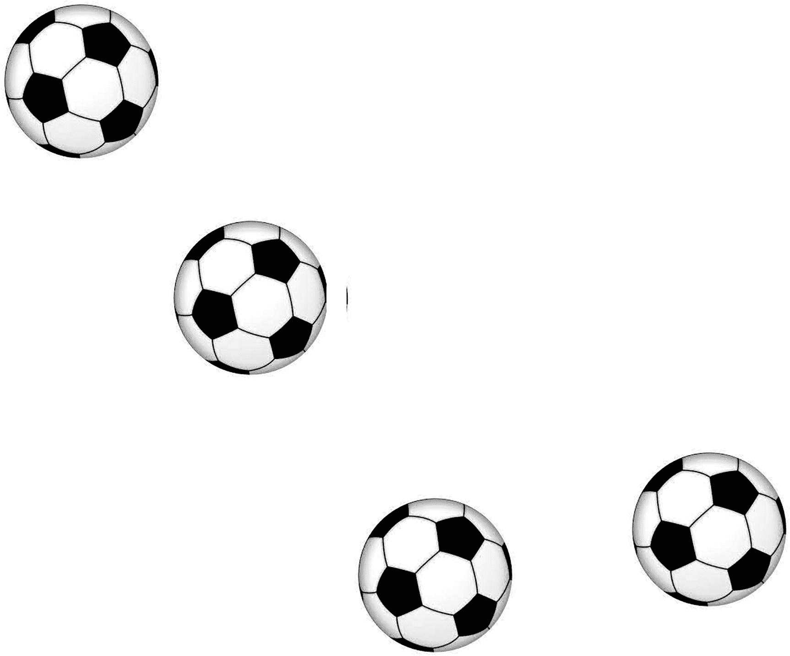

# 七、滑动和视觉效果

在这一章中，你将学习如何对不同的 HTML 元素应用不同的滑动和视觉效果。在本章中，您将制作以下食谱:

*   无限地一次显示一个图像

*   使球弹跳

*   使图像在框内垂直向上滚动

*   垂直显示图像，每个图像被序列中的下一个图像替换

*   制作新闻滚动器

*   悬停时一个接一个地显示图像

*   按页面显示图像

*   向任一方向拖动图像

*   编写钟摆滚动器

*   使用数组滚动图像

图像滚动和滑动配方可以在任何网站上用来展示产品或服务。新闻滚动菜单可以用来显示一个组织的最新活动。弹跳球的秘诀是解释如何管理动画的速度和距离。

## 7.1 无限显示图像，一次一个

### 问题

您有几个图像，并且希望这些图像一个接一个地显示在页面的顶部中央。一幅图像慢慢出现，然后逐渐消失，被下一幅图像慢慢取代，然后也逐渐消失，如此类推。显示完最后一幅图像后，第一幅图像将再次出现，并无休止地继续下去。

### 解决办法

通过一个无序列表的列表项显示五幅图像的 HTML 代码如下所示，该列表又被包含在一个`<div>`元素中:

**animation1.html**

```js
<!DOCTYPE html PUBLIC "-//W3C//DTD XHTML 1.0 Transitional//EN"
        "http://www.w3.org/TR/xhtml1/DTD/xhtml1-transitional.dtd">

<html xmlns:="http://www.w3.org/1999/xhtml" xml:lang="en" lang="en">
  <head>
    <meta http-equiv="Content-Type" content="text/html; charset=utf-8"/>
    <title></title>
     <link rel="stylesheet" href="animation1style.css" type="text/css" media="screen" />
    <script src="jquery-3.5.1.js" type="text/javascript"></script>
    <script src="animation1jq.js" type="text/javascript"></script>
  </head>
  <body>
     <div id="slideshow">
             <ul>
                  <li></li>
                  <li></li>
                  <li></li>
                  <li></li>
                  <li> </li>
             </ul>
</div>
  </body>
</html>

```

你可以在上面的代码中看到，一个`<div>`元素是用 ID`slideshow`定义的。在`<div>`元素中定义了一个无序列表，其中五幅图像通过无序列表的列表项显示。

为了将样式应用于`<div>`、`<p>`和``元素，在级联样式表中定义了某些样式类:

**Animation1style.css**

```js
img{
         width: 300px;
         height: 200px;
         border: 5px solid red;
       padding: 10px;
       margin: 10px;
}

#slideshow {
        margin: 30px auto;
       position: relative;
       width: 350px;
       height: 250px;
       padding: 10px;
}

#slideshow ul li {
       position: absolute;
}

```

在这个样式表文件中，使用了一个名为`position`的属性，我们先了解一下。

#### 位置属性

属性定义了一个元素的位置。有效选项包括

*   `static`:默认属性。元素被定位为静态的(即，top、bottom、left 和 right 属性不会影响 HTML 元素)。

*   `relative`:顾名思义，这个元素将会相对于它的正常位置进行定位。可以将 top、right、bottom 和 left 属性添加到元素中，以获得更精确的位置。

*   `fixed`:即使页面滚动，元素也将始终保持在同一位置。

*   `absolute`:如果元素没有祖先，则相对于最近定位的祖先或文档体定位元素。

*   `sticky`:元素根据滚动位置在相对位置和固定位置之间切换。

在 CSS 文件中，您可以看到图像元素被设置为宽 300 像素，高 200 像素。此外，在图像周围显示 5px 厚度的红色边框，并且在边框内的图像周围(在边框和图像之间)创建 10px 填充(即，间距)。此外，在边框之外创建了 10px 的边距。

id 为`slideshow`的`<div>`元素的`margin`被设置为`30px`。`<div>`元素的位置被设置为`relative`，其`width`和`height`分别被设置为`350px`和`250px`。设置`<div>`元素的宽度和高度，以便一次只能看到一个图像。`padding`间距设置为`10px`(即图像和`<div>`元素边框之间的间距设置为 10px)。

`<li>`元素的位置被设置为`absolute`(也就是说，这些列表项是相对于它们的祖先`<div>`元素设置的)。

下面的 jQuery 代码将只让一个图像出现在浏览器窗口的顶部中间位置。代码会让它在一段时间内消失，并被序列中的下一幅图像所取代。

动画 1jq.js

```js
$(document).ready(function() {
     $("#slideshow ul li").slice(1).hide();

     setInterval(function() {
            $('#slideshow ul li:first')
              .fadeOut(500)
              .next()
              .fadeIn(500)
              .end()
              .appendTo('#slideshow ul');
}, 2000);

});

```

这个 jQuery 代码使用了方法`slice(), next(), end(), setInterval()`和`appendTo()`，所以让我们先快速浏览一下。

#### 切片( )

从指定的索引位置开始，从选定的元素中提取一组元素。

**语法:**

*   `starting_index_location`表示开始提取的索引位置。索引位置从 0 开始。如果使用负值，则意味着必须从末尾开始提取。

*   `stop_index_location`是必须进行提取的索引位置。如果省略，提取会一直进行到集合的末尾。

```js
$(selector).slice(starting_index_location,stop_index_locatin)

```

#### 下一个( )

获取所选元素的下一个同级元素。兄弟元素是那些拥有相同父元素的元素。

**语法:**

```js
$(selector).next(filter)

```

其中`filter`表示查找下一个兄弟的表达式。

#### 结束( )

结束最近的操作，并将匹配的元素返回到其以前的状态。

**语法:**

```js
recent_operation(s).end( )

```

#### setInterval()

用于在指定的时间间隔调用一个功能或执行某些操作。重新调用函数或执行操作的时间以毫秒为单位。该方法将一直调用所需的函数或操作，直到方法`clearInterval()`被调用或窗口被关闭。

#### 附录( )

在选定元素的末尾插入指定元素。

**语法:**

*   `required_elements`表示要插入的内容。

*   `selected_element`代表必须附加元素的选定元素。

```js
$(required_elements).appendTo(selected_element)

```

如果`required_element` (s)已经存在，那么它将从其当前位置移除，并将被附加到所选元素。

在 jQuery 代码中，最初，从索引位置 1 到结尾的所有列表项都是隐藏的(即，除了第一个图像，通过列表项显示的所有图像都是不可见的)。此后，功能被设置为每 2000 毫秒执行一次。在该功能中，通过第一个列表项显示的第一幅图像在 500 毫秒内慢慢变得不可见(参见图 [7-1(a)](#Fig1) )。此后，第二幅图像在 500 毫秒内慢慢变得可见(见图 [7-1(b)](#Fig1) )。然后，第一个图像被追加到无序列表的末尾。该功能将在每 2000 ms 后继续执行。再次，现在已经成为第一列表项的第二图像逐渐变得不可见，并且下一列表项(即，第三图像)慢慢变得可见。第二个图像被添加到无序列表的末尾(在之前添加的第一个图像之后)。这个过程不断重复。


图 7-1

(a)第一个图像是可见的。(b)第一图像变得不可见，并被第二图像取代

## 7.2 使球弹跳

### 问题

你想用动画让球弹跳。随着每次反弹，球上升的高度减少一半，最终球停止。

### 解决办法

显示球图像的 HTML 代码如下:

**Animation2.html**

```js
<!DOCTYPE html PUBLIC "-//W3C//DTD XHTML 1.0 Transitional//EN"
        "http://www.w3.org/TR/xhtml1/DTD/xhtml1-transitional.dtd">

<html xmlns:="http://www.w3.org/1999/xhtml" xml:lang="en" lang="en">
  <head>
    <meta http-equiv="Content-Type" content="text/html; charset=utf-8"/>
    <title></title>
    <link rel="stylesheet" href="animation2style.css" type="text/css" media="screen" />
    <script src="jquery-3.5.1.js" type="text/javascript"></script>
    <script src="animation2jq.js" type="text/javascript"></script>
    </head>
    <body>
         </img>
  </body>
</html>

```

您可以在这段代码中看到，通过使用一个``元素显示了一个球。

要对球图像应用样式，需要使用以下代码创建一个. css 文件:

**Animation2style.css**

```js
#ball {
     position: absolute;
}

```

球的位置被设置为相对于主体元素的`absolute`。现在，通过 jQuery 代码应用`bottom`属性，球可以很容易地被弹回。

使球弹跳的 jQuery 代码如下:

**动画 2jq.js**

```js
$(document).ready(function() {
     function bounce() {
          var height = 250;
          var speed=1000;
          for (var i = 1; i <= 6; i++) {
               $('#ball').animate({
                     'bottom' : height}, speed);
               $('#ball').animate({'bottom' : 0}, speed);
               height = height/2;
          }
     }
     bounce();
});

```

定义了一个名为`bounce`的函数。在该函数中，`height`和`speed`分别被初始化为值`250`和`1000`。因为您希望您的球在停止前反弹六次，所以`for`循环被设置为运行六次。您可以根据需要让球弹跳任意次数。随着`for`循环的每一次迭代，球的高度将减少一半(即球的高度将除以值 2)。首先，使球以动画形式逐渐升高到某个高度，然后球被设置为到达底部(即，球被设置为接触地面)。在重复`for`循环的下一次迭代之前，球的高度降低(除以 2)。一旦文件准备就绪，就会调用`bounce`功能，球将会出现弹跳，每次弹跳后，球的高度会降低一半，然后最终停止(参见图 [7-2](#Fig2) )。



图 7-2

弹跳球。球会上下垂直弹跳

## 7.3 使图像在框内垂直向上滚动

### 问题

您有几个图像，并且希望这些图像在浏览器窗口顶部中间的一个框中持续滚动。在最后一幅图像之后，滚动将从第一幅图像开始继续。

### 解决办法

通过无序列表的列表项显示五幅图像的 HTML 代码如下。无序列表嵌套在`<div>`元素中。

`Animation3.html`

```js
<!DOCTYPE html PUBLIC "-//W3C//DTD XHTML 1.0 Transitional//EN"
        "http://www.w3.org/TR/xhtml1/DTD/xhtml1-transitional.dtd">

<html xmlns:="http://www.w3.org/1999/xhtml" xml:lang="en" lang="en">
  <head>
    <meta http-equiv="Content-Type" content="text/html; charset=utf-8"/>
    <title></title>
    <link rel="stylesheet" href="animation3style.css" type="text/css" media="screen" />
    <script src="jquery-3.5.1.js" type="text/javascript"></script>
    <script src="animation3jq.js" type="text/javascript"></script>
    </head>
    <body>
         <div id="slideshow">
             <ul id="scroll">
                   <li></li>
                  <li></li>
                  <li></li>
                  <li></li>
                  <li> </li>
             </ul>
       </div>
  </body>
</html>

```

创建一个 id 为`slideshow`的`<div>`元素。在`<div>`元素中，用 id `scroll`定义了一个无序列表元素。id 被分配给`<div>`和`<ul>`元素，以便在 jQuery 代码中可以访问它们。五幅图像通过`<ul>`元素中的五个列表项显示。

为了对图像、无序列表和`<div>`元素应用样式，某些样式类定义如下:

**Animation3style.css**

```js
img{
         width: 300px;
          height: 200px;
       padding: 10px;
       margin: 10px;
}

#scroll{
      list-style: none;
      width: 320px;
      height: 1000px;
      margin: 0;
      padding: 0;
}

#slideshow {
      width: 320px;
      height: 220px;
       border: 5px solid red;
      overflow: hidden;
       margin: auto;
       display: block;
}

```

图像设置为 300 像素宽，200 像素高。图像的填充和边距设置为 10px。回想一下，填充是元素与其边框之间的间距，而边距是元素周围的间距(即两个元素的边框之间的间距)。

在 id 为`scroll`的无序列表中，默认为`disc`的列表项标记被设置为 none(即列表项不会显示任何标记)。虽然图像被设置为在 300px 的宽度内显示，但是为了使图像与其填充空间一起显示，`<ul>`元素的宽度被设置为 320px。有五张图片，每张高 200px，所以`<ul>`元素的高度被设置为 1000px。空白和填充空间被设置为无序列表的 0px。

包围`<ul>`列表的`<div>`元素的宽度和高度分别设置为 320px 和 220px。这是因为您希望一次只显示一幅图像。图像周围显示 5px 厚的红色边框。使用`overflow`属性，一次只显示一个图像，任何超出给定宽度和高度的图像都将被裁剪掉。`<div>`元素被设置为显示为一个块(即，其中的图像将显示在一个新行上，并占据分配给它的整个宽度)。

让图像在框中一个接一个滚动的 jQuery 代码如下:

**动画 3jq**

```js
$(document).ready(function() {

var imageslide = function() {
          $("#slideshow").children("ul").animate({
                   "margin-top": -1000}, 4000, function() {
                    $('#slideshow').append($('#scroll').clone());
                    $('#scroll').css({ "margin-top": 0 });
               });
          imageslide();
      }
      imageslide();
});

```

定义了一个名为`imageslide`的函数。该函数使无序列表中的所有列表项(即所有图像)以动画形式缓慢向上滚动，直到上边距达到-1000px。回想一下，每个图像的高度都是 200px，所以所有的图像都将一个接一个地向上滚动，直到上边距变成-1000px(也就是说，当最后第五个图像向上滚动时)。此后，克隆(即 id `scroll`的`<ul>`元素中所有列表项的副本)被制作并被附加到 id `slideshow`的`<div>`元素中。追加列表项的副本，以便图像不断向上滚动。`<ul>`元素的上边距设置为 0px。该函数被递归调用，因此`<ul>`元素中的图像将再次向上滚动，直到上边距变为-1000px。该函数将不断递归调用，使图像不断向上滚动(见图 [7-3](#Fig3) )。


图 7-3

图像不断向上滚动

## 7.4 垂直显示图像，每个图像按顺序被下一个图像替换

### 问题

你有一些图像，你想让它们都垂直显示。除此之外，你希望他们每隔几秒钟就改变他们的位置。也就是说，显示所有图像，并且每个图像被序列中的下一个图像替换。

### 解决办法

下面显示了通过无序列表的列表项定义图像的 HTML 代码。为了提供滚动效果和应用样式，无序列表被包含在一个`<div>`元素中。

**Animation4.html**

```js
<!DOCTYPE html PUBLIC "-//W3C//DTD XHTML 1.0 Transitional//EN"
        "http://www.w3.org/TR/xhtml1/DTD/xhtml1-transitional.dtd">

<html xmlns:="http://www.w3.org/1999/xhtml" xml:lang="en" lang="en">
  <head>
    <meta http-equiv="Content-Type" content="text/html; charset=utf-8"/>
    <title></title>
    <link rel="stylesheet" href="animation4style.css" type="text/css" media="screen" />
    <script src="jquery-3.5.1.js" type="text/javascript"></script>
    <script src="animation4jq.js" type="text/javascript"></script>
    </head>
    <body>
       <div id="slideshow">
             <ul id="scroll">
                    <li></li>
                  <li></li>
                  <li></li>
                  <li></li>
                  <li> </li>
             </ul>
       </div>
  </body>
</html>

```

用 id `slideshow`定义了一个`<div>`元素。在`<div>`元素中定义了一个 id 为`scroll`的`<ul>`元素。在无序列表中定义了几个列表项，其中每个列表项包含一个图像。也就是说，这五个图像是通过无序列表中的五个列表项显示的。

下面是将样式应用于图像、无序列表和`<div>`元素的级联样式表文件:

**Animation4style.css**

```js
img{
        width: 300px;
        height: 200px;
       padding: 10px;
       margin: 10px;
}

#scroll{

      list-style: none;
      width: 320px;
      height: 1000px;
      margin: 0;
      padding: 0;
}

#slideshow {
      width: 320px;
      height: 1000px;
       border: 5px solid red;
      overflow: hidden;
       margin: auto;
       display: block;
}

```

图像设置为 300 像素宽，200 像素高。为了保证图像之间的适当间距，填充和边距被设置为 10px。因为您希望显示所有的图像，所以无序列表的宽度和高度分别设置为 320px 和 1000px。无序列表中没有设置间距，因为图像之间已经有足够的间距。`<div>`元素的宽度和高度分别设置为 320px 和 1000px。此外，在`<div>`元素周围(即图像周围)绘制了 5px 厚的红色实心边框。`<div>`元素被设置为显示一个将占据整个可用宽度的块。

垂直显示所有图像并让它们按顺序被下一个图像替换的 jQuery 代码如下:

`Animation4jq.js`

```js
$(document).ready(function() {
     setInterval(function() {
          $("#slideshow ul li:first").animate({
               "scrollTop": 200}, 400, function(){
                        $("#scroll").find('li:last').after($('li:first', "#scroll"));
               });
     },1000);
});

```

在这段 jQuery 代码中，使用了`scrollTop`属性和`after()`方法，所以在了解 jQuery 代码之前，我们先快速了解一下。

#### scrollTop 属性

用于指定元素应该垂直滚动的像素数。此外，该属性可用于返回元素垂直滚动的像素数。

**语法:**

```js
element.scrollTop

```

这段代码返回`scrollTop`属性(即元素垂直滚动的像素数)。

```js
element.scrollTop = pixels

```

这段代码设置了`scrollTop`属性。

#### 在( )之后

用于在选定元素后插入指定元素。

**语法:**

*   `element`表示要插入的元素。

*   `function(index)`表示返回要插入内容的函数。索引位置表示集合中的元素。

```js
$(selector).after(element,function(index))

```

您可以在 jQuery 代码中看到，定义了一个函数，并设置为每隔 1000 毫秒执行一次。第一个图像包含在第一个列表元素中，设置为垂直向上滚动 200px。当第一个图像向上滚动时，它被添加到最后一个列表项之后。现在第二个图像变成了第一个图像，因为第一个图像向上滚动，从顶部看不到，并附加在底部。再次调用该函数，当前位于顶部的图像向上滚动，并附加到最后一项。当前最后一个列表项是第一个图像，因此第二个图像被附加在第一个图像之后。该过程无限继续(参见图 [7-4](#Fig4) )。


图 7-4

图像向上滚动。向上滚动的图像被添加在最后一个图像之后

## 7.5 制作新闻滚动器

### 问题

您希望某些文本以滚动形式显示，就像屏幕上的新闻滚动一样。当鼠标悬停在文本上时，新闻将停止滚动，当鼠标移开时，新闻将再次开始滚动。

### 解决办法

您将使用一个`<p>`元素来显示文本。为了使它滚动，它将被嵌套在一个`<div>`元素中。下面是执行此操作的 HTML 代码:

`Scrollingnews.html`

```js
<!DOCTYPE html PUBLIC "-//W3C//DTD XHTML 1.0 Transitional//EN"
        "http://www.w3.org/TR/xhtml1/DTD/xhtml1-transitional.dtd">

<html xmlns:="http://www.w3.org/1999/xhtml" xml:lang="en" lang="en">
  <head>
    <meta http-equiv="Content-Type" content="text/html; charset=utf-8"/>
    <title></title>
    <link rel="stylesheet" href="scrollingnewsstyle.css" type="text/css" media="screen" />
    <script src="jquery-3.5.1.js" type="text/javascript"></script>
    <script src="scrollingnewsjq.js" type="text/javascript"></script>
    </head>
    <body>
       <div class="scroller">
            <p class="scroll">
jQuery is an open source project that is licensed under the MIT License to permit its free use on any site and if required, it can be relicensed under the GNU Public License for inclusion in other GNU-licensed open source projects.
           It has a large community of users and contributors making it better every day. Huge numbers of posts are published by its community on its bug fixes and enhancements
           It has huge number of plug-in enabling you to add additional features to your web page and develop the apps compatible to different platforms.
           Its API is fully documented making it easy to use and access its full features
         </p>
         </div>
  </body>
</html>

```

定义了一个`<div>`元素，并为其分配了一个名为`scroller`的类。在`<div>`元素中有一个`<p>`元素，它包含了某些被认为是您想要滚动的新闻的文本。`<p>`元素被分配了类别`scroll`。

为了将样式应用于段落和`<div>`元素，在级联样式表文件`scrollingnewsstyle.css`中定义了一些样式类，如下所示:

`Scrollingnewsstyle.css`

```js
.scroller {
       width: 200px;
       height: 400px;
       overflow: hidden;
       margin: auto;
       padding:10px;
      position: relative;
border: 1px solid;
}

.scroll {
       position: relative;
}

```

`<div>`元素的宽度和高度分别设置为 200px 和 400px。超出给定宽度和高度的内容将被剪裁。`<div>`元素和浏览器窗口之间的`margin`间距被设置为`auto`(即浏览器将决定间距)。在`<div>`元素周围绘制一个 1px 粗细的边框。`<div>`和`<p>`元素的`position`属性被设置为`relative`，这样就可以看到`top`属性(通过 jQuery 代码应用)的影响。

让新闻滚动并在鼠标悬停时停止滚动的 jQuery 代码如下:

卷轴新闻 jq.js

```js
$(document).ready(function() {
     $('.scroller').append($('.scroll').clone());

     var scroll = function(content) {
            $('.scroll').animate({
                   top: -400
                 }, 4000, function() {
                        $('.scroll').css({
                               top: 0
                        });
                   scroll($(this));
            });

             $('.scroll').hover(function() {
                       $('.scroll').stop(true, false);
              });

              $(".scroll").mouseleave(function(){
                       scroll();
              });
      }

      scroll();
});

```

在这段 jQuery 代码中，使用了`stop()`方法，我们先来了解一下它的用法。

#### 停止( )

停止当前正在运行的选定元素的动画。

**语法:**

*   `stop_queued`是一个布尔值。这里提供了`true`来停止排队的动画。默认值为`false`。

*   `complete_all`是一个布尔值。`true`此处提供，立即完成所有动画。默认值是`false.`

```js
$(selector).stop(stop_queued,complete_all)

```

运行应用时，`<p>`元素中的所有文本显示如图 [7-5(a)](#Fig5) 所示。制作一个克隆体(即类`scroll`的`<p>`元素的副本)并将其附加到类`scroller`的`<div>`元素上。功能由名称`scroll`定义。在该函数中，`scroll`类的`<p>`元素被设置为动画(即向上滚动，直到其位置在`<div>`元素上边缘上方 400px 处)。这种向上滚动将以动画形式发生，持续时间为 4000 毫秒(见图 [7-5(b)](#Fig5) )。此后，将`<p>`元件的位置设置在距离`<div>`元件顶部边缘 0px 处。

递归调用该函数，以便继续该过程(即，`<div>`元素中可见的任何文本都向上滚动，以便其顶部边缘到达比`<div>`元素顶部边缘高 400px 的位置)。向上滚动的文本被附加在底部，并且该过程继续。

当鼠标指针悬停在`<p>`元素上时，会调用`stop()`方法，这会停止当前在`<p>`元素上运行的动画。

当鼠标指针离开`<p>`元素时，再次调用`scroll()`函数继续滚动`<p>`元素。


图 7-5

(a)显示

元素中的所有文本。(b)文本向上滚动

## 7.6 悬停时依次显示图像

### 问题

你有几个图像要显示，你想一个接一个地显示它们。显示第一个图像，当您将鼠标悬停在它上面时，您希望它淡出，另一个图像淡入。然后，您希望第二个图像在悬停时淡出，第三个图像淡入，依此类推。在最后一个图像之后，您希望第一个图像再次出现。

### 解决办法

创建一个 HTML 文件，以超链接的形式显示所有五个图像，这样，如果访问者单击图像，他们将被导航到目标网站，显示图像所代表的对象的完整信息。目前，您假设目标网站是任何假设的网站。HTML 文件如下所示:

**showimageonhover.html**

```js
<!DOCTYPE html PUBLIC "-//W3C//DTD XHTML 1.0 Transitional//EN"
        "http://www.w3.org/TR/xhtml1/DTD/xhtml1-transitional.dtd">
<html xmlns:="http://www.w3.org/1999/xhtml" xml:lang="en" lang="en">
  <head>
    <meta http-equiv="Content-Type" content="text/html; charset=utf-8"/>
    <title></title>
    <link rel="stylesheet" href="stylesliding.css" type="text/css" media="screen" />
    <script src="jquery-3.5.1.js" type="text/javascript"></script>
    <script src="showimageonhoverjq.js" type="text/javascript"></script>
  </head>
  <body>
     <a class="imge" href="http://example.com" ></a>
     <a class="imge" href="http://example.com"></a>

     <a class="imge" href="http://example.com"></a>
     <a class="imge" href="http://example.com" ></a>
     <a class="imge" href="http://example.com" ></a>
  </body>
</html>

```

所有锚元素都被赋予类名`imge`，以自动应用在外部样式表(`style.css`)中定义的类选择器`.imge`中定义的样式属性。

类名也用于标识要应用 jQuery 代码的元素。此外，所有图像都被指定了相同的宽度和高度 300 像素，以使它们具有统一的外观。样式表代码如下:

**stylesliding.css**

```js
.imge{
     position:absolute;
     top:10px;
     left:10px;
}

```

使一个图像慢慢淡出(变得不可见)并用另一个慢慢淡入(变得可见)的图像替换它的 jQuery 代码如下:

**showimageonhoverjarq . js**

```js
$(document).ready(function() {
     $(".imge").hide();
     $('.imge:first').fadeIn('slow');
     $('.imge').hover(
     function(){
          $(this).fadeIn('slow');
     },
     function(){
          var next = ($(this).next().length) ? $(this).next() :$('.imge:first');
          $(this).fadeOut('slow');
          next.fadeIn('slow');
     }
     );
})

```

### 它是如何工作的

您希望当您将鼠标悬停在一个图像上时，它会被同一位置的另一个图像替换，因此您使用`position`属性并将类选择器`.imge`设置为`absolute`来定义图像出现在网页上的确切位置。此外，`top`和`left`属性被设置为`10px`，以确保图像出现在距离浏览器窗口的顶部和左侧边界 10px 的位置。

现在来看 jQuery 代码本身，您最初让所有图像消失，因为您希望它们一个接一个地出现。然后让类`imge`的所有 HTML 元素的第一个元素慢慢出现在网页上。也就是说，在打开网页时,(所有图像中的)第一幅图像将缓慢出现。这是将首先出现在网页上的初始图像。完成后，将悬停事件附加到所有图像(类`imge`的所有 HTML 元素)。

在悬停事件中，当鼠标停留在图像上时，您可以让当前图像缓慢显示。当鼠标指针离开正在显示的图像时，您会看到要显示的下一个图像。首先检查你是否在最后一个图像上(类`imge`的元素),然后将序列中的下一个图像赋给变量`next`。如果你在最后一个图像，第一个图像(T2 类的 HTML 元素)被分配给变量`next`。换句话说，变量`next`被设置为指向序列中的下一幅图像或第一幅图像(如果你已经到达了类的最后一幅图像`imge`)。

一旦决定了下一个要显示的图像，当前可见的图像会慢慢淡出。最后，将变量`next`(指序列中的下一张图片)中的图片设置为在网页上缓慢出现(淡入)。最初，你在屏幕上得到五幅图像中的第一幅，如图 [7-6](#Fig6) 所示。


图 7-6

加载网页时显示的第一个图像

将鼠标悬停在图像上(即，将鼠标移动到图像上并将其拿走)，序列中的下一幅图像将缓慢出现，如图 [7-7](#Fig7) 所示。同样，所有的图像将被逐一显示。当到达最后一个图像时，第一个图像将再次出现。


图 7-7

悬停时，序列中的下一个图像会替换第一个图像

#### 制作幻灯片

所以让我们来做一个幻灯片。您将显示一个图像，单击该图像时，它将被序列中的另一个图像替换，依此类推。您将对前面的 jQuery 代码进行的唯一修改是，将 click 事件(即 mousedown 事件)而不是 hover 事件附加到图像上。jQuery 代码如下:

slide showjq . js

```js
$(document).ready(function() {
     $(".imge").hide();
     var next;
     $('.imge:first').fadeIn('slow');
     $('.imge').on("mousedown", function(event) {
          $(this).fadeIn('slow');
          next = ($(this).next().length) ? $(this).next() :$('.imge:first');
          $(this).fadeOut('slow');
          next.fadeIn('slow');
          event.preventDefault();
     });
});

```

你可以看到所有的图像最初都是不可见的。第一个图像通过淡入效果变得可见。鼠标按下事件被附加到图像上，如果点击事件发生在任何图像上，序列中的下一个图像被检索并存储在变量`next`中。先前可见的图像通过淡出效果慢慢变得不可见，序列中的下一个图像(在`next`变量中检索)通过淡入效果变得可见。为了在单击图像时停止迁移到目标网页，使用了事件对象的`preventDefault`方法(由 JavaScript 自动传递给事件处理函数)。

## 7.7 按页面显示图像

### 问题

您在网页上有几个图像，并且您想按页面方式显示它们，其中一个页面可能包含一个或多个图像(取决于网页上的空间)。在图像的顶部，您希望数字代表页码。您希望所选页码的图像显示在屏幕上。

### 解决办法

创建一个 HTML 文件来定义您想要显示的五个图像。此外，由于您希望图像充当超链接，将访问者导航到目标网页(该网页将显示所选图像的更多详细信息)，因此您需要将图像元素嵌套在锚元素中。HTML 文件如下所示:

**图像平铺. html**

```js
<!DOCTYPE html PUBLIC "-//W3C//DTD XHTML 1.0 Transitional//EN"
        "http://www.w3.org/TR/xhtml1/DTD/xhtml1-transitional.dtd">
<html xmlns:="http://www.w3.org/1999/xhtml" xml:lang="en" lang="en">
  <head>
    <meta http-equiv="Content-Type" content="text/html; charset=utf-8"/>
    <title></title>
    <link rel="stylesheet" href="stylepagewise.css" type="text/css" media="screen" />
    <script src="jquery-3.5.1.js" type="text/javascript"></script>
    <script src="imagespagewisejq.js" type="text/javascript"></script>
  </head>

  <body>
     <div id="images">
          <a href="http://example.com" ></a>
          <a href="http://example.com"></a>
          <a href="http://example.com"></a>
          <a href="http://example.com" ></a>
          <a href="http://example.com" ></a>
     </div>
  </body>
</html>

```

您可以在 HTML 页面中看到，所有的`img`元素都被分配了相同的宽度和高度，即 150 像素，以使它们具有统一的外观，锚元素指向一些假设的网站，访问者选择任何图像都会被导航到这些网站。

现在让我们在外部样式表文件`stylepagewise.css`中定义 CSS 类:

style pagewise . CSS

```js
.page{
     margin:5px;
}
.hover{
     color: blue ;
     background-color:cyan
}

```

将图像分成页面并显示所选页面图像的 jQuery 代码如下:

**imagespagesejq . js**

```js
$(document).ready(function() {
     var $pic = $('#images a');
     $pic.hide();
     var imgs = $pic.length;
     var next=$pic.eq(0);
     next.css({'position': 'absolute','left':10});
     next.show();
     var $pagenumbers=$('<div id="pages"></div>');
     for(i=0;i<imgs;i++)
     {
          $('<span class="page">'+(i+1)+'</span>').appendTo($pagenumbers);
     }
     $pagenumbers.insertBefore(next);
     $('.page').hover(
     function(){
          $(this).addClass('hover');
     },
     function(){
          $(this).removeClass('hover');
     }
     );
     $('span').on("mousedown", function(event){
          $pic.hide();
          next=$pic.eq($(this).text()-1);
          next.show();
     });
});

```

### 它是如何工作的

CSS 类 page 包含设置为`5px`的样式属性`margin`以定义页码之间的间距，类`hover`包含两个属性`color`和`background-color`，分别设置为蓝色和青色，以在鼠标指针经过页码时改变它们的背景和前景色。

现在让我们看看 jQuery 代码本身。首先，检索嵌套在 ID 图像的`div`元素中的所有锚元素(即锚元素中包含的所有图像),并将其存储在变量`$pic`中。对象`$pic`包含所有的图像。然后你隐藏所有的图像，并设置一些变量；图像的数量存储在变量`imgs`中，`$pic`对象中的第一幅图像存储在变量`next`中。

对于存储在变量`next`中的第一幅图像，使用`.css()`方法应用一些样式属性。

将`position`属性设置为`absolute`并将`left`属性设置为`10px`以使存储在变量`next`中的图像出现在距离浏览器窗口左边界 10px 的位置。完成后，`next`变量中的图像在屏幕上可见，你定义一个变量`$pagenumbers`，ID 为`pages`的`div`元素被分配给它。

然后使用一个`for`循环来创建类页面的几个 span 元素(等于图像的数量)。span 元素中的文本是 1，2...(作为页码)。span 元素被赋予类名`pages`，这样在类选择器`.pages`(在`style.css`文件中)中定义的属性可以自动应用于它们。跨度元素被附加到您分配给变量`$pagenumbers`的 ID `pages`的`div`元素中。

包含 span 元素(包含页码)的 ID `pages`的整个`div`元素被插入到通过变量`next`显示的第一个图像之前，当鼠标指针移动到页码上时，您可以将 CSS 类`hover`应用到页码(类`page`的 span 元素)并将其移除。然后，您需要将 mousedown 事件附加到 span 元素(即页码)。

在这里，您可以使所有图像不可见，包括当用户选择任何页码时显示的当前图像。最后，根据所选页码的值，从`$pic`对象(包含一个图像数组)中检索图像；您将它存储在变量`next`中，并显示在变量`next`中检索到的图像。

在执行 jQuery 代码时，最初显示的第一个图像的顶部带有页码，如图 [7-8](#Fig8) 所示。


图 7-8

第一个图像，以及它上面的页码列表

选择页码后，将显示该页码的图像，如图 [7-9](#Fig9) 所示。


图 7-9

点击第 4 页时出现的图像

## 7.8 向任一方向移动图像

### 问题

您希望在网页上的一个不可见窗口中显示一些图像，并在图像下方显示左右箭头按钮。您希望它的工作方式是，当按下左箭头按钮时，图像向左侧移动(使隐藏的图像向左滚动)，当选择右箭头按钮时，所有图像向右滚动以显示任何隐藏的图像。

### 解决办法

创建一个 HTML 文件来定义要显示的图像。图像嵌套在 ID 为`images`的`div`元素中(通过 jQuery 代码应用样式和代码)，而 jQuery 代码又嵌套在 ID 为`scroller`的`div`元素中。您要创建的 HTML 文件如下所示:

**shufflingeither.html**

```js
<!DOCTYPE html PUBLIC "-//W3C//DTD XHTML 1.0 Transitional//EN"
        "http://www.w3.org/TR/xhtml1/DTD/xhtml1-transitional.dtd">
<html xmlns:="http://www.w3.org/1999/xhtml" xml:lang="en" lang="en">
  <head>
    <meta http-equiv="Content-Type" content="text/html; charset=utf-8"/>
    <title></title>
    <link rel="stylesheet" href="styleshufflingeither.css" type="text/css" media="screen" />
    <script src="jquery-3.5.1.js" type="text/javascript"></script>
    <script src="shufflingeitherjq.js" type="text/javascript"></script>
  </head>
  <body>
     <div id="scroller">
          <div id="images">
               <a href="http://example.com" ></a>
               <a href="http://example.com"></a>
               <a href="http://example.com"></a>
               <a href="http://example.com" ></a>
               <a href="http://example.com" ></a>
          </div>

     </div>
     <div id="direction">
          
          
     </div>
  </body>
</html>

```

图像包含在锚元素中，以便将访问者导航到目标网页，显示关于所选图像的详细信息。目前，假设目标网站是某个假想的网站。包含`img`元素的锚元素包含在两个`div`元素中，一个在另一个的内部。外部的`div`元素被赋予 ID `scroller`，内部的`div`元素被赋予 ID `images`。对于外部的`div`元素，应用样式属性来定义不可见窗口的宽度；也就是说，它决定了你一次想看多少张图片。对于内部的`div`元素，应用决定整个图像块总宽度的样式属性。所有图像都被指定了相同的宽度和高度 150 像素，以给它们一个统一的外观。此外，您还可以使用`img`元素来显示左右箭头按钮。这些`img`元素分别被赋予类名`leftarrow`和`rightarrow`，这样在类选择器中定义的样式属性就可以应用于它们。这两个箭头嵌套在分配了 ID `direction`的`div`元素中。在样式表**styleshuflingeither . CSS**中定义`div`元素和`img`元素的样式属性，如下所示:

**styleshufflingeither.css**

```js
#scroller {
     position: relative;
     height:150px;
     width: 460px;
     overflow:hidden;
     margin:auto;
}
#images{
     width: 770px;
}
#images a img { border:0; position:relative;}
#direction
{

     width: 460px;
     margin:auto;
}
.leftarrow{margin-top:10px;}
.rightarrow{margin-left:300px;margin-top:10px;}

```

选择左右箭头图像时使图像滚动的 jQuery 代码如下所示:

**shufflingeitherjq.js**

```js
$(document).ready(function() {
     var $wrapper=$('#scroller a img');
     var leftanimator = function(imgblock) {
          imgblock.animate({left:-310 }, 2000);
     }
     var rightanimator = function(imgblock) {
          imgblock.animate({left:0 }, 2000);
     }
     $('.leftarrow').on("mousedown", function(event){
          leftanimator($wrapper);
          event.preventDefault();
     });
     $('.rightarrow').on("mousedown", function(event){
          rightanimator($wrapper);
          event.preventDefault();
     });
});

```

### 它是如何工作的

您可以在`style.css`文件中看到，ID 选择器`#scroller`包含设置为`relative`的`position`属性，这是使图像滚动的必要条件(当您为图像指定相对于其当前位置的某个位置时，图像会滚动)。高度和宽度分别设置为 150 像素和 460 像素。

一次最多显示三幅图像需要 460px 的宽度(宽度包括三幅各为 150px 的图像的宽度，中间留有一些空间)。将`overflow`属性设置为`hidden`,使不在该不可见窗口宽度之外的图像区域不可见。将`margin`属性设置为`auto`，使水平滚动条出现在浏览器窗口宽度的中心。

ID 选择器`#images`包含将应用于内部`div`元素的宽度属性。

width 属性设置为 770px，这是您希望在滚动条中显示的所有图像的总宽度(图像之间有一定距离)。这里的 width 属性决定了您希望在水平滚动条中看到的图像数量。此外，样式表包含一个类型选择器`#images a img`来将样式属性应用到嵌套在锚元素中的`img`元素，锚元素又被 ID 为`images`的 HTML 元素包围。正如您所注意到的，`images`包含设置为 0 的`border`属性(使图像的边界不可见)和设置为相对的`position`属性以使图像滚动。

ID 选择器`#direction`包含将应用于左右箭头图像块的样式属性。设置为 460px 的`width`属性指定该块(两个箭头图像的)可以占据的最大宽度，设置为`auto`的`margin`值使该块(两个图像的)出现在浏览器窗口的中心，就在图像块的下面。

类别选择器`.leftarrow`包含自动应用于左箭头图像的属性。它将`margin-top`属性设置为`10px`,使左箭头与其顶部的图像块保持 10px 的距离。同时，类选择器`.rightarrow`包含自动应用于右箭头图像的样式属性。它包含设置为`300px`的`margin-left`属性，以使右箭头图像在分配的 460px 的宽度内右对齐，并且`margin-top`属性设置为`10px`，以使其与顶部的图像块保持 10px 的距离。

现在转到这个解决方案中的 jQuery 代码，您会注意到 ID 为`scroller`的`div`元素的锚元素中嵌套的所有图像都被检索并存储在一个名为`$wrapper`的变量中。

接下来定义一个名为`leftanimator`的函数，该函数接受参数`imgblock`，它缓慢地向左移动，并在距离左边界-310px 处停止(左边界内 310px)。因此，图像块左侧的两个图像消失在不可见窗口的左边框内，使得右侧的两个图像(之前隐藏的)变得可见。

`rightanimator`方法接受参数`imgblock`，它缓慢地向右移动，并在距离左边界 0px 处停止。也就是说，它使图像块向右边界滚动，并在块的第一个图像变得可见时停止。当前三个图像在不可见窗口中可见时，滚动停止。它使右边的两个图像变得不可见。

接下来，在左箭头图像上附加一个 mousedown 事件，当 mousedown(即鼠标点击事件)发生时，调用`leftanimator`函数，将包含所有五个图像块的`$wrapper`变量发送给它，该变量将被赋给它的参数`imgblock`。该函数使图像块向左滚动，显示最后三幅图像。为事件对象调用`preventDefault`方法，以避免导航到图像(嵌套在锚元素中)所指向的目标网站。

最后，在右箭头图像上附加一个 mousedown 事件，当鼠标点击事件发生时，`rightanimator`函数被调用，包含所有五个图像块的`$wrapper`变量被发送给它，并将被赋给它的参数`imgblock`。该功能使图像块向右滚动，使前三个图像重新出现在屏幕上。调用事件对象的`preventDefault`方法以避免导航到图像(嵌套在锚元素中)所指向的目标网站。最初，前三幅图像连同其下方的左右箭头一起显示，如图 [7-10](#Fig10) 所示。


图 7-11

选择左箭头时，图像向左滚动


图 7-10

最初会出现三个图像，底部会出现左右箭头。选择左箭头按钮时，图像将向左滚动，您将能够看到(五幅图像块的)最后三幅图像，如图 [7-11](#Fig11) 所示

类似地，如果您选择右箭头按钮，图像将向右滚动，使前三个图像重新出现。

## 7.9 编写钟摆滚动条

### 问题

你有一个由五幅图像组成的块，你想让它工作，这样最初五幅图像中的三幅出现在一个不可见的窗口中。然后这些图像应该向左滚动，消失在窗外，就好像它们在钟摆上摆动。当最后一个图像也消失时，您希望图像从左边界出现并向右边界滚动(使最后一个图像首先出现，然后是第四个，依此类推)。所有图像将向右边界滚动，并从窗口中消失。当第一个图像消失时，您希望图像再次向左边界滚动，并且该过程继续。

### 解决办法

让我们建立一个 HTML 文件来定义您想要显示的图像。图像嵌套在 ID 为`images`的`div`元素中(通过 jQuery 代码应用样式和代码)，而 jQuery 代码又嵌套在 ID 为`scroller`的`div`元素中。HTML 文件如下所示:

**pendulum.html**

```js
<!DOCTYPE html PUBLIC "-//W3C//DTD XHTML 1.0 Transitional//EN"
        "http://www.w3.org/TR/xhtml1/DTD/xhtml1-transitional.dtd">
<html xmlns:="http://www.w3.org/1999/xhtml" xml:lang="en" lang="en">
  <head>
    <meta http-equiv="Content-Type" content="text/html; charset=utf-8"/>
    <title></title>
    <link rel="stylesheet" href="styleshufflingeither.css" type="text/css" media="screen" />
    <script src="jquery-3.5.1.js" type="text/javascript"></script>
    <script src="pendulumjq.js" type="text/javascript"></script>
  </head>
  <body>
     <div id="scroller">
          <div id="images">
               <a href="http://example.com" ></a>
               <a href="http://example.com"></a>
               <a href="http://example.com"></a>
               <a href="http://example.com" ></a>
               <a href="http://example.com" ></a>
          </div>
     </div>
  </body>
</html>

```

图像包含在锚元素中，以便将访问者导航到目标网页，显示所选图像的详细信息。目前，假设目标网站是某个假想的网站。

包含`img`元素的锚元素包含在两个`div`元素中，一个在另一个的内部。外部的`div`元素被赋予 ID `scroller`，内部的`div`元素被赋予 ID `images`。对于外部的`div`元素，应用样式属性来定义不可见窗口的宽度；也就是说，它决定了你一次想看多少张图片。对于内部的`div`元素，应用决定整个图像块总宽度的样式属性。所有图像都被指定了相同的宽度和高度 150 像素，以给它们一个统一的外观。

在这个菜谱中，您将使用您在菜谱 7-8 中使用的同一样式表 **styleshufflingeither.css** ，来将样式属性应用到`div`元素和`img`元素。

让图像像钟摆一样滚动的 jQuery 代码如下所示:

**pendulum MQ . js】的缩写**

```js
$(document).ready(function() {
     var $wrapper=$('#scroller a img');
     var left_rightanimator = function() {
     $wrapper.animate(
          {left:-770}, 5000,
          function() {
          $wrapper.animate({left:465 }, 5000);
          left_rightanimator();
          }
     );
     }
     left_rightanimator();
});

```

### 它是如何工作的

您可以在`style.css`文件中看到，ID 选择器`#scroller`包含一个设置为`relative`的`position`属性，这是使图像滚动的必要条件(当您为图像指定相对于其当前位置的某个位置时，图像会滚动)。高度和宽度分别设置为 150 像素和 460 像素。

一次最多显示三个图像需要 460px 的宽度(宽度包括三个 150px 宽度的图像的宽度，中间留有一些空间)。`overflow`属性被设置为`hidden`以使落在该不可见窗口宽度之外的图像区域不可见。将`margin`属性设置为`auto`，使水平滚动条出现在浏览器窗口宽度的中心。

ID 选择器`#images`包含应用于内部`div`元素的`width`属性。

width 属性设置为 770px，这是您希望在滚动条中显示的所有图像的总宽度(图像之间有一定距离)。这里的 width 属性决定了您希望在水平滚动条中看到的图像数量。

此外，样式表包含一个类型选择器`#images a img`来将样式属性应用到嵌套在锚元素中的`img`元素，锚元素又被 ID 为`images`的 HTML 元素包围。

它包含设置为`0`的`border`属性(使图像的边框不可见)和设置为`relative`的`position`属性(使图像滚动)。现在看看 jQuery 代码，所有嵌套在锚元素和 ID 为`scroller`的`div`元素中的图像都被检索并存储在`$wrapper`变量中。也就是说，`$wrapper`变量包含五幅图像的整个块。

接下来定义一个名为`left_rightanimator`的函数，它将图像块动画化到(不可见窗口的)左边界，并在距离左边界–770px 处停止(即左边界内 770 px)，这将使五个图像的整个块消失(回想一下，每个图像宽 150px，图像之间有一些空间)。同样，图像块被设置为从左边界出现，并被设置为向右移动(使最后一个图像首先出现)，并且当第一个图像也消失在离左边界 465px 的窗口之外(从右边界)时，即当第一个图像也消失在不可见窗口的右边界中时，滚动将停止。

这个方法的最后一个动作是递归调用`left_rightanimator()`函数，使图像块保持左右滚动。最后，调用`left_rightanimator()`函数让流程继续进行。

图像向左边界滚动，消失，从左边界重新出现，然后向右边界滚动。向左滚动时，最后两幅图像如图 [7-12](#Fig12) 所示。


图 7-12

图像向左滚动并消失

## 7.10 使用数组滚动图像

### 问题

你有一个由五幅图像组成的块，你想让它工作，这样最初五幅图像中的三幅出现在不可见窗口中。然后这些图像应该向左边界滚动(使最后两个隐藏的图像出现在不可见的窗口中)。所有的图像应该消失在左边界。你需要借助数组来实现。

### 解决办法

您将使用在配方 7-9 中使用的相同 HTML 文件和样式表文件`styleshufflingeither.css`。使每个图像向左边界滚动并逐个变得不可见的 jQuery 代码如下:

**scroll ingsingarraysjq . js**

```js
$(document).ready(function() {
     var $pic = $('#scroller a img');
     var imgs = $pic.length;
     var next;
     for (var i=0;i<imgs;i++){
          next=$pic.eq(i);
          scroll(next);
     };
});

function scroll(im)
{
     im.animate({'left': -770}, 5000);
};

```

这里，首先检索嵌套在锚元素中的所有图像，这些锚元素又嵌套在 ID 为`scroller`的`div`元素中，并将它们存储在变量`$pic`中。`$pic`现在是一个由五幅图像组成的数组。然后找出`the $pic`数组中图像的数量，并将计数存储在`imgs`变量中。在`for`循环中，你从`$pic`数组中获取一幅图像，并将其存储在变量`next`中。也就是说，所有的图像将被逐一分配给变量`next`。要滚动，您调用函数`scroll`，存储在变量`next`中的图像被传递给它(也就是说，变量`next`被赋给它的参数`im`)。

在`scroll()`方法中，图像被设置为向左移动，并在距离左边界-770px(即左边界内 770px)处停止，以使最后一个(第五个)图像消失。滚动时的图像可能如图 [7-13](#Fig13) 所示。


图 7-13

所有图像向左滚动

#### 在其他图像上滚动图像

假设您想要修改上面的解决方案，因为您想要三个图像保持静止，一个图像(第四个)在这三个图像的块上滚动。该解决方案的 jQuery 代码如下:

**scroll imageoverjq . js**

```js
$(document).ready(function() {
     var $pic = $('#scroller a img');
     var next;
     next=$pic.eq(3);
     scroll(next);
});

function scroll(im)
{
     im.animate({'left': -770}, 5000);
};

```

您可以看到，在第四条语句中，变量`next`被赋给了`$pic`数组中的第四幅图像(位于索引位置 3 ),并被传递给了`scroll`函数来滚动图像。最初，你有三个图像出现在不可见窗口中，如图 [7-14](#Fig14) 所示。


图 7-14

加载网页时的初始图像

第四幅图像从右边界开始，在三幅图像上向(不可见窗口的)左边界滚动，如图 [7-15](#Fig15) 所示，其中第四幅图像在第二幅和第三幅图像之上。


图 7-15

在其他图像之上向左滚动的图像

#### 仅滚动悬停的图像

你有三个最初出现在不可见窗口中的图像，并且你想要这样的功能，即任何被悬停的图像都将向左边界滚动并消失。jQuery 代码如下:

**scroll imagehoverjq . js**

```js
$(document).ready(function() {
     var $pic = $('#scroller a img');
     $pic.hover(
     function(){
          $(this).animate({'left': -770}, 5000);
     });
});

```

您可以看到，第三条语句将悬停事件附加到图像块(存储在`$pic`数组中),并且在其事件处理函数中，您将悬停图像向左边界移动，并使其停在距离左边界–770px 的位置(即左边界内 770 px ),使其完全不可见。如果你将鼠标悬停在中间的图像上，它将开始向左滚动，如图 [7-16](#Fig16) 所示。


图 7-16

悬停在上面的图像开始向左滚动

当中间图像完全滚动到左边界时，图像块的中间会留下一个空白，如图 [7-17](#Fig17) 所示。


图 7-17

中间的图像向左滚动，形成一个空白

#### 淡出和替换图像

您有三个最初出现在不可见窗口中的图像，并且您希望悬停在其上的任何图像都通过淡出效果慢慢变得不可见，并且其空间由下一个图像填充(使隐藏的图像可见)。jQuery 代码如下:

**fadiingutreplacingj . js**

```js
$(document).ready(function() {
     var $pic = $('#scroller a img');
     $pic.hover(
          function(){
               $(this).fadeOut(5000);
          });
});

```

一个悬停事件被附加到`$pic`变量，这个变量就是五个图像的数组。在 hover 事件的事件处理函数中，您让被悬停的图像在 500 毫秒内淡出。当图像变得完全不可见时，`$pic`数组中的下一个图像将填充空白空间。

最初，窗口中有三幅图像可见，如图 [7-16](#Fig16) 所示。当第一个图像被悬停时，它会慢慢淡出，其位置将被序列中的下一个图像占据。

#### 向左滚动一幅图像，向右滚动一幅图像，并淡出中间

让我们以对当前配方的最后的、相当奇特的修改来结束这一组配方，只是为了给你更多关于什么是可能的想法，现在你已经有了关于滚动和褪色的核心解决方案！

假设您有三个最初出现在不可见窗口中的图像，您希望第一个图像向左边界滚动并消失，第三个图像向不可见窗口的右边界滚动并消失，中间的图像保持在原来的位置并慢慢淡出。这一次，jQuery 代码如下:

**滚动式飞行 jq.js**

```js
$(document).ready(function() {
     var $pic = $('#scroller a img');
     $pic.eq(0).animate(
     {'left': -155}, 5000,
     function(){
          $pic.eq(2).animate(
          {'right': -155}, 5000,
          function(){
               $pic.fadeOut(5000);
          }
          );
          }
     );
});

```

ID 为`scroller`的锚元素中嵌套的所有图像元素都被检索并存储在变量`$pic`中。第一个图像(`$pic`数组中索引位置 0 处的图像)设置为向左边界动画化，并在距离左边界-155px(即左边界内 155px)处停止，这足以让 150px 宽的图像消失。同样，第三个图像被设置为向右边界移动，并在距离右边界-155 像素(即右边界内 155 像素)处停止，以使图像消失。留下的中间图像设置为在 5000 毫秒内慢慢淡出。

## 7.11 摘要

在本章中，您学习了如何显示从左向右无限滑动的图像。你还学会了让球弹跳。你学会了在一个盒子里水平和垂直滑动图像。最后，您学会了制作新闻滚动器。

在下一章，你将学习表格。您将学习如何对表格进行排序、过滤所需信息、对表格内容进行分页等。