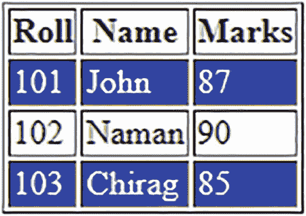
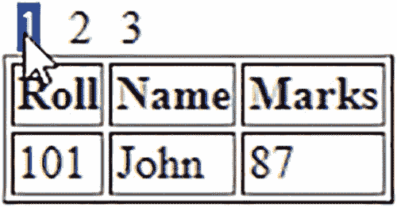

# 八、处理表格

在本章中，您将尝试以下将在餐桌上执行的食谱:

*   悬停在表格行上

*   突出显示替代列

*   筛选出选定的行

*   擦除选定的列

*   给表格编页码

*   展开和折叠列表项

*   展开和折叠表格的行

*   排序列表项目

*   整理表格

*   从表中筛选行

## 8.1 悬停在表格行上

### 问题

您有一个由几行和几列组成的表格。您希望当您悬停在任一行上时(鼠标指针在其上移动)，该行应该突出显示。

### 解决办法

创建一个包含表格元素的 HTML 文件，表格元素中定义了一些行和列元素(`th, td, tr`)。HTML 文件如下所示:

**hover hover ws . html**

```js
<!DOCTYPE html PUBLIC "-//W3C//DTD XHTML 1.0 Transitional//EN"
        "http://www.w3.org/TR/xhtml1/DTD/xhtml1-transitional.dtd">

<html xmlns:="http://www.w3.org/1999/xhtml" xml:lang="en" lang="en">
  <head>
    <meta http-equiv="Content-Type" content="text/html; charset=utf-8"/>
    <title></title>
    <link rel="stylesheet" href="style.css" type="text/css" media="screen" />
    <script src="jquery-3.5.1.js" type="text/javascript"></script>
    <script src="hoverrowsjq.js" type="text/javascript"></script>
  </head>
  <body>
    <table border="1">
       <thead>
           <tr><th>Roll</th><th>Name</th><th>Marks</th></tr>
       </thead>
       <tbody>
           <tr><td>101</td><td>John</td><td>87</td></tr>
           <tr><td>102</td><td>Naman</td><td>90</td></tr>
           <tr><td>103</td><td>Chirag</td><td>85</td></tr>
       </tbody>
    </table>
  </body>
</html>

```

在样式表文件`style.css`中定义一个名为`.hover`的样式规则，将样式属性应用于悬停的行:

**style.css**

```js
.hover { background-color: #00f; color: #fff; }

```

将悬停效果应用于表格行的 jQuery 代码如下:

**hoverhowsjq . js**

```js
$(document).ready(function() {
  $('tbody tr').hover(
    function(){
      $(this).find('td').addClass('hover');
    },
    function(){
      $(this).find('td').removeClass('hover');
    }
  );
});

```

### 它是如何工作的

在 HTML 文件中，您可以看到定义了一个边框为 1px 的表格。它有三个列标题(使用`th`元素定义):**滚动、名称**和**标记**。此外，它还包含三行学生记录。表格标题嵌套在`thead`元素中，表格主体(包含信息的行)嵌套在`tbody`元素中。

在样式表文件中，`.hover`样式规则包含设置为# `00f`的`background-color`属性和设置为值`#fff`的`color`属性，以将悬停行的背景色和前景色分别更改为蓝色和白色。

在 jQuery 代码中，您将`hover()`事件附加到嵌套在`tbody`元素中的`tr`(行元素)上，因为您希望只悬停包含学生信息的行，而不是包含列标题的行。在`hover`事件的事件处理函数中，您搜索悬停行的`td`元素，并应用样式规则`.hover`(存在于样式表文件`style.css`中)中定义的属性将它们的背景色和前景色分别更改为蓝色和白色，以便突出显示它们。

最初，表格如图 [8-1](#Fig1) 所示。


图 8-1

由几行和几列组成的表格

将鼠标指针移动到任一行上时，它们将被高亮显示，如图 [8-2](#Fig2) 所示。


图 8-2

悬停在突出显示的行上

## 8.2 突出显示备选列

### 问题

您有一个由几行和几列组成的表格。您希望突出显示表格的备选列(即，对它们应用了一些样式)。

### 解决办法

对于本解决方案，您将使用与配方 8-1 中相同的 HTML 和样式表文件(`style.css`)。

将样式规则`.hover`中定义的样式属性应用于表的替代列的 jQuery 代码如下:

 **```js
$(document).ready(function() {
  $('td:nth-child(odd)').addClass('hover');
});

```

### 它是如何工作的

由于您在上面的 jQuery 代码中使用的是`:nth-child()`方法，我们先来了解一下它是做什么的。

#### :第 n 个子代( )

此方法用于检索作为其父元素的第 n 个子元素的所有元素。此方法从 1 开始(即，它从 1 而不是从 0 开始计数)。该方法在以下两个方面不同于`:eq()`方法:

*   `:eq()`方法只匹配一个元素，而`:nth-child()`方法匹配多个元素(即，一个元素对应一个具有指定索引的父元素)。

*   `:eq()`方法是基于 0 的(即从 0 开始计数)，而`:nth-child()`是基于 1 的(即从 1 开始计数)。

例如，

```js
$('tr:nth-child(3)');

```

选择作为其父元素(可能是一个`tbody`或`table`元素)的第三个子元素的所有`tr`元素，因此它将选择表格的第三行。

同样，声明

```js
$('tr:nth-child(even)');

```

选择表格中所有偶数行。

在上面的 jQuery 代码中，语句

```js
$('td:nth-child(odd)').addClass('hover');

```

选择表格的奇数列(换句话说，每个`td`都是其父列的奇数子列)并对其应用样式规则`hover`中定义的样式属性，将其背景色改为蓝色，前景色改为白色，如图 [8-3](#Fig3) 所示。


图 8-3

突出显示奇数列的表格

#### 突出显示替代行

要突出显示表中的备用行，请修改 jQuery 代码，如下所示:

**亮显旧行 sjq.js**

```js
$(document).ready(function() {
  $('table tr:odd').addClass('hover');
});

```

该 jQuery 代码将选择表中所有奇数行，并将样式规则`.hover`中定义的样式属性应用于这些行，以便高亮显示它们，如图 [8-4](#Fig4) 所示。



图 8-4

突出显示替代行的表格

#### 突出显示悬停在上面的列

您希望只突出显示那些列标题被悬停的列(即，当鼠标指针移动到任何列标题上时，您希望突出显示该列)。jQuery 代码如下:

**高亮度 column jq . js**

```js
$(document).ready(function() {
  $('th').hover(
    function(){
      var colindex=$(this).parent().children().index(this);
      $('table td:nth-child('+(colindex+1)+')').addClass('hover');
    },
    function(){
      $('table tr').children().removeClass('hover');
    }
  );
});

```

在开始理解 jQuery 代码之前，让我们先了解一下代码中使用的`.index()`方法。

##### 。索引( )

此方法在每个匹配的元素中搜索传递的元素，如果找到，则返回该元素的序号索引，从 0 开始。如果在匹配的集合中没有找到传递的元素，则返回-1。如果在这个方法中传递了一个 jQuery 对象，那么只检查第一个元素。

**语法:**

```js
.index(element)

```

上述 jQuery 代码的含义如下。首先将悬停事件附加到表格标题(`th`)元素。

当用户悬停在一个表格标题上时，您找出该列的索引(列号)并将该索引位置存储在变量`colindex`中。`.index()`方法使用基于 0 的计数，这意味着它从 0 开始计数。因此，索引 0 表示悬停在第一个列标题上，1 表示悬停在第二个列标题上，依此类推。

然后，您可以将样式规则`.hover`中定义的样式属性应用于索引位置存储在变量`colindex`中的列。由于`:nth-child()`方法是基于 1 的(即，与从 0 开始计数的`.index()`方法相比，它是从 1 开始计数的)，所以在将样式规则`.hover`应用到由`hover`事件的事件处理函数中的`colindex`表示的列之前，您需要将存储在变量`colindex`中的值增加 1。

在事件处理函数(当鼠标指针离开列标题时调用)中，从表格的所有行中删除样式规则`.hover`中定义的样式属性。

标题被悬停的列的内容被突出显示，如图 [8-5](#Fig5) 所示。


图 8-5

悬停在列标题上的突出显示的列内容

#### 悬停时突出显示列标题

在上面的示例中，当鼠标悬停在列标题上时，列内容会高亮显示，但列标题不会高亮显示。它看起来和最初一样。您需要在 jQuery 代码中再添加一条语句(以粗体显示)来突出显示列标题:

**高亮度 colheadjq.js**

```js
$(document).ready(function() {
  $('th').hover(
    function(){
      var colindex=$(this).parent().children().index(this);
      $(this).addClass('hover');
      $('table td:nth-child('+(colindex+1)+')').addClass('hover');
    },
    function(){
      $('table tr').children().removeClass('hover');
    }
  );
});

```

该声明

```js
$(this).addClass('hover');

```

如图 [8-6](#Fig6) 所示，当鼠标悬停在列标题上时，将样式规则`.hover`中定义的样式属性应用于列标题。


图 8-6

突出显示的列内容和悬停在列标题上的列标题

#### 当鼠标悬停在表格上时，突出显示表格的各个单元格

您希望当鼠标悬停在表格中除列标题之外的任何单元格上时，它必须高亮显示。执行此操作的 jQuery 代码如下:

**高亮度 cell hoverdajq . js**

```js
$(document).ready(function() {
  $('td').hover(
    function(){
      $(this).addClass('hover');
    },
    function(){
      $('table tr').children().removeClass('hover');
    }
  );
});

```

你可以看到，这次悬停事件被附加到了`td`元素上，因此如果任何单元格被悬停(除了列标题)，样式规则`.hover`中定义的属性将被应用到它，以高亮显示它，如图 [8-7](#Fig7) 所示。


图 8-7

悬停时表格单元格高亮显示

## 8.3 过滤行

### 问题

您有一个由几行和几列组成的表格。您希望当鼠标指针在任何一行上移动时，它必须被突出显示，并且当用户单击该行的任何部分时，除了被单击的行之外，表中的所有行都应该消失。

### 解决办法

对于本解决方案，您将使用与配方 8-1 中相同的 HTML 和样式表文件(`style.css`)。

jQuery 代码突出显示悬停的行，并使除被单击的行之外的所有行变得不可见，如下所示:

**Filterrowsjq.js**

```js
$(document).ready(function() {
  $('tbody tr').hover(
    function(){
      $(this).find('td').addClass('hover');
    },
    function(){
      $(this).find('td').removeClass('hover');
    }
  );
  $('tbody tr').click(function(){
    $('table').find('tbody tr').hide();
    $(this).show();
  });
});

```

### 它是如何工作的

在 jQuery 代码的前半部分，您将`hover()`事件附加到嵌套在`tbody`元素中的`tr`(行元素)上，因为您希望只悬停包含学生信息的行，而不是包含列标题的行。在`hover`事件的事件处理函数中，您搜索悬停行的`td`元素，并应用样式规则`.hover`(存在于样式表文件`style.css`中)中定义的属性将它们的背景色和前景色分别更改为蓝色和白色，以便突出显示它们。

在 jQuery 代码的后半部分，您将 click 事件附加到所有的`tr`元素(嵌套在`tbody`元素中)，并且在它的事件处理函数中，您搜索所有的`tr`元素(嵌套在`tbody`元素中)并且使它们全部不可见(即，除了列标题之外的所有行都不可见)。此后，您使被单击的行的内容可见，因此只有被单击的行出现在表中。

将鼠标悬停在表格的任意一行上，表格将出现如图 [8-8](#Fig8) 所示。


图 8-8

该行在被覆盖时会突出显示

点击任意一行，除了被点击的那一行之外，其他行都不可见，如图 [8-9](#Fig9) 所示。


图 8-9

选定的行留在表格中

#### 隐藏选定的行

您可以修改上面的 jQuery 代码来反转这个过程(即，您可以隐藏选中的行，而不是保留选中的行)。jQuery 代码如下:

**Hidingrowsjq.js**

```js
$(document).ready(function() {

  $('tbody tr').hover(
    function(){
      $(this).find('td').addClass('hover');
    },
    function(){
      $(this).find('td').removeClass('hover');
    }
  );

  $('tbody tr').click(function(){
    $(this).hide();
  });
});

```

您可以在这个 jQuery 代码中看到，通过使用`.hide()`方法使选中的行不可见，从而隐藏了该行。将鼠标悬停在最后一行时，表格可能会出现如图 [8-8](#Fig8) 所示。点击该行时，您会发现它被删除，剩下的表格可能会出现，如图 [8-10](#Fig10) 所示。


图 8-10

选定的行将从表格中删除

## 8.4 隐藏选定的列

### 问题

您有一个由几行和几列组成的表格。您希望当鼠标指针在任何列标题上移动时，该列(包括列标题)被突出显示。此外，当用户单击任何列标题时，整个列及其标题都会被隐藏。

### 解决办法

对于本解决方案，您将使用与配方 8-1 中相同的 HTML 和样式表文件(`style.css`)。

突出显示该列(当其列标题悬停在上方时)并使其内容在被单击时不可见的 jQuery 代码如下:

**hiding column jq . js**的缩写形式

```js
$(document).ready(function() {
  $('th').hover(
    function(){
      var colindex=$(this).parent().children().index(this);
      $(this).addClass('hover');
      $('table td:nth-child('+(colindex+1)+')').addClass('hover');
    },
    function(){
      $('table tr').children().removeClass('hover')

;
    }
  );

  $('th').click(function(){
    $(this).hide();
    colindex=$(this).parent().children().index(this);
    $('table td:nth-child('+(colindex+1)+')').hide();
  });
});

```

### 它是如何工作的

jQuery 代码的含义如下。首先将悬停事件附加到表格的所有列标题上。在事件处理程序中，找出被悬停的列标题的索引位置，并将其存储在变量`colindex`中。`.index()`方法使用基于 0 的计数(即从值 0 开始)。

然后，将样式规则`.hover`中定义的样式属性应用到突出显示的列标题和索引位置存储在`colindex`变量中的列(被悬停的那个)上，以突出显示它们。由于`:nth-child()`方法是从 1 开始的(也就是说，从 1 开始计数，而不是从 0 开始计数)，所以在突出显示它之前，将`colindex`的值增加 1。

当鼠标指针离开列标题时，您将从表格的所有行中删除样式规则`.hover`中定义的属性。

在 click 事件处理程序中，隐藏被点击的列标题，并找出它的索引，存储在`colindex`变量中。

最后，隐藏其值存储在`colindex`变量中的列内容(被单击的列标题的索引位置)。因此，当单击任何列标题时，列标题以及完整的列内容都将不可见。

将鼠标悬停在列标题上时，它将与整个列的内容一起高亮显示，如图 [8-11](#Fig11) 所示。


图 8-11

当鼠标悬停在列标题上时，列内容和列标题会突出显示

点击列标题，它将和列的内容一起被删除，如图 [8-12](#Fig12) 所示。


图 8-12

选定的列将从表格中删除

#### 筛选出列

除了列标题被单击的列之外，您希望使表中的所有列都不可见。也就是说，您希望保留被单击的选定列(及其标题)，使其余的列不可见。

修改后的 jQuery 代码突出显示该列(当其列标题悬停在上方时),并隐藏除被单击列之外的所有列，如下所示:

**过滤栏 jq . js】t1**

```js
$(document).ready(function() {
  $('th').hover(
    function(){
      var colindex=$(this).parent().children().index(this);
      $(this).addClass('hover');
      $('table td:nth-child('+(colindex+1)+')').addClass('hover');
    },
    function(){
      $('table tr').children().removeClass('hover')

;
    }
  );

  $('th').click(function(){
    colindex=$(this).parent().children().index(this);
    $('table th:not(:nth-child('+(colindex+1)+'))').hide();
    $('table td:not(:nth-child('+(colindex+1)+'))').hide();
  });
}

);

```

### 它是如何工作的

让我们看看这个 jQuery 代码中使用的`:not()`选择器。

#### :不是( )

该选择器选择与指定选择器不匹配的所有元素。例如，

```js
$('table :not(.student)')

```

选择表格中不属于类别`student`的所有元素。

jQuery 代码的含义如下。在 hover 事件处理程序中，您找到被悬停的列标题的索引位置，并将其存储在变量`colindex`中。`.index()`方法使用基于 0 的计数(即从值 0 开始计数)。然后，将样式规则`.hover`中定义的样式属性应用到高亮显示的列标题和索引位置存储在`colindex`变量中的列(被悬停的那个)以高亮显示它。因为`:nth-child()`方法是从 1 开始的(即从 1 开始计数，而不是从 0 开始计数)，所以在高亮显示之前，将`colindex`的值增加 1。

当鼠标指针离开列标题时，您将从表格的所有行中删除样式规则`.hover`中定义的属性。

在 click 事件处理程序中，找出被点击的列标题的索引，并将该值存储在`colindex`变量中。

然后使用`:not`选择器隐藏所有未被点击的列标题(即，保留索引位置存储在`colindex`变量中的列标题)。其余的列标题不可见。

最后，隐藏其值不等于存储在`colindex`变量中的索引位置(被点击的列标题的索引位置)的所有列内容。也就是说，其列标题未被单击的所有列都是隐藏的。换句话说，唯一保持可见的列是其列标题被单击的列。

将鼠标悬停在列标题上时，它将与整个列的内容一起高亮显示，如图 [8-13](#Fig13) 所示。


图 8-13

当鼠标悬停在列标题上时，列标题和列内容会突出显示

点击任何列标题，该标题及其列内容将被过滤掉，使表格的其余列不可见，如图 [8-14](#Fig14) 所示。


图 8-14

选定的列被过滤掉

## 8.5 对表格进行分页

### 问题

您有一个由几行和几列组成的表格。您希望表格的行按页面显示。也就是说，在表格的顶部，您希望显示页码，并且当单击任何页码时，显示属于该页码的行。

### 解决办法

对于此解决方案，您将使用在配方 8-1 中使用的相同 HTML 文件。您需要定义样式规则来突出显示页码(当鼠标悬停在上面时)并在页码之间保持一定的间距。您定义的两个样式规则是`.hover`和`.page`，如下面的样式表文件所示:

**style pagination . CSS**

```js
.hover { background-color: #00f; color: #fff; }
.page{ margin:5px; }

```

jQuery 代码将表中的行分成页面(取决于您希望每页看到的行数),并在单击页码时显示相应的行，如下所示:

**page ingtablejq . js**

```js
$(document).ready(function() {
  var rows=$('table').find('tbody tr').length;
  var no_rec_per_page=1;
  var no_pages= Math.ceil(rows/no_rec_per_page);
  var $pagenumbers=$('<div id="pages"></div>');
  for(i=0;i<no_pages;i++)
  {
    $('<span class="page">'+(i+1)+'</span>').appendTo($pagenumbers);
  }
  $pagenumbers.insertBefore('table');

  $('.page').hover(
    function(){
      $(this).addClass('hover');
    },
    function(){
      $(this).removeClass('hover');
    }

  );

  $('table').find('tbody tr').hide();
  var tr=$('table tbody tr');

  $('span').click(function(event){
    $('table').find('tbody tr').hide();
    for(var i=($(this).text()-1)*no_rec_per_page;
        i<=$(this).text()*no_rec_per_page-1;
        i++)
    {
      $(tr[i]).show();
    }
  });
});

```

### 它是如何工作的

样式规则`.hover`包含分别设置为值`#00f`和`#fff`的`background-color`和`color`属性，将悬停页码的背景色变为蓝色，前景色变为白色。样式规则`.page`包含设置为`5px`的`margin`属性，以在页码之间创建 5px 的间距。

jQuery 代码执行以下任务。首先计算行数(嵌套在`tbody`元素中的`tr`元素)，并将计数存储在变量`rows`中。对于这个例子，您希望每页只看到一行，所以您将变量`no_rec_per_page`的值初始化为 1。接下来，您必须通过将总行数除以您希望在每页上看到的记录数来确定总页数。页数被分配给变量`no_pages`。在开始处理事件处理程序之前，要做的最后一件事是设置页码显示。首先定义 id 为`pages`的`div`元素，并将其赋给变量`$pagenumbers`。

在一个`for`循环的帮助下，你创建了几个包含页码 1、2…序列的 span 元素(等于页数), span 元素被赋予了名为`page`的类，这样在类选择器`.page`中定义的样式属性可以自动应用到所有的页码。最后，所有包含页码的 span 元素都被附加到 id `pages`的`div`元素中。为了完成这项工作，您将 id 为`pages`的`div`元素插入到 table 元素之前的变量`$pagenumbers`中。这使得页码出现在表格上方。

接下来，将`hover()`事件附加到页码上(类`.pages`的 span 元素)。在事件处理程序中，当鼠标指针移动到页码上时，突出显示页码(样式规则`.hover`中定义的属性应用于页码，将它们的背景色和前景色分别更改为蓝色和白色)。相反，当鼠标指针离开它们时，您删除了样式属性(样式规则`.hover`)。

在 hover 事件处理程序之后，因为您不想在页面第一次加载时看到任何数据，所以您隐藏了表格的所有行(`tr`元素嵌套在`tbody`元素中)，只保持列标题可见。只有当用户选择一个页码时，才会显示属于该页码的行。然后检索表中的所有行，并将它们存储在变量`tr`中(也就是说，现在`tr`是一个包含表中所有行的数组)。

在页码的 click 事件处理程序中，隐藏表格的所有行(仅保持列可见)。然后，使用`tr`数组显示被点击的页码范围内的行。

最初，你得到一个空白表格，顶部只有列标题和页码，如图 [8-15](#Fig15) 所示。


图 8-15

带有列标题和页码的表格

将鼠标悬停在任意页码上，该页码将被高亮显示，点击该页码，将显示该页码的行，如图 [8-16](#Fig16) 所示。



图 8-16

显示页码为 1 的行(假设每页 1 行)

您只显示了一行，因为您将变量`no_rec_per_page`(决定每页显示的行数)的值设置为 1(参考第 3 条语句)。让我们设置它的值等于 5。假设 HTML 文件的 table 元素中增加了一些行，你现在可以选择任意页码得到 5 行，如图 [8-17](#Fig17) 所示。


图 8-17

显示页码 1 的行(假设每页五行)

此外，您可以修改 jQuery 代码，在开头显示属于第 1 页的行(而不是只显示列标题；参见图 [8-15](#Fig15) 。默认情况下，显示第一页页码的行的 jQuery 代码如下:

**行第一页 jq.js**

```js
$(document).ready(function() {
  var rows=$('table').find('tbody tr').length;
  var no_rec_per_page=1;
  var no_pages= Math.ceil(rows/no_rec_per_page);
  var $pagenumbers=$('<div id="pages"></div>');
  for(i=0;i<no_pages;i++)
  {
    $('<span class="page">'+(i+1)+'</span>').appendTo($pagenumbers);
  }
  $pagenumbers.insertBefore('table');

  $('.page').hover(
    function(){
      $(this).addClass('hover');
    },
    function(){
      $(this).removeClass('hover');
    }
  );

  $('table').find('tbody tr').hide();
  var tr=$('table tbody tr');

  for(var i=0;i<=no_rec_per_page-1;i++)
  {
    $(tr[i]).show();
  }

  $('span').click(function(event){
    $('table').find('tbody tr').hide();
    for(i=($(this).text()-1)*no_rec_per_page;i<=$(this).text()*no_rec_per_page-1;i++)
    {
      $(tr[i]).show();
    }

  });
});

```

您可以看到添加了一个`for`循环，使第一个页码的行(取决于分配给变量`no_rec_per_page`的值)在屏幕上可见。

## 8.6 展开和折叠列表项

### 问题

您有一个包含两个列表项的无序列表，这两个列表项又包含一个嵌套的无序列表。您希望这两个列表项在其左侧显示一个加号(+)图标(表示其中隐藏了一些项目)。当用户选择加号图标时，您希望列表项展开以显示隐藏在其中的所有元素，并且您还希望在展开模式下加号图标替换为减号(-)图标。

### 解决办法

创建一个 HTML 文件，其中包含一个无序列表，该列表包含两个列表项，**茶**和**咖啡**。两个列表项都被赋予类名`drink`，以便通过 jQuery 代码来识别和访问它们。第一个列表项( **Tea** )包含三个列表项的无序列表。三个列表项的文本分别是**大吉岭、阿萨姆**和**喀拉拉邦**。列表项**阿萨姆邦**被分配了名为`drink`的类，它包含一个无序列表项，有两个列表项:**绿叶**和**草药**。

第二个列表项， **Coffee** ，包含一个无序列表元素，其中有两个列表项: **Cochin** 和 **Kerala** 。HTML 文件如下所示:

**Expandingcollapsinglist.html**

```js
<!DOCTYPE html PUBLIC "-//W3C//DTD XHTML 1.0 Transitional//EN"
        "http://www.w3.org/TR/xhtml1/DTD/xhtml1-transitional.dtd">

<html xmlns:="http://www.w3.org/1999/xhtml" xml:lang="en" lang="en">
  <head>
    <meta http-equiv="Content-Type" content="text/html; charset=utf-8"/>
    <title></title>
    <link rel="stylesheet" href="styleexpandlist.css" type="text/css" media="screen" />
    <script src="jquery-3.5.1.js" type="text/javascript"></script>
    <script src="expandcollapselistjq.js" type="text/javascript"></script>
  </head>
  <body>
       <ul>
            <li class="drink">Tea
            <ul>
                    <li>Darjeeling</li>
                    <li class="drink">Assam
                    <ul>
                             <li>Green Leaves</li>
                             <li>Herbal</li>
                    </ul>
                    </li>
                    <li>Kerala</li>
            </ul>
            </li>
            <li class="drink">Coffee
            <ul>
                    <li>Cochin</li>
                    <li>Kerala</li>
            </ul>
            </li>
       </ul>
  </body>

</html>

```

在没有应用任何样式或 jQuery 代码的情况下，上面的 HTML 文件在执行时显示无序列表及其各自的列表项，如图 [8-18](#Fig18) 所示。


图 8-18

无序列表元素及其列表项

要将加号和减号图标添加到列表项中，您需要应用某些样式规则。样式表文件`style.css`包含以下样式规则:

**样式表导出列表. css**

```js
.plusimageapply{list-style-image:url(plus.jpg);}
.minusimageapply{list-style-image:url(minus.jpg);}
.noimage{list-style-image:none;}

```

为了将这些样式规则应用于列表项，并使它们在选择左侧的加号和减号图标时展开和折叠，您需要使用以下 jQuery 代码:

**展开胶盖 q.js**

```js
$(document).ready(function() {
  $('li.drink').addClass('plusimageapply');
  $('li.drink').children().addClass('noimage');
  $('li.drink').children().hide();
  $('li.drink').each(
    function(column) {
      $(this).click(function(event){
        if (this == event.target) {
          if($(this).is('.plusimageapply')) {
            $(this).children().show();
            $(this).removeClass('plusimageapply');
            $(this).addClass('minusimageapply');
          }
          else
          {
            $(this).children().hide();
            $(this).removeClass('minusimageapply');
            $(this).addClass('plusimageapply');
          }
        }
      });
    }

  );
});

```

### 它是如何工作的

样式规则`plusimageapply`应用于所有包含嵌套无序列表的列表项(折叠模式),它包含设置为值`url(plus.jpg)`的`list-style-image`属性，用加号图标(存在于图像文件`plus.jpg`中)替换传统的项目符号。类似地，样式规则`minusimageapply`应用于扩展模式中的所有列表项，它包含设置为值`url(minus.jpg)`的`list-style-image`属性，以在列表项的左侧显示一个减号图标。(图像文件`minus.jpg`中包含一个减号图标。)样式规则`noimage`应用于所有没有无序列表嵌套的列表项，并且它包含设置为值`none`的`list-style-image`属性，以便用传统的项目符号显示它们。

jQuery 代码的含义如下。对类别`drink`的列表项(那些嵌套了无序列表项的列表项)应用样式规则`plusimageapply`，使加号图标出现在它们的左侧。对于其余的列表项(其中没有嵌套的列表项)，应用样式规则`noimage`使它们以传统的项目符号出现。最初，您使列表项的所有嵌套元素(包含无序列表项)不可见。也就是说，您让所有列表项(包含无序列表项)以折叠模式显示。

要应用扩展功能，您需要将一个 click 事件逐个附加到每个列表项(其中有一个无序列表项)。在事件处理程序中，检查发生单击事件的列表项是否应用了样式规则`plusimageapply`。也就是说，测试列表项是否有加号图标。如果有，则显示列表项的隐藏内容。

然后，删除样式规则`plusimageapply`的样式属性，并应用样式规则`minusimageapply`的样式属性，将展开列表项的加号图标替换为减号图标。

如果被点击的列表项左边有一个减号图标(即样式规则`plusimageapply`没有应用于它)，那么你隐藏了嵌套的内容。

您还可以删除样式规则`minusimageapply`的样式属性，并应用样式规则`plusimageapply`的样式属性，将处于折叠模式的列表项的减号图标替换为加号图标(您需要折叠应用了`minusimageapply`样式规则并被单击的列表项)。

最初，列表项将以折叠模式出现，左侧有一个加号图标，如图 [8-19](#Fig19) 所示。


图 8-19

折叠模式下的两个列表项

选择加号图标(或列表项本身)，它将被展开，显示其中嵌套的无序列表，并将加号图标替换为减号图标，如图**图** [8-20](#Fig20) 所示。**阿萨姆邦**列表项中有一个无序列表项，这就是为什么它的左边有一个加号图标。


图 8-20

单击时显示的第一个列表项的内容

在选择**阿萨姆邦**列表项的加号图标时，会展开显示其中隐藏的列表项，加号图标会被减号图标取代，如图 [8-21](#Fig21) 所示。


图 8-21

单击时显示的第一个列表项的嵌套列表项的内容

在选择**咖啡**列表项的加号图标(或列表项本身)时，会展开显示其中的列表项，加号图标会被减号图标取代，如图 [8-22](#Fig22) 所示。


图 8-22

单击时显示的第二个列表项的内容

## 8.7 展开和折叠表格的行

### 问题

假设您有一个由 15 行组成的表，每行有三列。该表代表学生的记录。该表最初显示三行:**辊 101-105、**辊 106-110、**辊 111-115** 。您希望一次最多看到五个学生的记录，所以如果您将鼠标悬停在第**行 Roll 101-105** 上，它会展开以显示编号在 101 和 105 之间的学生记录。类似地，如果您将鼠标悬停在第**行 Roll 106-110** 上，它会展开以显示具有给定范围的编号的学生记录，依此类推。

### 解决办法

创建一个包含表格元素的 HTML 文件，该表格元素包含表格标题和由 15 行(`tr`)元素组成的表格体，如下所示:

**Expandcollapserows.html**

```js
<!DOCTYPE html PUBLIC "-//W3C//DTD XHTML 1.0 Transitional//EN"
        "http://www.w3.org/TR/xhtml1/DTD/xhtml1-transitional.dtd">

<html xmlns:="http://www.w3.org/1999/xhtml" xml:lang="en" lang="en">
  <head>
    <meta http-equiv="Content-Type" content="text/html; charset=utf-8"/>
    <title></title>
    <link rel="stylesheet" href="style.css" type="text/css" media="screen" />
    <script src="jquery-3.5.1.js" type="text/javascript"></script>
    <script src="expandcollapserowsjq.js" type="text/javascript"></script>
  </head>
  <body>
    <table border="1">
        <thead>
            <tr><th>Roll</th><th>Name</th><th>Marks</th></tr>
        </thead>
        <tbody>
            <tr><td colspan=3 class="studgroup" align="center">Roll 101-105</td></tr>
            <tr><td>101</td><td>John</td><td>87</td></tr>
            <tr><td>102</td><td>Naman</td><td>90</td></tr>
            <tr><td>103</td><td>Chirag</td><td>85</td></tr>
            <tr><td>104</td><td>David</td><td>92</td></tr>
            <tr><td>105</td><td>Kelly</td><td>81</td></tr>
            <tr><td colspan=3 class="studgroup"  align="center">Roll 106-110</td></tr>
            <tr><td>106</td><td>Charles</td><td>77</td></tr>
            <tr><td>107</td><td>Jerry</td><td>91</td></tr>
            <tr><td>108</td><td>Beth</td><td>75</td></tr>
            <tr><td>109</td><td>Caroline</td><td>82</td></tr>
            <tr><td>110</td><td>Hanen</td><td>71</td></tr>
            <tr><td colspan=3 class="studgroup"  align="center">Roll 111-115</td></tr>
            <tr><td>111</td><td>Douglas</td><td>57</td></tr>
            <tr><td>112</td><td>Tim</td><td>86</td></tr>
            <tr><td>113</td><td>Michael</td><td>68</td></tr>
            <tr><td>114</td><td>Kimbley</td><td>88</td></tr>
            <tr><td>115</td><td>Christina</td><td>72</td></tr>
        </tbody>
    </table>
  </body>
</html>

```

表格标题由嵌套在`thead`元素中的`th`元素表示，学生记录由嵌套在`tbody`元素中的`tr`元素表示。要指定一个 5 行的块，您需要定义 3 行(由一个跨越 3 列的`td`元素组成)，分别称为 **Roll 101-105、Roll 106-110** 和 **Roll 111-115** 。这些行(`td`元素跨越三列)被分配了类`studgroup`，以便在 jQuery 中识别和使用它们。

为了突出显示这些行，在样式表文件`style.css`中定义一个样式规则`.hover`，如下所示:

**style.css**

```js
.hover { background-color: #00f; color: #fff; }

```

当鼠标悬停在相应的行(指定相应的行块)上时，扩展隐藏行的 jQuery 代码如下:

**展开 collapserowssjq . js**

```js
$(document).ready(function() {
     $('table tbody tr').hide();
     $('table tbody').find('.studgroup').parent().show();
  $('tbody tr').hover(
       function(){
            var tr=$('table tbody tr');
               var rindex=$(this).parent().children().index(this);
            for(var i=rindex;i<=rindex+5;i++)
            {
              $(tr[i]).show();
            }
               $(this).addClass('hover');
          },
          function(){
               $('table tbody tr').hide();
               $('table tbody').find('.studgroup').parent().show();
               $(this).removeClass('hover');
          }
       );
});

```

### 它是如何工作的

`.hover`样式规则包含设置为`#00f`的`background-color`属性和设置为`#fff`的`color`属性，以将悬停行的背景色和前景色分别更改为蓝色和白色。

jQuery 代码的含义如下。首先隐藏嵌套在表格的`tbody`元素中的所有行(即，除了表格标题之外，隐藏所有的行)。

然后显示代表五行块的三行(由跨越三列的`td`元素组成): **Roll 101-105、Roll 106-110** 和 **Roll 111-115** 。这三行被赋予类名`studgroup`。

然后将悬停事件附加到表格的可见行。在事件处理程序中，当鼠标指针移动到该行上时高亮显示该行(在样式规则`.hover`中定义的属性被应用到该行，将其背景和前景色分别更改为蓝色和白色)。相反，当鼠标指针离开该行时，您将删除样式属性(样式规则`.hover`)。同样，在悬停事件处理程序中，您检索表中的所有行，并将它们存储在变量`tr`中(即，现在`tr`是一个包含表中所有行的数组，您找出用户悬停的行的索引号，并将其存储在变量`rindex`)。此后，在一个`for`循环的帮助下，显示接下来的 5 行(即，显示行标题下的行(类名`studgroup`)。

在鼠标指针离开行时执行的悬停事件的事件处理程序中，除了删除`hover`样式规则的属性之外，还隐藏了除标题行之外的所有行。

在执行上面的 jQuery 代码时，您会发现带有文本 **Roll 101-105、Roll 106-110、**和 **Roll 111-115** 的三行，它们指定了下面的记录组，如图 [8-23](#Fig23) 所示。


图 8-23

带有行的表格，指定其下的行组

将鼠标悬停在任一行上时，将显示嵌套在类名`studgroup`的行中的五条记录。因此，如果您将鼠标悬停在行 **Roll 101-105** 上，您将获得如图 [8-24](#Fig24) 所示的行，并且悬停的行也将突出显示。


图 8-24

当鼠标悬停在指定学生组的行上时，显示学生的记录

类似地，当行 **Roll 111-115** 被悬停时，不仅该行会被高亮显示，而且属于该卷号范围的学生记录也会被显示，如图 [8-25](#Fig25) 所示。


图 8-25

各自的学生记录显示在悬停在他们的行组上

#### 带有加号和减号图标的行

对于各行(如图 [8-23](#Fig23) 所示),您希望在其左侧显示一个加号图标。当鼠标悬停在这些行上时，它应该展开以显示相应范围内的记录，加号图标应该替换为减号图标。

jQuery 代码可以修改如下:

**瑞士联合交易所**

```js
$(document).ready(function() {
     $('.studgroup').css(
               {'background-image':"url(plus.jpg)",
               'background-repeat':"no-repeat",
               'background-position':"left"}
       );
     $('table tbody tr').hide();
     $('table tbody').find('.studgroup').parent().show();
       $('tbody tr').hover(
          function(){
               $(this).find('.studgroup').css(
                    {'background-image':"url(minus.jpg)",
                             'background-repeat':"no-repeat",
                             'background-position':"left"}
               );
                 var tr=$('table tbody tr');
               var rindex=$(this).parent().children().index(this);
                 for(var i=rindex;i<=rindex+5;i++)
                 {
                        $(tr[i]).show();
                 }
                     $(this).addClass('hover');
              },
              function(){
                     $(this).find('.studgroup').css(
                            {'background-image':"url(plus.jpg)",
                             'background-repeat':"no-repeat",
                             'background-position':"left"}
                     );
               $('table tbody tr').hide();
               $('table tbody').find('.studgroup').parent().show();
               $(this).removeClass('hover');
              }
       );
});

```

jQuery 代码的含义如下。在显示卷号范围的行中(横跨三列的`td`元素，并分配了类别`.studgroup`，您显示一个存在于图像文件`plus.jpg`中的加号图标。此外，您还可以利用`.css()`方法中的`background-repeat`和`background-position`属性来使图标只出现一次，并且出现在该行的左侧。

然后隐藏嵌套在表的`tbody`元素中的所有行。也就是说，您隐藏了所有学生的记录(除了表格标题),因为您希望仅当鼠标悬停在相应行的加号图标上时才显示它们。然后，您将显示显示卷号范围的三行(分配了类别`studgroup`并附有加号图标的行)。

当鼠标悬停在任一行上时，使用`.css()`方法将其加号图标替换为减号图标，并将`background-repeat`和`background-position`属性分别设置为值`no-repeat`和`left`，以使减号仅出现一次，并且位于该行的左侧。此外，在悬停事件处理程序中，您检索表中的所有行并将它们存储在变量`tr`中(即，现在`tr`是一个包含表中所有行的数组，您找出用户悬停的行的索引号并将其存储在变量`rindex`中)。此后，在一个`for`循环的帮助下，显示接下来的 5 行(即，显示行标题(类名`studgroup`)下的行)。最后，对于悬停事件，应用样式规则`hover`中定义的属性来突出显示悬停的行。

当鼠标指针离开悬停的行时，使用`.css()`方法将其减号图标替换为加号图标，并将`background-repeat`和`background-position`属性分别设置为值`no-repeat`和`left`，以使加号图标仅出现一次，并且位于该行的左侧。然后隐藏表格中的所有行，除了显示滚动编号范围和加号图标的行(这是当鼠标指针从悬停的行移开时您想要的)。

最后，删除在`.hover`样式规则中定义的属性，使鼠标指针离开该行时，该行显示为最初的样子。

在执行这个 jQuery 代码时，您会发现三行文本 **Roll 101-105、Roll 106-110、**和 **Roll 111-115** ，它们指定了下面的一组记录。此外，你会发现每一行的左边都有一个加号图标，表示这些行当前处于折叠模式，如图 [8-26](#Fig26) 所示。


图 8-26

下方指定一组记录的行，左侧有一个加号图标

当你将鼠标悬停在任一行上时，比如说**掷骰 101-105** ，该行将被高亮显示，并且将显示在 101-105 范围内的学生记录，同时加号图标将被悬停行中的减号图标所取代，如图 [8-27](#Fig27) 所示。


图 8-27

悬停的行组显示其范围内的记录，加号图标被减号图标替换

同样，如果您将鼠标悬停在第**行 106-110** 上，它将被高亮显示，并且将显示编号在 106-110 范围内的学生记录。此外，悬停行的加号图标将被减号图标取代，同时失去焦点的行(之前悬停的行)将恢复加号图标，并显示为最初的样子，如图 [8-28](#Fig28) 所示。


图 8-28

当焦点不在行组上时，行组恢复加号图标来表示折叠模式

## 8.8 列表项排序

### 问题

您有一个由几个列表项组成的无序列表，您想对这些列表项进行排序。

### 解决办法

制作一个包含无序列表的 HTML 文件:

**sort English . html**

```js
<!DOCTYPE html PUBLIC "-//W3C//DTD XHTML 1.0 Transitional//EN"
        "http://www.w3.org/TR/xhtml1/DTD/xhtml1-transitional.dtd">

<html xmlns:="http://www.w3.org/1999/xhtml" xml:lang="en" lang="en">
  <head>
    <meta http-equiv="Content-Type" content="text/html; charset=utf-8"/>
    <title></title>
    <script src="jquery-3.5.1.js" type="text/javascript"></script>
    <script src="sortinglistjq.js" type="text/javascript"></script>
  </head>
  <body>
<ul>
        <li>Tea</li>
        <li>Coffee</li>
        <li>Pepsi</li>
        <li>Energy Drink</li>
        <li>Soup</li>
</ul>
  </body>
</html>

```

该 HTML 文件在浏览器中打开时将显示如图 [8-29](#Fig29) 所示的列表项目。


图 8-29

原始未排序列表项目

对无序列表元素的列表项进行排序的 jQuery 代码如下:

**幸运之神。js**

```js
$(document).ready(function() {
       var drinks = $('ul').children('li').get();
       drinks.sort(function(a, b) {
              var val1 = $(a).text().toUpperCase();
              var val2 = $(b).text().toUpperCase();
              return (val1 < val2) ? -1 : (val1 > val2) ? 1 : 0;
       });

       $.each(drinks, function(index, row) {
              $('ul').append(row);
       });
});

```

### 它是如何工作的

jQuery 代码语句的含义如下。您获得了一个无序列表的所有子列表项，并将它们存储在变量`drinks`中，该变量将成为一个包含列表项文本的数组。

然后对`drinks`数组调用`.sort()`函数，该函数一次重复获取数组中的两个元素，并将它们赋给参数`a`和`b`进行比较。排序函数将根据分配给参数`a`和`b`的值返回一个值。当函数返回时

*   < 0:表示第二个值大于第一个值，因此被下推。

*   =0:两个值相等，不需要改变排序顺序。

*   > 0:表示第一个值大于第二个值，必须下推。

在调用排序算法之前，将传递给排序函数的两个数组元素转换为大写。然后使用排序算法返回值，如上所述，这将按字母顺序(升序)对列表项进行排序。

最后，`each()`函数对数组`drinks`(包含排序的列表项)进行操作，从中提取存储在其中的每个元素，并将其追加到无序列表元素中(即，将排序的列表项追加到无序列表元素中进行显示)。

在执行 jQuery 代码时，您会得到如图 [8-30](#Fig30) 所示的排序列表。


图 8-30

排序列表项目

## 8.9 对表格排序

### 问题

您有一个由几行和几列组成的表格。您希望当您选择表中的任意列时，其内容按照所选列的升序排序。

### 解决办法

创建一个包含表格元素的 HTML 文件，表格元素中定义了一些行和列元素:

**可排序. html**

```js
<!DOCTYPE html PUBLIC "-//W3C//DTD XHTML 1.0 Transitional//EN"
        "http://www.w3.org/TR/xhtml1/DTD/xhtml1-transitional.dtd">

<html xmlns:="http://www.w3.org/1999/xhtml" xml:lang="en" lang="en">
  <head>
    <meta http-equiv="Content-Type" content="text/html; charset=utf-8"/>
    <title></title>
    <link rel="stylesheet" href="stylesortingtable.css" type="text/css" media="screen" />
    <script src="jquery-3.5.1.js" type="text/javascript"></script>
    <script src="sortingtablejq.js" type="text/javascript"></script>
  </head>
  <body>
     <table border="1">
         <thead>
              <tr><th>Roll</th><th>Name</th><th>Marks</th></tr>
         </thead>

         <tbody>
              <tr><td>103</td><td>Chirag</td><td>85</td></tr>
             <tr><td>102</td><td>Naman</td><td>90</td></tr>
             <tr><td>101</td><td>John</td><td>87</td></tr>
         </tbody>
      </table>
  </body>
</html>

```

在这个 HTML 文件中，您可以看到一个边框为 1px 的表格由三个列标题定义(使用`th`元素定义): **Roll** 、 **Name、**和 **Marks** 。此外，它还包含三行学生记录。表格标题嵌套在`thead`元素中，表格主体(包含信息的行)嵌套在`tbody`元素中。

你将分三步学习这个食谱 **:**

1.  确定单击了哪个列标题

2.  根据选定的列对表格进行排序(仅按升序)

3.  根据所选列对表格进行升序和降序排序

#### 确定单击了哪个列标题

在按任何列的升序或降序对表格进行排序之前，您需要知道表格的哪个列标题被选中。为了突出显示用户选择的列标题，您需要在样式表文件中定义一个名为`.hover`的样式规则:

**stylesortingtable.css**

```js
.hover{
     cursor: default;
     color: blue ;
     background-color:cyan
}

```

显示用户选择了哪个列标题的 jQuery 代码如下:

**Sortingtablejq.js**

```js
$(document).ready(function() {
  $('th').each(function() {
    $(this).hover(
      function(){
        $(this).addClass('hover');
      },
      function(){
        $(this).removeClass('hover');
      }

    );

    $(this).click(function(){
      alert($(this).text()+' column is selected');
    });
  });
});

```

### 它是如何工作的

在样式表文件中，样式规则`.hover`包含设置为`default`的`cursor`属性，以使鼠标指针正常显示(以指针的形式)。`color`和`background`颜色属性分别设置为蓝色和青色，将突出显示的列标题的背景色变为青色，前景色变为蓝色。

您可以在 jQuery 代码中看到，每个表格标题都被检查，看它是否被悬停。如果一个表格标题被悬停(鼠标指针在上面移动)，在样式规则`.hover`中定义的样式属性被应用于它以高亮显示它(它的背景色变为青色，它的前景色变为蓝色)。此外，当鼠标指针离开列标题时，`.hover`样式规则的样式属性将被删除，使列标题显示为最初的样子。此外，还要检查是否单击了任何表格标题。如果一个表格标题被点击，你使用`alert()`方法显示列标题的文本。

将鼠标指针移动到任一列标题上时，它会高亮显示，并通过`alert()`方法显示其名称，如图 [8-31](#Fig31) 所示。


图 8-31

悬停在列标题上时显示的列名

#### 根据选定的列对表格进行排序(仅按升序)

按选定列的升序对表进行排序的 jQuery 代码如下:

**【定序结肠镜检查. js】**

```js
$(document).ready(function() {
  $('th').each(function(column) {
    $(this).hover(
      function(){
        $(this).addClass('hover');
      },
      function(){
        $(this).removeClass('hover');
      }
    );

    $(this).click(function(){
      var rec=$('table').find('tbody >tr').get();
      rec.sort(function(a, b) {
        var val1 = $(a).children('td').eq(column).text().toUpperCase();
        var val2 = $(b).children('td').eq(column).text().toUpperCase();
        return (val1 < val2) ? -1 : (val1 > val2) ? 1 : 0;
      });

      $.each(rec, function(index, row) {
        $('tbody').append(row);
      });
    });
  });
});

```

在这段代码中，>符号是一个选择器，用于查找所选元素的子元素:

#### >

它是一个选择器，表示所选元素的子元素。

语法:

```js
E1>E2

```

它选择与元素 E2 匹配的元素 E1 的所有子元素。

jQuery 代码的含义如下。检查每个表格标题，看它是否被悬停。如果将鼠标悬停在任何表格标题上，样式规则`.hover`中定义的样式属性将应用于该标题以高亮显示。此外，当鼠标指针离开列标题时，`.hover`样式规则的样式属性将被删除，使列标题显示为最初的样子。

然后在每个表格标题上附加一个 click 事件。在 click 处理程序中，检索所有表格行(嵌套在`tbody`元素中)并将它们存储在变量`rec`中。`rec`现在是一个包含所有表格行的数组。通过调用`rec`数组上的`sort()`函数，您可以一次重复获取数组中的两个元素(行),并按升序排列它们。

为此，传递给`sort()`函数的第一个和第二个参数(行)的列内容被提取出来，并在比较之前转换成大写。

然后，`sort()`函数返回三个值< 0、=0 或> 0 中的任意一个，这有助于决定哪些列内容应该在排序顺序中前移，哪些应该在排序顺序中下移。当这个`sort`函数结束时，`rec`数组将所有的行按照所选列的升序排序。

最后，从`rec`数组中检索排序后的行，并附加到表的`tbody`元素中进行显示。

最初，表格如图 [8-32](#Fig32) 所示。


图 8-32

原始未排序表格

在选择**辊**栏时，该栏被高亮显示，表格行按照辊号的升序排列，如图 [8-33](#Fig33) 所示。


图 8-33

按卷号升序排序的表格

类似地，在选择**名称**列时，它被高亮显示，并且表格行按照名称的升序排序，如图 [8-34](#Fig34) 所示。


图 8-34

按名称升序排序的表格

#### 根据选定的列按升序和降序对表格进行排序

您希望如果第一次单击任何列标题，表格必须按该列的升序排序，如果再次单击该列，表格必须按该列的降序排序。换句话说，您希望每次点击时切换排序顺序。为了通知用户当前对列应用的排序顺序，您需要在列标题中显示向上或向下箭头。向上箭头表示表格当前按列的升序排序，向下箭头表示表格按列的降序排序。

要在列标题中显示上下箭头，需要在样式表文件中定义两个样式规则，`stylesortcolascdesc.css`:

**style sort scdesc . CSS**

```js
.asc{
     background:url('up.png') no-repeat; padding-left:20px;
}

.desc{
     background:url('down.png') no-repeat; padding-left:20px;
}

```

让我们修改 jQuery 代码，以便按照所选列的升序和降序对表进行排序。jQuery 代码如下:

**幸灾乐祸。js**

```js
$(document).ready(function() {
  $('th').each(function(column) {
    $(this).hover(
      function(){
        $(this).addClass('hover');
      },
      function(){
        $(this).removeClass('hover');
      }
    );

    $(this).click(function(){
      if($(this).is('.asc'))
      {
        $(this).removeClass('asc');
        $(this).addClass('desc');
        sortdir=-1;
      }
      else
      {
        $(this).addClass('asc');
        $(this).removeClass('desc');
        sortdir=1;
      }
      $(this).siblings().removeClass('asc');
      $(this).siblings().removeClass('desc');

      var rec=$('table').find('tbody >tr').get();

      rec.sort(function(a, b) {
        var val1 = $(a).children('td').eq(column).text().toUpperCase();
        var val2 = $(b).children('td').eq(column).text().toUpperCase();
        return (val1 < val2) ? -sortdir : (val1 > val2) ? sortdir : 0;
      });

      $.each(rec, function(index, row) {
        $('tbody').append(row);
      });
    });

  });
});

```

### 它是如何工作的

样式规则`.asc`包含设置为`url(up.png)`的`background`属性，以在列标题中显示向上箭头指针。值`no-repeat`将使指针在列标题中只出现一次，并且`padding-left`属性被设置为`20px`以在左边留出一些空间。类似地，样式规则`desc`包含`background`属性来显示列标题中的向下箭头指针。

jQuery 代码执行以下任务。检查每个表格标题，看它是否被悬停。如果将鼠标悬停在表格标题上，则样式规则`.hover`中定义的样式属性将应用于表格标题以高亮显示。此外，当鼠标指针离开列标题时，`.hover`样式规则的样式属性将被删除，使列标题显示为最初的样子。

然后将一个 click 事件附加到每个表格标题上，并检查所选的列标题是否应用了样式规则`.asc`。也就是说，检查表格是否已经按照所选列标题的升序排序。

如果是，您删除样式`asc`中定义的样式属性，并应用样式`desc`中定义的样式属性(当已经按升序排序的列标题再次被单击时)。因此，列标题将在其左侧显示一个向下的箭头指针。此外，变量`sortdir`的值被设置为`-1`，用于操作`sort`函数的返回值，以降序排序。

如果所选列已经应用了`desc`样式规则(即，表格按照所选列的降序排序)，则删除样式规则`desc`中定义的样式属性，并应用样式规则`asc`中定义的属性，这将使一个向上箭头指针出现在列标题的左侧。此外，变量`sortdir`的值被设置为`1`，以使`sort`函数按升序进行排序。

一旦对列进行了排序，您需要从除用户选择的列标题之外的所有列标题中删除其他列标题的样式规则`.asc`和`.desc`的属性(这些属性可能已经应用于其他列标题)。您还需要检索所有表格行(嵌套在`tbody`元素中)并将它们存储在变量`rec`中。`rec`现在将是一个包含所有表格行的数组。

然后，您可以在`rec`数组上调用`sort`函数。`sort`函数将一次重复获取数组中的两个元素(行),并按照变量`sortdir`中的值决定的排序顺序排列它们。`sort`函数首先提取传递给`sort`函数的第一个和第二个参数(行)的列内容，并在比较前转换成大写。

该函数返回三个值<0, =0, or > 0 中的任意一个，这有助于决定哪些列内容应该在排序顺序中前移，哪些应该在排序顺序中下移。当这个`sort`函数结束时，`rec`数组根据分配给变量`sortdir`的值，将所有行按照所选列的升序或降序排序。

最后，从`rec`数组中检索排序后的行，并附加到表的`tbody`元素中进行显示。

最初，表格可能如图 [8-35](#Fig35) 所示。


图 8-35

由几行和几列组成的原始未排序表格

选择列标题`Name`一次，你会看到一个向上的箭头指针出现在它的左边(代表排序将按升序进行),表格将按名称的字母顺序排序，如图 [8-36](#Fig36) 所示。


图 8-36

按名称升序排序的表格

再次选择`Name`列标题，您会发现列标题中出现一个向下的指针(表示将按降序排序)，表格将按图 [8-37](#Fig37) 所示的名称降序排序。


图 8-37

按名称降序排序的表格

## 8.10 从表中过滤行

### 问题

您有一个由几行和几列组成的表格，前面有一个输入文本字段。您希望根据用户在输入文本字段中键入的字符来过滤表中的行。因此，如果用户输入字符 c，将显示表中名称以字符 c 开头的所有行，其余的行将被过滤掉。

### 解决办法

创建一个 HTML 文件，其中包含一个带有一些行和列元素的表格元素。此外，在表格之前，显示消息**输入字符**，后跟一个输入文本字段。在输入文本字段下方，显示一个提交按钮，单击该按钮将显示表格的过滤信息。HTML 文件如下所示:

**Filteringrowstable.html**

```js
<!DOCTYPE html PUBLIC "-//W3C//DTD XHTML 1.0 Transitional//EN"
        "http://www.w3.org/TR/xhtml1/DTD/xhtml1-transitional.dtd">

<html xmlns:="http://www.w3.org/1999/xhtml" xml:lang="en" lang="en">
  <head>
    <meta http-equiv="Content-Type" content="text/html; charset=utf-8"/>
    <title></title>
    <link rel="stylesheet" href="stylefilteringrows.css" type="text/css" media="screen" />
    <script src="jquery-3.5.1.js" type="text/javascript"></script>
    <script src="filteringrowstablejq.js" type="text/javascript"></script>
  </head>
  <body>
     <div><span class="label">Enter the character </span><input type="text"  class="infobox"  /></div>

         <input class="submit" type="submit" value="Submit"/><br/><br/>
             <table border="1">
                 <thead>
                       <tr><th>Roll</th><th>Name</th><th>Marks</th></tr>
               </thead>
               <tbody>
                       <tr><td>101</td><td>John</td><td>87</td></tr>
                       <tr><td>102</td><td>Naman</td><td>90</td></tr>
                       <tr><td>103</td><td>Chirag</td><td>85</td></tr>
                       <tr><td>104</td><td>David</td><td>92</td></tr>
                       <tr><td>105</td><td>Kelly</td><td>81</td></tr>
                       <tr><td>106</td><td>Charles</td><td>77</td></tr>
                       <tr><td>107</td><td>Jerry</td><td>91</td></tr>
                       <tr><td>108</td><td>Beth</td><td>75</td></tr>
                       <tr><td>109</td><td>Caroline</td><td>82</td></tr>
                       <tr><td>110</td><td>Hanen</td><td>71</td></tr>
                       <tr><td>111</td><td>Douglas</td><td>57</td></tr>
                       <tr><td>112</td><td>Tim</td><td>86</td></tr>
                       <tr><td>113</td><td>Michael</td><td>68</td></tr>
                       <tr><td>114</td><td>Kimbley</td><td>88</td></tr>
                       <tr><td>115</td><td>Christina</td><td>72</td></tr>
            </tbody>
        </table>
   </body>
</html>

```

您可以看到文本消息嵌套在类`label`的 span 元素中，输入文本字段被赋予类名`infobox,`，提交按钮被赋予类名`submit`，这样在类选择器`.label, .infobox,`和。`submit`(在样式表文件中定义)可以自动应用于它们。包含各个类选择器的样式表如下:

**stylefilteringrows.css**

```js
.label {float: left; width: 120px; }
.infobox {width: 200px; }
.submit { margin-left: 125px; margin-top: 10px;}

```

过滤表行以显示以输入文本字段中填充的字符开头的名称的 jQuery 代码如下:

**Filteringrowstablejq.js**

```js
$(document).ready(function() {
  var rows;
  var coldata;

  $('.submit').click(function(event){
    $('table').find('tbody tr').hide();
    var data=$('.infobox').val();
    var len=data.length;
    if(len>0)
    {
      $('table tbody tr').each(function(){
        coldata=$(this).children().eq(1);
        if(coldata.text().charAt(0).toUpperCase()==data.charAt(0).toUpperCase())
        {
          $(this).show();
        }
      });
    }
    event.preventDefault();
  });
});

```

### 它是如何工作的

在类选择器`.label`中定义的属性包括设置为值`left`的`float`属性，以使标签出现在浏览器窗口的左侧，为下一个元素出现在其右侧腾出空间。将`width`属性设置为`200px`以使标签适合 200 像素的宽度。类选择器`.infobox`包含设置为`200px`的`width`属性，以使输入文本字段的宽度为 200px，类选择器`.submit`包含设置为`125px`的`margin-left`属性，以使提交按钮出现在距离浏览器窗口左边界 125px 的位置(因此它出现在输入文本字段的下方)。将`margin-top`属性设置为`10px`以使提交按钮出现在距离其顶部的输入文本字段 10px 的位置。

jQuery 代码执行以下任务。首先，在 Submit 按钮上附加一个 click 事件，隐藏表格的所有行(`tr`元素嵌套在`tbody`元素中)，只显示列标题。然后检索输入文本字段中输入的内容(被赋予类名`infobox`)并将它们存储在变量`data`中。

接下来，找到变量`data`的长度并扫描表中的每一行(嵌套在`tbody`元素中的`tr`元素)。

对于每一行，您获得索引值为 1 的行元素的子元素的内容(即`Name`列的内容),并将它们存储在变量`coldata`中。

现在，通过将列内容的第一个字符(在`coldata`中)与输入文本字段中键入的字符(在将两者都转换为大写后)进行比较，开始过滤。如果匹配，则显示该行。

最后，调用事件对象的`.preventDefault()`方法，以避免将用户输入的信息提交给服务器(即避免单击按钮时浏览器的默认行为)。

在执行 jQuery 代码时，您会得到一个带有提交按钮的输入文本字段。如果在输入文本字段中输入字符 c，将显示表格中所有以字符 c 开头的名称，过滤掉其余的行，如图 [8-38](#Fig38) 所示。


图 8-38

显示名称以输入文本字段中输入的字符开头的行的表

## 8.11 摘要

在本章中，您看到了在表格上执行不同功能的不同方法，包括突出显示行和列、过滤掉选定的行、擦除选定的列、按页显示表格的行等等。您还了解了扩展和折叠表格行的方法，并学习了如何按照所选列的升序或降序对表格进行排序。

在下一章中，您将学习使用 jQuery UI 提供的不同部件。您将学习如何使用 datepicker 轻松选择日期，如何使用 autocomplete 小部件利用建议，以及如何使用折叠、对话框和选项卡分类显示大量内容。**