# 九、jQuery UI

在本章中，您将学习使用 jQuery UI 提供的不同小部件。你将在本章中制作以下食谱:

*   使用日期选择器

*   使用自动完成小部件

*   用手风琴

*   使用对话框

*   使用选项卡小部件

从 [`https://jqueryui.com/download/`](https://jqueryui.com/download/) 下载最新的 jQuery UI。您会将`jquery-ui-1.12.1.zip`文件下载到您的计算机上。解压文件并将`jquery-ui.js`和`jquery-ui.css`复制到你创建 HTML 文件的文件夹中。

## 9.1 使用日期选择器

datepicker 小部件提供了一个用户友好的界面来选择日期。日期小部件可以关联到任何需要输入日期的输入框。当用户点击输入框时，datepicker 小部件通过动画打开。用户可以用鼠标或键盘选择日期。要使用键盘导航，您需要按 Ctrl 键并使用箭头键，最后通过按 Enter 键选择日期。

### 问题

您正在制作一个酒店预订页面，并希望用户选择预订日期。您不需要让用户手动输入日期，而是希望打开一个 datepicker 小部件，显示该月的整个日历以及工作日，并提供导航到任何所需日期的工具。

### 解决办法

第一步是创建一个要求用户输入日期的界面。以下 HTML 文件显示了一个输入框，提示用户输入预订酒店房间的日期:

**Datepicker.html**

```js
<!doctype html>
<html lang="en">
<head>
  <meta charset="utf-8">
  <meta name="viewport" content="width=device-width, initial-scale=1">
  <title></title>
  <link rel="stylesheet" href="jquery-ui.css" type="text/css" media="screen" />
  <script src="jquery-3.5.1.js" type="text/javascript"></script>
  <script src="jquery-ui.js"></script>
  <script>
  $( function() {
         $( "#reserve_date" ).datepicker();
  } );
  </script>
  </head>
  <body>
     Enter Date of reservation: <input type="text" id="reserve_date">
 </body>
</html>

```

你可以在上面的 HTML 程序中看到文本`Enter Date of reservation`显示在屏幕上。在文本之后，显示一个输入框，为了将日期选择器与该输入框相关联，将 id`reserve_date`分配给该输入框。

在 jQuery 代码中，可以看到 id 为`reserve_date`的输入框被选中，默认配置的 datepicker 通过`datepicker()`方法被调用。

在运行 HTML 程序时，您会看到一个输入框，要求用户输入预订酒店房间的日期(参见图 9-1(a) )。在 Firefox 浏览器中运行该程序时，您可能会遇到问题，因为它不支持 datepicker。点击输入框，日期选择器用动画打开并显示当前日期，如图 9-1(b) 所示。datepicker 可以配置不同的选项，但即使是默认的 datepicker 也有很多功能。使用上一个和下一个按钮，您可以导航到所需的月份。从所需月份中选择一个日期后，所选日期将被添加到输入框中，日历关闭。

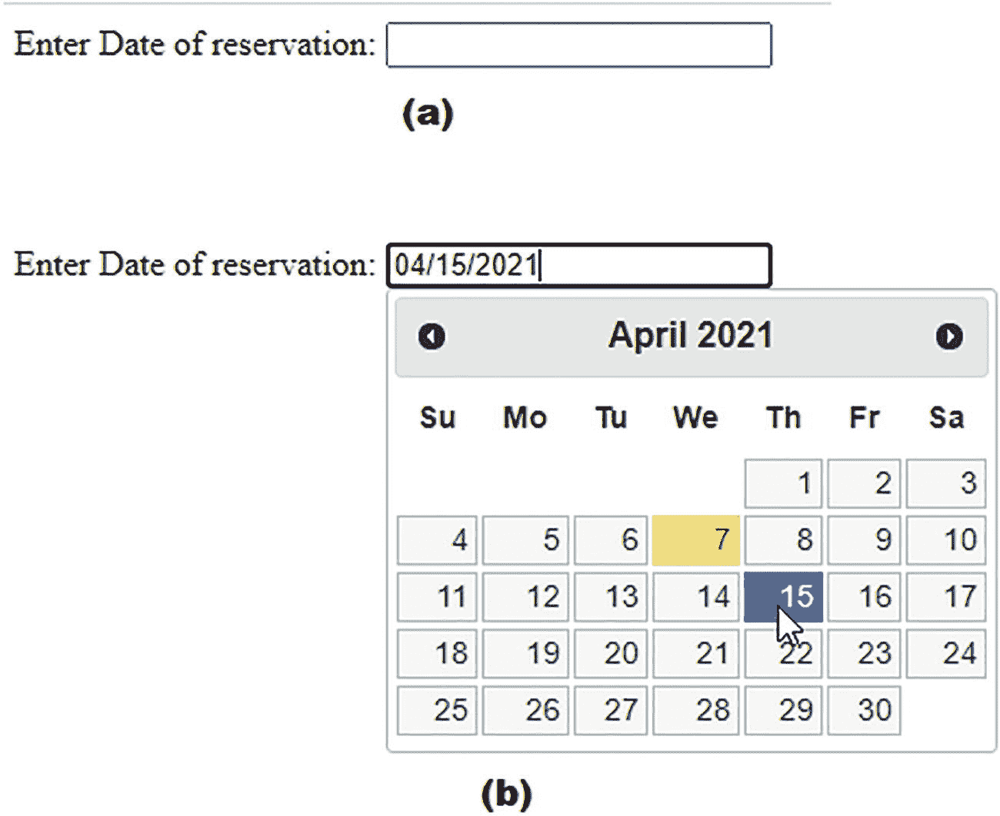

图 9-1

(a)输入框要求用户输入预订酒店房间的日期。(b)日期选择器打开，单击输入框显示当前日期

### 配置 Datepicker 小部件的属性

以下是可以使用 datepicker 设置的属性，以便对其进行配置:

*   `appendText`:在日期选择器`<input>`框后添加文本，告知所选日期的格式。

*   `changeMonth`:设置为`true`，显示月份变化下拉菜单。

*   `changeYear`:将该选项设置为`true`，显示年度变化下拉列表。

*   `isRTL`:如果您想将日历设置为从右向左的格式，请将此选项设置为`true`。

*   `duration`:将该选项的值设置为`slow`、`normal`或`fast`，以决定日期选择器打开的动画速度。

*   `numberOfMonths`:将该选项的值设置为`1`或`2`，以设置在单个日期选择器上显示的月数。

*   `showOtherMonths`:如果不想显示上个月和下个月的最后一天和第一天，将该选项的值设置为`false`。

为了配置 datepicker 小部件以期望的格式显示日历，您需要修改前面显示的 jQuery 代码。此外，您不会在 HTML 文件中嵌入 jQuery 代码；您将创建一个单独的文件。因此，让我们将上面的 HTML 文件修改如下:

**datepicker1.html**

```js
<!doctype html>
<html lang="en">
<head>
  <meta charset="utf-8">
  <meta name="viewport" content="width=device-width, initial-scale=1">
  <title></title>
  <link rel="stylesheet" href="jquery-ui.css" type="text/css" media="screen" />
  <script src="jquery-3.5.1.js" type="text/javascript"></script>
  <script src="jquery-ui.js"></script>
  <script src="datepicker1jq.js" type="text/javascript"></script>
  </head>
  <body>
      Enter Date of reservation: <input type="text" id="reserve_date">
  </body>
</html>

```

您可以在上面的代码中看到，引用了一个外部 jQuery 文件`datepicker1jq.js`。HTML 代码提示用户输入所需的日期。单击输入框，将打开日期选择器，允许用户选择所需的日期。

为了配置 datepicker 小部件，jQuery 代码设置了以下 datepicker 属性:

**日期选择器 1jq.js**

```js
$(document).ready(function() {
     var datepicker_Options = {
          appendText: " MM/DD/YYYY",
          changeMonth: true,
          changeYear: true,
          isRTL: false,
          showOtherMonths: true,
          numberOfMonths: 2,
          duration: "normal"
     };
         $( "#reserve_date").datepicker(datepicker_Options);
});

```

在运行 HTML 程序时，你可以在上面的 jQuery 代码中看到文本`MM/DD/YYYY`将被附加在输入框之后，通知用户这是所选日期将被显示的格式(参见图 9-2(a) )。将显示一个带有月份的下拉菜单，使用户能够跳转到任何月份。类似地，使用`changeYear`选项，显示带有年份的下拉菜单，使用户能够直接选择所需的年份。

日历将被设置为从左向右显示。使用`showOtherMonths`选项，将显示上个月的最后几天和下个月的开始几天。使用`duration`选项将动画速度设置为`normal`。`numberOfMonths`选项设置为`2`显示两个月的日历(见图 9-2(b) )。

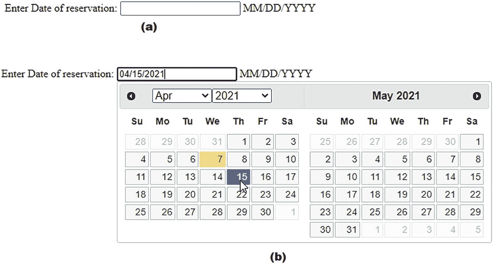

图 9-2

(a)文本 MM/DD/YYYY 附加在输入框之后，显示所选日期的显示格式。(b)显示两个月的日历以及与月和年相关联的下拉菜单

除了默认的日期格式 MM/DD/YYYY 之外，您还可以使用其他所需的格式。

### 更改日期格式

datepicker 小部件的`dateFormat`属性用于设置日期的格式。以下是有效的选项，可以组合这些选项以获得所需格式的日期:

*   `d`:以一位数显示一个月中的某一天

*   `dd`:以两位数显示一个月中的第几天

*   `m`:以一位数显示一年中的月份

*   `mm`:以两位数显示一年中的月份。

*   `y`:以两位数显示年份

*   `yy`:以四位数显示年份

*   `D`:以短格式显示日

*   `DD`:显示完整的日期名称

*   `M`:以短格式显示月份

*   `MM`:以长格式显示月份

让我们创建另一个名为`datepicker2jq.js`的 jQuery 文件，并在其中编写以下 jQuery 代码，以特定格式显示所选日期:

`datepicker2jq.js`

```js
$(document).ready(function() {
     var datepicker_Options = {
          dateFormat: "dd-mm-yy"
     };
     $( "#reserve_date" ).datepicker(datepicker_Options);
});

```

您可以看到日期被设置为以两位数显示，后跟一个破折号(-)。此后，月份以两位数格式显示，后跟一个破折号(-)。最后，年份以四位数显示(见图 9-3 )。

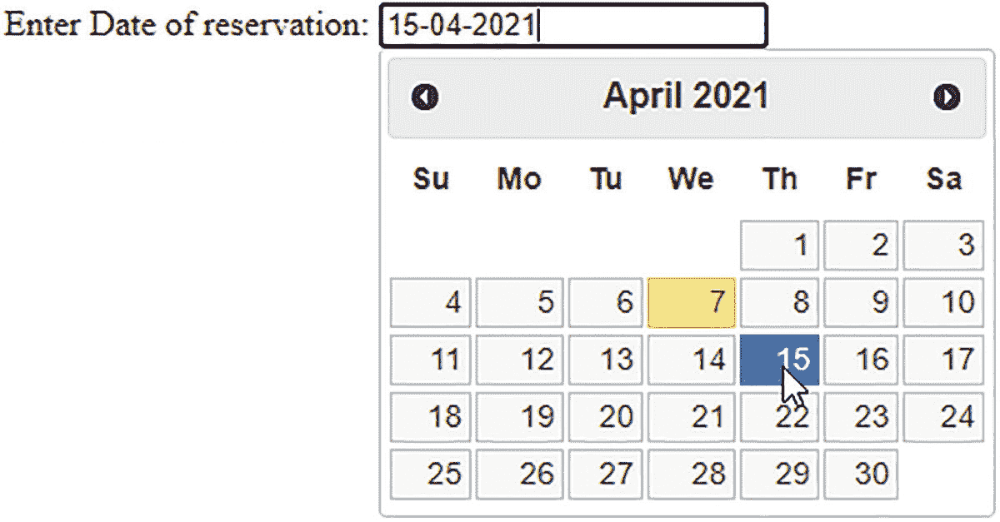

图 9-3

日和月以两位数显示，年以四位数显示，并用破折号作为分隔符

您还可以修改 jQuery 文件，尝试另一种日期格式，如下所示:

```js
$(document).ready(function() {
     var datepicker_Options = {
         dateFormat: "dd MM y"
     };
     $( "#reserve_date" ).datepicker(datepicker_Options);
});

```

日期的格式是以两位数后跟一个空格来显示日期。此后，月份以长格式显示，后跟一个空格。最后，年份以两位数显示(见图 9-4 )。

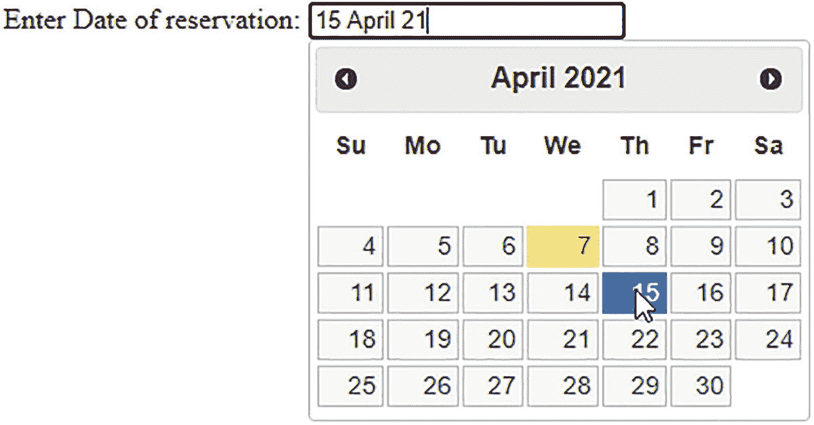

图 9-4

日和年以两位数显示，月以长格式显示，中间用空格作为分隔符

### 将样式应用于日期选取器

您可以将样式应用到日历边界、显示的数字、背景颜色、悬停时数字的颜色等等。

以下 HTML 代码包括应用于不同 datepicker 组件的不同样式:

**Datepicker2.html**

```js
<!doctype html>
<html lang="en">
<head>
  <meta charset="utf-8">
  <meta name="viewport" content="width=device-width, initial-scale=1">
  <title></title>
  <link rel="stylesheet" href="jquery-ui.css" type="text/css" media="screen" />
  <script src="jquery-3.5.1.js" type="text/javascript"></script>
  <script src="jquery-ui.js"></script>
  <script src="datepicker2jq.js" type="text/javascript"></script>
   <style>
     #ui-datepicker-div { border:1px solid #0000ff; }
     #ui-datepicker-div a, .ui-datepicker-inline a {
          color:#ff0000;
     }
     #ui-datepicker-div a:hover, .ui-datepicker-inline a:hover {
          color:#00ff00 ;
     background-color:#000000;
     }

     .ui-datepicker-header { background:#ff0000; }
</style>
</head>
<body>
      Enter Date of reservation: <input type="text" id="reserve_date">
 </body>
</html>

```

在这段代码中，datepicker 的边框设置为纯色和蓝色。日期选择器中的日期设置为以红色显示。将鼠标悬停在日期选择器中的任意一天上，背景颜色将为黑色，该天将显示为绿色。日期选择器中的标题设置为红色(见图 9-5 )。

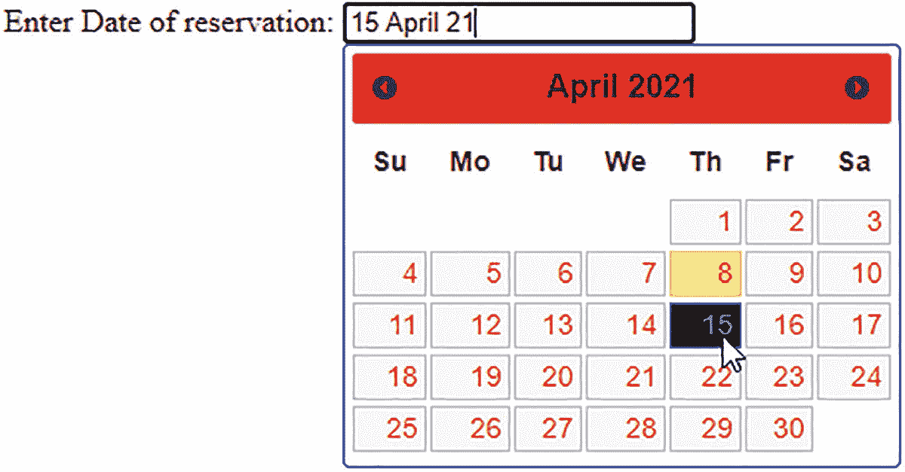

图 9-5

应用于 datepicker 的边框、日期和标题的格式

## 9.2 使用自动完成小部件

为了更快地输入数据并避免输入错误，使用了自动完成部件。只要用户键入几个字符，自动完成部件就会显示建议，用户只需从显示的建议列表中单击所需的单词。建议列表可以通过数组或其他来源显示，包括任何文件或数据库。

### 问题

您希望让用户选择一个食物项目，并显示一个自动完成小部件，以便更快、更准确地进行选择。

### 解决办法

为了创建一个用户界面，要求用户选择一个食品项目，用下面的代码创建了一个 HTML 程序。HTML 代码将显示一个输入框，提示用户选择所需的快餐项目。

**Autocomplete.html**

```js
<!DOCTYPE html PUBLIC "-//W3C//DTD XHTML 1.0 Transitional//EN"
        "http://www.w3.org/TR/xhtml1/DTD/xhtml1-transitional.dtd">

<html xmlns:="http://www.w3.org/1999/xhtml" xml:lang="en" lang="en">
  <head>
    <meta http-equiv="Content-Type" content="text/html; charset=utf-8"/>
    <title></title>
    <link rel="stylesheet" href="jquery-ui.css" type="text/css" media="screen" />
    <script src="jquery-3.5.1.js" type="text/javascript"></script>
    <script src="jquery-ui.js"></script>
    <script src="autocompletejq.js" type="text/javascript"></script>
  </head>
  <body>
       <div class="ui-widget">
            <label>Select your food item: </label>
            <input id="items">
</div>
</body>
</html>

```

您可以在上面的 HTML 代码中看到，在类`ui-widget`中定义了一个`<div>`元素。这样做是为了让`jquery-ui.css`样式表文件中定义的`ui-widget`类的 CSS 样式可以自动应用到`<div>`元素。在`<div>`元素中，定义了一个标签和输入框。标签显示一条信息，告诉用户选择一种食物。为了在 jQuery 代码中访问它，输入框被分配了 id `items`。

jQuery 代码定义了要通过 autocomplete 小部件显示的食品来源，并在用户在输入框中键入任何字符时以建议的形式显示该来源，如下所示:

**自学成才 jq.js**

```js
$(document).ready(function() {
     var foodItems = [
               "Bacon Cheese Burger",
          "Biscuits",
          "Blizzard",
          "Cajun Fries ",
          "Chicken Nuggets",
          "Chicken Sandwich",
          "Chicken Tenders",
          "Crunch Shell Tacos",
          "Curly Fries",
          "Fries",
          "Frosty",
          "Pretzel",
          "Shack Burger",
          "Tacos",
          "Waffle Fries"    ];
         $( "#items" ).autocomplete({
                source: foodItems
         });
});

```

您可以在上面的代码中看到，一个名为`fooditems`的字符串数组包含了您希望通过 autocomplete 小部件显示的食物项目。此后，autocomplete 小部件被关联到输入框，并且`fooditems`数组被链接到 autocomplete 小部件作为它的源。在运行 HTML 程序时，您会看到一个输入框，要求您选择一种食物。当你按下任何一个键的时候，所有与输入的键相关的建议都会通过 autocomplete widget 显示出来，如图 9-6 所示。

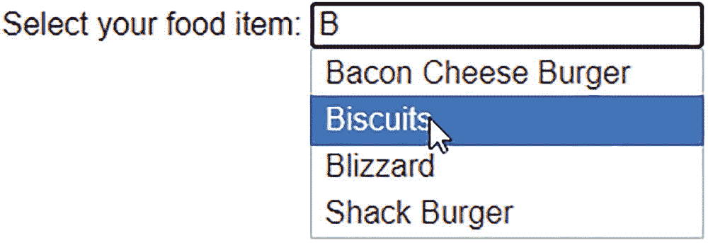

图 9-6

与输入的键相关的所有建议都通过 autocomplete 小部件显示

### 配置自动完成小部件

自动完成小部件可以根据您的需求进行配置。以下是可用于配置自动完成向导的选项:

*   `appendTo`:用于向 autocomplete 小部件追加一个元素。默认值为 null。

*   `autoFocus`:当选项出现时，第一项会自动聚焦。默认值为 false。

*   `delay`:用于指定查找匹配值的时间延迟，单位为毫秒。默认值为 300 毫秒。

*   `disabled`:如果此选项设置为 true，自动完成小部件将被禁用。默认值为 false。

*   `minlength`:用于指定查找匹配值需要按下的最少字符数。默认值为 1。

*   `position`:决定自动完成选项弹出的位置。默认情况下，其值为`{ my: "left top", at: "left bottom", collision: "none" }`。

*   `source`:用于指定在 autocomplete 小工具中显示的选项的来源。

为了配置 autocomplete 小部件，您需要修改之前创建的 jQuery 代码。因此，让我们创建一个新的 jQuery 文件来配置 autocomplete 小部件。修改 HTML 代码以指向这个新的 jQuery 文件。

**auto mccomplete 1 . html**

```js
<!DOCTYPE html PUBLIC "-//W3C//DTD XHTML 1.0 Transitional//EN"
        "http://www.w3.org/TR/xhtml1/DTD/xhtml1-transitional.dtd">

<html xmlns:="http://www.w3.org/1999/xhtml" xml:lang="en" lang="en">
  <head>
    <meta http-equiv="Content-Type" content="text/html; charset=utf-8"/>
    <title></title>
    <link rel="stylesheet" href="jquery-ui.css" type="text/css" media="screen" />
    <script src="jquery-3.5.1.js" type="text/javascript"></script>
    <script src="jquery-ui.js"></script>
    <script src="autocomplete1jq.js" type="text/javascript"></script>
  </head>
  <body>
       <label>Select your food item: </label>
       <input id="items">
</body>
</html>

```

上面显示的 HTML 代码只显示了两个元素，一个标签和一个输入框。标签显示一条文本消息，输入框被分配一个 id`items`，jQuery 代码可以访问这个 id。

当在输入框中键入任何字符时，显示 autocomplete 小部件并配置其不同属性的 jQuery 代码如下:

**自动完成 1jq.js**

```js
$(document).ready(function() {
       var foodItems = [
               "Bacon Cheese Burger",
              "Biscuits",
              "Blizzard",
              "Cajun Fries ",
              "Chicken Nuggets",
              "Chicken Sandwich",
              "Chicken Tenders",
              "Crunch Shell Tacos",
              "Curly Fries",
              "Fries",
              "Frosty",
              "Pretzel",
              "Shack Burger",
              "Tacos",
              "Waffle Fries"
     ];
      $( "#items" ).autocomplete({
           autoFocus: true,
           delay: 400,
           minLength: 1,
          position: { my : "left top", at: "right bottom" },
           //disabled: true,
               source: foodItems
         });
});

```

一个名为`fooditems`的字符串数组包含某些食物项目，将在 autocomplete 小部件中用作建议。当用户单击输入框中的任意字符时，autocomplete 小部件会自动打开。autocomplete 小部件被配置为将包含在`fooditems`数组中的食物项目显示为建议，并且当选项出现时，第一个食物项目被自动聚焦。设置 400 毫秒的时间延迟来显示匹配的选项。当用户在输入框中输入一个字符时，选项开始出现。autocomplete 小部件的位置被设置为出现在输入框的右下方。可以通过将 autocomplete 小部件的 disabled 属性设置为 true 来禁用它，但这被注释掉了，因为您希望启用 autocomplete 小部件(参见图 9-7 )。

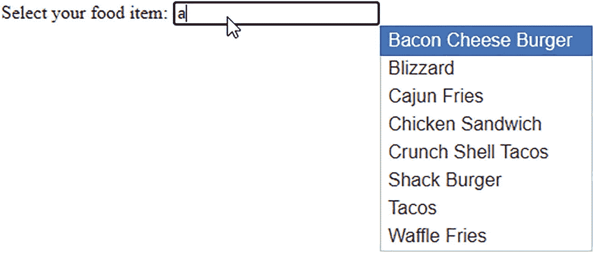

图 9-7

在配置 autocomplete 小部件时，会自动聚焦第一个食物项目。它被放置在输入框的右下方

## 9.3 使用手风琴

accordion 是可折叠内容面板的组合，其中只有一个面板可以展开来显示其内容，因此它非常流行，可以在较小的空间内显示大量信息。

### 问题

你想用更少的篇幅来解释产品及其特点。您想介绍 jQuery，解释它的特性，以及最小空间中的 DOM 和选择器。手风琴能有效地完成这项任务。

### 解决办法

要显示关于 jQuery 及其特性的内容以及 DOM 和选择器，请使用以下 HTML 代码:

**Accordion.html**

```js
<!DOCTYPE html PUBLIC "-//W3C//DTD XHTML 1.0 Transitional//EN"
        "http://www.w3.org/TR/xhtml1/DTD/xhtml1-transitional.dtd">

<html xmlns:="http://www.w3.org/1999/xhtml" xml:lang="en" lang="en">
  <head>
    <meta http-equiv="Content-Type" content="text/html; charset=utf-8"/>
    <title></title>
    <link rel="stylesheet" href="jquery-ui.css" type="text/css" media="screen" />
    <script src="jquery-3.5.1.js" type="text/javascript"></script>
    <script src="jquery-ui.js"></script>
    <script src="accordionjq.js" type="text/javascript"></script>
  </head>
  <body>
      <div id="accordion">
            <h3>jQuery Intro</h3>
            <div>
                   <p>jQuery is a lightweight cross-platform JavaScript library. Because of its easy to use syntax, jQuery has made it quite easy to include JavaScript on any web site.  </p>
            </div>
            <h3>Features</h3>
            <div>
                   <p>jQuery has not only simplified the complex coding but also has reduced the size of code as well. Below are the features of jQuery: </p>
                  <ul>
                          <li>It has huge number of plug-in enabling you to add additional features to your web page and develop the apps compatible to different platforms.</li>
                          <li>Its API is fully documented making it easy to use and access its full features</li>
                          <li>Its learning curve is very easy. Because it uses CSS and HTML, so it is every easy to learn its concepts.</li>
                   </ul>

            </div>
            <h3>Understanding DOM</h3>
            <div>
                   <p>DOM provides a representation of the HTML elements as a network of objects i.e. a tree of elements on the page.  </p>
                   <p>Here, <html> is the ancestor or parent of all the elements on the web page. That is, all the elements are descendants or children of <html>. </p>
            </div>
            <h3>Selectors</h3>
            <div>
                   <p>As the name suggests, the jQuery selectors helps in finding a DOM (Document Object Model) element in an HTML document based on id, name, types, attributes, class  etc.  </p>
             </div>
       </div>
  </body>
</html>

```

一个`<div>`元素被分配了 id `accordion`。可以是任何 id。通过这个 id 可以访问`<div>`元素。一个`<h3>`元素用于内容面板的标题，一个`<div>`元素用于定义该内容面板的文本。`<div>`元素可以有一个`<p>`元素或者一个`<ul>`元素或者任何其他 HTML 元素来表示它的文本。因此，在最外面的`<div>`元素中有四个`<h3>`和`<div>`元素对来分别定义内容面板标题及其文本。四个`<h3>`元素包含文本 **jQuery Intro、特性、理解 DOM** 和**选择器**，它们最终将成为内容面板的标题。

调用 accordion(即，使不同的`<div>`元素以可展开和可折叠内容面板的形式以 accordion 的形式出现)的 jQuery 代码如下:

**accordojq . js**

```js
$(document).ready(function() {
      $( "#accordion" ).accordion();
});

```

在 id 为`accordion`的`<div>`元素上调用 accordion。您将看到四个内容面板，分别包含相应的文本。单击内容面板的标题时，它会展开以显示其中的内容。其余的内容面板将自动折叠(参见图 9-8 )。

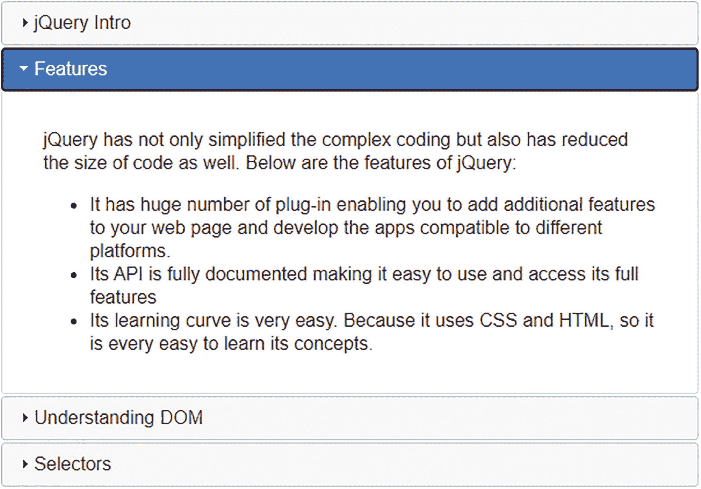

图 9-8

折叠面板显示有四个内容面板，活动内容面板以展开的形式显示

### 配置折叠面板

以下是可用于配置折叠型面板的选项:

*   `active`:决定哪个面板被设置为激活或打开。面板从零开始。如果要从最后一个面板向后选择，则使用负值。默认值为`0`。如果可折叠选项设置为`true`，您可以将其设置为 false 来折叠所有面板。

*   `animate`:用于使面板动画。您可以将此选项设置为`false`以禁用动画，或者您可以使用默认缓动以毫秒为单位指定动画的持续时间。

*   `disabled`:用于通过设置布尔值`true`来禁用手风琴。

*   `event`:确定需要在表头上执行的事件，以获得所需的动作。默认事件是单击。您可以使用鼠标悬停、鼠标释放等操作。您甚至可以使用由空格分隔的多个事件。

*   `collapsible`:决定是否可以关闭所有截面，包括激活截面。默认值为`false`。

*   `header`:表示表头元素的选择器。请记住，内容面板需要是紧接在标题之后的同级面板。

*   `heightStyle`:决定手风琴及其面板的高度。有效选项包括
    *   `"auto"`:所有面板将被设置为等于最高面板的高度。

    *   `"fill"`:所有面板的高度都将基于手风琴的父高度。

    *   `"content"`:面板的高度足以容纳其内容。

*   `icons`:决定标题中使用的图标类型。您可以将此选项设置为`false`以使标题中没有图标。默认值为

    ```js
    {
    "header": "ui-icon-triangle-1-e",
    "activeHeader": "ui-icon-triangle-1-s"
    }

    ```

要配置 accordion，您需要对其应用不同的属性，如以下 jQuery 代码所示:

`Accordion1jq.js`

```js
$(document).ready(function() {
      $( "#accordion" ).accordion({
            active: 3,
            animate: 1000,
            disabled: false,
          event: "mouseover",
            collapsible: true,
            heightStyle: "content",
            header: "h3",
           icons: { "header": "ui-icon-arrowthick-1-s", "activeHeader": "ui-icon-arrowthick-1-n" }
     });
});

```

默认情况下，您使第四个内容面板处于活动状态(即，在运行 HTML 程序时，第四个内容面板，**选择器**，将以展开的形式显示其内容，其余的内容面板将以折叠的形式显示)。每当任何内容面板展开或折叠时，都会以动画形式发生，延迟为 1000 毫秒。通过将手风琴的`disabled`属性设置为`false`来启用手风琴。您不需要单击内容面板的标题来展开或折叠它；只要用鼠标悬停在内容面板的标题上就足以展开或折叠它，因为事件属性被设置为`mousehover`。通过将`collapsible`属性设置为`true`，当标题栏被悬停时，内容面板将展开，当再次被悬停时，内容面板将折叠。内容面板的高度被设置为等于其内容(即，内容面板的高度足以完全显示其内容)。HTML 文件中的所有`<h3>`元素都被设置为表示标题(即内容面板的标题栏)。当内容面板处于折叠形式时，标题图标(即内容面板标题栏)变为`ui-icon-triangle-1-e`。并且当内容面板活动时(即，当它被展开时)，标题的图标变为`ui-icon-triangle-1-s`。请访问此网址查看可用图标: [`h`](https://api.jqueryui.com/resources/icons-list.html) [`ttps://api.jqueryui.com/resources/icons-list.html`](https://api.jqueryui.com/resources/icons-list.html) 。

运行 HTML 程序时，如预期的那样，第四个内容面板将显示为活动状态(参见图 9-9(a) )。你可以将鼠标悬停在任何内容面板上来展开它，也可以再次悬停在它上面来折叠它(参见图 9-9(b) )。另外，请注意内容面板展开和关闭时的图标。图标会根据需要进行更改。

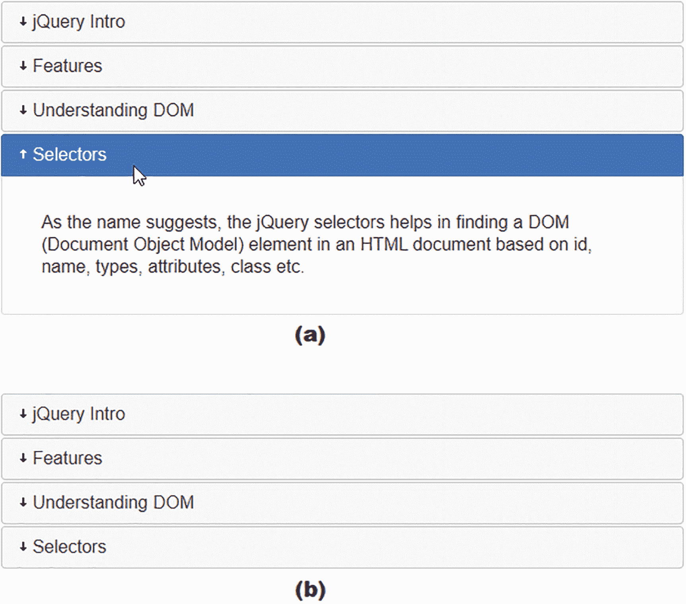

图 9-9

(a)第四内容面板是活动的并且处于展开形式。(b)活动和非活动内容面板的图标被改变

## 9.4 使用对话框

对话框是一个浮动框，用于向用户显示某些信息。它有一个标题和一个 x 图标，可用于关闭对话框。可以使用标题栏来移动对话框，也可以通过拖动其边界来调整其大小。如果对话框缩小到看不到全部内容，滚动条会自动出现。

### 问题

您希望通过一个对话框向用户显示一些内容，用户可以在阅读信息后关闭该对话框

### 解决办法

要定义对话框的标题并通过它显示文本，HTML 代码如下:

**Dialog.html**

```js
<!DOCTYPE html PUBLIC "-//W3C//DTD XHTML 1.0 Transitional//EN"
        "http://www.w3.org/TR/xhtml1/DTD/xhtml1-transitional.dtd">

<html xmlns:="http://www.w3.org/1999/xhtml" xml:lang="en" lang="en">
  <head>
    <meta http-equiv="Content-Type" content="text/html; charset=utf-8"/>
    <title></title>
    <link rel="stylesheet" href="jquery-ui.css" type="text/css" media="screen" />
    <script src="jquery-3.5.1.js" type="text/javascript"></script>
    <script src="jquery-ui.js"></script>
    <script src="dialogjq.js" type="text/javascript"></script>
  </head>
  <body>
       <div id="jquery_intro" title="Introduction to jQuery">
            <p>jQuery is a lightweight cross-platform JavaScript library. Because of its easy to use syntax, jQuery has made it quite easy to include JavaScript on any web site. It has not only simplified the complex coding but also has reduced the size of code as well. Below are the features of jQuery.</p>
       </div>
  </body>
</html>

```

你可以在上面的 HTML 代码中看到，用标题**jQuery 简介**定义了一个`<div>`元素。这个标题将成为对话框标题。为了使 jQuery 代码中的`<div>`元素可以访问，它被赋予了 id `jquery_intro`。在`<div>`元素中有一个`<p>`元素，它包含了通过对话框显示的文本。要调用对话框并将其与 id 为`jquery_intro`的`<div>`元素链接，必须编写以下 jQuery 代码:

**对话框 q . js】??**

```js
$(document).ready(function() {
      $( "#jquery_intro" ).dialog();
});

```

您可以看到对话框被调用，并且与 id 为`jquery_intro`的`<div>`元素相关联。在运行 HTML 程序时，你会得到一个对话框，显示通过嵌套在`<div>`元素中的`<p>`元素定义的文本，如图 9-10 所示。您可以随时使用对话框右上角的图标关闭该对话框。

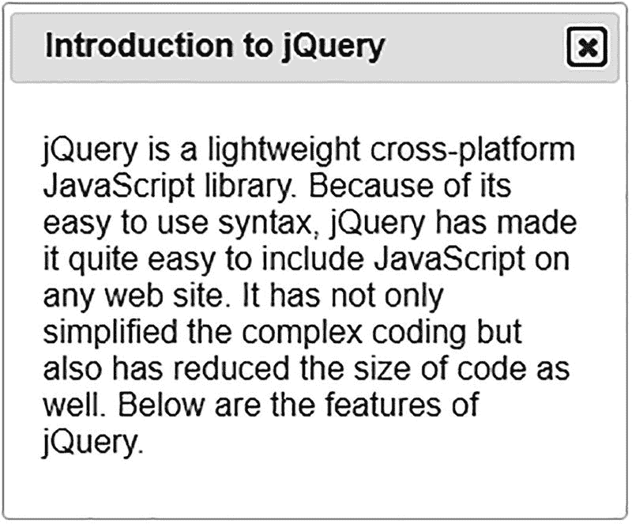

图 9-10

出现一个对话框，显示指定的文本

### 配置对话框的选项

您可以根据需要使用以下属性来配置对话框:

*   `appendTo`:用于将对话框追加到指定元素。使用`appendTo`选项时，需要关闭对话框。

*   `title`:用于指定对话框的标题。其默认值为 null。如果未指定标题，则使用与选择器关联的标题。

*   `autoOpen`:确定应用启动时，对话框是打开还是关闭。如果该选项设置为`false`，对话框将保持关闭，直到`open()`方法被调用，它才被打开。默认值为`true`。

*   `buttons`:决定对话框上显示的按钮类型。您可以指定按钮的标签、图标以及按钮上发生任何事件时要触发的回调函数。在一个对话框中，可以有多个数组形式的按钮。

*   `closeOnEscape`:默认情况下，该选项设置为`true`，这意味着当用户获得焦点并按下 Esc 键时，对话框将关闭。如果您不想在按下 Esc 键时关闭对话框，您可以将此选项设置为`false`。

*   `draggable`:默认情况下这个选项是`true`，它允许对话框被它的标题栏拖动。要使其不浮动，将此选项设置为`false`。

*   `height`:用于指定对话框的高度。它的默认值是`auto,`,这意味着对话框的高度将被设置为适应其内容。您还可以指定对话框的初始高度，以像素为单位。

*   `width`:用于指定对话框的宽度。其默认值为`300 pixels`。

*   `hide`:用于指定对话框关闭时的隐藏方式。您可以指定关闭时所需的动画类型以及指定的持续时间。如果不指定持续时间，动画将以默认持续时间执行。它的默认值是`true`，这意味着对话框将以默认的持续时间和默认的缓动淡出。如果你分配一个布尔值`false`给这个选项，这意味着对话框将立即关闭，没有任何动画。

*   `maxHeight`:确定调整大小时对话框可以达到的最大高度。它的默认值是`false`(也就是说，对话框可以根据需要调整高度)。

*   `maxWidth`:用于指定对话框可以调整的最大宽度。其默认值为`false`。

*   `minHeight`:用于指定对话框可以调整的最小高度(即对话框的高度不能小于指定值)。其默认值为`150px`。

*   `minWidth`:用于指定对话框可以缩小到的最小宽度。其默认值为`150px`。

*   `modal`:该选项可以设置为`true`，使对话框成为模态对话框。模式对话框是一个在对话框关闭之前阻止你与页面其他部分交互的对话框。其默认值为`false`。

*   `resizable`:该选项决定对话框是否可以调整大小。其默认值为`true`。如果该选项设置为`false`，对话框的高度和宽度不能改变。

*   `show`:决定对话框是立即显示还是通过动画缓慢显示。如果该选项的值设置为`false`，对话框将立即打开。如果这个选项被设置为`true`，对话框将会以默认的持续时间和渐入渐出。您也可以指定动画，它的持续时间，以及缓动。默认动画被认为是`fadeIn`。如果未指定持续时间和缓动，则使用默认的持续时间和缓动。

要配置该对话框，可以设置它的不同属性，如以下 jQuery 代码所示:

对话 1jq.js

```js
$(document).ready(function() {
     $( "#jquery_intro" ).dialog({
          title: "What is jQuery",
            closeOnEscape: false,
            draggable: false,
          height: "auto",
          width: 200,
            minHeight: 200,
            maxHeight: 400,
            minWidth: 150,
            maxWidth: 300,
          //  hide: "slideUp",
          hide: { effect: "fadeOut", duration: 2000 },
            buttons: [
              {
                   text: "Close",
                   icon: "ui-icon-closethick",
                   click: function() {
                        $( this ).dialog( "close" );
                   }
              }
            ],
            modal: true,
          //show: true
          show: { effect: "slideDown", duration: 1000 }
     });
});

```

对话框的标题被设置为`What is jQuery`，对话框不仅可以通过其右上角的图标关闭，还可以在焦点位于对话框上时通过按 Esc 键关闭。通过将`draggagle`属性设置为`false`，对话框不能被它的标题栏拖动。对话框的高度被设置为根据其内容进行调整。对话框的宽度设置为 200 像素。对话框的高度可以增加到 400 像素，也可以减少到 200 像素。同样，对话框的宽度可以增加到 300 像素，也可以减少到 150 像素。当关闭对话框时，它可以设置为带有向上滑动效果的动画。它被注释掉，并被设置为动画，淡出效果持续时间为 2000 毫秒。一个按钮被设置为显示在带有文本`Close`和图标`ui-icon-closethick`的对话框中，当按钮上发生点击事件时，对话框将关闭。请访问此网址查看可用图标: [`https://api.jqueryui.com/resources/icons-list.html`](https://api.jqueryui.com/resources/icons-list.html) 。该对话框被设置为显示为模式对话框(即，在对话框关闭之前，用户不能与网页的任何其他部分进行交互)。该对话框可以设置为通过动画显示。该对话框设置为以 1000 毫秒时长的下滑动画打开(参见图 9-11 )。

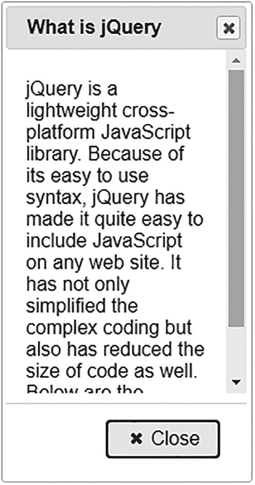

图 9-11

对话框中会显示一个关闭按钮，并且该对话框被设置为显示为模式对话框

## 9.5 使用选项卡小部件

选项卡用于在有限的空间内显示分类信息。它是具有多个面板的单个区域，单击每个面板的标题或选项卡时，会显示所需的信息。

### 问题

您希望显示与 jQuery 简介、jQuery 特性和理解 DOM 相关的信息，并使用一个选项卡小部件，其中每个选项卡或面板在被单击时都会显示所需的信息。

### 解决办法

第一步是定义要通过选项卡或面板显示的内容。在这里，重要的是要理解，要使用选项卡小部件，选项卡必须在有序的、`<ol>,`或无序的、`<ul>,`列表中。选项卡标题必须包含在每个`<li>`中，并用一个`href`属性包装。通过选项卡小部件显示内容的 HTML 代码如下:

**Tabs.html**

```js
<!DOCTYPE html PUBLIC "-//W3C//DTD XHTML 1.0 Transitional//EN"
        "http://www.w3.org/TR/xhtml1/DTD/xhtml1-transitional.dtd">

<html xmlns:="http://www.w3.org/1999/xhtml" xml:lang="en" lang="en">
  <head>
    <meta http-equiv="Content-Type" content="text/html; charset=utf-8"/>
    <title></title>
    <link rel="stylesheet" href="jquery-ui.css" type="text/css" media="screen" />
    <script src="jquery-3.5.1.js" type="text/javascript"></script>
    <script src="jquery-ui.js"></script>
    <script src="tabsjq.js" type="text/javascript"></script>
    </head>
    <body>
        <div id="showinfo">
            <ul>
                   <li><a href="#tab1">jQuery Intro</a></li>
                   <li><a href="#tab2">Features</a></li>
                   <li><a href="#tab3">Understanding DOM</a></li>
            </ul>
            <div id="tab1">
                   <p>jQuery is a lightweight cross-platform JavaScript library. Because of its easy to use syntax, jQuery has made it quite easy to include JavaScript on any web site.</p>
            </div>
            <div id="tab2">
                 <p>jQuery has not only simplified the complex coding but also has reduced the size of code as well. Below are the features of jQuery: </p>
                  <ul>
                          <li>It has huge number of plug-in enabling you to add additional features to your web page and develop the apps compatible to different platforms.</li>
                          <li>Its API is fully documented making it easy to use and access its full features</li>
                          <li>Its learning curve is very easy. Because it uses CSS and HTML, so it is every easy to learn its concepts.</li>

                   </ul>
            </div>
            <div id="tab3">
                   <p>DOM provides a representation of the HTML elements as a network of objects i.e. a tree of elements on the page.  </p>
                   <p>Here, <html> is the ancestor or parent of all the elements on the web page. That is, all the elements are descendants or children of <html>. </p>
            </div>
       </div>
    </body>
</html>

```

您可以在 HTML 代码中看到一个用 id `showinfo`定义的`<div>`元素。通过这个 id，jQuery 代码中的`<div>`元素将被访问，选项卡小部件将与它相关联。为了定义选项卡或面板的标题，用三个`<li>`元素定义了一个无序列表`<ul>`，其中每个`<li>`元素都有一个嵌套的锚`<a>`，元素的`href`属性将选项卡或面板的标题与它们各自的内容链接起来。锚元素被设置为分别指向 id`tab1`、`tab2`和`tab3`。这意味着当单击任何锚元素时，它将搜索具有指定 id 的元素并导航到该元素。三个`<li>`元素被设置为分别显示面板的标题、 **jQuery Intro** 、 **Features** 和 **Understanding DOM** 。

为了定义当任何选项卡或面板的标题被单击时显示的内容，用 id`tab1`、`tab2`和`tab3`定义了三个`<div>`元素。也就是说，当点击任何一个具有`href`属性的锚元素时，它将导航到 id 与它所指向的 id 相匹配的`<div>`元素。`<div>`使用`<p>`元素、`<ul>`元素等。以所需的格式显示其内容。

要将`<div>`元素与选项卡小部件相关联，并通过其面板显示内容，需要以下 jQuery 代码:

**tabasq . js**的缩写

```js
$(document).ready(function() {
        $( "#showinfo" ).tabs();
});

```

id 为`showinfo`的`<div>`元素被访问，选项卡小部件被设置为通过`<div>`元素中定义的`<ul>`元素显示面板的标题。同样，具有`href`属性的锚元素链接到相应的`<div>`元素，以在点击任何面板的标题时显示信息，如图 9-12 所示。

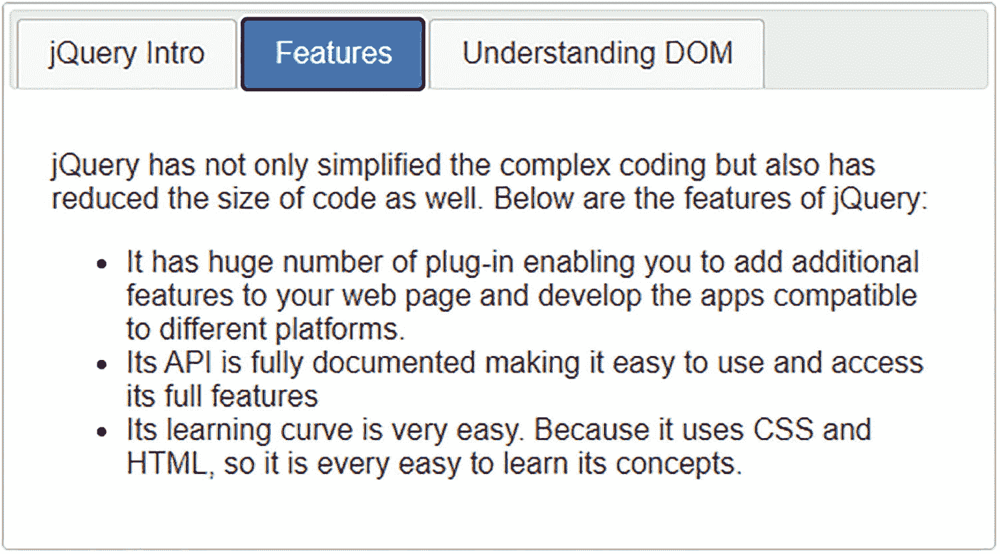

图 9-12

选项卡小部件被设置为显示面板的标题，并显示所单击面板的信息

### 配置选项卡的选项

以下是可用于配置选项卡小部件的属性:

*   `active`:决定启动时哪个选项卡必须保持活动状态。默认值为`0`。

*   `collapsible`:如果该选项设置为`true`，再次选择选中的选项卡将使其取消选中。如果此选项设置为`false`，选择一个选定的选项卡不会取消选择。默认值为`false`。

*   `disabled`:用于禁用所需的选项卡。例如，如果该选项设置为`valu, [1,2],`，将禁用前三个选项卡。默认值为`false`。

*   `event`:您可以选择激活标签的事件。事件可以是鼠标悬停、鼠标释放、点击等。默认事件是`click`。

*   `heightStyle`:决定标签小工具的高度。以下是有效选项:
    *   `"auto"`:所有标签页的高度将被设置为最高标签页的高度。

    *   `"fill"`:所有页签的高度都是基于该页签的父高度。

    *   `"content"`:标签的高度足以容纳它的内容。

*   `hide`:决定隐藏标签的动画。默认值为`null`。

*   `show`:决定显示标签页所需的动画。默认值为`null`。

要根据您的需求配置选项卡小部件，需要设置它的不同属性，因此 jQuery 代码被修改为如下所示:

选项卡 1jq.js

```js
$(document).ready(function() {
     $( "#showinfo" ).tabs({
           active:1,
          collapsible: true,
          //disabled: [1,2]
          event: "mouseover",
          heightStyle:"content"
            });
});

```

第二个面板设置为在启动时激活。选择面板标题时，它将被选中，再次选择活动面板标题时，它将被取消选中。第二个和第三个面板可以用`disabled`属性禁用，如上面的代码所示。但是因为您希望所有的面板都是活动的，所以`disabled`属性被注释掉了。要选择任何面板，您不需要单击该面板；仅仅悬停在标题上就足够了，因为`event`属性被设置为`mouseover`。面板的高度设置为足以显示其内容。在运行 HTML 程序时，你会得到选项卡小部件来显示如图 9-13 所示的内容。

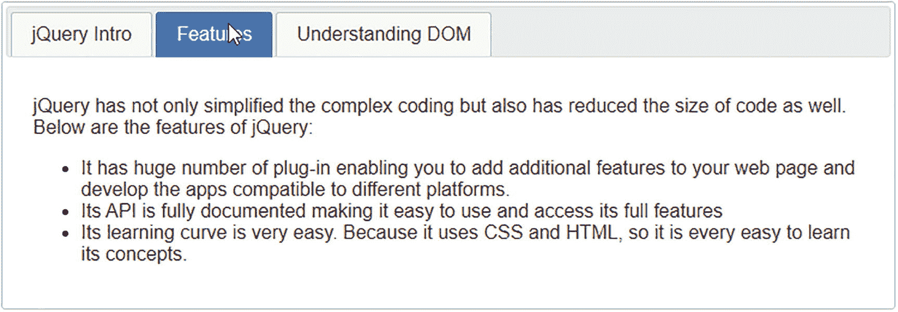

图 9-13

选项卡小部件被设置为显示内容

## 9.6 总结

在本章中，您学习了使用 jQuery UI 提供的不同小部件。您学习了使用 datepicker 小部件选择日期并格式化该日期。此外，您还了解了如何为 datepicker 小部件配置和应用样式。然后，您将学习使用 autocomplete 小部件在输入框中键入任何字符时显示建议。此外，您还学习了通过使用 accordion 和 tabs 小部件以分类形式显示大量数据。除了显示所需的内容，您还学习了如何配置 accordion 和 tabs 小部件。此外，您还学习了如何通过可关闭的对话框向用户显示信息。

下一章将向您展示实现 AJAX 的过程，使您的网页更具响应性。您将学习从服务器返回单行和多行文本，使用 JSON 返回名称/值对，返回一个简单的 JSON 对象，以及从显示图像的服务器返回 JSON 对象。您还将学习如何使用 AJAX 将字符串转换成大写，如何通过 AJAX 请求获取所选产品的价格，以及如何使用 AJAX 验证用户身份。