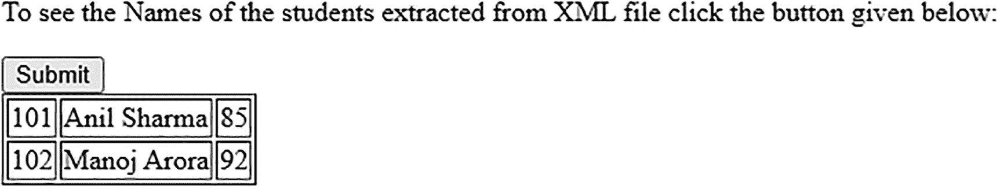

# 十、创建交互式、快速动态网页应用的网页开发技术

在本章中，您将学习如何实现 AJAX(即在后台与 web 服务器交换数据)并异步更新网页。本章包括以下配方。

*   从服务器返回一行文本

*   从服务器返回多行文本

*   使用 JSON 返回名称/值对

*   返回一个 JSON 对象

*   返回显示图像的 JSON 对象

*   使用 AJAX 将字符串转换成大写

*   通过 AJAX 请求显示所选产品的价格

*   使用 AJAX 认证用户

*   验证用户名

*   使用自动完成

*   导入 HTML

*   获取 XML 数据

*   给表格分页

你需要安装 WampServer 来运行本章的程序。附录 A 包括下载和安装 WampServer 的所有步骤。

将本章中的代码(带有本书的源代码包)复制到安装在您计算机上的 WampServer 的 www 文件夹中(即 C:\wamp64\www 文件夹中)。

## 10.1 从服务器返回单行文本

### 问题

您希望向服务器发出一个返回单行文本的 AJAX 请求。

### 解决办法

下面是显示 H1 元素和提交按钮的 HTML 代码。H1 元素显示服务器返回的文本，提交按钮启动发送到服务器的请求。

返回文本. html

```js
<!DOCTYPE html>
<html>
  <head>
    <script src="jquery-3.5.1.js" type="text/javascript"></script>
    <script src="returnonetextjq.js" type="text/javascript"></script>
  </head>
  <body>
        <H1 id="askname">What is your name</H1>
        <button>Submit</button>
  </body>
</html>

```

H1 元素由“askname”和“你叫什么名字”文本定义。在 H1 元素下面创建一个提交按钮。

服务器上的文件应该返回单行文本，因此服务器上的文件 returnname.txt 包含单行文本“我的名字是 Bintu”。

**返回名称.txt**

```js
My Name is Bintu

```

下面是向服务器发出 AJAX 请求并显示服务器返回的文本行的 jQuery 代码。

**返回文本 jq.js**

```js
$(document).ready(function(){
     $("button").click(function(){
              $.ajax({
               url: "/returnname.txt",
               success: function(result){
                          $("#askname").html(result);
              }});
       });
});

```

这个 jQuery 代码展示了一个 ajax()方法；我们先来学习一下这个方法是做什么的。

#### ajax()

ajax()方法在 jQuery 中实现 AJAX(即向服务器发送异步 HTTP 请求)。

**语法**

*   url 表示请求必须发送到的 URL。默认情况下，当前页面被视为 URL

*   success 表示当请求成功时要执行的回调函数

*   complete 表示当请求完成时(即，在成功和错误函数之后)要执行的回调函数

*   数据表示要发送到服务器的数据。数据可以是 JSON 对象、字符串或数组。

*   error 表示请求失败时要执行的回调函数。

```js
$.ajax({name:value, name:value, ... })

```

每当按钮上发生 click 事件时，就会调用 ajax()方法。ajax()方法将请求发送到 WampServer 上的 returnname.txt 文件。当请求成功时，调用通过 success 选项定义的回调函数。回调函数将 URL 文件返回的内容显示给 H1 元素，并替换其先前的内容。当运行 HTML 程序时，你得到 H1 元素并提交如图 10-1(a) 所示。点击提交按钮，显示 URL 文件通过 H1 元素返回的文本，如图 10-1(b) 所示。


图 10-1

(a)出现 H1 要素和提交按钮。(URL 文件返回的文本将通过 H1 元素显示

## 10.2 从服务器返回多行文本

### 问题

您想向服务器发出一个 AJAX 请求，当请求成功时，服务器返回多行文本。

### 解决办法

服务器返回的两行文本通过 H1 元素显示，因此显示两个 H1 元素和一个提交按钮的 HTML 代码如下所示。提交按钮启动向服务器发出的 AJAX 请求。

**Returnmultipletext.html**

```js
<!DOCTYPE html>
<html>
  <head>
    <script src="jquery-3.5.1.js" type="text/javascript"></script>
    <script src="returnmultipletextjq.js" type="text/javascript"></script>
  </head>
  <body>
         <H1 id="name">What is your name</H1>
         <H1 id="work">What do you do</H1>
         <button>Submit</button>
  </body>
</html>

```

两个 H1 元素分别用 id、name 和 work 定义。id 为 name 的 H1 元素显示“你叫什么名字”文本。带有工作 id 的 H1 元素显示“你做什么”文本。在 H1 元素下面是一个提交按钮。

**retrnata . txt**

```js
My Name is Bintu <br/>
I am working on jQuery <br/>

```

服务器上的文件返回两行文本，中间有一个换行符。

下面是 jQuery 代码，用于向服务器发出 AJAX 请求，并拆分服务器返回的多行内容并显示出来。

**返回 multipletextjq.js**

```js
$(document).ready(function(){
     $("button").click(function(){
              $.ajax({
               url: "/returndata.txt",
               success: function(result){
                    var lines=result.split("<br/>");
                    $("#name").html(lines[0]);
                    $("#work").html(lines[1]);
                   }});
       });
});

```

在运行 HTML 程序时，你得到两个 H1 元素，显示“你叫什么名字”和“你做什么”文本，以及底部的提交按钮(见图 10-2(a) )。当用户单击按钮时，ajax()方法被调用，将请求发送到服务器上的 returndata.txt 文件。

当请求成功时，调用用 success 选项指定的回调函数。回调函数中的参数包含服务器上 URL 中提到的文件返回的内容。因为服务器上的文件返回两行，所以行在出现
换行符的地方被分割，并且单独的行被分配给 lines 数组。从服务器返回的第一行和第二行分别被分配给行[0]和行[1]索引位置。行[0]索引位置中的文本(即，我的名字是 Bintu)通过具有名称 id 的 H1 元素显示。行[1]索引位置中的文本(即我正在处理 jQuery)通过带有工作 id 的 H1 元素显示，如图 10-2(b) 所示。


图 10-2

(a)出现两个带有提交按钮的 H1 元素。(b)服务器返回的两行通过两个 H1 元素显示

JSON 代表 JavaScript 对象符号。这是一种轻量级语法，用于将数据从服务器发送到客户端的浏览器。JSON 以逗号分隔的名称/值对的形式维护数据。对象用花括号括起来，数组用方括号。

## 10.3 使用 JSON 返回名称/值对

### 问题

您希望向服务器发出一个 AJAX 请求，如果请求成功，服务器将以 JSON 格式返回名称/值对。

### 解决办法

因为服务器返回的内容是通过将它附加到 HTML 文件的元素来显示的，所以 HTML 文件当前没有要显示的元素。

返回 json1.html

```js
<!doctype html>
<html lang="en">
  <head>
    <meta charset="utf-8">
    <title>Returning JSON using jQuery</title>
    <script src="jquery-3.5.1.js" type="text/javascript"></script>
    <script src="returnjson1jq.js" type="text/javascript"></script>
  </head>
  <body>
  </body>
</html>

```

因此，HTML 程序不显示任何内容。通过 jQuery ajax()方法向服务器发出请求，服务器返回的数据显示在 HTML 程序体中。

服务器上的 JSON 文件有一些名称/值对格式的数据。该文件包含某些快餐商品及其价格，如图所示。

**JSON amp 1.json**

```js
{
  "Pizza": "20$",
  "Burger": "10$",
  "Hot Dog": "7$"
}

```

下面是从服务器获取 JSON 数据并以所需格式显示在屏幕上的 jQuery 代码。

**返回 json1jq.js**

```js
$.getJSON( "/jsonsample1.json", function(result ) {
       var items = [];
       $.each(result, function( item, price ) {
              items.push( "<tr><td>" + item + "</td><td>" + price + "</td><tr/>" );
       });
       $( "<table/>", {
              html: items.join( "" )
       }).appendTo( "body" );
});

```

这个 jQuery 代码使用了 getJSON()、each()、arr.push()和 join()等方法，所以让我们先快速浏览一下这些方法。

#### getJSON（ ）

顾名思义，getJSON()方法使用 GET HTTP 请求从服务器获取 JSON 数据。

**语法**

*   `url`表示请求将被发送到的 URL。

*   `data`表示要发送的数据。

*   `success`表示请求成功时执行的回调函数。

```js
$(selector).getJSON(url,data,success(data,status,xhr))

```

成功函数的语法是

*   `data`代表从服务器返回的数据。

*   `status`表示包含请求状态的字符串。状态可以是“成功”、“未修改”、“错误”、“超时”或“解析错误”)。

*   `xhr`表示 XMLHttpRequest 对象。

```js
success(data,status,xhr)

```

#### 每个( )

each()方法指定了一个必须在每个匹配元素上执行的函数。

**语法**

*   `function(index,element)`表示对每个匹配元素执行的函数。

*   `index`代表选择器的索引位置。

*   `element`代表当前元素。

```js
$(selector).each(function(index,element))

```

#### arr.push()

arr.push()方法类似于通常使用堆栈执行的 push 操作(即，它将一个或多个值推入或添加到数组中)。

**语法**

```js
arr.push(element1, element2 ...)

```

`element`表示要插入数组的元素。

#### 加入( )

join()方法将数组返回为字符串格式。原始数组不变。指定的分隔符分隔数组的所有元素。默认分隔符是逗号(，)。

**语法**

```js
array.join(separator)

```

分隔符是可选的。如果不使用，逗号分隔元素。

getJSON()方法向服务器发送 AJAX 请求，如果请求成功，就执行回调函数。位于服务器上的 jsonsample1.json 文件中的内容通过回调函数的 result 参数返回。定义了一个项目。使用 each()方法，观察服务器上的文件返回的结果，并对返回的每个名称/值对应用回调函数。名称(即，项目名称)和值(即，其价格)被推送(即，在将它们包含在表列中之后，被添加到项目数组中)。表格列以适当的对齐方式排列项目名称及其价格。在将所有商品名称及其价格值添加到商品数组之后，元素被关闭。通过调用 join()方法，items 数组中的整个表被转换为字符串格式。

最后，包含商品名称及其价格的字符串格式的表格被附加到 HTML 文件的元素中进行显示(见图 10-3 )。


图 10-3

服务器上的文件返回的结果以表格的形式格式化并显示

## 10.4 返回 JSON 对象

### 问题

您希望向服务器发出一个 AJAX 请求，以获得一个 JSON 对象作为回报。JSON 对象包含一个人的姓名和工作——服务器返回这个人的姓名和工作类型。

### 解决办法

为了通过 H1 元素显示一个人的姓名和工作，定义了两个 H1 元素和一个按钮。这两个 H1 元素显示了服务器返回的 JSON 对象的名称和工作属性。下面是 HTML 代码。

返回 json2.html

下面是显示两个 H1 元素和一个按钮的 HTML 代码。

```js
<!DOCTYPE html>
<html>
  <head>
     <meta charset="utf-8">
     <title>Returning JSON using jQuery </title>
     <script src="jquery-3.5.1.js" type="text/javascript"></script>
    <script src="returnjson2jq.js" type="text/javascript"></script>
  </head>
  <body>
<H1 id = "Name">What is your Name</H1>
              <H1 id = "Work">What do you do</H1>
           <div>
                   <button type = "button">Enter Info</button>
           </div>
  </body>
</html>

```

这两个 H1 元素分别用 id、Name 和 Work 定义。两个 H1 元素都被设置为显示某些默认文本。JSON 对象返回的 name 属性通过第一个 H1 元素显示，JSON 对象的 work 属性通过第二个 H1 元素显示。

服务器上的 URL 文件包含一个 JSON 对象，该对象包含两个属性:name 和 work。

**JSON amp 2.json**

```js
{"name": "Bintu Harwani", "work": "I am working with jQuery"}

```

下面是从服务器获取 JSON 对象、从对象中访问 name 和 work 属性并显示它的 jQuery 代码。

**返回 json2jq.js**

```js
$(document).ready(function(){
     $("button").click(function(){
          $.getJSON( "/jsonsample2.json", function(jsonObj ) {
               $("#Name").html( jsonObj.name);
               $("#Work").html( jsonObj.work);
          });
     });
});

```

运行该应用时，显示两个 H1 元素，并为它们分别分配了默认文本:“你叫什么名字”和“你是做什么的”。H1 元素的下方是一个按钮，如图 10-4(a) 所示。当按钮上发生 click 事件时，调用 getJSON()方法，将 AJAX 请求发送到服务器。如果请求成功，回调函数被调用，服务器返回的 JSON 对象被赋给回调函数的 jsonObj 参数。人员的姓名和工作存储在 JSON 对象 jsonObj 的姓名和工作属性中，分别通过 H1 元素 IDs、name 和 work 显示(参见图 10-4(b) )。


图 10-4

(a)出现两个带有指定文本的 H1 元素和一个按钮。(b)从服务器返回的 JSON 对象访问的名字和作品通过 H1 元素显示

## 10.5 返回显示图像的 JSON 对象

### 问题

您希望向服务器发出一个 AJAX 请求，如果请求成功，服务器将返回产品名称及其图像文件名。

### 解决办法

您希望当用户单击按钮时，产品名称和图像出现在屏幕上。下面是显示按钮和

元素的 HTML 代码。

**返回 jsonimages.html**

```js
<html>
  <head>
    <title>Returning Images using JSON</title>
    <script src="jquery-3.5.1.js" type="text/javascript"></script>
    <script src="returnjsonimagesjq.js" type="text/javascript"></script>
  </head>
  <body>
      <div>
                   <button type = "button">Show Images</button>
           </div>
         <div id='Images'></div>
  </body>
</html>

```

id

元素显示 JSON 对象中相应属性返回的图像。

下面是服务器上的文件，它包含一个 JSON 对象数组，其中每个 JSON 对象包含两个属性:Name 和 Image。

**jsonsampollage . JSON**

```js
[
    {
        "Name": "Intel",
        "Image": "chip.jpg"
    },

    {
        "Name": "AMD",
        "Image": "chip2.jpg"
    },

    {
        "Name": "Cisc",
        "Image": "chip3.jpg"
    },

    {
        "Name": "Risc",
        "Image": "chip4.jpg"
    },

    {
        "Name": "Dual Core",
        "Image": "chip5.jpg"
    }
]

```

下面是将 AJAX 请求发送到服务器的 jQuery 代码，当请求成功时，代码访问由提到的 URL 返回的 JSON 对象，并在屏幕上显示图像名称和相应的图像。

**返回 jsonimagesj . js**

```js
$(document).ready(function(){
     $("button").click(function(){
                  $.getJSON("/jsonsampleimages.json", function (data) {
                           var arrItems = [];
                           $.each(data, function (index, value) {
                    arrItems.push(value);
                           });
               var arrImages = [];
               for (var i = 0; i < arrItems.length; i++) {
                    arrImages.push( "<tr><td><H1>" + arrItems[i].Name + "</H1></td><td></td><tr/>" );
               };
               $( "<table/>", {
                        html: arrImages.join( "" )
                      }).appendTo( "#Images" );
          });
     });
});

```

当按钮上发生 click 事件时，调用 getJSON 方法，向服务器发出 AJAX 请求；如果请求成功，将返回服务器上 jsonsampleimages.json 文件中的 JSON 对象，并且可以通过回调函数中的 data 参数访问这些对象。

定义了一个 arrItems 数组。使用 each 方法，URL 文件中的每个 JSON 对象都被访问并被推入 arrItems 数组。因此，arrItems 数组包含从服务器获取的 JSON 对象。

现在，是时候在 JSON 对象中分离名称和图像属性，并将它们插入到另一个数组中，这样就又创建了一个数组 arrImages。for 循环用于访问 arrItems 数组中的每个 JSON 对象，并将 JSON 对象的名称和图像属性放入 and 元素中，然后将它们放入 arrImages 数组。and 元素使 JSON 对象属性以表格格式出现。JSON 对象的 Name 和 Image 属性分别包含产品名称和图像文件名。通过调用 join()方法，表格格式的所有产品名称和图像文件名都被转换成一个字符串，并附加到 id 的元素 Images 中以供显示。应用运行时，屏幕上出现显示图像按钮，如图 10-5(a) 所示。当按下显示图像按钮时，显示产品名称和相应的图像，如图 10-5(b) 所示。


图 10-5

(a)屏幕上出现显示图片按钮。(b)按下显示图像按钮

显示产品名称及其相应的图像

## 10.6 使用 AJAX 将字符串转换为大写

### 问题

您有一个提示用户输入字符串的网页。如果单击 Submit 按钮，AJAX 请求将被发送到服务器，服务器将访问服务器上的 PHP 脚本。它将输入的字符串转换为大写，并将其返回给浏览器。

### 解决办法

下面是包含提示用户输入字符串的代码的 HTML 文件，该字符串被发送到服务器进行大写转换。

**ajxphp 1 . html**

```js
<!DOCTYPE html PUBLIC "-//W3C//DTD XHTML 1.0 Transitional//EN"
        "http://www.w3.org/TR/xhtml1/DTD/xhtml1-transitional.dtd">

<html xmlns:="http://www.w3.org/1999/xhtml" xml:lang="en" lang="en">
  <head>
    <meta http-equiv="Content-Type" content="text/html; charset=utf-8"/>
    <title></title>
    <link rel="stylesheet" href="ajax1style.css" type="text/css" media="screen" />
    <script src="jquery-3.5.1.js" type="text/javascript"></script>
    <script src="ajaxphp1jq.js" type="text/javascript"></script>
  </head>
  <body>
      <form>
           <label>Enter a string</label>
           <input type="text" size="50" class="enteredStr"/> <br/>
            <input type="submit" id="submit"/>
      </form>
     <div id="response"></div>
  </body>
</html>

```

您可以在 HTML 代码中看到定义了一个表单，并且在表单中定义了一个标签、一个输入框和一个按钮。标签被设置为显示“输入字符串”消息。输入框应该从用户那里获取一个字符串。框的大小被定义为 50 个字符，但是当输入的文本滚动时，用户可以输入更多的字符。单击该按钮时，会向服务器发起 AJAX 请求。服务器发送的响应通过 id，response 的

元素显示。

下面是 jQuery 代码，用于发出 AJAX 请求，将用户输入的字符串发送到服务器上的文件，并显示服务器发回的响应。

**ajxphp 1 jq . js**

```js
$(document).ready(function() {
     $('#submit').click(function () {
          var str = $('.enteredStr').val();
          var data = 'enteredStr=' + str;
           $.ajax({
               type:"POST",
               url:"convertcap.php",
               data: data,
               success: function (html) {
                  $('#response').html(html);
               }
        });
        return false;
    });
});

```

当按钮上发生 click 事件时，使用 enteredStr 类在输入框中输入的字符串将被访问并赋给 Str 变量。名称/值对由名称(enteredStr)和用户输入的字符串形式的值组成。这个名称/值对被分配给数据变量。

之后，向服务器发出 ajax 请求，并使用 HTTP POST 请求方法从服务器获取数据。服务器上的 convertcap.php 脚本被访问。数据变量中的名称/值对被传递给服务器上的文件(即 convertcap.php 脚本)。如果 AJAX 请求成功，回调函数被调用，服务器发送的响应被赋给 HTML 参数。

服务器在 HTML 参数中发送的响应通过 id 为 response 的

元素显示。

下面是服务器上把字符串转换成大写的 PHP 脚本文件。

**转换 cap.php**

```js
<?php
     $str = $_POST['enteredStr'];
     echo "String in upper case is: ".  strtoupper($str);
?>

```

PHP 脚本中使用了 strtoupper()方法。我们来讨论一下这个方法的作用。

#### 吸管( )

函数的作用是:将一个字符串转换成大写。

**语法**

```js
strtoupper(string)

```

string 参数表示要转换为大写的字符串。

运行程序时，HTML 程序显示一个输入框，要求用户输入一个字符串，如图 10-6(a) 所示。让我们假设用户在输入框中输入一些文本并点击提交按钮。发生的情况是，使用 PHP 超全局变量$_POST，访问传递给脚本文件的字符串。回想一下，名称/值对通过数据变量发送到服务器上的 PHP 脚本文件，其中名称是输入的字符串，值是用户输入的字符串。使用$_POST 全局变量访问用户输入的字符串，并将其赋给 str 变量。最后，通过调用 strtoupper()方法，将字符串转换成大写并返回，然后显示在屏幕上，如图 10-6(b) 所示。


图 10-6

(a)出现输入框，要求用户输入字符串。(b)输入的字符串被转换成大写并显示在屏幕上

## 10.7 通过 AJAX 请求显示所选产品的价格

### 问题

您希望使用一个组合框显示三种快餐食品，当用户选择任何一种食品时，就会向服务器发出 AJAX 请求。服务器发送所选食品的价格。

### 解决办法

下面是显示一个组合框的 HTML 代码，该组合框显示三种食品。

**ajxphp 2 . html**

```js
<!DOCTYPE html PUBLIC "-//W3C//DTD XHTML 1.0 Transitional//EN"
        "http://www.w3.org/TR/xhtml1/DTD/xhtml1-transitional.dtd">

<html xmlns:="http://www.w3.org/1999/xhtml" xml:lang="en" lang="en">
  <head>
    <meta http-equiv="Content-Type" content="text/html; charset=utf-8"/>
    <title></title>
    <link rel="stylesheet" href="ajax1style.css" type="text/css" media="screen" />
    <script src="jquery-3.5.1.js" type="text/javascript"></script>
    <script src="ajaxphp2jq.js" type="text/javascript"></script>
  </head>
  <body>
Select your food item :
           <select class="fooditem" >
<option value="" selected>Select Food Item</option>
                  <option value="Pizza">Pizza</option>
                  <option value="Burger">Burger</option>
                  <option value="Hot Dog">Hot Dog</option>
           </select>
<div id="info"></div>
  </body>
</html>

```

您可以看到显示一条文本消息“选择您的食物”。在文本消息之后，使用 HTML select 元素显示一个组合框。该组合框中定义了三种食品。在组合框之后，用 id“info”定义了一个

元素，以显示 AJAX 请求成功时服务器发送的结果。

发出 AJAX 请求的 jQuery 代码将选择的食物发送到服务器上的文件中，并显示服务器返回的食物价格。

**ajxphp 2 jq . js**

```js
$(document).ready(function() {
    $('.fooditem').on('change', function () {
        var str = $('.fooditem').val();
        var data = 'fooditem=' + str;
        $.ajax({
            type:"GET",
            url:"findprice.php",
            data: data,
            success: function (html) {
                $('#info').html(html);
           }
       });
        return false;
    });
});

```

组合框被分配给 fooditem 类。回调函数在组合框的“change”事件上被调用(也就是说，在选择任何食物项目时，回调函数被调用)。在回调函数中，用户选择的食物被访问并赋给 str 变量。名称/值对由名称和数据定义，其中名称是 fooditem。该值是用户选择的食物项目。向服务器发出一个 AJAX 请求，使用 HTTP GET 方法，将名称/值对传递给 PHP 脚本 findprice.php。如果 ajax 请求成功，服务器返回的内容(即服务器返回的食品价格被分配给与 AJAX()方法的 success 选项相关联的回调函数的 HTML 参数)。服务器返回的价格通过使用 info id 的

元素显示在屏幕上。

find price . PHP

```js
<?php
         $product = $_GET['fooditem'];
         if($product == "Pizza")
               $price="15 $";
         if($product == "Burger")
               $price="10 $";
         if($product == "Hot Dog")
               $price="5 $";
         echo "You have chosen " . $product . " and its price is " . $price;
?>

```

使用组合框显示某些食品(参见图 10-7 (a))。当选择一个食物时，会发出一个 AJAX 请求，调用服务器上的 PHP 脚本。在 PHP 脚本中，您会发现使用 PHP 超全局变量$_GET，可以访问名为 fooditem 的值并将其赋给 product 变量。回想一下，用户选择的食物项目和名称 food item 一起被传递给服务器。当使用 if-else 语句时，检查食品项目，并将其价格赋给价格变量。最后，价格变量中食品的价格被返回到客户端的浏览器并显示出来，如图 10-7(b) 所示。


图 10-7

(a)使用组合框显示一些食品。(b)显示由服务器返回的所选食品的价格

## 10.8 使用 AJAX 认证用户

### 问题

您有一个 MySQL 数据库表，其中包含用户的电子邮件地址、密码和姓名。如果用户输入了有效的电子邮件地址和密码，用户会收到一条欢迎消息，并从 MySQL 表中获取用户名。

### 解决办法

要做这个菜谱，您需要创建一个 MySQL 数据库和一个表，并插入几行。让我们快速看一下 MySQL 的基本语句。

#### 创建数据库

create database 语句创建一个新的 SQL 数据库。

**语法**

```js
Create database database_name;

```

`database_name`表示要创建的数据库的名称。

#### 显示数据库

顾名思义，show databases 语句是获取所有 MySQL 数据库的列表。

**语法**

```js
Show databases;

```

#### 使用语句

use 语句通知 MySQL 使用指定的数据库来执行后续的 SQL 语句。

**语法**

```js
USE database_name;

```

一旦使用了 USE 语句，指定的数据库将保持为当前数据库，直到出现另一个 USE 语句。

#### 创建表格

顾名思义，create table 语句创建一个数据库表。

**语法**

```js
create table table_name(
            column_name datatype optional_attribute,
            column_name datatype optional_attribute,
..................
);

```

数据类型包括 varchar、int 和 timestamp，它们是存储在该列中的数据类型。

可选属性可以是以下任何一种。

*   NOT NULL:该列存储一个值。此列中不允许空值。

*   默认值:当没有为此列提供值时，该列存储指定的值。

*   AUTO_INCREMENT:当添加一个新行时，该列中的值自动增加 1。

*   主键:此列中的值必须唯一。该属性通常与 AUTO_INCREMENT 一起使用。如果数据库表有主键列，则可以有效地对其进行搜索。

#### 显示表格语句

该语句显示当前打开的数据库中的表。**语法**

```js
Show tables [LIKE 'pattern']

```

使用 LIKE 关键字，只显示与指定模式匹配的表。

#### 选择查询

SELECT 语句从 MySQL 数据库获取数据。这个语句可以通过命令提示符运行，也可以用任何脚本编写，比如 PHP 和 Ruby。

**语法**

*   `[DISTINCT | ALL]`显示唯一行，而 ALL 显示所有行，包括重复行。“全部”选项是默认选项。

*   `[ * | selected fields]`显示所选表格的所有字段。您还可以在输出中显示选定的字段。

*   `FROM table_name`指定必须从中选择选定字段的一个或多个表格。必须指定表名。

*   `WHERE`条件指定了逻辑表达式。将显示满足给定条件的行。这是可选的。

```js
SELECT [DISTINCT|ALL ] [ * | selected fields ] FROM table_name [WHERE condition]

```

#### 插入

INSERT INTO 语句将新行插入指定的表中。

**语法**

```js
INSERT INTO table_name (column1, column2, column3,...)
VALUES (value1, value2, value3,...)

```

您可以按顺序指定列名及其各自的值。但是，如果要为表中的所有列指定值，则不需要指定列名，但是所提供的值必须与表中列的顺序相匹配。

打开 MySQL 命令行客户端窗口并运行以下命令，该命令创建一个名为 jquerydb 的 MySQL 数据库，并在该数据库中创建一个名为 users 的表。users 表有三列:电子邮件地址、密码和用户名。

```js
mysql> create database jquerydb;

mysql> use jquerydb;

mysql> create table users(
    email_address varchar(50) NOT NULL,
    password varchar(15) Not NULL,
    user_name varchar(50),
    primary key(email_address));

mysql> show tables;
mysql> select * from users;
mysql> insert into users values('bintu@yahoo.com', 'gold123', 'bintu');
mysql> insert into users values('chirag@gmail.com', 'chirag123', 'chirag');
mysql> select * from users;
+------------------+-----------+-----------+
| email_address    | password  | user_name |
+------------------+-----------+-----------+
| bintu@yahoo.com  | gold123   | bintu     |
| chirag@gmail.com | chirag123 | chirag    |
+------------------+-----------+-----------+
2 rows in set (0.00 sec)

```

MySQL 命令执行的截图如图 10-8 和 10-9 所示。


图 10-9

显示表、运行 Select 和 Insert SQL 语句的屏幕截图


图 10-8

创建数据库和表的屏幕截图

下一步是为用户界面创建一个 HTML 文件。

下面是要求用户输入电子邮件地址和密码的 HTML 代码。

**ajxphp 3 . html**

```js
<!DOCTYPE html PUBLIC "-//W3C//DTD XHTML 1.0 Transitional//EN"
        "http://www.w3.org/TR/xhtml1/DTD/xhtml1-transitional.dtd">

<html xmlns:="http://www.w3.org/1999/xhtml" xml:lang="en" lang="en">
  <head>
    <meta http-equiv="Content-Type" content="text/html; charset=utf-8"/>
    <title></title>
    <link rel="stylesheet" href="ajax1style.css" type="text/css" media="screen" />
    <script src="jquery-3.5.1.js" type="text/javascript"></script>
    <script src="ajaxphp3jq.js" type="text/javascript"></script>
  </head>
  <body>
      <form>
          <label>Enter your Email Address</label>
          <input type="text" class="email"/> <br/>
          <label>Enter your Password</label>
          <input type="password" name="password" class="passwd"/> <br/>
          <input type="submit" id="submit"/>
     </form>
     <div id="response"></div>
  </body>
</html>

```

您可以在 HTML 代码中看到定义了一个

<form>，并且在一个表单中定义了两个标签和两个输入框。这两个标签显示引导用户在相邻的输入框中输入电子邮件地址和密码的文本。这两个输入框用于输入电子邮件地址和密码，并分别被分配了 email 类和 passwd 类。</form>

在两个输入框下面是一个 Submit 按钮，单击它会启动 AJAX 请求。Submit 按钮下面是 id，response 的

元素，用于显示 AJAX 请求成功时服务器发送的结果。

下面是发出 AJAX 请求、调用服务器上的 PHP 脚本并获取服务器发送的结果的 jQuery 代码。

**ajxphp 3jq . js**

```js
$(document).ready(function() {
     $('#submit').click(function () {
          var emailaddr = $('.email').val();
          var pwd = $('.passwd').val();
          var data='email='+emailaddr+'&password='+pwd;
          $.ajax({
               type:"GET",
               url:"authenticate.php",
               data:data,
               success:function(html) {
                    $("#response").html(html);
               }
          });
          return false;
     });
});

```

当单击 Submit 按钮时，用户输入的电子邮件地址被访问并分配给 emailaddr 变量。访问用户输入的密码，并将其分配给 pwd 变量。名称和密码组合成一个名称/值对，并分配给数据变量。发出一个 AJAX 请求，数据变量中的电子邮件地址和密码被传递给服务器上的 PHP 脚本 authenticate.php。如果 AJAX 请求成功，将调用 success 选项中的回调函数。服务器发送的结果被赋给回调函数的 HTML 参数。服务器在 HTML 参数中发送的内容通过 id，response 的

元素显示在屏幕上。

下面的 PHP 脚本建立了与 MySQL 数据库的连接，并将用户输入的电子邮件地址和密码与 MySQL 表中的数据进行比较。

**Authenticate.php**

```js
<?php
     $emailaddr = trim($_GET['email']);
     $pswd = trim($_GET['password']);
     $connect = mysqli_connect("localhost", "root", "gold123", "jquerydb");
     if(!$connect){
              die('Please, check your server connection.');
     }
     $query = "SELECT user_name FROM users WHERE email_address LIKE '$emailaddr%' and password like '$pswd%'";
     $results = mysqli_query($connect, $query);
     if($results)
     {
          $count = mysqli_num_rows($results);
          if ($count >0)
          {
               while ($row = mysqli_fetch_array($results,MYSQLI_ASSOC)) {
                    extract($row);
                    echo 'Welcome ' . $user_name. ' !';
               }
          }
          else
          echo "Invalid email address or password";
     }
     else
          echo "Sorry database table not found or access is denied";
?>

```

PHP 脚本使用了几种方法，比如 trim()、mysqli_connect()、die()、mysqli_query()和 mysqli_num_rows()。我们先来快速浏览一下这些方法。

#### 修剪( )

trim()函数从所提供的字符串中删除空白和一些预定的字符。

**语法**

*   string 表示必须从中删除空格的字符串。

*   char_to_remove 表示要从字符串中删除的字符。这是可选的，如果不使用，后面的所有字符都将被删除。
    *   “\0”(空字符)

    *   " \t "(制表符间距)

    *   " \n "(换行符)

    *   " \x0B "(垂直制表符)

    *   " \r "(回车)

    *   " "(空白)

```js
trim(string, char_to_remove)

```

#### mysqli_connect()

mysql_connect 打开一个到 mysql 服务器的新连接。

**语法**

*   host 代表主机名。也可以提到主机的 IP 地址。如果使用本地服务器，可以使用关键字 localhost。它是可选的。

*   用户名代表一个真实的 MySQL 用户名。这个参数是可选的，通常根是用户名。

*   password 代表 MySQL 密码

*   database 表示必须建立连接的数据库。

*   port 代表连接 MySQL 服务器的端口号。它是可选的。

*   socket 表示要使用的套接字或命名管道。它是可选的。

```js
mysqli_connect(host, user_name, password, database, port, socket)

```

#### 模具( )

die()方法打印错误消息并退出脚本。

**语法**

```js
die(message)

```

message 参数包含要显示的文本。它是可选的。

#### mysqli_query（）

mysqli_query()方法在数据库上执行指定的查询。

**语法**

*   connection_link 表示要使用的 MySQL 连接

*   query_string 表示 SQL 查询字符串

*   result_mode 是可选的，它决定了结果如何从 MySQL 服务器返回。可以使用以下常量。

*   MYSQLI_STORE_RESULT(默认)返回一个带有缓冲结果集的 mysqli_result 对象。

*   MYSQLI_USE_RESULT 返回一个带有未缓冲结果集的 mysqli_result 对象。除非提取了所有行，否则连接线会占线，所有后续调用都会导致错误。因此，要么必须从服务器获取所有行，要么必须通过调用 mysqli_free_result()丢弃结果集。

*   MYSQLI_ASYNC 查询是异步执行的，不会立即返回结果集。mysqli_poll()函数用于获取结果。

```js
mysqli_query(connection_link, query_string, result_mode)

```

#### mysqli_num_rows （ ）

函数的作用是:返回结果集中的行数。它经常用于确定所需的数据在数据库中是否可用。

**语法**

```js
mysqli_num_rows(result_set);

```

result_set 参数表示由类似 mysqli_query()的 fetch 查询函数返回的结果集。

当 HTML 程序运行时，您会看到一个屏幕，提示用户输入电子邮件地址和密码。输入电子邮件地址和密码后，当用户单击提交按钮时，AJAX 请求调用服务器上的 PHP 脚本。在 PHP 脚本中，通过数据变量发送的电子邮件地址和密码是使用 PHP 超全局变量$_GET 访问的。传递给 PHP 脚本的电子邮件地址和密码被访问并分配给 emailaddr 和 pswd 变量。

通过传递 userid、root 和密码来建立与 jquerydb MySQL 数据库的连接。建立到 MySQL 数据库的连接后，执行 SQL SELECT 语句在 users 表中查找与提供的电子邮件地址和密码匹配的行。如果在用户表中找不到该行，则向客户端的浏览器返回一条消息、无效的电子邮件地址或密码(参见图 10-10 (a))。如果在用户表中找到与提供的电子邮件地址和密码匹配的任何行，一条欢迎消息连同用户名(从用户表中访问)被发送回客户端的浏览器进行显示，如图 10-10(a) 所示。


图 10-10

(a)当在用户表中找不到该行时，会出现无效的电子邮件地址或密码消息。(b)如果在用户的表中找到匹配的行，欢迎消息将与用户名一起显示

## 10.9 验证用户名

### 问题

您希望让用户输入一个名称，并且希望使用服务器端脚本来确认该字段没有留空。如果用户没有在 name 字段中输入任何内容，他们应该会得到一条错误消息。

### 解决办法

让我们首先创建一个 HTML 文件，该文件显示一个标签:“输入您的姓名”和一个输入文本字段以及一个提交按钮。HTML 文件可能如下所示。

验证器. html

```js
<!DOCTYPE html PUBLIC "-//W3C//DTD XHTML 1.0 Transitional//EN"
        "http://www.w3.org/TR/xhtml1/DTD/xhtml1-transitional.dtd">

<html xmlns:="http://www.w3.org/1999/xhtml" xml:lang="en" lang="en">
  <head>
    <meta http-equiv="Content-Type" content="text/html; charset=utf-8"/>
    <title></title>
    <link rel="stylesheet" href="stylesuservalidate.css" type="text/css" media="screen" />
    <script src="jquery-3.5.1.js" type="text/javascript"></script>
    <script src="validateuserjq.js" type="text/javascript"></script>
  </head>
  <body>
     <form>
          <span class="label">Enter your Name</span>
               <input type="text" name="uname" class="uname"/> <span class="error">
          </span><br>
          <input type="submit" id="submit"/>
     </form>
  </body>
</html>

```

这里可以看到，输入文本字段被分配了 uname 类，以便通过 jQuery 代码访问它。输入文本字段之后是 error 类的空 span 元素。如果用户将输入文本字段留空，则从服务器生成的响应中为该 span 元素分配文本。

为了指定输入文本字段标签的宽度和错误消息的颜色，您需要在样式表文件中编写一些样式规则。

**stylesuservalidate.css**

```js
.label {float: left; width: 120px; }
.uname {width: 200px; }
.error { color: red; padding-left: 10px; }
#submit { margin-left: 125px; margin-top: 10px;}

```

下面是调用服务器端脚本的 jQuery 代码，该脚本将用户输入的名称作为参数传递给 validateuser.php，如果用户将该名称留空，将显示一条错误消息。

**validator rjq . js**

```js
$(document).ready(function() {
     $('.error').hide();
     $('#submit').click(function () {
          var name = $('.uname').val();
          var data='uname='+name;
          $.ajax({
               type:"POST",
               url:"validateuser.php",
               data:data,
               success:function(html) {
                    $('.error').show();
                    $('.error').text(html);
               }
          });
          return false;
     });
});

```

validateuser.php 脚本文件在服务器上。它检查用户名是否为空。下面是代码。

验证器. php

```js
<?php
if($_POST['uname'] == '')
{
     echo "This field cannot be blank";
}
?>

```

### 它是如何工作的

通过隐藏 error 类的 span 元素并将一个 click 事件附加到分配了提交 id 的 Submit 按钮，可以启动前面看到的 jQuery 代码。然后，检索用户在输入文本字段(uname 类的)中输入的名称，并将其存储在一个名称变量中。

该变量存储一个字符串 uname=name，其中 name 保存用户输入的名称。

该数据变量被发送到服务器，以分配给 validateuser.php 脚本文件(假设服务器上已经存在)，从而确认该名称没有为空。

您通过 ajax()方法调用请求，在该方法中，您指定将要使用的请求方法是 POST，并且在服务器上执行的脚本文件的名称是 validateuser.php。您还指定要传递给脚本文件的参数包含在字符串数据中。

处理完传递的数据后，您在 validateuser.php 中的代码生成输出，该输出由回调函数的 HTML 参数中的 JavaScript 文件接收。然后将脚本文件返回的响应(存储在 HTML 中)分配给 error 类的 span 元素，以便向用户显示错误响应，该响应是由服务器上的脚本文件生成的。但是，在将响应 HTML 分配给 error 类的 span 元素之前，您首先要使它可见，因为您在代码的开头就将它隐藏起来了。最后，在 click 事件中返回 false，以取消默认的浏览器单击行为；也就是说，您希望它采取通过 jQuery 代码指定的动作，而不是它的默认动作。

您还可以看到 PHP 脚本是如何通过$_POST 数组检索通过数据参数传递的名称的，当发现名称为空时，就用一条错误消息进行响应。此字段不能为空，它显示在错误类的 span 元素中。如果名称不为空，则不会生成响应。

将输入文本字段留空，如果选择提交按钮，将显示错误消息，如图 10-11 所示。


图 10-11

名称字段留空时显示的错误消息

如果输入了有效的名称，则该名称被接受而不显示任何错误信息，如图 10-12 所示。


图 10-12

接受名称，不显示错误消息

## 10.10 使用自动完成

### 问题

您希望让用户在输入文本字段中输入姓名，以便在用户键入姓名的第一个字符时，会出现一个建议框，显示以所键入的字符开头的所有姓名。您还希望显示在建议框中的名称具有悬停效果，这样当鼠标指针移动到这些名称上时，它们会高亮显示，并且单击的名称会插入到输入文本字段中。

### 解决办法

让我们创建一个 HTML 文件，显示一个标签:“输入用户 id”和一个输入文本字段。在输入文本字段的下面，创建两个被分配了类名的空 div 元素:listbox 和 nameslist。以下是 HTML 文件。

**autocomplete.html**

```js
<!DOCTYPE html PUBLIC "-//W3C//DTD XHTML 1.0 Transitional//EN"
        "http://www.w3.org/TR/xhtml1/DTD/xhtml1-transitional.dtd">
<html xmlns:="http://www.w3.org/1999/xhtml" xml:lang="en" lang="en">
  <head>
    <meta http-equiv="Content-Type" content="text/html; charset=utf-8"/>
    <title></title>
    <link rel="stylesheet" href="stylesautocomplete.css" type="text/css" media="screen" />
    <script src="jquery-3.5.1.js" type="text/javascript"></script>
    <script src="autocompletejq.js" type="text/javascript"></script>
  </head>
 <body>
     <form>
          <span class="label">Enter user id</span>
          <input type="text" name="userid" class="userid"/>
          <div class="listbox">
               <div class="nameslist">
               </div>
          </div>
     </form>
  </body>
</html>

```

listbox 类的 div 元素显示一个框。nameslist div 元素以悬停效果显示名称。您可以在下面的 style.css 文件中定义应用于两个 div 元素的样式规则。

**stylesautocomplete.css**

```js
.listbox {
     position: relative;
     left: 10px;
     margin: 10px;
     width: 200px;
     background-color: #000;
     color: #fff;
     border: 2px solid #000;
}
.nameslist {
     margin: 0px;
     padding: 0px;
     list-style:none;
}
.hover {
     background-color: cyan;
     color: blue;
}

```

下面是 jQuery 代码，当用户在输入文本字段中键入第一个字符时，它会使建议框出现，并使单击的名称(在建议框中)自动出现在输入文本字段中。

**自学成才 jq.js**

```js
$(document).ready(function() {
     $('.listbox').hide();
     $('.userid').keyup(function () {
          var uid = $('.userid').val();
          var data='userid='+uid;
          $.ajax({
               type:"POST",
               url:"autocompletescript.php",
               data:data,
               success:function(html) {
                    $('.listbox').show();
                    $('.nameslist').html(html);
                    $('li').hover(function(){
                         $(this).addClass('hover');
                    },function(){
                         $(this).removeClass('hover');
                    });
                    $('li').click(function(){
                         $('.userid').val($(this).text());
                         $('.listbox').hide();
                    });
               }
          });
          return false;
     });
});

```

服务器上的 autocomplete.php 脚本文件用于发送姓名列表作为响应；它应该看起来像下面这样。

**autocompletescript.php**

```js
<?php
     echo '<li>Jackub</li>';
     echo '<li>Jenny</li>';
     echo '<li>Jill</li>';
     echo '<li>John</li>';
?>

```

#### 获取从数据库生成的名称

服务器端脚本的一个缺点是它只返回以字符 *j* 开头的名字。即使用户键入任何其他字符，它仍然会生成以 *j* 字符开头的名称。您希望生成以用户键入的任何字符开头的名称。为此，您需要创建一个数据库和一个包含数百个姓名的表。我创建了一个名为 autofill 的数据库(使用 MySQL server)和一个包含姓名信息的表。表格信息包含一个字段名称，您将在其中插入几个名称，以字符 a 到 z 开头。

**自动复合脚本. php**

```js
<?php
$name = $_POST['userid'];
$connect = mysqli_connect("localhost", "root", "gold123", "jquerydb");
if(!$connect){
     die('Please, check your server connection.');
}
$query = "SELECT user_name FROM users WHERE user_name LIKE '$name%'";
$results = mysqli_query($connect, $query);
if($results)
{
     while ($row = mysqli_fetch_array($results,MYSQLI_ASSOC)) {
          extract($row);
          echo '<li>' . $user_name. '</li>';
     }
}
?>

```

### 它是如何工作的

在样式表文件中，listbox 样式规则包括设置为相对值的 position 属性，以便为其分配相对于其容器(未定义时通常是浏览器窗口)的位置。left 属性设置为 10px，使建议框出现在距离浏览器窗口左边框 10px 的位置。Margin 属性被设置为值 10px，以使其上方的输入文本字段保持 10px 的距离。Width 属性设置为 200px，使名称(显示在此框中)占据 200px。background-color 和 color 属性分别设置为值#000 和#fff，以使框的背景颜色变为黑色，名称显示为白色。border 属性的值设置为 2px solid #000，使 2px 粗细的黑色实心边框出现在建议框中显示的姓名周围。

继续看 jQuery 代码，您在开头隐藏了 listbox 类的 div 元素，因为您只想在用户在输入文本字段中键入字符时显示它。您将 keyup()事件附加到输入文本字段，该字段被分配了类名 userid，以便当用户释放键盘上的一个键时触发其事件处理函数。然后，检索用户在 userid 类的输入文本字段中键入的字符，并将其存储在 uid 变量中；然后定义一个存储字符串 userid=uid 的数据变量，其中 uid 保存用户输入的(姓名的)第一个字符。该数据变量被发送到服务器，以分配给 autocomplete.php 脚本文件(假设已经存在于服务器上),从而向用户显示建议框。

您通过 ajax()方法调用实际的请求，其中您指定将要使用的请求方法是 POST，在服务器上执行的脚本文件的名称是 autocompletescript.php。要传递给脚本文件的参数包含在字符串数据中，其中包含字符串 userid=uid。处理完传递的数据后，脚本文件(服务器上的 autocompletescript.php)在回调函数的 HTML 参数中生成 jQuery 文件接收到的输出。然后，使 listbox 类的 div 元素可见，以显示其中的名称。

您还可以将脚本文件(存储在 HTML 中)返回的响应分配给 nameslist 类的 div 元素。然后，脚本文件以列表项的形式返回几个名字。接下来，将悬停事件附加到脚本文件返回的名称上(以列表项的形式)。在这种情况下，当鼠标指针移动到名称上时，将在悬停样式规则中定义的样式属性添加到名称(以列表项的形式)，使它们在青色背景上以蓝色显示。当鼠标指针移开时，还可以从名称中删除悬停样式规则中定义的样式属性。

将 click 事件附加到列表项中存在的名称上，使被单击的名称出现在 userid 类的输入文本字段中，并隐藏包含名称的建议框。在 click 事件中返回 false 以禁止默认的浏览器单击行为，因为您希望它执行通过 jQuery 代码指定的操作，而不是它的默认操作。

您可以看到，PHP 代码只是以列表项的形式生成了几个名字，并将其发送回 jQuery 文件。如果用户只输入这个字符(作为第一个字符)，脚本会发送几个以 *j* 字符开头的名字。要让这个脚本生成以用户输入的任何字符开头的名字(从 a 到 z)，您需要一个包含数百个名字的数据库。您很快就会看到与这样的数据库交互，但是现在，在执行时，您会发现一个“输入用户 id”输入文本字段。当用户输入一个字符时，服务器发送的名字显示在一个建议框中，如图 10-13 所示。


图 10-13

在输入文本字段中输入单个字符时，会出现一个建议框

您可以将鼠标指针悬停在任何名称上。您可能还会注意到悬停的名称被突出显示，如图 10-14 所示。


图 10-14

将鼠标悬停在可用选项上时，这些选项会高亮显示

点击一个名字会在输入文本栏中显示出来，如图 10-15 所示。


图 10-15

单击的选项出现在输入文本字段中

让我们来看看数据库解决方案。我使用了 jquerydb 和在 10-8 菜谱中创建的 users 表。为了在输入字符时显示用户名，我在输入框的 users 表中多插入了几行。下面是为了在 users 表中插入几行而执行的 SQL 命令列表。在插入行之前，让我们看看用于选择数据库和显示表中现有行的 SQL 语句。

```js
mysql> show databases;
+--------------------+
| Database           |
+--------------------+
| information_schema |
| jquerydb           |
| mysql              |
| performance_schema |
| sys                |
+--------------------+
5 rows in set (1.21 sec)

mysql> use jquerydb;
Database changed
mysql> select * from users;
+------------------+-----------+-----------+
| email_address    | password  | user_name |
+------------------+-----------+-----------+
| bintu@yahoo.com  | gold123   | bintu     |
| chirag@gmail.com | chirag123 | chirag    |
+------------------+-----------+-----------+
2 rows in set (0.09 sec)

mysql> insert into users values('ben@gmail.com', 'ben777', 'ben');
Query OK, 1 row affected (0.44 sec)

mysql> insert into users values('bekky@yahoo.com', 'bekky123', 'bekky');
Query OK, 1 row affected (0.15 sec)

mysql> insert into users values('bittu@yahoo.com', 'bitty555', 'bittu');
Query OK, 1 row affected (0.05 sec)

mysql> select * from users;
+------------------+-----------+-----------+
| email_address    | password  | user_name |
+------------------+-----------+-----------+
| bekky@yahoo.com  | bekky123  | bekky     |
| ben@gmail.com    | ben777    | ben       |
| bintu@yahoo.com  | gold123   | bintu     |
| bittu@yahoo.com  | bitty555  | bittu     |
| chirag@gmail.com | chirag123 | chirag    |
+------------------+-----------+-----------+
5 rows in set (0.03 sec)

```

一旦行被插入到 jquerydb users 表中，您就可以理解 PHP 脚本中的代码了，autocompletedbscript.php。

首先，借助$_POST 数组(因为请求是通过 HTTP POST 方法发送的)检索从 JavaScript 文件发送的字符(数据参数),并将其存储在$name 变量中。然后，编写一个 SQL 查询，从 users 表中检索以$name 中存储的字符(由用户在输入文本字段中键入)开头的所有 user_name。

您执行 SQL 查询，作为查询结果由表返回的行存储在$results 数组中。然后，使用 while 循环逐个检索$results 数组中存储的每个名称，并将每个 user_name 放在

*   Tag and send it to jQuery file, because you want to generate the name as a list item.Note

您还可以缓存每个用户会话的结果并在缓存上进行过滤。

现在，您将获得以您在输入文本字段中键入的任何字符开头的名称。所以，如果你输入 *b* 字符，你会得到所有以字母 *b* 开头的名字，如图 10-16 所示。


图 10-16

建议框中的选项根据输入文本字段中键入的第一个字符而变化

## 10.11 导入 HTML

### 问题

您想将 HTML 内容从另一个文件导入当前网页。

### 解决办法

让我们创建一个包含段落元素和超链接的 HTML 文件。您希望仅在用户选择超链接时导入内容。以下是 HTML 文件。

**importhtml.html**

```js
<!DOCTYPE html PUBLIC "-//W3C//DTD XHTML 1.0 Transitional//EN"
        "http://www.w3.org/TR/xhtml1/DTD/xhtml1-transitional.dtd">
<html xmlns:="http://www.w3.org/1999/xhtml" xml:lang="en" lang="en">
  <head>
    <meta http-equiv="Content-Type" content="text/html; charset=utf-8"/>
    <title></title>
    <script src="jquery-3.5.1.js" type="text/javascript"></script>
    <script src="importhtmljq.js" type="text/javascript"></script>
  </head>
  <body>
     <p>You are going to organize the Conference on IT on 2nd Feb 2022</p>
     <a href="abc.com" class="list">Participants</a>
     <div id="message"></div>
  </body>
</html>

```

超链接被赋予列表类名，这样您就可以通过 jQuery 代码访问它。超链接下面是一个名为 message 的空 div 元素，用于显示导入的 HTML 内容。例如，您要从中导入 HTML 内容的文件被命名为 namesinfo.htm，它可能包含以下内容。

**姓名信息. html**

```js
<p>The list of the persons taking part in conference</p>
<ul>
     <li>Jackub</li>
     <li>Jenny</li>
     <li>Jill</li>
     <li>John</li>
</ul>
<p>We wish them All the Best</p>

```

您可以看到 HTML 文件包含两个段落元素和一个列表项。下面是导入 HTML 内容的 jQuery 代码。

**进口 htmljq.js**

```js
$(document).ready(function() {
     $('.list').click(function () {
          $('#message').load('namesinfo.html');
          return false;
     });
});

```

#### 仅导入所需的元素

您也可以从导入的文件中仅导入所需的 HTML 元素。因此，在下面的 jQuery 代码中，您只从 namesinfo.html 文件中导入列表项(没有段落元素)。

**进口需求 htmljq.js**

```js
$(document).ready(function() {
     $('.list').click(function () {
          $('#message').load('namesinfo.html li');
          return false;
     });
});

```

### 它是如何工作的

在开始理解 jQuery 代码之前，让我们先看看 load()方法是做什么的，以及它在前面代码中的用法。本质上，这个函数从服务器添加指定的文件并返回其 HTML 内容，如下所示。

**语法**

*   url 是定义服务器端脚本文件位置的字符串。

*   参数包含要传递给服务器端脚本文件进行某些处理的数据。

*   回调函数是在请求成功时执行的函数。

```js
.load(url, parameters, callback function)

```

Note

对于 Internet Explorer，load()方法缓存加载的文件。

jQuery 代码首先将 click 事件附加到 list 类的超链接上，在它的事件处理函数中，加载 namesinfo.htm 文件的 HTML 内容并将其分配给 div 元素消息。您在 click 事件中返回 false 来禁止默认的浏览器单击行为，因为您希望它执行通过 jQuery 代码指定的操作，而不是它的默认操作。

最初，网页包含一个段落元素和一个带文本的超链接:参与者(见图 10-17 )。


图 10-17

带超链接的原始网页

选择超链接后，内容(由两个段落元素和列表项组成)从 namesinfo.htm 文件导入到当前网页，如图 10-18 所示。


图 10-18

从其他 HTML 文件导入内容后的网页

当只导入所需的元素时，您可以看到在 load()方法中，文件后面跟有 li，以声明您只想导入文件中的列表项。因此，当您单击参与者超链接时，只显示在 div 元素消息中导入的列表项(参见图 10-19 )。


图 10-19

从另一个 HTML 文件导入列表项后的网页

## 10.12 获取 XML 数据

### 问题

您有一个包含一些学生信息的 XML 文件。您希望将 XML 文件中的信息异步导入到当前网页中。XML 文件包含一些用户定义的标签来组织它的信息。

### 解决办法

让我们首先创建一个 HTML 文件，它包含一个段落元素、一个提交按钮和一个空的 div 元素。HTML 文件应该如下所示。

**gettingxml.html**

```js
<!DOCTYPE html PUBLIC "-//W3C//DTD XHTML 1.0 Transitional//EN"
        "http://www.w3.org/TR/xhtml1/DTD/xhtml1-transitional.dtd">
<html xmlns:="http://www.w3.org/1999/xhtml" xml:lang="en" lang="en">
  <head>
    <meta http-equiv="Content-Type" content="text/html; charset=utf-8"/>
    <title></title>
    <script src="jquery-3.5.1.js" type="text/javascript"></script>
    <script src="gettingxmljq.js" type="text/javascript"></script>
  </head>
  <body>
     <p>To see the Names of the students extracted from XML file click the button given below: </p>
     <input type="submit" id="submit"/>
     <div id="message"></div>
  </body>
</html>

```

paragraph 元素只是以友好的方式向用户显示一条消息，并且您希望用户在准备好之后选择 Submit 按钮。然后，您希望 XML 文件中的信息被导入并显示在 div 元素消息中。假设 xml 文件的名称是 student.xml，其 XML 内容可能如下所示。

**student.xml**

```js
<?xml version="1.0" encoding="utf-8" ?>
<school>
     <student>
          <roll>101</roll>
          <name>
               <first-name>Anil</first-name>
               <last-name>Sharma</last-name>
          </name>
          <address>
               <street>22/10 Sri Nagar Road</street>
               <city>Ajmer</city>
               <state>Rajasthan</state>
          </address>
          <marks>85</marks>
     </student>
     <student>
          <roll>102</roll>
          <name>
               <first-name>Manoj</first-name>
               <last-name>Arora</last-name>
          </name>
          <address>
               <street>H.No 11-B Alwar Gate</street>
               <city>Ajmer</city>
               <state>Rajasthan</state>
          </address>
          <marks>92</marks>
     </student>
</school>

```

jQuery 代码导入存储在 XML 标记 first-name 中的信息，并在当前网页中以列表项的形式显示它，如下所示。

**gettingxmljq.js**

```js
$(document).ready(function() {
     $('#submit').on("mousedown", function(event) {
          $.ajax({
               type:"GET",
               url:"student.xml",
               dataType:"xml",
               success: function (sturec) {
                    var stud="<ul>";
                    $(sturec).find('student').each(function(){
                         var name = $(this).find('first-name').text()
                         stud+="<li>"+name+"</li>";
                    });
                    stud+="</ul>";
                    $('#message').append(stud);
               }
          });
          return false;
     });
});

```

#### 显示 XML 文件中的姓名和标记

在研究前面的代码如何工作之前，值得注意的是，您可以修改 jQuery 代码，以便非常容易地从其他标记中检索文本。下面是一些从<roll>、<first-name>、<last-name>和<marks>标签中检索文本的代码。</marks></last-name></first-name></roll>

**retrievespecificjq.js**

```js
$(document).ready(function() {
     $('#submit').on("mousedown", function(event) {
          $.ajax({
               type:"GET",
               url:"student.xml",
               dataType:"xml",
               success: function (sturec) {
                    var stud="<table border='1'>";
                    $(sturec).find('student').each(function(){
                         var roll = $(this).find('roll').text()
                         var fname = $(this).find('first-name').text()
                         var lname = $(this).find('last-name').text()
                         var marks = $(this).find('marks').text()
                         stud+="<tr><td>"+roll+"</td><td>"+fname+" "+lname+"</td><td>"+marks+"</td></tr>";
                    });
                    stud+="</table>";
                    $('#message').append(stud);
               }
          });
          return false;
     });
});

```

### 它是如何工作的

首先附加一个 mousedown(即，Submit 按钮的鼠标单击事件)，然后通过 ajax()方法调用请求，其中指定将要使用的请求方法是 GET，服务器上 xml 文件的 URL 是 student.xml。还断言 dataType 键的值被设置为 XML，以表示 URL 包含 XML 格式的数据。

从 XML 文件加载的信息(假设存在于服务器上)以服务器生成的响应的形式返回到 JavaScript 文件，并在回调函数的参数中接收。这里 sturec 是一个对象数组，其中每个元素包含以下标签:<school>、<student>、<roll>、<name>、<first-name>、<last-name>、</last-name></first-name></name></roll></student></school>

<address>、<street>、<city>、<state>和<marks>。这些对应于 XML 文件中的标签。</marks></state></city></street></address>

您初始化了一个变量，并给它分配了一个

<first-name>中的内容返回到 web 页面。</first-name>

所以，首先在 sturec 中找到<student>标记，并使用 each()方法逐个解析 sturec 中的每个学生记录。在<student>标签中，搜索<first-name>标签，其文本被检索并存储在 name 变量中。这样做的结果是为每个学生提取了<first-name>标签中的文本。第一个名字嵌套在</first-name></first-name></student></student>

*   and 标签之间，使它们显示为列表项，并连接在 stud 变量中。最后，将 stud 变量中的内容分配给消息的 div 元素进行显示。

像往常一样，在 click 事件中返回 false 来禁止默认的浏览器单击行为。您希望事件对通过 jQuery 代码指定的事件采取动作，而不是通过其默认动作。在执行时，网页最初显示段落元素和提交按钮，如图 10-20 所示。


图 10-20

带有文本消息和提交按钮以导入 XML 内容的初始网页

选择提交按钮后，所有学生的名字(在 XML 文件中)以列表项的形式显示，如图 10-21 所示。


图 10-21

以列表项形式导入的 XML 文件的名字标记的内容

当您修改代码时，来自<roll>、<first-name>、<last-name>和<marks>标签的内容文本也被检索并嵌套在和标签中，使它们以表格的形式出现。在执行时，你以表格的形式得到所有学生的点名号码、名字和姓氏以及分数，如图 10-22 所示。</marks></last-name></first-name></roll>



图 10-22

标签:从 XML 文件中以表格

的形式导入的姓、名、姓、标记

## 10.13 表格分页

### 问题

您希望从 MySQL 服务器的一个表中检索一些学生信息，并希望按页面显示这些信息。您被要求每页显示五条记录。

### 解决办法

首先创建一个 HTML 文件，其中包含一个空的 div 元素消息，该消息按页面显示学生记录表。HTML 文件应该如下所示。

**paginatingtable.html**

```js
<!DOCTYPE html PUBLIC "-//W3C//DTD XHTML 1.0 Transitional//EN"
        "http://www.w3.org/TR/xhtml1/DTD/xhtml1-transitional.dtd">
<html xmlns:="http://www.w3.org/1999/xhtml" xml:lang="en" lang="en">
  <head>
    <meta http-equiv="Content-Type" content="text/html; charset=utf-8"/>
    <title></title>
    <link rel="stylesheet" href="stylepaginating.css" type="text/css" media="screen" />
    <script src="jquery-3.5.1.js" type="text/javascript"></script>
    <script src="paginatingtablejq.js" type="text/javascript"></script>
  </head>
  <body>
     <div id="message"></div>
  </body>
</html>

```

下面的 jQuery 代码将表中的行分成几页，每页 5 行，并在单击页码时显示相应的行。

**page ingtablejq . js**

```js
$(document).ready(function() {
     $.ajax({
          type:"POST",
          url:"getusersrec.php",
          success:function(html) {
               $('#message').html(html);
               var rows=$('table').find('tbody tr').length;
               var no_rec_per_page=5;
               var no_pages=Math.ceil(rows/no_rec_per_page);
               var $pagenumbers=$('<div id="pages"></div>');
               for(i=0;i<no_pages;i++)
               {
                    $('<span class="page">'+(i+1)+'</span>').appendTo($pagenumbers);
               }
               $pagenumbers.insertBefore('table');
               $('.page').hover(function(){
                    $(this).addClass('hover');
               }, function(){
                    $(this).removeClass('hover');
               });
               $('table').find('tbody tr').hide();
               var tr=$('table tbody tr');
               for(var i=0;i<=no_rec_per_page-1;i++)
               {
                    $(tr[i]).show();
               }
               $('span').click(function(event){
                    $('table').find('tbody tr').hide();
                    for(i=($(this).text()-1)*no_rec_per_page;i<=$(this).text()*no_rec_per_page-1;i++)
                    {
                         $(tr[i]).show();
                    }
               });
          }
     });
});

```

您可以看到，您正在通过 ajax()方法调用请求，其中您指定请求的方法是 POST，服务器端脚本文件的 URL 是 getstudrec.php。从服务器端脚本文件生成的响应(所有学生记录)被返回到 JavaScript 文件，并在回调函数的 HTML 参数中接收。然后将服务器响应(HTML)分配给 div 元素消息进行显示。以下是 getusersrec.php 脚本文件的代码。

获取 sersrec.php

```js
<?php
     $connect = mysqli_connect("localhost", "root", "gold123", "jquerydb");
     if(!$connect){
          die('Please, check your server connection.');
     }
     $query = "SELECT user_name, password, email_address from users";
     $results = mysqli_query($connect, $query);
     if($results)
     {
          echo '<table border="1">';
          echo '<thead>';
          echo '<tr><th>User Name</th><th>Password</th><th>Email Address</th></tr>';
          echo '</thead>';
          echo '<tbody>';
          while ($row = mysqli_fetch_array($results,MYSQLI_ASSOC)) {
               extract($row);
               echo '<tr><td>' . $user_name . '</td><td>' . $password . '</td><td>' . $email_address . '</td></tr>';
          }
          echo '</tbody>';
          echo '</table>';
     }
?>

```

要对页码应用悬停效果并在这些页码周围分配间距，需要在样式表文件中定义两个样式规则，如下所示。

**style pagination . CSS**

```js
.hover { background-color: #00f; color: #fff; }
.page{ margin:5px; }

```

### 它是如何工作的

在服务器端脚本中，首先连接到 MySQL 服务器并选择 jquerydb 数据库。然后编写一个 SQL 查询，从 users 表中检索所有用户的用户名、密码和电子邮件地址。然后执行 SQL 查询，表作为查询结果返回的行存储在$results 数组中。

悬停样式规则包含分别设置为#00f 和#fff 值的背景色和颜色属性，以将悬停页码的背景色变为蓝色，将其前景色变为白色。页面样式规则包含设置为值 5px 的 margin 属性，以便在页码之间创建 5px 的间距。

在 jQuery 代码本身中，您通过 ajax()方法调用请求，其中您指定将要使用的请求方法是 POST，服务器端脚本的 URL 是 getusersrec.php。服务器端脚本文件生成的响应被返回到 JavaScript 文件，并在回调函数的 HTML 参数中接收。请注意，HTML 是一个用户行数组，因此它是一个用户记录表(包含关于用户名、密码和电子邮件地址的用户数据)。

服务器端脚本生成的响应被分配给 div 元素消息，用于在屏幕上显示记录表。为此，您计算行数(嵌套在 tbody 元素中的 tr 元素)并将该计数存储在变量行中。假设您希望每页看到 5 行，并将 no_rec_per_page 变量的值初始化为 5。

通过将总行数除以每页要查看的记录数，可以得到页码的总数。页数被分配给 no_pages 变量。您定义了 div 元素页面，并将其分配给 pagenumbers 变量。然后，在 for 循环的帮助下，创建几个包含页码序列(如 1、2、3……)的 span 元素(等于页数)，并为 span 元素分配名称 page class，以便在选择器 page 类中定义的样式属性自动应用于所有页码。最后，所有包含页码的 span 元素都被追加到 id pages 的 div 元素中。在 table 元素之前插入存储在$ pagenumbers 变量中的 div 元素 pages，以便页码显示在表格上方。

在页码的悬停事件(pages 类的 span 元素)中，您将看到当鼠标指针移动到页码上时，通过操作悬停样式规则中定义的应用于页码的属性来突出显示页码。在该事件中，将背景色和前景色分别更改为蓝色和白色。当没有悬停时，您将移除这些样式属性和关联的视觉效果。

然后隐藏表中的所有行(即嵌套在 tbody 元素中的 tr 元素)，仅保持列标题可见，并检索表中的所有行并将它们存储在 tr 变量中。请记住，tr 是一个包含所有表格行的数组，因此您使用 for 循环来显示表格的前五行。

将 click 事件附加到 span 元素，以便显示表格的所有页码和隐藏行，只留下列标题。最后，使用 tr 数组显示用户单击的页码范围内的行。在执行时，你得到表格的前五行和顶部的页码，如图 10-23 所示。


图 10-23

顶部显示页码的表格

## 10.14 摘要

在本章中，您了解了 AJAX 是如何在后台异步完成处理的。您学习了从服务器返回单行和多行文本。您还学习了使用 JSON 返回名称/值对，从包含文本的服务器返回 JSON 对象，以及显示图像的 JSON 对象。您还学习了使用 AJAX 转换字符串的大小写，显示所选产品的价格，以及使用 AJAX 验证用户身份。

下一章集中在创建一个插件，使插件可链接，并传递定制选项给插件。您还将学习使用内置插件，如 Magnific Popup 插件、iCheck 插件、blueimp Gallery 插件和 validation 插件来制作图像滑块、格式化复选框和单选按钮，以及验证表单。