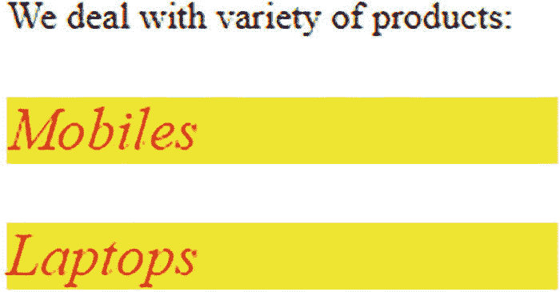
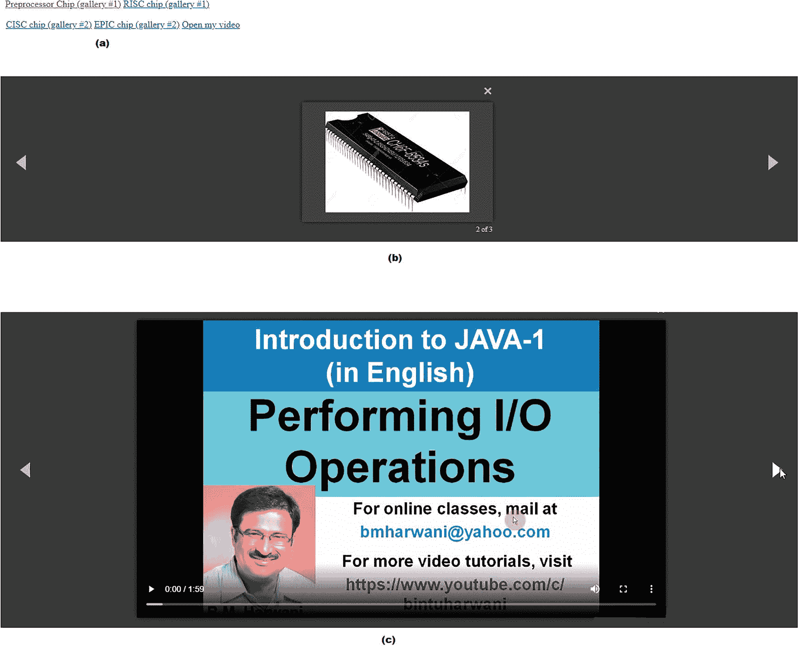
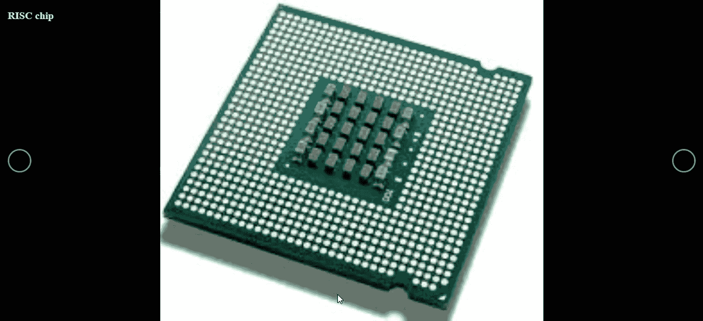

# 十一、创建和使用 jQuery 插件

jQuery 插件使得函数可移植，并且易于与任意数量的项目集成，因此实现了可重用性。在这一章中，你将学习如何从头开始创建 jQuery 插件，以及如何使用一些流行的 jQuery 插件。你学习如何用本章的食谱做以下事情。

*   创建一个插件来改变元素的字体大小，字体风格，前景色和背景色，并使插件可链接

*   允许将定制选项传递给插件

*   使用插件修改内容

*   使用 Magnific 弹出插件显示图像滑块

*   使用 iCheck 插件显示动态复选框和单选按钮

*   使用 blueimp Gallery 插件创建一个图库和轮播

*   使用 jQuery 验证插件验证表单

## 11.1 创建插件

插件是用标准 JavaScript 文件编写的代码，它提供了某些可以直接与 jQuery 库方法一起应用的 jQuery 方法。插件的编写使得它可以很容易地在代码中重用。因此，你写一次，受益多次。以下是创建插件的规则。

*   插件中的所有方法都必须以分号(；).

*   除非明确指出，否则该方法必须返回 jQuery 对象。

*   关键字 this.each 必须迭代匹配的元素。

*   插件文件名必须以扩展名为. js 的 jQuery 为前缀。

下面是命名 jQuery 插件的语法。

```js
jquery.plugin_name.js

```

如图所示，通过添加最小值来表示缩小版本。

```js
jquery.plugin_name.min.js

```

Note

在命名创建的插件时使用 jquery 前缀消除了与其他库的名称冲突。

您可以通过向原型添加函数来增加 jQuery 特性。为此，您需要公开 jQuery 原型。jQuery 原型通过 jQuery.fn 公开。换句话说，创建插件最简单的方法是使用 fn 属性。在 jQuery 中，fn 属性是 jquery.fn 函数的 prototype 属性的简单别名。

**语法**

```js
jQuery.fn = jQuery.prototype = {
      jquery code;
}

```

将函数添加到这个原型中，可以从任何构造的 jQuery 对象中调用和使用这些函数。构造的 jQuery 对象根据使用的选择器保存一个元素数组。例如，$('p ')构造了一个保存

元素的 jQuery 对象。

## 11.2 11-1.创建一个插件来改变一个元素的字体大小，字体风格，前景色和背景色

### 问题

您想要创建一个插件，当应用于任何 HTML 元素时，必须将其字体大小设置为 25px，将其字体样式更改为斜体，并将前景和背景颜色分别更改为红色和黄色。

### 解决办法

为了应用和测试插件，让我们创建一个销售少量产品的 HTML 文件。下面的 HTML 代码通过两个

元素显示了两种待售产品，手机和笔记本电脑。两个

元素都被包装在

元素中，如下所示。

crplugin 1 . html

```js
<!DOCTYPE html PUBLIC "-//W3C//DTD XHTML 1.0 Transitional//EN"
        "http://www.w3.org/TR/xhtml1/DTD/xhtml1-transitional.dtd">

<html xmlns:="http://www.w3.org/1999/xhtml" xml:lang="en" lang="en">
  <head>
    <meta http-equiv="Content-Type" content="text/html; charset=utf-8"/>
    <title></title>
    <script src="jquery-3.5.1.js" type="text/javascript"></script>
    <script src="jquery.crplugin1.js" type="text/javascript"></script>
    <script src="crplugin1jq.js" type="text/javascript"></script>
  </head>
  <body>
     <div> We deal with variety of products:
        <p>Mobiles</p>
        <p>Laptops</p>
     </div>
  </body>
</html>

```

您可以看到一个

元素是用特定的文本定义的。嵌套在元素中的是两个

元素，它们显示指示应用插件效果的产品名称的文本。

下面的 jQuery 代码创建了一个名为 style_products 的插件。

Jquery.crplugin1.js

```js
$.fn.style_products = function() {
     this.css({ fontSize: "25px",
         color: "red",
     "font-style": "italic",
     background: "yellow" });
};

```

请记住，插件函数中的“this”关键字表示调用该函数的构造的 jQuery 对象。插件函数将 CSS 样式属性应用于 jQuery 对象。对象的字体大小设置为 25 px，前景色设置为红色，字体样式设置为斜体，背景色设置为黄色。

下面是将插件的方法应用于 HTML 文件的

元素的 jQuery 代码。

```js
Crplugin1jq.js
$(document).ready(function() {
     $("p").style_products();
});

```

当$(“p”)时。style_products()被调用时,“this”的值是指包含页面上所有

元素的 jQuery 对象。结果两个产品名称的字号都是 25px，字体样式为斜体，背景色为黄色，文字颜色为红色，如图 11-1 所示。



图 11-1

两个产品名称的字号都变成了 25px，字体变成了斜体，背景颜色变成了黄色，前景色变成了红色

## 11.3 11-2.使插件可链接

为了让 jQuery 插件能够在实际例子中使用，它需要支持*链接*，这意味着能够应用其他函数。为此，插件的函数必须返回原始的 jQuery 对象，如下所示。

Jquery.crplugin1.js

```js
$.fn.style_products = function() {
     this.css({ fontSize: "25px",
         color: "red",
     "font-style": "italic",
     background: "yellow" });
     return this;
};

```

最后一句话，“还这个；返回原始的 jQuery 对象。

为了演示在所选元素上链接的应用，让我们创建一个 CSS 样式表，其中包含名为的放大样式类，如下所示。

Crplugin1style.css

```js
.enlarge{
       width: 100px;
       height: 100px;
}

```

您可以看到，放大样式类包含两个属性—宽度和高度，这两个属性的值都设置为 100px。

要应用并查看链接的效果，请修改 jQuery 代码 crplugin1jq.js，如下所示。

```js
$(document).ready(function() {
     $("p").style_products().addClass("enlarge");
});

```

您可以看到，由于在所选的

元素上应用了链接，所以应用了 jQuery 插件的 style_products()方法，然后在< p >元素上也应用了放大。通过应用 style_products()方法，两个产品名称的字体大小都设置为 25px，字体样式设置为斜体，文本的背景颜色设置为黄色，文本颜色设置为红色。通过应用放大样式类，将包含产品名称的< p >元素的宽度和高度设置为 100px，如图 11-2 所示。


图 11-2

设置字体大小、字体样式、背景和前景色后，商品名称的宽度和高度设置为 100px

## 11.4 11-3.允许将定制选项传递给插件

### 问题

你想创建一个插件，并想给它传递不同的定制选项。

### 解决办法

有时，您希望插件是可定制的(例如，用户可以更改或修改它的某些默认值)。在这个方法中，您将创建一个插件方法，定义它的默认选项，并用用户传递的选项覆盖它们(例如，将不同的定制选项传递给插件，使它可以在不同的选择器上重用)。为了创建一个可定制的插件，jQuery 提供了一个$。扩展工具方法，创建一个插件，从而帮助增强 jQuery 特性。

要通过可定制的插件在 HTML 元素上应用想要的选项，让我们创建一个 HTML 文件。下面是定义一个

元素的 HTML 代码，在元素中，两个

元素定义如下。

**Crplugin1b.html**

```js
<!DOCTYPE html PUBLIC "-//W3C//DTD XHTML 1.0 Transitional//EN"
        "http://www.w3.org/TR/xhtml1/DTD/xhtml1-transitional.dtd">

<html xmlns:="http://www.w3.org/1999/xhtml" xml:lang="en" lang="en">
  <head>
    <meta http-equiv="Content-Type" content="text/html; charset=utf-8"/>
    <title></title>
    <script src="jquery-3.5.1.js" type="text/javascript"></script>
    <script src="jquery.crplugin1b.js" type="text/javascript"></script>
    <script src="crplugin1bjq.js" type="text/javascript"></script>
  </head>
  <body>
     <div> We deal with variety of products:
        <p id="phone">Mobiles</p>
        <p id="computer">Laptops</p>
    </div>
  </body>
</html>

```

您可以看到定义了一个

元素来显示一条消息，表明该站点上销售的产品类型。两个

元素被定义为显示网站上销售的两种产品，手机和笔记本电脑。因为，在一个

元素上，你想用默认选项应用插件函数，在另一个

元素上，你想用用户提供的选项应用插件函数，不同的 id，“电话”和“计算机”被分配给两个

元素。

下面显示了使用 style_products 方法的 jQuery 插件代码。方法包含属性的默认值，如果用户提供了这些值，它会将这些值应用于属性。

**jquery。crplugin 1b . js**

```js
(function ($) {
$.fn.style_products = function(custom) {
     var settings = $.extend({
          fontSize: "15px",
          color : "white",
          fontStyle: "bold",
          background : "blue"
     }, custom);
     return this.css({
           fontSize: settings.fontSize,
              color: settings.color,
          fontStyle: settings.fontStyle,
          background: settings.background
     });
};
}(jQuery));

```

您可以在代码中看到，默认设置指定字体大小为 15px，字体样式为粗体，背景和文本颜色分别为蓝色和白色。如果用户提供了任何属性值(即，字体大小、颜色、字体样式或背景颜色)，属性的默认值将被用户指定的值覆盖。

下面是 jQuery 代码，用于调用插件的默认和可定制功能。

Crplugin1bjq.js

```js
$(document).ready(function() {
     $("#computer").style_products();
     $("#phone").style_products({
          fontSize: "25px",
             color: "red",
          fontStyle: "italic",
          background: "yellow"
     });
});

```

可以调用方法来应用默认属性，也可以应用自定义属性。代码中的第一条语句调用插件的 style_products 方法。默认属性应用于具有计算机 id 的元素(例如，Laptops 文本以粗体白色显示，字体大小为 15 px，背景颜色为蓝色)。为了查看用户如何在属性中提供定制的值，在带有电话 id 的

元素上调用 style_products()方法。对于手机文本，应用由用户指定值的属性。因此，手机文本为红色斜体，字体大小为 25px，背景颜色为黄色(见图 11-3 )。


图 11-3

通过应用属性，文本 Mobiles 以 25px 的字体大小、斜体样式和黄色背景显示，文本以红色显示。笔记本电脑的字体大小为 15 px，粗体，蓝色背景，白色文本

### 使用插件修改内容

您可以使用插件覆盖任何 HTML 元素的样式属性。例如，您可以更改或添加文本(例如，HTML 元素的内容可以通过插件进行修改)。

要向任何 HTML 元素添加文本，插件的方法修改如下。

**jquery。crplugin 1b . js**

```js
(function ($) {
$.fn.style_products = function(custom) {
     var settings = $.extend({
          product_name: 'Refrigerators',
          fontSize: "15px",
          color : "white",
          fontStyle: "bold",
          background : "blue"
     }, custom);
     return this.append(", "+settings.product_name).css({
           fontSize: settings.fontSize,
              color: settings.color,
          fontStyle: settings.fontStyle,
          background: settings.background
     });
};
}(jQuery));

```

您可以看到一个用户定义的属性，product_name 设置为默认值，冰箱；用户总是可以通过提供该属性的所需值来更改其默认值。当返回“this”jQuery 对象时，您可以附加一个逗号(，)和分配给 product_name 属性的值。因此,“冰箱”文本被附加到应用插件方法的 HTML 元素中。

在 HTML 文件中有两个

元素，所以对一个

元素，应用带有默认值的插件方法，对第二个

元素，应用带有用户值的插件方法。通过这样做，您可以看到插件方法对默认选项和用户值的影响。

下面是使用默认选项和定制选项应用插件方法的 jQuery 代码。

**Crplugin1bjq.js**

```js
$(document).ready(function() {
     $("#computer").style_products();
     $("#phone").style_products({
          product_name:'AirConditioners',
          fontSize: "25px",
             color: "red",
          fontStyle: "italic",
          background: "yellow"
     });
});

```

style_products 方法应用于具有计算机 id 的

元素，而不提供任何属性值。因此，style_products()方法对其属性使用默认值。“冰箱”被附加到具有计算机 id 的< p >元素的文本中(即“笔记本电脑”被修改为“笔记本电脑，冰箱”)，如图 11-4 所示。


图 11-4

文字修改为“笔记本电脑、冰箱”，“空调”追加到“手机”

用户提供了空调值作为 product_name 属性。“空调”被附加到带有电话 id 的

元素的文本中。因此，段落文本显示为手机、空调(见图 11-4 )。

### 使用插件

jQuery 在 [`https://plugins.jquery.com`](https://plugins.jquery.com) 有一个很大的插件库。大多数插件都包含了演示、例子、代码和文档的链接。本注册表中提到的插件都是在 GitHub ( [`http://github.com`](http://github.com) )代码库中管理的。GitHub 追踪插件的流行程度。我演示了使用一些插件的最快方法，并使用了他们的一些方法。我建议你参考这里讨论的插件的官方文档以获得完整的覆盖范围。

在代码中使用插件非常简单:下载并解压缩它。复制插件的。js 和。css 文件添加到您站点的文件夹中。一旦你的站点目录中有了插件，你就可以在你的网页上引用它。确保在主 jQuery 源文件之后、调用插件的 jQuery 脚本之前引用插件。

## 11.5 11-4.使用放大的弹出插件显示图像滑块

Dmitry Semenov 开发了 Magnific Popup。它是一个非常轻便和移动友好的 lightbox 和一个模态对话框插件，专注于优化性能和为使用任何设备的用户提供最佳体验(对于 jQuery 或 Zepto.js)。使用这个插件，图像、视频、谷歌地图和图片库可以显示动画效果。您可以在 [`https://plugins.jquery.com/magnific-popup/`](https://plugins.jquery.com/magnific-popup/) 的弹出窗口中找到完整的信息。该页面显示了演示、下载、文档、主页等的链接。单击“立即下载”链接下载代码。zip 格式的代码包被下载到您的计算机上。解压文件。从 dist 文件夹中，将 jquery.magnific-popup.js 和 magnific-popup.css 文件复制到您站点的文件夹中。

### 问题

您希望使用 Magnific 弹出插件以图像滑块的形式显示某些图像和视频。

### 解决办法

你正在逐步学习使用 Magnific 弹出插件制作一个图像滑块。首先，制作一个单个图像的小图像弹出窗口，然后增加图像。最后，你学习制作一个完整的图像滑块，不仅可以显示图像，还可以显示视频。

使用 Magnific Popup 插件的最简单的例子是显示一个超链接，该超链接打开带有动画的相关图像。

下面是显示指向图像文件的超链接的 HTML 代码。

**电站 gpopp . html**

```js
<!DOCTYPE html PUBLIC "-//W3C//DTD XHTML 1.0 Transitional//EN"
        "http://www.w3.org/TR/xhtml1/DTD/xhtml1-transitional.dtd">

<html xmlns:="http://www.w3.org/1999/xhtml" xml:lang="en" lang="en">
  <head>
    <meta http-equiv="Content-Type" content="text/html; charset=utf-8"/>
    <title></title>
    <script src="jquery-3.5.1.js" type="text/javascript"></script>
    <link rel="stylesheet" href="magnific-popup.css">
    <script src="jquery.magnific-popup.js"></script>
    <script src="usingpopupjq.js" type="text/javascript"></script>
  </head>
  <body>
<a class="test-popup-link" href="img/chip.jpg">Open popup</a>
  </body>
</html>

```

您可以看到由 magnific-popup.css 插件提供的 CSS 样式表与 jquery.magnific-popup.js 文件一起包含在 HTML 代码中。此外，您可以看到创建了一个“打开弹出”超链接；它指向图像文件夹中的 chip.jpg。将 test-popup-link 类分配给

Note

我在这个程序中使用了图像。不要忘记将随书的代码包提供的 images 文件夹复制到您站点的文件夹中。

下面是将插件方法应用于 HTML 文件中定义的超链接的 jQuery 代码。

**发电厂 IP . js**

```js
$(document).ready(function() {
       $('.test-popup-link').magnificPopup({
            type: 'image'
       });
});

```

您可以看到，对于带有 test-popup-link 类的超链接，插件的 magnificPopup()方法被应用，并且“type”属性被设置为“image”值。结果，网页上出现一个“打开弹出”链接，如图 11-5(a) 所示。当用户点击超链接时，链接的图像会弹出一个对话框，对话框右上方有一个关闭按钮(见图 11-5(b) )。


图 11-5

(a)打开弹出链接出现在网页上。(b)链接的图像弹出一个对话框

如果您想要显示两个或更多的图像，您需要为每个图像创建指向其各自图像的超链接。下面是完成这项工作的 HTML 代码。

**电站 gpopp . html**

```js
<!DOCTYPE html PUBLIC "-//W3C//DTD XHTML 1.0 Transitional//EN"
        "http://www.w3.org/TR/xhtml1/DTD/xhtml1-transitional.dtd">

<html xmlns:="http://www.w3.org/1999/xhtml" xml:lang="en" lang="en">
  <head>
    <meta http-equiv="Content-Type" content="text/html; charset=utf-8"/>
    <title></title>
    <script src="jquery-3.5.1.js" type="text/javascript"></script>
    <link rel="stylesheet" href="magnific-popup.css">
    <script src="jquery.magnific-popup.js"></script>
    <script src="usingpopupjq.js" type="text/javascript"></script>
  </head>
  <body>
     <div class="parent-container">
             <a href="img/chip.jpg">Preprocessor Chip</a>
            <a href="img/chip2.jpg">RISC chip</a>
            <a href="img/chip3.jpg">CISC chip</a>
      </div>
  </body>
</html>

```

您可以在 HTML 代码中看到定义了三个超链接，每个超链接都指向其各自的图像，该图像位于 images 文件夹中。所有三个超链接都嵌套在

元素中，为了让插件方法可以访问元素及其超链接，元素被赋予了 parent-container: class。

为了将插件的方法应用于包含超链接的

元素，jQuery 代码修改如下。

**发电厂 IP . js**

```js
$(document).ready(function() {
        $('.parent-container').magnificPopup({
            delegate: 'a', // by clicking on it popup will open
            type: 'image'
       });
});

```

您可以在 jQuery 代码中看到，对 parent-container: class 的

元素应用了 magnificPopup 方法，将 delegate 属性设置为“a”，并将“type”属性设置为“image”值。

结果，三个超链接出现在浏览器窗口左上角的屏幕上。每个超链接打开它所指向的相应图像(见图 11-6(a) )。点击一个超链接会在一个弹出窗口中显示其图像，窗口右上角有一个关闭按钮，如图 11-6(b) 所示。关闭对话框后，焦点将回到超链接上，您可以单击任何其他超链接来查看与之关联的图像。


图 11-6

(a)三个超链接出现在屏幕的左上角。( b)单击超链接会在弹出窗口中显示其图像

在前面的程序中，单击超链接会使关联的图像显示在弹出对话框中，您可以关闭该对话框。关闭对话框后，您可以单击另一个超链接来查看另一个图像。现在让我们看看如何在弹出对话框中添加“下一个”和“上一个”按钮，这样你就可以轻松地导航到任何图像。

让我们假设您想要显示两个图片库。第一个图像库显示两个图像。第二个图像库显示两个图像和一个视频。HTML 代码修改如下。

**电站 gpopp . html**

```js
<!DOCTYPE html PUBLIC "-//W3C//DTD XHTML 1.0 Transitional//EN"
        "http://www.w3.org/TR/xhtml1/DTD/xhtml1-transitional.dtd">

  <html xmlns:="http://www.w3.org/1999/xhtml" xml:lang="en" lang="en">
  <head>
    <meta http-equiv="Content-Type" content="text/html; charset=utf-8"/>
    <title></title>
    <script src="jquery-3.5.1.js" type="text/javascript"></script>
    <link rel="stylesheet" href="magnific-popup.css">
    <script src="jquery.magnific-popup.js"></script>
    <script src="usingpopupjq.js" type="text/javascript"></script>
  </head>
  <body>
     <div class="gallery">
              <a href="img/chip.jpg">Preprocessor Chip (gallery #1)</a>
              <a href="img/chip2.jpg">RISC chip (gallery #1)</a>
    </div>
    <div class="gallery">
              <a href="img/chip3.jpg">CISC chip (gallery #2)</a>
              <a href="img/chip4.jpg">EPIC chip (gallery #2)</a>
              <a href="http://bmharwani.com/videos/01javafirstlecturesampleinenglish.mp4" class="mfp-iframe">Open my video</a>
    </div>
  </body>
</html>

```

您可以看到定义了两个

元素，每个元素都被分配了 gallery 类，该类被分配来自动将附加 CSS 样式表 make 中提到的相应 CSS 样式应用到元素，并使它们在 jQuery 代码中可访问。第一个元素包含了两个超链接，这两个超链接指向将在第一个图像库中显示的两个图像。第二个元素包含三个超链接，其中前两个超链接指向两个图像，第三个超链接指向要在图像库中显示的视频。

下面是显示图库的代码，这些图库显示可以导航到下一个或上一个图像或视频的图像和视频。

**【usingopjq . js】**

```js
$(document).ready(function() {
        $('.gallery').each(function() { // the containers for all your galleries
              $(this).magnificPopup({
                       delegate: 'a', // the selector for gallery item
                       type: 'image',
                       gallery: {
                              enabled:true
                       }
              });
     });
});

```

在 jQuery 代码中，可以看到 gallery 类中的

元素被选中。在其中的每一个中，回调函数中的语句都被执行。在回调函数中，对元素调用 magnificPopup 方法，将 delegate 属性设置为 value，“a”，将 type 属性设置为 value，image，将 gallery 属性的 enabled 元素设置为 true。结果，两个 div 元素中的超链接出现在网页左上角的两行中，如图 11-7(a) 所示。您可以单击任何想要弹出其图像的画廊的任何链接。点击图片的超链接后，会弹出一个窗口，如图 11-7(b) 所示。您可以在对话框的右上角看到一个关闭按钮，使您能够关闭图像库并返回到顶部的超链接。此外，您可以在图像的右侧和左侧看到下一个和上一个箭头。使用这些箭头，您可以导航到画廊中的其他图像。图 11-7(c) 显示了视频如何出现在图库中的输出。点击最后一个图像/视频上的下一个按钮，显示第一个图像/视频。同样，单击第一个图像/视频上的“上一个”按钮会显示最后一个图像或视频。



图 11-7

(a)两个 div 元素中提到的超链接出现在左上角的两行中。(b)单击图库中的链接，在弹出窗口中打开图像。(c)视频出现在图库中

到目前为止，您已经看到了弹出对话框和图库中的图像。接下来，您将学习在单击图像时缩放图像。为了显示图像的缩略图，HTML 代码修改如下。

**电站 gpopp . html**

```js
<!DOCTYPE html PUBLIC "-//W3C//DTD XHTML 1.0 Transitional//EN"
        "http://www.w3.org/TR/xhtml1/DTD/xhtml1-transitional.dtd">

<html xmlns:="http://www.w3.org/1999/xhtml" xml:lang="en" lang="en">
  <head>
    <meta http-equiv="Content-Type" content="text/html; charset=utf-8"/>
    <title></title>
    <script src="jquery-3.5.1.js" type="text/javascript"></script>
    <link rel="stylesheet" href="magnific-popup.css">
    <script src="jquery.magnific-popup.js"></script>
    <script src="usingpopupjq.js" type="text/javascript"></script>
  </head>
  <body>
     <a href="img/chip3.jpg" class="image-link">
             
    </a>
  </body>
</html>

```

您可以看到创建了一个显示图像缩略图的超链接。缩略图的文件名是 chip3thumnail.jpg。超链接通过 chip3.jpg 链接到图像的缩放版本。为了应用 CSS 样式并使其在 jQuery 代码中可访问，超链接被分配了 image-link 类。

下面是 jQuery 代码，当单击图像的缩略图时，它会在弹出窗口中显示图像的放大版本。

**发电厂 IP . js**

```js
$(document).ready(function() {
       $('.image-link').magnificPopup({
            type: 'image',
            mainClass: 'mfp-with-zoom', // this class is for CSS animation below

            zoom: {
                   enabled: true, // By default it's false, so don't forget to enable it
                   duration: 300, // duration of the effect, in milliseconds
                   easing: 'ease-in-out', // CSS transition easing function
                   opener: function(openerElement) {
                          return openerElement.is('img') ? openerElement : openerElement.find('img');
                   }
            }
    });
});

```

您可以看到带有 image-link 类的超链接被选中，插件方法 magnificPopup 被应用于它，并且 type 属性被设置为 image。mainClass 属性设置为 mfp-with-zoom，以便在缩放图像时应用动画。zoom 属性的 enabled 元素设置为 true，动画持续时间设置为 300 毫秒，缓动过渡设置为渐强渐弱。opener 属性设置为指向返回布尔值的函数，如果操作应用于 img 元素，则为 true。

当应用运行时，会显示一个缩略图(参见图 11-8(a) )。点击缩略图会弹出一个大图，如图 11-8(b) 所示。


图 11-8

(A)出现一个缩略图。(b)单击缩略图在弹出窗口中显示其缩放版本

## 11.6 11-5.使用 iCheck 插件显示动态复选框和单选按钮

iCheck 是由 Damir Sultanov 开发的 jQuery 插件。它提供了高度可定制的复选框和单选按钮。在不同的浏览器和设备上都有相同的复选框和单选按钮，无论是移动设备还是台式机。这些输入也适用于 iOS、Android、黑莓、Windows Phone 和亚马逊 Kindle 等触摸设备。它支持 jQuery 和 Zepto，并提供 32 个选项来定制复选框和单选按钮，11 个回调来处理更改，9 个方法以编程方式进行更改，等等。

你可以在 [`https://plugins.jquery.com/icheck/`](https://plugins.jquery.com/icheck/) 找到 iCheck 插件的完整信息。该页面显示了演示、下载、文档、主页等的链接。单击“立即下载”链接下载代码。zip 格式的代码包被下载到您的计算机上。解压缩该文件，并将 icheck.js 文件复制到您站点的文件夹中。从 skins 子文件夹中，将 minimal、futurico 和 line 文件夹复制到您站点的文件夹中。这些文件夹包含将样式应用于复选框和单选按钮的 CSS 样式。

### 问题

您希望显示一个网页，其中显示一些食品和付款方式。用户可以选择任意数量的食品和付款方式。因为用户可能选择不止一个食品，所以食品通过复选框显示。因为用户只能选择一种付款方式，所以付款方式通过单选按钮显示。通过应用 iCheck 插件，可以使这些复选框和单选按钮看起来更动态。

### 解决办法

您希望显示三种食品和两种付款方式选项。下面是显示三个复选框和两个单选按钮的 HTML 代码。

发电厂尾箱. html

```js
<!DOCTYPE html PUBLIC "-//W3C//DTD XHTML 1.0 Transitional//EN"
        "http://www.w3.org/TR/xhtml1/DTD/xhtml1-transitional.dtd">

<html xmlns:="http://www.w3.org/1999/xhtml" xml:lang="en" lang="en">
  <head>
    <meta http-equiv="Content-Type" content="text/html; charset=utf-8"/>
    <title></title>
    <link href="minimal/minimal.css" rel="stylesheet">
    <script src="jquery-3.5.1.js" type="text/javascript"></script>
    <script src="icheck.js" type="text/javascript"></script>
    <script src="usingicheckjq.js" type="text/javascript"></script>
  </head>
  <body>
    <p> Select your fast food item: </p>
      <label><input type="checkbox"  name="food" value="Pizza">Pizza</label><br/>
      <label><input type="checkbox" name="food" value="Hot Dog">Hot Dog</label><br/>
      <label><input type="checkbox"  name="food" value="Burger" checked>Burger</label><br/>
<p> Select the payment method: </p>
<form id="pay">
           <label><input type="radio" name="iCheck"  value="Payment By Card">Payment By Card</label><br/>
           <label><input type="radio" name="iCheck"   value="Payment By Cash" checked>Payment By Cash</label><br/>
</form><br/>
      <input type="button" id="btnSubmit" value="Submit" />
  </body>
</html>

```

通过访问 minimal 文件夹中的 minimal.css 文件，可以对复选框和单选按钮应用不同的 css 样式。此外，插件的 icheck.js 文件包含在 jQuery 文件之后。

一个

元素显示“选择您的快餐项目:”文本。在段落元素下面，三对<label>和<input>元素显示了三个复选框。这三个复选框分别被命名为 *food* ，并分别被赋予披萨、热狗或汉堡值。checked 属性应用于 Burger 复选框，使其默认显示为选中状态。</label>

单选按钮出现在复选框之后。定义了另一个

元素，带有文本“选择付款方式:”。因为只能选择一个单选按钮，所以两个按钮都必须嵌套在一个

<form>元素中。要在 jQuery 代码中访问,</form>

<form>元素被赋予 id pay。使用</form>

<form>元素，两对<label>和<input>元素被定义来显示单选按钮和它们各自的标签。因为单选按钮旨在显示不同的支付方式，所以这两个单选按钮的值和标签分别设置为通过卡支付和通过现金支付。为了在 jQuery 代码中访问它们，这两个单选按钮都被赋予了名称 iCheck。此外，checked 属性应用于第二个单选按钮，因为您希望它默认处于选中状态。最后，一个提交按钮被分配给它。</label></form>

下面是将不同的样式和其他维度应用于复选框和单选按钮的 jQuery 代码。

**发电厂尾箱. js**

```js
$(document).ready(function() {
     $('input').iCheck({
              checkboxClass: 'icheckbox_minimal',
              radioClass: 'iradio_minimal',
              increaseArea: '20%' // optional
       });
       $("#btnSubmit").click(function() {
          var selected = [];
                      $.each($("input[name='food']:checked"), function(){
                               selected.push($(this).val());
                 });
                 paymethod =  $('input[name="iCheck"]:checked',  '#pay').val();
                 selected.push(paymethod)
                 alert("Selected food items and pay method is: " + selected.join(", "));
        });
});

```

您可以看到，在所有输入元素上，插件的 iCheck 方法被执行，以将所需的 CSS 样式应用于单选按钮和复选框。当单击 id 为 btnSubmit 的按钮时。换句话说，当单击提交按钮时，就会发生 click 事件。它的回调函数在定义“selected”的地方执行。所有被选中的复选框的值被推送(即，添加到“选择的”数组)。无论选择了披萨、热狗还是汉堡，它的值都会添加到“selected”数组中。

在观察到所有复选框之后，单选按钮被观察到(即，所有名为 iCheck 的输入元素被观察到)。如果选中了其中的任何一个，就会访问它的值并将其赋给 paymethod 变量。回想一下，所有的单选按钮都被命名为 iCheck。无论用户是否选中了“用卡支付”按钮或“用现金支付”单选按钮，相应的支付方法都被分配给 paymethod 变量。paymethod 中的值被推送到“selected”数组中，这意味着它包含用户选择的食物项目和用户选择的支付方法。

运行该应用时，会出现一个屏幕，要求您选择您想要的食物并选择付款方式，如图 11-9(a) 所示。用户选择的任何食物和支付方式都存储在“selected”数组中。最后，利用告警对话框将该数组中的所有信息显示在屏幕上，如图 11-9(b) 所示。


图 11-9

(a)选择食物项目的屏幕和付款方式之一出现。(b)通过警告对话框显示选择的食品和付款方式

在这个 HTML 程序中，您使用了 minimal 文件夹中的 minimal.css 样式表。这个 iCheck 插件为你提供了许多不同的 CSS 样式表，让复选框和单选按钮看起来更有吸引力，更有活力。您可以在 HTML 程序的 futurico 文件夹中使用 futurico.css 样式表。为此，修改 HTML 文件中的语句，以包含插件的 CSS 样式表。

```js
<link href="futurico/futurico.css" rel="stylesheet">

```

要将 futurico.css 文件中提到的样式应用于复选框和单选按钮，您需要在 jQuery 文件中进行更改。回想一下 jQuery 代码，下面两行使用了最少的样式类。

```js
              checkboxClass: 'icheckbox_minimal',
              radioClass: 'iradio_minimal',

```

要应用 futurico 样式类而不是最小样式类，请修改 jQuery 代码中的前两行，如下所示。

```js
              checkboxClass: 'icheckbox_futurico',
              radioClass: 'iradio_futurico',

```

就这样。不需要其他更改。在运行 HTML 程序时，您可以看到空复选框不再是白色而是黑色。此外，选中的复选框为绿色。同样，单选按钮也是黑色的。选中时，单选按钮有一个绿色小圆圈(见图 11-10 )。


图 11-10

空复选框为黑色，选中时为绿色。单选按钮是黑色的，选中时，它们会包含一个绿色的小圆圈

iCheck 插件还在 line 文件夹中提供了一个名为 line.css 的 CSS 样式表，它通常使用完整的行来显示复选框或单选按钮。复选框和单选按钮标签共享相同的背景(即，复选框的背景颜色)，并且其标签是相同的。同样，单选按钮及其标签的背景色也是一样的。为了正确地应用样式类，<label>元素必须位于复选框或单选按钮元素之下(这与之前复选框和单选按钮嵌套在<label>元素中的方式不同)。下面是修改后的 HTML 代码。</label></label>

**发电厂尾箱 2.html**

```js
<!DOCTYPE html PUBLIC "-//W3C//DTD XHTML 1.0 Transitional//EN"
        "http://www.w3.org/TR/xhtml1/DTD/xhtml1-transitional.dtd">

<html xmlns:="http://www.w3.org/1999/xhtml" xml:lang="en" lang="en">
  <head>
    <meta http-equiv="Content-Type" content="text/html; charset=utf-8"/>
    <title></title>
    <link href="line/line.css" rel="stylesheet">
    <script src="jquery-3.5.1.js" type="text/javascript"></script>
    <script src="icheck.js" type="text/javascript"></script>
    <script src="usingicheck2jq.js" type="text/javascript"></script>
  </head>
  <body>
       <p> Select your fast food item: </p>
      <input type="checkbox"  name="food" value="Pizza">
      <label>Pizza</label><br/>
       <input type="checkbox" name="food" value="Hot Dog">
      <label>Hot Dog</label><br/>
       <input type="checkbox"  name="food" value="Burger" checked>
      <label>Burger</label><br/>
       <p> Select the payment method: </p>
       <form id="pay">

           <input type="radio" name="iCheck"  value="Payment By Card">
           <label>Payment By Card</label><br/>
           <input type="radio" name="iCheck"   value="Payment By Cash" checked>
           <label>Payment By Cash</label><br/>
       </form><br/>
      <input type="button" id="btnSubmit" value="Submit" />
  </body>
</html>

```

您可以在 HTML 代码中看到,

元素显示文本，要求用户选择想要的食物。另外，请注意<label>元素跟在复选框和单选按钮元素后面。代码的其余部分与前面的 HTML 代码相同。</label>

要应用 line.css 样式表文件中提到的样式类，必须对 jQuery 代码进行如下修改。

**发电厂尾箱. js**

```js
$(document).ready(function() {
      $('input').each(function(){
              var self = $(this),
                label = self.next(),
                label_text = label.text();

              label.remove();
              self.iCheck({
                     checkboxClass: 'icheckbox_line',
                     radioClass: 'iradio_line',
                     insert: '<div class="icheck_line-icon"></div>' + label_text
              });
       });
       $("#btnSubmit").click(function() {
          var selected = [];
                      $.each($("input[name='food']:checked"), function(){
                               selected.push($(this).val());
                 });
                 paymethod =  $('input[name="iCheck"]:checked',  '#pay').val();
                 selected.push(paymethod)
                 alert("Selected food items and pay method is: " + selected.join(", "));
        });
});

```

您可以在代码中看到，所有的输入元素都被选中，并且对每个输入元素执行一个回调函数。在回调函数中，<label>元素的文本被访问并赋给 label_text 变量。之后，插件的 iCheck 方法被应用于<input>元素，相应的样式类被应用于复选框和单选按钮元素。除此之外，用 label_text 变量中的文本定义了一个</label>

元素。为了自动应用特定的样式，icheck_line-icon 类被分配给元素。换句话说，每个复选框和单选按钮都被一个具有特定类的元素所替代。代码的其余部分是相同的，它检测选中的复选框和单选按钮，并显示通过复选框选择的食品和通过单选按钮选择的支付方法。选中的选项通过警告对话框显示，如图 11-11 所示。


图 11-11

每个复选框和单选按钮都由一个具有特定类的

元素替换。样式类应用于复选框和单选按钮元素。选定的选项通过警告对话框显示

## 11.7 11-6.使用 blueimp 图库插件创建图库和轮播

blueimp Gallery 插件是由 Sebastian Tschan 创建的。它是一个支持触摸、响应迅速、可定制的图像和视频库、旋转木马和灯箱，针对移动和桌面应用进行了优化。它支持滑动、鼠标和键盘导航以及过渡效果等功能。它很容易使用。

你可以在 [`https://plugins.jquery.com/blueimp-gallery/`](https://plugins.jquery.com/blueimp-gallery/) 找到 blueimp 图库插件的完整信息。该页面显示了演示、下载、文档、主页等的链接。单击“立即下载”链接下载代码。zip 格式的代码包被下载到您的计算机上。解压文件。从 js 子文件夹中，将 blueimp-gallery.js 文件复制到您站点的文件夹中。从 css 子文件夹中，将 blueimp-gallery.css 文件复制到您站点的文件夹中。现在，您可以在您的网页上使用 blueimp Gallery 插件了。

Note

我用这个插件制作食谱时使用了图像，所以你需要复制本书代码包中提供的图像文件夹，并复制你站点文件夹中的图像文件夹。

### 问题

你正在学习使用 blueimp Gallery 插件制作一个图片轮播，但这是一个循序渐进的方法。首先，你学习制作一个图库。假设您有三张图片，并且您想使用 blueimp Gallery 插件创建一个图片库。最初，会显示图像的缩略图。单击任何缩略图都会以图像库的形式显示其较大版本，并带有“下一个”和“上一个”按钮，可以导航到任何图像。此外，正在显示的图像的标题出现在图像库的左上角。

### 解决办法

假设包含缩略图和缩放图像的图像文件夹被复制到您站点的文件夹中，创建一个显示三个超链接的 HTML 文件，如下所示。

**【usgblueimp . html】**

```js
<!DOCTYPE html PUBLIC "-//W3C//DTD XHTML 1.0 Transitional//EN"
        "http://www.w3.org/TR/xhtml1/DTD/xhtml1-transitional.dtd">

<html xmlns:="http://www.w3.org/1999/xhtml" xml:lang="en" lang="en">
  <head>
    <meta http-equiv="Content-Type" content="text/html; charset=utf-8"/>
    <title></title>

    <link href="blueimp-gallery.css" rel="stylesheet">
    <script src="jquery-3.5.1.js" type="text/javascript"></script>
    <script src="blueimp-gallery.js" type="text/javascript"></script>
    <script src="usingblueimpjq.js" type="text/javascript"></script>
  </head>
  <body>
      <div
            id="blueimp-gallery"
            class="blueimp-gallery blueimp-gallery-controls"
            aria-label="image gallery"
            aria-modal="true"
            role="dialog"
>
            <div class="slides" aria-live="polite"></div>
            <h3 class="title"></h3>
            <a
                   class="prev"
                   aria-controls="blueimp-gallery"
                   aria-label="previous slide"
                   aria-keyshortcuts="ArrowLeft"
            ></a>
            <a
                   class="next"
                   aria-controls="blueimp-gallery"
                   aria-label="next slide"
                   aria-keyshortcuts="ArrowRight"
            ></a>
            <a
                   class="close"
                   aria-controls="blueimp-gallery"
                   aria-label="close"
                   aria-keyshortcuts="Escape"
            ></a>
            <a
                   class="play-pause"
                   aria-controls="blueimp-gallery"
                   aria-label="play slideshow"
                   aria-keyshortcuts="Space"
                   aria-pressed="false"
                   role="button"
            ></a>
            <ol class="indicator"></ol>
     </div>
     <div id="links">
            <a href="img/chip.jpg" title="Preprocessor">
                   
            </a>
            <a href="img/chip2.jpg" title="RISC chip">
                   
            </a>
            <a href="img/chip3.jpg" title="CISC chip">

                   
            </a>
     </div>
   </body>
</html>

```

CSS 样式表文件 blueimp-gallery.css 包含在 HTML 代码中。blueimp-gallery.js 文件包含在 HTML 文件中。除此之外，您可以看到一个

元素被定义并被分配了链接”。id 被分配给 CSS 样式表中提到的自动应用样式，并使其在 jQuery 代码中可访问。在元素中有三个超链接。这三个超链接显示了三个缩略图，并链接到它们的大图。所有

下面是显示这三个缩略图并在单击任何缩略图时显示图像滑块所需的 jQuery 代码。

**usgblueippjq . js**

```js
$(document).ready(function() {
       document.getElementById('links').onclick = function (event) {
              event = event || window.event
              var target = event.target || event.srcElement
              var link = target.src ? target.parentNode : target
              var options = { index: link, event: event }
              var links = this.getElementsByTagName('a')
              blueimp.Gallery(links, options)
       }
});

```

当运行程序时，你会在浏览器窗口的左上角看到三个缩略图，如图 11-12(a) 所示。点击任一图像，显示其缩放版本，标题在左上角，如图 11-12(b) 所示。图像上还有左右按钮。您可以导航到任何图像。例如，在最后一个图像上单击“下一个”按钮会再次显示第一个图像。同样，单击第一个图像上的“上一个”按钮会显示最后一个图像。


图 11-12

(a)三个缩略图出现在左上角。(b)单击任何图像都会显示其缩放版本及其标题

#### 拉伸图像

有时，您想在保持图像纵横比的同时，将图像库中较小的图像拉伸到图库容器的尺寸。为此，将 blueimp-gallery-contain CSS 类添加到 gallery 小部件中。也就是修改 HTML 文件中最外层的

元素的类。在 HTML 程序中，您会看到最外层的类是 blue imp-gallery blue imp-gallery-controls。这几行重复如下，供您参考。

```js
<div
  id="blueimp-gallery"
  class="blueimp-gallery blueimp-gallery-controls"

```

通过修改前面的语句，将元素的类更改为 blue imp-gallery blue imp-gallery-contain，如下所示。

```js
<div
  id="blueimp-gallery"
  class="blueimp-gallery blueimp-gallery-contain"

```

不需要其他更改。运行该程序时，您会在浏览器窗口的左上角看到三个缩略图。点按任何缩略图图像都会放大图像，并保持其纵横比不变。图像的高度等于图库的高度。图像上的左右按钮使您能够导航到任何图像(参见图 11-13 )。



图 11-13

单击的缩略图显示为完全拉伸

#### 制作图像旋转木马

blueimp Gallery 插件可以让你用最少的努力制作一个图片轮播。图像转盘是在浏览器窗口中心显示图像的转盘。几秒钟后，该图像自动滑向浏览器窗口的左边界并消失。接下来，另一个图像从浏览器窗口的右边框出现，向左滑动，并停在浏览器窗口的中心。同样，几秒钟后，该图像自动滑向左边界，程序继续。要制作一个图像轮播，其中每个图像不断滑动，您需要修改 HTML 代码如下。

**【usgblueimp . html】**

按如下方式修改 html 文件。

```js
<!DOCTYPE html PUBLIC "-//W3C//DTD XHTML 1.0 Transitional//EN"
        "http://www.w3.org/TR/xhtml1/DTD/xhtml1-transitional.dtd">

<html xmlns:="http://www.w3.org/1999/xhtml" xml:lang="en" lang="en">
  <head>
    <meta http-equiv="Content-Type" content="text/html; charset=utf-8"/>
    <title></title>
    <link href="blueimp-gallery.css" rel="stylesheet">
    <script src="jquery-3.5.1.js" type="text/javascript"></script>
    <script src="blueimp-gallery.js" type="text/javascript"></script>
    <script src="usingblueimpjq.js" type="text/javascript"></script>
  </head>
  <body>
       <div
            id="blueimp-gallery-carousel"
            class="blueimp-gallery blueimp-gallery-carousel"
            aria-label="image carousel"
      >
            <div class="slides" aria-live="off"></div>
            <h3 class="title"></h3>
            <a
                   class="prev"
                   aria-controls="blueimp-gallery-carousel"
                   aria-label="previous slide"
            ></a>
            <a
                   class="next"
                   aria-controls="blueimp-gallery-carousel"
                   aria-label="next slide"
            ></a>
            <a
                   class="play-pause"
                   aria-controls="blueimp-gallery-carousel"
                   aria-label="play slideshow"
                   aria-pressed="true"
                   role="button"
            ></a>
            <ol class="indicator"></ol>
     </div>
     <div id="links">
            <a href="img/chip.jpg" title="Preprocessor">
                   
            </a>
            <a href="img/chip2.jpg" title="RISC chip">
                   
            </a>
            <a href="img/chip3.jpg" title="CISC chip">
                   
            </a>
     </div>
</body>
</html>

```

您可以在 HTML 代码中看到，只要使用了 blueimp-gallery 类，它就会被 blueimp-gallery-carousel 类替换，这样插件的 CSS 样式表中提到的样式类就会自动应用于图像超链接，相应的 jQuery 代码也可以应用于它们。

要将图像超链接转换成图像轮播，jQuery 代码需要修改如下。

**usgblueippjq . js**

```js
$(document).ready(function() {
       document.getElementById('links').onclick = function (event) {
              event = event || window.event
              var target = event.target || event.srcElement
              var link = target.src ? target.parentNode : target
              var options = { index: link, event: event }
              var links = this.getElementsByTagName('a')
              blueimp.Gallery(links, options)
       }
       blueimp.Gallery(document.getElementById('links').getElementsByTagName('a'), {
              container: '#blueimp-gallery-carousel',
              carousel: true
       })
});

```

当您运行该程序时，您会在浏览器屏幕的中央找到第一幅图像。几秒钟后，该图像滑向浏览器的左边缘并消失。第二个图像出现在浏览器的右边缘，向左滑动，停在浏览器窗口的中央。几秒钟后，第二个图像滑向浏览器窗口的左边缘，然后消失。第三个图像从右边缘开始出现，向左滑动，停在浏览器窗口的中央。这一过程无休止地继续下去。

如果您点按任何图像，会出现“下一个”和“上一个”按钮。您可以使用它们导航到任何图像(参见图 11-14 )。当你停止导航时，图像自动滑动开始。


图 11-14

图像一个接一个地出现在浏览器屏幕的中央。点按任何图像后，会出现“下一个”和“上一个”按钮

## 11.8 11-7.使用 jQuery 验证插件验证表单

jQuery 验证插件 v1.19.3 由 jQuery 团队的成员 rn Zaefferer 编写和维护。

这个 jQuery 插件为客户端表单验证提供了一种简单的技术，并提供了几个定制选项来满足您的需求。该插件有几个验证方法来验证电子邮件地址、URL、用户名等，所有方法都有默认的英语错误消息和 37 种其他语言的翻译。该插件还提供了一个 API 来编写你自己的方法。全部捆绑

你可以在 [`https://jqueryvalidation.org`](https://jqueryvalidation.org) 找到更多关于 jQuery 验证插件的信息。该页面显示了演示、下载、文档、GitHub 库等的链接。单击“立即下载”链接，然后单击“源代码”链接下载代码。zip 格式的代码包被下载到您的计算机上。解压文件。从 dist 子文件夹中，将 jquery.validate.js 文件复制到您站点的文件夹中。现在，您可以在您的网页上使用 blueimp Gallery 插件了。

### 问题

您有一个表单，要求用户输入用户名、电子邮件地址、URL 和注释。您希望使用 jQuery 验证插件来验证这个表单。

### 解决办法

您需要一个 HTML 表单来提示用户输入他们的姓名、电子邮件地址、URL 和评论。下面是显示一个要求用户输入这些信息的表单的 HTML 代码。

**工厂形验证. html**

```js
<!DOCTYPE html PUBLIC "-//W3C//DTD XHTML 1.0 Transitional//EN"
        "http://www.w3.org/TR/xhtml1/DTD/xhtml1-transitional.dtd">

<html xmlns:="http://www.w3.org/1999/xhtml" xml:lang="en" lang="en">
  <head>
    <meta http-equiv="Content-Type" content="text/html; charset=utf-8"/>
    <title></title>
    <script src="jquery-3.5.1.js" type="text/javascript"></script>
    <script src="jquery.form.js" type="text/javascript"></script>
    <script src="usingformvalidatejq.js" type="text/javascript"></script>
  </head>
  <body>
     <form class="cmxform" id="myform" method="get" action="">
            <fieldset>
              <legend>Please provide your name, email address and a comment</legend>
              <p>
                     <label for="cname">Name (required, at least 2 characters)</label>
                     <input id="cname" name="name" minlength="2" type="text" required>
              </p>
              <p>
                     <label for="cemail">E-Mail (required)</label>
                     <input id="cemail" type="email" name="email" required>
              </p>
              <p>
                     <label for="curl">URL (optional)</label>
                     <input id="curl" type="url" name="url">
              </p>
              <p>
                     <label for="ccomment">Your comment (required)</label>
                     <textarea id="ccomment" name="comment" required></textarea>
              </p>
              <p>
                     <input class="submit" type="submit" value="Submit">
              </p>
            </fieldset>

     </form>
  </body>
</html>

```

可以看到一个表单是用 id、commentForm 和 cmsform 类定义的。id 和类被分配来自动应用 CSS 样式，并使其在 jQuery 代码中可访问。在

<form>元素中是

<fieldset>元素，它对表单的元素进行分组。此外，嵌套元素周围会绘制一个框。“请提供您的姓名、电子邮件地址和评论”显示在使用<legend>元素的框的轮廓中。然后，通过<label>和<input>元素对询问用户需要的任何信息，每一对都被包装在

元素中。<label>和<input>元素要求用户输入姓名、电子邮件地址、用户网站的 URL 和评论。在数据必不可少的情况下,<input>元素与“required”属性一起使用。</label></label></legend> </fieldset>

</form>

minlength 属性与<input>元素一起使用，要求输入用户名，以通知用户名称至少需要两个字符。用于搜索姓名、电子邮件地址、URL 和评论的<input>元素分别被赋予唯一的 id、cname、cemail、curl 和 ccomment。插件方法正是通过这些 id 来验证表单的这些元素。由于 input 元素设置为 optional(即，用户也可以将输入框留空)，因此不会对 URL 应用任何验证。

应用表单验证的 jQuery 代码如下。

**发电厂 gformvalidateq . js**

```js
$(document).ready(function() {
      $("#myform").validate({
            submitHandler: function(form) {
                   form.submit();
            }
      });
});

```

可以看到 id 为 myform 的表单被访问，插件的 validate 方法被调用。当用户单击 Submit 按钮时，submitHandler 调用回调函数来提交表单。但是，如果所有的<input>元素都通过验证，则不会提交表单。如果<input>元素不符合标准，会出现一个弹出对话框，显示错误。当用户开始输入<input>元素时，弹出对话框自动消失。如果用户单击提交按钮，并且任何<input>元素未通过验证，则弹出窗口再次出现。

在运行 HTML 程序时，底部有四个输入框和一个提交按钮。输入框要求用户输入用户名、电子邮件地址、URL 和评论(见图 11-15(a) )。


图 11-15

(a)出现四个输入框和一个提交按钮。(b)出现错误弹出窗口，要求输入至少两个字符作为名称。(c)输入无效电子邮件地址时弹出错误提示。(d)如果注释框为空，将出现一个错误弹出窗口，要求填写该框

输入姓名时必须至少输入两个字符，因此会出现一个错误弹出窗口，要求用户在姓名框中不输入任何内容或仅输入一个字符时输入至少两个字符(见图 11-15(b) )。

如果用户没有输入电子邮件地址或者输入了没有@符号的无效电子邮件地址，则会弹出一个错误，要求输入有效的电子邮件地址(参见图 11-15(c) )。如果 URL 框为空或输入了任何无效的 URL，则不会出现错误，因为不会对 URL 框执行任何验证。因为注释框不能为空，必须在注释框中输入一些内容，如果注释框为空，一个错误弹出窗口要求用户填写注释框(参见图 11-15(d) )。

## 11.9 11-8.总结

在这一章中，你学习了如何创建一个插件来改变一个元素的字体大小，字体风格，前景色和背景色。您还学习了如何制作可链接的插件。您还学习了根据需要定制插件。您学习了如何使用插件，包括显示图像滑块的 Magnific Popup 插件、显示动态复选框和单选按钮的 iCheck 插件、创建图像库和轮播的 blueimp Gallery 插件以及验证表单的 jQuery validation 插件。

下一章重点介绍 CSS 的使用。您将学习使用 CSS 来区分 HTML 元素，对嵌套元素应用样式，缩进段落，以及对段落应用首字母大写。您还学习了如何应用 CSS 来消除标题和段落之间的间隙、对标题文本应用样式、缩进多个段落的第一行、创建带有悬挂缩进的段落以及创建带边框的引用。在经历了更多的食谱后，使用 CSS 的概念变得更加清晰。