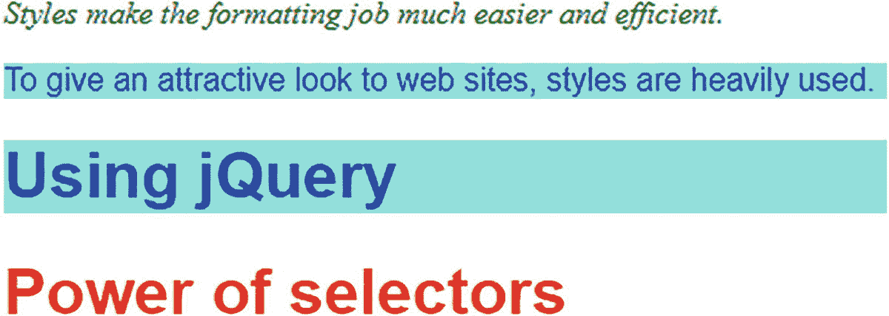
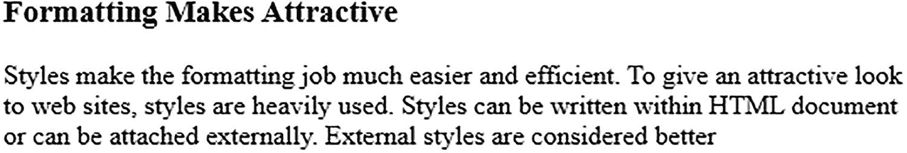
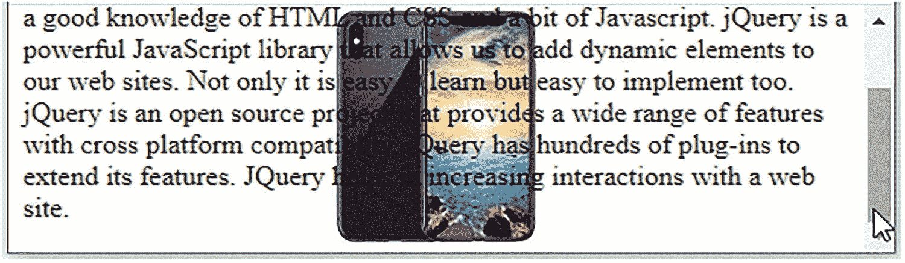

# 十二、使用 CSS

这最后一章提供了一套严重依赖 CSS 的食谱。这些食谱补充了本书中的其他食谱，因为 CSS 永远不会远离 JavaScript 开发人员的工作。我包含了一些我最常用的 CSS 技术，以便在您开发自己的 web 应用时快速参考。

本章包括以下配方。

*   区分 HTML 元素

*   将样式应用于嵌套在另一个元素中的元素

*   缩进段落

*   对段落应用首字母大写

*   消除标题和段落之间的间隙

*   对标题文本应用样式

*   缩进多个段落的首行

*   创建带有悬挂缩进的段落

*   创建带边框的引用语

*   使用图像创建重要报价

*   将列表属性应用于列表项目

*   仅将样式应用于选定的列表项

*   在列表项之间放置分隔线

*   将图像标记应用于列表

*   创建内嵌列表

*   将样式应用于超链接和邮件

*   为 HTML 元素分配不同的维度

*   放置 HTML 元素

*   创建多栏布局

*   在图像周围环绕文本

*   在图像后面放置投影

*   当鼠标移动到链接上时更改光标

*   在特定区域显示一长段文本

*   制作圆角柱

*   应用文本装饰

*   缩放图像

*   设置背景图像

*   使背景图像在浏览器中居中

*   使背景图像静止

## 12.1 区分 HTML 元素

### 问题

当您想要对 HTML 文件的两个不同段落或两个不同 h1 元素应用不同的样式时，您必须通过为它们分配不同的类来区分它们。此外，您需要编写可以单独应用于这些类的样式规则。

### 解决办法

首先编写一个包含两个段落和两个 h1 元素的 HTML 文件。为了区分它们，你给它们分配不同的类。段落元素分别被分配 feature1 和 feature2 类。h1 元素分别被指定为 feature2 和 feature3 类。

**Distinguishhtml.html**

```js
<!DOCTYPE html PUBLIC "-//W3C//DTD XHTML 1.0 Transitional//EN"
        "http://www.w3.org/TR/xhtml1/DTD/xhtml1-transitional.dtd">

<html xmlns:="http://www.w3.org/1999/xhtml" xml:lang="en" lang="en">
  <head>
    <meta http-equiv="Content-Type" content="text/html; charset=utf-8"/>
    <title></title>
    <link rel="stylesheet" href="style.css" type="text/css" media="screen" />
    <script src="jquery-3.5.1.js" type="text/javascript"></script>
    <script src="distinguishhtmljq.js" type="text/javascript"></script>
  </head>
  <body>

     <p class="feature1">Styles make the formatting job much easier and efficient.</p>
     <p class="feature2">To give an attractive look to web sites, styles are heavily used.</p>
     <h1 class="feature2">Using jQuery</h1>
    <h1 class="feature3">Power of selectors</h1>
  </body>
</html>

```

要将样式应用于不同类的 HTML 元素，需要在样式表中编写以下样式规则。

**Style.css**

```js
.greencolor{color:green;font-style:italic}
.highlight{background-color:aqua;color:blue;font-family:arial;}
.redandbold{color:red;font-family:arial;font-weight:bold}

```

下面是将样式规则应用于段落和 H1 元素的 jQuery 代码。

**区分 htmljq.js**

```js
$(document).ready(function() {
  $('p.feature1').addClass('greencolor');
  $('.feature2').addClass('highlight');
  $('h1.feature3').addClass('redandbold');
});

```

### 它是如何工作的

第一条语句将绿色中定义的属性仅应用于段落元素以及属于 feature1 类的元素(即以

标签开头的元素)。第二条语句将高亮样式规则中定义的属性应用于 feature2 类中的任何 HTML 元素。在 HTML 文件中，一个段落元素和一个 h1 元素属于 feature2 类(由

和

# 标签表示)，因此该规则中定义的属性适用于这两个元素。第三条语句将 feature3 样式规则中定义的属性仅应用于属于 feature3 类的 h1 元素。输出如图 12-1 所示。



图 12-1

不同的类应用于< p >和< h1 >标签

## 12.2 将样式应用于嵌套在另一个元素中的元素

### 问题

有时，span 元素嵌套在另一个具有特定 id 或类的 HTML 元素中，您需要对该嵌套的 span 元素应用样式。

### 解决办法

在以下 HTML 文件中，您定义了要素类的段落元素。在这个段落元素中，定义了一个 span 元素。

**Stylenested.tml**

```js
<!DOCTYPE html PUBLIC "-//W3C//DTD XHTML 1.0 Transitional//EN"
        "http://www.w3.org/TR/xhtml1/DTD/xhtml1-transitional.dtd">

<html xmlns:="http://www.w3.org/1999/xhtml" xml:lang="en" lang="en">
  <head>
    <meta http-equiv="Content-Type" content="text/html; charset=utf-8"/>
    <title></title>
    <link rel="stylesheet" href="style.css" type="text/css" media="screen" />
    <script src="jquery-3.5.1.js" type="text/javascript"></script>
    <script src="stylenestedjq.js" type="text/javascript"></script>
  </head>
  <body>
     <p class="feature">Styles make the formatting job much easier and efficient. <span>To give an attractive look to web sites,</span> styles are heavily used.</p>.
  </body>
</html>

```

应用于要素类的段落元素和嵌套在其中的 span 元素的样式规则是在样式表中编写的，可能如下所示。

**Style.css**

```js
.greencolor{color:green;font-style:italic}
.highlight{background-color:aqua;color:blue;font-family:arial;}

```

将样式应用于 feature1 类的段落元素和嵌套在要素类的段落元素内的 span 元素。下面是 jQuery 代码。

style nestedjq . js

```js
$(document).ready(function() {
  $('p.feature').addClass('greencolor');
  $('p.feature span').addClass('highlight');
});

```

### 它是如何工作的

首先，让我们看看你是如何定义 CSS 样式的。

```js
.feature{property:value; property:value;...}

```

它用 class="feature "定义了一个可以应用于任何 HTML 元素的样式。

```js
.feature span {property:value; property:value;...}

```

它定义了一个样式，该样式可以应用于嵌套在任何 HTML 元素中的 span 元素。

```js
p.feature span {property:value; property:value;...}

```

它使用 class="feature "定义了一个样式，该样式可以应用于嵌套在段落元素内的 span 元素。

```js
feature1 span.feature2 {property:value; property:value;...}

```

它定义了一个可以应用于 span 元素的样式，其中 class="feature2 "嵌套在 class="feature1 "的任何 HTML 元素中。

```js
p.feature1 span.feature2 {property:value; property:value;...}

```

它定义了一个样式，该样式可以应用于 span 元素，其中 class="feature2 "嵌套在 paragraph 元素中，class="feature1 "。

第一个 jQuery 语句使用 class="feature "将 greencolor 中定义的样式属性应用于段落元素。第二条语句将突出显示样式规则中定义的属性应用于在 paragraph 元素中定义的 span 元素，该元素带有 class="feature "。换句话说，样式应用于包含在和标记之间的文本区域，这些标记是在具有 class="feature "的段落元素中定义的。样式应用的输出如图 12-2 所示。


图 12-2

将样式应用于嵌套在另一个 HTML 元素中的 span 元素

## 12.3 缩进段落

### 问题

在一个 HTML 文件中有三个段落，你想在三个不同的层次缩进它们。

### 解决办法

下面是包含这三个段落的 HTML。

**Indentingparagraph.thml**

```js
  <!DOCTYPE html PUBLIC "-//W3C//DTD XHTML 1.0 Transitional//EN"
        "http://www.w3.org/TR/xhtml1/DTD/xhtml1-transitional.dtd">

<html xmlns:="http://www.w3.org/1999/xhtml" xml:lang="en" lang="en">
  <head>
    <meta http-equiv="Content-Type" content="text/html; charset=utf-8"/>
    <title></title>
    <link rel="stylesheet" href="styleindenting.css" type="text/css" media="screen" />
    <script src="jquery-3.5.1.js" type="text/javascript"></script>
    <script src="indentingparagraphjq.js" type="text/javascript"></script>
  </head>
  <body>
     <p class="feature1">Styles make the formatting job much easier and efficient. To give an attractive look to web sites, styles are heavily used. Styles can be written within HTML document or can be attached externally. External styles are considered better</p>
     <p class="feature2">JQuery is a powerful JavaScript library that allows us to add dynamic elements to our web sites. Not only it is easy to learn but easy to implement too.</p>
     <p class="feature3"> jQuery Selectors are used for selecting the area of the document where we want to apply styles. JQuery has the power of handling events also meaning we can apply styles when a particular action takes place</p>
  </body>
</html>

```

您可以看到这三个段落被分配了三个不同的类名:feature1、feature2 和 feature3。您正在使用 margin 属性来缩进这些段落。下面是写在外部样式表中的样式规则。

**Styleindenting.css**

```js
.indent1{
    margin-left:10%;
}
.indent2{
    margin-left:20%;
}
.indent3{
    margin-left:30%;
}

```

要将样式规则应用于这三个段落，您需要编写以下 jQuery 代码。

**indenting 僇 jq.js**

```js
$(document).ready(function() {

  $('p.feature1').addClass('indent1');
  $('p.feature2').addClass('indent2');
  $('p.feature3').addClass('indent3');
});

```

### 它是如何工作的

第一条语句从 HTML 文件中选择 feature1 类的 paragraph 元素，并对其应用 indent1 样式规则中定义的属性。同样，第二个和第三个语句选择 feature2 类和 feature3 类的段落元素，并分别应用 indent2 和 indent3 样式规则中定义的属性。输出如图 12-3 所示。


图 12-3

缩进三个不同层次的三个段落

## 12.4 对段落应用首字母大写

### 问题

您希望将段落的第一个字符作为首字母大写。首字母大写可以是不同的字体，不同的颜色，或者你甚至可以使用图片作为首字母大写。

### 解决办法

让我们考虑下面这个只有一个段落元素的 HTML 文件。

**Initialcap.html**

```js
<!DOCTYPE html PUBLIC "-//W3C//DTD XHTML 1.0 Transitional//EN"
        "http://www.w3.org/TR/xhtml1/DTD/xhtml1-transitional.dtd">

<html xmlns:="http://www.w3.org/1999/xhtml" xml:lang="en" lang="en">
  <head>
    <meta http-equiv="Content-Type" content="text/html; charset=utf-8"/>
    <title></title>
    <link rel="stylesheet" href="styleinitialcap.css" type="text/css" media="screen" />
    <script src="jquery-3.5.1.js" type="text/javascript"></script>
    <script src="initialcapjq.js" type="text/javascript"></script>
  </head>
  <body>

     <p><span class="cap">S</span>tyles make the formatting job much easier and efficient. To give an attractive look to web sites, styles are heavily used. Styles can be written within HTML document or can be attached externally. External styles are considered better
  </body>
</html>

```

下面是您应用的样式规则，写在样式表中。

style initial cap . CSS

```js
.initialcap{
     font-size: 2em;
}

```

下面是将样式规则应用于名为 cap class 的 span 元素的 jQuery 代码。

**首字母 capjq.js**

```js
$(document).ready(function() {
  $('span.cap').addClass('initialcap');
});

```

### 它是如何工作的

您可以在 HTML 中看到，为了将段落的第一个字符与正文的其余部分区分开来，它被包含在一个 span 标记中，并被分配了一个 cap 类。对于这个 cap 类，可以通过 jQuery 代码应用样式规则。你可以看到第一个字符的字体大小是默认字体(段落其余部分)的两倍，如图 12-4 所示。


图 12-4

段落的第一个字符设置为首字母大写

您还可以更改第一个字符的前景色和背景色，如下面的样式规则所示。

style initial cap . CSS

```js
.initialcap{
       font-size:2em;
       background-color:black;
       color:white;
}

```

## 12.5 消除标题和段落之间的间隙

### 问题

每当您将标题应用于任何段落时，标题和段落之间都会有间隙。你想消除这个差距。

### 解决办法

下面是标题和段落的 HTML。

**Removinggap.html**

```js
<!DOCTYPE html PUBLIC "-//W3C//DTD XHTML 1.0 Transitional//EN"
        "http://www.w3.org/TR/xhtml1/DTD/xhtml1-transitional.dtd">

<html xmlns:="http://www.w3.org/1999/xhtml" xml:lang="en" lang="en">
  <head>
    <meta http-equiv="Content-Type" content="text/html; charset=utf-8"/>
    <title></title>
    <link rel="stylesheet" href="styleremovinggap.css" type="text/css" media="screen" />
    <script src="jquery-3.5.1.js" type="text/javascript"></script>
    <script src="removinggapjq.js" type="text/javascript"></script>
  </head>
  <body>

      <h3>Formatting Makes Attractive</h3>
      <p>Styles make the formatting job much easier and efficient. To give an attractive look to web sites, styles are heavily used. Styles can be written within HTML document or can be attached externally. External styles are considered better</p>
  </body>
</html>

```

下面是去除段落和标题之间间隙的样式规则。

**Styleremovinggap.css**

```js
.heading{
     margin:0;
     padding:0;
}

p{
     margin:0;
     padding:0;
}

```

下面是将样式应用于 h3 元素的 jQuery 代码。

删除 apjq.js

```js
$(document).ready(function() {
  $('h3').addClass('heading');
});

```

### 它是如何工作的

没有应用任何 jQuery 代码的 HTML 的原始输出如图 12-5 所示。你可以看到标题和段落之间有很大的空隙。



图 12-5

段落和标题之间通常有间隔

在这个样式表中，标题类选择器应用于 h3 元素，p{}类型选择器直接应用于段落元素。

在对段落和标题应用样式时，你会发现它们之间的间隙被消除了，如图 12-6 所示。


图 12-6

段落和标题之间通常的空白被删除

## 12.6 对标题文本应用样式

### 问题

您希望将样式应用于文本的标题。

### 解决办法

你在食谱 12-4 中使用相同的 HTML，它包含一个段落和一个标题。为了突出标题，你首先需要消除标题和段落之间的间隙。然后，你把它变成斜体，并给它加上边框。您在样式表中编写以下样式规则。

**Stylestoheading.css**

```js
.heading{
     margin:0;
     padding:0;
     font-style: italic;
     border-top:5px solid black;
     border-bottom:5px solid black;
}

p{
     margin:0;
     padding:0;
}

```

让我们用下面的 jQuery 代码将该样式应用于 h3 元素。

**Stylestoheadingjq.js**

```js
$(document).ready(function() {
  $('h3').addClass('heading');
});

```

### 它是如何工作的

样式规则中的边距和填充属性消除了标题和段落之间通常的间隙，字体样式使标题以斜体显示。border 属性为标题附加上边框和下边框。

应用样式后的段落标题如图 12-7 所示。


图 12-7

带有样式化标题的段落

## 12.7 缩进多个段落的第一行

### 问题

您想要缩进文档中段落的第一行。

### 解决办法

让我们写一些 HTML，里面有几个段落，如下。

**indeting first line . html**

```js
  <!DOCTYPE html PUBLIC "-//W3C//DTD XHTML 1.0 Transitional//EN"
        "http://www.w3.org/TR/xhtml1/DTD/xhtml1-transitional.dtd">

<html xmlns:="http://www.w3.org/1999/xhtml" xml:lang="en" lang="en">
  <head>
    <meta http-equiv="Content-Type" content="text/html; charset=utf-8"/>
    <title></title>
    <link rel="stylesheet" href="styleindentfirstline.css" type="text/css" media="screen" />
    <script src="jquery-3.5.1.js" type="text/javascript"></script>
    <script src="indentingfirstlinejq.js" type="text/javascript"></script>
  </head>
  <body>
      <p>Styles make the formatting job much easier and efficient. To give an attractive look to web sites, styles are heavily used

. Styles can be written within HTML document or can be attached externally. External styles are considered better</p>
      <p>jQuery is a powerful JavaScript library that allows us to add dynamic elements to our web sites. Not only it is easy to learn but easy to implement too.</p>
      <p> jQuery Selectors are used for selecting the area of the document where we want to apply styles. JQuery has the power of handling events also meaning we can apply styles when a particular action takes place</p>
  </body>
</html>

```

HTML 显示三个段落，没有任何缩进。要在段落的第一行应用缩进，需要使用 text-indent 属性。下面是样式表中的样式规则。

**style indent linetype . CSS**

```js
.firstindent{
     text-indent:10%;
}

```

下面是将 firstindent 应用于 HTML 文件的所有段落元素的 jQuery 代码。

**indetingfirstlinejq . js**

```js
$(document).ready(function() {
  $('p').addClass('firstindent');
});

```

### 它是如何工作的

应用该样式时，HTML 文件的段落第一行缩进，如图 12-8 所示。


图 12-8

首行缩进的段落

## 12.8 创建带悬挂缩进的段落

### 问题

您希望在文档中段落的第一行有悬挂缩进。

### 解决办法

在这个食谱中，你使用你在食谱 12-6 中使用的相同的 HTML。HTML 有三个段落元素。

您可以利用 text-indent 和 margin-left 属性来创建悬挂缩进。以下是风格法则。

**stylehangindent . CSS**

```js
.hangingindent{
    text-indent:-10%;
    margin-left:10%;
}

```

下面是将悬挂缩进样式规则应用于段落的 jQuery 代码。

hangingindenttjq . js

```js
$(document).ready(function() {
  $('p').addClass('hangingindent');
});

```

### 它是如何工作的

通过将 margin-left 属性设置为 10%,可以将段落设置为从浏览器窗口左侧开始，为浏览器窗口宽度的 10%(即，整个段落向右移动浏览器窗口宽度的 10%)。通过将 text-indent 的值设置为–10%,您可以使段落的第一行向左移动，移动量等于浏览器窗口宽度的 10 %,从而使其看起来像悬挂的缩进。

在应用样式时，每段的第一行都有一个悬挂式缩进，如图 12-9 所示。


图 12-9

首行缩进的段落

## 12.9 创建带边框的引用语

### 问题

在一大段文字的中间，你想突出某些文字来吸引访问者的眼球。也就是说，你需要做一个有边界的引用。

### 解决办法

让我们编写一个包含三个段落的 HTML，您想要突出显示的段落通过为其分配一个要素类名称来与其他段落区分开来。下面是 HTML。

**Pullquote.html**

```js
<!DOCTYPE html PUBLIC "-//W3C//DTD XHTML 1.0 Transitional//EN"
        "http://www.w3.org/TR/xhtml1/DTD/xhtml1-transitional.dtd">

<html xmlns:="http://www.w3.org/1999/xhtml" xml:lang="en" lang="en">
  <head>
    <meta http-equiv="Content-Type" content="text/html; charset=utf-8"/>
    <title></title>
    <link rel="stylesheet" href="stylepullquote.css" type="text/css" media="screen" />
    <script src="jquery-3.5.1.js" type="text/javascript"></script>
    <script src="pullquotejq.js" type="text/javascript"></script>
  </head>
  <body>
     <p>Styles make the formatting job

much easier and efficient. To give an attractive look to web sites, styles are heavily used. Styles can be written within HTML document or can be attached externally. External styles are considered better</a>
     <p class="feature">jQuery is a powerful JavaScript library that allows us to add dynamic elements to our web sites. Not only it is easy to learn but easy to implement too.</a>
     <p> jQuery Selectors are used for selecting the area of the document where we want to apply styles. JQuery has the power of handling events also meaning we can apply styles when a particular action takes place</a>
  </body>
</html>

```

您可以利用边距、颜色和字体样式属性来突出显示文本。以下是您在外部样式表中编写的样式规则。

style pullquote . CSS

```js
.quote{
     margin:5%;
     color:#00a;
     font-style: italic;
     border:5px solid black;
     padding: .5em;
}

```

以下是将样式规则引用应用于具有要素类名称的段落的 jQuery 代码。

**pullquote q . js**

```js
$(document).ready(function() {
  $('p.feature').addClass('quote');
});

```

### 它是如何工作的

margin 属性将段落从四个边界缩进 5%。color 属性使段落的颜色为蓝色。font-style 属性使其成为斜体。要在引用语周围创建边框，请向引用样式规则添加两个属性:border 在段落周围创建指定宽度的边框，padding 属性在边框和段落文本之间创建间隙。

在应用样式规则时，段落显示为带边框的引用，如图 12-10 所示。


图 12-10

被区分为带边框的引用的段落

## 12.10 使用图像创建拉动式报价

### 问题

要使文本在一大段文本中显得有吸引力和动态，您需要用图像做一个引用来突出它。引用可以像图片一样给大量文本的文档一些关注点，而不需要图片。

### 解决办法

对于这个食谱，你使用你在食谱 12-7 中使用的相同的 HTML。您知道，在 HTML 中，您想要与文本的其余部分区分开来的段落被分配了一个要素类名称。

为了在引用的两个对角应用图像，您制作了两个图形:leftfig.jpg 和 rightfig.jpg。leftfig.jpg 如图 12-11 所示。


图 12-11

leftfig.jpg 文件中的数字

放置在段落右下角的图像如图 12-12 所示。


图 12-12

rightfig.jpg 文件中的数字

您需要将两个图像应用到要突出显示的段落:一个在左上角，另一个在右下角。因为一个元素只能应用一种样式，所以要将两个图像应用于段落元素，需要将它放在 div 元素中。现在，您可以将一种样式应用于段落元素(添加一个图像)，将另一种样式应用于 div 元素以添加另一个图像。以下是将要素类名称的段落包含在 div 元素中后的 HTML 文件。

**牵引尺寸. html**

```js
 <!DOCTYPE html PUBLIC "-//W3C//DTD XHTML 1.0 Transitional//EN"
        "http://www.w3.org/TR/xhtml1/DTD/xhtml1-transitional.dtd">

<html xmlns:="http://www.w3.org/1999/xhtml" xml:lang="en" lang="en">
  <head>
    <meta http-equiv="Content-Type" content="text/html; charset=utf-8"/>
    <title></title>
    <link rel="stylesheet" href="stylepullquoteimages.css" type="text/css" media="screen" />
    <script src="jquery-3.5.1.js" type="text/javascript"></script>
    <script src="pullquoteimagesjq.js" type="text/javascript"></script>
  </head>
   <body>
      <p>Styles make the formatting job much easier and efficient. To give an attractive look to web sites, styles are heavily used. Styles can be written within HTML document or can be attached externally. External styles are considered better</p>
     <div>
        <p class="feature">jQuery is a powerful JavaScript library that allows us to add dynamic elements to our web sites. Not only it is easy to learn but easy to implement too.</p>
     </div>
     <p> jQuery Selectors are used for selecting the area of the document where we want to apply styles. jQuery has the power of handling events also meaning we can apply styles when a particular action takes place</p>
  </body>
</html>

```

以下是将两个图像应用到重要引述的样式规则。

**style pull quote . CSS**

```js
.quote{
     background-image:url(leftfig.jpg);
     background-repeat: no-repeat;
     margin:5%;
     color:#00a;
     font-style: italic;
     padding:30px 5px 5px 30px;
}

.closing{
     background-image:url(rightfig.jpg);
     background-repeat: no-repeat;
     background-position: bottom right;
}

```

以下是将样式规则引号和结束语添加到要素类名称段落和 div 元素的 jQuery 代码。

**毛衣尺寸 jj . js**

```js
$(document).ready(function() {
  $('p.feature').addClass('quote');
  $('div').addClass('closing');
});

```

### 它是如何工作的

引用样式规则在段落的左上角应用 leftfig.jpg。“背景重复”的值设置为“不重复”,以仅显示图像一次。margin 属性使段落从四边缩进浏览器窗口宽度的 5%。font-style 属性使段落以斜体显示，padding 属性设置段落文本和图像之间的距离。结束样式规则在段落的右下角应用 rightfig.jpg。

在应用样式时，你会看到引用与两个图像一起显示在两个对角，如图 12-13 所示。


图 12-13

该段落被识别为带有图像的引用

## 12.11 将列表属性应用于列表项

### 问题

下拉菜单中大量使用列表项，显示项的层次结构等等。您希望将列表属性应用于列表项目。

### 解决办法

让我们制作包含某些列表项的 HTML。以下是 HTML 文件。

list properties . html

```js
<!DOCTYPE html PUBLIC "-//W3C//DTD XHTML 1.0 Transitional//EN"
        "http://www.w3.org/TR/xhtml1/DTD/xhtml1-transitional.dtd">

<html xmlns:="http://www.w3.org/1999/xhtml" xml:lang="en" lang="en">
  <head>
    <meta http-equiv="Content-Type" content="text/html; charset=utf-8"/>
    <title></title>
    <link rel="stylesheet" href="stylelistproperties.css" type="text/css" media="screen" />
    <script src="jquery-3.5.1.js" type="text/javascript"></script>
    <script src="listpropertiesjq.js" type="text/javascript"></script>
  </head>
  <body>
<ul>
  <li>Tea
    <ul>
      <li>Darjeeling</li>
      <li>Assam
        <ul>
          <li>Green Leaves</li>
          <li>Herbal</li>
        </ul>
      </li>
      <li>Kerala</li>
    </ul>
  </li>
  <li>Coffee
    <ul>
      <li>Cochin</li>
      <li>Kerala</li>
    </ul>
  </li>
  </ul>
  </body>
</html>

```

列表项在应用列表属性之前出现，如图 12-14 所示。


图 12-14

未应用任何样式的无序列表项

让我们将样式规则定义如下。

style listproperties . CSS

```js
.dispdisc{list-style-type:disc}

```

dispdisc 样式规则使光盘出现在列表项目之前。以下是将 dispdisc 样式规则应用于列表项的 jQuery 代码。

**list proprietaries jq . js**

```js
$(document).ready(function() {
  $('li').addClass('dispdisc');
});

```

### 它是如何工作的

列表样式类型设置为圆盘。图 12-15 显示所有列表项前面都有一个圆盘形状。


图 12-15

应用列表样式后的无序项和列表项

## 12.12 仅将样式应用于选定的列表项

### 问题

为了突出显示它们，您希望仅对部分列表项应用样式。

### 解决办法

要将样式仅应用于选定的列表项，您需要将它们与其他列表项区分开来。为了选择列表的一部分，可以为它分配一个类名或 id。在这个解决方案中，您将 id 作为 intro 分配给想要突出显示的列表项。

**Selectedlist.html**

```js
<!DOCTYPE html PUBLIC "-//W3C//DTD XHTML 1.0 Transitional//EN"
        "http://www.w3.org/TR/xhtml1/DTD/xhtml1-transitional.dtd">

<html xmlns:="http://www.w3.org/1999/xhtml" xml:lang="en" lang="en">
  <head>
    <meta http-equiv="Content-Type" content="text/html; charset=utf-8"/>
    <title></title>
    <link rel="stylesheet" href="styleselectedlist.css" type="text/css" media="screen" />
    <script src="jquery-3.5.1.js" type="text/javascript"></script>
    <script src="selectedlistjq.js" type="text/javascript"></script>
  </head>
<body>
<ul>

  <li>Tea
    <ul id="intro">
      <li>Darjeeling</li>
      <li>Assam
        <ul>
          <li>Green Leaves</li>
          <li>Herbal</li>
        </ul>
      </li>
      <li>Kerala</li>
    </ul>
  </li>
  <li>Coffee
    <ul>
      <li>Cochin</li>
      <li>Kerala</li>
    </ul>
  </li>
</ul>
</body>
</html>

```

让我们用样式表文件中的 intro 定义一个应用于列表项的样式规则。

**Styleselectedlist.css**

```js
.dispdisc{color:green;font-style:italic}

```

要将样式规则中定义的属性应用于 intro id 的列表项，可以编写如下的 jQuery 代码。

**选定的是 q.js**

```js
$(document).ready(function() {
  $('#intro').addClass('dispdisc');
});

```

样式规则将颜色和字体样式属性应用于带有 intro id 的列表项。你可以看到列表中只有一部分被高亮显示，如图 12-16 所示。


图 12-16

将样式属性应用于 id 为 intro 的列表项

#### 对子选择器选择的列表项应用样式

symbol >是一个子组合，它查找作为具有指定 id(或类)的元素的子元素的每个列表项，并应用给定的样式规则。为了理解子选择器是如何工作的，让我们将一个名为 drink 的 id 分配给一个无序列表，如下面的 HTML 所示。

**列表选择子选择器.html**

```js
<!DOCTYPE html PUBLIC "-//W3C//DTD XHTML 1.0 Transitional//EN"
        "http://www.w3.org/TR/xhtml1/DTD/xhtml1-transitional.dtd">

<html xmlns:="http://www.w3.org/1999/xhtml" xml:lang="en" lang="en">
  <head>
    <meta http-equiv="Content-Type" content="text/html; charset=utf-8"/>
    <title></title>
    <link rel="stylesheet" href="stylechildselector.css" type="text/css" media="screen" />
    <script src="jquery-3.5.1.js" type="text/javascript"></script>
    <script src="childselectorjq.js" type="text/javascript"></script>
  </head>
  <body>
<ul>
  <li>Tea
    <ul id="drink">
      <li>Darjeeling</li>
      <li>Assam
        <ul>
          <li>Green Leaves</li>
          <li>Herbal</li>
        </ul>
      </li>
      <li>Kerala</li>
    </ul>
  </li>
  <li>Coffee
    <ul>
      <li>Cochin</li>
      <li>Kerala</li>
    </ul>
  </li>
</ul>
</body>
</html>

```

让我们假设样式表包含一个高亮样式规则，该规则应用绿色并使文本以斜体显示。

**欴宒芞砉恁寁. css**

```js
.highlight {
       font-style: italic;
       background-color: #0f0;
}

```

下面是将高亮样式规则应用于带有饮料 id 的无序列表的子元素的 jQuery 代码。

**儿童选择日. js**

```js
$(document).ready(function() {
  $('#drink >li').addClass('highlight');
});

```

当使用子选择器时，它只需找到作为饮料 id 元素的子元素的每个列表项，并对其应用 highlight 类。

#### 对未应用 CSS 类的列表项应用样式

您还可以将样式应用于未应用特定 CSS 类的元素。让我们在 JavaScript 文件中编写以下 jQuery 代码。

**Stylestocssnotjq.js**

```js
$(document).ready(function() {
  $('#drink >li').addClass('highlight');
  $('#drink li:not(.highlight)').addClass('redandbold');
});

```

假设样式表文件包含两个样式规则:highlight 和 redandbold，如下所示。

**欴宒芞砉恁寁. css**

```js
.highlight {
     font-style: italic;
     background-color: #0f0;
}
.redandbold{
     color:red;
     font-family:arial;
     font-weight:bold
}

```

### 它是如何工作的

本示例查找所有未应用突出显示的列表项，并应用 redandbold 类中定义的属性。输出可能如图 12-17 所示。


图 12-17

应用两种不同的样式

## 12.13 在列表项之间放置分隔条

### 问题

您希望列表项显示在分隔每个列表项的直线上(没有缩进)。

### 解决办法

对于这个食谱，你使用你在食谱 12-10 中使用的相同的 HTML。HTML 显示某些列表项，如图 12-14 所示。

以下是风格规则。

**样式生成器列表. css**

```js
.applytopborders
{
     border-top: 1px solid black;
}

.applybottomborder
{
     border-bottom: 1px solid black;
}

.liststyle {
     list-style-type:none;
     padding-left:0;
}

```

对无序列表应用一个样式规则，对除最后一个以外的所有列表项应用一个，对最后一个列表项应用第三个。

**除暴安良 jq.js**

```js
$(document).ready(function() {
  $('ul').addClass('liststyle');
  $('li').addClass('applytopborders');
  $('li:last').addClass('applybottomborder');
});

```

### 它是如何工作的

这个食谱有三个风格规则。

*   从列表项和层次缩进中移除传统的项目符号。

*   对除最后一项之外的所有列表项应用顶部边框。

*   对最后一个列表项应用 applybottomborder 以对其应用下边框。

应用这些样式得到的输出如图 12-18 所示。


图 12-18

以直线列出项目，中间用分隔线隔开

## 12.14 对列表应用图像标记

### 问题

您希望用图像替换列表项中的传统项目符号。

### 解决办法

对于这个菜谱，您将创建显示某些列表项的 HTML，如下所示。

**图像标记列表. html**

```js
<!DOCTYPE html PUBLIC "-//W3C//DTD XHTML 1.0 Transitional//EN"
        "http://www.w3.org/TR/xhtml1/DTD/xhtml1-transitional.dtd">

<html xmlns:="http://www.w3.org/1999/xhtml" xml:lang="en" lang="en">
  <head>
    <meta http-equiv="Content-Type" content="text/html; charset=utf-8"/>
    <title></title>
    <link rel="stylesheet" href="styleimagemarker.css" type="text/css" media="screen" />
    <script src="jquery-3.5.1.js" type="text/javascript"></script>
    <script src="imagemarkerjq.js" type="text/javascript"></script>
  </head>
<body>
<ul>
  <li>Tea
    <ul>
      <li>Darjeeling</li>
      <li>Assam
        <ul>
          <li>Green Leaves</li>
          <li>Herbal</li>
        </ul>
      </li>
      <li>Kerala</li>
    </ul>
  </li>
  <li>Coffee
    <ul>
      <li>Cochin</li>
      <li>Kerala</li>
    </ul>
  </li>
</ul>
</body>
</html>

```

在这个配方中，样式规则利用了两个属性 list-style-type 和 list-style-image。前者从列表项中删除传统的项目符号，后者应用指定的图像而不是项目符号。

您想要应用的图像而不是项目符号是 flower.jpg。下面是样式表中的样式规则。

**欴宒桶梓暮. css**

```js
.liststyle {
     list-style-type: none;
     list-style-image:url(flower.jpg);
}

```

下面是将 liststyle 样式规则应用于无序列表的 jQuery 代码。

**图像标记 q.js**

```js
$(document).ready(function() {
  $('ul').addClass('liststyle');
});

```

### 它是如何工作的

通过为 list-style-type 属性指定 none，项目符号将从列表项中消失，通过为 list-style-image 属性指定 flower.jpg，存储在此文件中的图像将应用于列表项。

当应用样式规则时，列表项中的传统项目符号被存储在 flower.jpg 的图像所替换。输出如图 12-19 所示。


图 12-19

以直线列出项目，中间用分隔线隔开

## 12.15 创建内嵌列表

### 问题

您希望列表项显示在水平行中，没有任何层次级别。

### 解决办法

对于这个菜谱，您将创建显示某些列表项的 HTML，如下所示。

**内联列表.html**

```js
<!DOCTYPE html PUBLIC "-//W3C//DTD XHTML 1.0 Transitional//EN"
        "http://www.w3.org/TR/xhtml1/DTD/xhtml1-transitional.dtd">
<html xmlns:="http://www.w3.org/1999/xhtml" xml:lang="en" lang="en">
  <head>
    <meta http-equiv="Content-Type" content="text/html; charset=utf-8"/>
    <title></title>
    <link rel="stylesheet" href="styleinlinelist.css" type="text/css" media="screen" />
    <script src="jquery-3.5.1.js" type="text/javascript"></script>
    <script src="inlinejq.js" type="text/javascript"></script>
  </head>
<body>
<ul>
  <li>Tea
    <ul>

      <li>Darjeeling</li>
      <li>Assam
        <ul>
          <li>Green Leaves</li>
          <li>Herbal</li>
        </ul>
      </li>
      <li>Kerala</li>
    </ul>
  </li>
  <li>Coffee
    <ul>
      <li>Cochin</li>
      <li>Kerala</li>
    </ul>
  </li>
</ul>
</body>
</html>

```

在这个配方中，样式规则使用显示、列表样式、边距和填充等属性，如下面的样式表所示。

style inlinelist . CSS

```js
.liststyle {
      display: inline;
      list-style:none;
      margin:0;
      padding:0;
}

```

下面是将 liststyle 样式规则应用于无序列表及其列表项的 jQuery 代码。

**内联 q.js**

```js
$(document).ready(function() {
  $('ul').addClass('liststyle');
  $('li').addClass('liststyle');
});

```

### 它是如何工作的

display 属性的 inline 值使列表项显示在一行中(即同一行)。将 list-style 的值设置为 none 会从列表项中移除传统项目符号。最后，赋给 margin 和 padding 的值 0 移除列表项中的分层缩进。

在应用样式属性时，列表项显示在一行中，没有任何传统的项目符号，如图 12-20 所示。


图 12-20

将一行中显示的项目列为内嵌

## 12.16 对超链接和邮件应用样式

### 问题

超链接带有传统的下划线，以区别于静态文本。您希望删除这些下划线并对这些链接应用其他样式。

### 解决办法

要对超链接应用样式，让我们创建一个包含超链接的 HTML 文件。

**Hyperlinks.html**

```js
  <!DOCTYPE html PUBLIC "-//W3C//DTD XHTML 1.0 Transitional//EN"
        "http://www.w3.org/TR/xhtml1/DTD/xhtml1-transitional.dtd">
<html xmlns:="http://www.w3.org/1999/xhtml" xml:lang="en" lang="en">
  <head>
    <meta http-equiv="Content-Type" content="text/html; charset=utf-8"/>
    <title></title>
    <link rel="stylesheet" href="stylehyperlinksmailto.css" type="text/css" media="screen" />
    <script src="jquery-3.5.1.js" type="text/javascript"></script>
    <script src="hyperlinksjq.js" type="text/javascript"></script>
  </head>
  <body>
     <div>Styles make the formatting job much easier and efficient. To give an attractive look to web sites, styles are heavily used. A person must have a good knowledge of HTML and CSS and a bit of Javascript.
      jQuery is a powerful JavaScript library that allows us to add dynamic elements to our web sites. Not only it is easy to learn but easy to implement too.
jQuery is an open source project. <a href="abc.com">Click Here</a> for more information </div>
  </body>
</html>

```

你可以看到“点击这里”是一个超链接，并在网页上加了下划线。当访问者点击此链接时，他会被导航到 [abc。com](http://abc.com) 网站。

若要删除超链接的下划线并对其应用其他样式属性，请在外部样式表文件中编写以下样式规则。

**超连结邮件样式. css**

```js
.linkstyle{
      font-weight:bold;
      background-color: #00f;
      color:#fff;
       text-decoration:none;
}

```

要将 linkstyle 样式规则应用于超链接，jQuery 代码可以编写如下。

**超连结 jq.js**

```js
$(document).ready(function() {
     $('a[href]').addClass('linkstyle');
});

```

现在让我们看看如何将样式应用于 mailto 超链接。这里有一个 HTML 文件，它有一个 mailto 超链接，当选择它时，会打开一个邮件客户端程序，向相关人员发送电子邮件。

**mailto.html**

```js
<!DOCTYPE html PUBLIC "-//W3C//DTD XHTML 1.0 Transitional//EN"
        "http://www.w3.org/TR/xhtml1/DTD/xhtml1-transitional.dtd">
<html xmlns:="http://www.w3.org/1999/xhtml" xml:lang="en" lang="en">
  <head>
    <meta http-equiv="Content-Type" content="text/html; charset=utf-8"/>
    <title></title>
    <link rel="stylesheet" href="stylehyperlinksmailto.css" type="text/css" media="screen" />
    <script src="jquery-3.5.1.js" type="text/javascript"></script>
    <script src="mailtojq.js" type="text/javascript"></script>
  </head>
  <body>
      <div>Styles make the formatting job much easier and efficient. To give an attractive look to web sites, styles are heavily used. A person must have a good knowledge of HTML and CSS and a bit of Javascript.
     jQuery is a powerful JavaScript library that allows us to add dynamic elements to our web sites. Not only it is easy to learn but easy to implement too.
     jQuery is an open source project. <a href="mailto:bmharwani@yahoo.com">Contact Us</a> for more information </div>
  </body>
</html>

```

下面是包含 jQuery 代码的 JavaScript 文件的内容。

**mailtojq.js**

```js
$(document).ready(function() {
  $('a[href^="mailto:"]').addClass('linkstyle');
});

```

### 它是如何工作的

我们的 CSS 样式规则使用 font-weight 属性使超链接以粗体显示。background-color 属性将超链接背景色设置为蓝色，color 属性设置为白色，text-decoration 属性的值设置为 none，以删除超链接的传统下划线。

以下是 jQuery 语句。

```js
$('a[href]').addClass('linkstyle');

```

选择文档中所有具有 href 属性的锚元素(a ),并对它们应用 linkstyle 类。输出如图 12-21 所示。


图 12-21

从超链接中删除传统下划线

以下语句选择文档中所有具有 href 属性并以 mailto 开头的锚元素(' a ')，并对它们应用 linkstyle 类。

```js
$('a[href^="mailto:"]').addClass('linkstyle');

```

输出可能如图 12-22 所示。


图 12-22

将链接样式应用于 mailto 选项

## 12.17 为 HTML 元素分配不同的维度

### 问题

您想要约束某些段落元素的大小。

### 解决办法

对于这个解决方案，您创建一个包含两个段落元素的 HTML 文件，这两个元素被分配了 feature1 和 feature2 类名。

**不同大小. html**

```js
 <!DOCTYPE html PUBLIC "-//W3C//DTD XHTML 1.0 Transitional//EN"
        "http://www.w3.org/TR/xhtml1/DTD/xhtml1-transitional.dtd">
<html xmlns:="http://www.w3.org/1999/xhtml" xml:lang="en" lang="en">
  <head>
    <meta http-equiv="Content-Type" content="text/html; charset=utf-8"/>
    <title></title>
    <script src="jquery-3.5.1.js" type="text/javascript"></script>
    <script src="differentdimensionjq.js" type="text/javascript"></script>
  </head>
   <body>
      <p class="feature1">Styles make the formatting job much easier and efficient. To give an attractive look to web sites, styles are heavily used. A person must have a good knowledge of HTML and CSS and a bit of Javascript.  </p>
      <p class="feature2">jQuery is a powerful JavaScript library that allows us to add dynamic elements to our web sites. Not only it is easy to learn but easy to implement too.  jQuery is an open source project that provides a wide range of features with cross platform compatibility. JQuery has hundreds of plug-ins to extend its features. jQuery helps in increasing interactions with a web site </p>
  </body>
</html>

```

要将 width 属性应用于具有 feature1 和 feature2 类名的段落元素，您需要编写以下 jQuery 代码。

**大小不同 jq.js**

```js
$(document).ready(function() {
  $('.feature1').css({'width':'50%', 'padding':'10px', 'border':'1px dashed'});
  $('.feature2').css({'padding':'30px', 'border':'2px solid'});
});

```

### 它是如何工作的

该解决方案使用 css()方法(在方法 3-7 中描述)。在 jQuery 代码中，第一条语句将第一段限制在浏览器窗口宽度的 50%。border 属性创建 1 px 粗细的虚线边框，padding 属性在段落文本和边框之间创建 10px 的间距。第二条语句使段落文本用尽了浏览器窗口的整个宽度。border 属性创建 2px 粗细的实心边框，padding 属性在段落文本和边框之间创建 30px 的间距。输出如图 12-23 所示。


图 12-23

以百分比形式指定宽度属性

您还可以用像素来指定宽度，如下面的 jQuery 代码所示。

```js
$('.feature1').css({'width':'300px', 'padding':'10px', 'border':'1px dashed'});
$('.feature2').css({'padding':'30px', 'border':'2px solid'});

```

第一段的宽度限制为 300 像素，如图 12-24 所示。


图 12-24

以像素为单位指定宽度属性

## 12.18 放置 HTML 元素

### 问题

您想让一个段落元素出现在另一个段落元素的右边或左边。

### 解决办法

让我们创建一个包含两个段落元素的 HTML 文件，这两个元素被赋予 feature1 和 feature2 类名。

**放置.html**

```js
<!DOCTYPE html PUBLIC "-//W3C//DTD XHTML 1.0 Transitional//EN"
        "http://www.w3.org/TR/xhtml1/DTD/xhtml1-transitional.dtd">
<html xmlns:="http://www.w3.org/1999/xhtml" xml:lang="en" lang="en">
  <head>

    <meta http-equiv="Content-Type" content="text/html; charset=utf-8"/>
    <title></title>
    <script src="jquery-3.5.1.js" type="text/javascript"></script>
    <script src="placinghtmljq.js" type="text/javascript"></script>
  </head>
  <body>
      <p class="feature1">Styles make the formatting job much easier and efficient. To give an attractive look to web sites, styles are heavily used. A person must have a good knowledge of HTML and CSS and a bit of Javascript.  </p>
     <p class="feature2">jQuery is a powerful JavaScript library that allows us to add dynamic elements to our web sites. Not only it is easy to learn but easy to implement too.  jQuery is an open source project that provides a wide range of features with cross platform compatibility. jQuery has hundreds of plug-ins to extend its features.jJQuery helps in increasing interactions with a web site </p>
  </body>
</html>

```

要将 float 属性应用于具有 feature1 和 feature2 类名的段落元素，您需要编写以下 jQuery 代码。

**放置 htmljq.js**

```js
$(document).ready(function() {
  $('.feature1').css({'width':'50%', 'border':'1px dashed', 'float':'left'});
  $('.feature2').css({'border':'2px solid'});
});

```

#### 制作两列布局

也可以让第一段向左浮动，第二段向右浮动。让我们修改下面的 jQuery 代码。

**两列 jq.js**

```js
$(document).ready(function() {
  $('.feature1').css({'width':'50%', 'border':'1px dashed', 'float':'left'});
  $('.feature2').css({'width':'48%','border':'2px solid', 'float':'right'});
});

```

#### 反转列

您也可以交换列的位置。也就是说，第一段可以设置为右浮动，第二段可以设置为左浮动。用于此目的的 jQuery 代码可以编写如下。

**反向列 jq.js**

```js
$(document).ready(function() {
  $('.feature1').css({'width':'50%', 'border':'1px dashed', 'float':'right'});
  $('.feature2').css({'width':'48%', 'border':'2px solid', 'float':'left'});
});

```

### 它是如何工作的

在 jQuery 代码中，第一条语句指定属性 float:left，使第一段出现在浏览器窗口的左侧，在右侧留出 50%的空间，然后由第二段占据(见图 12-25 )。border 属性在第一段周围创建 1 px 粗细的虚线边框。第二条语句在第二段周围创建 2px 厚的实心边框。


图 12-25

应用浮动属性

当第一个段落在两栏布局中设置为左浮动时，它会在其右侧创建一个空格(供第二个段落使用)。同样，当属性 float:right 应用于第二个段落时，它会在浏览器窗口的左侧创建一个可供第一个段落使用的空间。样式应用的输出如图 12-26 所示。


图 12-26

应用浮动属性

反向布局如图 12-27 所示。


图 12-27

交换两列

## 12.19 创建多栏布局

### 问题

您希望创建一个三列布局(即三个段落位于页面上的特定位置)。

### 解决办法

您可以通过将栏放置在网页的三个不同位置来创建三栏布局。让我们创建一个包含三个段落元素的 HTML 文件，它们的类名分别为 leftalign、centeralign 和 rightalign。以下是 HTML 文件。

**Multicolumn.html**

```js
  <!DOCTYPE html PUBLIC "-//W3C//DTD XHTML 1.0 Transitional//EN"
        "http://www.w3.org/TR/xhtml1/DTD/xhtml1-transitional.dtd">
<html xmlns:="http://www.w3.org/1999/xhtml" xml:lang="en" lang="en">
  <head>
    <meta http-equiv="Content-Type" content="text/html; charset=utf-8"/>
    <title></title>
    <script src="jquery-3.5.1.js" type="text/javascript"></script>
    <script src="multicolumnjq.js" type="text/javascript"></script>
  </head>
  <body>
     <p class="leftalign">Styles

make the formatting job much easier and efficient. To give an attractive look to web sites, styles are heavily used. A person must have a good knowledge of HTML and CSS and a bit of Javascript.   </p>
     <p class="centeralign">jQuery is a powerful JavaScript library that allows us to add dynamic elements to our web sites. Not only it is easy to learn but easy to implement too. </p>
     <p class="rightalign">jQuery is an open source project that provides a wide range of features with cross platform compatibility. jQuery has hundreds of plug-ins to extend its features. JQuery helps in increasing interactions with a web site. </p>
  </body>
</html>

```

下面是将三个段落元素放在各自位置的 jQuery 代码。

多列节点. js

```js
$(document).ready(function() {
  $('.leftalign').css({'position':'absolute', 'left':'50px', 'width':'300px'});
  $('.centeralign').css({'position':'absolute', 'left':'400px', 'width':'300px'});
  $('.rightalign').css({'position':'absolute', 'left':'750px', 'width':'300px'});
});

```

#### 应用浮动

通过应用以下解决方案中演示的 float 属性，可以获得相同的输出(三列布局)。在下面的 HTML 文件中，您定义了三个段落元素(没有指定任何类名)。

**应用.html**

```js
 <!DOCTYPE html PUBLIC "-//W3C//DTD XHTML 1.0 Transitional//EN"
        "http://www.w3.org/TR/xhtml1/DTD/xhtml1-transitional.dtd">
<html xmlns:="http://www.w3.org/1999/xhtml" xml:lang="en" lang="en">
  <head>
    <meta http-equiv="Content-Type" content="text/html; charset=utf-8"/>
    <title></title>
    <script src="jquery-3.5.1.js" type="text/javascript"></script>
    <script src="applyfloatsjq.js" type="text/javascript"></script>
  </head>
  <body>

     <p>Styles make the formatting job much easier and efficient. To give an attractive look to web sites, styles are heavily used. A person must have a good knowledge of HTML and CSS and a bit of Javascript. </p>
     <p>JQuery is a powerful JavaScript library that allows us to add dynamic elements to our web sites. Not only it is easy to learn but easy to implement too. </p>
<p>JQuery is an open source project that provides a wide range of features with cross platform compatiblity. JQuery has hundreds of plug-ins to extend its features. JQuery helps in increasing interactions with a web site. </p>
  </body>
</html>

```

然后编写以下 jQuery 代码。

**应用 flowsjq . js**

```js
$(document).ready(function() {
  $('p').css({'float':'left',  'width':'300px','margin':'5px'});
});

```

#### 增加各列之间的间距

装订线是指各栏之间的间距。还可以通过设置 width 和 margin 属性的值来增加列之间的间距。通过减少列宽和增加边距大小，可以增加列间距(装订线大小)。

让我们减少 width 属性并稍微增加 margin 值，如下面的 jQuery 代码所示。

**应用 flowsjq . js**

```js
$('p').css({'float':'left',  'width':'375px','margin':'15px'});

```

### 它是如何工作的

在第一组 jQuery 代码中，您会看到第一条语句设置了 class="leftalign "的 HTML 元素的 CSS 属性。它显示宽度为 300 像素的段落元素，并将其放置在其包含元素(在本例中为浏览器窗口)中左侧 50 像素处。类似地，第二条语句将 class="centeralign "的 HTML 元素定位在浏览器窗口左侧 400 像素处。第三条语句将 class="rightalign "的 HTML 元素定位在浏览器窗口左侧 750 像素处。输出如图 12-28 所示。


图 12-28

使用 position 属性的三列布局

在浮动示例中，您为每个段落元素提供 300 像素的宽度，并使它们一个接一个地浮动到浏览器窗口的左侧。第一段首先出现，宽度为 300 像素。在 5 个像素的边距之后，第二个段落出现(即，在浏览器窗口左侧 305 个像素之后)。第二段也取 300 像素的宽度。最后，在为第二段保留 5 个像素的边距后(即浏览器窗口的最右边)出现第三段，如图 12-29 所示。


图 12-29

使用 float 属性的三列布局

最后，图 12-30 显示了增加檐槽尺寸后的示例。装订线大小指的是各列之间的间距。


图 12-30

增加了檐槽尺寸的三列

## 12.20 图像周围环绕文字

### 问题

通常，当您在网页上显示图像和文本时，两者会相继出现。要么图像跟随文本，要么文本跟随图像(取决于在 HTML 文件中的位置)；默认情况下，两者不会相邻出现。有时，您希望图像被周围的文本包裹。

### 解决办法

让我们把一个图像放在一个 HTML 文件中，如下所示。

**wraptext.html**

```js
<!DOCTYPE html PUBLIC "-//W3C//DTD XHTML 1.0 Transitional//EN"
        "http://www.w3.org/TR/xhtml1/DTD/xhtml1-transitional.dtd">
<html xmlns:="http://www.w3.org/1999/xhtml" xml:lang="en" lang="en">
  <head>
    <meta http-equiv="Content-Type" content="text/html; charset=utf-8"/>
    <title></title>
    <script src="jquery-3.5.1.js" type="text/javascript"></script>
    <script src="wrapjq.js" type="text/javascript"></script>
  </head>
  <body>
       
  </body>
</html>

```

现在编写 jQuery 代码，将 img 元素包装在 div 元素中，然后将带有一些文本的段落元素追加到 div 元素中。下面是 jQuery 代码。

**包装 q.js** 的制作

```js
$(document).ready(function() {
  $('img').wrap('<div></div>');
  $('<p>Styles make the formatting job much easier and efficient. To give an attractive look to web sites, styles are heavily used. A person must have a good knowledge of HTML and CSS and a bit of Javascript. jQuery is a powerful JavaScript library that allows us to add dynamic elements to our web sites. Not only it is easy to learn but easy to implement too.  jQuery is an open source project that provides a wide range of features with cross platform compatiblity. jQuery has hundreds of plug-ins to extend its features. JQuery helps in increasing interactions with a web site. </p>').appendTo('div');
  $('img').css({'float':'left',  'width':'200px','height':'200px'});
  $('p').css({'clear':'right'});
});

```

### 它是如何工作的

应用于图像的 CSS 属性使用 float 属性使其在浏览器窗口中向左浮动(允许文本显示在其右侧)。width 属性将图像限制为 200px(小于浏览器窗口总宽度的任何尺寸)，因此有空间让文本环绕图像。height 属性将图像的高度限制为特定的大小。

当“右”被分配给 clear 属性时，它会使额外的段落文本向左移动。它试图清空右侧的空间(即，如果左侧的空间可用，它试图填充左侧的空间)。因此，超出图像高度的段落的额外文本移动到左侧，使图像周围的文本环绕图像。

将前面的 CSS 属性应用于图像和段落元素，您将得到如图 12-31 所示的输出。


图 12-31

将文本环绕在图像周围

## 12.21 在图像后面放置投影

### 问题

您想要在图像后面放置一个投影。

### 解决办法

要创建投影，你需要制作两个图像，一个在图像右侧创建投影，另一个在底部创建阴影效果。这些图像可以使用画笔或任何技术制作。让我们将图像右边的阴影命名为 shadowright.jpg，如图 12-32 所示。


图 12-32

右侧的背景阴影图像

同样，在图像底部投下阴影的图像被命名为 shadowbottom.jpg。如图 12-33 所示。


图 12-33

底部的背景阴影图像

让我们假设一个图像文件被命名为 image4.jpg。下面是显示它的 HTML 代码。

**Dropshadow.html**

```js
<!DOCTYPE html PUBLIC "-//W3C//DTD XHTML 1.0 Transitional//EN"
        "http://www.w3.org/TR/xhtml1/DTD/xhtml1-transitional.dtd">
<html xmlns:="http://www.w3.org/1999/xhtml" xml:lang="en" lang="en">
  <head>
    <meta http-equiv="Content-Type" content="text/html; charset=utf-8"/>
    <title></title>
    <script src="jquery-3.5.1.js" type="text/javascript"></script>
    <script src="dropshadowjq.js" type="text/javascript"></script>
  </head>
  <body>
       <span class="shadow"></span>
  </body>
</html>

```

应用于 img 元素和 span 元素的样式规则是通过 css()方法应用的，如下面的 jQuery 代码所示。

drop shadow jq . js

```js
$(document).ready(function() {
  $('span').css({'background':'url(shadowright.jpg)', 'background-position':'right',   'background-repeat':'no-repeat', 'padding':'195px 15px 0px 0px'});
  $('img').css({'width':'200px','height':'200px','background':'url(shadowbottom.jpg)',  'background-repeat':'no-repeat','background-position':'bottom', 'padding':'0 0 10px 0' });
});

```

### 它是如何工作的

注意，img 元素包含在 span 元素中。这样做的原因是，您需要对 img 元素应用两个样式规则，一个是在图像的右侧投下阴影，另一个是在所显示图像的底部投下阴影。但是不能对一个元素应用多个样式规则。因此，要对 img 元素应用两个样式规则，可以用 span 元素将它括起来，这样一个样式规则可以应用于 span 元素(最终应用于 img 元素)，而其他样式规则可以应用于 img 元素本身。

第一个 css()调用包含四个属性。

*   将 background:url 属性设置为在图像的背景中显示存储在文件 shadowright.jpg 中的图像。

*   background-repeat 属性设置为 no-repeat 以仅显示一次阴影图像。

*   背景位置设置为“右”,以在图像的右侧显示阴影图像，并与底部对齐。

*   padding 属性设置阴影图像与实际图像的距离。这有助于决定阴影的宽度。

*   类似地，第二个 css()调用包含六个属性。

*   width 和 height 属性设置为 200px，以将显示的实际图像的宽度和高度限制为 200 像素。

*   将 background:url 属性设置为在图像的背景中显示存储在文件 shadowbottom.jpg 中的图像。

*   “背景重复”设置为“不重复”,以便只显示一次阴影图像。

*   背景位置设置为底部，以在实际图像的底部显示阴影图像。

*   padding 属性设置阴影图像与实际图像的距离。

如图 12-34 所示，将这些属性应用于图像，使其在右侧和底部产生阴影。


图 12-34

后面有阴影的图像

## 12.22 当鼠标移动到链接上时更改光标

### 问题

当光标在链接上移动时，您想要更改光标的样式。

### 解决办法

对于这个问题，您创建一个 HTML 文件，该文件在一个 div 元素中包含一些信息以及一个单击此处链接，当选择该链接时，它会导航到 abc.com 站点。下面是 HTML。

**Changecursor.html**

```js
<!DOCTYPE html PUBLIC "-//W3C//DTD XHTML 1.0 Transitional//EN"
        "http://www.w3.org/TR/xhtml1/DTD/xhtml1-transitional.dtd">
<html xmlns:="http://www.w3.org/1999/xhtml" xml:lang="en" lang="en">
  <head>
    <meta http-equiv="Content-Type" content="text/html; charset=utf-8"/>
    <title></title>
    <script src="jquery-3.5.1.js" type="text/javascript"></script>
    <script src="changecursorjq.js" type="text/javascript"></script>
  </head>
  <body>
     <div>Styles make the formatting job much easier and efficient. To give an attractive look to web sites, styles are heavily used. A person must have a good knowledge of HTML and CSS and a bit of Javascript.
     jQuery is a powerful JavaScript library that allows us to add dynamic elements to our web sites. Not only it is easy to learn but easy to implement too.
     jQuery is an open source project. <a href="abc.com">Click Here</a> for more information </div>
  </body>
</html>

```

要对超链接应用不同的光标属性，您需要编写以下 jQuery 代码。

**Changecursorjq.js**

```js
$(document).ready(function() {
  $(a).hover(
    function(){
      $(this).css({'cursor': 'wait', 'color': 'blue' , 'background-color':'cyan'});
    },
    function(){
      $(this).css({'cursor': 'default', 'color': '#000000' , 'background-color':'#ffffff'});
    });
});

```

### 它是如何工作的

hover()方法包含两个函数:一个在鼠标指针悬停在所选元素上时执行，另一个在鼠标指针离开所选元素时执行。最初，输出如图 12-35 所示。您可以看到超链接带有下划线，鼠标指针是默认指针。


图 12-35

未访问链接时的默认光标

在链接上移动鼠标时，在 hover()中定义的 CSS 属性被应用到它上面，改变鼠标指针的形状，看起来好像在等待什么事情发生，链接的背景色变为青色，前景色变为蓝色，如图 12-36 所示。


图 12-36

当鼠标移动到链接上时，光标会改变

## 12.23 在特定区域显示长文本

### 问题

您希望在特定区域显示一段较长的文本。

### 解决办法

下面的 HTML 文件定义了一个段落元素，您希望将它限制在页面的一个较小区域内。

长文本区域. html

```js
  <!DOCTYPE html PUBLIC "-//W3C//DTD XHTML 1.0 Transitional//EN"
        "http://www.w3.org/TR/xhtml1/DTD/xhtml1-transitional.dtd">
<html xmlns:="http://www.w3.org/1999/xhtml" xml:lang="en" lang="en">
  <head>
    <meta http-equiv="Content-Type" content="text/html; charset=utf-8"/>
    <title></title>
    <script src="jquery-3.5.1.js" type="text/javascript"></script>
    <script src="longtextinareajq.js" type="text/javascript"></script>
  </head>
  <body>
      <p>Styles make the formatting job much easier and efficient. To give an attractive look to web sites, styles are heavily used. A person must have a good knowledge of HTML and CSS and a bit of Javascript.  <br/>
      jQuery is a powerful JavaScript library that allows us to add dynamic elements to our web sites. Not only it is easy to learn but easy to implement too.  jQuery is an open source project that provides a wide range of features with cross platform compatibility. jQuery has hundreds of plug-ins to extend its features. jQuery helps in increasing interactions with a web site </p>
  </body>
</html>

```

要限制文本并将溢出属性应用于段落元素，可以使用下面的 jQuery。

**long textareajq . js**

```js
$(document).ready(function() {
     $('p').css({ 'width':'50%', 'height':'100px','overflow':'scroll' });
});

```

### 它是如何工作的

您将浏览器窗口的 50%和 100 像素的高度分配给段落。通过将 overflow 的值设置为 scroll，可以在段落元素的文本在指定的高度和宽度下不完全可见时显示滚动条。输出如图 12-37 所示。


图 12-37

使用滚动选项应用溢出元素

让我们看看当您将溢出属性的值设置为 hidden 时会发生什么。未能出现在指定区域内的段落文本变得不可见，如图 12-38 所示。


图 12-38

使用隐藏选项应用溢出元素

让我们将溢出属性的值设置为 auto。滚动条只显示高度，不显示宽度(与值滚动不同)(也就是说，滚动条只在需要的地方出现)。这种风格的输出如图 12-39 所示。


图 12-39

使用自动选项应用溢出元素

让我们将溢出属性的值设置为 visible。该段落的文本完全可见(即，它不局限于分配给它的区域)，如图 12-40 所示。


图 12-40

使用可视选项应用溢出元素

## 12.24 制作圆角柱

### 问题

您希望制作一个带有圆角的单列。

### 解决办法

要使该列显示为圆形，您需要制作一个圆角矩形，并将其粘贴到文本背景中。让我们做一个圆角矩形，如图 12-41 所示，命名为 columnfig.jpg。


图 12-41

圆角矩形

该图像被设置为文本的背景。让我们创建一个 HTML 文件，其中包含一个段落元素和一些文本，如下所示。

**round column . html**

```js
  <!DOCTYPE html PUBLIC "-//W3C//DTD XHTML 1.0 Transitional//EN"
        "http://www.w3.org/TR/xhtml1/DTD/xhtml1-transitional.dtd">
<html xmlns:="http://www.w3.org/1999/xhtml" xml:lang="en" lang="en">
  <head>
    <meta http-equiv="Content-Type" content="text/html; charset=utf-8"/>
    <title></title>
    <link rel="stylesheet" href="styleroundedcolumn.css" type="text/css" media="screen" />
    <script src="jquery-3.5.1.js" type="text/javascript"></script>
    <script src="roundedcolumnjq.js" type="text/javascript"></script>
  </head>
  <body>
       <p>Styles make the formatting job much easier and efficient. To give an attractive look to web sites, styles are heavily used. A person must have a good knowledge of HTML and CSS and a bit of Javascript.
        jQuery is powerful JavaScript library used to make dynamic sites.</p>
  </body>

</html>

```

在样式表中，让我们编写一个样式规则来粘贴圆角矩形作为段落元素的背景。样式规则包括宽度、填充、背景和背景重复等属性，如下所示。

**style round column . CSS**

```js
.backfig{
     width:150px;
     padding:10px;
     background:url(columnfig.jpg);
     background-repeat:no-repeat;
}

```

让我们编写 jQuery 代码，将 backfig 样式规则应用于段落元素。下面是 jQuery 代码。

**round column jq . js**

```js
$(document).ready(function() {
  $('p').addClass('backfig');
});

```

### 它是如何工作的

backfig 样式规则为段落文本指定一个宽度，该宽度等于圆角矩形的宽度，以便段落文本保持限制在圆角矩形的边界内。padding 属性在矩形边界和段落文本之间保留一个间隙。background 属性用于将存储在 columnfig.jpg 的圆角矩形图像设置为段落文本的背景，background-repeat 的值设置为 no-repeat，以使圆角矩形仅出现一次。

应用圆角矩形图像作为背景后，段落文本看起来如图 12-42 所示。


图 12-42

圆角单柱

## 12.25 应用文本装饰

### 问题

您希望对某些文本应用文本装饰，如上划线和下划线样式，以引起人们的注意。为了便于比较，您还需要应用一些效果，如删除线。例如，演示某个商品的早期折扣和当前折扣。

### 解决办法

以下是包含三个段落元素的 HTML，这三个元素被分配了类名 feature1、feature2 和 feature3。

**Textdecor.html**

```js
  <!DOCTYPE html PUBLIC "-//W3C//DTD XHTML 1.0 Transitional//EN"
        "http://www.w3.org/TR/xhtml1/DTD/xhtml1-transitional.dtd">
<html xmlns:="http://www.w3.org/1999/xhtml" xml:lang="en" lang="en">
  <head>
    <meta http-equiv="Content-Type" content="text/html; charset=utf-8"/>
    <title></title>
    <script src="jquery-3.5.1.js" type="text/javascript"></script>
    <script src="textdecorjq.js" type="text/javascript"></script>
  </head>
  <body>
       <p class="feature1">jQuery is powerful</p>
       <p class="feature2">Styles make the formatting job much easier and efficient. To give an attractive look to web sites, styles are heavily used. A person must have a good knowledge of HTML and CSS and a bit of Javascript. jQuery is powerful JavaScript library used to make dynamic sites.</p>
       <p class="feature3">10% Discount on all products</p>
       <p>20% Discount  on all products</p>
  </body>
</html>

```

下面是对段落元素应用文本修饰的 jQuery。

**文字译码. js**

```js
$(document).ready(function() {
  $('p.feature1').css({'text-decoration':'underline'});
  $('p.feature2').css({'text-decoration':'overline'});
  $('p.feature3').css({'text-decoration':'line-through'});
});

```

您还可以对标题(即 feature1 类段落)应用上划线和下划线值来突出显示它。

```js
<div>
     <p class="feature1">jQuery is powerful</p>
</div>

```

样式规则现在改变了。

**Textdecor2jq.js**

```js
$(document).ready(function() {
  $('p.feature1').css({'text-decoration':'underline'});
  $('div').css({'text-decoration':'overline'});
  $('p.feature3').css({'text-decoration':'line-through'});
});

```

### 它是如何工作的

对 css()的第一次调用将 class="feature1 "的段落文本显示为带下划线的文本。类似地，第二个调用显示 class="feature2 "段落的文本，上面有一条线。第三个调用显示 class="feature3 "段落的文本，中间有一条线，就像文本被描边一样。输出如图 12-43 所示。


图 12-43

应用不同的文本修饰选项

使用换行的好处是访问者可以知道以前的内容是什么，并且可以与当前的内容进行比较。如前面的解决方案所示，先前的贴现率是 10%，现在增加到 20%。

为了突出显示标题，因为不能对同一个元素应用两个样式规则，所以可以将 feature1 类段落放在 div 元素中，这样就可以对 div 应用一个样式规则，对 paragraph 元素应用另一个样式规则。您可以看到，第一个样式规则使 feature1 类段落显示为带下划线。第二个样式规则使一条上划线出现在 div 元素的内容上(即 feature2 类段落上)。第三种样式规则使 feature2 类段落看起来被删除。输出如图 12-44 所示。


图 12-44

对文本标题应用上划线和下划线

## 12.26 缩放图像

### 问题

如果图像是可缩放的(即，如果放置图像的块的尺寸减小)，图像的尺寸也应该自动减小。类似地，如果封闭块的大小增加，您希望图像的大小也增加。

### 解决办法

让我们使用你在配方 12-19 中使用的相同的 HTML(参考图 12-30 了解该配方的结果)。这一次，您根据包含 block 元素的%(百分比)来定义图像的宽度。因为图像的包含块是浏览器窗口，所以图像的宽度响应于浏览器窗口尺寸的改变而增加或减小。以下是修改后的样式规则。

**Stylescaling.css**

```js
.moveleft
{
     width:40%;
     float:left;
}

.imagewrap {
     clear:right;
}

```

下面是将样式规则应用于图像和段落元素的 jQuery 代码。

**Scalingimagesjq.js**

```js
$(document).ready(function() {
      $('img').wrap('<div></div>');
      $('<p>Styles make the formatting job much easier and efficient. To give an attractive look to web sites, styles are heavily used. A person must have a good knowledge of HTML and CSS and a bit of Javascript. jQuery is a powerful JavaScript library that allows us to add dynamic elements to our web sites. Not only it is easy to learn but easy to implement too.  jQuery is an open source project that provides a wide range of features with cross platform compatiblity. jQuery has hundreds of plug-ins to extend its features. JQuery helps in increasing interactions with a web site. </p>').appendTo('div');
       $('img').addClass('moveleft');
       $('p').addClass('imagewrap');
});

```

### 它是如何工作的

如果从配方 12-19 增加浏览器窗口的宽度，您会发现图像的尺寸保持不变，并且不会根据浏览器窗口宽度的变化而缩放，如图 12-45 所示。


图 12-45

增加浏览器窗口的宽度时，图像不会缩放

图像不缩放的原因在于应用于它的原始样式。这些样式已添加到样式规则中以供参考。

**Stylescaling.css**

```js
.moveleft
{
     width:200px;
     height:200px;
     float:left;
}

```

您可以看到图像的宽度固定为 200 像素，因此，无论浏览器窗口大小如何变化，图像的宽度都保持不变。

新的 moveleft 样式规则包含两个属性。

*   width 属性被设置为等于浏览器窗口宽度的 40%(即，每当浏览器窗口的宽度改变时，图像的宽度改变以保持 40%的比率)。

*   float 属性设置为 left，以使图像保持在浏览器的左侧，为段落文本显示在其右侧留出空间。

imagewrap 样式规则应用于段落文本，并包含一个 clear 属性，使额外的段落文本(扩展图像大小的文本)出现在图像下方，以便图像在文本内换行显示。只有当浏览器窗口的大小调整到段落文本超出图像高度时，该属性的影响才可见。

当应用样式时，你会发现图像随着浏览器窗口的大小而变得可缩放，如图 12-46 所示。


图 12-46

随着浏览器窗口宽度的增加，图像被缩放(尺寸增加)

## 12.27 设置背景图像

### 问题

您希望图像作为文本的背景出现。

### 解决办法

假设下面的 HTML 包含一个段落元素来显示简单的文本。

**Backgroundimage.html**

```js
  <!DOCTYPE html PUBLIC "-//W3C//DTD XHTML 1.0 Transitional//EN"
        "http://www.w3.org/TR/xhtml1/DTD/xhtml1-transitional.dtd">
<html xmlns:="http://www.w3.org/1999/xhtml" xml:lang="en" lang="en">
  <head>
    <meta http-equiv="Content-Type" content="text/html; charset=utf-8"/>
    <title></title>
    <link rel="stylesheet" href="stylebackgroundimage.css" type="text/css" media="screen" />
    <script src="jquery-3.5.1.js" type="text/javascript"></script>
    <script src="backgroundimagejq.js" type="text/javascript"></script>
  </head>
  <body>
      <p>Styles make the formatting job much easier and efficient. To give an attractive look to web sites, styles are heavily used. A person must have a good knowledge of HTML and CSS and a bit of Javascript.
     jQuery is a powerful JavaScript library that allows us to add dynamic elements to our web sites. Not only it is easy to learn but easy to implement too.
     jQuery is an open source project that provides a wide range of features with cross platform compatiblity. jQuery has hundreds of plug-ins to extend its features. jQuery helps in increasing interactions with a web site. </p>
  </body>
</html>

```

为了将图像作为文本的背景，您需要编写一个样式规则，如下所示。

**Stylebackgroundimage.css**

```js
.placeimage
{
     background-image:url(cell.jpg);
     background-repeat:no-repeat;
}

```

现在您需要编写 jQuery 代码来将 placeimage 应用到 body 标记。下面是 jQuery 代码。

**Backgroundimagejq.js**

```js
$(document).ready(function() {
  $('body').addClass('placeimage');
});

```

### 它是如何工作的

让我们假设有一个名为 cell.jpg 的图像文件。在 placeimage 样式规则中，您使用了两个属性:background-image 和 background-repeat。在背景图像的帮助下，你使存储在 cell.jpg 的图像作为文本的背景出现。默认情况下，图像会重复几次，以填满包含的块。因此，您将 background-repeat 属性的值设置为 no-repeat，以便图像只在背景中出现一次。

将 placeimage 样式规则应用到 HTML 文件的主体后，存储在 cell.jpg 文件中的图像将作为文本的背景出现，如图 12-47 所示。


图 12-47

图像被设置为文本的背景

## 12.28 在浏览器中将背景图像居中

### 问题

通常，当您将图像设置为背景时，它会与浏览器窗口的左侧对齐。您希望背景图像出现在浏览器屏幕的中央。

### 解决办法

在这个食谱中，你使用你在食谱 12-26 中使用的相同的 HTML 文件，它显示一个图像作为背景(左对齐)。要使左对齐的背景图像出现在屏幕中央，可以使用 background-position 属性。通过将 background-position 属性的值设置为中心，背景图像将出现在浏览器屏幕的中心。

让我们将背景位置添加到 placeimage 样式规则中(见配方 12-26 ),如下所示。

**style center image . CSS**

```js
.placeimage
{
     background-image:url(cell.jpg);
     background-repeat:no-repeat;
     background-position:center;
}

```

下面是将 placeimage 样式规则应用于 HTML 正文的 jQuery 代码。

**Centeringimagejq.js**

```js
$(document).ready(function() {
  $('body').addClass('placeimage');
});

```

### 它是如何工作的

background-image 属性使 cell.jpg 的图像显示为背景。要使背景图像只出现一次(即防止它重复出现并填满整个块)，可以将 background-repeat 属性的值设置为 no-repeat。最后，通过将值 center 分配给 background-position 属性，可以确保背景图像出现在浏览器窗口的中心。

将 placeimage 样式规则应用于 HTML 文件的主体后，保存在 cell.jpg 的图像成为背景并位于浏览器窗口的中心，如图 12-48 所示。


图 12-48

背景图像位于浏览器屏幕的中央

## 12.29 使背景图像静止

### 问题

当您浏览任何网页时，图像和文本在页面上向上滚动。即使上下滚动页面，您也希望背景图像保持静止。

### 解决办法

在这个食谱中，你使用你在食谱 12-26 中使用的相同的 HTML 文件。在这里，您向段落中添加更多的文本，使其足够大，以便对其应用滚动。若要在滚动网页时保持背景图像不动，可以使用 background-attachment 属性。通过将值固定设置为 background-attachment 属性，可以将背景图像设置为在滚动网页时保持静止。因此，让我们将 background-attachment 属性添加到您在前一个菜谱中使用的样式表中。

**Styleimagestationary.css**

```js
.placeimage
{
     background-image:url(cell.jpg);
     background-repeat:no-repeat;
     background-position:center;
     background-attachment: fixed;
}

```

下面是将 placeimage 样式规则应用于 HTML 文件正文的 jQuery 代码。

**imagestationajq . js**

```js
$(document).ready(function() {
  $('body').addClass('placeimage');
});

```

### 它是如何工作的

以下是 placeimage 样式规则中使用的每个属性的功能。

*   background-image 属性使 cell.jpg 图像显示为背景。

*   通过将值 no-repeat 赋给 background-repeat 属性，将背景图像设置为仅出现一次。

*   将 background-position 属性设置为中心，使背景图像出现在浏览器屏幕的中心。

*   background-attachment 属性设置为 fixed，以使背景图像在滚动网页时保持静止。

将 placeimage 样式规则应用到 HTML 文件的主体后，背景图像作为背景出现，如图 12-49 所示。


图 12-49

当文本大于浏览器窗口大小时，会出现滚动条

现在，当你向下滚动网页时(见右边的滚动条)，背景图像保持在浏览器屏幕的中央，而文本如图 12-50 所示滚动。



图 12-50

即使滚动文本，背景图像也保持静止

## 12.30 摘要

在这一章中，你看到了解释经常应用于网页的 CSS 技术的方法。这包括区分 HTML 元素、对嵌套在另一个元素中的元素应用样式、缩进段落、对段落应用首字母大写、移除标题和段落之间的间隙、对标题文本应用样式以及缩进多个段落的首行。

您看到了创建带有悬挂缩进的段落、带边框的引用、带有图像的引用的过程。您学习了如何将列表属性应用于列表项，将样式应用于选定的列表项，在列表项之间放置分隔线，将图像标记应用于列表，以及创建内联列表。

最后，您了解了如何对超链接和 mailto 应用样式、为 HTML 元素分配不同的尺寸、放置 HTML 元素、创建多栏布局、在图像周围环绕文本、在图像后面放置阴影、当鼠标移动到链接上时改变光标、在特定区域内显示一段较长的文本、制作圆角栏、应用文本装饰、缩放图像、设置背景图像、将背景图像居中以及使背景图像保持静止。