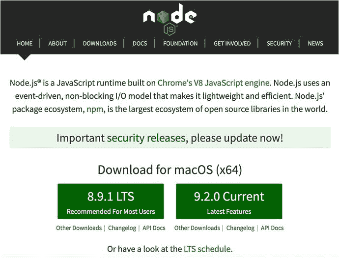

# 六、Node

我们需要尽快编码，但我们需要一个项目。要创建一个项目，我们需要使用 CLI (Angular 的命令行界面，将在下一章介绍)。CLI 需要节点才能工作。因此，在开始编码之前，我们需要讨论节点。

Node 是安装在计算机上的 JavaScript 运行时。它是开发工具和服务器(或其他任何东西)的平台。Node 易于使用，并且已经为它编写了数百个模块——这意味着您可以重用大量代码。

Node 使用谷歌为 Chrome 浏览器编写的 V8 JavaScript 引擎代码，结合额外的模块来完成文件 I/O 和其他在浏览器中无法完成的有用任务。Node 本身什么也不做——它是一个可以运行许多有用的 JavaScript 代码模块的平台，包括 web 服务器、传输器等等。

Node 还提供了节点包管理器的依赖管理，我们将在本章中介绍。它将使你能够管理你的项目对第三方 JavaScript 库的依赖。掌握 npm 的运作是非常重要的。节点包管理器也允许你发布你的 Angular 代码作为一个模块，以及使用其他人。

你需要 Node。要下载它，去 nodejs.org/download 为你的电脑安装核心节点软件。图 [6-1](#Fig1) 所示为节点网址。



图 6-1

The Node website

您可以选择下载并安装最推荐的版本或最新版本。显然，前者更稳定——这就是为什么推荐它。

## 设置和运行节点

以下命令在项目中设置节点。它会向您提出一些问题，然后生成 package.json 文件(稍后会介绍)。在项目的根文件夹中运行此命令:

```ts
npm init

```

Note

“npm”命令用于调用节点程序包管理器。

一旦安装了 Node，您就可以通过命令行访问命令`node`。输入不带参数的命令将允许您键入 JavaScript 并按 Enter 键运行它:

```ts
$ node
> console.log('Hello World');
Hello World

```

使用命令`node`更有用的方法是输入这个命令加上一个文件名作为参数。这将把文件的内容作为 JavaScript 执行。在这种情况下，我们将创建文件 hello.js:

```ts
setTimeout(function() {
   console.log('Hello World!');
}, 2000);

```

现在我们可以运行它了:

```ts
node hello.js

```

该程序等待两秒钟，然后将“Hello World”写入控制台。

### 节点程序包管理器(npm)

现在我们知道了如何通过 Node 运行 JavaScript 代码，我们需要看看如何安装这些有用的模块。您可能认为这很简单，但这并不是因为许多节点模块依赖于其他节点模块来工作。因此，当您安装一个节点模块时，node 需要确保所有依赖的节点模块也被安装。这就是为您发明节点包管理器(npm)的原因——添加、更新和删除项目中的节点模块，并管理这些相互依赖关系。

为此，Node 提供了对命令`npm`的命令行访问。这个命令有许多不同的参数，允许您安装、更新或卸载模块。

网站 [`http://docs.npmjs.com`](http://docs.npmjs.com) 是关于国家预防机制的详细文献的一个很好的资源。而 [`www.npmjs.com`](http://www.npmjs.com) 是可用节点包的绝佳资源。

### 节点模块安装级别

节点模块安装有两个级别:

*   全局:如果您要在命令行上安装某个东西，可以通过在命令行上将`-g`添加到`npm install`来进行全局安装:

*   本地:如果你正在安装你想在你的程序中使用的东西(不是从命令行)，使用本地级别。要在本地安装一个模块，可以在命令行中省略`npm install`中的`-g`:

```ts
npm install -g typescript

```

```ts
npm install express

```

### 运行 NPM Install[模块名称]来安装模块

如果您正在做一些简单的事情，比如向项目中添加一个额外的节点模块，这将非常有用。例如，最有用的模块之一是 Express，一个有能力的 web 服务器。要安装 Express，我们可以在命令行中输入以下内容:

```ts
npm install express

```

这不会更新您的节点依赖文件 package.json(稍后会详细介绍)。如果您需要将该模块保存为该文件中的项目依赖项，请在命令中添加`--save`或`--save-dev`参数:

*   save 参数`--save`:这将添加您将要安装的节点模块，作为您的项目在生产中所需的节点模块。您的 package.json 文件被修改为包含这个依赖项。

    ```ts
    npm install express --save

    ```

*   save 参数`--save-dev`:这将添加您将要安装的节点模块，作为您的项目在开发中只需要的节点模块(也就是说，在生产中不需要)。您的 package.json 文件再次被修改以包含这个依赖项。

    ```ts
    npm install express --save-dev

    ```

### 更新节点模块

有时你的依赖会改变。您希望添加一个附加模块，但是添加该模块要求其他模块具有更高的版本号。节点提供以下命令来检查您的模块是否过期:

```ts
npm outdated

```

有两种不同的方式来更新节点中的模块。

*   您可以运行命令`npm update`来指定要更新的模块。如果您希望您的 package.json 文件更新为更高的版本，还可以添加`--save`选项。如果指定了`-g`标志，这个命令将更新全局安装的软件包。
*   可以编辑 package.json 文件，更新模块依赖关系，然后运行`npm update`。这将更新您的模块以匹配该文件中的规范。

Checking Your Node Version

如果已经安装了 Node，可以通过运行以下命令来检查其版本:

```ts
npm –v

```

### 卸载节点模块

您可以运行命令`npm uninstall`，指定要卸载的模块。如果您希望您的 package.json 文件用从依赖项列表中删除的模块进行更新，也可以添加`--save`选项。如果指定了`-g`标志，这个命令将删除全局安装的软件包。

## package.json 文件

节点旨在从项目文件夹中的命令行运行。它允许开发人员将与项目相关的信息存储在 package.json 文件中，该文件应该位于项目的根文件夹中。该文件指定了许多关于项目的有用信息:

*   项目的名称和版本。
*   您的项目依赖于哪些节点模块(以及您需要这些模块的哪些版本)。
*   您的项目在生产中需要哪些节点模块。
*   你的项目在开发中需要哪些节点模块(也就是生产中不需要)。

### 更新 package.json

您可以通过两种方式更新这个“packages.json”文件:

*   通过使用安装/更新/删除节点模块和更新该文件的节点命令(在命令行上)。
*   通过自己编辑这个文件。然后运行节点命令来安装/更新/删除节点模块以匹配该文件。

### 版本号

package.json 文件允许开发人员指定项目所需的节点模块。当您在此文件中指定依赖项时，您也可以指定这些依赖项的版本，例如 1.0.1。Node 允许您灵活地以许多不同的方式指定您需要的版本号，如表 [6-1](#Tab1) 中所总结的。

表 6-1

Ways of Specifying Version Numbers

<colgroup><col align="left"> <col align="left"></colgroup> 
| 1.2.1 | 必须与版本 1.2.1 匹配 |
| >1.2.1 | 必须高于版本 1.2.1 |
| >=1.2.1 | 必须是版本 1.2.1 或更高版本 |
| <1.2.1 | 必须在版本 1.2.1 之前 |
| <=1.2.1 | 必须早于或等于版本 1.2.1 |
| ~1.2.1 | 必须大致相当于版本 1.2.1 |
| ^1.2.1 | 必须与版本 1.2.1 兼容 |
| 1.2.x | 必须是从 1.2 开始的任何版本。 |
| * | 任何版本 |

### 文件夹节点 _ 模块

当您安装一个节点模块时，它被下载并放置在项目文件夹的子文件夹 node_modules 中。通常情况下，您会得到比您预想的更多的东西，因为您安装的节点模块有许多依赖项，所以您最终会得到一个巨大的 node_modules 文件夹，里面有几十个模块子目录。有时 npm 需要很长时间来下载和安装项目节点模块。另外，注意不要把这个文件夹从一个地方复制到另一个地方，因为这可能会花去你似乎永远也不会有的时间。如果要将项目从一台计算机复制到另一台计算机，请先删除“node_modules”文件夹，然后在目标计算机上运行“npm install”。

有两种不同的方式将模块安装到节点中。您可以运行命令`npm install`来指定模块(来安装它),或者您可以编辑 package.json 文件，然后运行`npm install`。

### 编辑 package.json 文件并运行 npm install

当您的项目依赖于多个模块时，手动编辑 package.json 文件是安装多个模块的最佳方式。首先，您必须在项目的根文件夹中建立一个 package.json 文件，该文件包含应用的概述。有许多可用的字段，但在下面的示例 package.json 文件中，您看到的是最少的字段。`dependencies`部分描述了您想要安装的模块的名称和版本。在这种情况下，我们还将依赖于快速模块:

```ts
{
  "name" : "MyStaticServer",
  "version" : "0.0.1",
  "dependencies" : {
    "express" : "3.3.x"
  }
}

```

要安装 package.json 文件中概述的依赖项，请在项目根文件夹的命令行中输入以下内容:

```ts
npm install

```

Installing The Latest Angular

转到您的项目文件夹，发出以下命令:

```ts
npm install @angular/{common,compiler,compiler-cli,core,forms,http,platform-browser,platform-browser-dynamic,platform-server,router,animations}@latest typescript@latest --save

```

## 摘要

现在您已经知道了什么是 Node，以及如何使用它来管理项目对第三方代码的依赖，是时候开始使用 Angular CLI(命令行界面)进行编码了。让我们在下一章开始吧！