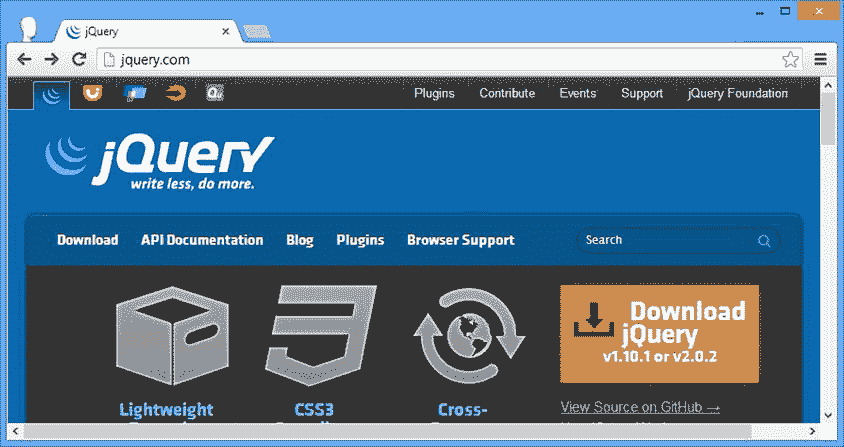
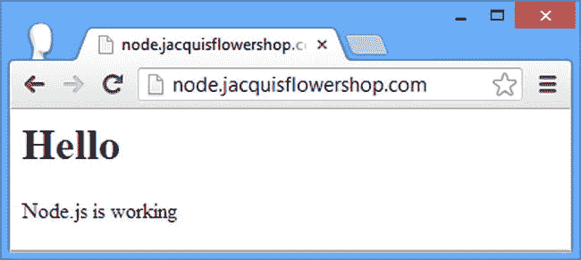

# 一、将 jQuery 放入上下文

从本质上来说，jQuery 做了一些听起来很枯燥的事情:它允许你通过操作浏览器在处理 HTML 时创建的模型来修改网页的内容，这个过程被称为 *DOM(文档对象模型)操作*，我将在后面详细描述。如果您已经阅读了这本书，那么您可能已经使用另一个 JavaScript 库或内置的 web 浏览器 API(应用编程接口)完成了一些 DOM 操作，现在您想以更好的方式完成它。

jQuery 超越*更好*。这使得 DOM 操作成为一种乐趣，有时甚至是真正的快乐。jQuery 的工作方式非常优雅，它将一项可能非常枯燥的任务转化为简单易行的工作。一旦开始使用 jQuery，就没有回头路了。以下是我在项目中使用 jQuery 的主要原因。

*   jQuery 富于表现力。我可以用更多的代码做更多的工作。
*   *jQuery 方法适用于多个元素。*选择-迭代-修改的 DOM API 方法消失了，这意味着更少的`for`循环来迭代元素和更少的错误。
*   jQuery 处理浏览器之间的实现差异。我不用担心 Internet Explorer (IE)是否以古怪的方式支持某个特性，比如；我只需告诉 jQuery 我想要什么，它就能解决我的实现差异。
*   jQuery 是开源的。当我不明白一些事情是如何工作的，或者我没有得到我期望的结果时，我可以通读 JavaScript 代码，如果需要的话，进行修改。

jQuery 的天才之处在于，它将 web 开发中的一些主要工作变得简单、快速和容易。我不能要求更多了。当然，并不是一切都是完美的，有一两个粗糙的边缘，我会在进入细节时解释。但是即使偶尔会有瑕疵，我还是喜欢使用 jQuery，我希望您会发现它同样引人入胜，令人愉快。

了解 jQuery UI 和 jQuery Mobile

除了核心的 jQuery 库之外，我还介绍了 *jQuery UI* 和 *jQuery Mobile* ，它们是构建在 jQuery 之上的用户界面(UI)库。jQuery UI 是一个通用的 UI 工具包，可以在任何设备上使用，jQuery Mobile 是为智能手机和平板电脑等支持触摸的设备设计的。

了解 jQuery 插件

jQuery 插件扩展了基本库的功能。有些插件非常好，应用非常广泛，我在本书中已经介绍过了。有很多可用的插件(尽管质量可能有所不同)，因此如果您不喜欢我在本书中描述的插件，您可以确信有一种替代方法可用。

我需要知道什么？

在阅读本书之前，您应该熟悉 web 开发的基础知识，了解 HTML 和 CSS(级联样式表)的工作原理，并且，理想情况下，具备 JavaScript 的工作知识。如果你对其中的一些细节不太清楚，我在第二章第一章、第三章第三章和第四章第五章提供了 HTML、CSS 和 JavaScript 的刷新工具。但是，你不会找到关于 HTML 元素和 CSS 属性的全面参考。在一本关于 jQuery 的书中，没有足够的空间来涵盖整个 HTML。如果你想要 HTML 和 CSS 的完整参考，那么我推荐我的另一本书:*HTML 5 权威指南*，也是由 Apress 出版的。

这本书的结构是什么？

这本书分为六个部分，每个部分涵盖一系列相关的主题。

第一部分:做好准备

本书的第一部分提供了您需要为本书的其余部分做准备的信息。它包括本章和 HTML、CSS 和 JavaScript 的入门/刷新。在这一章的后面，我将描述你需要的软件，以便跟随。

第二部分:使用 jQuery

本书的第二部分向您介绍了 jQuery 库，从一个基本示例开始，逐步扩展到包括每个核心特性 :元素选择、DOM 操作、事件和效果。

第三部分:使用数据和 Ajax

本书的第三部分展示了 jQuery 如何使处理内联或远程数据成为可能。我将向您展示如何从数据中生成 HTML 内容，如何验证输入到 web 表单中的数据，以及如何使用 jQuery 执行异步操作，包括 Ajax。

第四部分:使用 jQuery UI

jQuery UI 是我在本书中描述的两个用户界面库之一。jQuery UI 构建于核心 jQuery 库之上并与之集成，允许您为 web 应用创建丰富且响应迅速的界面。

第五部分:使用 jQuery Mobile

jQuery Mobile 是我在本书中介绍的另一个用户界面库。jQuery Mobile 构建在 jQuery 之上，并结合了 jQuery UI 的一些基本功能，但已经针对创建智能手机和平板电脑界面进行了优化。jQuery Mobile 中可用的 UI 小部件较少，但那些受支持的小部件针对触摸交互和较小显示器上的显示进行了优化。

第六部分:高级功能

本书的最后一部分描述了一些不常用的 jQuery 和 jQuery UI 特性，这些特性在复杂的项目中可能会有所帮助。这些高级特性需要对 HTML、CSS 和 jQuery 本身有更好的理解。在阅读第三十六章时，一点异步编程的基础知识很有帮助。

这个版本有什么新内容？

从这本书的第一版开始，jQuery、jQuery UI 和 jQuery Mobile 都发生了实质性的变化。

核心 jQuery 有什么新特性？

核心 jQuery 库的 API 非常稳定。几年前，jQuery 团队开始列出他们打算进行的更改，这些更改随着 jQuery 1.9 版的发布而实现。其中一些变化相当大，我已经在本书第二部分的每一章中指出了这些变化。

好消息是，这些变化非常罕见，API 可能会在几年内保持稳定。这并不是说不会增加新的特性，但是你今天开发的代码在未来一段时间内不需要修改就可以继续工作。

坏消息是，jQuery 团队在发布 jQuery 1.9 时做了一些不寻常的事情——他们还发布了 jQuery 2.0，因此他们将开发分成并行发布的两个*系列*:jQuery 1 . x 和 jQuery 2.x。这两个发布系列具有相同的 API，但 jQuery 2.x 不支持 IE 的 6、7 和 8 版本。

IE 的旧版本因其对 HTML、CSS 和 JavaScript 的非标准方法而臭名昭著，删除所有对奇怪行为的检查和相关的变通办法使 jQuery 2.x 变得更小更快。

 **提示**在撰写本文时，jQuery 的当前版本是 2.0.2 和 1.10.1。理解 jQuery 2.0.2 并不能取代 1.10.1 版是很重要的。它们都是最新版本，唯一的区别是 jQuery 1.10.1 保留了对 Internet Explorer 旧版本的支持。

如果您确定您的用户都不会安装 Internet Explorer 6、7 或 8，那么您应该使用 jQuery 2.x。如果情况不是这样，或者您不确定，那么您应该使用 jQuery 1.x。这些版本的 IE 仍然被广泛使用，尤其是在大公司中，您应该仔细考虑使用 2.x 行的影响。

在编程书籍的理想化世界中没有遗留用户，我将在本书的大部分内容中使用 jQuery 2.0.2 库——但是您可以替换任何版本的 jQuery 1.x 行(从版本 1.9 开始)并获得相同的结果，同时保留对旧版本 IE 的支持。

 **提示**我在第四部分描述 jQuery Mobile 的时候用的是 jQuery 1.x。jQuery Mobile 往往落后于主要的 jQuery 版本，在我写这篇文章时，它只支持 jQuery 1.x。

jQuery UI 有什么新特性？

jQuery UI 也进行了更新。使用现有用户界面小部件的 API 已经更新，更加一致，并且与支撑它们的 HTML 元素更加紧密地配合，并且添加了一些新的小部件。在本书的整个第三部分中，您会发现我在每章的开头都展示了重要的变化，就像我在第二部分中展示 jQuery 本身的变化一样。

jQuery Mobile 有什么新特性？

自从这本书的前一版以来，jQuery Mobile 已经成熟了很多。API 已经标准化，添加了新的小部件，整体开发人员体验与 jQuery 和 jQuery UI 更加一致。为了反映这种成熟，我完全重写了第四部分，使其与本书的其余部分保持一致。还有更多的示例、参考表和特定功能的演示。

还有什么新鲜的？

从第十二章开始，我使用模板从数据中生成 HTML 元素。这是一项重要的技术，我经常使用。我在以前版本中使用的库已经到了它的生命的尽头，我已经选择了一个替代品。新的库没有直接集成到 jQuery 中，所以在第十二章中，我提供了一个自定义插件，使得使用我选择的模板库更容易与 jQuery 一起使用。第十二章之后的所有例子都被修改以使用新的库。

我改变了用于测试移动应用的工具集，更喜欢使用基于云的测试服务，而不是维护自己的模拟器。我在第二十七章中解释了我这样做的原因。

有很多例子吗？

有*个载荷*的例子。jQuery 的一个优点是几乎任何任务都可以用几种不同的方式执行，这允许您开发个人的 jQuery 风格。为了展示您可以采用的不同方法，我包含了许多不同的示例——事实上，数量如此之多，以至于我在某些章节中只包含了您正在使用的完整 HTML 文档一次，以便包含所有内容。每章的第一个例子是一个完整的 HTML 文档，如清单 1-1 所示。

***清单 1-1*** 。完整的示例文档

```js
<!DOCTYPE html>
<html>
<head>
    <title>Example</title>
    <link rel="stylesheet" type="text/css" href="styles.css"/>
    <script src="jquery-2.0.2.js" type="text/javascript"></script>
    <script type="text/javascript">
        $(document).ready(function () {
            $("img:odd").mouseenter(function (e) {
                $(this).css("opacity", 0.5);
            }).mouseout(function (e) {
                $(this).css("opacity", 1.0);
            });
        });
    </script>
</head>
<body>
    <h1>Jacqui's Flower Shop</h1>
    <form method="post">
        <div id="oblock">
            <div class="dtable">
                <div id="row1" class="drow">
                    <div class="dcell">
                        <label for="aster">Aster:</label>
                        <input name="aster" value="0" required>
                    </div>
                    <div class="dcell">
                        <label for="daffodil">Daffodil:</label>
                        <input name="daffodil" value="0" required >
                    </div>
                    <div class="dcell">
                        <label for="rose">Rose:</label>
                        <input name="rose" value="0" required>
                    </div>
                </div>
                <div id="row2" class="drow">
                    <div class="dcell">
                        <label for="peony">Peony:</label>
                        <input name="peony" value="0" required>
                    </div>
                    <div class="dcell">
                        <label for="primula">Primula:</label>
                        <input name="primula" value="0" required>
                    </div>
                    <div class="dcell">
                        <label for="snowdrop">Snowdrop:</label>
                        <input name="snowdrop" value="0" required>
                    </div>
                </div>
            </div>
        </div>
        <div id="buttonDiv"><button type="submit">Place Order</button></div>
    </form>
</body>
</html>
```

该列表摘自第五章。不要担心它做什么；请注意，每章的第一个例子是一个完整的 HTML 文档，类似于清单 1-1 中所示。几乎所有的例子都基于相同的基本 HTML 文档，显示了一个简单的花店。这不是最激动人心的例子，但它是独立的，包含了我们在使用 jQuery 时感兴趣的所有内容。

对于第二个和随后的示例，我只向您展示发生变化的元素。这通常只是`script`元素，也就是 jQuery 代码所在的位置。您可以发现部分清单，因为它以省略号(`...`)开始和结束，如清单 1-2 所示。

***清单 1-2*** 。部分列表

```js
...
<script type="text/javascript">
    jQuery(document).ready(function () {
        jQuery("img:odd").mouseenter(function(e) {
           jQuery(this).css("opacity", 0.5);
        }).mouseout(function(e) {
           jQuery(this).css("opacity", 1.0);
        });
    });
</script>
...
```

清单 1-2 是第五章中的后续清单。您可以看到只出现了`script`元素，我突出显示了一些语句。这就是我如何将您的注意力吸引到示例中展示我正在使用的 jQuery 特性的部分。在这样的部分清单中，只有我显示的元素与本章开始时显示的完整文档有所不同。

我将本书中的例子非常集中在个人特征上。这是为了让您更好地了解 jQuery 的运行方式。但是在这样做的时候，你可能看不到不同的特性是如何组合在一起的，所以在本书的每一部分的结尾，都有一个简短的章节，在这个章节中，我重构了示例文档，将前面章节中的所有主题合并在一起，并给出了一个可能的联合视图。

从哪里可以获得示例代码？

你可以在 Apress 网站的源代码/下载区(`www.apress.com`)下载本书所有章节的所有例子。下载是免费的，它包括重新创建示例所需的所有支持资源，而不必输入它们(包括图像、JavaScript 库和 CSS 样式表)。您不必下载代码，但这是试验示例和将技术剪切并粘贴到您自己的项目中的最简单的方法。

 **提示**尽管我只列出了章节中许多代码清单的变化，但是源代码下载中的每个例子都是一个完整的 HTML 文档，您可以直接将其加载到浏览器中。

这本书我需要什么软件？

为了遵循本书中的示例，您将需要各种软件，如以下部分所述。

获取 jQuery

您首先需要的是 jQuery 库，它可以从`http://jquery.com`获得。在网站的首页有一个下载按钮和一个选择生产或开发版本的选项，如图 1-1 所示。



图 1-1 。下载 jQuery 库

您需要下载本书第 1-4 和第六部分的 jQuery 2.x 和第五部分的 jQuery 1.x。您将使用这本书的开发版本。我将在第五章中解释这些版本之间的区别，并向您展示如何建立 jQuery 库。

 **提示**我在第十七章和第二十七章分别告诉你如何获取和安装 jQuery UI 和 jQuery Mobile 库。

获取 HTML 编辑器

web 开发最重要的工具之一是编辑器，您可以用它来创建 HTML 文档。HTML 只是文本，所以你可以使用一个非常基本的编辑器，但是有一些专用的包可以使开发更加流畅和简单，其中许多都是免费的。

当我写这本书的第一版时，我使用了活动状态下的 Komodo Edit。它是免费的；很简单；它对 HTML、JavaScript 和 jQuery 有很好的支持；还有 Windows、Mac 和 Linux 版本。详见`http://activestate.com`。

不过最近换了微软的 Visual Studio。我的许多书都是关于微软的网络堆栈，我在 Windows 上写代码。Visual Studio 的最新版本对 HTML 编辑提供了出色的支持，可以在不依赖 Microsoft web stack 的情况下使用。我为这本书使用了 Visual Studio 2012 Express，这是免费提供的—参见`http://www.microsoft.com/visualstudio`。(也有付费版本——毕竟这是微软的——但是 jQuery 开发不需要额外的特性。)

作为替代，JsFiddle 是一个流行的在线编辑器，它支持使用 jQuery。我并不喜欢它(它的结构与我的开发习惯相冲突)，但是它看起来确实非常灵活和强大。它是免费使用的，可在`http://jsfiddle.net`获得。

 **注**我推荐这本书里的几款产品，但只是因为它们是我使用和喜欢的产品。除了出版我所有书籍的出版公司 Apress 之外，我与 Active State、微软或任何其他公司都没有任何关系。我为我使用的每一个网络服务和开发工具支付全价；我没有得到任何特殊的支持或秘密访问开发团队，我收到的唯一的钱来自版税(我非常感谢您的购买——谢谢)。

获得网络浏览器

您需要一个 web 浏览器来查看 HTML 文档并测试 jQuery 和 JavaScript 代码。我喜欢谷歌浏览器:我发现它很快，我喜欢简单的用户界面，开发者工具也相当不错。每当你在这本书里看到一个截图(这是经常发生的)，你看到的都会是谷歌 Chrome。

也就是说，你不必使用和我一样的浏览器，但是我建议你选择一个有好的开发工具的。Mozilla Firefox 通过 Firebug 扩展提供了一些优秀的 JavaScript 工具，您可以在`http://getfirebug.com`获得。

如果你不喜欢 Chrome 或 Firefox，那么你的下一个最佳选择是 Internet Explorer。很多网络程序员在道德上反对 IE，但版本 10 非常好，当 Chrome 以一种意想不到的方式运行时，我经常用它来快速检查是否正常。

获得网络服务器

如果您想重新创建本书中的示例，您将需要一个 web 服务器，以便浏览器有地方加载示例 HTML 文档和相关资源(如图像和 JavaScript 文件)。很多 web 服务器都是可用的，而且大部分都是开源和免费的。你使用哪个网络服务器并不重要。我在本书中使用了微软的互联网信息服务(IIS ),但这仅仅是因为我已经安装了一台 Windows 服务器并准备就绪。

获取 Node.js

从第三部分开始，除了常规的 web 服务器之外，您还将使用`Node.js`。`Node.js`目前非常流行，但我使用它的原因很简单，它是基于 JavaScript 的，所以你不必处理一个单独的 web 应用框架。你不会深入了解关于`Node.js`的任何细节，我会把它当作一个黑盒(尽管我会向你展示服务器脚本，如果你感兴趣的话，你可以看看服务器上发生了什么)。

可以从`http://nodejs.org`下载`Node.js`。有一个预编译的 Windows 二进制文件和源代码，您可以为其他平台构建。在这本书里，我使用的是 0.10.13 版本，在你读到这本书的时候，这个版本很可能已经被取代了，但是服务器脚本应该还能正常工作，没有任何问题。

设置和测试 Node.js

测试`Node.js`最简单的方法是使用一个简单的脚本。将清单 1-3 中的内容保存到一个名为`NodeTest.js`的文件中。我在与我的`Node.js`二进制文件相同的目录下完成了这个操作。

***清单 1-3*** 。Node.js 测试脚本

```js
var http = require('http');
var url = require('url');

http.createServer(function (req, res) {
    console.log("Request: " + req.method + " to " + req.url);

    res.writeHead(200, "OK");
    res.write("<h1>Hello</h1>Node.js is working");
    res.end();

}).listen(80);
console.log("Ready on port 80");
```

这是一个简单的测试脚本，当它接收到一个 HTTP `GET`请求时返回一个 HTML 片段。

提示如果最后一句话没有完全说明白，不要担心。使用 jQuery 不需要知道 HTTP 和 web 服务器是如何工作的，我在第二章的中提供了一个 HTML 速成班。

要测试`Node.js`，运行二进制文件，将刚刚创建的文件指定为参数。对于我的 Windows 安装，我在控制台提示符下键入了以下内容:

```js
node NodeTest.js
```

为了确保一切正常，导航到运行`Node.js`的机器上的端口 80。您应该会看到与图 1-2 非常相似的东西，表明一切都在预期之中。



图 1-2 。测试 Node.js

我在不同于普通 web 服务器的机器上运行`Node.js`，这意味着使用端口 80 不会给我带来任何问题。如果您只有一台机器可用，那么在端口 80 上运行 web 服务器，并将`Node.js`脚本更改为使用另一个端口。我在清单 1-3 中突出显示了测试脚本中指定使用哪个端口的部分。

图像属性

在本书中，我在例子中使用了一组图像。感谢以下人员善意地允许使用他们的照片:霍里亚·瓦兰、大卫·肖特、*盖沙博伊 500* 、田中久约、梅尔维·埃斯凯利宁、*花式速度女王*、艾伦“*克雷吉 3000* 、克雷吉、诺索古德和*梅拉路易丝*。

摘要

在这一章中，我概述了这本书的内容和结构，并列出 jQuery web 开发所需的软件，所有这些都可以免费获得。接下来的三章将更新你在 HTML、CSS 和 JavaScript 方面的基本技能。如果你熟悉这些主题，那么跳到第五章，我将在那里介绍 jQuery。