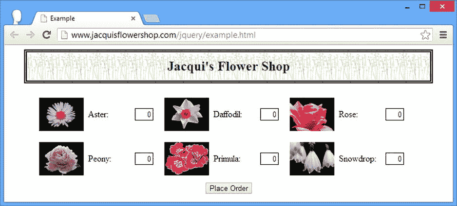
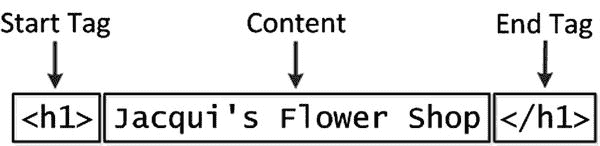
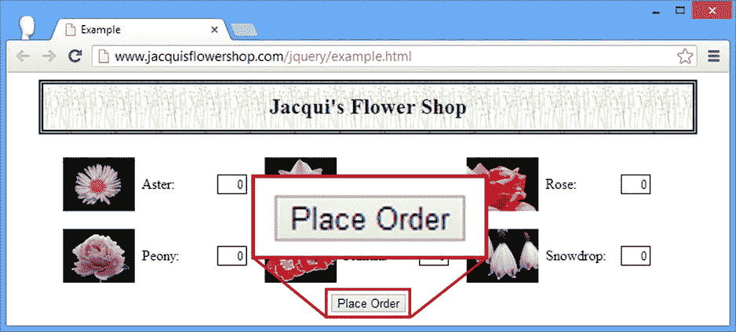
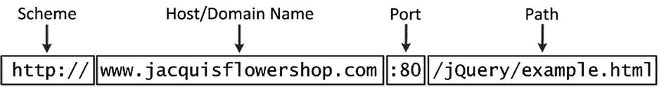
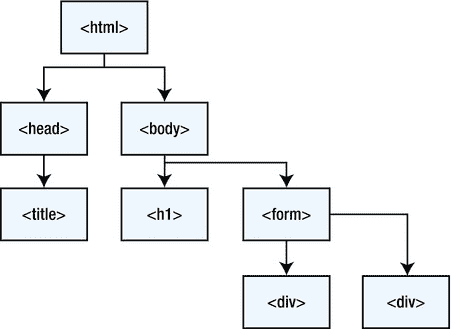
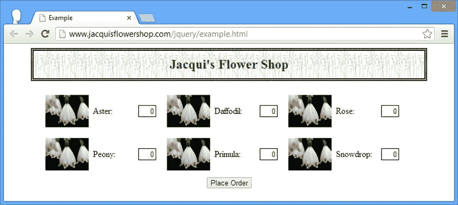
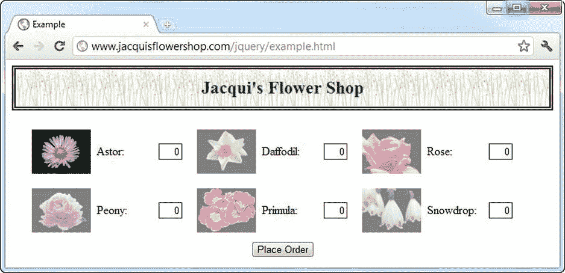

# 二、 HTML 优先

在本书中，我们将花大量的时间处理 HTML 文档。在这一章中，我列出了你需要的信息来理解我们在本书后面要做的事情。这不是一个 HTML 教程，而是我在后面章节所依赖的 HTML 关键特性的总结。

HTML 的最新版本被称为 *HTML5* ，它本身就是一个话题。HTML5 有 100 多个元素，每个元素都有自己的用途和功能。也就是说，你只需要 HTML 的基础知识就可以理解 jQuery 是如何工作的，但是如果你想了解 HTML 的细节，那么我推荐我的另一本书:*HTML 5*权威指南，也是由 Apress 出版的。

介绍基本的 HTML 文档

最好的起点是查看 HTML 文档。从这样的文档中，你可以看到所有 HTML 文档遵循的基本结构和层次。清单 2-1 显示了一个简单的 HTML 文档。我在这一章中使用这份文档来介绍 HTML 的核心概念。

***清单 2-1*** 。一个简单的 HTML 文档

```js
<!DOCTYPE html>
<html>
<head>
    <title>Example</title>
    <script src="jquery-2.0.2.js" type="text/javascript"></script>
    <style>
        h1 {
            width: 700px; border: thick double black; margin-left: auto;
            margin-right: auto; text-align: center; font-size: x-large; padding: .5em;
            color: darkgreen; background-image: url("border.png");
            background-size: contain; margin-top: 0;
        }
        .dtable {display: table;}
        .drow {display: table-row;}
        .dcell {display: table-cell; padding: 10px;}
        .dcell > * {vertical-align: middle}
        input {width: 2em; text-align: right; border: thin solid black; padding: 2px;}
        label {width: 5em;  padding-left: .5em;display: inline-block;}
        #buttonDiv {text-align: center;}
        #oblock {display: block; margin-left: auto; margin-right: auto; width: 700px;}
    </style>
</head>
<body>
    <h1>Jacqui's Flower Shop</h1>
    <form method="post">
        <div id="oblock">
            <div class="dtable">
                <div class="drow">
                    <div class="dcell">
                        <label for="aster">Aster:</label>
                        <input name="aster" value="0" required>
                    </div>
                    <div class="dcell">
                        <label for="daffodil">Daffodil:</label>
                        <input name="daffodil" value="0" required >
                    </div>
                    <div class="dcell">
                        <label for="rose">Rose:</label>
                        <input name="rose" value="0" required>
                    </div>
                </div>
                <div class="drow">
                    <div class="dcell">
                        <label for="peony">Peony:</label>
                        <input name="peony" value="0" required>
                    </div>
                    <div class="dcell">
                        <label for="primula">Primula:</label>
                        <input name="primula" value="0" required>
                    </div>
                    <div class="dcell">
                        <label for="snowdrop">Snowdrop:</label>
                        <input name="snowdrop" value="0" required>
                    </div>
                </div>
            </div>
        </div>
        <div id="buttonDiv"><button type="submit">Place Order</button></div>
    </form>
</body>
</html>
```

这是一个简短的基本 HTML 文档，但是它包含了一些与 HTML 相关的最重要的特征。你可以在图 2-1 中看到该文档如何出现在浏览器中。



图 2-1 。在浏览器中显示 HTML 文档示例

理解 HTML 元素的结构

HTML 的核心是*元素*，它告诉浏览器 HTML 文档的每个部分代表什么样的内容。以下是示例中的一个元素:

```js
...
<h1>Jacqui's Flower Shop</h1>
...
```

这个元素有三个部分:开始标签，结束标签，内容，如图图 2-2 所示。



图 2-2 。简单 HTML 元素的剖析

这个元素的*名称*(也称为*标签名称*或者仅仅是*标签*)是`h1`，它告诉浏览器标签之间的内容应该被当作一个顶级头。您可以通过将标签名称放在尖括号、`<`和`>`字符中来创建开始标签。除了在左尖括号(`<`)后面添加一个`/`字符之外，您可以用类似的方式创建结束标记。

了解属性

您可以通过向元素添加*属性*来为浏览器提供附加信息。 清单 2-2 显示了示例文档中一个带有属性的元素。

***清单 2-2*** 。定义属性

```js
...
<label for="aster">Aster:</label>
...
```

这是一个`label`元素，它定义了一个名为`for`的属性。我强调了属性，以便更容易看到。属性总是被定义为开始标记的一部分。这个属性有一个 *名称*和一个 *值*。名字是`for`，数值是`aster`。并非所有属性都需要值；仅仅定义它们就向浏览器发送了一个信号，表明您需要与该元素相关联的某种行为。清单 2-3 显示了一个具有这种属性的元素的例子。

***清单 2-3*** 。定义不需要值的属性

```js
...
<input name="snowdrop" value="0" required>
...
```

这个元素有三个属性。前两个值`name`和`value`被赋值。(这可能会有点混乱。这些属性的名字是`name`和`value`。`name`属性的值是`snowdrop`,`value`属性的值是`0`。)第三个属性正好是`required`这个词。这是一个不需要值的属性的例子，尽管您可以通过将属性值设置为其名称(`required="required"`)或使用空字符串(`required=""`)来定义一个值。

id 和类属性

在这本书里有两个属性特别重要:属性的`id`和`class`。使用 jQuery 需要执行的最常见的任务之一是在文档中定位一个或多个元素，以便对它们执行某种操作。`id`和`class`属性对于在 HTML 文档中定位一个或多个元素非常有用。

使用 id 属性

使用`id`属性为文档中的元素定义一个惟一的标识符。对于`id`属性，不允许两个元素具有相同的值。清单 2-4 显示了一个使用了`id`属性的简单 HTML 文档。

***清单 2-4*** 。使用 id 属性

```js
<!DOCTYPE html>
<html>
<head>
    <title>Example</title>
</head>
<body>
    <h1 id="mainheader">Welcome to Jacqui's Flower Shop</h1>
    <h2 id="openinghours">We are open 10am-6pm, 7 days a week</h2>
    <h3 id="holidays">(closed on national holidays)</h3>
</body>
</html>
```

我已经在文档中的三个元素上定义了`id`属性。`h1`元素的`id`值为`mainheader`,`h2`元素的`id`值为`openinghours`,`h3`元素的`id`值为`holidays`。使用`id`值可以让您在文档中找到特定的元素。

使用类属性

属性任意地将元素关联在一起。许多元素可以被分配到同一个类，元素可以属于多个类，如清单 2-5 所示。

***清单 2-5*** 。使用 class 属性

```js
<!DOCTYPE html>
<html>
<head>
    <title>Example</title>
</head>
<body>
    <h1 id="mainheader" class="header">Welcome to Jacqui's Flower Shop</h1>
    <h2 class="header info">We are open 10am-6pm, 7 days a week</h2>
    <h3 class="info">(closed on national holidays)</h3>
</body>
</html>
```

在清单 2-5 中，`h1`元素属于`header`类，`h2`元素属于`header`和`info`类，`h3`元素属于`info`类。如您所见，您可以将一个元素添加到多个类中，只需用空格分隔类名。

了解元素内容

元素可以包含文本，但也可以包含其他元素。以下是包含其他元素的元素的示例:

```js
...
<div class="dcell">
    
    <label for="rose">Rose:</label>
    <input name="rose" value="0" required>
</div>
...
```

`div`元素包含另外三个元素:一个`img`、`label`和一个`input`元素。您可以定义多个层次的 *嵌套*元素，而不仅仅是这里显示的一个层次。像这样嵌套元素是 HTML 中的一个关键概念，因为它将外部元素的重要性传递给了内部元素(这是我稍后要讨论的主题)。您可以混合文本内容和其他元素，如下所示:

```js
...
<div class="dcell">
    Here is some text content
    
    Here is some more text!
    <input name="rose" value="0" required>
</div>
...
```

了解无效元素

HTML 规范包括可能不包含内容的元素。这些被称为 *void* 或*自闭*元素，它们没有单独的结束标签。以下是 void 元素的示例:

```js
...

...
```

在单个标记中定义了一个 void 元素，并在最后一个尖括号(`>`字符)前添加了一个`/`字符。严格来说，最后一个属性的最后一个字符和`/`字符之间应该有一个空格，如下:

```js
...

...
```

然而，浏览器在解释 HTML 时是宽容的，您可以省略空格字符。当元素引用外部资源时，通常使用 Void 元素。在这种情况下，`img`元素用于链接到名为`rose.png`的外部图像文件。

了解文档结构

有一些关键元素定义了任何 HTML 文档的基本结构:`DOCTYPE`、`html`、`head`和`body`元素。清单 2-6 显示了这些元素之间的关系，删除了其余的内容。

***清单 2-6*** 。HTML 文档的基本结构

```js
<!DOCTYPE html>
<html>
<head>
    ...*head content*...
</head>
<body>
    ...*body content*...
</body>
</html>
```

这些元素中的每一个在 HTML 文档中都扮演着特定的角色。`DOCTYPE`元素告诉浏览器这是一个 HTML 文档，更确切地说，这是一个 *HTML5* 文档。早期版本的 HTML 需要额外的信息。例如，下面是 HTML4 文档的`DOCTYPE`元素:

```js
...
<!DOCTYPE HTML PUBLIC "-//W3C//DTD HTML 4.01//EN"
    "http://www.w3.org/TR/html4/strict.dtd">
...
```

`html`元素表示包含 HTML 内容的文档区域。这个元素总是包含另外两个关键的结构元素:`head`和`body`。正如我在本章开始时所说的，我不打算讨论单个的 HTML 元素。它们太多了，描述 HTML5 完全花了我 HTML5 书 1000 多页。也就是说，我将提供我使用的元素的简要描述，以便您对文档的功能有一个好的了解。表 2-1 总结了来自清单 2-1 的示例文档中使用的元素，其中一些我将在本章稍后部分详细描述。

表 2-1 。示例文档中使用的 HTML 元素

| 元素 | 描述 |
| --- | --- |
| `DOCTYPE` | 指示文档中内容的类型 |
| `body` | 表示包含内容元素的文档区域(在“理解内容元素”一节中描述) |
| `button` | 表示一个按钮；通常用于向服务器提交一个**表单** |
| `div` | 通用元素；通常用于为文档添加结构，以用于演示目的 |
| `form` | 表示一个 HTML 表单，它允许您从用户那里收集数据，并将它们发送到服务器进行处理 |
| `h1` | 降级标题 |
| `head` | 表示文档中包含元数据的区域(在“了解元数据元素”一节中描述) |
| `html` | 表示文档中包含 HTML 的区域(通常是整个文档) |
| `img` | 降级图像 |
| `input` | 表示用于从用户处收集单个数据项的输入字段，通常作为 HTML 表单的一部分 |
| `script` | 表示将作为文档的一部分执行的脚本，通常是 JavaScript |
| `style` | 表示 CSS 设置的区域；参见第三章 |
| `title` | 表示文档的标题；由浏览器用来设置用于显示文档内容的窗口或选项卡的标题 |

了解元数据元素

`head`元素包含文档的元数据——换句话说，一个或多个描述或操作文档内容的元素，但不直接由浏览器显示。示例文档在`head`部分包含三个元数据元素:`title`、`script`和`style`。`title`元素是最基本的，这个元素的内容被浏览器用来设置窗口或标签的标题，所有的 HTML 文档都需要有一个`title`元素。其他两个元素对本书来说更重要，我将在接下来的章节中解释。

理解脚本元素

`script`元素允许您在代码中包含 JavaScript。一旦我开始深入介绍 jQuery，您就会经常看到这个元素。示例文档包含一个`script`元素，如清单 2-7 所示。

***清单 2-7*** 。示例文档中的脚本元素

```js
...
<script src="jquery-2.0.2.js" type="text/javascript"></script>
...
```

当您为`script`元素定义`src`属性时，您是在告诉浏览器您想要加载包含在另一个文件中的 JavaScript。在这种情况下，这是主 jQuery 库，浏览器将在文件`jquery-2.0.2.js`中找到它。一个 HTML 文档可以包含不止一个`script`元素，如果你愿意，可以在开始和结束标签之间包含 JavaScript 代码，如清单 2-8 所示。

***清单 2-8*** 。使用 script 元素定义内联 JavaScript 代码

```js
<!DOCTYPE html>
<html>
<head>
    <title>Example</title>
    <script src="jquery-2.0.2.js" type="text/javascript"></script>
    <script type="text/javascript">
        $(document).ready(function() {
           $('#mainheader').css("color", "red");
        });
    </script>
</head>
<body>
    <h1 id="mainheader" class="header">Welcome to Jacqui's Flower Shop</h1>
    <h2 class="header info">We are open 10am-6pm, 7 days a week</h2>
    <h3 class="info">(closed on national holidays)</h3>
</body>
</html>
```

这个例子有两个`script`元素。第一个是将 jQuery 库导入到文档中，第二个是使用一些基本 jQuery 功能的简单脚本。暂时不要担心第二个脚本会做什么。我将在第五章开始适当地进入 jQuery。在 HTML 文档中，`script`元素可以出现在`head`或`body`元素中。在本书中，我倾向于将脚本只放在`head`元素中，但这只是个人偏好的问题。

 **提示**`script`元素的顺序很重要。您必须先导入 jQuery 库，然后才能使用它的特性。

了解样式元素

`style`元素是将级联样式表(CSS)属性引入文档的一种方式。简而言之，您可以使用 CSS 来管理文档在浏览器中显示给用户时的呈现方式。清单 2-9 显示了示例文档中的`style`元素及其内容。

***清单 2-9*** 。使用样式元素

```js
...
<style>
    h1 {
        width: 700px; border: thick double black; margin-left: auto;
        margin-right: auto; text-align: center; font-size: x-large; padding: .5em;
        color: darkgreen; background-image: url("border.png");
        background-size: contain; margin-top: 0;
    }
    .dtable {display: table;}
    .drow {display: table-row;}
    .dcell {display: table-cell; padding: 10px;}
    .dcell > * {vertical-align: middle}
    input {width: 2em; text-align: right; border: thin solid black; padding: 2px;}
    label {width: 5em;  padding-left: .5em;display: inline-block;}
    #buttonDiv {text-align: center;}
    #oblock {display: block; margin-left: auto; margin-right: auto; width: 700px;}
</style>
...
```

浏览器维护一组属性，这些属性的值用于控制每个元素的外观。`style`元素允许您选择元素并更改一个或多个属性的值。我会在第三章中更详细地讨论这个问题。

与`script`元素一样，`style`元素也可以出现在`head`和`body`元素中，但是在本书中，你会发现我只将它们放在了`head`部分，就像示例文档中一样。这又是个人喜好问题；我喜欢把我的风格和我的内容分开。

理解内容元素

元素包含了 HTML 文档中的内容。这些是浏览器将向用户显示的元素，元数据元素，如`script`和`style`，将对这些元素进行操作。

理解语义/表示差异

HTML5 的主要变化之一是哲学上的:元素的语义意义和元素对内容表示的影响之间的分离。这是一个明智的想法。您使用 HTML 元素为内容提供结构和含义，然后通过对元素应用 CSS 样式来控制内容的表示。并不是每一个 HTML 文档的消费者都需要显示它们(例如，因为 HTML 的一些消费者是自动化程序而不是浏览器)，并且保持表示独立使得 HTML 更容易处理和自动提取含义。

这个概念是 HTML 的核心。您应用元素来表示您正在处理的内容类型。人们善于根据上下文推断意义。例如，你马上就明白了这一部分的标题从属于前面的标题，因为它是用较小的字体印刷的(也因为这是你在你读过的大多数非小说类书籍中看到的一种模式)。

计算机也不能推断任何地方的上下文，因此，每个 HTML 元素都有特定的含义。例如，`article`元素表示适合于联合的自包含内容，`h1`元素表示内容部分的标题。清单 2-10 显示了一个使用元素赋予结构和意义的示例文档。

***清单 2-10*** 。使用 HTML 元素为内容添加结构和意义

```js
<!DOCTYPE html>
<html>
<head>
    <title>Example</title>
</head>
<body>
    <article>
        <header>
            <hgroup>
                <h1>New Delivery Service</h1>
                <h2>Color and Beauty to Your Door</h2>
            </hgroup>
        </header>
        <section>
            We are pleased to announce that we are starting a home delivery service for
            your flower needs. We will deliver within a 20 mile radius of the store
            for free and $1/mile thereafter. All flowers are satisfaction-guaranteed and
            we offer free phone-based consultation.
        </section>
        <section>
            Our new service starts on <b>Wednesday</b> and there is a $10 discount
            for the first 50 customers.
        </section>
        <footer>
            <nav>
                More Information:
                <a href="http://jacquisflowershop.com">Learn More About Fruit</a>
            </nav>
        </footer>
    </article>
</body>
</html>

```

关于何时应用`section`或`article`元素，没有硬性规定，但我建议你在内容中始终如一地应用它们。像`section`和`article`这样的元素不向浏览器提供任何关于它们包含的内容应该如何显示的信息。这是语义/表示分歧的核心。对于大多数 HTML 元素，浏览器有一个*样式约定*,它决定了如果不使用 CSS 改变演示文稿，它们将如何显示，但其思想是您将自由地使用 CSS 来创建您的文档所需的演示文稿。这是你可以用`style`元素做的事情，jQuery 在`script`元素中很容易做到。

HTML4 中存在的一些元素是在没有将表示和意义分开的概念时创建的，这将我们置于一个奇怪的境地。这种奇怪现象的一个例子是`b`元素。在 HTML5 之前，`b`元素指示浏览器将开始和结束标签包含的内容显示为粗体文本。在 HTML5 中，元素不仅仅是表示性的，因此`b`元素的定义被修改如下:

`b`元素表示从其周围内容偏移的一段文本，没有传达任何额外的强调或重要性，并且传统的印刷呈现是粗体文本；例如，文档摘要中的关键字，或者评论中的产品名称。

—HTML:标记语言，[w3c.org](http://w3c.org)

这是一种冗长的说法，即`b`元素告诉浏览器将文本加粗。`b`元素没有语义意义；这是所有关于介绍。这个含糊其辞的定义告诉了我们一些关于 HTML5 的重要事情:我们正处于一个过渡时期。我们*希望*元素和它们的表示完全分离，但现实是我们也希望保持与无数使用早期 HTML 版本编写的文档的兼容性，所以我们不得不妥协。

理解表单和输入

示例文档主体中最有趣的元素之一是`form`元素。这是一种可以用来从用户那里收集数据的机制，这样就可以将数据发送到服务器。正如您将在第三部分中看到的，jQuery 对处理表单有很好的支持，包括直接在核心库中和在一些常用的插件中。清单 2-11 显示了示例文档中的`body`元素及其内容，其中包括`form`元素。

***清单 2-11*** 。示例文档的内容元素

```js
...
<body>
    <h1>Jacqui's Flower Shop</h1>
    <form method="post">
        <div id="oblock">
            <div class="dtable">
                <div class="drow">
                    <div class="dcell">
                        <label for="aster">Aster:</label>
                        <input name="aster" value="0" required>
                    </div>
                    <div class="dcell">
                        <label for="daffodil">Daffodil:</label>
                        <input name="daffodil" value="0" required >
                    </div>
                    <div class="dcell">
                        <label for="rose">Rose:</label>
                        <input name="rose" value="0" required>
                    </div>
                </div>
                <div class="drow">
                    <div class="dcell">
                        <label for="peony">Peony:</label>
                        <input name="peony" value="0" required>
                    </div>
                    <div class="dcell">
                        <label for="primula">Primula:</label>
                        <input name="primula" value="0" required>
                    </div>
                    <div class="dcell">
                        <label for="snowdrop">Snowdrop:</label>
                        <input name="snowdrop" value="0" required>
                    </div>
                </div>
            </div>
        </div>
        <div id="buttonDiv"><button type="submit">Place Order</button></div>
    </form>
</body>
...
```

当有一个`form`元素时，通常可以在附近找到`input`元素。这是您用来从用户那里获取特定信息的元素。清单 2-12 展示了一个来自文档的`input`元素的例子。

***清单 2-12*** 。使用输入元素

```js
...
<input name="snowdrop" value="0" required>
...
```

这个`input`元素从用户那里收集一个名为`snowdrop` 的数据项的值，它的初始值为零。`required`属性告诉浏览器，除非用户为这个数据项提供了一个值，否则不能将表单发送到服务器。这是 HTML5 中的一个新特性，叫做*表单验证* ，但是坦率地说，使用 jQuery 可以实现更好的验证，正如我在第三部分中演示的那样。

与表单密切相关的是`button`元素，它通常用于向服务器提交表单(也可以用于将表单重置为初始状态)。清单 2-13 显示了我在示例文档中定义的`button`元素。

***清单 2-13*** 。使用按钮元素

```js
...
<button type="submit">Place Order</button>
...
```

将`type`属性设置为`submit`告诉浏览器当按钮被按下时我希望表单被提交。`button`元素的内容显示在浏览器的按钮控件内，如图 2-3 所示。



图 2-3 。使用按钮元素的内容

了解结构元素

您会注意到在`example`文档的主体中有许多`div`元素。这是一个没有特定语义意义的元素，通常只是用来控制内容的布局。在示例文档的情况下，我使用`div`元素创建一个*表*布局，这样`div`元素包含的元素就在一个网格中呈现给用户。布局通过包含在`style`元素中的一些 CSS 应用于`div`元素。我将在整本书中使用 CSS，我会在第三章给出一个快速入门。

借助外部资源了解元素

有些元素允许您将外部资源引入文档。一个很好的例子是`img`元素，您可以使用它向文档添加图像。在清单 2-1 中的示例文档中，我使用了`img`元素来显示出售的不同花卉的图片，如清单 2-14 所示。

***清单 2-14*** 。使用 img 元素引用外部图像

```js
...

...
```

`src`属性用于指定图像。我用过图片`snowdrop.png`。这是一个*相对 URL* (统一资源定位器)的例子，这意味着浏览器将使用包含该元素的文档的 URL 来计算出我想要的图像的 URL。

相对 URL 的替代方法是一个*绝对 URL* (也称为*完全限定 URL* )。这是一个定义了所有基本组件的 URL，如图 2-4 所示。(我已经在图 2-4 中包括了端口，但是如果省略，那么浏览器将使用与方案相关的默认端口。对于`http`方案，这是端口`80`。)



图 2-4 。URL 的基本结构

为每一个你想要的资源输入完全合格的 URL 是令人厌烦的，这就是为什么相对 URL 如此有用。当我为`img`元素的`src`属性指定一个值`snowdrop.png`时，我告诉浏览器它可以在获取包含`img`元素的文档的相同位置找到图像。表 2-2 显示了你可以使用的不同种类的相对 URL 和从它们创建的绝对 URL。这些都假设文档是从`http://www.jacquisflowershop.com/jquery/example.html`加载的。

表 2-2 。相对 URL 格式

| 相对 URL | 等于 |
| --- | --- |
| `snowdrop.png` | `http://www.jacquisflowershop.com/jquery/snowdrop.png` |
| `/snowdrop.png` | `http://www.jacquisflowershop.com/snowdrop.png` |
| `/` | `http://www.jacquisflowershop.com/jquery/` |
| `//www.mydomain.com/index.html` | `http://www.mydomain.com/index.html` |

表中的最后一个例子很少使用，因为它没有节省太多的输入，但是它可以用来确保使用与检索 HTML 文档相同的方案来请求资源。这避免了通过加密连接请求某些内容(使用`https`方案)和通过未加密连接请求其他内容(使用`http`方案)的问题。一些浏览器，尤其是 Internet Explorer 和 Google Chrome，不喜欢混合安全和不安全的内容，并且会在出现这种情况时警告用户。

 **注意**您可以使用两个句点(`..`)相对于 web 服务器上包含主 HTML 文档的目录进行导航。我建议避免使用这种技术，尤其是因为作为一种安全预防措施，许多 web 服务器会拒绝包含这些字符的请求。

了解元素层次结构

HTML 文档中的元素形成了一个自然的层次结构。`html`元素包含`body`元素，后者包含内容元素，每个内容元素可以无限地包含其他元素*。*

 *当您想要导航文档时，理解这种层次结构是很重要的，无论是使用 CSS 应用样式(我在第三章中描述了这一点)还是使用 jQuery 在文档中查找元素(我将在第二部分中解释)。

层次结构中最重要的部分是元素之间的关系。为了帮助我描述这些关系，我在图 2-5 中描述了花店示例文档中一些元素的层次结构。



图 2-5 。文档层次结构的一部分

图 2-5 只显示了文档中元素层次结构的一部分，所以你可以看到关系直接对应于一个元素可以包含另一个元素的方式。有各种各样的关系，如以下部分所述。

了解父子关系

例如，当一个元素包含另一个元素时，就存在父子关系。`form`元素是图中`body`元素的*子*。相反，`body`元素是`form`元素的*父元素*。一个元素可以有多个子元素，但只能有一个父元素。在图 2-5 中，`body`元素有两个子元素(`form`和`h1`元素)，并且是它们的父元素。

父子关系仅存在于元素和直接包含在其中的元素之间。例如，`div`元素是`form`元素的子元素，但它们不是`body`元素的子元素。

孩子关系有一些变化。*第一个子元素*是文档中首先定义的子元素。例如，`h1`元素是`body`元素的第一个子元素。*最后一个子元素*是文档中定义的最后一个子元素。`form`元素是`body`元素的最后一个子元素。也可以参考`nth-child`，从第一个子元素开始，开始计数子元素，直到到达`n`(从`1`开始计数)。

理解祖孙关系

一个元素的后代是它的子元素，子元素的子元素，依此类推。事实上，任何直接或间接包含的元素都是后代。例如，`body`元素的后代是`h1`、`form`和两个`div`元素，图 2-5 中显示的所有元素都是`html`元素的后代。

相反的关系是*祖先*，它们是元素的父元素、父元素的父元素等等。例如，对于`form`元素，后代是`body`和`html`元素。两个`div`元素有相同的祖先集:`form`、`body`和`html`元素。

了解兄弟姐妹关系

兄弟元素是共享一个公共父元素的元素。在图 2-5 中，`h1`和`form`元素是兄弟元素，因为它们共享`body`元素作为它们的父元素。当与兄弟姐妹一起工作时，我们倾向于参考*下一个兄弟姐妹*和*上一个兄弟姐妹*。这些是在当前元素之前和之后定义的兄弟元素。并非所有元素都有上一个和下一个同级元素；第一个和最后一个子元素只有一个。

理解文档对象模型

当浏览器加载并处理一个 HTML 文档时，它会创建*文档对象模型* (DOM)。DOM 是一种模型，其中 JavaScript 对象用于表示文档中的每个元素，DOM 是一种机制，通过它可以以编程方式处理 HTML 文档的内容。

 **注意**原则上，DOM 可以用于浏览器想要实现的任何编程语言。实际上，JavaScript 主导着主流浏览器，所以我不打算区分作为抽象概念的 DOM 和作为相关 JavaScript 对象集合的 DOM。

您应该关心我在上一节中描述的元素之间的关系的原因之一是它们保存在 DOM 中。因此，您可以使用 JavaScript 遍历对象网络，以了解所表示的文档的性质和结构。

 **提示**使用 DOM 意味着使用 JavaScript。如果你需要复习 JavaScript 语言的基础知识，请参见第四章。

在本章的这一部分，我将展示 DOM 的一些基本特性。在本书的其余部分，我将重点介绍如何使用 jQuery 访问 DOM，但是在这一节中，我将向您展示一些内置的支持，部分是为了强调 jQuery 方法可以更加优雅。

使用 DOM

为 DOM 中所有类型的元素定义基本功能的 JavaScript 对象称为`HTMLElement`。`HTMLElement`对象定义了所有 HTML 元素类型共有的属性和方法，包括表 2-3 中显示的属性。

表 2-3 。基本 html 元素属性

| 财产 | 描述 | 返回 |
| --- | --- | --- |
| `className` | 获取或设置元素所属的类的列表 | `string` |
| `id` | 获取或设置 **id** 属性的值 | `string` |
| `lang` | 获取或设置 **lang** 属性的值 | `string` |
| `tagName` | 返回标记名(指示元素类型) | `string` |

还有更多的属性可用。确切的设置取决于您正在使用的 HTML 版本。但是这四点足以让我演示 DOM 的基本工作方式。

DOM 使用从`HTMLElement`派生的对象来表示每个元素类型的独特特征。例如， `HTMLImageElement`对象用于表示 DOM 中的`img`元素，该对象定义了`src`属性，对应于`img`元素的`src`属性。我不打算详细讨论特定于元素的对象，但是作为一个规则，您可以依赖于与元素属性相对应的可用属性。

您通过全局`document`变量访问 DOM，该变量返回一个`Document`对象。`Document`对象代表浏览器正在显示的 HTML 文档，并定义了一些允许你在 DOM 中定位对象的方法，如表 2-4 所述。

表 2-4 。记录查找元素的方法

| 财产 | 描述 | 返回 |
| --- | --- | --- |
| `getElementById(<id>)` | 返回具有指定的 **id** 值的元素 | `HTMLElement` |
| `getElementsByClassName(<class>)` | 返回具有指定的**类**值的元素 | `HTMLElement[]` |
| `getElementsByTagName(<tag>)` | 返回指定类型的元素 | `HTMLElement[]` |
| `querySelector(<selector>)` | 返回与指定 CSS 选择器匹配的第一个元素 | `HTMLElement` |
| `querySelectorAll(<selector>)` | 返回与指定 CSS 选择器匹配的所有元素 | `HTMLElement[]` |

再说一次，我只是挑选对本书有用的方法。表格中描述的最后两种方法使用了 *CSS 选择器*，我在第三章中描述过。清单 2-15 展示了如何使用`Document`对象在文档中搜索特定类型的元素。

***清单 2-15*** 。在 DOM 中搜索元素

```js
<!DOCTYPE html>
<html>
<head>
    <title>Example</title>
    <script src="jquery-2.0.2.js" type="text/javascript"></script>
    <style>
        h1 {
            width: 700px; border: thick double black; margin-left: auto;
            margin-right: auto; text-align: center; font-size: x-large; padding: .5em;
            color: darkgreen; background-image: url("border.png");
            background-size: contain; margin-top: 0;
        }
        .dtable {display: table;}
        .drow {display: table-row;}
        .dcell {display: table-cell; padding: 10px;}
        .dcell > * {vertical-align: middle}
        input {width: 2em; text-align: right; border: thin solid black; padding: 2px;}
        label {width: 5em;  padding-left: .5em;display: inline-block;}
        #buttonDiv {text-align: center;}
        #oblock {display: block; margin-left: auto; margin-right: auto; width: 700px;}
    </style>
</head>
<body>
    <h1>Jacqui's Flower Shop</h1>
    <form method="post">
        <div id="oblock">
            <div class="dtable">
                <div class="drow">
                    <div class="dcell">
                        <label for="aster">Aster:</label>
                        <input name="aster" value="0" required>
                    </div>
                    <div class="dcell">
                        <label for="daffodil">Daffodil:</label>
                        <input name="daffodil" value="0" required >
                    </div>
                    <div class="dcell">
                        <label for="rose">Rose:</label>
                        <input name="rose" value="0" required>
                    </div>
                </div>
                <div class="drow">
                    <div class="dcell">
                        <label for="peony">Peony:</label>
                        <input name="peony" value="0" required>
                    </div>
                    <div class="dcell">
                        <label for="primula">Primula:</label>
                        <input name="primula" value="0" required>
                    </div>
                    <div class="dcell">
                        <label for="snowdrop">Snowdrop:</label>
                        <input name="snowdrop" value="0" required>
                    </div>
                </div>
            </div>
        </div>
        <div id="buttonDiv"><button type="submit">Place Order</button></div>
    </form>
    <script>
        var elements = document.getElementsByTagName("img");
        for (var i = 0; i < elements.length; i++) {
            console.log("Element: " + elements[i].tagName + " " + elements[i].src);
        }
    </script>
</body>
</html>
```

在清单 2-15 中，我在`body`元素的末尾添加了一个`script`元素。当浏览器在文档中找到一个`script`元素时，它们会在文档的其余部分被加载和处理之前，立即执行 JavaScript 语句。当您使用 DOM 时，这会带来一个问题，因为这意味着您通过`Document`对象对元素的搜索是在您感兴趣的对象在模型中被创建之前执行的。为了避免这种情况，我将`script`元素放在了文档的末尾。正如我在第二部分中解释的那样，jQuery 提供了一种处理这个问题的好方法。

在这个脚本中，我使用了`getElementsByTagName`方法来查找文档中所有的 `img`元素。该方法返回一个对象数组，我枚举该数组以将每个对象的`tagName`和`src`属性值打印到控制台。写入控制台的输出如下:

```js
Element: IMG http://www.jacquisflowershop.com/jquery/aster.png
Element: IMG http://www.jacquisflowershop.com/jquery/daffodil.png
Element: IMG http://www.jacquisflowershop.com/jquery/rose.png
Element: IMG http://www.jacquisflowershop.com/jquery/peony.png
Element: IMG http://www.jacquisflowershop.com/jquery/primula.png
Element: IMG http://www.jacquisflowershop.com/jquery/snowdrop.png
```

修改 DOM

DOM 中的对象是活动的*，这意味着改变 DOM 对象属性的值会影响浏览器显示的文档。清单 2-16 显示了一个具有这种效果的脚本。(我只是在这里显示了`script`元素，以减少重复。文档的其余部分与清单 2-15 中的相同。)*

 ****清单 2-16*** 。修改 DOM 对象属性

```js
...
<script>
    var elements = document.getElementsByTagName("img");
    for (var i = 0; i < elements.length; i++) {
        elements[i].src = "snowdrop.png";
    }
</script>
...
```

在这个脚本中，我将所有`img`元素的`src`属性值设置为`snowdrop.png`。你可以在图 2-6 中看到效果。



图 2-6 。使用 DOM 修改 HTML 文档

修改样式

您可以使用 DOM 来更改 CSS 属性的值。(第三章如果你需要的话提供了 CSS 的入门。)DOM API 对 CSS 的支持是全面的，但最简单的技术是使用由`HTMLElement`对象定义的`style`属性。由`style`属性返回的对象定义了与 CSS 属性相对应的属性(我意识到这句话里有很多*属性*，对此我深表歉意)。

CSS 和`style`返回的对象定义的属性命名方案略有不同。例如，`background-color` CSS 属性变成了`style.backgroundColor`对象属性。清单 2-17 展示了使用 DOM 来管理样式。

***清单 2-17*** 。使用 DOM 修改元素样式

```js
...
<script>
    var elements = document.getElementsByTagName("img");
    for (var i = 0; i < elements.length; i++) {
        if (i > 0) {
            elements[i].style.opacity = 0.5;
        }
    }
</script>
...
```

在这个脚本中，我更改了文档中除第一个`img`元素之外的所有元素的`opacity`属性值。我保留了一个元素不变，所以你可以看到图 2-7 中的不同。



图 2-7 。使用 JavaScript 更改 CSS 属性值

处理事件

*事件*是浏览器发送的信号，指示 DOM 中一个或多个元素的状态变化。有一系列事件来表示不同种类的状态变化。例如，当用户单击文档中的元素时会触发`click`事件，当用户提交表单时会触发`submit`元素。很多事件是有关联的。例如，当用户将鼠标移动到一个元素上时会触发`mouseover`事件，当用户再次将鼠标移出时会触发`mouseout`事件。您可以通过将 JavaScript *处理函数*与 DOM 元素的事件相关联来响应事件。每次触发事件时，都会执行处理函数中的语句。清单 2-18 给出了一个例子。

***清单 2-18*** 。处理事件

```js
...
<script>
    var elements = document.getElementsByTagName("img");
    for (var i = 0; i < elements.length; i++) {
        elements[i].onmouseover = handleMouseOver;
        elements[i].onmouseout = handleMouseOut;
    }

    function handleMouseOver(e) {
        e.target.style.opacity = 0.5;
    }

    function handleMouseOut(e) {
        e.target.style.opacity = 1;
    }
</script>
...
```

这个脚本定义了两个处理函数，我将它们指定为`img` DOM 对象上的 `onmouseover`和`onmouseout`属性的值。这个脚本的效果是，当鼠标在图像上时，图像变得部分透明，当鼠标退出时，图像恢复正常。我不打算深入探讨 DOM API 事件处理机制，因为 jQuery 对事件的支持是第二部分的主题。然而，我确实想看看传递给事件处理函数的对象:`Event`对象。表 2-5 显示了`Event`对象中最重要的成员。

表 2-5 。事件对象的功能和属性

| 名字 | 描述 | 返回 |
| --- | --- | --- |
| `type` | 事件的名称(即**鼠标悬停** | `string` |
| `target` | 事件的目标元素 | `HTMLElement` |
| `currentTarget` | 当前正在调用其事件侦听器的元素 | `HTMLElement` |
| `eventPhase` | 事件生命周期中的阶段 | `number` |
| `bubbles` | 如果事件将在文档中冒泡，则返回**true**；否则返回**假** | `boolean` |
| `cancelable` | 如果事件有可以取消的默认动作，则返回**true**；否则返回**假** | `boolean` |
| `stopPropagation()` | 触发当前元素的事件侦听器后，停止事件在元素树中的流动 | `void` |
| `stopImmediatePropagation()` | 立即停止事件在元素树中的流动；当前元素的未触发事件侦听器将被忽略 | `void` |
| `preventDefault()` | 阻止浏览器执行与事件关联的默认操作 | `void` |
| `defaultPrevented` | 如果调用了 **preventDefault()** ，则返回 **true** | `boolean` |

在前面的例子中，我使用了`target`属性来获取触发事件的元素。其他一些成员与*事件流*和*默认动作*相关，我将在下一节简要解释。这一章我只是在打基础。

了解事件流程

一个事件的生命周期有三个阶段:*捕获*、*目标*和*冒泡*。当事件被触发时，浏览器识别与事件相关的元素，该元素被称为事件的*目标*。浏览器识别`body`元素和目标之间的所有元素，并检查它们中的每一个，以查看它们是否有任何事件处理程序请求被通知它们后代的事件。浏览器在触发目标本身上的处理程序之前触发任何这样的处理程序。(我将在第二部分向您展示如何请求后代事件的通知。)

一旦捕获阶段完成，您就进入到*目标阶段，*，这是三个阶段中最简单的。当捕获阶段完成时，浏览器触发已经添加到目标元素的事件类型的任何侦听器。

一旦目标阶段完成，浏览器就开始沿着祖先元素链向上返回到 body 元素。在每个元素中，浏览器检查是否有事件类型的侦听器不支持捕获(我将在第二部分解释如何实现)。并非所有事件都支持冒泡。您可以使用`bubbles`属性查看事件是否会冒泡。值`true`表示事件会冒泡，`false`表示不会。

了解默认操作

一些事件定义了触发事件时将执行的默认操作。例如，`a`元素上的`click`事件的默认动作是浏览器将在`href`属性中指定的 URL 处加载内容。当一个事件有一个默认动作时，它的`cancelable`属性的值将是`true`。您可以通过调用`preventDefault`方法来停止默认动作的执行。注意，调用`preventDefault`函数不会停止事件在捕获、目标和冒泡阶段的流动。这些阶段仍将执行，但浏览器不会在冒泡阶段结束时执行默认操作。您可以通过读取`defaultPrevented`属性来测试查看`preventDefault`函数是否被早期的事件处理程序调用过。如果它返回`true`，那么`preventDefault`函数已经被调用。

摘要

在这一章中，我带你游览了 HTML，尽管没有详细描述 100 多个元素中的任何一个。我向您展示了如何创建和构造一个基本的 HTML 文档，元素如何包含文本内容和其他元素的混合，以及这如何导致具有特定关系类型的元素层次结构。我还向您展示了 DOM API 的基本用法以及它如何处理元素选择和事件——正如您将在本书中看到的，使用 jQuery 的一个主要原因是因为它隐藏了 DOM API 的细节，并使处理 HTML 元素和表示它们的 JavaScript 对象变得简单而容易。在第三章中，我提供了一个级联样式表的快速入门，它用于控制 HTML 元素的呈现。**