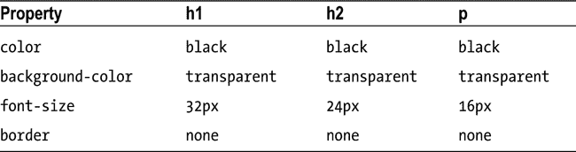

# 三、CSS 优先

级联样式表(CSS)是控制 HTML 元素外观(更恰当的说法是*表示*)的手段。CSS 对 jQuery 有着特殊的意义，原因有二。首先，你可以使用 *CSS 选择器*(我在本章中描述了它)告诉 jQuery 如何在 HTML 文档中查找元素。第二个原因是 jQuery 最常见的任务之一是改变应用于元素的 CSS 样式。

有超过 130 个 *CSS 属性*，每个属性控制一个元素表现的一个方面。与 HTML 元素一样，CSS 属性太多了，我无法在本书中描述它们。相反，我关注的是 CSS 如何工作以及如何将样式应用于元素。如果你想详细了解 CSS，那么我推荐我的另一本书:*html 5*权威指南，也是由 Apress 出版的。

CSS 入门

当浏览器在屏幕上显示一个元素时，它使用一组称为 *CSS 属性* 的属性来决定元素应该如何呈现。清单 3-1 显示了一个简单的 HTML 文档。

***清单 3-1*** 。一个简单的 HTML 文档

```js
<!DOCTYPE html>
<html>
<head>
    <title>Example</title>
</head>
<body>
    <h1>New Delivery Service</h1>
    <h2>Color and Beauty to Your Door</h2>
    <h2>(with special introductory offer)</h2>
    <p>We are pleased to announce that we are starting a home delivery service for
    your flower needs. We will deliver within a 20 mile radius of the store
    for free and $1/mile thereafter.</p>
</body>
</html>
```

你可以在图 3-1 中看到浏览器是如何显示文档的。


图 3-1 。在浏览器中显示简单文档

CSS 属性有很多*——太多了，本书无法详细介绍——但是你可以通过查看表 3-1 中的少量属性来了解 CSS 是如何工作的。*

 *表 3-1 。一些 CSS 属性

| 财产 | 描述 |
| --- | --- |
| `color` | 设置元素的前景色(通常设置文本的颜色) |
| `background-color` | 设置元素的背景色 |
| `font-size` | 设置元素中包含的文本所使用的字体大小 |
| `border` | 设置元素的边框 |

我没有为这些 CSS 属性定义值，但是浏览器仍然能够显示内容，如图 3-1 所示，每个内容元素都以不同的方式呈现。即使您没有为 CSS 属性提供值，浏览器仍然必须显示元素，因此每个元素都有一个*样式约定*——当 HTML 文档中没有设置其他值时，它使用 CSS 属性的默认值。HTML 规范定义了元素的样式约定，但是浏览器可以随意改变它们，这就是为什么你会看到，比如说，Google Chrome 和 Internet Explorer 之间样式约定的变化。表 3-2 显示了 Google Chrome 为表 3-1 中所列的属性 I 使用的默认值。

表 3-2 。一些 CSS 属性及其样式约定值



从表中可以看出，所有三种类型的元素的`color`、`background-color`和`border`属性的值都相同，只有`font-size`属性发生了变化。在这一章的后面，我将描述这些属性值所使用的单位——但是现在，我们将把重点放在设置属性值上，而不用担心这些值用什么单位来表示。

设置内联值

为 CSS 属性设置值的最直接的方法是将`style`属性应用于我们想要改变其表示的元素。清单 3-2 展示了这是如何做到的。

***清单 3-2*** 。使用样式属性设置元素的 CSS 属性

```js
<!DOCTYPE html>
<html>
<head>
    <title>Example</title>
</head>
<body>
    <h1>New Delivery Service</h1>
    <h2 style="background-color: grey; color: white">Color and Beauty to Your Door</h2>
    <h2>(with special introductory offer)</h2>
    <p>We are pleased to announce that we are starting a home delivery service for
    your flower needs. We will deliver within a 20 mile radius of the store
    for free and $1/mile thereafter.</p>
</body>
</html>
```

在清单 3-2 中，我使用了*样式声明*来指定两个 CSS 属性的值。你可以在图 3-2 中看到属性值的剖析。


图 3-2 。样式属性值的剖析

每个样式声明指定要更改的属性的名称和要使用的值，用冒号(`:`)分隔。您可以使用分号(`;`)将多个声明放在一起。在图 3-2 中，我将`background-color`的值设置为`grey`，将`color`属性的值设置为`white`。这些值在`h2`元素的`style`属性中指定，并且只影响该元素(文档中的其他元素不受影响，即使它们也是`h2`元素)。在图 3-3 的中，您可以看到这些新属性值对第一个`h2`元素的影响。


图 3-3 。更改 h2 元素的 style 属性中 CSS 值的效果

定义嵌入样式

使用`style`属性很简单，但是它只适用于单个元素。您可以对想要更改的每个元素使用`style`属性，但是很快就会变得难以管理并且容易出错，尤其是如果您需要在以后进行修改的话。一个更强大的技术是使用`style` *元素*(而不是`style` *属性*)来定义一个*嵌入样式*，并指示浏览器使用*选择器*来应用它。清单 3-3 显示了一种嵌入式风格。

***清单 3-3*** 。定义嵌入样式

```js
<!DOCTYPE html>
<html>
<head>
    <title>Example</title>
    <style>
        h2 { background-color: grey; color: white;}
    </style>
</head>
<body>
    <h1>New Delivery Service</h1>
    <h2>Color and Beauty to Your Door</h2>
    <h2>(with special introductory offer)</h2>
    <p>We are pleased to announce that we are starting a home delivery service for
    your flower needs. We will deliver within a 20 mile radius of the store
    for free and $1/mile thereafter.</p>
</body>
</html>
```

我们仍然在嵌入式风格中使用声明，但是它们被括在大括号中(`{`和`}`字符)，并且在它们前面有一个*选择器*。你可以在图 3-4 中看到嵌入式风格的剖析。


图 3-4 。嵌入式风格的剖析

 **提示**我把`style`元素放在了`head`元素中，但是我也可以把它放在`body`元素中。我更喜欢对样式使用`head`元素，因为我喜欢将内容从控制外观的 CSS 中分离出来的想法。

CSS 选择器在 jQuery 中很重要，因为它们是选择元素并对其执行操作的基础。我在示例中使用的选择器是`h2`，这意味着大括号中包含的样式声明应该应用于文档中的每个`h2`元素。你可以在图 3-5 的中看到这对`h2`元素的影响。


图 3-5 。嵌入样式的效果

您可以使用一个`style`元素来包含多个嵌入样式。清单 3-4 显示了您在第二章中第一次看到的花店文档，它有一组更复杂的样式。

***清单 3-4*** 。HTML 文档中一组更复杂的样式

```js
<!DOCTYPE html>
<html>
<head>
    <title>Example</title>
    <script src="jquery-2.0.2.js" type="text/javascript"></script>
    <style>
        h1 {
            width: 700px; border: thick double black; margin-left: auto;
            margin-right: auto; text-align: center; font-size: x-large; padding: .5em;
            color: darkgreen; background-image: url("border.png");
            background-size: contain; margin-top: 0;
        }
        .dtable {display: table;}
        .drow {display: table-row;}
        .dcell {display: table-cell; padding: 10px;}
        .dcell > * {vertical-align: middle}
        input {width: 2em; text-align: right; border: thin solid black; padding: 2px;}
        label {width: 5em;  padding-left: .5em;display: inline-block;}
        #buttonDiv {text-align: center;}
        #oblock {display: block; margin-left: auto; margin-right: auto; width: 700px;}
    </style>
</head>
<body>
    <h1>Jacqui's Flower Shop</h1>
    <form method="post">
        <div id="oblock">
            <div class="dtable">
                <div class="drow">
                    <div class="dcell">
                        <label for="aster">Aster:</label>
                        <input name="aster" value="0" required>
                    </div>
                    <div class="dcell">
                        <label for="daffodil">Daffodil:</label>
                        <input name="daffodil" value="0" required>
                    </div>
                    <div class="dcell">
                        <label for="rose">Rose:</label>
                        <input name="rose" value="0" required>
                    </div>
                </div>
                <div class="drow">
                    <div class="dcell">
                        <label for="peony">Peony:</label>
                        <input name="peony" value="0" required>
                    </div>
                    <div class="dcell">
                        <label for="primula">Primula:</label>
                        <input name="primula" value="0" required>
                    </div>
                    <div class="dcell">
                        <label for="snowdrop">Snowdrop:</label>
                        <input name="snowdrop" value="0" required>
                    </div>
                </div>
            </div>
        </div>
        <div id="buttonDiv"><button type="submit">Place Order</button></div>
    </form>
</body>
</html>
```

清单 3-4 中的`style`元素包含几个嵌入样式，其中一些，尤其是带有`h1`选择器的元素，定义了许多属性的值。

定义外部样式表

您可以创建一个单独的*样式表*，而不是在每个 HTML 文档中定义相同的样式集。这是一个独立的文件，带有传统的`.css`文件扩展名，你可以将你的风格放入其中。清单 3-5 显示了文件`styles.css`的内容，我已经将花店文档中的样式放入其中。

***清单 3-5*** 。styles.css 文件

```js
h1 {
    min-width: 700px; border: thick double black; margin-left: auto;
    margin-right: auto; text-align: center; font-size: x-large; padding: .5em;
    color: darkgreen; background-image: url("border.png");
    background-size: contain; margin-top: 0;
}
.dtable {display: table;}
.drow {display: table-row;}
.dcell {display: table-cell; padding: 10px;}
.dcell > * {vertical-align: middle}
input {width: 2em; text-align: right; border: thin solid black; padding: 2px;}
label {width: 5em;  padding-left: .5em;display: inline-block;}
#buttonDiv {text-align: center;}
#oblock {display: block; margin-left: auto; margin-right: auto; min-width: 700px;}
```

你不需要在样式表中使用`style`元素。您只需直接定义选择器和声明。然后使用`link`元素将样式带入文档，如清单 3-6 所示。

***清单 3-6*** 。导入外部样式表

```js
<!DOCTYPE html>
<html>
<head>
    <title>Example</title>
    <script src="jquery-2.0.2.js" type="text/javascript"></script>
    <link rel="stylesheet" type="text/css" href="styles.css" />
</head>
<body>
    <h1>Jacqui's Flower Shop</h1>
    <form method="post">
        <div id="oblock">
            <div class="dtable">
                <div class="drow">
                    <div class="dcell">
                        <label for="aster">Aster:</label>
                        <input name="aster" value="0" required>
                    </div>
                    <div class="dcell">
                        <label for="daffodil">Daffodil:</label>
                        <input name="daffodil" value="0" required>
                    </div>
                    <div class="dcell">
                        <label for="rose">Rose:</label>
                        <input name="rose" value="0" required>
                    </div>
                </div>
                <div class="drow">
                    <div class="dcell">
                        <label for="peony">Peony:</label>
                        <input name="peony" value="0" required>
                    </div>
                    <div class="dcell">
                        <label for="primula">Primula:</label>
                        <input name="primula" value="0" required>
                    </div>
                    <div class="dcell">
                        <label for="snowdrop">Snowdrop:</label>
                        <input name="snowdrop" value="0" required>
                    </div>
                </div>
            </div>
        </div>
        <div id="buttonDiv"><button type="submit">Place Order</button></div>
    </form>
</body>
</html>
```

您可以根据需要链接到任意多个样式表，每个`link`元素引用一个样式表。如果用同一个选择器定义两个样式，导入样式表的顺序很重要。最后加载的将是应用的那个。

了解 CSS 选择器

注意在花店样式表中有不同种类的选择器:一些是元素名称(比如`h1`和`input`)，一些以句点开头(比如`.dtable`和`.row`)，还有一些以英镑开头(`#butonDiv`和`#oblock`)。如果你特别细心，你会注意到其中一个选择器有多个组件:`.dcell > *`。每个 CSS 选择器选择文档中的元素，不同种类的选择器告诉浏览器以不同的方式寻找元素。在本节中，我描述了 CSS 定义的不同种类的选择器，从*核心选择器* 开始，表 3-3 总结了这些选择器。

表 3-3 。核心选择器

| 选择器 | 描述 |
| --- | --- |
| `*` | 选择所有元素 |
| `<type>` | 选择指定类型的元素 |
| `.<class>` | 选择特定类的元素(不考虑元素类型) |
| `<type>.<class>` | 选择属于指定类成员的指定类型的元素 |
| `#<id>` | 为 **id** 属性选择具有指定值的元素 |

这些选择器是使用最广泛的(例如，它们涵盖了我在示例文档中定义的大多数样式)。

按属性选择

虽然基本的选择器作用于`id`和`class`属性(我在第二章中描述过)，但是也有选择器可以让你处理任何属性。表 3-4 对它们进行了描述。

表 3-4 。属性选择器

| 选择器 | 描述 |
| --- | --- |
| `[attr]` | 选择定义属性 **attr** 的元素，而不考虑分配给该属性的值 |
| `[attr="val"]` | 选择定义**属性**并且该属性的值为**值**的元素 |
| `[attr^="val"]` | 选择定义**属性**的元素，其属性值以字符串 **val** 开始 |
| `[attr$="val"]` | 选择定义**属性**并且其属性值以字符串 **val** 结尾的元素 |
| `[attr*="val"]` | 选择定义**属性**并且其属性值包含字符串 **val** 的元素 |
| `[attr∼="val"]` | 选择定义**属性**并且其属性值包含多个值的元素，其中一个值为**值** |
| `[attr&#124;="val"]` | 选择定义**属性**的元素，其值是用连字符分隔的值列表，第一个是**值** |

清单 3-7 显示了一个简单的嵌入样式的文档，它的选择器是基于属性的。

***清单 3-7*** 。使用属性选择器

```js
<!DOCTYPE html>
<html>
<head>
    <title>Example</title>
    <style>
        [lang] { background-color: grey; color: white;}
        [lang="es"] {font-size: 14px;}
    </style>
</head>
<body>
    <h1 lang="en">New Delivery Service</h1>
    <h2 lang="en">Color and Beauty to Your Door</h2>
    <h2 lang="es">(Color y belleza a tu puerta)</h2>
    <p>We are pleased to announce that we are starting a home delivery service for
    your flower needs. We will deliver within a 20 mile radius of the store
    for free and $1/mile thereafter.</p>
</body>
</html>
```

第一个选择器匹配任何具有`lang`属性的元素，第二个选择器匹配任何`lang`属性值为`es`的元素。你可以在图 3-6 中看到这些风格的效果。


图 3-6 。使用属性选择器应用样式

 **注意**这个图有一些重要的地方需要注意。看看`h2`元素是如何受到嵌入样式的*和*的影响的。第一种样式应用于所有具有`lang`属性的元素。第二种样式应用于所有具有值为`es`的`lang`属性的元素。文档中的第二个`h2`元素满足这两个条件，因此`background-color`、`color`和`font-size`属性的值都被更改。我将在“理解样式级联”一节中详细解释这是如何工作的

按关系选择

在第二章的中，我解释了元素(以及在 DOM 中表示它们的对象)有一个层次结构，它产生了不同种类的关系。有 CSS 选择器允许你根据那些关系选择元素，如表 3-5 所述。

表 3-5 。关系选择器

| 选择器 | 描述 |
| --- | --- |
| `<selector> <selector>` | 选择与第二个选择器匹配并且是第一个选择器匹配的元素的后代的元素 |
| `<selector> > <selector>` | 选择与第二个选择器匹配的元素，以及与第一个选择器匹配的元素的子元素 |
| `<selector> + <selector>` | 选择与第二个选择器匹配并且是与第一个选择器匹配的元素的下一个同级元素 |
| `<selector> ∼ <selector>` | 选择与第二个选择器匹配的元素，并且这些元素是与第一个选择器匹配的元素的同级元素(并且出现在第一个选择器之后) |

我在花店示例文档中使用了其中一个选择器，如下所示:

```js
.dcell > * {vertical-align: middle}
```

这个选择器匹配所有属于`dcell`类的元素的子元素，声明将`vertical-align`属性设置为值`middle`。清单 3-8 展示了其他一些正在使用的关系选择器。

***清单 3-8*** 。使用关系选择器

```js
<!DOCTYPE html>
<html>
<head>
    <title>Example</title>
    <style>
        h1 ∼ [lang] { background-color: grey; color: white;}
        h1 + [lang] {font-size: 12px;}
    </style>
</head>
<body>
    <h1 lang="en">New Delivery Service</h1>
    <h2 lang="en">Color and Beauty to Your Door</h2>
    <h2 lang="es">(Color y belleza a tu puerta)</h2>
    <p>We are pleased to announce that we are starting a home delivery service for
    your flower needs. We will deliver within a 20 mile radius of the store
    for free and $1/mile thereafter.</p>
</body>
</html>
```

我已经使用了清单 3-8 中的两个兄弟选择器。第一个选择器使用波浪号(`∼`)字符，匹配任何具有`lang`属性的元素，该属性在`h1`元素之后定义，并且是其同级元素。在示例文档中，这意味着两个`h2`元素都被选中(因为它们具有属性，是`h1`元素的兄弟元素，并且是在`h2`元素之后定义的)。第二个选择器，使用加号字符的那个，是相似的，但是只匹配一个`h1`元素的直接兄弟。这意味着只选择了第一个`h2`元素。在图 3-7 中可以看到效果。


图 3-7 。使用兄弟关系选择器

使用伪元素和伪类选择器进行选择

CSS 支持一组*伪元素和伪类选择器*。这些提供了方便的功能，并不直接对应于文档中的元素或类成员。表 3-6 描述了这些选择器。

表 3-6 。伪选择器

| 选择器 | 描述 |
| --- | --- |
| `:active` | 选择用户当前激活的元素；这通常是指当鼠标按钮被按下时指针下的那些元素 |
| `:checked` | 选择处于选中状态的元素 |
| `:default` | 选择默认元素 |
| `:disabled` | 选择处于禁用状态的元素 |
| `:empty` | 选择不包含子元素的元素 |
| `:enabled` | 选择处于启用状态的元素 |
| `:first-child` | 选择作为其父元素的第一个子元素的元素 |
| `:first-letter` | 选择文本块的第一个字母 |
| `:first-line` | 选择文本块的第一行 |
| `:focus` | 选择具有焦点的元素 |
| `:hover` | 选择占据屏幕上鼠标指针下方位置的元素 |
| `:in-range` `:out-of-range` | 选择指定范围内或范围外的受约束的**输入**元素 |
| `:lang(<language>)` | 基于 **lang** 属性的值选择元素 |
| `:last-child` | 选择作为其父元素的最后一个子元素的元素 |
| `:link` | 选择**链接**元素 |
| `:nth-child(n)` | 选择其父元素的第 **n** 个子元素 |
| `:nth-last-child(n)` | 选择从其父元素的最后一个子元素开始第 **n** 个元素 |
| `:nth-last-of-type(n)` | 选择从其父元素定义的类型的最后一个子元素开始的第 **n** 个元素 |
| `:nth-of-type(n)` | 选择属于其父元素定义的类型的第 **n** 个子元素 |
| `:only-child` | 选择由其父元素定义的唯一元素 |
| `:only-of-type` | 选择由其父元素定义的类型的唯一元素 |
| `:required` `:optional` | 基于**必需的**属性的存在，选择**输入**元素 |
| `:root` | 选择文档中的根元素 |
| `:target` | 选择由 URL 片段标识符引用的元素 |
| `:valid` `:invalid` | 根据表单中的输入验证选择有效或无效的**输入**元素 |
| `:visited` | 选择用户已经访问过的**链接**元素 |

清单 3-9 展示了一些伪选择器的使用。

***清单 3-9*** 。使用伪选择器

```js
<!DOCTYPE html>
<html>
<head>
    <title>Example</title>
    <style>
        :nth-of-type(2) { background-color: grey; color: white;}
        p:first-letter {font-size: 40px;}
    </style>
</head>
<body>
    <h1 lang="en">New Delivery Service</h1>
    <h2 lang="en">Color and Beauty to Your Door</h2>
    <h2 lang="es">(Color y belleza a tu puerta)</h2>
    <p>We are pleased to announce that we are starting a home delivery service for
    your flower needs. We will deliver within a 20 mile radius of the store
    for free and $1/mile thereafter.</p>
</body>
</html>
```

您可以单独使用伪选择器，或者作为另一个选择器的修饰符。我已经在清单 3-9 中展示了这两种方法。第一个选择器匹配任何属于其父元素定义的类型的第二个元素。第二个选择器匹配任何`p`元素的第一个字母。你可以在图 3-8 中看到这些风格的应用。


图 3-8 。使用伪选择器来应用样式

联合和否定选择器

通过将选择器排列在一起，可以获得额外的灵活性。具体来说，您可以通过合并选择和通过否定反转选择来创建联合。这两种方法在表 3-7 中均有描述。

表 3-7 。灵活安排选择器

| 选择器 | 描述 |
| --- | --- |
| `<selector>, <selector>` | 选择第一个选择器匹配的元素和第二个选择器匹配的元素的并集 |
| `:not(<selector>)` | 选择与指定选择器不匹配的元素 |

清单 3-10 展示了如何创建并集和反集。

***清单 3-10*** 。使用选择器联合和求反

```js
<!DOCTYPE html>
<html>
<head>
    <title>Example</title>
    <style>
        h1, h2 { background-color: grey; color: white;}
        :not(html):not(body):not(:first-child) {border: medium double black;}
    </style>
</head>
<body>
    <h1 lang="en">New Delivery Service</h1>
    <h2 lang="en">Color and Beauty to Your Door</h2>
    <p>We are pleased to announce that we are starting a home delivery service for
    your flower needs. We will deliver within a 20 mile radius of the store
    for free and $1/mile thereafter.</p>
</body>
</html>
```

清单 3-10 中的第一个选择器是`h1`和`h2`选择器的联合。正如您所想象的，这匹配文档中的所有`h1`和`h2`元素。第二个选择器有点深奥。我想演示如何使用伪选择器作为其他伪选择器的修饰符，包括否定。

```js
...
:not(html):not(body):not(:first-child) {border: medium double black;}
...
```

该选择器匹配任何不是`html`元素、不是`body`元素并且不是其父元素的第一个子元素的元素。你可以在图 3-9 中看到这个例子中的样式是如何应用的。


图 3-9 。创建选择器联合和否定

了解样式层叠

理解样式表的关键是理解它们如何*级联*和*继承*。HTML 文档中的 CSS 属性可能有多个来源，而层叠和继承是浏览器确定应该使用哪些值来显示元素的方法。您已经看到了定义样式的三种不同方式(内嵌、嵌入和来自外部样式表)，但是还有另外两种样式来源:*浏览器样式*和*用户样式*。

如果没有指定其他样式，*浏览器样式* (更确切地说是*用户代理样式*)是浏览器应用于元素的样式约定。你在本章开始时看到了一个使用样式约定的例子。

此外，大多数浏览器允许用户定义自己的样式表。这些样式表包含的样式被称为*用户样式* 。这不是一个广泛使用的特性，但是那些定义自己的样式表的用户通常非常重视能够这样做，尤其是因为它提供了一种使页面更易访问的方法。

每个浏览器都有自己的用户风格机制。例如，Windows 上的谷歌 Chrome 在用户的个人资料目录中创建了一个名为`User StyleSheets\Custom.css`的文件。添加到这个文件中的任何样式都将应用到用户访问的任何站点上，服从我在下一节中描述的级联规则。

了解样式如何级联

现在您已经看到了浏览器必须考虑的所有样式来源，您可以看看浏览器在显示元素时查找属性值的顺序。

1.  内联样式(使用元素上的`style`属性定义的样式)
2.  嵌入样式(在`style`元素中定义的样式)
3.  外部样式(使用`link`元素导入的样式)
4.  用户样式(由用户定义的样式)
5.  浏览器样式(浏览器应用的样式约定)

假设浏览器需要显示一个`p`元素。它需要知道应该使用什么颜色来显示文本，这意味着它需要为 CSS `color`属性找到一个值。首先，它将检查试图显示的元素是否有定义了`color`值的内联样式，如下所示:

```js
...
<pstyle="color: red">We are pleased to announce that we are starting a home delivery
    service for your flower needs. We will deliver within a 20 mile radius of the store
    for free and $1/mile thereafter.</p>
...
```

如果没有内联样式，那么浏览器将查找包含应用于该元素的样式的`style`元素，如下所示:

```js
...
<style>
    p {color: red};
</style>
...
```

如果没有这样的`style`元素，浏览器会查看通过`link`元素加载的样式表，依此类推，直到浏览器为`color`属性找到一个值，这意味着如果没有其他值可用，就使用默认浏览器样式中定义的值。

 **提示**前三种属性来源(内嵌样式、嵌入样式和样式表)统称为*作者样式*。用户样式表中定义的样式称为*用户样式*，浏览器定义的样式称为*浏览器样式*。

调整重要样式的顺序

您可以通过将属性值标记为*重要* 来覆盖正常的层叠顺序，如清单 3-11 中的所示。

***清单 3-11*** 。将样式属性标记为重要

```js
<!DOCTYPE html>
<html>
<head>
    <title>Example</title>
<style>
    p {color: black !important; }
</style>
</head>
<body>
    <h1 lang="en">New Delivery Service</h1>
    <h2 lang="en">Color and Beauty to Your Door</h2>
    <pstyle="color: red">We are pleased to announce that we are starting a home delivery
    service for your flower needs. We will deliver within a 20 mile radius of the store
    for free and $1/mile thereafter.</p>
</body>
</html>
```

通过将`!important`追加到声明中，可以将单个值标记为重要。浏览器优先选择重要的样式，而不管它们是在哪里定义的。您可以在图 3-10 中看到属性重要性的影响，其中`color`属性的嵌入值覆盖了内嵌值(这在打印页面上可能有点难以辨认，但是所有的文本都是黑色的)。


图 3-10 。重要属性值覆盖内联属性值

 **提示**唯一优先于您定义的重要值的是在用户样式表中定义的重要值。对于常规值，作者样式在用户样式之前使用，但是在处理重要值时，情况正好相反。

特异性和顺序评估平分秋色

如果有两种样式可以应用于在同一级联级别定义的元素，并且它们都包含浏览器正在寻找的 CSS 属性值，那么我们就进入了平局决胜的情况。为了决定使用哪个值，浏览器评估每种风格的*特异性*，并选择最具体的一个。浏览器通过计算三种不同的特征来确定一种风格的特殊性。

*   样式选择器中的`id`值的数量
*   选择器中其他属性和伪类的数量
*   选择器中元素名称和伪元素的数量

浏览器会组合每个评估的值，并应用最具体的样式的属性值。你可以在清单 3-12 中看到一个简单的特异性例子。

***清单 3-12*** 。风格的特殊性

```js
<!DOCTYPE html>
<html>
<head>
    <title>Example</title>
    <style>
        p {background-color: grey; color: white;}
        p.details {color:red;}
    </style>
</head>
<body>
    <h1 lang="en">New Delivery Service</h1>
    <h2 lang="en">Color and Beauty to Your Door</h2>
    <p class="details">We are pleased to announce that we are starting a home delivery
    service for your flower needs. We will deliver within a 20 mile radius of the store
    for free and $1/mile thereafter.</p>
</body>
</html>
```

在评估特异性时，您以`a` - `b` - `c`的形式创建一个数字，其中每个字母都是所统计的三个特征之一的总和。这不是三位数。如果样式的`a`值最大，则样式更具体。只有当`a`值相等时，浏览器才会比较`b`值。在这种情况下，`b`值越大的样式越特殊。只有当`a`和`b`值相同时，浏览器才会考虑`c`值。这意味着`1` - `0` - `0`的特异性分数比`0` - `5` - `5`的特异性分数更高。

在这种情况下，选择器`p.details`包含一个`class`属性，这意味着样式的特异性是`0` - `1` - `1` ( `0` id 值+ `1`其他属性+ `1`元素名称)。另一个选择器的特异性为`0` - `0` - `1`(不包含`id`值或其他属性，只有一个元素名)。

当呈现一个`p`元素时，浏览器将为`color`属性寻找一个值。如果`p`元素是`details`类的成员，那么带有`p.details`选择器的样式将是最具体的，并且将使用`red`的值。对于所有其他`p`元素，将使用值`white`。在图 3-11 中，您可以看到浏览器如何选择和应用该示例的值。


图 3-11 。基于特定性应用样式中的值

当样式中定义了具有相同特性的值时，浏览器会根据定义值的顺序选择它所使用的值。最后定义的是将要使用的。清单 3-13 显示了一个包含两种相同特定样式的文档。

***清单 3-13*** 。同样独特的风格

```js
<!DOCTYPE html>
<html>
<head>
    <title>Example</title>
    <style>
        p.details {color:red;}
        p.information {color: blue;}
    </style>
</head>
<body>
    <h1 lang="en">New Delivery Service</h1>
    <h2 lang="en">Color and Beauty to Your Door</h2>
    <p class="details information">We are pleased to announce that we are starting a home
    Delivery service for your flower needs. We will deliver within a 20 mile radius of
    the store for free and $1/mile thereafter.</p>
</body>
</html>
```

在`style`元素中定义的两种样式具有相同的特异性分数，并且都适用于`p`元素。当浏览器在页面中显示`p`元素时，它将为`color`属性选择`blue`属性，因为这是后一种样式中定义的值。你可以在图 3-12 中看到这一点。


图 3-12 。根据定义样式的顺序选择属性值

 **提示**这些特异性规则仅适用于在同一层级定义的样式。例如，这意味着在`style`属性中定义的属性总是优先于在`style`元素中定义的样式。

了解 CSS 单位

在本章的前面，我向你展示了浏览器默认使用的 CSS 属性的值。这些是例子中一些元素的样式约定，我在表 3-8 中复制了这些信息。

表 3-8 。一些 CSS 属性及其值


CSS 定义了一系列不同的单元类型，在接下来的章节中，我将展示一些更常用的单元类型，包括我在本书中使用的单元类型。

使用 CSS 颜色

许多 CSS 属性都使用颜色，包括我在本章中使用的`color`和`background-color`属性。指定颜色的最简单方法是使用预定义的颜色名称，或者为每个红色、绿色和蓝色分量使用十进制或十六进制值。十进制数值用逗号分隔，十六进制数值通常以`#`为前缀，如`#ffffff`，代表白色。你可以在表 3-9 中看到一些预定义的颜色名称及其十进制和十六进制的对等物。

表 3-9 。选定的 CSS 颜色


这些被称为*基本*颜色名称。CSS 还定义了*扩展颜色*。这里不胜枚举，但你可以在`www.w3.org/TR/css3-color`找到完整的列表。除了基本颜色之外，还有许多细微的变化。作为一个例子，表 3-10 显示了可以使用的灰色阴影扩展集。

表 3-10 。选定的 CSS 颜色

| 颜色名称 | 十六进制 | 小数 |
| --- | --- | --- |
| `darkgrey` | `#a9a9a9` | `169,169,169` |
| `darkslategrey` | `#2f4f4f` | `47,79,79` |
| `dimgrey` | `#696969` | `105,105,105` |
| `grey` | `#808080` | `128,128,128` |
| `lightgrey` | `#d3d3d3` | `211,211,211` |
| `lightslategrey` | `#778899` | `119,136,153` |
| `slategrey` | `#708090` | `112,128,144` |

指定更复杂的颜色

颜色名称和简单的十六进制值不是指定颜色的唯一方式。许多功能允许您选择颜色。表 3-11 描述了每个可用的功能。

表 3-11 。CSS 颜色函数

| 功能 | 描述 | 例子 |
| --- | --- | --- |
| `rgb(r, g, b)` | 使用 RGB(红、绿、蓝)模型指定颜色。 | `color: rgb(112, 128, 144)` |
| `rgba(r, g, b, a)` | 使用 RGB 模型指定颜色，并添加 alpha 值来指定不透明度。(值为 0 表示完全透明；值为 1 表示完全不透明。) | `color: rgba(112, 128, 144, 0.4)` |
| `hsl(h, s, l)` | 使用色调、饱和度和亮度(HSL)模型指定颜色。 | `color: hsl(120, 100%, 22%)` |
| `hsla(h, s, l, a)` | 类似于 HSL，但是增加了一个 alpha 值来指定不透明度。 | `color: hsla(120, 100%, 22%, 0.4)` |

你可以使用`rgba`函数来指定一个透明的颜色，但是如果你想要一个完全透明的元素，那么你可以使用特殊的颜色值`transparent`。

了解 CSS 长度

许多 CSS 属性要求您指定一个*长度*，例如`font-size`属性，它用于指定用于呈现元素内容的字体大小。指定长度时，将单位数和单位标识符连接在一起，中间没有任何空格或其他字符。例如，`font-size`属性的值`20pt`表示由`pt`标识符表示的 20 个单位(它们是*点*，稍后解释)。CSS 定义了两种长度单位:绝对长度单位和相对于另一个属性的长度单位。我将在接下来的章节中解释这两个问题。

使用绝对长度

*绝对单位*是真实世界的测量值。CSS 支持五种类型的绝对单位，表 3-12 对此进行了描述。

表 3-12 。绝对测量单位

| 单位标识符 | 描述 |
| --- | --- |
| 中的 | 英寸 |
| **厘米** | 厘米 |
| **毫米** | 毫米 |
| pt | 磅(1 磅等于 1/72 英寸) |
| **pc** | 十二点活字(1 点活字等于 12 点) |

您可以在样式中混合和匹配单位，以及混合绝对和相对单位。如果您事先知道内容将如何呈现，例如在设计印刷时，绝对单位会很有用。我在我的 CSS 项目中很少使用绝对单位——我发现相对单位更灵活，更容易维护，我很少创建必须符合现实世界测量的内容。

提示你可能想知道像素在绝对单位表中的位置。事实上，CSS 试图让像素成为一个相对的度量单位，尽管可悲的是，规范在这方面做了拙劣的尝试。您可以在“使用像素”一节中了解更多信息

使用相对长度

相对长度比绝对长度更复杂，需要简洁明了的语言来明确定义它们的含义。相对单位是用其他单位来衡量的。不幸的是，CSS 规范中的语言不够精确(这个问题已经困扰 CSS 多年)。这意味着 CSS 定义了广泛的有趣和有用的相对度量，但你不能使用其中的一些，因为它们没有广泛或一致的浏览器支持。表 3-13 显示了 CSS 定义的、在主流浏览器中可以依赖的相对单位。

表 3-13 。CSS 相对测量单位

| 单位标识符 | 描述 |
| --- | --- |
| 全身长的 | 相对于元素的字体大小 |
| 不包括 | 相对于元素字体的 x 高度 |
| 雷姆 | 相对于根元素的字体大小 |
| 像素 | CSS 像素的数量(假设在 96 dpi 的显示器上) |
| % | 另一财产价值的百分比 |

当您使用相对单位时，您实际上是指定了另一个度量的倍数。清单 3-14 给出了一个设置与`font-size`相关的属性的例子。

***清单 3-14*** 。使用相对单位

```js
<!DOCTYPE html>
<html>
<head>
    <title>Example</title>
    <style>
        p.details {
            font-size: 15pt;
            height: 3em;
            border: thin solid black;
        }
    </style>
</head>
<body>
    <h1 lang="en">New Delivery Service</h1>
    <h2 lang="en">Color and Beauty to Your Door</h2>
    <p class="details information">We are pleased to announce that we are starting a home
    delivery service for your flower needs. We will deliver within a 20 mile radius of
    the store for free and $1/mile thereafter.</p>
</body>
</html>
```

在这个例子中，我已经指定了`height`属性的值(它设置了一个元素的高度)为`3em`，这意味着`p`元素应该被渲染，使得元素在屏幕上的高度是`font-size`的三倍。你可以在图 3-13 中看到浏览器如何显示这些元素。我添加了一个边框(使用`border`属性),这样你可以更容易地看到元素的大小。


图 3-13 。使用相对测量的效果

使用像素

CSS 中的像素可能不是你所期望的。术语*像素*的通常含义是指显示器上最小的可寻址单元:一个像素。CSS 尝试做一些不同的事情，定义一个像素如下:

参考像素是设备上一个像素的视角，像素密度为 96 dpi，与阅读器的距离为一臂长。

这就是困扰 CSS 的那种模糊定义。我不想咆哮，但是依赖于用户手臂长度的规范是有问题的。幸运的是，主流浏览器忽略了 CSS 定义的像素和显示中的像素之间的差异，并将 1 像素视为 1/96 英寸。(这是标准的 Windows 像素密度；在具有不同像素密度的显示器的平台上的浏览器通常实现一种转换，使得 1 像素仍然是大约 1/96 英寸。)

 **提示**虽然没什么用，但是你可以在`www.w3.org/TR/CSS21/syndata.html#length-units`阅读 CSS 像素的完整定义。

这样做的净效果是，尽管 CSS 像素是一个相对的度量单位，但它们被浏览器视为一个绝对的单位。清单 3-15 演示了在 CSS 样式中指定像素。

***清单 3-15*** 。在样式中使用像素单位

```js
<!DOCTYPE html>
<html>
<head>
    <title>Example</title>
    <style>
        p.details {
            font-size: 20px;
            width: 400px;
            border: thin solid black;
        }
    </style>
</head>
<body>
    <h1 lang="en">New Delivery Service</h1>
    <h2 lang="en">Color and Beauty to Your Door</h2>
    <p class="details information">We are pleased to announce that we are starting a home
    delivery service for your flower needs. We will deliver within a 20 mile radius of
    the store for free and $1/mile thereafter.</p>
</body>
</html>
```

在清单 3-15 中，我用像素表示了`font-size`和`width`属性(`width`属性是对`height`属性的补充，它设置了一个元素的宽度)。你可以在图 3-14 中看到浏览器如何应用这种风格。


图 3-14 。以像素为单位指定单位

 **提示**虽然我经常在 CSS 中使用像素作为单位，但这往往是习惯问题。我发现`em`单位更灵活。这是因为只有当我需要改变时，我才需要改变字体的大小，而样式的其他部分可以无缝地工作。重要的是要记住，虽然 CSS 像素是相对单位，但实际上它们是绝对单位，因此可能是不灵活的。

使用百分比

您可以将度量单位表示为另一个属性值的百分比。你可以使用`%`(百分比)单位 来完成，如清单 3-16 中的所示。

***清单 3-16*** 。将单位表示为另一个属性值的百分比

```js
<!DOCTYPE html>
<html>
<head>
    <title>Example</title>
    <style>
        p.details {
            font-size: 200%;
            width: 50%;
            border: thin solid black;
        }
    </style>
</head>
<body>
    <h1 lang="en">New Delivery Service</h1>
    <h2 lang="en">Color and Beauty to Your Door</h2>
    <p class="details information">We are pleased to announce that we are starting a home
    delivery service for your flower needs. We will deliver within a 20 mile radius of
    the store for free and $1/mile thereafter.</p>
</body>
</html>
```

使用百分比作为单位有两个复杂之处。首先，不是所有的属性都可以用这种方式表示，其次，*可以用百分比*表示的每个属性分别定义了百分比所指的*其他*属性。例如，`font-size`属性使用从父元素继承的`font-size`值，`width`属性使用包含元素的`width`。

使用速记属性和自定义值

并非所有属性都使用单位和颜色设置。有些人有特殊的价值观，这是他们所控制的那种行为所独有的。一个很好的例子是`border`属性，我在一些清单中使用它来绘制元素的边框。您使用三个值来设置`border`属性，如下所示:

```js
...
border: thin solid black;
...
```

第一个值是边框的粗细，第二个值是边框的样式，最后一个值是边框的颜色。表 3-14 显示了可用于指定边框粗细的值。

表 3-14 。边框宽度值

| 价值 | 描述 |
| --- | --- |
| *<长度>* | 以 CSS 度量单位表示的长度，如 **em** 、 **px** 或 **cm** |
| *< perc >* `%` | 将围绕其绘制边框的区域的*宽度*的百分比 |
| `thin``medium` | 预设宽度，其含义由每个浏览器定义，但逐渐变粗 |

表 3-15 显示了可用于边框样式的值。

表 3-15 。边框样式的值

| 价值 | 描述 |
| --- | --- |
| `none` | 不会绘制任何边框 |
| `dashed` | 边框将是一系列矩形虚线 |
| `dotted` | 边界将是一系列圆点 |
| `double` | 边界将是两条平行线，两条平行线之间有一个间隙 |
| `groove` | 边框看起来会凹陷到页面中 |
| `inset` | 边框将使内容看起来凹陷到页面中 |
| `outset` | 边界将是这样的，内容看起来从页面上升 |
| `ridge` | 边框将从页面上凸起 |
| `solid` | 边界将是一条单一的、完整的线 |

通过将这些表中的值与一种颜色相结合，可以获得各种各样的边框效果。您可以在图 3-15 中看到浏览器中显示的样式范围。


图 3-15 。边框样式

`border`属性也是一个很好的*简写属性* 的例子。这些属性允许您在一个声明中设置几个相关属性的值。这意味着前面所示的`border`等价于下面的 12 个声明:

```js
border-top-color: black;
border-top-style: solid;
border-top-width: thin;
border-bottom-color: black;
border-bottom-style: solid;
border-bottom-width: thin;
border-left-color: black;
border-left-style: solid;
border-left-width: thin;
border-right-color: black;
border-right-style: solid;
border-right-width: thin;
```

CSS 允许您深入细节并设置单个属性进行精细控制，或者在所有相关值都相同时使用简写属性。

摘要

在这一章中，我给了你一个 CSS 的简要概述，向你展示了如何使用`style`属性设置属性，如何使用`style`元素(包括各种可用的选择器)，以及浏览器如何使用层叠和特异性来确定当元素被显示时哪些属性值应该被应用于元素。最后，我浏览了 CSS 单元、自定义值和速记属性。可以用多种不同的方式表达属性值，这为 CSS 样式增加了灵活性(也增加了一点混乱)。

在第四章中，我介绍了 JavaScript 的基础知识，这是定义 jQuery 功能并将其应用于 HTML 内容的方法。*