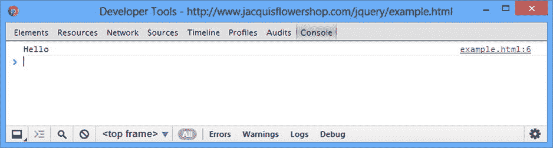

# 四、JavaScript 优先

jQuery 是一个 JavaScript 库，可以添加到 HTML 文档中，由浏览器执行。您还可以通过向文档添加自己的代码来利用 jQuery 库的特性——这需要对如何编写 JavaScript 有一个基本的了解。在这一章中，我提供了 JavaScript 语言的初级读本，重点放在与 jQuery 相关的特性上。

JavaScript 作为一种编程语言有着好坏参半的名声。诚然，JavaScript 经历了一段艰难的生活，在它有机会完全成熟之前就匆匆通过了标准化，这给 JavaScript 的工作方式留下了一些奇怪之处。但是大多数对 JavaScript 的抱怨来自开发人员，他们发现 JavaScript 的工作方式与他们首选的后端语言(如 C#、Java 或 Python)并不完全相同。

一旦克服了接受 JavaScript 是一种独立语言的障碍，你将会发现一种灵活的、动态的、令人愉快的语言。当然，仍然有一些奇怪的地方，但是总的体验是积极的，只要稍加努力，你就会发现 JavaScript 是一种富有表现力和有价值的语言。

如果你是编程新手，一个好的起点是发布在流行网站【Lifehacker.com】的一系列文章。不需要任何编程知识，所有的例子都是用 JavaScript 编写的。该指南可从这里获得:`http://lifehacker.com/5744113/learn-to-code-the-full-beginners-guide`。

准备使用 JavaScript

JavaScript 代码作为*脚本*添加到 HTML 文档中——浏览器将执行的 JavaScript 语句块——并且有不同的方式可以添加脚本。您可以定义一个*内联脚本* ，其中脚本的内容是 HTML 文档的一部分。您还可以定义一个*外部脚本* ，其中 JavaScript 包含在一个单独的文件中，并通过 URL 引用(这就是您访问 jQuery 库的方式，您将在第二部分中看到)。这两种方法都依赖于`script`元素。在这一章中，我将使用内联脚本。你可以在清单 4-1 中看到一个简单的例子。

***清单 4-1*** 。一个简单的内联脚本

```js
<!DOCTYPE HTML>
<html>
<head>
    <title>Example</title>
    <script type="text/javascript">
        console.log("Hello");
    </script>
</head>
<body>
    This is a simple example
</body>
</html>
```

该脚本向*控制台*写入一条消息。控制台是浏览器提供的一个基本的(但是有用的)工具，可以让你在脚本执行时显示调试信息。每个浏览器都有不同的控制台显示方式。对于谷歌浏览器，你可以从`Tools`菜单中选择`JavaScript console`。你可以在图 4-1 中看到控制台是如何在 Chrome 中显示的；其他浏览器也有类似的功能。



图 4-1 。谷歌浏览器 JavaScript 控制台

您可以看到控制台窗口中显示了调用`console.log`方法的输出，以及消息来源的详细信息(在本例中是在`example.html`文件的第 6 行)。这一章，我就不截图了；我将展示一些例子的结果。例如，对于清单 4-1 中的，输出如下:

```js
Hello
```

我在本章的后面格式化了一些结果，使它们更容易阅读。在接下来的小节中，我将向您展示 JavaScript 语言的核心特性。如果你有过用其他现代语言编程的经验，你会发现 JavaScript 的语法和风格很熟悉——尽管正如我在本章开始时所说的，有些奇怪。

使用语句

基本的 JavaScript 构建块是 *语句*。每条语句代表一条命令，语句通常以分号(`;`)结束。分号是可选的，但是使用分号会使代码更容易阅读，并且允许在一行中有多个语句。清单 4-2 显示了一个脚本中的一对语句，它们是使用一个`script`元素定义的。

***清单 4-2*** 。使用 JavaScript 语句

```js
<!DOCTYPE HTML>
<html>
    <head>
        <title>Example</title>
        <script type="text/javascript">
            console.log("This is a statement");
            console.log("This is also a statement");
        </script>
    </head>
    <body>
        This is a simple example
    </body>
</html>
```

浏览器依次执行每条语句。在这个例子中，我简单地向控制台写出了一对消息。结果如下:

```js
This is a statement
This is also a statement
```

定义和使用函数

当浏览器到达一个`script`元素时，它会立即一个接一个地执行 JavaScript 语句。你也可以将多条语句打包成一个*函数*，直到浏览器遇到一条*调用*该函数的语句才会执行，如清单 4-3 所示。

***清单 4-3*** 。定义 JavaScript 函数

```js
<!DOCTYPE HTML>
<html>
<head>
    <title>Example</title>
    <script type="text/javascript">
        function myFunc() {
            console.log("This is a statement");
        };

        myFunc();
    </script>
</head>
<body>
    This is a simple example
</body>
</html>
```

一个函数包含的语句用大括号(`{`和`}`)括起来，称为*代码块*。这个清单定义了一个名为`myFunc`的函数，它在代码块中包含一条语句。JavaScript 是一种区分大小写的语言，这意味着关键字`function`必须是小写的。在浏览器到达另一个调用`myFunc`函数 的语句之前，函数中的语句不会被执行，如下:

```js
myFunc();
```

在函数中执行语句会产生以下输出:

```js
This is a statement
```

除了演示函数是如何定义的，这个例子没有什么特别的用处，因为函数在定义后会立即被调用。在第二部分中，您将看到一些更有用的函数示例。

用参数定义函数

与大多数编程语言一样，JavaScript 允许你为函数定义参数，如清单 4-4 所示。

***清单 4-4*** 。用参数定义函数

```js
<!DOCTYPE HTML>
<html>
<head>
    <title>Example</title>
    <script type="text/javascript">
        function myFunc(name, weather) {
            console.log("Hello " + name + ".");
            console.log("It is " + weather + " today");
        };

        myFunc("Adam", "sunny");
    </script>
</head>
<body>
    This is a simple example
</body>
</html>
```

我给`myFunc`函数添加了两个参数，称为`name`和`weather`。JavaScript 是一种动态类型语言，这意味着在定义函数时不必声明参数的数据类型。当我在本章后面讲述 JavaScript 变量时，我会回到动态类型。要调用带参数的函数，需要在调用函数时提供值作为参数，如下所示:

```js
...
myFunc("Adam", "sunny");
...
```

该清单的结果如下:

```js
Hello Adam.
It is sunny today
```

当你调用一个函数时，参数的数量不需要与函数中的参数数量相匹配。如果您调用的函数的实参数少于它的形参数，那么您没有为其提供值的任何形参的值都是未定义的。如果调用函数时使用的参数多于实际参数，那么多余的参数将被忽略。

这样做的结果是，您不能创建两个具有相同名称和不同参数的函数，并期望 JavaScript 根据您在调用函数时提供的参数来区分它们。这被称为*多态性* ，尽管它在 Java 和 C#等语言中受支持，但在 JavaScript 中却不可用。相反，如果您定义了两个同名的函数，那么第二个定义将替换第一个定义。

定义返回结果的函数

您可以使用`return` 关键字从函数中返回结果。清单 4-5 显示了一个返回结果的函数。

***清单 4-5*** 。从函数返回结果

```js
<!DOCTYPE HTML>
<html>
<head>
    <title>Example</title>
    <script type="text/javascript">
        function myFunc(name) {
            return ("Hello " + name + ".");
        };

        console.log(myFunc("Adam"));
    </script>
</head>
<body>
    This is a simple example
</body>
</html>
```

这个函数定义了一个参数，并用它来产生一个结果。我调用函数并将结果作为参数传递给`console.log`函数，如下所示:

```js
...
console.log(myFunc("Adam"));
...
```

请注意，您不必声明该函数将返回一个结果或表示结果的数据类型。该清单的结果如下:

```js
Hello Adam.
```

使用变量和类型

您可以使用`var`关键字定义变量，并且可以选择在一条语句中为变量赋值。函数中定义的变量是*局部变量*，并且只能在该函数中使用。在`script`元素中直接定义的变量是*全局变量*，可以在任何地方访问，包括同一个 HTML 文档中的其他脚本。清单 4-6 展示了局部和全局变量的使用。

***清单 4-6*** 。使用局部和全局变量

```js
<!DOCTYPE HTML>
<html>
    <head>
        <title>Example</title>
        <script type="text/javascript">
            var myGlobalVar = "apples";

            function myFunc(name) {
                var myLocalVar = "sunny";
                return ("Hello " + name + ". Today is " + myLocalVar + ".");
            };
            console.log(myFunc("Adam"));
        </script>
        <script type="text/javascript">
            console.log("I like " + myGlobalVar);
        </script>
    </head>
    <body>
        This is a simple example
    </body>
</html>
```

同样，JavaScript 是一种动态类型语言。这并不意味着 JavaScript 没有类型:这只是意味着您不必显式声明变量的类型，并且您可以毫无困难地将不同的类型赋给同一个变量。JavaScript 将根据您分配给变量的值来确定类型，并根据使用它们的上下文在类型之间自由转换。来自清单 4-6 的结果如下:

```js
Hello Adam. Today is sunny.
I like apples
```

使用原始类型

JavaScript 定义了一组原语类型:`string`、`number`和`boolean`。这似乎是一个很短的列表，但是 JavaScript 设法将很大的灵活性融入到这三种类型中。

使用字符串

使用双引号或单引号字符定义`string`值，如清单 4-7 所示。

***清单 4-7*** 。定义字符串变量

```js
<!DOCTYPE HTML>
<html>
<head>
    <title>Example</title>
    <script type="text/javascript">
        var firstString = "This is a string";
        var secondString = 'And so is this';
    </script>
</head>
<body>
    This is a simple example
</body>
</html>
```

您使用的引号字符必须匹配。例如，你不能用单引号开始一个字符串，然后用双引号结束。此列表没有控制台输出。

使用布尔值

`boolean`类型有两个值:`true`和`false`。清单 4-8 显示了正在使用的两个值，但是这种类型在条件语句中使用时最有用，比如一个`if`语句。该清单中没有控制台输出。

***清单 4-8*** 。定义布尔值

```js
<!DOCTYPE HTML>
<html>
<head>
    <title>Example</title>
    <script type="text/javascript">
        var firstBool = true;
        var secondBool = false;
    </script>
</head>
<body>
    This is a simple example
</body>
</html>
```

使用数字

`number`类型用于表示*整数*和*浮点数*(也称为*实数*)。清单 4-9 提供了一个演示。

***清单 4-9*** 。定义数值

```js
<!DOCTYPE HTML>
<html>
<head>
    <title>Example</title>
    <script type="text/javascript">
        var daysInWeek = 7;
        var pi = 3.14;
        var hexValue = 0xFFFF;
    </script>
</head>
<body>
    This is a simple example
</body>
</html>
```

您不必指定使用哪种号码。您只需表达您需要的值，JavaScript 就会相应地执行。在清单中，我定义了一个整数值、一个浮点值，并在一个值前面加上了`0x`来表示一个十六进制值。(清单中没有控制台输出。)

创建对象

JavaScript 支持对象的概念，并且有不同的方法来创建它们。清单 4-10 给出了一个简单的例子。

***清单 4-10*** 。创建一个对象

```js
<!DOCTYPE HTML>
<html>
<head>
    <title>Example</title>
    <script type="text/javascript">
        var myData = new Object();
        myData.name = "Adam";
        myData.weather = "sunny";

        console.log("Hello " + myData.name + ". ");
        console.log("Today is " + myData.weather + ".");
    </script>
</head>
<body>
    This is a simple example
</body>
</html>
```

我通过调用`new Object()`创建一个对象，并将结果(新创建的对象)赋给一个名为`myData`的变量。一旦创建了对象，我就可以通过赋值来定义对象的属性，就像这样:

```js
...
myData.name = "Adam";
...
```

在这个语句之前，我的对象没有名为`name`的属性。在语句执行之后，属性确实存在，并且它被赋予了值`Adam`。您可以通过将变量名和属性名与句点组合来读取属性值，如下所示:

```js
...
console.log("Hello " +myData.name+ ". ");
...
```

清单的结果如下:

```js
Hello Adam.
Today is sunny.
```

使用对象文字

您可以使用*对象文字*格式在一个步骤中定义一个对象及其属性。清单 4-11 展示了这是如何做到的。

***清单 4-11*** 。使用对象文字格式

```js
<!DOCTYPE HTML>
<html>
<head>
    <title>Example</title>
    <script type="text/javascript">
        var myData = {
            name: "Adam",
            weather: "sunny"
        };

        console.log("Hello " + myData.name + ". ");
        console.log("Today is " + myData.weather + ".");
    </script>
</head>
<body>
    This is a simple example
</body>
</html>
```

使用冒号(`:`)将您要定义的每个属性与其值分开，使用逗号(`,`)将属性分开。效果与前面的示例相同，清单的结果如下:

```js
Hello Adam.
Today is sunny.
```

使用函数作为方法

我最喜欢 JavaScript 的一个特性是可以向对象添加函数。定义在对象上的函数被称为*方法*。不知道为什么，我觉得这很优雅，让人赏心悦目。清单 4-12 展示了如何以这种方式添加方法。

***清单 4-12*** 。向对象添加方法

```js
<!DOCTYPE HTML>
<html>
<head>
    <title>Example</title>
    <script type="text/javascript">
        var myData = {
            name: "Adam",
            weather: "sunny",
            printMessages: function() {
                console.log("Hello " + this.name + ". ");
                console.log("Today is " + this.weather + ".");
            }
        };
        myData.printMessages();
    </script>
</head>
<body>
    This is a simple example
</body>
</html>
```

在这个例子中，我用一个函数创建了一个名为`printMessages` 的方法。注意，为了引用对象定义的属性，我必须使用`this`关键字。当一个函数作为一个方法使用时，该函数通过特殊变量`this`被隐式传递给调用该方法的对象作为参数。清单的输出如下所示:

```js
Hello Adam.
Today is sunny.
```

使用对象

一旦你创建了对象，你可以用它们做很多事情。在接下来的部分，我将描述在本书后面会有用的活动。

读取和修改属性值

对对象做的最明显的事情是读取或修改分配给对象定义的属性的值。您可以使用两种不同的语法风格，这两种风格都显示在清单 4-13 中。

***清单 4-13*** 。读取和修改对象属性

```js
<!DOCTYPE HTML>
<html>
<head>
    <title>Example</title>
    <script type="text/javascript">
        var myData = {
            name: "Adam",
            weather: "sunny",
        };

        myData.name = "Joe";
        myData["weather"] = "raining";

        console.log("Hello " + myData.name+ ".");
        console.log("It is " + myData["weather"]);
    </script>
</head>
<body>
    This is a simple example
</body>
</html>
```

第一种风格是大多数程序员熟悉的，也是我在前面的例子中使用的。用句点将对象名和属性名连接在一起，如下所示:

```js
...
myData.name = "Joe";
...
```

您可以使用等号(`=`)为属性指定一个新值，或者忽略当前值来读取当前值。第二种样式是数组样式的索引，如下所示:

```js
...
myData["weather"] = "raining";
...
```

在这种样式中，您可以在方括号(`[`和`]`)之间指定您想要的属性的名称。这是访问属性的一种便捷方式，因为您可以将感兴趣的属性的名称作为变量传递，如下所示:

```js
...
var myData = {
    name: "Adam",
    weather: "sunny",
};

var propName = "weather";
myData[propName] = "raining";
...
```

这是如何枚举一个对象的属性的基础，我将在下面描述。下面是清单中的控制台输出:

```js
Hello Joe.
It is raining
```

枚举对象的属性

使用`for...in`语句枚举一个对象拥有的属性。清单 4-14 展示了如何使用这个语句。

***清单 4-14*** 。枚举对象的属性

```js
<!DOCTYPE HTML>
<html>
<head>
    <title>Example</title>
    <script type="text/javascript">
        var myData = {
            name: "Adam",
            weather: "sunny",
            printMessages: function() {
                console.log("Hello " + this.name + ". ");
                console.log("Today is " + this.weather + ".");
            }
        };

        for (var prop in myData) {
            console.log("Name: " + prop + " Value: " + myData[prop]);
        }

    </script>
</head>
<body>
    This is a simple example
</body>
</html>
```

`for...in`循环在代码块中为`myData`对象中的每个属性执行语句。在每次迭代中，`prop`变量被赋予被处理的属性的名称。我使用数组索引样式从对象中检索属性值。该清单的输出如下所示(为了便于阅读，我对结果进行了格式化):

```js
Name: name Value: Adam
Name: weather Value: sunny
Name: printMessages Value: function () {
    console.log("Hello " + this.name + ". ");
    console.log("Today is " + this.weather + ".");
}
```

从结果可以看出，我定义为方法的函数也被枚举了。这是 JavaScript 灵活处理函数的结果。

添加和删除属性和方法

即使使用了 object literal 样式，您仍然可以为对象定义新的属性。清单 4-15 给出了一个演示。(本节中的清单不产生任何控制台输出。)

***清单 4-15*** 。向对象添加新属性

```js
<!DOCTYPE HTML>
<html>
<head>
    <title>Example</title>
    <script type="text/javascript">
        var myData = {
            name: "Adam",
            weather: "sunny",
        };

        myData.dayOfWeek = "Monday";
    </script>
</head>
<body>
    This is a simple example
</body>
</html>
```

在这个清单中，我向名为`dayOfWeek`的对象添加了一个新属性。我使用了点符号(用句点连接对象和属性名)，但是我也可以使用索引样式的符号。正如你现在所期望的，你也可以通过将一个属性的值设置为一个函数来给一个对象添加新的方法，如清单 4-16 所示。

***清单 4-16*** 。向对象添加新方法

```js
<!DOCTYPE HTML>
<html>
<head>
    <title>Example</title>
    <script type="text/javascript">
        var myData = {
            name: "Adam",
            weather: "sunny",
        };

        myData.SayHello = function() {
          console.write("Hello");
        };
    </script>
</head>
<body>
    This is a simple example
</body>
</html>
```

你可以使用`delete`关键字从一个对象中删除一个属性或方法，如清单 4-17 所示。

***清单 4-17*** 。从对象中删除属性

```js
<!DOCTYPE HTML>
<html>
<head>
    <title>Example</title>
    <script type="text/javascript">
        var myData = {
            name: "Adam",
            weather: "sunny",
        };

        delete myData.name;
        delete myData["weather"];
        delete myData.SayHello;
    </script>
</head>
<body>
    This is a simple example
</body>
</html>
```

确定对象是否具有属性

你可以使用`in`表达式检查一个对象是否有属性，如清单 4-18 所示。

***清单 4-18*** 。检查对象是否具有属性

```js
<!DOCTYPE HTML>
<html>
<head>
    <title>Example</title>
    <script type="text/javascript">
        var myData = {
            name: "Adam",
            weather: "sunny",
        };

        var hasName = "name" in myData;
        var hasDate = "date" in myData;

        console.log("HasName: " + hasName);
        console.log("HasDate: " + hasDate);
    </script>
</head>
<body>
    This is a simple example
</body>
</html>
```

在这个例子中，我测试了一个存在的属性和一个不存在的属性。变量`hasName`的值将是`true`，属性`hasDate`的值将是`false`，如下所示:

```js
HasName: true
HasDate: false
```

使用 JavaScript 运算符

JavaScript 定义了一组非常标准的操作符。我在表 4-1 中总结了最有用的。

表 4-1 。有用的 JavaScript 操作符

| 操作员 | 描述 |
| --- | --- |
| `++, --` | 前或后递增和递减 |
| `+, -, *, /, %` | 加法、减法、乘法、除法、余数 |
| `<, <=, >, >=` | 小于，小于等于，大于，大于等于 |
| `==, !=` | 平等和不平等测试 |
| `===, !==` | 同一性和非同一性测试 |
| `&&, &#124;&#124;` | 逻辑 AND 和 OR |
| `=` | 分配 |
| `+` | 串并置 |
| `?:` | 三操作数条件语句 |

使用条件语句

许多 JavaScript 操作符与条件语句一起使用。在本书中，我倾向于使用`if/else`和`switch`语句。清单 4-19 展示了两者的用法(如果你使用过几乎任何一种编程语言，你都会很熟悉)。

***清单 4-19*** 。使用 if/else 和 switch 条件语句

```js
<!DOCTYPE HTML>
<html>
<head>
    <title>Example</title>
    <script type="text/javascript">

        var name = "Adam";

        if (name == "Adam") {
            console.log("Name is Adam");
        } else if (name == "Jacqui") {
            console.log("Name is Jacqui");
        } else {
            console.log("Name is neither Adam or Jacqui");
        }

        switch (name) {
            case "Adam":
                console.log("Name is Adam");
                break;
            case "Jacqui":
                console.log("Name is Jacqui");
                break;
            default:
                console.log("Name is neither Adam or Jacqui");
                break;
        }
    </script>
</head>
<body>
    This is a simple example
</body>
</html>
```

清单中的结果如下:

```js
Name is Adam
Name is Adam
```

相等运算符与相同运算符

等式和等式操作符特别值得注意。相等运算符将尝试将操作数强制为同一类型，以便评估相等性。这是一个方便的特性，只要你意识到它正在发生。清单 4-20 展示了等式操作符的作用。

***清单 4-20*** 。使用相等运算符

```js
<!DOCTYPE HTML>
<html>
<head>
    <title>Example</title>
    <script type="text/javascript">

       var firstVal = 5;
       var secondVal = "5";

        if (firstVal == secondVal) {
            console.log("They are the same");
        } else {
            console.log("They are NOT the same");
        }
    </script>
</head>
<body>
    This is a simple example
</body>
</html>
```

该脚本的输出如下:

```js
They are the same
```

JavaScript 将两个操作数转换成相同的类型，并对它们进行比较。本质上，相等运算符测试值是否相同，而不管它们的类型如何。如果你想测试确保值*和*的类型是相同的，那么你需要使用恒等运算符(`===`，三个等号，而不是两个等号)，如清单 4- 21 所示。

***清单 4-21*** 。使用标识运算符

```js
<!DOCTYPE HTML>
<html>
<head>
    <title>Example</title>
    <script type="text/javascript">

       var firstVal = 5;
       var secondVal = "5";

        if (firstVal === secondVal) {
            console.log("They are the same");
        } else {
            console.log("They are NOT the same");
        }
    </script>
</head>
<body>
    This is a simple example
</body>
</html>
```

在本例中，identity 运算符将认为这两个变量是不同的。该运算符不强制类型。该脚本的结果如下:

```js
They are NOT the same
```

JavaScript 原语通过值进行比较，但是 JavaScript 对象通过引用进行比较。清单 4-22 展示了 JavaScript 如何处理对象的相等和相同测试。

***清单 4-22*** 。对对象执行相等和相同测试

```js
<!DOCTYPE HTML>
<html>
<head>
    <title>Example</title>
    <script type="text/javascript">

        var myData1 = {
            name: "Adam",
            weather: "sunny",
        };

        var myData2 = {
            name: "Adam",
            weather: "sunny",
        };

        var myData3 = myData2;

        var test1 = myData1 == myData2;
        var test2 = myData2 == myData3;
        var test3 = myData1 === myData2;
        var test4 = myData2 === myData3;

        console.log("Test 1: " + test1 + " Test 2: " + test2);
        console.log("Test 3: " + test3 + " Test 4: " + test4);
    </script>
</head>
<body>
    This is a simple example
</body>
</html>
```

该脚本的结果如下:

```js
Test 1: false Test 2: true
Test 3: false Test 4: true
```

清单 4-23 显示了对原语执行的相同测试。

***清单 4-23*** 。对对象执行相等和相同测试

```js
<!DOCTYPE HTML>
<html>
<head>
    <title>Example</title>
    <script type="text/javascript">

        var myData1 = 5;
        var myData2 = "5";
        var myData3 = myData2;

        var test1 = myData1 == myData2;
        var test2 = myData2 == myData3;
        var test3 = myData1 === myData2;
        var test4 = myData2 === myData3;

        console.log("Test 1: " + test1 + " Test 2: " + test2);
        console.log("Test 3: " + test3 + " Test 4: " + test4);
    </script>
</head>
<body>
    This is a simple example
</body>
</html>
```

该脚本的结果如下:

```js
Test 1: true Test 2: true
Test 3: false Test 4: true
```

显式转换类型

字符串连接操作符 ( `+`)的优先级高于加法操作符(还有`+`)，这意味着 JavaScript 将优先于加法操作连接变量。这可能会造成混乱，因为 JavaScript 也会自由地转换类型来产生结果——而不总是预期的结果，如清单 4-24 所示。

***清单 4-24*** 。字符串连接运算符优先级

```js
<!DOCTYPE HTML>
<html>
<head>
    <title>Example</title>
    <script type="text/javascript">

        var myData1 = 5 + 5;
        var myData2 = 5 + "5";

        console.log("Result 1: " + myData1);
        console.log("Result 2: " + myData2);

    </script>
</head>
<body>
    This is a simple example
</body>
</html>
```

该脚本的结果如下:

```js
Result 1: 10
Result 2: 55
```

第二种结果是引起混乱的那种。通过运算符优先级和过急类型转换的组合，原本应该是加法运算的操作被解释为字符串串联。为了避免这种情况，可以显式转换值的类型，以确保执行正确的操作，如以下部分所述。

将数字转换为字符串

如果你正在处理多个数字变量，并想把它们连接成字符串，那么你可以用`toString`方法 把数字转换成字符串，如清单 4-25 所示。

***清单 4-25*** 。使用 Number.toString 方法

```js
<!DOCTYPE HTML>
<html>
<head>
    <title>Example</title>
    <script type="text/javascript">
        var myData1 = (5).toString() + String(5);
        console.log("Result: " + myData1);
    </script>
</head>
<body>
    This is a simple example
</body>
</html>
```

请注意，我将数值放在了括号中，然后调用了`toString`方法。这是因为在调用`number`类型定义的方法之前，您必须允许 JavaScript 将文字值转换成`number`。我还展示了实现相同效果的另一种方法，即调用`String`函数，并将数值作为参数传入。这两种技术具有相同的效果，都是将一个`number`转换成一个`string`，这意味着`+`操作符用于字符串连接而不是加法。该脚本的输出如下:

```js
Result: 55
```

还有一些其他的方法可以让你更好地控制一个数字如何被表示成一个字符串。我在表 4-2 中简要描述了这些。表格中显示的所有方法都由`number`类型定义。

表 4-2 。有用的 Number.toString 方法

| 方法 | 描述 | 返回 |
| --- | --- | --- |
| `toString()` | 代表基数为 10 的数字 | `string` |
| `toString(2)``toString(8)` | 用二进制、八进制或十六进制表示法表示一个数 | `string` |
| `toFixed(n)` | 表示小数点后有 n 位**的实数** | `string` |
| `toExponential(n)` | 使用指数表示法表示一个数字，小数点前有一位，小数点后有 n 位 | `string` |
| `toPrecision(n)` | 代表一个有 n 个有效数字的数字，如果需要，使用指数符号 | `string` |

将字符串转换为数字

补充技术是将字符串转换成数字，这样您就可以执行加法而不是连接。你可以用`Number`函数来完成，如清单 4-26 所示。

***清单 4-26*** 。将字符串转换为数字

```js
<!DOCTYPE HTML>
<html>
<head>
    <title>Example</title>
    <script type="text/javascript">
```

```js
        var firstVal = "5";
        var secondVal = "5";
```

**var 结果=数量(firstVal) +数量(second val)；**

```js
        console.log("Result: " + result);
    </script>
</head>
<body>
    This is a simple example
</body>
</html>
```

该脚本的输出如下:

```js
Result: 10
```

`Number`方法在解析字符串值的方式上非常严格，但是你可以使用另外两个更灵活的函数，它们会忽略后面的非数字字符。这些功能是`parseInt`和`parseFloat`。我已经在表 4-3 中描述了所有三种方法。

表 4-3 。对数字方法有用的字符串

| 方法 | 描述 |
| --- | --- |
| `Number(str)` | 分析指定的字符串以创建整数值或实数值 |
| `parseInt(str)` | 分析指定的字符串以创建整数值 |
| `parseFloat(str)` | 分析指定的字符串以创建整数值或实数值 |

使用数组

JavaScript 数组的工作方式很像大多数其他编程语言中的数组。清单 4-27 展示了如何创建和填充一个数组。

***清单 4-27*** 。创建并填充数组

```js
<!DOCTYPE HTML>
<html>
<head>
    <title>Example</title>
    <script type="text/javascript">

        var myArray = new Array();
        myArray[0] = 100;
        myArray[1] = "Adam";
        myArray[2] = true;

    </script>
</head>
<body>
    This is a simple example
</body>
</html>
```

我通过调用`new Array()`创建了一个新数组。这创建了一个空数组，我将它赋给了变量`myArray`。在随后的语句中，我为数组中的不同索引位置赋值。(这个清单中没有控制台输出。)`()`。

在这个例子中有一些事情需要注意。首先，在创建数组时，我不需要声明数组中的项数。JavaScript 数组会自动调整大小以容纳任意数量的项目。第二点是，我不必声明数组将保存的数据类型。任何 JavaScript 数组都可以包含任何混合的数据类型。在这个例子中，我给数组分配了三个项目:一个`number`、一个`string`和一个`boolean`。

使用数组文本

数组字面样式让你在一条语句中创建并填充一个数组，如清单 4-28 所示。

***清单 4-28*** 。使用数组文字样式

```js
<!DOCTYPE HTML>
<html>
<head>
    <title>Example</title>
    <script type="text/javascript">

      var myArray = [100, "Adam", true];

    </script>
</head>
<body>
    This is a simple example
</body>
</html>
```

在这个例子中，我通过在方括号(`[`和`]`)之间指定我想要的数组中的项目，指定了应该给`myArray`变量分配一个新的数组。(这个清单中没有控制台输出。)

读取和修改数组的内容

使用方括号(`[`和`]`)读取给定索引处的值，将所需的索引放在括号之间，如清单 4-29 所示。

***清单 4-29*** 。从数组索引中读取数据

```js
<!DOCTYPE HTML>
<html>
<head>
    <title>Example</title>
    <script type="text/javascript">
        var myArray = [100, "Adam", true];
        console.log("Index 0: " +myArray[0]);
    </script>
</head>
<body>
    This is a simple example
</body>
</html>
```

只需给索引赋值，就可以修改 JavaScript 数组中任何位置的数据。就像常规变量一样，您可以在索引处切换数据类型，不会有任何问题。清单的输出如下所示:

```js
Index 0: 100
```

清单 4-30 展示了如何修改一个数组的内容。

***清单 4-30*** 。修改数组的内容

```js
<!DOCTYPE HTML>
<html>
<head>
    <title>Example</title>
    <script type="text/javascript">
        var myArray = [100, "Adam", true];
        myArray[0] = "Tuesday";
        console.log("Index 0: " + myArray[0]);
    </script>
</head>
<body>
    This is a simple example
</body>
</html>
```

在这个例子中，我将一个`string`赋值给数组中的位置`0`，这个位置以前是由一个`number`持有的，并产生以下输出:

```js
Index 0: Tuesday
```

枚举数组的内容

使用循环枚举数组的内容。清单 4-31 展示了如何应用循环来显示一个简单数组的内容。

***清单 4-31*** 。枚举数组的内容

```js
<!DOCTYPE HTML>
<html>
<head>
    <title>Example</title>
    <script type="text/javascript">
        var myArray = [100, "Adam", true];
        for (var i = 0; i < myArray.length; i++) {
            console.log("Index " + i + ": " + myArray[i]);
        }
    </script>
</head>
<body>
    This is a simple example
</body>
</html>
```

JavaScript 循环的工作方式与许多其他语言中的循环一样。使用`length`属性确定数组中有多少个元素。清单的输出如下所示:

```js
Index 0: 100
Index 1: Adam
Index 2: true
```

使用内置数组方法

JavaScript `Array`对象定义了许多可以用来处理数组的方法。表 4-4 描述了这些方法中最有用的。

表 4-4 。有用的数组方法

| 方法 | 描述 | 返回 |
| --- | --- | --- |
| `concat(otherArray)` | 将数组的内容与参数指定的数组连接起来。可以指定多个数组。 | `Array` |
| `join(separator)` | 连接数组中的所有元素，形成一个字符串。该参数指定用于分隔各项的字符。 | `string` |
| `pop()` | 将数组视为堆栈，移除并返回数组中的最后一项。 | `object` |
| `push(item)` | 将数组视为堆栈，并将指定项追加到数组中。 | `void` |
| `reverse()` | 反转数组中项目的顺序。 | `Array` |
| `shift()` | 类似于 pop，但是对数组中的第一个元素进行操作。 | `object` |
| `slice(start,end)` | 返回数组的一部分。 | `Array` |
| `sort()` | 对数组中的项目进行排序。 | `Array` |
| `splice(index, count)` | 从指定的**索引**开始，从数组中删除 **count** 个项目。 | `Array` |
| `unshift(item)` | 类似于 push，但是在数组的开头插入新元素。 | `void` |

处理错误

JavaScript 使用`try...catch`语句来处理错误。在很大程度上，我不会担心本书中的错误，因为我的重点是解释 jQuery 的特性，而不是一般的编程技术。清单 4-32 展示了如何使用这种语句。

***清单 4-32*** 。处理异常

```js
<!DOCTYPE HTML>
<html>
<head>
    <title>Example</title>
    <script type="text/javascript">
        try {
            var myArray;
            for (var i = 0; i < myArray.length; i++) {
                console.log("Index " + i + ": " + myArray[i]);
            }
        } catch (e) {
            console.log("Error: " + e);
        }
    </script>
</head>
<body>
    This is a simple example
</body>
</html>
```

这个脚本中的问题很常见。我正在尝试使用一个没有正确初始化的变量。我已经包装了我怀疑会导致语句的`try`子句出错的代码。如果没有出现问题，那么语句会正常执行，并且会忽略`catch`子句。

但是，由于该代码中有一个错误，因此`try`子句中语句的执行会立即停止，控制权会传递给`catch`子句，并在控制台上产生以下输出:

```js
Error: TypeError: Cannot read property 'length' of undefined
```

您遇到的错误由一个`Error`对象描述，该对象被传递给`catch`子句。表 4-5 显示了由`Error`对象定义的属性。

表 4-5 。错误对象

| 财产 | 描述 | 返回 |
| --- | --- | --- |
| `message` | 错误情况的描述。 | `string` |
| `name` | 错误的名称。默认情况下，这是**错误**。 | `string` |
| `number` | 这种错误的错误号(如果有)。 | `number` |

`catch`条款是你从错误中恢复或清理的机会。如果有需要执行的语句，不管是否有错误，你可以把它们放在可选的`finally`子句中，如清单 4-33 所示。

***清单 4-33*** 。使用 finally 子句

```js
<!DOCTYPE HTML>
<html>
<head>
    <title>Example</title>
    <script type="text/javascript">
        try {
            var myArray;
            for (var i = 0; i < myArray.length; i++) {
                console.log("Index " + i + ": " + myArray[i]);
            }
        } catch (e) {
            console.log("Error: " + e);
        } finally {
            console.log("Statements here are always executed");
        }
    </script>
</head>
<body>
    This is a simple example
</body>
</html>
```

该清单产生以下控制台输出:

```js
Error: TypeError: Cannot read property 'length' of undefined
Statements here are always executed
```

比较未定义值和空值

JavaScript 定义了几个特殊值，在比较它们时需要小心:`undefined`和`null`。当你读取一个没有赋值的变量或者试图读取一个不存在的对象属性时，就会返回`undefined`值。清单 4-34 展示了`undefined`在 JavaScript 中的用法。

***清单 4-34*** 。未定义的特殊值

```js
<!DOCTYPE HTML>
<html>
<head>
    <title>Example</title>
    <script type="text/javascript">
        var myData = {
            name: "Adam",
            weather: "sunny",
        };
        console.log("Prop: " +myData.doesntexist);
    </script>
</head>
<body>
    This is a simple example
</body>
</html>
```

该清单的输出如下:

```js
Prop: undefined
```

JavaScript 的不同寻常之处在于它还定义了另一个特殊值`null`。`null`值与`undefined`值略有不同。当没有定义值时，返回`undefined`值，当你想表示你已经赋值，但该值不是有效的`object`、`string`、`number`或`boolean`时，使用`null`；也就是说，你定义了一个值*没有值*。为了帮助澄清这一点，清单 4-35 显示了从`undefined`到`null`的过渡。

***清单 4-35*** 。使用 undefined 和 null

```js
<!DOCTYPE HTML>
<html>
<head>
    <title>Example</title>
    <script type="text/javascript">

        var myData = {
            name: "Adam",
        };

        console.log("Var: " + myData.weather);
        console.log("Prop: " + ("weather" in myData));

        myData.weather = "sunny";
        console.log("Var: " + myData.weather);
        console.log("Prop: " + ("weather" in myData));

        myData.weather = null;
        console.log("Var: " + myData.weather);
        console.log("Prop: " + ("weather" in myData));

    </script>
</head>
<body>
    This is a simple example
</body>
</html>
```

我创建了一个对象，然后尝试读取未定义的属性`weather`的值:

```js
...
console.log("Var: " + myData.weather);
console.log("Prop: " + ("weather" in myData));
...
```

没有`weather`属性，所以调用`myData.weather`返回的值是`undefined`，使用`in`关键字判断对象是否包含属性返回`false`。这两条语句的输出如下:

```js
Var: undefined
Prop: false
```

接下来，我给`weather`属性赋值，这样做的效果是将属性添加到对象中:

```js
...
myData.weather = "sunny";
console.log("Var: " + myData.weather);
console.log("Prop: " + ("weather" in myData));
...
```

我读取属性的值，并再次检查对象中是否存在该属性。如您所料，对象*定义了属性*，其值为`sunny`:

```js
Var: sunny
Prop: true
```

现在我将属性的值设置为`null`，如下所示:

```js
...
myData.weather = null;
...
```

这有特定的效果。属性仍然由对象定义，但是我已经指出它不包含值。当我再次执行检查时，我得到以下结果:

```js
Var: null
Prop: true
```

在比较`undefined`和`null`值时，这种区别很重要，因为`null`是一个`object`，而`undefined`本身就是一个类型。

检查是否为空或未定义

如果你想检查一个属性是`null`还是`undefined`(你不在乎哪个)，那么你可以简单地使用一个`if`语句和一个否定运算符(`!`，如清单 4-36 所示。

***清单 4-36*** 。检查属性是否为空或未定义

```js
<!DOCTYPE HTML>
<html>
<head>
    <title>Example</title>
    <script type="text/javascript">

        var myData = {
            name: "Adam",
            city: null
        };

        if (!myData.name) {
            console.log("name IS null or undefined");
        } else {
            console.log("name is NOT null or undefined");
        }

        if (!myData.city) {
            console.log("city IS null or undefined");
        } else {
            console.log("city is NOT null or undefined");
        }

    </script>
</head>
<body>
    This is a simple example
</body>
</html>
```

这种技术依赖于 JavaScript 执行的类型强制，因此您检查的值被视为`boolean`值。如果一个变量或属性是`null`或`undefined`，那么被强制的`boolean`值就是`false`。清单产生以下输出:

```js
name is NOT null or undefined
city IS null or undefined
```

区分空值和未定义值

如果你想比较两个值，你可以选择。如果您想将一个`undefined`值视为与一个`null`值相同，那么您可以使用等号运算符(`==`)并依靠 JavaScript 来转换类型。例如，`undefined`变量将被视为等于`null`变量。如果你想区分`null`和`undefined`，那么你需要使用恒等运算符(`===`)。清单 4-37 显示了两种比较。

***清单 4-37*** 。空值和未定义值的相等和相同比较

```js
<!DOCTYPE HTML>
<html>
<head>
    <title>Example</title>
    <script type="text/javascript">

        var firstVal = null;
        var secondVal;

        var equality = firstVal == secondVal;
        var identity = firstVal === secondVal;

        console.log("Equality: " + equality);
        console.log("Identity: " + identity);

    </script>
</head>
<body>
    This is a simple example
</body>
</html>
```

该脚本的输出如下:

```js
Equality: true
Identity: false
```

摘要

在这一章中，我向您展示了将在本书中使用的核心 JavaScript 特性。理解基本的 JavaScript 是使用 jQuery 的基础，您将在前面的章节中看到。在本书的第二部分，我将正确地介绍 jQuery，并向您展示如何使用它。