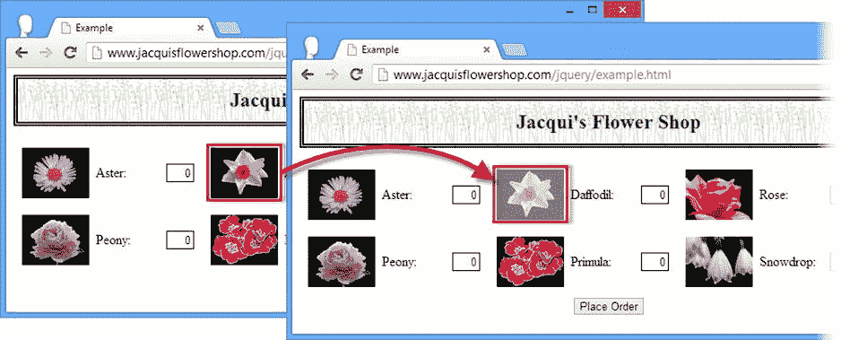

# 五、jQuery 基础知识

在这一章中，我将向你介绍你的第一个 jQuery 脚本。这个脚本很简单，但是它演示了 jQuery 的许多最重要的特性，包括如何在文档中选择元素、如何向您呈现这些选择，以及 jQuery 和内置 DOM API(HTML 规范的一部分)之间的关系的本质。表 5-1 对本章进行了总结。

表 5-1 。章节总结

| 问题 | 解决办法 | 列表 |
| --- | --- | --- |
| 将 jQuery 添加到 HTML 文档。 | 使用`link`元素导入 jQuery 元素，链接到您的 web 服务器或 CDN。添加一个`script`元素来定义您的 jQuery 脚本。 | one |
| 动态选择 jQuery 1.x 或 2.x 行。 | 使用条件注释。 | Two |
| 选择文档中的元素。 | 将 CSS 选择器传递给`$`或`jQuery`函数。 | 3, 4, 10 |
| 重命名`$`功能。 | 使用`noConflict`方法。 | 5, 6 |
| 推迟 jQuery 脚本的执行，直到文档加载完毕。 | 在全局`document`变量上注册一个`ready`事件的处理程序，或者将一个函数传递给`$`函数。 | 7, 8 |
| 控制何时触发就绪事件。 | 使用`holdReady`事件。 | nine |
| 将元素选择限制在文档的一部分。 | 将上下文传递给`$`函数。 | 11, 12 |
| 确定用于创建`jQuery`对象的上下文。 | 读取`context`属性。 | Thirteen |
| 从`HTMLElement`对象创建一个`jQuery`对象。 | 将`HTMLElement`对象作为参数传递给`$`函数。 | Fourteen |
| 枚举一个`jQuery`对象的内容。 | 将`jQuery`对象视为数组或使用`each`方法。 | 15, 16 |
| 在`jQuery`元素中查找特定元素。 | 使用`index`或`get`方法。 | 17–19 |
| 对文档中的多个元素应用操作。 | 在`jQuery`对象上使用 jQuery 方法。 | Twenty |
| 对一个`jQuery`对象应用多个操作。 | 将方法调用链接在一起。 | 21–23 |
| 处理一个事件。 | 使用 jQuery 事件处理程序方法之一。 | Twenty-four |

JQUERY 自上一版以来发生了变化

在本书的第一版中，我描述了如何使用 `selector`属性从 jQuery 中获取一个选择器字符串，该字符串可用于将来的重复查询。从 jQuery 1.9 开始，`selector`属性已经被弃用，不应该再使用。

jQuery 1.9/2.0 使用的选择器引擎(称为 *Sizzle* )实现了对一些新的 CSS3 选择器的支持，即使在不支持它们的浏览器中。选择器有:`:nth-last-child`、`:nth-of-type`、`:nth-last-of-type`、`:first-of-type`、`:last-of-type`、`:only-of-type`、`:target`、`:root`和`:lang.`

设置 jQuery

对于 jQuery，您需要做的第一件事是将它添加到想要处理的文档中。清单 5-1 显示了您在第一部分中第一次看到的花店示例文档，添加了 jQuery 库。

***清单 5-1*** 。花店示例文档

```js
<!DOCTYPE html>
<html>
<head>
    <title>Example</title>
    <link rel="stylesheet" type="text/css" href="styles.css"/>
    <script src="jquery-2.0.2.js" type="text/javascript"></script>
</head>
<body>
    <h1>Jacqui's Flower Shop</h1>
    <form method="post">
        <div id="oblock">
            <div class="dtable">
                <div id="row1" class="drow">
                    <div class="dcell">
                        <label for="aster">Aster:</label>
                        <input name="aster" value="0" required>
                    </div>
                    <div class="dcell">
                        <label for="daffodil">Daffodil:</label>
                        <input name="daffodil" value="0" required >
                    </div>
                    <div class="dcell">
                        <label for="rose">Rose:</label>
                        <input name="rose" value="0" required>
                    </div>
                </div>
                <div id="row2" class="drow">
                    <div class="dcell">
                        <label for="peony">Peony:</label>
                        <input name="peony" value="0" required>
                    </div>
                    <div class="dcell">
                        <label for="primula">Primula:</label>
                        <input name="primula" value="0" required>
                    </div>
                    <div class="dcell">
                        <label for="snowdrop">Snowdrop:</label>
                        <input name="snowdrop" value="0" required>
                    </div>
                </div>
            </div>
        </div>
        <div id="buttonDiv"><button type="submit">Place Order</button></div>
    </form>
</body>
</html>
```

为了帮助保持对内容的关注，我将 CSS 样式移到了一个单独的样式表中，名为 `styles.css`，如第三章所示。您可以看到我是如何将 jQuery 库添加到文档的，如下所示:

```js
...
<script src="jquery-2.0.2.js" type="text/javascript"></script>
...
```

一旦您选择了将要使用的 jQuery 行(1.x 或 2.x 行，如第三章中的所述)，您将从`jquery.com`中选择两个文件——一个文件扩展名为`.js`，另一个文件扩展名为`.min.js`。对于我写这篇文章时的 2.x 行版本，这些文件被称为`jquery-2.0.2.js`和`jquery-2.0.2.min.js`。

`jquery-2.0.2.js`文件是在网站或应用开发过程中通常使用的文件。这个文件大约 240KB，是标准的 JavaScript 代码。您可以打开并阅读该文件，了解 jQuery 是如何实现其特性的，并在代码中遇到问题时使用浏览器调试器来找出问题所在。

提示 jQuery 正在积极开发中，所以当你读到这篇文章时，一个更新的版本几乎肯定已经发布了。但是不要担心——尽管有很多不推荐的方法和分裂的开发路线，jQuery API 非常稳定，并且随着 jQuery 1.x 和 2.x 的不断成熟，我在本书中展示的所有技术都将继续发挥作用。

另一个文件`jquery.2.0.2.min.js`，是为用户部署站点或 web 应用时使用的。它包含相同的 JavaScript 代码，但是被*缩减为*，这意味着所有的空白字符都被删除，有意义的变量名被替换为单字符名称以节省空间。为了调试的目的，缩小的脚本几乎无法阅读，但是它要小得多。缩小过程将文件大小减少到大约 82KB，如果您提供大量依赖 jQuery 的页面，那么这种差异可以为您节省大量带宽。

 **提示**你可以从`jquery.com`下载一个源地图(扩展名为`.min.map`)。源代码映射允许简化的代码更容易调试。它们是一个新的想法，在我写这篇文章的时候还没有被广泛实现。你可以在`http://www.html5rocks.com/en/tutorials/developertools/sourcemaps`看到一个简单的演示。

为 JQUERY 使用 CDN

将 jQuery 库存储在您自己的 web 服务器上的另一种方法是使用一个托管 jQuery 的公共 *内容交付网络* (CDN) 。CDN 是一个由服务器组成的分布式网络，使用离用户最近的服务器向用户交付文件。使用 CDN 有几个好处。首先是用户体验更快，因为 jQuery 库文件是从离他们最近的服务器上下载的，而不是从您的服务器上。通常根本不需要下载:jQuery 如此受欢迎，以至于用户的浏览器可能已经从另一个使用 jQuery 的应用或网站缓存了这个库。第二个好处是没有任何带宽用于向用户交付 jQuery。对于高流量的网站来说，这可以节省大量的成本。

使用 CDN 的时候，一定要对 CDN 运营商有信心。您希望确保用户收到他们应该收到的文件，并且服务将始终可用。谷歌和微软都免费为 jQuery(以及其他流行的 JavaScript 库)提供 CDN 服务。两家公司都有运行高可用性服务的良好经验，不太可能故意篡改 jQuery 库。你可以在`www.asp.net/ajaxlibrary/cdn.ashx`了解微软服务，在`http://code.google.com/apis/libraries/devguide.html`了解谷歌服务。

CDN 方法不适合在内部网中交付给用户的应用，因为它会导致所有浏览器都通过互联网来获取 jQuery 库，而不是访问本地服务器，后者通常更近、更快、带宽成本更低。

使用条件注释

在清单 5-1 中，我只包含了版本 2.0.2 的 jQuery 库。这个版本提供了最好的性能，但它不支持旧版本的 Internet Explorer，如第一章所述。

好消息是，您不必在性能和兼容性之间做出选择。有一种技术可以自动在 1.x 和 2.x jQuery 库之间进行动态选择，使用一种称为*条件注释*的功能，这是微软为 Internet Explorer 5 创建的 HTML 的非标准增强。在清单 5-2 中，您可以看到我是如何将条件注释特性应用到示例 HTML 文档中的。

***清单 5-2*** 。使用条件注释在 jQuery 1.x 和 2.x 之间进行动态选择

```js
...
<head>
    <title>Example</title>
    <link rel="stylesheet" type="text/css" href="styles.css"/>
    <!--[if lt IE 9]>
        <script src="jquery-1.10.1.js" type="text/javascript"></script>
    <![endif]-->
    <!--[if gte IE 9]><!-->
        <script src="jquery-2.0.2.js" type="text/javascript"></script>
    <!--<![endif]-->
</head>
...
```

条件注释将为 Internet Explorer 9 之前的版本加载 jQuery 1.10.1，为所有其他浏览器加载 jQuery 2.0.2。你应该注意准确地复制这些评论——很容易出错。

 **提示**我不打算在本书中深入讨论条件注释，但你可以在`http://en.wikipedia.org/wiki/Conditional_comment`了解更多。

第一个 jQuery 脚本

现在我已经将 jQuery 库添加到了文档中，我可以编写一些使用 jQuery 功能的 JavaScript 了。清单 5-3 包含一个简单的`script`元素，展示了一些基本的 jQuery 特性。

清单 5-3 。第一个 jQuery 脚本

```js
<!DOCTYPE html>
<html>
<head>
    <title>Example</title>
    <link rel="stylesheet" type="text/css" href="styles.css"/>
    <script src="jquery-2.0.2.js" type="text/javascript"></script>
    <script type="text/javascript">
        $(document).ready(function () {
            $("img:odd").mouseenter(function (e) {
                $(this).css("opacity", 0.5);
            }).mouseout(function (e) {
                $(this).css("opacity", 1.0);
            });
        });
    </script>
</head>
<body>
    <h1>Jacqui's Flower Shop</h1>
    <form method="post">
        <div id="oblock">
            <div class="dtable">
                <div id="row1" class="drow">
                    <div class="dcell">
                        <label for="aster">Aster:</label>
                        <input name="aster" value="0" required>
                    </div>
                    <div class="dcell">
                        <label for="daffodil">Daffodil:</label>
                        <input name="daffodil" value="0" required >
                    </div>
                    <div class="dcell">
                        <label for="rose">Rose:</label>
                        <input name="rose" value="0" required>
                    </div>
                </div>
                <div id="row2" class="drow">
                    <div class="dcell">
                        <label for="peony">Peony:</label>
                        <input name="peony" value="0" required>
                    </div>
                    <div class="dcell">
                        <label for="primula">Primula:</label>
                        <input name="primula" value="0" required>
                    </div>
                    <div class="dcell">
                        <label for="snowdrop">Snowdrop:</label>
                        <input name="snowdrop" value="0" required>
                    </div>
                </div>
            </div>
        </div>
        <div id="buttonDiv"><button type="submit">Place Order</button></div>
    </form>
</body>
</html>
```

这是一个简短的脚本，但是它展示了 jQuery 的一些最重要的特性和特征。在这一章中，我将一行一行地分解这个脚本，但是这本书的其余部分将会让你完全理解这个脚本所涉及的所有功能领域。首先，图 5-1 显示了这个脚本创建的效果。



图 5-1 。更改图像不透明度

 **提示**您会注意到，我已经在清单中返回到了 jQuery 2.0.2 的显式使用——我将在本书的其余大部分中这样做。我想让例子简单明了，但是我建议您使用条件注释技术，我发现这在我自己的项目中很有用。

当鼠标移动到水仙花、牡丹和雪花莲图像上时，该脚本会改变它们的不透明度。这具有使图像看起来更亮和褪色的效果。当鼠标离开图像时，不透明度会恢复到其先前的值。紫菀、玫瑰和报春花的图像不受影响。

了解 jQuery $函数

您可以通过`$(...)`函数访问 jQuery，为了简单起见，我将它称为 *$函数*。`$`函数是 jQuery 奇妙世界的入口点，也是`jQuery`函数的简写。如果您愿意，您可以重写示例脚本以使用完整的函数名，如清单 5-4 所示。

***清单 5-4*** 。使用 jQuery 函数代替简写

```js
...
<script type="text/javascript">
    jQuery(document).ready(function () {
        jQuery("img:odd").mouseenter(function(e) {
           jQuery(this).css("opacity", 0.5);
        }).mouseout(function(e) {
           jQuery(this).css("opacity", 1.0);
        });
    });
</script>
...
```

该脚本提供了与上一个示例相同的功能。它需要的输入稍微多一点，但是它的优点是可以显式地使用 jQuery。

这可能很有用，因为 jQuery 不是唯一使用`$`符号的 JavaScript 库，当您在同一个文档中使用多个库时，这可能会导致问题。您可以通过调用`jQuery.noConflict`方法让 jQuery 放弃对`$`的控制，如清单 5-5 中的所示。

***清单 5-5*** 。释放 jQuery 对$的控制

```js
...
<script type="text/javascript">
    jQuery.noConflict();
    jQuery(document).ready(function () {
        jQuery("img:odd").mouseenter(function(e) {
           jQuery(this).css("opacity", 0.5);
        }).mouseout(function(e) {
           jQuery(this).css("opacity", 1.0);
        });
    });
</script>
...
```

您也可以定义自己的速记符号。你可以通过将`noConflict`方法的结果赋给一个变量来实现，如清单 5-6 所示。

***清单 5-6*** 。使用另一种速记法

```js
...
<script type="text/javascript">
    var jq = jQuery.noConflict();
    jq(document).ready(function () {
        jq("img:odd").mouseenter(function(e) {
           jq(this).css("opacity", 0.5);
        }).mouseout(function(e) {
           jq(this).css("opacity", 1.0);
        });
    });
</script>
...
```

在这个例子中，我创建了自己的速记，`jq`，然后在我的脚本的其余部分使用这个速记。

 **提示**我将在本书中通篇使用`$`符号，因为这是 jQuery 的常规约定(也因为我不会使用任何其他想要控制`$`的库)。

不管你如何引用主`jQuery`函数，你都可以传递相同的一组参数，其中最重要的我已经在表 5-2 中描述过了。所有这些论点都将在本章后面描述，除了最后一个，它将在第七章中描述。

表 5-2 。主 jQuery 函数的参数

| 争吵 | 描述 |
| --- | --- |
| `$(function)` | 指定当 DOM 准备好时要执行的函数。 |
| `$(selector) $(selector, context)` | 从文档中选择元素。 |
| `$(HTMLElement) $(HTMLElement[])` | 从一个`HTMLElement`或一组`HTMLElement`对象创建一个 jQuery 对象。 |
| `$()` | 创建一个空选择。 |
| `$(HTML) $(HTML, map)` | 使用可选的 map 对象从 HTML 片段创建新元素来定义属性。详见第七章。 |

等待文档对象模型

在第二章的中，我将`script`元素放在了文档的末尾，这样浏览器在执行我的 JavaScript 代码之前就会在 DOM 中创建所有的对象。通过使用 jQuery，通过使用下面的技术，您可以巧妙地避免这个问题:

```js
...
<script type="text/javascript">
    $(document).ready(function () {
        // ...
*code to execute*...
    });
</script>
...
```

我没有将 JavaScript 语句直接放在`script`元素中，而是将`document`对象(我在《??》第一章中介绍过)传递给了`$`函数，并调用了`ready`方法，传递了一个我希望只有当浏览器加载完 HTML 文档中的所有内容时才执行的函数。清单 5-7 显示了我如何在示例 HTML 文档中应用这一技术。

***清单 5-7*** 。等待 DOM

```js
...
<script type="text/javascript">
    $(document).ready(function () {
        $("img:odd").mouseenter(function (e) {
            $(this).css("opacity", 0.5);
        }).mouseout(function (e) {
            $(this).css("opacity", 1.0);
        });
    });
</script>
...
```

使用 `ready`函数意味着我可以将`script`元素放在 HTML 文档中我想要的任何地方，因为 jQuery 会防止函数过早执行。我喜欢把我的`script`元素放在 HTML 文档的`head`元素中，但这只是我的偏好。

 **注意**向`ready`方法传递一个`function`会为 jQuery `ready`事件创建一个处理程序。我在第九章中全面介绍了 jQuery 事件。目前，请接受这样的事实:当文档被加载并且 DOM 准备好可以使用时，您传递给`ready`方法的`function`将被调用。

忘记功能

一个常见的错误是省略这个咒语的`function`部分，只将一系列 JavaScript 语句传递给`ready`方法。这是行不通的，浏览器会立即执行这些语句，而不是在 DOM 准备好的时候。考虑以下脚本:

```js
...
<script type="text/javascript">
    function countImgElements() {
        return $("img").length;
    }
    $(document).ready(function() {
      console.log("Ready function invoked. IMG count: " + countImgElements());
    });
    $(document).ready(
      console.log("Ready statement invoked. IMG count: " + countImgElements())
    );
</script>
```

我调用了两次`ready`方法，一次用了一个`function`，另一次只是传入了一个常规的 JavaScript 语句。在这两种情况下，我都调用了 `countImgElements`函数，该函数返回 DOM 中存在的`img`元素的数量。(暂时不要担心这个方法如何运作。我将在本章后面解释对`length`属性的调用。)当我加载文档时，脚本被执行，以下输出被写入控制台:

`Ready statement invoked. IMG count: 0`


正如您所看到的，在加载文档时，在浏览器发现文档中的`img`元素并创建相应的 DOM 对象之前，执行没有函数的语句。

使用替代符号

如果愿意，可以将函数作为参数传递给 jQuery `$`函数。这与使用`$(document).ready`方法具有相同的效果。清单 5-8 提供了一个演示。

清单 5-8 。推迟函数的执行，直到 DOM 准备好

```js
...
<script type="text/javascript">
    $(function() {
        $("img:odd").mouseenter(function(e) {
           $(this).css("opacity", 0.5);
        }).mouseout(function(e) {
           $(this).css("opacity", 1.0);
        })
    });
</script>
...
```

推迟就绪事件

您可以通过使用`holdReady`方法来控制何时触发`ready`事件。如果您需要动态加载外部资源(一种不常见的高级技术)，这可能会很有用。在触发`ready`事件之前，必须调用`holdReady`方法，当您准备好时，可以再次调用该方法。清单 5-9 给出了一个使用这种方法的例子。

***清单 5-9*** 。使用保持就绪方法

```js
...
<script type="text/javascript">

    $.holdReady(true);

    $(document).ready(function() {
        console.log("Ready event triggered");
        $("img:odd").mouseenter(function(e) {
           $(this).css("opacity", 0.5);
        }).mouseout(function(e) {
           $(this).css("opacity", 1.0);
        })
    });

    setTimeout(function() {
        console.log("Releasing hold");
        $.holdReady(false);
    }, 5000);

</script>
...
```

我在`script`元素的开头调用了`holdReady`方法，传入`true`作为参数，表示我希望举行`ready`事件。然后我定义了当`ready`事件被触发时我希望被调用的函数(这是我打开这一章时使用的同一套语句，它改变了一些图像的不透明度)。

最后，我使用`setTimeout`方法在五秒钟后调用一个函数。这个函数调用带有参数`false`的`holdReady`方法，它告诉 jQuery 触发`ready`事件。最终结果是我将`ready`事件延迟了五秒钟。我添加了一些调试消息，当文档加载到浏览器中时，这些消息会将以下输出写入控制台:

```js
Releasing hold
Ready event triggered
```

 **提示**你可以多次调用`holdReady`方法，但是在`ready`事件被触发之前，带有`true`参数的`holdReady`方法的调用次数必须与带有`false`参数的调用次数相等。

选择元素

jQuery 功能最重要的一个方面是如何从 DOM 中选择元素。在示例脚本中，我定位了所有的*奇数* `img`元素，如清单 5-10 中的所示。

清单 5-10 。从 DOM 中选择元素

```js
...
<script type="text/javascript">
    $(document).ready(function() {
        $("img:odd").mouseenter(function(e) {
           $(this).css("opacity", 0.5);
        }).mouseout(function(e) {
           $(this).css("opacity", 1.0);
        })
    });
</script>
...
```

要选择元素，只需将选择器传递给`$`函数。jQuery 支持我在第三章中描述的所有 CSS 选择器，加上一些额外的选择器，这些选择器给你一些方便的细粒度控制。在这个例子中，我使用了`:odd`伪选择器，它选择与选择器主要部分匹配的奇数元素(在这个例子中是`img`，它选择所有的`img`元素，如第三章所述)。`:odd`选择器是从零开始的，这意味着第一个元素被认为是偶数。一开始可能会有点困惑。表 5-3 列出了最有用的 jQuery 选择器。

表 5-3 。jQuery 扩展选择器

| 选择器 | 描述 |
| --- | --- |
| `:animated` | 选择所有正在制作动画的元素。 |
| `:contains(text)` | 选择包含指定文本的元素。 |
| `:eq(n)` | 选择第`n`个索引处的元素(从零开始)。 |
| `:even` | 选择所有事件编号的元素(从零开始)。 |
| `:first` | 选择第一个匹配的元素。 |
| `:gt(n)` | 选择索引大于`n`(从零开始)的所有元素。 |
| `:has(selector)` | 选择至少包含一个与指定选择器匹配的元素的元素。 |
| `:last` | 选择最后匹配的元素。 |
| `:lt(n)` | 选择索引小于`n`(从零开始)的所有元素。 |
| `:odd` | 选择所有奇数元素(从零开始)。 |
| `:text` | 选择所有文本元素。 |

 **提示**你可以通过调用不带任何参数的`$`函数(`$()`)来创建一个空的选择。我提到这一点是为了完整性，但这并不是我曾经有理由使用的一个特性。

我称之为最有用的，因为它们定义了使用 CSS 选择器很难重新创建的功能。这些选择器就像 CSS 伪选择器一样使用。它们可以单独使用，在这种情况下，它们应用于 DOM 中的所有元素，如下所示:

```js
...
$(":even")
...
```

或者与其他选择器组合以缩小选择范围，如下所示:

```js
...
$("img:even")
...
```

jQuery 还定义了基于类型选择元素的选择器，如表 5-4 所述。

表 5-4 。jQuery 类型扩展选择器

| 选择器 | 描述 |
| --- | --- |
| `:button` | 选择所有按钮。 |
| `:checkbox` | 选中所有复选框。 |
| `:file` | 选择所有文件元素。 |
| `:header` | 选择所有标题元素(`h1`、`h2`等)。 |
| `:hidden` | 选择所有隐藏元素。 |
| `:image` | 选择所有图像元素。 |
| `:input` | 选择所有输入元素。 |
| `:last` | 选择最后匹配的元素。 |
| `:parent` | 选择其他元素的所有父元素。 |
| `:password` | 选择所有密码元素。 |
| `:radio` | 选择所有单选按钮。 |
| `:reset` | 选择重置表单的所有元素。 |
| `:selected` | 选择所有选定的元素。 |
| `:submit` | 选择所有表单提交元素。 |
| `:visible` | 选择所有可见元素。 |

考虑选择器性能

如果您花时间阅读 jQuery，您肯定会遇到关于选择器性能的讨论。许多人花费大量时间比较不同的选择器表达方式，以最大限度地发挥 jQuery 的性能。

我的观点很简单:这不应该有关系——如果有关系，那就是其他问题的迹象。jQuery 的性能非常好，尤其是在最新版本的主流浏览器上，这些浏览器具有快速的 JavaScript 实现。当我看到项目团队试图优化选择器性能时，通常是因为他们正在处理大量的 HTML 元素，在这些元素中，执行一个选择需要数百毫秒——当执行一个操作需要几个这样的选择时，我们开始进入用户注意到的延迟长度。

真正的问题不是 jQuery——而是向浏览器发送的内容超出了合理预期的范围。浏览器的功能越来越强大，但是它们的功能是有限的，尤其是老版本的浏览器和运行在移动设备上的浏览器。

如果你发现自己很难足够快地选择元素，不要试图优化选择器的使用。相反，重新考虑你对 HTML 元素的使用:想办法尽量减少发送到浏览器的内容，在服务器上承担一些处理工作，不要把 web 应用当作桌面应用。

用上下文缩小选择范围

默认情况下，jQuery 在整个 DOM 中搜索元素，但是您可以通过向`$`函数提供一个额外的参数来缩小选择范围。这给了搜索一个*上下文*，它被用作匹配元素的起点，如清单 5-11 所示。

清单 5-11 。使用上下文缩小搜索范围

```js
...
<script type="text/javascript">
    $(document).ready(function() {

        $("img:odd",$(".drow")).mouseenter(function(e) {
           $(this).css("opacity", 0.5);
        }).mouseout(function(e) {
           $(this).css("opacity", 1.0);
        })
    });
</script>
...
```

在这个例子中，我使用一个 jQuery 选择作为另一个的上下文。首先评估上下文，它匹配所有属于`drow`类的元素。这组元素然后被用作`img:odd`选择器的上下文。

当您提供包含多个元素的上下文时，每个元素都被用作搜索的起点。这种方法有一个有趣的微妙之处。匹配上下文的元素被收集在一起，然后执行主选择。在本例中，这意味着`img:odd`选择器应用于`drow`选择器的结果，这意味着奇数编号的元素与搜索整个文档时的元素不同。最终结果是不透明效果被应用到`drow`类的每个`div`元素中奇数编号的`img`元素，选择水仙花和报春花图像。当我在前面的例子中省略上下文时，效果被应用到水仙花、牡丹和雪花莲图像上。

如果您只想匹配文档中从给定点开始的元素，那么您可以使用一个`HTMLElement`对象作为上下文。清单 5-12 包含了一个例子。在下一节中，我将向您展示如何在 jQuery 世界和`HTMLElement`对象之间轻松切换。

***清单 5-12*** 。使用 HTMLElement 作为上下文

```js
...
<script type="text/javascript">
    $(document).ready(function() {
        var elem = document.getElementById("oblock");

        $("img:odd",elem).mouseenter(function(e) {
           $(this).css("opacity", 0.5);
        }).mouseout(function(e) {
           $(this).css("opacity", 1.0);
        })
    });
</script>
...
```

本例中的脚本搜索奇数编号的`img`元素，将搜索限制在那些从`id`为`oblock`的元素派生的元素。

当然，使用后代 CSS 选择器也可以达到同样的效果。当您希望以编程方式缩小搜索范围，而不必构造选择器字符串时，这种方法的好处就显现出来了。这种情况的一个很好的例子是在处理事件时。你可以在第九章的中了解更多关于事件的信息(并看看`HTMLElement`物体在这种情况下是如何出现的)。

了解选择结果

当您使用 jQuery 从 DOM 中选择元素时，`$`函数的结果是一个容易混淆的名称为`jQuery`的对象，它表示零个或多个 DOM 元素。事实上，当您执行一个修改一个或多个元素的 jQuery 操作时，结果很可能是一个`jQuery`对象，这是一个重要的特征，我将很快返回。

由 jQuery 对象定义的方法和属性基本上是本书其余部分的内容，但我可以在本章中介绍一些基本成员，如表 5-5 中所述。

表 5-5 。基本 jQuery 对象成员

| 选择器 | 描述 | 返回 |
| --- | --- | --- |
| `context` | 返回用作搜索上下文的元素集。 | `HTMLElement` |
| `each(function)` | 对每个选定的元素执行该功能。 | `jQuery` |
| `get(index)` | 获取指定索引处的`HTMLElement`对象。 | `HTMLElement` |
| `index(HTMLElement)` | 返回指定`HTMLElement.`的索引 | `number` |
| `index(jQuery)` | 返回`jQuery`对象中第一个元素的索引。 | `number` |
| `index(selector)` | 返回选择器匹配的元素集中第一个元素在`jQuery`对象中的索引 | `number` |
| `length` | 返回`jQuery`对象包含的元素数量。 | `number` |
| `size()` | 返回`jQuery`对象中元素的数量。 | `number` |
| `toArray()` | 以数组形式返回由`jQuery`对象包含的`HTMLElement`对象。 | `HTMLElement[]` |

确定上下文

context 属性提供了创建 jQuery 时使用的上下文的详细信息。如果单个`HTMLElement`对象被用作上下文，那么 context 属性将返回那个`HTMLElement`。如果没有使用上下文或者使用了多个元素(如我在本章前面使用的例子)，那么上下文属性返回`undefined`。清单 5-13 展示了这个属性的使用。

***清单 5-13*** 。确定 jQuery 对象的上下文

```js
...
<script type="text/javascript">
    $(document).ready(function() {
        var jq1 = $("img:odd");
        console.log("No context: " +jq1.context.tagName);

        var jq2 = $("img:odd", $(".drow"));
        console.log("Multiple context elements: " +jq2.context.tagName);

        var jq3 = $("img:odd", document.getElementById("oblock"));
        console.log("Single context element: " +jq3.context.tagName);
    });
</script>
...
```

该脚本选择不使用上下文、多个上下文对象和单个上下文对象的元素。输出如下所示:

```js
No context: undefined
Multiple context elements: undefined
Single context element: DIV
```

处理 DOM 对象

jQuery 并没有取代 DOM 这让工作变得容易多了。还在使用`HTMLElement`对象(我在第二章中介绍过)，jQuery 库使得在`jQuery`对象和 DOM 对象之间切换变得很容易。您可以轻松地从传统的 DOM 迁移到 jQuery，这是 jQuery 优雅的一部分，有助于保持与非 jQuery 脚本和库的兼容性。

从 DOM 对象创建 jQuery 对象

您可以通过将一个`HTMLElement`对象或一组`HTMLElement`对象作为参数传递给`$`函数来创建`jQuery`对象。这在处理不是用 jQuery 编写的 JavaScript 代码时，或者在 jQuery 公开底层 DOM 对象的情况下，比如事件处理，会很有用。清单 5-14 包含了一个例子。

***清单 5-14*** 。从 DOM 对象创建 jQuery 对象

```js
...
<script type="text/javascript">
    $(document).ready(function() {

        var elems = document.getElementsByTagName("img");

        $(elems).mouseenter(function(e) {
           $(this).css("opacity", 0.5);
        }).mouseout(function(e) {
           $(this).css("opacity", 1.0);
        })
    });
</script>
...
```

在这个例子中，我使用`document.getElementsByTagName`方法选择文档中的`img`元素，而不是直接使用带有选择器的 jQuery。我将这个方法的结果(它是一个`HTMLElement`对象的集合)传递给`$`函数，该函数返回一个常规的`jQuery`对象，我可以像前面的例子一样使用它。

这个脚本还演示了如何从单个`HTMLElement`对象创建一个 jQuery 对象:

```js
...
$(this).css("opacity", 1.0);
...
```

当您处理事件时，jQuery 将变量`this`的值设置为正在处理事件的`HTMLElement`。我在第九章中描述了 jQuery 事件支持，所以我不想在本章深入讨论这个主题(尽管我在本章稍后会再次提到包含这些语句的函数)。

将 jQuery 对象视为数组

您可以将一个`jQuery`对象视为一组`HTMLElement`对象。这意味着您可以使用 jQuery 提供的高级特性，但仍然可以直接访问 DOM。您可以使用`length`属性或`size`方法来确定在`jQuery`对象中收集了多少元素，并通过使用数组样式的索引(使用`[`和`]`括号)来访问单个 DOM 对象。

 **提示**你可以使用`toArray`方法从`jQuery`对象中提取`HTMLElement`对象作为数组。我喜欢使用`jQuery`对象本身，但有时使用 DOM 对象也很有用，比如在处理不是用 jQuery 编写的遗留代码时。

清单 5-15 展示了如何枚举一个 jQuery 对象的内容来访问其中包含的`HTMLElement`对象。

***清单 5-15*** 。将 jQuery 对象视为数组

```js
...
<script type="text/javascript">
    $(document).ready(function() {
        var elems = $("img:odd");
        for (var i = 0; i < elems.length; i++) {
            console.log("Element: " + elems[i].tagName + " " + elems[i].src);
        }
    });
</script>
...
```

在清单中，我使用`$`函数选择奇数编号的`img`元素，并枚举所选元素以将`tagName`和`src`属性的值打印到控制台。结果如下:

```js
Element: IMGhttp://www.jacquisflowershop.com/jquery/daffodil.png
Element: IMGhttp://www.jacquisflowershop.com/jquery/peony.png
Element: IMGhttp://www.jacquisflowershop.com/jquery/snowdrop.png
```

在 DOM 对象上迭代一个函数

`each`方法允许您为 jQuery 对象中的每个 DOM 对象定义一个函数。清单 5-16 给出了一个演示。

***清单 5-16*** 。使用 each 方法

```js
...
<script type="text/javascript">
    $(document).ready(function() {
        $("img:odd").each(function(index, elem) {
            console.log("Element: " + elem.tagName + " " + elem.src);
        });
    });
</script>
...
```

jQuery 向指定的函数传递两个参数。第一个是集合中元素的索引，第二个是元素对象本身。在本例中，我将标记名和`src`属性的值写入控制台，产生与前面脚本相同的结果:

```js
Element: IMGhttp://www.jacquisflowershop.com/jquery/daffodil.png
Element: IMGhttp://www.jacquisflowershop.com/jquery/peony.png
Element: IMGhttp://www.jacquisflowershop.com/jquery/snowdrop.png
```

查找索引和特定元素

`index`方法允许您在 jQuery 对象中查找`HTMLElement`的索引。您可以使用`HTMLElement`或`jQuery`对象作为参数来传递您想要的索引。当您使用一个`jQuery`对象时，第一个匹配的元素是其索引被返回的元素。清单 5-17 给出了一个演示。

***清单 5-17*** 。定位 HTMLElement 的索引

```js
...
<script type="text/javascript">
    $(document).ready(function() {

        var elems = $("body *");

        // find an index using the basic DOM API
        var index = elems.index(document.getElementById("oblock"));
        console.log("Index using DOM element is: " + index);

        // find an index using another jQuery object
        index = elems.index($("#oblock"));
        console.log("Index using jQuery object is: " + index);
    });
</script>
...
```

在这个例子中，我使用 DOM API 的`getElementById`方法找到一个方法，通过`id`属性值找到一个`div`元素。这将返回一个`HTMLElement`对象。然后我在一个`jQuery`对象上使用`index`方法来查找代表`div`元素的对象的索引。我使用一个通过`$`函数获得的`jQuery`对象重复这个过程。我将两种方法的结果写入控制台，控制台产生以下结果:

```js
Index using DOM element is: 2
Index using jQuery object is: 2
```

您也可以将一个`string`传递给`index`方法。当你这样做的时候，`string`被解释为一个选择器。然而，这种方法导致`index`方法的行为方式与前面的例子不同。清单 5-18 提供了一个演示。

***清单 5-18*** 。使用索引方法的选择器版本

```js
...
<script type="text/javascript">
    $(document).ready(function() {

        var imgElems = $("img:odd");
        // find an index using a selector
        index = imgElems.index("body *");
        console.log("Index using selector is: " + index);

        // perform the same task using a jQuery object
        index = $("body *").index(imgElems);
        console.log("Index using jQuery object is: " + index);

    });
</script>
...
```

当您将一个`string`传递给`index`方法时，元素集合的使用顺序会改变。jQuery 使用选择器匹配元素，然后返回 jQuery 对象中第一个元素的匹配元素的索引，在该 jQuery 对象上调用了 index 方法。这意味着这种说法:

```js
...
index = imgElems.index("body *");
...
```

相当于这个语句:

```js
...
index = $("body *").index(imgElems);
...
```

本质上，传递字符串参数颠倒了两组元素的考虑方式。该列表产生以下结果:

```js
Index using selector is: 10
Index using jQuery object is: 10
```

 **提示**我们可以使用没有参数的`index`方法来获得一个元素相对于它的兄弟元素的位置。这在使用 jQuery 探索 DOM 时会很有用，这是《??》第七章的主题。

`get`方法是对`index`方法的补充，这样您可以指定一个索引并在 jQuery 对象中的该位置接收`HTMLElement`对象。这与我在本章前面描述的使用数组风格的索引有相同的效果。清单 5-19 提供了一个演示。

***清单 5-19*** 。获取给定索引处的 HTMLElement 对象

```js
...
<script type="text/javascript">
    $(document).ready(function() {
        var elem = $("img:odd").get(1);
        console.log("Element: " + elem.tagName + " " + elem.src);
    });
</script>
...
```

在这个脚本中，我选择奇数编号的`img`元素，使用`get`方法检索索引 1 处的`HTMLElement`对象，并将`tagName`和`src`属性的值写入控制台。该脚本的输出如下:

```js
Element: IMGhttp://www.jacquisflowershop.com/jquery/peony.png
```

修改多个元素和链接方法调用

jQuery 如此简洁和富有表现力的一个特性是，调用一个`jQuery`对象上的方法通常会修改该对象包含的所有元素。我说*通常是*，因为有些方法执行不适用于多个元素的操作，你会在后面的章节看到这样的例子。清单 5-20 展示了如何使用 DOM API 对多个元素执行操作。

清单 5-20 。使用 DOM API 对多个元素进行操作

```js
...
<script type="text/javascript">
    $(document).ready(function() {

        var labelElems = document.getElementsByTagName("label");
        for (var i = 0; i < labelElems.length; i++) {
            labelElems[i].style.color = "blue";
        }
    });
</script>
...
```

`script`元素中的语句选择所有的`label`元素，并将 CSS `color`属性的值设置为`blue`。清单 5-21 展示了如何使用 jQuery 执行同样的任务。

***清单 5-21*** 。使用 jQuery 对多个元素进行操作

```js
...
<script type="text/javascript">
    $(document).ready(function () {
        $("label").css("color", "blue");
    });
</script>
...
```

我可以使用一条 jQuery 语句来执行这项任务，这比使用 DOM API 要简单得多——我承认这不是一个很大的区别，但是它可以安装在一个复杂的 web 应用中。jQuery 语句也更容易阅读和理解，这有助于 JavaScript 代码的长期维护。

对象的另一个很好的特性是它实现了一个流畅的 API ??。这意味着无论何时调用修改对象内容的方法，该方法的结果都是另一个 jQuery 对象。这看起来很简单，但是它允许你执行方法链接，如清单 5-22 所示。

***清单 5-22*** 。jQuery 对象上的方法链接方法调用

```js
...
<script type="text/javascript">
    $(document).ready(function() {

        $("label").css("color", "blue").css("font-size", ".75em");

        var labelElems = document.getElementsByTagName("label");
        for (var i = 0; i < labelElems.length; i++) {
            labelElems[i].style.color = "blue";
            labelElems[i].style.fontSize = ".75em";
        }
    });
</script>
...
```

在这个例子中，我使用`$`函数创建一个 jQuery 对象，调用`css`方法为`color`属性设置一个值，然后再次调用`css`方法，这次是为了设置`font-size`属性。我还展示了使用基本 DOM API 的等效添加。您可以看到，要达到同样的效果并不需要太多的工作，因为您已经有了一个`for`循环来枚举所选的元素。

当链接方法对包含在`jQuery`对象中的元素集进行更大的改变时，您开始从 fluent API 中获得真正的好处。清单 5-23 提供了一个演示。

***清单 5-23*** 。一个更复杂的链接示例

```js
...
<script type="text/javascript">
    $(document).ready(function() {

        $("label").css("color", "blue").add("input[name!='rose']")
                    .filter("[for!='snowdrop']").css("font-size", ".75em");

        var elems = document.getElementsByTagName("label");
        for (var i = 0; i < elems.length; i++) {
            elems[i].style.color = "blue";
            if (elems[i].getAttribute("for") != "snowdrop") {
                elems[i].style.fontSize= ".75em";
            }
        }
        elems = document.getElementsByTagName("input");
        for (var i = 0; i < elems.length; i++) {
            if (elems[i].getAttribute("name") != "rose") {
                elems[i].style.fontSize= ".75em";
            }
        }
    });
</script>
...
```

这是一个夸张的例子，但是它展示了 jQuery 提供的灵活性。让我们分解链接的方法，以了解正在发生的事情。我从这个开始:

```js
...
$("label").css("color", "blue")
...
```

我已经选择了文档中所有的`label`元素，并将它们的 CSS `color`属性的值设置为`blue`。下一步如下:

```js
...
$("label").css("color", "blue").add("input[name!='rose']")
...
```

`add`方法将匹配指定选择器的元素添加到`jQuery`对象中。在本例中，我选择了没有值为`rose`的`name`属性的`input`元素。这些元素与之前匹配的元素组合在一起，给我一个包含混合了`label`和`input`元素的`jQuery`对象。你会在第六章的中看到更多的`add`方法。下面是下一个新增内容:

```js
...
$("label").css("color", "blue").add("input[name!='rose']").filter("[for!='snowdrop']")
...
```

`filter`方法删除 jQuery 对象中不满足指定条件的所有元素。我在第六章的中更深入地解释了这个方法，但是现在知道它允许我从 jQuery 对象中移除任何具有值为`snowdrop`的`for`属性的元素就足够了。

```js
...
$("label").css("color", "blue").add("input[name!='rose']")
    .filter("[for!='snowdrop']").css("font-size", ".75em");
...
```

最后一步是再次调用`css`方法，这次将`font-size`属性设置为`.75em`。最终结果如下:

1.  所有的`label`元素都被赋予了`color` CSS 属性的值`blue`。
2.  除了具有`snowdrop`属性值的标签元素之外，所有标签元素都被赋予 CSS `font-size`属性的值`.75em`。
3.  所有没有`rose`的`name`属性值的`input`元素都被赋予 CSS `font-size`属性的`.75em`值。

使用基本的 DOM API 实现相同的效果要复杂得多，我在编写这个脚本时遇到了一些困难。例如，我认为我可以使用第二章中描述的`document.querySelectorAll`方法，使用选择器`input[name!='rose']`选择`input`元素，但是结果证明这种属性过滤器不能与该方法一起工作。然后，我试图通过将两个`getElementsByTagName`调用的结果连接在一起来避免重复调用来设置`font-size`值，但是这本身就是一个痛苦的经历。我不想赘述这一点，特别是因为您必须已经对 jQuery 有了一定的了解才能阅读这本书，但是 jQuery 提供了一定程度的流畅性和表现力，这是使用基本的 DOM API 不可能实现的。

处理事件

回到我开始这一章的脚本，你可以看到我将两个方法调用链接在一起，如清单 5-24 中突出显示的。

***清单 5-24*** 。示例脚本中的链式方法调用

```js
...
<script type="text/javascript">
    $(document).ready(function() {
        $("img:odd").mouseenter(function(e) {
           $(this).css("opacity", 0.5);
        }).mouseout(function(e) {
           $(this).css("opacity", 1.0);
        })
    });
</script>
...
```

我链接的方法是`mouseenter`和`mouseout`。这些方法让我为我在第二章的中描述的`mouseenter`和`mouseout`事件定义处理函数。我在第九章中介绍了 jQuery 对事件的支持，但我只是想展示如何使用`jQuery`对象的行为来为你选择的所有元素指定一个单独的处理方法。

摘要

在本章中，我向您介绍了您的第一个 jQuery 脚本，并使用它来演示 jQuery 库的一些关键特性:`$`函数、`ready`事件、`jQuery`结果对象，以及 jQuery 如何补充而不是取代作为 HTML 规范一部分的内置 DOM API。