# 六、管理元素选择

大多数时候，jQuery 的使用遵循一个独特的两步模式。第一步是选择一些元素，第二步是对这些元素执行一个或多个操作。在这一章中，我将重点介绍第一步，向您展示如何控制 jQuery 选择，并根据您的具体需求对其进行裁剪。我还将向您展示如何使用 jQuery 导航 DOM。在这两种情况下，您都从一个选择开始并对其执行操作，直到它只包含您需要的元素。正如您将看到的，开始时的元素和结束时的元素之间的关联可以简单，也可以复杂。表 6-1 对本章进行了总结。

[表 6-1](#_Tab1) 。章节总结

| 问题 | 解决办法 | 列表 |
| --- | --- | --- |
| 展开选择。 | 使用`add`方法。 | one |
| 将选择范围缩小到单个元素。 | 使用`first`、`last`或`eq`方法。 | Two |
| 将选择范围缩小到一系列元素。 | 使用`slice`方法。 | three |
| 通过应用过滤器减少选择。 | 使用`filter`或`not`方法。 | 4, 5 |
| 根据选定元素的后代缩小选择范围。 | 使用`has`方法。 | six |
| 从现有选择中投影新选择。 | 使用`map`方法。 | seven |
| 检查是否至少有一个选定元素满足特定条件。 | 使用`is`方法。 | eight |
| 恢复到以前的选择。 | 使用`end`方法。 | nine |
| 将上一个选择添加到当前选择。 | 使用`addBack`方法。 | Ten |
| 导航到选定元素的子代和后代。 | 使用`children`和`find`方法。 | 11–13 |
| 导航到所选元素的父元素。 | 使用`parent`方法。 | Fourteen |
| 导航到祖先或选定的元素。 | 使用`parents`方法。 | Fifteen |
| 导航到元素的祖先，直到遇到特定的元素。 | 使用`parentsUntil`方法。 | 16, 17 |
| 导航到与选择器匹配或者是特定元素的最近祖先。 | 使用`closest`方法。 | 18, 19 |
| 导航到最近的定位祖先。 | 使用`offsetParent`方法。 | Twenty |
| 导航到所选元素的同级元素。 | 使用`siblings`方法。 | 21, 22 |
| 导航到所选元素的上一个或下一个同级元素。 | 使用下一个、`prev`、`nextAll`、`prevAll`、`nextUntil`或`prevUntil`方法。 | Twenty-three |

自上一版以来，JQUERY 发生了变化

在 jQuery 1.9 中，`addBack`方法已经用`addBack`方法取代了 jQuery 1.8 的`addSelf`方法。这些方法执行相同的功能，这将在本章的“更改然后展开选择”一节中演示。

扩展选择

`add`方法允许您通过添加额外的元素来扩展`jQuery`对象的内容。[表 6-2](#Tab2) 显示了你可以使用的不同参数。

[表 6-2](#_Tab2) 。添加方法参数类型

| 争论 | 描述 |
| --- | --- |
| `add(selector)` `add(selector, context)` | 添加选择器匹配的所有元素，无论有无上下文。 |
| `add(HTMLElement)` `add(HTMLElement[])` | 添加单个`HTMLElement`或一组`HTMLElement`对象。 |
| `add(jQuery)` | 添加指定`jQuery`对象的内容。 |

像许多 jQuery 方法一样，`add`方法返回一个`jQuery`对象，在这个对象上可以调用其他方法，包括对`add`方法的进一步调用。[清单 6-1](#list1) 展示了使用`add`方法来扩展一组元素。

***[清单 6-1](#_list1)*** 。使用 add 方法

```js
<!DOCTYPE html>
<html>
<head>
    <title>Example</title>
    <script src="jquery-2.0.2.js" type="text/javascript"></script>
    <link rel="stylesheet" type="text/css" href="styles.css"/>
    <script type="text/javascript">
        $(document).ready(function () {

            var labelElems = document.getElementsByTagName("label");
            var jq = $("img[src*=daffodil]");

            $("img:even").add("img[src*=primula]").add(jq)
                .add(labelElems).css("border", "thick double red");

        });
    </script>
</head>
<body>
    <h1>Jacqui's Flower Shop</h1>
    <form method="post">
        <div id="oblock">
            <div class="dtable">
                <div id="row1" class="drow">
                    <div class="dcell">
                        <label for="aster">Aster:</label>
                        <input name="aster" value="0" required>
                    </div>
                    <div class="dcell">
                        <label for="daffodil">Daffodil:</label>
                        <input name="daffodil" value="0" required >
                    </div>
                    <div class="dcell">
                        <label for="rose">Rose:</label>
                        <input name="rose" value="0" required>
                    </div>
                </div>
                <div id="row2"class="drow">
                    <div class="dcell">
                        <label for="peony">Peony:</label>
                        <input name="peony" value="0" required>
                    </div>
                    <div class="dcell">
                        <label for="primula">Primula:</label>
                        <input name="primula" value="0" required>
                    </div>
                    <div class="dcell">
                        <label for="snowdrop">Snowdrop:</label>
                        <input name="snowdrop" value="0" required>
                    </div>
                </div>
            </div>
        </div>
        <div id="buttonDiv"><button type="submit">Place Order</button></div>
    </form>
</body>
</html>
```

 **注意**一个常见的错误是假设`remove`方法是`add`方法的对应方法，这会缩小选择范围。事实上，`remove`方法改变了 DOM 的结构，正如我在第 7 章[中解释的那样。请使用我在“缩小选择范围”一节中描述的方法之一。](07.html)

本例中的脚本使用所有三种方法向初始选择添加元素:使用另一个选择器、一些`HTMLElement`对象和另一个`jQuery`对象。一旦我建立了我的对象集，我就调用`css`方法来为`border`属性设置一个值，其效果是在选中的元素周围画一个红色的粗边框，如图[图 6-1](#Fig1) 所示。

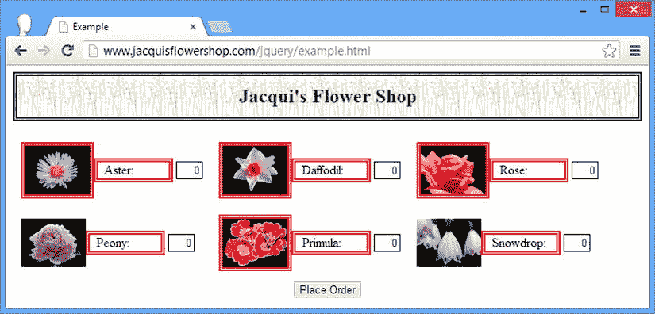

[图 6-1](#_Fig1) 。使用 add 方法扩展选定内容

缩小选择范围

有很多方法可以让你从选择中*移除*元素，如[表 6-3](#Tab3) 所述。在每种情况下，这些方法都返回一个新的`jQuery`对象，该对象包含减少的元素选择 。调用该方法的`jQuery`对象保持不变。

[表 6-3](#_Tab3) 。过滤元素的方法

| 方法 | 描述 |
| --- | --- |
| `eq(index)` | 移除除指定索引处的元素之外的所有元素。 |
| `filter(condition)` | 移除不符合指定条件的元素。请参阅后面的讨论，了解可以在此方法中使用的参数的详细信息。 |
| `first()` | 移除除第一个元素之外的所有元素。 |
| `has(selector)``has(jQuery)``has(HTMLElement)`T3】 | 删除没有与指定选择器或`jQuery`对象匹配的后代的元素，或者其后代不包含指定`HTMLElement`对象的元素。 |
| `last()` | 移除除最后一个元素之外的所有元素。 |
| `not(condition)` | 移除所有符合条件的元素。有关如何指定条件的详细信息，请参见后面的讨论。 |
| `slice(start, end)` | 移除指定索引值范围之外的所有元素。 |

将选择缩小到特定元素

三种最基本的缩小方法是`first`、`last`和`eq`。这三种方法允许您根据其在`jQuery`对象中的位置选择特定的元素。[清单 6-2](#list2) 提供了一个演示。

***[清单 6-2](#_list2)*** 。根据元素位置减少选择

```js
...
<script type="text/javascript">
    $(document).ready(function() {

        var jq = $("label");

        jq.first().css("border", "thick double red");
        jq.last().css("border", "thick double green");
        jq.eq(2).css("border", "thick double black");
        jq.eq(-2).css("border", "thick double black");

    });
</script>
...
```

注意，我调用了两次`eq`方法。当该方法的参数为正时，索引从`jQuery`对象中的第一个元素开始计数。当参数为负时，从最后一个元素开始向后计数。你可以在[图 6-2](#Fig2) 中看到这个脚本的效果。

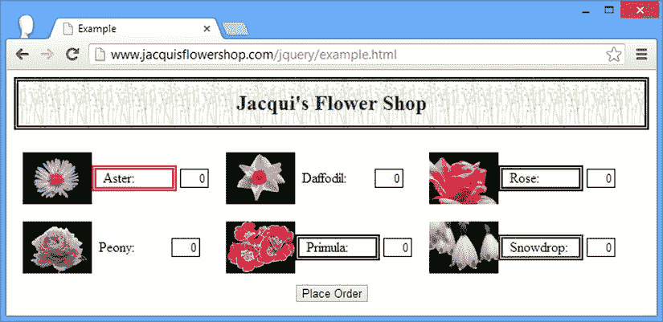

[图 6-2](#_Fig2) 。将选择范围缩小到特定元素

按范围缩小选择范围

`slice`方法将选择缩小到一系列元素，如[清单 6-3](#list3) 所示。

***[清单 6-3](#_list3)*** 。使用切片方法

```js
...
<script type="text/javascript">
    $(document).ready(function() {

        var jq = $("label");

        jq.slice(0, 2).css("border", "thick double black");
        jq.slice(4).css("border", "thick solid red");

    });
</script>
...
```

`slice`方法的参数是开始选择的索引和结束选择的索引。索引是从零开始的，所以我在示例中使用的参数(`0`和`2`)选择了前两个元素。如果省略第二个参数，则选择继续到元素集的末尾。通过为一组六个元素指定一个参数`4`，我选择了最后两个元素(它们的索引值为`4`和`5`)。你可以在图 6-3 中看到这个脚本的结果。

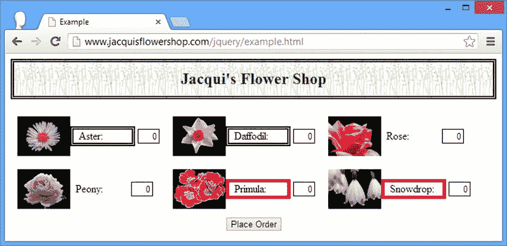

[图 6-3](#_Fig3) 。按范围缩小选择范围

过滤元件

`filter`方法从选择中删除不满足指定条件的元素。[表 6-4](#Tab4) 显示了可用于表示过滤条件的不同参数。

[表 6-4](#_Tab4) 。筛选方法参数类型

| 争论 | 描述 |
| --- | --- |
| `filter(selector)` | 移除与选择器不匹配的元素。 |
| `filter(HTMLElement)` | 移除指定元素以外的所有元素。 |
| `filter(jQuery)` | 删除不包含在指定的`jQuery`对象中的元素。 |
| `filter(function(index))` | 为每个元素调用该函数；函数返回`false`的那些被删除。 |

清单 6-4 展示了指定过滤器的所有四种方式。

***[清单 6-4](#_list4)*** 。指定过滤器

```js
...
<script type="text/javascript">
    $(document).ready(function() {
        $("img").filter("[src*=s]").css("border", "thick double red");

        var jq = $("[for*=p]" );
        $("label").filter(jq).css("color", "blue");

        var elem = document.getElementsByTagName("label")[1];
        $("label").filter(elem).css("font-size", "1.5em");

        $("img").filter(function(index) {
            return this.getAttribute("src") == "peony.png" || index == 4;
        }).css("border", "thick solid red")
    });
</script>
...
```

前三种技术是不言而喻的:您可以基于选择器、另一个`jQuery`对象或一个`HTMLElement`对象进行过滤。

第四种技术依赖于一个`function`，需要更多的解释。jQuery 为`jQuery`对象包含的每个元素调用一次该函数。如果函数返回`true`，那么元素被保留，如果函数返回`false`，它被移除。

有一个参数传递给该函数，它是调用该函数的元素的索引。另外，将`this`变量设置为需要处理的 `HTMLElement`对象。在清单中，如果元素的 `src`属性和特定的索引值有特定的值，我将返回`true`。你可以在图 6-4 中看到结果。

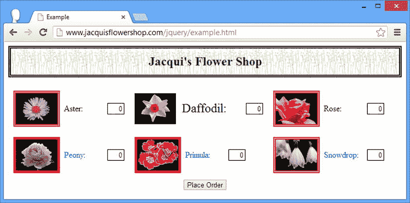

[图 6-4](#_Fig4) 。使用过滤方法

 **提示**你可能想知道为什么我在过滤函数中对`HTMLElement`使用了`getAttribute`方法，而不是调用`src`属性。原因是`getAttribute`方法将返回我为文档中的`src` *属性*设置的值(这是一个相对 URL)，但是`src` *属性*将返回一个完全限定的 URL。对于这个例子，相对 URL 更容易处理。

对`filter`方法的补充是`not`，它的工作方式基本相同，但过滤过程相反。[表 6-5](#Tab5) 显示了使用`not`方法应用条件的不同方式。

[表 6-5](#_Tab5) 。非方法参数类型

| 争论 | 描述 |
| --- | --- |
| `not(selector)` | 移除与选择器匹配的元素。 |
| `not(HTMLElement[])` `not(HTMLElement)` | 移除一个或多个指定元素。 |
| `not(jQuery)` | 移除包含在指定`jQuery`对象中的元素。 |
| `not(function(index))` | 为每个元素调用该函数；函数返回`true`的那些被删除。 |

基于前面的例子，清单 6-5 展示了`not`方法的使用。

***[清单 6-5](#_list5)*** 。使用 not 方法

```js
...
<script type="text/javascript">
    $(document).ready(function() {

        $("img").not("[src*=s]").css("border", "thick double red");

        var jq = $("[for*=p]");
        $("label").not(jq).css("color", "blue");

        var elem = document.getElementsByTagName("label")[1];
        $("label").not(elem).css("font-size", "1.5em");

        $("img").not(function(index) {
            return this.getAttribute("src") == "peony.png" || index == 4;
        }).css("border", "thick solid red")
    });
</script>
...
```

你可以在[图 6-5](#Fig5) 中看到这个脚本的效果。当然，这与前一个例子的效果相反。

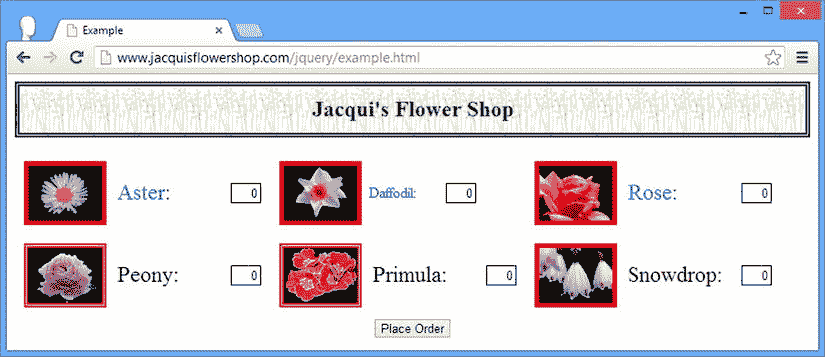

[图 6-5](#_Fig5) 。使用 not 方法过滤元素

减少基于后代的选择

`has`方法将选择减少到具有特定后代的元素，通过选择器或一个或多个`HTMLElement`对象指定，如[清单 6-6](#list6) 所示。

***[清单 6-6](#_list6)*** 。使用散列方法

```js
...
<script type="text/javascript">
    $(document).ready(function() {

        $("div.dcell").has("img[src*=aster]").css("border", "thick solid red");
        var jq = $("[for*=p]");
        $("div.dcell").has(jq).css("border", "thick solid blue");

    });
</script>
...
```

在第一种情况下，我使用了一个选择器，将选择范围缩小到至少有一个后代元素`img`的元素，其`src`属性值包含`aster`。在第二种情况下，我使用了一个`jQuery`对象，我将选择范围缩小到至少有一个后代的元素，这个后代的`for`属性的值包含字母`p`。你可以在[图 6-6](#Fig6) 中看到这个脚本的效果。

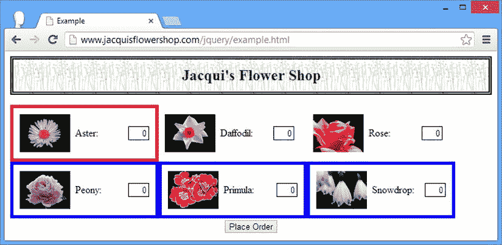

[图 6-6](#_Fig6) 。使用 has 方法减少选择

映射选择

`map`方法提供了一种灵活的方式来使用一个`jQuery`对象作为基于函数创建另一个对象的手段。源`jQuery`对象中的每个元素都调用该函数，函数返回的`HTMLElement`对象包含在结果`jQuery`对象中，如[清单 6-7](#list7) 所示。

***[清单 6-7](#_list7)*** 。使用地图方法

```js
...
<script type="text/javascript">
    $(document).ready(function() {

        $("div.dcell").map(function(index, elem) {
            return elem.getElementsByTagName("img")[0];
        }).css("border", "thick solid red");

        $("div.dcell").map(function(index, elem) {
            return $(elem).children()[1];
        }).css("border", "thick solid blue");

    });
</script>
...
```

在这个脚本中，我执行了两个映射操作。第一个使用 DOM API 返回每个元素中包含的第一个`img`元素，第二个使用 jQuery 返回 children 方法返回的`jQuery`对象中的第一个项目(我将在本章后面详细解释这个方法，但是顾名思义，它返回一个`jQuery`对象中每个元素的子节点)。你可以在图 6-7 的[中看到结果。](#Fig7)

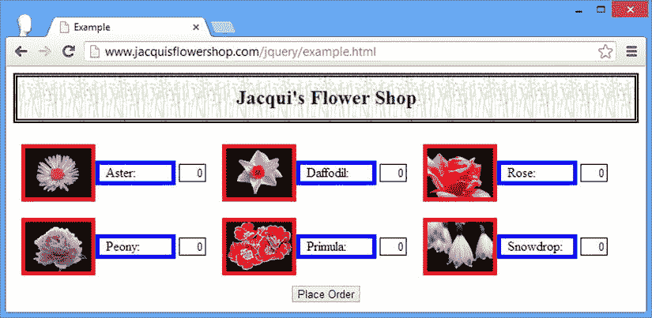

[图 6-7](#_Fig7) 。使用地图方法

 **提示**每次调用函数只能返回一个元素。如果您想要为每个源元素投影多个结果元素，您可以组合使用`each`和`add`方法，我在第 8 章的[中对此进行了描述。](08.html)

测试选择

`is`方法确定`jQuery`对象中的一个或多个元素是否满足特定条件。表 6-6 显示了你可以传递给`is`方法的参数。

[表 6-6](#_Tab6) 。是方法参数类型

| 争论 | 描述 |
| --- | --- |
| `is(selector)` | 如果`jQuery`对象包含选择器匹配的至少一个元素，则返回`true`。 |
| `is(HTMLElement[])` `is(HTMLElement)` | 如果`jQuery`对象包含指定的元素，或者指定数组中的至少一个元素，则返回`true`。 |
| `is(jQuery)` | 如果`jQuery`对象包含 argument 对象中的至少一个元素，则返回`true`。 |
| `is(function(index))` | 如果函数至少返回`true`一次，则返回`true`。 |

当您指定一个函数作为条件时，jQuery 将为`jQuery`对象中的每个元素调用一次该函数，将元素的索引作为函数参数传递，并将`this`变量设置为元素本身。[清单 6-8](#list8) 显示了正在使用的`is`方法。

 **注意**这个方法返回一个布尔值。正如我在《T4》第五章中提到的，并不是所有的 jQuery 方法都返回一个`jQuery`对象。

***[清单 6-8](#_list8)*** 。使用 is 方法

```js
...
<script type="text/javascript">
    $(document).ready(function() {

        var isResult = $("img").is(function(index){
            return this.getAttribute("src") == "rose.png";
        });
        console.log("Result: " + isResult);

    });
</script>
...
```

该脚本测试`jQuery`对象是否包含一个其`src`属性值为`rose.png`的元素，并将结果写到控制台，如下所示:

```js
Result: true
```

更改然后展开选择

当您通过将方法链接在一起来修改选择时，jQuery 会保留一个历史堆栈，您可以使用几个方法来利用这一点，如[表 6-7](#Tab7) 中所述。

[表 6-7](#_Tab7) 。展开选择堆栈的方法

| 方法 | 描述 |
| --- | --- |
| `end()` | 从堆栈中弹出当前选择并返回到上一个选择。 |
| `addBack()` `addBack(selector)` | 将上一个选择添加到当前选择，并使用可选选择器过滤上一个选择。 |

`end`方法返回到之前的选择，这允许你选择一些元素，扩大或缩小选择，执行一些操作，然后返回到最初的选择，如[清单 6-9](#list9) 所示。

***[清单 6-9](#_list9)*** 。使用结束方法

```js
...
<script type="text/javascript">
    $(document).ready(function() {

        $("label").first().css("border", "thick solid blue")
            .end().css("font-size", "1.5em");

    });
</script>
...
```

在这个脚本中，我首先选择文档中所有的 `label`元素。然后，我通过调用`first`方法缩小选择范围(以获得第一个匹配的元素)，然后使用`css`方法为 CSS `border`属性设置一个值，其效果是只更改第一个选择的元素的 CSS 属性。

然后，我调用`end`方法返回到之前的选择(这将把选择的第一个`label`元素移回到`label`元素的所有)。然后我再次调用`css`方法，这一次为`font-size`属性设置一个值。这个 CSS 属性应用于所有的`label`元素，如图[图 6-8](#Fig8) 所示。

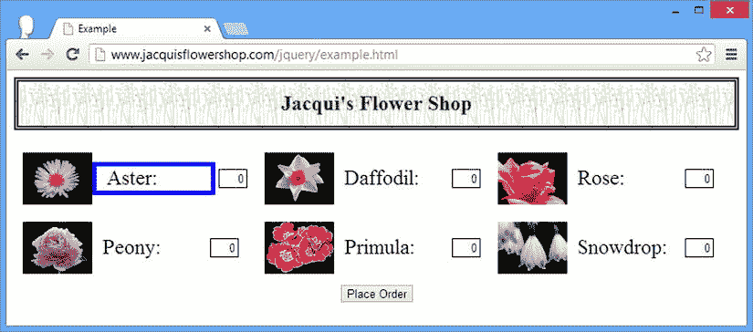

[图 6-8](#_Fig8) 。使用结束方法

`addBack`方法将堆栈中上一个选择的内容添加到当前选择中。[清单 6-10](#list10) 显示了正在使用的`addBack`方法。

***[清单 6-10](#_list10)*** 。使用 andSelf 方法

```js
...
<script type="text/javascript">
    $(document).ready(function() {
        $("div.dcell").children("img").addBack().css("border", "thick solid blue");
    });
</script>
...
```

 **注**jQuery 1.9/2.0 中的`addBack`方法取代了`andSelf`方法。新方法执行相同的功能，并支持一个附加的选择器参数来过滤选择。

在这个例子中，我选择了所有属于`dcell`类成员的 `div`元素，然后使用 children 方法选择所有属于它们的子元素的`img`元素(我将在本章后面的*导航 DOM* 一节中详细解释`children`方法)。然后我调用`addBack`方法，该方法在一个`jQuery`对象中将之前的选择(`div`元素)与当前的选择(`img`元素)结合起来。最后，我调用使用`css`方法为选中的元素设置边框。你可以在[图 6-9](#Fig9) 中看到这个脚本的效果。

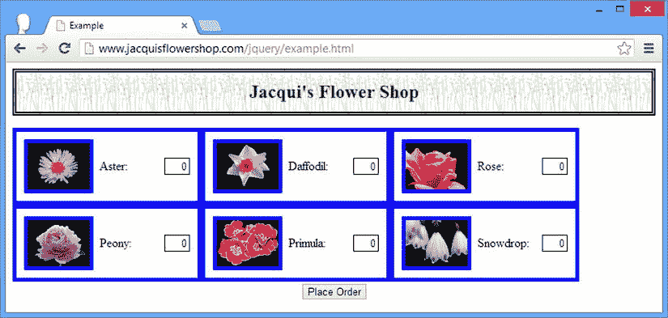

[图 6-9](#_Fig9) 。使用回加方法

在 DOM 中导航

您可以使用一个选择作为在 DOM 中导航的起点，使用一个选择作为创建另一个选择的起点。在接下来的小节中，我将描述和演示 jQuery 导航方法。在本节中，我提到了我在第 2 章中介绍的元素之间可能存在的不同类型的关系。

 **提示**下面几节描述的所有方法都返回一个`jQuery`对象。如果有匹配的元素，这个对象将包含它们，如果没有匹配的元素，这个对象将为空(也就是说，`length`属性将为零)。

向下导航到层次结构

当您向下导航 DOM 层次结构时，您选择的是包含在一个`jQuery`对象中的元素的子元素和子元素。[表 6-8](#Tab8) 描述了相关的 jQuery 方法。

[表 6-8](#_Tab8) 。方法在 DOM 层次结构中向下导航

| 方法 | 描述 |
| --- | --- |
| `children()` | 选择`jQuery`对象中所有元素的子元素。 |
| `children(selector)` | 选择所有与选择器匹配的元素，这些元素是`jQuery`对象中元素的子元素。 |
| `contents()` | 返回`jQuery`对象中所有元素的子元素和文本内容。 |
| `find()` | 选择`jQuery`对象中元素的后代。 |
| `find(selector)` | 选择与选择器匹配的元素，这些元素是`jQuery`对象中元素的后代。 |
| `find(jQuery)``find(HTMLElement)`T2】 | 选择`jQuery`对象和 argument 对象中元素的子元素之间的交集。 |

`children`方法将只选择那些是`jQuery`对象中每个元素的直接后代的元素，可选地由选择器过滤。`find`方法将选择所有的后代元素，而不仅仅是直接的。`contents`方法将返回子元素，以及任何文本内容。[清单 6-11](#list11) 显示了正在使用的`children`和`find`方法。

***[清单 6-11](#_list11)*** 。使用子代和查找方法

```js
...
<script type="text/javascript">
    $(document).ready(function() {

        var childCount = $("div.drow").children().each(function(index, elem) {
            console.log("Child: " + elem.tagName + " " + elem.className);
        }).length;
        console.log("There are " + childCount + " children");

        var descCount = $("div.drow").find("img").each(function(index, elem) {
            console.log("Descendant: " + elem.tagName + " " + elem.src);
        }).length;
        console.log("There are " + descCount + " img descendants");

    });
</script>
...
```

在这个例子中，我使用不带选择器的`children`方法和带选择器的`find`方法。我将所选元素的详细信息以及选择了多少元素写入控制台。该脚本的控制台输出如下:

```js
Child: DIV dcell
Child: DIV dcell
Child: DIV dcell
Child: DIV dcell
Child: DIV dcell
Child: DIV dcell
There are 6 children
Descendant: IMGhttp://www.jacquisflowershop.com/jquery/aster.png
Descendant: IMGhttp://www.jacquisflowershop.com/jquery/daffodil.png
Descendant: IMGhttp://www.jacquisflowershop.com/jquery/rose.png
Descendant: IMGhttp://www.jacquisflowershop.com/jquery/peony.png
Descendant: IMGhttp://www.jacquisflowershop.com/jquery/primula.png
Descendant: IMGhttp://www.jacquisflowershop.com/jquery/snowdrop.png
There are 6 img descendants
```

`children`和`find`方法的一个很好的特性是在选择中不会收到重复的元素。[清单 6-12](#list12) 提供了一个演示。

***[清单 6-12](#_list12)*** 。生成具有重叠后代的选择

```js
...
<script type="text/javascript">
    $(document).ready(function() {
        $("div.drow").add("div.dcell").find("img").each(function(index, elem) {
            console.log("Element: " + elem.tagName + " " + elem.src);
        });
    });
</script>
...
```

在这个例子中，我首先创建一个包含所有属于`drow`类的`div`元素和所有属于`dcell`类的`div`元素的`jQuery`对象。请注意，`dcell`类的所有成员都包含在`drow`类的成员中，这意味着当我使用带有`img`选择器的`find`方法时，您会有重叠的后代集和潜在的重复，因为`img`元素是两个`div`元素类的后代。但是 jQuery 确保返回的元素中没有重复的元素，如清单生成的控制台输出所示:

```js
Element: IMGhttp://www.jacquisflowershop.com/jquery/aster.png
Element: IMGhttp://www.jacquisflowershop.com/jquery/daffodil.png
Element: IMGhttp://www.jacquisflowershop.com/jquery/rose.png
Element: IMGhttp://www.jacquisflowershop.com/jquery/peony.png
Element: IMGhttp://www.jacquisflowershop.com/jquery/primula.png
Element: IMGhttp://www.jacquisflowershop.com/jquery/snowdrop.png
```

使用 find 方法创建交集

你可以将一个`jQuery`对象、一个`HTMLElement`对象或者一组`HTMLElement`对象作为参数传递给`find`方法。当你这样做时，你选择了源`jQuery`对象的后代和参数对象的元素之间的交集。清单 6-13 提供了一个演示。

***[清单 6-13](#_list13)*** 。使用 find 方法创建交集

```js
...
<script type="text/javascript">
    $(document).ready(function() {
        var jq = $("label").filter("[for*=p]").not("[for=peony]");
        $("div.drow").find(jq).css("border", "thick solid blue");
    });
</script>
...
```

正如这个脚本所演示的，这种方法的优点是您可以指定与后代相交的元素。我创建了一个`jQuery`对象，然后使用`filter`和`not`方法对其进行缩减。然后，这个对象成为另一个包含`drow`类中所有`div`元素的`jQuery`对象上的`find`方法的参数。最后的选择是`div.drow`元素的后代和我的`label`元素精简集之间的交集。你可以在[图 6-10](#Fig10) 中看到脚本的效果。

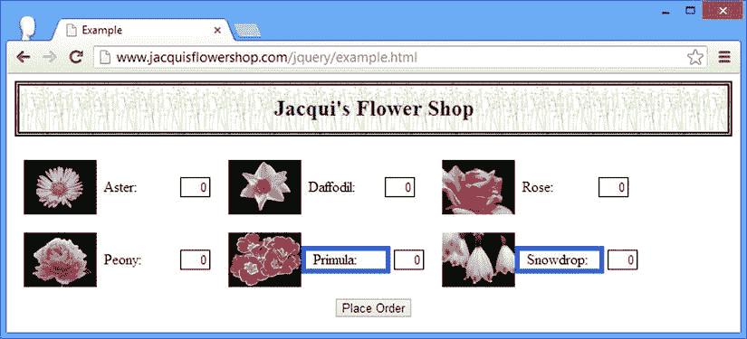

[图 6-10](#_Fig10) 。使用 find 方法创建交集

在层级中向上导航

当您在 DOM 层次结构中导航时，您会对包含在一个`jQuery`对象中的元素的父元素和祖先元素感兴趣。[表 6-9](#Tab9) 显示了你可以用来向上导航的方法。

[表 6-9](#_Tab9) 。在 DOM 层次结构中向上导航的方法

| 方法 | 描述 |
| --- | --- |
| `closest(selector)` `closest(selector, context)` | 为与指定选择器相交的`jQuery`对象中的每个元素选择最近的祖先。 |
| `closest(jQuery)` `closest(HTMLElement)` | 为与 argument 对象中包含的元素相交的`jQuery`对象中的每个元素选择最近的祖先。 |
| `offsetParent()` | 查找 CSS 位置属性值为`fixed`、`absolute`或`relative`的最近的祖先。 |
| `parent()` `parent(selector)` | 选择`jQuery`对象中每个元素的父元素，可选地由选择器过滤。 |
| `parents()` `parents(selector)` | 选择`jQuery`对象中每个元素的祖先，可选地由选择器过滤。 |
| `parentsUntil(selector)` `parentsUntil(selector, selector)` | 选择`jQuery`对象中每个元素的祖先，直到遇到匹配的选择器。可以使用第二个选择器过滤结果。 |
| `parentsUntil(HTMLElement)``parentsUntil(HTMLElement, selector)``parentsUntil(HTMLElement[])`T3】 | 选择`jQuery`对象中每个元素的祖先，直到遇到一个指定的元素。可以使用选择器过滤结果。 |

选择父元素

`parent`方法为`jQuery`对象中的每个元素选择父元素。如果您提供了一个选择器，那么只有匹配该选择器的父元素才会包含在结果中。[清单 6-14](#list14) 显示了使用中的父元素。

***[清单 6-14](#_list14)*** 。使用父元素

```js
...
<script type="text/javascript">
    $(document).ready(function() {

        $("div.dcell").parent().each(function(index, elem) {
            console.log("Element: " + elem.tagName + " " + elem.id);
        });

        $("div.dcell").parent("#row1").each(function(index, elem) {
            console.log("Filtered Element: " + elem.tagName + " " + elem.id);
        });

    });
</script>
...
```

在这个脚本中，我选择了所有属于`dcell`类的`div`元素，并调用`parent`方法来选择父元素。我还演示了如何使用带有选择器的`parent`方法。我使用`each`方法将关于所选父元素的信息写入控制台，控制台产生以下输出:

```js
Element: DIV row1
Element: DIV row2
Filtered Element: DIV row1
```

选择祖先

`parents`方法(注意最后一个字母`s`)选择`jQuery`对象中元素的所有祖先，而不仅仅是直接的父元素。同样，您可以将选择器作为方法传递给参数来过滤结果。[清单 6-15](#list15) 演示了`parents`方法。

***[清单 6-15](#_list15)*** 。使用双亲方法

```js
...
<script type="text/javascript">
    $(document).ready(function() {
        $("img[src*=peony], img[src*=rose]").parents().each(function(index, elem) {
            console.log("Element: " + elem.tagName + " " + elem.className + " "
                             + elem.id);
        });
    });
</script>
...
```

在这个例子中，我选择了两个`img`元素，并使用了`parents`方法来选择它们的祖先。然后，我将每个祖先的信息写入控制台，产生以下输出:

```js
Element: DIV dcell
Element: DIV drow row2
Element: DIV dcell
Element: DIV drow row1
Element: DIV dtable
Element: DIV  oblock
Element: FORM
Element: BODY
Element: HTML
```

选择祖先的一个变体由`parentsUntil`方法表示。对于`jQuery`对象中的每个元素，`parentsUntil`方法在 DOM 层次结构中一路向上，选择祖先元素，直到遇到匹配选择器的元素。清单 6-16 提供了一个演示。

***[清单 6-16](#_list16)*** 。使用 parentsUntil 方法

```js
...
<script>
    $(document).ready(function() {
        $("img[src*=peony], img[src*=rose]").parentsUntil("form")
            .each(function(index, elem) {
                console.log("Element: " + elem.tagName + " " + elem.className
                        + " " + elem.id);
        });
    });
</script>
...
```

在这个例子中，选择每个元素的祖先，直到遇到一个`form`元素。该脚本的输出如下:

```js
Element: DIV dcell
Element: DIV drow row2
Element: DIV dcell
Element: DIV drow row1
Element: DIV dtable
Element: DIV  oblock
```

请注意，匹配选择器的元素被排除在所选祖先之外。在本例中，这意味着表单元素被排除。您可以通过提供第二个选择器参数来过滤祖先集，如清单 6-17 所示。

***[清单 6-17](#_list17)*** 。筛选由 parentsUntil 方法选择的元素集

```js
...
<script type="text/javascript">
    $(document).ready(function() {

        $("img[src*=peony], img[src*=rose]").parentsUntil("form", ":not(.dcell)")
            .each(function(index, elem) {
            console.log("Element: " + elem.tagName + " " + elem.className
                        + " " + elem.id);
        });

    });
</script>
...
```

在这个例子中，我添加了一个选择器，它将过滤掉属于`dcell`类的元素。该脚本的输出如下:

```js
Element: DIV drow row2
Element: DIV drow row1
Element: DIV dtable
Element: DIV  oblock
```

选择第一个匹配的祖先

`closest`方法为`jQuery`对象中的每个元素选择一个选择器匹配的第一个祖先。清单 6-18 提供了一个演示。

***[清单 6-18](#_list18)*** 。使用最接近的方法

```js
...
<script type="text/javascript">
    $(document).ready(function() {

        $("img").closest(".drow").each(function(index, elem) {
            console.log("Element: " + elem.tagName + " " + elem.className
                        + " " + elem.id);
        });

        var contextElem = document.getElementById("row1");
        $("img").closest(".drow", contextElem).each(function(index, elem) {
            console.log("Context Element: " + elem.tagName + " " + elem.className
                        + " " + elem.id);
        });

    });
</script>
...
```

在这个例子中，我选择文档中的`img`元素，然后使用`closest`方法找到属于`drow`类的最近的祖先。您可以通过指定一个`HTMLElement`对象作为该方法的第二个参数来缩小选择祖先的范围。不是上下文对象或者不是上下文对象后代的祖先被排除在选择之外。该脚本的输出如下:

```js
Element: DIV drow row1
Element: DIV drow row2
Context Element: DIV drow row2
```

当您指定一个`jQuery`对象或一个或多个`HTMLElement`对象作为`closest`方法的参数时，jQuery 会沿着源`jQuery`对象中每个元素的层次结构向上搜索，匹配它找到的第一个参数对象。清单 6-19 中的展示了这一点。

***[清单 6-19](#_list19)*** 。使用一组参考对象的最近方法

```js
...
<script type="text/javascript">
    $(document).ready(function() {

        var jq = $("#row1, #row2, form");

        $("img[src*=rose]").closest(jq).each(function(index, elem) {
            console.log("Context Element: " + elem.tagName + " " + elem.className
                        + " " + elem.id);
        });

    });
</script>
...
```

在这个例子中，我选择文档中的一个`img`元素，然后使用`closest`方法选择祖先元素。我提供了一个包含`form`元素和带有`row1`和`row2` ID 的元素的`jQuery`对象作为`closest`方法的参数。jQuery 将选择与`img`元素最接近的元素。换句话说，它将开始在层次结构中向上移动，直到遇到 argument 对象中的一个元素。该脚本的输出如下:

```js
Context Element: DIV drow row1
```

`offsetParent`是最近的主题的变体，并且资助第一个祖先，该祖先具有`relative`、`absolute`或`fixed`的`position` CSS 属性的值。这样的元素被称为*定位祖先*，在处理动画时找到一个元素会很有用(关于 jQuery 对动画支持的详细信息，请参见[第 10 章](10.html))。清单 6-20 包含了这种方法的演示。

[清单 6-20](#_list20) 。使用 offsetParent 方法

```js
<!DOCTYPE html>
<html>
<head>
    <title>Example</title>
    <script src="jquery-2.0.2.js" type="text/javascript"></script>
    <link rel="stylesheet" type="text/css" href="styles.css"/>
    <style type="text/css">
        #oblock {position: fixed; top: 120px; left: 50px}
    </style>
    <script type="text/javascript">
        $(document).ready(function() {
            $("img[src*=aster]").offsetParent().css("background-color", "lightgrey");
        });
    </script>
</head>
<body>
    <h1>Jacqui's Flower Shop</h1>
    <form method="post">
        <div id="oblock">
            <div class="dtable">
                <div id="row1" class="drow">
                    <div class="dcell">
                        <label for="aster">Aster:</label>
                        <input name="aster" value="0" required>
                    </div>
                    <div class="dcell">
                        <label for="daffodil">Daffodil:</label>
                        <input name="daffodil" value="0" required >
                    </div>
                    <div class="dcell">
                        <label for="rose">Rose:</label>
                        <input name="rose" value="0" required>
                    </div>
                </div>
            </div>
        </div>
        <div id="buttonDiv"><button type="submit">Place Order</button></div>
    </form>
</body>
</html>
```

在这个示例文档的简化版本中，我使用 CSS 为具有`oblock`的`id`的元素的`position`属性设置了一个值。在脚本中，我使用 jQuery 来选择一个`img`元素，然后调用`offsetParent`方法来查找位置最近的元素。该方法在层次结构中一直向上，直到到达具有所需值之一的元素。我使用`css`属性为所选元素的`background-color`属性设置一个值，如图 6-11 中的[所示。](#Fig11)

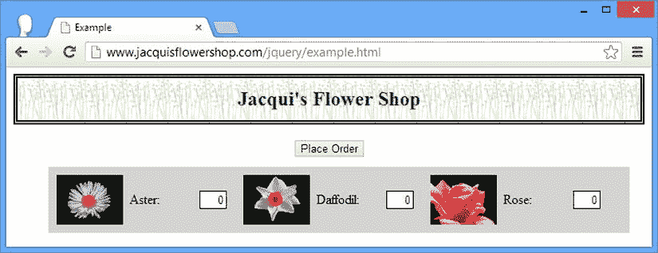

[图 6-11](#_Fig11) 。寻找位置最近的祖先

在层次结构中导航

DOM 导航的最终形式处理兄弟节点。jQuery 为此提供的方法在[表 6-10](#Tab10) 中描述。

[表 6-10](#_Tab10) 。方法在 DOM 层次结构中导航

| 方法 | 描述 |
| --- | --- |
| `next()` `next(selector)` | 为`jQuery`对象中的每个元素选择紧邻的下一个兄弟元素，可选地由选择器过滤。 |
| `nextAll()` `nextAll(selector)` | 为`jQuery`对象中的每个元素选择所有下一个兄弟元素，可选地由选择器过滤。 |
| `nextUntil((selector)` `nextUntil(selector, selector)` `nextUntil(jQuery)` `nextUntil(jQuery, selector)` `nextUntil(HTMLElement[])` | 为每个元素选择下一个兄弟元素，直到(不包括)与选择器匹配的元素或`jQuery`对象或`HTMLElement`数组中的元素。结果可以选择性地由选择器筛选，作为方法的第二个参数。 |
| `prev()` `prev(selector)` | 为`jQuery`对象中的每个元素选择上一个同级元素，可选地由选择器过滤。 |
| `prevAll()` `prevAll(selector)` | 为`jQuery`对象中的每个元素选择所有以前的兄弟元素，可选地由选择器过滤。 |
| `prevUntil(selector)` `prevUntil(selector, selector)` `prevUntil(jQuery)` `prevUntil(jQuery, selector)` `prevUntil(HTMLElement[])` | 选择每个元素的前一个兄弟元素，直到(不包括)与选择器匹配的元素或`jQuery`对象或`HTMLElement`数组中的元素。结果可以选择性地由选择器筛选，作为方法的第二个参数。 |
| `siblings()` `siblings(selector)` | 为`jQuery`对象中的每个元素选择所有同级元素，可选地由选择器过滤。 |

选择所有兄弟姐妹

`siblings`方法选择一个`jQuery`对象中所有元素的所有兄弟元素。[清单 6-21](#list21) 展示了这种方法的使用。(对于这个清单，我已经返回了完整的花店文档)。

***[清单 6-21](#_list21)*** 。使用兄弟姐妹方法

```js
<!DOCTYPE html>
<html>
<head>
    <title>Example</title>
    <script src="jquery-2.0.2.js" type="text/javascript"></script>
    <link rel="stylesheet" type="text/css" href="styles.css"/>
    <script type="text/javascript">
        $(document).ready(function () {
            $("img[src*=aster], img[src*=primula]")
                .parent().siblings().css("border", "thick solid blue");
        });
    </script>
</head>
<body>
    <h1>Jacqui's Flower Shop</h1>
    <form method="post">
        <div id="oblock">
            <div class="dtable">
                <div id="row1" class="drow">
                    <div class="dcell">
                        <label for="aster">Aster:</label>
                        <input name="aster" value="0" required>
                    </div>
                    <div class="dcell">
                        <label for="daffodil">Daffodil:</label>
                        <input name="daffodil" value="0" required >
                    </div>
                    <div class="dcell">
                        <label for="rose">Rose:</label>
                        <input name="rose" value="0" required>
                    </div>
                </div>
                <div id="row2"class="drow">
                    <div class="dcell">
                        <label for="peony">Peony:</label>
                        <input name="peony" value="0" required>
                    </div>
                    <div class="dcell">
                        <label for="primula">Primula:</label>
                        <input name="primula" value="0" required>
                    </div>
                    <div class="dcell">
                        <label for="snowdrop">Snowdrop:</label>
                        <input name="snowdrop" value="0" required>
                    </div>
                </div>
            </div>
        </div>
        <div id="buttonDiv"><button type="submit">Place Order</button></div>
    </form>
</body>
</html>
```

在这个例子中，我选择了两个`img`元素，调用`parent`方法选择它们的父元素，然后调用`siblings`方法选择它们的兄弟元素。前一个和下一个兄弟都将被选中，我使用`css`方法为`border`属性设置一个值。在[图 6-12](#Fig12) 中可以看到效果。(我用了`parent`的方法让 CSS 属性的效果更清晰。)

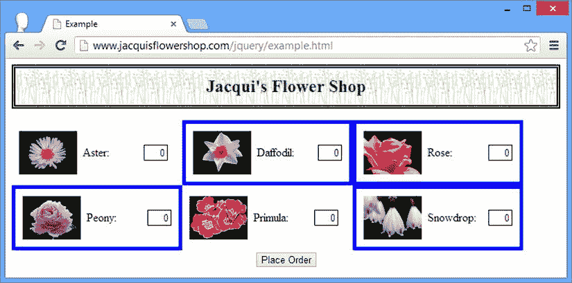

[图 6-12](#_Fig12) 。选择同级元素

请注意，只选择了同级元素，而不是元素本身。当然，如果`jQuery`对象中的一个元素是另一个元素的兄弟元素，这种情况就会改变，如[清单 6-22](#list22) 所示。

***[清单 6-22](#_list22)*** 。重叠的兄弟集合

```js
...
<script type="text/javascript">
    $(document).ready(function() {
        $("#row1 div.dcell").siblings().css("border", "thick solid blue");
    });
</script>
...
```

在这个脚本中，我首先选择作为`row1`元素的子元素的所有`div`元素，然后调用`siblings`方法。选择中的每个元素都是至少一个其他元素的兄弟，正如你在图 6-13 中看到的[。](#Fig13)

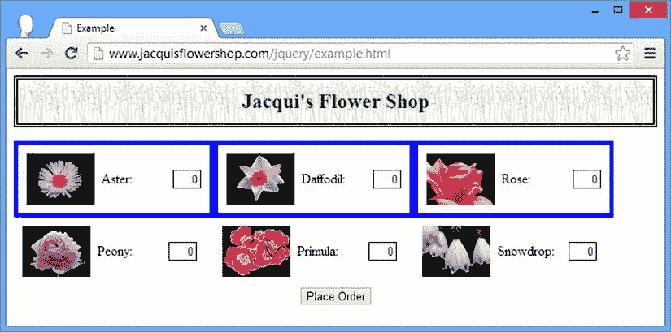

[图 6-13](#_Fig13) 。重叠的同级元素

选择下一个和上一个兄弟

我不打算演示选择下一个和上一个兄弟的所有方法，因为它们的工作方式与其他导航方法相同。[清单 6-23](#list23) 显示了正在使用的`nextAll`和`prevAll`方法。

***[清单 6-23](#_list23)*** 。使用 nextAll 和 prevAll 方法

```js
...
<script type="text/javascript">
    $(document).ready(function() {
        $("img[src*=aster]").parent().nextAll().css("border", "thick solid blue");
        $("img[src*=primula]").parent().prevAll().css("border", "thick double red");
    });
</script>
...
```

该脚本为 aster 图像的父代选择下一个兄弟，为 primula 图像选择前一个兄弟。你可以在[图 6-14](#Fig14) 中看到这个脚本的效果。

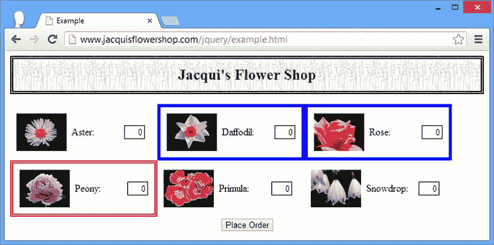

[图 6-14](#_Fig14) 。选择下一个和上一个同级

摘要

在这一章中，我向您展示了如何控制 jQuery 选择并根据您的具体需求对其进行裁剪，包括添加元素、过滤元素、使用映射以及测试选择以评估条件。我还向您展示了如何使用 jQuery 选择作为导航 DOM 的起点，使用一个选择作为遍历文档以创建另一个选择的起点。在第 7 章中，我将向您展示如何使用选择来操作 DOM，应用 jQuery 方法来创建、移除、更改和创建 HTML 元素。