# 七、操纵 DOM

在前一章中，我向您展示了如何选择元素。您可以对选择做的最强大的事情之一是改变 HTML 文档本身的结构，这被称为*操纵 DOM* 。在这一章中，我将向你展示改变结构的不同方法，包括插入元素作为其他元素的子元素、父元素或兄弟元素。我还将向您展示如何创建新元素，如何将元素从文档的一部分移动到另一部分，以及如何完全删除元素。[表 7-1](#Tab1) 对本章进行了总结。

[表 7-1](#_Tab1) 。章节总结

| 问题 | 解决办法 | 列表 |
| --- | --- | --- |
| 创造新元素。 | 通过使用`clone`方法或使用 DOM API，将一个 HTML 片段传递给$函数。 | 1–3 |
| 将元素作为最后一个子元素插入。 | 使用`append`方法。 | four |
| 将元素作为第一个子元素插入。 | 使用`prepend`方法。 | 5, 6 |
| 在不同的位置插入相同的元素。 | 在插入元素之前克隆它们。 | 7, 8 |
| 插入一个`jQuery`对象的内容作为其他元素的子元素。 | 使用`appendTo`或`prependTo`方法。 | nine |
| 动态插入子元素。 | 将函数传递给`append`或`prepend`方法。 | Ten |
| 插入父元素。 | 使用`wrap`方法。 | Eleven |
| 向多个元素插入一个公共父元素。 | 使用`wrapAll`方法。 | 12, 13 |
| 包装元素的内容。 | 使用`wrapInner`方法。 | Fourteen |
| 动态包装元素。 | 将函数传递给`wrap`或`wrapInner`方法。 | Fifteen |
| 插入同级元素。 | 使用`after`、`before`、`insertAfter`或`insertBefore`方法。 | 16, 17 |
| 动态插入同级元素。 | 将函数传递给`before`或`after`方法。 | Eighteen |
| 用其他元素替换元素。 | 使用`replaceWith`或`replaceAll`方法。 | Nineteen |
| 动态替换元素。 | 将函数传递给`replaceWith`方法。 | Twenty |
| 从 DOM 中移除元素。 | 使用`remove`或`detach`方法。 | 21–23 |
| 移除元素的内容。 | 使用`empty`方法。 | Twenty-four |
| 移除元素的父元素。 | 使用`unwrap`方法。 | Twenty-five |

自上一版以来，JQUERY 发生了变化

对于这一章，jQuery 1.9/2.0 中最重要的变化是在解释 HTML 字符串时采用了更严格的方法。然而，1.10/2.0.1 版本撤销了这一更改，并恢复了旧的 HTML 解析方法——详情请参见 HTML 解析的*更改*侧栏。

对`after`、`before`、`replaceWith`、`appendTo`、`insertBefore`、`insertAfter`和`replaceAll`方法的方式进行了一些幕后修改，以使它们处理`jQuery`对象的方式与其他 DOM 操作方法一致。这些变化不会影响本章中的技术。

创建新元素

当编写 web 应用时，您经常需要创建新元素并将它们插入到 DOM 中(尽管您也可以插入现有的元素，我将在本章后面解释)。在接下来的部分中，我将向您展示创建内容的不同方法。

 **提示**理解创建新元素并不会自动将它们添加到 DOM 中是很重要的。您需要明确地告诉 jQuery 新元素应该放在文档中的什么位置，我将在本章后面解释这一点。

使用$函数创建元素

您可以通过向`$`函数传递一个 HTML 片段字符串来创建新元素。jQuery 解析字符串并创建相应的 DOM 对象。清单 7-1 包含了一个例子。

***[清单 7-1](#_list1)*** 。使用$函数创建新元素

```js
<!DOCTYPE html>
<html>
<head>
    <title>Example</title>
    <script src="jquery-2.0.2.js" type="text/javascript"></script>
    <link rel="stylesheet" type="text/css" href="styles.css"/>
    <script type="text/javascript">
        $(document).ready(function() {

            var newElems = $("<div class='dcell'></div>");

            newElems.each(function (index, elem) {
                console.log("New element: " + elem.tagName + " " + elem.className);
            });

            newElems.children().each(function(index, elem) {
                console.log("Child: " + elem.tagName + " " + elem.src);
            });
        });
    </script>
</head>
<body>
    <h1>Jacqui's Flower Shop</h1>
    <form method="post">
        <div id="oblock">
            <div class="dtable">
                <div id="row1" class="drow">
                    <div class="dcell">
                        <label for="aster">Aster:</label>
                        <input name="aster" value="0" required>
                    </div>
                    <div class="dcell">
                        <label for="daffodil">Daffodil:</label>
                        <input name="daffodil" value="0" required >
                    </div>
                    <div class="dcell">
                        <label for="rose">Rose:</label>
                        <input name="rose" value="0" required>
                    </div>
                </div>
                <div id="row2"class="drow">
                    <div class="dcell">
                        <label for="peony">Peony:</label>
                        <input name="peony" value="0" required>
                    </div>
                    <div class="dcell">
                        <label for="primula">Primula:</label>
                        <input name="primula" value="0" required>
                    </div>
                    <div class="dcell">
                        <label for="snowdrop">Snowdrop:</label>
                        <input name="snowdrop" value="0" required>
                    </div>
                </div>
            </div>
        </div>
        <div id="buttonDiv"><button type="submit">Place Order</button></div>
    </form>
</body>
</html>
```

在这个例子中，我从一个 HTML 片段中创建了两个新元素:一个`div`元素和一个`img`元素。因为你处理的是 HTML，所以你可以使用包含结构的片段。在这种情况下，`img`元素是`div`元素的子元素。

对 HTML 解析的更改

当您将一个字符串传递给`$`函数时，jQuery 必须决定它是选择器还是 HTML 字符串。在 1.9 版本之前，如果字符串中的任何地方有标签，它就被认为是 HTML(关于标签的详细信息，参见[第 2 章](02.html))。这带来了一些罕见的问题，复杂的选择器被解释为 HTML，因此在 jQuery 1.9/2.0 中改变了策略，只有以`<`字符开头的字符串才被认为是 HTML。

这被证明是一个不受欢迎的改变，因此在 jQuery 1.10/2.0.1 版本中又将该策略改了回来——但是警告说在检测 HTML 字符串的方式上可能会有进一步的改变。如果您正在处理可能不明确的字符串，您可以使用`parseHTML`方法，它将处理一个 HTML 字符串，而没有将其解释为选择器的风险。

由`$`函数返回的`jQuery`对象只包含来自 HTML 片段的顶级元素。为了演示这一点，我使用了`each`函数将关于`jQuery`对象中每个元素的信息写入控制台。jQuery 不会丢弃子元素。它们可以通过我在第 6 章中描述的常用导航方法访问。为了演示这一点，我在`jQuery`对象上调用了`children`方法，并将每个子元素的信息打印到控制台。该脚本的输出如下:

```js
New element: DIV dcell
Child: IMGhttp://www.jacquisflowershop.com/jquery/lily.png
```

 **提示**您还可以提供一个 map 对象，指定应该应用于 HTML 元素的属性。你可以在[第 12 章](12.html)中看到这个版本的`$`函数。

通过克隆现有元素创建新元素

您可以使用`clone`方法从现有元素创建新元素。这复制了一个`jQuery`对象中的所有元素，以及它们的所有后代。清单 7-2 给出了一个例子。

***[清单 7-2](#_list2)*** 。克隆元素

```js
...
<script type="text/javascript">
    $(document).ready(function() {

        var newElems = $("div.dcell").clone();

        newElems.each(function (index, elem) {
            console.log("New element: " + elem.tagName + " " + elem.className);
        });

        newElems.children("img").each(function(index, elem) {
            console.log("Child: " + elem.tagName + " " + elem.src);
        });

    });
</script>
...
```

在这个脚本中，我选择并克隆了所有属于`dcell`类的`div`元素。为了演示后代元素也被克隆，我使用了带有选择器的`children`方法来获得克隆的`img`元素。我已经将`div`和`img`元素的详细信息写入控制台，产生以下输出:

```js
New element: DIV dcell
New element: DIV dcell
New element: DIV dcell
New element: DIV dcell
New element: DIV dcell
New element: DIV dcell
Child: IMGhttp://www.jacquisflowershop.com/jquery/aster.png
Child: IMGhttp://www.jacquisflowershop.com/jquery/daffodil.png
Child: IMGhttp://www.jacquisflowershop.com/jquery/rose.png
Child: IMGhttp://www.jacquisflowershop.com/jquery/peony.png
Child: IMGhttp://www.jacquisflowershop.com/jquery/primula.png
Child: IMGhttp://www.jacquisflowershop.com/jquery/snowdrop.png
```

 **提示**您可以将值`true`作为参数传递给`clone`方法，以便在复制过程中包含事件处理程序和与元素相关的数据。省略此参数或指定值`false`会省略事件处理程序和数据。我将在第 9 章的[中解释 jQuery 对事件的支持，并在第 8 章](09.html)的[中解释如何将数据与元素相关联。](08.html)

使用 DOM API 创建元素

您可以直接使用 DOM API 来创建新的`HTMLElement`对象，当您使用其他技术时，这基本上就是 jQuery 在为您做的事情。我不打算解释 DOM API 的细节，但是清单 7-3 包含了一个简单的例子，让你知道如何使用这种技术。

***[清单 7-3](#_list3)*** 。使用 DOM API 创建新元素

```js
...
<script type="text/javascript">
    $(document).ready(function() {

        var divElem = document.createElement("div");
        divElem.classList.add("dcell");

        var imgElem = document.createElement("img");
        imgElem.src = "lily.png";

        divElem.appendChild(imgElem);

        var newElems = $(divElem);

        newElems.each(function (index, elem) {
            console.log("New element: " + elem.tagName + " " + elem.className);
        });

        newElems.children("img").each(function(index, elem) {
            console.log("Child: " + elem.tagName + " " + elem.src);
        });

    });
</script>
...
```

在这个例子中，我创建并配置了一个`div HTMLElement`和一个`img HTMLElement`，并将`img`指定为`div`的子节点，就像我在第一个例子中所做的一样。以这种方式创建元素没有错，但是因为这是一本关于 jQuery 的书，所以我不想过多地讨论 DOM API 而偏离主题。

我将`div HTMLElement`作为参数传递给 jQuery `$`函数，这样我就可以使用与其他示例相同的`each`函数。控制台输出如下:

```js
New element: DIV dcell
Child: IMGhttp://www.jacquisflowershop.com/jquery/lily.png
```

插入子元素和后代元素

一旦我创建了元素，我就可以开始将它们插入到文档中。我从查看将一个元素插入另一个元素以创建子元素和后代元素的方法开始，如[表 7-2](#Tab2) 所述。

[表 7-2](#_Tab2) 。插入子元素和后代元素的方法

| 方法 | 描述 |
| --- | --- |
| `append(HTML)``append(jQuery)`T2】 | 将指定元素作为 DOM 中所有元素的最后一个子元素插入。 |
| `prepend(HTML)``prepend(jQuery)`T2】 | 将指定元素作为 DOM 中所有元素的第一个子元素插入。 |
| `appendTo(jQuery)` `appendTo(HTMLElement[])` | 将元素插入到`jQuery`对象中，作为参数指定的元素的最后一个子元素。 |
| `prependTo(HTML)``prependTo(jQuery)`T2】 | 将元素插入到`jQuery`对象中，作为参数指定的元素的第一个子元素。 |
| `append(function)` `prepend(function)` | 将一个函数的结果附加或预先添加到`jQuery`对象的元素中。 |

 **提示**您还可以使用`wrapInner`方法插入子元素，我在“包装元素内容”一节中对此进行了描述。此方法在元素及其现有子元素之间插入一个新的子元素。另一个技巧是使用`html`方法，我在第 8 章的[中描述过。](08.html)

作为参数传递给这些方法的元素被作为子元素插入到`jQuery`对象中的每个元素的*中，这使得使用我在[第 6 章](06.html)中向您展示的技术来管理选择变得尤为重要，以便它只包含您想要使用的元素。清单 7-4 给出了使用`append`方法的演示。*

***[清单 7-4](#_list4)*** 。使用 append 方法

```js
...
<script type="text/javascript">
    $(document).ready(function() {
        var newElems = $("<div class='dcell'></div>")
            .append("")
            .append("<label for='lily'>Lily:</label>")
            .append("<input name='lily' value='0' required />");

        newElems.css("border", "thick solid red");

        $("#row1").append(newElems);
    });
</script>
...
```

我在这个脚本中以两种不同的方式使用了`append`方法:首先构建我的新元素集，然后将这些元素插入 HTML 文档。由于这是我描述的第一个 DOM 操作方法，我将花点时间演示一些行为，帮助您避免最常见的与 DOM 相关的 jQuery 错误。但首先，我们来看看剧本的效果。你可以在图 7-1 的[中看到添加新元素的结果。](#Fig1)

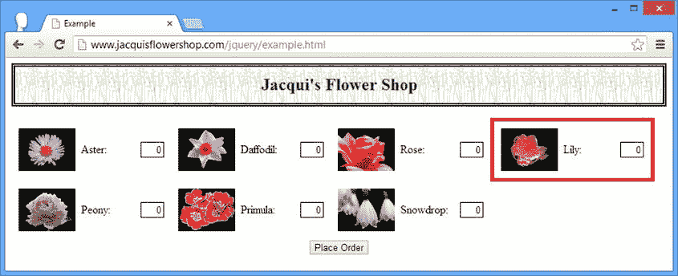

[图 7-1](#_Fig1) 。向文档中插入新元素

首先要看的是我使用`append`方法构建新元素的方式:

```js
...
var newElems = $("<div class='dcell'/>").append("")
    .append("<label for='lily'>Lily:</label>")
    .append("<input name='lily' value='0' required />");
...
```

我本可以创建一个包含所有元素的更大的 HTML 块，但是我想展示 DOM 操作方法的一个关键方面，即这些方法返回的`jQuery`对象包含与调用这些方法的对象相同的元素。

例如，我从一个包含一个`div`元素的`jQuery`对象开始，每个`append`方法的结果是一个包含相同`div`元素的`jQuery`对象，而不是我添加的元素。这意味着链接`append`调用会为最初选择的元素创建多个新的子元素。

要指出的下一个行为是，新创建的元素可能不会附加到文档中，但是您仍然可以使用 jQuery 来导航和修改它们。我想用边框突出显示新元素，所以我做了如下调用:

```js
...
newElems.css("border", "thick solid red");
...
```

这是一个很好的特性，允许您创建和管理复杂的元素集，并在将它们添加到文档之前做好充分的准备。最后，我将新元素添加到文档中，如下所示:

```js
...
$("#row1").append(newElems);
...
```

新元素将添加到选择的每个元素中。示例中的选择只有一个元素(带有`row1`中的`id`的元素)，因此您有了添加到花店页面的新 lily 产品。

前置元素

对`append`方法的补充是`prepend`，它将新的元素作为元素的第一个子元素插入到`jQuery`对象中。清单 7-5 包含了一个例子。

***[清单 7-5](#_list5)*** 。使用前置方法

```js
...
<script type="text/javascript">
    $(document).ready(function() {

        var orchidElems = $("<div class='dcell'/>")
            .append("")
            .append("<label for='orchid'>Orchid:</label>")
            .append("<input name='orchid' value='0' required />");

        var newElems = $("<div class='dcell'/>")
            .append("")
            .append("<label for='lily'>Lily:</label>")
            .append("<input name='lily' value='0' required />").add(orchidElems);

        newElems.css("border", "thick solid red");

        $("#row1, #row2").prepend(newElems);
    });
</script>
...
```

除了`prepend`方法之外，这个脚本还演示了另一个 jQuery DOM 操作特性:*作为参数传递给这些方法之一的所有*元素都被添加为`jQuery`对象中所有*元素的子元素。在这个例子中，我创建了两个`div`元素，一个用于百合，一个用于兰花。我使用`add`方法将两组元素放在一个`jQuery`对象中。*

 **提示**`add`方法也接受包含 HTML 片段的字符串。您可以使用这个特性来替代使用`jQuery`对象构建新元素。

然后我创建另一个`jQuery`对象，它包含具有`row1`和`row2 id`值的元素，并使用`prepend`方法将兰花和百合元素插入到文档中。你可以在[图 7-2](#Fig2) 中看到效果。新元素以红色边框突出显示。如图所示，lily 和兰花元素已经添加到两个 row 元素中。

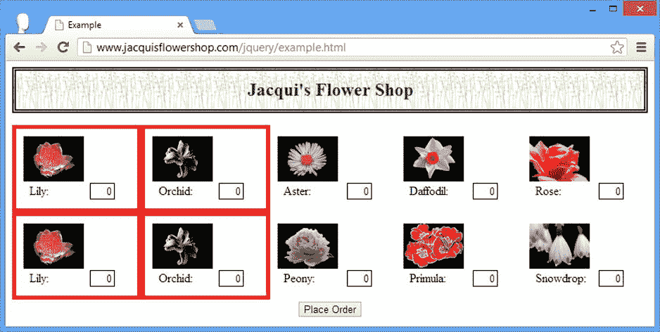

[图 7-2](#_Fig2) 。向多个选定元素添加多个新元素

作为使用`add`方法的替代方法，您可以向 DOM 修改方法传递多个元素，如[清单 7-6](#list6) 所示。这个列表产生了与图 7-2 中[所示相同的结果。](#Fig2)

***[清单 7-6](#_list6)*** 。向 prepend 方法传递多个参数

```js
...
<script type="text/javascript">
    $(document).ready(function() {

        var orchidElems = $("<div class='dcell'/>")
            .append("")
            .append("<label for='orchid'>Orchid:</label>")
            .append("<input name='orchid' value='0' required />");

        var lilyElems = $("<div class='dcell'/>")
            .append("")
            .append("<label for='lily'>Lily:</label>")
            .append("<input name='lily' value='0' required />");

        orchidElems.css("border", "thick solid red");
        lilyElems.css("border", "thick solid red");

        $("#row1, #row2").prepend(lilyElems, orchidElems);
    });
</script>
...
```

 **提示**我使用`css`方法在单独的语句中设置 CSS `border`属性，但这只是为了让示例更容易理解。事实上，我可以像任何其他 jQuery 方法一样链接对`css`方法的调用。

在不同的位置插入相同的元素

您只能向文档中添加一次新元素。此时，将它们用作 DOM 插入方法的参数会移动元素，而不是复制它们。清单 7-7 显示了这个问题。

***[清单 7-7](#_list7)*** 。向文档中添加新元素两次

```js
...
<script type="text/javascript">
    $(document).ready(function() {

        var orchidElems = $("<div class='dcell'/>")
            .append("")
            .append("<label for='orchid'>Orchid:</label>")
            .append("<input name='orchid' value='0' required />");

        var newElems = $("<div class='dcell'/>")
            .append("")
            .append("<label for='lily'>Lily:</label>")
            .append("<input name='lily' value='0' required />").add(orchidElems);

        newElems.css("border", "thick solid red");

        $("#row1").append(newElems);
        $("#row2").prepend(newElems);
    });
</script>
...
```

这个脚本的意图很清楚:将新元素追加到`row1`中，并将它们前置到`row2`中。当然，这不会发生，正如[图 7-3](#Fig3) 所示。

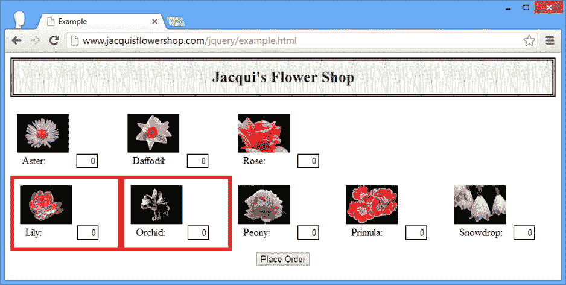

[图 7-3](#_Fig3) 。两次尝试向文档中添加新元素(但都失败了)

元素*被*附加到`row1`上，但是调用`prepend`的效果是移动元素，而不是添加两次。为了解决这个问题，您需要使用`clone`方法创建想要插入的元素的副本。清单 7-8 显示了修改后的脚本。

***[清单 7-8](#_list8)*** 。克隆元素，以便可以多次将它们添加到文档中

```js
...
<script type="text/javascript">
    $(document).ready(function() {

        var orchidElems = $("<div class='dcell'/>")
            .append("")
            .append("<label for='orchid'>Orchid:</label>")
            .append("<input name='orchid' value='0' required />");

        var newElems = $("<div class='dcell'/>")
            .append("")
            .append("<label for='lily'>Lily:</label>")
            .append("<input name='lily' value='0' required />").add(orchidElems);

        newElems.css("border", "thick solid red");

        $("#row1").append(newElems);
        $("#row2").prepend(newElems.clone());
    });
</script>
...
```

现在元素被复制并插入到两个位置，如图[图 7-4](#Fig4) 所示。

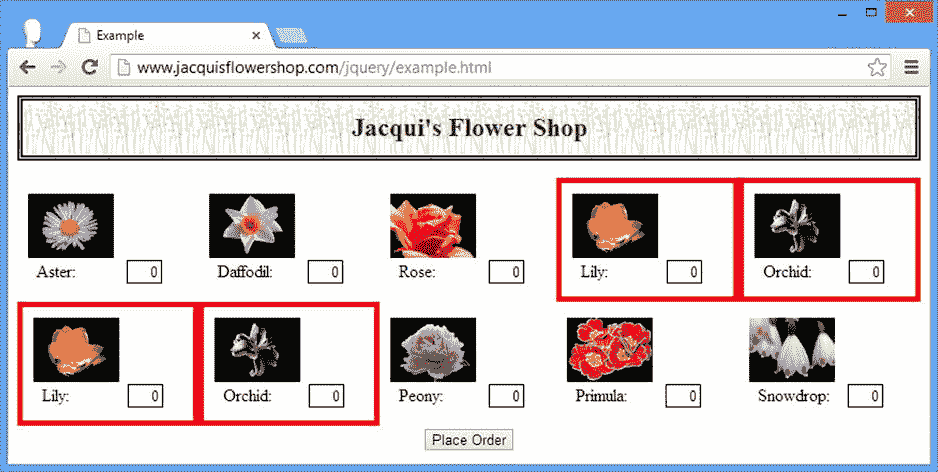

[图 7-4](#_Fig4) 。克隆和插入元素

从 jQuery 对象插入

您可以使用`appendTo`和`prependTo`方法来改变元素之间的关系，如[清单 7-9](#list9) 所示。

***[清单 7-9](#_list9)*** 。使用 appendTo 方法

```js
...
<script type="text/javascript">
    $(document).ready(function() {

        var newElems = $("<div class='dcell'/>");

        $("img").appendTo(newElems);

        $("#row1").append(newElems);
    });
</script>
...
```

我创建了`jQuery`对象来包含文档中的一个新的`div`元素和`img`元素。然后我使用`appendTo`方法添加`img`元素作为`div`元素的子元素。你可以在图 7-5 中看到结果。如您所见，该脚本的效果是将`img`元素移动到新的`div`元素，我将它附加到了`row1`元素上。

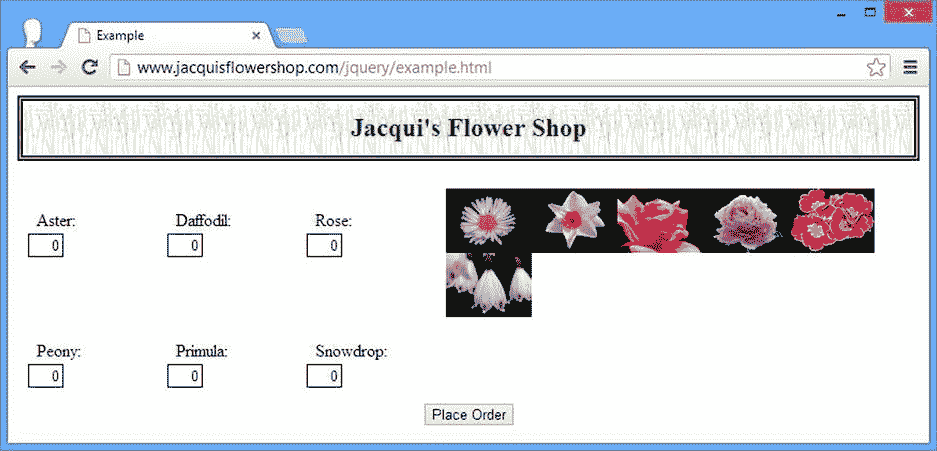

[图 7-5](#_Fig5) 。使用 appendTo 方法

使用函数插入元素

你可以将一个`function`传递给`append` 和`prepend`方法。这允许您动态地为`jQuery`对象选择的元素插入子元素，如[清单 7-10](#list10) 所示。

***[清单 7-10](#_list10)*** 。用函数动态添加子元素

```js
...
<script type="text/javascript">
    $(document).ready(function() {

        var orchidElems = $("<div class='dcell'/>")
            .append("")
            .append("<label for='orchid'>Orchid:</label>")
            .append("<input name='orchid' value='0' required />");

        var lilyElems = $("<div class='dcell'/>")
            .append("")
            .append("<label for='lily'>Lily:</label>")
            .append("<input name='lily' value='0' required />");

        $(orchidElems).add(lilyElems).css("border", "thick solid red");

        $("div.drow").append(function(index, html) {
            if (this.id == "row1") {
                return orchidElems;
            } else {
                return lilyElems;
            }
        });
    });
</script>
...
```

该函数为`jQuery`对象中的每个元素调用一次。传递给函数的参数是选择中元素的索引和正在处理的元素的 HTMLHTML 是一个字符串。此外，`this`变量的值被设置为适当的`HTMLElement`。该函数的结果将被追加或前置到正在处理的元素中。你可以返回一个 HTML 片段，一个或多个`HTMLElement`对象，或者一个`jQuery`对象。

在这个例子中，我准备为 lily 和 orchid 产品创建元素集，然后根据`id`属性的值从`append`函数返回它们。你可以在[图 7-6](#Fig6) 中看到结果。

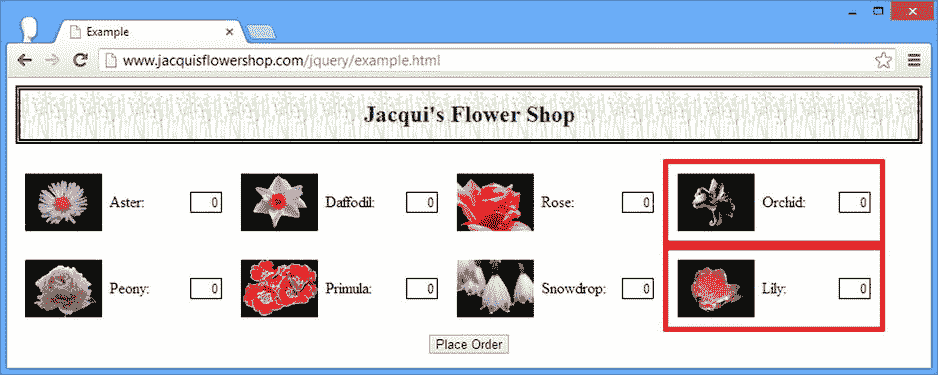

[图 7-6](#_Fig6) 。基于函数动态插入元素

插入父元素和祖先元素

jQuery 为您提供了一组插入元素作为其他元素的父元素或祖先元素的方法。这被称为*包装*(因为一个元素被另一个元素包装)。[表 7-3](#Tab3) 描述了这些方法。

[表 7-3](#_Tab3) 。包装元件的方法

| 方法 | 描述 |
| --- | --- |
| `wrap(HTML)``wrap(jQuery)`T2】 | 将指定的元素环绕在`jQuery`对象中的每个元素周围。 |
| `wrapAll(HTML)``wrapAll(jQuery)`T2】 | 将指定元素环绕在`jQuery`对象中的一组元素周围(作为一个组)。 |
| `wrapInner(HTML)``wrapInner(jQuery)`T2】 | 将指定元素环绕在`jQuery`对象中元素的内容周围。 |
| `wrap(function)` `wrapInner(function)` | 使用函数动态包装元素。 |

 **提示**包装方法的补充是`unwrap`，我将在本章后面的“移除元素”一节中描述它。

执行包装时，可以将多个元素作为参数传递，但必须确保只有一个内部元素。否则，jQuery 想不出该怎么办。这意味着参数中的每个元素最多只能有一个父元素和一个子元素。[清单 7-11](#list11) 演示了`wrap`方法 的使用。

***[清单 7-11](#_list11)*** 。使用换行方法

```js
...
<script type="text/javascript">
    $(document).ready(function() {

        var newElem = $("<div/>").css("border", "thick solid red");
        $("div.drow").wrap(newElem);

    });
</script>
...
```

在这个脚本中，我创建了一个新的`div`元素，并使用`css`方法为 CSS `border`属性设置一个值。然后我使用`wrap`方法将`div`元素作为父元素插入到文档中的所有`label`元素中。在[图 7-7](#Fig7) 中可以看到效果。

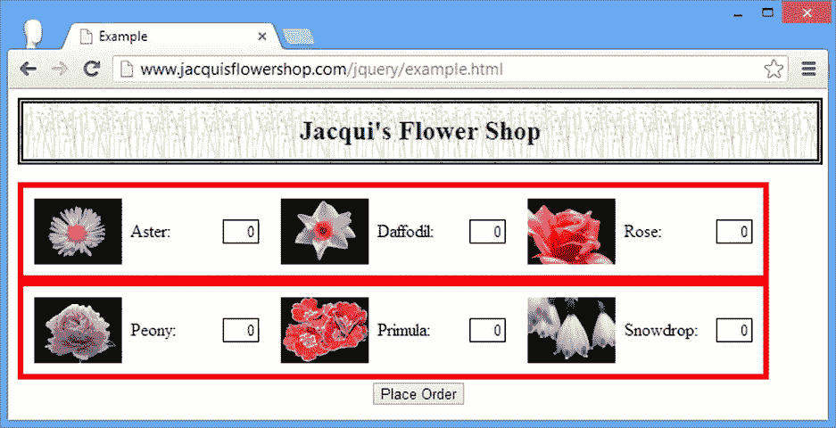

[图 7-7](#_Fig7) 。使用 wrap 方法向元素添加父元素

作为参数传递给`wrap`方法的元素被插入到`jQuery`对象中的每个元素和它们当前的父元素之间。举个例子，这段 HTML:

```js
...
<div class="dtable">
    <div id="row1" class="drow">
        ...
    </div>
    <div id="row2" class="drow">
        ...
    </div>
</div>
...
```

是这样转化的:

```js
...
<div class="dtable">
    <div style="...style properties...">
        <div id="row1" class="drow">
            ...
        </div>
    </div>
    <div style="...style properties...">
        <div id="row2" class="drow">
            ...
        </div>
    </div>
</div>
...
```

在单个父级中将元素包装在一起

当您使用`wrap`方法时，新元素被克隆，`jQuery`对象中的每个元素都有自己的新父元素。你可以使用`wrapAll`方法为几个元素插入一个父元素，如[清单 7-12](#list12) 所示。

***[清单 7-12](#_list12)*** 。使用 wrapAll 方法

```js
...
<script type="text/javascript">
    $(document).ready(function() {

        var newElem = $("<div/>").css("border", "thick solid red");
        $("div.drow").wrapAll(newElem);

    });
</script>
...
```

这个脚本中唯一的变化是使用了`wrapAll`方法。你可以在[图 7-8](#Fig8) 中看到效果。

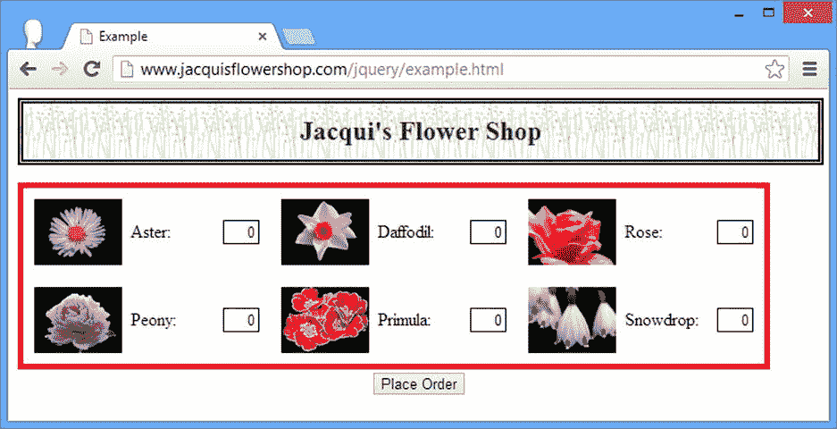

[图 7-8](#_Fig8) 。使用 wrapAll 方法

新元素用于将一个公共父元素插入到所选元素中，这样 HTML 就转换成这样:

```js
...
<div class="dtable">
    <div style="...style properties...">
        <div id="row1" class="drow">
            ...
        </div>
        <div id="row2" class="drow">
        </div>
    </div>
</div>
...
```

使用`wrapAll`方法时要小心。如果所选元素尚未共享一个公共父元素，则新元素将作为父元素插入到第一个所选元素中。然后，jQuery 将所有其他选定的元素移动到第一个元素的兄弟元素。清单 7-13 包含了一个演示这种行为的脚本。

***[清单 7-13](#_list13)*** 。在没有公共父级的元素上使用 wrapAll

```js
...
<script type="text/javascript">
    $(document).ready(function() {

        var newElem = $("<div/>").css("border", "thick solid red");
        $("img").wrapAll(newElem);

    });
</script>
...
```

我选择了文档中的`img`元素，它们都没有一个公共的父元素。你可以在[图 7-9](#Fig9) 中看到这个脚本的效果。新的`div`元素已经作为 aster 图像的父元素插入到文档中，所有其他图像都作为兄弟元素插入。

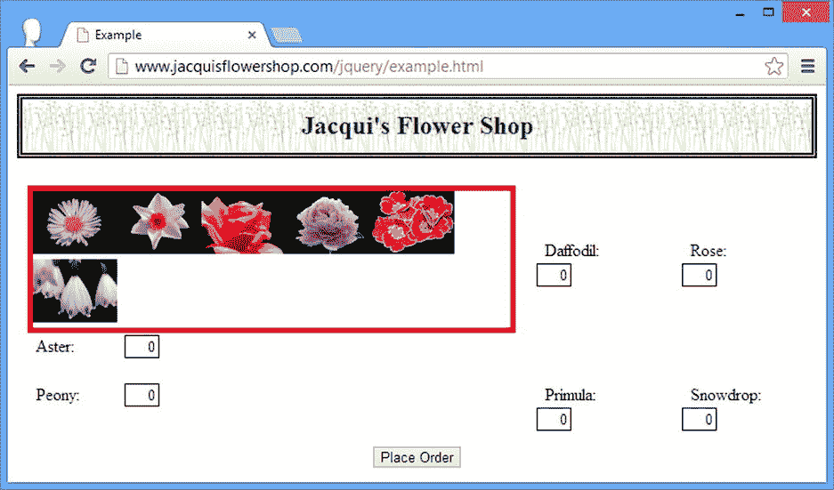

[图 7-9](#_Fig9) 。对不共享公共父级的元素使用 wrapAll

包装元素的内容

`wrapInner`方法 将元素包装在`jQuery`对象中元素的内容周围，如[清单 7-14](#list14) 所示。

***[清单 7-14](#_list14)*** 。使用 wrapInner 方法

```js
...
<script type="text/javascript">
    $(document).ready(function() {

        var newElem = $("<div/>").css("border", "thick solid red");
        $(".dcell").wrapInner(newElem);

    });
</script>
...
```

`wrapInner`方法在`jQuery`对象中的元素和它们的直接子元素之间插入新元素。在脚本中，我选择了属于`dcell`类的元素，并用一个新的`div`元素包装它们的内容。你可以在[图 7-10](#Fig10) 中看到效果。

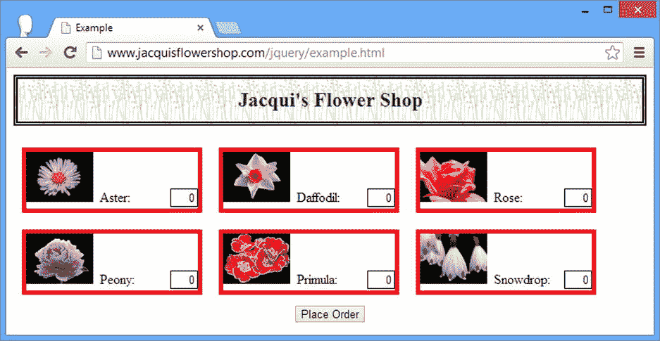

[图 7-10](#_Fig10) 。使用 wrapInner 方法

还可以通过使用`append`方法达到`wrapInner`方法的效果。仅供参考，下面是等效的脚本:

```js
...
<script type="text/javascript">
    $(document).ready(function() {

        var newElem = $("<div/>").css("border", "thick solid red");
        $(".dcell").each(function(index, elem) {
            $(elem).append(newElem.clone().append($(elem).children()));
        });

    });
</script>
...
```

我并不建议您使用这种方法(`wrapInner`方法更容易阅读，也更方便)，但是我认为这是一个很好的例子，说明了如何使用 jQuery 以不同的方式执行相同的任务。

使用函数包装元素

您可以向`wrap`和`wrapInner`方法传递一个函数来动态生成元素。为每个选定的元素调用该函数，并向其传递当前元素索引。特殊变量`this`被设置为要处理的元素。清单 7-15 中的脚本展示了如何动态包装元素。

***[清单 7-15](#_list15)*** 。动态包装元素

```js
...
<script type="text/javascript">
    $(document).ready(function() {

        $(".drow").wrap(function(index) {
            if ($(this).has("img[src*=rose]").length > 0) {
                return $("<div/>").css("border", "thick solid blue");;
            } else {
                return $("<div/>").css("border", "thick solid red");;
            }
        });

    });
</script>
...
```

在这个例子中，我使用一个带有`wrap`方法的函数，根据每个所选元素的后代定制新的父元素。你可以在[图 7-11](#Fig11) 中看到这个脚本的效果。

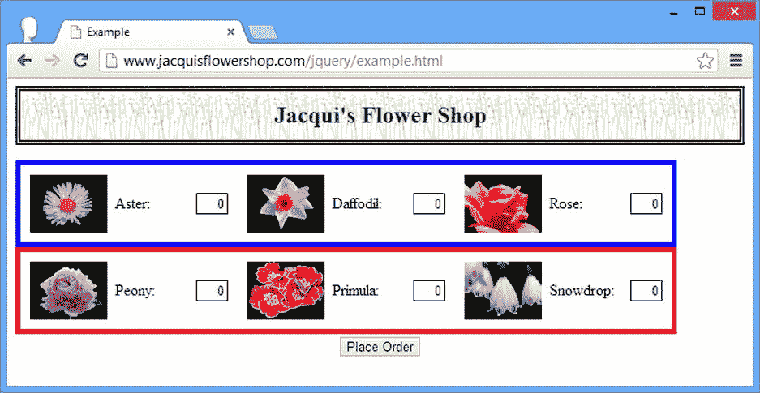

[图 7-11](#_Fig11) 。使用 wrap 方法和函数动态生成父元素

插入兄弟元素

jQuery 还提供了一组方法，将元素作为现有元素的兄弟元素插入到文档中，如[表 7-4](#Tab4) 中所述。

[表 7-4](#_Tab4) 。插入同级元素的方法

| 方法 | 描述 |
| --- | --- |
| `after(HTML)``after(jQuery)`T2】 | 将指定元素作为下一个兄弟元素插入到`jQuery`对象中的每个元素。 |
| `before(HTML)``before(jQuery)`T2】 | 将指定元素作为前一个兄弟元素插入到`jQuery`对象的每个元素中。 |
| `insertAfter(HTML)``insertAfter(jQuery)`T2】 | 将元素插入到`jQuery`对象中，作为参数中指定的每个元素的下一个兄弟元素。 |
| `insertBefore(HTML)``insertBefore(jQuery)`T2】 | 将元素插入到`jQuery`对象中，作为参数中指定的每个元素的前一个兄弟元素。 |
| `after(function)` `before(function)` | 使用函数动态插入同级。 |

`before`和`after`方法遵循您在文档中插入其他类型元素时看到的相同模式。清单 7-16 包含了两种方法的演示。

***[清单 7-16](#_list16)*** 。使用 before 和 after 方法

```js
...
<script type="text/javascript">
    $(document).ready(function() {

        var orchidElems = $("<div class='dcell'/>")
            .append("")
            .append("<label for='orchid'>Orchid:</label>")
            .append("<input name='orchid' value='0' required />");

        var lilyElems = $("<div class='dcell'/>")
            .append("")
            .append("<label for='lily'>Lily:</label>")
            .append("<input name='lily' value='0' required />");

        $(orchidElems).add(lilyElems).css("border", "thick solid red");

        $("#row1 div.dcell").after(orchidElems);
        $("#row2 div.dcell").before(lilyElems);

    });
</script>
...
```

在这个脚本中，我为兰花和百合创建了新的元素集，并将它们与`before`和`after`方法一起使用，将它们作为兄弟元素插入到`dcell`类中的每个元素中。兰花元素作为`row1`中所有元素的下一个兄弟元素插入，而百合元素作为`row2`中所有元素的前一个兄弟元素插入。你可以在[图 7-12](#Fig12) 中看到这个脚本的效果。

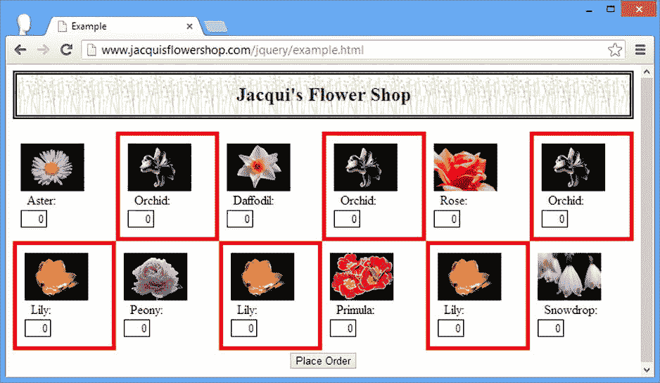

[图 7-12](#_Fig12) 。使用 before 和 after 元素创建同级

从 jQuery 对象插入同级

`insertAfter`和`insertBefore`方法在`jQuery`对象中插入元素，作为方法参数中元素的下一个或上一个兄弟元素。这与`after`和`before`方法的功能相同，但是`jQuery`对象和参数之间的关系是相反的。清单 7-17 显示了这些方法的使用。该脚本创建了相同的效果，如图 7-12 所示。

***[清单 7-17](#_list17)*** 。使用 insertAfter 和 InsertBefore 方法

```js
...
<script type="text/javascript">
    $(document).ready(function() {

        var orchidElems = $("<div class='dcell'/>")
            .append("")
            .append("<label for='orchid'>Orchid:</label>")
            .append("<input name='orchid' value='0' required />");

        var lilyElems = $("<div class='dcell'/>")
            .append("")
            .append("<label for='lily'>Lily:</label>")
            .append("<input name='lily' value='0' required />");

        $(orchidElems).add(lilyElems).css("border", "thick solid red");

        orchidElems.insertAfter("#row1 div.dcell");
        lilyElems.insertBefore("#row2 div.dcell");
    });
</script>
...
```

使用函数插入兄弟节点

您可以使用带有`after`和`before`方法的函数动态插入兄弟元素，就像父元素和子元素一样。[清单 7-18](#list18) 包含了一个动态生成兄弟元素的例子。

***[清单 7-18](#_list18)*** 。用函数动态生成兄弟元素

```js
...
<script type="text/javascript">
    $(document).ready(function() {

        $("#row1 div.dcell").after(function(index, html) {
            if (index == 0) {
                return $("<div class='dcell'/>")
                    .append("")
                    .append("<label for='orchid'>Orchid:</label>")
                    .append("<input name='orchid' value='0' required />")
                    .css("border", "thick solid red");
            } else if (index == 1) {
                return $("<div class='dcell'/>")
                    .append("")
                    .append("<label for='lily'>Lily:</label>")
                    .append("<input name='lily' value='0' required />")
                    .css("border", "thick solid red");
            }
        });

    });
</script>
...
```

在这个脚本中，当正在处理的元素的索引是`0`或`1`时，我使用`index`参数来生成兄弟元素。你可以在[图 7-13](#Fig13) 中看到这个脚本的效果。

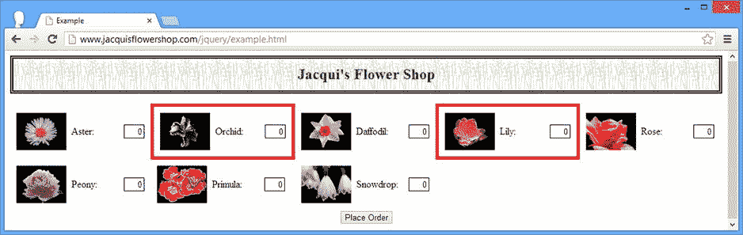

[图 7-13](#_Fig13) 。使用函数添加同级元素

更换元件

您可以使用[表 7-5](#Tab5) 中描述的方法将一组元素替换为另一组元素。

[表 7-5](#_Tab5) 。包装元件的方法

| 方法 | 描述 |
| --- | --- |
| `replaceWith(HTML)``replaceWith(jQuery)`T2】 | 用指定的内容替换`jQuery`对象中的元素。 |
| `replaceAll(jQuery)` `replaceAll(HTMLElement[])` | 用`jQuery`对象中的元素替换参数指定的元素。 |
| `replaceWith(function)` | 使用函数动态替换`jQuery`对象中的元素。 |

除了`jQuery`对象和参数的角色颠倒之外，`replaceWith`和`replaceAll`方法的工作方式相同。清单 7-19 展示了这两种方法。

***[清单 7-19](#_list19)*** 。使用 replaceWith 和 replaceAll 方法

```js
...
<script type="text/javascript">
    $(document).ready(function() {

        var newElems = $("<div class='dcell'/>")
                    .append("")
                    .append("<label for='orchid'>Orchid:</label>")
                    .append("<input name='orchid' value='0' required />")
                    .css("border", "thick solid red");

        $("#row1").children().first().replaceWith(newElems);

        $("").replaceAll("#row2 img")
            .css("border", "thick solid red");

    });
</script>
...
```

在这个脚本中，我使用`replaceWith`方法用新内容替换`row1 div`元素的第一个子元素(这具有用兰花替换紫苑的效果)。我还使用了`replaceAll`方法来替换所有的`img`元素，它们是带有康乃馨图像的`row2`的后代。你可以在[图 7-14](#Fig14) 中看到这个脚本的效果。

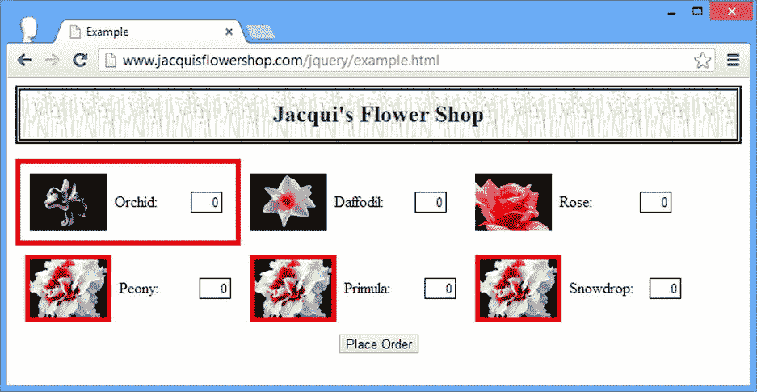

[图 7-14](#_Fig14) 。用 replaceWith 和 replaceAll 方法替换内容

使用函数替换元素

您可以通过向`replaceWith`方法传递一个函数来动态替换元素。这个函数没有传递任何参数，但是变量`this`被设置为正在处理的元素。清单 7-20 提供了一个演示。

***[清单 7-20](#_list20)*** 。使用函数替换元素

```js
...
<script type="text/javascript">
    $(document).ready(function() {
        $("div.drow img").replaceWith(function() {
            if (this.src.indexOf("rose") > -1) {
                return $("").css("border", "thick solid red");
            } else if (this.src.indexOf("peony") > -1) {
                return $("").css("border", "thick solid red");
            } else {
                return $(this).clone();
            }
         });
    });
</script>
...
```

在这个脚本中，我根据`src`属性替换了`img`元素。如果`src`属性包含`rose`，那么我用一个显示`carnation.png`的元素替换`img`元素。如果`src`属性包含`peony`，那么我用一个显示`lily.png`的元素替换这个元素。两个替换元素都有一个红色边框来突出显示它们的位置。

对于所有其他元素，我返回正在处理的元素的克隆，其效果是用元素本身的副本替换元素。你可以在[图 7-15](#Fig15) 中看到效果。

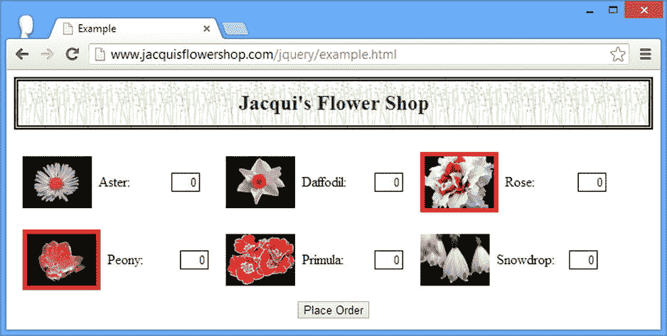

[图 7-15](#_Fig15) 。使用函数替换元素

 **提示**如果你不想替换一个元素，那么你可以简单的返回一个克隆体。如果不克隆元素，jQuery 最终会完全删除元素。当然，您可以通过缩小选择范围来避免这个问题，但这并不总是一个选项。

移除元素

为了补充插入和替换元素，jQuery 提供了一组从 DOM 中移除元素的方法，如[表 7-6](#Tab6) 中所述。

[表 7-6](#_Tab6) 。移除元素的方法

| 方法 | 描述 |
| --- | --- |
| `detach()` `detach(selector)` | 从 DOM 中移除元素。与元素相关联的数据被保留。 |
| `empty()` | 从`jQuery`对象的每个元素中删除所有子节点。 |
| `remove()` `remove(selector)` | 从 DOM 中移除元素。随着元素被移除，与元素相关联的数据被破坏。 |
| `unwrap()` | 移除`jQuery`对象中每个元素的父元素。 |

清单 7-21 展示了如何使用`remove`元素从 DOM 中移除元素。

***[清单 7-21](#_list21)*** 。用 remove 方法从 DOM 中移除元素

```js
...
<script type="text/javascript">
    $(document).ready(function() {
        $("img[src*=daffodil], img[src*=snow]").parent().remove();
    });
</script>
...
```

这个脚本选择`src`属性包含`daffodil`和`snow`的`img`元素，获取它们的父元素，然后删除它们。如果你传递一个选择器给`remove`方法，你可以过滤你移除的元素，如[清单 7-22](#list22) 所示。

***[清单 7-22](#_list22)*** 。使用选择器过滤要移除的元素

```js
...
<script type="text/javascript">
    $(document).ready(function() {
        $("div.dcell").remove(":has(img[src*=snow], img[src*=daffodil])");
    });
</script>
...
```

这两个脚本具有相同的效果，如图[图 7-16](#Fig16) 所示。

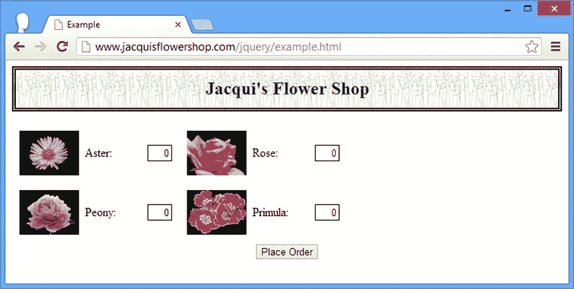

[图 7-16](#_Fig16) 。从 DOM 中移除元素

 **提示**从`remove`方法返回的`jQuery`对象包含原始的一组选定元素。换句话说，元素的移除不会反映在方法结果中。

分离元素

`detach`方法的工作方式与`remove`方法相同，只是保留了与元素相关的数据。我在第 8 章的[中解释了数据与元素的关联，但是对于这一章来说，如果你想在文档的其他地方插入元素，知道这通常是最好的方法就足够了。清单 7-23](08.html) 显示了正在使用的`detach`方法。

***[清单 7-23](#_list23)*** 。使用 detach 方法移除元素，同时保留关联的数据

```js
...
<script type="text/javascript">
    $(document).ready(function() {
        $("#row2").append($("img[src*=aster]").parent().detach());
    });
</script>
...
```

这个脚本分离出`img`元素的父元素，该元素的`src`属性包含`aster`。然后使用我在本章前面描述的`append`方法将元素插回到文档中。我倾向于不用这种方法，因为用`append`不用`detach`效果一样。您可以重写清单中的关键语句，如下所示:

```js
...
$("#row2").append($("img[src*=aster]").parent());
...
```

你可以在[图 7-17](#Fig17) 中看到脚本的效果。

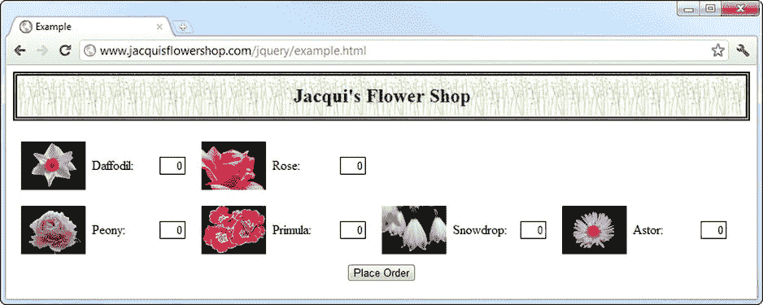

[图 7-17](#_Fig17) 。使用分离元素

清空元素

`empty`方法从`jQuery`对象的元素中移除任何后代和文本。元素本身被留在文档中，如清单 7-24 所示。

***[清单 7-24](#_list24)*** 。使用空方法

```js
...
<script type="text/javascript">
    $(document).ready(function() {
        $("#row1").children().eq(1).empty().css("border", "thick solid red");
    });
</script>
...
```

在这个脚本中，我选择索引 1 处的`row1`元素的子元素，并调用`empty`方法。为了让变化更加明显，我使用`css`方法添加了一个边框。你可以在[图 7-18](#Fig18) 中看到效果。

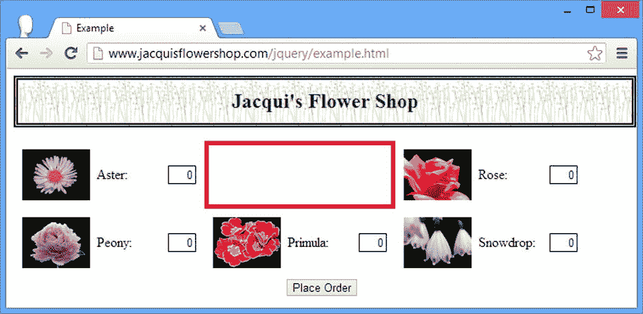

[图 7-18](#_Fig18) 。使用空方法

展开元素

`unwrap`方法移除`jQuery`对象中元素的父元素。所选元素成为其祖父元素的子元素。[清单 7-25](#list25) 显示了正在使用的`unwrap`方法。

***[清单 7-25](#_list25)*** 。使用展开方法

```js
...
<script type="text/javascript">
    $(document).ready(function () {
        $("div.dcell").unwrap();
    });
</script>
...
```

在这个脚本中，我选择了属于`dcell`类的`div`元素，并调用了`unwrap`方法。这具有移除`row1`和`row2`元素的效果，如图[图 7-19](#Fig19) 所示。

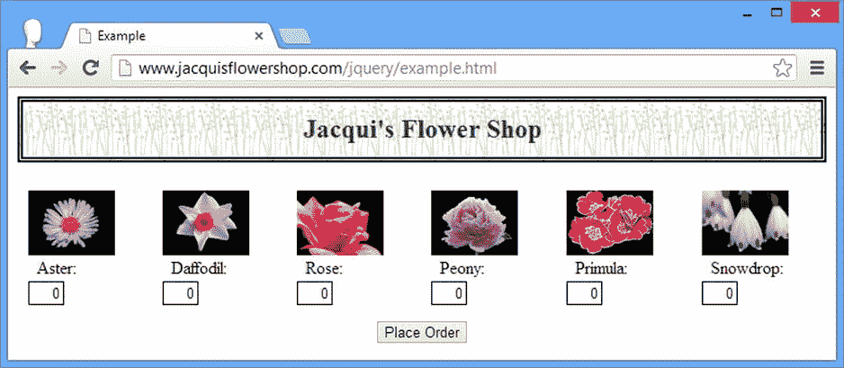

[图 7-19](#_Fig19) 。使用展开方法

摘要

在本章中，我向您展示了如何使用 jQuery 来操作 DOM。我向您展示了如何创建新元素，以及将元素(新的或现有的)作为子元素、父元素和兄弟元素插入 DOM 的许多不同方式。我还向您展示了如何在 DOM 中移动元素以及如何完全移除元素。在第 8 章中，我将向您展示如何使用 jQuery 来操作 DOM 中的元素。