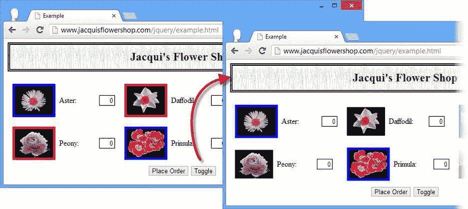

# 八、操纵元素

在这一章中，我将向您展示如何使用 jQuery 操作元素，包括如何获取和设置属性，如何使用 jQuery 方便的方法处理类和 CSS 属性，以及如何获取和设置 HTML 和文本内容。我还向您展示了一个很好的特性，它允许您将数据与元素相关联。表 8-1 对本章进行了总结。

表 8-1 。章节总结

| 问题 | 解决办法 | 列表 |
| --- | --- | --- |
| 从`jQuery`对象中的第一个元素获取属性值 | 使用`attr`方法 | one |
| 从`jQuery`对象中的每个元素获取属性值 | 一起使用`each`和`attr`方法 | Two |
| 为`jQuery`对象中的所有元素设置属性 | 使用`attr`方法，可以选择使用函数 | three |
| 在一次操作中设置多个属性 | 对地图对象使用`attr`方法 | 4, 5 |
| 取消设置属性 | 使用`removeAttr`方法 | six |
| 获取或设置由`HTMLElement`对象定义的属性 | 使用与`attr`方法相对应的`prop` | seven |
| 控制元素所属的类 | 使用`addClass`、`hasClass`和`removeClass`方法，可以选择使用函数 | 8–10 |
| 切换元素所属的类 | 使用`toggleClass`方法 | 11–16 |
| 设置`style`属性的内容 | 使用`css`方法 | 17–21 |
| 获取元素位置的详细信息 | 使用 CSS 属性特定的方法 | 22–24 |
| 获取或设置元素的文本或 HTML 内容 | 使用`text`或`html`方法 | 25–27 |
| 获取或设置表单元素的值 | 使用`val`方法 | 28–30 |
| 将数据与元素相关联 | 使用`data`方法 | Thirty-one |

自上一版以来，JQUERY 发生了变化

jQuery 1.9/2.0 引入了一个新版本的`css`方法，它允许获取多个 CSS 属性的值——详见“获取多个 CSS 属性”一节。

jQuery 1.9/2.0 还强制分离了`attr`和`prop`方法的角色。在早期版本中，jQuery 允许用户使用`attr`方法，而为了保持与 1.6 之前版本的向后兼容性，应该使用`prop`方法，而 1.6 之前的版本是添加了`prop`方法。

最后一个变化是 jQuery 的当前版本允许使用`attr`方法来设置`input`元素上的`type`属性值，前提是浏览器支持。小心使用这个特性，因为如果浏览器*不支持它，jQuery 将抛出一个异常，这包括旧版本的 Internet Explorer。我的建议是，当你需要不同类型的`input`元素时，替换元素，完全避免这个问题。*

使用属性和属性

您可以获取并设置`jQuery`对象中元素的属性值。表 8-2 显示了与属性相关的方法。

表 8-2 。使用属性的方法

| 方法 | 描述 |
| --- | --- |
| `attr(name)` | 为`jQuery`对象中的第一个元素获取具有指定名称的属性值 |
| `attr(name, value)` | 将具有指定名称的属性值设置为`jQuery`对象中所有元素的指定值 |
| `attr(map)` | 为`jQuery`对象中的所有元素设置在地图对象中指定的属性 |
| `attr(name, function)` | 使用函数为`jQuery`对象中的所有元素设置指定的属性 |
| `removeAttr(name)` `removeAttr(name[])` | 从`jQuery`对象的所有元素中删除属性 |
| `prop(name)` | 返回`jQuery`对象中第一个元素的指定属性值 |
| `prop(name, value)` `prop(map)` | 为`jQuery`对象中的所有元素设置一个或多个属性值 |
| `prop(name, function)` | 使用函数为`jQuery`对象中的所有元素设置指定属性的值 |
| `removeProp(name)` | 从`jQuery`对象的所有元素中删除指定的属性 |

当用单个参数调用`attr`方法时，jQuery 从选择中的第一个元素返回指定属性的值。清单 8-1 包含了一个演示。

***清单 8-1*** 。读取属性的值

```js
<!DOCTYPE html>
<html>
<head>
    <title>Example</title>
    <script src="jquery-2.0.2.js" type="text/javascript"></script>
    <link rel="stylesheet" type="text/css" href="styles.css"/>
    <script type="text/javascript">
        $(document).ready(function() {
            var srcValue = $("img").attr("src");
            console.log("Attribute value: " + srcValue);
        });
    </script>
</head>
<body>
    <h1>Jacqui's Flower Shop</h1>
    <form method="post">
        <div id="oblock">
            <div class="dtable">
                <div id="row1" class="drow">
                    <div class="dcell">
                        <label for="aster">Aster:</label>
                        <input name="aster" value="0" required />
                    </div>
                    <div class="dcell">
                        <label for="daffodil">Daffodil:</label>
                        <input name="daffodil" value="0" required />
                    </div>
                    <div class="dcell">
                        <label for="rose">Rose:</label>
                        <input name="rose" value="0" required />
                    </div>
                </div>
                <div id="row2"class="drow">
                    <div class="dcell">
                        <label for="peony">Peony:</label>
                        <input name="peony" value="0" required />
                    </div>
                    <div class="dcell">
                        <label for="primula">Primula:</label>
                        <input name="primula" value="0" required />
                    </div>
                    <div class="dcell">
                        <label for="snowdrop">Snowdrop:</label>
                        <input name="snowdrop" value="0" required />
                    </div>
                </div>
            </div>
        </div>
        <div id="buttonDiv"><button type="submit">Place Order</button></div>
    </form>
</body>
</html>
```

在这个脚本中，我选择了文档中所有的`img`元素，然后使用`attr`方法获取`src`属性的值。当您读取属性值时，`attr`方法的结果是一个字符串，我将它写到控制台。该脚本的控制台输出如下:

```js
Attribute value: aster.png
```

`each`方法可以与`attr`结合使用，读取 jQuery 对象中所有元素的属性值。我在第五章中描述了`each`方法，而清单 8-2 展示了你如何在这种情况下使用它。

***清单 8-2*** 。使用 each 和 attr 方法从多个对象读取属性值

```js
...
<script type="text/javascript">
    $(document).ready(function() {
        $("img").each(function(index, elem) {
            var srcValue = $(elem).attr("src");
            console.log("Attribute value: " + srcValue);
        });
    });
</script>
...
```

在这个脚本中，我将`HTMLElement`对象作为参数传递给函数，通过`$`函数创建一个新的`jQuery`对象。该对象只包含一个元素，非常适合于`attr`方法。该脚本的控制台输出如下:

```js
Attribute value: aster.png
Attribute value: daffodil.png
Attribute value: rose.png
Attribute value: peony.png
Attribute value: primula.png
Attribute value: snowdrop.png
```

设置一个属性值

当`attr`方法被用来设置一个属性值时，这个改变被应用到`jQuery`对象中所有元素的*中。这与该方法的 read 版本形成对比，后者只从第一个*元素*返回一个值。清单 8-3 展示了如何设置一个属性。*

***清单 8-3*** 。设置属性

```js
...
<script type="text/javascript">
    $(document).ready(function() {
        $("img").attr("src", "lily.png");
    });
</script>
...
```

 **提示**当设置一个值时，`attr`方法返回一个 jQuery 对象，这意味着你可以执行方法链接。

我选择了所有的`img`元素，并将`src`属性的值设置为`lily.png`。该值应用于所有选中元素的`src`属性，您可以在图 8-1 中看到效果。


图 8-1 。为多个元素设置相同的属性值

设置多个属性

通过向`attr`方法传递一个对象，可以在一个方法调用中设置多个属性。该对象的属性被解释为属性名，属性值将被用作属性值。这就是所谓的*地图对象*??。清单 8-4 提供了一个演示。

***清单 8-4*** 。使用地图对象设置多个元素

```js
...
<script type="text/javascript">
    $(document).ready(function() {
        var attrValues = {
            src: "lily.png",
            style: "border: thick solid red"
        };

        $("img").attr(attrValues);
    });
</script>
...
```

在这个脚本中，我创建了一个 map 对象，它具有名为`src`和`style`的属性。我选择文档中的`img`元素，并将地图对象传递给`attr`值。你可以在图 8-2 中看到效果。


图 8-2 。使用 attr 方法设置多个属性

 **提示**虽然我已经在这个例子中明确设置了`style`属性，但是 jQuery 提供了一些简化 CSS 工作的方法。有关详细信息，请参见“使用 CSS”一节。

动态设置属性值

您可以通过向`attr`方法传递一个函数来定制分配给属性的值。清单 8-5 提供了一个演示。

***清单 8-5*** 。使用函数设置属性值

```js
...
<script type="text/javascript">
    $(document).ready(function() {
        $("img").attr("src", function(index, oldVal) {
            if (oldVal.indexOf("rose") > -1) {
                return "lily.png";
            } else if ($(this).closest("#row2").length > 0) {
                return "carnation.png";
            }
        });
    });
</script>
...
```

传递给该函数的参数是正在处理的元素的索引和旧属性值。将`this`变量设置为正在处理的`HTMLElement`。如果你想改变属性，那么你的函数必须返回一个包含新值的字符串。如果没有返回结果，则使用现有值。在清单 8-5 中，我使用函数有选择地改变`img`元素显示的图像。你可以在图 8-3 中看到效果。


图 8-3 。使用函数更改属性值

删除属性

你可以通过使用`removeAttr`方法删除(取消设置)属性，如清单 8-6 所示。

***清单 8-6*** 。删除属性值

```js
...
<script type="text/javascript">
    $(document).ready(function() {

        $("img").attr("style", "border: thick solid red");
        $("img:odd").removeAttr("style");

    });
</script>
...
```

我使用`attr`方法设置`style`属性，然后使用`removeAttr`方法从奇数编号的元素中删除相同的属性。你可以在图 8-4 中看到效果。


图 8-4 。从元素中移除属性

使用属性

对于每种形式的`attr`方法，都有相应的`prop`方法。不同之处在于，`prop`方法处理由`HTMLElement`对象定义的属性，而不是属性值。通常，属性和特性是相同的，但情况并非总是如此。一个简单的例子是`class`属性，它使用`className`属性在`HTMLElement`对象中表示。清单 8-7 显示了使用`prop`方法来读取这个属性。

***清单 8-7*** 。使用 prop 方法读取属性值

```js
...
<script type="text/javascript">
    $(document).ready(function() {
        $("*[class]").each(function(index, elem) {
            console.log("Element:" + elem.tagName + " " + $(elem).prop("className"));
        });
    });
</script>
...
```

在这个例子中，我选择了所有具有`class`属性的元素，并使用`each`方法来枚举它们。对于每个元素，我打印出`type`和`className`属性的值，产生以下控制台输出:

```js
Element:DIV dtable
Element:DIV drow
Element:DIV dcell
Element:DIV dcell
Element:DIV dcell
Element:DIV drow
Element:DIV dcell
Element:DIV dcell
Element:DIV dcell
```

使用类

虽然您可以使用通用的属性方法来管理类，但是 jQuery 提供了一组更方便的方法。表 8-3 描述了这些方法。HTML 文档中类最常见的用途是让浏览器应用一组在`style`元素中定义的 CSS 属性。详见第七章。

表 8-3 。使用类的方法

| 方法 | 描述 |
| --- | --- |
| `addClass(name name)` | 将`jQuery`对象中的所有元素添加到指定的类中 |
| `addClass(function)` | 将`jQuery`对象中的元素动态分配给类 |
| `hasClass(name)` | 如果`jQuery`对象中至少有一个元素是指定类的成员，则返回`true` |
| `removeClass(name name)` | 从指定的类中移除`jQuery`对象中的元素 |
| `removeClass(function)` | 从类中动态移除`jQuery`对象中的元素 |
| `toggleClass()` | 切换`jQuery`对象中的元素所属的所有类 |
| `toggleClass(boolean)` | 在一个方向上切换`jQuery`对象中的元素所属的所有类 |
| `toggleClass(name)` `toggleClass(name name)` | 为`jQuery`对象中的所有元素切换一个或多个命名类 |
| `toggleClass(name, boolean)` | 单向切换`jQuery`对象中所有元素的命名类 |
| `toggleClass(function, boolean)` | 动态切换一个`jQuery`对象中所有元素的类 |

可以使用`addClass`方法 将元素分配给类，使用`removeClass`方法从类中移除元素，并使用`hasClass`方法确定元素是否属于某个类。清单 8-8 展示了所有三种正在使用的方法。

***清单 8-8*** 。添加、移除和测试类成员资格

```js
...
<style type="text/css">
    img.redBorder {border: thick solid red}
    img.blueBorder {border: thick solid blue}
</style>
<script type="text/javascript">
    $(document).ready(function() {

        $("img").addClass("redBorder");
        $("img:even").removeClass("redBorder").addClass("blueBorder");

        console.log("All elements: " + $("img").hasClass("redBorder"));
        $("img").each(function(index, elem) {
            console.log("Element: " + $(elem).hasClass("redBorder") + " " + elem.src);
        });

    });
</script>
...
```

首先，我使用了一个`style`元素来定义两种基于类成员的样式。不一定要用类来管理 CSS，但是它们使得本章中演示变化的效果更加容易。

我选择文档中所有的`img`元素，并使用`addClass`方法将它们分配给`redBorder`类。然后我选择偶数编号的`img`元素，将它们从`redBorder`类中移除，并使用`removeClass`方法将它们分配给`blueBorder`类。

 **提示**`addClass`方法不会从元素中移除任何现有的类；它只是在已经应用的类之外添加了新的类。

最后，我使用`hasClass`方法来测试所有`img`元素集合上的`redBorder`类(如果至少有一个元素是该类的成员，则返回`true`)和每个元素。你可以在图 8-5 中看到类成员的效果。


图 8-5 。通过类成员关系应用样式

我测试类成员的脚本输出如下:

```js
All elements: true
Element: falsehttp://www.jacquisflowershop.com/jquery/aster.png
Element: truehttp://www.jacquisflowershop.com/jquery/daffodil.png
Element: falsehttp://www.jacquisflowershop.com/jquery/rose.png
Element: truehttp://www.jacquisflowershop.com/jquery/peony.png
Element: falsehttp://www.jacquisflowershop.com/jquery/primula.png
Element: truehttp://www.jacquisflowershop.com/jquery/snowdrop.png
```

使用函数添加和移除类

通过向`addClass`或`removeClass`方法传递一个函数，您可以动态地决定应该从一组元素中添加或删除哪些类。清单 8-9 展示了使用`addClass`方法的函数。

***清单 8-9*** 。将 addClass 方法与函数一起使用

```js
...
<style type="text/css">
    img.redBorder {border: thick solid red}
    img.blueBorder {border: thick solid blue}
</style>
<script type="text/javascript">
    $(document).ready(function() {
        $("img").addClass(function(index, currentClasses) {
            if (index % 2 == 0) {
                return "blueBorder";
            } else {
                return "redBorder";
            }
        });
    });
</script>
...
```

该函数的参数是元素的索引和该元素所属的当前类集。对于类似的函数，jQuery 将变量`this`设置为正在处理的元素的`HTMLElement`对象。您返回希望元素加入的类。在这个例子中，我使用了`index`参数为`blueBorder`或`redBorder`类分配替换元素。效果与图 8-5 中所示的效果相同。

您可以采用类似的方法从类中移除元素。你传递一个函数给`removeClass`方法，如清单 8-10 所示。

***清单 8-10*** 。使用函数从类中移除元素

```js
...
<style type="text/css">
    img.redBorder {border: thick solid red}
    img.blueBorder {border: thick solid blue}
</style>
<script type="text/javascript">
    $(document).ready(function() {

        $("img").filter(":odd").addClass("redBorder").end()
            .filter(":even").addClass("blueBorder");

        $("img").removeClass(function(index, currentClasses) {
            if ($(this).closest("#row2").length > 0
                &&currentClasses.indexOf("redBorder") > -1) {
                    return "redBorder";
            } else {
                return "";
            }
        });
    });
</script>
...
```

在这个脚本中，我传递给`removeClass`方法的`function`使用`HTMLElement`对象和当前的一组类从任何作为成员的`img`元素中删除`redBorder`类，该元素是 ID 为`row2`的元素的后代。你可以在图 8-6 中看到这个脚本的效果。


图 8-6 。使用函数删除类

 **提示**注意，当我不想删除任何类时，我返回空字符串。如果不返回值，jQuery 将从元素中移除所有的类。

切换类别

在最基本的形式中，切换一个类意味着将它添加到任何不是成员的元素中，并从任何是成员的元素中移除它。你可以通过将你想要切换的类名传递给`toggleClass`方法来达到这个效果，如清单 8-11 所示。

***清单 8-11*** 。使用 toggleClass 方法

```js
...
<style type="text/css">
    img.redBorder {border: thick solid red}
    img.blueBorder {border: thick solid blue}
</style>
<script type="text/javascript">
    $(document).ready(function() {

        $("img").filter(":odd").addClass("redBorder").end()
            .filter(":even").addClass("blueBorder");

        $("<button>Toggle</button>").appendTo("#buttonDiv").click(doToggle);

        function doToggle(e) {
            $("img").toggleClass("redBorder");
            e.preventDefault();
        };

    });
</script>
...
```

我通过将`redBorder`类应用于奇数编号的`img`元素并将`blueBorder`类应用于偶数编号的元素来开始这个脚本。然后我创建了一个`button`元素，并将其添加到`id`为`buttonDiv`的元素中。这将我的新`button`放在已经在页面上的旁边。我已经使用了`click`方法来指定当用户单击`button`时 jQuery 将调用的函数。这是 jQuery 对事件支持的一部分，我在第九章中有完整的描述。

点击按钮时执行的功能称为`doToggle` ，关键语句为

```js
...
$("img").toggleClass("redBorder");
...
```

该语句选择文档中所有的`img`元素，并切换`redBorder`类。函数的参数和对`preventDefault`方法的调用在本章中并不重要，我会在第九章的中解释它们。你可以在图 8-7 中看到这个脚本的效果，尽管这种例子在你将文档加载到浏览器中并自己点击`button`时最有意义。



图 8-7 。使用 toggleClass 方法切换类成员身份

如果你特别善于观察，你会注意到图中有些奇怪的地方。那些有红色边框的元素已经没有了，但是以蓝色边框开始的元素仍然有蓝色边框。正如所料，jQuery 从奇数编号的`img`元素中移除了`redBorder`类，并将其添加到偶数编号的元素中，但是添加了`redBorder`类的元素也是`blueBorder`的成员。在`style`元素中的`redBorder`之后定义了`blueBorder`样式，这意味着它的属性值具有更高的优先级，正如我在第三章中解释的那样。因此，类切换是有效的，但是你也必须考虑 CSS 的微妙之处。如果你想让红色边框显示出来，那么你可以颠倒样式的声明顺序，如清单 8-12 所示。

***清单 8-12*** 。匹配样式声明以适应类切换

```js
...
<style type="text/css">
    img.blueBorder {border: thick solid blue}
    img.redBorder {border: thick solid red}
</style>
<script type="text/javascript">
    $(document).ready(function() {
        $("img").filter(":odd").addClass("redBorder").end()
            .filter(":even").addClass("blueBorder");

        $("<button>Toggle</button>").appendTo("#buttonDiv").click(doToggle);

        function doToggle(e) {
            $("img").toggleClass("redBorder");
            e.preventDefault();
        };
    });
</script>
...
```

现在，当一个元素同时属于`blueBorder`和`redBorder`类时，浏览器将使用`border`属性的`redBorder`设置。你可以在图 8-8 中看到这种变化的效果。


图 8-8 。协调 CSS 声明顺序和类切换的效果

切换多个类别

您可以向`toggleClass`方法提供多个类名称，用空格分隔，每个名称将为所选元素切换。清单 8-13 显示了一个例子。

***清单 8-13*** 。切换多个类别

```js
...
<style type="text/css">
    img.blueBorder {border: thick solid blue}
    img.redBorder {border: thick solid red}
</style>
<script type="text/javascript">
    $(document).ready(function() {

        $("img").filter(":odd").addClass("redBorder").end()
            .filter(":even").addClass("blueBorder");

        $("<button>Toggle</button>").appendTo("#buttonDiv").click(doToggle);

        function doToggle(e) {
            $("img").toggleClass("redBorder blueBorder");
            e.preventDefault();
        };

    });
</script>
...
```

在这个例子中，我在所有的`img`元素上切换了`redBorder`和`blueBorder`类。你可以在图 8-9 中看到效果。


图 8-9 。切换多个元素

切换所有类别

您可以通过不带参数调用`toggleClass`方法来切换一组元素所属的所有类。这是一项巧妙的技术，因为 jQuery 存储了已经切换的类，因此它们可以被正确地应用和删除。清单 8-14 包含了一个使用该方法的例子。

***清单 8-14*** 。切换选定元素的所有类别

```js
...
<style type="text/css">
    img.blueBorder {border: thick solid blue}
    img.redBorder {border: thick solid red}
    label.bigFont {font-size: 1.5em}
</style>
<script type="text/javascript">
    $(document).ready(function() {

        $("img").filter(":odd").addClass("redBorder").end()
            .filter(":even").addClass("blueBorder");
        $("label").addClass("bigFont");

        $("<button>Toggle</button>").appendTo("#buttonDiv").click(doToggle);

        function doToggle(e) {
            $("img, label").toggleClass();
            e.preventDefault();
        };

    });
</script>
...
```

在这个例子中，我使用了`addClass`方法向`img`和`label`元素添加类。当点击`Toggle`按钮时，我选择这些相同的元素，并不带任何参数地调用`toggleClass`方法。你得到一个特定的效果，如图图 8-10 所示。


图 8-10 。切换元素的所有类

当您第一次单击该按钮时，选定元素的所有类都被关闭。jQuery 会记下哪些类被删除，以便在您再次单击按钮时可以重新应用它们。

向一个方向切换类别

您可以通过向`toggleClass`方法传递一个`boolean`参数来限制切换的执行方式。如果你通过了`false`，等级只会被移除，如果你通过了`true`，等级只会被增加。清单 8-15 给出了一个例子。

***清单 8-15*** 。限制切换方向

```js
...
<style type="text/css">
    img.blueBorder {border: thick solid blue}
    img.redBorder {border: thick solid red}
</style>
<script type="text/javascript">
    $(document).ready(function() {

        $("img").filter(":odd").addClass("redBorder").end()
            .filter(":even").addClass("blueBorder");

        $("<button>Toggle On</button>").appendTo("#buttonDiv").click(doToggleOn);
        $("<button>Toggle Off</button>").appendTo("#buttonDiv").click(doToggleOff);

        function doToggleOff(e) {
            $("img, label").toggleClass("redBorder", false);
            e.preventDefault();
        };
        function doToggleOn(e) {
            $("img, label").toggleClass("redBorder", true);
            e.preventDefault();
        };
    });
</script>
...
```

我在文档中添加了两个`button`元素，每个元素将只在一个方向上切换`redBorder`类。一旦其中一个`button`元素被点击，它将没有进一步的影响，直到另一个`button`也被点击(因为每个`button`只在一个方向切换类)。你可以在图 8-11 中看到效果。


图 8-11 。单向切换类别

动态切换类别

您可以通过向`toggleClass`方法传递一个函数来决定应该为元素动态地切换哪些类。清单 8-16 提供了一个简单的演示。

***清单 8-16*** 。用函数切换类

```js
...
<style type="text/css">
    img.blueBorder {border: thick solid blue}
    img.redBorder {border: thick solid red}
</style>
<script type="text/javascript">
    $(document).ready(function() {

        $("img").addClass("blueBorder");
        $("img:even").addClass("redBorder");

        $("<button>Toggle</button>").appendTo("#buttonDiv").click(doToggle);

        function doToggle(e) {
            $("img").toggleClass(function(index, currentClasses) {
                if (index % 2 == 0) {
                   return "redBorder";
                } else {
                    return "";
                }
            });
            e.preventDefault();
        };
    });
</script>
...
```

我将`blueBorder`类应用于所有的`img`元素，将`redBorder`类应用于偶数的`img`元素。该函数的参数是您正在处理的元素的索引和它所属的当前类集。此外，`this`变量被设置为当前元素的`HTMLElement`对象。该函数的结果是应该切换的类的名称。如果您不想切换元素的任何类，那么您返回空字符串(不返回元素的结果将切换它的所有类)。你可以在图 8-12 中看到清单创建的效果。


图 8-12 。动态切换类别

使用 CSS

在前面的例子中，我使用了基本的属性方法来设置`style`属性的值，以定义一组元素的 CSS 属性值。jQuery 提供了一组便利的元素，使得处理 CSS 更加容易。表 8-4 描述了这些方法中最广泛使用的`css`

表 8-4 。css 方法

| 方法 | 描述 |
| --- | --- |
| `css(name)` | 从`jQuery`对象中的第一个元素获取指定属性的值 |
| `css(names)` | 获取多个 CSS 属性的值，以数组形式表示 |
| `css(name, value)` | 设置`jQuery`对象中所有元素的特定属性值 |
| `css(map)` | 使用地图对象为`jQuery`对象中的所有元素设置多个属性 |
| `css(name, function)` | 使用函数为`jQuery`对象中的所有元素设置指定属性的值 |

 **提示**这些方法操作单个元素的`style`属性。如果你想使用在一个`style`元素中定义的样式，那么你应该使用本章前面描述的与类相关的方法。

获取和设置单个 CSS 值

要读取 CSS 属性的值，需要将属性名传递给`css`方法。您收到的只是来自`jQuery`对象中第一个元素的值。但是，当您设置属性时，更改将应用于所有元素。清单 8-17 展示了`css`属性的基本用法。

***清单 8-17*** 。使用 css 方法获取和设置 CSS 属性值

```js
...
<script type="text/javascript">
    $(document).ready(function() {
        var sizeVal = $("label").css("font-size");
        console.log("Size: " + sizeVal);
        $("label").css("font-size", "1.5em");
    });
</script>
...
```

 **提示**虽然我使用了实际的属性名(`font-size`)而不是由`HTMLElement`对象(`fontSize`)定义的 camel-case 属性名，但是 jQuery 很高兴两者都支持。

在这个脚本中，我选择了所有的`label`元素，并使用`css`方法获取`font-size`属性的值，并将其写入控制台。然后，我再次选择所有的`label`元素，并对它们应用相同属性的新值。

该脚本的输出如下:

```js
Size: 16px
```

 **提示**将属性设置为空字符串(`""`)具有从元素的`style`属性中移除属性的效果。

获取多个 CSS 属性

通过向`css`方法传递一个属性名数组，可以获得多个 CSS 属性的值。此方法返回一个对象，该对象具有数组中每个名称的属性，并且该对象中每个属性的值被设置为所选内容中第一个元素的相应 CSS 属性的值。在清单 8-18 的中，您可以看到我是如何使用`css`方法来获取三个 CSS 属性的值的。

***清单 8-18*** 。使用 css 方法获取多个 CSS 属性值

```js
...
<script type="text/javascript">
    $(document).ready(function () {
        var propertyNames = ["font-size", "color", "border"];
        var cssValues = $("label").css(propertyNames);
        for (var i = 0; i < propertyNames.length; i++) {
            console.log("Property: " + propertyNames[i]
                + " Value: " + cssValues[propertyNames[i]]);
        }
    });
</script>
...
```

 **注**这个版本的`css`方法是在 jQuery 1.9/2.0 中引入的。

我创建了一个数组，包含我感兴趣的三个 CSS 属性的名称:`font` - `size`、`color`和`border`。我将这个数组传递给`css`方法，并接收一个包含我想要的值的对象。该目标可以表示如下:

```js
{font-size: "16px", color: "rgb(0, 0, 0)", border: "0px none rgb(0, 0, 0)"}
```

为了处理对象，我遍历属性名数组并读取相应的属性值，产生以下控制台输出:

```js
Property: font-size Value: 16px
Property: color Value: rgb(0, 0, 0)
Property: border Value: 0px none rgb(0, 0, 0)
```

设置多个 CSS 属性

您可以用两种不同的方式设置多个属性。第一种是简单地通过链接对`css`方法的调用，如清单 8-19 所示。

***清单 8-19*** 。链接对 css 方法的调用

```js
...
<script type="text/javascript">
    $(document).ready(function() {
        $("label").css("font-size", "1.5em").css("color", "blue");
    });
</script>
...
```

在这个脚本中，我设置了`font-size`和`color`属性的值。你可以使用一个地图对象达到同样的效果，如清单 8-20 所示。map 对象遵循与我在前面部分中使用`css`方法获取多个属性值时收到的对象相同的模式。

*清单 8-20 。使用地图对象设置多个值*

```js
...
<script type="text/javascript">
    $(document).ready(function() {
        var cssVals = {
            "font-size": "1.5em",
            "color": "blue"
        };

        $("label").css(cssVals);
    });
</script>
...
```

这两个脚本都创建了如图 8-13 所示的效果。


图 8-13 。设置多个属性

设置相对值

`css`方法可以接受相对值，这些值是以`+=`或`-=`为前缀的数值，可以在当前值上加或减。这项技术只能用于以数字单位表示的 CSS 属性。清单 8-21 展示了。

***清单 8-21*** 。在 css 方法中使用相对值

```js
...
<script type="text/javascript">
    $(document).ready(function() {

        $("label:odd").css("font-size", "+=5")
        $("label:even").css("font-size", "-=5")

    });
</script>
...
```

这些值被假定为与读取属性值时返回的单位相同。在这种情况下，我将奇数编号的`label`元素的字体大小增加了 5 个像素，并将偶数编号的`label`元素的字体大小减少了相同的量。你可以在图 8-14 中看到效果。


图 8-14 。使用相对值

使用函数设置属性

你可以通过向`css`方法传递一个函数来动态设置属性值，如清单 8-22 所示。传递给函数的参数是元素的索引和属性的当前值。将元素的`this`变量设置为`HTMLElement`对象，然后返回想要设置的值。

***清单 8-22*** 。用函数设置 CSS 值

```js
...
<script type="text/javascript">
    $(document).ready(function() {
        $("label").css("border", function(index, currentValue) {
            if ($(this).closest("#row1").length > 0) {
                return "thick solid red";
            } else if (index % 2 == 1) {
                return "thick double blue";
            }
        });
    });
</script>
...
```

你可以在图 8-15 中看到这个脚本的效果。


图 8-15 。用函数设置 CSS 属性值

使用特定于属性的 CSS 便利方法

除了`css`方法之外，jQuery 还定义了许多方法，可以用来获取或设置常用的 CSS 属性以及从中派生的信息。表 8-5 描述了这些方法。

表 8-5 。使用特定 CSS 属性的方法

| 方法 | 描述 |
| --- | --- |
| `height()` | 获取`jQuery`对象中第一个元素的高度，以像素为单位 |
| `height(value)` | 设置`jQuery`对象中所有元素的高度 |
| `innerHeight()` | 获取`jQuery`对象中第一个元素的内部高度(这是包括填充但不包括边框和边距的高度) |
| `innerWidth()` | 获取`jQuery`对象中第一个元素的内部宽度(这是包括填充但不包括边框和边距的宽度) |
| `offset()` | 返回`jQuery`对象中第一个元素相对于文档的坐标 |
| `outerHeight(boolean)` | 获取`jQuery`对象中第一个元素的高度，包括填充和边框；该参数确定是否包括边距 |
| `outerWidth(boolean)` | 获取`jQuery`对象中第一个元素的宽度，包括填充和边框；该参数确定是否包括边距 |
| `position()` | 返回`jQuery`对象中第一个元素相对于偏移量的坐标 |
| `scrollLeft()` `scrollTop()` | 获取`jQuery`对象中第一个元素的水平或垂直位置 |
| `scrollLeft(value)` `scrollTop(value)` | 设置`jQuery`对象中所有元素的水平或垂直位置 |
| `width()` | 获取`jQuery`对象中第一个元素的宽度 |
| `width(value)` | 设置`jQuery`对象中所有元素的宽度 |
| `height(function)` `width(function)` | 使用函数设置`jQuery`对象中所有元素的宽度或高度 |

这些方法中的大多数是不言而喻的，但是有几个值得解释。来自`offset`和`position`方法的结果是一个具有`top`和`left`属性的对象，指示元素的位置。清单 8-23 提供了一个使用`position`方法 的演示。

***清单 8-23*** 。使用位置方法

```js
...
<script type="text/javascript">
    $(document).ready(function() {
        var pos = $("img").position();
        console.log("Position top: " + pos.top + " left: " + pos.left);
    });
</script>
...
```

此脚本写出方法返回的对象的 top 和 left 属性值。结果如下:

```js
Position top: 108.078125 left: 18
```

使用函数设置宽度和高度

您可以通过向`width`或`height`方法传递一个函数来动态设置一组元素的宽度和高度。此方法的参数是元素的索引和当前属性值。正如您现在所期望的，变量`this`被设置为当前元素的`HTMLElement`，您返回您想要赋值的值。清单 8-24 提供了一个例子。

***清单 8-24*** 。使用函数设置元素的高度

```js
...
<script type="text/javascript">
    $(document).ready(function() {
        $("#row1 img").css("border", "thick solid red")
            .height(function(index, currentValue) {
                return (index + 1) * 25;
            });
    });
</script>
...
```

在这个脚本中，我使用索引值作为高度的乘数。你可以在图 8-16 中看到效果。


图 8-16 。使用函数设置元素的高度

使用元素内容

到目前为止，我在本章中描述的方法是对元素定义的属性进行操作的，但是 jQuery 也提供了处理元素内容的方法，如表 8-6 中所述。

表 8-6 。处理元素内容的方法

| 方法 | 描述 |
| --- | --- |
| `text()` | 获取 jQuery 对象中所有元素及其后代的组合文本内容 |
| `text(value)` | 设置`jQuery`对象中每个元素的内容 |
| `html()` | 获取`jQuery`对象中第一个柠檬的 html 内容 |
| `html(value)` | 设置`jQuery`对象中每个元素的 HTML 内容 |
| `text(function)` `html(function)` | 使用函数设置文本或 HTML 内容 |

与 jQuery 不同的是，当您使用不带参数的`text`方法时，您收到的结果是从所有选定元素的*生成的，而不仅仅是第一个元素。`html`方法与 jQuery 的其余部分更加一致，只返回第一个元素的内容，如清单 8-25 所示。*

***清单 8-25*** 。使用 html 方法读取元素内容

```js
...
<script type="text/javascript">
    $(document).ready(function() {
        var html = $("div.dcell").html();
        console.log(html);
    });
</script>
...
```

这个脚本使用`html`方法读取由`div.dcell`选择器匹配的第一个元素的 HTML 内容。这被写入控制台，产生以下结果。请注意，元素本身的 HTML 不包括在内。

```js

<label for="aster">Aster:</label>
<input name="aster" value="0" required="">
```

设置元素含量

您可以使用`html`或`text`方法设置元素的内容。我的花店示例文档没有任何文本内容，所以清单 8-26 展示了如何使用`html`方法。

***清单 8-26*** 。使用 html 方法设置元素内容

```js
...
<script type="text/javascript">
    $(document).ready(function() {
        $("#row2 div.dcell").html($("div.dcell").html());
    });
</script>
...
```

这个脚本设置了`dcell`类中`div`元素的 HTML 内容，这些元素是`row2`元素的后代。对于内容，我使用了`html`方法从第一个`div.dcell`元素读取 HTML。这具有将布局中的下一行单元格设置为 aster 内容的效果，如图 8-17 中的所示。


图 8-17 。用 html 方法设置元素的内容

使用功能设置元素内容

与本章中的许多其他方法一样，您可以使用带有函数的`html`和`text`方法来动态设置内容。在这两种情况下，参数都是`jQuery`对象中元素的索引和当前文本或 HTML 内容。`this`变量被设置为元素的`HTMLElement`对象，您返回想要设置为函数结果的值。清单 8-27 展示了如何通过文本方法使用一个函数。

***清单 8-27*** 。使用函数设置文本内容

```js
...
<script type="text/javascript">
    $(document).ready(function() {
        $("label").css("border", "thick solid red").text(function(index, currentValue) {
            return "Index " + index;
        });
    });
</script>
...
```

在这个脚本中，我使用索引值设置了`label`元素的文本内容(我还使用了`css`方法为我更改的元素添加了一个边框)。你可以在图 8-18 中看到结果。


图 8-18 。使用函数设置文本内容

使用表单元素

您可以使用`val`方法获取和设置`form`元素(如`input`)的值，该方法在表 8-7 中有描述。

表 8-7 。瓦尔法

| 方法 | 描述 |
| --- | --- |
| `val()` | 返回`jQuery`对象中第一个元素的值 |
| `val(value)` | 设置`jQuery`对象中所有元素的值 |
| `val(function)` | 使用函数设置`jQuery`对象中元素的值 |

清单 8-28 展示了如何使用`val`方法从`jQuery`对象的第一个元素中获取值。在这个脚本中，我使用了`each`方法，这样我就可以枚举文档中的一组`input`元素的值。

***清单 8-28*** 。使用 val 方法从输入元素中获取值

```js
...
<script type="text/javascript">
    $(document).ready(function() {
       $("input").each(function(index, elem) {
            console.log("Name: " + elem.name + " Val: " + $(elem).val());
       });
    });
</script>
...
```

我将这些值写入控制台，控制台会产生以下输出:

```js
Name: aster Val: 0
Name: daffodil Val: 0
Name: rose Val: 0
Name: peony Val: 0
Name: primula Val: 0
Name: snowdrop Val: 0
```

设置表单元素值

您可以使用`val`方法来设置`jQuery`对象中所有元素的值，只需将您想要的值作为参数传递给该方法。清单 8-29 演示了。

***清单 8-29*** 。使用 val 方法设置元素值

```js
...
<script type="text/javascript">
    $(document).ready(function () {
        $("<button>Set Values</button>").appendTo("#buttonDiv")
            .click(function (e) {
                $("input").val(100);
                e.preventDefault();
            })
    });
</script>
...
```

在这个脚本中，我在文档中添加了一个`button`元素，并指定了一个单击时调用的内嵌函数。该函数选择文档中所有的`input`元素，并使用`val`方法将它们的值设置为`100`。你可以在图 8-19 中看到效果。(对`preventDefault`方法的调用会阻止浏览器将 HTML 表单发送回 web 服务器——我会在第九章中详细解释 jQuery 如何支持事件)。


图 8-19 。使用 val 方法设置输入元素值

使用函数设置表单元素值

正如您现在所期望的，您也可以使用函数通过`val`方法来设置值。方法的参数是元素的索引和元素的当前值。变量`this`被设置为代表被处理元素的`HTMLElement`对象。通过以这种方式使用`val`方法，你可以动态地设置新值，如清单 8-30 所示。

***清单 8-30*** 。对函数使用 val 方法

```js
...
<script type="text/javascript">
    $(document).ready(function() {
        $("input").val(function(index, currentVal) {
            return (index + 1) * 100;
        });
    });
</script>
...
```

在本例中，我根据 index 参数设置了值。你可以在图 8-20 中看到效果。


图 8-20 。使用 val 方法和函数动态设置值

将数据与元素相关联

jQuery 允许您将任意数据与一个元素相关联，然后您可以对其进行测试并在以后进行检索。表 8-8 描述了与该特性相关的方法。

表 8-8 。处理任意元素数据的方法

| 方法 | 描述 |
| --- | --- |
| `data(key, value)` `data(map)` | 将一个或多个键/值对与`jQuery`对象中的元素相关联 |
| `data(key)` | 从`jQuery`对象的第一个元素中检索与指定键相关联的值 |
| `data()` | 从`jQuery`对象的第一个元素中检索键/值对 |
| `removeData(key)` | 从`jQuery`对象的所有元素中删除与指定键相关的数据 |
| `removeData()` | 从`jQuery`对象的所有元素中删除所有数据项 |

清单 8-31 演示了数据值的设置、测试、读取和删除。

***清单 8-31*** 。使用元素数据

```js
...
<script type="text/javascript">
    $(document).ready(function() {

        // set the data
        $("img").each(function () {
           $(this).data("product", $(this). siblings("input[name]").attr("name"));
        });

        // find elements with the data and read the values
        $("*").filter(function() {
            return $(this).data("product") != null;
        }).each(function() {
           console.log("Elem: " + this.tagName + " " + $(this).data("product"));
        });

        // remove all data
        $("img").removeData();

    });
</script>
...
```

 **注意**当您使用 clone 方法时，您与元素关联的数据将从新复制的元素中删除，除非您明确告诉 jQuery 您想要保留它。关于`clone`方法以及如何保存数据的详细信息，参见第七章。

这个脚本有三个阶段。首先，我使用`data`方法将一个数据项与`product`键关联起来。我通过从每个`img`元素导航到具有`name`属性的`input`兄弟元素来获取数据。

在第二阶段，我选择文档中的所有元素，然后使用`filter`方法找到那些具有与`product`键相关联的值的元素。然后，我使用`each`方法来枚举这些元素，并将数据值写入控制台。这是重复的，但是我想展示选择包含数据的元素的最佳技术。没有专用的选择器或方法，所以您必须使用`filter`方法和一个函数。

最后，我使用`removeData`从所有的`img`元素中删除所有的数据。该脚本在控制台上产生以下输出:

```js
Elem: IMG aster
Elem: IMG daffodil
Elem: IMG rose
Elem: IMG peony
Elem: IMG primula
Elem: IMG snowdrop
```

摘要

在这一章中，我向你展示了在 DOM 中操作元素的不同方法。我向您展示了如何获取和设置属性，包括处理类和 CSS 属性的 jQuery 便利方法。我还展示了如何获取和设置元素的文本或 HTML 内容，以及 jQuery 如何支持任意数据与元素的关联。