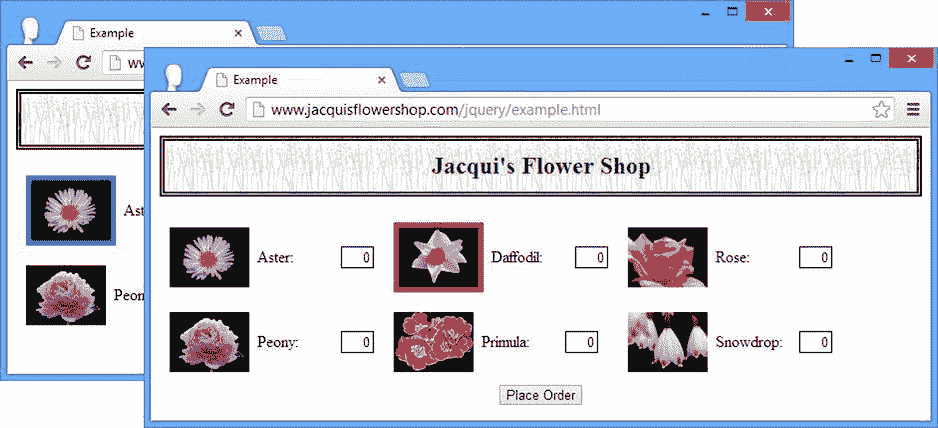
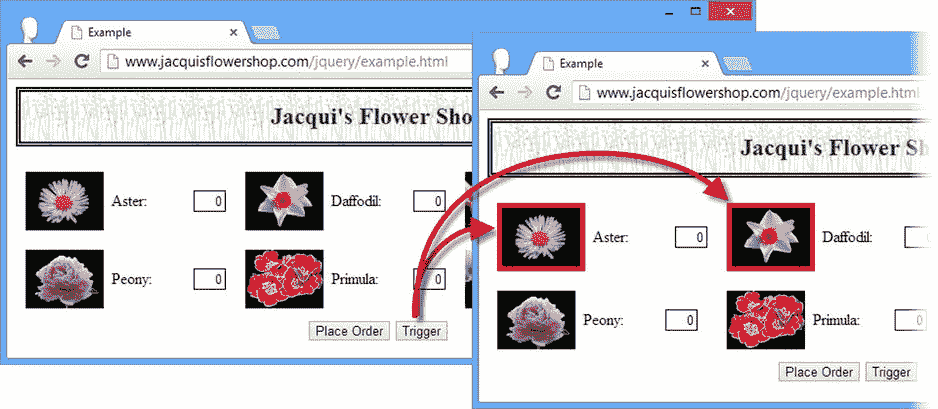
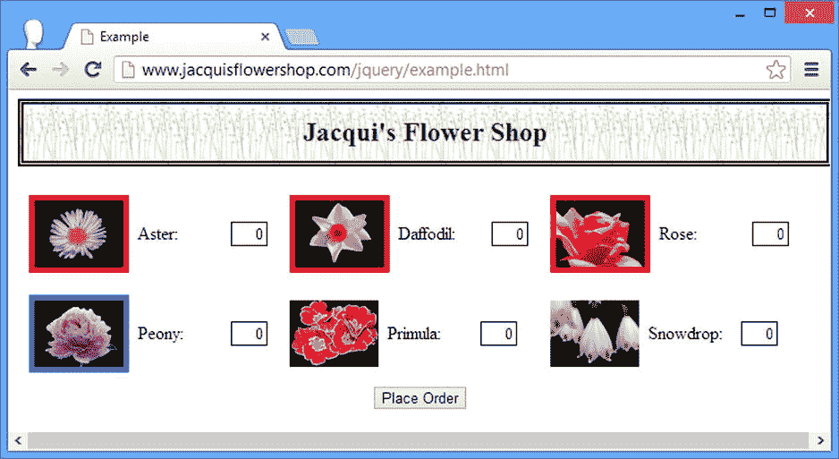
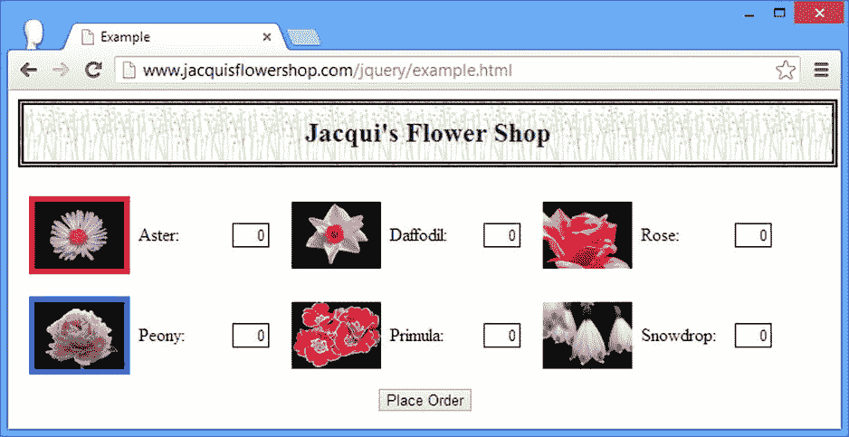

# 九、处理事件

在这一章中，我描述了 jQuery 对事件的支持。如果你不熟悉事件，那么我在第 2 章中提供了一个关于它们如何工作以及它们如何通过 DOM(域对象模型)传播的简要概述。jQuery 提供了一些有用的与事件相关的特性，其中我最喜欢的是在元素被添加到 DOM 时自动将事件处理函数与元素关联起来的能力。表 9-1 对本章进行了总结。

[表 9-1](#_Tab1) 。章节总结

| 问题 | 解决办法 | 列表 |
| --- | --- | --- |
| 注册一个函数来处理一个或多个事件 | 使用**绑定**方法或一种速记方法 | 1–4, 19, 20, 23 |
| 禁止事件的默认操作 | 使用 **Event.preventDefault** 方法或使用 **bind** 方法，而不指定处理函数 | 5–6 |
| 从元素中移除事件处理函数 | 使用**解除绑定**方法 | 7–9 |
| 创建一个处理函数，该函数只对与之关联的每个元素执行一次 | 使用**一**的方法 | Ten |
| 当元素被添加到文档中时，自动将事件处理函数应用于元素 | 使用上的**方法** | 11–13 |
| 移除使用 **live** 方法创建的处理程序 | 使用**关**的方法 | Fourteen |
| 将自动添加的处理程序应用于 DOM 中的特定元素 | 使用**委托**和**取消委托**的方法 | Fifteen |
| 手动调用元素的事件处理函数 | 使用**触发器**或**触发器处理程序**方法或一种速记方法 | 16–18, 21, 22 |

自上一版以来，JQUERY 发生了变化

jQuery 1.9/2.0 移除了`live`和`die`方法。通过`on`和`off`方法可以获得相同的功能，这在“执行实时事件绑定”一节中有描述

使用`trigger`方法时，对`focus`和`blur`事件的发送顺序进行了一些幕后更改，以便它们更好地遵循用户触发事件时看到的顺序。有关如何使用`trigger`方法的详细信息，请参见“手动调用事件处理程序”一节。

一个相关的变化是，当您在复选框或单选按钮`input`元素上触发`click`事件时，事件处理程序将接收元素的新状态，这与用户更改元素状态所产生的效果一致。在以前版本的 jQuery 中，处理程序会接收旧的状态。

我在本书的上一版中省略了一些 jQuery 特性，因为它们被标记为不推荐使用。jQuery 最新版本中的变化不会影响本章的内容，但是如果您在`jquery.com`上找到了对它们的引用并开始在项目中使用它们，那么这些变化是值得一提的:jQuery `Event`对象中已经删除了`attrChange`、`attrName`、`relatedNode`和`srcElement`属性；不再支持`hover`伪事件(但是我在“使用事件速记方法”一节中描述的`hover`方法不受影响)；在同一个事件的两个事件处理函数之间交替的`toggle`方法已经被删除。

处理事件

jQuery 提供了一组方法,允许您注册在感兴趣的元素上触发指定事件时调用的函数。表 9-2 描述了这些方法。

[表 9-2](#_Tab2) 。处理事件的方法

| 方法 | 描述 |
| --- | --- |
| `bind(eventType, function)` `bind(eventType, data, function)` | 向带有可选数据项的 **jQuery** 对象中的元素添加事件处理程序 |
| `bind(eventType, boolean)` | 创建一个总是返回 false 的默认处理程序，阻止默认操作。**布尔**参数控制事件冒泡 |
| `bind(map)` | 向 **jQuery** 对象中的所有元素添加一组基于 map 对象的事件处理程序 |
| `one(eventType, function)` `one(eventType, data, function)` | 向带有可选数据项的 **jQuery** 对象中的每个元素添加事件处理程序；一旦元素被执行，处理程序将被注销。 |
| `unbind()` | 移除 **jQuery** 对象中所有元素的所有事件处理程序 |
| `unbind(eventType)` | 从 **jQuery** 对象的所有元素中删除先前注册的事件处理程序 |
| `unbind(eventType, boolean)` | 从 **jQuery** 对象的所有元素中删除先前注册的始终为假的处理程序 |
| `unbind(Event)` | 使用**事件**对象删除事件处理程序 |

各种风格的`bind`方法允许您指定一个当事件被触发时将被调用的函数，由于这是 jQuery，该函数用于调用`bind`方法的`jQuery`对象中的所有元素。[清单 9-1](#list1) 显示了一个简单的例子。

***[清单 9-1](#_list1)*** 。使用 bind 方法注册事件处理函数

```js
<!DOCTYPE html>
<html>
<head>
    <title>Example</title>
    <script src="jquery-2.0.2.js" type="text/javascript"></script>
    <link rel="stylesheet" type="text/css" href="styles.css"/>
    <script type="text/javascript">
        $(document).ready(function() {
                  function handleMouseEnter(e) {
                $(this).css({
                    "border": "thick solid red",
                    "opacity": "0.5"
                });
            };

            function handleMouseOut(e) {
                $(this).css({
                    "border": "",
                    "opacity": ""
                });
            }

            $("img").bind("mouseenter", handleMouseEnter)
                .bind("mouseout", handleMouseOut);
        });
    </script>
</head>
<body>
    <h1>Jacqui's Flower Shop</h1>
    <form method="post">
        <div id="oblock">
            <div class="dtable">
                <div id="row1" class="drow">
                    <div class="dcell">
                        <label for="aster">Aster:</label>
                        <input name="aster" value="0" required />
                    </div>
                    <div class="dcell">
                        <label for="daffodil">Daffodil:</label>
                        <input name="daffodil" value="0" required />
                    </div>
                    <div class="dcell">
                        <label for="rose">Rose:</label>
                        <input name="rose" value="0" required />
                    </div>
                </div>
                <div id="row2"class="drow">
                    <div class="dcell">
                        <label for="peony">Peony:</label>
                        <input name="peony" value="0" required />
                    </div>
                    <div class="dcell">
                        <label for="primula">Primula:</label>
                        <input name="primula" value="0" required />
                    </div>
                    <div class="dcell">
                        <label for="snowdrop">Snowdrop:</label>
                        <input name="snowdrop" value="0" required />
                    </div>
                </div>
            </div>
        </div>
        <div id="buttonDiv"><button type="submit">Place Order</button></div>
    </form>
</body>
</html>
```

在[清单 9-1](#list1) 中，我选择了文档中所有的`img`元素，并使用`bind`方法为`mouseenter`和`mouseout`事件注册处理函数。这些处理程序使用`css`方法来设置`border`和`opacity`属性的值。当用户将鼠标指针移动到其中一个`img`元素上时，会绘制边框，图像会变得更加透明，当指针移开时，图像会恢复到原来的状态。

当 jQuery 调用处理程序函数时，`this`变量被设置为处理程序所附加的元素。传递给 handler 函数的对象是 jQuery 自己的`Event`对象，不同于 DOM 规范定义的`Event`对象。[表 9-3](#Tab3) 描述了 jQuery `Event`对象的属性和方法。

[表 9-3](#_Tab3) 。jQuery 事件对象的成员

| 名字 | 描述 | 返回 |
| --- | --- | --- |
| `currentTarget` | 获取当前正在调用其侦听器的元素 | `HTMLElement` |
| `Data` | 获取注册处理程序时传递给 bind 方法的可选数据；有关详细信息，请参见“注册一个函数来处理多种事件类型”一节 | `Object` |
| `isDefaultPrevented()` | 如果调用了 **preventDefault** 方法，则返回 **true** | `Boolean` |
| `isImmediatePropagationStopped()` | 如果调用了**停止立即传播**方法，则返回**真值** | `Boolean` |
| `isPropagationStopped()` | 如果调用了**停止传播**方法，则返回**真值** | `Boolean` |
| `originalEvent` | 返回原始 DOM **事件**对象 | `Event` |
| `pageX` `pageY` | 返回相对于文档左边缘的鼠标位置 | `number` |
| `preventDefault()` | 阻止执行与事件相关联的默认操作 | `void` |
| `relatedTarget` | 对于鼠标事件，返回相关元素；这取决于触发了哪个事件 | `HTMLElement` |
| `Result` | 返回处理此事件的最后一个事件处理程序的结果 | `Object` |
| `stopImmediatePropagation()` | 防止为此事件调用任何其他事件处理程序 | `void` |
| `stopPropagation()` | 防止事件冒泡，但允许附加到当前目标元素的处理程序接收事件 | `void` |
| `Target` | 获取触发事件的元素 | `HTMLElement` |
| `timeStamp` | 获取事件的触发时间 | `number` |
| `Type` | 获取事件的类型 | `string` |
| `Which` | 返回为鼠标和键盘事件按下的按钮或按键 | `number` |

jQuery `Event`对象还定义了标准 DOM `Event`对象的大多数属性。因此，对于几乎所有情况，您都可以将 jQuery `Event`对象视为具有 DOM 标准定义的功能的超集。

注册一个函数来处理多个事件类型

一种常见的技术是使用一个函数来处理两种或多种事件。这些事件通常以某种方式相关联，例如`mouseenter`和`mouseout`事件。使用`bind`方法时，可以在第一个参数中指定多个事件类型，用空格分隔。[清单 9-2](#list2) 展示了这种方法。

***[清单 9-2](#_list2)*** 。注册一个函数来处理多个事件类型

```js
...
<script type="text/javascript">
    $(document).ready(function() {

        function handleMouse(e) {
            var cssData = {
                "border": "thick solid red",
                "opacity": "0.5"
            }
            if (event.type == "mouseout") {
                cssData.border = "";
                cssData.opacity = "";
            }
            $(this).css(cssData);
        }

        $("img").bind("mouseenter mouseout", handleMouse);

    });
</script>
...
```

在这个脚本中，我使用了一个对`bind`方法的调用来指定文档中所有`img`元素的`mouseenter`和`mouseout`事件应该由`handleMouse`函数来处理。当然，您也可以使用单个函数并链接绑定调用，如下所示:

```js
...
$("img").bind("mouseenter", handleMouse).bind("mouseout", handleMouse);
...
```

还可以使用 map 对象注册处理程序。对象的属性是事件的名称，它们的值是事件被触发时将被调用的函数。清单 9-3 展示了一个地图对象和`bind`方法的使用。

***[清单 9-3](#_list3)*** 。使用映射对象注册事件处理程序

```js
...
<script type="text/javascript">
    $(document).ready(function() {

        $("img").bind({
            mouseenter: function() {
                $(this).css("border", "thick solid red");
            },
            mouseout: function() {
                $(this).css("border", "");
            }
        });

    });
</script>
...
```

在清单 9-3 中，我已经定义了内嵌的处理函数，作为 map 对象的一部分。`bind`方法使用我指定的函数作为事件的处理程序，这些事件对应于 map 对象中的属性名称。

向事件处理函数提供数据

您可以将一个对象传递给`bind`方法，然后 jQuery 将通过`Event.data`属性将该对象提供给处理函数。当使用单个函数处理来自不同元素集的事件时，这可能很有用。`data`值可以帮助确定需要什么样的响应。[清单 9-4](#list4) 展示了如何定义和使用数据值。

***[清单 9-4](#_list4)*** 。通过 bind 方法将数据传递给事件处理函数

```js
...
<script type="text/javascript">
    $(document).ready(function() {

        function handleMouse(e) {
            var cssData = {
                "border": "thick solid " + e.data,
            }
            if (event.type == "mouseout") {
                cssData.border = "";
            }
            $(this).css(cssData);

        }

        $("img:odd").bind("mouseenter mouseout", "red", handleMouse);
        $("img:even").bind("mouseenter mouseout", "blue", handleMouse);
    });
</script>
...
```

我使用了`bind`方法的可选参数来指定当`mouseenter`事件被触发时应该显示哪种颜色的边框。对于奇数编号的`img`元素，边界将为`red`，对于偶数编号的元素，边界将为`blue`。在事件处理函数中，我使用`Event.data`属性读取数据，并用它来创建 CSS(级联样式表)`border`属性的值。你可以在[图 9-1](#Fig1) 中看到效果。



[图 9-1](#_Fig1) 。通过 bind 方法将数据传递给处理函数

取消默认操作

正如我在第 2 章的[中提到的，一些事件在某些元素上被触发时会有一个默认的动作](02.html)。一个很好的例子是当用户点击一个按钮，它的属性是 T1。如果`button`包含在`form`元素中，浏览器的默认动作是提交表单。为了防止默认动作被执行，你可以在`Event`对象上调用`preventDefault`方法，如[清单 9-5](#list5) 所示。

***[清单 9-5](#_list5)*** 。阻止对事件的默认操作

```js
...
<script type="text/javascript">
    $(document).ready(function() {

        $("button:submit").bind("click", function(e) {
            e.preventDefault();
        });

    });
</script>
...
```

这个脚本为所有`button`元素上的`click`事件设置了一个处理函数，这些元素的`type`属性被设置为`submit`。该函数只包含一个对`preventDefault`方法的调用，这意味着单击按钮不会做任何事情，因为默认操作是禁用的，并且处理函数没有设置任何替代选项。

通常你想取消默认动作，这样你就可以执行一些其他的活动——例如，阻止浏览器提交表单，因为你想用 Ajax 来完成(这是第 14 章和第 15 章的主题)。不要像我在[清单 9-5](#list5) 中那样写一行函数，你可以使用不同版本的`bind`方法，如[清单 9-6](#list6) 所示。

***[清单 9-6](#_list6)*** 。使用 bind 方法创建阻止默认操作的处理程序

```js
...
<script type="text/javascript">
    $(document).ready(function() {
        $("button:submit").bind("click", false);
    });
</script>
...
```

第一个参数是您想要抑制其默认动作的一个或多个事件，第二个参数允许您指定是否应该阻止事件在 DOM 中冒泡(我在第 2 章的[中解释了事件冒泡)。](02.html)

删除事件处理函数

`unbind`方法从一个元素中移除一个处理函数。您可以通过不带参数调用`unbind`方法来解除与一个`jQuery`对象中所有元素的所有事件相关联的所有处理程序的绑定，如[清单 9-7](#list7) 所示。

***[清单 9-7](#_list7)*** 。取消绑定所有事件处理程序

```js
...
<script type="text/javascript">
    $(document).ready(function() {

        function handleMouse(e) {
            var cssData = {
                "border": "thick solid red",
                "opacity": "0.5"
            }
            if (event.type == "mouseout") {
                cssData.border = "";
                cssData.opacity = "";
            }
            $(this).css(cssData);
        }

        $("img").bind("mouseenter mouseout", handleMouse);

        $("img[src*=rose]").unbind();

    });
</script>
...
```

在[清单 9-7](#list7) 中，我为所有`img`元素的`mouseenter`和`mouseout`事件设置了一个处理程序，然后使用`unbind`方法移除`img`元素的所有处理程序，该元素的`src`属性包含`rose`。通过将您想要解除绑定的事件作为参数传递给`unbind`方法，您可以更有选择性，如[清单 9-8](#list8) 所示。

***[清单 9-8](#_list8)*** 。选择性解除事件绑定

```js
...
<script type="text/javascript">
    $(document).ready(function() {

        function handleMouse(e) {
            var cssData = {
                "border": "thick solid red",
                "opacity": "0.5"
            }
            if (event.type == "mouseout") {
                cssData.border = "";
                cssData.opacity = "";
            }
            $(this).css(cssData);
        }

        $("img").bind("mouseenter mouseout", handleMouse);

        $("img[src*=rose]").unbind("mouseout");

    });
</script>
...
```

在这个脚本中，我只解除了`mouseout`事件的绑定，而没有触动`mouseenter`事件的处理程序。

从事件处理函数中取消绑定

解除绑定的最后一个选项是从事件处理函数中进行。例如，如果您想要处理某个事件一定次数，这可能会很有用。清单 9-9 包含了一个简单的演示。

***[清单 9-9](#_list9)*** 。从事件处理程序中的事件解除绑定

```js
...
<script type="text/javascript">
    $(document).ready(function() {

        var handledCount = 0;

        function handleMouseEnter(e) {
            $(this).css("border", "thick solid red");
        }
        function handleMouseExit(e) {
            $(this).css("border", "");
            handledCount ++;
            if (handledCount == 2) {
                $(this).unbind(e);
            }
        }
        $("img").bind("mouseenter", handleMouseEnter).bind("mouseout", handleMouseExit)
    });
</script>
...
```

在`handleMouseEvent`函数中，我每处理一次`mouseout`事件就增加一个计数器。在我处理了两次事件之后，我将`Event`对象传递给`unbind`方法，以取消该函数作为处理程序的注册。jQuery 从事件对象中找出它需要的细节。

执行一次处理程序

`one`方法允许您注册一个事件处理程序，该程序对于一个元素只执行一次，然后被删除。[清单 9-10](#list10) 提供了一个例子。

***[清单 9-10](#_list10)*** 。使用 one 方法注册单次事件处理函数

```js
...
<script type="text/javascript">
    $(document).ready(function() {

        function handleMouseEnter(e) {
            $(this).css("border", "thick solid red");
        };

        function handleMouseOut(e) {
            $(this).css("border", "");
        };

        $("img").one("mouseenter", handleMouseEnter).one("mouseout", handleMouseOut);

    });
</script>
...
```

我已经使用了`one`方法来注册`mouseenter`和`mouseout`事件的处理程序。当用户将鼠标移入和移出其中一个`img`元素时，将调用处理函数，然后该函数将被解除绑定(但只是针对那个元素；其他的仍然有处理程序，直到鼠标移到它们上面)。

执行实时事件绑定

`bind`方法的一个限制是，您的事件处理函数不与您添加到 DOM 的任何新元素相关联。[清单 9-11](#list11) 包含了一个例子。

***[清单 9-11](#_list11)*** 。设置事件处理程序后添加元素

```js
...
<script type="text/javascript">
    $(document).ready(function() {
        $("img").bind({
            mouseenter: function() {
                $(this).css("border", "thick solid red");
            },
            mouseout: function() {
                $(this).css("border", "");
            }
        });

        $("#row1").append($("<div class='dcell'/>")
            .append("")
            .append("<label for='lily'>Lily:</label>")
            .append("<input name='lily' value='0' required />"));
    });
</script>
...
```

在这个脚本中，我使用`bind`方法为所有`img`元素的`mouseenter`和`mouseout`事件设置处理程序。然后我使用`append`方法在文档中插入一些新元素，包括另一个`img`元素。当我使用`bind`方法时，这个新的`img`元素并不存在，我的处理函数也没有与之关联。这样做的结果是，我有六个`img`元素在鼠标悬停在它们上面时显示边框，而一个没有。

在一个像清单 9-11 中的[这样简单的例子中，简单的答案是再次调用`bind`方法，但是很难记住不同类型的元素需要哪些处理程序。幸运的是，jQuery 为您提供了一组方法，当匹配选择器的新元素被添加到 DOM 时，这些方法会自动注册事件处理程序。表 9-4](#list11) 描述了这些方法。

[表 9-4](#_Tab4) 。自动注册事件处理程序的方法

| 方法 | 描述 |
| --- | --- |
| `on(events, selector, data, function)` `on (map, selector, data)` | 为现在或将来存在的元素定义事件处理程序 |
| `off(events, selector, function)` `off(map, selector)` | 移除使用 on 方法创建的事件处理程序 |
| `delegate(selector, eventType, function)``delegate(selector, eventType, data,``function)`T3】 | 将事件处理程序添加到与附加到 jQuery 对象中元素的选择器(现在或将来)相匹配的元素中 |
| `undelegate()` `undelegate(selector, eventType)` | 为指定的事件类型移除使用**委托**方法创建的事件处理程序 |

[清单 9-12](#list12) 显示了之前的例子更新为使用`on`方法 。变化很小，但影响很大。我添加到 DOM 中与选择器`img`匹配的任何元素都将在 map 对象中拥有函数，这些函数被设置为`mouseenter`和`mouseout`事件的处理程序。

***[清单 9-12](#_list12)*** 。使用 on 方法

```js
...
<script type="text/javascript">
    $(document).ready(function () {

        $(document).on({
            mouseenter: function () {
                $(this).css("border", "thick solid red");
            },
            mouseout: function () {
                $(this).css("border", "");
            }
        }, "img");

        $("#row1").append($("<div class='dcell'/>")
            .append("")
            .append("<label for='lily'>Lily:</label>")
            .append("<input name='lily' value='0' required />"));
    });
</script>
...
```

注意，我在从`document`创建的`jQuery`对象上调用了`on`方法。这确保了我的事件处理程序被应用于添加到 DOM 中任何地方的任何`img`元素。我可以通过更改初始选择器来缩小关注范围——例如，如果我只想将我的处理函数应用于添加到`row1`元素的`img`元素，我可以使用下面的调用来代替:

```js
...
$("#row1").on(*...map...*, "img");
...
```

 **提示**`on`方法不需要直接给元素添加处理函数。事实上，它在`document`对象上创建了一个事件处理程序，并寻找由匹配选择器的元素触发的事件。当它看到这样的事件时，它会触发事件处理程序。然而，实际上，更容易想象的是`on`方法努力为新元素添加句柄。

使用`on`方法时，可以指定多个事件。事件名由空格字符分隔，或者在地图对象的属性名中，或者在不使用地图时在第一个参数中，如清单 9-13 所示。

***[清单 9-13](#_list13)*** 。使用 on 方法指定多个事件

```js
...
<script type="text/javascript">
    $(document).ready(function () {

        function handleMouse(event) {
            if (event.type == "mouseenter") {
                $(this).css("border", "thick solid red");
            } else if (event.type == "mouseout") {
                $(this).css("border", "");
            }
        }

        $("#row1").on("mouseenter mouseout", "img", handleMouse);

        $("#row1").append($("<div class='dcell'/>")
            .append("")
            .append("<label for='lily'>Lily:</label>")
            .append("<input name='lily' value='0' required />"));
    });
</script>
...
```

在[清单 9-13](#list13) 中，我使用了不依赖于地图对象的`on`方法版本，指定`handleMouse`函数应该用于由所有`img`元素发出的`mouseenter`和`mouseout`事件，这些【】元素是`row1`元素的后代。

对`on`方法的补充是`off`，它用于从现有元素中移除事件处理程序，并防止它们被用来响应新创建元素的事件。[清单 9-14](#list14) 展示了`off`方法 的使用。

***[清单 9-14](#_list14)*** 。使用关闭方法

```js
...
<script type="text/javascript">
    $(document).ready(function () {

        function handleMouse(event) {
            if (event.type == "mouseenter") {
                $(this).css("border", "thick solid red");
            } else if (event.type == "mouseout") {
                $(this).css("border", "");
            }
        }

        $("#row1").on("mouseenter mouseout", "img", handleMouse);

        $("#row1").off("mouseout", "img");

        $("#row1").append($("<div class='dcell'/>")
            .append("")
            .append("<label for='lily'>Lily:</label>")
            .append("<input name='lily' value='0' required />"));
    });
</script>
...
```

 **注意**使用与`on`和`off`方法相同的选择器很重要；否则，`off`方法无法解除`on`的效果。

限制实时事件处理程序的 DOM 遍历

`on`方法的一个问题是，在执行处理函数之前，事件必须一直传播到`document`元素。您可以采取一种更直接的方法，使用`delegate`方法 ，它允许您指定事件监听器将位于文档中的什么位置。清单 9-15 提供了一个例子。

***[清单 9-15](#_list15)*** 。使用委托方法

```js
...
<script type="text/javascript">
    $(document).ready(function() {

        $("#row1").delegate("img", {
            mouseenter: function() {
                $(this).css("border", "thick solid red");
            },
            mouseout: function() {
                $(this).css("border", "");
            }
        });

        $("#row1").append($("<div class='dcell'/>")
            .append("")
            .append("<label for='carnation'>Carnation:</label>")
            .append("<input name='carnation' value='0' required />"));

        $("#row2").append($("<div class='dcell'/>")
            .append("")
            .append("<label for='lily'>Lily:</label>")
            .append("<input name='lily' value='0' required />"));
    });

</script>
...
```

在[清单 9-15](#list15) 中，我使用`delegate`方法将监听器添加到 ID 为`#row1`的元素中，我指定的选择器与`img`元素相匹配。这样做的效果是，当源于`img`元素的`mouseenter`或`mouseout`事件传播到`row1`元素时，我的处理函数将被执行。当我向`row1`添加另一个`img`元素时，它会被我对`delegate`方法的调用自动覆盖，而当我向`row2`添加元素时却不是这样。

使用`delegate`方法的主要好处是速度，如果您有一个特别大而复杂的文档和许多事件处理程序，这可能会成为一个问题。通过将事件被拦截的点下推到文档中，可以减少事件在导致处理函数被调用之前在 DOM 中必须经过的距离。

 **提示**要删除用`delegate`方法添加的处理程序，必须使用`undelegate`。`off`方法仅适用于`on`方法。

手动调用事件处理程序

您可以使用[表 9-5](#Tab5) 中描述的方法手动调用元素上的事件处理函数。

[表 9-5](#_Tab5) 。手动调用事件处理程序的方法

| 方法 | 描述 |
| --- | --- |
| `trigger(eventType)` | 在一个 **jQuery** 对象的所有元素上触发指定事件类型的处理函数 |
| `trigger(event)` | 在一个 **jQuery** 对象的所有元素上触发指定事件的处理函数 |
| `triggerHandler(eventType)` | 在 **jQuery** 对象的第一个元素上触发处理函数，而不执行默认操作或冒泡事件 |

清单 9-16 展示了如何手动触发事件处理程序。

***[清单 9-16](#_list16)*** 。手动触发事件处理程序

```js
...
<script type="text/javascript">
    $(document).ready(function() {

        $("img").bind({mouseenter: function() {
                $(this).css("border", "thick solid red");
            },
            mouseout: function() {
                $(this).css("border", "");
            }
        });

        $("<button>Trigger</button>").appendTo("#buttonDiv").bind("click", function (e) {
            $("#row1 img").trigger("mouseenter");
            e.preventDefault();
        });

    });

</script>
...
```

在这个脚本中，我使用`bind`方法在文档中的`img`元素上设置一对事件处理函数。然后，我使用`appendTo`方法将一个`button`元素插入到文档方法中，并使用`bind`方法为`click`事件注册一个处理函数。

当按钮被按下时，事件处理函数选择作为`row1`的后代的`img`元素，并使用`trigger`方法为`mouseenter`按钮调用它们的处理程序。效果如图 9-2 中的[所示，就好像鼠标移动到了所有三个`img`元素上。](#Fig2)



[图 9-2](#_Fig2) 。手动触发事件处理函数

使用事件对象

您还可以使用一个`Event`对象来触发其他元素的事件处理程序。这是一种在处理程序中使用的方便技术，如[清单 9-17](#list17) 所示。

***[清单 9-17](#_list17)*** 。用事件对象手动触发事件句柄

```js
...
<script type="text/javascript">
    $(document).ready(function() {

        $("#row1 img").bind("mouseenter", function() {
            $(this).css("border", "thick solid red");
        });

        $("#row2 img").bind("mouseenter", function(e) {
            $(this).css("border", "thick solid blue");
            $("#row1 img").trigger(e);
        });

    });

</script>
...
```

在[清单 9-17](#list17) 中，我使用`bind`方法给`row1`元素的`img`后代添加一个红色边框，以响应`mouseenter`事件。我对`row2 img`元素使用了蓝色边框，但是在处理程序中，我添加了以下语句:

```js
..
$("#row1 img").trigger(e);
...
```

这种添加的效果是，当鼠标进入其中一个`row2 img`元素时，相同事件类型的处理程序也会在`row1 img`元素上被触发。你可以在[图 9-3](#Fig3) 中看到效果。



[图 9-3](#_Fig3) 。使用事件触发事件处理程序

当您希望触发当前正在处理的事件类型的处理程序时，这种方法很方便，但是您也可以通过指定事件类型来轻松获得相同的效果。

使用触发器处理程序方法

`triggerHandler`方法 调用处理函数，而不执行事件的默认动作，也不允许事件在 DOM 中冒泡。而且，与`trigger`方法不同，`triggerHandler`只在 jQuery 对象的第一个元素上调用处理函数。清单 9-18 展示了这种方法的使用。

***[清单 9-18](#_list18)*** 。使用触发器处理程序方法

```js
...
<script type="text/javascript">
    $(document).ready(function() {
        $("#row1 img").bind("mouseenter", function() {
            $(this).css("border", "thick solid red");
        });

        $("#row2 img").bind("mouseenter", function(e) {
            $(this).css("border", "thick solid blue");
            $("#row1 img").triggerHandler("mouseenter");
        });
    });
</script>
...
```

 **提示**`triggerHandler`方法的结果是 handler 函数返回的结果，这意味着不能链接`triggerHandler`方法。

你可以在[图 9-4](#Fig4) 中看到这个脚本的效果。



[图 9-4](#_Fig4) 。使用触发器处理程序方法

使用事件速记方法

jQuery 定义了一些方便的方法，您可以用它们来为常用事件注册事件处理程序。在下面的表格中，我用一个`function`参数展示了这些速记方法。这是最常见的用法，相当于调用`bind`方法，但是这些方法需要更少的输入，并且(至少在我看来)使绑定到哪个事件变得更加明显。[清单 9-19](#list19) 展示了如何以这种方式使用速记方法。

***[清单 9-19](#_list19)*** 。使用事件速记方法绑定处理函数

```js
...
<script type="text/javascript">
    $(document).ready(function() {

        $("img").mouseenter(function() {
           $(this).css("border", "thick solid red");
        });

    });
</script>
...
```

这相当于将`bind`事件用于`mouseenter`事件，我已经在[清单 9-20](#list20) 中展示了这一点。

***[清单 9-20](#_list20)*** 。对 mouseenter 事件使用 bind 方法

```js
...
<script type="text/javascript">
    $(document).ready(function() {

        $("img").bind("mouseenter", function() {
           $(this).css("border", "thick solid red");
        });

    });
</script>
...
```

这一切都很好，到目前为止，您应该对这个示例的工作方式感到满意了。但是，您也可以使用速记方法来模拟`trigger`方法。通过调用不带参数的方法可以做到这一点。清单 9-21 展示了如何做到这一点。

***[清单 9-21](#_list21)*** 。使用事件速记方法触发事件处理程序

```js
...
<script type="text/javascript">
    $(document).ready(function() {

        $("img").bind("mouseenter", function() {
           $(this).css("border", "thick solid red");
        });

        $("<button>Trigger</button>").appendTo("#buttonDiv").click(function (e) {
            $("img").mouseenter();
            e.preventDefault();
        });
    });
</script>
...
```

我在文档中添加了一个`button`,单击它会选择`img`元素并调用它们的`mouseenter`事件处理程序。为了完整起见，[清单 9-22](#list22) 显示了使用`trigger`方法编写的等效功能。

***[清单 9-22](#_list22)*** 。使用触发方法

```js
...
<script type="text/javascript">
    $(document).ready(function() {

        $("img").bind("mouseenter", function() {
           $(this).css("border", "thick solid red");
        });

        $("<button>Trigger</button>").appendTo("#buttonDiv").click(function (e) {
            $("img").trigger("mouseenter");
            e.preventDefault();
        });
    });
</script>
...
```

在接下来的部分中，我列出了不同类别的速记方法和它们对应的事件。

使用文档事件速记方法

[表 9-6](#Tab6) 描述了适用于`document`对象的 jQuery 简写方法。

[表 9-6](#_Tab6) 。文档事件速记方法

| 方法 | 描述 |
| --- | --- |
| `load(function)` | 对应于 **load** 事件，当文档中的元素和资源已经被加载时触发 |
| `ready(function)` | 当文档中的元素已经被处理并且 DOM 可以使用时触发 |
| `unload(function)` | 对应于 **unload** 事件，当用户离开页面时触发 |

`ready`法值得特别一提。它不直接对应于 DOM 事件，但是在使用 jQuery 时非常有用。你可以在[第 5 章](05.html)中看到使用`ready`方法的不同方式，在那里我解释了如何推迟脚本的执行直到 DOM 准备好，以及如何控制`ready`事件的执行。

使用浏览器事件速记方法

[表 9-7](#Tab7) 描述了浏览器事件，这些事件通常针对`window`对象(尽管`error`和`scroll`事件也用于元素)。

[表 9-7](#_Tab7) 。浏览器事件速记方法

| 方法 | 描述 |
| --- | --- |
| `error(function)` | 对应于**错误**事件，当加载外部资源(如图像)出现问题时触发 |
| `resize(function)` | 对应于调整浏览器窗口大小时触发的 **resize** 事件 |
| `scroll(function)` | 对应于使用滚动条时触发的**滚动**事件 |

使用鼠标事件速记方法

表 9-8 描述了 jQuery 为处理鼠标事件而提供的一组速记方法。

[表 9-8](#_Tab8) 。鼠标事件速记方法

| 方法 | 描述 |
| --- | --- |
| `click(function)` | 对应于用户按下并释放鼠标时触发的 **click** 事件 |
| `dblclick(function)` | 对应于 **dblclick** 事件，当用户快速连续按下并释放鼠标两次时触发 |
| `focusin(function)` | 对应于当元素获得焦点时触发的 **focusin** 事件 |
| `focusout(function)` | 对应于当元素失去焦点时触发的 **focusout** 事件 |
| `hover(function)` `hover(function, function)` | 当鼠标进入或离开一个元素时触发；当一个函数被指定时，它被用于进入和退出事件 |
| `mousedown(function)` | 对应于 **mousedown** 事件，当在元素上按下鼠标按钮时触发 |
| `mouseenter(function)` | 对应于 **mouseenter** 事件，当鼠标进入元素占据的屏幕区域时触发 |
| `mouseleave(function)` | 对应于 **mouseleave** 事件，当鼠标离开元素占据的屏幕区域时触发 |
| `mousemove(function)` | 对应于 **mousemouse** 事件，当鼠标在元素占据的屏幕区域内移动时触发 |
| `mouseout(function)` | 对应于 **mouseout** 事件，当鼠标离开元素占据的屏幕区域时触发 |
| `mouseover(function)` | 对应于 **mouseover** 事件，当鼠标进入元素占据的屏幕区域时触发 |
| `mouseup(function)` | 对应于 **mouseup** 事件，当在元素上按下鼠标按钮时触发 |

`hover`方法是一种将处理函数绑定到`mouseenter`和`mouseleave`事件的便捷方式。如果您提供两个函数作为参数，那么第一个函数被调用以响应`mouseenter`事件，第二个函数被调用以响应`mouseleave`。如果您只指定了一个函数，那么这两个事件都会调用它。[清单 9-23](#list23) 显示了`hover`方法的使用。

***[清单 9-23](#_list23)*** 。使用悬停方法

```js
...
<script type="text/javascript">
    $(document).ready(function() {

        $("img").hover(handleMouseEnter, handleMouseLeave);

        function handleMouseEnter(e) {
            $(this).css("border", "thick solid red");
        };

        function handleMouseLeave(e) {
            $(this).css("border", "");
        }
    });
</script>
...
```

使用表单事件速记方法

表 9-9 描述了 jQuery 提供的处理通常与表单相关的事件的速记方法。

[表 9-9](#_Tab9) 。表单事件速记方法

| 方法 | 描述 |
| --- | --- |
| `blur(function)` | 对应于当元素失去焦点时触发的**模糊**事件 |
| `change(function)` | 对应于 **change** 事件，当元素的值改变时触发 |
| `focus(function)` | 对应于**焦点**事件，当元素获得焦点时触发 |
| `select(function)` | 对应于用户选择元素值时触发的**选择**事件 |
| `submit(function)` | 对应于**提交**事件，当用户提交**表单**时触发 |

使用键盘事件速记方法

表 9-10 描述了 jQuery 提供的处理键盘事件的速记方法。

[表 9-10](#_Tab10) 。键盘事件速记方法

| 方法 | 描述 |
| --- | --- |
| `keydown(function)` | 对应于用户按键时触发的 **keydown** 事件 |
| `keypress(function)` | 对应于用户按下并释放按键时触发的**按键**事件 |
| `keyup(function)` | 对应于用户释放按键时触发的 **keyup** 事件 |

摘要

在本章中，我向您展示了 jQuery 对事件的支持。与大多数 jQuery 一样，事件功能的好处是简单和优雅。您可以轻松创建和管理事件处理程序。我特别喜欢对创建实时事件处理程序的支持，这样添加到 DOM 中与特定选择器匹配的元素就会自动与事件处理程序相关联。这大大减少了我在 web 应用中跟踪事件处理问题所花费的时间。在第十章中，我描述了 jQuery 对*效果*的支持。