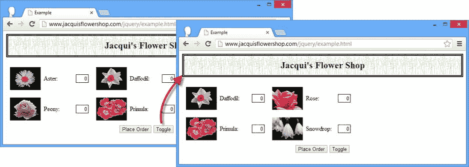

# 十、使用 jQuery 效果

在很大程度上，jQuery UI 包含了与 jQuery 相关的用户界面(UI)功能，但是核心库包含了一些基本的效果和动画，这些是本章的主题。虽然我把它们描述为基本的，但是它们可以用来实现一些非常复杂的效果。主要的焦点是动画元素的可见性，但是您可以使用这些特性以多种方式动画一系列 CSS 属性。表 10-1 对本章进行了总结。

表 10-1 。章节总结

| 问题 | 解决办法 | 列表 |
| --- | --- | --- |
| 显示或隐藏元素 | 使用**显示**或**隐藏**的方法 | one |
| 切换元素的可见性 | 使用**切换**方法 | 2, 3 |
| 动画元素的可见性 | 为**显示**、**隐藏**或**切换**方法提供一个 timespan 参数 | four |
| 在动画结束时调用函数 | 为**显示**、**隐藏**或**切换**方法提供一个回调参数 | 5–7 |
| 沿垂直方向设置可见性动画 | 使用**向下滑动**、**向上滑动**或**滑动切换**的方法 | eight |
| 使用不透明度制作可见性动画 | 使用**淡入**、**淡出**、**淡出切换**或**淡出到**的方法 | 9–11 |
| 创建自定义效果 | 使用**动画**方法 | 12–14 |
| 检查效果队列 | 使用**队列**方法 | 15, 16 |
| 停止并清除效果队列 | 使用**停止**或**结束**的方法 | 17, 18 |
| 在效果队列中插入延迟 | 使用**延迟**方法 | Nineteen |
| 将自定义函数插入队列 | 使用带有函数参数的 **queue** 方法，并确保执行队列中的下一个函数 | 20, 21 |
| 禁用效果动画 | 将 **$.fx.off** 属性设置为 **true** | Twenty-two |

自上一版以来，JQUERY 发生了变化

jQuery 1.9/2.0 定义了一个新的`finish`方法，用于完成当前效果和清除事件队列。详见“停止效果和清除队列”一节。

使用基本效果

最基本的效果只是显示或隐藏元素。表 10-2 描述了你可以使用的方法。

表 10-2 。基本特效方法

| 方法 | 描述 |
| --- | --- |
| `hide()` | 隐藏 **jQuery** 对象中的所有元素 |
| `hide(time)` `hide(time, easing)` | 使用可选的缓动样式在指定的时间段内隐藏 **jQuery** 对象中的元素 |
| `hide(time, function)` `hide(time, easing, function)` | 使用可选的缓动样式和效果完成时调用的函数，在指定的时间段内隐藏 **jQuery** 对象中的元素 |
| `show()` | 显示了一个 **jQuery** 对象中的所有元素 |
| `show(time)` `show(time, easing)` | 使用可选的缓动样式显示指定时间段内 **jQuery** 对象中的元素 |
| `show(time, function)` `show(time, easing, function)` | 显示指定时间段内 **jQuery** 对象中的元素，带有可选的缓动样式和效果完成时调用的函数 |
| `toggle()` | 切换 **jQuery** 对象中元素的可见性 |
| `toggle(time)` `toggle(time, easing)` | 使用可选的缓动样式切换指定时间段内 **jQuery** 对象中元素的可见性 |
| `toggle(time, function)` `toggle(time, easing, function)` | 使用可选的缓动样式和效果完成时调用的函数，在指定时间段内切换 **jQuery** 对象中元素的可见性 |
| `toggle(boolean)` | 单向切换 **jQuery** 对象中的元素 |

清单 10-1 展示了这些效果中最简单的一个，那就是不带任何参数地使用`show`和`hide`方法。

***清单 10-1*** 。使用不带参数的 Show 和 Hide 方法

```js
<!DOCTYPE html>
<html>
<head>
    <title>Example</title>
    <script src="jquery-2.0.2.js" type="text/javascript"></script>
    <link rel="stylesheet" type="text/css" href="styles.css"/>
    <script type="text/javascript">
        $(document).ready(function() {
            $("<button>Hide</button><button>Show</button>").appendTo("#buttonDiv")
                .click(function(e) {
                   if ($(e.target).text() == "Hide") {
                        $("#row1 div.dcell").hide();
                   } else {
                        $("#row1 div.dcell").show();
                   }
                   e.preventDefault();
                });
        });
    </script>
</head>
<body>
    <h1>Jacqui's Flower Shop</h1>
    <form method="post">
        <div id="oblock">
            <div class="dtable">
                <div id="row1" class="drow">
                    <div class="dcell">
                        <label for="aster">Aster:</label>
                        <input name="aster" value="0" required />
                    </div>
                    <div class="dcell">
                        <label for="daffodil">Daffodil:</label>
                        <input name="daffodil" value="0" required />
                    </div>
                    <div class="dcell">
                        <label for="rose">Rose:</label>
                        <input name="rose" value="0" required />
                    </div>
                </div>
                <div id="row2"class="drow">
                    <div class="dcell">
                        <label for="peony">Peony:</label>
                        <input name="peony" value="0" required />
                    </div>
                    <div class="dcell">
                        <label for="primula">Primula:</label>
                        <input name="primula" value="0" required />
                    </div>
                    <div class="dcell">
                        <label for="snowdrop">Snowdrop:</label>
                        <input name="snowdrop" value="0" required />
                    </div>
                </div>
            </div>
        </div>
        <div id="buttonDiv"><button type="submit">Place Order</button></div>
    </form>
</body>
</html>
```

我操纵 DOM(域对象模型)来添加两个`button`元素，并提供一个当它们中的任何一个被单击时被调用的函数。这个函数使用`text`方法来计算哪个`button`被使用了，并调用`hide`或`show`方法。在这两种情况下，我都使用选择器`#row1 div.dcell`在`jQuery`对象上调用这个方法，这意味着那些`dcell`类中的`div`元素是具有`row1`的`id`的元素的后代，它们将变得不可见或可见。图 10-1 显示了当我点击`Hide`按钮时会发生什么。


图 10-1 。隐藏元素用 hide 元素

点击`Show`按钮调用`show`方法，恢复隐藏的元素，如图图 10-2 所示。


图 10-2 。用 show 方法显示元素

很难用图来显示过渡，但是有几点需要注意。首先是过渡是即时的:没有延迟或影响，元素只是出现和消失。第二，在已经隐藏的元素上调用`hide`没有效果；在可见的元素上调用`show`也不行。最后，当您隐藏或显示一个元素时，您也可以显示或隐藏它的所有后代。

 **提示**你可以使用`:visible`和`:hidden`选择器来选择元素。有关 jQuery 扩展 CSS 选择器的详细信息，请参见第五章。

切换元素

您可以使用`toggle`方法将元素从可见或隐藏翻转回来。清单 10-2 给出了一个例子。

***清单 10-2*** 。使用切换方法切换元素可见性

```js
...
<script type="text/javascript">
    $(document).ready(function() {
        $("<button>Toggle</button>").appendTo("#buttonDiv")
            .click(function(e) {
                $("div.dcell:first-child").toggle();
                e.preventDefault();
            });
    });
</script>
...
```

在清单 10-2 中，我在文档中添加了一个按钮，当它被点击时，我使用`toggle`元素来改变`div.dcell`元素的可见性，这些元素是它们的父元素的第一个子元素。你可以在图 10-3 中看到效果。



图 10-3 。切换元素的可见性

 **提示**注意，文档的结构在隐藏的元素周围折叠。如果您想隐藏元素并在屏幕上留出空间，那么您可以将 CSS `visibility`属性设置为`hidden`。

向一个方向切换

您可以向`toggle`方法传递一个`boolean`参数来限制可见性切换的方式。如果您将`true`作为参数传递，那么将只显示隐藏的元素(可见的元素不会被隐藏)。如果您将`false`作为参数传递，那么您会得到相反的效果。可见元素将被隐藏，但隐藏的元素将不可见。清单 10-3 显示了这种风格的`toggle`方法的使用。清单 10-3 中的脚本创建了如图 10-3 所示的效果。

***清单 10-3*** 。在一个方向上使用切换方法

```js
...
<script type="text/javascript">
    $(document).ready(function() {
        $("<button>Toggle</button>").appendTo("#buttonDiv")
            .click(function(e) {
                $("div.dcell:first-child").toggle(false);
                e.preventDefault();
            });
    });
</script>
...
```

制作元素可见性的动画

您可以通过向`show`、`hide`或`toggle`方法传递一个时间跨度来动画显示和隐藏元素的过程。然后，在指定的时间段内，逐渐执行显示和隐藏元素的过程。表 10-3 显示了你可以使用的不同时间跨度参数。

表 10-3 。时间跨度参数

| 方法 | 描述 |
| --- | --- |
| `<number>` | 规定的 |
| `slow` | 相当于 600 毫秒的简写 |
| `fast` | 相当于 200 毫秒的速记 |

清单 10-4 展示了如何动画显示和隐藏元素。

***清单 10-4*** 。动画元素的可见性

```js
...
<script type="text/javascript">
    $(document).ready(function() {

        $("<button>Toggle</button>").appendTo("#buttonDiv")
            .click(function(e) {
                $("img").toggle("fast", "linear");
                e.preventDefault();
            });

    });
</script>
...
```

在清单 10-4 中，我使用了`fast`值来指定切换文档中`img`元素的可见性应该在 600 毫秒内完成。

 **提示**当指定以毫秒为单位的持续时间时，确保该值没有被引用。也就是用`$("img").toggle(500)`而不用`$("img").toggle("500")`。如果您使用引号，那么该值将被忽略。

我还提供了一个额外的参数，它指定了动画的样式，称为*缓动样式*或*缓动函数*。有两种缓动样式可用，`swing`和`linear`。使用`swing`风格制作动画时，动画开始缓慢，加速，然后在动画结束时再次减速。`linear`风格在整个动画中保持不变的节奏。如果省略参数，则使用`swing`。你可以看到动画隐藏图 10-4 中元素的效果。用这种方式展示动画很难，但是你会感觉到发生了什么。


图 10-4 。动画隐藏元素

如图所示，动画效果在两个维度上缩小了图像的大小，并降低了不透明度。动画结束时，`img`元素不可见。图 10-5 显示了如果再次点击`Toggle`按钮使`img`元素可见会发生什么。


图 10-5 。动画显示元素

使用效果回调

您可以提供一个函数作为`show`、`hide`和`toggle`方法的参数，当这些方法完成它们的效果时，这个函数将被调用。这对于更新其他元素以反映状态的变化很有用，如清单 10-5 所示。

***清单 10-5*** 。使用事件回调

```js
...
<script type="text/javascript">
    $(document).ready(function() {

        var hiddenRow = "#row2";
        var visibleRow = "#row1";

        $(hiddenRow).hide();

        function switchRowVariables() {
            var temp = hiddenRow;
            hiddenRow = visibleRow;
            visibleRow = temp;
        }

        function hideVisibleElement() {
            $(visibleRow).hide("fast", showHiddenElement);
        }

        function showHiddenElement() {
            $(hiddenRow).show("fast", switchRowVariables);
        }

        $("<button>Switch</button>").insertAfter("#buttonDiv button")
            .click(function(e) {
                hideVisibleElement();
                e.preventDefault();
            });
    });
</script>
...
```

 **提示**如果你想在一个元素上执行多个连续效果，那么你可以使用常规的 jQuery 方法链接。有关详细信息，请参见“创建和管理效果队列”一节。

为了让清单 10-5 更清晰，我将效果活动分解成了独立的函数。为了进行设置，我隐藏了一个在 CSS 表格布局中充当一行的`div`元素，并定义了两个变量来跟踪哪一行可见，哪一行不可见。我在文档中添加了一个`button`元素，当这个元素被点击时，我调用`hideVisibleElement`函数，它使用`hide`方法来显示隐藏可见行的动画。

```js
...
$(visibleRow).hide("fast",showHiddenElement);
...
```

当效果完成时，我指定我想要执行的功能的名称，在这个例子中是`showHiddenElement` 。

 **提示**回调函数没有传递任何参数，但是`this`变量被设置为被动画化的 DOM 元素。如果多个元素被动画化，那么回调函数将为每个元素调用一次。

此函数使用 show 方法显示元素的动画，如下所示:

```js
...
$(hiddenRow).show("fast",switchRowVariables);
...
```

我再次指定了一个在效果结束时执行的函数。在这种情况下，是`switchRowVariables`函数，它打乱了跟踪可见性的变量，以便您在下次单击`button`时对正确的元素执行效果。结果是，当单击按钮时，当前行被隐藏的行替换，并有一个快速的动画来减少过渡对用户的干扰。图 10-6 显示了这个效果(尽管，同样，只有当你在浏览器中加载这个例子时，真正的效果才变得明显)。


图 10-6 。使用回调函数链接效果

你通常不需要像我这样分解单个函数，所以清单 10-6 显示了使用一组更简洁的内联函数重写的相同例子。

***清单 10-6*** 。使用内联回调函数

```js
...
<script type="text/javascript">
    $(document).ready(function() {

        var hiddenRow = "#row2";
        var visibleRow = "#row1";

        $(hiddenRow).hide();

        $("<button>Switch</button>").insertAfter("#buttonDiv button")
            .click(function(e) {
                $(visibleRow).hide("fast", function() {
                    $(hiddenRow).show("fast", function() {
                        var temp = hiddenRow;
                        hiddenRow = visibleRow;
                        visibleRow = temp;
                    });
                });

                e.preventDefault();
            });
    });
</script>
...
```

创建循环效果

您可以使用回调函数产生在循环中执行的效果。清单 10-7 展示了。

***清单 10-7*** 。使用回调函数创建循环效果

```js
...
<script type="text/javascript">
    $(document).ready(function() {

        $("<button>Toggle</button>").insertAfter("#buttonDiv button")
            .click(function(e) {
                performEffect();
                e.preventDefault();
            });

        function performEffect() {
            $("h1").toggle("slow", performEffect)
        }
    });
</script>
...
```

在本例中，点击按钮导致执行`performEffect`功能。这个函数使用`toggle`方法来改变文档中`h1`元素的可见性，并将自己作为回调参数传递。结果是`h1`元素在可见和隐藏之间循环，如图图 10-7 所示。


图 10-7 。在循环中执行效果

 **提示**当使用当前函数作为回调函数时需要小心。最终，您将耗尽 JavaScript 调用堆栈，您的脚本将停止工作。解决这个问题最简单的方法是使用`setTimeout`函数，它将调度对目标函数的回调，而不嵌套函数调用，就像这样:`$("h1").toggle("slow", setTimeout( performEffect, 1))`。耗尽调用堆栈实际上是相当困难的，这通常意味着让动画页面运行很长时间，但这一点值得记住——然而，在使用`finish`方法时需要小心，我在“停止效果和清除队列”一节中对此进行了描述

使用效果负责

在我看来，像这样的循环应该谨慎使用，并且只在它们服务于某个目的时使用(我指的是为用户服务的目的，而不是炫耀您出色的 jQuery 效果技能)。一般来说，任何一种效应的影响都应该仔细考虑。它在开发过程中可能看起来很棒，但是不明智地使用效果会破坏用户对 web 应用的享受，特别是如果这是一个他或她每天都在使用的应用。

举个简单的例子，我是一个热衷跑步的人(热衷但没有任何好处)。我曾经有一个跑步者的手表，它收集关于我的心率、速度、距离、燃烧的卡路里和 100 个其他数据点的数据。在运行结束时，我会将数据上传到制造商的网站进行存储和分析。

这是疼痛开始的地方。每当我点击页面上的一个按钮，我想要的内容就会通过一个长长的效果显示出来。我知道浏览器已经收到了我想要的数据，因为我可以看到它被逐渐显示出来，但在我可以读取它之前还有几秒钟。几秒钟听起来可能不是很多，但确实是很多，尤其是当我想随时查看五到十个不同的数据项时。

我确信应用的设计者认为效果很好，并且增强了体验。但是他们没有。它们太糟糕了，以至于使用该应用成为一种令人咬牙切齿的体验——以至于从这本书的上一版开始，我就购买了竞争对手的产品。

这款手表(现已废弃)的网络应用有一些有用的数据分析工具，但它让我如此恼火，以至于我愿意支付数百美元来更换。如果没有这些影响(也许还有我发现自己以惊人的频率消费的啤酒和披萨)，我现在可能是马拉松冠军。

如果你认为我夸大了效果。。。你可以相信我关于比萨饼的话)，然后选择本章中的一个列表，将时间跨度设置为两秒。然后感受一下你等待效果完成的时间有多长。

我的建议是，所有的效果都应该少用。我倾向于只在对 DOM 进行不和谐的更改时使用它们(元素突然从页面中消失)。当我使用它们时，我保持时间跨度很短，通常是 200 毫秒。我*从不*使用无限循环。这只是让用户头疼的一个原因。我敦促你花时间去思考你的用户是如何参与到你的应用或网站中的，并去掉那些不会让手头的任务更容易执行的东西。有光泽的网站是好的，但有用的有光泽的网站是*伟大的*。

使用幻灯片效果

jQuery 有一组在屏幕上滑动元素的效果。表 10-4 描述了这种方法。

表 10-4 。幻灯片效果方法

| 方法 | 描述 |
| --- | --- |
| `slideDown()``slideDown((time, function)` | 通过向下滑动来显示元素 |
| `slideUp()``slideUp(time, function)` | 通过向上滑动来隐藏元素 |
| `slideToggle()``slideToggle(time, function)` | 通过上下滑动来切换元素的可见性 |

这些方法使垂直轴上的元素具有动画效果。这些方法的论据是关于基本效果的。您可以选择提供一个时间跨度、一种放松方式和一个回调函数。清单 10-8 显示了使用中的幻灯片效果。

***清单 10-8*** 。使用幻灯片效果

```js
...
<script type="text/javascript">
    $(document).ready(function() {
        $("<button>Toggle</button>").insertAfter("#buttonDiv button")
            .click(function(e) {
                $("h1").slideToggle("fast");
                e.preventDefault();
            });
    });
</script>
...
```

在这个脚本中，我使用`slideToggle`方法来切换`h1`元素的可见性。你可以在图 10-8 中看到效果。


图 10-8 。使用幻灯片效果显示元素

该图显示了可见的`h1`元素。元素被剪裁，而不是缩放，因为 jQuery 通过操纵元素的高度来创建效果。你可以在图 10-9 中看到我的意思。


图 10-9 。jQuery 通过操纵元素的高度来创建效果

该图显示了`h1`元素可见时的特写。您可以看到文本的大小没有改变，只是显示的数量有所变化。然而，这对于图像来说是不正确的，因为浏览器会自动缩放它们。如果你仔细看，你可以看到整个背景图像总是显示，但它被缩小以适应高度。

使用渐变效果

渐变效果方法通过降低元素的不透明度(或者，如果您喜欢，增加其透明度)来显示和隐藏元素。表 10-5 描述了渐变效果的方法。

表 10-5 。渐变效果方法

| 方法 | 描述 |
| --- | --- |
| `fadeOut()``fadeOut(timespan)``fadeOut(timespan, function)` | 通过降低不透明度来隐藏元素 |
| `fadeIn()``fadeIn(timespan)``fadeIn(timespan, function)` | 通过增加不透明度来显示元素 |
| `fadeTo(timespan, opacity)` `fadeTo(timespan, opacity, easing, function)` | 将不透明度更改为指定的级别 |
| `fadeToggle()``fadeToggle(timespan)``fadeToggle(timespan, function)` | 使用不透明度切换元素的可见性 |

`fadeOut`、`fadeIn`、`fadeToggle`方法与其他效果方法一致。您可以提供时间跨度、放松方式和回调函数，就像前面的清单一样。清单 10-9 演示了如何使用淡入淡出。

***清单 10-9*** 。通过淡化显示和隐藏元素

```js
...
<script type="text/javascript">
    $(document).ready(function() {
        $("<button>Toggle</button>").insertAfter("#buttonDiv button")
            .click(function(e) {
                $("img").fadeToggle();
                e.preventDefault();
            });
    });
</script>
...
```

我将`fadeToggle`方法应用于文档中的`img`元素，部分是为了演示这种效果的局限性之一。图 10-10 显示了当你隐藏元素时会发生什么。


图 10-10 。使用渐变效果

淡入淡出效果只对不透明度起作用，不像其他效果那样也会改变所选元素的大小。这意味着在元素完全透明之前，您会得到一个很好的平滑淡入淡出效果，此时 jQuery 会隐藏它们，并且页面会捕捉到新的布局。如果不小心使用，这最后一个阶段可能会有些不和谐。

渐隐到特定的不透明度

您可以使用`fadeTo`方法将元素渐变到特定的不透明度。不透明度值的范围是在`0`(完全透明)到`1`(完全不透明)之间的数字。元素的可见性没有改变，所以避免了我提到的页面布局的快照。清单 10-10 展示了`fadeTo`方法的使用。

***清单 10-10*** 。渐隐到特定的不透明度

```js
...
<script type="text/javascript">
    $(document).ready(function() {
        $("<button>Fade</button>").insertAfter("#buttonDiv button")
            .click(function(e) {
                $("img").fadeTo("fast", 0);
                e.preventDefault();
            });
    });
</script>
...
```

在这个例子中，我已经指定了`img`元素应该被淡化，直到它们完全透明。这与`fadeOut`方法有相同的效果，但是不会在过渡结束时隐藏元素。图 10-11 显示效果。


图 10-11 。用 fadeTo 方法淡出元素

你不必将元素淡化到不透明度范围的极端。你也可以指定中间值，如清单 10-11 所示。

***清单 10-11*** 。渐隐到特定的不透明度

```js
...
<script type="text/javascript">
    $(document).ready(function() {
        $("<button>Fade</button>").insertAfter("#buttonDiv button")
            .click(function(e) {
                $("img").fadeTo("fast", 0.4);
                e.preventDefault();
            });
    });
</script>
...
```

你可以在图 10-12 中看到效果。


图 10-12 。渐隐到特定的不透明度

创建自定义效果

jQuery 不会将您局限于基本的滑动和渐变效果。你也可以创造你自己的。表 10-6 显示了你在这个过程中使用的方法。

表 10-6 。自定义特效方法

| 方法 | 描述 |
| --- | --- |
| `animate(properties)``animate(properties, time)``animate(properties, time, function)` | 动画显示一个或多个 CSS 属性，具有可选的时间跨度、缓动样式和回调函数 |
| `animate(properties, options)` | 动画显示一个或多个 CSS 属性，将选项指定为贴图 |

jQuery 可以动态显示任何接受简单数值的属性(例如,`height`属性)。

 **注意**能够动画显示数字 CSS 属性意味着你不能动画显示颜色。有几种方法可以解决这个问题。第一个(也是我认为最好的)解决方案是使用 jQuery UI，我在本书的第四部分对此进行了描述。如果您不想使用 jQuery UI，那么您可能会考虑使用原生浏览器对 CSS 动画的支持。这些浏览器的性能相当好，但是目前的支持是不完整的，并且在旧版本的浏览器中不存在。关于 CSS 动画的细节，请参见我的书《HTML5 的*权威指南》，这本书也是由 Apress 出版的。我最不喜欢的方法是使用 jQuery 插件。制作颜色动画很难，我还没有找到一个我完全满意的插件，但是我找到的最可靠的插件是从`https://github.com/jquery/jquery-color`获得的。*

您可以提供一组要作为地图对象制作动画的属性，如果需要，您可以对要设置的选项进行同样的操作。清单 10-12 显示了一个自定义动画。

***清单 10-12*** 。使用自定义动画

```js
...
<script type="text/javascript">
    $(document).ready(function() {

        $("form").css({"position": "fixed", "top": "70px", "z-index": "2"});
        $("h1").css({"position": "fixed", "z-index": "1", "min-width": "0"});

        $("<button>Animate</button>").insertAfter("#buttonDiv button")
            .click(function(e) {

                $("h1").animate({
                    height: $("h1").height() + $("form").height() + 10,
                    width: ($("form").width())
                });

                e.preventDefault();
            });
    });
</script>
...
```

在清单 10-12 的中，我想要动画显示`h1`元素的尺寸，这样它的背景图像就会延伸到`form`元素的后面。在我这样做之前，我需要对受影响的元素的 CSS(层叠样式表)进行一些更改。我可以使用我在第三章中定义的样式表来做这件事，但是因为这是一本关于 jQuery 的书，所以我选择使用 JavaScript。为了使动画更容易管理，我使用`fixed`模式定位了`form`和`h1`元素，并使用了`z-index`属性来确保`h1`元素显示在`form`的下方。

我在文档中添加了一个`button`,当单击它时调用`animate`方法。我选择使用通过其他 jQuery 方法获得的信息来制作`height`和`width`属性的动画。你可以在图 10-13 中看到动画的效果。


图 10-13 。执行自定义动画

我在图中只显示了开始和结束状态，但是 jQuery 提供了平滑的过渡，就像其他效果一样，您可以通过指定时间跨度和放松样式来控制过渡。

使用绝对目标属性值

请注意，您只为动画指定了最终值。jQuery 自定义动画的起点是正在制作动画的属性的当前值。我使用了从其他 jQuery 方法中获得的值，但是您还有其他选择。首先，也是最明显的，你可以使用绝对值，如清单 10-13 所示。

***清单 10-13*** 。使用绝对值执行自定义动画

```js
...
<script type="text/javascript">
    $(document).ready(function() {

        $("form").css({"position": "fixed", "top": "70px", "z-index": "2"});
        $("h1").css({"position": "fixed", "z-index": "1", "min-width": "0"});

        $("<button>Animate</button>").insertAfter("#buttonDiv button")
            .click(function(e) {
                $("h1").animate({
                    left: 50,
                    height: $("h1").height() + $("form").height() + 10,
                    width: ($("form").width())
                });

                e.preventDefault();
            });
    });
</script>
...
```

在清单 10-13 的中，我给动画添加了`left`属性，指定了`50`的绝对值(将被视为 50 像素)。这将把`h1`元素向右移动。图 10-14 显示了动画的结果。


图 10-14 。使用固定的最终属性值创建自定义动画

使用相对目标属性值

也可以使用相对值指定动画目标。您可以通过在值前加上前缀`+=`来指定增加，并在值前加上前缀`-=`来指定减少。清单 10-14 展示了相对值的使用。

***清单 10-14*** 。在自定义动画效果中使用相对值

```js
...
<script type="text/javascript">
    $(document).ready(function() {

        $("form").css({"position": "fixed", "top": "70px", "z-index": "2"});
        $("h1").css({"position": "fixed", "z-index": "1", "min-width": "0"});

        $("<button>Animate</button>").insertAfter("#buttonDiv button")
            .click(function(e) {
                $("h1").animate({
                    height: "+=100",
                    width: "-=700"
                });

                e.preventDefault();
            });
    });
</script>
...
```

创建和管理效果队列

当您使用效果时，jQuery 会创建一个它必须执行的动画队列，并以自己的方式处理它们。有一组方法可以用来获取队列信息或控制队列，如表 10-7 中所述。

表 10-7 。效果队列方法

| 方法 | 描述 |
| --- | --- |
| `queue()` | 返回将在 **jQuery** 对象中的元素上执行的效果队列 |
| `queue(function)` | 将函数添加到队列的末尾 |
| `dequeue()` | 删除并执行队列中的第一个项目，该项目对应于 jQuery 对象中的元素 |
| `stop()``stop(clear)` | 停止当前动画 |
| `finish()` | 停止当前动画并清除任何排队的动画 |
| `delay(time)` | 在队列中的效果之间插入延迟 |

你可以通过链接对效果相关方法的调用来创建一个效果队列，如清单 10-15 所示。

***清单 10-15*** 。创建效果队列

```js
...
<script type="text/javascript">
    $(document).ready(function() {

        $("form").css({"position": "fixed", "top": "70px", "z-index": "2"});
        $("h1").css({"position": "fixed", "z-index": "1", "min-width": "0"});

        var timespan = "slow";

        cycleEffects();

        function cycleEffects() {
                $("h1")
                .animate({left: "+=100"}, timespan)
                .animate({left: "-=100"}, timespan)
                .animate({height: 223,width: 700}, timespan)
                .animate({height: 30,width: 500}, timespan)
                .slideUp(timespan)
                .slideDown(timespan, cycleEffects);
        }
    });
</script>
...
```

清单 10-15 中的脚本使用常规的 jQuery 方法链接将`h1`元素上的一系列效果串在一起。最后一个效果使用`cycleEffects`函数 作为回调，再次开始这个过程。这是一个相当恼人的序列。它有一会儿催眠作用，然后有一点刺激，然后就变成了引起头痛的那种效果。但是它确实创建了一个效果队列，这是我演示队列特性所需要的。

 **注意**我本可以使用回调函数来达到同样的效果，但是这并没有创建效果队列，因为启动下一个动画的函数直到前一个动画完成后才被执行。当您使用常规方法链接时，如本例所示，所有的方法都被计算，动画效果被放入队列中。使用方法链接的限制是您只能使用当前选择。使用回调时，您可以将涉及完全不相关元素的序列串在一起。

显示效果队列中的项目

您可以使用`queue`方法来检查效果队列的内容。这并不完全有帮助，因为队列包含两种类型的数据对象之一。如果一个效果正在被执行，那么队列中相应的项就是字符串值`inprogress`。如果效果没有被执行，队列中的项是将被调用的函数(尽管该函数没有透露将执行哪个动画函数)。也就是说，检查内容是从队列开始的好地方，清单 10-16 展示了如何做到这一点。

***清单 10-16*** 。检查效果队列的内容

```js
...
<script type="text/javascript">
    $(document).ready(function () {

        $("h1").css({ "position": "fixed", "z-index": "1", "min-width": "0" });
        $("form").remove();
        $("<table border=1></table>")
            .appendTo("body").css({
                position: "fixed", "z-index": "2",
                "border-collapse": "collapse", top: 100
            });

        var timespan = "slow";

        cycleEffects();
        printQueue();

        function cycleEffects() {
            $("h1")
            .animate({ left: "+=100" }, timespan)
            .animate({ left: "-=100" }, timespan)
            .animate({ height: 223, width: 700 }, timespan)
            .animate({ height: 30, width: 500 }, timespan)
            .slideUp(timespan)
            .slideDown(timespan, cycleEffects);
        }

        function printQueue() {
            var q = $("h1").queue();
            var qtable = $("table");
            qtable.html("<tr><th>Queue Length:</th><td>" + q.length + "</td></tr>");
            for (var i = 0; i < q.length; i++) {
                var baseString = "<tr><th>" + i + ":</th><td>";
                if (q[i] == "inprogress") {
                    $("table").append(baseString + "In Progress</td></tr>");
                } else {
                    $("table").append(baseString + q[i] + "</td></tr>");
                }
            }
            setTimeout(printQueue, 500);
        }
    });
</script>
...
```

在这个例子中我不需要`form`元素，所以我已经将它从 DOM 中移除，并用一个简单的`table`来替换它，我将用它来显示效果队列的内容。我添加了一个名为`printQueue`的重复函数，该函数调用`queue`方法，并在`table`中显示项目的数量和每个项目的一些细节。正如我所说的，队列中的项目本身并不是特别有用，但是它们确实让您对正在发生的事情有了一个总体的了解。图 10-15 显示了 jQuery 如何在效果队列中前进。


图 10-15 。检查队列的内容

清单 10-16 很难用静态图像来描绘。我建议您将文档加载到浏览器中自己查看。当第一次调用`cycleEffects`函数时，效果队列中有六个项目，其中第一个显示为正在进行中。其他的是管理动画的匿名函数的实例。每个效果完成后，jQuery 会从队列中删除该项目。最后一个效果结束时，再次调用`cycleEffects`函数，再次将 6 个项目放入队列。

停止效果并清除队列

您可以使用`stop`和`finish`方法来中断 jQuery 当前正在执行的效果。对于`stop`方法，您可以为此方法提供两个可选参数，这两个参数都是`boolean`值。如果您将`true`作为第一个参数传递，那么所有其他效果都将从队列中移除，并且不会被执行。如果您将`true`作为第二个参数传递，那么被当前动画激活的 CSS 属性将立即被设置为它们的最终值。

两个参数的缺省值都是`false`，这意味着只有当前的效果从队列中移除，而正在被动画化的属性保持在效果被中断时的设置值。如果不清除队列，jQuery 将继续处理下一个效果，并开始正常执行。清单 10-17 提供了一个使用`stop`方法的例子。

***清单 10-17*** 。使用停止方法

```js
...
<script type="text/javascript">
    $(document).ready(function () {

        $("h1").css({ "position": "fixed", "z-index": "1", "min-width": "0" });
        $("form").remove();

        $("<table border=1></table>")
            .appendTo("body").css({
                position: "fixed", "z-index": "2",
                "border-collapse": "collapse", top: 100
            });

        $("<button>Stop</button><button>Start</button>")
          .appendTo($("<div/>").appendTo("body")
            .css({
                position: "fixed", "z-index": "2",
                "border-collapse": "collapse", top: 100, left: 200
            })).click(function (e) {
                $(this).text() == "Stop" ? $("h1").stop(true, true) : cycleEffects();
            });

        var timespan = "slow";

        cycleEffects();
        printQueue();

        function cycleEffects() {
            $("h1")
            .animate({ left: "+=100" }, timespan)
            .animate({ left: "-=100" }, timespan)
            .animate({ height: 223, width: 700 }, timespan)
            .animate({ height: 30, width: 500 }, timespan)
            .slideUp(timespan)
            .slideDown(timespan, cycleEffects);
        }

        function printQueue() {
            var q = $("h1").queue();
            var qtable = $("table");
            qtable.html("<tr><th>Queue Length:</th><td>" + q.length + "</td></tr>");

            for (var i = 0; i < q.length; i++) {
                var baseString = "<tr><th>" + i + ":</th><td>";
                if (q[i] == "inprogress") {
                    $("table").append(baseString + "In Progress</td></tr>");
                } else {
                    $("table").append(baseString + q[i] + "</td></tr>");
                }
            }
            setTimeout(printQueue, 500);
        }
    });
</script>
...
```

 **提示**当你调用`stop`方法时，任何与当前效果相关的回调都不会被执行。当您使用`stop`方法清除队列时，不会执行与队列中任何效果相关联的回调。

为了演示`stop`方法，我在文档中添加了两个按钮。当点击`Stop`按钮时，我调用`stop`方法，传入两个`true`参数。这样做的效果是清除效果队列的其余部分，并将元素与正在被动画化的属性的目标值对齐。由于使用`stop`方法时没有调用回调函数，因此`cycleEffects`方法调用的循环被中断，动画暂停。当点击`Start`按钮时，调用`cycleEffects`方法，动画恢复。

 **提示**在动画运行时点击`Start`按钮不会混淆 jQuery。它只是将由`cycleEffects`方法使用的效果添加到效果队列中。回调的使用意味着队列的大小会有一点跳跃，但是就动画而言，一切都照常进行。

`finish`方法 具有与调用`stop(true, true)`相似的效果，但是在处理被动画化的 CSS 属性的方式上有所不同。当调用`stop(true, true)`时，被当前效果激活的 CSS 属性跳转到它们的最终值，但是当使用`finish`方法时，被当前效果*激活的 CSS 属性和所有排队的效果*跳转到它们的最终值。你可以在清单 10-18 中看到我是如何应用`finish`方法的。

***清单 10-18*** 。使用完成方法

```js
...
<script type="text/javascript">
    $(document).ready(function () {

        $("h1").css({ "position": "fixed", "z-index": "1", "min-width": "0" });
        $("form").remove();

        $("<table border=1></table>")
            .appendTo("body").css({
                position: "fixed", "z-index": "2",
                "border-collapse": "collapse", top: 100
            });

        var finishAnimations = false;

        $("<button>Stop</button><button>Start</button>")
          .appendTo($("<div/>").appendTo("body")
            .css({
                position: "fixed", "z-index": "2",
                "border-collapse": "collapse", top: 100, left: 200
            })).click(function (e) {
                if ($(this).text() == "Stop") {
                    finishAnimations = true;
                    $("h1").finish();
                } else {
                    finishAnimations = false;
                    cycleEffects();
                }
            });

        var timespan = "slow";

        cycleEffects();
        printQueue();

        function cycleEffects() {
            $("h1")
            .animate({ left: "+=100" }, timespan)
            .animate({ left: "-=100" }, timespan)
            .animate({ height: 223, width: 700 }, timespan)
            .animate({ height: 30, width: 500 }, timespan)
            .slideUp(timespan)
            .slideDown(timespan, function () {
                if (!finishAnimations) {
                    cycleEffects();
                }
            });
        }

        function printQueue() {
            var q = $("h1").queue();
            var qtable = $("table");
            qtable.html("<tr><th>Queue Length:</th><td>" + q.length + "</td></tr>");

            for (var i = 0; i < q.length; i++) {
                var baseString = "<tr><th>" + i + ":</th><td>";
                if (q[i] == "inprogress") {
                    $("table").append(baseString + "In Progress</td></tr>");
                } else {
                    $("table").append(baseString + q[i] + "</td></tr>");
                }
            }
            setTimeout(printQueue, 500);
        }
    });
</script>
...
```

当使用`finish`方法时，必须小心效果循环，比如清单 10-18 中的那个。为了确定所有动画属性的最终 CSS 值，`finish`方法需要执行所有的效果——尽管没有任何时间延迟——这意味着任何回调函数也要执行。

在清单 10-18 中，`cycleEffects`函数中定义的最后一个效果设置下一个效果循环，如下所示:

```js
...
.slideDown(timespan, cycleEffects);
...
```

`finish`方法不会阻止新的效果被添加到队列中，并且当它被调用时，它不会跟踪队列的状态。这意味着`finish`方法将调用`cycleEffects`方法，该方法将效果添加到队列中，然后`finish`方法执行该方法，触发回调，该回调将效果添加到队列中。。。等等。总体效果是立即耗尽 JavaScript 调用堆栈。

为了避免这种情况，我添加了一个名为`finishAnimations`的变量，我设置这个变量来响应被点击的`button`元素，并在将下一组效果添加到队列之前进行检查，如下所示:

```js
...
.slideDown(timespan, function () {
    if (!finishAnimations) {
        cycleEffects();
    }
});
...
```

在队列中插入延迟

您可以使用`delay`方法 在队列中的两个效果之间引入暂停。此方法的参数是延迟应该持续的毫秒数。清单 10-19 展示了使用这种方法在效果队列中引入一秒钟的延迟。

***清单 10-19*** 。使用延迟方法

```js
...
function cycleEffects() {
    $("h1")
    .animate({ left: "+=100" }, timespan)
    .animate({ left: "-=100" }, timespan)
    .delay(1000)
    .animate({ height: 223, width: 700 }, timespan)
    .animate({ height: 30, width: 500 }, timespan)
    .delay(1000)
    .slideUp(timespan)
    .slideDown(timespan, function () {
        if (!finishAnimations) {
            cycleEffects();
        }
    });
}
...
```

将函数插入队列

您可以使用`queue`方法将自己的函数添加到队列中，它们将像标准效果方法一样被执行。您可以使用此功能启动其他动画，根据外部变量优雅地退出动画链，或者做任何您需要的事情。清单 10-20 包含了一个例子。

***清单 10-20*** 。将自定义函数插入队列

```js
...
function cycleEffects() {
    $("h1")
    .animate({ left: "+=100" }, timespan)
    .animate({ left: "-=100" }, timespan)
    .queue(function () {
        $("body").fadeTo(timespan, 0).fadeTo(timespan, 1);
        $(this).dequeue();
    })
    .delay(1000)
    .animate({ height: 223, width: 700 }, timespan)
    .animate({ height: 30, width: 500 }, timespan)
    .delay(1000)
    .slideUp(timespan)
    .slideDown(timespan, function () {
        if (!finishAnimations) {
            cycleEffects();
        }
    });
}
...
```

`this`变量被设置为调用该方法的`jQuery`对象。这很有用，因为你必须确保在函数中的某个点调用`dequeue`方法，以便将队列移动到下一个效果或函数。在这个例子中，我使用了`queue`方法来添加一个函数，该函数将`body`元素渐变为完全透明，然后返回。

 **提示**我在自定义函数中添加的效果被添加到`body`元素的效果队列中。每个元素都有自己的队列，您可以独立地管理它们。如果您想在您正在操作的队列的相同元素上制作多个属性的动画，那么您只需使用`animate`方法。否则，你的效果将会按顺序添加到队列中。

或者，您可以接受该函数的单个参数，它是队列中的下一个函数。在这种情况下，你必须调用函数将队列移动到下一个效果，如清单 10-21 所示。

***清单 10-21*** 。使用传递给自定义函数的参数

```js
...
function cycleEffects() {
    $("h1")
    .animate({ left: "+=100" }, timespan)
    .animate({ left: "-=100" }, timespan)
    .queue(function (nextFunction) {
        $("body").fadeTo(timespan, 0).fadeTo(timespan, 1);
        nextFunction();
    })
    .delay(1000)
    .animate({ height: 223, width: 700 }, timespan)
    .animate({ height: 30, width: 500 }, timespan)
    .delay(1000)
    .slideUp(timespan)
    .slideDown(timespan, function () {
        if (!finishAnimations) {
            cycleEffects();
        }
    });
}
...
```

 **注意**如果你不调用下一个函数或者调用`dequeue`方法，效果序列将会停止。

启用和禁用效果动画

您可以通过将`$.fx.off`属性的值设置为`true`来禁用效果的动画，如清单 10-22 所示。

***清单 10-22*** 。禁用动画

```js
...
<script type="text/javascript">
    $(document).ready(function () {

        $.fx.off = true;

        $("h1").css({ "position": "fixed", "z-index": "1", "min-width": "0" });
        $("form").remove();

        // ...
*statements omitted for brevity*...

    });
</script>
...
```

当动画被禁用时，对 effect 方法的调用会导致元素立即与它们的目标属性值对齐。时间跨度被忽略，并且没有中间动画。当动画被禁用时，循环效果集将很快达到调用堆栈限制。为了避免这种情况，使用`setTimeout`方法，如本章前面所述。

摘要

在本章中，我向您展示了如何使用 jQuery effect 特性。内置的效果方法主要是让元素以不同的方式可见和不可见，但您可以超越这一点，将任何数字 CSS 属性动画化。您还可以深入效果队列，对应用于元素的效果序列进行更多控制。在第十一章的中，我重构了示例文档，向您展示如何将本章和前面章节中涉及的一些基本 jQuery 特性结合起来。